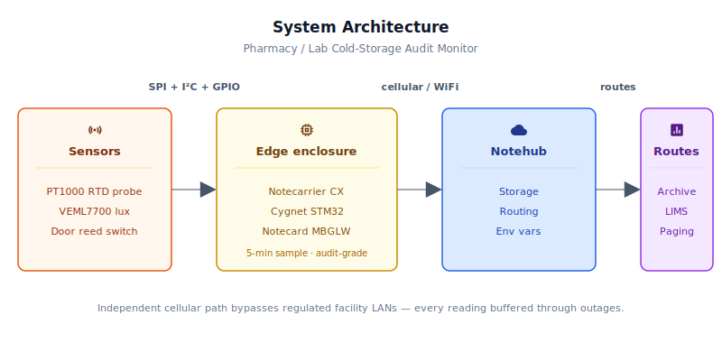
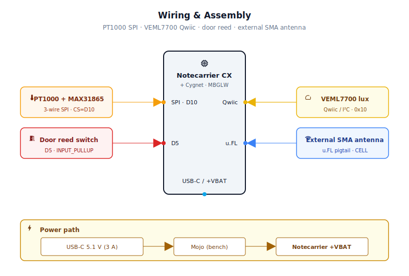
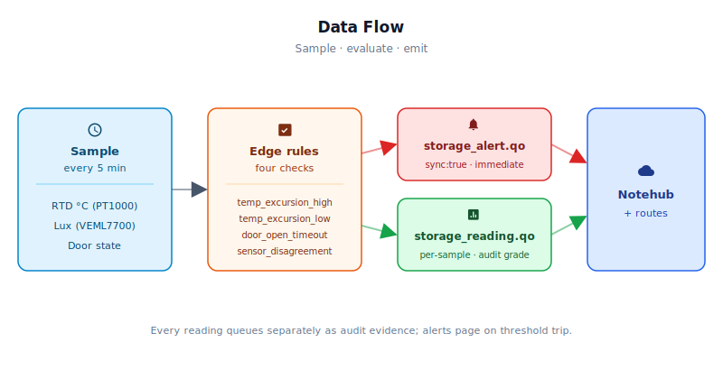

# Pharmacy/Lab Cold-Storage Audit Monitor

<Note>

This reference application is intended to provide inspiration and help you get started quickly. It uses specific hardware choices that may not match your own implementation. Focus on the sections most relevant to your use case. If you'd like to discuss your project and whether it's a good fit for Blues, [feel free to reach out](https://blues.com/landing-pages/accelerators-contact-us/?accelerator=Pharmacy%2FLab%20Cold-Storage%20Audit%20Monitor).

</Note>

A [safety assurance](https://blues.com/safety-assurance/) reference design that gives pharmacies, clinical laboratories, and vaccine depots a continuous, automatically-timestamped temperature record for every refrigerator and freezer in their compliance scope — delivered over a cellular data path that bypasses the facility's regulated network entirely, with immediate alerts when the temperature strays outside its configured range or a door is left open too long.

## 1. Project Overview


**The problem.** Pharmacies, clinical laboratories, and vaccine depots are subject to a patchwork of overlapping regulations — USP Chapter 659 (Packaging and Storage Requirements), FDA 21 CFR Part 211.68, state board-of-pharmacy rules, and for federally funded programs, CDC Vaccine Storage and Handling guidelines. Every one of those frameworks requires automated temperature records with defined excursion thresholds: 2°C–8°C for most refrigerated vaccines and biologics, with documentation of any deviation, its duration, and the corrective action taken.

The problem is not that facilities lack refrigerators — it's that most of them lack automated monitoring. A datalogger that must be manually downloaded, a wall thermometer read once per shift, or a WiFi-connected sensor that goes dark whenever the facility's network hiccups are all insufficient under a regulatory audit. Automated monitoring with individually timestamped readings and immediate excursion alerts is far more defensible than manual spot checks — and it produces a record that is complete even when nobody was watching.

This reference design demonstrates how to close that gap. The Notecarrier CX, with its onboard Cygnet STM32 host, wakes every five minutes to read a high-precision digital temperature sensor, check a magnetic door switch, and correlate both readings against an ambient-light sensor inside the unit. Each wake produces one timestamped reading Note queued in the Notecard's on-device store; the queue flushes to Notehub on the scheduled cellular connection. If the temperature strays outside configured limits, or if the door is left open beyond an acceptable threshold, an alert Note is transmitted immediately — bypassing the batched outbound window and landing in whatever on-call or compliance system the operator routes it to.

**Why Notecard.** Pharmacies and clinical labs operate tightly managed network environments. PCI-compliant retail pharmacy networks, HIPAA-covered clinical networks, and federally regulated vaccine storage programs all share one thing: strict rules against unknown IoT-class devices on the primary LAN. A temperature sensor attached to the pharmacy WiFi is either going to fail a network security review or be quietly firewalled off from the internet. An independent cellular data path sidesteps that entire conversation — the Notecard registers on the carrier's network directly, never touches the facility's LAN, and the IT team never has to issue a network access request or sign a BAA for a refrigerator.

That independence also matters for continuity. Facility WiFi goes down for maintenance, for storms, for power events — sometimes for hours. A WiFi-dependent compliance monitor is exactly the kind of device that silently stops logging at the worst possible moment. The Notecard's store-and-forward queue buffers Notes locally through any connectivity gap and syncs them when the cellular session resumes, with timestamps intact. The audit-evidence record this design produces consists of two streams: **per-sample reading Notes** (one timestamped Note per 5-minute wake, individually queued in the Notecard's flash-backed store) and **immediate alert Notes** (emitted the moment a threshold is tripped, regardless of the scheduled sync cadence). Every individual reading is persisted as a separate Note in the Notecard's on-device flash queue — no aggregation — preserving sample lineage across cellular connectivity gaps so an auditor can reconstruct the exact temperature history and door-event timeline for any window. For an auditor reviewing a weekend excursion event, that buffered record — every individual sample plus any alert Notes that fired — is not a nice-to-have. It is the record. (This store-and-forward guarantee covers cellular and WiFi outages; a separate, shallower host-side retry ring handles the distinct case where the host cannot reach the Notecard over I²C — see [§7 Retry and error handling](#retry-and-error-handling) and [Limitations](#9-limitations-and-next-steps).)

WiFi fallback on the MBGLW is available as a secondary path, but only for sites that provide an explicitly approved, segregated IoT network for the device. Using the facility's primary pharmacy or clinical LAN defeats the network-independence rationale of this design, and a compliance monitor sitting behind a firewall exception is one network policy change away from silent failure.

**Deployment scenario.** A small weatherproof enclosure mounts on the **exterior** of the cold storage unit — never inside the refrigerated compartment (sustained cold and condensation will damage unprotected electronics, and a metal refrigerator body will block cellular signal). The Adafruit MAX31865 amplifier board mounts inside the enclosure; the Adafruit PT1000 probe cable exits through a cable gland and routes into the compartment through the cabinet's manufacturer-provided probe port or door-gasket pass-through (see [§5 Wiring and Assembly](#5-wiring-and-assembly)), placing the stainless-steel probe capsule at the geometric center of the storage volume. The VEML7700 light sensor mounts at the exterior of the door frame — not inside the cold zone — where it detects light spillage when the door is ajar; see [Limitations](#9-limitations-and-next-steps) for condensation-tolerant production placement options. Door switch halves mount on the door and frame. The Notecarrier CX sits in the enclosure, USB-C powered from a wall adapter. The cellular antenna mounts on the exterior of the enclosure where it has line of sight to the network. No network configuration, no IT ticket, no manual download. **For bench development** without a probe routed into a cabinet, a TMP117 breakout (bench library-swap required) mounted inside the enclosure measures exterior ambient air and lets you validate the firmware architecture and cellular data path.

## 2. System Architecture




**Device-side responsibilities.** The Cygnet STM32 host on the Notecarrier CX wakes every `sample_interval_sec` seconds (default 5 minutes), reads all three sensors (MAX31865 via SPI, VEML7700 via I²C, reed switch via GPIO), and evaluates four alert conditions. Between samples, the host is powered down by the Notecard via [`card.attn`](https://dev.blues.io/api-reference/notecard-api/card-requests/#card-attn) sleep mode — the Notecard's ATTN pin drives the Notecarrier CX enable gate, cutting power to the Cygnet entirely. State that must survive the sleep (door-open timestamps, alert cooldown timers) is serialized into the Notecard's flash before sleep and rehydrated at the next wake using the `NotePayloadSaveAndSleep` / `NotePayloadRetrieveAfterSleep` helper pair from the `note-arduino` library.

**Notecard responsibilities.** The Notecard stores [Notes](https://dev.blues.io/api-reference/glossary/#note) in its on-device queue, establishes the cellular (or WiFi) session on the configured [`hub.set`](https://dev.blues.io/api-reference/notecard-api/hub-requests/#hub-set) `outbound` cadence (default 60 minutes), and flushes any `sync:true` alert Notes immediately when the rule fires. The Notecard also maintains a real-time clock synchronized to UTC via Notehub — the `card.time` response provides the epoch timestamps that the firmware uses for door-duration tracking and alert cooldowns. Every Note automatically carries a `when` field with the UTC epoch, giving Notehub an immutable record of when each event was enqueued — provided the Notecard's clock has been synchronized with Notehub at enqueue time. Notes enqueued before the first successful Notehub session (during the initial cellular-registration window) carry an unverified Notecard RTC timestamp and are not audit-grade records; see [Limitations](#9-limitations-and-next-steps). The Notecard handles [environment variable](https://dev.blues.io/guides-and-tutorials/notecard-guides/understanding-environment-variables/) distribution from Notehub, letting operators change temperature thresholds, door-alert timing, and sample cadence without re-flashing firmware.

**Notehub responsibilities.** The Notecard manages its own cellular session against the supported carrier networks worldwide via its embedded global SIM and delivers data to [Notehub](https://dev.blues.io/notehub/notehub-walkthrough/) over the Internet; [Notehub](https://dev.blues.io/notehub/notehub-walkthrough/) ingests events, stores them, and applies project-level routes. Reading and alert Notes arrive in separate [Notefiles](https://dev.blues.io/api-reference/glossary/#notefile) so they can be fanned out to different destinations at different urgencies — readings to a long-term compliance archive, alerts to an on-call paging system or LIMS (laboratory information management system). [Smart Fleets](https://dev.blues.io/notehub/notehub-walkthrough/#using-smart-fleet-rules) can group units by storage type (refrigerator vs. freezer vs. ultra-cold) with different threshold presets applied fleet-wide.

**Routing to the cloud (high level only).** Notehub supports HTTP, MQTT, AWS, Azure, GCP, Snowflake, and several other destinations; route setup is project-specific. See the [Notehub routing docs](https://dev.blues.io/notehub/notehub-walkthrough/#routing-data-with-notehub) — this project ships no specific downstream endpoint.

## 3. Technical Summary


**What you'll have when done:** A Notecarrier CX with a calibrated PT1000 temperature probe, door switch, and light sensor that sends timestamped readings to Notehub every 5 minutes, with immediate alerts on temperature excursions or prolonged door-open events. Readings accumulate in the Notecard's flash-backed queue and sync on a 60-minute cellular schedule — completely independent of facility WiFi.

**Fastest path to first event (no probe):** 
1. Obtain a Notecarrier CX + MBGLW, VEML7700 sensor, and magnetic door switch
2. Wire the three sensors (I²C, GPIO, and Qwiic as shown in [§6](#5-wiring-and-assembly))
3. Clone this repo; paste your Notehub ProductUID into `firmware/cold_storage_audit_monitor/cold_storage_audit_monitor.ino` (line 51)
4. Flash with `arduino-cli compile -b STMicroelectronics:stm32:Blues:pnum=CYGNET firmware/ && arduino-cli upload -b STMicroelectronics:stm32:Blues:pnum=CYGNET -p /dev/ttyACM0 firmware/` (adjust port for your OS — this FQBN matches `firmware/cold_storage_audit_monitor/sketch.yaml`, so omitting `-b` also works when invoked from the sketch directory)
5. Power up; verify readings appear in Notehub within 60 seconds (may take 1–5 minutes on first power for cellular registration)
6. Override thresholds in Notehub **Fleet → Environment** (e.g., `temp_high_alert_c: 8.0`, `temp_low_alert_c: 2.0` for refrigerated storage)

**For production:** Follow §10 and obtain a NIST-calibrated PT1000 probe assembly before regulatory deployment.

Here is a sample Note this device emits:

```json
{
  "file": "storage_reading.qo",
  "body": {
    "temp_c": 4.62,
    "lux": 0.18,
    "door_open": false,
    "door_open_sec": 0,
    "sample_epoch": 1714435200,
    "time_valid": true,
    "dropped_readings": 0,
    "dropped_alerts": 0
  }
}
```

## 4. Hardware Requirements


| Part | Qty | Rationale |
|------|-----|-----------|
| [Notecarrier CX](https://shop.blues.com/products/notecarrier-cx?utm_source=dev-blues&utm_medium=web&utm_campaign=store-link) | 1 | Integrated carrier with an onboard Cygnet STM32 host MCU — no separate MCU needed. ATTN pin wired to the enable gate so the Notecard can cut host power during sleep. |
| [Notecard Cell+WiFi (MBGLW)](https://shop.blues.com/products/notecard?utm_source=dev-blues&utm_medium=web&utm_campaign=store-link) ([datasheet](https://dev.blues.io/datasheets/notecard-datasheet/note-mbglw/)) | 1 | Cellular keeps the monitor on an independent data path, isolated from the facility's regulated network segments. WiFi is available as a fallback only at sites that provide an explicitly approved, segregated IoT network — the facility's primary pharmacy or clinical LAN is not an appropriate fallback. |
| [Blues Mojo](https://shop.blues.com/products/mojo?utm_source=dev-blues&utm_medium=web&utm_campaign=store-link) | 1 | Coulomb counter for bench-top current-draw validation. Inline on the +VBAT rail during development; not deployed in the enclosure. |
| [Adafruit Platinum RTD Sensor — PT1000, 3-Wire, 1 m (Product 3984)](https://www.adafruit.com/product/3984) | 1 | **Production temperature probe.** 316L stainless-steel capsule (4 mm × ~30 mm) on a 1 m cable with three bare wire leads that connect to the MAX31865 terminal blocks. Operating range −50°C to 280°C — covers refrigerated (2–8°C) and standard freezer storage (down to approximately −50°C). **This probe does not cover ultra-cold (−80°C) storage** — a dedicated RTD probe rated to −80°C or below is required for that range and is outside the scope of this reference design. The probe capsule routes into the refrigerated compartment; the cable routes through a dedicated cable gland in the enclosure wall. **Before regulatory deployment, submit this specific probe assembly to an accredited calibration laboratory for a NIST-traceable calibration certificate.** The calibration applies to the individual probe unit; keep the certificate on file with the unit's commissioning documentation. |
| [Adafruit PT1000 RTD Temperature Sensor Amplifier — MAX31865 (Product 3648)](https://www.adafruit.com/product/3648) | 1 | **Production RTD amplifier.** Interfaces the 3-wire PT1000 probe to the Notecarrier CX via hardware SPI (CS on D10). Onboard 4300 Ω reference resistor and 3.3 V regulator; 5 V tolerant. Mounts inside the electronics enclosure. Configure the 2/3-wire solder jumper on the bottom of the board for 3-wire mode before wiring. Firmware uses `rtdAmp.begin(MAX31865_3WIRE)` and `rtdAmp.temperature(1000, 4300.0)`. |
| [SparkFun TMP117 High Precision Temperature Sensor — Qwiic (SEN-15805)](https://www.sparkfun.com/products/15805) | 1 | **Bench substitute only — not the production sensor path.** ±0.1°C accuracy, I²C via Qwiic. Using TMP117 requires swapping the `Adafruit_MAX31865` library for `SparkFun_TMP117` and replacing `readTemperatureC()` in `firmware/cold_storage_audit_monitor/cold_storage_audit_monitor_helpers.cpp`. Mounts inside the enclosure; measures exterior ambient air only. Does not ship with a NIST-traceable calibration certificate. Not a deployable compliance instrument. |
| [Adafruit VEML7700 Lux Sensor — STEMMA QT / Qwiic (Product 4162)](https://www.adafruit.com/product/4162) | 1 | I²C ambient-light sensor, 0–120,000 lux range. In the production build it connects directly to the Notecarrier CX Qwiic port (no TMP117 intermediate). Positioned near the door opening, it detects the interior lamp independently of the door switch — providing a second line of evidence for door-open events and flagging stuck-closed switch states when light and switch disagree. STEMMA QT connector is Qwiic-compatible. **Bench evaluation only** — the unprotected breakout PCB is not suitable for permanent placement in a refrigerating or condensing environment; see [Limitations](#9-limitations-and-next-steps). |
| [SparkFun Magnetic Contact Switch Set (COM-13247)](https://www.sparkfun.com/products/13247) | 1 | Normally-Open (NO) reed switch assembly. Magnet on the door, switch body on the frame. Mechanically simple, no power consumption, and directly connected to a digital GPIO with pull-up — no ADC or signal conditioning required. |
| [Cellular Antenna — 698–2700 MHz, SMA (SparkFun WRL-14987)](https://www.sparkfun.com/products/14987) | 1 | Wideband external antenna covering the LTE-M/Cat-M1 frequency range used by the MBGLW across North American and global deployments, including the 700 MHz band group (LTE Bands 12/13/17) that many carriers use for LTE-M. Must be routed outside the enclosure — a metal insulated enclosure or the body of an adjacent refrigerator will heavily attenuate an internal antenna and can prevent the Notecard from registering on the network. Connects to the SMA-to-u.FL adapter cable below. |
| [SMA to u.FL RF Adapter Cable (Adafruit 851)](https://www.adafruit.com/product/851) | 1 | Connects the Notecarrier CX CELL u.FL port to the SMA external antenna. Route the cable through a cable gland in the enclosure wall. |
| Female-to-female jumper wires, 150 mm, ×6 (available from any electronics distributor) | 1 set | Connects the Adafruit MAX31865 board to the Notecarrier CX dual 16-pin header for the SPI bus (VIN, GND, CLK, SDI, SDO, CS — six wires total). The MAX31865 has 0.1" male header pins; the Notecarrier CX has a standard 0.1" dual-row header. |
| Qwiic cable, 500 mm (e.g. [SparkFun PRT-14429](https://www.sparkfun.com/products/14429)) | 1 | Routes from the Notecarrier CX Qwiic port through the enclosure wall cable gland to the VEML7700 positioned near the door opening. In the production build the VEML7700 connects directly to the Notecarrier CX Qwiic port — there is no TMP117 intermediate in the I²C chain. A longer cable may be needed depending on enclosure placement and door geometry. |
| Qwiic cable, 100 mm (e.g. [SparkFun PRT-14426](https://www.sparkfun.com/products/14426)) | 1 | **Bench validation only — Mojo connection.** Daisy-chains the Mojo Qwiic port from the VEML7700 Qwiic OUT connector during +VBAT bench power validation, extending the I²C bus to the coulomb counter. Not installed in the deployed enclosure. |
| Nylon cable glands, M16 or equivalent, for 5–10 mm cable OD | 3 | Weatherproof strain-relief pass-throughs for the enclosure wall: one for the antenna SMA adapter, one for the PT1000 probe cable, and one for the VEML7700 Qwiic cable. Size to match the cable OD; M16 glands (available from enclosure suppliers or electronics distributors) suit typical Qwiic (~3 mm) and SMA pigtail diameters. The Adafruit PT1000 probe cable is 2.8 mm OD — an M12 gland fits as well. |
| [USB-C Power Supply, 5.1V 3A (Adafruit 4298)](https://www.adafruit.com/product/4298) | 1 | UL-listed, regulated 5.1V USB-C wall adapter for the Notecarrier CX. |
| Weatherproof enclosure, ~6×4×2 in (e.g. Hammond 1554C2BK or equivalent) | 1 | Protects the electronics at the exterior of the cold-storage unit, with a cable gland for the antenna lead and sensor cables. |

All Blues hardware ships with an active SIM including 500 MB of data and 10 years of service — no activation fees, no monthly commitment.

## 5. Wiring and Assembly




**Notecard installation:**

1. Seat the Notecard Cell+WiFi (MBGLW) into the M.2 slot on the Notecarrier CX — the card inserts at a shallow angle and clicks flat, then the retaining screw locks it down.
2. Connect the SMA-to-u.FL adapter cable (Adafruit 851) to the **CELL** u.FL port on the Notecarrier CX. This is the primary cellular antenna connection; do not confuse it with any GPS u.FL port.
3. Route the adapter cable's SMA end through a cable gland in the enclosure wall. Screw the external SMA antenna (SparkFun WRL-14987) onto the SMA bulkhead on the outside of the enclosure.

**Enclosure location:**

Mount the electronics enclosure on the **exterior** of the cold-storage unit — never inside the refrigerated compartment. Two reasons: first, a metal insulated refrigerator body or adjacent metal surfaces will heavily attenuate the cellular radio signal, which can prevent network registration entirely; second, sustained condensation inside a refrigerated metal box will eventually damage unprotected electronics. A sealed weatherproof enclosure (e.g. Hammond 1554C2BK) mounted on the exterior side of the cabinet, with sensor cables entering through cable glands, keeps the radio in ambient air where it can see the network.

The VEML7700 connects to the Notecarrier CX via Qwiic (JST-SH 4-pin, 3.3 V, GND, SDA, SCL) with onboard pull-up resistors. The MAX31865 RTD amplifier uses the SPI bus on the dual 16-pin header (see [RTD temperature amplifier](#rtd-temperature-amplifier-max31865)). The door switch uses only a digital GPIO and GND from the dual 16-pin header.

**I²C sensor chain:**

- Notecarrier CX Qwiic connector → 500 mm Qwiic cable → VEML7700 Qwiic IN. The cable exits the enclosure through a dedicated cable gland and places the VEML7700 near the exterior of the door opening where it can detect the interior lamp when the door is open. In the production build, the VEML7700 connects **directly** to the Notecarrier CX Qwiic port — there is no TMP117 in the I²C chain. The MAX31865 RTD amplifier connects via SPI (see [RTD temperature amplifier](#rtd-temperature-amplifier-max31865) below). Do not permanently mount the bare VEML7700 PCB inside the refrigerated compartment — see [Light sensor placement](#light-sensor-placement) and [Limitations](#9-limitations-and-next-steps).
- VEML7700 is powered from the Qwiic 3.3 V rail; no additional power wiring needed.
- VEML7700 I²C address: 0x10 (fixed).

**Door switch:**

- Reed switch terminal A → **D5** on the Notecarrier CX dual 16-pin header.
- Reed switch terminal B → **GND** on the Notecarrier CX header (adjacent GND pin).
- Firmware enables `INPUT_PULLUP` on D5. Door closed (magnet present): reed contacts close, D5 pulled LOW. Door open (magnet removed): reed contacts open, pull-up drives D5 HIGH.
- Mount the magnet half on the door and the switch half on the frame within 20 mm of each other (COM-13247 rated operating gap: 20 ± 5 mm).

### RTD temperature amplifier (MAX31865)

The Adafruit MAX31865 (Product 3648) mounts inside the enclosure and connects to the Notecarrier CX dual 16-pin header using six female-to-female jumper wires over the hardware SPI bus:

| MAX31865 pin | Notecarrier CX header pin | Notes |
|---|---|---|
| Vin | +3V3_OUT | 3.3 V supply |
| GND | GND | Common ground |
| CLK | SCK | SPI clock |
| SDI | **MISO** (silkscreen label) | On Notecarrier CX v1.3 the MOSI and MISO silkscreen labels are swapped — the pin labeled **MISO** on the board is the actual master-out (MOSI) line. Connect MAX31865 SDI (data in to the chip) here. |
| SDO | **MOSI** (silkscreen label) | The pin labeled **MOSI** on the board is the actual master-in (MISO) line. Connect MAX31865 SDO (data out from the chip) here. |
| CS | D10 | Software chip-select |

> ⚠️ **Notecarrier CX v1.3 label swap.** The MOSI and MISO pin labels are transposed on the CX v1.3 board silkscreen (see [Notecarrier CX datasheet](https://dev.blues.io/datasheets/notecarrier-datasheet/notecarrier-cx-v1-3/)). The table above gives the correct physical connections. The Arduino STM32 SPI library drives the correct hardware-peripheral lines regardless of the silkscreen; the swap only affects how you run the jumper wires.

**PT1000 probe connection.** The Adafruit PT1000 probe (Product 3984) terminates in three bare wires. Before wiring, close the 2/3-wire solder jumper on the bottom of the MAX31865 board for 3-wire RTD mode, following the [Adafruit MAX31865 guide](https://learn.adafruit.com/adafruit-max31865-rtd-pt100-amplifier/). Connect the wires to the MAX31865 screw terminal blocks as described in that guide for a 3-wire PT1000. The firmware calls `rtdAmp.begin(MAX31865_3WIRE)` at startup to match.

Route the PT1000 probe cable from the MAX31865 terminal blocks inside the enclosure out through a dedicated cable gland in the enclosure wall, then into the refrigerated compartment through the cabinet's probe port or door-gasket pass-through (see [Temperature sensor placement](#temperature-sensor-placement) below). The 316L stainless-steel capsule at the end of the 1 m cable is rated to −50°C to 280°C and is the element that enters the cold zone.

### Temperature sensor placement

A probe assembly has a cable-mounted sensing element — typically a stainless-steel tip on a flexible lead — that routes from the enclosure into the refrigerated compartment through one of the following paths:

- **Preferred — manufacturer probe port.** Many pharmacy-grade and laboratory refrigerators/freezers include a factory-drilled, gasketed probe port (typically a rubber plug or compression fitting in the cabinet wall) specifically for external sensor cables. Consult the equipment manual and use this port if present.
- **Alternative — door-gasket dress.** Route the probe lead through the hinge-side corner of the door seal gasket, where the seal compresses the least and cable crush is minimal. Verify the door closes and latches normally after routing.

Position the probe tip at the geometric center of the compartment, away from air vents and door seals, following CDC and USP 659 sensor placement recommendations.

> ⚠️ **Do not drill or punch through the cabinet wall or door.** Cold-storage cabinets contain refrigerant lines and sealed foam insulation whose locations are not visible from the exterior. Unauthorized penetrations can sever a refrigerant line, compromise the insulation envelope, create a condensation path into the electronics, and void the equipment's safety approvals.

**Bench substitute.** For firmware development and testing, the SparkFun TMP117 breakout (SEN-15805) can be connected via a 100 mm Qwiic cable to the Notecarrier CX. Using the TMP117 requires replacing `#include <Adafruit_MAX31865.h>` with `#include <SparkFun_TMP117.h>`, changing the `rtdAmp` global to a `TMP117 tempSensor` object, and replacing `readTemperatureC()` in `firmware/cold_storage_audit_monitor/cold_storage_audit_monitor_helpers.cpp` with the TMP117 `dataReady()` / `readTempC()` poll-based implementation. The TMP117 breakout mounts inside the enclosure and measures exterior ambient air only — it is not a cable-mounted probe and does not measure compartment interior temperature. Appropriate only for development and the functional validation described in [Validation and Testing](#9-validation-and-testing).

### Light sensor placement

- For bench evaluation, position the VEML7700 at the exterior of the door opening — near the hinge-side door edge or door frame — with its sensing window facing the interior lamp. At that location the sensor is not inside the cold zone and is not exposed to sustained condensation. Do not permanently mount the bare VEML7700 PCB inside the refrigerated compartment; see [Limitations](#9-limitations-and-next-steps) for production placement options.
- **Only use the `sensor_disagreement` rule on units with a door-actuated interior lamp** (the lamp turns on when the door opens and off when it closes). The rule fires when lux exceeds `door_lux_threshold` while the door switch reads CLOSED — it catches a **stuck-closed or failed-closed reed switch**, not a missing magnet or disconnected switch (those drive D5 HIGH, making `door_open = true`, which does not meet the alert condition). Do not use this rule on always-on-lamp units without raising `door_lux_threshold` to `120000.0` in Notehub; see [Limitations](#9-limitations-and-next-steps).

**Power:**

- USB-C wall adapter → Notecarrier CX USB-C port (normal bench and deployment use).
- For Mojo bench validation: use a bench power supply (3.7–4.2 V, LiPo-range) as the source. **Do not connect the USB-C cable during this measurement** — with VUSB absent the Notecard enters its deepest idle state and the µA-level idle figures become visible on the VBAT rail. Connect the supply positive to Mojo **BAT+** and run Mojo **LOAD+** to the Notecarrier CX **+VBAT** pad on the dual 16-pin header; return the negative rail from Notecarrier CX **GND** back to the supply. Connect Mojo's Qwiic port to the VEML7700 Qwiic OUT connector using the 100 mm bench Qwiic cable listed in [§4 Hardware Requirements](#4-hardware-requirements) for this purpose, daisy-chaining Mojo onto the end of the I²C bus. This arrangement measures the total VBAT rail current (Notecard plus Cygnet when active) and reveals the classic sleep-wake-cellular current profile described in Validation.

## 6. Notehub Setup


1. **Create a project.** Sign up at [notehub.io](https://notehub.io) and [create a project](https://dev.blues.io/quickstart/notecard-quickstart/notecard-and-notecarrier-pi/#set-up-notehub). Copy the [ProductUID](https://dev.blues.io/notehub/notehub-walkthrough/#finding-a-productuid) and paste it into `firmware/cold_storage_audit_monitor/cold_storage_audit_monitor.ino` line 51 as `PRODUCT_UID`.

2. **Claim the Notecard.** Power the unit; on first cellular session the Notecard associates with your project automatically. Check Notehub **Events** tab to confirm the device has synced.

3. **Create Fleets.** [Fleets](https://dev.blues.io/guides-and-tutorials/fleet-admin-guide/) group devices for shared configuration and routing. A practical starting structure for cold-chain monitoring is one fleet per storage class:
   - `refrigerated` — 2°C to 8°C (vaccines, biologics)
   - `frozen` — −25°C to −10°C (certain vaccines, reagents)
   - `ambient` — 15°C to 30°C (room-temperature drugs)

   Apply the appropriate temperature thresholds at the fleet level via environment variables so that a single firmware image services all storage classes without recompilation. Use [Smart Fleets](https://dev.blues.io/notehub/notehub-walkthrough/#using-smart-fleet-rules) to auto-assign devices based on a device-level environment variable (e.g., `storage_class`).

4. **Set environment variables.** In Notehub, navigate to **Fleet → Environment**. All variables below are optional; firmware defaults are shown. Any variable set in Notehub overrides the compile-time default on the device's next inbound sync — no reflash required.

   > **Bench vs. production defaults.** The compile-time defaults (`temp_high_alert_c = 30.0`, `temp_low_alert_c = 15.0`) are sized for the bench-mounted exterior temperature sensor, which reads room temperature. A bench unit at ~22 °C will produce zero temperature alerts with these defaults. For production refrigerated storage (2–8°C range per USP 659), override the thresholds in the Fleet Environment variables as shown in the table below — no reflash required.

   | Variable | Bench default | Production (refrigerated) | Purpose |
   |---|---|---|---|
   | `temp_high_alert_c` | `30.0` | `8.0` | Temperature (°C) above which `temp_excursion_high` fires. Set to `8.0` for USP 659 refrigerated storage (vaccines, biologics). |
   | `temp_low_alert_c` | `15.0` | `2.0` | Temperature (°C) below which `temp_excursion_low` fires. Set to `2.0` for USP 659 refrigerated storage. |
   | `door_open_alert_min` | `10` | `10` | Minutes a door must be continuously open before `door_open_timeout` fires. |
   | `alert_cooldown_min` | `30` | `30` | Minimum minutes between successive alerts of the same type. Prevents alarm fatigue during a slow-developing excursion. |
   | `sample_interval_sec` | `300` | `300` | Seconds between sensor readings (minimum 60 enforced in firmware). Reducing this value increases per-sample Note volume proportionally. At 5 minutes (300 s), one bench unit produces ~288 reading Notes per day. |
   | `door_lux_threshold` | `5.0` | `5.0` | Lux value above which the interior is considered lit for the `sensor_disagreement` rule. Set to `120000.0` to disable the rule without a firmware rebuild — required on lamp-free units and on always-on-lamp units where the rule causes persistent false positives. |

   **Example:** To set `temp_high_alert_c` to `8.0` in the Fleet Environment, click **+ Add** and enter:
   ```
   Key: temp_high_alert_c
   Type: Number
   Value: 8.0
   ```

5. **Configure routes.** In Notehub, add one [route](https://dev.blues.io/notehub/notehub-walkthrough/#routing-data-with-notehub) for `storage_alert.qo` (to an on-call paging system, LIMS, or compliance inbox) and a second for `storage_reading.qo` (to a long-term time-series archive or regulatory data repository). Each `storage_reading.qo` Note represents one 5-minute sample — at the default interval that is 288 Notes per device per day, each individually timestamped. Keeping the two Notefiles separate at the source means each can be delivered to a different destination at a different urgency without any filter logic in the route.

   **Example Notehub output** (from the **Events** tab, `storage_reading.qo`):
   ```json
   {
     "file": "storage_reading.qo",
     "body": {
       "temp_c": 4.62,
       "lux": 0.18,
       "door_open": false,
       "door_open_sec": 0,
       "sample_epoch": 1714435200,
       "time_valid": true,
       "dropped_readings": 0,
       "dropped_alerts": 0
     }
   }
   ```
   **Example alert** (`storage_alert.qo` on excursion):
   ```json
   {
     "file": "storage_alert.qo",
     "body": {
       "alert": "temp_excursion_high",
       "temp_c": 9.2,
       "lux": 0.12,
       "door_open": false,
       "door_open_sec": 0,
       "time_valid": true,
       "event_epoch": 1714435200
     },
     "sync": true
   }
   ```

## 7. Firmware Design


The sketch is split across three files, all directly under `firmware/`:

| File | Contents |
|---|---|
| [`firmware/cold_storage_audit_monitor/cold_storage_audit_monitor.ino`](firmware/cold_storage_audit_monitor/cold_storage_audit_monitor.ino) | Entry points (`setup`, `loop`), Notecard configuration, template definition, and the per-wake sample cycle |
| [`firmware/cold_storage_audit_monitor/cold_storage_audit_monitor_helpers.h`](firmware/cold_storage_audit_monitor/cold_storage_audit_monitor_helpers.h) | `AppState` struct, shared `#define` constants, `extern` globals, and helper function prototypes |
| [`firmware/cold_storage_audit_monitor/cold_storage_audit_monitor_helpers.cpp`](firmware/cold_storage_audit_monitor/cold_storage_audit_monitor_helpers.cpp) | Sensor reads, env-var parsing, `sendReading`, `sendAlert`, and `goToSleep` implementations |

Dependencies:
- Arduino core for STM32 ([`stm32duino/Arduino_Core_STM32`](https://github.com/stm32duino/Arduino_Core_STM32)).
- [`Blues Wireless Notecard`](https://github.com/blues/note-arduino) (the `note-arduino` library). Install via the Arduino Library Manager or `arduino-cli lib install "Blues Wireless Notecard"`.
- [`Adafruit MAX31865`](https://github.com/adafruit/Adafruit_MAX31865) **≥ v1.1.0** (returns `bool` from `begin()`). Install via Library Manager: search "Adafruit MAX31865". Requires Adafruit BusIO.
- [`Adafruit VEML7700`](https://github.com/adafruit/Adafruit_VEML7700). Install via Library Manager: search "Adafruit VEML7700". Requires Adafruit BusIO.

### Modules

| Responsibility | Function | File |
|---|---|---|
| Notecard configuration (`hub.set`, motion-mode quiet) | `notecardConfigure` | `.ino` |
| Notefile template definition (cold boot only) | `defineTemplates` | `.ino` |
| Threshold evaluation, door-state machine, alert emission | `runSampleCycle` | `.ino` |
| Environment-variable fetch (every wake) | `fetchEnvOverrides` | `_helpers.cpp` |
| MAX31865 (PT1000) / VEML7700 / reed switch reads | `readTemperatureC`, `readLightLux`, `readDoorOpen` | `_helpers.cpp` |
| UTC epoch from Notecard RTC | `getEpochTime` | `_helpers.cpp` |
| Per-sample reading Note | `sendReading` | `_helpers.cpp` |
| Immediate-sync alert Note | `sendAlert` | `_helpers.cpp` |
| State serialisation and host power-down | `goToSleep` | `_helpers.cpp` |

### Sensor reading strategy

- **MAX31865 (PT1000).** The MAX31865 runs in continuous-conversion mode from `begin()` onward — no `dataReady()` poll is needed. Each `readTemperatureC()` call invokes `rtdAmp.temperature(1000, 4300.0)` (PT1000: R₀ = 1000 Ω; Adafruit board Rref = 4300 Ω), then immediately checks `readFault()`. A non-zero fault byte (RTD open, short-to-VCC, short-to-GND, or over/under-voltage) clears the fault register and returns `NAN`; the reading Note's `temp_c` field carries the `−9999` sentinel so downstream analytics can distinguish a probe failure from a legitimate near-zero temperature reading. Values outside −60°C to 120°C are also rejected as out-of-range and produce the same sentinel.

- **VEML7700.** `readLux()` uses the fixed gain (`VEML7700_GAIN_1`) and integration time (`VEML7700_IT_100MS`) configured once in `setup()`, providing a consistent lux reading across the 0–1000 lux range typical of a cold-storage interior (nearly dark when closed, 50–500 lux under the interior lamp when open). Negative returns indicate a communication fault and produce `NAN`; the reading Note's `lux` field carries the sentinel `−1.0` on a faulted sample (lux is always ≥ 0 in normal operation, so −1.0 is unambiguously a fault marker).

- **Reed switch.** A 10 ms software debounce — two reads separated by a short delay — prevents a mechanical contact bounce from registering as a spurious door event.

### Event payload design

One template-backed reading Note (`storage_reading.qo`) enqueued every 5-minute wake; untemplated alert Notes (`storage_alert.qo`) transmitted immediately via `sync:true`. Templates compress each reading to a fixed-length binary record on the wire.

Sample reading Note body (as it appears in Notehub after the cellular session). All eight template fields are always present:

```json
{
  "file": "storage_reading.qo",
  "body": {
    "temp_c": 4.62,
    "lux": 0.18,
    "door_open": false,
    "door_open_sec": 0,
    "sample_epoch": 1714435200,
    "time_valid": true,
    "dropped_readings": 0,
    "dropped_alerts": 0
  }
}
```

`sample_epoch` is the UTC epoch captured at sensor-read time (preserved through retries so that a retried Note always carries the original sample timestamp in its body, even though the Notecard envelope reflects retry time). `time_valid` is `false` on samples taken before the Notecard RTC has synced with Notehub. `dropped_readings` and `dropped_alerts` are cumulative counters of host-side ring-buffer overflows — they count readings or alerts that could not be enqueued into the Notecard over I²C, not cellular outages (cellular outages are handled transparently by the Notecard's on-device queue). Both counters are reset to 0 after each successful `storage_reading.qo` enqueue; non-zero values in Notehub indicate entries dropped because the host could not reach the Notecard for more than four consecutive wakes.

Sample alert Note body (temperature excursion, immediately synced). All seven body fields are always present:

```json
{
  "file": "storage_alert.qo",
  "body": {
    "alert": "temp_excursion_high",
    "temp_c": 9.2,
    "lux": 0.12,
    "door_open": false,
    "door_open_sec": 0,
    "time_valid": true,
    "event_epoch": 1714435200
  },
  "sync": true
}
```

`event_epoch` is the UTC epoch when the alert condition was first detected — preserved across retries so that a retried Note's body always carries the authoritative original trigger time even though the Notecard envelope reflects retry time. `time_valid` is `false` when the Notecard RTC had not yet synced at the moment the alert fired; downstream audit queries should treat those early-boot alerts as commissioning data rather than audit-grade records.

Four alert types are defined: `temp_excursion_high`, `temp_excursion_low`, `door_open_timeout`, and `sensor_disagreement` (interior light ON while door switch reads CLOSED — indicates a possible stuck-closed or failed-closed reed switch; only meaningful on units with a door-actuated interior lamp — see [Limitations](#9-limitations-and-next-steps)). Each is rate-limited by `alert_cooldown_min` to prevent alert fatigue during a sustained excursion.

### Low-power strategy

Sampling every 5 minutes on a line-powered device does not strictly require aggressive power management, but keeping the host asleep the rest of the time has two practical benefits: reduced heat inside the enclosure (a cold-storage monitor that generates meaningful self-heating is a calibration problem), and a firmware pattern that ports cleanly to a battery-backed variant without a rewrite.

After each sample cycle, `goToSleep()` calls `NotePayloadSaveAndSleep`, which serializes the `AppState` struct into the Notecard's flash and issues `card.attn` with `mode:sleep` and the configured sleep duration. The Notecard's ATTN pin then drives the Notecarrier CX enable gate LOW, cutting power to the Cygnet entirely between wakes. Sampling and transmitting are deliberately decoupled: the firmware samples every 5 minutes and enqueues one reading Note per wake, then flushes the accumulated queue in a single cellular session on the 60-minute outbound cadence — alerts are the only thing that break that batch.

**Power path and current expectations.** On the **deployed USB-C wall-power path** (VUSB present), the Notecard's idle draw is higher than the µA-level figures published for VBAT-only operation — the USB interface and monitoring circuits remain active while VUSB is asserted. The benefit the ATTN-based sleep still delivers on USB-C is **host MCU power-down**: the Cygnet is fully unpowered between wakes, eliminating its contribution and any self-heating from the host during the 5-minute idle. The Notecard's own USB-C idle current is documented in the [MBGLW DC characteristics table](https://dev.blues.io/datasheets/notecard-datasheet/note-mbglw/); the quantitative idle table in [§10](#9-validation-and-testing) applies only to the **+VBAT bench configuration with VUSB absent**. The Cygnet-active phase is estimated at **3–10 mA** — no Blues factory specification exists for this combined phase, and this figure has not been validated against production hardware. Treat it as a commissioning target only; measure the actual draw on your bench with a Mojo or current probe before finalising any power budget.

### Retry and error handling

- The initial Notecard configuration on cold boot (`hub.set`) uses a custom retry loop of up to five attempts with a 2-second delay between each, covering the I²C bus-readiness window on cold boot. Both transport failures (NULL response) and Notecard-reported errors are retried, so a transient startup fault cannot permanently skip the configuration step.
- `fetchEnvOverrides` checks both the response pointer and the `err` field before applying values; a failed env fetch leaves the existing thresholds intact rather than reverting to defaults.
- Sensor `NAN` returns cause the reading Note to carry per-field sentinels: `temp_c` faults write `−9999`; `lux` faults write `−1.0`. Downstream parsers must check the correct sentinel per field — `−9999` in `temp_c` distinguishes a MAX31865/probe failure or fault from a legitimate near-zero temperature reading, while `−1.0` in `lux` is unambiguously a VEML7700 fault (lux cannot be negative).
- Alert de-duplication via `alert_cooldown_min` (default 30 minutes per alert type) prevents a sustained excursion from flooding the on-call channel — the first alert fires within one sample cycle of the event; subsequent re-alerts fire only after the cooldown period.

### Key code snippet 1: note.template definition (compression via fixed-length binary encoding)

The template encodes each reading as a compact fixed-length binary record for the Notehub wire and on-device storage, reducing per-Note overhead compared to variable-length JSON. Template field codes: `14.1` = 4-byte IEEE 754 float, `24` = 4-byte unsigned int, `true` = boolean. When the template is active, the Notecard encodes each `storage_reading.qo` Note as fixed-length binary; Notehub decodes it back to JSON for your routes.

```cpp
J *req = notecard.newRequest("note.template");
JAddStringToObject(req, "file", NOTEFILE_READING);
JAddNumberToObject(req, "port", 50);
J *body = JAddObjectToObject(req, "body");
// 14.1 = 4-byte IEEE 754 float; 24 = 4-byte unsigned int; true = boolean
JAddNumberToObject(body, "temp_c",        14.1);  // temperature reading in °C
JAddNumberToObject(body, "lux",           14.1);  // ambient illuminance in lux
JAddNumberToObject(body, "door_open_sec", 24);    // seconds door has been continuously open
JAddBoolToObject(body,   "door_open",     true);  // door state at reading time
notecard.sendRequest(req);
```

### Key code snippet 2: immediate-sync alert

`sync:true` bypasses the scheduled outbound window. The Notecard opens a cellular session within seconds of receiving this request and delivers the Note to Notehub before going back to idle. `event_epoch` carries the original trigger time so downstream audit queries see the authoritative timestamp even when this is a retried send.

```cpp
J *req = notecard.newRequest("note.add");
JAddStringToObject(req, "file", NOTEFILE_ALERT);
JAddBoolToObject(req, "sync", true);
J *body = JAddObjectToObject(req, "body");
JAddStringToObject(body, "alert",         alert_type);
JAddNumberToObject(body, "temp_c",        (double)temp_c);
JAddNumberToObject(body, "lux",           (double)lux);
JAddBoolToObject(body,   "door_open",     door_open);
JAddNumberToObject(body, "door_open_sec", (int)door_open_sec);
JAddBoolToObject(body,   "time_valid",    time_valid);
JAddNumberToObject(body, "event_epoch",   (double)event_epoch);
notecard.sendRequest(req);
```

### Key code snippet 3: state persistence across sleep

`NotePayloadSaveAndSleep` serializes the AppState struct into Notecard flash and issues `card.attn` sleep. The next wake calls `NotePayloadRetrieveAfterSleep` in `setup()` to restore door-open timestamps, alert cooldown state, and runtime configuration.

```cpp
// Saving state and sleeping (end of each sample cycle):
NotePayloadDesc payload = {0, 0, 0};
NotePayloadAddSegment(&payload, STATE_SEG_ID, &state, sizeof(state));
NotePayloadSaveAndSleep(&payload, state.sample_interval_sec, NULL);

// Restoring state on wake (in setup()):
NotePayloadDesc payload;
bool ok = NotePayloadRetrieveAfterSleep(&payload);
if (ok) {
    ok &= NotePayloadGetSegment(&payload, STATE_SEG_ID, &state, sizeof(state));
    NotePayloadFree(&payload);
}
```

### Key code snippet 4: light/door sensor disagreement

The VEML7700 provides an independent second opinion on door state. On a door-actuated-lamp unit, if the interior light is on but the reed switch says the door is closed, this indicates a stuck-closed or failed-closed reed switch — the switch contacts remain closed (D5 LOW) even though the interior lamp is lit. Note that a disconnected switch or displaced magnet would drive D5 HIGH (`door_open = true`) and would NOT trigger this path; those failure modes make the firmware believe the door is open, which is the opposite condition.

```cpp
bool light_on = (!isnan(lux) && lux > state.lux_threshold);
if (light_on && !door_open && cooldown_ok) {
    sendAlert("sensor_disagreement", temp_c, lux, false, 0);
}
```

## 8. Data Flow




Every `sample_interval_sec` (default 5 minutes) the Cygnet reads temperature, lux, and door state. Four independent alert rules run against every sample:

- **`temp_excursion_high`** — temperature above `temp_high_alert_c` (bench default 30.0°C; set to 8.0°C in Notehub for USP 659 refrigerated storage). Fired on the first excursion reading; re-arms after `alert_cooldown_min` if the temperature remains out of range.
- **`temp_excursion_low`** — temperature below `temp_low_alert_c` (bench default 15.0°C; set to 2.0°C in Notehub for USP 659 refrigerated storage). Same cadence.
- **`door_open_timeout`** — door continuously open for more than `door_open_alert_min` (default 10 minutes). Evaluated by comparing the current epoch against the stored `door_open_since` timestamp.
- **`sensor_disagreement`** — interior light above `door_lux_threshold` while the reed switch reports closed, indicating a possible stuck-closed or failed-closed switch state. Treated as a maintenance alert rather than a compliance excursion. Only meaningful on units with a door-actuated interior lamp; causes persistent false positives on always-on-lamp units unless `door_lux_threshold` is raised — see [Limitations](#9-limitations-and-next-steps).

**Collected.** On each 5-minute wake: temperature (°C), ambient lux, door-open boolean, current door-open duration (seconds), UTC epoch.

**Transmitted.**
- `storage_reading.qo` — one templated Note **per wake** (default 288 Notes/day at the 5-minute sample interval). Each Note carries the instantaneous temperature, ambient lux, door state, and the elapsed seconds the door has been continuously open at reading time. Notes accumulate in the Notecard's flash-backed queue and flush in a batch on the scheduled 60-minute cellular outbound session. If a cellular outage spans multiple outbound windows, queued Notes flush when connectivity returns with their original UTC timestamps intact — up to the Notecard's on-device storage limit. Individual sample lineage is preserved for the depth of the Notecard queue across cellular and WiFi outages; an extended outage of several consecutive days may exhaust on-device storage and produce gaps in the record (see [Limitations](#9-limitations-and-next-steps)). **This is distinct from the host-side retry ring:** the firmware also maintains a 4-entry ring buffer for the case where the host cannot reach the Notecard over I²C (e.g., a transient bus fault). If the host cannot enqueue into the Notecard for more than four consecutive wakes, the oldest buffered reading is overwritten and counted in `dropped_readings` — it is not preserved. Normal cellular outages never trigger this path; only an I²C or Notecard-unreachable condition does.
- `storage_alert.qo` — one Note per rule trip (rate-limited by `alert_cooldown_min`), with `sync:true` to open an immediate cellular session regardless of the scheduled outbound cadence.

**Routed.** Both Notefiles land in Notehub. From there, routes can deliver `storage_alert.qo` to a paging or ticketing system in near-real time, and `storage_reading.qo` to a long-term compliance archive or LIMS system. Because the Notefiles are distinct at the source, no filtering logic is needed in the route configuration — each destination subscribes to exactly the volume it needs.

## 9. Validation and Testing


**Startup time-acquisition window.** All alert logic (temperature excursion, door timeout, sensor disagreement) and door-duration tracking are gated on the Notecard returning a valid UTC epoch from `card.time` (firmware guard: `now > 0`). On first power-on, the Notecard must register on the cellular network and sync time with Notehub before `card.time` returns a non-zero value; this typically takes one to several minutes but can be longer in marginal-signal environments. During this initial window the device reads sensors and enqueues reading Notes with **unverified timestamps**, but **no alerts fire**. The Notecard's onboard RTC is not synchronized until the first Notehub session completes, so the `when` field on those early Notes may be inaccurate; treat Notes emitted during this window as commissioning-only data rather than audit-grade records. Door timing specifically requires a valid epoch: if the door is open before `card.time` returns non-zero, `door_open_since` is not set and `door_open_sec` in the reading Note will read zero; duration tracking begins only on the first sample where both the door is seen open and the epoch is valid. Plan for a commissioning warm-up period of at least 5 minutes before relying on alert delivery, door-duration accuracy, or audit-grade UTC timestamps in reading Notes.

**Expected steady-state behavior.** A correctly-functioning bench unit at room temperature — with the compile-time default thresholds of 15 °C (low) and 30 °C (high) — generates one `storage_reading.qo` Note per 5-minute wake (288 per day at the default interval) and zero `storage_alert.qo` Notes. Notes accumulate in the Notecard queue and are delivered in a batch on each 60-minute cellular outbound session. During commissioning, verify that `temp_c` values in consecutive reading Notes are stable and within the configured range; a `−9999` in `temp_c` indicates a MAX31865/probe fault or SPI failure on that sample, and a `−1.0` in `lux` indicates a VEML7700 fault. If a production Notehub fleet has already overridden `temp_high_alert_c` to `8.0` and `temp_low_alert_c` to `2.0`, the bench-mounted exterior sensor will immediately trip `temp_excursion_high` at room temperature — expected behavior given that the sensor is not inside a refrigerated compartment.

**Threshold smoke test.** Set `temp_high_alert_c` to a value slightly **below** the current actual temperature using the Notehub device environment variable UI. The alert condition is `temp_c > temp_high_alert_c`, so the threshold must be below the current reading for the condition to be met — for example, if the sensor reads 22°C, set `temp_high_alert_c` to `20.0`. The next inbound sync delivers the new threshold; the next sample cycle trips the alert. The `storage_alert.qo` Note should appear in Notehub within one cellular-session window of the alert emission (typically under 60 seconds). Restore the original threshold and confirm that no further alerts fire after the cooldown period.

**Door-event test.** After the initial time-acquisition window, open the cold-storage door and hold it open past `door_open_alert_min`. Verify that a `door_open_timeout` alert Note arrives in Notehub. Close the door and confirm that the next `storage_reading.qo` Note shows `door_open: false` and `door_open_sec: 0`; the Notes recorded while the door was open should show `door_open: true` with incrementing `door_open_sec` values.

**Sensor-disagreement test.** The rule fires only when `lux > door_lux_threshold` AND the door switch reads CLOSED (`door_open = false`, D5 LOW). Disconnecting the switch or removing the magnet drives D5 HIGH (`door_open = true`), which does **not** meet the alert condition — do not use those as the test stimulus. To trigger the alert on a door-actuated-lamp unit: hold the door magnet directly against the reed switch body while opening the door, so the switch stays CLOSED (D5 LOW) while the interior lamp comes on. Alternatively, force D5 LOW externally (short D5 to GND on the header to simulate a stuck-closed switch) while shining a flashlight at the VEML7700. The firmware should emit a `sensor_disagreement` alert on the next sample cycle.

**Power validation with Mojo.** The [Mojo](https://dev.blues.io/datasheets/mojo-datasheet/) is a coulomb counter that reports cumulative mAh over its Qwiic connection. During bench validation, wire it inline on the Notecarrier CX +VBAT rail with a bench LiPo-range supply and **no USB-C cable connected** (see [Wiring and Assembly](#5-wiring-and-assembly) for the complete bench setup). The figures below apply to this **+VBAT bench configuration with VUSB absent only** — they do not represent USB-C deployed operation. Notecard idle and cellular-session figures are drawn from the [MBGLW datasheet](https://dev.blues.io/datasheets/notecard-datasheet/note-mbglw/) and the Blues [low-power firmware design guide](https://dev.blues.io/notecard/notecard-walkthrough/low-power-firmware-design/); the Cygnet-active range is a bench-measured commissioning target, not a factory specification. Actual draw varies with signal quality, network registration time, and Note payload size:

| Phase | Expected current — +VBAT bench, VUSB absent |
|---|---|
| Notecard idle (between samples; Cygnet OFF via ATTN) | ~8–18 µA — Notecard in deepest low-power state, Cygnet fully unpowered |
| Cygnet active (sensor reads, ~2–4 s per wake) | ~3–10 mA estimated commissioning target (no factory specification; to be measured on your bench) — Cygnet STM32 running plus MAX31865 (SPI) and VEML7700 (I²C); Notecard radio off |
| Cellular session (alert or hourly sync) | 250 mA typical; up to 2000 mA peak during LTE-M transmit bursts — per [MBGLW datasheet](https://dev.blues.io/datasheets/notecard-datasheet/note-mbglw/) VMODEM DC characteristics |

On the **+VBAT bench setup (VUSB absent)** a Mojo trace for a healthy 24-hour period shows: a quiet baseline of single-digit µA broken by small milliamp blips every 5 minutes (Cygnet wake), and one larger burst per hour lasting 20–60 seconds (cellular outbound session). If the baseline is persistently above ~1 mA, the Cygnet is not sleeping — investigate the ATTN pin wiring and the `NotePayloadSaveAndSleep` call. If the hourly burst is absent, the Notecard may not have registered on the network; check the antenna connection and `hub.status` via the Notehub in-browser terminal.

On the **deployed USB-C wall-power path** (VUSB present), the Notecard's main supply comes through the USB-C rail — not through +VBAT. A Mojo wired inline on the +VBAT header pad while USB-C is connected is **not** inline with the actual supply path and will not measure deployed system current; do not use Mojo on +VBAT when the USB-C supply is present. To measure total system current on a USB-C deployed unit, place an inline USB power meter (or a bench ammeter) in series with the USB-C supply lead. The Notecard idle current on the VUSB rail is higher than the µA bench figures above; consult the [MBGLW datasheet](https://dev.blues.io/datasheets/notecard-datasheet/note-mbglw/) DC characteristics for the authoritative VUSB-powered idle figure. The quantitative table and the Mojo procedure described above apply strictly to the **+VBAT bench configuration with VUSB absent**.

See the [MBGLW datasheet](https://dev.blues.io/datasheets/notecard-datasheet/note-mbglw/) and the [Notecard low-power firmware design guide](https://dev.blues.io/notecard/notecard-walkthrough/low-power-firmware-design/) for complete, authoritative power figures.

## 10. Troubleshooting


**Device does not appear in Notehub.**
- Confirm PRODUCT_UID is correctly pasted into `firmware/cold_storage_audit_monitor/cold_storage_audit_monitor.ino` line 51 and that you have flashed the firmware.
- Check that the SIM card in the Notecard has been activated (all Blues Notecards ship with an active SIM; confirm in the [Blues Shop](https://shop.blues.com/) under your account).
- Verify antenna connection: the SMA-to-u.FL adapter must be firmly seated on the **CELL** u.FL port (not the GPS port). With no external antenna, or with the antenna inside a metal enclosure, the Notecard may not register on the network.
- Open the Notehub **Project → Devices** tab and look for the device serial number; if it appears in the device list but shows no Events, check the cellular signal at that location (weak signal can delay first registration).

**Temperature readings are −9999 or missing.**
- The MAX31865 amplifier or PT1000 probe has a fault. Verify SPI wiring: CLK, SDI (MISO label on CX), SDO (MOSI label on CX), CS (D10), +3.3V, GND. Note the [Notecarrier CX v1.3 label swap](#rtd-temperature-amplifier-max31865) — the silkscreen labels MOSI and MISO are reversed; use the pin table in §5, not the labels.
- If using a bench TMP117 instead, confirm the Qwiic cable is connected and that you have swapped the library from MAX31865 to SparkFun_TMP117 (see [§5](#4-hardware-requirements)).
- Open the Notehub **Project → Terminal** tab, select your device, and run `card.status` to check if the Notecard is reporting a fault condition.

**Lux readings are −1.0.**
- The VEML7700 sensor is not responding on the I²C bus. Verify the Qwiic cable is connected from the Notecarrier CX **Qwiic** connector to the VEML7700 **Qwiic IN** connector. Confirm the cable is not kinked or damaged.
- Check that you are not using a TMP117 in the production I²C chain — the production design has VEML7700 connected directly to the Notecarrier CX Qwiic port.

**No alerts are firing (or alerts fire when they shouldn't).**
- Confirm that the Notecard's RTC has synced with Notehub. Check the Notehub **Events** tab — the first few reading Notes may show `time_valid: false`; during this pre-sync window, no alerts fire. Wait at least 5 minutes after power-on, then test.
- For temperature alerts: verify that you have overridden `temp_high_alert_c` and `temp_low_alert_c` in the Notehub **Fleet → Environment**. The bench defaults (30°C high, 15°C low) will not fire on a refrigerated unit at 4°C.
- For door alerts: confirm the reed switch is wired to D5 with a pull-up enabled. Open the door and hold it open for longer than `door_open_alert_min` (default 10 minutes). Check **Notehub → Events** for a `storage_alert.qo` Note with `alert: "door_open_timeout"`.

**The device is consuming too much power.**
- Verify the Notecard is entering sleep mode. On a +VBAT bench setup (no USB-C), the baseline current should be single-digit µA between samples. If the baseline is persistently > 1 mA, the ATTN pin wiring may be incorrect, or the `NotePayloadSaveAndSleep` call may not be executing. Check the ATTN pin connection from the Notecard to the Notecarrier CX enable gate.
- On a USB-C powered deployment, the Notecard's idle current is higher than the µA bench figures (see [§9 Power validation](#power-validation-with-mojo)). This is expected.

---

## 11. Limitations and Next Steps


**Deployment considerations:**

- **Regulatory and compliance scope.** This reference design produces an audit-evidence record of temperature readings, door events, and excursion alerts, and transmits that record to Notehub via an independent cellular data path. It does not implement, and does not substitute for, site validation, SOP authorship, calibration program management, record-retention policy, electronic-record controls (e.g., 21 CFR Part 11 audit trails, access controls, and change management), or the broader quality-management framework required by any specific regulatory body. Deploying this design as part of a monitored, compliant storage program requires an exact calibrated probe assembly with a current NIST-traceable certificate, written commissioning and operating procedures, and validation documentation. Those are operator responsibilities, not firmware features.

- **The production probe assembly is specified; obtain its NIST-traceable calibration certificate before deploying.** The firmware implements the Adafruit Platinum RTD Sensor PT1000 3-Wire 1 m (Product 3984) via the Adafruit MAX31865 PT1000 Amplifier (Product 3648). The PT1000 probe's 316L stainless-steel capsule routes into the refrigerated compartment; the MAX31865 amplifier board mounts inside the enclosure. This path provides the required cable-mounted, compartment-internal temperature measurement. **The probe does not ship with a NIST-traceable calibration certificate.** Before regulatory deployment, submit the specific probe assembly to an accredited calibration laboratory (e.g., Transcat, Tektronix Calibration, or a lab accredited under ILAC to ISO/IEC 17025) to receive a calibration certificate traceable to NIST for that individual unit. Keep the certificate on file with the unit's commissioning and IQ/OQ documentation, and enter the unit into a recertification schedule matching your calibration management program. The SparkFun TMP117 breakout (SEN-15805) is a bench substitute only — see [§4 Hardware Requirements](#4-hardware-requirements) for the library swap required to use it.

- **Single-point temperature measurement.** One PT1000 probe measures a single location in the compartment. USP Chapter 659 and CDC guidelines recommend sensor placement at the geometric center of the unit, away from vents and walls. Units with high thermal gradients (e.g., large reach-in freezers) may need multiple probes. Adding a second MAX31865 on a different SPI chip-select pin (e.g., D9) with a second calibrated PT1000 probe, and a second `temp_c_2` template field, is a straightforward extension.

- **No cryptographic note signing.** The Notecard includes an STSAFE secure element. This design does not implement note-level signing — the `when` timestamps assigned by Notehub are server-side and cannot be altered after delivery, but the Note body itself is not signed on the device. On-device signing is out of scope for this reference design.

- **Alerting and door-duration tracking begin only after time is acquired.** All alert rules and door-duration timestamps are gated on the Notecard returning a valid UTC epoch (`now > 0`). During initial cellular registration and NTP sync — typically a few minutes on first power-on, potentially longer in marginal signal — the device samples sensors and enqueues reading Notes, but does not fire alerts and does not start the door-duration timer. If the door is open during this pre-time window, the firmware waits until a valid epoch is available before setting `door_open_since`; `door_open_sec` in those early reading Notes will read zero until time is valid and the door has been seen open with a known timestamp. Commission each unit in a known-good environment and verify alert delivery before treating the unit as fully operational. **Reading Notes enqueued during this pre-sync window carry unverified Notecard RTC timestamps** and should be flagged as commissioning data rather than audit-grade records in any downstream export.

- **Door-open duration tracking is sampled, not interrupt-driven.** A door that opens and closes entirely within one `sample_interval_sec` window will not be detected. At the default 5-minute interval, any access shorter than 5 minutes is invisible. For pharmacies with high access frequency (every few minutes), shortening `sample_interval_sec` to 60–120 seconds reduces the blind spot at the cost of more frequent Cygnet wakes.

- **`sensor_disagreement` requires a door-actuated interior lamp.** The light-based cross-check — ambient lux above `door_lux_threshold` while the reed switch reads closed — only catches a **stuck-closed or failed-closed reed switch** on units where the interior lamp turns on when the cabinet is opened and off when it closes. On **lamp-free** units, lux will never exceed the threshold from an interior light event, so the rule never fires — omit the VEML7700 or set `door_lux_threshold` to `120000.0` in Notehub. On **always-on-lamp** units (lamp stays lit regardless of door state), `lux > door_lux_threshold` is true whenever the door is closed (the normal closed-door state), so the rule fires persistently every cooldown period — a source of continuous false positives, not silence. Set `door_lux_threshold` to `120000.0` in Notehub to suppress the rule on always-on-lamp units without a firmware rebuild. Verify the lamp behavior of the specific unit before deploying this rule.

- **VEML7700 placement is bench-only.** The bare Adafruit VEML7700 breakout PCB is not rated for sustained cold or condensing environments. Permanently mounting the unprotected PCB inside a refrigerated cabinet will eventually cause moisture-related corrosion and failure — the same risk that makes the document recommend keeping all other electronics outside the cold zone. For a production design: use a sealed or potted light sensor rated for the operating temperature range, mount the sensor on the exterior of the door frame where it detects light spillage when the door is ajar, or use a different secondary door-verification signal (such as a suitably packaged hall-effect sensor). The `sensor_disagreement` feature may be omitted from production builds where a robust cold-tolerant light-sensing solution has not been specified.

- **Two independent buffering layers with different depth and failure-mode guarantees.** It is important to distinguish these clearly for compliance purposes:

  1. **Notecard flash-backed queue** — handles cellular and WiFi outages transparently. Notes accumulate in the Notecard's on-device flash store and flush when connectivity returns, with UTC timestamps intact. At the default 5-minute sample interval this design enqueues 288 Notes per day; an extended cellular outage of several consecutive days can exhaust on-device flash storage, producing gaps in the audit-evidence record. Using a `note.template` for `storage_reading.qo` encodes each Note as a compact fixed-length binary record, reducing per-Note storage overhead and improving wire efficiency compared to variable-length JSON; however, on-device queue depth is still finite and bounded by the Notecard's total flash capacity. Configure a shorter `outbound` interval to keep the queue shallow under normal operation.

  2. **Host-side I²C retry ring (`PENDING_RING_CAP = 4`)** — handles only the distinct case where the Cygnet host cannot enqueue into the Notecard over I²C (e.g., a transient bus fault or Notecard startup delay). This ring holds at most four undelivered readings and four undelivered alerts. If the host cannot reach the Notecard for more than four consecutive wakes (~20 minutes at the default interval), the oldest buffered entry is overwritten and its loss is counted in `dropped_readings` or `dropped_alerts` — the payload is **not** preserved beyond that window. Normal cellular outages never trigger this path. For a compliance use case where full sample lineage through an extended I²C-fault window is a hard requirement, supplement with a larger host-side spill buffer (FRAM, SD card, or SPI flash) on the Cygnet's SPI bus.

- **No power-fail event.** If the facility experiences a power outage and the monitor is not on UPS, both the Notecard and the Cygnet lose power. Any Notes queued but not yet synced remain in the Notecard's flash-backed queue and will be delivered on the next power-on and cellular session — but a gap in the reading series will be visible in Notehub, which is itself a useful signal for the audit-evidence record. Adding a small LiFePO4 backup cell on the +VBAT rail would allow the monitor to survive brief outages and log the power-loss event explicitly.

- **Mojo is bench-only.** The firmware does not read the Mojo's LTC2959 coulomb counter via the Qwiic bus. Adding a runtime mAh field to the reading Note is a straightforward extension if fleet-level energy telemetry is valuable.

**Production next steps:**

- Add a second MAX31865 + PT1000 probe on a different chip-select (e.g., D9) for multi-point mapping of larger units. The template and per-sample reading logic extend naturally — add a `temp_c_2` field to the template and read both sensors on each wake. Each probe assembly requires its own NIST-traceable calibration certificate.
- Implement [Notecard Outboard DFU](https://dev.blues.io/notehub/host-firmware-updates/notecard-outboard-firmware-update/) for over-the-air host firmware updates — essential for maintaining a fleet across regulatory-threshold changes without site visits.
- Add a `storage_calibration.db` inbound Notefile for per-unit temperature-offset correction delivered from Notehub — eliminates the need to reflash when calibration data changes after annual re-certification.
- Integrate Notehub-side webhook routing to a LIMS or compliance database. The per-sample reading Note body maps directly to a time-series schema; the alert Note maps to an excursion event record.
- **Ultra-cold storage (−80°C freezers) is not supported by this hardware.** The Adafruit PT1000 probe (Product 3984) is rated to −50°C; using it below that limit is outside the manufacturer's specification and is not appropriate for a regulatory-grade deployment. Ultra-cold monitoring requires a dedicated RTD probe and amplifier chain rated to −80°C or below (e.g., a PT100 probe specified for cryogenic service), a calibration certificate covering that lower temperature range, and validation of the full measurement chain at operating temperature. The firmware architecture (per-sample reading Notes, immediate-sync alert Notes, environment-variable thresholds) is compatible with that extension, but the sensor hardware must be replaced.

## 12. Summary


Most pharmacy cold-chain incidents don't start with a failed sensor — they start with an undocumented excursion that nobody noticed, or a brief door-open event that happened over the weekend when nobody was watching. This design puts a continuously-monitoring, network-independent measurement device beside every cold storage unit that matters: a PT1000 RTD probe (Adafruit 3984 + MAX31865 amplifier 3648) routed into the compartment through the cabinet's probe port or door gasket — submitted to a calibration laboratory for a NIST-traceable certificate before deployment — a door switch that detects prolonged-open events (sampled once per `sample_interval_sec` — open/close cycles shorter than the interval are not captured; see [Limitations](#9-limitations-and-next-steps)), and a light sensor that provides an independent second opinion on door state (exterior door-frame placement recommended — see [Limitations](#9-limitations-and-next-steps) for production condensation-tolerant options). Reading Notes accumulate on the Notecard's local queue through any facility network disruption and sync to Notehub the moment cellular returns — so the monitoring record is complete even when the WiFi is not.

The cellular path is the key architectural decision. Pharmacy IT security teams are not wrong to exclude unvetted IoT devices from HIPAA and PCI networks; a compliance monitor sitting in a firewall exception is a monitor that can be silently broken by a network policy change. An independent cellular uplink removes that dependency entirely, keeps the regulatory network boundary clean, and gives the compliance officer a data path that is physically separate from the infrastructure it's monitoring. That separation is not a convenience — in an audit, it's the difference between a complete record and a "we think it was fine" conversation.

A Notecarrier CX + Notecard Cell+WiFi, a calibrated PT1000 probe assembly routed into the compartment, and a VEML7700 light sensor on a single Qwiic connection delivers the hardware and cellular data path for a cold-chain monitoring instrument. The same pattern scales from a single pharmacy refrigerator to a fleet of units across dozens of sites — thresholds per storage class, routes per destination, environment variables per device, no reflash required. The PT1000 probe (Adafruit 3984) is rated to −50°C and covers refrigerated and standard freezer ranges; ultra-cold deployments (−80°C) require a probe rated for that lower temperature and are outside the scope of this reference design.
