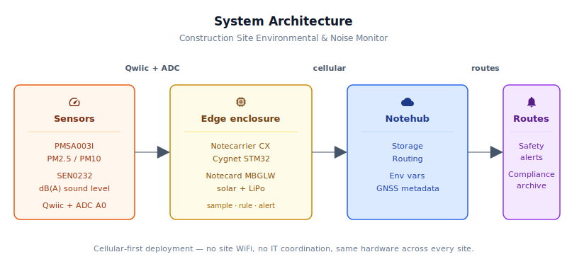
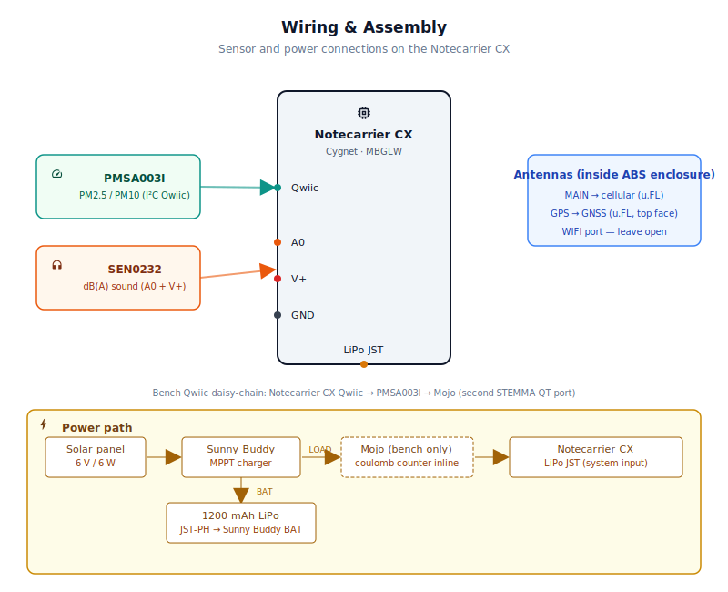
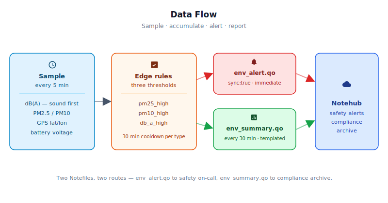

# Construction Site Environmental & Noise Exposure Monitor

<Note>

This reference application is intended to provide inspiration and help you get started quickly. It uses specific hardware choices that may not match your own implementation. Focus on the sections most relevant to your use case. If you'd like to discuss your project and whether it's a good fit for Blues, [feel free to reach out](https://blues.com/landing-pages/accelerators-contact-us/?accelerator=Construction%20Site%20Environmental%20%26%20Noise%20Exposure%20Monitor).

</Note>

This project is a [safety assurance](https://blues.com/safety-assurance/) reference design that turns a construction site into a continuously monitored, GPS-stamped area monitoring point — tracking PM2.5, PM10, and dB(A) sound levels in real time without any site WiFi, power outlets, or IT coordination.

## 1. Project Overview

**The problem.** OSHA regulations governing construction sites require documented monitoring of worker exposure to silica dust, general particulate matter, and noise. OSHA 29 CFR 1926.1153 mandates air monitoring when workers may be exposed to respirable crystalline silica above the action level (25 µg/m³). Similarly, OSHA's noise standard (29 CFR 1926.52) requires monitoring and protection when **TWA** (time-weighted average) noise levels reach 85 dB(A) over an 8-hour shift. Compliant silica exposure documentation requires filter-based personal samplers analyzed by X-ray diffraction (NIOSH Method 7500); compliant noise documentation requires a dosimeter worn by each worker for a full shift. Both paradigms share the same problem: data arrives too late to act on — the shift is over before anyone reviews it, and the opportunity to intervene in real time has passed.

This project is a solar-powered cellular **area monitor** — a fixed, perimeter-mounted enclosure that tracks PM2.5, PM10, and dB(A) levels continuously and transmits geo-stamped summaries over cellular. It **complements, rather than replaces, personal silica sampling and noise dosimetry**: when the area monitor flags an elevated-dust or high-noise condition, a safety officer can immediately redirect workers, deploy respirators or hearing protection, and dispatch personal monitoring for the affected crew. A **PM2.5/PM10** optical particle sensor and an analog sound level meter sample every 5 minutes near the active exposure zone. Readings accumulate in the device and transmit as a geo-stamped summary every 30 minutes. If a threshold is breached — say, a concrete saw fires up near the sensor — an alert Note is transmitted immediately after the sampled breach is detected. Worst-case detection latency is one full sample interval (5 minutes) plus measurement time (~55 seconds), after which the alert leaves the device over cellular rather than waiting hours for an end-of-shift download.

**Why [Notecard](https://shop.blues.com/products/notecard?utm_source=dev-blues&utm_medium=web&utm_campaign=store-link).** Construction sites are, by definition, WiFi-free environments. There's no permanent network infrastructure to connect to, no IT department to issue credentials, and the general contractor (GC) is responsible for compliance across a dozen subcontractors who bring their own tools and their own hazards to the same site. The GC can't rely on a sub's WiFi hotspot, a temporary access point that may be moved, or a site trailer that's offline half the time. Cellular is the only connectivity a GC can deploy and own with their own equipment. The Notecard Cell+WiFi's prepaid global cellular removes the per-site SIM procurement headache, and the same hardware — same firmware, same enclosure — deploys identically across every site in a GC's portfolio without a single network-form to fill out. When the site moves in three months, the enclosure moves with the crew.

<NewToBlues/>

**Deployment scenario.** A weatherproof NEMA 4X enclosure mounted on a temporary fence post, T-bar stake, or equipment cage near the active work area. For dust monitoring, position the sensor **downwind** of the dust-generating task so the plume passes through the sensor rather than away from it — upwind placement will miss the plume entirely. For noise monitoring, place the enclosure within 5–10 metres of the primary noise source. For **particulate** background subtraction, deploy a second unit upwind of the site as a baseline; the arithmetic difference between the two PM concentration readings (µg/m³) approximates the task-generated particulate contribution. A second sound monitor deployed upwind or in a quieter reference area is useful contextual information, but dB(A) values cannot be meaningfully background-subtracted by simple arithmetic — decibel levels are logarithmic representations of acoustic energy and must be handled in the energy domain (convert to intensity in W/m², subtract, convert back) to isolate the task-generated contribution; direct subtraction of dB numbers is acoustically incorrect. A 6V solar panel is surface-mounted on the enclosure lid. The LiPo battery inside provides overnight autonomy between solar charging sessions. No shore power, no network drops, and no daily downloads.

## 2. System Architecture



**Device-side responsibilities.** The onboard Cygnet STM32 host on the Notecarrier CX wakes every 5 minutes (configurable), immediately samples sound for 15 seconds via the ADC (before the PM warm-up phase begins), then initialises the PM sensor over I²C, waits for the laser and fan to stabilise, and averages 10 readings over 10 seconds. All samples are accumulated in a rolling window stored in Notecard flash between sleep cycles. The host is cut from power by [`card.attn`](https://dev.blues.io/api-reference/notecard-api/card-requests/#card-attn) between samples, dropping Cygnet current draw to essentially zero. Queued Notes travel from the Cygnet to the Notecard over I²C using the `note-arduino` library's `JAdd*` helpers — no JSON hand-marshaling, no modem AT commands.

**Notecard responsibilities.** The Notecard stores [Notes](https://dev.blues.io/api-reference/glossary/#note) locally, manages the cellular session on the configured [`hub.set`](https://dev.blues.io/api-reference/notecard-api/hub-requests/#hub-set) `outbound` cadence (default 30 minutes), and flushes `sync:true` alert Notes immediately when a threshold is breached. The Notecard owns GNSS — its built-in GPS/GNSS receiver attempts to acquire a site fix on first boot and re-acquires periodically (default every 4 hours); the last-known fix is returned by `card.location` and embedded in every outbound Note. The Notecard's GNSS hardware retains a cached fix across power cycles, so after the device is redeployed from one construction site to another, the first `card.location` response after a fresh power-on may return the coordinates of the **previous** site rather than the current one. The firmware detects freshness by comparing the GPS fix timestamp (`time` field) across successive `card.location` calls: the first non-zero response after boot is recorded as a baseline; once a subsequent response returns a newer timestamp the device is confirmed at its current site. Every outbound Note includes a `location_valid` boolean that is `false` until this confirmation occurs. See [Limitations](#10-limitations-and-next-steps). The Notecard also distributes [environment variables](https://dev.blues.io/guides-and-tutorials/notecard-guides/understanding-environment-variables/) from Notehub — operators can retune alert thresholds in the field without re-flashing firmware.

**Notehub responsibilities.** The Notecard manages its own cellular session against the supported carrier networks worldwide via its embedded global SIM and delivers data to Notehub over the Internet; [Notehub](https://notehub.io) ingests events, stores them, and applies project-level routes. Exposure summaries (`env_summary.qo`) and threshold alerts (`env_alert.qo`) land in separate [Notefiles](https://dev.blues.io/api-reference/glossary/#notefile), which means downstream routes can treat them differently — alerts to an on-call system or safety officer inbox, summaries to a long-term compliance archive. Notehub also automatically appends `where_lat`, `where_lon`, and other location metadata to every event based on the Notecard's last-known GNSS fix.

**Routing to the cloud (high level).** Notehub supports HTTP, MQTT, AWS IoT Core, Azure IoT Hub, GCP Pub/Sub, Snowflake, and several other destinations; route setup is project-specific. See the [Notehub routing documentation](https://dev.blues.io/notehub/notehub-walkthrough/#routing-data-with-notehub) for details — this project does not ship any specific downstream endpoint.

## 3. Technical Summary

1. **Clone and configure**: Download this repo and open `firmware/construction_env_monitor/construction_env_monitor.ino`. Replace `PRODUCT_UID` constant with your Notehub project UID (see §6 step 1).
2. **Build and flash**: Use Arduino IDE or `arduino-cli`. The FQBN below matches `firmware/construction_env_monitor/sketch.yaml`, so omitting `--fqbn` also works when invoked from the sketch directory:
   ```bash
   arduino-cli compile --fqbn STMicroelectronics:stm32:Blues:pnum=CYGNET firmware/
   arduino-cli upload -p /dev/ttyUSB0 --fqbn STMicroelectronics:stm32:Blues:pnum=CYGNET firmware/
   ```
3. **Power and observe**: Connect LiPo (or USB for bench testing). The device samples every 5 minutes, queues summaries, and transmits to Notehub every 30 minutes. Watch `env_summary.qo` notes arrive in Notehub within 30 minutes of first power-on.
4. **Set thresholds**: In Notehub, navigate to your Fleet → Environment Variables and set `pm25_alert_ug_m3`, `pm10_alert_ug_m3`, and `db_a_alert` (see §5). Alerts fire immediately when thresholds are breached.

**What you'll have:** A solar-powered cellular area monitor that streams PM2.5, PM10, and sound levels as templated Notes to Notehub, with real-time alerts on threshold breach.

Here is a sample Note this device emits:

```json
{
  "file": "env_summary.qo",
  "body": {
    "pm25_avg": 18.3,
    "pm25_peak": 42.7,
    "pm10_avg": 31.1,
    "pm10_peak": 89.4,
    "pm_samples": 6,
    "db_a_avg": 71.2,
    "db_a_peak": 83.6,
    "samples": 6,
    "voltage": 3.91,
    "lat": 37.774,
    "lon": -122.419,
    "location_valid": true
  }
}
```

## 4. Hardware Requirements

| Part | Qty | Type | Rationale |
|------|-----|------|-----------|
| [Notecarrier CX](https://shop.blues.com/products/notecarrier-cx?utm_source=dev-blues&utm_medium=web&utm_campaign=store-link) | 1 | Required | Integrated carrier with an embedded Cygnet STM32 host, LiPo JST connector, Qwiic I²C port, and 6-channel ADC header — no separate MCU needed. |
| [Notecard Cell+WiFi (MBGLW)](https://shop.blues.com/products/notecard?utm_source=dev-blues&utm_medium=web&utm_campaign=store-link) / [datasheet](https://dev.blues.io/datasheets/notecard-datasheet/note-mbglw/) | 1 | Required | Cellular removes per-site WiFi dependency; the MBGLW includes built-in GNSS for geo-stamping every reading without a separate GPS module. |
| [Blues Flexible LTE, Wi-Fi, or GPS/GNSS Antenna](https://shop.blues.com/products/flexible-cellular-or-wi-fi-antenna?utm_source=dev-blues&utm_medium=web&utm_campaign=store-link) | 2 | Required | One for the MBGLW **MAIN** (cellular) u.FL port; one for the **GPS** u.FL port. The same Molex-manufactured Blues flexible antenna covers both: its 698 MHz–4.0 GHz broadband range includes GPS L1 at 1575 MHz. The MBGLW also has a **WIFI** u.FL port; that port is left unconnected in this design — cellular is the sole wireless path and the WiFi radio is not used. Because the Hammond 1554CGY enclosure is ABS plastic (RF-transparent), both flex antennas mount **inside** the enclosure on interior surfaces; no cable glands or external mounting are required for the antennas. |
| [Blues Mojo](https://shop.blues.com/products/mojo?utm_source=dev-blues&utm_medium=web&utm_campaign=store-link) | 1 | Optional (bench only) | Coulomb counter for bench-side energy validation; confirms that sleep current, active sampling current, and per-session transmit energy match expected figures. Not required for field deployment. |
| [Adafruit PMSA003I Air Quality Breakout (#4632)](https://www.adafruit.com/product/4632) | 1 | Required | I²C optical particle counter reporting PM2.5 and PM10 in µg/m³. The Adafruit breakout includes an onboard 5V boost circuit so it runs correctly from the Notecarrier CX's 3.3V Qwiic rail. |
| [DFRobot Gravity Analog Sound Level Meter (SEN0232)](https://www.dfrobot.com/product-1663.html) | 1 | Required | A-weighted analog sound meter, 30–130 dB(A), 3.3–5 V supply, analog voltage output. Op-amp output connects directly to the Cygnet's 12-bit ADC with no additional circuitry required. |
| [SparkFun Sunny Buddy MPPT Solar Charger (PRT-12885)](https://www.sparkfun.com/products/12885) | 1 | Required | Maximum power point tracking solar charger for a single-cell LiPo. Extracts maximum current from the panel across varying light conditions — critical for a north-facing or partially shaded site fence mount. |
| [Adafruit 6V 6W Solar Panel (#1525)](https://www.adafruit.com/product/1525) | 1 | Required | Weatherproof monocrystalline panel, 930 mA peak. At 5 peak-sun hours per day, generates well over the daily energy budget for this duty-cycled system. Mounts flat on the NEMA enclosure lid with included screws. |
| [Adafruit Lithium Ion Polymer Battery 3.7V 1200 mAh (#258)](https://www.adafruit.com/product/258) | 1 | Required | Single-cell LiPo with 2-pin JST-PH connector. Validate actual system draw with the Mojo bench exercise in §8 before sizing for deployment. |
| JST-PH 2-pin pigtail cable, female connector to bare-wire leads, ~100–150 mm (e.g., Adafruit #3814 or equivalent) | 1 | Required | Connects the Sunny Buddy `LOAD+`/`LOAD–` through-hole pads to the Notecarrier CX LiPo JST receptacle. Solder the bare-wire end to the LOAD pads; plug the JST-PH female connector into the Notecarrier's battery input. |
| Qwiic / STEMMA QT cable, 100 mm | 2 | Required | One connects the Notecarrier CX Qwiic port to the PMSA003I STEMMA QT connector for permanent field use. A second cable (optional, bench only) continues the daisy-chain from the PMSA003I's second STEMMA QT port to the Mojo's Qwiic port, enabling I²C readback of the Mojo's LTC2959 coulomb counter during validation. See §4 bench wiring and §8. |
| NEMA 4X weatherproof enclosure, ~8×6×3″ (e.g., Hammond Manufacturing 1554CGY, ~9.4×6.0×3.1″, NEMA 4X ABS) | 1 | Required | IP66-rated housing for outdoor mounting. Requires sensor-port hardware listed below to maintain weather resistance once openings are cut. |
| IP-rated sintered-PE vent, M20 or M16 (e.g., Würth Elektronik 3800301 or equivalent) | 2 | Required | Provides PM2.5/PM10 sensor airflow (inlet + exhaust) while preserving the enclosure's weather rating. Sintered-PE construction passes particulate-laden air for measurement without allowing bulk water ingress. |
| Weatherproof acoustic vent plug, 20–25 mm PTFE-membrane type (e.g., Würth Elektronik WE-AVE 3820101 or equivalent) | 1 | Required | Allows sound pressure waves to reach the SEN0232 microphone capsule while sealing against rain and splash. Mount with the board's microphone aperture aligned directly behind the vent opening. A bare hole — even with foam packing — does not maintain IP/NEMA weather resistance. |

All Blues parts ship with an active SIM including 500 MB of data and 10 years of service — no activation fees, no monthly commitment.

## 5. Wiring and Assembly



All host I/O lands on the [Notecarrier CX](https://dev.blues.io/datasheets/notecarrier-datasheet/notecarrier-cx-v1-3/) dual 16-pin headers. The Notecard Cell+WiFi (MBGLW) seats in the M.2 slot. The MBGLW has three u.FL connectors: **MAIN** (cellular radio), **GPS** (GNSS receiver), and **WIFI** (WiFi radio). MAIN and GPS each require an external antenna; the WIFI port is left unconnected in this design — cellular is the sole wireless path. See antenna routing below.

**Power chain (solar → LiPo → Notecarrier):**

The Sunny Buddy is the sole battery charger in this design. Its `BAT` JST port connects to the LiPo for charging; its `LOAD` through-hole pads on the right edge supply the load (the Notecarrier CX system rail) from the same battery bus. No Y-splitter is needed.

1. Connect the solar panel's positive lead to the Sunny Buddy `VIN+` screw terminal; negative to `VIN–`.
2. Plug the LiPo battery's JST-PH connector into the Sunny Buddy `BAT` port. The Sunny Buddy's MPPT circuit charges the battery through this connection and is the only charger in the loop.
3. Wire the Sunny Buddy `LOAD+` and `LOAD–` through-hole pads to the Notecarrier CX LiPo JST connector using a short JST-PH 2-pin pigtail cable (solder the pigtail's bare leads to the LOAD pads):
   - **Bench with Mojo (inline power + Qwiic readback):** Sunny Buddy `LOAD` → Mojo `BAT` input → Mojo `LOAD` output → Notecarrier CX LiPo JST connector. The Mojo sits inline on the power rail and its LTC2959 coulomb counter accumulates the charge drawn from the LiPo. To read the accumulated mAh, add a second 100 mm Qwiic cable from the PMSA003I's second STEMMA QT port to the Mojo's Qwiic port, completing the daisy-chain: Notecarrier CX Qwiic → PMSA003I → Mojo. With Notecard firmware v8.1.3 or later, the Notecard auto-detects the Mojo on the shared I²C bus and periodically logs energy consumption data (including `milliamp_hours`) to `_log.qo` Notes. See the [Mojo documentation](https://dev.blues.io/datasheets/mojo-datasheet/) for details. For a one-shot bench reading, issue `{"req":"card.power"}` from the Notecard's in-browser serial terminal; the firmware in this project does not call `card.power` (see §9 for the extension path).
   - **Deployed (without Mojo):** Sunny Buddy `LOAD` → Notecarrier CX LiPo JST connector directly.

> **USB-C conflict warning.** When the Sunny Buddy LOAD is wired to the Notecarrier CX LiPo JST, **do not simultaneously connect USB-C** to the Notecarrier. USB-C activates the Notecarrier's onboard LiPo charger, which would fight the Sunny Buddy for control of the battery. For USB-only bench sessions (programming, Notecard debug serial): disconnect the Sunny Buddy LOAD pigtail from the Notecarrier LiPo JST first, then connect USB-C alone.

**PM sensor (Adafruit PMSA003I, I²C):**

- Connect a 100 mm Qwiic cable from the Notecarrier CX's Qwiic port to the PMSA003I's STEMMA QT connector. The Qwiic bus carries 3.3V power, GND, SDA, and SCL in a single connector. The PMSA003I's onboard boost circuit handles the internal 5V requirement.
- The PMSA003I must have a clear airflow path to sample ambient air. Mount it near the **inlet vent** on the enclosure wall with its sensing aperture facing the vent opening. Cut a second opening on the opposite or adjacent wall for exhaust — the sensor's internal fan creates a pressure differential that requires both an inlet and an outlet. Fit both openings with IP-rated sintered-PE vent plugs (see BOM) to preserve the enclosure's weather rating. Position the inlet on a sheltered face (bottom or side, not the lid) to minimise direct rain exposure.

**Sound level sensor (DFRobot SEN0232, analog):**

- **VCC** → Notecarrier CX `V+` header pin (raw LiPo voltage, ~3.7–4.2 V). The SEN0232 is rated for 3.3–5V operation; using `V+` rather than 3.3V gives the op-amp more output headroom, particularly for high-SPL readings near the 130 dB ceiling.
- **GND** → Notecarrier CX `GND` header pin.
- **OUT** → Notecarrier CX `A0` header pin (ADC input).
- The SEN0232 is a PCB module with an **onboard microphone capsule** — there is no separate remote microphone cable. Mount the entire SEN0232 board inside the enclosure with its microphone aperture aligned directly behind the acoustic vent opening. Cut a 20–25 mm diameter hole on the most sheltered enclosure face and fit it with a **weatherproof acoustic vent plug** (PTFE-membrane type; see BOM). Position the SEN0232 so its microphone port faces the vent membrane with a gap of 2–5 mm. The PTFE membrane passes sound pressure waves while sealing against moisture; a bare port or foam packing will compromise the NEMA 4X weather rating.

> **Enclosure weather rating note.** Any opening cut for sensor airflow or sound transmission must be fitted with the IP-rated vent components listed in the BOM. Without those components, the enclosure is de-rated to at most IP54 at the sensor ports. The sintered-PE inlet/exhaust vents and the PTFE acoustic membrane vent maintain the enclosure's original weather rating at each opening.

**Antenna routing:**

The Hammond 1554CGY enclosure is ABS plastic, which is RF-transparent — cellular and GPS signals pass through it without meaningful attenuation. Mount both flexible antennas **inside** the enclosure using their adhesive backing:

- Peel the adhesive backing and press the **cellular** antenna flat against any interior wall surface, with the u.FL pigtail routed neatly back to the MBGLW's **MAIN** connector. Maintain at least 11 mm clearance between the antenna trace and any metal hardware or PCB ground planes.
- Press the **GNSS** antenna flat against the interior of the **top face** of the enclosure (the upward-facing surface when the unit is deployed upright on a fence post or T-bar stake). The lid carries the solar panel on its exterior — the panel's glass, backing, and frame are not RF-transparent and will attenuate or detune the GNSS antenna if it is placed directly behind the panel. The top face is unobstructed and provides a clear RF path to the sky. Plug the pigtail into the MBGLW's **GPS** connector.
- Leave the MBGLW's **WIFI** u.FL port unconnected; the WiFi radio is not used in this design.

> **Metal enclosure substitution.** If you replace the ABS enclosure with a steel or aluminium alternative, the antennas must exit the box — route u.FL pigtails through IP-rated cable glands to externally mounted antennas, as metal fully blocks both cellular and GPS signals inside.

## 6. Notehub Setup

1. **Create a project.** Sign up at [notehub.io](https://notehub.io) and [create a project](https://dev.blues.io/quickstart/notecard-quickstart/notecard-and-notecarrier-pi/#set-up-notehub). Copy the [ProductUID](https://dev.blues.io/notehub/notehub-walkthrough/#finding-a-productuid) and paste it into the `PRODUCT_UID` constant in the firmware (line ~15 of `construction_env_monitor.ino`).
2. **Claim the Notecard.** Power the enclosure. On first cellular session the Notecard automatically associates with your project using the ProductUID. You will see the device appear on the Notehub dashboard within 1–2 minutes.
3. **Create a Fleet per site.** [Fleets](https://dev.blues.io/guides-and-tutorials/fleet-admin-guide/) (and [Smart Fleets](https://dev.blues.io/notehub/notehub-walkthrough/#using-smart-fleet-rules)) group devices for shared configuration and routing. A natural unit is one fleet per active construction site — all sensors on that site share the same threshold environment variables, which can be tuned to the specific trade activities happening there this week. When a site closes, archive the fleet; when a new site opens, create a fresh one. To add the device to a fleet: Notehub dashboard → Devices → select your device → assign to Fleet.
4. **Set environment variables.** All variables below are optional; firmware defaults are shown. To set them: Notehub dashboard → Fleets → select your fleet → Settings → Environment Variables → Add. Any value pushed through Notehub overrides the firmware default on the device's next inbound sync — thresholds can be retightened or relaxed without a firmware update or a truck roll to the site. The device syncs environment changes within 30 minutes; to force an immediate sync, issue `{"req":"hub.sync"}` from the Notecard's in-browser serial terminal (accessible via Notehub → Devices → select device → In-Browser Serial).

   | Variable | Default | Purpose |
   |---|---|---|
   | `sample_interval_sec` | `300` | Seconds between PM + sound samples. |
   | `report_interval_min` | `30` | Minutes between `env_summary.qo` notes. When changed, the firmware re-issues `hub.set` on the next wake to update the Notecard's outbound sync cadence. |
   | `pm25_alert_ug_m3` | `35.0` | PM2.5 threshold (µg/m³) above which `pm25_high` fires. |
   | `pm10_alert_ug_m3` | `150.0` | PM10 threshold (µg/m³) above which `pm10_high` fires. |
   | `db_a_alert` | `85.0` | dB(A) threshold above which `db_a_high` fires. |
   | `gps_interval_sec` | `14400` | Seconds between GPS re-acquisition attempts (default 4 h). When changed, the firmware re-issues `card.location.mode` on the next wake. |
   | `db_cal_offset` | `0.0` | Signed dB bias added to all sound readings for field calibration against a reference meter. |

5. **Configure routes.** Add a [route](https://dev.blues.io/notehub/notehub-walkthrough/#routing-data-with-notehub) for `env_alert.qo` to a real-time safety notification channel — email, Slack, SMS gateway, or a CMMS ticketing endpoint. Add a second route for `env_summary.qo` to a long-term analytics store or compliance archive. Keeping the two Notefiles separate at the source means you never need filter logic in the route; just point each Notefile at its appropriate destination.

## 7. Firmware Design

### Build and Flash

**Prerequisites:**
- Arduino IDE 2.0+ with [Arduino core for STM32](https://github.com/stm32duino/Arduino_Core_STM32) installed, or `arduino-cli` v0.21+.
- Required libraries:
  - `Blues Wireless Notecard`: `arduino-cli lib install "Blues Wireless Notecard"`
  - `Adafruit PM25 AQI Sensor`: `arduino-cli lib install "Adafruit PM25 AQI Sensor"`

**Using Arduino IDE:** Open `firmware/construction_env_monitor/construction_env_monitor.ino`, select board **STMicroelectronics STM32 → Blues → Cygnet (Notecarrier CX)** under **Tools → Board**, update `PRODUCT_UID`, and click Upload. The IDE picks up `sketch.yaml` automatically when the sketch directory is opened, so the board selection is pre-pinned to the correct variant.

**Using `arduino-cli`:**
```bash
arduino-cli compile --fqbn STMicroelectronics:stm32:Blues:pnum=CYGNET firmware/
arduino-cli upload -p /dev/ttyUSB0 --fqbn STMicroelectronics:stm32:Blues:pnum=CYGNET firmware/
```
(Adjust `-p` to your serial port; on Windows use `COM3`, on macOS use `/dev/tty.usbserial-*`. The FQBN above is the canonical match for the Cygnet host on the Notecarrier CX, older `Nucleo_L433RC_P` or generic `GenL0` board variants do not match the Cygnet's chip family or peripheral mapping and should not be substituted.)

### Source Files

- [`construction_env_monitor.ino`](firmware/construction_env_monitor/construction_env_monitor.ino) — global state definitions, `setup()`, `loop()`
- [`construction_env_monitor_helpers.h`](firmware/construction_env_monitor/construction_env_monitor_helpers.h) — shared constants, `AppState` struct, extern declarations, function prototypes
- [`construction_env_monitor_helpers.cpp`](firmware/construction_env_monitor/construction_env_monitor_helpers.cpp) — sensor helpers, Notecard config helpers, note-send helpers

### Modules

| Responsibility | Where |
|---|---|
| First-boot Notecard configuration (initial `hub.set`) | `notecardConfigure` |
| Note template registration (idempotent, every wake) | `defineTemplates` |
| Environment-variable fetch + range clamp per wake | `fetchEnvOverrides` |
| Outbound-cadence / GPS-cadence re-apply when env vars change | `applyCardConfig` (called from `setup()` and `loop()`) |
| GPS position refresh from `card.location` | `updateGPS` |
| PM2.5/PM10 averaging from PMSA003I | `readPmSensor` |
| Sound level averaging from SEN0232 ADC | `readSoundLevelDb` |
| Rolling window accumulation, threshold checks, alert emission | `runOneSampleCycle`, `sendAlert` |
| Periodic exposure summary | `sendSummary` |
| Persistent state across sleep cycles | `AppState` + `NotePayloadSaveAndSleep` / `NotePayloadRetrieveAfterSleep` |

### Sensor reading strategy

**Sound level — sampled first.** `analogReadResolution(12)` is called once in `setup()` to enable the Cygnet's 12-bit ADC. The SEN0232 output voltage maps linearly to dB(A). The firmware samples at 4 Hz for 15 seconds (60 samples) at the very start of the measurement phase — before `begin_I2C()` is called on the PMSA003I. By taking the dB(A) window before the PM sensor's 30-second warm-up phase begins, the fan's acoustic contribution is bounded to at most the host boot + `setup()` time (~5–15 seconds) in the case where the Qwiic rail is gated during ATTN sleep. Whether that rail is actually gated is carrier-implementation-specific — if it is not, the fan runs continuously and contaminates the measurement regardless of sampling order. For complete, guaranteed acoustic isolation, add a GPIO-controlled load switch to the PMSA003I power line so the fan is definitively off during the sound window. See [Limitations](#10-limitations-and-next-steps). For each of the 60 ADC samples, the firmware maps the output voltage to dB(A) via the SEN0232's linear Vout-to-dB transfer function, applies the `db_cal_offset` calibration bias, then converts to acoustic energy (`10^(dB/10)`) and accumulates the result in a running sum. At the end of the 15-second window the mean energy is converted back to dB(A) via `10·log10(meanEnergy)`, yielding the acoustically correct mean sound pressure level. Averaging in the energy domain matters: a brief 100 dB event carries 100× more intensity than 80 dB background; a simple arithmetic mean of the two dB values gives 90 dB, while the energy-domain mean correctly gives ~97 dB. The 15-second window also acts as a natural noise floor smoother, attenuating single-spike artefacts from vehicles or tools passing the sensor.

**PM sensor — sampled after the sound window.** The PMSA003I requires a 30-second warm-up delay (`PM_WARMUP_MS`) for its fan and laser to stabilise before readings are valid. Whether the Notecarrier CX ATTN sleep path cuts the Qwiic/3.3V rail between wakes is carrier-implementation-specific and not guaranteed — do not rely on implicit rail-gating to power-cycle the PMSA003I between samples. The firmware always applies the full `PM_WARMUP_MS` delay after every successful `begin_I2C()` call, ensuring valid readings regardless of whether the sensor cold-started or was already running. After warm-up, 10 consecutive readings are taken at 1 Hz and averaged. `data.pm25_standard` and `data.pm10_standard` (standard-atmosphere-corrected values) provide a stable, comparable PM metric for trend monitoring — they are more consistent than the `_env` variants, which apply an additional humidity-based environmental correction. Neither output is suited for silica-compliance reporting; see [Limitations](#10-limitations-and-next-steps). Use the Mojo to measure the actual idle current floor during ATTN sleep (§8): if the floor is elevated above the always-on SEN0232 quiescent draw, the PMSA003I is being supplied during sleep and drawing continuous fan current.

### Event payload design

Two [template-backed](https://dev.blues.io/notecard/notecard-walkthrough/low-bandwidth-design#working-with-note-templates) Notefiles. Templates store records as fixed-length binary on the Notecard rather than free-form JSON, reducing on-wire payload by roughly 3–5×.

`pm25_avg` and `pm10_avg` are computed over the subset of wake cycles in which the PM sensor returned a valid read (tracked separately in `AppState.pmSampleCount`), so a failed sensor read on one cycle does not dilute the window mean. `pm_samples` carries that valid-read count as an explicit validity field. When `pm_samples` is `0`, every read in the window failed: `pm25_avg` and `pm10_avg` are emitted as `–9999.0` — an unambiguous invalid-data sentinel that no downstream consumer can mistake for genuinely particulate-free air. `db_a_avg` is computed over all wake cycles (`sampleCount`), since the ADC is always sampled. Example summary body:

```json
{
  "file": "env_summary.qo",
  "body": {
    "pm25_avg": 18.3,
    "pm25_peak": 42.7,
    "pm10_avg": 31.1,
    "pm10_peak": 89.4,
    "pm_samples": 6,
    "db_a_avg": 71.2,
    "db_a_peak": 83.6,
    "samples": 6,
    "voltage": 3.91,
    "lat": 37.774,
    "lon": -122.419,
    "location_valid": true
  }
}
```

Example alert body:

```json
{
  "file": "env_alert.qo",
  "body": {
    "alert": "pm25_high",
    "value": 48.2,
    "threshold": 35.0,
    "lat": 37.774,
    "lon": -122.419,
    "location_valid": true
  },
  "sync": true
}
```

Notehub additionally appends `where_lat`, `where_lon`, `where_location`, and `where_timezone` to every event from the Notecard's last-known GNSS fix. The explicit `lat`/`lon` fields in the payload body are belt-and-suspenders: they survive even if Notehub metadata is stripped during a downstream route transformation. `location_valid` is `false` until the GNSS confirms a new fix at the current site (the GPS `time` timestamp advances since boot); downstream consumers should hold off geo-stamping records or triggering geo-fenced alerts until this field is `true`. In normal outdoor deployment, `location_valid` becomes `true` within one or two 5-minute sample cycles once the GNSS acquires a fresh position.

### Low-power strategy

Even on a solar-powered site, keeping the host asleep between samples reduces average current draw significantly and keeps the enclosure cooler in direct sun. After completing a sample cycle, the host calls `NotePayloadSaveAndSleep`, which serialises the runtime state into Notecard flash (preserving rolling window accumulators, countdown timers, and the last GPS fix) and then triggers `card.attn` to cut host power entirely for `sample_interval_sec` seconds. Between cellular sessions, the Notecard itself idles at ~8–18 µA @ 5V — effectively negligible. The host is awake for approximately 55 seconds per 5-minute cycle (~18% duty cycle), and the cellular session fires once per 30-minute report window.

Sampling cadence and transmit cadence are deliberately decoupled: the firmware samples every 5 minutes but only transmits once per 30 minutes. Actual data consumption depends on sync cadence, signal conditions, Notehub routing behaviour, and alert frequency; validate against Notehub's usage dashboard once the device is deployed in its target environment.

### Retry and error handling

- The first Notecard transaction in `notecardConfigure()` uses [`sendRequestWithRetry(req, 5)`](https://dev.blues.io/tools-and-sdks/firmware-libraries/arduino-library/) with a 5-second retry window to paper over the cold-boot I²C race between the Cygnet and the Notecard. Immediately after, `applyCardConfig()` re-issues `hub.set` with `requestAndResponse` because `state.lastReportMin` is initialised to 0 on first boot — this guarantees the outbound cadence is confirmed with a response-checked request even if `notecardConfigure()` suffered a transient failure. `product` is included in every `hub.set` from `applyCardConfig()` so the device can recover from a failed first-boot provisioning on any subsequent wake without a hard reset.
- `readPmSensor()` counts valid reads independently and returns `false` if zero valid readings are obtained (e.g., sensor not detected on I²C). The calling code in `setup()` guards against adding a -1.0 reading to the accumulators.
- `env.get` and `card.location` responses are NULL-checked before use; a failed response is silently skipped so a transient I²C error on one wake doesn't corrupt the persistent state.
- Alert de-duplication via a 30-minute per-type cooldown (`ALERT_COOLDOWN_SEC`) prevents a sustained high-dust or high-noise condition from generating continuous alerts. One alert per type per 30 minutes is enough to notify the safety officer; it's not enough to flood their inbox.
- If the Notecard is not wired for ATTN-controlled sleep (e.g., bench testing over USB-C only), `NotePayloadSaveAndSleep` returns without cutting power. The `saveStateAndSleep()` call at the end of `setup()` then falls through, and `loop()` takes over: it delays for the remaining trimmed interval, re-applies any changed config, runs another full sample cycle, and sleeps again, so bench mode still produces repeated periodic readings without re-flashing or wiring changes.

### Key code snippet 1 — template definition

Templates must be defined once at first boot. `14.1` is the note-c `TFLOAT32` hint (4-byte IEEE 754 float); `22` is `TUINT16` (2-byte unsigned int). Boolean fields are declared by passing the literal `true` (there is no numeric type-hint for `TBOOL`). See the [note-c template data-type table](https://dev.blues.io/notecard/notecard-walkthrough/low-bandwidth-design/#understanding-template-data-types).

```cpp
J *req  = notecard.newRequest("note.template");
JAddStringToObject(req, "file", "env_summary.qo");
JAddNumberToObject(req, "port", 50);
J *body = JAddObjectToObject(req, "body");
JAddNumberToObject(body, "pm25_avg",       14.1);
JAddNumberToObject(body, "pm25_peak",      14.1);
JAddNumberToObject(body, "pm10_avg",       14.1);
JAddNumberToObject(body, "pm10_peak",      14.1);
JAddNumberToObject(body, "db_a_avg",       14.1);
JAddNumberToObject(body, "db_a_peak",      14.1);
JAddNumberToObject(body, "samples",         22);
JAddNumberToObject(body, "pm_samples",      22);   // 0 = all PM reads failed; pm25_avg/pm10_avg = -9999.0
JAddNumberToObject(body, "voltage",        14.1);
JAddNumberToObject(body, "lat",            14.1);
JAddNumberToObject(body, "lon",            14.1);
JAddBoolToObject(body,   "location_valid", true); // TBOOL — declared by passing literal 'true'
notecard.sendRequest(req);
```

### Key code snippet 2 — immediate-sync alert

`sync:true` tells the Notecard to bypass the outbound window and open a cellular session right now. This is the mechanism that gets a dust spike off the device within seconds of the threshold crossing. `full:true` opts the note out of the [omitempty rule](https://dev.blues.io/notecard/notecard-walkthrough/low-bandwidth-design/#use-of-in-templates) that templated Notefiles otherwise apply on Notehub serialisation — without it, `location_valid: false` (the explicit "GPS not yet confirmed at this site" signal) and any zero-valued `lat`/`lon` would be silently stripped from the body that downstream consumers receive. The same `full:true` flag is set on the `env_summary.qo` `note.add` so that `pm_samples: 0` (the companion sentinel to `pm25_avg/pm10_avg = -9999.0` when every PM read in the window failed) survives serialisation.

```cpp
J *req  = notecard.newRequest("note.add");
JAddStringToObject(req, "file", "env_alert.qo");
JAddBoolToObject(req,   "sync", true);
JAddBoolToObject(req,   "full", true);
J *body = JAddObjectToObject(req, "body");
JAddStringToObject(body, "alert",          "pm25_high");
JAddNumberToObject(body, "value",          pm25);
JAddNumberToObject(body, "threshold",      cfgPm25Alert);
JAddNumberToObject(body, "lat",            state.siteLat);
JAddNumberToObject(body, "lon",            state.siteLon);
JAddBoolToObject(body,   "location_valid", state.gpsBootConfirmed);
notecard.sendRequest(req);
```

### Key code snippet 3 — sleep between samples

`NotePayloadSaveAndSleep` writes state to Notecard flash and then triggers `card.attn` to cut the Cygnet's power rail. The next `setup()` call rehydrates state with `NotePayloadRetrieveAfterSleep`. The sleep duration is the configured sample interval minus the seconds the host was already awake this cycle, keeping sample starts on the configured cadence.

```cpp
// In saveStateAndSleep() — construction_env_monitor_helpers.cpp
NotePayloadDesc payload = {0, 0, 0};
NotePayloadAddSegment(&payload, STATE_SEG_ID, &state, sizeof(state));
NotePayloadSaveAndSleep(&payload, sleepSec, NULL);
// Returns here only if card.attn is absent (bench mode).
```

## 8. Data Flow



Every 5 minutes (default), the Cygnet wakes, reads both sensors (sound first, then PM), accumulates sample statistics, checks three alert thresholds, optionally sends an immediate alert, checks the report timer, optionally sends a summary, and goes back to sleep.

**Collected.** PM2.5 and PM10 in µg/m³ (standard atmospheric); mean dB(A) over a 15-second audio window; peak PM2.5, PM10, and dB(A) values observed in the current reporting window; battery voltage; GPS lat/lon.

**Transmitted.**
- `env_summary.qo` — once per `report_interval_min` (default 2 notes per hour, one every 30 minutes); template-encoded, queued in Notecard and flushed by the periodic `outbound` session. PM averages (`pm25_avg`, `pm10_avg`) are computed over valid PM-sensor reads only; `pm_samples` is the count of those valid reads. When `pm_samples` is `0`, every PM read in the window failed and `pm25_avg`/`pm10_avg` carry `–9999.0` — an unambiguous invalid-data sentinel. `db_a_avg` is the mean over all wake cycles. `samples` documents total measurement cycles in the window.
- `env_alert.qo` — on threshold breach only, `sync:true`, with a 30-minute cooldown per alert type. Alert types: `pm25_high`, `pm10_high`, `db_a_high`.

**Routed.** Both Notefiles arrive at Notehub. From there, routes fan them out separately — `env_alert.qo` to a real-time notification channel, `env_summary.qo` to a long-term compliance archive or analytics dashboard.

**What triggers alerts.**
- `pm25_high` — PM2.5 reading at or above `pm25_alert_ug_m3` (default 35 µg/m³). A sustained reading above 35 µg/m³ is meaningful in the context of a cutting or grinding operation.
- `pm10_high` — PM10 reading at or above `pm10_alert_ug_m3` (default 150 µg/m³). The 150 µg/m³ default is a heuristic starting point for flagging elevated coarse-particulate conditions — it is **not** equivalent to a regulatory limit or violation. The EPA 24-hour NAAQS for PM10 applies to a 24-hour average; a single 5-minute sample above that numerical value is not an exceedance. Adjust the threshold to match the dust-generation characteristics of the specific tasks on your site.
- `db_a_high` — mean dB(A) over the 15-second window at or above `db_a_alert` (default 85 dB(A)). The 85 dB(A) default is a heuristic starting point, **not** an OSHA compliance determination. OSHA's noise action level applies to an 8-hour TWA integrated over a full shift; this device measures a 15-second mean, and the two are not directly comparable. Use the alert as an early-warning prompt to investigate, not as documentation of a regulatory exceedance.

## 9. Validation and Testing

**Expected steady-state cadence.** A freshly deployed unit on a quiet morning should generate two `env_summary.qo` events per hour (one every 30 minutes at default settings) and zero `env_alert.qo` events. In practice, a working construction site will generate occasional `db_a_high` alerts when heavy equipment operates near the sensor and occasional `pm25_high` alerts during active cutting, grinding, or sweeping operations.

**Notehub verification.** After first power-on, the device claims itself to the project on its first cellular session (~1–2 minutes). On the Notehub dashboard, Devices page, you should see your Notecard appear with a device name (defaulting to the Notecard's serial number). Within 30 minutes, the first `env_summary.qo` note appears in the Events table. Click on it to inspect the JSON payload — verify that `pm25_avg`, `pm10_avg`, `db_a_avg` are present and non-zero, and that `lat`/`lon` are non-zero if the device has GPS sky view. `location_valid: false` on the first few summaries is normal; it becomes `true` after the GNSS acquires a fresh fix at the current site.

**First-light sanity check — two phases.**

**Phase 1: USB bench (boot and I²C validation).** Connect the Notecarrier CX to a computer via USB-C, with no LiPo connected. In USB mode the Cygnet stays powered continuously; `card.attn` cannot cut the host rail because there is no ATTN-controlled LiPo path. `setup()` executes once, running one full sample cycle including the 30-second PM warm-up. Because `NotePayloadSaveAndSleep` cannot cut host power in USB-only mode, it returns without sleeping and `loop()` takes over. `loop()` repeats indefinitely, delaying between cycles and executing fresh sample cycles without any re-flashing. Open the serial monitor (115200 baud) to watch debug output. Expect to see: Notecard I²C init, `hub.set`, `note.template`, `env.get` requests, PM warm-up and sensor reads, and sound-level ADC samples. By default you will **not** see a summary `note.add` after the first cycle — the report countdown initialises to 1800 seconds (30 minutes). After approximately six cycles (~30 minutes of elapsed wall-clock time), the countdown fires and an `env_summary.qo` note is queued. To verify the alert path: (a) Set `pm25_alert_ug_m3` to `1.0` in Notehub Fleet Environment Variables; (b) Wait for the device's next inbound sync (~30 minutes default, or force one with `{"req":"hub.sync"}` in the in-browser serial terminal); (c) The next sample cycle fires `pm25_high` immediately. Reset the variable to `35.0` afterward.

**Phase 2: LiPo/solar (repeated-sampling validation).** Disconnect USB-C. Wire the Sunny Buddy LOAD to the Notecarrier CX LiPo JST and connect a charged LiPo (see §4 power chain). On Notecarrier CX, ATTN-controlled sleep is already wired to the Cygnet host power rail — no additional wiring is required. The host now wakes every `sample_interval_sec` (default 5 minutes), runs one full `setup()` sample cycle, saves state, and sleeps. Expect `env_summary.qo` to appear in Notehub approximately 30 minutes after first power-on (six 5-minute cycles). If the countdown fires but no note appears, check `hub.status` in the Notehub in-browser terminal for any cellular registration errors.

**Simulating an alert.** Drop `pm25_alert_ug_m3` to `1.0` in the Fleet environment variables. The next inbound sync pulls the updated value, the next sample cycle fires `pm25_high`, and the alert should appear in Notehub within a cellular session establishment window (typically 15–60 seconds). Reset the variable to `35.0` after testing.

**Using Mojo to validate power behavior.** The Notecard's published idle figure is ~8–18 µA @ 5V between cellular sessions (see the [low-power design guide](https://dev.blues.io/notecard/notecard-walkthrough/low-power-firmware-design/) for the authoritative measured numbers). Active cellular transmit averages ~250 mA. The Cygnet, when powered off by `card.attn`, draws essentially zero from the LiPo rail. The SEN0232 is powered from the `V+` header pin (raw LiPo voltage), which is **not** gated by the ATTN sleep path — the sensor's op-amp circuitry draws a continuous quiescent current; measure this floor directly with the Mojo to characterise your specific build.

The [Mojo](https://dev.blues.io/datasheets/mojo-datasheet/) sits inline between the Sunny Buddy `LOAD` output and the Notecarrier CX LiPo JST connector. Its LTC2959 coulomb counter (Analog Devices) accumulates the charge drawn from the LiPo regardless of whether anything is connected to its Qwiic port. To read the accumulated mAh, connect the second Qwiic cable from the PMSA003I's second STEMMA QT port to the Mojo's Qwiic port (the bench daisy-chain described in §4). With Notecard firmware v8.1.3 or later, the Notecard auto-detects the Mojo on the shared I²C bus and periodically logs energy data (including `milliamp_hours`) to `_log.qo` Notes; you can also issue `{"req":"card.power"}` from the Notecard's in-browser serial terminal for a one-shot bench reading. The firmware in this project does not call `card.power`. See the §9 extension note for the path to include it in the summary payload.

A useful bench exercise: leave the unit running on a fully charged 1200 mAh LiPo for 24 hours with no solar input and note the Mojo tally. Only the Notecard's published figures carry vendor-backed values; the remaining phase currents should be measured rather than assumed:

| Phase | Current | Duration per 5-min cycle |
|---|---|---|
| Notecard idle (between syncs) | ~8–18 µA @ 5V (published by Blues) | ~4 minutes |
| Notecard cellular sync (~once per 30 minutes) | ~250 mA avg (published by Blues) | ~30 sec |
| SEN0232 quiescent on V+ (always-on) | **Measure with Mojo** | entire cycle |
| dB(A) sample window (SEN0232 + Cygnet) | **Measure with Mojo** | ~15 sec |
| PM warm-up + sample (Cygnet + PMSA003I) | **Measure with Mojo** | ~40 sec |
| GNSS re-acquisition (~once per 4 h) | **Measure with Mojo** | varies with sky view |

The *shape* of the Mojo trace depends on whether the Notecarrier CX's Qwiic/3.3V rail is gated during ATTN sleep — this is carrier-implementation-specific. If the Qwiic rail **is** gated during sleep: the floor is dominated by the always-on SEN0232 quiescent draw, then a brief step for the 15-second dB(A) sample window, then a larger ~40-second step for PMSA003I warm-up and reads, and a ~30-second cellular-sync pulse every 30 minutes. If the Qwiic rail **is not** gated: the PMSA003I fan draws current continuously and raises the sleep floor — use the Mojo to distinguish these two cases, because the measured floor directly reveals whether the PM sensor is sleeping or running and determines whether the power budget and acoustic isolation story hold. Confirm the trace across at least one full 4-hour GNSS re-acquisition cycle before sizing the battery for deployment.

## 10. Limitations and Next Steps

**Simplified for the POC:**

- **PM sensor fan acoustic contamination.** The PMSA003I's fan runs whenever its Qwiic 3.3V supply is present. Whether that supply is cut during ATTN sleep is carrier-implementation-specific: if it is not cut, the fan runs continuously and contaminates the dB(A) channel throughout every measurement cycle. If it is cut, the fan restarts when the host wakes and has been running for the host boot + `setup()` time (~5–15 seconds) before the 15-second sound window begins. The firmware samples sound before `begin_I2C()` and the PM warm-up phase, minimising (but not eliminating) contamination in the gated-rail case. **Before deploying, measure the enclosure's self-noise floor with the PM sensor powered and spinning, using a calibrated reference sound-level meter placed at the acoustic vent opening. If the enclosure self-noise floor exceeds 5 dB(A) above the ambient floor, the enclosure design is contaminating the dB(A) channel.** The definitive fix — regardless of carrier topology — is to add a GPIO-controlled load switch to the PMSA003I's Qwiic power line so the fan is definitively off during the entire sound-sample window. A load switch also removes any PMSA003I fan current contribution from the ATTN sleep floor, making power budgeting unambiguous.

- **5-minute sampling cadence can miss transient events.** The firmware wakes and samples once per `sample_interval_sec` (default 5 minutes). A high-dust burst or noise spike that begins and ends entirely between two consecutive sample windows is not captured — the sensor never sees it. During task-intensive operations such as concrete demolition, jackhammering, dry cutting, or grinding, consider reducing `sample_interval_sec` to 60–120 seconds via the Notehub environment variable to narrow the detection gap. Note that more frequent sampling reduces LiPo autonomy proportionally and increases data consumption. For tasks where any transient spike matters (e.g., a saw that only runs for 30 seconds), a wearable personal dosimeter worn by the worker is the only reliable capture method; the area monitor cannot substitute for it in those scenarios.

- **PM sensor ≠ direct silica monitor.** The PMSA003I is an optical particle counter measuring total PM2.5 and PM10 by mass concentration. It cannot speciate particles — it cannot tell crystalline silica from wood dust, cement dust, or urban background particulate. OSHA's silica standard (29 CFR 1926.1153) requires respirable crystalline silica sampling using NIOSH Method 7500 or equivalent, which involves filter-based personal samplers analyzed by X-ray diffraction. The PM2.5/PM10 readings from this device are a real-time proxy indicator for elevated dust conditions, not a substitute for OSHA-compliant silica exposure documentation. The alerts can prompt a safety officer to investigate and deploy personal monitoring; they cannot replace it.

- **Sound level is 15-second mean, not 8-hour TWA.** OSHA's noise standard uses TWA (time-weighted average) over a full work shift, integrated using a dosimeter that accounts for the full exposure curve including quiet and loud periods. This device reports a 15-second moving average every 5 minutes and flags when that average exceeds 85 dB(A). That is useful for identifying high-noise task windows but is not a substitute for a personal dosimeter worn by a worker throughout the shift.

- **SEN0232 calibration.** The DFRobot SEN0232 is rated for 3.3–5V operation, so powering it from the LiPo's V+ rail (~3.7–4.2V) is within spec. However, the sensor's published output mapping (0.6V → 30 dB, 2.6V → 130 dB) is factory-calibrated at 5V; readings at lower supply voltages may differ from a calibrated reference by a fixed offset. Use the `db_cal_offset` environment variable to null that offset against a calibrated reference sound-level meter at commissioning time.

- **Single-point perimeter monitoring.** One sensor reflects conditions at one location on the site. Exposure varies significantly by trade, task, and proximity to the source — a concrete saw 3 meters from the sensor reads very differently from one 20 meters away. A production deployment would use multiple sensors distributed across the site's active work zones.

- **Alert cooldown prevents rapid re-notification.** The 30-minute per-type alert cooldown stops alarm fatigue but also means a sustained, elevated exposure that persists for hours generates only two alerts per hour. For compliance documentation purposes, the `env_summary.qo` stream is the authoritative record, not the alert count.

- **PM sensor failure emits `–9999.0` as an explicit sentinel.** If the PMSA003I is not detected on I²C for an entire reporting window, `pm25_avg` and `pm10_avg` are transmitted as `–9999.0` — an unambiguous invalid-data sentinel that no downstream consumer can mistake for genuinely particulate-free air (0.0 µg/m³). The companion `pm_samples` field confirms total failure when its value is `0`. A persistent `pm_samples = 0` across multiple successive windows indicates a sensor wiring, I²C, or power fault.

- **GPS coordinates may be absent or stale until `location_valid` is `true`.** Two distinct scenarios can produce untrustworthy coordinates:

  1. **No fix acquired yet (zero coordinates).** If the Notecard hasn't acquired any GPS fix before the first summary fires (e.g., the enclosure is set up briefly indoors), `siteLat` and `siteLon` are both 0.0 in the payload body, and Notehub's `where_lat`/`where_lon` metadata will also be absent. Both remain zero/absent until the first GNSS acquisition.

  2. **Stale cached fix after redeployment.** The Notecard's GNSS hardware retains the last-known position across power cycles. After the device is moved from one construction site to another and powered on fresh, `card.location` may immediately return the coordinates of the **previous** site — a non-zero, apparently valid position that is geographically wrong for the new site. The firmware guards against this by comparing GPS `time` timestamps: the first non-zero response after boot is treated as a baseline and `location_valid` is held `false`; only when a subsequent `card.location` response returns a newer timestamp — confirming the GNSS acquired a fresh fix at the current site — is `location_valid` set to `true` and `gpsCountdown` armed for the normal re-acquisition interval.

  In both cases `location_valid: false` in the note body is the signal. Downstream consumers should not geo-stamp compliance records or evaluate geo-fenced alert rules on notes where `location_valid` is `false`. In a typical outdoor deployment with clear sky view, the GNSS acquires a fresh fix within one or two sample cycles (~5–10 minutes), after which `location_valid` becomes `true` and remains `true` across sleep/wake cycles for the lifetime of the current site deployment.

- **Mojo is bench-validation only.** The firmware does not call `card.power` to read the Mojo's LTC2959 coulomb counter. Adding a `mojo_mah` field to the summary is a straightforward extension — include a `card.power` request in `sendSummary()` and append the returned `milliamp_hours` value to the queued Note body.

**Production next steps:**

- **Multi-sensor deployments.** Deploy two to four units per active site — one downwind of the primary dust-generating task (typically the saw or grinder), one at the site perimeter as a perimeter check, and one upwind near the site office as a baseline. Keep all devices on the same per-site fleet so they share site-wide threshold environment variables. Use [device-level environment variable overrides](https://dev.blues.io/guides-and-tutorials/notecard-guides/understanding-environment-variables/) for any per-unit calibration differences (e.g., `db_cal_offset`).

- **Shift-aware sampling cadence.** Use the Notecard's on-device time (via `card.time`) to reduce sampling frequency outside of work hours (e.g., 9 PM to 5 AM) and extend it during peak-activity windows like concrete operations or demolition. This reduces data volume and battery load during periods when no workers are on site.

- **Personal dosimeter integration.** Add a second, wearable Notecard + Cygnet variant as a personal dosimeter worn by a worker, with the site monitor acting as the reference station. Comparing personal vs. ambient readings lets the GC demonstrate that workers in a specific trade zone had lower exposure than the perimeter sensor suggested.

- **Field-upgradeable firmware** via [Notecard Outboard DFU](https://dev.blues.io/notehub/host-firmware-updates/notecard-outboard-firmware-update/) so threshold changes, new alert types, or calibration-constant updates can be pushed to the entire fleet from Notehub without a site visit.

- **Extended battery for winter/cloudy deployments.** After the Mojo bench exercise (§8) establishes the actual weighted-average system draw for your build, size the battery accordingly. In northern latitudes in December, available solar may be only 2–3 peak-sun hours per day. Moving to a 3000–5000 mAh LiPo pack and a higher-wattage panel (10W) provides several cloudy days of autonomy and recovers faster when the sun returns; confirm against at least one full 4-hour GNSS re-acquisition cycle in the Mojo trace before finalising battery sizing.

## 11. Summary

Construction sites are legally required to monitor dust and noise exposure, but the current dosimeter paradigm produces data too late to act on — the shift is over before anyone reviews it. A Notecarrier CX with an onboard Cygnet, a cellular Notecard, a PM2.5/PM10 particle counter, and an analog sound level meter, all running on solar power, continuously streams geo-stamped area monitoring data in real time. The GC doesn't need to negotiate WiFi access from a subcontractor, run cable to a power outlet, or wait until morning to see what PM2.5 and dB(A) levels were during yesterday's concrete cutting. The Notecard Cell+WiFi's prepaid global cellular means this same enclosure deploys identically on every site the GC operates — one firmware image, one Notehub project, one fleet-per-site for threshold tuning, and when the site moves, the enclosure moves with it. The summary stream archives continuous area monitoring data; the alert stream puts a message in front of the safety officer immediately after a threshold breach is sampled — worst-case detection latency is one sample interval plus measurement time, compared with hours for an end-of-shift download. That real-time visibility is what enables the safety officer to act: redirect workers, deploy PPE, and dispatch personal monitoring before the shift ends rather than after. That's the gap this device closes.
