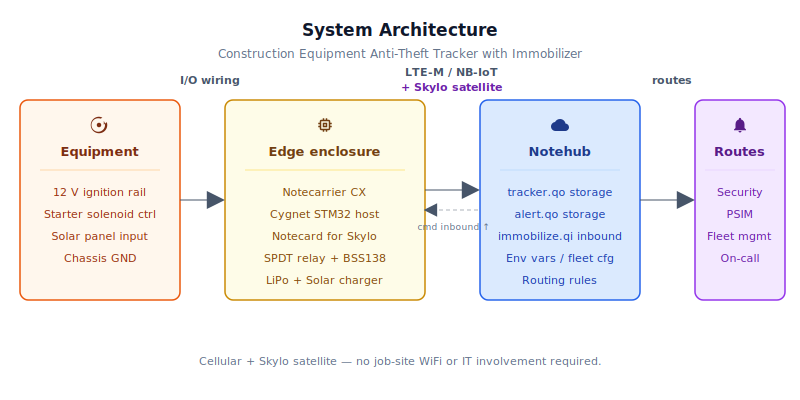
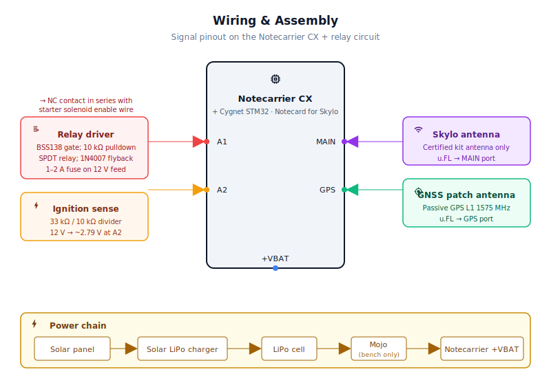
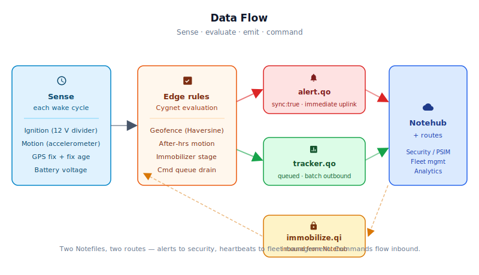

# Construction Equipment Anti-Theft Tracker with Immobilizer

<Note>

This reference application is intended to provide inspiration and help you get started quickly. It uses specific hardware choices that may not match your own implementation. Focus on the sections most relevant to your use case. If you'd like to discuss your project and whether it's a good fit for Blues, [feel free to reach out](https://blues.com/contact-sales/).

</Note>

A [loss prevention](https://blues.com/loss-prevention/) reference design for construction equipment fleets. A Blues [Notecard for Skylo](https://shop.blues.com/products/notecard?utm_source=dev-blues&utm_medium=web&utm_campaign=store-link), [Notecarrier CX](https://shop.blues.com/products/notecarrier-cx?utm_source=dev-blues&utm_medium=web&utm_campaign=store-link), LiPo battery, and small solar panel turn any skid steer, light tower, portable compressor, or generator into a hardened asset with continuous location monitoring, geofence breach detection, after-hours motion alerts, and a remotely-staged ignition immobilizer proof of concept — all on a self-contained cellular-plus-satellite link that requires zero job-site WiFi or IT involvement.

## 1. Project Overview

**The problem.** Construction equipment theft is a serious, costly, and chronically underreported problem. A skid steer that costs $60,000 to replace can be driven onto a flatbed and hauled off in under ten minutes. A light tower or portable generator can be gone before the morning crew arrives. These aren't smash-and-grab events — the equipment is large, identifiable, and completely exposed on a site that often goes unwatched overnight. Law enforcement recovery rates for heavy equipment are low; the stolen unit frequently ends up at a rural stash yard, stripped, or loaded into a shipping container for export. Neither scenario is good for cellular telemetry that depends on urban coverage.

The result is an industry that leans heavily on equipment marking, insurance claims, and post-theft police reports. What's mostly missing is a device that provides real-time location during a theft in progress *and* can physically disable the equipment before it leaves the region — all without depending on an infrastructure that may not exist at the job site or at the final stash location.

This project is that device. It monitors GPS location against a configurable job-site geofence, watches for unexpected after-hours motion, and accepts a remote immobilizer command from Notehub that stages a relay to cut the ignition circuit on the thief's next key-on attempt — a polled, staged proof-of-concept immobilizer rather than a continuously-held cut, with the limitations that implies (see §9). The whole stack — GPS, cellular, and satellite fallback — is contained in a single Blues Notecard for Skylo installed in a weatherproof enclosure that runs indefinitely on a LiPo battery topped off by a small solar panel.

**Why Notecard.** Construction sites have no WiFi. Even if a site happens to have a hotspot, requiring site IT coordination for a security device defeats the purpose. Cellular works for the vast majority of scenarios — but a stolen skid steer doesn't stay parked in a well-covered urban area. It ends up in a rural equipment yard, a metal barn, or a shipping container at a port. That's the scenario where cellular alone fails and satellite becomes the difference between a recovered asset and a total write-off. The Notecard for Skylo ([NOTE-NBGLWX](https://dev.blues.io/datasheets/notecard-datasheet/note-nbglwx/)) handles all three radio paths — LTE-M/NB-IoT cellular, WiFi (where available), and Skylo satellite — in a single M.2 module, without any firmware branching. Planetary roaming and satellite fallover are not optional extras for this use case; they are the core differentiators.

**Deployment scenario.** A NEMA 4X weatherproof enclosure is hidden inside the equipment housing or attached to a non-visible structural member. Power is self-contained: a LiPo battery kept topped off by a small rooftop solar panel — so the tracker keeps running even after a thief disconnects the equipment's main battery. Two wires tap the ignition circuit: one reads ignition-on state via a voltage divider, one runs through the relay that can cut the starter circuit on command. Antennas are routed to externally-mounted elements that have a clear view of the sky.

## 2. System Architecture



**Device-side responsibilities.** The Cygnet STM32 host embedded in the [Notecarrier CX](https://dev.blues.io/datasheets/notecarrier-datasheet/notecarrier-cx-v1-3/) wakes on a configurable timer, reads ignition state from a voltage divider on the 12V ignition line, reads motion status from the Notecard's built-in accelerometer via [`card.motion`](https://dev.blues.io/api-reference/notecard-api/card-requests/#card-motion), and requests the latest GPS fix via [`card.location`](https://dev.blues.io/api-reference/notecard-api/card-requests/#card-location). It evaluates the current position against the stored job-site geofence using the Haversine formula, checks whether it is within the configured after-hours window, and examines the inbound command queue for any operator-issued immobilize instruction. Alert notes and heartbeat notes are added to the Notecard's queue over I²C using the `note-arduino` library's request helpers. State (geofence coordinates, immobilizer stage, cadence parameters) is serialized to Notecard flash before each sleep and recovered on the next wake using [`NotePayloadSaveAndSleep`](https://dev.blues.io/guides-and-tutorials/notecard-guides/attention-pin-guide/) and `NotePayloadRetrieveAfterSleep`.

**Notecard responsibilities.** The Notecard for Skylo stores queued [Notes](https://dev.blues.io/api-reference/glossary/#note) in on-device flash, manages the cellular/satellite session on the configured [`hub.set`](https://dev.blues.io/api-reference/notecard-api/hub-requests/#hub-set) `outbound` cadence, and flushes any `sync:true` alert notes immediately — bypassing the normal batch window. It also owns GPS/GNSS acquisition, accelerometer motion tracking, real-time clock, and battery voltage measurement. [Environment variables](https://dev.blues.io/guides-and-tutorials/notecard-guides/understanding-environment-variables/) set in Notehub are pulled on each wake so operators can retune the geofence, after-hours window, and host wake / sync cadence without a firmware re-flash. When cadence variables change, the firmware reissues both `hub.set` (outbound/inbound windows) and `card.location.mode` (GNSS acquisition seconds) so all three Notecard cadences stay in sync.

**Notehub responsibilities.** [Notehub](https://notehub.io) ingests events, stores every event, and applies project-level [routes](https://dev.blues.io/notehub/notehub-walkthrough/#routing-data-with-notehub). The Notecard manages its own cellular and Skylo satellite sessions against the supported carrier networks worldwide via its embedded global SIM and delivers data to Notehub over the Internet. Alert notes (`alert.qo`) and tracker heartbeats (`tracker.qo`) land in separate Notefiles so they can be fanned out to different downstream systems at different urgencies — alerts to a PSIM (physical security information management) platform or on-call system, heartbeats to a fleet-management or asset-tracking store. Operators issue immobilize and release commands by posting a Note to the device's `immobilize.qi` inbound queue directly from the Notehub UI or via the Notehub REST API. [Smart Fleets](https://dev.blues.io/notehub/notehub-walkthrough/#using-smart-fleet-rules) allow you to configure geofence and after-hours defaults per job site or per equipment class without touching individual device settings.

**Routing to the cloud (high level).** Notehub supports HTTP, MQTT, AWS IoT, Azure, GCP, Snowflake, and other destinations; route setup is project-specific. See the [Notehub routing docs](https://dev.blues.io/notehub/notehub-walkthrough/#routing-data-with-notehub) — this project ships no specific downstream endpoint.

## 2.5 Quickstart

**What you'll have when done:**
- Device powered and claimed in Notehub, showing real GPS location
- Real-time geofence alerts when the device moves outside a job-site boundary
- Ability to stage an immobilizer command from the Notehub UI and verify it fires on the next ignition key-on
- Confidence in the firmware and sensor behavior before any live equipment wiring

**Fastest path to first event (bench test, no ignition circuit yet):**

1. **Assemble the unit.** Insert Notecard for Skylo into Notecarrier CX M.2 slot. Connect LiPo battery to Notecarrier CX JST battery header. Route antenna cables with slack (MAIN u.FL → Skylo-certified antenna, GPS u.FL → passive GNSS patch) — finalize placement later when enclosure location is set. Mount everything in a NEMA 4X weatherproof box. Power via USB to Notecarrier CX.

2. **Get your ProductUID.** Sign up at [notehub.io](https://notehub.io), create a new project, and copy the [ProductUID](https://dev.blues.io/notehub/notehub-walkthrough/#finding-a-productuid) from the project settings.

3. **Flash the firmware.**
   - Install [Arduino IDE](https://www.arduino.cc/en/software) or `arduino-cli`.
   - In Arduino Boards Manager, install the STM32 core and select board "Blues Cygnet".
   - In Arduino Library Manager, install "Blues Wireless Notecard".
   - Open `firmware/construction_equipment_anti_theft/construction_equipment_anti_theft.ino`.
   - Paste your ProductUID into the `PRODUCT_UID` string at the top of the sketch.
   - Flash to the Notecarrier CX.
   
   **Via arduino-cli:**
   ```bash
   arduino-cli compile --fqbn "STMicroelectronics:stm32:Cygnet" \
     firmware/construction_equipment_anti_theft
   arduino-cli upload --port /dev/ttyACM0 --fqbn "STMicroelectronics:stm32:Cygnet" \
     firmware/construction_equipment_anti_theft
   ```

4. **Claim the device.** Power the unit and keep it powered. The Notecard connects to Skylo cellular on first boot and auto-provisions to your project. Open Notehub, navigate to your project → Devices, and confirm the Notecarrier CX appears in the device list within 30 seconds.

5. **Watch the heartbeat.** Click the device in Notehub and open the Events tab. Within 1–2 minutes you should see `tracker.qo` heartbeat notes showing current `lat`, `lon`, and battery voltage. If nothing appears, check USB power and antenna placement (clear sky view required for Skylo lock).

6. **Test the geofence.** In Notehub's Fleet view, set environment variables:
   - `fence_enabled` = `1`
   - `fence_lat` = your current latitude (shown in the device event detail)
   - `fence_lon` = your current longitude
   - `fence_radius_m` = `20` (20-meter test radius)
   
   Wait 4–5 minutes for the inbound sync to deliver these variables to the device. Then physically move the device ~25 meters away and watch the Events log for a `geofence_breach` alert. Alert should appear within 1–2 wake cycles. If testing during business hours (6 AM–6 PM UTC default), the device wakes every 60 minutes — use the after-hours window (6 PM–6 AM) for faster 2-minute wake cycles.

7. **Test immobilizer staging.** From the Notehub device view, use the command bar to post a Note to `immobilize.qi`:
   ```json
   {"cmd":"immobilize"}
   ```
   Watch the Events log for `immobilize_armed` — that Note confirms the device received and staged the command. Now simulate a key-on edge: connect the Cygnet's A2 GPIO to GND (ignition OFF state), let it sit for one full wake cycle, then briefly short A2 to 3.3V (ignition ON). On the next wake after the OFF→ON transition, the relay driver pin A1 should pulse HIGH and `ignition_on_immobilized` should appear in the Events log. This confirms the immobilizer path is functional before live wiring.

## 3. Hardware Requirements

> **12 V systems only.** This reference design — the voltage-divider ratios, relay coil rating, and all wiring guidance — is engineered for 12 V electrical systems. Most compact construction equipment (skid steers, portable generators, light towers) ships with a 12 V system, but larger machines (heavy excavators, some European platforms) use 24 V. With the 33 kΩ / 10 kΩ ignition-sense divider shown here, a 24 V ignition rail would put approximately 5.6 V on the Cygnet A2 GPIO — exceeding the 3.3 V limit — and the 12 V relay coil would overheat. **Verify your equipment's system voltage before proceeding.** Adapting to 24 V requires different divider values (e.g. 68 kΩ high-side + 10 kΩ low-side → 24 V × 10/78 ≈ 3.1 V, within the GPIO limit) and a 24 V–rated relay coil.

| Part | Qty | Rationale |
|------|-----|-----------|
| [Notecarrier CX](https://shop.blues.com/products/notecarrier-cx?utm_source=dev-blues&utm_medium=web&utm_campaign=store-link) ([datasheet](https://dev.blues.io/datasheets/notecarrier-datasheet/notecarrier-cx-v1-3/)) | 1 | Compact carrier with embedded Cygnet STM32 host MCU — no separate Swan or Feather needed. ATTN pin is wired to control the Cygnet's power rail, enabling deep sleep via `card.attn`. |
| [Notecard for Skylo (NOTE-NBGLWX)](https://shop.blues.com/products/notecard?utm_source=dev-blues&utm_medium=web&utm_campaign=store-link) ([datasheet](https://dev.blues.io/datasheets/notecard-datasheet/note-nbglwx/)) | 1 | All-in-one LTE-M/NB-IoT/GPRS + WiFi + Skylo satellite in a single M.2 module. Automatic cellular-to-satellite fallover with no firmware changes. Ships with its Skylo-certified `MAIN` cellular/satellite antenna (see antenna row below). Includes 500 MB cellular data and 10 KB/month Skylo data. |
| [Blues Mojo](https://shop.blues.com/products/mojo?utm_source=dev-blues&utm_medium=web&utm_campaign=store-link) ([datasheet](https://dev.blues.io/datasheets/mojo-datasheet/)) | 1 | Bench-only coulomb counter for energy validation during commissioning. Placed inline on the +VBAT rail to measure current draw across sleep, active, and transmit phases. Not deployed in the field (see §9). |
| 3.7 V LiPo battery, 2000 mAh, JST-PH 2.0 mm (e.g. [Adafruit 2011](https://www.adafruit.com/product/2011), or equivalent 2000–4000 mAh cell) | 1 | Primary energy storage. Size capacity against expected solar availability and desired dark-sky reserve; see §8 for a phase-by-phase current-draw breakdown to inform your sizing. |
| 6 V, 1 W solar panel, ~110×70 mm (e.g. [Voltaic Systems P110](https://voltaicsystems.com/p110/)) | 1 | Trickle-charges the LiPo during daylight hours. Construction equipment typically lives outdoors; size up (2–3 W) for sites with limited direct sun or extended overcast periods. |
| Solar LiPo charger module, 3.7 V LiPo output (e.g. [SparkFun Sunny Buddy PRT-12885](https://www.sparkfun.com/products/12885), or equivalent MPPT/CV-mode charger) | 1 | Sits between the solar panel and the LiPo, protecting the battery from overcharge. The Notecarrier CX provides a LiPo JST input; the charger output connects to it. Verify the charger's output connector matches the Notecarrier CX's battery header. |
| BSS138 logic-level N-channel MOSFET, SOT-23 (e.g. [Nexperia BSS138](https://assets.nexperia.com/documents/data-sheet/BSS138.pdf) or equivalent with R_DS(on) ≤ 3.5 Ω at V_GS = 2.5 V and I_D ≥ 300 mA) | 1 | Low-side relay coil driver. The correct selection criterion for a 3.3 V logic-level gate drive on a security-critical path is **R_DS(on) at V_GS = 2.5 V**, not threshold voltage. The Nexperia BSS138 datasheet specifies R_DS(on) max 3.5 Ω at V_GS = 2.5 V, I_D = 100 mA. At the relay coil current (~150–175 mA for a typical ISO 280 coil), worst-case V_DS ≤ 175 mA × 3.5 Ω ≈ 0.61 V and P_D ≈ 0.11 W — within the SOT-23 thermal rating. The relay coil sees ≥ 11.4 V of the 12 V supply, well above its pull-in threshold. Drain to relay coil −; source to GND. The 10 kΩ gate-to-source pulldown keeps the MOSFET off when the GPIO is high-impedance during reset. |
| Automotive SPDT relay, 12 V coil, 30 A contacts — ISO 280 mini relay (e.g. Bosch 0 332 019 150 or equivalent Tyco/TE V23134-J52-X255) | 1 | Wired in series with the equipment's **starter solenoid enable or ignition/run-start control circuit** — the low-current signal wire that authorizes cranking, not the high-current cable that feeds the starter motor itself. When the coil is energized, the normally-closed contact opens, preventing the engine from cranking. Available at any automotive supplier or electronics distributor. |
| Inline automotive fuse holder with 1 A or 2 A mini (ATC/ATO blade) fuse | 1 | Placed on the wire feeding the relay coil + terminal from the 12 V battery or ignition tap — as close to the power source as practicable. A typical ISO 280 coil draws ~150–175 mA; a 1 A fuse provides ~6× margin over continuous coil current while protecting the added harness from a short-circuit fault. Do not rely on the equipment's upstream fusing — any newly-added conductor tied to battery or ignition power should carry its own fuse near the source. |
| 1N4007 diode | 1 | Flyback protection across the relay coil. Essential for protecting the BSS138 MOSFET drain from the inductive spike when the coil de-energizes. |
| 10 kΩ resistor, ¼ W | 1 | Gate-to-source pulldown on the BSS138. Ensures the MOSFET stays off if the Cygnet GPIO is high-impedance during reset or power-on. |
| 33 kΩ + 10 kΩ resistors, ¼ W, 1% tolerance | 2 | Resistive voltage divider for ignition sense: 33 kΩ high-side (to 12 V rail) + 10 kΩ low-side (to GND) → 12 V × 10 / (33 + 10) ≈ 2.79 V at A2 — safely within the Cygnet's 3.3 V GPIO absolute maximum. 1% tolerance for a consistent threshold. **POC-only front end** — this bare divider provides no protection against automotive load-dump or starter transients; see §4 and §9 for production protection guidance. |
| NEMA 4X weatherproof enclosure, ~150×100×75 mm (e.g. [Polycase WC-32](https://www.polycase.com/wc-32) or Hammond 1554N2GYCL) | 1 | Rated for outdoor hose-down environments. Mount inside the equipment housing where it is not visible from outside. |
| Skylo-certified cellular/satellite antenna — **use the antenna included in the NOTE-NBGLWX kit** | 1 | Connects to the `MAIN` u.FL on the Notecard for Skylo. The NOTE-NBGLWX is certified on Skylo's network exclusively with the included antenna; substituting a different antenna voids Skylo network certification and may result in network blocking. See the [antenna guide](https://dev.blues.io/datasheets/application-notes/antenna-guide/) for placement requirements. |
| Passive GNSS antenna, GPS L1 1575 MHz, u.FL connector, outdoor-rated (e.g. [Taoglas FXP73.07.0100A](https://www.taoglas.com/product/fxp73-flexible-adhesive-gps-gnss-antenna-100mm-u-fl/) flexible adhesive patch with 100 mm u.FL lead, or equivalent passive GPS patch) | 1 | Connects to the `GPS` u.FL on the Notecard for Skylo. Must be a passive antenna (the `GPS` port does not supply bias voltage). Mount outdoors with clear sky view alongside the MAIN antenna. |

All Blues hardware ships with an active SIM including 500 MB of cellular data and 10 years of service — no activation fee, no monthly commitment.

> **Important satellite note.** Skylo's constellation sits in geostationary orbit (GEO). From the northern hemisphere, the antenna needs an unobstructed view toward the southern sky to lock onto the satellites. A metal equipment cab that blocks the southern horizon will prevent satellite connectivity. Mount the antenna on the roof of the enclosure and orient it accordingly. See the [Satellite Best Practices guide](https://dev.blues.io/starnote/satellite-best-practices/) for detailed antenna placement guidance.

## 4. Wiring and Assembly

> **Safety.** The ignition and starter circuits on heavy equipment carry significant inrush current and may involve safety-critical functions. All wiring must be performed by qualified personnel following the equipment manufacturer's service manual and applicable electrical codes. The relay wiring described here is a reference example — confirm the correct interrupt point for your specific machine (skid steer, generator, light tower, etc.) before installation. Never interrupt circuits that control active running loads (fuel injection, hydraulics) while the engine is running.

The Notecard for Skylo seats into the Notecarrier CX's M.2 slot. Route the **`MAIN` u.FL** lead (cellular/satellite) to the Skylo-certified antenna included with the kit. Route the **`GPS` u.FL** lead to the separate passive GNSS antenna. Leave both antenna leads slack until the enclosure mounting location is finalized — antenna placement and sky-view clearance matter significantly for Skylo satellite connectivity.

The Mojo coulomb counter is a bench validation tool; see the [Mojo datasheet](https://dev.blues.io/datasheets/mojo-datasheet/) for wiring. Splice it inline on the +VBAT wire during bench testing to measure phase-by-phase current draw. Remove it before field installation (or leave it in circuit only if Qwiic telemetry is added — see §9).

> **12 V systems only.** Confirm the equipment's system voltage is 12 V before connecting the ignition-sense divider or relay coil. On a 24 V machine the divider would exceed the Cygnet GPIO limit and the relay coil would overheat. See the §3 note for 24 V adaptation guidance.

**Pin-by-pin wiring:**

**Power chain (follow this order):**
1. **Solar panel (+/−)** → charger module solar/panel input terminals.
2. **LiPo battery JST** → charger module battery output connector (the dedicated battery terminal on the charger, not its load output). The charger regulates charging from the solar panel and protects the cell from overcharge.
3. **Charger load/output (+)** → (during bench validation: Mojo `BAT` +, then Mojo `LOAD` + to next step; otherwise directly to next step) → **Notecarrier CX battery JST connector** (the `BATT` / `+VBAT` header). This is the supply rail for the Notecarrier CX and the embedded Cygnet. Charger load/output (−) and Mojo GND to common GND.

Verify that your charger module's output connector pitch and polarity match the Notecarrier CX battery JST-PH 2.0 mm header before connecting. Some charger modules ship with reversed polarity JST connectors.

**Signal wiring:**
- **A1 (relay driver GPIO)** → BSS138 gate. BSS138 source to GND. 10 kΩ gate-to-source pulldown resistor (from BSS138 gate to GND) — keeps the MOSFET off when the GPIO is high-impedance during reset. BSS138 drain to relay coil pin 85 (coil `−`). **Inline 1–2 A automotive fuse** on the wire between the 12 V supply tap and relay coil `+` (pin 86) — place the fuse as close to the 12 V source as practicable. 1N4007 cathode to pin 86 (+12 V), anode to pin 85 (MOSFET drain/coil `−`) — across the coil, clamping the inductive spike when the coil de-energizes. At V_GS = 3.3 V the BSS138 is operating within its R_DS(on)-characterized region (max 3.5 Ω at V_GS = 2.5 V per the Nexperia datasheet), so the relay coil is reliably energized on every wake that asserts the driver pin.
- **A2 (ignition sense)** → junction node of voltage divider. **33 kΩ high-side resistor** from the equipment's 12 V ignition rail to the A2 junction node. **10 kΩ low-side resistor** from the A2 junction node to GND. This divides 12 V down to approximately 2.79 V at the Cygnet GPIO — 12 V × 10 / (33 + 10) ≈ 2.79 V, safely within the 3.3 V absolute maximum.

  > **Ignition-sense front end — POC only.** The bare resistive divider provides no protection against the automotive transients that appear on ignition and battery lines in real equipment: load-dump events on generator-set systems can produce transients of 40–200 V above nominal; starter motor switching causes fast inductive spikes on the 12 V rail. A production design should add at least a TVS diode (e.g. 15 V unidirectional TVS from the 12 V rail to GND, placed before the divider high-side resistor) and an RC low-pass filter (e.g. 1 kΩ series + 100 nF to GND at the A2 node) to clamp transients and filter noise before they reach the Cygnet GPIO. An optically-isolated or fully-automotive-rated sensing front end is the correct long-term solution for production deployments.
- **Relay switched contacts** → NC (normally-closed) contact (pins 87a and 30) wired in series with the **starter solenoid enable or ignition/run-start control circuit** — the low-current signal wire that authorizes cranking. With coil de-energized, current flows normally; coil energized opens the circuit. **Do not wire the relay in the high-current starter motor power cable** (the heavy-gauge cable running between the battery positive terminal and the starter motor terminal); that cable carries hundreds of amperes during cranking and is not the correct intercept point for this relay. Consult the equipment service manual to identify the correct low-current control wire.
- **SDA / SCL** → Notecard for Skylo communicates internally on the Notecarrier CX's onboard I²C bus; no external wiring needed.
- **GND** → equipment chassis ground for the ignition sense divider and relay coil return. Keep this common with the Notecarrier CX GND.

**Enclosure and antenna mounting.** Mount the enclosure in a concealed, non-obvious location inside the equipment chassis — behind a panel, under a seat, inside an equipment bay. Route the antenna cable through a weatherproof grommet. For the best Skylo link budget, the antenna patch should face toward the sky with as much southern hemisphere clearance as possible from the installation latitude.



## 5. Notehub Setup

1. **Create a project.** Sign up at [notehub.io](https://notehub.io) and [create a project](https://dev.blues.io/quickstart/notecard-quickstart/notecard-and-notecarrier-pi/#set-up-notehub). Copy the [ProductUID](https://dev.blues.io/notehub/notehub-walkthrough/#finding-a-productuid) and paste it into `firmware/construction_equipment_anti_theft/construction_equipment_anti_theft.ino` as `PRODUCT_UID`.
2. **Claim the Notecard.** Power the unit. On first cellular connection the Notecard auto-provisions to your project. Verify the device appears in the Notehub device list.
3. **Create a Fleet per job site.** [Fleets](https://dev.blues.io/guides-and-tutorials/fleet-admin-guide/) group devices for shared configuration. One fleet per active job site is a natural boundary — all equipment on site shares the same geofence center and after-hours window via fleet-level [environment variables](https://dev.blues.io/guides-and-tutorials/notecard-guides/understanding-environment-variables/), with per-device overrides available when a specific machine has unusual requirements. [Smart Fleets](https://dev.blues.io/notehub/notehub-walkthrough/#using-smart-fleet-rules) can automate fleet membership based on location data.
4. **Set environment variables.** All variables are optional; firmware defaults are shown. Variables are pulled on each device wake via a delta check — no firmware re-flash required to retune thresholds. When cadence variables change, the firmware automatically reissues both `hub.set` (outbound and inbound session windows) and `card.location.mode` (GNSS acquisition cadence) to keep all three Notecard cadences in sync with the updated host wake interval.

   | Variable | Default | Range / Notes | Purpose |
   |---|---|---|---|
   | `fence_enabled` | *(not set)* | `1` to enable | **Recommended commissioning flag.** When set to `1`, applies `fence_lat` and `fence_lon` to the geofence regardless of their numeric values. Preferred over the legacy non-zero-check fallback because it supports fences centered exactly on latitude 0° or longitude 0°. If `fence_enabled` is absent, the firmware falls back to checking that `fence_lat` and `fence_lon` are both non-zero. |
   | `fence_lat` | *(first GPS fix)* | Decimal degrees | Latitude of job-site geofence center. Set `fence_enabled=1` alongside this value (see above). If neither `fence_enabled` nor a non-zero `fence_lat` is present, firmware anchors the geofence at the first valid GPS fix after cold boot. |
   | `fence_lon` | *(first GPS fix)* | Decimal degrees | Longitude of job-site geofence center. Set `fence_enabled=1` to apply this value regardless of magnitude — the legacy fallback silently ignores a `fence_lon` of exactly `0.0` (the prime meridian). |
   | `fence_radius_m` | `200` | > 0 | Geofence radius in meters. 200 m works well for a single job site; expand for large sites or reduce for tighter perimeter security. |
   | `after_hours_start` | `18` | 1–23 | UTC hour when after-hours monitoring begins. `0` is treated as "unset" (firmware keeps existing value). Adjust for the UTC offset of the deployment region. |
   | `after_hours_end` | `6` | 0–23 | UTC hour when after-hours monitoring ends. `0` (midnight) is valid. |
   | `heartbeat_stopped_min` | `60` | > 0 | Minutes between host wake cycles and queued heartbeat notes when equipment is stationary. Also controls the daytime inbound cadence (the Notecard polls Notehub once per this interval while parked — see `inbound_min`). The worst-case geofence-detection latency during business hours equals this value; reduce it for faster detection at the cost of more wake cycles. |
   | `heartbeat_moving_min` | `5` | > 0 | Minutes between **queued** heartbeat notes when the Notecard accelerometer reports motion. Also sets the GNSS acquisition cadence (`card.location.mode seconds`) so the Notecard re-acquires a fresh position fix at this interval while moving. Note that heartbeat records accumulate in local flash and are batch-transmitted on the next outbound sync session; they are not individually transmitted at this cadence. Real-time pursuit location updates come from `alert.qo` notes (`sync:true`), not from the heartbeat queue. |
   | `heartbeat_afterhours_min` | `2` | > 0 | Minutes between host wake cycles during the after-hours window. Controls alert-detection latency — the Cygnet wakes this often to scan for motion and check the command queue. Heartbeats still queue at the stationary/moving rate regardless of this value. Does **not** control the Notecard inbound cadence; see `inbound_min`. |
   | `inbound_min` | `4` | 1–60 | Short inbound interval used **after-hours and when moving** — how often the Notecard polls Notehub for queued commands and environment-variable updates during active-monitoring windows. During daytime stopped operation the firmware automatically uses `heartbeat_stopped_min` as the inbound interval instead, so inbound sessions match host wakes and no idle cellular connections are initiated while the equipment is parked on the job site. The inbound poll is Notecard-driven and does **not** wake the host MCU. |
   | `outbound_min` | `240` | > 0 | Minutes between Notecard outbound batch sessions — how often queued heartbeat notes are transmitted to Notehub. Intentionally longer than `heartbeat_stopped_min` so multiple heartbeats accumulate per outbound session, reducing total cellular radio time without degrading detection latency. Alert notes (`sync:true`) bypass this window and transmit immediately. |
   | `alert_cooldown_min` | `5` | > 0 | Minimum minutes between repeated alerts of the same type. Each alert type (`geofence_breach`, `motion_after_hours`, `cmd_retrieve_failed`) has its own independent cooldown timer, so one alert type cannot suppress the other. On the Skylo satellite link, consider raising this to 15–30 minutes to protect the 10 KB/month data budget during a sustained geofence-breach event. |

5. **Issue an immobilize command.** From the Notehub UI (or via the [Notehub REST API](https://dev.blues.io/api-reference/notehub-api/api-introduction/)), add a Note to the device's `immobilize.qi` inbound queue with body `{"cmd":"immobilize"}`. Command delivery has two **sequential** latency stages: (1) the Notecard pulls the inbound Note on its next `inbound` sync session, and (2) the host Cygnet processes the command only when it next wakes and runs `setup()`. Under the default cadence, combined worst-case end-to-end latency from posting the command to the `immobilize_armed` acknowledgment appearing in Notehub is at most **~6 minutes** during the after-hours window (≤ 4 min for the Notecard inbound sync, then ≤ 2 min until the next Cygnet wake), **~9 minutes** while moving (4 + 5 min), and just under **2 hours** while stationary during business hours (up to 60 min for the Notecard daytime inbound sync + up to 60 min until the next Cygnet wake). The daytime inbound automatically extends to match `heartbeat_stopped_min` (default 60 min) to avoid idle cellular sessions; if near-real-time command delivery is required around the clock, reduce `heartbeat_stopped_min` or add a motion-triggered wake (see §9 Production next steps). To cancel before the relay fires, send `{"cmd":"release"}`.

   **Queue semantics — last command wins.** The firmware drains the entire `immobilize.qi` queue on each wake: it calls `note.get` in a loop until the queue is empty, applying each command in order. The final command in the queue takes effect. If you post `immobilize` and immediately follow it with `release`, the `release` will win on the same wake cycle. Keep at most one outstanding command in the queue at any time; do not post a new command until either the `immobilize_armed` alert (confirming a staged immobilize) or the `release_confirmed` alert (confirming the immobilize was cleared) appears in Notehub. Both alerts are emitted once — on the exact wake cycle that processes the corresponding command. This is a **staged, edge-triggered** POC immobilizer — the relay is not asserted until the device wakes and detects an OFF→ON ignition edge while the command is staged (one prior wake observed OFF, the firing wake observes ON). The relay deliberately does not fire while the engine is already running.

   > **Important:** For a remote immobilizer this is a security-sensitive control path. Restrict `immobilize.qi` write access to tightly scoped, audited Notehub API credentials — do not use a project-wide admin token. Anyone who can post to `immobilize.qi` can cut ignition on the equipment.

6. **Configure routes.** Add one [route](https://dev.blues.io/notehub/notehub-walkthrough/#routing-data-with-notehub) for `alert.qo` (real-time delivery to a security or on-call platform) and a second for `tracker.qo` (position history to a fleet-management or asset-tracking store). Keeping the two Notefiles separate at the source lets you route them to different systems at different urgency without filter logic in the route itself.

## 6. Firmware Design

Main sketch: [`firmware/construction_equipment_anti_theft/construction_equipment_anti_theft.ino`](firmware/construction_equipment_anti_theft/construction_equipment_anti_theft.ino). All Notecard interaction is encapsulated in [`construction_equipment_anti_theft_helpers.h`](firmware/construction_equipment_anti_theft/construction_equipment_anti_theft_helpers.h) and [`construction_equipment_anti_theft_helpers.cpp`](firmware/construction_equipment_anti_theft/construction_equipment_anti_theft_helpers.cpp) — the `.ino` contains only application logic and the `setup()` / `loop()` entry points.

**Dependencies:**
- Arduino Core for STM32 ([`stm32duino/Arduino_Core_STM32`](https://github.com/stm32duino/Arduino_Core_STM32)) — target board: Blues Cygnet (available in the Arduino Boards Manager).
- [`Blues Wireless Notecard`](https://github.com/blues/note-arduino) (`note-arduino` library). Install via the Arduino Library Manager or `arduino-cli lib install "Blues Wireless Notecard"`.

### Modules

| Responsibility | Where |
|---|---|
| Notecard configuration: `hub.set`, GPS mode, motion mode, templates (idempotent, runs every wake) | `ensureConfigured()` |
| Compact note templates for satellite | `defineTemplates()` |
| Env-variable delta pull | `fetchEnvOverrides()` |
| Sync hub inbound/outbound and GNSS cadences to wake-state context | `applyHubCadence()` |
| Drain inbound command queue (last command wins) | `checkAndHandleCommand()` |
| Ignition state, motion state, GPS fix, battery voltage | `getIgnitionState()`, `getIsMoving()`, `getLocation()`, `getBatteryVoltage()` |
| Geofence evaluation (Haversine) | `haversineDistanceM()` |
| After-hours window evaluation (UTC) | `isAfterHours()` |
| Heartbeat and alert note emission | `sendHeartbeat()`, `sendAlert()` |
| Relay assertion / release | `assertRelay()`, `releaseRelay()` |
| State persistence across sleep | `NotePayloadSaveAndSleep` / `NotePayloadRetrieveAfterSleep` |

### Sensor reading strategy

**Ignition sense.** A voltage divider on the equipment's 12 V ignition rail presents ~2.79 V to the Cygnet's A2 pin when the ignition key is ON — within the 3.3 V safe limit. The high-side resistor (33 kΩ, to the 12 V rail) and low-side resistor (10 kΩ, to GND) set the divider ratio: 12 V × 10 / (33 + 10) ≈ 2.79 V. On each wake the Cygnet reads A2 with `analogRead()` at 12-bit resolution, averaging 4 samples to filter automotive line noise and battery-sag transients during engine crank. State changes are governed by hysteresis thresholds: the averaged reading must exceed ~2.50 V (3103 counts on a 12-bit / 3.3 V ADC) to declare ignition ON, and must fall below ~2.00 V (2482 counts) to declare ignition OFF. Within the ~0.5 V hysteresis band the firmware holds the previous state, preventing chatter at the logic boundary and spanning the typical battery-sag floor (~10.5 V → ~2.44 V at the divider) during cold cranks.

**Motion.** The Notecard for Skylo's built-in accelerometer runs continuously in low-power mode. `card.motion.mode` configures it for 25Hz, ±4G sensitivity with a 60-second bucket. The firmware calls `card.motion` on each wake; when the bucket contains at least 3 events, the Notecard reports `"mode":"moving"`. This approach detects both equipment being driven away (sustained multi-axis motion) and equipment being loaded onto a trailer (tilt, vibration).

**GPS.** `card.location.mode` is set to `periodic` with a motion threshold of 4 events, so the Notecard only spins up the GNSS module when the accelerometer confirms the unit is actually moving — avoiding the multi-second GNSS warm-up penalty on every stationary wake. The firmware calls `card.location` to read the most recent fix; the Notecard caches the last valid location so the call returns quickly even when GNSS is not active.

> **Cached-fix latency.** Geofence and alert decisions are made on the most recently cached GNSS fix, which may not reflect the device's current position. Fix age is bounded by the GNSS acquisition cadence (`card.location.mode seconds`, default 5 minutes, tunable via `heartbeat_moving_min`). During the after-hours window the host wakes every 2 minutes but GNSS updates at 5 minutes, so two or three consecutive wakes may evaluate geofence against the same cached fix. The firmware captures the `time` field from `card.location` (the epoch of the cached fix) and computes `fix_age_s = now − fix_time` only when `card.time` returns a valid non-zero epoch. When `card.time` is unavailable — for example, on first boot before the Notecard has completed a Notehub session — `fix_age_s` is emitted as **`-1`** (sentinel: "age unknown") rather than `0`, so downstream consumers can distinguish a genuinely fresh fix from a case where the age simply cannot be determined. A value of `0` or greater is a real elapsed-seconds count. `fix_age_s` is included in every outbound note — both `tracker.qo` heartbeats and `alert.qo` events.

**Battery voltage.** `card.voltage` returns the LiPo rail voltage directly from the Notecard's internal ADC. Included in every note for battery state-of-charge trending.

### Event payload design

Both Notefiles use [`compact` note templates](https://dev.blues.io/notecard/notecard-walkthrough/low-bandwidth-design/#working-with-note-templates) with a `port` number. Compact templates are **required** for Notecard for Skylo: they store notes as fixed-length binary records rather than free-form JSON, shrinking per-note wire size by 3–5×.

Compact record sizes are derived directly from the template field types declared in `defineTemplates()`:

- **`tracker.qo`** — 4 floats (`lat`, `lon`, `bat_v`, `fix_age_s`) × 4 bytes + 5 int16 fields (`loc_valid`, `ignition`, `moving`, `immobilized`, `fence_ok`) × 2 bytes = **26 bytes** per heartbeat record.
- **`alert.qo`** — 4 floats (`lat`, `lon`, `bat_v`, `fix_age_s`) × 4 bytes + 3 int16 fields (`loc_valid`, `ignition`, `immobilized`) × 2 bytes + 1 string field (`alert`, 24-char sample) at 25 bytes (1-byte length prefix + 24 data bytes) = **47 bytes** per alert record.

At the 10 KB/month Skylo data budget (10,240 bytes), payload-only capacity is roughly **390 heartbeat-sized notes** (10,240 ÷ 26 bytes) or **215 alert-sized notes** (10,240 ÷ 47 bytes) per month. Protocol and session framing overhead reduce actual delivered counts below these payload-only maxima — validate against Notehub usage metrics and field measurements rather than relying on payload-only arithmetic. See §9 for practical budget guidance.

Example heartbeat (`tracker.qo`):

```json
{
  "file": "tracker.qo",
  "body": {
    "lat":         37.3387,
    "lon":       -121.8853,
    "loc_valid":   1,
    "ignition":    0,
    "moving":      0,
    "immobilized": 0,
    "bat_v":       3.92,
    "fence_ok":    1,
    "fix_age_s":   47.0
  }
}
```

`fix_age_s` is the age of the cached GNSS fix at the moment the note was queued, in seconds. **`-1.0`** means `card.time` was unavailable when the note was queued — the true fix age cannot be determined; do not treat this as a freshness indicator. A value of `0.0` or greater is a real elapsed-seconds count: well below `heartbeat_moving_min × 60` (default 300 s) indicates a fresh fix; approaching or exceeding that threshold means the geofence and alert decisions on this wake used a cached position from the previous GNSS acquisition cycle.

Example alert (`alert.qo`), sent with `sync:true`:

```json
{
  "file": "alert.qo",
  "body": {
    "alert":       "geofence_breach",
    "lat":         37.3521,
    "lon":       -121.9204,
    "loc_valid":   1,
    "ignition":    1,
    "immobilized": 0,
    "bat_v":       3.87,
    "fix_age_s":   112.0
  },
  "sync": true
}
```

Alert types:

| `alert` value | Meaning |
|---|---|
| `geofence_breach` | Equipment GPS fix is outside the configured fence radius |
| `motion_after_hours` | Accelerometer detects motion during after-hours window, ignition confirmed OFF |
| `ignition_on_immobilized` | Immobilize was staged; relay asserted on an OFF→ON ignition edge (not on a level read of ignition-ON) |
| `immobilize_armed` | Acknowledgment Note confirming the immobilize command was received and staged |
| `release_confirmed` | Acknowledgment Note confirming a `release` command cleared the staged or active immobilize; relay de-energized |
| `cmd_retrieve_failed` | Diagnostic: `note.get` on `immobilize.qi` exhausted all retries — the command path is unhealthy. Rate-limited by `alert_cooldown_min` (default 5 min) so a persistent I²C or Notecard fault does not generate repeated `sync:true` traffic. Investigate I²C wiring and Notecard firmware if this alert fires repeatedly. |

### Low-power strategy

The Cygnet host and the Notecard are both put to sleep between sensing cycles. At the end of each wake, the firmware calls `NotePayloadSaveAndSleep`, which serializes the `AppState` struct to Notecard flash as a base64 payload and then issues [`card.attn`](https://dev.blues.io/api-reference/notecard-api/card-requests/#card-attn) with `mode:sleep` — physically cutting the Cygnet's power via the Notecarrier CX's ATTN-controlled power rail. The Notecard itself enters its own [low-power idle state](https://dev.blues.io/notecard/notecard-walkthrough/low-power-firmware-design/) (~8–18 µA @ 5V) between cellular sync windows. After `sleep_sec` seconds, the ATTN pin goes HIGH and the Cygnet's power is restored; `setup()` runs fresh and `NotePayloadRetrieveAfterSleep` rehydrates the state struct.

The sleep duration adapts to context: 2 minutes during after-hours (fast theft detection), 5 minutes while moving (active tracking), 1 hour during business hours at rest (background monitoring — and worst-case geofence-detection latency while parked). The after-hours wake interval is intentionally shorter than the heartbeat emission interval — the device wakes every 2 minutes to check for alerts and inbound commands, but heartbeat notes queue at the stationary or moving rate regardless of time of day. This keeps the overnight note volume consistent with daytime operation while still catching a theft event within the scan window. **Sampling/queuing cadence and transmission cadence are always distinct.** Heartbeat notes are queued by the host into the Notecard's local flash, then transmitted to Notehub on the next outbound sync session — which fires at the `hub.set outbound` interval (set by `outbound_min`, default 240 minutes). A 5-minute moving sample rate means the Notecard accumulates a heartbeat every 5 minutes while in motion, but those records are batch-transmitted on the next outbound session unless an alert happens to force a `sync:true` flush first. Only `alert.qo` notes (with `sync:true`) bypass the outbound window and trigger an immediate uplink sync. Separately, the Notecard independently manages its own **inbound sync sessions** — these are cellular connections the Notecard initiates on its own schedule to pull queued commands and updated environment variables from Notehub. The inbound cadence is context-aware: when the equipment is parked and daytime, the interval matches `heartbeat_stopped_min` (default 60 min, set via `hub.set inbound`); when after-hours or moving, it shortens to `inbound_min` (default 4 min). These inbound sessions are Notecard-driven and occur regardless of whether the Cygnet host is currently awake. The host's 2-minute after-hours wake cycle and the Notecard's inbound cellular cadence are independent of each other and tuned via separate parameters (`heartbeat_afterhours_min` and `inbound_min`, respectively). The Notecard's inbound cadence is context-aware: short (`inbound_min`, default 4 min) when after-hours or moving, and long (`heartbeat_stopped_min`, default 60 min) when parked and daytime — so daytime inbound sessions match the host wake cadence rather than running dozens of times per hour against a parked asset. Both must be accounted for when sizing the energy budget (see §8).

**Env-var cadence retuning scope.** When an operator changes any cadence variable (`heartbeat_moving_min`, `heartbeat_stopped_min`, `heartbeat_afterhours_min`, `inbound_min`, or `outbound_min`) via Notehub, the firmware detects the change via the `env.get` delta check and calls `applyHubCadence()`, which reissues `hub.set` (outbound and inbound windows) and `card.location.mode` (GNSS acquisition seconds, set to `heartbeat_moving_s`). `applyHubCadence()` is also called immediately when the motion or after-hours context transitions, so the Notecard's inbound window switches between the short active-monitoring interval (`inbound_min`) and the long parked interval (`heartbeat_stopped_min`) without waiting for a future env-var change. The outbound window uses `outbound_s` (set by `outbound_min`, default 240 min) — decoupled from the host wake interval. Env-var changes do not affect `card.motion.mode` (accelerometer sensitivity and bucket size) — those are set at cold boot only and require a firmware update to change.

The GPS module is motion-gated at the Notecard level — it only activates after sustained accelerometer activity, keeping the GNSS radio silent during the many hours per day the equipment is parked and not moving.

### Retry and error handling

- The very first Notecard transaction — a `card.version` request issued immediately after `notecard.begin()` in `setup()` — uses `notecard.sendRequestWithRetry(req, 5)` (5-second window) to absorb the known cold-boot I²C race where the Cygnet host may power up before the Notecard is ready to ACK. This ensures I²C is confirmed live before `NotePayloadRetrieveAfterSleep()` runs. Without this guard, a transient startup race causes the state-restore call to silently return false, the firmware treats the wake as a cold boot, zeros `g_state`, and loses all staged immobilizer / alert-cooldown / fence state from the previous cycle. The subsequent `hub.set` in `ensureConfigured()` also uses `sendRequestWithRetry()` to handle an independent Notecard reset that occurs after the host has already booted.
- All `requestAndResponse` calls check for a `NULL` response before accessing the returned JSON. Calls to `fetchEnvOverrides`, `checkAndHandleCommand`, and `getLocation` also check for a non-null `"err"` field. Calls to `getIsMoving`, `getBatteryVoltage`, and `getEpochTime` do the same. Sensor calls that fail return safe defaults (zero for GPS coordinates, `false` for motion/ignition) rather than propagating bad data into alerts or notes.
- `note.get` on `immobilize.qi` returns `err` when no note is queued — the firmware silently ignores this and continues the wake cycle.
- `env.get` with the `time` delta parameter still performs the I²C request every wake, but when no environment variables have changed since the last pull the Notecard returns an `err` response rather than the full env-var payload — the firmware detects this and skips the overhead of re-parsing and re-applying unchanged values.
- When `env.get` does return updated values, the firmware immediately reissues `hub.set` via `applyHubCadence()` so the Notecard's outbound and inbound session windows reflect any changed heartbeat intervals. If this reissue is skipped (e.g., Notecard not ready), the cadence remains at the last successfully applied value.
- Alert de-duplication uses separate per-type cooldown timestamps (`last_geofence_alert_s` and `last_motion_alert_s`), so a geofence breach cooldown cannot suppress a concurrent after-hours motion alert and vice versa.

### Key code snippet 1: compact note template definition

The `format:"compact"` and `port:50` arguments are required for the Notecard for Skylo. Without them, notes destined for the satellite path may be dropped. The numeric type hints (`14.1` = 4-byte float, `12` = 2-byte signed int) define the binary record layout.

```cpp
J *req = notecard.newRequest("note.template");
JAddStringToObject(req, "file",   "tracker.qo");
JAddStringToObject(req, "format", "compact");
JAddNumberToObject(req, "port",   50);
J *body = JAddObjectToObject(req, "body");
JAddNumberToObject(body, "lat",         14.1);  // 4-byte float
JAddNumberToObject(body, "lon",         14.1);  // 4-byte float
JAddNumberToObject(body, "loc_valid",   12);    // 2-byte int16 — 1 = real fix, 0 = no fix
JAddNumberToObject(body, "ignition",    12);    // 2-byte int16
JAddNumberToObject(body, "moving",      12);    // 2-byte int16
JAddNumberToObject(body, "immobilized", 12);    // 2-byte int16
JAddNumberToObject(body, "bat_v",       14.1);  // 4-byte float
JAddNumberToObject(body, "fence_ok",    12);    // 2-byte int16 — 1 = in-fence, 0 = breach, -1 = unknown
JAddNumberToObject(body, "fix_age_s",   14.1);  // 4-byte float — seconds since last GNSS acquisition; -1 = age unknown (card.time unavailable)
notecard.sendRequest(req);
// Total compact record: 4 floats × 4 + 5 int16s × 2 = 26 bytes per note
```

### Key code snippet 2: immediate-sync alert

`sync:true` wakes the radio and flushes this note immediately, bypassing the normal outbound window. The difference between a geofence breach alert reaching the operator in seconds versus hours can determine whether the equipment is recovered.

```cpp
J *req  = notecard.newRequest("note.add");
JAddStringToObject(req, "file", "alert.qo");
JAddBoolToObject(req, "sync", true);
J *body = JAddObjectToObject(req, "body");
JAddStringToObject(body, "alert", "geofence_breach");
JAddNumberToObject(body, "lat",   cur_lat);
JAddNumberToObject(body, "lon",   cur_lon);
notecard.sendRequest(req);
```

### Key code snippet 3: relay assertion on key-on edge

The immobilizer does not cut power while the engine is running. It stages the relay and waits for the next OFF→ON ignition transition — *not* a level check. The previous wake's ignition state is persisted in `g_state.last_ignition_on` so the edge is detectable across sleep cycles. If the equipment was already running when the operator issued the immobilize command, the firmware deliberately holds off until the thief turns the key OFF and back ON; this prevents cutting the starter circuit while the engine is actively running and avoids the safety hazards called out in §4.

```cpp
bool ignition_edge = (!g_state.last_ignition_on && ignition_on);
if (g_state.immobilize_pending && ignition_edge && !g_state.immobilized) {
    assertRelay();
    g_state.immobilized        = true;
    g_state.immobilize_pending = false;
    sendAlert("ignition_on_immobilized", cur_lat, cur_lon, true, true);
}
```

### Key code snippet 4: adaptive sleep via NotePayloadSaveAndSleep

State is serialized before each sleep so the wake cycle has full context regardless of what triggered it. The duration adapts to the current risk level.

```cpp
uint32_t sleep_sec = afterhrs ? g_state.heartbeat_afterhours_s
                   : moving   ? g_state.heartbeat_moving_s
                   :             g_state.heartbeat_stopped_s;

NotePayloadDesc save = {0, 0, 0};
NotePayloadAddSegment(&save, kStateSegID, &g_state, sizeof(g_state));
NotePayloadSaveAndSleep(&save, sleep_sec, NULL);
```

## 7. Data Flow



**Collected every wake cycle.** Ignition state (12V voltage divider), motion status (Notecard accelerometer, read via `card.motion`), GPS fix (Notecard GNSS, read via `card.location`), battery voltage (`card.voltage`), UTC epoch (`card.time`). No I²C sensors external to the Notecard are used — all sensing is built into the Notecard for Skylo module.

**Transmitted:**

- `tracker.qo` — heartbeat notes are **queued** at the moving/stopped sample rate (every 5 min while moving, every 60 min while stationary), then **transmitted** in batches on the `hub.set outbound` schedule (default 240 minutes, set by `outbound_min`). Moving heartbeats accumulate in the Notecard's local flash at the 5-minute sample rate but are not delivered to Notehub individually on that cadence — they are batch-flushed when the outbound window fires or when a `sync:true` alert happens to force an earlier session. Real-time pursuit tracking therefore relies on repeated alert syncs, not on the heartbeat delivery cadence. Under normal stationary operation a properly-secured job site generates **24 heartbeat notes queued per 24 hours** (one per hour) and **6 outbound sessions per 24 hours** (one every 4 hours carrying ~4 heartbeats each), zero `alert.qo` notes, and `fence_ok:1` in every heartbeat. Inbound sessions are context-aware: roughly 24 sessions/day while parked and daytime (every 60 min), and up to roughly 180 sessions during the 12-hour after-hours window (every 4 min) — all contributing to the daily radio-session count and energy budget.
- `alert.qo` — emitted only on a rule trip, with `sync:true` to bypass the outbound queue. Each alert type (`geofence_breach`, `motion_after_hours`) has its own independent 5-minute cooldown so slow geofence oscillations or intermittent wind-buffeted vibration cannot flood the alert channel, and one alert type cannot suppress the other.

**Routed.** Both Notefiles reach Notehub via cellular (LTE-M / NB-IoT) or, when cellular coverage fails, via Skylo satellite NTN (non-terrestrial network). Routing from Notehub to the operator's preferred downstream system is project-specific; see the [routing docs](https://dev.blues.io/notehub/notehub-walkthrough/#routing-data-with-notehub).

**Alert triggers:**

- `geofence_breach` — cached GPS fix is more than `fence_radius_m` from the stored geofence center. The position used is the most recently cached fix from `card.location`; `fix_age_s` in the alert body indicates how stale that fix was at the moment the alert fired (`-1` if `card.time` was unavailable).
- `motion_after_hours` — Notecard accelerometer reports `"mode":"moving"` during the after-hours window AND ignition is confirmed OFF. Ignition-off + motion is the characteristic signature of equipment being towed or loaded — not driven.
- `ignition_on_immobilized` — an OFF→ON ignition edge is observed while `immobilize_pending` is set. Relay is asserted on the same wake cycle that detects the edge. This is a **staged, edge-triggered** immobilizer: the relay does *not* fire while the engine is already running, only on the next key-cycle the Cygnet observes (the previous wake's ignition state must have been OFF).
- `immobilize_armed` — operator command received and staged; relay will fire on the next OFF→ON ignition edge that the Cygnet observes.
- `cmd_retrieve_failed` — `note.get` on `immobilize.qi` exhausted all retries on this wake cycle; the command path is unhealthy. Rate-limited by `alert_cooldown_s` (default 5 min) so a persistent fault does not flood the operator inbox or satellite budget.

**Inbound commands.** The operator sends `{"cmd":"immobilize"}` or `{"cmd":"release"}` to `immobilize.qi` from the Notehub UI or REST API. End-to-end command latency has two sequential components: first, the Notecard must complete an inbound sync session to pull the queued Note from Notehub (the inbound interval is context-aware: `inbound_min` default 4 min after-hours/moving, or `heartbeat_stopped_min` default 60 min when parked and daytime); second, the host Cygnet must wake and execute `setup()`, where `checkAndHandleCommand()` drains the entire `immobilize.qi` queue — calling `note.get` in a loop until the queue is empty — and applies each command in order (last command wins). The host wake interval is context-dependent: after hours (≤ 2 min), moving (≤ 5 min), stationary business hours (≤ 60 min by default). Combined worst-case end-to-end latency under default settings: **up to ~6 minutes** after-hours (≤ 4 min inbound sync + ≤ 2 min wake interval), **up to ~9 minutes** while moving (4 + 5 min), and **just under 2 hours** while stationary during business hours (up to 60 min daytime inbound sync + up to 60 min wake interval). The worst-case window — a stationary unit during business hours — is therefore just under **2 hours** from command post to `immobilize_armed` acknowledgment appearing in Notehub. If near-real-time command delivery is required around the clock, reduce `heartbeat_stopped_min` or see §9 Production next steps for the interrupt-driven ignition sense upgrade. Note that reliable inbound delivery requires cellular or WiFi connectivity — the Skylo satellite link is primarily uplink; commands staged while the unit is out of cellular coverage will be delivered when cellular is next restored.

## 8. Validation and Testing

**Expected steady-state cadence.** A correctly-deployed tracker on a secure job site generates `tracker.qo` heartbeat notes at the stationary cadence (every 60 minutes by default, day and night), zero `alert.qo` notes, and confirms `fence_ok:1` in every heartbeat. Notes accumulate in Notecard flash and are batch-transmitted in outbound sessions every 4 hours by default — expect 24 heartbeats queued per 24-hour period (6 outbound sessions, each carrying ~4 notes). The device wakes every 2 minutes during after-hours to scan for motion and check inbound commands, but only emits a heartbeat when the 60-minute interval elapses. Any single `alert.qo` event warrants investigation.

**Geofence first-light test.** With the unit powered and Notehub showing the device connected, set `fence_lat` and `fence_lon` in Notehub to the device's current coordinates (visible in Notehub's device view), and set `fence_radius_m` to a small value (e.g. `20`). Wait for the env-var update to reach the device (one inbound sync cycle, default 4 minutes).

> **Important:** Motion does **not** wake the host MCU. The host polls `card.motion` only when it wakes on its normal timer. During business hours, a stationary unit wakes every 60 minutes (default `heartbeat_stopped_min`) — physically moving the device will not trigger a response until the next scheduled wake. To make the test practical, do one of the following before moving the device:
> - Run the test during the after-hours window (default 6 PM–6 AM UTC), when the host wakes every 2 minutes.
> - Temporarily reduce `heartbeat_stopped_min` to `2` in Notehub env vars and wait for the update to be applied.
> - Connect USB serial to observe the active `setup()` cycle and move the device immediately after a wake.

Once the device has woken with the updated geofence and the device is moved ~25 m outside the radius, a `geofence_breach` alert should appear in the Notehub event log **after the next qualifying wake cycle that has a sufficiently fresh GNSS fix**. Because geofence decisions use the most recently cached fix from `card.location` (bounded by the `card.location.mode` periodic interval, default 5 minutes), one or two wake cycles may pass before the Notecard acquires an updated fix that places the device outside the radius and triggers the alert. The alert fires within the same `setup()` that evaluates the breach — it is not deferred — but its timing is bounded by GNSS fix freshness, not by host-wake latency alone.

**Immobilizer test.** From the Notehub UI, post `{"cmd":"immobilize"}` to `immobilize.qi`. Command delivery involves two steps that must both complete before the host acts: (1) the Notecard retrieves the Note on its next inbound sync; (2) the host Cygnet wakes and calls `note.get` in `checkAndHandleCommand()`. To make this testable in a reasonable time, either reduce `heartbeat_stopped_min` to `2` (matching the after-hours cadence) or bench-test during the after-hours window when the host wakes every 2 minutes. Watch the Notehub event log for `immobilize_armed` — that Note is queued by the host *after it processes the command*, so its appearance confirms the host wake cycle has completed. **The relay fires on an OFF→ON ignition edge, not a level check** — at least one wake must record ignition OFF before the firing wake records ignition ON. To simulate a key-on edge, ensure A2 is at 0 V (ignition divider output low) for one full wake cycle, then pull A2 to 3.3 V (or momentarily short the voltage divider output high) before the next wake. On the wake that observes the OFF→ON transition, `ignition_on_immobilized` should appear in `alert.qo` and the relay driver pin (A1) should go HIGH.

**Power validation with Mojo.** Use the table below as a starting framework for sizing and diagnosing, not as a substitute for a bench soak. One important caveat applies to the published Notecard figures: Blues publishes Notecard current at **5 V** on the `VUSB` input — at the LiPo rail (~3.7–4.2 V) the same power dissipation appears as proportionally higher current. System-level totals (Cygnet + charger quiescent + relay driver) are not published by Blues; use the Mojo to measure them on your specific build.

Published Notecard for Skylo figures are from the [NOTE-NBGLWX low-power design guide](https://dev.blues.io/notecard/notecard-walkthrough/low-power-firmware-design/) and the [NOTE-NBGLWX datasheet](https://dev.blues.io/datasheets/notecard-datasheet/note-nbglwx/). System-level totals — Cygnet host, solar charger quiescent, and relay driver overhead added to the Notecard baseline — are not published by Blues and must be characterized on your specific build. Use the Mojo inline on the +VBAT rail to measure each phase rather than relying on generic estimates.

| Phase | Notecard-only (published, @ 5 V) | Whole-device guidance (measure with Mojo) |
|---|---|---|
| Deep sleep (Cygnet off via ATTN, Notecard idle) | ~8–18 µA (published) | Notecard contributes ~8–18 µA; solar charger quiescent adds a few µA. Measure total on your build. |
| Cygnet active, I²C transactions only (no radio) | — | Dominated by Cygnet active current. Measure with Mojo on your build. |
| Notecard cellular session (LTE-M) | ~200–350 mA avg, ~650 mA peak (published) | Notecard dominates; Cygnet and relay driver add a small increment. Measure with Mojo for system totals. |
| Notecard satellite session (Skylo NTN) | Not separately published | Measure with Mojo outdoors with confirmed satellite lock. Session current and duration depend on antenna placement and sky-view geometry — accurate characterization requires field testing. |

**Sizing the energy budget.** Two independent cadences drive the radio, and both must be accounted for in the power budget:

1. **Inbound sync sessions** — context-aware. While parked and daytime the Notecard inbound interval matches `heartbeat_stopped_min` (default 60 min), producing roughly **24 inbound sessions per day**. During the after-hours window the interval shortens to `inbound_min` (default 4 min), producing up to roughly **180 inbound sessions per 12-hour after-hours period**. In practice many of these are combined with outbound sessions by the Notecard, reducing the actual radio-on count. Under default settings the combined total is well under 210 sessions/day — significantly fewer than a constant 4-minute poll, and proportionally lower if the after-hours window is narrower.

2. **Outbound sync sessions** — the Notecard transmits queued heartbeat notes to Notehub on the `hub.set outbound` schedule (default 240 minutes, set by `outbound_min`), roughly **6 outbound sessions per 24 hours**. Each outbound session typically carries ~4 heartbeat notes queued during the 4-hour window. Alert syncs (`sync:true`) add additional short bursts when a rule trips.

The Cygnet host wake cycles (every 2 min after hours, every 5 min while moving, every 60 min at rest by default) are **host-only** active phases — a few seconds of I²C transactions with no radio involvement unless an alert fires during that wake.

Use the Mojo bench soak to measure actual phase currents on your build, then estimate daily mAh draw for your deployment's specific cadence and size the LiPo and solar panel accordingly. Use the [Mojo](https://dev.blues.io/datasheets/mojo-datasheet/) bench soak to validate your estimate: splice it inline on the LiPo-to-Notecarrier-CX +VBAT wire and measure a 24-hour soak. If you see continuous >50 mA draw, the Cygnet is not successfully entering deep sleep (usually a `card.attn` firmware or wiring issue). If you see the expected trace but alerts fail to transmit, check antenna placement and `hub.set` outbound configuration.

Satellite session validation requires outdoor antenna placement with clear sky view toward the equator. The first satellite acquisition can take several minutes — see the [Satellite Best Practices guide](https://dev.blues.io/starnote/satellite-best-practices/) for troubleshooting antenna placement and acquisition timing.

## 9. Limitations and Next Steps

**Simplified for the POC:**

- **Staged, polled, edge-triggered immobilizer — not a continuously-held cut.** The immobilizer in this POC is a _next-wake / next-key-on-edge_ design. `NotePayloadSaveAndSleep` physically cuts the Cygnet's power during the sleep window, so the relay coil de-energizes on every sleep interval and the NC contact re-closes — briefly restoring the ignition circuit. The Cygnet re-asserts the relay only when it wakes and reads `immobilized = true`. For the default 2-minute after-hours cycle, the relay is active for only a few seconds every 2 minutes; a determined thief who turns the key during the sleep gap can crank the engine. Additionally, the relay only fires on an OFF→ON ignition edge — the previous wake must have observed ignition OFF and the current wake must observe ignition ON. If the equipment is already running when the immobilize command is staged, the firmware deliberately holds off until the next key cycle (this avoids cutting the starter circuit while the engine is actively running, per the safety guidance in §4). If the thief cycles the key fully between two Cygnet wakes (OFF→ON→OFF inside one sleep window), the firing edge is missed entirely until the next OFF→ON transition the Cygnet observes. This is a proof-of-concept staging mechanism. Production deployments require a **latching (bistable) relay** that holds its contact state with no continuous coil power and survives Cygnet sleep, power cuts, and wiring interruptions — see Production next steps below.
- **Ignition-sense front end is POC-only — no transient protection.** The bare 33 kΩ / 10 kΩ voltage divider provides no protection against automotive electrical transients. Load-dump events on generator sets can produce transients 40–200 V above nominal 12 V; starter-motor switching creates fast inductive spikes on the battery rail. Both can exceed the Cygnet GPIO absolute maximum and damage the MCU. A production design must add a TVS diode (e.g. 15 V unidirectional, placed before the high-side divider resistor) and an RC low-pass filter (e.g. 1 kΩ + 100 nF at the A2 node) as a minimum, or use a properly isolated sensing front end. The relay-side vehicle interface carries the same risk; the 1N4007 flyback diode protects the MOSFET drain from the relay coil's inductive spike, but does not protect the 12 V feed from upstream transients — the inline fuse in the BOM addresses overcurrent only.
- **No interrupt-driven ignition sense.** The firmware polls ignition state on each wake. A thief who turns the key and drives away within the 2-minute window between wakes will have a head start before the `ignition_on_immobilized` event fires. A hardware interrupt from the ATTN pin triggered by the ignition-sense line would wake the Cygnet instantly on key-on — the Notecarrier CX ATTN wiring and the `card.attn` `auxgpio` mode support this pattern but it is not implemented in this POC.
- **Inbound commands require cellular.** The Skylo satellite link provides primarily uplink (device-to-cloud) data. `immobilize.qi` commands from Notehub to the device require a cellular or WiFi connection to be delivered. If the equipment is already in a dead zone, the operator must wait for cellular to be restored before the command arrives.
- **Geofence decisions use cached location data, and daytime detection latency is bounded by `heartbeat_stopped_min`.** The firmware calls `card.location` to read the Notecard's most recently cached GNSS fix — it does not wait for a fresh acquisition. The cached fix age is bounded by the GNSS acquisition cadence (`card.location.mode seconds`, default `heartbeat_moving_s` = 5 minutes), so one or two after-hours wake cycles may evaluate the geofence against the same stale fix before GNSS re-acquires. A geofence breach alert will not appear until both (a) the host wakes and (b) the Notecard has a sufficiently fresh fix that places the device outside the radius. During business hours, when the host wakes every 60 minutes (default), the worst-case detection latency for a theft that starts from a parked state is approximately 60 minutes plus up to 5 minutes of GNSS fix lag. Every outbound note includes `fix_age_s` (seconds ≥ 0, or `-1` when `card.time` is unavailable) so operators can assess the staleness of each geofence decision.
- **Geofence is a circle.** The firmware uses a Haversine-computed circle around a single center point. Irregular job-site boundaries (L-shaped lots, equipment lots separated by roads) would require multiple overlapping circles or a polygon geofence, neither of which is implemented here.
- **Single geofence.** The device stores one home location. Equipment that legitimately moves between job sites (morning deliveries, weekend staging) will generate false geofence breach alerts unless the operator updates `fence_lat` / `fence_lon` in Notehub ahead of each move.
- **No tamper detection.** The firmware does not detect cable cutting, enclosure intrusion, or GPS jamming. A motivated thief who locates and removes the tracker, jams the antenna, or removes the equipment battery before the solar reserve is depleted will defeat this POC design.
- **Satellite data budget.** The Notecard for Skylo includes 10 KB of Skylo data per month. Compact record sizes derived from the actual template field types are **26 bytes** per `tracker.qo` heartbeat (4 floats × 4 bytes + 5 int16 × 2 bytes) and **47 bytes** per `alert.qo` event (4 floats × 4 bytes + 3 int16 × 2 bytes + 24-char string field at 25 bytes). The payload-only budget therefore supports roughly **390 heartbeat-sized notes** (10,240 ÷ 26 bytes) or **215 alert-sized notes** (10,240 ÷ 47 bytes) per month. Actual usable counts are lower after satellite-session protocol and framing overhead — validate against Notehub usage metrics and field measurements rather than relying on payload-only arithmetic. Under normal stationary operation, heartbeats queue every hour and batch-transmit every 4 hours (~6 outbound sessions/day), so the heartbeat budget is well within limits. **Alert storm risk:** if the equipment is under active pursuit and cellular coverage is lost, repeated `sync:true` alerts every `alert_cooldown_min` (default 5 min) can consume the Skylo budget quickly — 47 bytes × 288 alerts/day (5-min cadence) = 13.5 KB, exceeding the monthly satellite allowance in a single day. If satellite-only operation during a pursuit event is expected, raise `alert_cooldown_min` to 15–30 minutes via the Notehub fleet env var to protect the monthly budget. In production, consider gating satellite transmission to alerts only and enforcing a per-note minimum satellite interval.
- **Mojo is bench-only in this POC.** The firmware does not read Mojo's LTC2959 coulomb counter over the Qwiic bus. Mojo is used only as a bench measurement instrument during validation.

**Production next steps:**

- Replace the standard relay with a **bistable (latching) relay** — a dual-coil type where one coil pulse sets the contact and a second pulse resets it, with no continuous coil current required to hold either state. Required characteristics: dual-coil bistable mechanism, 12 V set and reset coils, contact rating appropriate for the ignition/run-start control circuit, automotive-rated or equivalent environmental rating. Single-pulse `assertRelay` / `releaseRelay` from the Cygnet; relay contact state survives Cygnet sleep, power interruption, and wiring cuts.
- Wire the ignition-sense signal to the Notecarrier CX's ATTN-compatible AUX GPIO input and configure `card.attn` `auxgpio` mode to wake the Cygnet instantly on ignition-on without waiting for the next timer expire.
- Implement satellite data budgeting: track cumulative satellite note count in state, suppress non-alert heartbeats from the satellite path, and enforce a minimum 15-minute satellite interval even during after-hours.
- Add GPS jamming detection: if `card.location` returns `err` repeatedly while the Notecard accelerometer shows motion, log a `gps_jamming_suspected` alert.
- Add multi-geofence support via multiple geofence Notes in a `.db` Notefile — each Note is one site with lat/lon/radius. The firmware queries all Notes and considers itself in-fence if it is within any of them.
- Consider a dedicated anti-tamper microswitch on the enclosure lid connected to an AUX GPIO, firing `enclosure_opened` as a Note if someone tries to physically remove the device.
- [Notecard Outboard DFU](https://dev.blues.io/notehub/host-firmware-updates/notecard-outboard-firmware-update/) enables wireless firmware updates to the Cygnet — essential for pushing updated geofence logic, new alert types, or threshold recipes to an entire fleet without any truck roll.


## 10. Troubleshooting

**Device not appearing in Notehub after power-on.**
- Confirm USB power is stable (green LED on Notecarrier CX). If no LED, USB connection may be faulty.
- Verify ProductUID is correctly pasted into the firmware sketch (top of `construction_equipment_anti_theft.ino`). Empty or mismatched ProductUID prevents auto-provisioning.
- Check that antenna cables are fully seated in u.FL connectors. Loose MAIN antenna = no cellular lock, no Notehub connection.
- If using Skylo satellite only (no cellular), first satellite acquisition can take 2–5 minutes with clear sky view. Orient antenna toward southern sky and wait 5 minutes before concluding failure.
- Monitor Arduino Serial Monitor (9600 baud) if DEBUG_SERIAL is enabled in the firmware to see live I²C activity and Notecard responses.

**Heartbeats appear but `fix_age_s` is always -1 or very large.**
- `fix_age_s = -1` means `card.time` was unavailable when the note was queued. This is normal on cold boot before the Notecard has synced with Notehub. After one successful outbound sync, `card.time` should populate and `fix_age_s` will show real elapsed seconds.
- If `fix_age_s` remains `-1` after multiple outbound syncs, check that cellular or satellite sessions are completing (watch Notehub Events for successful sync activity). An isolated device never completes a session and never gets epoch time.
- If `fix_age_s` is consistently >300 seconds (approaching `heartbeat_moving_min × 60`), the Notecard's GNSS module is not acquiring fresh fixes. Check antenna placement and sky view. GPS acquisition typically takes 20–60 seconds in open sky; metal roofs or urban canyons extend this significantly.

**Geofence alerts never fire even though device moves outside the configured radius.**
- Confirm that `fence_enabled` is set to `1` and `fence_lat`/`fence_lon` are populated in Notehub (Fleet Settings → Environment). Without `fence_enabled=1`, the firmware falls back to checking that both coordinates are non-zero, which fails at the prime meridian (0°,0°).
- Verify that the device has woken since the env vars were set. Inbound sync interval is 4 minutes (default `inbound_min` during after-hours) or 60 minutes (default `heartbeat_stopped_min` during business hours). Watch the Events log for a heartbeat after you expect the sync to have completed.
- If a heartbeat appears but still no alert after moving outside the radius, check the heartbeat's `fix_age_s`. If it is > 300 seconds (stale), the GNSS fix is old and may not reflect your current position. Move the device and wait for the next wake to allow GNSS to re-acquire — this can take 5 minutes if the device was stationary and GNSS was not active.
- During business hours, the device wakes only every 60 minutes (default). To test geofence quickly, reduce `heartbeat_stopped_min` to `2` in Notehub, wait for the inbound sync to deliver it (~4 min), then move the device and wait for the next 2-minute wake cycle.

**Immobilizer command appears in Notehub but relay never fires.**
- Confirm that `immobilize_armed` appears in the Events log within the expected latency (worst-case: 60 min inbound sync + 60 min host wake = 2 hours during business hours). If `immobilize_armed` does not appear, the device never received the command.
- If `immobilize_armed` appears, the command was staged but the relay did not fire. Relay fires on an OFF→ON ignition edge (not a level check). Ensure you simulated the edge correctly: A2 GPIO must be at GND (0V, ignition OFF) for at least one full wake cycle, then transition to 3.3V (ignition ON) before the next wake. The relay asserts only on the wake that observes the transition.
- Check relay driver wiring: A1 GPIO → BSS138 gate. If A1 wiring is loose or shorted to GND, the relay cannot energize. Verify 10 kΩ pulldown is present (gate to GND) to keep MOSFET off when GPIO is high-impedance.
- If relay coil shows 12V but does not click, check that 1N4007 diode is properly oriented (cathode to +12V, anode to MOSFET drain). Reversed diode will block the relay's energization path.

**High power draw (Mojo shows >50 mA sustained).**
- This indicates the Cygnet is not entering deep sleep. Check that `NotePayloadSaveAndSleep` is being called at the end of `runCycle()` and that `card.attn` mode is configured correctly.
- Verify that DEBUG_SERIAL is commented out (not `#define DEBUG_SERIAL 1`). Serial debug slows startup and can prevent sleep entry.
- If using bench USB, the Cygnet may not sleep reliably while powered from USB with Serial.begin() active. Disconnect USB and power from LiPo + solar charger to see true sleep behavior.
- Check Notecard firmware version: `card.version` should show a recent Skylo-certified build. Outdated firmware may have high quiescent current. Update via Notehub [Outboard DFU](https://dev.blues.io/notehub/host-firmware-updates/notecard-outboard-firmware-update/) if available.

**Satellite acquisition fails or times out.**
- Skylo satellites are in geostationary orbit (GEO) over the equator. Antenna must have a clear southern sky view. From northern hemisphere, satellite is low on the southern horizon — objects above 15° south-of-horizon elevation may block the link.
- First satellite acquisition can take 2–5 minutes. Antenna orientation and sky clarity are critical. See [Satellite Best Practices](https://dev.blues.io/starnote/satellite-best-practices/) for detailed placement guidance.
- If Skylo is the fallback and cellular is available, the device will prefer cellular and never trigger satellite. To test satellite, disconnect cellular or move the device to an area with no cellular coverage (e.g., rural location, underground bunker after the charger has been removed so it cannot fall back to USB).
- Verify that the Notecard for Skylo (NOTE-NBGLWX) antenna is the Skylo-certified antenna included with the kit. A substituted antenna may not lock onto the Skylo network — see datasheet for antenna part number.

## 11. Summary

A Notecarrier CX and Notecard for Skylo, a LiPo battery trickle-charged by a solar panel, and two wires into the ignition circuit turn a piece of construction equipment into a recoverable asset. The firmware runs a tight sleep-wake-sense-sleep loop: hourly heartbeats during the business-hour parking window (worst-case 60-minute geofence-detection latency), rapid two-minute after-hours scans that detect unauthorized movement and fire immediate alerts, and a staged relay mechanism that is set to block ignition on the thief's next key-on attempt the Cygnet observes — a next-wake / next-key-on proof-of-concept immobilizer that demonstrates the control path and command flow, with a production latching-relay upgrade as the clear next step. When cellular coverage fails — rural stash yard, shipping container, metal barn — the Skylo satellite link continues to push location and alert notes skyward, because planetary roaming and satellite fallover are not optional extras for this use case. They're the reason a stolen skid steer ends up recovered instead of exported.
