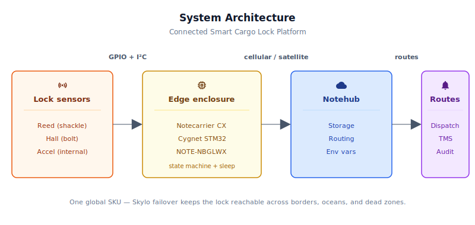
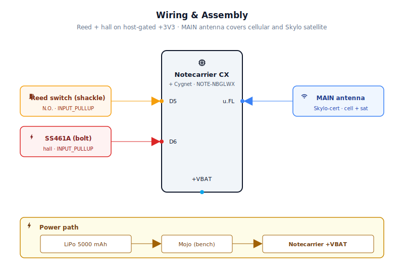
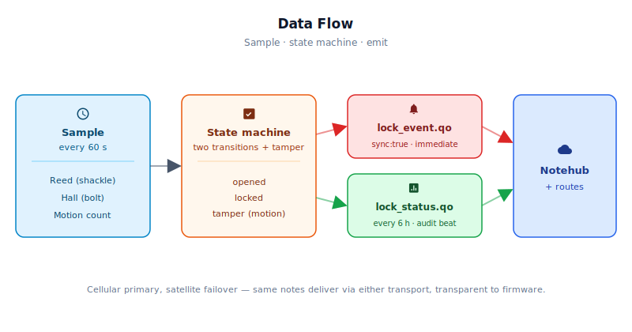

# Connected Smart Cargo Lock Platform

<Note>

This reference application is intended to provide inspiration and help you get started quickly. It uses specific hardware choices that may not match your own implementation. Focus on the sections most relevant to your use case. If you'd like to discuss your project and whether it's a good fit for Blues, [feel free to reach out](https://blues.com/contact-sales/).

</Note>

A [loss prevention](https://blues.com/loss-prevention/) reference platform for a connected smart lock built on the Blues Notecard for Skylo — combining global cellular with satellite failover in a single M.2 module — paired with a reed shackle sensor, a hall-effect bolt detector, and the Notecard's onboard accelerometer for tamper scoring. The Cygnet host on the Notecarrier CX runs the lock state machine and aggressive duty cycling that makes year-long battery life achievable.

## Quick Start

**Get your first lock online in 20 minutes:**

1. **Assemble.** Wire the reed switch to D5 and SS461A hall sensor to D6 per [§4](#4-wiring-and-assembly). Seat the Notecard for Skylo in the M.2 slot. Connect the 5000 mAh LiPo.
2. **Claim the ProductUID.** Go to [notehub.io](https://notehub.io), create a project, and copy the ProductUID. Paste it into `firmware/cargo_lock/cargo_lock.ino` line 46 as `PRODUCT_UID`.
3. **Flash.** In Arduino IDE: File → Open → `firmware/cargo_lock/` → select Notecarrier CX board (STM32 generic with Cygnet variant) → Upload. Or via `arduino-cli`:
   ```bash
   arduino-cli compile --fqbn STM32:stm32:Cygnet -u -p /dev/ttyACM0 firmware/cargo_lock/
   ```
4. **Verify.** Open Serial Monitor (115200 baud). On each 60-second wake you'll see:
   ```
   [cargo_lock] shackle=1 bolt=1 motion=N phys=LOCKED rept=LOCKED new=LOCKED
   ```
   Manually open the shackle or retract the bolt — the next wake should show the new state. Within 15–60 seconds (cellular) or 2–5 minutes (satellite), a `lock_event.qo` note appears in your Notehub project's event log.

**What you'll have when you're done:** A lock that wakes every 60 seconds, reads its sensors, emits an immediate alert if opened or tampered with, and sends a 6-hourly status heartbeat. One Notehub project with two Notefiles (`lock_event.qo` for immediate alerts, `lock_status.qo` for audit logs). Year-long battery life on a 5000 mAh cell under cellular-dominant operation.

## 1. Project Overview

**The problem.** Cargo theft is escalating. North America saw 3,625 reported incidents in 2024 — a 27% jump year-over-year — with losses approaching $455 million. The targets are trailers parked at drop lots, intermodal containers sitting at port for a week, and high-value rolling stock left overnight at a truck stop. In the majority of these thefts, the event isn't detected until the driver opens the door at the destination and finds the container empty.

The underlying challenge isn't mechanical; modern locks are strong. The challenge is that nobody knows whether the lock is still locked *right now*, let alone whether someone has been grinding on it for the last two hours. A connected smart lock that phones home changes that calculus — it turns a theft-in-progress into a real-time alert, and it turns a transit corridor into an auditable event log.

**The connectivity problem.** A lock OEM faces a problem that most IoT device makers don't: the lock follows the cargo, and cargo goes everywhere. A single trailer can leave a Chicago warehouse, cross through three different mobile carrier territories, sit on a ship for eleven days, and arrive at a Rotterdam port. A lock that only works on a single carrier's network is a lock that goes silent for half the trip. The lock OEM cannot negotiate per-country roaming contracts for every market they sell into, and they cannot afford to manufacture a different SKU per geography.

**Why Notecard.** The Notecard for Skylo (SKU: NOTE-NBGLWX) addresses all three of the lock OEM's critical needs in one module:

- **Pre-certified global cellular** (LTE-M, NB-IoT, GPRS) with a bundled SIM and 500 MB of data — no per-country carrier contracts, no activation fees, works identically in North America, Europe, and beyond.
- **Skylo satellite failover** — when the lock drops off cellular coverage entirely (mid-ocean crossing, remote intermodal depot, rural cross-border corridor with no cellular infrastructure), the Notecard automatically routes through the Skylo **NTN** (non-terrestrial network) satellite constellation, provided the MAIN antenna has a usable view of the sky. Satellite cannot help inside steel containers or under heavy structural obstructions — those are GNSS-denied environments, not just cellular-denied ones. From firmware, the failover is completely transparent: the same `note.add` calls land in Notehub regardless of which radio carried them.
- **Low-power discipline** — the Notecard's idle current is measured in microamps, and its `card.attn` sleep mechanism cuts host power entirely between wakes — including the SS461A hall sensor and pull-up resistors on the host-gated +3V3 rail. A lock that wakes every `SAMPLE_INTERVAL_SEC` (default 60 s), checks sensors, and syncs once every six hours draws substantially less energy under cellular-dominant operation than under satellite-dominant operation — the four scheduled outbound sessions per day (default 6-hour cadence) cost very different amounts depending on which radio carries them. See the [power budget discussion in §6](#low-power-strategy) for documented current envelopes and an example calculation. Year-class battery life on a 5,000 mAh pack may be achievable under cellular-dominant operation; satellite-heavy deployments significantly reduce projected endurance. Use [Mojo](#8-validation-and-testing) measurements in your target deployment environment to establish a ground-truth figure before committing to a cell size.

**Deployment scenario.** A weatherproof polycarbonate enclosure integrated into the lock body, powered from a rechargeable Li-Po cell. The included Skylo-certified MAIN antenna mounts inside the RF-transparent polycarbonate enclosure lid, facing skyward — no external pigtail or cable gland required for the antenna. The enclosure is oriented so the lid faces skyward when the lock is deployed. No wired power, no SIM provisioning, no site-specific configuration. A fleet manager assigns locks to loads in Notehub before dispatch; thresholds and check-in cadence are adjusted per-fleet via environment variables without touching the firmware.

**What this POC does not include.** Optional BLE short-range key authentication — letting a driver's phone cryptographically authorize a legitimate unlock — is intentionally out of scope for this reference platform. It requires an external UART BLE module, a challenge/response crypto library, and a provisioning workflow that go beyond the firmware size target for this example. It is deferred as a production extension; see [Limitations](#9-limitations-and-next-steps).

## 2. System Architecture



**Device-side responsibilities.** The onboard Cygnet STM32 host on the Notecarrier CX wakes every `SAMPLE_INTERVAL_SEC` (default 60 s), reads the reed switch and hall-effect sensor, queries the Notecard's built-in accelerometer for motion activity, evaluates the lock state machine, and queues any resulting notes over I²C. Between wakes, the host is completely off — cut by the Notecard's `card.attn` sleep mechanism. State persists through sleep cycles via [`NotePayloadSaveAndSleep`](https://dev.blues.io/guides-and-tutorials/notecard-guides/feather-mcu-low-power-management/) and is restored via `NotePayloadRetrieveAfterSleep` on each wake.

**Notecard responsibilities.** The Notecard stores [Notes](https://dev.blues.io/api-reference/glossary/#note) in its on-device queue, manages the cellular or satellite session on the [`hub.set`](https://dev.blues.io/api-reference/notecard-api/hub-requests/#hub-set) `outbound` cadence (default 6 hours), and pushes any `sync:true` alert notes immediately when they arrive. [Environment variables](https://dev.blues.io/guides-and-tutorials/notecard-guides/understanding-environment-variables/) flow down from Notehub to the device on each inbound sync — operators retune thresholds and cadences without a firmware update.

**Notehub responsibilities.** [Notehub](https://dev.blues.io/notehub/notehub-walkthrough/) terminates the cellular or satellite session, stores every event, and applies project-level [routes](https://dev.blues.io/notehub/notehub-walkthrough/#routing-data-with-notehub). Immediate lock events (`lock_event.qo`) and periodic status summaries (`lock_status.qo`) land in separate Notefiles so they can be fanned out to different downstream systems — real-time dispatch or on-call alerting for events, analytics or audit-log storage for summaries. [Smart Fleets](https://dev.blues.io/notehub/notehub-walkthrough/#using-smart-fleet-rules) let a shipper manage thresholds differently for high-value pharmaceutical cargo versus standard dry goods, without separate firmware builds.

**Routing to the cloud (high level only).** Notehub supports HTTP, MQTT, AWS, Azure, GCP, Snowflake, and other destinations; route setup is project-specific. See the [Notehub routing docs](https://dev.blues.io/notehub/notehub-walkthrough/#routing-data-with-notehub) — this project ships no specific downstream endpoint.

## 3. Hardware Requirements

> **BLE not included.** This BOM covers cellular+satellite lock monitoring only. A BLE radio for driver-phone key authentication is intentionally omitted from this POC; see [Limitations](#9-limitations-and-next-steps) for the production path.

| Part | Qty | Rationale |
|------|-----|-----------|
| [Notecarrier CX](https://shop.blues.com/products/notecarrier-cx?utm_source=dev-blues&utm_medium=web&utm_campaign=store-link) | 1 | Embeds a Cygnet STM32 host MCU — no separate Swan needed. The Notecarrier CX routes the Notecard's ATTN signal to the Cygnet host power enable, so `NotePayloadSaveAndSleep` cuts and restores Cygnet power automatically with no hardware modification required. That power-cut sleep discipline is what makes year-long battery life achievable on a 5,000 mAh cell. |
| [Blues Notecard for Skylo (NOTE-NBGLWX)](https://dev.blues.io/datasheets/notecard-datasheet/note-nbglwx/) | 1 | Combines LTE-M / NB-IoT / GPRS cellular and Skylo NTN satellite in one M.2 module. The lock OEM ships one SKU globally and the Notecard negotiates connectivity automatically — cellular primary, satellite when cellular is unavailable. Includes 500 MB cellular data and 10 KB satellite data, 10-year service term, no activation fees. |
| [Blues Mojo](https://shop.blues.com/products/mojo?utm_source=dev-blues&utm_medium=web&utm_campaign=store-link) | 1 | Coulomb counter on the +VBAT rail for ground-truth energy validation during bench qualification. Lets you verify that the sleep/wake duty cycle matches the battery-life projection before committing to a cell size. |
| Normally-closed magnetic reed switch (e.g. [Adafruit #375](https://www.adafruit.com/product/375)) | 1 | Shackle presence sensor. Mount the switch body in the lock housing and the magnet on the shackle; when the shackle is seated, the magnet holds the switch closed (LOW with pull-up). Shackle removal breaks the circuit and the firmware detects it on the next wake. |
| Honeywell SS461A unipolar hall-effect switch, SIP-3 ([datasheet](https://prod-edam.honeywell.com/content/dam/honeywell-edam/sps/siot/en-us/products/sensors/magnetic-sensors/dormant/documents/sps-siot-ss461a-datasheet-009064-3-en-ciid-56835.pdf)) | 1 | Bolt state sensor. A small permanent magnet on the bolt body pulls the SS461A's open-collector output LOW when the bolt is engaged; withdrawing the bolt releases the output. Pairs naturally with INPUT_PULLUP on the Cygnet. The SS461A is rated for 3.0–24 VDC supply — the Notecarrier CX +3V3 rail is squarely within spec. It draws approximately 4–8 mA quiescent when powered, but it is wired to the host-gated +3V3 rail — the Notecard's ATTN sleep mechanism cuts that supply entirely between wakes — so it draws zero current during sleep and does not threaten the battery budget. Available from Mouser, DigiKey, or any electronics distributor. |
| [K&J Magnetics D42E](https://www.kjmagnetics.com/d42e-neodymium-epoxy-coated-disc-magnet) epoxy-coated neodymium disc magnet | 1 | Bolt position sensor target: ~6 mm (1/4 inch) diameter × 3 mm thick, N42 grade neodymium. The epoxy coating promotes adhesion to the bolt body and resists moisture. Epoxy to the rear face of the bolt with the south pole facing the SS461A sensing window; the south-pole field pulls the SS461A output LOW when the bolt is thrown. |
| 10 kΩ 1/4W resistor | 2 | Explicit pull-ups on PIN_SHACKLE and PIN_BOLT as belt-and-suspenders alongside the Cygnet's internal INPUT_PULLUP, to ensure clean logic levels across temperature extremes and long cable runs inside the lock body. Like the SS461A, these resistors are on the host-gated +3V3 rail and draw zero current during `card.attn` sleep. |
| 100 nF ceramic capacitor | 1 | Decoupling bypass on the SS461A VCC pin — required by the datasheet to suppress switching noise. |
| [Blues 5,000 mAh LiPo Battery](https://shop.blues.com/products/5-000-mah-lipo-battery?utm_source=dev-blues&utm_medium=web&utm_campaign=store-link) | 1 | Primary power source. Includes built-in protection circuitry (over-charge, over-discharge, short-circuit) and a 2-pin JST-PH connector compatible with the Notecarrier CX `+VBAT` input. **Battery charging is intentionally out of scope for this POC** — a dedicated Li-Po charger circuit must be added for any fieldable build. Size up or add a second cell for extreme-cold deployments or builds where satellite sessions dominate the duty cycle. |
| MAIN antenna (cellular + Skylo satellite) — included with NOTE-NBGLWX | 1 | The Notecard for Skylo **ships with a Skylo-certified MAIN antenna**; connect it to the MAIN u.FL port for both LTE-M/NB-IoT cellular and Skylo NTN satellite. Per the [NOTE-NBGLWX datasheet](https://dev.blues.io/datasheets/notecard-datasheet/note-nbglwx/) and the [Blues antenna guide](https://dev.blues.io/datasheets/application-notes/antenna-guide/), **substituting any other antenna renders the device uncertified on the Skylo network and may result in network blocking by Skylo**. If a different antenna is required for your enclosure geometry, a delta test report from a CTIA/OTA-authorized lab demonstrating ≤30 dBm EIRP is required before production. For lock-body integration: mount the included antenna flush against the inside face of the Hammond 1554C2GY polycarbonate enclosure lid — polycarbonate is RF-transparent, so no external pigtail or cable gland is required for the antenna itself. Orient the lid skyward when deployed. Must have a clear view of the sky — see Wiring section. |
| [Hammond 1554C2GY](https://www.hammfg.com/part/1554C2GY) polycarbonate enclosure, 120 × 65 × 40 mm, IP66 | 1 | Lock body integration housing. The Notecarrier CX + Notecard PCB footprint (50 × 45 mm) fits within the 65 mm internal width with room for wiring. The included MAIN antenna mounts inside the polycarbonate lid — no antenna cable gland is required. Drill one PG7 cable-gland hole for the sensor wiring harness (reed switch, SS461A leads); add a second if a GPS antenna is added later. Larger variants in the [Hammond 1554 series](https://www.hammfg.com/electronics/small-case/plastic/1554) are available if the battery is housed inside the same enclosure. |

All Blues hardware ships with an active SIM, 500 MB of cellular data, and 10 years of service — no activation fees, no monthly commitment.

## 4. Wiring and Assembly



All host I/O lands on the [Notecarrier CX](https://dev.blues.io/datasheets/notecarrier-datasheet/notecarrier-cx-v1-3/) dual 16-pin header. The Notecard for Skylo (NOTE-NBGLWX) seats in the carrier's M.2 slot. The Mojo sits inline between the Li-Po positive terminal and the Notecarrier's `+VBAT` pad for bench power measurement.

**Pin-by-pin:**

- **+3V3** → top of each 10 kΩ pull-up resistor (for D5 and D6), and SS461A VCC with 100 nF bypass cap to GND. **This is the ATTN-gated host rail.** The Notecarrier CX routes the Notecard's ATTN signal to the Cygnet power enable; when `NotePayloadSaveAndSleep` issues its sleep request, this rail is removed entirely for the sleep period — the SS461A (~4–8 mA quiescent at 3.3 V) and pull-up resistors draw zero standby current between wakes. Verify the rail is being cut as expected with Mojo as described in [§8](#8-validation-and-testing).
- **GND** → reed switch return terminal, SS461A GND pin, bypass capacitor ground.
- **D5** → junction of the 10 kΩ pull-up and one terminal of the reed switch. Other terminal of the reed switch to GND. Active-LOW: LOW = shackle magnet present = shackle seated.
- **D6** → junction of the 10 kΩ pull-up and the SS461A output pin. Active-LOW: LOW = south-pole bolt magnet detected = bolt engaged.
- **SDA / SCL** → Notecard (the Notecarrier CX routes these to the M.2 slot internally; no external wires needed).
- **+VBAT** → Mojo `LOAD` output. Mojo `BAT` input ← Li-Po positive terminal. Li-Po negative → GND. This places Mojo inline on the battery supply so it measures total system current during bench qualification.
- **Mojo Qwiic port** → I²C host on your bench (e.g., a Blues Swan connected via USB to a laptop). This second connection is how you read the accumulated mAh tally and live current trace — Mojo has no built-in display. **This connection is for bench measurement only; the cargo lock firmware does not read Mojo at runtime and the Qwiic port is not wired in the deployed lock.**

**Sleep and host power-cut.**

The Notecarrier CX routes the Notecard's ATTN output to the Cygnet host power enable internally — no external jumper or wiring change is needed. When `NotePayloadSaveAndSleep` runs, the Notecard drives ATTN to cut the Cygnet's supply for `SAMPLE_INTERVAL_SEC` seconds, then restores it; the host cold-boots into `setup()` on each wake. The peripheral +3V3 rail (SS461A, pull-up resistors) is gated by the same path and draws zero current during sleep.

> **Bench note.** Because ATTN controls Cygnet power natively on the Notecarrier CX, the USB port power-cycles on every sleep/wake transition. For uninterrupted serial observation during bench testing, reconnect the Arduino Serial Monitor after each wake — or attach an external 3.3 V UART adapter to the Notecarrier CX UART pins and monitor through that instead.

**Sensor placement:**

- Mount the reed switch body in the lock shackle receiver, magnet on the shackle U-bar. When the shackle is fully inserted and locked, the magnet sits within 5 mm of the switch.
- Mount the SS461A inside the bolt track with the sensing face toward the bolt body. Epoxy the D42E disc magnet (south pole toward sensor) to the rear face of the bolt. When the bolt is fully thrown, the magnet aligns with the sensor; when retracted, it moves out of range.
- The Notecard for Skylo's tamper accelerometer is the one built into the Notecard module itself. No external wiring required — the firmware calls `card.motion.mode` to activate it and reads `card.motion` for activity counts.

**Antenna routing:**

The NOTE-NBGLWX exposes a `MAIN` u.FL connector for cellular and Skylo satellite. **Use the Skylo-certified MAIN antenna included with the Notecard for Skylo** — see [§3](#3-hardware-requirements) for the certification and substitution requirements.

For lock-body integration, mount the included antenna flush against the inside face of the polycarbonate (Hammond 1554C2GY) enclosure lid. Polycarbonate is RF-transparent, so the antenna operates effectively through the enclosure wall with no cable gland, external pigtail, or weatherproof feed-through required for the antenna itself. When deploying the lock, orient the enclosure lid to face skyward (for example, mounting the lock body so the lid faces up along a container rail or door hasp). The MAIN antenna **must have a clear view of the sky** for Skylo satellite operation — the Skylo GEO satellites sit above the equator, so in the northern hemisphere, a south-skyward orientation maximizes link margin. Satellite signals cannot penetrate steel, concrete, or dense structural materials; an antenna inside a steel lock body or a sealed metal container will not reach the Skylo constellation.

The NOTE-NBGLWX also has a `GPS` u.FL port; GNSS location tracking is a recommended production extension — see [Limitations](#9-limitations-and-next-steps).

## 5. Notehub Setup

1. **Create a project.** Sign up at [notehub.io](https://notehub.io) and [create a project](https://dev.blues.io/quickstart/notecard-quickstart/notecard-and-notecarrier-pi/#set-up-notehub). Copy the [ProductUID](https://dev.blues.io/notehub/notehub-walkthrough/#finding-a-productuid) and paste it into `firmware/cargo_lock/cargo_lock.ino` line 46 as `PRODUCT_UID`.

2. **Claim the device.** Power the unit; on first cellular (or satellite) session the Notecard associates with your project automatically.

3. **Create Fleets.** [Fleets](https://dev.blues.io/guides-and-tutorials/fleet-admin-guide/) group devices for shared configuration. The natural grouping for a lock platform is one fleet per customer or per shipment lane — a pharmaceutical shipper needs tighter tamper thresholds and more frequent check-ins than a dry-goods trailer. [Smart Fleets](https://dev.blues.io/notehub/notehub-walkthrough/#using-smart-fleet-rules) can auto-assign devices based on device metadata if your provisioning workflow sets device-level tags.

4. **Set environment variables.** In Notehub, select a Fleet and click the **Environment** tab. All variables below are optional; firmware defaults are shown. Changes take effect on the device's next inbound sync — no firmware update needed.

   | Variable | Default | Purpose |
   |---|---|---|
   | `sample_interval_sec` | `60` | Seconds between host wakeups (and sensor reads). The default 60 s matches the `card.motion` 1-minute accumulation bucket, ensuring every wake reads a fresh tamper score with no unobserved gap. Increase for longer battery life at the cost of a proportionally larger tamper blind window; valid range is 60–3600 s. |
   | `report_interval_min` | `360` | Minutes between `lock_status.qo` summary notes (and the Notecard's outbound sync cadence). |
   | `tamper_threshold` | `8` | Accelerometer motion counts per minute above which a `tamper` event fires while the lock is LOCKED. Tune upward if normal transit vibration causes false positives; tune downward for high-security loads. |
   | `alert_cooldown_sec` | `1800` | Minimum seconds between repeated alerts of the same type. Prevents a sustained attack from flooding the operator's alert channel — one `tamper` alert per 30 min is enough. |

5. **Configure routes.** Add one [route](https://dev.blues.io/notehub/notehub-walkthrough/#routing-data-with-notehub) for `lock_event.qo` (to a dispatch system, on-call platform, or TMS) and a second for `lock_status.qo` (to an analytics store or audit log). Keeping the two Notefiles separate at the source means you can fan them to different destinations at different urgencies without any filter logic in the route itself.

**Example: What you'll see in Notehub after opening the lock:**

An immediate `lock_event.qo` note appears in your project's Events log:

```json
{
  "file": "lock_event.qo",
  "body": {
    "event": "opened",
    "shackle": 0,
    "bolt": 0,
    "locked": 0,
    "motion": 2,
    "locked_for": 3600
  },
  "captured": "2025-05-01T14:23:45Z",
  "received": "2025-05-01T14:24:10Z",
  "sync": true
}
```

Every 6 hours, a `lock_status.qo` summary arrives with the audit heartbeat:

```json
{
  "file": "lock_status.qo",
  "body": {
    "state": "LOCKED",
    "shackle": 1,
    "bolt": 1,
    "locked": 1,
    "tamper_count": 0,
    "event_count": 1,
    "uptime_min": 360
  },
  "captured": "2025-05-01T14:23:55Z",
  "received": "2025-05-01T14:24:15Z"
}
```

## 6. Firmware Design

The sketch lives in [`firmware/cargo_lock/`](firmware/cargo_lock/), split across three files: [`cargo_lock.ino`](firmware/cargo_lock/cargo_lock.ino) (entry point — `setup()`, `loop()`, user-facing constants), [`cargo_lock_helpers.h`](firmware/cargo_lock/cargo_lock_helpers.h) (enums, `PersistState` struct, function prototypes), and [`cargo_lock_helpers.cpp`](firmware/cargo_lock/cargo_lock_helpers.cpp) (Notecard config, env-var handling, sensor reads, state machine). Open the `firmware/cargo_lock/` folder in the Arduino IDE or point `arduino-cli` at it.

**Dependencies:**
- Arduino core for STM32 ([`stm32duino/Arduino_Core_STM32`](https://github.com/stm32duino/Arduino_Core_STM32)) — install via the Arduino IDE Boards Manager.
- [`Blues Wireless Notecard`](https://github.com/blues/note-arduino) (the `note-arduino` library, current stable **v1.8.5** at time of writing) — install via the Arduino Library Manager (`arduino-cli lib install "Blues Wireless Notecard"`).

### Modules

| Responsibility | Location |
|---|---|
| Notecard configuration (`hub.set`, templates, accelerometer) | `hubConfigure`, `defineTemplates`, first-boot block in `setup` |
| Environment variable fetch and re-apply | `fetchEnvOverrides` |
| Reed switch read (shackle presence) | `readShackle` |
| Hall-effect read (bolt engagement) | `readBolt` |
| Accelerometer motion read (tamper scoring) | `readMotionCount` |
| Lock state machine and threshold evaluation | `runSampleCycle` |
| Immediate event note emission | `sendLockEvent` |
| Periodic summary note emission | `sendStatusSummary` |
| State persistence across sleep cycles | `PersistState` + `NotePayloadSaveAndSleep` / `NotePayloadRetrieveAfterSleep` |

### Sensor reading strategy

- **Reed switch.** Single `digitalRead` with `INPUT_PULLUP` — no averaging needed; the switch is either open or closed. The normally-closed configuration means any break (shackle removal, wire cut, magnet degaussed) reads as an open, which is the fail-safe direction.
- **Hall-effect.** Single `digitalRead` with `INPUT_PULLUP`. The SS461A's built-in switching hysteresis prevents chatter at the engagement threshold. A 100 nF bypass cap on VCC suppresses the switching transient.
- **Tamper accelerometer.** `card.motion` with `minutes:1` returns the aggregate motion event count from the Notecard's built-in accelerometer over the last ~1-minute bucket. The firmware enables motion detection via `card.motion.mode` with `start:true`; the Notecard accumulates motion events internally while the host sleeps — the host reads the bucket total on each wake, with no real-time interrupt wiring required. At the default 60-second wake interval, every wake reads a fresh 1-minute bucket — tamper coverage is continuous and there is no unobserved gap. Increasing `sample_interval_sec` above 60 via a Notehub environment variable extends battery life but reintroduces a proportional blind window: a 120 s interval leaves ~50% of each wake period unobserved, and a 300 s interval leaves ~80% unobserved. See [Limitations](#9-limitations-and-next-steps) for further discussion.

### Event payload design

Two template-backed Notefiles. Templates store notes as fixed-length records rather than free-form JSON, shrinking wire size by 3–5× — material when satellite data is limited to 10 KB. Example event note:

```json
{
  "file": "lock_event.qo",
  "body": {
    "event": "tamper",
    "shackle": 1,
    "bolt": 1,
    "locked": 1,
    "motion": 14,
    "locked_for": 86400
  },
  "sync": true
}
```

> **`motion` field sentinel.** The firmware queries `card.motion` before queuing any state-transition note. If both I²C attempts fail (e.g., the Notecard hasn't yet started the motion accumulator after a cold boot), `motion` is set to `−1` as a fault sentinel and the transition note is still queued so the state-change event is never silently dropped. A downstream consumer seeing `motion: −1` should treat the field as "accelerometer data unavailable for this event" rather than "zero motion detected." Any value ≥ 0 is a valid accumulator reading.

Example status summary:

```json
{
  "file": "lock_status.qo",
  "body": {
    "state": "LOCKED",
    "shackle": 1,
    "bolt": 1,
    "locked": 1,
    "tamper_count": 0,
    "event_count": 2,
    "uptime_min": 360
  }
}
```

### Low-power strategy

After each sample cycle, the host calls `NotePayloadSaveAndSleep`, which serializes the `PersistState` struct into the Notecard's flash and issues `card.attn` sleep mode. The Notecard cuts host power entirely for `SAMPLE_INTERVAL_SEC` seconds, then restores it. When the host power rail (+3V3) is cut, the SS461A hall switch and both 10 kΩ pull-up resistors lose their supply — they draw zero current during sleep, preserving the battery budget. The Notecard itself idles in its own low-power state (~8 µA at 5V, per the [low-power design guide](https://dev.blues.io/notecard/notecard-walkthrough/low-power-firmware-design/)) between sessions, waking only to process the `sync:true` lock events as they arrive and to run the periodic outbound session every `REPORT_INTERVAL_MIN`.

Sampling and transmission are deliberately decoupled: the host wakes every 60 seconds to check sensors, but the Notecard only opens a radio session every 6 hours for scheduled summaries. Lock events with `sync:true` break the schedule and open an immediate session, but they're rare under normal operation.

**Projected daily energy (illustrative planning guidance — validate with Mojo before committing to a cell size).**

Assume 1,440 host wakes per 24 hours (every 60 s) and four scheduled radio sessions per day (6-hour cadence). Assuming 2–3 mA average during each 2–5 second wake window and 50 mA average during each LTE-M session (~5 minutes including radio startup, registration, and data transmission), a typical 24-hour profile under strong cellular coverage might consume:
- Host wakes: 1,440 × 2.5 mA × 5 s = ~100 mAh per 24 h
- Cellular sessions: 4 × 50 mA × 5 min = ~17 mAh per 24 h  
- Standby (Notecard idle): ~10 mAh per 24 h
- **Total: ~125 mAh per 24 h on a cellular-dominant network**

With a 5,000 mAh cell, this projects to ~40 days (year-class) of battery life under ideal conditions. **Satellite-dominant deployments draw 3–5× more energy per session and will reduce endurance substantially.** This calculation assumes no open/tamper events (which force immediate `sync:true` sessions). Use Mojo bench measurements in your specific deployment environment to validate before committing to a cell size.

**Power budget — per-state current (design guidance; validate with Mojo).** The table separates what Blues documentation specifies from what must be measured in your hardware assembly.

| State | Notecard current | Host + sensor current |
|---|---|---|
| Deep sleep — Notecard idle, host power cut by ATTN | ~8 µA @ 5V — documented for STM32-based cellular Notecards ([low-power design guide](https://dev.blues.io/notecard/notecard-walkthrough/low-power-firmware-design/)) | ~0 — +3V3 rail cut; SS461A and pull-up resistors draw zero |
| Host-awake sampling window (~2–5 s per 60-s cycle) | Radio remains off; **but the Notecard is active for I²C servicing** during the wake window, so current is higher than the deep-idle figure. **Measure with Mojo** — the full awake-window draw cannot be derived from the idle spec alone. | SS461A quiescent ~4–8 mA @ 3.3 V + pull-up bleed (~0.3 mA) + Cygnet STM32 active current. **Cygnet active current is not specified in Blues docs — use Mojo to measure the full lock-assembly figure.** |
| LTE-M cellular outbound session (host sleeps throughout) | Peak current during radio registration is in the hundreds of milliamps; session duration depends on network conditions and payload size. Per-session energy varies materially with signal quality and network congestion — **measure with Mojo** in your deployment environment rather than relying on figures from a different Notecard family. Consult the [NOTE-NBGLWX datasheet](https://dev.blues.io/datasheets/notecard-datasheet/note-nbglwx/) for the authoritative current envelope across operating modes. | ~0 — host power cut; SS461A off |
| NTN satellite outbound session (host sleeps throughout) | Session duration is materially longer than LTE-M — satellite acquisition takes several minutes vs. tens of seconds for cellular — so total session energy is significantly higher. Energy varies with link budget, satellite elevation angle, and payload size. **Measure with Mojo** in your target deployment environment; do not extrapolate from cellular-path figures. Consult the [NOTE-NBGLWX datasheet](https://dev.blues.io/datasheets/notecard-datasheet/note-nbglwx/) for the authoritative current envelope. | ~0 — host power cut; SS461A off |

Radio sessions dominate the daily energy budget and vary sharply by path. Cellular and satellite sessions are not energy-equivalent; a deployment that depends heavily on the satellite path will have proportionally shorter battery life than one that stays predominantly on cellular.

Operators needing extended battery life can increase `sample_interval_sec` to 300 (5 min) via the Notehub environment variable — this reduces host-wake energy by ~5× at the cost of a ~4-minute tamper blind window per interval (see [Limitations](#9-limitations-and-next-steps)). For extended satellite-only legs (weeks at sea), increase `report_interval_min` to `1440` (once-daily outbound) to reduce the scheduled session count from four to one per day, improving endurance significantly.

**Use Mojo bench measurements** in your specific deployment environment to establish a ground-truth figure before committing to a cell size. The standby current between wakes should reflect only the Notecard's idle current (~8 µA) — not the SS461A's ~4–8 mA quiescent draw. If you see continuous milliamp-level drain between sensor wakes, the +3V3 rail may not be gated by ATTN as expected — confirm that the SS461A VCC and pull-up top rails are wired to the ATTN-gated +3V3 pin rather than an always-on supply, and see [§8](#8-validation-and-testing) for the full Mojo validation procedure.

### Retry and error handling

- The first Notecard transaction uses `sendRequestWithRetry(req, 10)` to survive the cold-boot I²C race condition documented in the `note-arduino` library.
- `fetchEnvOverrides` checks `notecard.responseError(rsp)` before trusting the response body. A failed env fetch silently keeps the in-memory defaults rather than crashing.
- If `notecardEpoch()` returns 0 (Notecard hasn't synced time yet), `runSampleCycle()` sets `epoch_valid = false` and continues evaluating sensor transitions and tamper detection normally — so a shackle removal or high-motion event at first power-up in poor-coverage conditions is never silently dropped. Epoch-dependent math is skipped: `locked_for` is reported as 0, cooldown comparisons are bypassed (accepting that tamper may fire on every qualifying wake until epoch is known), and `locked_since_epoch` is not set until a valid timestamp is available. The `uint32_t` underflow risk from subtracting a nonzero persisted epoch from a zero `now_epoch` is eliminated because no subtraction runs when `epoch_valid` is false. The summary window is initialized on the first wake with a valid epoch rather than in `setup()`.
- Alert deduplication via `ALERT_COOLDOWN_SEC` prevents the same event type from firing more than once per window — one `tamper` alert per 30 minutes per lock is enough for a dispatch operator to act on.
- A capacity-1 **pending event record** in `PersistState` captures any state-transition note (`"opened"` or `"locked"`) that fails to queue. On the next wake, `runSampleCycle()` flushes the pending record *before* processing new transitions — so a failed `"opened"` note is not silently lost even if the lock physically relocks before the retry succeeds. On successful retry, `reported_lock_state` is advanced to the state implied by the pending event, allowing the delivery-gap detector to correctly identify any subsequent transition that also needs to be delivered. Tamper events are excluded from the pending record: because `last_alert_tamper_epoch` is only advanced on a successful send, a failed tamper note is naturally re-evaluated on the next qualifying wake through the normal cooldown path. See [Limitations](#9-limitations-and-next-steps) for the capacity-1 edge case.

### Key code snippet 1 — template definition (both Notefiles)

Templates define the fixed schema that compresses notes on the wire. The `port` value assigns each Notefile a compact numeric identifier used on the satellite (NTN) path: the Notecard sends that integer over the air instead of the full Notefile name, reducing overhead on the bandwidth-limited Skylo link. On a pure cellular session the port is unused. Notehub routing is configured by Notefile name — `lock_event.qo` fans out to a real-time dispatch channel, `lock_status.qo` to an audit store — not by port number.

The template numbers (`11`, `12`, `14`) are field-type codes. Blues template syntax uses: `11` = 1-byte signed int, `12` = 2-byte signed int, `14` = 4-byte signed int. String fields use an exemplar value whose character count sets the max field width — "tamper" (6 chars) is the longest event type, so the `event` field reserves 6 bytes on the wire for any value up to that width.

```cpp
J *req = notecard.newRequest("note.template");
if (!req) return false;
JAddStringToObject(req, "file", "lock_event.qo");
JAddNumberToObject(req, "port", 50);
J *body = JAddObjectToObject(req, "body");
// String fields use an exemplar: the character count of the value sets the max field width.
// "tamper" is 6 chars — the longest of the three event types ("tamper"/"locked"/"opened").
JAddStringToObject(body, "event",      "tamper"); // 6-char string exemplar
JAddNumberToObject(body, "shackle",    11);       // 1-byte int (0–255)
JAddNumberToObject(body, "bolt",       11);       // 1-byte int
JAddNumberToObject(body, "locked",     11);       // 1-byte int
JAddNumberToObject(body, "motion",     12);       // 2-byte int (0–65535)
JAddNumberToObject(body, "locked_for", 14);       // 4-byte int (0–4.2B seconds)
notecard.sendRequest(req);
```

### Key code snippet 2 — immediate lock event

`sync:true` bypasses the `outbound` timer — the Notecard opens a cellular (or satellite) session as soon as the note is queued, regardless of how recently it last synced.

```cpp
J *req = notecard.newRequest("note.add");
JAddStringToObject(req, "file", "lock_event.qo");
JAddBoolToObject  (req, "sync", true);
J *body = JAddObjectToObject(req, "body");
JAddStringToObject(body, "event",      "opened");
JAddNumberToObject(body, "shackle",    0);
JAddNumberToObject(body, "bolt",       0);
JAddNumberToObject(body, "locked",     0);
JAddNumberToObject(body, "motion",     motion);
JAddNumberToObject(body, "locked_for", (int)locked_for_sec);
notecard.sendRequest(req);
```

### Key code snippet 3 — sleep and state persistence

State survives the host power-cut via the Notecard's payload store. On the next wake, `NotePayloadRetrieveAfterSleep` restores the full `PersistState` struct — lock state, tamper counts, event counts, epoch timestamps — as if the host never lost power.

```cpp
NotePayloadDesc payload = {0, 0, 0};
NotePayloadAddSegment(&payload, STATE_SEG_ID, &state, sizeof(state));
NotePayloadSaveAndSleep(&payload, SAMPLE_INTERVAL_SEC, NULL);
```

## 7. Data Flow



Every `SAMPLE_INTERVAL_SEC` (default 60 s), the firmware reads three sensors, evaluates the lock state machine, and decides whether anything noteworthy happened:

**Collected on each wake:** shackle present/absent (reed switch), bolt engaged/withdrawn (hall-effect), accelerometer motion count (last 1-min bucket from the Notecard), current Notecard epoch.

**Transmitted:**

- `lock_event.qo` — emitted immediately with `sync:true` on any of three triggers:
  - `"opened"` — lock transitioned from LOCKED to UNLOCKED (shackle removed or bolt withdrawn). The most operationally critical event — a legitimate terminal release or an unauthorized opening. A 30-minute cooldown prevents re-alerting on a flapping sensor.
  - `"locked"` — lock transitioned from UNLOCKED to LOCKED (shackle seated, bolt thrown). Useful for the audit log: confirms the load was secured before departure.
  - `"tamper"` — motion count exceeded `tamper_threshold` while the lock was LOCKED. Fires once per `alert_cooldown_sec` regardless of sustained activity.

- `lock_status.qo` — emitted once per `REPORT_INTERVAL_MIN` (default 6 hours), batched through the Notecard's periodic outbound session. Carries current lock state, cumulative tamper and event counts for the window, and elapsed uptime. Functions as the audit heartbeat — a shipper can verify the lock was LOCKED every six hours.

**Routed.** Notehub fans `lock_event.qo` to a real-time channel (TMS, dispatch platform, on-call system) and `lock_status.qo` to a long-term store or audit database. On the satellite path, the Notecard automatically uses Skylo NTN when cellular is unavailable — from Notehub's perspective, a satellite-delivered note arrives in the same event stream as a cellular one.

## 8. Validation and Testing

**Expected steady-state cadence.** A correctly secured lock in transit generates one `lock_status.qo` note every 6 hours and zero `lock_event.qo` notes. If you see no notes at all for 12+ hours, check Notehub's device page for last-connect time — the Notecard logs its last session and the result. A satellite session takes 2–5 minutes to establish from cold; if the device just powered up in a no-cellular environment, the first note may be delayed.

**First-light sensor verification.** Before sealing the enclosure:

> **Bench setup — `DEBUG_SERIAL` and power-cut sleep.** The firmware ships with `#define DEBUG_SERIAL` commented out; no log output appears until you uncomment that line and reflash. Note that enabling `DEBUG_SERIAL` adds up to a 3 s USB-enumeration wait on every wake, which measurably increases average power consumption — leave it commented in production builds.
>
> Also note that this firmware uses full host power-cut sleep via `NotePayloadSaveAndSleep`. On the Notecarrier CX, the ATTN signal is routed to the Cygnet host power enable internally (no jumper required — see [§4](#4-wiring-and-assembly)), so the USB port power-cycles on every sleep/wake transition and re-enumerates on each 60-second wake. For uninterrupted serial observation during bench testing, reconnect the Serial Monitor after each wake — or attach an external 3.3 V UART adapter to the Notecarrier CX UART pins and monitor through that instead.

1. Open the Arduino Serial Monitor at 115 200 baud. On each 60-second wake the firmware logs `[cargo_lock] shackle=1 bolt=1 motion=N phys=LOCKED rept=LOCKED new=LOCKED`. The `phys` field is the last persisted physical state; `rept` is the last state for which a transition event was successfully queued; `new` is the state derived from the current sensor read. Confirm `new` changes correctly as you manually open the shackle and retract the bolt.
2. Tap the lock body firmly — the `motion` count should spike above background on the next wake. Adjust `tamper_threshold` in the Fleet's environment variables until normal transit vibration stays below the threshold and a firm impact exceeds it.
3. Open the lock manually and confirm a `lock_event.qo` note with `"event":"opened"` appears in Notehub within the session-establishment window (~15–60 s on cellular, 2–5 min on satellite).

**Using Mojo to validate power behavior.** The Notecard for Skylo's published idle current is approximately 8–18 µA between sessions — see the [low-power design guide](https://dev.blues.io/notecard/notecard-walkthrough/low-power-firmware-design/) and the [NOTE-NBGLWX datasheet](https://dev.blues.io/datasheets/notecard-datasheet/note-nbglwx/) for the authoritative current envelope across operating modes. During a cellular session (LTE-M), expect peak currents in the hundreds of milliamps during the radio registration event, sustained for tens of seconds. A Skylo satellite session takes materially longer to establish and draws significantly more energy than a comparable cellular session — the Notecard for Skylo datasheet documents both current profiles. On a Mojo trace, a healthy lock profile shows brief host-wake spikes every 60 seconds and longer radio-session events every 6 hours; a satellite-path day will have visibly larger session events than a cellular-only day.

The [Mojo](https://dev.blues.io/datasheets/mojo-datasheet/) connects inline between the Li-Po positive terminal and `+VBAT` (as shown in [§4](#4-wiring-and-assembly)), where its series current-sense element measures total system draw continuously. **Mojo is bench-validation hardware in this POC; the firmware does not read Mojo at runtime, and its mAh measurements are not included in event payloads or status notes.** To read the accumulated mAh tally and live current trace, connect Mojo's Qwiic port to the bench I²C host described in [§4](#4-wiring-and-assembly) and query the energy accumulator register per the [Mojo datasheet](https://dev.blues.io/datasheets/mojo-datasheet/). A productive bench exercise:

1. Leave the lock running for 24 h on a known-capacity bench supply. Refer to the [per-state current table in §6](#low-power-strategy) for the expected shape at each phase. The profile you should see: a ~8 µA baseline between wakes (Notecard idle only; Cygnet host power cut by ATTN); brief mA-level spikes every 60 seconds (host-awake window — Cygnet active + SS461A quiescent ~4–8 mA + I²C servicing overhead); and larger current humps every 6 hours during radio outbound sessions. LTE-M sessions show peak current in the hundreds of milliamps with duration depending on network conditions; satellite (NTN) sessions are visibly longer and draw significantly more total energy — see the [NOTE-NBGLWX datasheet](https://dev.blues.io/datasheets/notecard-datasheet/note-nbglwx/) for the authoritative per-mode current envelope. Factor the cellular vs. satellite session difference into endurance projections when your deployment is satellite-dominant. Let the Mojo 24-hour tally, not design assumptions, drive the cell-size decision.
2. **Validate the sensor rail sleep assumption.** Between host wakes, the Mojo should show only the Notecard's idle current (~8 µA). If you see a continuous ~4–8 mA baseline between wakes, the SS461A and/or pull-up resistors are drawing current — the +3V3 rail is not being cut by ATTN as expected. Confirm that the SS461A VCC and pull-up top rails are wired to the ATTN-gated +3V3 pin (see [§4](#4-wiring-and-assembly)) and not to an always-on supply rail.
3. If you see continuous ≥ 50 mA drain, the host is never sleeping — usually a `card.attn` / ATTN pin wiring issue on the Notecarrier CX.
4. If you see a radio-session spike on every 60-second wake rather than only at the 6-hour outbound cadence, the `note.add` calls with `sync:true` may be firing on every wake — check that the state machine isn't generating spurious transitions.

Once you have a confirmed Mojo average for your specific deployment (cellular vs. satellite mix, event rate), divide the measured cell capacity by the confirmed daily draw to project endurance; factor in ~20–30% capacity reduction at -20°C for cold-chain or northern-winter deployments.

## 8a. Troubleshooting

| Symptom | Cause | Solution |
|---------|-------|----------|
| Serial Monitor shows nothing, device doesn't connect to Notehub | `PRODUCT_UID` not set or wrong | Check that `PRODUCT_UID` is defined in `cargo_lock.ino` line 46. Copy it from Notehub project settings (Projects → [Your Project] → Settings → ProductUID). |
| Device claims fine but no notes appear in Notehub | Notecard hasn't synced to cellular/satellite yet | First sync can take 30–60 s on cellular or 2–5 min on satellite. Check Notehub project Events tab for device last-connect time. If stuck >10 min, check antenna u.FL connection and verify the enclosure lid faces skyward. |
| Serial Monitor shows `phys=LOCKED` but `motion` count stays at −1 | Accelerometer data unavailable after cold boot | Normal on first wake after power-up. Firmware queues the state-transition note anyway (with `motion: −1` as a sentinel). Motion reading should normalize on the next wake. |
| Shackle or bolt state doesn't change when physically actuated | Sensor wiring reversed or pin short | Verify D5 and D6 are wired to the correct terminals (see [§4](#4-wiring-and-assembly) pin table). Test with `digitalWrite(PIN_SHACKLE, LOW); delay(100); digitalWrite(PIN_SHACKLE, HIGH);` in a bench sketch to confirm the GPIO responds. |
| Every wake triggers a large current spike (50+ mA), even during sleep window | Host not entering power-cut sleep | Verify the Notecard's ATTN signal is wired to the Cygnet power-enable pin on the Notecarrier CX. The carrier board routes this internally — no external jumper required — but check the board silk-screen. If using a custom carrier, confirm `card.attn` successfully returns `{"mode":"arm,sleep"}` and the ATTN GPIO is connected to your MCU's power-gating circuit. |
| Mojo shows 4–8 mA baseline between wakes instead of ~8 µA | +3V3 rail (SS461A, pull-ups) not gated by ATTN | Verify the SS461A VCC and pull-up top rails are wired to the ATTN-gated +3V3 pin (see [§4](#4-wiring-and-assembly)) and not to an always-on rail. |
| Device repeatedly logs the same state without changing | State machine stuck or sensor is chattering | Check that the reed switch and hall-effect sensor are not being triggered by extraneous fields or vibration. Mount them away from the Notecard (which has a strong internal antenna). Use a 100 nF bypass cap on the SS461A VCC (required by datasheet) to suppress switching noise. |

## 9. Limitations and Next Steps

**Simplified for the POC:**

- **Polling, not interrupts.** The firmware wakes on a fixed 60-second timer (default). A shackle removal between wakes won't be detected until the next cycle. In production, the [`card.attn`](https://dev.blues.io/api-reference/notecard-api/card-requests/#card-attn) `auxgpio` mode fires the ATTN pin whenever a configured AUX GPIO input changes — wiring the reed switch to an AUX GPIO input and arming with `mode:"arm,auxgpio"` wakes the host on the state change rather than waiting for the next `SAMPLE_INTERVAL_SEC` poll window.
- **No BLE key authentication.** The project description calls for an optional BLE radio for short-range key authorization (a driver's phone authenticating a legitimate unlock). This firmware sketch does not implement it — it requires an external UART BLE module (such as the Adafruit Bluefruit LE UART Friend), a crypto challenge/response library, and a pairing/provisioning workflow that is outside the scope of this POC.
- **Satellite data budget.** The NOTE-NBGLWX includes 10 KB of bundled satellite data. Note templates (see §6) materially reduce payload size compared to unstructured JSON, but actual per-note satellite consumption depends on the template's field layout plus NTN framing and protocol overhead that is not reflected in raw template field sizes — the only authoritative source is your Notehub project's satellite data dashboard, which reports actual bytes consumed per delivered note. Validate against that usage data before committing to a data plan. At 4 daily status notes plus occasional events, a lock that spends a week at sea may consume on the order of a few dozen satellite notes, but the exact count will vary with signal conditions and session overhead; validate before assuming the 10 KB bundle is sufficient for multi-week ocean routes. In production, status summaries can be suppressed on the satellite path (via an env var check against a `satellite_only` flag) to preserve budget for event-only reporting.
- **Single-axis tamper scoring.** The Notecard's built-in accelerometer accumulates an aggregate motion count — it does not distinguish the frequency spectrum, axis, or duration of the disturbance. A sustained grind attack at a consistent angle could in theory produce a motion count that looks similar to severe road vibration. A production-grade tamper scorer would use a dedicated shock/vibration sensor (e.g., an ADXL345 or LIS2DH12 via I²C) running continuous FFT analysis and applying shock pulse detection rather than simple count thresholding.
- **Tamper scoring trade-off (coverage vs. battery life).** `card.motion` is queried with `minutes:1`, so each wake reads the most recent 1-minute accumulation bucket. At the default 60-second wake interval, every wake reads a fresh bucket and tamper coverage is continuous — there is no unobserved gap. Increasing `sample_interval_sec` above 60 via the Notehub environment variable extends battery life at the cost of a proportional blind window: at 120 s, ~50% of each interval is unobserved; at 300 s, ~80%. A short, intense attack that occurs entirely within the unsampled gap will not be scored on that wake. If a deployment's battery budget demands a longer wake interval, consider also increasing the `minutes` parameter in the `card.motion` call to match the new interval — bucket accumulation semantics differ from the default and the threshold will need re-calibration, but coverage is maintained across the full period.
- **No cryptographic lock state.** The lock state machine trusts the sensor readings — it has no cryptographic proof that the physical bolt is engaged. A sophisticated attacker who defeats the hall-effect sensor (e.g., with an external magnet) could make the firmware believe the lock is LOCKED while the bolt is withdrawn. A production platform should add a cryptographic challenge mechanism to the bolt engagement circuit.
- **State cleared on cold boot.** If the Notecard payload store expires or is cleared (firmware update, manual reset), `PersistState` is zero-initialized and `lock_state` reverts to `LOCK_STATE_UNKNOWN`. The firmware will not emit a transition event until it observes a state change from the sensors, so there's a one-wake blind spot after a cold reboot. In production, the first post-boot state should be explicitly reported in a `"reboot"` event note.
- **Pending event queue is capacity 1.** The `pending_type` slot in `PersistState` holds at most one failed state-transition note. If the slot is occupied when a second failure occurs (for example, a pending `"opened"` and a subsequent `"locked"` both fail on consecutive wakes during an extended I²C outage), the newer failure is not saved — only the original pending event is preserved and retried. The second failure falls back to the `delivery_gap` detection path, which retries correctly if the physical state has not changed again by the next wake. In a production implementation, replace the single-slot record with a small FIFO (3–4 events) to cover consecutive failures without any event loss.

**Production next steps:**

- Wire the reed switch to the Notecard's AUX GPIO input and use [`card.attn`](https://dev.blues.io/api-reference/notecard-api/card-requests/#card-attn) `auxgpio` mode for event-driven open detection instead of polling on the `SAMPLE_INTERVAL_SEC` timer.
- Add an ADXL345 (I²C) or LIS2DH12 for axis-resolved shock detection with configurable pulse thresholds — replace the Notecard's motion count with a spectral tamper score.
- Implement BLE key authentication: an NRF52 UART BLE module or Adafruit Bluefruit LE UART Friend paired with a mobile app that signs an ECDSA challenge with a device-specific key provisioned at manufacture.
- Add a `"reboot"` event on cold-boot detection so the fleet manager knows when a lock lost its state history.
- **GNSS location tracking.** The NOTE-NBGLWX has a dedicated `GPS` u.FL port. Enabling [`card.location.mode`](https://dev.blues.io/api-reference/notecard-api/card-requests/#card-location-mode) `periodic` on first boot instructs the Notecard to sample GNSS at a set interval whenever motion is detected, caching the fix internally. A [`card.location`](https://dev.blues.io/api-reference/notecard-api/card-requests/#card-location) call in `sendLockEvent` returns the last cached fix via a single I²C request — the host does not wait for a GNSS acquisition cycle. Add `lat` (4-byte float, `14.1`) and `lon` (4-byte float, `14.1`) to the note templates. Include the `time` and `status` fields from the `card.location` response so recipients can assess fix freshness — a cached fix inside a sealed steel container may be hours stale. GNSS requires sky view; it cannot acquire or maintain a fix inside enclosed metal structures.
- Field-upgradeable firmware via [Notecard Outboard DFU](https://dev.blues.io/notehub/host-firmware-updates/notecard-outboard-firmware-update/) — essential for a lock fleet where physical access for firmware updates is impractical once locks are deployed.
- Per-satellite-path suppression of status summaries via an env var, to preserve the 10 KB satellite data bundle for event-only reporting on ocean-crossing legs.

## 10. Summary

Cargo theft is a detection problem masquerading as a security problem. A modern lock is strong enough — what it lacks is the ability to raise an alarm when someone has been grinding on it for two hours, or to confirm that the container that left Rotterdam is still sealed when it arrives in Newark. This reference platform closes that gap with two digital sensors, the Notecard's onboard accelerometer, a 60-second duty cycle, and a single module that provides global cellular plus satellite failover without a carrier contract.

The Notecard for Skylo is what makes the connectivity model viable at scale: one SKU, pre-certified, works in a strip mall parking lot and in the middle of the Atlantic. The Cygnet on the Notecarrier CX handles the lock state machine and aggressive sleep discipline that makes year-long battery life achievable without exotic power hardware. Notehub distributes threshold tuning via environment variables so a fleet manager can tighten tamper sensitivity on a pharmaceutical load and loosen it on standard palletized goods — without touching the firmware. For lock OEMs building the next generation of connected cargo security, this is the platform architecture that makes it shippable.
