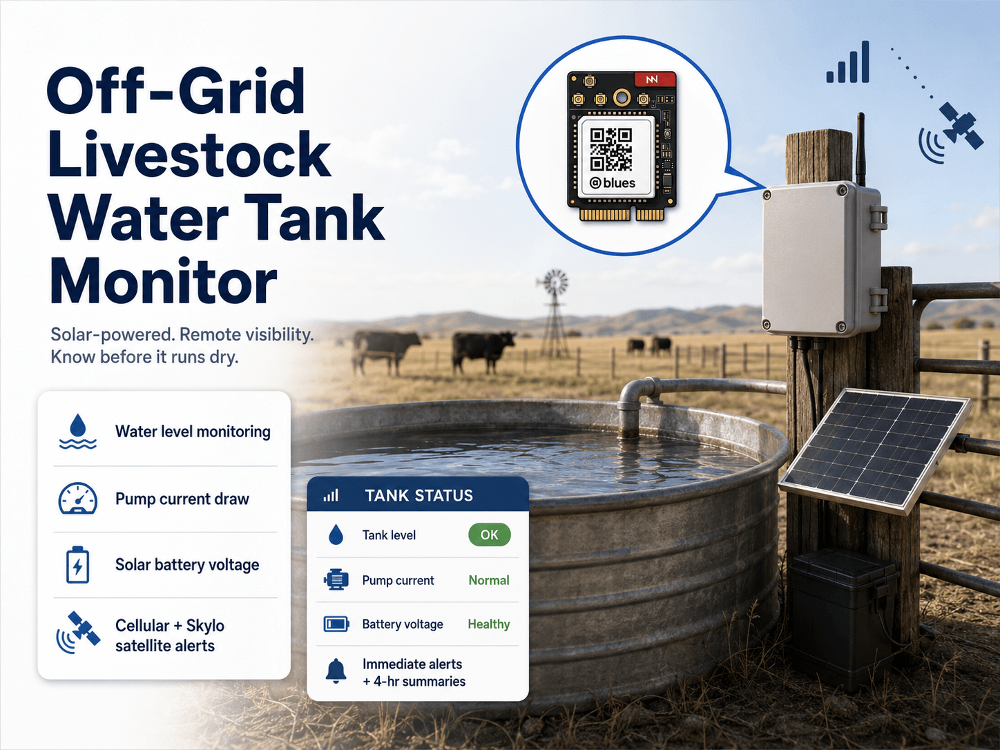
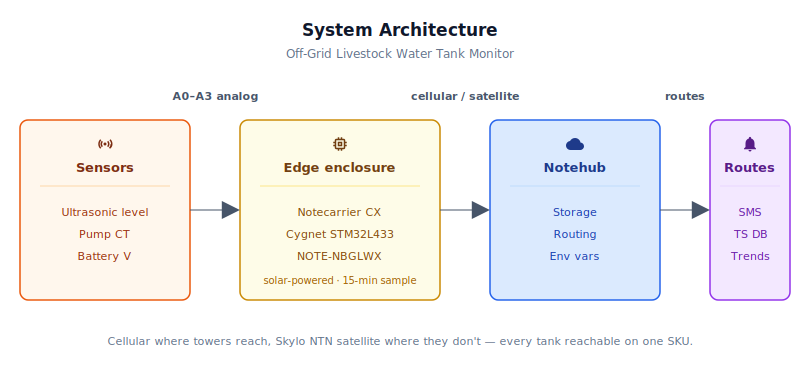
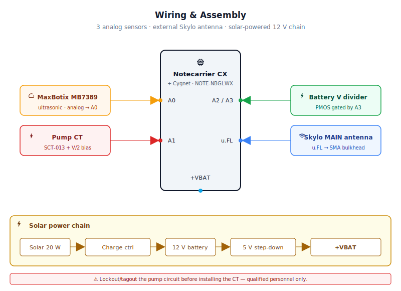
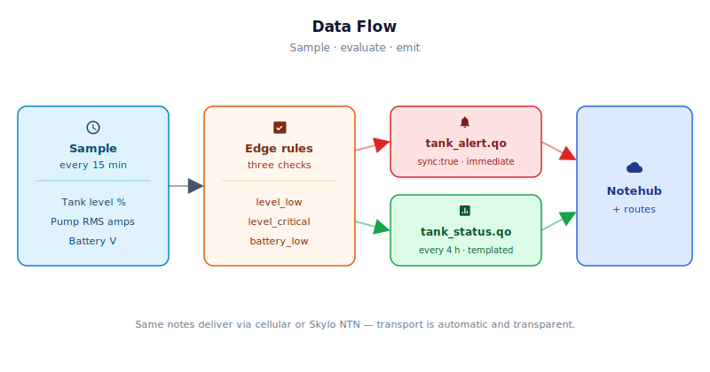

# Off-Grid Livestock Water Tank Monitor



<Note>

This reference application is intended to provide inspiration and help you get started quickly. It uses specific hardware choices that may not match your own implementation. Focus on the sections most relevant to your use case. If you'd like to discuss your project and whether it's a good fit for Blues, [feel free to reach out](https://blues.com/landing-pages/accelerators-contact-us/?accelerator=Off-Grid%20Livestock%20Water%20Tank%20Monitor).

</Note>

This project is a solar-powered [remote monitoring](https://blues.com/solutions-remote-monitoring/) system for off-grid livestock water tanks. The system tells a rancher when a stock tank is going dry without driving the pasture roads — measuring the water level, the pump's current draw, and the solar system's own battery voltage, then reporting all three to a phone or dispatch system over cellular wherever a tower is reachable and over satellite via [Skylo](https://www.skylo.tech/)'s non-terrestrial network (NTN) where it isn't. The radio stays off between an immediate alert and a 4-hour summary, so the device runs indefinitely on a modest solar panel and a single battery.

## What You'll Build

After following this guide, you will have a solar-powered off-grid tank monitor that:
- **Samples tank level, pump current, and battery voltage** every 15 minutes via analog sensors wired to a Notecarrier CX
- **Alerts the rancher immediately** (via Notehub routes to SMS/push/webhook) when the tank drops below 20% full (alert) or 10% full (critical)
- **Reports system health** (battery voltage, pump current) every 4 hours to a time-series database for trend analysis
- **Falls back to satellite** (Skylo NTN) when cellular is unavailable, with the identical firmware handling both transports
- **Runs for weeks on solar** even during cloudy stretches, thanks to an adaptive sleep strategy that extends the sample interval when the battery is low

Expected data consumption: ~6 KB/month on the 500 MB included prepaid Blues data plan (cellular path; satellite is separate). First production event visible in Notehub within 4 hours of power-on.

## 1. Project Overview

**The problem.** Stock tanks in remote pastures are one of agriculture's oldest and most persistent operational problems. A rancher managing a spread across multiple pastures — each with its own poly or galvanized stock tank and a submersible pump pulling from a well — has to physically drive every road to verify that every tank is full. On a working ranch with pastures spread over thousands of acres, that inspection loop can take several hours and still miss a dry tank that empties between visits. The consequences aren't just inconvenience: cattle deprived of water for even a few hours in summer heat suffer rapid decline in health, and emergency water delivery is expensive before factoring in animal losses at all.

The failure modes are simple and repeatable. Tanks go dry because a float valve sticks or fails and the tank drains down, because the pump's supply well drops below the intake (the pump keeps running but moves no water), or because the pump motor fails entirely and nothing moves even when the float calls for it. None of these require sophisticated modeling — they are observable conditions that nobody happens to be watching. The sensor suite here measures exactly the two signals a rancher or hired hand would check on a physical inspection: how high is the water, and is the pump drawing current? The third measurement — solar battery voltage — tells you whether the monitoring system itself is healthy and likely to keep reporting through a run of cloudy days.

**Why Notecard.** Stock tanks sit miles from the ranch house, beyond WiFi range, beyond LoRa range, and frequently beyond the reach of any terrestrial infrastructure. [Notecard for Skylo](https://dev.blues.io/datasheets/notecard-datasheet/note-nbglwx/) addresses both halves of the connectivity problem in a single module: it uses cellular (LTE-M/NB-IoT) where a tower is reachable and falls back to the Skylo NTN satellite network where terrestrial coverage ends. Many ranch pastures sit in mixed coverage — a cellular signal may be available across most of a property, but valleys and remote corners go dark. A tank in a covered valley reports over cellular while a tank on a ridge beyond any tower still reports via satellite; the rancher sees both without understanding which network carried the data. No SIM activation, no carrier contract, no per-site configuration required. The Notecard also handles the low-power half: in periodic mode with a 15-minute sampling interval, the radio is active for tens of seconds every few hours and silent the rest of the time, making it possible to run this device indefinitely on a modest solar panel and a single battery even through overcast weeks in a northern winter.

<NewToBlues/>

**Deployment scenario.** A weatherproof IP65 enclosure mounted on the tank post or fence rail adjacent to the tank opening. A MaxBotix ultrasonic level sensor peers down through the lid into the tank. A clamp-on current transformer clips around one conductor of the pump's supply lead without cutting any wire. A two-resistor voltage divider reads the 12V solar battery bus. A small solar panel, charge controller, and sealed battery live in or near the enclosure. Once installed and calibrated, the system reports tank levels and pump health to the rancher's phone through Notehub — requiring no physical site visit unless something goes wrong.

## 2. System Architecture



**Device-side responsibilities.** The onboard Cygnet STM32L433 host on the Notecarrier CX wakes on a 15-minute interval driven by [`card.attn`](https://dev.blues.io/api-reference/notecard-api/card-requests/#card-attn), reads three sensors (ultrasonic level, pump RMS current, solar battery voltage), evaluates alert thresholds, accumulates readings into a rolling window for the next summary, and returns to sleep. All Notecard interaction happens over I²C — no AT commands, no serial buffers, no JSON hand-rolling.

**Notecard responsibilities.** Notecard for Skylo stores [Notes](https://dev.blues.io/api-reference/glossary/#note) in its on-device queue, selects the best available transport (cellular or Skylo satellite), manages the session on the configured [`hub.set`](https://dev.blues.io/api-reference/notecard-api/hub-requests/#hub-set) `outbound` cadence (default 4 hours), and flushes `sync:true` alert Notes immediately regardless of that cadence. Transport selection is transparent to the host firmware — the same `note.add` JSON that queues a Note over cellular also queues it over satellite. The Notecard also distributes [environment variables](https://dev.blues.io/guides-and-tutorials/notecard-guides/understanding-environment-variables/) from Notehub on each inbound sync — alert thresholds, tank calibration values, and sampling intervals are all operator-tunable from the Notehub console without re-flashing the device.

**Notehub responsibilities.** [Notehub](https://notehub.io) receives and stores every event — whether it arrived via the cellular or satellite transport, and applies project-level routes. Periodic summaries and alerts land in separate [Notefiles](https://dev.blues.io/api-reference/glossary/#notefile), so routes can fan them to different destinations: alerts to an SMS gateway or push-notification service, summaries to a long-term time-series store for trend analysis. [Smart Fleets](https://dev.blues.io/notehub/notehub-walkthrough/#using-smart-fleet-rules) can classify devices automatically by pasture name or tank ID so that fleet-level environment variables encode site-specific calibration values without touching the firmware.

**Routing to the cloud (high level only).** Notehub supports HTTP, MQTT, AWS, Azure, GCP, Snowflake, and other destinations; route configuration is project-specific and outside the scope of this reference design. See the [Notehub routing docs](https://dev.blues.io/notehub/notehub-walkthrough/#routing-data-with-notehub) — this project ships no downstream endpoint.

## 3. Technical Summary

1. **Assemble hardware.** Order the BOM from §4, build the circuit per §5, and mount the enclosure on the tank post.
2. **Flash firmware.** Clone this repo, set your Notehub ProductUID in the sketch, and flash via Arduino IDE. The FQBN below matches `firmware/livestock_water_tank_monitor/sketch.yaml`, so omitting `--fqbn` also works when invoked from the sketch directory:
   ```bash
   arduino-cli compile --fqbn STMicroelectronics:stm32:Blues:pnum=CYGNET \
     firmware/livestock_water_tank_monitor/livestock_water_tank_monitor.ino
   arduino-cli upload -p /dev/ttyACM0 --fqbn STMicroelectronics:stm32:Blues:pnum=CYGNET \
     firmware/livestock_water_tank_monitor
   ```
3. **Set calibration.** Power on and wait for the device to sync to Notehub (first cellular connection within minutes if coverage exists, or satellite within ~10 minutes if cellular is unavailable). Once a `tank_status.qo` Note appears in Notehub, measure your actual tank geometry and set `tank_depth_mm` and `sensor_min_mm` as environment variables in Notehub (see §6 step 4 for the path). After the next sync, `level_pct` will report accurate percentages.
4. **Set routes.** In Notehub, add two routes: one for `tank_alert.qo` (to SMS/push service) and one for `tank_status.qo` (to your time-series database or data lake). See §6 and the [Notehub routing docs](https://dev.blues.io/notehub/notehub-walkthrough/#routing-data-with-notehub).

Full assembly and calibration instructions follow in later sections; this quickstart gets you to first event in under an hour.

Here is a sample Note this device emits:

```json
{
  "file": "tank_status.qo",
  "body": {
    "_time": 1717200000,
    "level_pct": 68.4,
    "distance_mm": 542.0,
    "pump_amps": 7.2,
    "pump_on": true,
    "battery_v": 12.8,
    "alerts": 0
  }
}
```

## 4. Hardware Requirements

| Part | Qty | Rationale |
|------|-----|-----------|
| [Notecarrier CX](https://shop.blues.com/products/notecarrier-cx?utm_source=dev-blues&utm_medium=web&utm_campaign=store-link) | 1 | Integrated carrier with an embedded Cygnet STM32L433 host — no separate MCU needed for this all-analog sensor mix. |
| [Notecard for Skylo (NOTE-NBGLWX)](https://shop.blues.com/products/notecard-for-skylo?utm_source=dev-blues&utm_medium=web&utm_campaign=store-link) ([datasheet](https://dev.blues.io/datasheets/notecard-datasheet/note-nbglwx/)) | 1 | Cellular (LTE-M/NB-IoT/GPRS) where a tower is reachable; Skylo NTN satellite where it isn't. One module, one prepaid plan, no SIM activation or carrier contract — transport selection is fully automatic and transparent to the host firmware. |
| [Blues Mojo](https://shop.blues.com/products/mojo?utm_source=dev-blues&utm_medium=web&utm_campaign=store-link) | 1 | **Bench-only commissioning tool** — spliced inline during validation to confirm the sleep/wake duty cycle. Not read by the deployed firmware; no power telemetry appears in transmitted Notes. Remove before field deployment. |
| [MaxBotix HRXL-MaxSonar-WRL (MB7389)](https://maxbotix.com/products/mb7389) | 1 | IP67-rated weatherproof ultrasonic sensor; 300–5000 mm range, ±1 mm resolution, 2.7–5.5 V supply, and analog voltage output (V_cc/5120 per mm) require no microcontroller timing — a single ADC pin is all the interface needed. Internal temperature compensation keeps readings accurate across the wide ambient swings of an outdoor stock tank installation. |
| [YHDC SCT-013-030 split-core CT, 30 A / 1 V voltage-output (e.g. SparkFun SEN-11005)](https://www.sparkfun.com/products/11005) | 1 | Clamp-on CT; measures pump RMS current without breaking or modifying the supply circuit. The 30 A range covers ½–2 HP submersible pumps typical of agricultural water systems. This design requires the **voltage-output** variant (30 A:1 V, built-in burden resistor); the current-output variant has no built-in burden and will damage the ADC pin without an external resistor. |
| [SparkFun TRRS 3.5mm Jack Breakout (BOB-11570)](https://www.sparkfun.com/products/11570) | 1 | Exposes the CT's 3.5mm TRRS plug as screw terminals for wire termination. |
| 10 kΩ 1% resistor (×2) | 2 | Bias divider for the CT circuit — forms a voltage midpoint at Vref/2 so the Cygnet ADC sees only positive voltages from the CT's AC output. |
| 10 µF electrolytic capacitor | 1 | Bias-circuit decoupling; paralleled with the low-side bias resistor to stabilize the midpoint. |
| BSS84 P-channel MOSFET, SOT-23 (or SI2301 or equivalent signal-level PMOS; widely available from DigiKey and Mouser) | 1 | High-side switch for the battery-voltage divider. Controlled via a 100 kΩ gate pullup and MMBT3904 level shifter so the divider is active only while the firmware samples A2. Prevents A2 back-powering through the MCU's input-protection diode whenever the host is unpowered during `card.attn` sleep. |
| MMBT3904 NPN BJT, SOT-23 (or through-hole 2N3904 equivalent) | 1 | Level-shifts the 3.3 V Cygnet GPIO (A3) signal to drive the BSS84 gate, which is referenced to the 12 V supply rail. |
| 47 kΩ resistor, 1% | 1 | High-side of the battery-voltage divider (from BSS84 drain to divider node). Scales the 12 V solar bus to the 3.3 V ADC range when the PMOS is on. |
| 10 kΩ resistor, 1% (×2) | 2 | Low-side of the battery-voltage divider (×1) and base-drive resistor from Cygnet A3 to the MMBT3904 (×1). |
| 100 kΩ resistor, ¼ W | 1 | BSS84 gate pullup to 12 V battery+. Ensures the PMOS switch is off by default when the host MCU is unpowered, keeping A2 at GND through the low-side 10 kΩ. |
| 5V/1A step-down DC-DC regulator (e.g., [Pololu D24V10F5](https://www.pololu.com/product/2831)) | 1 | Derives stable 5V from the 12V solar battery bus; the 5.1–36V input range accommodates healthy and partial-charge battery states without dropout. |
| 12V sealed lead-acid (SLA) or LiFePO₄ battery, ≥20 Ah | 1 | Field power reserve; LiFePO₄ preferred for wider operating temperature range and deeper discharge tolerance across cold-weather winters. Size to the expected run time between solar recharge events. |
| [Renogy Wanderer 10A PWM Solar Charge Controller](https://www.renogy.com/products/wanderer-10a-pwm-charge-controller) | 1 | Manages panel-to-battery charging and protects against over-discharge via a low-voltage disconnect on the LOAD terminals. Any standard 12V PWM or MPPT controller with dedicated LOAD output terminals works; LOAD-output isolation is required for the power chain described in §5. |
| [Renogy 20W 12V Monocrystalline Solar Panel](https://www.renogy.com/products/20-watt-12-volt-monocrystalline-solar-panel) | 1 | Sized for the energy budget of this design at most US latitudes; increase wattage for far-northern deployments or extended overcast seasons. |
| Skylo-certified LTE-capable antenna — use the antenna included with the NOTE-NBGLWX kit (a Blues-qualified, dual-band antenna covering the LTE bands used for cellular plus the S-Band/L-Band frequencies on B23/B255/B256 used for Skylo NTN). The same antenna handles both cellular and satellite traffic; the NOTE-NBGLWX has a single `MAIN` u.FL antenna port for both transports. The Notecard is certified on Skylo's network **exclusively with the antenna provided in the kit** — replacing or modifying it results in an uncertified device that may be blocked by Skylo. If a different antenna is required, a Skylo delta-certification test is needed; see the [Satellite Best Practices guide](https://dev.blues.io/starnote/satellite-best-practices/) and [contact Blues](https://blues.com/contact-sales/) for recommended test houses. | 1 | Must have a clear, unobstructed view of the equator-facing sky (southern sky in the northern hemisphere; northern sky in the southern hemisphere) for the satellite path. Mount flat on the enclosure lid or on an elevated bracket above the enclosure; never inside a metal enclosure. |
| u.FL to SMA female pigtail, 100 mm+ (e.g. [SparkFun WRL-09145](https://www.sparkfun.com/products/9145) or equivalent RG316/RG178 assembly) + IP67-rated SMA bulkhead fitting | 1 each | Routes the included Skylo-certified antenna's connection from the NOTE-NBGLWX `MAIN` u.FL port through the enclosure wall. Match the bulkhead hole size to your enclosure; nickel-plated or stainless SMA bulkheads are widely available from DigiKey and Mouser. Use the shortest pigtail that reaches the bulkhead to minimize cable loss. |
| IP65+ weatherproof enclosure, ≥8×6×3″ | 1 | Houses the electronics; mount on the tank post or adjacent fence rail with stainless hardware. |

All Blues hardware ships with an active SIM including 500 MB of cellular data and 10 years of service — no activation fees, no monthly commitment. The NOTE-NBGLWX also includes Skylo satellite data as part of its service plan; see the [Blues pricing page](https://blues.com/pricing/) for current satellite data allotments and usage terms.

## 5. Wiring and Assembly



All host I/O lands on the [Notecarrier CX](https://dev.blues.io/datasheets/notecarrier-datasheet/notecarrier-cx-v1-3/) dual 16-pin header. Notecard for Skylo seats into the M.2 slot. The Mojo is a bench power-measurement instrument spliced inline between the step-down regulator output and the Notecarrier's `+VBAT` pad during commissioning; it is not read by the deployed firmware and is removed before field installation.

<Warning>

**Safety.** This installation involves the pump's supply conductors, a 12V battery, solar panel wiring, and charge-controller terminals — all of which can carry hazardous voltages or stored energy. **De-energize and lock out / tag out the pump circuit before installing or modifying any wiring.** Follow the pump manufacturer's and charge-controller manufacturer's installation instructions in full. Place a fuse in the positive battery lead as close to the battery terminal as practical (3–5 A for the monitor load; consult the charge-controller manual for the panel and battery leads). Electrical work should be performed by qualified personnel following applicable local electrical codes.

</Warning>

**Solar power chain (panel, charge controller, battery):**
- Solar panel **+** → charge controller **PV +** input; solar panel **−** → charge controller **PV −** input.
- Charge controller **BATT +** → 12V battery positive terminal; charge controller **BATT −** → 12V battery negative terminal. If the controller does not include a fuse, place a 3–5A automotive blade fuse in the positive wire between the battery terminal and the controller's BATT + terminal.
- Take the monitor load from the charge controller's **LOAD output terminals** (not directly from the battery terminals). This allows the controller's low-voltage disconnect to protect the battery from deep discharge during extended overcast periods.
- **Common ground:** charge controller BATT −, the LOAD − output, and the 12V battery negative terminal must share a common ground bus. A short, low-resistance wire between them eliminates ground-offset measurement errors on the A2 battery-voltage divider.

**Monitor power chain (charge controller LOAD → Notecarrier):**
Charge controller **LOAD +** → Pololu D24V10F5 step-down input **VIN** (5V output) → Notecarrier CX `+VBAT`. The Notecarrier draws from `+VBAT` and internally generates the 3.3V rail for the host and sensors. During bench commissioning, splice the Mojo inline between the step-down output and `+VBAT` for power measurement, then remove it before field deployment. The battery-voltage divider top-side connects directly to the **battery terminals** (not the LOAD terminals) so it reads true battery voltage; see the voltage-divider circuit below for details on the PMOS high-side switch that controls when current flows through the resistor chain.

**Level sensor (A0):**
- MaxBotix MB7389 `V+` → Notecarrier `+3V3_OUT`
- MaxBotix MB7389 `GND` → Notecarrier `GND`
- MaxBotix MB7389 `AN` (analog voltage output pin) → Notecarrier `A0`
- Leave the MB7389 `TX` (TTL serial) and `PW` (pulse-width) pins unconnected; only `AN` is used in this design.

**Pump current sensor (A1):**
Clamp the SCT-013-030 jaws around **one** conductor of the pump's supply cable (either leg, clamping both will cancel and read zero). Then wire the bias circuit:
- Notecarrier `+3V3_OUT` → 10 kΩ resistor → **bias node** → 10 kΩ resistor → Notecarrier `GND`. These two resistors form a symmetric voltage divider; the bias node sits at approximately 1.65 V (Vcc/2).
- SCT TRRS breakout `TIP` → bias node (the CT's AC output voltage rides on the DC bias midpoint)
- SCT TRRS breakout `SLEEVE` → Notecarrier `GND`
- Bias node → 10 µF electrolytic capacitor **positive** lead; capacitor **negative** lead → `GND` (the cap stabilizes the DC midpoint during pump-start transients)
- Bias node → Notecarrier `A1`

**Solar battery voltage divider (A2 + A3):**
A BSS84 P-channel MOSFET acts as a high-side switch between the 12 V battery bus and the top of the voltage-divider resistor chain. Without this switch, A2 would remain driven by the battery bus whenever the host MCU is unpowered by `card.attn`, which can back-power the host through the A2 input-protection diode. A 100 kΩ gate pullup (battery+ → gate) keeps the PMOS off by default; an MMBT3904 NPN level-shifts the 3.3 V Cygnet GPIO (A3) to override that pullup and turn the PMOS on when a battery sample is needed.

Wire the circuit as follows:
- 12 V battery positive → BSS84 **source**
- BSS84 **drain** → 47 kΩ resistor → divider node → 10 kΩ resistor → Notecarrier `GND`
- Divider node → Notecarrier `A2`
- BSS84 **gate** → 100 kΩ resistor → 12 V battery positive (gate pullup)
- BSS84 **gate** → MMBT3904 **collector**
- MMBT3904 **emitter** → Notecarrier `GND`
- MMBT3904 **base** → 10 kΩ resistor → Notecarrier `A3`

**Operation.** Firmware drives A3 HIGH before sampling: the MMBT3904 saturates, pulling the BSS84 gate to near GND (V_GS ≈ −12 V, well beyond the −0.8 to −2 V threshold). After the four ADC samples, firmware drives A3 LOW; the MMBT3904 turns off and the 100 kΩ pullup restores the gate to 12 V (V_GS = 0 V), turning the PMOS off within ≈ 100 µs. During the full `card.attn` sleep — even after MCU VDD is cut and A3 floats — the 100 kΩ pullup independently holds the PMOS gate at 12 V, leaving A2 at GND through the low-side 10 kΩ. No leakage path reaches the A2 protection structures.

The voltage scaling is unchanged: `battery_V = V_adc / 0.175`, mapping 0–14.5 V to 0–2.54 V, within the 3.3 V ADC range. The divider connects to the battery terminals (not the LOAD terminals) so the MCU reads the true battery bus voltage.

**Antennas:** The NOTE-NBGLWX exposes two u.FL ports — `MAIN` (cellular AND satellite, served by a single Skylo-certified LTE-capable antenna covering both LTE and S-Band/L-Band frequencies) and `GPS` (passive GPS/GNSS antenna; not used by this firmware and may be left unconnected). Connect a short u.FL-to-SMA female pigtail (≥100 mm, RG316/RG178) from the `MAIN` u.FL port to an SMA female bulkhead in the enclosure wall, then mate the included Skylo-certified antenna to the bulkhead from outside via its SMA connector. Use the antenna provided in the kit — substituting a third-party cellular antenna will invalidate the Skylo certification and may result in network blocking by Skylo. Route the antenna to the exterior of the enclosure lid or to an elevated bracket with an unobstructed view of the equator-facing sky (southern sky in the northern hemisphere; northern sky in the southern hemisphere). An antenna inside a metal enclosure or blocked by trees, structures, or terrain on the horizon toward the equator will fail to acquire Skylo GEO satellites — even when cellular reception is sufficient, deploy with sky view in mind so the satellite fallback path remains available. Refer to the [Satellite Best Practices guide](https://dev.blues.io/starnote/satellite-best-practices/) for siting guidance.

**Level sensor mounting:** Mount the MB7389 vertically (sensing face pointing straight down) through a 1.5–2 inch hole in a tank lid or on a bracket over the open top. Keep at least 300mm of clearance between the sensor face and the maximum expected water surface — this is the MB7389's blanking zone below which readings are unreliable. Record the actual mounting height above the full waterline and enter it as `sensor_min_mm` in Notehub after installation.

## 6. Notehub Setup

1. **Create a project.** Sign up at [notehub.io](https://notehub.io) and create a project. Copy the [ProductUID](https://dev.blues.io/notehub/notehub-walkthrough/#finding-a-productuid) and paste it into `firmware/livestock_water_tank_monitor/livestock_water_tank_monitor.ino` as `PRODUCT_UID`.
2. **Claim the Notecard.** Power the unit; on first successful Notehub session, whether over cellular or Skylo satellite, the Notecard associates with your project automatically.
3. **Create a Fleet per site.** [Fleets](https://dev.blues.io/guides-and-tutorials/fleet-admin-guide/) group devices for shared configuration and routing. A natural unit here is one fleet per pasture — every tank in a pasture shares the same approximate tank geometry, pump type, and battery system. [Smart Fleets](https://dev.blues.io/notehub/notehub-walkthrough/#using-smart-fleet-rules) can classify devices automatically by a tag or environment variable so you don't have to assign them manually as your fleet grows.
4. **Set environment variables.** All variables are optional; firmware compile-time defaults apply if a variable is absent from Notehub. Changes sync to the device on the next inbound session — no re-flashing required. The two most important variables are the tank calibration values (`tank_depth_mm` and `sensor_min_mm`), which must be set per installation to get accurate level percentages.

   | Variable | Default | Purpose |
   |---|---|---|
   | `tank_depth_mm` | `1200` | Distance (mm) from the sensor face to the dry tank bottom. Measure with the tank empty. |
   | `sensor_min_mm` | `300` | Distance (mm) from the sensor face to the water surface when the tank is full. Must be ≥ 300 mm (the MB7389 blanking-zone minimum, below which the sensor cannot produce valid readings). The compile-time default equals the blanking-zone floor and is a placeholder — replace it with the measured full-tank distance during commissioning. |
   | `level_alert_pct` | `20` | Tank level (%) below which a `level_low` alert fires. The rancher has time to act. |
   | `level_critical_pct` | `10` | Tank level (%) below which a `level_critical` alert fires. Cattle may dewater within hours. |
   | `pump_on_amps` | `1.0` | RMS amps above which the pump is considered running. Set above the CT noise floor and below the pump's normal running current. |
   | `battery_alert_v` | `11.5` | Solar battery voltage (V) below which a `battery_low` alert fires. Indicates extended overcast weather or a charge controller fault. |
   | `sample_interval_sec` | `900` | Seconds between sensor samples. Default is 15 minutes. Reduce this during calibration (alongside `summary_interval_min`) so that each summary window contains at least one fresh sample; see §10. |
   | `summary_interval_min` | `240` | Minutes between periodic summary Notes. Default is 4 hours (6 Notes per day). **Must be at least ⌈`sample_interval_sec` ÷ 60⌉ minutes** — a summary window shorter than one sample wake contains no data. The firmware auto-clamps values below this floor at runtime; reduce `sample_interval_sec` proportionally when a short calibration window is needed (see §10). When this value changes, the firmware detects the difference on the next wake and re-issues `hub.set` with the updated cadence, so the Notecard's outbound sync interval stays aligned with the local summary schedule — no physical reboot required. |
   | `alert_cooldown_sec` | `3600` | Minimum seconds between repeated `level_low` and `level_critical` alerts. The `battery_low` alert is edge-triggered instead and is not subject to this cooldown — it fires once per episode and re-arms only after the voltage recovers above `battery_alert_v + 0.5V`. |

5. **Configure routes.** Add at minimum one [route](https://dev.blues.io/notehub/notehub-walkthrough/#routing-data-with-notehub) for `tank_alert.qo` (to an SMS gateway, push-notification service, or on-call webhook) and a second for `tank_status.qo` (to a time-series store for trend analysis and historical review). The Notefile separation means you can send alerts to your phone immediately while batching summaries to a database nightly, without any filtering logic in the route.

   **Example alert payload** (immediate, `sync:true`):
   ```json
   {
     "alert_code": 1,
     "level_pct": 8.5,
     "pump_amps": 0.0,
     "battery_v": 12.4,
     "_time": 1717200000
   }
   ```
   Alert codes: `0` = tank at 20% (low alert), `1` = tank at 10% (critical), `2` = battery below 11.5V.

   **Example status payload** (every 4 hours):
   ```json
   {
     "level_pct": 68.4,
     "distance_mm": 542.0,
     "pump_amps": 7.2,
     "pump_on": true,
     "battery_v": 12.8,
     "alerts": 3,
     "_time": 1717200000
   }
   ```
   `alerts` = count of `tank_alert.qo` Notes sent since the last summary; `pump_on` is derived from window-average `pump_amps` vs. the `pump_on_amps` threshold.

## 7. Firmware Design

The implementation spans three files in the [`firmware/livestock_water_tank_monitor/`](firmware/livestock_water_tank_monitor/) directory, with the `.ino` as the entry point:

| File | Role |
|---|---|
| [`livestock_water_tank_monitor.ino`](firmware/livestock_water_tank_monitor/livestock_water_tank_monitor.ino) | Entry point. `setup()` orchestrates the full wake cycle: restore persisted state, load env-var cache, read sensors, evaluate alerts, emit the summary if due, and sleep via `card.attn`. `loop()` is intentionally empty. |
| [`livestock_water_tank_monitor_helpers.h`](firmware/livestock_water_tank_monitor/livestock_water_tank_monitor_helpers.h) | Compile-time constants, the `GlobalState` struct, `extern` declarations for all cross-file globals, and helper function prototypes. |
| [`livestock_water_tank_monitor_helpers.cpp`](firmware/livestock_water_tank_monitor/livestock_water_tank_monitor_helpers.cpp) | Sensor-read, env-var parsing, alert, and summary helper implementations. |

**Dependencies:**
- Arduino core for STM32 ([`stm32duino/Arduino_Core_STM32`](https://github.com/stm32duino/Arduino_Core_STM32)).
- [`Blues Wireless Notecard`](https://github.com/blues/note-arduino) — the `note-arduino` library. Install via the Arduino Library Manager or download from the [note-arduino releases](https://github.com/blues/note-arduino/releases).

### Modules

| Responsibility | Function |
|---|---|
| Notecard configuration (`hub.set`, `card.motion.mode`) | `notecardConfigure` |
| Re-issue `hub.set` when `summary_interval_min` env var changes | `reapplyHubSet` |
| Template registration for the summary Notefile | `defineTemplates` |
| Environment-variable fetch (each wake) | `fetchEnvOverrides` |
| Ultrasonic raw distance reading | `readDistanceMm` |
| Distance-to-level-percent conversion | `readLevelPct` |
| Pump RMS current | `readPumpAmps` |
| Solar battery voltage | `readBatteryV` |
| Alert evaluation and emission | `evaluateAlerts`, `sendAlert` |
| Periodic summary emission | `sendSummary` |
| Sleep/wake state persistence | `NotePayloadSaveAndSleep` / `NotePayloadRetrieveAfterSleep` |

### Sensor reading strategy

**Level sensor.** The MB7389 continuously outputs an analog voltage proportional to measured distance: V_out = V_cc / 5120 × distance_mm. Powered at 3.3V, the output maps to 0–3.22V across the 300–5000mm range, which sits cleanly within the Cygnet's 3.3V ADC reference. The firmware takes a 16-sample average of the 12-bit ADC counts to suppress noise, converts to millimeters, then maps to a 0–100% fill level using the calibrated `tank_depth_mm` (empty) and `sensor_min_mm` (full) values. Readings outside the MB7389's documented 300–5000mm range are flagged invalid and excluded from the accumulator. Both `distance_mm` and `level_pct` are accumulated across all valid samples in the summary window and emitted as window averages in the periodic summary Note.

**Pump current.** The SCT-013-030 CT generates an AC voltage centered at the bias midpoint (~1.65V). The firmware first measures the DC bias from a 256-sample mean, then collects ~1500 samples (spanning approximately 20 AC mains cycles at the STM32's ADC throughput) and computes the root-mean-square deviation from that bias. The RMS voltage converts to current at 30A per volt. Readings below a 0.15A noise floor are clamped to zero to prevent ADC noise from generating false "pump running" detections.

**Battery voltage.** A 4-sample average of the A2 ADC channel, scaled back through the voltage divider ratio: `battery_V = (adc × 3.3 / 4095) / (10 / 57)`. This measures the actual 12V solar battery bus voltage, not the regulated 5V rail — giving a genuine read on the system's energy state.

### Event payload design

Both Notefiles are [template-backed](https://dev.blues.io/notecard/notecard-walkthrough/low-bandwidth-design#working-with-note-templates), storing Notes as fixed-length binary records instead of free-form JSON. Compact binary encoding reduces per-Note wire size by roughly 3–5× and, critically, is required for the NOTE-NBGLWX Skylo NTN satellite path — both templates are registered with `"format": "compact"` and an explicit port number so either Notefile can transit via satellite or cellular using the identical `note.add` call. Over a multi-year deployment generating 6 summary Notes per day, that compression also meaningfully extends the useful life of the 500 MB prepaid data budget. Alert Notes carry `sync:true` to request an immediate radio wake; fixed-length binary encoding means `pump_amps = 0.0` (pump off at alert time) is transmitted faithfully — there is no omitempty-style drop for zero-valued numeric fields in compact encoding.

`tank_status.qo` (periodic, every `summary_interval_min`; compact template-encoded, port 50):

```json
{
  "file": "tank_status.qo",
  "body": {
    "_time": 1717200000,
    "level_pct": 68.4,
    "distance_mm": 542.0,
    "pump_amps": 7.2,
    "pump_on": true,
    "battery_v": 12.8,
    "alerts": 0
  }
}
```

<Note>

**`pump_on` is a derived field, not a per-sample boolean.** Each sample contributes its RMS current reading to a running average; at summary time `sendSummary` receives that 4-hour window average as `pumpAmps` and sets `pump_on = (pumpAmps >= pump_on_amps)`. A value of `true` means *the average pump current over the summary window was at or above the running threshold*, not that the pump ran continuously, and not that it ran for any particular fraction of the window. A pump that ran briefly at the start of a 4-hour window and then stopped can produce a non-zero `pump_amps` average with `pump_on: false`; a pump that ran continuously all window will produce `pump_on: true`. Use `pump_amps` (the numeric average) for trend analysis; treat `pump_on` as a coarse summary-window classification — `true` indicates the window-average current cleared the threshold, not that the pump ran continuously or for any particular fraction of the window.

</Note>

`tank_alert.qo` (immediate, `sync:true`; compact template-encoded, port 51):

```json
{
  "file": "tank_alert.qo",
  "body": {
    "_time": 1717200000,
    "alert_code": 0,
    "level_pct": 18.1,
    "pump_amps": 0.0,
    "battery_v": 12.6
  },
  "sync": true
}
```

<Note>

**`alert_code` is an integer type code:** `0` = `level_low`, `1` = `level_critical`, `2` = `battery_low`. The integer field keeps the compact-template payload fixed-length binary — the same requirement as the summary template for the NOTE-NBGLWX Skylo NTN path. All five fields (including `pump_amps = 0.0` when the pump is off) are always present in compact binary encoding.

</Note>

### Low-power strategy

The Cygnet is awake for only a few seconds per 15-minute sample cycle. After each wake, `NotePayloadSaveAndSleep` serializes the runtime state (accumulator values, alert cooldown timestamps, summary window counter, and last-applied hub cadence) into Notecard flash, then triggers [`card.attn`](https://dev.blues.io/api-reference/notecard-api/card-requests/#card-attn) to assert the ATTN pin, which on the Notecarrier CX is routed to the board's `EN` input. Per the [Notecarrier CX datasheet](https://dev.blues.io/datasheets/notecarrier-datasheet/notecarrier-cx-v1-3/), `EN` "gates the board's host 3.3V rail," cutting the Cygnet host power entirely. The `+3V3_OUT` header pin is sourced from that same regulated rail, so sensors wired to it — the MB7389 level sensor and the CT bias network — are also unpowered for the full sleep interval. The battery-voltage measurement circuit is similarly off: the BSS84 PMOS gate is held at 12 V by the 100 kΩ pullup (independent of MCU power), leaving A2 at GND through the low-side 10 kΩ and drawing zero quiescent current from the battery bus. The NOTE-NBGLWX Notecard itself idles at approximately 18 µA @ 5V in its own [low-power idle state](https://dev.blues.io/notecard/notecard-walkthrough/low-power-firmware-design/) between sessions, with the Skylo satellite modem also in low-power standby when not transmitting.

Sampling and transmission are deliberately decoupled: the device samples every 15 minutes but transmits summaries only every 4 hours. Alerts bypass the transmit timer via `sync:true` — a critically low tank reaches the rancher's phone within a session-establishment window regardless of where the Notecard is in its outbound cycle. Over cellular, that window is typically 15–60 seconds. Over the Skylo NTN satellite link, session establishment takes longer — the Notecard must acquire the GEO satellite and complete the NTN registration before data flows, which can take a few minutes depending on satellite geometry and signal conditions. Alert Notes are still delivered via satellite when cellular is unavailable; the delivery latency is higher than over cellular, but the consequence of a missed alert on an off-grid tank with no other connectivity path is worse than a slightly delayed one. For sites with reliable cellular, the cellular path is used first and the satellite path is never exercised; satellite energy cost does not apply.

When the firmware detects battery voltage below 12.0V (moderately discharged), it doubles the sleep interval to 30 minutes. Below `battery_alert_v` (default 11.5V, deeply discharged), it quadruples the interval to 60 minutes and fires a `battery_low` alert on the first crossing below that threshold. Further `battery_low` alerts are suppressed while the battery remains low and re-arm only after the voltage recovers above `battery_alert_v + 0.5V`. This edge-triggered approach prevents the 60-minute emergency-sleep cadence from issuing a `sync:true` radio session on every wake — which would worsen the very depletion it signals. The extended sleep intervals give the system a multi-day power reserve before the step-down regulator drops out, trading sampling granularity for survivability in extended overcast conditions.

### Retry and error handling

- The first Notecard request in `notecardConfigure` uses `notecard.sendRequestWithRetry(req, 10)` to absorb the cold-boot I²C race documented in the `note-arduino` library — the host can come up before the Notecard is ready to accept transactions.
- The firmware tracks the last `outbound` value issued to `hub.set` in persisted state (`appliedSummaryIntervalMin`). After each `env.get`, if `summary_interval_min` differs from the persisted value, `reapplyHubSet()` re-issues `hub.set` using plain `sendRequest` (no retry, since the Notecard is already up on a wake-from-sleep path). This keeps cellular outbound cadence synchronized with the operator-configured summary interval without requiring a physical reboot.
- Both `note.template` registrations (summary and alert) are persisted via a single `templatesInstalled` flag in the sleep payload. The flag is set only when both templates succeed; if either registration fails on cold boot (e.g. the Notecard is not yet ready), the flag stays false and `setup()` retries both registrations on every subsequent wake until both succeed. Without this, a single failed registration would leave one or both Notefiles in free-form mode, bypassing the compact binary encoding required for the satellite path.
- Level readings outside the MB7389's valid range (300–5000mm) are excluded from the window accumulator. If an entire 4-hour window yields zero valid level readings, the summary emits `level_pct: -1.0` as a sentinel so downstream analytics can distinguish "sensor fault" from a real near-zero fill.
- Pump current readings below the noise floor are clamped to 0.0 rather than excluded — a zero reading means "pump is off," not "no data."
- `card.time` returning 0 (Notecard has not yet synced and obtained network time) causes the alert evaluator to skip threshold checks for that wake cycle, preventing spurious alerts on the first cold boot.
- Alert de-duplication: `level_low` and `level_critical` alerts are cooldown-gated (one per `alert_cooldown_sec`, default 1 hour) so a slowly-draining tank doesn't page the rancher continuously. `battery_low` is edge-triggered — it fires once on the first crossing below `battery_alert_v` and is suppressed until the voltage recovers above `battery_alert_v + 0.5V`, preventing the 60-minute emergency-sleep cadence from issuing a `sync:true` radio wake on every cycle while the battery is already under stress.

### Key code snippet 1 — template registration

The template uses `"compact"` format and an explicit `port` — both required for the NOTE-NBGLWX Skylo NTN satellite path. Type hints are literal numeric values representing field types:
- `14.1` = 32-bit float (e.g., `level_pct`, `pump_amps`, `battery_v`)
- `12` = 2-byte signed integer / int16_t (e.g., `alerts` field, range −32,768 to +32,767)
- `true` = boolean field (e.g., `pump_on`)
- `14` = Unix timestamp field; auto-populated by the Notecard on each `note.add` — no change to firmware is needed

Template-backed Notes reduce per-event wire size by ~4× and are required for satellite delivery.

```cpp
J *req = notecard.newRequest("note.template");
JAddStringToObject(req, "file",   NOTEFILE_SUMMARY);
JAddNumberToObject(req, "port",   50);        // required for Skylo NTN
JAddStringToObject(req, "format", "compact"); // required for Skylo NTN
J *body = JAddObjectToObject(req, "body");
JAddNumberToObject(body, "_time",       14);   // Unix timestamp (Notecard auto-fills)
JAddNumberToObject(body, "level_pct",   14.1); // float32
JAddNumberToObject(body, "distance_mm", 14.1); // float32
JAddNumberToObject(body, "pump_amps",   14.1); // float32
JAddBoolToObject(body,   "pump_on",     true); // boolean
JAddNumberToObject(body, "battery_v",   14.1); // float32
JAddNumberToObject(body, "alerts",      12);   // int16 (2-byte signed, −32 768..+32 767)
if (notecard.sendRequest(req)) {
    g.templatesInstalled = true;  // retry on subsequent wakes if this fails
}
```

### Key code snippet 2 — immediate alert with sync

The alert Note uses the compact template registered for `tank_alert.qo` (port 51, `"compact"` format), so it travels over the NOTE-NBGLWX Skylo NTN satellite path when cellular is unavailable — the identical `note.add` call works over either transport. `sync:true` tells the Notecard to wake the radio immediately rather than waiting for the next scheduled outbound window. The `alert_code` integer (0 = `level_low`, 1 = `level_critical`, 2 = `battery_low`) keeps the body fixed-length binary as required by the compact template; all fields, including `pump_amps = 0.0`, are always present.

```cpp
if (!g.templatesInstalled) return false;  // template required for satellite path
J *req = notecard.newRequest("note.add");
JAddStringToObject(req, "file", NOTEFILE_ALERT);
JAddBoolToObject(req,   "sync", true);
J *body = JAddObjectToObject(req, "body");
JAddNumberToObject(body, "alert_code", alertCode);  // 0=level_low, 1=level_critical, 2=battery_low
JAddNumberToObject(body, "level_pct",  levelPct);
JAddNumberToObject(body, "pump_amps",  pumpAmps);
JAddNumberToObject(body, "battery_v",  battV);
notecard.sendRequest(req);
```

### Key code snippet 3 — battery-adaptive sleep

Sleep duration extends when the solar battery is low, conserving energy during multi-day overcast periods without requiring any cloud-side configuration change.

```cpp
uint32_t sleepSec = g_sampleIntervalSec;          // default: 900 s (15 min)
if (battV > 0.0f && battV < 12.0f) sleepSec *= 2; // 30 min: battery moderate
if (battV > 0.0f && battV < g_batteryAlertV)       // 60 min: battery critical
    sleepSec *= 2;

NotePayloadDesc payload = {0, 0, 0};
NotePayloadAddSegment(&payload, SEG_GLOBAL, &g, sizeof(g));
NotePayloadSaveAndSleep(&payload, sleepSec, NULL);
```

### Key code snippet 4 — dynamic hub.set cadence

When a Notehub operator changes `summary_interval_min`, the firmware detects the change on the next wake and re-issues `hub.set` so the Notecard's outbound cellular cadence stays synchronized — no physical reboot required.

```cpp
// After fetchEnvOverrides() returns true and updates g_summaryIntervalMin:
if (envOk && g_summaryIntervalMin != g.appliedSummaryIntervalMin) {
    J *req = notecard.newRequest("hub.set");
    JAddStringToObject(req, "product",  PRODUCT_UID);
    JAddStringToObject(req, "mode",     "periodic");
    JAddNumberToObject(req, "outbound", (int)g_summaryIntervalMin);
    JAddNumberToObject(req, "inbound",  (int)g_summaryIntervalMin);
    if (notecard.sendRequest(req)) {
        g.appliedSummaryIntervalMin = g_summaryIntervalMin;
    }
}
```

## 8. Data Flow



Every 15 minutes the Cygnet wakes, reads three sensors, and evaluates three independent alert conditions. Valid readings accumulate across wakes into a rolling window; each 4-hour summary averages each metric over that window.

**Collected each sample.** Tank fill level (distance mm → level percentage), pump RMS amps, solar battery voltage (V), per-alert cooldown timestamps. (`pump_on` is not sampled directly, it is derived at summary time from the window-average of `pump_amps`; see §7.)

**Transmitted.**
- `tank_status.qo` — one compact template-encoded Note (port 50) every `summary_interval_min` (default 4 hours, 6 Notes per day). Every numeric field — `level_pct`, `distance_mm`, `pump_amps`, and `battery_v` — is the mean of valid samples collected over the window. A sensor that produced zero valid reads in the window emits `-1.0` as a sentinel; `alerts` carries the count of alert Notes sent since the last summary. `pump_on` is a derived boolean set at summary time: `true` when the window-average `pump_amps` is at or above `pump_on_amps` (default 1.0 A) — it reflects the window average, not a per-sample observation.
- `tank_alert.qo` — compact template-encoded Note (port 51) emitted immediately on any threshold trip with `sync:true`. The compact template and explicit port are required for the Skylo NTN satellite path; the identical `note.add` delivers via cellular or satellite depending on which transport the Notecard selects. `alert_code` is an integer field (0 = `level_low`, 1 = `level_critical`, 2 = `battery_low`). `level_low` and `level_critical` are cooldown-gated (one per `alert_cooldown_sec`, default 1 hour) so a slowly-drifting tank doesn't generate hundreds of pages. `battery_low` is edge-triggered: one alert fires on the first crossing below `battery_alert_v` and further alerts are suppressed until the voltage recovers above `battery_alert_v + 0.5V`.

**Alert triggers.**
- `level_low` — tank fill percentage below `level_alert_pct` (default 20%). The rancher has time to act; typical time-to-empty at normal cattle consumption is several hours at this level.
- `level_critical` — tank fill percentage below `level_critical_pct` (default 10%). Urgent: cattle dehydration risk is hours away, not days.
- `battery_low` — solar battery voltage below `battery_alert_v` (default 11.5V). Indicates extended cloudy weather, a faulty solar panel, or a charge controller problem — the monitoring system itself is at risk of going offline.

**Routed.** Both Notefiles flow to Notehub and from there to whatever downstream the project's routes specify. The deliberate Notefile separation means `tank_alert.qo` can go to an SMS gateway for immediate rancher notification while `tank_status.qo` goes to a time-series database for historical trend analysis and predictive maintenance — without any per-Note filtering logic in the routes.

## 9. Validation and Testing

**Expected cadence in normal operation.** A healthy, full tank generates one `tank_status.qo` Note every 4 hours and zero `tank_alert.qo` Notes. After first power-on, confirm Notehub shows a summary Note within 4 hours and that `level_pct` is non-zero and plausible given the tank's actual fill state.

**Tank calibration.** `distance_mm` in `tank_status.qo` is a 4-hour window average, not a point-in-time measurement. Reading it immediately after filling or draining the tank will give a value averaged over a window that spans multiple water levels and will not match the current surface distance. Before calibrating, set **both** `sample_interval_sec` to `60` (1 minute) and `summary_interval_min` to `5` in Notehub, then wait for the device to pick up both changes on its next inbound sync. Summary cadence is bounded by the sample wake cadence — the firmware enforces `summary_interval_min ≥ ⌈sample_interval_sec ÷ 60⌉`, so reducing `summary_interval_min` alone without also reducing `sample_interval_sec` leaves the effective window length unchanged. With both set as above, the device wakes every minute and emits a summary every 5 minutes; once the tank has been held at a stable level for one full 5-minute window, the averaged `distance_mm` closely approximates the actual surface distance.

Fill the tank completely and keep it at its overflow point for at least one full 5-minute window. Note the `distance_mm` value in the summary Note that follows — that value is `sensor_min_mm`. With the tank **completely drained to the bare bottom** — no residual water — hold it at empty for another full window and Note `distance_mm` again; that value is `tank_depth_mm`. A calibration performed with the tank "nearly empty" rather than truly empty will underestimate `tank_depth_mm`, compressing the level-percentage range and causing all readings to read high. If you cannot safely drain the tank, record the actual residual depth in millimeters and add it to the measured `distance_mm` before entering it as `tank_depth_mm`. Enter both calibrated values as device-level environment variables in Notehub and reset both `sample_interval_sec` and `summary_interval_min` to their operational values (defaults `900` and `240` respectively). After the next inbound sync, `level_pct` should read ~100% when full and ~0% when empty.

**Pump current verification.** `pump_amps` in `tank_status.qo` is a 4-hour window average. Comparing a handheld clamp-meter reading against a summary Note produced during normal operation will give a misleading result if the pump ran intermittently during that window. To get a comparable number, first set both `sample_interval_sec` to `60` and `summary_interval_min` to `5` in Notehub (as for tank calibration above) and wait for the device to pick up the changes. Once the pump has been running continuously at a steady load for one full 5-minute window, clamp a calibrated AC clamp meter around the same conductor the CT monitors and Note the reading; it should agree with `pump_amps` in the next summary Note within a few percent. A discrepancy of more than a few percent typically indicates the CT jaws are not fully closed, or the CT is clamped around both conductors (cancellation). A reading near zero with the pump running suggests a wiring fault in the bias circuit midpoint. Reset both `sample_interval_sec` and `summary_interval_min` to their operational values when verification is complete.

**Simulating an alert.** Lower `level_alert_pct` to 99 in Notehub; the next inbound sync will pull the new value and the following sample cycle will fire a `level_low` alert visible in Notehub within the cellular session-establishment window. Reset to the desired production threshold when confirmed.

**Using Mojo to validate power behavior (bench-only).** The [Mojo](https://dev.blues.io/datasheets/mojo-datasheet/) is bench instrumentation in this design — the deployed firmware does not read the Mojo's LTC2959 coulomb counter at runtime and no power telemetry appears in transmitted Notes. Use it during commissioning to verify the sleep/wake profile before field installation.

Splice the Mojo inline between the step-down regulator output and the Notecarrier's `+VBAT` pad. The NOTE-NBGLWX Notecard datasheet specifies approximately 18 µA @ 5V in the Notecard's own low-power idle state — that is the bare Notecard chip's quiescent draw at its VMODEM_P supply, measured in isolation. A Mojo spliced at `+VBAT` measures the full load on that rail: the Notecard plus the Notecarrier CX's own board quiescent consumption (regulators and any always-on carrier-board circuitry). Expect the measured idle floor to sit somewhat above the bare-Notecard datasheet figure. The Cygnet host, cut by `card.attn`, draws essentially zero from the 5V rail; the battery-voltage PMOS switch holds A2 at GND — those paths contribute nothing during sleep. Rather than targeting the bare-Notecard datasheet number, use the Mojo trace to validate the *shape* of the power profile: long flat idle intervals at the system quiescent floor, interrupted by brief active pulses every 15 minutes (Cygnet on + sensor reads + Notecard I²C transaction), with one longer radio burst per outbound sync.

*Cellular session profile:* Cellular transmit sessions run approximately 250 mA average at the 5V rail for 10–60 seconds per outbound sync. Over a 4-hour summary cycle (16 sample wakes), the expected trace is 16 short pulses of several mA (Cygnet active plus ADC reads, ~3–5 seconds each), separated by 15-minute stretches at ~18 µA, with one ~250 mA burst when the cellular session opens. Total energy for the 4-hour window should be well under 5 mAh from the 5V rail.

*Satellite session profile:* When the Notecard operates on the Skylo NTN path, the power picture changes substantially. The NOTE-NBGLWX idles at the same ~18 µA @ 5V as in cellular mode, but the modem-active phase for a satellite sync spans several minutes rather than the 10–60 seconds typical of a cellular session — session duration, not per-moment current draw, is what makes per-session satellite energy meaningfully higher. The [NOTE-NBGLWX datasheet](https://dev.blues.io/datasheets/notecard-datasheet/note-nbglwx/) (Power Information section) documents modem-active draw at approximately 250 mA @ 5V; no separate NTN-specific sub-phase current is published because the BG95-S5 NTN modem-active draw falls within the same envelope as cellular. The VMODEM_P supply must sustain 750 mA to cover peak modem activity in either mode:

| Phase | Current draw | Typical duration |
|---|---|---|
| Idle (between sessions, cellular and satellite radios in standby) | ~18 µA @ 5V | continuous between syncs |
| Cellular session (LTE-M/NB-IoT acquisition + data transfer) | ~250 mA average @ 5V | 10–60 seconds per outbound sync |
| Satellite acquisition + NTN registration (GEO search + Skylo attach) | ~250 mA average @ 5V — the BG95-S5 NTN modem-active draw is in the same range as cellular; sub-phase variation across search, attach, and idle-wait between attempts is not broken out in the NOTE-NBGLWX datasheet | 2–5 minutes nominal; up to 10 minutes in marginal sky-view or poor satellite-geometry conditions |
| Satellite data transfer (NTN payload upload to Skylo) | ~250 mA average @ 5V | tens of seconds, following successful acquisition |

Per-session energy from the published 250 mA figure: a 30-second cellular sync draws approximately **2 mAh** at the 5V rail; a 3-minute satellite session (acquisition + data transfer combined) draws approximately **12.5 mAh** — roughly 6× more per sync. At the default 4-hour summary interval, six cellular syncs per day total approximately 12 mAh in radio energy; six satellite syncs total approximately 75 mAh per day. For sites where satellite is the primary or frequent transport, size the solar panel and battery for the ~75 mAh/day satellite figure, not the ~12 mAh/day cellular figure.

On a satellite-primary Mojo trace you will see: an ~18 µA floor between syncs, then a multi-minute plateau at approximately 250 mA average (satellite acquisition + Skylo NTN registration + data transfer) before the radio returns to idle — qualitatively different from the short cellular burst. Both the acquisition and data-transfer sub-phases appear as a single extended block at modem-active current levels on a Mojo power trace; if acquisition stalls due to poor sky view or satellite geometry, the plateau extends beyond the 2–5 minute nominal without any step-change in current that would be visible on the trace. If the site has reliable cellular, the satellite path is never exercised and the cellular profile applies.

If the Mojo trace shows continuous multi-mA draw with no idle transitions, the host MCU is not sleeping — check `card.attn` wiring and the `NotePayloadSaveAndSleep` call.

**Validating the satellite path.** To confirm satellite delivery before field deployment, take the device to a location with no usable cellular coverage and trigger a `tank_alert.qo` Note by lowering `level_alert_pct` to 99 in Notehub. With a clear equator-facing sky view, the NOTE-NBGLWX will switch to the Skylo satellite path. Confirm the alert Note appears in Notehub — it will carry the same body as a cellular-delivered Note but the session metadata will reflect the satellite transport. Session establishment may take several minutes; allow up to 10 minutes before concluding satellite is not working. Common issues: antenna blocked or not facing the equator-facing direction, obstructions between the antenna and the horizon, or the device too close to a building or tree line. Refer to the [Satellite Best Practices guide](https://dev.blues.io/starnote/satellite-best-practices/) for a complete troubleshooting checklist.

## 10. Troubleshooting

| Symptom | Root Cause | Fix |
|---------|-----------|-----|
| No `tank_status.qo` Notes appear in Notehub after 4 hours | Device has not synced yet; check connectivity | If indoors or in a valley, move the antenna to an exterior location with sky view. For cellular, confirm you are in LTE-M/NB-IoT coverage (check a carrier map). For satellite, confirm the antenna has unobstructed equator-facing sky view. |
| `level_pct` reads 0% or 100% regardless of actual tank fill | `tank_depth_mm` or `sensor_min_mm` not calibrated correctly | Follow the calibration procedure in §10. Tank must be held at full and completely empty for one 5-minute window each while sampling every 60 seconds. |
| `level_pct` fluctuates wildly or reads negative | Sensor is outside the 300–5000 mm range, or mounting is unstable | Check that the MB7389 is mounted vertically (face pointing straight down) with at least 300 mm clearance above the maximum water surface. Secure the mounting bracket so it does not vibrate. |
| `pump_amps` reads 0 even when pump is running | CT is not clamped around the pump supply line, or CT jaws are open | Verify the CT jaws are fully closed around a single conductor of the pump supply cable. Check the bias circuit wiring (10 kΩ divider, 10 µF cap, Notecarrier A1). Use a calibrated clamp meter on the same conductor to verify current is present. |
| Device sends an alert every 15 minutes instead of respecting `alert_cooldown_sec` | Alert cooldown timer was not persisted across a reboot (state loss from power interruption) | This is expected behavior immediately after power-on if the Notecard's real-time clock (RTC) has not yet synced to the network. Once the first network sync completes, RTC is set and cooldown works. If alerts continue to repeat after multiple syncs, check `alert_cooldown_sec` in Notehub and confirm it is present in `env.get` responses (enable `TANK_MONITOR_DEBUG` in the sketch to view I²C traces). |
| Device stops reporting after several days | Battery voltage has dropped below the critical-discharge threshold | Check the solar panel is unobstructed and receiving adequate sunlight. Check the charge controller's LOAD output is supplying 5V to the step-down regulator. If the panel or controller is faulty, the battery will deplete and the device will go silent when the step-down regulator voltage drops below ~4.3V. Check Notehub's last-seen timestamp to estimate when the device lost power. |
| Satellite acquisition times out (no Note appears in 10+ minutes) | Antenna has poor or no sky view, or device is too close to structures that block the horizon | Move the antenna outdoors or to an elevated position with unobstructed equator-facing sky (south in northern hemisphere, north in southern hemisphere). Refer to the [Satellite Best Practices guide](https://dev.blues.io/starnote/satellite-best-practices/). If the site truly has no equator-facing sky view, satellite will not work; confirm cellular coverage as fallback. |

## 11. Limitations and Next Steps

This reference design is a single-tank monitor that works on a pole next to a stock tank — not a multi-tank irrigation controller, not a herd-level analytics platform, not a polar-region satellite design. The list below names the boundaries that come with that scope so a rancher or integrator can see exactly where the design ends and where production work begins.

### Simplified for this reference design

Each of the simplifications below is a deliberate scope choice — a place where a production rancher or integrator will want to add a sensor, a calibration step, or an integration once the basic single-tank monitor is proven in the field.

**Satellite antenna siting is site-specific.** The NOTE-NBGLWX Skylo path requires a clear, unobstructed view of the equator-facing sky (southern sky in the northern hemisphere; northern sky in the southern hemisphere). Tank sites in valleys, near tree lines, or adjacent to structures that block the horizon toward the equator may have degraded satellite performance or **no satellite link at all**. Survey the site for equator-facing sky exposure before selecting this design for a satellite-dependent deployment. For sites that require Iridium coverage (polar regions, sites where Skylo GEO coverage does not reach), a different satellite module is needed.

**Satellite data budget** deserves attention on any deployment that is frequently on the satellite path: monitor satellite data consumption in the Notehub usage dashboard, and consult the [Blues pricing page](https://blues.com/pricing/) for current satellite data allotments and applicable usage terms.

**Manual calibration** is required at commissioning. `tank_depth_mm` and `sensor_min_mm` must be measured and entered in Notehub per installation. A production design would include a commissioning sequence that auto-measures and stores these values during the first fill cycle.

**Single-phase current sensing** is all the CT provides, since it clamps around one conductor. Three-phase deep-well pump motors (common in high-volume agricultural wells) need three CTs and a firmware change to sum the three RMS values.

**No pump fault-to-start detection.** The firmware detects when the pump *is* running (current above threshold) but cannot determine whether the pump *should* be running. Adding a float-switch digital input on a Cygnet GPIO would enable a "pump failed to start" alert pattern — float says the tank needs water but no pump current is detected.

**No local sample history.** The Notecard queues Notes for multi-day transmission if both cellular and satellite are unavailable, but the firmware keeps only the current summary window in RAM. A device reset (lightning strike, power interruption) clears the in-progress accumulator and loses the partial window's data.

**Mojo is bench-validation equipment.** The firmware does not read the Mojo's LTC2959 coulomb counter over I²C at runtime; `alerts` is the only meta-field in the summary. Adding a `mojo_mah` field for fleet-level power telemetry is a straightforward extension.

### Production Next Steps

Once a rancher is running the basic tank monitor, the following extensions are the natural progression — from the most immediately useful detection improvements toward the deeper fleet-management integrations.

**Float-switch input on a digital GPIO** adds "pump should be running but isn't" detection, closing the gap left by current-only sensing.

**Over-the-air firmware updates** via [Notecard Outboard DFU](https://dev.blues.io/notehub/host-firmware-updates/notecard-outboard-firmware-update/) are critical for a device that lives in a pasture for years between physical access.

**Three-phase CT support** brings high-volume wells into scope: A1, A4, A5 for three CTs (A3 is occupied by the battery-divider PMOS enable), with firmware summing three RMS values into a single `pump_amps` field.

**A per-device commissioning wizard** — a "first-boot setup mode" — would guide the installer through measuring and storing calibration values before entering normal operation.

**`env.get` with the `time` argument** fetches environment variables only when they have changed since the last sync, reducing I²C overhead on each wake.

**Satellite data usage monitoring** — a Notehub route or environment variable feedback loop — would alert operators when satellite data consumption approaches the plan's included allotment.

## 12. Summary

A Notecarrier CX and Notecard for Skylo — paired with a weatherproof ultrasonic level sensor, a clamp-on current transformer, and a handful of passive components — give a rancher continuous visibility into every stock tank on the property without driving the pasture roads. Notecard for Skylo uses cellular where a tower is reachable and falls back to the Skylo satellite network where terrestrial coverage ends, so tanks in covered valleys and tanks on remote ridges both report through the same firmware and the same Notehub project. Sampling happens locally every 15 minutes with the host MCU asleep between measurements; the radio wakes only for the 4-hour summary or an immediate alert. That duty cycle makes the system comfortable running indefinitely on a modest solar setup, with built-in power-aware sleep extension to handle extended overcast stretches in northern winters. Dry-tank alerts and solar fault alerts reach the rancher's phone before cattle suffer from dehydration; pump current is captured as observational telemetry in every summary and alert payload so operators can correlate it with tank levels after the fact. It's a simple problem — know when the tank is low, and the Blues stack is a proportionately simple solution: a sensor, a Notecard, and a network path that follows the asset wherever it lives.
