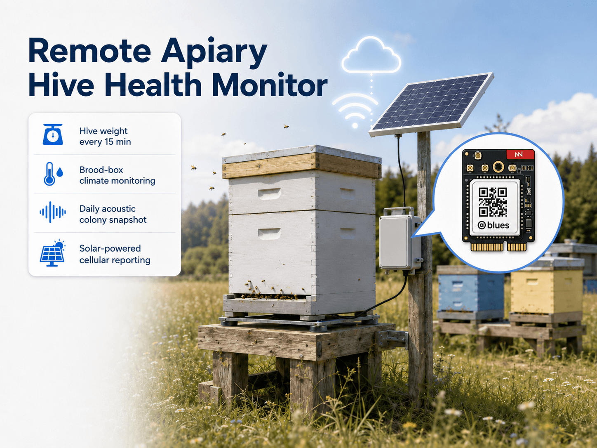
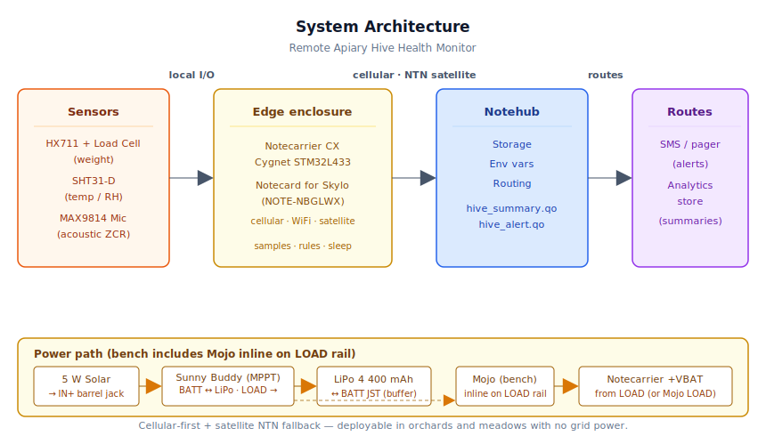
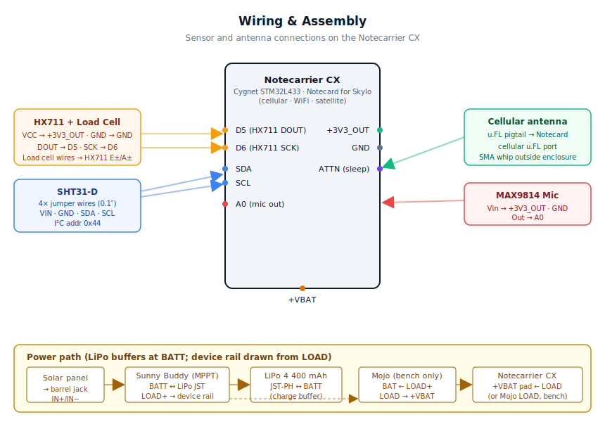
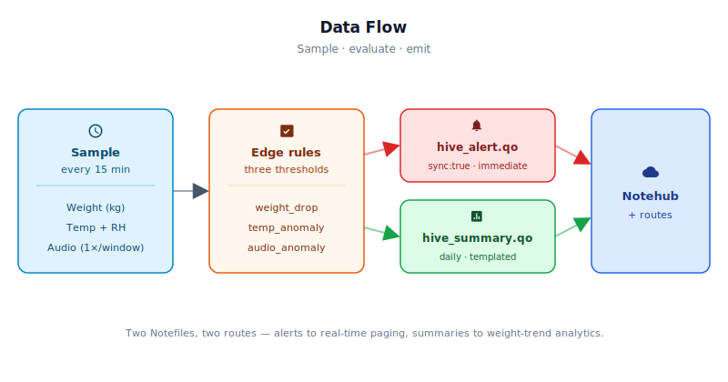

# Remote Apiary Hive Health Monitor



<Note>

This reference application is intended to provide inspiration and help you get started quickly. It uses specific hardware choices that may not match your own implementation. Focus on the sections most relevant to your use case. If you'd like to discuss your project and whether it's a good fit for Blues, [feel free to reach out](https://blues.com/landing-pages/accelerators-contact-us/?accelerator=Remote%20Apiary%20Hive%20Health%20Monitor).

</Note>

This project is a solar-powered hive monitor that turns each hive into a [remotely-monitored asset](https://blues.com/solutions-remote-monitoring/) — tracking hive weight and brood-box climate every 15 minutes, capturing a brief acoustic snapshot of the colony once per day, and reporting it all without grid power and without a truck roll every time the data looks wrong. A single [Notecard for Skylo](https://shop.blues.com/products/notecard-for-skylo?utm_source=dev-blues&utm_medium=web&utm_campaign=store-link) carries cellular, WiFi, and Skylo satellite radios on one module and fails over between them automatically, so the same hardware and firmware reach the [Blues Notehub](https://blues.com/notehub/) cloud service from an orchard with cell coverage or a meadow beyond any tower.

## 1. Project Overview


**The problem.** Commercial beekeepers run apiary yards in orchards, fields, and forest edges where there is no electrical infrastructure and no cellular signal worth depending on. A full-sized Langstroth hive in production can weigh 40–80 kg, and the signs that separate a thriving colony from a dead one — or from a hive that has just swarmed and taken 10,000 bees with it — are measured in kilograms, degrees, and the subtle shift in pitch of the colony's acoustic hum. None of those signals are observable from a distance without instrumentation, and traditional hive inspection — opening the box, smoking the bees, physically weighing the stand — takes time, disturbs the colony, and simply can't happen every 15 minutes. The result is that hive collapse, swarm departure, and queen loss are routinely discovered days after the fact, when the economic damage is already done.

This project is the remote set of eyes and ears that a beekeeper wants but cannot afford to physically station at every yard. A single weatherproof enclosure mounted on the hive stand reads three independent signals: weight (colony biomass and honey stores), temperature and humidity inside the brood box (brood viability), and acoustic features sampled from an analog microphone inside the hive (behavioral state). Those three signals are processed locally — weight and temperature sampled every 15 minutes, audio captured once per day — then aggregated into a daily summary and pushed to Notehub: over cellular where a tower is in reach, and over the [Skylo](https://www.skylo.tech/) satellite network where one isn't. Notecard for Skylo selects the path automatically. The beekeeper gets one notification per day in steady state and an immediate alert when any signal crosses a threshold.

<Note>

**POC scope — daily audio snippet, features only.** The acoustic path captures a single ~0.75-second snippet once per summary window (default: once per day). It computes zero-crossing rate (ZCR), RMS energy, and peak amplitude entirely on-device and transmits only those three numbers per summary. No raw audio is buffered, stored, or transmitted. Capturing audio once daily rather than every 15 minutes is consistent with the project scope — colony acoustic state evolves on the scale of hours, not minutes, and avoids the power and payload cost of continuous acoustic sampling. See §7 and §10 for details.

</Note>

**Why Notecard for Skylo.** Apiaries are deliberately sited away from human infrastructure — the whole point is to place bees near crops, meadows, or forest edges where forage is available and human disturbance is minimal. Those sites have no AC power and often marginal or absent cellular coverage. Every one of those constraints rules out the conventional IoT stack: a gateway-plus-cloud-SIM architecture requires months of site negotiation per yard, and a device that only works in strong cellular signal will fail at exactly the locations where bees are most productive. [Notecard for Skylo](https://shop.blues.com/products/notecard-for-skylo?utm_source=dev-blues&utm_medium=web&utm_campaign=store-link) (NOTE-NBGLWX) carries three radios on one M.2 module — cellular (LTE-M / NB-IoT / GPRS) with its own prepaid global SIM, WiFi, and satellite over the [Skylo](https://www.skylo.tech/) non-terrestrial network (**NTN**) — and selects among them automatically. There is no per-site IT negotiation and no carrier contract, and no second device or part-number decision for the yards that sit in coverage gaps: the firmware sets a single [`card.transport`](https://dev.blues.io/api-reference/notecard-api/card-requests/#card-transport) preference of `wifi-cell-ntn` (prefer WiFi, fall back to cellular, fall back again to Skylo satellite) and the failover is handled inside the Notecard — the host firmware never branches on which network is live. Skylo's geostationary (GEO) network provides good coverage across open-sky terrain, which is exactly what a hive stand in an open orchard or meadow provides. **Skylo coverage is geography- and service-region-dependent; verify current coverage for your deployment region and review the [satellite best practices guide](https://dev.blues.io/starnote/satellite-best-practices/) before relying on satellite as the sole backhaul.** The combination of low-power cellular with automatic satellite failover is not a belt-and-suspenders add-on here; it is the architecture that makes this deployable in the real operating environment of commercial apiculture.

<NewToBlues/>

**Deployment scenario.** The monitor lives in a small weatherproof enclosure zip-tied or screwed to the side of the hive stand. A 5 W solar panel on a short gooseneck bracket feeds a Li-ion battery through a solar MPPT charger. The load cell platform slides under the hive. Two sensor probes — one for temperature/humidity in the brood box, one for the microphone — thread through existing seams or ventilation holes. No modifications to the hive body are required; the bees never know anything has changed.

## 2. System Architecture




**Device-side responsibilities.** Every 15 minutes the onboard Cygnet STM32L433 host on the Notecarrier CX wakes via [`card.attn`](https://dev.blues.io/api-reference/notecard-api/card-requests/#card-attn), reads hive weight and brood-box temperature and humidity, evaluates three independent threshold rules, and folds the result into a running summary in RAM. Audio is a once-a-day affair, not a once-every-15-minutes affair — colony acoustic state evolves on the scale of hours, so the firmware captures a ~0.75-second snippet on the rollover wake itself, computes the ZCR, RMS, and peak amplitude on-device, and discards the raw samples. A tripped threshold queues an alert Note immediately; a normal day's summary goes to the Notecard for the next outbound sync. Between wakes the host is fully powered off — the Notecard's ATTN pin cuts the supply, and the battery sees essentially zero draw. Raw audio never leaves the device.

**Notecard responsibilities.** Notecard for Skylo buffers each [Note](https://dev.blues.io/api-reference/glossary/#note) on its on-device flash queue and opens a network session on the configured [`hub.set`](https://dev.blues.io/api-reference/notecard-api/hub-requests/#hub-set) outbound cadence. The `card.transport` `wifi-cell-ntn` preference set at boot decides the path automatically — cellular where a tower is in reach, Skylo satellite where the orchard sits beyond terrestrial coverage — so the beekeeper's daily summary still reaches Notehub whether the apiary has cellular bars or not, with no firmware branching on which radio is live. Alert Notes carry `sync:true` to bypass the outbound timer; the beekeeper hears about a weight-drop event in the same minute it crosses the threshold (minutes, when the unit is on satellite), not at the next scheduled flush. [Environment variables](https://dev.blues.io/guides-and-tutorials/notecard-guides/understanding-environment-variables/) pushed from Notehub retune thresholds and cadences in the field without anyone driving out to reflash firmware.

**Notehub responsibilities.** Each unit's embedded global SIM gets the Notecard onto carrier cellular worldwide and delivers data to [Notehub](https://notehub.io) over the Internet, which ingests every event and applies the project's [routes](https://dev.blues.io/notehub/notehub-walkthrough/#routing-data-with-notehub). Hive summaries and alerts arrive in separate [Notefiles](https://dev.blues.io/api-reference/glossary/#notefile), so the beekeeper's SMS endpoint and the long-term weight-trend store can be served from the same device without any filter logic in between.

**Routing to the cloud (high level).** Notehub supports HTTP, MQTT, AWS, Azure, GCP, Snowflake, and other targets; route configuration is project-specific and out of scope here. See the [Notehub routing docs](https://dev.blues.io/notehub/notehub-walkthrough/#routing-data-with-notehub).

## 3. Technical Summary


1. **Flash the firmware.** Open `firmware/apiary_hive_monitor/apiary_hive_monitor.ino` in Arduino IDE. Install dependencies: Blues Wireless Notecard, HX711 Arduino Library, Adafruit SHT31 (all via Library Manager). Replace `PRODUCT_UID` with your [Notehub](https://notehub.io) ProjectUID. Build with `arduino-cli compile --fqbn STMicroelectronics:stm32:Blues:pnum=CYGNET firmware/apiary_hive_monitor/apiary_hive_monitor.ino` and upload (the FQBN matches `firmware/apiary_hive_monitor/sketch.yaml`, so omitting `--fqbn` also works when invoked from the sketch directory).

2. **Wire sensors.** Connect HX711 (D5, D6), SHT31-D (SDA, SCL), and MAX9814 (A0) to Notecarrier CX per §5. Seat Notecard for Skylo in the M.2 slot and connect its `MAIN` and `GPS` antennas (§5).

3. **Validate power.** Use Mojo (bench only) to confirm ~15–40 mA active, ~100–400 µA asleep. Confirm temperature/humidity readings and audio ZCR in summaries before field deployment.

4. **Commission in Notehub.** Create a project, claim the Notecard, set `hx711_calibration` with known-weight test (§9 procedure), and set environment variables at the fleet level. Deploy.

**What you'll have:** One compact daily Note with hive weight (kg), temperature/humidity averages, and acoustic features (ZCR, RMS, peak). Immediate alerts for weight drops, temperature anomalies, or acoustic changes. Full deployment to off-grid sites without cellular infrastructure.

**Payload example** — `hive_summary.qo` (daily, compact template):

```json
{
  "weight_kg": 42.3,
  "weight_delta": -0.8,
  "temp_c_avg": 34.7,
  "humidity_avg": 67.2,
  "zcr_avg": 724,
  "rms_avg": 0.12,
  "peak_avg": 0.38,
  "samples": 96,
  "batt_mv": 3842
}
```

**Alert example** — `hive_alert.qo` (immediate, `sync:true`):

```json
{
  "alert": "weight_drop",
  "value1": 4.7,
  "value2": 37.6,
  "batt_mv": 3901
}
```

Here is a sample Note this device emits:

```json
{
  "file": "hive_summary.qo",
  "body": {
    "weight_kg":     42.3,
    "weight_delta":  -0.8,
    "temp_c_avg":    34.7,
    "humidity_avg":  67.2,
    "zcr_avg":       724,
    "rms_avg":       0.12,
    "peak_avg":      0.38,
    "samples":       96,
    "batt_mv":       3842
  }
}
```

## 4. Hardware Requirements


| Part | Qty | Rationale |
|------|-----|-----------|
| [Notecarrier CX](https://dev.blues.io/datasheets/notecarrier-datasheet/notecarrier-cx-v1-7/) ([buy](https://shop.blues.com/products/notecarrier-cx?utm_source=dev-blues&utm_medium=web&utm_campaign=store-link)) | 1 | Integrated carrier with an embedded Cygnet STM32L433 host MCU — no separate Swan needed. Provides A0–A5 analog inputs, SDA/SCL I2C, and digital GPIO pins sufficient for all three sensors. |
| [Notecard for Skylo (NOTE-NBGLWX)](https://dev.blues.io/datasheets/notecard-datasheet/note-nbglwx/) ([buy](https://shop.blues.com/products/notecard-for-skylo?utm_source=dev-blues&utm_medium=web&utm_campaign=store-link)) | 1 | One M.2 module carrying cellular (LTE-M / NB-IoT / GPRS, Quectel BG95-S5 modem), WiFi (Silicon Labs WFM200S), and Skylo satellite (NTN) radios. Seats into the Notecarrier CX M.2 slot. The firmware's `card.transport` `wifi-cell-ntn` setting makes it prefer cellular at in-coverage apiaries and fall back automatically to the Skylo satellite network at yards beyond cellular reach — no second device or part-number decision, and no separate satellite enclosure. The integrated prepaid global SIM means no carrier contract and no per-site IT negotiation. Skylo GEO coverage varies by geography and service region; verify coverage for your deployment area before relying on satellite as the sole backhaul (see [satellite best practices](https://dev.blues.io/starnote/satellite-best-practices/)). This design does not configure or transmit device location — the board's GPS/GNSS receiver is used by the satellite stack internally for timing and ephemeris, not as a user-facing location source. Requires the antennas below. |
| M16 cable glands (nylon, IP68) | 2 | One for the sensor cable bundle and one for the antenna pigtail penetration in the main enclosure. |
| [Blues Mojo](https://dev.blues.io/datasheets/mojo-datasheet/) ([buy](https://shop.blues.com/products/mojo?utm_source=dev-blues&utm_medium=web&utm_campaign=store-link)) | 1 | **Bench commissioning only.** Coulomb counter for power-budget validation. Mounts inline on the Sunny Buddy load rail between the charger and the Notecarrier CX `+VBAT` pad; wired to Notecarrier CX Qwiic during bench testing. Must be removed from the field assembly before deployment. See §9 for usage. |
| [SparkFun Load Cell Amplifier HX711 (SEN-13879)](https://www.sparkfun.com/products/13879) | 1 | 24-bit ADC front-end designed for Wheatstone-bridge load cells; interfaces to the Cygnet via two GPIO pins using bit-bang protocol. |
| [Zemic H8C-C3-100KG single-ended shear-beam load cell](https://www.zemiceurope.com/media/Documentation/H8C_Datasheet.pdf) | 1 | IP67-rated alloy-steel single-ended shear-beam cell, 100 kg capacity, OIML C3 accuracy class, 4-wire Wheatstone bridge with 1 m cable. The H8C is normally one of 3–4 cells in a platform scale; for this single-cell POC it is mounted as a cantilever weigh module (fixed end bolted to a rigid bracket, free end carrying the load through a button or rocker pin). See §5 for the mount detail and §10 for the off-center loading limitations this introduces. Sized for a loaded double-brood Langstroth with supers (typically 40–80 kg). Available through [Zemicus USA](https://www.zemicusa.com/products/) and Zemic-authorized scale-supply distributors. |
| [Adafruit Sensirion SHT31-D Temperature & Humidity Sensor (product #2857)](https://www.adafruit.com/product/2857) | 1 | I2C sensor for inside-brood-box temperature and humidity; rated for high-humidity operation. Connected to the Notecarrier CX I2C header pins (VIN, GND, SDA, SCL) via four female-to-female jumper wires — the Notecarrier CX dual 16-pin header uses 0.1″ pitch, which does not accept a Qwiic/STEMMA QT connector directly. Brood temperature must stay 34–35 °C for healthy brood development — this is the most sensitive single health indicator in the hive. |
| [Adafruit Electret Microphone Amplifier MAX9814 (product #1713)](https://www.adafruit.com/product/1713) | 1 | Analog amplified electret microphone with automatic gain control (AGC). Output connects to A0 on the Notecarrier CX for ADC sampling. The MAX9814's AGC keeps the signal in range across the wide amplitude variation between a quiet winter cluster and an agitated defensive colony. |
| [SparkFun Sunny Buddy MPPT Solar Charger (PRT-12885)](https://www.sparkfun.com/products/12885) | 1 | Maximum power point tracking (MPPT) solar charger for single-cell Li-ion or LiPo (both chemistries share a 4.2 V CC/CV charge profile). Solar panel connects to the barrel-jack input (`IN+`/`IN−`); the battery connects to the `BATT` JST connector or `BAT+`/`GND` screw terminals; the `LOAD+`/`GND` output supplies the downstream device rail (Notecarrier CX via Mojo on the bench, or directly in the field). |
| [Adafruit Lithium Ion Battery Pack 3.7V 4400mAh (#354)](https://www.adafruit.com/product/354) | 1 | Energy buffer for overnight and cloudy-day operation. The pack is two 18650-format Li-ion cells in parallel with integrated protection; the form factor and chemistry both differ from a LiPo pouch and the thermal-limit guidance in §10 is written specifically for Li-ion. At the nominal 15-minute sample cadence with the sleep-dominant firmware profile, estimated **active-phase** daily consumption is roughly 12–18 mAh (96 wakeup cycles × ~10 seconds at ~40 mA, plus one daily LTE Cat-1 bis sync at ~200 mA × ~60 seconds). The sleeping assembly also draws approximately 100–400 µA quiescent (Notecard low-power idle plus Notecarrier CX regulator and Sunny Buddy quiescent. See §9 power table), adding roughly 2.4–9.6 mAh/day. The whole-system daily budget is therefore approximately **14–28 mAh/day**, giving a 4 400 mAh pack at 80 % depth of discharge (3 520 mAh usable) on the order of **125–250 days of reserve** without any solar contribution. Actual reserve depends on NTN session frequency, cellular signal quality, and ambient temperature effects on Li-ion capacity — validate with Mojo during bench commissioning. Includes a JST-PH 2-pin connector that mates directly with the Sunny Buddy `BATT` JST port. |
| [Voltaic Systems P105 5W 6V ETFE Solar Panel](https://voltaicsystems.com/5-watt-panel-etfe/) | 1 | 5 W, 6 V (peak 6.12 V / 940 mA) monocrystalline ETFE panel rated for long-term outdoor use. Ships with a 3.5 mm × 1.1 mm DC plug that inserts directly into the Sunny Buddy's barrel-jack solar input. At 940 mA peak, a full recharge of the 4400 mAh pack takes under 5 hours of direct sun. |
| [Hammond 1554F2GY polycarbonate enclosure (IP66, 120 × 90 × 60 mm)](https://www.hammfg.com/product/1554F2GY) | 1 | IP66 polycarbonate enclosure with opaque lid, sized to house the Notecarrier CX, Sunny Buddy, and Li-ion pack. Drill two M16 cable-gland holes: one for the sensor cable bundle, one for the SMA antenna pigtail. The antenna mounts outside the enclosure (see antenna rows below), so the opaque lid does not affect the satellite or cellular link. Available from Hammond and authorized distributors. |
| 4× female-to-female jumper wires, 150–200 mm (e.g. [Adafruit #266](https://www.adafruit.com/product/266)) | 1 set | Connect the SHT31-D breakout's 0.1″ header pins (VIN, GND, SDA, SCL) to the matching pins on the Notecarrier CX dual 16-pin header. |
| STEMMA QT / Qwiic cable, 100 mm | 1 | Connects Mojo's Qwiic port to the Notecarrier CX Qwiic connector during bench commissioning so the coulomb-counter tally is readable from the blues.dev In-Browser Terminal; remove this cable before field deployment. |
| Skylo-certified LTE/satellite antenna included with Notecard for Skylo (u.FL) | 1 | Connects to the `MAIN` u.FL port and carries **both** the terrestrial cellular signal and the Skylo satellite link — a single antenna for both networks. Use only the Skylo-certified antenna supplied with Notecard for Skylo; substituting an uncertified antenna risks regulatory non-compliance and link failure. Mount it outdoors on the enclosure lid or hive-stand upright with an unobstructed view of the sky (northern hemisphere: the southern sky toward the equator, where Skylo's GEO satellites sit), routed through a liquid-tight fitting. For an external SMA mount instead of the bare u.FL antenna, add a u.FL-to-SMA-F bulkhead pigtail (e.g. [Adafruit #851](https://www.adafruit.com/product/851)) through the enclosure wall. |
| Passive GPS/GNSS antenna (u.FL) per the [Notecard for Skylo datasheet](https://dev.blues.io/datasheets/notecard-datasheet/note-nbglwx/) | 1 | Connects to the `GPS` u.FL port for GNSS time/ephemeris used internally by the satellite stack. Mount outdoors with a clear sky view alongside the main antenna; route through a liquid-tight fitting. |

**Bundled connectivity (Notecard for Skylo):** Ships with an active global SIM including 500 MB of cellular data and 10 years of service, **plus** 10 KB of bundled Skylo satellite data — no activation fees, no monthly subscription, and no separate satellite provider subscription. Minimizing inbound sync frequency conserves the bundled satellite allocation; see §2 and §7 for guidance.

## 5. Wiring and Assembly




The enclosure mounts on the hive stand and the bees never know it's there — three sensor leads thread through existing seams, the antenna lives outside on the lid, and a small solar panel feeds the whole thing from a gooseneck bracket nearby. Every host I/O lands on the [Notecarrier CX](https://dev.blues.io/datasheets/notecarrier-datasheet/notecarrier-cx-v1-7/) dual 16-pin headers, and Notecard for Skylo seats into the M.2 slot. Its `MAIN` u.FL port connects to the included Skylo-certified antenna — which carries both the cellular and satellite signals — and its `GPS` u.FL port connects to the passive GPS/GNSS antenna; both mount outside the box with an unobstructed view of the sky.

**Power chain.** The Sunny Buddy MPPT charger sits between the solar panel and the Li-ion battery. The Li-ion pack connects to the Sunny Buddy's `BATT` JST connector (or `BAT+`/`GND` screw terminals). The system load is drawn from the Sunny Buddy's `LOAD+`/`GND` screw terminals; the Notecarrier CX `+VBAT` pad connects to `LOAD+` and `GND` connects to the common ground rail. During bench commissioning, Mojo sits inline on the positive load rail to measure downstream device current:

- Solar panel DC plug → Sunny Buddy barrel jack (`IN+`/`IN−`)
- Battery JST-PH → Sunny Buddy `BATT` JST connector (charges battery from solar via MPPT; battery negative is at Sunny Buddy `GND`, which is common with `LOAD GND` and `IN−` on the Sunny Buddy PCB)
- Sunny Buddy `LOAD+` → Mojo `BAT` input → Mojo `LOAD` output → Notecarrier CX `+VBAT` *(bench only)*
- Sunny Buddy `LOAD GND` → Mojo `GND` → Notecarrier CX `GND` *(bench: Mojo intercepts positive rail only; ground is unbroken and common across all three boards)*
- Sunny Buddy `LOAD+` → Notecarrier CX `+VBAT` *(field deployment, remove Mojo)*
- Sunny Buddy `LOAD GND` → Notecarrier CX `GND` *(field deployment, direct ground return)*

Mojo in this position measures the current flowing from the Sunny Buddy's load rail to the Notecarrier — the total downstream device draw, not the battery charge/discharge current directly. Ground is never interrupted by Mojo; it passes through directly to both the Notecarrier CX and back to the Sunny Buddy.

**HX711 load cell amplifier:**

- HX711 `VCC` → Notecarrier CX `+3V3_OUT`
- HX711 `GND` → Notecarrier CX `GND`
- HX711 `DOUT` → Notecarrier CX `D5`
- HX711 `PD_SCK` → Notecarrier CX `D6`
- Load cell `E+` (excitation positive) → HX711 `E+`
- Load cell `E−` (excitation negative) → HX711 `E−`
- Load cell `A+` (signal positive) → HX711 `A+`
- Load cell `A−` (signal negative) → HX711 `A−`

Mount the H8C as a single-cell weigh module: bolt the **fixed end** (the end with the strain-gauge cable exit) to a rigid steel angle bracket secured to the base or pad block, leaving the **free end** unconstrained so it can deflect under load. Thread a loading button or rocker pin into the tapped hole on the free end and rest the hive stand on that loading point plus three outrigger anti-tip pads — the outriggers carry no load, they only prevent the platform from tipping. This converts a single-ended shear-beam, which is normally one of 3–4 cells in a platform scale, into a viable single-cell hive scale at the cost of the off-center loading errors documented in §10. Follow the orientation and bolt-torque values given in the H8C datasheet — installing the cell upside-down or with the load applied on the wrong end produces incorrect readings and can damage the gauges. Apply a thin bead of RTV silicone sealant around the cable exit to keep moisture out.

**SHT31-D temperature and humidity sensor:**

The Notecarrier CX dual 16-pin header uses 0.1″ pitch and does not accept Qwiic/STEMMA QT connectors directly. Use four female-to-female jumper wires to the SHT31-D breakout's 0.1″ through-hole pads:

- SHT31-D `VIN` → Notecarrier CX `+3V3_OUT`
- SHT31-D `GND` → Notecarrier CX `GND`
- SHT31-D `SDA` → Notecarrier CX `SDA`
- SHT31-D `SCL` → Notecarrier CX `SCL`

The SHT31-D address defaults to 0x44; it coexists on the I2C bus with the Notecard without conflict.

- **POC caveat — in-hive placement.** The Adafruit SHT31-D breakout is not a sealed probe; it is an exposed PCB with a bare humidity membrane. The brood box interior runs at 34–36 °C and ≥ 85 % RH year-round, and propolis will accumulate on the PCB body over time. The Sensirion SHT31 sensor element itself is rated for high-humidity operation, but the breakout's solder joints and traces are not hardened for indefinite in-hive service. For short-term POC validation, thread the board in through an existing seam or ventilation slot, position the sensor head between frames 2 and 3 at mid-frame height, and coat the PCB body (not the sensing element) with beeswax or conformal coating to slow propolis adhesion. For production deployments, use a sensor with a sealed stainless probe tip rather than an exposed breakout board, and pot all external cable exits with marine-grade silicone or epoxy.

**MAX9814 microphone:**

- MAX9814 `Vin` → Notecarrier CX `+3V3_OUT`
- MAX9814 `GND` → Notecarrier CX `GND`
- MAX9814 `Out` → Notecarrier CX `A0`
- Leave the MAX9814 `Gain` pin floating for the default 60 dB gain setting (adjustable to 50 or 40 dB with resistors if the AGC saturates in high-traffic hives).
- **POC caveat — microphone placement.** The Adafruit MAX9814 breakout is an unenclosed PCB with an exposed electret capsule; it is not hardened for in-hive service. Mount the breakout board outside or at the edge of the hive entrance — close enough to pick up colony sound through the landing board gap — rather than placing it fully inside the hive body. The combination of 85 %+ RH, hive acids, and propolis buildup on and around the capsule opening will progressively attenuate the acoustic response; treating this as a long-term maintenance-free installation is not supported. For anything beyond short-term bench validation, apply conformal coating to the PCB (masking the capsule mesh opening) and thread only a thin wiring lead through the seam. If the application requires acoustic sensing from deep inside the brood box, use a sealed MEMS microphone module rated for high-humidity environments.

**Analog reference (`+V_AREF` pin):** Leave unconnected; the STM32L433 ADC uses the internal 3.3 V reference for the A0 microphone input.

**Antennas (single board, cellular + satellite + GPS):**

Notecard for Skylo's `MAIN` u.FL antenna carries **both** the cellular and the Skylo satellite signal — one antenna replaces what used to be a separate cellular whip and an external satellite module's antenna.

1. Connect the included Skylo-certified antenna's u.FL connector to the Notecard's `MAIN` u.FL port. The connector orients with the cable center-pin facing the port — it clicks firmly when fully seated. Use only the Skylo-certified antenna supplied with the board; an uncertified substitute risks regulatory non-compliance and link failure.
2. Connect the passive GPS/GNSS antenna's u.FL connector to the Notecard's `GPS` u.FL port.
3. Mount both antennas outside the enclosure with an unobstructed view of the sky. For satellite operation in the northern hemisphere, give the main antenna a clear view of the southern sky (toward the equator), where Skylo's GEO satellites sit; tilt and orient to maximize sky view. Route each through an M16 cable-gland port in the enclosure wall, or use a u.FL-to-SMA-F bulkhead pigtail (e.g. Adafruit #851) if you prefer an external SMA-mount antenna, securing the bulkhead with its lock nut from outside.

Because the satellite link uses the same `MAIN` antenna as cellular, the placement that gives a good cellular signal also enables satellite fallback — there is no second module to mount and no JST cable to run. The opaque Hammond lid does not matter: both antennas live outside the box.

**Mojo bench connection (remove before field deployment).** During bench commissioning, connect the second STEMMA QT / Qwiic cable from Mojo's Qwiic port to the Notecarrier CX Qwiic connector. The Notecard can then report the Mojo coulomb-counter tally (cumulative mAh, charge/discharge rate) in response to `card.power` requests issued from the blues.dev In-Browser Terminal. Remove the Mojo and Qwiic cable before sealing the field enclosure — the production firmware does not query Mojo in the deployed build.

## 6. Notehub Setup


1. **Create a project.** Sign up at [notehub.io](https://notehub.io) and create a project. Copy the [ProductUID](https://dev.blues.io/notehub/notehub-walkthrough/#finding-a-productuid) and paste it into `firmware/apiary_hive_monitor/apiary_hive_monitor.ino` as `PRODUCT_UID`.

2. **Claim the Notecard.** Power up the unit at a location with cellular (or WiFi) coverage. Notecard for Skylo associates with your project on its first non-NTN sync. **This initial cellular/WiFi sync is mandatory before satellite works:** it registers the device with Notehub, registers the Notefile templates, downloads the current satellite ephemeris, and sets device time — all required before any NTN transmission will succeed. Commission each unit where it has terrestrial coverage even if it will routinely operate over satellite. See the [satellite best practices guide](https://dev.blues.io/starnote/satellite-best-practices/).

   **First-boot timing Note.** The firmware anchors the summary window to the first successful `card.time` response — the moment the Notecard returns a valid epoch rather than an error. Any sensor readings accumulated before that time anchor are discarded, and the window clock starts from that point. The first `hive_summary.qo` Note therefore arrives after a full `report_interval_hr` window has elapsed **from the first successful time sync** (default: 24 hours from that anchor), which may be later than first power-up if the unit is commissioned indoors or in a weak-signal location before cellular or satellite lock is achieved. This is intentional — a summary sent before a valid time reference would contain at most a single sensor reading and no meaningful weight delta.

3. **Set a fleet per apiary yard.** [Fleets](https://dev.blues.io/guides-and-tutorials/fleet-admin-guide/) group devices for shared configuration. One fleet per yard lets you apply threshold environment variables at the yard level (all hives in a given orchard see similar ambient conditions) while overriding per-device for any hive that's known to be a heavy producer or an established swarm catcher.

4. **Set environment variables.** In Notehub, navigate **Fleet → Environment** and set any values below (all are optional; firmware defaults are shown in the table). Any value set at fleet or device level overrides the compile-time default on the device's next inbound sync. Use [Smart Fleets](https://dev.blues.io/notehub/notehub-walkthrough/#using-smart-fleet-rules) to automate fleet assignment based on device metadata.

   > **Commissioning Note — inbound cadence.** The firmware configures `inbound: 10080` (one week) to minimize satellite session costs. This means env var changes pushed from Notehub will not be pulled by the device until the next scheduled inbound, which may be up to seven days away. During bench commissioning, **force an immediate inbound sync** after each env var change by sending `{"req":"hub.sync"}` from the **blues.dev In-Browser Terminal** (upper right of the Notehub console). Alternatively, temporarily shorten the inbound interval for the bench session by sending `{"req":"hub.set","mode":"periodic","outbound":1440,"inbound":15}` from the terminal, and restore the weekly inbound (`"inbound":10080`) before field deployment.

   | Variable | Default | Purpose |
   |---|---|---|
   | `sample_interval_min` | `15` | Minutes between sensor readings and threshold evaluations. |
   | `report_interval_hr` | `24` | Hours between summary Notes. Changing this value also adjusts the Notecard's outbound sync cadence (`outbound = report_interval_hr × 60` minutes): the firmware reissues `hub.set` automatically on the next wake cycle after the env var is applied, so cellular and NTN transmission cost scales with summary frequency. |
   | `weight_alert_kg_drop` | `2.0` | Weight loss (kg) over the **current summary window** above which a `weight_drop` alert fires. Because the weight baseline (`weight_first_kg`) resets at the start of every summary window, this threshold applies over whatever `report_interval_hr` is set to — if you change the report interval to 12 hours, it becomes a 12-hour loss threshold. Tune per hive — a productive colony naturally loses weight on cool rainy days. |
   | `temp_low_c` | `32.0` | Brood-box temperature (°C) below which `temp_anomaly` fires. Below 32 °C brood viability drops rapidly. |
   | `temp_high_c` | `36.0` | Brood-box temperature (°C) above which `temp_anomaly` fires. Above 36 °C the colony is likely overheating or the sensor has shifted position. |
   | `audio_zcr_alert` | `1200` | Zero-crossing rate (counts per second) above which `audio_anomaly` fires. Elevated ZCR indicates a behavioral change from the colony's normal acoustic pattern; the specific cause requires physical inspection to determine. Baseline is typically 600–800 for calm, settled colonies, but varies by strain, season, and ambient noise environment. |
   | `hx711_calibration` | `2280.0` | HX711 scale factor (raw ADC counts per kg). Set this first using the known-weight procedure in §9. |
   | `hx711_zero_offset_kg` | `0.0` | Platform tare offset in kg. After calibrating the scale factor, set this to the reading reported by the empty platform (hive stand structure with no hive body). The firmware subtracts this value from every weight reading. See the tare procedure in §9. |
   | `reset_state` | (not set) | Set to `1` and force an inbound sync to immediately clear all accumulated summary-window data and restart the time anchor on the next wake. The firmware will discard any partial window in progress and begin a fresh accumulation cycle from the point the next valid `card.time` response is received. The reset is **one-shot**: the firmware records the current value in persisted state, so subsequent wakes that still read `reset_state=1` (which can continue for up to one inbound period, default one week — before Notehub delivers the cleared value) are silently skipped. You may leave `reset_state=1` in Notehub or remove it; either way the reset will not repeat. Setting the variable back to `0` or removing it and later setting it to `1` again will fire a second reset exactly once. Used during bench commissioning to start a known-clean calibration window. See §9. |

5. **Configure routes.** Add one [route](https://dev.blues.io/notehub/notehub-walkthrough/#routing-data-with-notehub) targeting `hive_alert.qo` (low-volume, route to SMS/email gateway or a CMMS endpoint) and a second targeting `hive_summary.qo` (daily, route to a long-term analytics store for weight trend analysis across the season). Keeping the Notefiles separate at the source lets you fan them to different destinations without filter logic inside the route.

## 7. Firmware Design


The firmware does almost nothing most of the time — which is the whole point. Each 15-minute wake reads three sensors, folds the readings into a running summary, fires an alert if anything crossed a threshold, and goes back to sleep. The sketch is split across three files in the same directory so the wake-cycle logic stays separate from the sensor drivers and Notecard helpers:

- [`firmware/apiary_hive_monitor/apiary_hive_monitor.ino`](firmware/apiary_hive_monitor/apiary_hive_monitor.ino) — main sketch; wakeup sequencing, accumulation, alert evaluation, and sleep.
- [`firmware/apiary_hive_monitor/apiary_hive_monitor_helpers.h`](firmware/apiary_hive_monitor/apiary_hive_monitor_helpers.h) — shared `HiveState` struct, extern declarations, and function prototypes.
- [`firmware/apiary_hive_monitor/apiary_hive_monitor_helpers.cpp`](firmware/apiary_hive_monitor/apiary_hive_monitor_helpers.cpp) — sensor drivers, Notecard helper functions, and summary/alert emission.

To open in Arduino IDE: **File → Open** and navigate to `firmware/apiary_hive_monitor/apiary_hive_monitor.ino`. The IDE will pick up the helper files automatically because they share the same directory.

**Dependencies:**

- Arduino core for STM32 ([`stm32duino/Arduino_Core_STM32`](https://github.com/stm32duino/Arduino_Core_STM32)) — install via Arduino IDE Boards Manager.
- [`Blues Wireless Notecard`](https://github.com/blues/note-arduino) (the `note-arduino` library) — install via Arduino Library Manager. See [note-arduino releases](https://github.com/blues/note-arduino/releases) for available versions; review the changelog for any breaking API changes before upgrading.
- [`HX711 Arduino Library`](https://github.com/bogde/HX711) by Bogdan Necula and Lukas Bachschwell — install via Library Manager.
- [`Adafruit SHT31 Library`](https://github.com/adafruit/Adafruit_SHT31) — install via Library Manager.

### Modules

| Responsibility | Where |
|---|---|
| Notecard configuration (`hub.set`, `card.transport` `wifi-cell-ntn` for automatic cellular→Skylo satellite fallback, disable accelerometer; no location configured, the board's GPS receiver is used internally by the satellite stack only) | `notecardConfigure()` |
| Note template definitions (compact, satellite-safe) | `defineTemplates()` |
| Environment variable fetch and clamping | `fetchEnvOverrides()` |
| HX711 10-sample weight average | `readWeightKg()` |
| SHT31-D I2C temperature and humidity | `readTempHumidity()` |
| Streaming audio feature extraction (ZCR, RMS, peak) | `readAudioFeatures()` |
| Threshold evaluation and immediate alert emission | `sendAlert()` |
| Daily aggregated summary emission | `sendSummary()` |
| State persistence and sleep via ATTN | `setup()` → `NotePayloadSaveAndSleep()` |

### Sensor reading strategy

**Weight.** The HX711 is woken by pulling the PD_SCK pin low, then 10 successive readings are taken and averaged. The HX711 library handles the bit-bang timing internally. A calibration factor (`hx711_calibration` env var) converts raw 24-bit ADC counts to kilograms. After the read the HX711 is put to sleep (PD_SCK held high) to eliminate its ~1.5 mA idle draw during the sleep cycle.

**Temperature and humidity.** A single SHT31-D measurement takes roughly 15 milliseconds; the library manages the I2C transaction and CRC check internally. Values are accumulated into running sums for the daily average; if the I2C read fails (returns NaN), the sample is excluded from the sum so a wired-off sensor does not bias the average to zero.

**Audio feature extraction.** Audio is captured **once per summary window** (by default, once per day). The firmware checks the `audio_sampled` flag after evaluating window expiry, not before. On a successful rollover the flag is cleared before the audio check fires, so audio is captured on the rollover wake itself, making that wake the true first wake of the new window for all three sensor paths. On all subsequent wakes of the same window `audio_sampled` is set and the microphone is not re-sampled. On a failed rollover (`sendSummary()` returned false), `audio_sampled` is still true from the previous window and the block is skipped — consistent with the frozen-snapshot retry behavior for weight and temperature.

When audio is attempted, `readAudioFeatures()` runs 12 consecutive 256-sample windows on A0 at approximately 4 kHz (`AUDIO_SAMPLE_PERIOD_US = 225 µs`), giving a ~0.75-second snippet total. Features are computed without storing the full audio buffer — which would require 32 KB at 16-bit resolution, a meaningful fraction of the Cygnet's 64 KB SRAM. `readAudioFeatures()` returns a validity flag: if the signal is implausible (DC offset outside the expected mid-rail band indicating a floating or disconnected A0, more than 30 % of samples within 32 LSB of the ADC rail indicating clipping, or normalized RMS below a minimum threshold indicating a dead or shorted microphone), the read is rejected. On an invalid read, `audio_anomaly` is not evaluated, `audio_sampled` is still set to prevent per-wake retries, and `zcr_avg`, `rms_avg`, and `peak_avg` emit `−9999` — the same sentinel convention used for weight timeouts and temperature NaN reads. Only the three computed features are stored or transmitted; no raw audio is recorded.

- **Zero-crossing rate (ZCR):** Count of sign changes per second. Higher ZCR = higher frequency content = more active colony sound.
- **RMS energy:** Root-mean-square of the windowed samples, normalized to the 12-bit ADC range. Tracks overall hive activity level.
- **Peak amplitude:** Normalized maximum sample value in the window.

These three features are averaged across the 12 windows and stored in the daily accumulator. The ZCR is the primary anomaly indicator; RMS and peak are supplemental context in the daily summary payload.

### Event payload design

Two [template-backed](https://dev.blues.io/notecard/notecard-walkthrough/low-bandwidth-design#working-with-note-templates) Notefiles using `"format": "compact"` — required for Skylo NTN (satellite) operation and good practice regardless, as compact templates reduce on-wire payload size by 3–5× compared with free-form JSON, keeping each Note well within the 256-byte NTN payload ceiling.

`hive_summary.qo` (daily, templated compact):

```json
{
  "file": "hive_summary.qo",
  "body": {
    "weight_kg":     42.3,
    "weight_delta":  -0.8,
    "temp_c_avg":    34.7,
    "humidity_avg":  67.2,
    "zcr_avg":       724,
    "rms_avg":       0.12,
    "peak_avg":      0.38,
    "samples":       96,
    "batt_mv":       3842
  }
}
```

`hive_alert.qo` (immediate, `sync:true`, templated compact):

```json
{
  "file": "hive_alert.qo",
  "body": {
    "alert":   "weight_drop",
    "value1":  4.7,
    "value2":  37.6,
    "batt_mv": 3901
  },
  "sync": true
}
```

The `value1` and `value2` fields carry alert-specific data: for `weight_drop`, the daily loss in kg and the current hive weight; for `temp_anomaly`, the current temperature and humidity; for `audio_anomaly`, the ZCR and RMS values. A single compact template handles all three alert types.

### Low-power strategy

After each 15-minute sample cycle, the host issues `NotePayloadSaveAndSleep()`, which serializes the runtime state (`HiveState` struct containing summary-window accumulators, last-alert timestamps, the weight baseline, and the `audio_sampled` flag) into the Notecard's flash memory, then arms [`card.attn`](https://dev.blues.io/api-reference/notecard-api/card-requests/#card-attn) to cut host power entirely for `sample_interval_min × 60` seconds. Between cellular sessions the Notecard enters its published low-power idle state (~8–20 µA per the Notecard datasheet). The HX711 is put to sleep via its PD_SCK pin after each weight reading. The microphone's AGC circuit draws from the 3.3 V rail only while the Cygnet host is awake (~5–8 seconds per cycle), and audio sampling itself occurs on only one of the 96 daily wake cycles.

`notecardConfigure()` also issues a one-time [`card.transport`](https://dev.blues.io/api-reference/notecard-api/card-requests/#card-transport) `{"method":"wifi-cell-ntn"}` on first boot so Notecard for Skylo prefers WiFi, then cellular, then Skylo satellite — the fallback is enabled at the Notecard, with no firmware branching on which radio is live (NTN is not enabled by default, so this call is what makes satellite fallback possible). The Notecard persists the setting in its own flash, so issuing it once is sufficient.

The initial sync cadence is set to `outbound: 1440` (daily) to minimize satellite transmission costs at sites that operate over NTN; `sync:true` on alert Notes bypasses this timer and forces an immediate cellular or NTN session. `inbound` is set to `10080` (one week) per the [satellite best practices guide](https://dev.blues.io/starnote/satellite-best-practices/), since each inbound satellite ping costs approximately 50 bytes of the bundled 10 KB satellite allocation. Environment variable changes are applied on the next scheduled inbound sync.

When `report_interval_hr` is changed in Notehub, the firmware automatically reissues `hub.set` with `outbound = report_interval_hr × 60` on the next wake cycle after the env var is picked up, keeping the Notecard's transmission schedule aligned with the local summary cadence. Changing `report_interval_hr` to `12` (for example) therefore both shortens the summary window and reduces the outbound sync interval to 720 minutes on the same wake cycle — no manual `hub.set` intervention required.

### Retry and error handling

- The first Notecard transaction — `hub.set` inside `notecardConfigure()` — runs a manual 5-attempt `requestAndResponse()` loop with a 1-second inter-attempt delay. Using `requestAndResponse()` rather than the higher-level `sendRequestWithRetry()` lets the code inspect the Notecard's `err` response field before treating the call as successful. `first_boot` is cleared only when the Notecard confirms `hub.set` was accepted without an error, not merely when the I2C transport completed, so a configuration that was rejected or silently dropped does not permanently skip setup.
- SHT31-D reads that return NaN are excluded from daily temperature and humidity averages. The firmware maintains a separate `temp_valid_count` for successful SHT31-D reads so that failed reads do not bias the average toward zero. If `temp_valid_count` is zero at summary time (every read failed), `sendSummary()` calls `safeAvg()` which emits `−9999` as a sentinel, allowing downstream analytics to distinguish a total sensor failure from a near-zero valid reading.
- HX711 reads that timeout (no data-ready pulse within 500 milliseconds) return `−1.0` and are excluded from the daily weight average.
- Alert cooldown (`ALERT_COOLDOWN_MIN`, default 60 minutes) prevents a slowly drifting sensor from issuing a new page every 15 minutes until the threshold is corrected or the condition resolves.
- Audio reads that fail hardware-plausibility checks are rejected entirely: `readAudioFeatures()` returns `false` when the DC offset is outside the expected mid-rail band (a floating or disconnected A0 input reads near 0 or 4095), when more than 30 % of samples in a window fall within 32 LSB of the ADC rail (railed or severely clipping input), or when the normalized RMS falls below the minimum signal threshold (dead or shorted microphone capsule). On an invalid read `audio_anomaly` is not evaluated, `audio_sampled` is still set to prevent per-wake retries for the rest of the window, and `zcr_avg`, `rms_avg`, and `peak_avg` emit `−9999` in the summary — the same sentinel convention used for weight timeouts (`−1.0` read → excluded, `safeAvg` emits `−9999`) and temperature NaN reads. A persistent `−9999` across consecutive daily summaries indicates a hardware failure (disconnected wire, failed capsule, or corroded contact) requiring physical inspection.

### Key code snippet 1: compact template definition

The `"format": "compact"` field is required for Skylo NTN (satellite) operation and cuts the per-Note wire size by 3–5× (e.g., a 200-byte JSON Note becomes ~40–80 bytes in compact form). `port` must be in the range 1–100. The numeric format codes (e.g., `14.1`, `12`) describe the wire encoding: `14.1` means a 4-byte IEEE 754 float, `12` means a 2-byte signed integer. The Notecard handles encoding/decoding automatically; no manual work required.

```cpp
J *req = notecard.newRequest("note.template");
JAddStringToObject(req, "file", "hive_summary.qo");
JAddNumberToObject(req, "port", 10);
JAddStringToObject(req, "format", "compact");
J *body = JAddObjectToObject(req, "body");
JAddNumberToObject(body, "weight_kg",    14.1);  // 4-byte IEEE 754 float
JAddNumberToObject(body, "weight_delta", 14.1);
JAddNumberToObject(body, "temp_c_avg",   14.1);
JAddNumberToObject(body, "humidity_avg", 14.1);
JAddNumberToObject(body, "zcr_avg",      12);    // 2-byte signed integer
JAddNumberToObject(body, "rms_avg",      14.1);
JAddNumberToObject(body, "peak_avg",     14.1);
JAddNumberToObject(body, "samples",      12);
JAddNumberToObject(body, "batt_mv",      12);
notecard.sendRequest(req);
```

### Key code snippet 2: two-pass streaming audio feature extraction

Each 256-sample window is processed in two passes so that the per-window DC operating point is computed from the actual samples rather than assumed to be the ADC midpoint (2048). The MAX9814's AGC shifts the quiescent DC level across installations; measuring it directly makes the ZCR threshold portable without per-board recalibration. ZCR is also derived from the measured wall-clock window duration (`t1 − t0`) rather than a nominal sample rate, so it is accurate regardless of MCU speed or `analogRead()` latency.

```cpp
analogReadResolution(12);   // 0–4095 range; 2048 is the normalization half-range

// Pass 1: collect raw samples and sum for DC mean; bracket with micros() for
// accurate ZCR (counts/second derived from actual elapsed time, not nominal rate)
int16_t samples[AUDIO_WINDOW_SAMPLES];
int32_t dc_sum = 0;
unsigned long t0 = micros();
samples[0] = (int16_t)analogRead(PIN_MIC);
dc_sum = samples[0];
for (int i = 1; i < AUDIO_WINDOW_SAMPLES; i++) {
    delayMicroseconds(AUDIO_SAMPLE_PERIOD_US);
    samples[i] = (int16_t)analogRead(PIN_MIC);
    dc_sum += samples[i];
}
unsigned long t1 = micros();
int32_t dc_offset = dc_sum / AUDIO_WINDOW_SAMPLES;   // per-window DC mean
float   dur_s     = (float)(t1 - t0) * 1e-6f;        // actual window duration

// Pass 2: subtract DC mean, count sign changes, accumulate RMS / peak
uint32_t crossings = 0;
float    sum_sq    = 0.0f, peak_abs = 0.0f;
int32_t  prev = (int32_t)samples[0] - dc_offset;
for (int i = 1; i < AUDIO_WINDOW_SAMPLES; i++) {
    int32_t cur = (int32_t)samples[i] - dc_offset;
    if ((prev < 0 && cur >= 0) || (prev >= 0 && cur < 0)) crossings++;
    float norm = (float)cur / 2048.0f;   // normalize to [-1, 1]
    sum_sq += norm * norm;
    if (norm < 0.0f) norm = -norm;
    if (norm > peak_abs) peak_abs = norm;
    prev = cur;
}
float zcr = (float)crossings / dur_s;                    // counts per second
float rms = sqrtf(sum_sq / (float)(AUDIO_WINDOW_SAMPLES - 1));
```

These per-window results are averaged across all 12 windows (`AUDIO_NUM_WINDOWS`) to produce the `zcr_avg`, `rms_avg`, and `peak_avg` fields in `hive_summary.qo`.

### Key code snippet 3: sleep with state persistence

`NotePayloadSaveAndSleep` serializes the state struct into Notecard flash and arms the ATTN pin to cut host power for the specified interval. The next boot rehydrates the state via `NotePayloadRetrieveAfterSleep`.

```cpp
NotePayloadDesc payload = {0, 0, 0};
NotePayloadAddSegment(&payload, STATE_SEG_ID, &st, sizeof(st));
NotePayloadSaveAndSleep(&payload, (uint32_t)sampleMin * 60, NULL);
// Unreachable if ATTN pin is wired; fallback if not
delay((uint32_t)sampleMin * 60000UL);
```

## 8. Data Flow




**Collected.** Every 15 minutes: hive weight in kg (10-sample HX711 average) and brood-box temperature (°C) and relative humidity (%). Once per summary window (default daily, on the rollover wake): audio zero-crossing rate (counts/s), RMS energy, and peak amplitude from a ~0.75-second acoustic snapshot.

**Accumulated.** Readings are summed into per-metric accumulators in RAM (persisted through sleep via `NotePayloadSaveAndSleep`). No raw samples are queued to the Notecard — only aggregated values and alert conditions.

**Transmitted.**

- `hive_summary.qo` — one compact-template Note every `report_interval_hr` (default 24 hours). Each numeric field is the mean of its valid samples over the window; a field with zero valid reads emits `−9999`. The `weight_delta` field is the difference between the day's first and last valid weight reading, making swarm departure immediately visible in the summary even if no threshold alert fired.
- `hive_alert.qo` — emitted immediately on a threshold trip, with `sync:true` to force an immediate cellular or NTN uplink. Each alert type is suppressed for `ALERT_COOLDOWN_MIN` (60 minutes) after the first firing.

**Routed.** Both Notefiles land in Notehub and from there to whatever routes the project configures.

**Triggers.** Three rules fire alerts:

- `weight_drop` — weight loss ≥ `weight_alert_kg_drop` (default 2.0 kg) from the first valid reading of the **current summary window** to the most recent reading. Because the baseline resets with each summary, the effective threshold window equals `report_interval_hr`. Primary indicator for swarm departure (rapid, > 1 kg/hour), theft, or gradual starvation.
- `temp_anomaly` — brood-box temperature outside the `temp_low_c`–`temp_high_c` band (default 32–36 °C). Indicates chilling brood (late fall cluster shrinkage), overheating (poor ventilation), or queen loss causing reduced cluster heat production.
- `audio_anomaly` — audio ZCR exceeds `audio_zcr_alert` (default 1200 counts/s). An elevated ZCR indicates a measurable acoustic behavioral change from a settled colony's typical pattern. The specific biological cause — defensive arousal, a disrupted colony, or environmental noise — cannot be determined from ZCR alone and requires physical inspection. Sustained low ZCR on an otherwise healthy hive is not currently flagged; that would require a per-colony baseline model.

## 9. Validation and Testing


**Expected cadence in steady state.** A healthy, settled colony produces one `hive_summary.qo` Note per day and zero `hive_alert.qo` Notes. Expect a short tuning period after deployment to verify that weight, temperature, and audio thresholds are appropriate for the specific hive: a heavy honey super changes the weight baseline, an aggressive strain may have a higher natural ZCR, and early spring colonies run cooler than peak-season.

**Bench validation sequence.** Before field deployment:

<Warning>

**Key constraint for weight calibration.** `weight_kg` in `hive_summary.qo` is the **mean of all valid readings** accumulated across the entire summary window — it is not an instantaneous reading. The platform load must remain **constant and unchanged** for the full duration of every summary window used in calibration or tare. Changing `report_interval_hr` takes effect on the **next wake** after the env var is applied — the firmware re-evaluates the expiry test `now − last_report_epoch ≥ reportHr × 3600` every wake using the current env var value, so a shorter interval can cause the current window to expire immediately on that wake. Always start calibration from a known-clean window boundary using the `reset_state` env var (see step 1b below).

</Warning>

1. **Scale-factor calibration.**

   a. **Shorten the window.** In Notehub, set `report_interval_hr` to `1`. Force an immediate inbound sync by sending `{"req":"hub.sync"}` from the blues.dev In-Browser Terminal (see §6 step 4; without this, the weekly `inbound: 10080` setting means the env var may not arrive for up to seven days). Wait for the Notecard to confirm the sync; the new interval takes effect on the next wake after the env var is applied.

   b. **Clear any partial window in progress.** The firmware restores persisted state across reboots via `NotePayloadRetrieveAfterSleep`, so a power-cycle alone does not reset the summary window. To start from a known-clean boundary: in Notehub set `reset_state` to `1` (see §6) and force an immediate inbound sync (`{"req":"hub.sync"}`). On the next wake the firmware clears all accumulators and sets `last_report_epoch = 0`; the window is re-anchored when the next valid `card.time` response arrives. The reset is one-shot — subsequent wakes that still read `reset_state=1` (before the next inbound sync delivers the updated value) are silently skipped by the firmware. After confirming that the first 1-hour summary has been received (indicating that a complete clean window elapsed), you may leave `reset_state=1` in Notehub or remove it; the window will not reset again.

   c. **Empty-platform window.** Place the empty load-cell platform (no hive body) on the load cell and leave it completely undisturbed. Wait for one complete 1-hour summary. Record `weight_kg` from that Note — call it `platform_reading_kg`.

   d. **Known-mass window.** Place a known reference mass (for example, a 10 kg bag of flour or a calibrated test weight) on the platform and leave it completely undisturbed for one full window. Record the resulting `weight_kg` as `reported_weight_kg`.

   e. **Compute the corrected scale factor:**

   ```
   new_hx711_calibration = old_calibration × (reported_weight_kg − platform_reading_kg) / known_weight_kg
   ```

   The HX711 library computes `get_units() = raw_counts / scale`, so increasing the scale factor lowers the reported value and vice versa: if the reported net weight is **too high**, the ratio exceeds 1 and `new_calibration` increases (brings the output down); if too low, the ratio is < 1 and `new_calibration` decreases (brings the output up).

   **Example:** `old_calibration = 2280`, `platform_reading_kg = 0.3`, `reported_weight_kg = 13.3` with 10 kg reference → net reported = 13.0 kg (30 % high) → `new_calibration = 2280 × 13.0 / 10.0 = 2964`. Set `hx711_calibration = 2964` in Notehub, force an inbound sync, then set `reset_state = 1` and force a second inbound sync to discard the current partial window (which contains readings taken under the old calibration factor). Run one more full-window known-mass test with the platform load undisturbed to confirm the result is within ±0.5 kg before proceeding. The reset fires once; you may leave `reset_state=1` in place or remove it — no further action is needed to prevent repeated resets.

2. **Platform tare (zero offset).**

   a. After scale-factor calibration is confirmed, remove the reference mass and leave only the empty stand platform undisturbed for one full summary window. Record `weight_kg` from that note — this is the platform dead-load.

   b. Set `hx711_zero_offset_kg` in Notehub to that value, force an inbound sync, then set `reset_state = 1` and force a second inbound sync to start a clean verification window. From this point, all `weight_kg` readings represent hive body and contents only (referenced to zero with the empty stand). Confirm the first full-window empty-platform summary reports approximately 0.0 kg (typically within ±0.2 kg for this load cell class). The reset fires once; you may leave `reset_state=1` in place or remove it — subsequent wakes will not repeat the reset.

   > **Important:** `hx711_zero_offset_kg` corrects only the static dead-load. The firmware does not compensate for load-cell temperature drift. Alloy-steel shear-beam cells drift slightly with temperature; for seasonal outdoor deployments, re-check the offset once per season or after significant ambient temperature changes.

   > **Relative vs. absolute weight:** If you skip the tare procedure, `weight_kg` includes the platform dead-load and does not represent true hive mass. The `weight_delta` field and the `weight_drop` alert are relative measurements that remain meaningful regardless of whether the tare offset is set.

3. **Restore the production interval.** Set `report_interval_hr` back to `24` (or your target production value) in Notehub, force a final inbound sync, then set `reset_state = 1` and force one more inbound sync to start a clean first daily window. The firmware fires the reset once and then ignores subsequent `reset_state=1` readings — you may leave `reset_state=1` in Notehub or remove it before field deployment; either is safe and the device will not reset its window on the first weekly inbound sync.

4. Breathe on the SHT31-D sensor and verify that the temperature and humidity fields rise in the next summary Note.

5. Speak clearly into the microphone and verify that `zcr_avg`, `rms_avg`, and `peak_avg` appear in the summary. Because audio is captured only once per summary window, use serial debug output — with `DEBUG_SERIAL` enabled in `apiary_hive_monitor_helpers.h`, `[APP] Summary sent` prints the sample count and all three audio feature values, or rely on the shortened 1-hour `report_interval_hr` bench run to confirm the values quickly. Restore production defaults before field deployment.

6. **Alert pipeline validation.** Two alert rules make reliable bench tests:

   - **Temperature path (instant, no additional equipment).** During indoor bench testing the SHT31-D reads ambient room temperature, typically 20–24 °C — which is already below the default `temp_low_c` threshold of 32 °C. A `temp_anomaly` alert will therefore fire on the first wake cycle after commissioning without any configuration change. Use this to confirm the full alert path (host → Notecard → Notehub → route) is functional before proceeding to field deployment. After the initial alert the 60-minute cooldown (`ALERT_COOLDOWN_MIN`) suppresses repeats; reset the device or wait out the cooldown for a second confirmation.

   - **Weight-drop path (physical mass removal required).** The `weight_drop` rule compares the **current** weight to `weight_first_kg` — the first valid reading of the current summary window, not to the previous 15-minute sample. Lowering `weight_alert_kg_drop` to a small value and waiting will not fire an alert if the platform mass has not actually changed since the window started. To test this rule deterministically: allow the unit to complete at least one full wake cycle so `weight_first_kg` is anchored; then **physically remove a calibrated mass from the platform that exceeds the configured threshold** (for example, remove a 2 kg test weight while `weight_alert_kg_drop` is at the production default of `2.0`). A `weight_drop` alert should appear in Notehub within the next 15-minute sample cycle. Replace the mass and confirm subsequent weight readings return to near the baseline before declaring the test complete.

**Using Mojo to validate power behavior.** The Blues [Mojo](https://dev.blues.io/datasheets/mojo-datasheet/) coulomb counter sits inline between the Sunny Buddy `LOAD+` output and the Notecarrier CX `+VBAT` rail during bench commissioning. Connect a STEMMA QT / Qwiic cable from Mojo's Qwiic port to the Notecarrier CX Qwiic connector; the Notecard can then relay Mojo's cumulative mAh tally in response to `card.power` requests from the blues.dev In-Browser Terminal. Expected current draw by phase:

| Phase | Figure | Source |
|---|---|---|
| Cygnet + sensors active, weight + temp cycle (no audio) | ~15–30 mA, ~5–8 s/cycle | Whole-device estimate |
| Cygnet + sensors active, weight + temp + audio cycle | ~20–40 mA, ~6–9 s/cycle | Whole-device estimate (audio adds ~5–30 mA × 0.75 seconds) |
| Notecard low-power idle (between sessions, host off) | ~8–20 µA | Notecard datasheet |
| Cellular session (BG95-S5 modem) | ~250 mA avg; brief peaks up to ~2 A for a few ms on a 2G burst | Notecard datasheet |
| Skylo NTN satellite session | ~250 mA avg (same magnitude as a cellular session) | Notecard datasheet |
| Host cut via ATTN, Notecard low-power idle + Sunny Buddy quiescent | ~100–400 µA typical | Whole-device estimate |

Notecard-published figures come from [Notecard for Skylo datasheet](https://dev.blues.io/datasheets/notecard-datasheet/note-nbglwx/); whole-device estimates include the Notecarrier CX regulator and Sunny Buddy quiescent draw and should be validated with Mojo on your specific assembly.

The expected Mojo pattern for a correctly sleeping unit: a brief 5–8 second active spike every 15 minutes, and a longer cellular spike once every 24 hours. If instead you see continuous > 20 mA draw, the host is not sleeping — check that the `ATTN` pin is connected between the Notecard and the host (the Notecarrier CX routes this internally). If you see no cellular spike in 25 hours, confirm `hub.set` outbound cadence and that the device has associated with a Notehub project.

Because the unit is solar-powered, the absolute mAh number matters less than the shape of the trace. The bench measurement is still valuable as a regression test: if a firmware change doubles the sleep-phase current, the Mojo trace makes it immediately visible before the unit goes to a remote yard.

## 10. Troubleshooting


| Symptom | Likely Cause | Check |
|---------|-------------|-------|
| No Notes appear in Notehub after 48 hours | Notecard not associated with project, or first boot config failed | Verify `PRODUCT_UID` is set correctly. Check Notehub console for any device events. Force a hub.sync from the terminal to trigger association. |
| Continuous `temp_anomaly` alerts indoors | SHT31-D reading room temperature, which is below the default `temp_low_c = 32 °C` | This is expected during bench testing (alerts confirm the alert path works). Ignore or lower `temp_low_c` during commissioning. Alerts will cease once the unit is deployed in a warm hive. |
| Weight readings are negative or too high | Calibration scale factor not set, or platform tare offset is wrong | Run the known-weight calibration procedure in §9 step 1. Confirm `hx711_calibration` and `hx711_zero_offset_kg` are set in Notehub environment variables. |
| Weight doesn't change between summaries, or only changes erratically | Load cell disconnected, or HX711 powered down before sleep | Verify all four load cell wires (E+, E-, A+, A-) are connected to HX711. Check that D5/D6 GPIO pins are not shorted or pulled low continuously. Confirm the HX711 sleep command is not being called prematurely. |
| Audio features always show -9999 in summaries | Microphone disconnected, amplifier unpowered, or MAX9814 output clipped/floating | Verify A0 connection from MAX9814 to Notecarrier CX. Check that MAX9814 Vin and GND are connected to 3.3 V rail. Speak clearly into the microphone during the audio sample window (occurs on the first wake of each summary window, visible in debug output if `DEBUG_SERIAL` is enabled). |
| Mojo shows no current draw, or > 500 mA continuous | Host not waking (ATTN pin not connected or not toggling), or firmware stuck in a loop | Verify Notecard `ATTN` pin is wired to Notecarrier CX `ATTN` (routed internally on the CX). Check firmware compile-time configuration and DEBUG_SERIAL output. If the unit draws power continuously with no pattern, the host is not sleeping — stop and debug firmware. |
| Satellite (NTN) never transmits, even with sync:true alert | Initial cellular/WiFi sync never completed, `card.transport` not set to an `ntn` method, or antenna/sky-view issue | The device must complete at least one successful cellular or WiFi sync (which registers templates and downloads ephemeris) before NTN is enabled, and `card.transport` must be `wifi-cell-ntn` (set on first boot by `notecardConfigure()`). Bring the unit into cellular coverage and force a `hub.sync` from Notehub. After the sync completes, alerts with `sync:true` will fall back to satellite if cellular is unavailable. Verify the Skylo-certified `MAIN` antenna is mounted outdoors with a clear view of the (southern, northern-hemisphere) sky. |
| Device claims to Notehub but doesn't pull environment variables | Inbound sync cadence too long (default 10080 minutes = 1 week) | During commissioning, force an immediate inbound sync by sending `{"req":"hub.sync"}` from the [Blues In-Browser Terminal](https://dev.blues.io/terminal/). Environment variable changes are pulled on the next scheduled inbound or after a manual sync. See §6 step 4 for commissioning settings. |

## 11. Limitations and Next Steps


This reference design covers a single hive with a single load cell, exposed PCB-style sensors, and a heuristic acoustic threshold — appropriate for a POC, not yet ready for an unattended multi-year orchard deployment. The list below names the boundaries that come with that scope, starting with the Li-ion thermal limits that matter most for outdoor apiculture, and ending with the production paths that turn this into a fleet-grade hive scale.

### Simplified for the POC

The simplifications below are deliberate scope choices, starting with the Li-ion thermal limits that matter most for outdoor apiculture and ending with the single-hive boundary — each a place where a production deployment will add a safer battery, a richer model, or another sensor.

**Li-ion battery thermal limits — safety and reliability.** Lithium-ion cells (the chemistry of the Adafruit #354 18650 pack specified in §4) **must not be charged below 0 °C** (lithium plating can cause an internal short) **or above approximately 45 °C** (accelerated cycle-life degradation and, at extremes, thermal runaway). The SparkFun Sunny Buddy (LT3652) does not use a battery-thermistor input in the default board configuration and therefore does not gate charging based on temperature. In practice this means:
  - **Freezing mornings:** The solar panel will attempt to charge the battery at ambient temperature. In apiaries that see sub-zero nights in spring or autumn, the charger will push current into a cold cell. At minimum this degrades capacity; in severe cases it creates a safety risk. A production deployment should use a charger with NTC thermistor supervision or add a simple low-temperature charge-inhibit circuit.
  - **Sun-heated enclosures:** A polycarbonate enclosure mounted on a south-facing hive stand in direct sun can easily reach 50–60 °C interior temperature on a summer afternoon, well above the safe charging ceiling. In production, use a metal enclosure with thermal mass, a sun shield or white enclosure finish, and validate temperatures with a data logger before long-term deployment.
  - **Capacity in cold weather:** Li-ion usable capacity drops to 60–80 % at 0 °C and further below freezing. The 4400 mAh reserve calculations in §4 assume room-temperature performance; reduce the estimated reserve accordingly for cold-climate apiaries.
  - **Production alternatives:** For year-round outdoor apiary deployment, consider a LiFePO₄ pack and charger/BMS combination that is specifically rated for your deployment climate. LiFePO₄ is more tolerant of elevated temperatures than Li-ion, but safe charging temperature limits vary substantially by specific chemistry, cell construction, and BMS design — many packs still prohibit charging below 0 °C without an integrated heater or a low-temperature-rated BMS. Do not apply chemistry-wide temperature numbers as a substitute for reading the datasheet of the pack you intend to use: select a battery pack and charger whose **rated** charge and discharge temperature windows cover the full seasonal temperature swing at your deployment site, and verify those limits in the manufacturer's datasheet before committing to a production build. Alternatively, use a primary lithium cell bank for winter-dormant hives where solar recharge is not required.

**Audio analysis is heuristic, not ML-based.** Zero-crossing rate and RMS energy are established acoustic features used in beehive research, but the firmware applies simple static thresholds rather than a learned colony baseline. The `audio_anomaly` alert indicates a measurable behavioral change from a typical settled-colony acoustic signature; **it is not a diagnosis.** Possible causes include defensive arousal, post-swarm disruption, environmental noise (nearby equipment, traffic), or other disturbances — all of which require physical inspection to identify and distinguish. A colony that is naturally more vocal (Carniolan vs. Italian strains, hot weather, nearby traffic) may fire false positives; a colony that is genuinely quieter than the default threshold may never fire an alert even if conditions warrant attention. The `audio_zcr_alert` env var exists to tune this per-hive, but doing it well requires a few weeks of observation. More specific hypotheses about queenlessness, swarming pressure, or defensive state require richer acoustic features, a colony-specific learned baseline, and physical verification before any conclusion can be drawn.

**Load cell calibration is manual; absolute weight requires a tare step.** The `hx711_calibration` scale factor and `hx711_zero_offset_kg` platform tare must both be set experimentally (see §9 for the procedure). Without the tare step the `weight_kg` field includes the platform dead-load and does not represent true hive mass; the relative fields (`weight_delta` and `weight_drop` alert) remain valid in both calibrated and uncalibrated states. The firmware does not implement temperature-compensation for the load cell — alloy-steel shear-beam cells drift slightly with seasonal temperature swings, which can introduce a small systematic offset over the year.

**Single load cell, single-end weighing.** The design weighs the hive from one end, which is accurate if the load cell is centered under the stand. An uneven hive body (tilted entrance board, added super on one side) can introduce a systematic reading offset. A proper hive scale uses 4 corner cells with a Wheatstone bridge; this POC uses one cell for simplicity.

**Satellite (NTN) operation caveats.** The same Notecard for Skylo runs the same firmware everywhere, but when it falls back to the satellite link the NTN path has operational characteristics to plan for. The device must complete at least one successful Notehub sync over cellular or WiFi before NTN transmissions will work — the Notecard needs registered templates, time, and location data to find satellites efficiently, so a unit deployed directly in a cellular dead zone will not transmit until it can be briefly brought into terrestrial coverage. Over satellite, a `sync:true` alert is prioritized for the next Skylo session but locating a satellite and completing transmission takes several minutes (not seconds); each Note must stay within the **NTN 256-byte maximum** (the compact templates here do); and each inbound env-var sync consumes ~50 bytes of the bundled 10 KB satellite allocation, which is why `inbound` defaults to weekly. The `MAIN` antenna must be outdoors with an unobstructed sky view (northern hemisphere: southern sky toward the equator) for the satellite link to work. Skylo coverage is region-dependent — verify coverage for your deployment area (see [satellite best practices](https://dev.blues.io/starnote/satellite-best-practices/)).

**No audio recording.** The firmware computes features only; no raw audio is stored or transmitted. Diagnosing a specific anomaly from the cloud requires a follow-up physical inspection. The feature scores narrow down the likely cause but do not replace the beekeeper's judgment.

**Mojo is bench-only in this POC.** The firmware does not read the Mojo's LTC2959 coulomb counter over I2C; it is used only as a bench instrument to validate power draw during development. Adding a `batt_mah` field to the daily summary is straightforward.

**Single hive per device.** One Notecarrier CX manages one hive. A yard with 50 hives needs 50 units; a multi-drop I2C bus with individually addressed sensors and a single Notecard handling an entire yard is a reasonable production extension.

### Production Next Steps

Once a yard is running the basic hive scale, the following extensions turn it into a fleet-grade instrument — roughly from the most immediately useful accuracy gains toward the deepest analytics and fleet-update capabilities.

**Per-colony audio baseline learning** records a rolling 30-day ZCR distribution per hive and alerts only on deviations beyond two standard deviations from that colony's own baseline, rather than a fixed threshold.

**A multi-cell weight platform** — four corner cells in a full Wheatstone bridge — delivers platform-grade accuracy and eliminates tilt errors.

**4-wire cable waterproofing** pots the load cell cable exit and all external sensor penetrations with marine-grade epoxy for years-long outdoor service.

**A Varroa mite proxy** is within reach: some research groups have identified spectral signatures in the 100–300 Hz band correlated with high Varroa loads. Adding a narrow-band FFT bin to the audio features would surface this indicator without additional hardware.

**Outboard DFU** via [Notecard Outboard Firmware Update](https://dev.blues.io/notehub/host-firmware-updates/notecard-outboard-firmware-update/) enables shipping new host firmware images to an entire yard fleet over cellular — bug fixes, improved audio scoring algorithms, new threshold logic, or support for additional sensors — without a truck roll to each hive. Operational thresholds and calibration values are already handled today through Notehub environment variables; ODFU addresses the separate need to update the compiled firmware logic itself.

## 12. Summary


The beekeeper who used to learn about a departed swarm three days after the fact now gets a daily weight-trend notification and an immediate alert the moment the hive loses 2 kg — wherever in the orchard, meadow, or forest edge the colony happens to live. Three sensors and a single Notecard for Skylo — cellular, WiFi, and Skylo satellite on one module — turn the hive stand into a continuously monitored asset, reaching cellular where there's a tower and the Skylo satellite network where there isn't, with nothing to swap. Sampling runs every 15 minutes, the summary goes out once a day, and threshold alerts bypass the transmit timer entirely. Long-lived solar operation is achievable on the energy budget described in §4 and §10, but only after the commissioning steps in §9 — Mojo power validation, load-cell calibration, and a battery chemistry rated for the deployment climate. For a commercial beekeeper managing dozens of yards across a region, that's the difference between a minor nuisance and a significant economic loss — exactly the gap that cellular-first IoT is designed to close.
