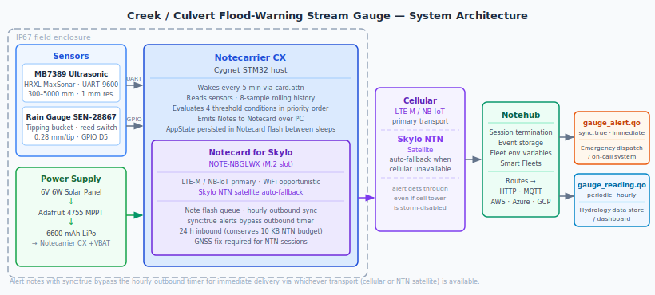

# Creek / Culvert Flood-Warning Stream Gauge

<Note>

This reference application is intended to provide inspiration and help you get started quickly. It uses specific hardware choices that may not match your own implementation. Focus on the sections most relevant to your use case. If you'd like to discuss your project and whether it's a good fit for Blues, [feel free to reach out](https://blues.com/contact-sales/).

</Note>

A solar-powered [remote monitoring](https://blues.com/solutions-remote-monitoring/) system for bridges, culverts, and low-water crossings. The onboard Cygnet STM32 host samples an ultrasonic water-level sensor and a tipping-bucket rain gauge; a [Notecard for Skylo](https://shop.blues.com/products/notecard?utm_source=dev-blues&utm_medium=web&utm_campaign=store-link) handles connectivity, storage, and sync — firing flood alerts based on rising-water *trend* — not just a single instantaneous reading — so emergency crews get a warning before the culvert is already overwhelmed.

## 1. Project Overview

**The problem.** Every municipality and county road department manages some version of the same list: low-water crossings, undersized culverts, and bridge approaches that flood before any other road in the district. The failure mode is well-understood — a creek can go from normal flow to an impassable crossing in under thirty minutes during a heavy storm — but the monitoring almost always lags behind. Threshold-detection gauges that fire only when the water hits a fixed depth miss the most important signal: how *fast* the water is rising. A culvert that ticked past the "warning" mark an hour ago and is still creeping up slowly is a very different situation from one that jumped six inches in the last fifteen minutes. The difference determines whether you close the road or wait for the next reading.

This project is a self-contained, edge-intelligent stream gauge that measures that difference. An ultrasonic distance sensor mounted above the water surface reads the air gap once every five minutes. An 8-sample rolling history converts those snapshots into a rising rate in millimeters per minute, and firmware on the onboard Cygnet STM32 evaluates both the absolute level and the rate independently. A tipping-bucket rain gauge contributes a coarse rainfall-activity hint as a fourth alert path: `rain_intense` — a coarse, opportunistic indicator based on the reed-switch closures observed during the 3-second polling window on each wake (most tips at realistic rainfall rates fall during the 297-second sleep gap; see Section 9 for the production path to calibrated rainfall accounting). The firmware evaluates four threshold conditions in priority order — `level_critical`, `level_warning`, `rate_rising`, `rain_intense` — and emits at most one alert note per wake for the highest-priority condition that trips, subject to a single global cooldown window shared across all alert types. A rain-intensity alert fires only when no higher-priority condition is tripped and the cooldown has expired.

**Why Notecard.** Stream gauges live under bridges and at rural culverts — exactly where cellular coverage is thinnest and where the places that need monitoring most are often the farthest from reliable infrastructure. The cellular story alone would be a win: a prepaid SIM, no site IT involvement, and no network credentials to negotiate. But the deeper case for this project is the satellite fallback. A flood event that overwhelms a culvert in a rural county is likely the same event that knocks out power to a local cell tower. The window when you need the data most is exactly the window when cellular is most likely to be unavailable. The Notecard for Skylo (NOTE-NBGLWX) is an all-in-one cellular + satellite + WiFi module — no separate satellite antenna unit required — that automatically falls back to the Skylo **NTN** (non-terrestrial network) when cellular drops. Alert notes marked with `sync:true` use whatever transport is available, so a critical flood warning gets through even if the regional cell tower is dark. See the [Notecard for Skylo datasheet](https://dev.blues.io/datasheets/notecard-datasheet/note-nbglwx/) for satellite coverage and data-budget details.

**Deployment scenario.** A weatherproof IP67 enclosure zip-tied or u-bolted to the underside of a bridge rail or to a T-post driven at the bank of a culvert. Five cable glands seal all external cable and antenna-lead penetrations: the MB7389 sensor cable, the rain gauge cable, the solar panel cable, the cellular/NTN antenna lead, and the GNSS antenna lead. A 6W solar panel mounted on the top rail of the bridge or on the T-post companion charges a 6600 mAh LiPo battery through an MPPT charge controller. The 6600 mAh capacity was chosen to provide meaningful dark-sky reserve through multi-day storm events; validate the actual reserve for your deployment's sync cadence by measuring whole-device current with Mojo (see Section 8).

## 2. System Architecture



**Device-side responsibilities.** The onboard Cygnet STM32 host on the Notecarrier CX wakes every five minutes via [`card.attn`](https://dev.blues.io/api-reference/notecard-api/card-requests/#card-attn), averages three MB7389 distance readings over the UART, counts rain gauge reed-switch closures during a 3-second observation window, updates an 8-entry rolling history, evaluates four threshold conditions in priority order, and emits at most one alert note per wake for the highest-priority condition that trips — all before sleeping again. All Notecard communication uses I²C, leaving the Cygnet's hardware UART free for the MB7389 sensor.

**Notecard responsibilities.** The Notecard stores [Notes](https://dev.blues.io/api-reference/glossary/#note) in onboard flash, manages the cellular or satellite session on the configured [`hub.set`](https://dev.blues.io/api-reference/notecard-api/hub-requests/#hub-set) `periodic` outbound cadence (default 60 min), and syncs any `sync:true` alert notes immediately using whatever transport — cellular or Skylo satellite — is currently available (the firmware configures `card.transport method=cell-ntn`; WiFi credentials are never provisioned). The inbound poll cadence is **decoupled from outbound** and defaults to 24 hours (`inbound_interval_min`): each inbound session is a radio transaction that consumes Skylo NTN budget when cellular is unavailable, so limiting inbound polls conserves the 10 KB satellite budget for alert delivery rather than routine env-var fetches. [Environment variables](https://dev.blues.io/guides-and-tutorials/notecard-guides/understanding-environment-variables/) pushed from Notehub reach the device on the next inbound poll; the 24-hour default is appropriate for a static field installation where threshold changes are infrequent. Reduce `inbound_interval_min` only when rapid remote reconfiguration is needed, and budget the corresponding increase in NTN radio sessions.

**Notehub responsibilities.** [Notehub](https://notehub.io) ingests events, stores every event, and applies project-level routes. The Notecard manages its own cellular and Skylo NTN satellite sessions against supported carrier networks worldwide and delivers data to Notehub over the Internet. Alert notes and summary notes land in separate [Notefiles](https://dev.blues.io/api-reference/glossary/#notefile) so they can be fanned out to different downstream destinations — alerts to an emergency-dispatch or public-works on-call system, summaries to a long-term hydrology data store.

**Routing to the cloud (high level).** Notehub supports HTTP, MQTT, AWS, Azure, GCP, Snowflake, and several other destinations; route configuration is project-specific. See the [Notehub routing documentation](https://dev.blues.io/notehub/notehub-walkthrough/#routing-data-with-notehub) — this project ships no specific downstream endpoint. [Smart Fleets](https://dev.blues.io/notehub/notehub-walkthrough/#using-smart-fleet-rules) are the natural way to group gauges by watershed or jurisdiction for threshold management.

## 2.5 Quickstart

**Minimum viable path (30 minutes):**

1. **Claim a ProductUID.** At [notehub.io](https://notehub.io), create a free project and copy its ProductUID from the project settings pane.
2. **Set ProductUID in firmware.** Open `firmware/creek_flood_gauge/creek_flood_gauge.ino`, uncomment the `PRODUCT_UID` line near line 36, and paste your actual ProductUID.
3. **Install Arduino CLI and the STM32 core** (if not already present):
   ```bash
   arduino-cli config init
   arduino-cli core install STMicroelectronics:stm32
   arduino-cli lib install "Blues Wireless Notecard"
   ```
4. **Compile and flash.** Connect the Notecarrier CX to your computer via USB; then:
   ```bash
   arduino-cli compile --fqbn STMicroelectronics:stm32:Nucleo_L152RE:usb=CDC \
     --output-dir build firmware/creek_flood_gauge
   arduino-cli upload --fqbn STMicroelectronics:stm32:Nucleo_L152RE:usb=CDC \
     --port /dev/ttyACM0 --input-dir build
   ```
   (Adjust `--port` to match your system: `/dev/ttyUSB0` on Linux, `COM3` on Windows.)
5. **Power the enclosure.** Within a few minutes, the device appears in Notehub. You now have a live gauge sampling every 5 minutes and ready to receive threshold tuning via environment variables.

**Expected outcome:** One `gauge_reading.qo` note per hour in Notehub, zero `gauge_alert.qo` notes in dry conditions. See Section 8 for how to simulate water-level and rain events to validate alert firing.

## 3. Hardware Requirements

| Part | Qty | Rationale |
|------|-----|-----------|
| [Notecarrier CX](https://shop.blues.com/products/notecarrier-cx?utm_source=dev-blues&utm_medium=web&utm_campaign=store-link) | 1 | Integrated carrier with onboard Cygnet STM32 host — handles UART, I²C, and GPIO for this sensor mix without a separate MCU. |
| [Notecard for Skylo (NOTE-NBGLWX)](https://dev.blues.io/datasheets/notecard-datasheet/note-nbglwx/) | 1 | All-in-one cellular (LTE-M/NB-IoT) + Skylo satellite + WiFi in a single M.2 module. Satellite fallback is essential here: the cellular outage most likely to silence a cellular-only gauge is triggered by the exact storm the gauge is monitoring. |
| [Blues Mojo](https://shop.blues.com/products/mojo?utm_source=dev-blues&utm_medium=web&utm_campaign=store-link) | 1 | Coulomb counter on the power rail for bench-validation of the sleep/wake/transmit power profile. Not deployed in the field enclosure. |
| [MaxBotix MB7389 HRXL-MaxSonar-WRMT](https://maxbotix.com/products/mb7389) | 1 | IP67 outdoor ultrasonic distance sensor, 300–5000 mm range, 1 mm resolution. UART (9600 baud) output eliminates ADC nonlinearity; built-in temperature compensation and signal-processing firmware handle the acoustic noise of flowing water better than bare transducers. Designed specifically for tank and open-channel level applications. |
| [SparkFun Rain Gauge (SEN-28867)](https://www.sparkfun.com/rain-gauge.html) | 1 | Self-emptying tipping bucket; 0.011″ (0.28 mm) per reed-switch closure. No active electronics — a simple pull-up on a GPIO and interrupt-free polling during the wake window is enough. |
| [Adafruit Universal Solar LiPo Charger (ID 4755)](https://www.adafruit.com/product/4755) | 1 | BQ24074-based MPPT charger accepts 5–10 V solar input and charges a 3.7 V LiPo at up to 1 A. Manages charge termination and protection; keeps the battery happy through hundreds of solar cycles in an outdoor enclosure. |
| [Adafruit 6V 6W Solar Panel (ID 1525)](https://www.adafruit.com/product/1525) | 1 | 6 V at 930 mA peak. Even a few hours of direct sun per day produces more energy than the system consumes at a 5-minute sample cadence with hourly cellular syncs; the panel provides substantial margin over average daily consumption in typical overcast conditions. |
| [Adafruit Lithium Ion Battery Pack 3.7 V 6600 mAh (ID 353)](https://www.adafruit.com/product/353) | 1 | JST-PH connector, built-in protection circuit. 6600 mAh provides substantial dark-sky reserve through multi-day storm events; validate the exact reserve for your sync cadence with Mojo before deployment. |
| IP67 polycarbonate enclosure, ~6×4×3″ | 1 | Weatherproof housing rated for continuous outdoor exposure; large enough for the Notecarrier CX, charger board, and battery. |
| Cable glands, PG7 or PG9, IP68-rated | 5 | Five sealed penetrations total: MB7389 sensor cable, rain gauge cable, solar panel cable, cellular/NTN antenna lead (from the included Skylo-certified antenna), and GNSS antenna lead. Each requires its own gland to maintain the IP67 seal. |
| Skylo-certified cellular/NTN antenna — included with NOTE-NBGLWX | 1 | Shipped in the NOTE-NBGLWX kit; connects to the `MAIN` u.FL port. **Do not substitute** — replacing the included antenna makes the device uncertified on the Skylo network and Skylo may block it. Route the lead through a cable gland and mount on the enclosure exterior. See the [NOTE-NBGLWX antenna requirements](https://dev.blues.io/datasheets/notecard-datasheet/note-nbglwx/#antenna-requirements). |
| [Blues Flexible Dual LTE/Wi-Fi and GPS/GNSS Antenna (Quectel YCA001BA)](https://shop.blues.com/products/dual-flexible-antenna-cell-wi-fi?utm_source=dev-blues&utm_medium=web&utm_campaign=store-link) | 1 | Multi-band passive flexible antenna with u.FL connector covering LTE (700–960 MHz, 1710–2690 MHz) and GNSS L1 (1560–1620 MHz, including GPS L1 at 1575 MHz). Although it is a multi-band antenna, its GNSS L1 coverage makes it suitable for the NOTE-NBGLWX `GPS` u.FL port. Required — the Notecard needs accurate location to establish Skylo satellite sessions. Route the lead through a dedicated cable gland and mount on the enclosure exterior with a clear sky view. |

The Notecard for Skylo and Notecarrier CX ship with an active SIM including 500 MB of cellular data and 10 KB of Skylo satellite data — no activation fees, no monthly commitment.

**Deployed energy budget (typical dry-weather day):** At the default 5-minute sample cadence with hourly summaries and 24-hour inbound polls, the device consumes approximately 40–50 mAh per day in cellular coverage (primarily the 250 mA hourly sync burst). During multi-day storms the 6600 mAh battery provides 5–8 days of reserve before solar recovery. Measure your exact deployment using Mojo (Section 8) to account for site-specific GNSS commission time and cellular versus satellite session overhead.

> **Hardware deviation note.** The project description suggests a Swan MCU. The Cygnet STM32 embedded in the Notecarrier CX is fully sufficient for this sensor mix: the MB7389 speaks 9600-baud UART and the rain gauge is a GPIO; no exotic peripheral or MCU-specific library requires a separate host board.

> **Why Notecard for Skylo instead of Notecard Cell+WiFi.** The project description calls for Notecard Cellular + a separate Starnote add-on. The Notecard for Skylo (NOTE-NBGLWX) consolidates both into one M.2 module at a simpler BOM: one slot, one antenna pair, one firmware API surface. The satellite case for this specific application is strong enough to justify the upgrade — see Section 1.

## 4. Wiring and Assembly


All host I/O connects to the [Notecarrier CX](https://dev.blues.io/datasheets/notecarrier-datasheet/notecarrier-cx-v1-3/) dual 16-pin header. The Notecard for Skylo seats into the carrier's M.2 slot. The Adafruit 4755 charger lives in the enclosure alongside the Notecarrier; its JST load output feeds the Notecarrier's +VBAT pad and its JST battery port connects to the 6600 mAh pack.

**Power chain:**

- Solar panel DC jack (3.5 mm × 1.1 mm) → Adafruit 4755 DC IN port
- Adafruit 4755 BATT port ↔ 6600 mAh LiPo battery (JST-PH 2-pin)
- Adafruit 4755 LOAD output (+) → Notecarrier CX **+VBAT** pad
- Adafruit 4755 LOAD GND (−) → Notecarrier CX **GND** pad *(completes the power circuit; the JST-PH BATT connector carries both + and − to the battery pack)*
- Mojo **LOAD** output (bench only): Mojo + → Notecarrier CX **+VBAT**, Mojo GND → Notecarrier CX **GND**; Mojo **BAT** input ← Adafruit 4755 LOAD output (both + and GND), inline in the power path for current measurement

**MB7389 ultrasonic sensor (UART):**

- MB7389 pin 1 (+V, 3.3 V acceptable) → Notecarrier CX **+3V3\_OUT**
- MB7389 pin 7 (GND) → **GND**
- MB7389 pin 5 (TX / serial output) → Notecarrier CX **RX** pin (Cygnet USART1 RX)
- MB7389 pin 6 (RX / not used) → leave unconnected

The MB7389's serial output is TTL/CMOS UART at 9600 baud, 8N1, no flow control — logic levels are 0 V / Vcc (3.3 V when the sensor is powered from +3V3\_OUT). This is directly compatible with the Cygnet USART1 input; no level shifter is required. The Notecarrier CX's RX/TX header pins connect to the Cygnet's USART1 peripheral (`Serial1` in Arduino). The firmware reads the `Rxxxx\r` frame format (where xxxx is distance in millimeters) on every wake cycle.

> **Power-cycle note.** On Notecarrier CX, `+3V3_OUT` is part of the host 3.3V rail gated by the carrier's `EN` pin (see [Notecarrier CX v1.3 datasheet — Header Descriptions](https://dev.blues.io/datasheets/notecarrier-datasheet/notecarrier-cx-v1-3/#header-descriptions)): the MB7389 is unpowered during `card.attn` sleep and powers back on with the Cygnet at the start of each wake. This means the sensor is power-cycled on every sample — beneficial for energy budget, but verify that the sensor is producing valid output before the first read. In practice the I²C transactions for state recovery, `hubConfigure`, and `env.get` in `setup()` and `loop()` collectively consume well over 300 ms before `readWaterLevelMm()` is called for the first time, providing ample startup margin. The firmware's three-attempt read loop further absorbs any residual latency.

**Rain gauge (GPIO):**

- Rain gauge lead 1 → Notecarrier CX **D5** (configured as `INPUT_PULLUP`)
- Rain gauge lead 2 → **GND**

The reed switch is normally open. Each bucket tip briefly closes the switch, pulling D5 LOW. The firmware polls D5 during a 3-second window on each wake and counts falling edges (HIGH→LOW transitions) with a 50 ms software debounce. The gauge's RJ11 connector terminates in bare leads; wire the center pair (pins 3 and 4) — the outer pair carries the anemometer signal in SparkFun's weather kit but is not used here.

**Antennas:**

- Cellular/primary antenna u.FL → Notecard for Skylo antenna port 1 (external, on enclosure lid)
- GPS/GNSS antenna u.FL → Notecard for Skylo GPS port (required; omitting GNSS is not supported for this satellite-dependent use case — see Section 3)

Mount antennas on the exterior of the enclosure lid pointing skyward. Under a bridge soffit, route each antenna lead through its own dedicated gland (one for the cellular/NTN lead, one for the GNSS lead) and cable-tie the antennas to the bridge rail above the waterline. The Skylo satellite link requires a clear view of the equatorial sky (southern sky from the northern hemisphere) — a bridge fascia mount, not an under-deck mount, is best for satellite reception.

## 5. Notehub Setup

1. **Create a project.** Sign up at [notehub.io](https://notehub.io) and [create a project](https://dev.blues.io/quickstart/notecard-quickstart/notecard-and-notecarrier-pi/#set-up-notehub). Copy the [ProductUID](https://dev.blues.io/notehub/notehub-walkthrough/#finding-a-productuid). Near the top of `firmware/creek_flood_gauge/creek_flood_gauge.ino` there is a commented placeholder line: uncomment it and replace the example string with your actual ProductUID before building. The `#ifndef PRODUCT_UID` build guard immediately below will produce a compile error if you forget, preventing a reused Notecard from routing data to a previous project.

2. **Claim the Notecard.** Power the enclosure; on the first cellular session the Notecard associates with your project automatically. The device appears in Notehub within a few minutes of first power-on.

3. **Create a Fleet per watershed.** [Fleets](https://dev.blues.io/guides-and-tutorials/fleet-admin-guide/) group devices for shared threshold configuration. Organizing by watershed (e.g., "Mill Creek Basin") means you can lower the `rate_warning_mm_per_min` threshold for the whole drainage simultaneously when an upstream storm is forecast. [Smart Fleets](https://dev.blues.io/notehub/notehub-walkthrough/#using-smart-fleet-rules) can further dynamically assign devices based on location or tag.

4. **Set environment variables.** In Notehub, navigate to **Fleet → Environment** (or click a device and select **Environment** in its sidebar). All variables are optional; the firmware defaults are shown. Any value set here overrides the compile-time default on the device's next inbound sync — no reflash required.

   | Variable | Default | Purpose |
   |---|---|---|
   | `sample_interval_sec` | `300` | Seconds between wake-sample-sleep cycles (5 minutes). |
   | `summary_interval_min` | `60` | Minutes between `gauge_reading.qo` summary notes. |
   | `level_warning_mm` | `400` | Sensor-to-surface distance (mm) at or below which `level_warning` fires. Lower distance = higher water. |
   | `level_critical_mm` | `200` | Sensor-to-surface distance (mm) at or below which `level_critical` fires. Set this to the minimum safe clearance for the structure. |
   | `rate_warning_mm_per_min` | `20` | Rising rate (mm/min) at or above which `rate_rising` fires. 20 mm/min = ~1.2 m/hr. |
   | `rain_intense_tips` | `2` | Reed-switch closures observed during the 3-second polling window at or above which `rain_intense` fires. Because the host MCU sleeps for the remaining ~297 s of each 5-minute cycle, only tips that happen to fall in this window are counted. `rain_intense` is a coarse, opportunistic indicator of burst rainfall — not a calibrated rate measurement. |
   | `sensor_height_mm` | `1500` | Mounting height of the MB7389 face above the dry-bed datum (mm). Used to calculate true water depth in the summary note. Measure at install time. |
   | `alert_cooldown_sec` | `900` | Minimum seconds between alerts of any kind (15 minutes). A single global cooldown clock is shared across all alert types; once any alert fires, no further alert is emitted until this window expires. Prevents alert fatigue during a sustained rising event. Accepted range: **60–86400 s** (1 min – 24 h); values outside this range are rejected and the previous effective value is kept. |
   | `inbound_interval_min` | `1440` | Minutes between inbound Notehub polls for environment-variable updates (24 hours by default). Intentionally decoupled from `summary_interval_min`: each inbound poll is a radio session that consumes Skylo NTN budget when cellular is unavailable. The 24-hour default limits NTN radio sessions to those carrying alert or summary payloads. Reduce only when rapid remote reconfiguration is required, and account for the additional NTN sessions in your satellite data budget. Accepted range: **60–10080 min** (1 h – 7 days); values outside this range are rejected and the previous effective value is kept. |

5. **Configure routes.** Add one [route](https://dev.blues.io/notehub/notehub-walkthrough/#routing-data-with-notehub) for `gauge_alert.qo` (immediate delivery to an emergency-notification endpoint or public-works on-call system), a second for `gauge_reading.qo` (batched delivery to a hydrology data store or dashboard), and a third for `gauge_fault.qo` (installer-facing commissioning diagnostics — see the `gnss_timeout` description in Section 6). Separating the three Notefiles means they can be routed at different urgencies to different destinations without filter logic in the routes themselves.

## 6. Firmware Design

Three-file Arduino project in `firmware/creek_flood_gauge/`:

| File | Responsibility |
|---|---|
| [`creek_flood_gauge.ino`](firmware/creek_flood_gauge/creek_flood_gauge.ino) | `setup()` / `loop()` orchestration, global variable definitions, compile-time defaults, and the threshold-evaluation and summary-scheduling logic in `loop()`. |
| [`creek_flood_gauge_helpers.h`](firmware/creek_flood_gauge/creek_flood_gauge_helpers.h) | Shared types (`AppState` struct), constants (pin assignments, Notefile names, timing bounds), and `extern` declarations for all globals shared between the sketch and the helper translation unit. Included by both `.ino` and `.cpp`. |
| [`creek_flood_gauge_helpers.cpp`](firmware/creek_flood_gauge/creek_flood_gauge_helpers.cpp) | All sensor drivers and Notecard helpers: `hubConfigure`, `configureSkyloTransport`, `checkLocationAcquired`, `defineTemplates`, `fetchEnvOverrides`, `readWaterLevelMm`, `countRainTips`, `updateHistory`, `calcRisingRateMmPerMin`, `sendAlert`, `sendSummary`, and `sleepUntilNextSample`. |

**Dependencies:**

- Arduino core for STM32 ([`stm32duino/Arduino_Core_STM32`](https://github.com/stm32duino/Arduino_Core_STM32)).
- [`Blues Wireless Notecard`](https://github.com/blues/note-arduino) (the `note-arduino` library). Install via the Arduino Library Manager or `arduino-cli lib install "Blues Wireless Notecard"`. Check [note-arduino releases](https://github.com/blues/note-arduino/releases) for the latest version.

### Modules

| Responsibility | Where |
|---|---|
| Notecard hub configuration (`hub.set` with decoupled outbound/inbound cadences, compact note templates, environment-variable type hints) | `hubConfigure`, `defineTemplates`, `defineEnvTemplate` |
| Skylo transport selection (`cell-ntn`) and bounded three-phase GNSS commissioning (continuous → timeout fallback → daily periodic) | `configureSkyloTransport`, `checkLocationAcquired` |
| Environment-variable fetch (per wake) | `fetchEnvOverrides` |
| MB7389 UART read | `readWaterLevelMm` |
| Rain gauge reed-switch polling | `countRainTips` |
| Rolling history and rate calculation | `updateHistory`, `calcRisingRateMmPerMin` |
| Threshold evaluation and alert emission | `loop`, `sendAlert` |
| Periodic snapshot | `sendSummary` |
| Persistent state across sleep cycles | `AppState` struct + `NotePayloadSaveAndSleep` / `NotePayloadRetrieveAfterSleep` |

### Sensor reading strategy

**MB7389.** The sensor outputs a `Rxxxx\r` frame at ~6.7 Hz over 9600-baud UART, where `xxxx` is the distance to the nearest large acoustic return in millimeters. The firmware flushes stale bytes, waits for the 'R' start-of-frame marker, accumulates ASCII digits until the carriage-return end-of-frame, and converts to a float. Three successive valid readings are averaged per wake cycle. Invalid reads (timeout, out-of-range) are excluded from averaging. If all three attempts fail, the internal value is `-1.0`; `sendSummary` maps this to `-9999.0` before placing the note so downstream analytics can unambiguously distinguish "sensor offline" from a real near-zero reading.

**Rain gauge.** During each wake, the firmware polls D5 for 3 seconds at ~2 kHz, counts falling edges (HIGH→LOW), applies a 50 ms debounce after each detected edge, and adds the count to the session total. At the SparkFun gauge's 0.28 mm/tip resolution, each detected closure represents 0.28 mm of rainfall. However, because the host MCU is fully powered off for the remaining ~297 seconds of each sample cycle, only closures that happen to fall within this 3-second window are counted. At a typical heavy-rain rate of ~1 in/hr the gauge tips roughly once every 40 seconds, so the vast majority of closures go unobserved during sleep. The `rain_intense` alert (`tips_window ≥ rain_intense_tips`) is therefore a coarse, opportunistic indicator of burst rainfall rather than a calibrated rate; treat it as a hint that intense precipitation is occurring at the site, not a measurement of how much. For production deployments where accurate rainfall accounting matters, a hardware counter that latches events while the host is unpowered is required (see Section 9).

### Event payload design

Two [compact template-backed](https://dev.blues.io/notecard/notecard-walkthrough/low-bandwidth-design/#working-with-note-templates) Notefiles. Compact format (`"format":"compact"`) strips metadata overhead from each note, shrinking the on-wire payload to the minimum needed — important for conserving the 10 KB Skylo satellite data budget that the Notecard for Skylo ships with.

`gauge_alert.qo` (immediate, `sync:true`):

```json
{
  "file": "gauge_alert.qo",
  "body": {
    "kind": "rate_rising",
    "level_mm": 612.0,
    "depth_mm": 888.0,
    "rate_mm_per_min": 24.3,
    "tips_window": 18
  },
  "sync": true
}
```

`gauge_reading.qo` (periodic snapshot, every `summary_interval_min`):

```json
{
  "file": "gauge_reading.qo",
  "body": {
    "level_mm": 680.0,
    "depth_mm": 820.0,
    "rate_mm_per_min": 8.1,
    "tips_window": 6,
    "tips_total": 214,
    "trend": "rising"
  }
}
```

The `level_mm` field is the raw sensor distance (mm from sensor face to water surface). `depth_mm` is the derived water depth above the dry-bed datum (`sensor_height_mm − level_mm`). Downstream routing and dashboards can work with either metric. The `trend` string field (one of `surging`, `rising`, `stable`, `falling`, `unknown`) gives a quick categorical label for human-readable alert messages. `unknown` is reported during the first wake cycles before two valid history samples have accumulated, and whenever the water-level sensor is offline — distinguishing "genuinely don't know yet" from a real near-zero rate.

### Low-power strategy

Between samples the Cygnet is fully powered off by the Notecard's ATTN pin via [`card.attn`](https://dev.blues.io/api-reference/notecard-api/card-requests/#card-attn) sleep mode. Persistent state — the rolling level history, cumulative tip count, and last-alert timestamp — is serialized into Notecard flash before each sleep via `NotePayloadSaveAndSleep` and restored into RAM on the next wake via `NotePayloadRetrieveAfterSleep`. The Notecard itself sits in its own [low-power idle](https://dev.blues.io/notecard/notecard-walkthrough/low-power-firmware-design/) (~8–18 µA @ 5 V) between outbound sync sessions.

Sampling and transmission are intentionally decoupled: the device samples every 5 minutes but transmits summaries only once per hour (`summary_interval_min`). Alerts bypass the transmit timer via `sync:true` on `note.add`, which wakes the radio immediately for urgent data. The inbound poll interval (`inbound_interval_min`, default 24 h) is kept intentionally long and separate from the outbound cadence, so routine env-var fetches do not open extra radio sessions over the Skylo NTN link during cellular outages.

**Transport and GNSS lifecycle.** On first boot `configureSkyloTransport()` issues two requests: `card.transport method=cell-ntn` (cellular LTE-M/NB-IoT primary, Skylo NTN satellite fallback) and `card.location.mode continuous` to begin aggressive GNSS acquisition — a stored location is a hard prerequisite for Skylo satellite sessions. `checkLocationAcquired()` is called on each wake while `g_state.locationOk` is false, using a three-phase bounded strategy:

- **Phase 1 — commissioning (continuous mode, up to 30 minutes).** The Notecard's GNSS receiver runs continuously to acquire the first fix as fast as possible. `checkLocationAcquired()` enforces the 30-minute cap via two parallel mechanisms so it always fires regardless of Notecard time-sync state: an epoch-based check (latched when the Notecard first has a valid time) and a wake-count × sample-interval check (latched on the first no-fix wake, before the Notecard has contacted Notehub). The window expires when either mechanism reaches `GNSS_COMMISSION_TIMEOUT_SEC`. Each wake, the function polls `card.location` for a non-zero `time` field.

- **Phase 1b — commissioning timeout / degraded fallback.** If no fix is confirmed within `GNSS_COMMISSION_TIMEOUT_SEC` (30 min), the firmware switches from continuous to a 5-minute periodic retry (`GNSS_RETRY_PERIOD_SEC = 300 s`) to reduce the elevated GNSS-active power draw on the solar budget. A `gnss_timeout` fault note is emitted once to `gauge_fault.qo` with `sync:true` so the issue appears in Notehub without a site visit. `gauge_fault.qo` is a dedicated commissioning-diagnostic Notefile — separate from the four threshold-alert kinds in `gauge_alert.qo` — and is not subject to the alert cooldown. Configure a dedicated Notehub route for `gauge_fault.qo` pointing to an installer notification endpoint. The device continues sampling water level and rain in this degraded state; only Skylo NTN satellite fallback is unavailable until a fix is obtained. See the pre-fix Mojo power state in Section 8.

- **Phase 2 — steady-state (daily periodic, after fix confirmed).** On the first confirmed fix `checkLocationAcquired()` issues `card.location.mode periodic/86400 s`, dialling back GPS power to a once-per-day re-check appropriate for a static installation. The fix persists in Notecard flash across power cycles, so this transition is permanent.

`card.motion.mode stop` is sent only when the sketch is compiled with the `BENCH_TEST` flag — it suppresses accelerometer noise during scope-based power validation and **must never be defined in field firmware builds**.

### Retry and error handling

- The first Notecard transaction in `hubConfigure` uses `sendRequestWithRetry(req, 10)` to paper over the cold-boot I²C race condition documented in the note-arduino library; the 10-second window is deliberately generous to tolerate worst-case cold-start enumeration delays.
- MB7389 reads that return -1.0 (timeout, sensor offline, out of range) are excluded from the averaging. If all three attempts in a wake cycle fail, both `sendSummary` and `sendAlert` normalize `level_mm`, `depth_mm`, and `rate_mm_per_min` to -9999.0 before calling `note.add`. This matters for `rain_intense` alerts, which can fire while the ultrasonic sensor is offline: without normalization the alert payload would contain -1.0, inconsistent with the -9999 sentinel used everywhere else. `sendAlert()` applies the same threshold checks as `sendSummary()` (`levelMm > 0` for level/depth, `rateMmPerMin > -9000` for rate). The sentinel convention is field-specific: `level_mm`, `depth_mm`, and `rate_mm_per_min` carry `-9999` when unavailable (signed floating-point compact fields); `tips_window` always carries the raw observed count — it uses the unsigned 2-byte compact encoding (type `22`) and cannot represent a negative sentinel, so its minimum on-wire value is `0` regardless of sensor state. For `gauge_fault.qo`, `tips_window` is explicitly set to `0` because no rain-gauge polling occurs before the fault note is emitted. Downstream consumers should apply the `-9999` sentinel check only to the three signed fields.
- `env.get` failures (NULL response) are silently skipped. The effective configuration from the previous successful `env.get` is persisted in `AppState` and pre-loaded at the start of each wake cycle before `fetchEnvOverrides` runs, so a transient Notecard communication error leaves the last successfully synced thresholds in effect. On the very first boot — before any `env.get` has succeeded — `cfgValid` is false and compile-time defaults apply for that wake cycle.
- Alert cooldown (`alert_cooldown_sec`, default 900 s) prevents a slow-moving event from emitting an alert on every sample. One alert per 15 minutes per crossing is typically enough for emergency operations.

### Key code snippet 1: compact template definition

All three Notefiles (`gauge_reading.qo`, `gauge_alert.qo`, `gauge_fault.qo`) use [compact format](https://dev.blues.io/notecard/notecard-walkthrough/low-bandwidth-design/#working-with-note-templates). The `port` field is required for compact templates; `tips_window` and `tips_total` use unsigned integer encodings (`22` = 2-byte unsigned, `24` = 4-byte unsigned) to avoid negative-sentinel ambiguity. The `kind` field in `gauge_alert.qo` and `gauge_fault.qo` is declared with `"16"` (16 characters) to accommodate the longest alert identifier (`level_critical`, 14 characters). For floating-point fields, `"14.1"` means 14 bits of range, 1 bit of fractional precision—sufficient for millimeters and mm/min rates without bloating each note's byte count.

```cpp
J *req = notecard.newRequest("note.template");
JAddStringToObject(req, "file",   "gauge_reading.qo");
JAddStringToObject(req, "format", "compact");
JAddNumberToObject(req, "port",   50);
J *body = JAddObjectToObject(req, "body");
JAddNumberToObject(body, "level_mm",        14.1);
JAddNumberToObject(body, "depth_mm",        14.1);
JAddNumberToObject(body, "rate_mm_per_min", 14.1);
JAddNumberToObject(body, "tips_window",     22);
JAddNumberToObject(body, "tips_total",      24);
JAddStringToObject(body, "trend",           "8");
notecard.sendRequest(req);
```

### Key code snippet 2: immediate-sync alert with satellite fallback

`sync:true` instructs the Notecard to attempt a sync immediately rather than waiting for the next outbound window. If cellular is unavailable, the Notecard for Skylo automatically attempts the Skylo satellite link — the alert gets through even if the regional tower is down.

```cpp
J *req = notecard.newRequest("note.add");
JAddStringToObject(req, "file", "gauge_alert.qo");
JAddBoolToObject(req, "sync", true);
J *body = JAddObjectToObject(req, "body");
JAddStringToObject(body, "kind",            "rate_rising");
JAddNumberToObject(body, "level_mm",        levelMm);
JAddNumberToObject(body, "depth_mm",        waterDepthMm);
JAddNumberToObject(body, "rate_mm_per_min", rateMmPerMin);
JAddNumberToObject(body, "tips_window",     (int)tips);
notecard.sendRequest(req);
```

### Key code snippet 3: sleep and state persistence

`NotePayloadSaveAndSleep` serializes the `AppState` struct — rolling level history, cumulative rain tips, and last-event timestamps — into Notecard flash, then issues a `card.attn` sleep that cuts power to the Cygnet. The Notecard re-powers the host after `g_sampleIntervalSec` seconds, and `setup()` calls `NotePayloadRetrieveAfterSleep` to restore state.

```cpp
NotePayloadDesc payload = {0, 0, 0};
NotePayloadAddSegment(&payload, STATE_SEG_ID, &g_state, sizeof(g_state));
NotePayloadSaveAndSleep(&payload, g_sampleIntervalSec, NULL);
```

## 7. Data Flow

![Data flow: sensors sampled every 5 min via card.attn wake → 8-sample rolling history → four threshold rules evaluated in priority order (level_critical, level_warning, rate_rising, rain_intense) → gauge_alert.qo with sync:true for immediate delivery and gauge_reading.qo on hourly outbound schedule → Notehub routes to emergency dispatch and hydrology data store. gauge_fault.qo carries one-time commissioning diagnostics (gnss_timeout) emitted from setup during GNSS Phase 1b; not subject to alert cooldown; routed separately.](diagrams/03-data-flow.svg)

**Collected.** Every `sample_interval_sec` (default 5 minutes): sensor distance to water surface (mm), derived water depth (mm), rising rate (mm/min) computed from an 8-sample rolling history spanning up to 35 minutes, rain-gauge tips in the current window, cumulative tips since boot, and a categorical trend label.

**Transmitted.**

- `gauge_reading.qo` — one record per `summary_interval_min` (default hourly), queued in the Notecard's on-device flash and shipped in the next outbound sync session. During extended cellular outages these queued notes will sync over Skylo NTN at the same outbound cadence. To limit satellite data consumption during prolonged outages, increase `summary_interval_min` to 4–8 hours via a Notehub environment variable.
- `gauge_alert.qo` — emitted at most once per wake cycle on a threshold trip, `sync:true`, subject to a single global 15-minute cooldown shared across all four threshold alert kinds. Uses whatever transport the Notecard for Skylo finds available — cellular or Skylo satellite.
- `gauge_fault.qo` — emitted **at most once**, during GNSS commissioning (setup-time), if no fix is confirmed within 30 minutes of first boot. Carries the `gnss_timeout` kind; `level_mm`, `depth_mm`, and `rate_mm_per_min` are all -9999 (no sensor data available during setup). This note is not subject to the alert cooldown; it is a one-time installer diagnostic that goes to a separate Notehub route, distinct from the emergency-dispatch route used for threshold alerts.

**Routed.** Notehub fans `gauge_alert.qo` to an emergency-notification or dispatch endpoint, `gauge_reading.qo` to a hydrology data store or time-series dashboard, and `gauge_fault.qo` to an installer notification endpoint. The three Notefiles are deliberately separate so they can be fanned out to different destinations at different urgencies without filter logic in the routes.

**Example alert in Notehub:** When a rising-water alert fires, the JSON delivered to your route looks like this:
```json
{
  "product_uid": "com.your-company.your-name:creek_gauge",
  "device_sn": "501234abc567",
  "file": "gauge_alert.qo",
  "captured": "2025-05-01T14:37:45Z",
  "body": {
    "kind": "rate_rising",
    "level_mm": 612,
    "depth_mm": 888,
    "rate_mm_per_min": 24.3,
    "tips_window": 18
  }
}
```
The `kind` field indicates which threshold was crossed (one of `level_critical`, `level_warning`, `rate_rising`, `rain_intense`). Downstream systems can route based on `kind` and apply emergency-specific actions (close road, dispatch crew, etc.).

**`gauge_alert.qo` threshold-alert kinds** (evaluated in priority order each wake, at most one per wake, subject to the shared cooldown):

| Alert `kind` | Trigger |
|---|---|
| `level_warning` | Sensor distance ≤ `level_warning_mm` (water approaching clearance limit) |
| `level_critical` | Sensor distance ≤ `level_critical_mm` (minimum safe clearance breached) |
| `rate_rising` | Rising rate ≥ `rate_warning_mm_per_min` over the rolling history window |
| `rain_intense` | Reed-switch closures observed in the 3-second polling window ≥ `rain_intense_tips`. Coarse, opportunistic indicator — only closures falling during the brief wake window are counted; most tips at realistic rainfall rates occur during the sleep gap. |

The four conditions are evaluated in priority order each wake cycle: `level_critical` → `level_warning` → `rate_rising` → `rain_intense`. At most one `gauge_alert.qo` note is emitted per wake — the highest-priority tripped condition fires, provided the single global cooldown clock has expired since any previous alert. If the cooldown has not elapsed, no alert is emitted regardless of how many conditions are simultaneously above threshold.

**`gauge_fault.qo` commissioning-diagnostic kinds** (setup-time only, not subject to alert cooldown):

| Fault `kind` | Trigger |
|---|---|
| `gnss_timeout` | No GNSS fix confirmed within 30 minutes of first boot. Emitted once from `checkLocationAcquired()` during GNSS Phase 1b. `level_mm`, `depth_mm`, and `rate_mm_per_min` carry -9999 (no sensor data available during setup-time commissioning); `tips_window` carries 0 (unsigned compact-template field; no rain-gauge polling has occurred before the fault note is emitted). The device continues sampling and alerting in degraded mode; only Skylo NTN satellite fallback is affected until a fix is obtained. |

## 8. Validation and Testing

**Expected steady-state cadence.** In dry conditions a correctly deployed gauge generates one `gauge_reading.qo` note per hour and zero `gauge_alert.qo` notes. During a rising-water event, expect `gauge_alert.qo` notes separated by at least `alert_cooldown_sec` (default 15 minutes); the cooldown is global — once any alert fires, no further alert of any kind is emitted until the window expires.

**Simulating a rising-water event.** Lower `level_warning_mm` to just above the current reading via a Notehub environment variable. The device polls for env-var updates on the inbound interval (24 hours by default); for bench testing, temporarily set `inbound_interval_min` to `60` — the firmware-enforced minimum (1 hour); values below 60 or above 10080 minutes are rejected and the current setting is kept unchanged. Confirm a `level_warning` alert arrives in Notehub within one sample interval after the env var takes effect. Then lower `rate_warning_mm_per_min` to `0.1` — any small positive rise in measured water level will trip it (stable or falling readings will not) — to confirm the rate-alert path. (Wait for the global cooldown to expire between tests, or temporarily set `alert_cooldown_sec` to `60` — the firmware-enforced minimum of 60 seconds; values below 60 or above 86400 seconds are rejected and the current setting is kept unchanged.) Restore `inbound_interval_min` to its deployed value before field installation.

**Simulating a rain-intense event.** Because the rain path is based on a 3-second polling window, the simulation approach is different from the level or rate paths. Set `rain_intense_tips` to `1` in Notehub (one closure in the window trips the alert), then wait for the next inbound sync (or temporarily set `inbound_interval_min` to `60` — the firmware-enforced minimum — to speed up the update). On the following wake, briefly short the D5 pin to GND with a jumper wire during the polling window — which opens approximately 1–2 seconds after the Cygnet wakes, after `env.get` and the three MB7389 reads complete. A 100 ms contact followed by at least a 50 ms release is sufficient for the debounce to register one closure. Confirm a `rain_intense` event arrives in Notehub, then restore `rain_intense_tips` to its deployed value and let the cooldown expire before further testing. Note that the production default of `2` requires two distinct closures within the same 3-second window.

**Simulating satellite fallback.** Setting `hub.set` mode to `"off"` disables all syncing rather than simulating a cellular-only outage, so it is not a valid method for verifying Skylo fallback. To test satellite transport, deploy the device in a confirmed location with no cellular coverage while leaving the device otherwise fully operational; the Notecard for Skylo will automatically attempt the Skylo satellite link when cellular is unavailable. Consult the [Notecard for Skylo datasheet](https://dev.blues.io/datasheets/notecard-datasheet/note-nbglwx/) and the [satellite best practices guide](https://dev.blues.io/starnote/satellite-best-practices/) for Blues-validated test and coverage details.

**Using Mojo to validate power behavior.** The [Mojo](https://dev.blues.io/datasheets/mojo-datasheet/) sits inline on the Adafruit 4755 LOAD output → Notecarrier CX +VBAT path during bench testing. The table below covers the four distinct system states; datasheet-sourced figures are labeled — confirm all of them on your bench with Mojo before estimating reserve life.

| System state | Dominant current sources | Expected draw | Basis |
|---|---|---|---|
| **GNSS commissioning — pre-fix (Phase 1, ≤ 30 min)** (Notecard GNSS receiver running continuously; Cygnet may be asleep between wakes) | Notecard GNSS-active on top of idle baseline + charger quiescent (MB7389 unpowered between wakes — `EN` pin cuts `+3V3_OUT` during ATTN sleep) | **~25–35 mA** (system baseline during Phase 1, between Cygnet wakes) | The [NOTE-NBGLWX datasheet](https://dev.blues.io/datasheets/notecard-datasheet/note-nbglwx/) states the modem draws "10's of mA when the GPS is receiving"; the NOTE-NBGLWX uses a Quectel BG95-S5 modem whose GNSS acquisition current is approximately 25–35 mA at nominal supply voltage (Quectel BG95 Hardware Design). Charger quiescent adds ~75 µA; the MB7389 is unpowered between Cygnet wakes so it does not contribute to the inter-wake baseline. Summed: **~25–35 mA**. **Confirm the commissioning plateau with Mojo before projecting reserve life.** If the elevated plateau persists beyond ~30 minutes, verify the GNSS antenna has an unobstructed equatorial sky view and check Notehub for a `gnss_timeout` note in `gauge_fault.qo`. After 30 minutes the firmware falls back to a 5-minute periodic retry cadence, which reduces (but does not eliminate) GNSS-active power between retry attempts. |
| **Host asleep between samples — steady-state** (Cygnet fully off via `card.attn`; GNSS fix already stored) | Notecard idle + charger quiescent (MB7389 unpowered: Notecarrier CX `EN` pin gates the host 3.3V rail — including `+3V3_OUT` — and cuts it when `card.attn` sleeps the Cygnet) | **< 100 µA** — measure with Mojo | On Notecarrier CX v1.3, the `EN` header pin is defined as "Input that gates the board's host 3.3V rail" ([Notecarrier CX datasheet](https://dev.blues.io/datasheets/notecarrier-datasheet/notecarrier-cx-v1-3/#header-descriptions)). Because `+3V3_OUT` is part of that gated rail, the MB7389 is unpowered during ATTN sleep. With the sensor off, the expected sleep floor is Notecard idle 8–18 µA + charger quiescent ~75 µA ≈ **< 100 µA**. **Confirm the actual sleep plateau with Mojo** — a sustained floor significantly above 100 µA during confirmed ATTN sleep (excluding sync bursts and the GNSS commissioning window) warrants investigation. |
| **Host awake, sampling** (`env.get` + 3× MB7389 reads + 3-second rain poll + I²C note) | Cygnet STM32 run mode + MB7389 powered up (both come on when `EN` releases the host 3.3V rail at wake) + Notecard idle | ~8–15 mA for ~5 s per cycle | Cygnet run-mode ~5–10 mA (STM32L datasheet) + MB7389 ~3.3 mA (MaxBotix HRXL datasheet); MB7389 powers up with the Cygnet as `+3V3_OUT` comes on. Notecard contribution to the active phase is its idle baseline (~8–18 µA) plus brief I²C transaction peaks. Wake duration depends on MB7389 response time and I²C latency. **Measure active-phase amplitude with Mojo.** |
| **LTE-M cellular sync** | Notecard radio active (hourly) | ~250 mA average, ≤2 A peak | Published Blues/Notecard figure. Sessions last tens of seconds per hourly outbound sync; this brief burst dominates the daily energy budget despite its short duty cycle. |
| **Skylo NTN satellite session** | Notecard satellite radio active | ~250 mA during active NTN TX (same modem-active envelope as LTE-M); per-sync energy ≈ **0.169 mAh** avg; 12-hour periodic-mode budget ≈ **27.2 mAh** at 60-min outbound intervals | Blues published power-usage estimates (five-run avg): single NTN note sync ≈ 0.169 mAh; 12-hour periodic mode (60-min sync intervals) ≈ 27.16 mAh — vs. 9.3–12.3 mAh for LTE-M narrowband at 30-min intervals (see the [Blues power usage estimates table](https://dev.blues.io/notecard/notecard-walkthrough/low-power-firmware-design/#power-usage-estimates)). Satellite sessions incur sky-acquisition overhead that extends the active window beyond a comparable LTE-M sync; actual session duration varies with Skylo pass timing. The 24-hour default `inbound_interval_min` ensures inbound polls do not add extra NTN sessions beyond the outbound summary and alert syncs. **Capture at least one full Skylo session with Mojo** during a confirmed satellite-fallback test before including NTN sessions in any reserve estimate. |

Key things to look for on the Mojo trace:

- **Sleep plateau:** should settle **below 1 mA** during ATTN sleep. On Notecarrier CX, the `EN` pin gates the board's host 3.3V rail (including `+3V3_OUT`), so the MB7389 is unpowered while the Cygnet sleeps; the expected floor is Notecard idle (~8–18 µA) + charger quiescent (~75 µA) ≈ < 100 µA. A sustained plateau at or above ~3 mA during confirmed ATTN sleep suggests the sensor may still be drawing power — check the `+3V3_OUT` wiring and verify that `NotePayloadSaveAndSleep` is being reached. A plateau above ~5 mA (excluding sync spikes and the GNSS commissioning window below) suggests the Cygnet is not entering sleep — check the ATTN pin wiring.
- **GNSS commissioning plateau (first ≤30 min after first boot):** before the first GNSS fix the between-wake baseline will be elevated to **~25–35 mA** — the Notecard's GNSS receiver runs continuously even while the Cygnet is sleeping. The MB7389 is unpowered between wakes (EN-gated), so only the GNSS-active Notecard (~25–35 mA) + charger quiescent contribute to the inter-wake plateau. Once `checkLocationAcquired()` confirms a fix and issues `card.location.mode periodic/86400`, the baseline drops back to the < 100 µA steady-state sleep floor. A sustained ~25–35 mA baseline persisting beyond 30 minutes means the commissioning timeout fired; check Notehub for a `gnss_timeout` fault note in `gauge_fault.qo` and verify the GNSS antenna has an unobstructed sky view.
- **Wake spike:** a brief pulse above the sleep plateau lasting ~5 seconds per sample cycle (env fetch + MB7389 reads + 3-second rain poll + I²C).
- **Hourly cellular sync:** a larger ~250 mA pulse lasting tens of seconds.
- **Satellite session (if applicable):** an active-modem pulse at the same ~250 mA amplitude as the cellular sync burst, but with satellite sky-acquisition overhead that extends the session duration beyond a comparable LTE-M sync. Blues published per-sync energy: ~0.169 mAh avg; 12-hour periodic-mode budget: ~27.2 mAh at 60-min outbound intervals — roughly 2–3× the energy of LTE-M periodic mode over the same period. The decoupled 24-hour inbound interval means you should not see inbound-only NTN pulses between the hourly outbound bursts on the Mojo trace; if you do, check that `inbound_interval_min` was applied correctly. Capture at least one full Skylo session on Mojo before finalizing any reserve estimate for a satellite-dependent deployment.

Because the MB7389 is unpowered during ATTN sleep (Notecarrier CX's `EN` pin cuts the host 3.3V rail), the sensor's ~3.3 mA draw applies only during the brief ~5-second wake window — not across the full 5-minute sample period. The dominant sleep-floor consumer is Notecard idle + charger quiescent (~100 µA). Despite the low sleep floor, the hourly cellular sync burst (~250 mA for tens of seconds) and any Skylo satellite sessions drive the daily energy budget. Measure the full-system daily energy consumption with Mojo across at least one full day (including any satellite sessions) and divide into the 6600 mAh capacity for a deployment-specific reserve estimate.

## 9. Troubleshooting

**Device does not appear in Notehub after powering on.**
- Verify ProductUID is correctly set in the sketch (line 36 of `.ino`). Recompile and reflash.
- Confirm USB/SIM connection: the Notecard should be fully seated in the M.2 slot, and the antenna u.FL connectors should be attached before boot.
- Check Notehub for the device SerialNumber in **Devices** list; if it appears, it has claimed to the project. If not, the Notecard may not have cellular coverage — try a location with clear sky view.

**No alerts firing even though water is rising.**
- Verify the current sensor reading via Notehub: click the device, go to **Environment**, and check the `Events` tab to see the latest `gauge_reading.qo` notes. `level_mm` should reflect actual distance; if it is always -9999, the sensor is offline (check UART wiring and `+3V3_OUT` power to pin 1).
- Check that thresholds are set correctly. In Notehub **Fleet → Environment**, verify `level_critical_mm` and `rate_warning_mm_per_min` have been applied (look for the checkmark or "Synced" badge on each variable).
- Confirm the alert cooldown (`alert_cooldown_sec`, default 900 s = 15 min) has expired since the previous alert. During the cooldown window, no new alert of any kind will fire, even if multiple thresholds are simultaneously above limit. Temporarily lower to 60 s for testing.
- If `rain_intense` alerts are not firing, remember that the rain-gauge window is only 3 seconds per 5-minute wake cycle; at typical rainfall rates, most bucket tips occur during the 297-second sleep and go uncounted. Set `rain_intense_tips` to 1 for testing, and apply a jumper-wire closure to D5 during the wake window (approximately 1–2 s after the device wakes).

**High battery drain (sleep floor above 1 mA per Mojo).**
- Verify `card.attn` sleep is being reached: check the firmware logs or add a debug output just before `NotePayloadSaveAndSleep`. If the sleep call is not reached, the device is cycling rapidly — check for I²C communication errors or sensor read timeouts that might be restarting the main loop.
- Confirm the MB7389 is powered off during sleep: with a multimeter, measure `+3V3_OUT` during ATTN sleep — it should be 0 V. If it stays at 3.3 V, the Notecarrier CX `EN` pin is not being driven low by the Notecard; check the I²C command sequence in `configureSkyloTransport` and ensure `card.attn` is being sent correctly.
- During the first 30 minutes of operation (GNSS commissioning Phase 1), the baseline is expected to be ~25–35 mA; this is normal. After the first fix, it should drop to < 100 µA. If it remains elevated beyond 30 minutes, a `gnss_timeout` fault note will be emitted to `gauge_fault.qo` — check Notehub for it and verify the GNSS antenna has an unobstructed equatorial sky view.

**Satellite fallback not working during cellular outage.**
- The Notecard for Skylo requires a valid GNSS location to establish a Skylo session. Verify the device has obtained a fix: check Notehub **Devices → [device] → Signals** — you should see a `location` object with non-zero latitude/longitude.
- Confirm the cellular/NTN antenna is mounted on the exterior of the enclosure with a clear view of the southern sky (equatorial sky from the northern hemisphere). A bridge soffit or under-deck mount blocks the Skylo link.
- Test in a confirmed cellular-dead zone with good sky view. The Notecard's fallback is automatic; no additional configuration is needed beyond `card.transport method=cell-ntn` (set in `configureSkyloTransport`).

---

## 10. Limitations and Next Steps

**Simplified for the POC:**

- **Rain tips are severely undercounted during deep sleep.** The Cygnet is powered off between wake cycles, so only reed-switch closures that happen to fall within the 3-second polling window on each wake are captured. The wake window is 1% of elapsed time (3 s out of 300 s). At a 1-inch/hour rain rate the gauge tips roughly once every 40 seconds; the vast majority of those tips fall during the 297-second sleep gap and go uncounted. Rain tip data from this firmware is best treated as a coarse surge indicator rather than a calibrated rainfall measurement. For production deployments where rainfall accounting matters, a hardware counter that latches tip events while the host MCU is unpowered is required — for example, an interrupt-latchable low-power pulse-counter IC, an always-on low-power companion MCU, or a similar always-counting hardware scheme that delivers an accumulated count to the Cygnet on each wake via I²C or GPIO.

- **Single-sensor installation.** The firmware reads one MB7389 and one rain gauge. Multi-sensor installations (upstream plus downstream gauges on the same culvert, for backwater detection) require multiple devices or a firmware extension.

- **Antenna topology.** The NOTE-NBGLWX has two u.FL ports: one for cellular (LTE-M/NB-IoT + Skylo NTN) and one for GNSS. The BOM includes one antenna for each port, matching this topology. Cellular link diversity (a second cellular antenna to improve reception at sites with challenging RF geometry) is not part of this BOM; consult the [Notecard for Skylo datasheet](https://dev.blues.io/datasheets/notecard-datasheet/note-nbglwx/) for the supported diversity configuration before adding a second cellular antenna.

- **Satellite data budget.** The Notecard for Skylo ships with 10 KB of Skylo satellite data. The firmware conserves this budget through two explicit design choices: (1) compact-template format for both Notefiles keeps per-note payload bytes small; (2) the inbound poll interval defaults to 24 hours (`inbound_interval_min`) so routine env-var fetches do not open extra NTN sessions during cellular outages. During a sustained cellular outage, hourly `gauge_reading.qo` summaries will still sync over NTN at the configured outbound cadence — this is the expected budget consumer. For deployments in areas expected to experience extended multi-day cellular outages, increase `summary_interval_min` to 4–8 hours to further reduce NTN usage, reserving the budget for the `sync:true` alert notes that matter most. How many satellite transmissions the 10 KB budget supports in practice depends on session overhead, control traffic, retry behavior, and how Blues accounts usage — not just payload bytes. Validate real satellite consumption using Notehub usage data during representative field tests before projecting reserve life. Most deployments will add satellite data before reaching the initial budget; see Blues for satellite data plan options.

- **`sensor_height_mm` is a static env var.** For a fixed installation this is fine. For portable gauges redeployed at different sites, an operator must update the env var after each move to keep `depth_mm` accurate. A production device would store the installation calibration in Notecard flash.

- **Notecarrier CX v1.3 board errata.** Voltage sensing via `card.voltage` is not available on this carrier revision, so battery state-of-charge cannot be logged to Notehub from the Notecard side. The Mojo is bench equipment only in this POC; a production deployment should read the LiPo voltage directly from the Cygnet ADC (A0 through a resistor divider) and include it in the summary note.

**Production next steps:**

- Add a low-power hardware tip counter (interrupt-driven, latching) to capture rain events during sleep and retrieve the accumulated count via I²C or GPIO on each wake.
- Log battery voltage from the Cygnet ADC in the summary note; add a `battery_low` alert to warn before the LiPo drops to the protection-circuit cutoff voltage.
- Implement [Notecard Outboard DFU](https://dev.blues.io/notehub/host-firmware-updates/notecard-outboard-firmware-update/) for over-the-air host firmware updates, so threshold algorithms can be refined across an entire watershed's gauges without a truck roll.
- Add upstream/downstream gauge pairing: if an upstream gauge is rising rapidly, pre-alert the downstream gauge threshold before the wave arrives. Implement this by routing upstream events to an external service that calls the [Notehub API](https://dev.blues.io/api-reference/notehub-api/api-introduction/) to write updated environment variables to the downstream device or fleet — Notehub routes fan data *out*, so the threshold update requires a separate API call back in from the external service.
- Correlate gauge data with a National Weather Service forecast API: if heavy rain is predicted, tighten the rate threshold automatically before the event, not after. Route gauge events to an external service that fetches the forecast and, when it crosses a trigger, calls the Notehub API to push updated environment variables to the fleet.
- Consider a solar panel with a wider tilt angle or a south-facing companion mount at bridge sites with limited sky view. Under a deep bridge soffit the panel may be shaded for most of the day; a 10 m cable extension to a roadside post mount may be needed.

## 11. Summary

A Notecarrier CX, a Notecard for Skylo, a MaxBotix MB7389, and a tipping-bucket rain gauge (contributing a coarse rainfall-activity hint — see Section 9 for the production path to calibrated rainfall accounting) can turn an unmonitored culvert into a continuous flood-warning sensor — sampling every 5 minutes, alerting on trend rather than a single threshold crossing, and staying online via satellite even when the storm takes out the cell tower it's been relying on. The hardware installs in an afternoon, the thresholds tune in the field without reflashing, and the satellite fallback is there exactly when it's most needed: during the flood itself. For counties managing dozens of low-water crossings across a rural road network, the same firmware image and Notehub project handle the whole fleet — each gauge configuring itself from fleet-level environment variables, routing alerts to the same on-call endpoint, and dropping summaries into the same hydrology data store.

---

*No pricing, lead times, or certification claims are made in this document. Verify product availability and regulatory requirements for your deployment region before procuring hardware.*
