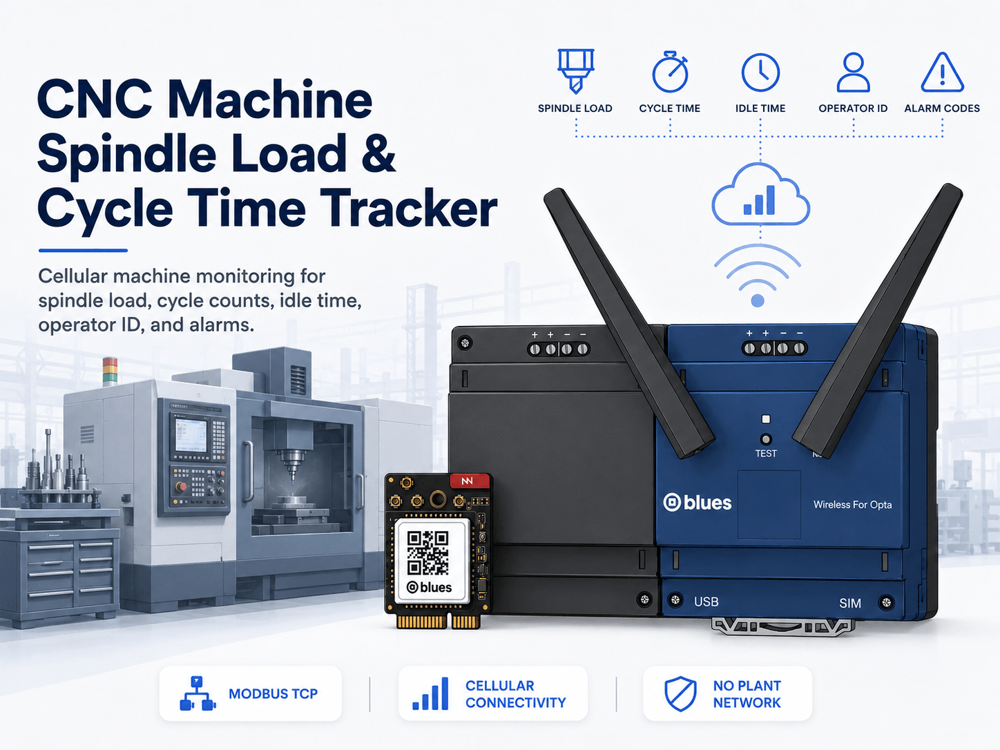
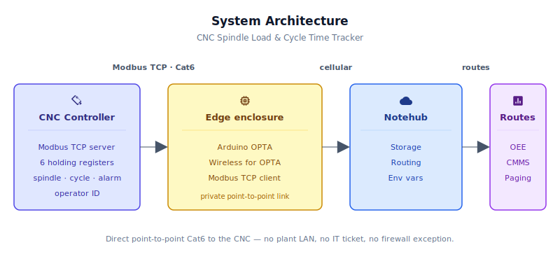
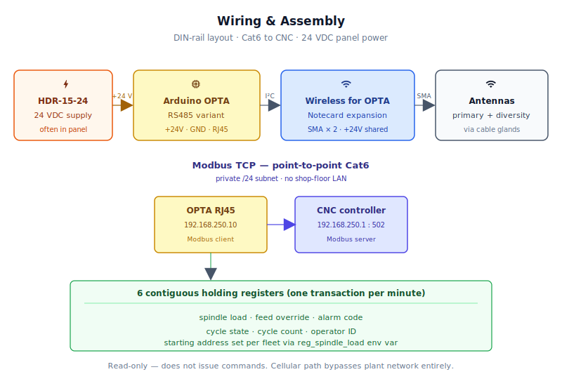
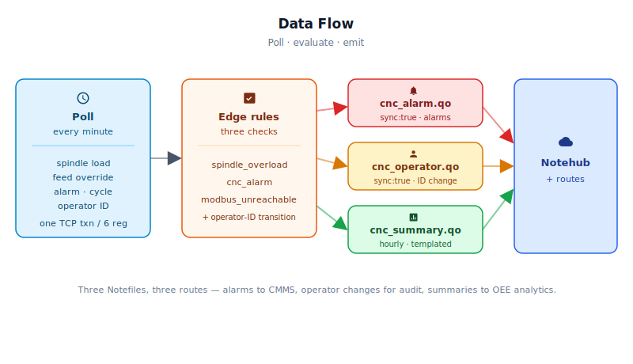

# CNC Machine Spindle Load & Cycle Time Tracker



<Note>

This reference application is intended to provide inspiration and help you get started quickly. It uses specific hardware choices that may not match your own implementation. Focus on the sections most relevant to your use case. If you'd like to discuss your project and whether it's a good fit for Blues, [feel free to reach out](https://blues.com/landing-pages/accelerators-contact-us/?accelerator=CNC%20Machine%20Spindle%20Load%20%26%20Cycle%20Time%20Tracker).

</Note>

This project is an [industrial equipment monitoring](https://blues.com/industrial-equipment-monitoring/) reference design for machine-tool OEMs who want continuous visibility into how their installed base is actually being used. The device sits on the customer's CNC machine and reports the operational signals an OEM cares about — how hard the spindle is working, how many cycles ran each hour, how often the machine sits idle, which operator is logged in, and what alarm codes the controller raises — back to the OEM's cloud over cellular, without ever touching the customer's plant network. Routine telemetry batches into hourly summaries; alarms and operator-ID changes arrive immediately. The hardware is an Arduino OPTA RS485 with a Blues Wireless for OPTA cellular expansion (see §4 for the BOM); the data source is any CNC controller that exposes telemetry over **Modbus TCP**.

## 1. Project Overview

**The problem.** A CNC (computer numerical control) machining center is a six-figure piece of capital equipment. The OEM who built it typically has zero visibility into what happens to it after delivery. Is the spindle running at 80% load twelve hours a day, or is it sitting idle because the shop scheduled it wrong? Is the same alarm code triggering every Tuesday morning — a pattern that, with data, is obviously a tooling-change reminder, but without data is an invisible warranty claim? Is a particular operator overriding the feed rate up to 140% on a finishing pass and burning through inserts?

These questions matter to OEMs because the whole industry is moving toward **EaaS** (equipment as a service) and usage-based billing. You cannot sell spindle-hours if you don't know how many spindle-hours are actually running. You cannot offer a predictive-maintenance contract if you can't see the telemetry. And you cannot benchmark your machine's **OEE** (Overall Equipment Effectiveness, a manufacturing KPI that combines availability, performance, and quality into a single utilization score) without a continuous stream of cycle-time and run/idle data flowing back from the shop floor.

The data is already there — on controls that expose it. A meaningful subset of modern CNC controls expose live spindle load, feed-rate override, alarm codes, cycle state, cumulative part counts, and current operator ID over a Modbus TCP interface on an Ethernet port on the back of the cabinet. Whether a specific controller supports this depends on the vendor, model, and which optional feature packages are installed — consult the controller's Modbus/Ethernet option documentation to confirm availability and the exact register layout before deploying. Some vendors instead use proprietary protocols or OPC-UA (Siemens SINUMERIK, Fanuc FOCAS-over-Ethernet) and require a protocol translation layer not covered here. Where Modbus TCP is available, the problem isn't where the data lives — it's getting that data off the machine and back to the OEM without involving the machine shop's network.

**Why Notecard.** Machine shops run their CNC machines on isolated **OT** (operational technology) networks — air-gapped from the corporate LAN by design, and protected by a plant IT department that is deeply skeptical of anyone proposing to plug the OEM's monitoring device into their subnet. Asking every customer to configure a VLAN, assign a static routable IP, punch a firewall rule, and maintain the configuration through staff turnover is a customer-acquisition and support nightmare. The OEM's monitoring device needs to work identically, without any site IT involvement, whether it's deployed in a shop in Ohio, Stuttgart, or Osaka.

<NewToBlues/>

Cellular is the answer. A [Blues Wireless for OPTA](https://shop.blues.com/products/wireless-for-opta?utm_source=dev-blues&utm_medium=web&utm_campaign=store-link) snapped onto the Arduino OPTA's expansion port gives the device its own independent cellular data channel — a private uplink to the [Blues Notehub](https://blues.com/notehub/) cloud service that needs no plant LAN credentials, no firewall exception, and no IT ticket. The Modbus TCP connection to the CNC runs over a direct point-to-point Ethernet cable between the OPTA and the machine control: two devices on a private subnet with no routing to the shop floor network at all. The monitoring device is invisible to plant IT because it never touches plant IT's infrastructure.

**Deployment scenario.** A single Arduino OPTA RS485 + Blues Wireless for OPTA mounts on the machine's electrical panel DIN rail. A two-meter Cat6 patch cable runs from the OPTA's RJ45 port directly to the CNC controller's Modbus TCP Ethernet port — a closed, private connection with its own subnet. The cellular antenna exits through a cable gland on the panel door. The panel's existing 24 VDC supply powers the assembly. First-light is an hour of wiring; the OEM's service technician never needs to interact with the shop's network team.

## 2. System Architecture



**Device-side responsibilities.** The OPTA's STM32H747 Cortex-M7 host is the Modbus TCP **client** in this relationship — once per minute it asks the CNC controller (the Modbus **server**) for the same block of six holding registers over the OPTA's built-in Ethernet port. Every poll feeds the rolling hourly statistics the OEM cares about — mean and peak spindle load, mean feed-rate override, run/idle minute counts, cycle completions, and average cycle time — and runs the two sample-based alert rules (`spindle_overload` and `cnc_alarm`), plus a third connection-failure alarm (`modbus_unreachable`) when the Modbus TCP link is still unreachable after a retry. Operator-ID transitions are caught on the same poll: any change in the operator-ID register fires an immediate `cnc_operator.qo` Note. Everything the host produces travels over I²C — through the expansion's AUX connector — to the Notecard inside Blues Wireless for OPTA. The host never touches the cellular modem or its session state.

**Notecard responsibilities.** From there the Notecard takes over. It queues every [Note](https://dev.blues.io/api-reference/glossary/#note) on-device, brings up a cellular session on the [`hub.set`](https://dev.blues.io/api-reference/notecard-api/hub-requests/#hub-set) `outbound` cadence (default 60 minutes), and — for anything marked `sync:true` — wakes the radio inside a minute of the alert firing. It is also the channel for configuration coming the other way: [environment variables](https://dev.blues.io/guides-and-tutorials/notecard-guides/understanding-environment-variables/) pushed from Notehub let OEM application engineers retune the Modbus register block base address, alert thresholds, and reporting cadence per-fleet without touching firmware. When `report_minutes` changes, the firmware reissues `hub.set` so the Notecard's outbound cadence stays aligned with the summary window.

**Notehub responsibilities.** The Notecard manages its own cellular session against the supported carrier networks worldwide via its embedded global SIM, then hands the data off to [Notehub](https://notehub.io), which ingests every event, stores it, and applies project-level routes. [Fleets](https://dev.blues.io/guides-and-tutorials/fleet-admin-guide/) and [Smart Fleets](https://dev.blues.io/notehub/notehub-walkthrough/#using-smart-fleet-rules) are the natural unit of organization for an OEM here — one fleet per controller family or model profile, carrying the register block base address, unit ID, port, and alert thresholds as fleet-level environment variables. Grouping by controller model rather than by customer site is the more useful axis, because register maps often differ across CNC models even within the same facility. IP addressing remains compile-time in this reference design, so machines on different network configurations still require a per-build adjustment (see [§12 Limitations](#12-limitations-and-next-steps)).

**Routing to the cloud (high level).** Notehub supports HTTP, MQTT, AWS IoT Core, Azure IoT Hub, GCP Pub/Sub, Snowflake, and several other targets; see the [Notehub routing docs](https://dev.blues.io/notehub/notehub-walkthrough/#routing-data-with-notehub). This project does not ship a specific downstream endpoint — the OEE dashboard is routed from Notehub as a project-specific integration.

## 3. Technical Summary

1. **Flash the Arduino OPTA** with `firmware/cnc_spindle_tracker/cnc_spindle_tracker.ino` (requires Arduino IDE + Mbed OS Opta Boards core).
2. **Get ProductUID** from [notehub.io](https://notehub.io), paste it into the sketch, reflash.
3. **Wire**: Cat6 from OPTA RJ45 → CNC Modbus TCP port (default `192.168.250.1:502`). Cellular antenna through panel door.
4. **Power**: 24 VDC to OPTA. Notecard auto-claims to your Notehub project on first cellular session (≈5 minutes).
5. **Validate**: Check Notehub for `cnc_summary.qo` Notes within 60 minutes. One summary per hour, one alarm per event (when triggered).

**When you're done:** You have continuous spindle load, cycle counts, alarm codes, operator IDs, and run/idle telemetry flowing to Notehub every hour, plus real-time cellular alarms on overload or fault transitions. Aggregate the summaries into an OEE dashboard; route alarms to your CMMS or on-call system via Notehub routes.

Here is a sample Note this device emits:

```json
{
  "file": "cnc_summary.qo",
  "body": {
    "spindle_pct_mean": 71.4,
    "spindle_pct_peak": 88.2,
    "feed_override_pct_mean": 97.5,
    "run_min": 51,
    "idle_min": 9,
    "cycle_count": 25,
    "avg_cycle_sec": 122,
    "operator_id": 7,
    "alarm_count": 0,
    "valid_samples": 60
  }
}
```

## 4. Hardware Requirements

| Part | Qty | Rationale |
|------|-----|-----------|
| [Arduino OPTA RS485](https://store.arduino.cc/products/opta-rs485) | 1 | Industrial DIN-rail micro-PLC; built-in Ethernet RJ45 for Modbus TCP to CNC; RS-485 available as a future bus option; Cortex-M7 host with sufficient RAM for rolling stats. |
| [Blues Wireless for OPTA (NA, SKU 992-00155-C)](https://shop.blues.com/products/wireless-for-opta?utm_source=dev-blues&utm_medium=web&utm_campaign=store-link) | 1 | Snaps onto the OPTA's right-hand expansion port; adds a [Notecard Cell+WiFi](https://dev.blues.io/datasheets/notecard-datasheet/note-wbnaw/) over I²C with a prepaid global SIM. Cellular removes all plant-network dependencies. Select the EMEA variant ([SKU 992-00156-C](https://shop.blues.com/products/wireless-for-opta?utm_source=dev-blues&utm_medium=web&utm_campaign=store-link)) for European deployments. |
| External cellular antenna(s), SMA, ~3 m lead (e.g. [SparkFun CEL-16432](https://www.sparkfun.com/lte-hinged-external-antenna-698mhz-2-7ghz-sma-male.html)) | 1 required, 2 recommended | Metal electrical panels block cellular signals. Route at least the primary antenna through a cable gland to the outside of the panel; add the diversity antenna for better LTE Cat-1 performance in low-signal environments. |
| [Blues Mojo](https://shop.blues.com/products/mojo?utm_source=dev-blues&utm_medium=web&utm_campaign=store-link) | 1 | Bench-only coulomb counter. Inline on the Wireless for OPTA power input during commissioning to validate the Notecard subsystem's per-session energy. Not deployed to the field. |
| 24 VDC DIN-rail supply, ≥10 W (e.g. [MeanWell HDR-15-24](https://www.meanwell.com/Upload/PDF/HDR-15/HDR-15-SPEC.PDF)) | 1 | Powers the OPTA and Wireless for OPTA expansion. Most machine panels already have a 24 VDC rail — source locally only if needed. |
| Cat6 patch cable, ~2 m | 1 | Point-to-point Modbus TCP link from the OPTA's Ethernet port to the CNC controller's Modbus TCP port. Straight-through; no crossover needed on modern NICs. |
| DIN rail, ~15 cm | 1 | Mount for the OPTA + expansion. Likely already present inside the panel. |

The Blues hardware ships with an active SIM including 500 MB of data and 10 years of service — no activation fees, no monthly commitment.

## 5. Wiring and Assembly



<Warning>

**Safety.** Machine electrical panels contain hazardous voltages on the main power bus, even when control wiring is low-voltage. Installation must be performed by qualified personnel following site lockout/tagout procedures and applicable electrical codes. This reference design is **read-only** over Modbus — it does not issue any commands to the CNC controller.

</Warning>

1. **Mount and power.** Snap the Wireless for OPTA onto the OPTA's right-hand expansion port. The AUX connector between the two carries the I²C bus that the Notecard rides on — use the solderless AUX connector included with Wireless for OPTA. Mount the assembly on the DIN rail. Wire 24 VDC from the panel supply to the OPTA's `+` and `-` terminals. Per the [Wireless for OPTA quickstart](https://dev.blues.io/quickstart/wireless-for-opta-quickstart/), 24 VDC is required for field deployment — USB-C powers the host CPU for programming but does not power the OPTA's output stage or the expansion. Jumper the OPTA's `+24V` terminal to the expansion's corresponding power input so both share the same supply rail.

2. **Antennas.** Drill or gland two SMA bulkhead connectors through the panel door or a side knockout. Route the primary cellular antenna lead to the first SMA port on Wireless for OPTA and the diversity lead to the second. The bundled rubber-duck antennas are suitable for bench testing only — do not rely on them inside a metal panel in the field.

3. **Modbus TCP link.** Run a Cat6 patch cable from the OPTA's RJ45 Ethernet port to the CNC controller's **dedicated Modbus TCP port** (consult the controller's Modbus/Ethernet option documentation for the correct physical connector and TCP port number). This creates a private point-to-point link: two devices on an isolated `/24` subnet with no routing to the shop floor network. Configure the OPTA with a static IP on the same subnet as the CNC's Modbus TCP interface. Defaults in the firmware: OPTA `192.168.250.10`, CNC `192.168.250.1`. IP addressing is **compile-time only** in the current firmware — adjust `LOCAL_IP` in `cnc_spindle_tracker.ino` (line 40) and `_DEFAULT_CNC_IP` in `cnc_spindle_tracker_helpers.cpp` (line ~30) to match the actual CNC network configuration before building. There is no runtime IP configuration mechanism in this reference design (see [Limitations](#12-limitations-and-next-steps) for the production path).

   > **Deployment variant — shared CNC main port.** Some controllers expose Modbus TCP only on the same port used for the machine tool LAN. Connecting the OPTA in that scenario requires joining the customer's machine network (even if only to reach the CNC) and **does not preserve the private-subnet / no-plant-network-touch property** described in §1. That configuration requires customer network and OT-security approval before deployment and is outside the primary scope of this design.

4. **Bench validation setup.** During first-light commissioning, splice the Mojo inline between the 24 VDC supply and the Wireless for OPTA power terminal. This measures the entire expansion subsystem — Notecard plus the expansion's onboard regulators — during a real cellular session.

## 6. Notehub Setup

1. **Create a project.** Sign up at [notehub.io](https://notehub.io) and create a new project. Copy the [ProductUID](https://dev.blues.io/notehub/notehub-walkthrough/#finding-a-productuid) and paste it into `firmware/cnc_spindle_tracker/cnc_spindle_tracker.ino` (line 18, uncomment the `#define PRODUCT_UID` and insert your UID).

2. **Claim the device.** Flash the OPTA and power the panel. On first cellular session the Notecard associates with your project automatically. Check Notehub **Fleet > Devices** within 5–10 minutes to confirm the device appears.

3. **Create a fleet per controller family or model profile.** [Fleets](https://dev.blues.io/guides-and-tutorials/fleet-admin-guide/) let you push a common configuration to every machine that shares a controller type. Fleet-level [environment variables](https://dev.blues.io/guides-and-tutorials/notecard-guides/understanding-environment-variables/) — set in the Notehub UI under **Fleet > Environment** — encode the shared parameters: Modbus register block base address, unit ID, port, and alert thresholds. All machines with the same controller model and register map share one configuration without a separate firmware build. Note that IP addressing (`LOCAL_IP` and `DEFAULT_CNC_IP`) remains compile-time in this reference design, so machines whose CNC controllers sit on different network configurations still require a per-build adjustment (see [Limitations](#12-limitations-and-next-steps)). Because register maps frequently differ across CNC models even within the same customer site, organizing fleets by controller family or model profile — rather than solely by site — gives the most precise control over shared settings. [Smart Fleets](https://dev.blues.io/notehub/notehub-walkthrough/#using-smart-fleet-rules) can automate fleet assignment based on a device tag set during commissioning.

4. **Set environment variables.** In the Notehub web UI, navigate to **Fleet > Environment** to view all available variables. All variables are optional; firmware defaults are shown. When you save a change in Notehub the updated value is downloaded to the Notecard on the next inbound sync; the host applies it on the next scheduled `env.get` call — either at boot or at the end of the current report window.

   | Variable | Default | Purpose |
   |---|---|---|
   | `sample_minutes` | `1` | Minutes between Modbus TCP polls. |
   | `report_minutes` | `60` | Minutes between summary Notes (`cnc_summary.qo`). Also realigns the Notecard outbound sync cadence — both the local summary window and the cellular session schedule update together. |
   | `modbus_port` | `502` | Modbus TCP port on the CNC controller. |
   | `modbus_unit_id` | `1` | Modbus unit (slave) ID. Many CNC controllers default to 1; verify in the CNC controller's Modbus/TCP settings. |
   | `reg_spindle_load` | `256` | Starting address (0-based, wire-level) of the **contiguous six-register block** the firmware reads in a single transaction. The six registers are always read consecutively from this address: spindle load, feed-rate override, alarm code, cycle state, cycle count, operator ID. Set this to the base address where your CNC controller's block begins. |
   | `spindle_overload_pct` | `90.0` | Spindle load (%) above which a `spindle_overload` alarm fires while the machine is in-cycle. |
   | `expected_cycle_sec` | `120` | Reserved for future use. Stored in device config but not transmitted in any Note or evaluated in firmware. |

   > **Cadence constraint.** `sample_minutes` must not exceed `report_minutes`. For accurate run/idle minute totals, `report_minutes` should be a whole-number multiple of `sample_minutes` (e.g., `sample_minutes=5, report_minutes=60`). If divisibility is violated (e.g., `sample_minutes=7, report_minutes=60`), run+idle totals in the summary will be less than the window duration. The firmware enforces the first constraint by clamping `sample_minutes` down to `report_minutes` if the env var would otherwise violate it; non-divisible pairs are accepted with a Serial warning. See [§12 Limitations](#12-limitations-and-next-steps).

   > **CNC register-map gotchas.** The defaults above are illustrative. Real CNC controllers vary widely on: addressing convention (0-based wire-level vs. 1-based / Fanuc "PLC address" notation); per-register scaling (spindle load may be 0.1 %, 1 %, or % of rated torque); signedness; and whether the cycle count is a 16-bit or 32-bit (two-register) value. Critically, the current firmware only supports a **contiguous six-register layout** — the six values must appear consecutively in the controller's Modbus map starting at `reg_spindle_load`. Production deployments need a vendor-specific register map with a matching contiguous block (or individual per-register reads added to the firmware). See [Limitations](#12-limitations-and-next-steps).

5. **Configure routes.** Add [routes](https://dev.blues.io/notehub/notehub-walkthrough/#routing-data-with-notehub) to push data to your downstream systems:
   - **`cnc_alarm.qo`** → real-time delivery to your CMMS, on-call paging system, or Slack webhook.
   - **`cnc_summary.qo`** → batched hourly delivery to your OEE analytics or data warehouse.
   - **`cnc_operator.qo`** → real-time delivery to operator-session or access-logging system (best-effort; individual transitions may be lost to comms outages, and transitions that occur and revert between consecutive polls are never recorded).
   
   Keeping the three Notefiles separate means each can route to a different destination at a different priority without downstream filter logic.

## 7. Firmware Design

The firmware lives in the `firmware/` directory and is split into three files — orchestration, shared types, and the Notecard- and Modbus-facing helpers — so each concern has a clear home:

| File | Role |
|---|---|
| [`cnc_spindle_tracker.ino`](firmware/cnc_spindle_tracker/cnc_spindle_tracker.ino) | Main sketch: `setup()`, `loop()`, sample accumulation, alert evaluation, and all global state definitions. |
| [`cnc_spindle_tracker_helpers.h`](firmware/cnc_spindle_tracker/cnc_spindle_tracker_helpers.h) | Shared types (`Config`, `Sample`, `WindowStats`), compile-time defaults, `extern` declarations for globals, and helper-function prototypes. |
| [`cnc_spindle_tracker_helpers.cpp`](firmware/cnc_spindle_tracker/cnc_spindle_tracker_helpers.cpp) | Notecard and Modbus helper implementations: `notecardConfigure()`, `defineTemplates()`, `fetchEnvOverrides()`, `modbusConnect()`, `pollCnc()`, `sendSummary()`, `sendAlarm()`, `sendOperatorChange()`, `resetWindow()`. |

### Modules

| Responsibility | Function(s) |
|---|---|
| Notecard init, `hub.set` | `notecardConfigure()` |
| Note template registration | `defineTemplates()` |
| Environment variable fetch (incremental, time-gated) | `fetchEnvOverrides()` |
| Ethernet/Modbus TCP connection management | `modbusConnect()` |
| Modbus register poll (6 registers, 1 transaction) | `pollCnc()` |
| Rolling hourly stats accumulation | `accumulateSample()` |
| Alert rule evaluation | `evaluateAlerts()` |
| Hourly summary Note emission | `sendSummary()` |
| Immediate alarm Note emission | `sendAlarm()` |
| Immediate operator-change Note emission | `sendOperatorChange()` |
| Periodic scheduling (millis-based; no MCU sleep) | `loop()` |

### Sensor reading strategy

Six holding registers are read in a single Modbus TCP transaction (`requestFrom` with quantity 6 starting at `reg_spindle_load`). Batching all six into one round trip is significantly more efficient than six individual reads — one TCP round trip versus six, and keeps the polling window short relative to the one-minute sample interval. The firmware **requires** the six registers to be **contiguous** in the CNC controller's holding-register map; non-contiguous layouts are not supported in this reference design (see [Limitations](#12-limitations-and-next-steps)).

Samples taken while the machine is **idle** (cycle state ≠ 1) are excluded from spindle load and feed-rate averages, because a 0 % spindle reading while the operator is setting up a part isn't useful in the same bucket as a loaded cut. Run and idle minutes are tracked separately so the OEE dashboard can compute an Availability component directly from the summary Note.

### Event payload design

Three [template-backed](https://dev.blues.io/notecard/notecard-walkthrough/low-bandwidth-design#working-with-note-templates) Notefiles. Templates store Notes as fixed-length binary records on the Notecard rather than free-form JSON, cutting wire size by 3–5× — meaningful for a device that may run for a decade against its included 500 MB.

`cnc_summary.qo` (queued hourly, templated):

```json
{
  "file": "cnc_summary.qo",
  "body": {
    "spindle_pct_mean": 71.4,
    "spindle_pct_peak": 88.2,
    "feed_override_pct_mean": 97.5,
    "run_min": 51,
    "idle_min": 9,
    "cycle_count": 25,
    "avg_cycle_sec": 122,
    "operator_id": 7,
    "alarm_count": 0,
    "valid_samples": 60
  }
}
```

`cycle_count` is the **per-window delta** of the controller's own cumulative cycle-count holding register — the unsigned difference between the register values observed at the start and end of the reporting window. Because it derives from the controller's own accumulator, it captures short cycles that complete entirely within a single poll interval, which edge detection alone cannot see. Counter wrap (65535 → 0) is handled with unsigned 16-bit arithmetic; a controller reset that drops the counter by more than 32767 cannot be distinguished from a natural wrap and would inflate one window's delta.

`avg_cycle_sec` is an edge-timing heuristic derived from `cycleState` register transitions (1 → non-1) and the host MCU's `millis()` clock. It is **not** a controller-native cycle timer. See [§12 Limitations](#12-limitations-and-next-steps) for its known gaps, particularly on fast-cycle jobs.

`valid_samples` is the count of successful Modbus reads in the window. A value of `0` means every poll failed this window; downstream analytics use this sentinel to distinguish a total communication outage from a machine that was genuinely powered and idle.

`cnc_alarm.qo` (immediate, `sync:true`, templated):

```json
{
  "file": "cnc_alarm.qo",
  "sync": true,
  "body": {
    "alert_type": "spindle_overload",
    "alarm_code": 0,
    "spindle_pct": 93.1,
    "operator_id": 7
  }
}
```

`alert_type` is one of: `spindle_overload` (spindle load exceeded threshold during a cut), `cnc_alarm` (CNC control raised a fault code), or `modbus_unreachable` (Modbus TCP connection lost, rate-limited to once per summary window).

`cnc_operator.qo` (immediate, `sync:true`, templated):

```json
{
  "file": "cnc_operator.qo",
  "sync": true,
  "body": {
    "operator_id": 9,
    "prev_operator_id": 7
  }
}
```

Fires whenever the value in the controller's operator-ID holding register changes between consecutive samples. `operator_id` is the new (incoming) value; `prev_operator_id` is the outgoing value. `operator_id == 0` conventionally indicates no operator is logged in. Events are **best-effort** and sampled at the poll interval: a transient comms outage can drop an individual transition Note, and any operator-ID change that occurs and reverts between two consecutive polls is invisible to the firmware. The hourly `cnc_summary.qo` captures the most recently observed operator ID at window close — a state snapshot, not a complete record of all transitions that occurred during the window.

### Power and sync strategy

The OPTA + Wireless for OPTA is 24 VDC line-powered, so host MCU sleep is not the design goal — bandwidth and bus efficiency are. The Notecard runs in [`hub.set`](https://dev.blues.io/api-reference/notecard-api/hub-requests/#hub-set) `periodic` mode with `outbound` and `inbound` cadences initialized at startup to `DEFAULT_REPORT_MINUTES` (60 minutes) and `DEFAULT_REPORT_MINUTES × 2` (120 minutes) respectively. When `report_minutes` changes via an env-var update, the firmware reissues `hub.set` with the new `outbound` and `inbound` values so the Notecard's cellular session schedule stays aligned with the summary window. Summary Notes queue on-device and ship in a single session per window; alarm Notes carry `sync:true` and wake the radio within a session-establishment window (typically 15–60 seconds). The firmware does not artificially spin the Modbus bus faster than the sample interval — one poll per `sample_minutes`, then the host simply yields in `loop()` until the next scheduled tick.

### Retry and error handling

- `notecardConfigure()` uses `notecard.sendRequestWithRetry(req, 5)` inside a blocking loop that repeats every 30 seconds until `hub.set` succeeds. Notecard configuration is treated as mandatory: without a valid `hub.set` the ProductUID is not registered on the Notecard, the outbound/inbound cadence is wrong, and subsequent Notes would be un-routable. The device does not enter the main loop until configuration is confirmed.
- Modbus TCP connection loss is detected on the `requestFrom()` return code. The firmware retries once per sample (reconnect + re-poll). If both fail, the sample is skipped and a `modbus_unreachable` alarm fires, rate-limited to once per summary window to avoid alarm fatigue when the CNC is simply powered off.
- `notecard.requestAndResponse()` responses are checked for both `NULL` return and the `err` field before any field is read from the response.
- Environment variable fetches use the `time` argument to request only variables modified since the last successful fetch — no unnecessary data is transferred on inbound syncs.
- Alert de-duplication: `spindle_overload` carries a 30-minute cooldown timer so a slow-climbing load doesn't page the on-call every sample. CNC alarm codes fire on any transition to a nonzero value (0 → nonzero, or one nonzero code changing to a different nonzero code), not on every sample where a fault is asserted. Alarm-state tracking (`g_lastAlarmCode`, `g_window.alarmCount`) is updated immediately when the transition is **observed**, independent of whether the `cnc_alarm` Note queues successfully. If the Note fails, the alarm is pushed into an in-memory ring buffer (`g_alarmFifo`, depth 8) and retried one slot per poll cycle — ensuring a comm outage cannot cause the summary to undercount alarm transitions or silently lose a short-lived alarm. On ring-buffer overflow the oldest slot is evicted and a warning is logged to Serial.

### Key code snippet 1 — Notecard periodic sync configuration

```cpp
// Block until hub.set succeeds — Notecard configuration is mandatory.
// Without a valid hub.set the ProductUID is not registered and Notes are
// un-routable; there is no useful operating state without it.
while (true) {
    J *req = notecard.newRequest("hub.set");
    if (req == NULL) { delay(5000); continue; }
    JAddStringToObject(req, "product", productUid);
    JAddStringToObject(req, "mode", "periodic");
    JAddNumberToObject(req, "outbound", DEFAULT_REPORT_MINUTES);  // hourly sync
    JAddNumberToObject(req, "inbound",  DEFAULT_REPORT_MINUTES * 2);
    // sendRequestWithRetry handles the cold-boot I²C race where the host
    // MCU comes up before the Notecard is ready.
    if (notecard.sendRequestWithRetry(req, 5)) break;
    usbSerial.println("[NOTECARD] hub.set failed — retrying in 30 s.");
    delay(30000);
}
```

### Key code snippet 2 — Modbus TCP batch read (6 registers, 1 transaction)

```cpp
// Read all 6 contiguous holding registers in a single Modbus TCP round-trip.
// Reading in bulk is ~6× faster than individual requests and keeps the
// 60-second sample window short enough to be unnoticeable by the operator.
if (!modbusTCPClient.requestFrom(cfg.modbusUnitId, HOLDING_REGISTERS, regBase, 6)) {
    return false; // caller handles retry
}
int16_t rawSpindle      = (int16_t)modbusTCPClient.read(); // 0.1 % units
// Register N+1 is feed-rate override (0–150 % of programmed rate), not
// actual feed rate in mm/min — see §11 Limitations.
int16_t rawFeedOverride = (int16_t)modbusTCPClient.read();
s.alarmCode    = (uint16_t)modbusTCPClient.read();
s.cycleState   = (uint8_t)(modbusTCPClient.read() & 0xFF);
s.cycleCount   = (uint16_t)modbusTCPClient.read();
s.operatorId   = (uint16_t)modbusTCPClient.read();
s.spindleLoadPct  = rawSpindle      / 10.0f;
s.feedOverridePct = rawFeedOverride / 10.0f;  // e.g. 1000 → 100.0 % of programmed rate
```

### Key code snippet 3 — Immediate alarm Note with sync:true

```cpp
// sync:true bypasses the hourly outbound window — the Notecard wakes the
// radio and delivers the alarm within the session-establishment window.
J *req = notecard.newRequest("note.add");
JAddStringToObject(req, "file", "cnc_alarm.qo");
JAddBoolToObject(req, "sync", true);
J *body = JAddObjectToObject(req, "body");
JAddStringToObject(body, "alert_type",  alertType);
JAddNumberToObject(body, "alarm_code",  (int)s.alarmCode);
JAddNumberToObject(body, "spindle_pct", s.spindleLoadPct);
JAddNumberToObject(body, "operator_id", (int)s.operatorId);
notecard.sendRequest(req);
```

## 8. Build and Flash

**Prerequisites:**
- Arduino IDE 2.3+ or `arduino-cli` (command-line). If using the IDE, install the **Arduino Mbed OS Opta Boards** board package via Tools > Board Manager — search for "Opta".
- **Dependencies** (install via Library Manager or `arduino-cli`):
  - [`Blues Wireless Notecard`](https://github.com/blues/note-arduino) (check [releases](https://github.com/blues/note-arduino/releases))
  - [`ArduinoModbus`](https://github.com/arduino-libraries/ArduinoModbus)
  - [`ArduinoRS485`](https://github.com/arduino-libraries/ArduinoRS485)
  - `Ethernet.h` (included with Mbed OS Opta Boards core)

**Build steps (using `arduino-cli`):**

```bash
# Install the board core
arduino-cli core install arduino:mbed_opta

# Install dependencies
arduino-cli lib install "Blues Wireless Notecard" "ArduinoModbus" "ArduinoRS485"

# Edit firmware/cnc_spindle_tracker/cnc_spindle_tracker.ino — uncomment line 18 and paste your ProductUID
# Edit firmware/cnc_spindle_tracker/cnc_spindle_tracker.ino line 40 — set LOCAL_IP to match your Modbus subnet
# Edit firmware/cnc_spindle_tracker/cnc_spindle_tracker_helpers.cpp line ~30 — set _DEFAULT_CNC_IP to your CNC controller IP

# Compile
arduino-cli compile -b arduino:mbed_opta:opta firmware/

# Flash (replace /dev/cu.usbmodem1234567 with your OPTA's USB port)
arduino-cli upload -b arduino:mbed_opta:opta -p /dev/cu.usbmodem1234567 firmware/

# Open the serial monitor to check for errors
arduino-cli monitor -p /dev/cu.usbmodem1234567 -c baudrate=115200
```

**Alternatively, using the Arduino IDE:** Open `firmware/cnc_spindle_tracker/cnc_spindle_tracker.ino`, configure your ProductUID and IPs, select Tools > Board > Arduino OPTA, and click Upload.

## 9. Data Flow



**Collected.** Every `sample_minutes` (default 1 minutes): spindle load (%), feed-rate override (%), active alarm code, cycle state, cumulative cycle count, and current operator ID (the value presently in the controller's operator-ID register) — six registers in one Modbus TCP transaction.

**Accumulated.** Each sample updates rolling counters: spindle load sum and peak (while running), feed-rate sum (while running), run/idle minute tallies, the per-window cycle-count register delta (difference between consecutive cycleCount register reads, primary source for `cycle_count`), edge-timed cycle durations (for `avg_cycle_sec` only), observed active-alarm-transition count (alarms that assert and clear between polls are never seen), and operator-ID change detection. Cycles that complete entirely within one poll interval are invisible to the edge detector but are still captured in the register delta. See [Limitations](#12-limitations-and-next-steps) for the practical implications of the `avg_cycle_sec` heuristic.

**Transmitted.**
- `cnc_summary.qo` — once per `report_minutes` (default: 24 Notes per day per machine), queued locally and shipped in the Notecard's hourly outbound sync. Fields: spindle mean/peak, feed-rate override mean (`feed_override_pct_mean`, override percentage of the programmed rate, not engineering-unit feed rate; see §11), run minutes, idle minutes, `cycle_count` (per-window delta of the controller's cumulative cycle-count register), `avg_cycle_sec` (edge-timing heuristic. See Limitations), most-recently-observed operator ID, `alarm_count` (count of *observed* active-alarm transitions during the window, not a complete fault history; see [§12 Limitations](#12-limitations-and-next-steps)), `valid_samples` (0 signals a total Modbus communication outage for the window).
- `cnc_alarm.qo` — immediately on alert trigger, `sync:true`. Three alert types: `spindle_overload`, `cnc_alarm`, `modbus_unreachable`.
- `cnc_operator.qo` — immediately on operator-ID register transition, `sync:true`. Fields: `operator_id` (incoming value), `prev_operator_id` (outgoing value). Best-effort and sampled: individual events may be lost to comms outages, and any transition that occurs and reverts between consecutive polls is never recorded. The hourly summary captures the last observed ID at window close, not a complete transition history.

**Routed.** Notehub routes `cnc_alarm.qo` in real time to the OEM's CMMS or on-call system; `cnc_summary.qo` goes to the OEE analytics store at hourly cadence; `cnc_operator.qo` routes in real time to an access-logging or per-operator OEE attribution system.

**Alert triggers.**
- `spindle_overload` — spindle load exceeds `spindle_overload_pct` while the machine is in-cycle (state = 1). 30-minute cooldown prevents repeat paging on a sustained overload condition.
- `cnc_alarm` — active alarm code transitions to any nonzero value (0 → nonzero, or one nonzero code changing to a different nonzero code) as **observed** on the poll; fires immediately on the observed transition. Alarms that assert and clear between consecutive polls are never seen and produce no Note.
- `modbus_unreachable` — Modbus TCP connection fails on two consecutive attempts; rate-limited to once per `report_minutes` window.

## 10. Validation and Testing

**Expected steady-state behavior.** A healthy machine generates one `cnc_summary.qo` per hour and zero `cnc_alarm.qo` Notes. On first commissioning, you may see one `modbus_unreachable` alarm until the Modbus TCP link is confirmed.

**Check Notehub for events.** Sign in to [notehub.io](https://notehub.io), navigate to **Fleet > Events**, and filter for your device. Within 1 hour of power-up, you should see a `cnc_summary.qo` Note with fields like `spindle_pct_mean`, `run_min`, `cycle_count`, etc. Check the **body** tab to inspect the actual JSON.

**Modbus first-light (bench test).** Before connecting to the real CNC:
1. Run a Modbus TCP simulator (Modbus Mechanic, ModRSsim2, ModbusMaster, or any open-source server) on your laptop.
2. Connect it to the OPTA Ethernet port (same subnet as OPTA IP, e.g., both on `192.168.250.0/24`).
3. Create six contiguous holding registers at address 256 with demo values: spindle load 650 (6.5%), cycle state 1 (running), alarm code 0, cycle count 10, operator ID 1.
4. Flash the firmware pointing to your demo server (set `_DEFAULT_CNC_IP` to the simulator's address).
5. Wait one sample period (1 minutes default) plus one report window (60 minutes default) for the first summary to appear in Notehub. Validate that `spindle_pct_mean ≈ 6.5`, `cycle_count = 0` (register delta), `valid_samples = 60`.
6. Increase the spindle-load register to 950 (95%) and wait 1 minute. Within 60 seconds of that poll, a `cnc_alarm.qo` with `alert_type: "spindle_overload"` should arrive in Notehub.

**Field alert testing.** To test alert delivery on a live machine:
1. In Notehub, navigate to **Fleet > Environment**.
2. Temporarily set `spindle_overload_pct = 0`.
3. Wait for the next Notecard inbound sync (default every 120 minutes), then the host will apply the new threshold on the next report window boundary.
4. Any nonzero spindle reading in the next poll will trigger a `cnc_alarm.qo`.
5. Reset `spindle_overload_pct` to its normal value (e.g., 90) once tested.

**Power validation (optional Mojo).** Splice the [Mojo coulomb counter](https://dev.blues.io/datasheets/mojo-datasheet/) between the 24 VDC supply and the Wireless for OPTA power input. Expected current envelope (from [Notecard low-power design](https://dev.blues.io/notecard/notecard-walkthrough/low-power-firmware-design/)):

| Phase | Expected current |
|---|---|
| Notecard idle (radio off, between syncs) | ~8–18 µA @ 5 V |
| Cellular session (LTE Cat-1) | ~250 mA average; ≤2 A burst |
| WiFi fallback session | ~80 mA average |

Confirm: (a) idle current between syncs is in the µA range (ensures the device will run for years on field deployment), (b) per-session energy for one hourly sync is ~10–30 mAh, and (c) energy is consistent across consecutive cycles.

<Tip>

**Bench caveat:** When the OPTA is powered and programmed over USB-C, the USB rail keeps the Notecard in a higher-power idle state — do not expect µA idle current while USB is connected. For true field idle measurements, power from 24 VDC only (disconnect USB) and verify the conditions in [Notecard low-power design docs](https://dev.blues.io/notecard/notecard-walkthrough/low-power-firmware-design/).

</Tip>

## 11. Troubleshooting

| Symptom | Probable Cause | Solution |
|---------|----------------|----------|
| Device does not claim to Notehub after first power-up | Missing or malformed `PRODUCT_UID` in firmware | Uncomment and set `PRODUCT_UID` in `cnc_spindle_tracker.ino` line 18; reflash. |
| No Modbus connection; continuous `modbus_unreachable` alarms | Wrong CNC IP or port; Ethernet cable unplugged; CNC controller powered off or Modbus not enabled | Confirm CNC controller's Modbus TCP IP and port in its documentation. Verify the IP in `_DEFAULT_CNC_IP` (helpers.cpp) matches the CNC. Check Cat6 cable is plugged in at both ends. Confirm `modbus_port` env var matches the CNC's TCP port (default 502). |
| No `cnc_summary.qo` Notes appear in Notehub | Device claimed, but no summaries visible | Check the Notecard's outbound sync interval has elapsed (default 60 minutes). Verify `valid_samples > 0` in any alarm Notes — if `valid_samples = 0`, all Modbus polls in that window failed; check network. Use `arduino-cli monitor` to watch Serial output for poll successes/failures. |
| `valid_samples = 0` in all summaries | All Modbus polls failed | Serial console should show Modbus errors. Verify CNC is powered and Modbus TCP enabled. Use a Modbus client tool (QModBus, ModRSsim2) on your laptop to confirm you can reach the CNC at the configured IP and port. If you can, but the OPTA cannot, there may be a routing or firewall issue on the Ethernet segment. |
| Notecard not syncing; no Notes leaving the device | I²C communication between OPTA and Notecard failed; or Notecard not powered | Verify the AUX connector is fully seated. Check 24 VDC is applied to both OPTA and Wireless for OPTA. The Notecard has a small blue LED near the SMA connectors — it should blink during a cellular session. If no blink, the Notecard may not be powered or may have failed. |
| `spindle_overload` alarms fire too frequently | Threshold too low; or noisy spindle-load sensor data | Increase `spindle_overload_pct` in Fleet environment (e.g., from 90 to 95). If the issue persists, the CNC sensor may be noisy; add averaging on the CNC side (most controllers have digital-filter registers) or increase `SPINDLE_ALERT_COOLDOWN_MS` in `cnc_spindle_tracker_helpers.h`. |
| `avg_cycle_sec` is wildly wrong | Cycle time shorter than sample interval; or `cycleState` semantics differ from expected | `avg_cycle_sec` is a heuristic limited by the sample period (1 minutes default) — cycles faster than that are invisible. Increase `sample_minutes` (e.g., to 0.25 for 15-second samples) if your cycles are fast, but understand this increases Modbus polling overhead. Verify the target CNC model maps `cycleState == 1` to "program running" (vendor-specific). |
| Operator-ID transitions not appearing | `operator_id` register not exposed or always zero | Confirm the CNC controller supports operator-ID over Modbus TCP (many do not). Verify the sixth register in the contiguous block (starting at `reg_spindle_load`) is mapped to operator ID in the controller's Modbus documentation. Check the operator ID is actually changing on the machine (some controllers require login/logout). |

## 12. Limitations and Next Steps

This reference design is deliberately scoped to the moment the OEM's service technician needs most: from shipping crate to first usable telemetry on a single CNC, in an afternoon, without a single conversation with the shop's IT department. A few details were left simple to keep that path clean — each is documented below, along with what the production hardening looks like.

### Simplified for this reference design

Each of the simplifications below is a deliberate scope choice — a place where a production deployment will validate a vendor register map, add configurability, or harden a comms path once the basic single-CNC monitor is proven.

**Active alarm register only; transient alarms between polls are invisible.** The firmware reads the CNC controller's *currently active* alarm-code holding register once per `sample_minutes` poll. It does **not** read a fault-history log, alarm queue, or event recorder — most controllers maintain such a log internally, but standard Modbus TCP interfaces rarely expose it. Any alarm that asserts and clears entirely within one poll interval is never observed, produces no `cnc_alarm.qo` Note, and is not counted in `alarm_count` in the hourly summary. The `alarm_count` field therefore reflects the number of *observed* active-alarm transitions during the window, not a complete record of every fault the controller encountered. This is not equivalent to reading the controller's internal fault history. For comprehensive fault logging, access the controller's native alarm log directly — via the operator panel, vendor software, or (where supported) a proprietary interface such as Fanuc FOCAS or Siemens OPC-UA. The practical consequence: increase `sample_minutes` and the probability of missing a brief alarm rises proportionally; keep the poll interval at 1 minute to minimize (but not eliminate) the gap.

**Feed-rate override as a proxy for feed rate.** The firmware reads register N+1 of the six-register block and interprets it as **feed-rate override percentage** — the operator-set multiplier applied to the programmed feed rate, typically 0–150 %. This is not the same as actual feed rate in engineering units (mm/min or in/min). Engineering-unit feed rate is rarely exposed over Modbus TCP on typical CNC controllers: most vendors reserve that value for internal NC interpolation and either do not map it to a Modbus register or require a proprietary protocol to access it (e.g., Fanuc FOCAS, Siemens OPC-UA). Feed-rate override is a useful production proxy — it surfaces the operator behavior described in §1 (over-riding the programmed rate on finishing passes) and is sufficient for the EaaS monitoring use case, but it is not a substitute for engineering-unit feed-rate telemetry in a rigorous Performance calculation. The `feed_override_pct_mean` field in `cnc_summary.qo` is named accordingly; downstream analytics should document this distinction.

**`sample_minutes` must not exceed `report_minutes`, and ideally must divide it evenly.** `run_min` and `idle_min` in `cnc_summary.qo` are computed by adding `sample_minutes` to the appropriate accumulator on every successful poll. Two invariants must hold for those totals to be valid. First, `sample_minutes` ≤ `report_minutes` — otherwise a single poll adds more minutes than the entire report window, producing run/idle counts that exceed the window duration. Second, `report_minutes` should be a whole-number multiple of `sample_minutes` (e.g., `sample_minutes=5, report_minutes=60`) — otherwise the run+idle total will be less than the window duration even when the machine is continuously active, because the accumulator increments in fixed steps that do not land exactly on the report boundary. The firmware enforces the first invariant by clamping `sample_minutes` down to `report_minutes` in `fetchEnvOverrides()` and logging a warning to Serial. The second invariant is advisory: non-divisible combinations are accepted with a Serial warning but produce approximate run/idle totals. Configure fleet environment variables with divisible pairs.

**Demo register map only.** The firmware reads six contiguous 16-bit holding registers starting at address 256, with fixed 0.1-unit scaling. Real CNC controllers differ on: addressing convention (0-based wire-level vs. Fanuc PLC notation vs. Siemens DBx addressing); per-register scaling; signedness; 32-bit cycle counters spanning two registers with vendor-specific word order; and which registers are even exposed over Modbus vs. proprietary protocol (Fanuc FOCAS, Siemens OPC-UA, Haas NGC). Each vendor requires a validated register map before this design can be deployed to production machines.

**IP addressing is hardcoded.** The CNC server IP and OPTA local IP are compile-time `#define`s. A production deployment needs either a web-based local configuration UI, an in-panel DIP-switch scheme, or env-var parsing of dotted-decimal IP strings — none of which are implemented here.

**Operator-change events are best-effort, not guaranteed.** The firmware detects operator-ID transitions by comparing consecutive register reads and immediately emits a `cnc_operator.qo` Note on each change. Because `sendOperatorChange()` does not retry on failure, a transient I²C or cellular comms outage can drop an individual transition Note. The hourly `cnc_summary.qo` carries the most recently observed operator ID as a window-close snapshot — it does not capture all transitions that occurred during the window, and any transition that occurs and reverts between polls is never recorded. Per-operator session durations and cumulative utilization derived from summary Notes are therefore approximate and cannot substitute for durable session accounting. As with all register-based reads, the `operator_id` field is only as reliable as the controller's implementation: Fanuc 0i-MF exposes operator ID in the PMC area; Siemens SINUMERIK exposes it via OPC-UA rather than Modbus; some controllers have no external operator-identity interface at all. Where unavailable, `operator_id` will be 0 on every sample.

**`cycle_count` is authoritative; `avg_cycle_sec` is a heuristic.** `cycle_count` in `cnc_summary.qo` is the per-window **delta** of the controller's own cumulative cycle-count holding register, computed with unsigned 16-bit subtraction of consecutive register reads. It captures every cycle that increments the controller's register, including cycles that complete entirely within a single poll interval, which edge detection alone cannot see. Counter wrap (65535 → 0) is handled correctly; a mid-session controller reset that drops the counter by more than 32767 cannot be distinguished from a natural wrap and would inflate one window's delta (an accepted corner case given the rarity of such resets).

  `avg_cycle_sec`, by contrast, is an edge-timing heuristic: the firmware watches `cycleState` transitions (1 → non-1) and measures elapsed wall-clock time between them using `millis()`. Two systematic limitations apply. **Missed short cycles:** any cycle that starts and finishes within a single poll interval is invisible to the edge detector; those cycles are excluded from `avg_cycle_sec` even though they are counted in `cycle_count`. On fast-cycle jobs (cycle time shorter than `sample_minutes`), `avg_cycle_sec` is biased toward the longer, observable cycles. **Timing granularity:** accuracy is bounded by the sample period (1 minutes by default), not the controller's internal timer. Treat `avg_cycle_sec` as a first-order estimate, not a certified measurement. The mapping of `cycleState == 1` to "program running" is vendor-specific and must be verified against each target CNC model before relying on `avg_cycle_sec`.

**Quality component of OEE is absent.** OEE = Availability × Performance × Quality. This design provides the raw data for Availability (run/idle minutes) and the device-side inputs for Performance (cycle count and average cycle time, transmitted in `cnc_summary.qo`). However, the comparison of average cycle time against an expected target must be configured entirely in the downstream analytics layer today — `expected_cycle_sec` is stored in device config for future use but is not evaluated in firmware nor transmitted in any Note. Quality — the ratio of conforming parts to total parts — requires a downstream measurement (CMM output, vision inspection, or operator scrap entry) that Modbus cannot supply.

**Single CNC per OPTA.** The firmware polls one Modbus slave ID. A multi-machine cell with a shared Modbus gateway could support multiple IDs by round-robin polling, but that complicates the per-machine summary bookkeeping and is out of scope here.

**No Modbus writes.** This is intentional and non-negotiable for this reference design. Writing setpoints to a CNC (feed override, spindle speed, program selection, M-codes) involves machine safety, interlocks, and functional safety certification that are entirely outside the scope of a monitoring-only device.

**Modbus TCP reconnection is simple.** The firmware reconnects on every failed transaction. A production hardening would add exponential backoff, a connection health watchdog, and a per-session keep-alive to detect stale TCP connections before the next poll.

**No host firmware updates wired up.** [Notecard Outboard Firmware Update](https://dev.blues.io/notehub/host-firmware-updates/notecard-outboard-firmware-update/) is supported on STM32H7 (the OPTA's MCU family) but requires AUX wiring that Blues Wireless for OPTA does not currently break out. Host firmware updates are local-only via USB-C for the current Wireless for OPTA hardware.

### Production Next Steps

Taking this monitor toward a production fleet means validating vendor-specific register maps, adding field configurability, and closing the remaining OEE loop. The following extensions are the natural progression, roughly from the most immediately useful toward the most integration-dependent.

**Vendor-specific register-map builds** are what most deployments will need first: Fanuc 30i/31i/32i (Series 30), Siemens SINUMERIK 840D sl (via OPC-UA adapter), Mitsubishi M80/M800, Haas NGC — each with correct addressing, scaling, and protocol translation where Modbus TCP is not natively available.

**IP addressing via Notehub environment variables** (string dotted-decimal parsing) or a local web configurator served from the OPTA on first-boot removes the compile-time `#define` constraint.

**32-bit cycle counter support** reads two consecutive registers and assembles them with correct vendor byte order.

**Native elapsed-cycle-timer reads** replace the heuristic `cycleState` edge-detection used for `avg_cycle_sec` with a read of the controller's own elapsed-cycle-timer register (where exposed by the vendor). This removes the timing bias introduced by poll-interval granularity and the dependency on vendor-specific `cycleState` semantics. `cycle_count` already uses the controller's cumulative register; this step completes the transition for the average timing field.

**OEE Quality component integration** via an inbound Notefile (`cnc_quality.qi`) that receives scrap/conforming counts from a CMM or vision system closes the OEE loop on the device.

**Per-machine baseline learning** accumulates a 30-day spindle-load-vs-feed-rate operating envelope and triggers `spindle_overload` against the machine's own learned curve rather than a static percentage.

**Wiring ODFU to the OPTA's BOOT/RESET pins** enables over-the-air host updates once the AUX path is available.

## 13. Summary

The OEM whose six-figure machining centers have been silent ever since the shop floor accepted delivery now sees the picture they never had: spindle load, cycle counts, alarm codes, and operator IDs flowing back hourly, with overload and fault transitions arriving in real time — all over a cellular channel that machine-shop IT never sees and never needs to approve. CNC controllers that expose telemetry over Modbus TCP have always had this data on board; the OT-network policies that protect the plant are what kept it stranded. A direct point-to-point Ethernet cable from the OPTA to the machine control captures the registers locally, and the Notecard inside Blues Wireless for OPTA carries them to the OEM's cloud on its own independent uplink. The result is the raw material for a credible equipment-as-a-service offer — utilization data granular enough to bill by the spindle-hour, alarm telemetry detailed enough to offer a proactive-service contract, and OEE components accurate enough to benchmark the fleet. What's left is a validated, vendor-specific Modbus TCP register map for each target CNC model — a commissioning task, not an architecture problem.
