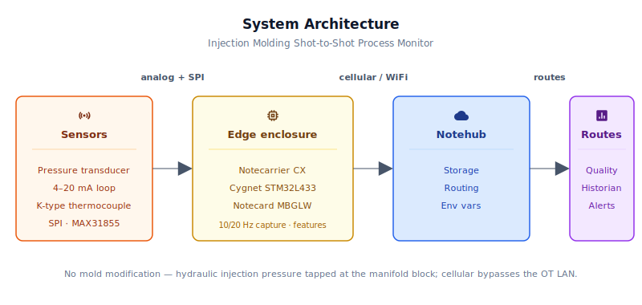
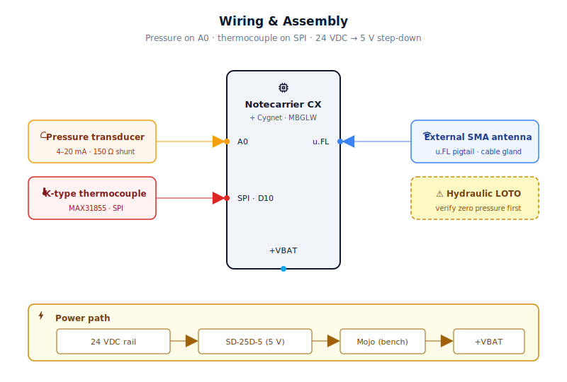
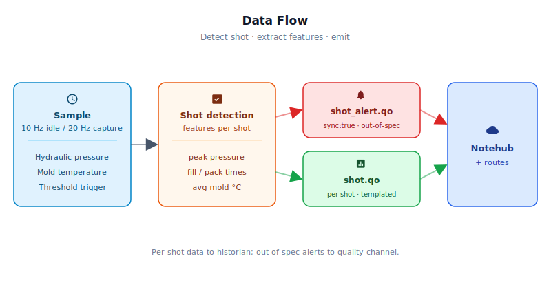

# Injection Molding Hydraulic Injection Pressure Monitor

<Note>

This reference application is intended to provide inspiration and help you get started quickly. It uses specific hardware choices that may not match your own implementation. Focus on the sections most relevant to your use case. If you'd like to discuss your project and whether it's a good fit for Blues, [feel free to reach out](https://blues.com/contact-sales/).

</Note>

A shot-level process monitor for plastic [injection molding](https://blues.com/industrial-equipment-monitoring/) machines. The device captures the two signals that drive part quality on every shot — hydraulic injection pressure and mold temperature — and reduces each shot to a handful of summary metrics a process engineer would want to see (peak pressure, fill time, pack pressure, average mold temperature, shot sequence number), then pushes them to the cloud over cellular. Because the connectivity sits outside the plant's OT network, no IT or network ticket is required at the customer site. The hardware is a Blues Notecarrier CX paired with a [Notecard Cell+WiFi](https://shop.blues.com/products/notecard?utm_source=dev-blues&utm_medium=web&utm_campaign=store-link) (see §4 for the full BOM).

## Expected Outcome

After completing this project, you will have:
- A compact DIN-rail enclosure mounted in the machine's electrical cabinet
- Hydraulic injection pressure and mold temperature collected continuously at the edge
- Five shot-level metrics (`peak_psi`, `fill_ms`, `pack_psi`, `temp_avg_c`, cooling-rate slope) in Notehub's `shot.qo` Notefile — one event per shot (or per N shots, configurable)
- Real-time alerts routed to your CMMS, webhook, or quality system whenever any metric exceeds configurable thresholds
- No modification to the machine, no touching the mold, no plant-network involvement — 100% cellular
- Commissioning takes ~50–100 shots to establish baseline thresholds; thereafter the system runs autonomously

## 1. Project Overview


**The problem.** Plastic injection molding is a process that looks stable until it isn't. A mold that cycled flawlessly through ten thousand shots can begin producing scrap on shot ten-thousand-and-one — a worn gate land, a slightly off-spec resin lot, a cooling circuit that's partially fouled, a worn check ring on the screw. None of these failures announce themselves dramatically. What they do is introduce subtle, shot-to-shot variation in the two signals that matter most: hydraulic injection pressure at the cylinder's manifold block (the upstream hydraulic forcing function that drives how completely the cavity fills and how aggressively it is packed) and mold temperature (which governs cooling rate, crystallinity, and cycle time). Both of those signals are measurable continuously. Almost nobody measures them continuously.

**Why Notecard.** Plastics processors run their production equipment on isolated **OT** (operational technology) networks — isolated by design, because the machines that run 24/7 production cannot share a network path with corporate IT systems. An OEM that wants to offer a remote process-monitoring service faces a hard choice: either negotiate a network path through every customer's IT and OT security teams (slow, expensive, different every time), or deploy a connectivity solution that bypasses the plant network entirely. The Notecard Cell+WiFi variant does exactly that — it carries data directly to [Notehub](https://notehub.io) over cellular, with WiFi available as an opportunistic fallback for plants that permit it, and the OEM ships the same hardware SKU to every customer regardless of how the plant's networks are organized.

**Deployment scenario.** A compact DIN-rail or panel-mount enclosure installed in or adjacent to the machine's electrical cabinet, powered from the machine's existing 24 VDC control rail. The hydraulic injection pressure transducer taps into a 1/4-18 NPT port on the injection cylinder's hydraulic manifold block — on the hydraulic oil side of the machine, with no contact with the polymer melt — so **no mold modification is required**. The thermocouple probe is seated in the mold's existing thermocouple pocket. No modification to the machine's controller, no connection to the plant LAN, no IT ticket.

## 2. System Architecture




**Device-side responsibilities.** The Notecarrier CX's onboard Cygnet STM32L433 host runs continuously (this is a line-powered machine; no deep-sleep cycling needed). It polls injection-manifold pressure at 10 Hz during idle; when the pressure signal crosses the shot-detection threshold, it enters capture mode at 20 Hz (50 ms per sample), filling a RAM buffer with a pressure and temperature profile for feature extraction. After each shot the host computes five shot-level features from the buffer, increments a per-boot-session shot counter, and queues a [Note](https://dev.blues.io/api-reference/glossary/#note) for transmission. All of this happens in the STM32's 64 KB SRAM — a 102-second shot captured at 20 Hz produces at most 16 KB of profile data, well within budget.

**Notecard responsibilities.** The Notecard stores Notes in its on-device queue, establishes the cellular (or WiFi) session on the configured [`hub.set`](https://dev.blues.io/api-reference/notecard-api/hub-requests/#hub-set) `outbound` cadence (default 60 minutes), and flushes any `sync:true` alert Notes immediately regardless of the outbound schedule. The Notecard also handles [environment variable](https://dev.blues.io/guides-and-tutorials/notecard-guides/understanding-environment-variables/) distribution — operators adjust detection thresholds and alert bands from Notehub without reflashing.

**Notehub responsibilities.** The Notecard manages its own cellular session against the supported carrier networks worldwide via its embedded global SIM and delivers data to [Notehub](https://dev.blues.io/notehub/notehub-walkthrough/) over the Internet; Notehub ingests events, stores them, and applies project-level [routes](https://dev.blues.io/notehub/notehub-walkthrough/#routing-data-with-notehub). Two separate [Notefiles](https://dev.blues.io/api-reference/glossary/#notefile) — `shot.qo` for periodic process data and `shot_alert.qo` for out-of-spec events — allow different downstream routes at different urgencies without any filter logic in the route itself.

**Routing (high level only).** Notehub supports HTTP, MQTT, AWS, Azure, GCP, Snowflake, and several other destinations. This project ships no specific downstream endpoint. See the [Notehub routing docs](https://dev.blues.io/notehub/notehub-walkthrough/#routing-data-with-notehub) for setup options.

## 3. Technical Summary


**Path to First Event (5–10 min bench demo)**

1. **Assemble the minimum bench kit** (no production hydraulics needed):
   - Notecarrier CX + Notecard Cell+WiFi
   - SparkFun MAX31855K thermocouple breakout + dummy K-type leads
   - 150 Ω resistor, 100 nF capacitor, 5 V USB power or MeanWell DC-DC
   - Jumper wires to connect A0 (pressure via resistor) and SPI pins (thermocouple)

2. **Create a Notehub project and get the ProductUID:**
   - Sign up at [notehub.io](https://notehub.io)
   - Create a new project and copy its ProductUID (format: `com.company:project-name`)

3. **Flash the firmware:**
   ```bash
   arduino-cli core install "STMicroelectronics:stm32"
   arduino-cli lib install "Blues Wireless Notecard"
   # Edit firmware/injection_molding_shot_monitor/injection_molding_shot_monitor.ino
   # Replace PRODUCT_UID "" with your actual ProductUID
   arduino-cli compile -b STMicroelectronics:stm32:Blues:pnum=CYGNET firmware/injection_molding_shot_monitor/
   arduino-cli upload -b STMicroelectronics:stm32:Blues:pnum=CYGNET -p /dev/ttyACM0 firmware/injection_molding_shot_monitor/
   ```

4. **Monitor the serial output:**
   - Open a serial terminal at 9600 baud to see shot detection and feature extraction logs
   - Inject a fake pressure pulse (e.g. short the 150 Ω resistor for ~2 seconds) to trigger a shot
   - Verify the next Notehub sync (within 60 min) shows a `shot.qo` event

5. **Inspect the event in Notehub:**
   - Log into notehub.io, open your project, and navigate to Events
   - Look for `shot.qo` events containing `cycle`, `peak_psi`, `fill_ms`, `temp_avg_c`
   - The serial log and Notehub events are the source of truth during commissioning

> **Design scope: hydraulic injection pressure — no mold modification required.** This monitor measures **hydraulic injection pressure at the injection cylinder's manifold block** using an off-the-shelf 4–20 mA strain-gauge transducer that taps a standard NPT port on the hydraulic circuit. Hydraulic pressure is the forcing function the injection unit applies; in-cavity pressure is the actual polymer pressure the mold cavity sees — the two differ by nozzle, gate, and runner losses that vary with resin, temperature, and wear. Because the measurement point is on the hydraulic circuit rather than inside the mold, this approach can be retrofitted to any hydraulic press in an afternoon without touching the mold, without accessing a sensor port, and without production interruption. It is appropriate for shot-to-shot consistency monitoring, filling and packing trend detection, and early-warning alerting. It is **not** a substitute for direct cavity pressure measurement in applications that require it — such as closed-loop pack control, or high-precision medical or optical parts where the manifold-to-cavity pressure relationship cannot be assumed stable. For those use cases a mold-mounted piezoelectric transducer with dedicated signal conditioning is required.

Here is a sample Note this device emits:

```json
{
  "file": "shot.qo",
  "body": {
    "cycle":       247,
    "peak_psi":    1340.5,
    "fill_ms":     760,
    "pack_psi":    890.2,
    "cool_c_s":    -1.84,
    "temp_avg_c":  47.3,
    "shot_ms":     28400
  }
}
```

## 4. Hardware Requirements


| Part | Qty | Rationale |
|------|-----|-----------|
| [Notecarrier CX](https://shop.blues.com/products/notecarrier-cx?utm_source=dev-blues&utm_medium=web&utm_campaign=store-link) | 1 | Integrated carrier with an embedded Cygnet STM32L433 host — runs application code directly with no separate MCU. Exposes ADC, SPI, and I2C via dual 16-pin headers. Includes a short flexible LTE antenna (u.FL); see §5 for cabinet-routing requirements. |
| [Notecard Cell+WiFi (MBGLW)](https://shop.blues.com/products/notecard?utm_source=dev-blues&utm_medium=web&utm_campaign=store-link) ([datasheet](https://dev.blues.io/datasheets/notecard-datasheet/note-mbglw/)) | 1 | Cellular removes per-site IT involvement; WiFi available as an opportunistic fallback. Prepaid SIM with 500 MB and 10 years of service included. |
| Taoglas CBP.300.11F.200A u.FL-to-SMA female bulkhead pigtail, RG178, 200 mm | 1 | **Required for any metal-cabinet installation** — see §5. Routes the Notecard's cellular u.FL antenna port to an SMA female bulkhead connector at the cabinet wall. The u.FL end snaps onto the Notecard; the SMA female end mounts in a cable gland or conduit knockout. 200 mm is sufficient for most DIN-rail-to-cabinet-wall runs; order Taoglas CBP.300.11F.300A (300 mm) if your enclosure is deeper. Source from Mouser, Arrow, or Taoglas direct (taoglas.com). |
| External wideband LTE cellular antenna, SMA male, magnetic-mount or direct-mount (e.g. [SparkFun WRL-14987](https://www.sparkfun.com/products/14987)) | 1 | Mounts on the exterior of the cabinet and screws onto the SMA female bulkhead from the pigtail above. A magnetic-mount whip on the cabinet roof is the most practical field option. Ensure the antenna covers the LTE bands in your deployment region. |
| [Blues Mojo](https://shop.blues.com/products/mojo?utm_source=dev-blues&utm_medium=web&utm_campaign=store-link) | 1 | Coulomb counter on the power rail for ground-truth energy measurement during bench validation. |
| [Omega PX309-2KGI](https://www.omega.com/en-us/pressure-strain-force/pressure-transducers/px309/p/PX309-2KGI) hydraulic injection pressure transducer, 0–2,000 PSI, 4–20 mA, 1/4-18 NPT SS | 1 | Strain-gauge transducer with 4–20 mA current-loop output, tapped into a 1/4-18 NPT port on the injection cylinder's hydraulic manifold block — on the hydraulic oil circuit that drives the screw forward, with no contact with the polymer melt. This measures **hydraulic injection pressure** — not in-cavity pressure. 4–20 mA is the plant-floor standard: immune to cable-length voltage drop and noise, and maps directly to the Cygnet ADC through a 150 Ω sense resistor. Because the measurement point is on the hydraulic circuit, no mold modification is required. The 0–2,000 PSI range suits bench and lower-pressure hydraulic circuits; production injection machines commonly run hydraulic injection pressures above this range — upgrade the transducer range to match the circuit and update `max_pressure_psi` accordingly. |
| [SparkFun Thermocouple Breakout — MAX31855K (SEN-13266)](https://www.sparkfun.com/products/13266) | 1 | SPI thermocouple amplifier IC with cold-junction compensation. Interfaces directly to the Cygnet at 3.3 V; no analog signal conditioning required. |
| [Omega KMQSS-125G-4](https://www.omega.com/en-us/temperature-measurement/thermocouple-probes/thermocouple-probes-with-transition-junction-connector/kmqss-general-purpose-thermocouple/p/KMQSS-125G-4) K-type thermocouple probe, 1/8" dia. SS sheath, 4" insertion, 1/8-27 NPT | 1 | Standard mold temperature sensor, rated to 1100 °C (well above injection molding range). K-type thermocouples are universal for mold temperatures (25–150 °C typical mold surface). Observe probe polarity: connect the positive lead to TC+ on the MAX31855 breakout — ANSI/US K-type probes use yellow for positive; IEC 60584-3 K-type probes use green. Verify from the probe's lead marking or connector label, not the wire color alone. Select the fitting that matches the mold's thermocouple pocket — M6 bayonet and 1/4-18 NPT adapters are common. **Important:** A 1/8″ sheath in a mold pocket has a thermal response time of several seconds, which is longer than a typical injection-molding cooling phase. This channel is suited for monitoring steady-state mold temperature and detecting gradual multi-shot drift — not for resolving the fast within-shot cooling transient. See §7 for implications on the `cool_c_s` field. |
| 150 Ω 0.1% precision resistor | 1 | Current-to-voltage conversion for the 4–20 mA loop. At 4 mA this puts 0.60 V on the ADC; at 20 mA, 3.00 V — safely within the Cygnet's 3.3 V ADC range across the full sensor span. |
| 100 nF ceramic capacitor | 1 | Decoupling capacitor across the 150 Ω sense resistor to suppress switching noise from the transducer loop on the ADC input. |
| [MeanWell SD-25D-5](https://www.meanwell.com/Upload/PDF/SD-25/SD-25-SPEC.PDF) 24 VDC → 5 VDC/5 A DIN-rail DC-DC converter | 1 | Derives 5 V for the Notecarrier CX from the machine's existing 24 VDC control rail — no separate AC supply needed. |
| [Hammond Manufacturing 1458N1](https://www.hammondmfg.com/pdf/1458.pdf) DIN-rail electronics enclosure, 4-module, ABS, IP20 | 1 | Panel-mount housing appropriate for installation inside an existing electrical cabinet. Slotted DIN-rail clip. Ensure the external antenna cable exits through a cable gland; see §5. |

All Blues parts ship with an active SIM including 500 MB of data and 10 years of service — no activation fees, no monthly commitment.

## 5. Wiring and Assembly




All host I/O lands on the [Notecarrier CX](https://dev.blues.io/datasheets/notecarrier-datasheet/notecarrier-cx-v1-3/) dual 16-pin header. The Notecard Cell+WiFi (MBGLW) seats into the carrier's M.2 slot. During bench validation, the Mojo sits inline between the 5 V supply output and the Notecarrier's `+VUSB` pad, and connects to the **Notecarrier CX's Qwiic connector** (the carrier exposes the I²C bus; the Notecard reads the Mojo's LTC2959 coulomb counter from there). The Mojo is bench-validation equipment — it is not installed in the field deployment.

> **Electrical safety.** The injection molding machine's electrical cabinet contains hazardous voltages. All wiring and installation work inside the cabinet must be performed by qualified personnel following site lockout/tagout procedures and applicable electrical codes. This system is read-only — it does not command injection, clamp, or any machine motion.

> **Hydraulic safety.** Installing the pressure transducer requires opening a port on a high-pressure hydraulic circuit. Before breaking into the hydraulic system:
> 1. **Shut down the hydraulic power unit and apply full lockout/tagout (LOTO)** to the hydraulic circuit following the machine OEM's procedure. Do not rely on a control-panel E-stop alone — verify zero pressure at the work port with a calibrated gauge before loosening any fittings.
> 2. **Use only a transducer, fitting, and thread sealant rated above the circuit's maximum working pressure and compatible with the hydraulic fluid in use.** Hydraulic injection circuits commonly exceed the 2,000 PSI range of the reference transducer — verify the circuit's maximum pressure and upgrade both the transducer range and fitting ratings to match before installation. An undersized transducer or fitting is a burst and injection-hazard risk.
> 3. **Follow the machine OEM's procedure for port access, thread engagement count, and sealant selection.** Use the sealant type specified for the hydraulic fluid (mineral-oil circuits typically use PTFE tape or anaerobic thread sealant; confirm compatibility). Incorrect or excess sealant can contaminate the hydraulic fluid or block the transducer port.
> 4. **Torque all fittings to the manufacturer's specification.** After re-pressurizing, **leak-check at full system pressure before returning the machine to service** — inspect the transducer port and all disturbed fittings. Even a pinhole leak in a high-pressure hydraulic line is a serious injection and fire hazard.

**4–20 mA pressure transducer loop (A0):**

- 24 VDC supply (+) → transducer (+) supply terminal.
- Transducer (-) return terminal → one end of the 150 Ω sense resistor → GND.
- ADC input **A0** → junction between transducer (-) and the top of the 150 Ω resistor (i.e., the node that swings 0.60 V–3.00 V with load current). Place the 100 nF capacitor from this node to GND, physically close to the A0 pin.
- The 24 VDC loop ground and the Notecarrier CX GND must share a common reference — run a ground wire between the machine's 24 VDC return and the Notecarrier's GND pin.

**MAX31855K thermocouple breakout (SPI):**

- MAX31855K breakout `VCC` → `+3V3_OUT` on the Notecarrier CX header (3.3 V, 100 mA available).
- MAX31855K breakout `GND` → `GND`.
- MAX31855K breakout `SCK` → `SCK` on the Notecarrier CX header.
- MAX31855K breakout `DO` (MISO) → `MISO` on the Notecarrier CX header.

  > **Notecarrier CX v1.3 label errata.** The MOSI and MISO silkscreen labels are swapped on v1.3 hardware. If SPI reads return garbage, swap the MOSI/MISO connections and retry. See the [Notecarrier CX v1.3 datasheet](https://dev.blues.io/datasheets/notecarrier-datasheet/notecarrier-cx-v1-3/) for the authoritative pin table.

- MAX31855K breakout `CS` → `D10` on the Notecarrier CX header (any digital I/O works; D10 is the firmware default).
- MAX31855K breakout `TC+` and `TC-` → corresponding positive and negative wires of the K-type thermocouple probe. **Polarity note:** ANSI/US K-type convention uses yellow for the positive lead; IEC 60584-3 uses green for K-type positive. Consult your probe's lead color or connector marking — do not assume from a generalized color table.

**Antenna (mandatory for metal-cabinet installations):**

The Notecarrier CX includes a short flexible LTE antenna connected to the Notecard's cellular u.FL port. Inside a steel electrical cabinet this antenna will be strongly attenuated by the enclosure walls — reliable cellular connectivity requires the antenna element to be positioned outside the cabinet.

- Thread the u.FL-to-SMA female bulkhead pigtail through a cable gland or conduit knockout in the cabinet wall. Use an IP-rated cable gland to maintain the enclosure's protection rating.
- Snap the u.FL connector onto the **Notecard's cellular u.FL antenna port**. Keep the coax run short and avoid sharp bends; the RG178 cable is fragile and will fail at a sharp kink.
- Attach the external SMA wideband antenna to the SMA female bulkhead on the outside of the cabinet. A magnetic-mount whip placed on the cabinet roof is a practical field solution. Keep the antenna clear of large metal objects and away from the high-voltage conductors in the upper section of the panel.
- Do not use the included flexible antenna inside the cabinet — retain it as a bench-test spare.

> **Field test before commissioning.** RF performance inside a machine cabinet varies by cabinet size, wall thickness, and nearby interference sources. After assembly, verify cloud connectivity by issuing `{"req":"hub.status"}` from the in-browser Notecard terminal or the serial debug port and confirming `connected:true` in the response before locking up the cabinet.

**Power:**

- 24 VDC rail → 24 V input of the DC-DC step-down converter.
- DC-DC converter 5 V output (+) → Notecarrier CX `+VUSB` (or `+VBAT`).
- DC-DC converter 5 V output (−) → Notecarrier CX `GND`.
- During bench validation: place the Mojo inline between the DC-DC 5 V output and `+VUSB` so it measures the full Notecarrier + Notecard subsystem. Connect the Mojo's Qwiic cable to the **Notecarrier CX's Qwiic connector** (the carrier exposes the shared I²C bus; the Notecard reads the Mojo's LTC2959 over that bus). Remove the Mojo before field deployment — it is a bench-validation tool only.

## 6. Notehub Setup


1. **Create a project.** Sign up at [notehub.io](https://notehub.io) and [create a project](https://dev.blues.io/quickstart/notecard-quickstart/notecard-and-notecarrier-pi/#set-up-notehub). Copy the [ProductUID](https://dev.blues.io/notehub/notehub-walkthrough/#finding-a-productuid) and paste it into `firmware/injection_molding_shot_monitor/injection_molding_shot_monitor.ino` as `PRODUCT_UID`.

2. **Claim the Notecard.** Power the unit; on first cellular connection the Notecard automatically associates with your project.

3. **Create a Fleet per production line.** [Fleets](https://dev.blues.io/guides-and-tutorials/fleet-admin-guide/) group devices for shared configuration. A natural structure is one fleet per production line or cell — all monitors on the same line typically run the same mold and resin and therefore share the same threshold set. Use [Smart Fleet](https://dev.blues.io/notehub/notehub-walkthrough/#using-smart-fleet-rules) rules to automatically assign monitors by line or mold ID if you have many.

4. **Set environment variables.** All variables below are optional; firmware defaults are shown. Any value set in Notehub overrides the compile-time default on the device's next inbound sync — operators can adjust alert bands in the field to match the specific mold and resin without reflashing.

   | Variable | Default | Purpose |
   |---|---|---|
   | `max_pressure_psi` | `2000.0` | Full-scale of the installed pressure transducer (PSI). Must match the purchased sensor range. |
   | `shot_detect_psi` | `100.0` | Rising-edge threshold (PSI) above which a shot is considered started. Increase if idle vibration causes false triggers. |
   | `shot_end_psi` | `50.0` | Falling-edge threshold (PSI) below which a shot is considered complete. |
   | `peak_psi_min` | `800.0` | Alert fires when peak injection pressure falls below this value — potential indicator of a short shot, gate freeze, or material flow issue. |
   | `peak_psi_max` | `1900.0` | Alert fires when peak injection pressure exceeds this value — overpacking or flash risk indicator. |
   | `fill_time_min_ms` | `200` | Alert fires when fill time is shorter than this (milliseconds). Unexpectedly short fill times suggest a gate or nozzle issue. |
   | `fill_time_max_ms` | `3000` | Alert fires when fill time exceeds this (milliseconds). Slow fill indicates degraded material flow or low injection speed. |
   | `mold_temp_max_c` | `80.0` | Alert fires when average mold temperature exceeds this value (°C). Rising mold temperature can indicate cooling circuit degradation. |
   | `outbound_min` | `60` | Cellular outbound sync cadence in minutes. When this value changes in Notehub, the firmware detects the difference on its next 5-minute env-var check and immediately re-issues `hub.set` with the new cadence — no reflash needed. Allow up to the `inbound` poll interval (default 120 min) for the Notecard to pull the updated value from Notehub, then up to 5 more minutes for the firmware to apply it. |
   | `report_every_n_shots` | `1` | Emit a `shot.qo` Note every N shots. Set to 10 to reduce data volume on high-speed machines without losing trend visibility. |

5. **Configure routes.** Add one [route](https://dev.blues.io/notehub/notehub-walkthrough/#routing-data-with-notehub) targeting `shot_alert.qo` (real-time delivery to a quality alert or CMMS endpoint) and a second targeting `shot.qo` (batch delivery to a process historian or analytics platform). Because the two Notefiles are separate at the source, each route operates independently — high-urgency alerts can go to an on-call webhook while trend data lands in a time-series database, all without any filter logic in the routes.

## 7. Firmware Design


Single sketch: [`firmware/injection_molding_shot_monitor/injection_molding_shot_monitor.ino`](firmware/injection_molding_shot_monitor/injection_molding_shot_monitor.ino)

**Dependencies:**
- Arduino core for STM32 ([`stm32duino/Arduino_Core_STM32`](https://github.com/stm32duino/Arduino_Core_STM32)), installed via the Arduino IDE Boards Manager.
- [`Blues Wireless Notecard`](https://github.com/blues/note-arduino) (the `note-arduino` library). Install via the Arduino Library Manager or `arduino-cli lib install "Blues Wireless Notecard"`.

### Modules

| Responsibility | Function |
|---|---|
| Notecard setup (`hub.set`, motion disable) | `configureNotecard()` |
| Template registration for both Notefiles | `defineTemplates()` |
| Env var fetch and threshold update | `fetchEnvVars()` |
| 4–20 mA pressure ADC read | `readPressurePsi()` |
| MAX31855K SPI thermocouple read | `readMoldTempC()` |
| Shot detection and profile capture | `captureShot()` |
| Feature extraction from profile buffer | `computeFeatures()` |
| Shot Note emit (`shot.qo`) | `sendShotNote()` |
| Alert Note emit (`shot_alert.qo`, `sync:true`) | `sendAlertNote()` |

### Sensor reading strategy

**Pressure.** The 4–20 mA current-loop signal from the transducer passes through a 150 Ω sense resistor, generating a 0.60–3.00 V signal across the Cygnet's 12-bit ADC pin A0. Eight ADC readings are averaged per call to `readPressurePsi()` to suppress switching noise without adding meaningful latency. The resulting count range is mapped linearly from [ADC_4MA_COUNTS … ADC_20MA_COUNTS] to [0 … `max_pressure_psi`].

**Temperature.** The MAX31855K outputs a 32-bit SPI word containing the thermocouple junction temperature in the upper 14 bits (0.25 °C per LSB) and three fault flags in the lower three bits. `readMoldTempC()` reads this word directly over SPI without an additional library dependency, checks the fault bits, and returns `NAN` on any thermocouple wiring fault (open-circuit, short-to-GND, short-to-VCC). `computeFeatures()` guards every temperature accumulation with `isnan()`, so a disconnected or shorted probe does not corrupt arithmetic. When the thermocouple produces no valid samples across a shot, the mold-temperature trend slope (`cool_c_s`) and average-temperature (`temp_avg_c`) fields degrade to `0.0` — a known simplification. `0.0` is an ambiguous sentinel because a mold legitimately near ambient temperature is indistinguishable from a faulty probe in the payload; a future improvement would use a sentinel value outside the physical temperature range (e.g. `-999.0`) so downstream analytics can distinguish the two cases.

**Probe response-time limitation.** A 1/8″ stainless sheath seated in a mold pocket has a thermal response time of several seconds, which is longer than a typical injection-molding cooling phase. As a result, `cool_c_s` (the least-squares slope of temperature during the cooling window of a single shot) primarily reflects slow mold-surface temperature drift across multiple shots rather than the fast within-shot cooling transient. It remains a useful signal for detecting gradual cooling-circuit degradation over time; it should not be interpreted as a precise shot-level cooling rate. `temp_avg_c` (the mean temperature across the whole captured buffer) is similarly a lagged, averaged reading of the mold surface that is well-suited for steady-state mold temperature trending and the `mold_temp_high` alert threshold.

**Shot capture.** Between shots, `readPressurePsi()` is polled at 10 Hz. When the reading crosses `shot_detect_psi`, the firmware enters `captureShot()`, which samples pressure and temperature at 20 Hz (50 ms cadence) into two pre-allocated float arrays. A 102.4-second maximum shot window at 20 Hz = 2,048 samples × 2 channels × 4 bytes = 16 KB — well within the Cygnet's 64 KB SRAM. `SHOT_TIMEOUT_MS` is defined as `SHOT_BUF_SIZE × SHOT_SAMPLE_MS` (102,400 ms) so the safety timeout fires at exactly the moment the buffer would otherwise fill, preventing a buffer-exhaustion exit from being mistaken for a naturally-ended shot. If the while-condition exits the loop rather than a `break` (buffer completely full), `captureShot()` returns `false` and logs a diagnostic — the partial profile is discarded rather than silently computing features on truncated data.

### Event payload design

Both Notefiles are [template-backed](https://dev.blues.io/notecard/notecard-walkthrough/low-bandwidth-design/#working-with-note-templates). Templates tell the Notecard to store and transmit fixed-length binary records rather than free-form JSON, shrinking per-Note wire size by 3–5×. On a machine cycling every 30 seconds across a three-shift day, that's roughly 2,880 shot Notes per day — templates materially reduce per-Note wire size, which helps keep the daily cellular data budget manageable at high cycle rates.

`pack_psi` and `cool_c_s` are recorded in `shot.qo` for downstream trend analysis but do not drive alert rules in this design — only `peak_psi`, `fill_ms`, and `temp_avg_c` are evaluated against configurable alert thresholds.

`shot.qo` records are queued in the Notecard's on-device flash and flushed on the outbound schedule. `shot_alert.qo` is also template-backed (port 51) and is sent with `sync:true`, which instructs the Notecard to skip the outbound queue and open a cellular session immediately for that Note.

Sample `shot.qo` Note body:

```json
{
  "file": "shot.qo",
  "body": {
    "cycle":       247,
    "peak_psi":    1340.5,
    "fill_ms":     760,
    "pack_psi":    890.2,
    "cool_c_s":    -1.84,
    "temp_avg_c":  47.3,
    "shot_ms":     28400
  }
}
```

> **`cycle` is a per-boot-session shot sequence number.** `g_cycle_count` is a RAM-only variable that resets to zero on every reboot or power loss. It is not a persistent lifetime part counter. For cumulative production counting, aggregate session counts using the Notehub event timestamp as the ordering key, or implement NVM persistence as a production enhancement (see §10).

Sample `shot_alert.qo` Note body (immediate sync):

```json
{
  "file": "shot_alert.qo",
  "body": {
    "alert":       "peak_pressure_low",
    "cycle":       248,
    "peak_psi":    692.1,
    "fill_ms":     1240,
    "temp_avg_c":  47.1
  },
  "sync": true
}
```

### Power and sync strategy

The injection molding machine is line-powered 24/7, so the host runs a continuous `loop()` rather than cycling through deep sleep. There is no `NotePayloadSaveAndSleep` call — the host must stay responsive between shots to catch the pressure rising edge. Bandwidth efficiency, not sleep depth, is the power concern.

The Notecard runs in [`hub.set`](https://dev.blues.io/api-reference/notecard-api/hub-requests/#hub-set) `periodic` mode with `outbound: 60` and `inbound: 120` (minutes). Shot Notes accumulate in the on-device queue and flush once per hour; alert Notes bypass the queue and sync within a session-establishment window (~15–60 s). See the [Notecard low-power design guide](https://dev.blues.io/notecard/notecard-walkthrough/low-power-firmware-design/) and the [MBGLW datasheet](https://dev.blues.io/datasheets/notecard-datasheet/note-mbglw/) for authoritative figures.

### Retry and error handling

**Notecard initialization.** `configureNotecard()` issues `hub.set` in a retry loop for up to 5 seconds, calling `requestAndResponse()` on each attempt so the response `err` field can be inspected. A semantic failure — such as an unrecognized `PRODUCT_UID` format — is logged and propagated back to `setup()`, which halts with a `FATAL` message rather than silently proceeding in an unprovisioned state. This replaces the earlier `sendRequestWithRetry()` pattern, which returned only a boolean and could not distinguish a transport timeout from a Notecard-side rejection. If `PRODUCT_UID` is empty (the default), `setup()` halts immediately before attempting any Notecard communication.

**env.get.** `fetchEnvVars()` calls `requestAndResponse()` and guards against both a `nullptr` response (Notecard unreachable) and a response carrying an `err` field (`notecard.responseError(rsp)` returns `true`). In either case the function returns early and the in-RAM thresholds retain their last-good values — the device keeps running on stale (but valid) thresholds rather than stopping.

**note.template.** `defineTemplates()` runs once at boot and uses `requestAndResponse()` for both `shot.qo` and `shot_alert.qo` registrations, printing the `err` string if either call is rejected. Templates are idempotent — re-running them on the next boot corrects any missed registration, at the cost of one cycle of free-form JSON Notes. The `alert` field in `shot_alert.qo` uses `"peak_pressure_high"` (the longest of the five alert type names, at 18 characters) as its exemplar string so the template allocates sufficient width for all alert values without truncation.

**note.add.** `sendShotNote()` checks the `sendRequest()` return; a failed `note.add` drops that shot Note — there is no per-Note retry queue. Lost shot Notes are acceptable at high cycle rates (the process trend is still visible across surviving Notes). `sendAlertNote()` returns `bool` (the `sendRequest()` result). The per-alert cooldown timer in `loop()` is only advanced when `sendAlertNote()` returns `true` — a transient I2C or Notecard failure therefore does not suppress retries for the full 10-minute cooldown window. The next shot that trips the same condition will attempt the alert Note again immediately.

**card.motion.mode.** The accelerometer-disable call in `configureNotecard()` is best-effort; failure is logged to Serial. A live accelerometer does not affect application correctness — it adds a small amount of idle current to the Notecard's baseline, which is visible on the Mojo trace.

**Sensor faults.** `readMoldTempC()` returns `NAN` on any MAX31855 fault bit. `computeFeatures()` guards every temperature accumulation with `isnan()` so fault samples are silently excluded. A shot with zero valid temperature samples produces `0.0` in the `temp_avg_c` and `cool_c_s` fields — see the sensor reading section for the implications of this sentinel choice.

**Shot capture guard.** `captureShot()` discards events shorter than `MIN_SHOT_DURATION_MS` (500 ms) so that machine vibration or idle pressure noise cannot increment `g_cycle_count` and pollute the trend data.

### Key code snippet 1 — template definition

The template registers each field's data type using [Notecard type-hint syntax](https://dev.blues.io/notecard/notecard-walkthrough/note-template/):
- `14` = 4-byte signed integer (e.g. `cycle`, `fill_ms`, `shot_ms`)
- `14.1` = 4-byte IEEE 754 float with one decimal place of precision (e.g. `peak_psi`, `pack_psi`, `cool_c_s`, `temp_avg_c`)

Fixed-size binary records let the Notecard store and transmit several hundred queued shots without exhausting its flash, dramatically reducing wire size. `requestAndResponse()` is used so the `err` field is visible if the Notecard rejects a malformed type hint — `sendRequest()` would silently swallow that failure.

```cpp
J *req = notecard.newRequest("note.template");
JAddStringToObject(req, "file", "shot.qo");
JAddNumberToObject(req, "port", 50);
J *body = JAddObjectToObject(req, "body");
JAddNumberToObject(body, "cycle",      14);
JAddNumberToObject(body, "peak_psi",   14.1);
JAddNumberToObject(body, "fill_ms",    14);
JAddNumberToObject(body, "pack_psi",   14.1);
JAddNumberToObject(body, "cool_c_s",   14.1);
JAddNumberToObject(body, "temp_avg_c", 14.1);
JAddNumberToObject(body, "shot_ms",    14);
J *rsp = notecard.requestAndResponse(req);
if (!rsp || notecard.responseError(rsp)) {
    Serial.print("[APP] note.template (shot.qo) failed");
    if (rsp) { Serial.print(": "); Serial.print(JGetString(rsp, "err")); }
    Serial.println(" — will retry on next boot.");
}
if (rsp) notecard.deleteResponse(rsp);
```

### Key code snippet 2 — immediate-sync alert

`sync:true` bypasses the hourly outbound schedule. The Notecard wakes the radio immediately and delivers the alert within a session-establishment window.

```cpp
J *req = notecard.newRequest("note.add");
JAddStringToObject(req, "file", "shot_alert.qo");
JAddBoolToObject(req, "sync", true);
J *body = JAddObjectToObject(req, "body");
JAddStringToObject(body, "alert",    "peak_pressure_low");
JAddNumberToObject(body, "cycle",    (double)g_cycle_count);
JAddNumberToObject(body, "peak_psi", peak_psi);
notecard.sendRequest(req);
```

### Key code snippet 3 — feature extraction: mold-temperature trend slope (`cool_c_s`)

Because the 1/8″ sheath thermocouple has a thermal response time of several seconds — longer than a typical injection cooling phase — `cool_c_s` does not capture the within-shot cooling transient. What it does capture is the direction and rate of mold-surface temperature drift across the tail end of each cycle window. A least-squares slope is fitted over the post-gate-seal samples in the capture buffer; the result is a °C/s value (negative = mold surface cooling, positive = rising). Used as a trend signal across many shots, a slope drifting toward zero (mold cooling more slowly than baseline) is an early indicator of a fouled or partially-blocked cooling circuit, surfacing the degradation before it shows up in part dimensions or cycle time.

```cpp
// Linear regression: slope = (N·Σxy − Σx·Σy) / (N·Σxx − (Σx)²)
// x = time in seconds from gate-seal; y = mold temperature °C
double sx = 0, sy = 0, sxx = 0, sxy = 0;
int n = 0;
for (int i = cool_start; i < g_shot_n; i++) {
    if (isnan(g_temp_buf[i])) continue;
    double x = (double)(i - cool_start) * SHOT_SAMPLE_MS / 1000.0;
    double y = (double)g_temp_buf[i];
    sx += x;  sy += y;  sxx += x*x;  sxy += x*y;
    n++;
}
float denom = (float)(n * sxx - sx * sx);
*cool_c_per_s = (fabsf(denom) > 1e-9f)
    ? (float)((n * sxy - sx * sy) / denom) : 0.0f;
```

## 8. Data Flow




**Collected.** During each shot: a continuous time series of injection-manifold pressure (PSI) and mold temperature (°C) sampled at 20 Hz. After each shot: five aggregated features (peak pressure, fill time, pack pressure, mold temperature average, and mold-temperature trend slope) plus total shot duration and a per-boot-session shot sequence number (`cycle`). Pack pressure and the mold-temperature trend slope (`cool_c_s`) are recorded for downstream trend analysis; they do not trigger alerts. Note that `cool_c_s` reflects multi-shot mold-surface temperature drift rather than the within-shot cooling transient — see §7 for the probe response-time limitation — and should be interpreted over a run of shots, not individually.

**Transmitted.**
- `shot.qo` — one Note per shot (or per N shots if `report_every_n_shots` is set). Queued in the Notecard and synced on the hourly outbound schedule. Template-encoded for wire efficiency.
- `shot_alert.qo` — emitted only when a feature falls outside its configured alert band, synced immediately via `sync:true`. Each of the five alert types has its own independent 10-minute cooldown timer, so a shot that simultaneously trips multiple conditions (e.g. low peak pressure and high mold temperature) produces a separate Note for each tripped condition. Within any single alert type, at most one Note is emitted per 10-minute window regardless of how many consecutive out-of-spec shots occur.

**Routed.** Both Notefiles go to Notehub. Separate routes can forward `shot_alert.qo` in real time (webhook, email, Slack, CMMS) while `shot.qo` lands in a time-series database or process historian for trend analysis.

**Alert triggers.** Five conditions are evaluated independently per shot:

| Alert | What it signals |
|---|---|
| `peak_pressure_low` | Insufficient injection pressure — potential indicator of short shots, gate freeze, or degraded material flow |
| `peak_pressure_high` | Excessive injection pressure — overpacking, flash risk, or dimensional oversizing |
| `fill_time_short` | Unusually fast fill — possible gate erosion or runaway injection speed |
| `fill_time_long` | Slow fill — degraded material flow, low injection pressure, or cold resin |
| `mold_temp_high` | Mold running hot — cooling system degradation or elevated ambient |

## 9. Validation and Testing


**Expected steady-state cadence.** On a healthy process with default thresholds, the device generates one `shot.qo` Note per injection cycle (e.g., 120 Notes per hour on a 30-second cycle time) and zero `shot_alert.qo` Notes. Expect a commissioning period of 50–100 shots to validate that default thresholds are appropriate for the specific mold and resin — adjusting `peak_psi_min`, `peak_psi_max`, and `fill_time_max_ms` via Notehub environment variables is the intended workflow without touching firmware.

**Simulating alerts during commissioning.** Drop `peak_psi_min` to a value above what the process actually produces (for example, set it to `1500.0` on a process that normally peaks at `1340.0`). The next inbound sync will pull the updated value, and the next shot will trip `peak_pressure_low` — the alert Note should appear in Notehub within a typical cellular session window. Reset the variable to its correct value when done.

**Shot profile spot-check.** During commissioning, set `report_every_n_shots` to `1` and `outbound_min` to `10` in Notehub. After the next Notecard inbound sync (up to 120 minutes at the default cadence) and the next firmware env-var check (up to 5 minutes), the device re-applies `hub.set` and begins syncing every 10 minutes. Each sync delivers a fresh batch of shot Notes. Watch the `fill_ms` and `peak_psi` fields across consecutive shots — on a stable process they should be nearly constant. Gradual drift in `peak_psi` or a step change in `fill_ms` after a material lot change or mold maintenance are exactly the signals this system is designed to surface.

**Data-budget validation (required before production).** With `report_every_n_shots=1` (the default) and a 30-second cycle time, this design can generate up to **2,880 `shot.qo` Notes per day** — plus additional `shot_alert.qo` Notes if thresholds are tripped. Templates reduce per-Note wire size by 3–5× versus free-form JSON, but the raw Note volume is still material at that rate. Before deploying to a production machine:

1. **Estimate your daily Note volume.** Use: `notes_per_day = (86400 s ÷ cycle_time_s) ÷ report_every_n_shots`. A 20-second cycle with `report_every_n_shots=1` produces ~4,320 Notes/day; setting `report_every_n_shots=10` drops that to ~432 — still capturing trend signals without a 10× data-volume penalty.

2. **Run a 24–72 hour validation soak.** After commissioning, check [Notehub usage data](https://dev.blues.io/notehub/notehub-walkthrough/#viewing-billing-account-usage) to confirm actual consumption aligns with your estimate. Cellular data usage depends on sync cadence, signal conditions, Note queue depth at sync time, and routing behavior — the measured figure is more reliable than any pre-deployment estimate.

3. **Tune `report_every_n_shots` and `outbound_min` for the machine.** A fast machine (≤15 s cycle) running at `report_every_n_shots=1` will accumulate large numbers of queued Notes between hourly syncs. Validate queue headroom empirically before production: disconnect the cellular antenna, let the machine run for the expected outage window (e.g. 4–8 hours for a typical overnight signal gap), reconnect, and confirm that all Notes arrive in Notehub. Missing `cycle` sequence numbers in the delivered Notes reveal dropped queue entries. If your Note rate times the expected outage window risks saturation, increase `report_every_n_shots` or shorten `outbound_min` to flush the queue more frequently. Actual queue capacity depends on template size, Notecard firmware version, and session behavior — the measured result is more reliable than any pre-deployment estimate.

4. **Watch `shot_alert.qo` volume separately.** Each `sync:true` alert Note triggers its own cellular session. The 10-minute per-alert cooldown limits the worst case to 6 sessions per alert type per hour, but if multiple alert types fire simultaneously on a badly off-spec process, session frequency can add up. Check the Notehub event log for alert Note volume during commissioning and confirm that alert thresholds are set appropriately for the specific mold and resin.

**Using Mojo to validate power behavior.** Place the [Mojo](https://dev.blues.io/datasheets/mojo-datasheet/) inline between the 5 V step-down converter and the Notecarrier CX `+VUSB` rail during bench testing. Connect the Mojo's Qwiic cable to the **Notecarrier CX's Qwiic connector** so the Notecard can read the LTC2959 coulomb counter over the shared I²C bus. The Mojo measures the entire subsystem at the 5 V input rail — Notecard plus Notecarrier regulators plus Cygnet host — not the Notecard in isolation.

Published Notecard figures (from the [MBGLW datasheet](https://dev.blues.io/datasheets/notecard-datasheet/note-mbglw/)). The MBGLW uses an LTE Cat-1 bis modem (Quectel EG916Q-GL) plus a 2.4 GHz 802.11b/g/n WiFi module; the figures below are for the cellular path used in this design:

| Phase | Current at 5 V rail |
|---|---|
| Notecard idle — minimum (radio off, deep idle) | < 9 µA — **MBGLW datasheet** |
| Notecard idle — standby (radio off, between periodic syncs) | ~18 µA — **MBGLW datasheet** |
| Notecard cellular session (LTE Cat-1 bis, modem active) | ~250 mA average, with brief transmit peaks to ~2 A — **MBGLW datasheet**; session duration typically tens of seconds per hourly sync |

Whole-system figures (Notecard + Notecarrier regulators + Cygnet host at the 5 V Mojo measurement point):

| Phase | Mojo reading (measure on your bench) |
|---|---|
| Combined idle (host running, radio off) | The Cygnet's active-run current dominates — measure on your bench; the Notecard's µA-range contribution is negligible relative to the MCU |
| Shot capture active (ADC + SPI polling at 20 Hz) | Approximately the same as combined idle; ADC averaging and SPI reads add only a small fraction of the MCU's active power |

The Mojo reports cumulative mAh to the Notecard at 1% accuracy over the Qwiic bus. A useful bench exercise: run the device for one hour with no alerts triggering, then confirm the Mojo tally matches the expected pattern — one radio burst per hour lasting tens of seconds at the published ~250 mA, plus continuous host-active current in between. If the radio appears to be syncing far more frequently than the configured outbound cadence, check whether an alert condition is firing `sync:true` Notes in rapid succession — each alert Note triggers an immediate cellular session.

## 10. Troubleshooting


| Symptom | Likely Cause | Fix |
|---------|--------------|-----|
| **Notecard won't connect to cellular** | Antenna not attached or misrouted; cabinet shielding too severe | Verify u.FL-to-SMA pigtail is snapped onto the Notecard's cellular port; confirm external antenna is mounted outside the cabinet on clear metal surface. Run `{"req":"hub.status"}` to check `connected` field. |
| **No shot.qo events appear in Notehub** | ProductUID not set in firmware; Notecard not claimed; shot detection threshold too high | Verify ProductUID in .ino matches Notehub project exactly. Check Notehub device list for your unit and confirm device status is `online`. If present, lower `shot_detect_psi` in Notehub fleet environment and trigger a test pulse. |
| **Shot.qo events show but shot_alert.qo never fires** | Alert thresholds too loose for actual process; Notecard not issuing immediate sync | During commissioning, artificially tighten thresholds (e.g. set `peak_psi_min` to 1500 on a process that peaks at 1340). Verify the alert fires on the next shot. Use Notehub event log to confirm `sync:true` and cellular session timing. |
| **Thermocouple reads 0°C or NaN** | Probe disconnected, shorted, or wiring error; MOSI/MISO swapped on Notecarrier v1.3 | Verify MAX31855K CS pin is D10 and SCK/MISO/MOSI match the wiring diagram. Check probe polarity (yellow = positive for ANSI K-type; green for IEC K-type). Swap MOSI and MISO if v1.3 hardware and SPI returns garbage. |
| **Pressure ADC reads very low or very high** | 150 Ω sense resistor disconnected or wrong value; ADC_COUNTS_AT_4MA / 20MA calibration stale | Measure voltage across A0 with a multimeter during idle and at known test pressure. Verify resistor value with an ohmmeter. Recalibrate ADC constants if a different transducer range was installed. |
| **Cellular bill much higher than expected** | Alert conditions firing repeatedly, triggering many `sync:true` sessions; `outbound_min` too short | Check Notehub event log for alert spam. Widen alert thresholds or increase the 10-minute per-alert cooldown (`ALERT_COOLDOWN_MS`). Ensure `outbound_min` is at least 30 minutes for production use. |
| **Serial terminal shows "FATAL: PRODUCT_UID is empty"** | Firmware default PRODUCT_UID not replaced before flashing | Edit firmware/injection_molding_shot_monitor.ino, line ~33: replace `#define PRODUCT_UID ""` with your actual ProductUID, then reflash. |
| **Mojo coulomb counter reads way too high** | Mojo connected to wrong power rail or Qwiic cable unplugged during soak | Verify Mojo is inline between the DC-DC 5V output and `+VUSB`. Confirm Qwiic cable is snapped firmly to Notecarrier CX Qwiic connector. Reset Mojo by disconnecting and reconnecting power. |

## 11. Limitations and Next Steps


**Simplified for this reference design:**

- **Hydraulic injection pressure, not in-cavity pressure.** This design measures hydraulic injection pressure at the injection cylinder's manifold block using a standard 4–20 mA strain-gauge transducer. It does not measure in-cavity pressure, which requires a mold-mounted piezoelectric transducer installed through a dedicated sensor port in the mold (either an existing port or one machined for that purpose). Hydraulic pressure is the upstream forcing function applied by the injection unit; cavity pressure is the actual polymer pressure inside the mold cavity. The two differ by nozzle, gate, and runner losses that vary with resin, temperature, and wear. For shot-to-shot consistency monitoring and trend detection where the hydraulic-to-cavity relationship is reasonably stable, hydraulic pressure is a practical and accessible signal. For applications that require direct cavity pressure (closed-loop pack control, high-precision medical or optical parts), a mold-mounted piezoelectric transducer with appropriate charge amplifier and signal conditioning is required — see the scope note at the top of this document.

- **Cycle counter resets on power loss.** `g_cycle_count` is a RAM-only variable. The `cycle` field in every Note is a per-boot-session shot sequence number — it resets to zero on every power loss or reboot. It is not a persistent lifetime part counter. For cumulative production counting in a downstream system, use Notehub event timestamps as the canonical ordering key. A production enhancement would persist `g_cycle_count` to the STM32's internal flash (using HAL_FLASH_Program) or to a small external EEPROM, with writes batched (e.g. every 100 shots) to stay well within flash endurance limits.

- **Pressure range is POC-level.** The default 0–2,000 PSI range suits benchtop and lab hydraulic circuits but may be insufficient for production injection machines, where hydraulic injection pressures often exceed this range. Deploying on a higher-pressure circuit requires a transducer rated for the actual maximum hydraulic pressure — update `max_pressure_psi` to match and confirm the manifold fitting and transducer pressure ratings before installation.
- **20 Hz shot capture is POC-level.** The firmware samples at 20 Hz (50 ms per sample), which is sufficient for extracting the five summary features used here but is too coarse to capture the fine structure of the fill waveform. Fast injection molding machines — particularly those with fill times under 200 ms or rapid gate-seal transients — may require 100–1000 Hz sampling to faithfully characterize fill dynamics and detect peak-pressure spikes. Achieving higher rates on the Cygnet would require SPI DMA, double-buffering, and a deeper profile buffer.
- **Profile waveform is not transmitted.** The firmware captures the pressure and temperature profile in RAM and extracts features from it, but only the five features are sent to Notehub. The raw profile arrays are discarded after each shot. A production system that needs SPC waveform analysis or golden-sample comparison would need to transmit the profile itself — but at 2,048 samples × 8 bytes × 2,880 shots per day, transmitting raw profiles is a very different data volume problem.
- **Single sensor per shot.** One pressure transducer and one thermocouple. Multi-cavity molds (two-cavity, four-cavity, family molds) would need one transducer per cavity plus a firmware extension to track per-cavity features independently.
- **Gate-seal detection is heuristic.** Pack-phase end is detected when pressure drops to 50% of peak. Real-world molds may have a different ratio depending on gate geometry and resin rheology. The `GATE_SEAL_FRAC` constant in firmware is the tuning point for this.
- **Shot trigger is pressure-only.** Some machine controllers output a digital shot-in-progress signal on their I/O board. Wiring that signal to a digital input pin and using it as the primary trigger (rather than the pressure threshold) would give more precise shot-boundary timing. The firmware's pressure-threshold approach is a practical alternative for installations where the machine's I/O is not accessible.
- **No shot-to-shot baseline tracking.** The alert thresholds are static (set by env var). A production quality system would maintain a rolling baseline for each feature and alert on *deviation from the process baseline* rather than fixed limits, automatically adapting after intentional process changes.
- **Mojo is bench-validation only.** The firmware does not read the Mojo's coulomb counter over Qwiic at runtime. Adding a mAh field to the periodic `shot.qo` Note is a straightforward extension if fleet-level energy telemetry becomes valuable.

**Production next steps:**

- Persistent cycle counter: batch-write `g_cycle_count` to STM32 internal flash or an external EEPROM every 100 shots so the lifetime shot tally survives power cycling; expose the persisted count as a separate `total_cycle` field in the `shot.qo` Note body.
- Per-cavity monitoring: extend the data model to carry a `cavity_id` field and wire one transducer per cavity; the Notecarrier CX has A0–A5 available for expansion.
- Waveform capture for golden-sample comparison: implement a `TRANSMIT_WAVEFORM` mode (triggered once per N shots or on command from a `_cmd.qi` Notefile) that sends a base64-encoded mini-profile for offline SPC.
- Process change detection: compute an exponentially weighted moving average (EWMA) baseline for `peak_psi` and `fill_ms` on-device and alert only when a feature deviates from its EWMA by more than a configurable sigma band.
- Field-upgradeable firmware via [Notecard Outboard DFU](https://dev.blues.io/notehub/host-firmware-updates/notecard-outboard-firmware-update/) so the OEM can push threshold-logic updates across the fleet without a site visit.
- Thermocouple fault-bit handling and internal-reference validation: the MAX31855 32-bit SPI word contains three fault flags (open-circuit, short-to-GND, short-to-VCC) in bits 2:0 and 12 bits of cold-junction (board-level) reference temperature in bits 15:4 (0.0625 °C per LSB). The firmware checks the fault flags and **excludes faulted temperature samples from the shot averages**, but the shot Note is still emitted regardless — when no valid temperature samples were collected across an entire shot (e.g. a disconnected or shorted probe), `temp_avg_c` and `cool_c_s` both appear as `0.0` in the payload. As noted in §7, this sentinel is ambiguous: it cannot be distinguished from a mold legitimately near ambient temperature. A production improvement would either suppress the shot Note when the probe is entirely faulted, or replace the zero-valued sentinel with a value outside the physical temperature range (e.g. `-999.0`) so downstream analytics can tell a faulted probe from a cold mold. The internal-reference temperature bits are read and discarded — sanity-checking that value against the expected ambient range (e.g. 15–55 °C for a machine room) can catch board wiring faults and cold-junction compensation anomalies before they produce incorrect thermocouple readings.

## 12. Summary


Injection molding is precise and repetitive by design, but precision and repeatability erode gradually in ways that are invisible until scrap rates start climbing. Hydraulic injection pressure at the cylinder's manifold block and mold temperature together encode most of what a process engineer would want to know about how each shot went — whether the mold filled completely, how aggressively the gate was packed, and whether the mold surface temperature is trending in the right direction across shots (a slow upward drift is often the first sign of a fouled cooling circuit). This design measures hydraulic injection pressure — the upstream forcing function the injection unit applies — using a standard 4–20 mA strain-gauge transducer that taps an NPT port on the hydraulic manifold block, requiring no mold modification. That accessibility is a meaningful deployment advantage: the monitoring unit can be retrofitted in an afternoon without touching the mold or the machine controller. This project captures those signals at the edge, reduces each shot to five interpretable numbers, and routes them off the machine over cellular without any dependency on the plant's OT network.

The cellular path is not a convenience feature — it's the thing that makes this kind of monitoring deployable at scale. An OEM that ships a process-monitoring module with every new machine, or retrofits the existing installed base, cannot rely on negotiating a network path through each customer's IT and OT teams. The Notecard removes that conversation from the critical path entirely. The same firmware, the same hardware SKU, and the same Notehub project work at every plant in every geography, without an IT ticket or a site survey. That's the argument for cellular in industrial IoT — not raw bandwidth, but OEM independence and deployment predictability across a fleet that spans dozens or hundreds of sites.
