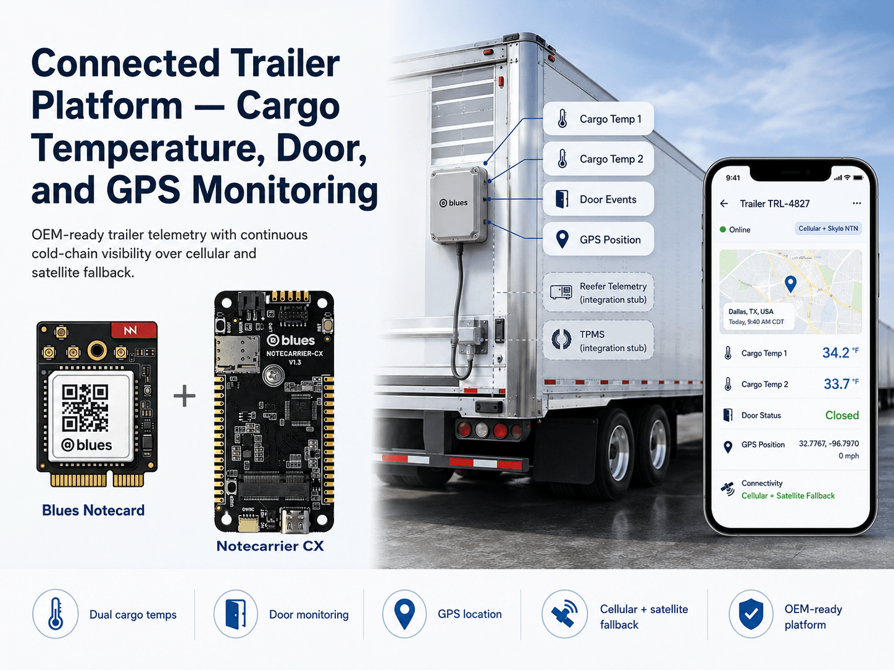
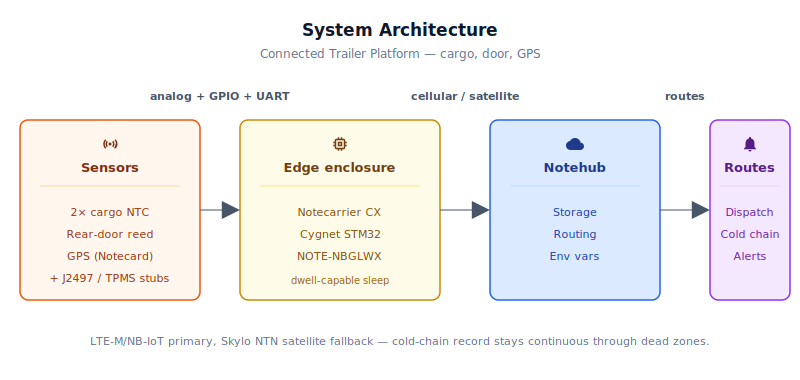
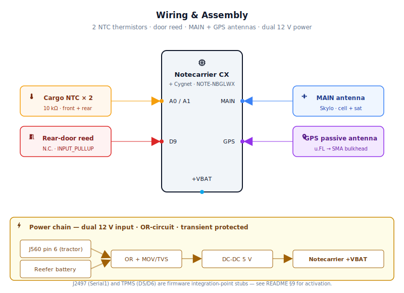
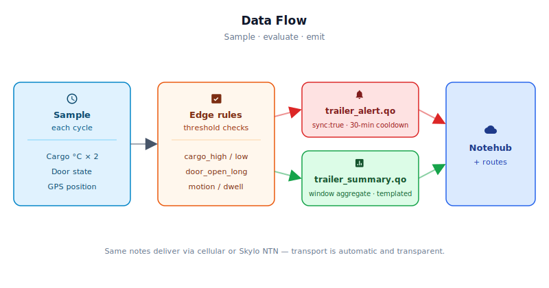

# Connected Trailer Platform — Cargo Temperature, Door, and GPS Monitoring



<Note>

This reference application is intended to provide inspiration and help you get started quickly. It uses specific hardware choices that may not match your own implementation. Focus on the sections most relevant to your use case. If you'd like to discuss your project and whether it's a good fit for Blues, [feel free to reach out](https://blues.com/landing-pages/accelerators-contact-us/?accelerator=Connected%20Trailer%20Platform%20%E2%80%94%20Cargo%20Temperature%2C%20Door%2C%20and%20GPS%20Monitoring).

</Note>

This project is a connected-trailer platform for trailer OEM integration, targeting manufacturers who want to own the cellular and satellite connectivity layer on refrigerated trailers from day one. The platform reports the operational signals a fleet operator actually checks — cargo-air temperature at two points inside the trailer, rear-door open/close events, GPS position, and (with vendor-specific decode work) reefer setpoint and tire pressure — back to the OEM's cloud continuously, including across the cellular dead zones common on long rural hauls and at intermodal rail yards. When cellular coverage is unavailable, the device falls back automatically to the [Skylo](https://blues.com/industrial-equipment-monitoring/) non-terrestrial satellite network so the cold-chain record stays continuous through coverage gaps. The hardware is a Blues [Notecarrier CX](https://shop.blues.com/products/notecarrier-cx?utm_source=dev-blues&utm_medium=web&utm_campaign=store-link) paired with a [Notecard for Skylo](https://shop.blues.com/products/notecard-for-skylo?utm_source=dev-blues&utm_medium=web&utm_campaign=store-link) (see §4 for the BOM); the firmware ships three sensor paths fully implemented today (cargo temperature, door, GPS) and two as integration-point stubs awaiting vendor engineering — J2497 reefer telemetry and TPMS tire pressure. The implementation-status callout below summarises all five paths.

## 1. Project Overview

**The problem.** A refrigerated trailer is a one-time sale that lasts a decade or more. Once it leaves the factory, the manufacturer's recurring revenue opportunity hinges entirely on what services they can sell over that trailer's lifetime, and the telematics layer is the obvious candidate. The trouble is that battle is already being fought on every refrigerated trailer on the road. Thermo King and Carrier, the two dominant **reefer** (refrigeration unit) OEMs, ship their own fleet connectivity built around the reefer unit's proprietary data ports. Aftermarket platform vendors layer on top of those. By the time a trailer reaches a fleet operator's yard, two or three telematics competitors are already reading its temperature and location, and they all have a head start.

A trailer OEM that wants to own the connectivity layer — rather than ceding it to the reefer OEM — needs a hardware-and-software platform that's on the trailer from day one. That platform has to read everything the fleet operator actually cares about: the reefer setpoint and actual temperature from the refrigeration unit itself, body-air temperature at two points in the cargo space (the data the shipper trusts at delivery time, not the reefer unit's own sensor), tire pressure on every axle, rear-door events that tell the cold-chain story, and GPS for asset location and route compliance. It has to survive 10–15 years of operation across regions, carriers, and signal environments, including long rural hauls, intermodal drayage moves, and multi-day DC (**distribution center**) dwells where the trailer sits disconnected from the tractor for days at a stretch, often in areas where cellular coverage is unreliable.

**Why Notecard.** A trailer OEM cannot commit to a modem they might have to re-source in year four of a ten-year program. Notecard for Skylo solves this at the module level: it combines LTE-M/NB-IoT cellular and Skylo satellite (via **NTN**, Non-Terrestrial Network, meaning communication through geostationary satellites rather than cell towers) in a single pre-certified M.2 form-factor module with an embedded SIM, 500 MB of cellular data, and 10 years of service included. The OEM installs one hardware SKU, flashes one firmware image, and ships trailers into any regional market without per-unit carrier activation, without SIM swaps, and without a per-site recurring data-plan negotiation. When a trailer crosses into a cellular dead zone — a mountain pass, a rural cold-storage depot, a remote intermodal rail yard — Notecard for Skylo transitions transparently to the Skylo satellite network, so the cold-chain record and the TPMS safety log stay continuous. Notehub gives the OEM's cloud a single API endpoint regardless of which radio delivered any given message. That's the connectivity bundle a trailer manufacturer needs to compete on the data layer rather than concede it to the reefer OEM by default. Pre-certified global cellular plus satellite plus included data, all in one module with a credible long-term roadmap, is exactly the program-level assurance a trailer OEM needs.

<NewToBlues/>

**Deployment scenario.** A weatherproof enclosure mounted on the trailer's nose wall (the forward interior wall, adjacent to the reefer unit). Notecard for Skylo's Skylo-certified flat-patch antenna is exterior-mounted on the trailer roof with a clear sky view; the GPS antenna is also exterior on the roof. **SAE J2497** (also marketed as **PLC4TRUCKS**) is the SAE standard for power-line communications over the existing power conductors of commercial-vehicle trailer wiring; the J2497 PLC signal rides on the **J560 pin 6 circuit** — the always-hot auxiliary/battery feed on the SAE J560 North American seven-pin trailer connector; not a stop-lamp or brake circuit. The reference build includes a documented integration point for a future J2497 coupling interface on that circuit, and the firmware scaffolding routes a POC placeholder through the data pipeline, but this is not a delivered sensor path. A practical caveat: J2497's dominant production use is trailer ABS warning-lamp telemetry, not reefer data. Most reefer-OEM telemetry in the field is delivered over vendor-proprietary serial diagnostic ports (Carrier Transicold DataLink, Thermo King DSR/DSR2) or J1939 over CAN, not over J2497. The firmware UART (`Serial1`) is the same interface either way — only the decode function changes, so the reference assumption can be re-targeted to a different transport without rearchitecting the platform. See [§10 Limitations](#10-limitations-and-next-steps) for the alternative-transport comparison and the engineering required to activate any of them. **Regional Note:** SAE J560 is the North American 7-pin standard; European trailers use ISO 1185 (7-pin) or ISO 3731 (13-pin) connectors with different pinouts — J2497 PLC is deployed on the equivalent auxiliary circuit in those standards. Two encapsulated NTC thermistors hang inside the cargo space, front and rear, providing the independent body-air readings shippers use to verify cold-chain integrity at delivery. A documented integration point for a future TPMS (**Tire Pressure Monitoring System**) gateway receiver is included; the firmware scaffolding and note-template fields for four tire positions are in place, but this is not a delivered sensor path — real tire pressure data requires the vendor-specific engineering described in [§10 Limitations](#10-limitations-and-next-steps). A magnetic reed switch on the rear door reports open/close state. The Notecarrier CX and its onboard Cygnet STM32 host run the trailer state machine; Notecard for Skylo handles all radio management, GNSS positioning, and Notehub data delivery. Power during tractor-connected operation comes from the trailer's 12 V auxiliary/battery circuit — **J560 pin 6** (the always-hot auxiliary feed, distinct from the stop-lamp and brake circuits); during DC dwells when the tractor is disconnected, a power-priority switching circuit transfers automatically to the reefer unit's own 12 V battery — integral to every refrigerated trailer — keeping the power path alive during DC dwells. The host uses `NotePayloadSaveAndSleep` / `card.attn` to sleep at zero current between sample cycles, making multi-day DC-dwell operation within a practical reefer battery budget achievable; see [§7](#7-firmware-design) for the power architecture detail.

<Note>

**Platform sensor paths — implementation status**

**Fully implemented and buildable today:**

- Two NTC cargo-air thermistors with β-equation ADC conversion and window-aggregate min/max/mean statistics
- Rear-door reed switch with open-time accumulation and distinct event counting
- GPS asset tracking via Notecard built-in GNSS with motion-state detection and cadence switching
- Notecard for Skylo (NOTE-NBGLWX) with automatic LTE-M/NB-IoT cellular → Skylo NTN satellite fallback
- Templated binary summary Notes (`trailer_summary.qo`) and immediate-sync alert Notes (`trailer_alert.qo`)
- Notehub environment-variable–driven threshold and sync-cadence configuration, updateable over the air
- Dwell-capable host sleep via `NotePayloadSaveAndSleep` / `card.attn`: host draws zero current between sample cycles; the Notecard's radio-idle floor (~8–18 µA) is the only static draw during sleep

**Integration-point stubs — require additional vendor engineering to activate:**

- **Reefer telemetry over a serial UART (reference assumption: J2497 PLC):** The firmware reserves `Serial1` for a future reefer-telemetry source and parses a simplified POC frame through the full alert/summary pipeline. The reference design assumes a power-line-carrier link based on **SAE J2497 / PLC4TRUCKS** using a Yitran IT700 modem, but it's worth understanding upfront that J2497's dominant deployed use is trailer ABS warning-lamp telemetry, and reefer telemetry specifically over J2497 is uncommon in production. Most reefer telemetry in the field rides on **vendor-proprietary serial diagnostic ports** (Carrier Transicold DataLink over RS-232/RS-485, Thermo King Direct Smart Reefer / DSR2) or **J1939 over CAN**. The firmware UART can be re-targeted to any of those by replacing the decode function in `drainReeferUart()` — only the transport changes, not the data pipeline. Activating any path requires (a) selecting the transport, (b) the corresponding application-layer stack and reefer-OEM message mapping, and (c) field validation. The `reefer_sensor_loss` alert is gated so it does not fire on a build with no reefer-telemetry source connected. See [§10](#10-limitations-and-next-steps).
- **TPMS tire pressure:** The firmware parses a generic POC packet format and routes pressures through the alert/summary pipeline, but production firmware must replace the parser with the chosen vendor's proprietary decode library. See [§10](#10-limitations-and-next-steps).

</Note>

## 2. System Architecture



**Device-side responsibilities.** Each time the Notecard's ATTN signal brings the Cygnet STM32L433 back to life, the host walks the three fully-implemented sensor inputs — both cargo-air thermistors (12-bit ADC with β-equation conversion), the rear-door reed switch, and the GPS position from the Notecard's built-in GNSS — and then services the two UART stub channels: `Serial1` for the J2497 reefer path and `tpmsSerial` for the TPMS path. Both UART parsers handle simplified POC frame formats; neither produces real trailer data without the additional engineering described in §10. With every sample the host runs the threshold rules locally and decides whether the cycle warrants an immediate alert or just feeds the running summary accumulator. Between cycles the host is powered off entirely via the Notecard's ATTN signal (see [§7 Low-power strategy](#7-firmware-design)) — every byte of accumulated window state rides through the sleep in a serialised `PersistState` payload stored in the Notecard. On each wakeup, before the sample cycle starts, the host gives both UART channels a 250 ms drain to mop up frames that arrived during sleep, then drains again between each blocking Notecard I²C transaction so a long radio call doesn't shadow an incoming UART frame. All Notecard communication rides I²C over the Notecarrier CX's internal routing; the host never touches the radio or the cellular session.

**Notecard responsibilities.** From there Notecard for Skylo takes over. It keeps [Notes](https://dev.blues.io/api-reference/glossary/#note) in its on-device queue, picks between cellular and satellite radios automatically, and flushes the queue on the [`hub.set`](https://dev.blues.io/api-reference/notecard-api/hub-requests/#hub-set) outbound cadence the firmware sets for the current trailer state — shorter in transit, longer during DC dwells. Alert Notes marked `sync:true` skip the outbound timer entirely and bring up a radio session right away. GNSS is also the Notecard's job, and every Note that leaves the device is automatically tagged with the last known position. The same channel runs the other direction for [environment variables](https://dev.blues.io/guides-and-tutorials/notecard-guides/understanding-environment-variables/) pushed from Notehub, so fleet operators can retune thresholds and sync cadences across an entire customer's trailers without anyone touching firmware.

**Notehub responsibilities.** [Notehub](https://dev.blues.io/notehub/notehub-walkthrough/) is where the data lands. Notes arrive over the Internet, every event is stored, and project-level [routes](https://dev.blues.io/notehub/notehub-walkthrough/#routing-data-with-notehub) fan them out to wherever the OEM's cloud needs them. The same firmware image adapts to wildly different cargo types through fleet-level [environment variables](https://dev.blues.io/guides-and-tutorials/notecard-guides/understanding-environment-variables/) — a frozen-goods customer and a produce customer differ only in the reefer temperature bands their fleet encodes, not in their device build. [Smart Fleets](https://dev.blues.io/notehub/notehub-walkthrough/#using-smart-fleet-rules) let the OEM slice the installed base by customer, cargo class, or route region without ever forking the firmware.

**Routing to the cloud (high level).** Notehub supports HTTP, MQTT, AWS, Azure, GCP, Snowflake, and other destinations; route setup is project-specific. See the [Notehub routing docs](https://dev.blues.io/notehub/notehub-walkthrough/#routing-data-with-notehub) — this project ships no specific downstream endpoint.

## 3. Technical Summary

**What you'll have when you're done:** A Notecarrier CX running templated sensor data to Notehub's cloud, with temperature and door-open alerts firing immediately when thresholds trip. No J2497 reefer or TPMS data yet — those are integration stubs, but the three fully-implemented paths (cargo temperature, door, GPS) are ready to validate the platform on real hardware.

**Time estimate:** 30 minutes to flash and commission on the bench; add 15 minutes if you're wiring thermistors for the first time.

1. **Install firmware dependencies.** 
   - Install the Arduino core for STM32: In the Arduino IDE, go to **Boards Manager**, search `STM32`, and install `STM32 Cores by STMicroelectronics`.
   - Install the Blues Wireless Notecard library: Search `Blues Wireless Notecard` in the **Library Manager**, and install the latest version.
   - Via CLI: `arduino-cli core install STMicroelectronics:stm32` and `arduino-cli lib install "Blues Wireless Notecard"`.

2. **Get your ProductUID and paste it into the sketch.**
   - Sign up at [notehub.io](https://notehub.io), create a project, and copy your [ProductUID](https://dev.blues.io/notehub/notehub-walkthrough/#finding-a-productuid).
   - Open `firmware/connected_trailer_platform/connected_trailer_platform.ino` and paste the ProductUID into the empty `PRODUCT_UID` string at the top.

3. **Flash the sketch to Notecarrier CX.**
   - Plug the Notecarrier CX (with Notecard for Skylo seated in the M.2 slot) into your computer via USB.
   - Select **Board: Blues Cygnet** in the Arduino IDE (the Notecarrier CX's embedded host is the Blues Cygnet, STM32L433-based).
   - Click **Upload** (or via CLI: `arduino-cli compile -b STMicroelectronics:stm32:Blues:pnum=CYGNET --upload firmware/connected_trailer_platform/`).

4. **Apply power and watch Notehub for data.**
   - Plug a 5 V USB power supply into the Notecarrier's micro-USB port (for bench testing; field units draw power from the 12 V trailer supply via the DC-DC converter).
   - Open Notehub and navigate to **Devices**. The Notecard associates automatically on first powerup.
   - Within 1–5 minutes (depending on cellular coverage), a `_session.qo` Note appears confirming the device's cellular registration.
   - Every 5 minutes (default `sample_interval_sec`), a `trailer_summary.qo` event lands in your project with temperature and door fields populated. Without thermistors wired, the temperature fields show −9999.

5. **Wire the three sensors (optional for bench demo).**
   - Two 10 kΩ NTC thermistors with 10 kΩ 1% series resistors on ADC pins A0 and A1 (see [§5 Wiring](#5-wiring-and-assembly) for voltage-divider schematic).
   - A magnetic door reed switch on GPIO D9 (pull-up enabled in firmware).
   - GPS and cellular/satellite antennas: already included with Notecard for Skylo.
   
   With sensors wired, `trailer_summary.qo` reports real `air_t1_*` and `air_t2_*` fields and tracks `door_open_min` and `door_event_count`.

6. **Configure fleet environment variables (optional, defaults work out of the box).**
   - In Notehub, navigate to **Fleets** and create one (or use the default).
   - Assign your device to the fleet.
   - Add **Environment Variables** to tune the thresholds and sync cadences (see [§6 Notehub Setup, step 4](#6-notehub-setup) for the full variable list).
   - Changes appear on the device at the next inbound sync, no re-flash needed.

Here is a sample Note this device emits:

```json
{
  "reefer_set_f":      -9999.0,
  "reefer_min_f":      -9999.0,
  "reefer_max_f":      -9999.0,
  "reefer_mean_f":     -9999.0,
  "air_t1_min_f":      35.6,
  "air_t1_max_f":      37.2,
  "air_t1_mean_f":     36.3,
  "air_t2_min_f":      35.1,
  "air_t2_max_f":      36.8,
  "air_t2_mean_f":     35.9,
  "door_open_min":      0.0,
  "door_event_count":     0,
  "tpms_0_psi":      -9999.0,
  "tpms_1_psi":      -9999.0,
  "tpms_2_psi":      -9999.0,
  "tpms_3_psi":      -9999.0,
  "tpms_0_age":           1,
  "tpms_1_age":           1,
  "tpms_2_age":           1,
  "tpms_3_age":           1,
  "trailer_state":        2,
  "sample_count":        12
}
```

## 4. Hardware Requirements

| Part | Qty | Rationale |
|------|-----|-----------|
| [Notecarrier CX](https://shop.blues.com/products/notecarrier-cx?utm_source=dev-blues&utm_medium=web&utm_campaign=store-link) | 1 | Integrated carrier with embedded Cygnet STM32L433 host — no separate MCU needed. M.2 slot seats Notecard for Skylo. |
| [Notecard for Skylo (NOTE-NBGLWX)](https://dev.blues.io/datasheets/notecard-datasheet/note-nbglwx/) | 1 | LTE-M/NB-IoT cellular + Skylo NTN satellite + integrated GNSS in one pre-certified module. Single SKU for any region; automatic cellular-to-satellite fallback with no host-firmware involvement. |
| [Blues Mojo](https://shop.blues.com/products/mojo?utm_source=dev-blues&utm_medium=web&utm_campaign=store-link) | 1 | Coulomb counter for power-envelope validation during bench commissioning. |
| 10 kΩ NTC thermistor, β≈3950, encapsulated probe ([Adafruit 372](https://www.adafruit.com/product/372)) | 2 | Cargo-air temperature at two points — front and rear of the trailer. These are the independent readings shippers use to verify cold-chain integrity at delivery, separate from the reefer unit's own sensor. |
| 10 kΩ 1% resistor | 2 | Voltage-divider series resistor for each thermistor on A0 and A1. |
| Magnetic door sensor, N.C., panel-mount ([Adafruit 375](https://www.adafruit.com/product/375)) | 1 | Rear door open/close state on D9. When the door is **closed** the magnet holds the N.C. contact open, leaving the pull-up to drive the pin HIGH (`doorOpen = false`). When the door **opens** the magnet moves away; the N.C. contact closes to GND and pulls the pin LOW (`doorOpen = true`). |
| Skylo-certified flat-patch antenna with u.FL lead (included with Notecard for Skylo) | 1 | Connects to the **`MAIN`** u.FL port on Notecard for Skylo. This single included antenna covers both LTE-M/NB-IoT cellular and Skylo NTN satellite (S-Band/L-Band, B23/B255/B256) — no separate cellular antenna is needed or installed. Exterior roof-mount, flat face toward the sky with ≥11 mm clearance on all edges. Replacing or modifying this antenna, or inserting additional RF connectors into the antenna lead, voids the Skylo network certification and may cause Skylo to block the device. Route the included lead through an IP68-rated cable gland (see §5) — **not** through an added RF connector or bulkhead adapter. |
| Passive GPS/GNSS antenna, u.FL, exterior-mount ([**Taoglas AA.162**](https://www.taoglas.com/product/ulysses-aa-162-miniature-magnetic-mount-gps-glonass-antenna/) passive patch, −40 to +85 °C) | 1 | Connects to the **`GPS`** u.FL port on Notecard for Skylo. The NOTE-NBGLWX GPS port requires a **passive** (un-amplified) antenna — the port does not supply DC bias for an active antenna's LNA. Roof-mount with clear sky view; route the coax through a weatherproof u.FL-to-SMA bulkhead feedthrough. |
| DC-DC converter, 9–36 V input, 5 V/3 A output ([Mean Well SD-15A-5](https://www.meanwell.com/Upload/PDF/SD-15/SD-15-SPEC.PDF)) | 1 | Steps down the 12 V supply (from tractor auxiliary line when connected, or reefer battery during DC dwells) to the 5 V rail powering the Notecarrier CX. The SD-15A-5's 36 V maximum input provides margin against the trailer's normal transient envelope above 12 V nominal. |
| Power-priority OR circuit: **ON Semi MBRS340T3G** automotive Schottky diode, 3 A / 40 V | 2 | One diode per 12 V input leg (tractor aux and reefer battery), anodes to their respective inputs, cathodes joined to a common output node feeding the DC-DC converter VIN. Automatically passes the higher-voltage source with no host involvement; the Schottky's reverse-blocking inherently protects against polarity reversal on each input. Forward drop ~0.4 V at full load — acceptable for a 12 V rail. For production a low-drop ideal-diode controller (e.g., TI LM74700-Q1, AEC-Q100) cuts forward drop to millivolts but adds FETs and layout complexity. **Do not use low-voltage power mux ICs** (e.g., TPS2116, max 5.5 V) — trailer supply and load-dump transients far exceed their rating. |
| IP68 polycarbonate enclosure, ≥160×120×60 mm ([**Hammond 1555H2GY**](https://www.hammfg.com/part/1555H2GY), 180×120×60 mm, light gray, IP68) | 1 | Nose-wall mount; rated against refrigeration condensation and high-pressure washing during trailer cleaning. Key selection criteria: IP67 or better, polycarbonate or ABS body (survives trailer wash-down chemicals), continuous service to −40 °C, ≥160 mm internal length to accommodate the Notecarrier CX with antenna feedthrough headers, cable-gland knockouts on at least one long face. |
| Weatherproof inline blade fuse holder + 7.5 A slow-blow ATC/ATO automotive blade fuse | 2 | One per 12 V input leg (J560 pin 6 tractor aux and reefer battery). Fuse as close to the source as practical — before any other component on each leg. Slow-blow rating withstands DC-DC converter inrush. |
| Automotive transient protection — Stage 1: **Bourns MOV-20D201K** metal-oxide varistor, 20 V RMS, 26 V DC, 400 J energy rating, 20 mm disc, radial leads, THT | 2 | One per 12 V input leg (tractor-aux and reefer-battery), installed from the fused hot wire to chassis GND immediately before each OR-circuit Schottky diode anode. ISO 7637-2 pulse 5b load-dump at a 12 V system's nominal 4 Ω source impedance delivers at most ≈ 190 J per event; the 400 J energy rating provides ≥ 2× thermal margin per device. The 7.5 A slow-blow fuse on each leg limits the peak surge current into the MOV — keep the fuse-to-MOV wiring as short as practical to maximise impedance in the surge path. |
| Automotive transient protection — Stage 2: **Vishay SMBJ26CA** bidirectional TVS diode, 26 V standoff, 600 W peak, DO-214AA (SMB package) | 1 | Installed from the OR-circuit common cathode output node to chassis GND, between the Schottky cathode junction and the SD-15A-5 VIN. Clips fast inductive-kick transients (µs timescale) that the MOV's finite reaction time does not fully arrest. Together with the two upstream MOVs, this two-stage design holds the SD-15A-5 VIN within its 36 V maximum input under typical 12 V trailer ISO 7637-2 conditions. For installations with very short, low-resistance wiring to a high-output alternator — where source impedance is substantially below 4 Ω — verify MOV peak surge-current margin against the Bourns MOV-20D201K datasheet; add a TI LM74721-Q1 (AEC-Q100) surge-stopper IC with an external ≥ 100 V N-channel MOSFET as a third stage between the Stage 1 and Stage 2 elements if warranted. |
| IP68 cable gland sized for the Skylo flat-patch antenna lead (e.g., M16 or M20 IP68 nylon cable gland) | 1 | Routes the included Skylo-certified antenna lead through the enclosure wall without adding any RF connector to the certified cable path. Thread the lead through the gland and tighten against the cable jacket. Do **not** use a u.FL-to-SMA bulkhead adapter or any other RF connector on this lead — adding connectors to the certified cable/antenna assembly changes the approved RF path and voids Skylo certification. |
| u.FL to SMA panel-mount bulkhead feedthrough adapter, IP67, stainless steel or nickel-plated brass body, with SMA-to-u.FL pigtail | 1 | For the GPS passive patch antenna coax (Notecard for Skylo **GPS** port) only. The GPS antenna is not part of the Skylo RF certification; a standard weatherproof RF feedthrough is appropriate here. Do **not** use this type of assembly on the Skylo flat-patch antenna lead (MAIN port). |
| SAE J560 pin 6 wire tap — weatherproof butt-splice or ring terminal, rated for 10–12 AWG wire | 1 | Taps the trailer's existing pin 6 (auxiliary/battery circuit) wire at or near the nose-wall J560 socket to feed the inline fuse holder and then the OR circuit Input A. Use a crimp-sealed weatherproof butt-splice connector or a ring terminal on the appropriate stud; do not use insulation-displacement taps on trailer supply wiring. |

*All Blues hardware ships with a pre-activated SIM, 500 MB of cellular data, and 10 years of service — no activation fees, no monthly commitments.*

### Future Integration Hardware

The following items are **not part of this reference build** and should not be purchased or assembled until the corresponding integration engineering is complete. The firmware includes stub parsers for both paths as placeholders; see [§10](#10-limitations-and-next-steps) for the full engineering scope required before either produces real trailer data.

| Part | Qty | Notes |
|------|-----|-------|
| **J2497 PLC modem custom board**: [Microchip (Yitran) IT700](https://www.microchip.com/en-us/product/IT700) (note: IT700 is legacy; Microchip's IT900A is the current backward-compatible successor) PLC modem IC + Bourns PT60234PEL bus-coupling transformer + bus-clamping TVS diodes and ferrite filter on a custom PCB | 1 | No off-the-shelf UART-output J2497 module exists; the custom board resolves only the physical modem layer. Three additional engineering layers are required before any reefer data flows: (a) a licensed J2497 application-layer protocol stack, (b) reefer-OEM message mapping under a vendor agreement, and (c) field validation. See [§10](#10-limitations-and-next-steps) and [Future Integration: J2497](#future-integration-reefer-telemetry-uart-reference-j2497-plc-modem-path). |
| **TPMS OEM gateway**: PressurePro CORE OEM Module (or equivalent), 315 MHz, 12 V DC, serial data output | 1 | Designed for trailer OEM integration with a serial data port. The firmware's TPMS parser is a POC stub that models a generic one-frame-per-tire format no commercial gateway produces. Production firmware must replace the parser with the chosen vendor's protocol decode library. See [§10](#10-limitations-and-next-steps) and [Future Integration: TPMS Receiver Path](#future-integration-tpms-receiver-path). |

## 5. Wiring and Assembly



Inside the nose-wall enclosure, everything traces back to the [Notecarrier CX](https://dev.blues.io/datasheets/notecarrier-datasheet/notecarrier-cx-v1-3/) and its dual 16-pin headers. Notecard for Skylo seats into the carrier's M.2 slot, and the rest of the trailer-side wiring — thermistor leads, door reed, J560-pin-6 supply, antenna pigtails — comes back to that header from the rest of the box. Two routing rules are worth calling out upfront because they're easy to get wrong: the GPS antenna coax exits the enclosure through the weatherproof u.FL-to-SMA bulkhead feedthrough, while the Skylo MAIN antenna lead must pass through an IP68 cable gland only — never through a bulkhead adapter or any additional RF connector (see BOM and the MAIN u.FL bullet below). The Mojo sits inline between the DC-DC converter's 5V output and the Notecarrier's +VBAT pad during bench power validation (remove it from the field unit once commissioning is complete, or leave it in place if fleet-level energy telemetry is desired). In field installations the DC-DC converter's VIN is fed from the power-priority switching module described in the power chain below, not directly from J560 pin 6.

Pin-by-pin:

- **12V trailer supply chain (power inputs, field installation).** J560 **pin 6** (trailer auxiliary/battery circuit, always-hot when tractor is connected; SAE J560 North American standard) → 7.5 A slow-blow inline fuse + fuse holder → **Bourns MOV-20D201K to chassis GND** (Stage 1 transient clamp, one per leg) → **OR circuit Input A** (the MBRS340T3G Schottky diode in the OR circuit inherently blocks reverse-polarity on this input). **OR circuit Input B:** reefer unit battery positive → 7.5 A slow-blow inline fuse + fuse holder → cable run to nose-wall enclosure → **Bourns MOV-20D201K to chassis GND** (Stage 1, Input B leg) → **OR circuit Input B**. The reefer battery is the only Input B source documented in this design; a standalone dedicated telematics battery is an alternative used in some field deployments but requires a charge controller, float charger, and low-voltage disconnect — do not substitute a bare battery without those elements or it will eventually fail from deep cycling. **OR circuit common cathode output** → **Vishay SMBJ26CA to chassis GND** (Stage 2 TVS, fast inductive-spike clamp) → SD-15A-5 VIN. DC-DC converter VOUT (5 V) → Mojo BAT → Mojo LOAD → Notecarrier CX **+VBAT**.
- **MAIN u.FL** port (Notecard for Skylo) → the included Skylo-certified flat-patch antenna lead. This single antenna covers both LTE-M/NB-IoT cellular and Skylo NTN satellite (S-Band/L-Band, B23/B255/B256) — no separate cellular antenna is needed. Thread the included lead through an IP68 cable gland (see BOM) in the enclosure wall; cinch the gland against the cable jacket to maintain the IP68 enclosure rating. Lay the flat-patch antenna flat face-up on the trailer roof with ≥11 mm clearance on all sides. **Do not insert a u.FL-to-SMA adapter, SMA bulkhead, pigtail, or any other RF connector into this antenna lead** — adding connectors to the certified cable/antenna assembly changes the approved RF path and voids Skylo network certification.
- **GPS u.FL** port (Notecard for Skylo) → passive GPS/GNSS antenna lead, routed through the u.FL-to-SMA bulkhead feedthrough (see BOM) to an exterior roof-mount passive patch antenna (e.g. Taoglas AA.162). The NOTE-NBGLWX GPS port does not supply DC bias; **active (amplified) antennas are not compatible** with this port. Mount with unobstructed sky view.
- **+3V3 (out)** → high-side lead of each NTC thermistor probe (two separate voltage dividers, one per probe, wired **+3V3 → NTC probe → ADC node → 10 kΩ series resistor → GND**; the NTC is on the high side so the firmware's β-equation formula, `R = R_series × (ADC_MAX / raw − 1)` — computes the correct thermistor resistance). Note: when a J2497 custom board is eventually built, its IT700 logic VCC also comes from this +3V3 rail — keeping that current on the Mojo trace. See the [Future Integration: J2497 PLC Modem Path](#future-integration-reefer-telemetry-uart-reference-j2497-plc-modem-path) subsection below.
- **GND** → low side of each 10 kΩ series resistor (divider low leg), one lead of the door sensor. Route signal grounds away from the trailer's chassis ground to avoid noise pickup on the UART channels.
- **A0** → wiper of thermistor 1 voltage divider (front probe, suspended midway up the nose wall, away from the reefer discharge coil).
- **A1** → wiper of thermistor 2 voltage divider (rear probe, suspended midway up the rear door jam).
- **D5 / D6** → *(future integration, no external connection required on the current reference build)* SoftwareSerial TX/RX are initialized in firmware as integration-point stubs for the TPMS receiver. With no gateway connected these pins receive no data and all TPMS positions report −9999. See [Future Integration: TPMS Receiver Path](#future-integration-tpms-receiver-path) below for wiring when a TPMS gateway is added.
- **D9** → one lead of the magnetic door sensor (the other lead ties to GND); firmware enables the STM32's internal pull-up. When the door is **closed**, the magnet holds the N.C. contact open — the GND path is broken and the pull-up drives the pin **HIGH** (`doorOpen = false`). When the door **opens**, the magnet moves away; the N.C. contact returns to its closed (conducting) state, creating a GND path that pulls the pin **LOW** (`doorOpen = true`).
- **SDA / SCL** → routed internally on the Notecarrier CX between the Cygnet host and the Notecard; no external wiring required for I²C communication.
- **+VBAT** → Mojo LOAD output (bench commissioning); Mojo BAT input ← 5V from the DC-DC converter VOUT. See power chain in the power inputs bullet above for the full supply path from trailer 12V to +VBAT.

Mount the enclosure on the nose wall at a height that keeps all connectors above the refrigerant condensation zone and the floor wash zone (typically ≥300 mm above floor). Suspend thermistor probes on nylon tie-mounts anchored to the interior wall studs: T1 at the front quarter of the trailer, T2 at the rear quarter near the door jam, both hanging clear of any cargo contact. Route the GPS antenna coax through the enclosure wall via the u.FL-to-SMA bulkhead feedthrough; route the Skylo MAIN antenna lead through the IP68 cable gland only — do not use the bulkhead feedthrough or any RF connector on the MAIN lead. Lay the Skylo flat-patch antenna flat face-up on the trailer roof with ≥11 mm clearance on all sides. Do not run antenna coax parallel to 12 V DC supply wires; maintain ≥50 mm separation or cross at 90° where proximity is unavoidable.

**Power input protection.** Commercial trailer wiring is electrically harsh — J560 load-dump transients can reach 87 V peak under ISO 7637-2 pulse 5b conditions, and polarity reversal is a common field error. The fuse holders + 7.5 A slow-blow fuses and the MBRS340T3G OR-circuit Schottky diodes (which inherently block reverse polarity on each input leg) in the §4 BOM are non-negotiable. The Schottky OR circuit handles dual-source priority selection and reverse-polarity protection but is not a transient clamp. The two-stage protection specified in §4 provides the transient suppression: one **Bourns MOV-20D201K** per input leg (installed from the fused hot wire to chassis GND before the Schottky anode) absorbs the bulk load-dump energy — at 4 Ω source impedance a pulse 5b event delivers at most ≈ 190 J, within the MOV's 400 J rating with margin. The **Vishay SMBJ26CA** bidirectional TVS on the common OR-circuit cathode output node clamps the residual fast inductive-kick transients before they reach the SD-15A-5 VIN (36 V maximum input). Together the two stages hold the converter input within its rating under the nominal 4 Ω source-impedance scenario. For installations with very short, low-impedance wiring near a high-output alternator, verify MOV peak surge-current margin against the Bourns datasheet and consult the TI LM74721-Q1 application Notes if an active third stage is warranted.

### Future Integration: Reefer Telemetry UART (Reference: J2497 PLC Modem Path)

<Warning>

**This subsection documents future integration work, not the current reference build.** `Serial1` is reserved in firmware for a reefer-telemetry source. The reference assumption is a J2497 PLC modem because it preserves the J560-only physical interface to the trailer, but the IT700 coupling board does not exist and the J2497 application stack is not licensed. Include this wiring only when those two pieces are in place.

**Before committing to J2497, read the alternatives.** J2497 / PLC4TRUCKS is the SAE standard for trailer power-line communications, but its dominant deployed use is ABS warning-lamp telemetry. Production reefer telemetry typically rides on a vendor-proprietary serial diagnostic port (Carrier Transicold DataLink over RS-232/RS-485, Thermo King DSR/DSR2 over serial) or J1939 over CAN — both of which are mechanically simpler than building a PLC coupling board and better-documented at the protocol level. The firmware's `Serial1` channel and `drainReeferUart()` decode function are interface-agnostic: any 9600-baud serial source whose decode produces `setpoint_f` and `actual_f` values into `g_sensors` will exercise the rest of the alert/summary pipeline unchanged. See [§10 Limitations](#10-limitations-and-next-steps) for the side-by-side comparison.

</Warning>

When a J2497 custom board is built, its connections to the Notecarrier CX are:

- **+3V3 (out)** → J2497 custom board logic VCC (IT700 operates at 3.3 V logic). This places the J2497 board's active-mode current on the Notecarrier +3V3 rail and **on the Mojo +VBAT trace** — include it in the bench power budget accordingly.
- **GND** → J2497 board logic GND. Keep signal ground separate from the trailer chassis ground stud.
- **RX (Serial1)** → UART TX of the J2497 custom board (the IT700 host interface, 9600 baud, 8N1, match the protocol-stack or modem-IC datasheet). Without an application-layer stack, raw PLC modem bytes appear on this line, not decoded reefer frames. Level-shift to 3.3 V if the board's logic level is 5 V.
- **TX (Serial1)** → UART RX of the J2497 custom board (for polling commands issued by the host to the modem).
- **J560 pin 6 coupling:** The IT700's modulator/demodulator output couples to the J560 pin 6 (AUX) bus through the Bourns PT60234PEL coupling transformer. This is an AC-coupled signal path — the transformer primary connects to the 12 V bus for PLC signal injection/detection but draws negligible DC from that rail. Keep the transformer primary side and the J560 bus-facing circuitry isolated from the Notecarrier's +3V3 and GND rails. Consult the Bourns PT60234PEL datasheet and the Microchip IT700 PLC Design Guide for schematic, PCB layout, and bus-protection requirements; do not attempt to breadboard this signal path.

**Interface summary (for when the board is built):**

| Signal | Direction | Notecarrier CX pin | J2497 board pin | Notes |
|---|---|---|---|---|
| Logic VCC | → board | +3V3 | VCC (IT700) | ~2–15 mA active (bench-measure) |
| Logic GND | common | GND | GND | Signal ground; isolated from chassis |
| UART RX data | ← board | RX (Serial1) | TX (IT700 host) | 9600 baud 8N1; level-shift if 5 V |
| UART TX cmd | → board | TX (Serial1) | RX (IT700 host) | 9600 baud 8N1 |
| PLC bus | ← J560 pin 6 | — | Coupling xfmr | AC-coupled via PT60234PEL |

### Future Integration: TPMS Receiver Path

<Warning>

**This subsection documents future integration work, not the current reference build.** The SoftwareSerial channel on D5/D6 is compiled into the firmware as a placeholder for a TPMS receiver. No gateway should be purchased or connected until a specific vendor has been selected and the vendor's protocol decode library replaces the stub parser in `trailer_sensors.cpp`. With no gateway connected, all four TPMS positions report −9999 in every summary Note.

</Warning>

When a TPMS OEM gateway (e.g., PressurePro CORE OEM Module) is integrated, its connections to the Notecarrier CX are:

- **D6** → TPMS gateway UART TX output (SoftwareSerial RX on the host side). 9600 baud, 8N1 typical — match the gateway's datasheet. Level-shift to 3.3 V logic if the gateway operates at 5 V.
- **D5** → TPMS gateway UART RX input (SoftwareSerial TX on the host side; used for any poll commands the host sends to the gateway, if required by the vendor protocol).
- **12 V supply rail** → TPMS gateway VCC (the PressurePro CORE OEM module operates at 12 V DC; verify with the chosen module's datasheet). Power from the same fused 12 V rail as the DC-DC converter VIN, not through the Notecarrier's +3V3 or +5V pins. TPMS gateway GND → enclosure ground bus (shared with thermistor GND; keep separate from the trailer chassis ground stud to prevent UART noise ingress).

**Production firmware change required:** replace `drainTpmsUart()` in `trailer_sensors.cpp` with the vendor's message decode library. The POC stub parses a generic 6-byte frame format that no commercial gateway produces; connecting a real gateway without this replacement will yield no valid data.

## 6. Notehub Setup

1. **Create a project.** Sign up at [notehub.io](https://notehub.io) and create a project. Copy the [ProductUID](https://dev.blues.io/notehub/notehub-walkthrough/#finding-a-productuid) and paste it into `firmware/connected_trailer_platform/connected_trailer_platform.ino` as `PRODUCT_UID`.
2. **Provision the Notecard.** Power the unit; on first cellular or satellite session the Notecard associates with your project automatically. The device appears in Notehub under the Notecard's DeviceUID, ready for fleet assignment.
3. **Create fleets by customer or cargo class.** [Fleets](https://dev.blues.io/guides-and-tutorials/fleet-admin-guide/) group devices for shared configuration. The natural unit here is one fleet per OEM customer or cargo type — frozen-goods trailers and produce trailers operate with different reefer temperature bands, and fleet-level [environment variables](https://dev.blues.io/guides-and-tutorials/notecard-guides/understanding-environment-variables/) encode those differences without separate firmware builds. [Smart Fleets](https://dev.blues.io/notehub/notehub-walkthrough/#using-smart-fleet-rules) can automatically assign trailers to fleets based on device attributes set at provisioning time.
4. **Set environment variables.** All variables are optional; firmware compile-time defaults apply until an override is received from Notehub. Overrides are delivered to the device on the next inbound sync without a firmware reflash.

   **To set variables in Notehub:** Navigate to **Fleets** → select your fleet → **Environment** tab. Add each variable as a key-value pair (e.g., key `sample_interval_sec`, value `300`). Changes are pushed to assigned devices on the next inbound sync.

   **Active on this build (fully-implemented sensor paths):**

   | Variable | Default | Purpose |
   |---|---|---|
   | `door_open_transit_sec` | `300` | Door-open duration (seconds) while in transit above which `door_open_transit` fires — cargo security or seal-integrity event. |
   | `sample_interval_sec` | `300` | Seconds between sensor sample cycles. Increase to 900 or more during long DC dwells to reduce host activity. |
   | `summary_interval_min` | `60` | Minutes between templated window-aggregate summary Notes sent to `trailer_summary.qo`. Each Note spans all sample cycles within the window. |
   | `outbound_transit_min` | `60` | Notehub outbound sync cadence (minutes) while the trailer is in transit. |
   | `outbound_parked_min` | `240` | Notehub outbound sync cadence (minutes) during DC dwells and parked periods. |
   | `alert_cooldown_sec` | `1800` | Minimum seconds between successive same-type alerts (30-minute default prevents alert floods during a prolonged excursion). |

   **Integration stub variables, not active against real trailer hardware.** These thresholds are compiled in and will take effect once the corresponding sensor path is implemented with a real J2497 modem and TPMS gateway. On a build without those hardware components, the associated sensor fields remain at −9999 and no reefer or TPMS alerts fire.

   | Variable | Default | Purpose |
   |---|---|---|
   | `reefer_max_f` | `40.0` | Reefer actual temperature (°F) above which `reefer_temp_high` fires — cargo at risk. Evaluates against J2497 stub data only until the real J2497 path is implemented. |
   | `reefer_min_f` | `28.0` | Reefer actual temperature (°F) below which `reefer_temp_low` fires — freeze risk for temperature-sensitive loads. Evaluates against J2497 stub data only. |
   | `tpms_min_psi` | `95.0` | Tire pressure (PSI) below which `tpms_pressure_low` fires — blowout precursor. Evaluates against TPMS stub data only until the vendor decode library is implemented. |
   | `tpms_max_psi` | `130.0` | Tire pressure (PSI) above which `tpms_pressure_high` fires — over-inflation or thermal runaway. Evaluates against TPMS stub data only. |

5. **Configure routes.** Add one [route](https://dev.blues.io/notehub/notehub-walkthrough/#routing-data-with-notehub) for `trailer_alert.qo` (low-volume, real-time delivery to the OEM's fleet management system or on-call endpoint) and a second for `trailer_summary.qo` (higher-volume, batched delivery to a cold-chain compliance archive or time-series store). Separating the Notefiles at the source means each can be fanned out to a different destination at a different urgency without any filter logic in the route.

## 7. Firmware Design

The firmware spans three files, splitting orchestration, shared types, and sensor helpers so each concern has a clear home:

| File | Role |
|---|---|
| [`connected_trailer_platform.ino`](firmware/connected_trailer_platform/connected_trailer_platform.ino) | Main sketch: `setup()` runs every wakeup (state restore → env-var fetch → UART drain window → sample cycle); `loop()` serialises state and sleeps via `NotePayloadSaveAndSleep()`. Also contains Notecard configuration, trailer state machine, alert evaluation, and summary-Note assembly. |
| [`trailer_sensors.h`](firmware/connected_trailer_platform/trailer_sensors.h) | Shared header: pin assignments, protocol constants, compile-time defaults, `Config` / `Sensors` / `TempAccum` / `PersistState` struct definitions, and `extern` declarations for all globals and helper function prototypes. Included by both translation units. |
| [`trailer_sensors.cpp`](firmware/connected_trailer_platform/trailer_sensors.cpp) | Sensor helpers: door-edge ISR and `setupDoorInterrupt()`, `drainReeferUart()`, `drainTpmsUart()`, `updateReeferMissCount()`, `readThermistors()` (16-sample β-equation ADC), and `accumulateSampleStats()`. |

Dependencies:
- Arduino core for STM32 ([`stm32duino/Arduino_Core_STM32`](https://github.com/stm32duino/Arduino_Core_STM32)).
- [`Blues Wireless Notecard`](https://github.com/blues/note-arduino) (the `note-arduino` library). Install via the Arduino Library Manager — search for `Blues Wireless Notecard` and install the latest version, or via CLI: `arduino-cli lib install "Blues Wireless Notecard"`. See the [note-arduino releases page](https://github.com/blues/note-arduino/releases) for any update before building.
- `SoftwareSerial` (included in the STM32 Arduino core) for the TPMS receiver on D5/D6.

### Modules

| Responsibility | Function |
|---|---|
| State serialisation to Notecard + host power-off via ATTN | `NotePayloadSaveAndSleep()` (Blues library) in `loop()` |
| State restore from Notecard sleep payload on wakeup | `NotePayloadRetrieveAfterSleep()` (Blues library) in `setup()` |
| Notecard configuration (`hub.set`, template, GPS mode) — fresh boot only | `notecardInit()`, `defineTemplate()` |
| Sync cadence switching on state transition | `applyHubSetIfChanged()` |
| Environment variable fetch and application — every wake | `fetchEnvOverrides()` |
| Post-wakeup UART drain window (WAKE_UART_DRAIN_MS) | inline in `setup()`, calls `drainReeferUart()` / `drainTpmsUart()` |
| J2497 UART drain, frame latch, j2497Commissioned gate | `drainReeferUart()` |
| Reefer miss-counter assessment (j2497Commissioned gated) | `updateReeferMissCount()` |
| Thermistor ADC read and β-equation conversion | `readThermistors()`, `adcToF()` |
| TPMS UART drain, pressure latch, tpmsPsiLast persistence | `drainTpmsUart()` |
| Per-sample window accumulation (temps, door) | `accumulateSampleStats()` |
| Trailer state machine (parked / loading / in transit) | `updateTrailerState()` |
| Alert threshold evaluation and cooldown tracking | `evaluateAlerts()`, `sendAlert()` |
| Windowed summary Note (min/max/mean aggregates) + epoch window advance | `sendSummary()` |

### Sensor reading strategy

- **Reefer temperature (J2497 UART).** `drainReeferUart()` runs during the WAKE_UART_DRAIN_MS window at wakeup and between blocking Notecard I²C calls within the sample cycle, scanning `Serial1` for the two-byte header (0xAA 0x55) and verifying the XOR checksum before latching the setpoint and actual-temperature fields (signed 16-bit, 0.1 °F resolution) into `g_sensors`. At each wakeup, `updateReeferMissCount()` checks whether a valid frame was latched since the last wakeup; three consecutive wakeup cycles without a valid frame trigger `reefer_sensor_loss` — **but only after `g_ps.j2497Commissioned` is true** (set on first accepted frame). A build with no J2497 modem connected never sets this flag and never fires `reefer_sensor_loss`. Note that this path models a simplified POC frame format — a production J2497 data path requires a full application-layer protocol stack and reefer-OEM message mapping before actual reefer data can be decoded; see [§10 Limitations](#10-limitations-and-next-steps).
- **Thermistors.** 16-sample averaged 12-bit ADC reads on A0 and A1, converted to resistance through the 10 kΩ divider equation, then to °F via the Steinhart-Hart β approximation (β = 3950 K). Averaging 16 samples suppresses short-term ADC noise and fluctuations from refrigeration discharge-air currents near the probes.
- **TPMS.** `drainTpmsUart()` runs during the WAKE_UART_DRAIN_MS window and between Notecard I²C calls within the sample cycle. `SoftwareSerial` requires an active CPU; it does not receive during the host-off sleep interval. The most recent valid pressure per position is latched in both `g_sensors.tpmsPsi[]` and `g_ps.tpmsPsiLast[]`; the persisted copy survives the sleep interval and is restored into `g_sensors.tpmsPsi[]` at wakeup so `sendSummary()` always reports the correct last-known value. Each `sendSummary()` call reports the last-known pressure for all four positions plus a per-position `tpms_N_age` field (summary windows elapsed since the last valid frame for that position). A position that has not reported for `TPMS_STALE_COUNT` (2) or more consecutive summary windows emits the −9999 sentinel for its pressure field.
- **Door state.** `digitalRead(PIN_DOOR)` with `INPUT_PULLUP`. When the door is **closed**, the magnet holds the N.C. contact open; the pull-up drives the pin **HIGH** (`doorOpen = false`). When the door **opens**, the magnet moves away and the N.C. contact closes to GND, pulling the pin **LOW** (`doorOpen = true`). The firmware maps `digitalRead(PIN_DOOR) == LOW` → `doorOpen = true`. A hardware interrupt (`CHANGE`) is attached once in `setup()` and latches the last stable pin state so rapid transitions within one sample interval resolve correctly at sample time. Door open-duration (`door_open_min`) and event count (`door_event_count`) are computed at `sample_interval_sec` granularity — only transitions observed at consecutive sample-cycle boundaries are captured; an open/close event that begins and ends entirely within a single interval is not counted.

**UART acquisition window.** Both UART channels are drained during the `WAKE_UART_DRAIN_MS` (250 milliseconds) window at the start of each wakeup, and again between each major Notecard I²C call within the sample cycle (`env.get`, `card.time`, `card.location`, `note.add`). At 9600 baud the STM32L433's 64-byte hardware UART ring buffer fills in roughly 67 milliseconds — shorter than some Notecard transaction latencies under radio load. The inter-call drains mitigate this by clearing the hardware buffer between transactions. Even with interleaved draining, frame loss during a multi-alert burst (up to six consecutive `note.add` calls) or a slow Notecard response remains possible. The most recent valid frame from each channel is latched in `g_sensors` (and in `g_ps.tpmsPsiLast[]` for TPMS); the sample cycle reads these latched values. For the TPMS channel, SoftwareSerial's bit-banging requires the CPU to be active; for a high-rate TPMS gateway or for production deployments where frame loss is unacceptable, move TPMS to a second hardware UART if one is available on the target board.

### Event payload design

`trailer_summary.qo` is [template-backed](https://dev.blues.io/notecard/notecard-walkthrough/low-bandwidth-design#working-with-note-templates) — Notes encode as fixed-length binary records rather than free-form JSON, cutting wire size roughly 3–5× relative to unformatted JSON. Over 10 years of hourly summaries on a multi-trailer fleet, the savings against the included 500 MB data plan are material. Each summary Note carries **window-aggregate statistics** for the completed `summary_interval_min` interval rather than a point-in-time snapshot: min/max/mean actual temperature for the reefer and both cargo-air probes (the key cold-chain record), cumulative door-open minutes and distinct open event count, last-known tire pressure per TPMS position plus a per-position age field (summary windows since last frame received), and a sample-count confirming how many cycles contributed to the window. `trailer_alert.qo` is untemplated so the payload can carry the full current sensor snapshot without maintaining a per-alert template registry. Every alert Note carries the same set of fields regardless of alert type: alert name, reefer set and actual temperature, both air-probe temperatures, door state, and all four TPMS pressure readings (−9999 for positions with no current data).

**Prototype output — what a bench build actually produces.** Without a real J2497 source or TPMS gateway connected, reefer pressure fields and all `tpms_N_psi` fields read −9999 in every Note. The `tpms_N_age` fields start at 0 on fresh boot and advance by 1 on each summary boundary at which no data was received for that position: age 1 after the first window, 2 after the second, and so on — the firmware's `sendSummary()` increments the stale counter for every position not marked `tpmsSeenThisWindow` before resetting the window. A TPMS position reports age 0 only when a valid frame for that position was received within the summary window just closed. The real-sensor fields (`air_t*`, `door_*`, `trailer_state`, `sample_count`) are populated from hardware on every cycle.

Example `trailer_summary.qo` body — bench build with real cargo-air thermistors and door sensor, no J2497 or TPMS hardware (12-sample window):
```json
{
  "reefer_set_f":      -9999.0,
  "reefer_min_f":      -9999.0,
  "reefer_max_f":      -9999.0,
  "reefer_mean_f":     -9999.0,
  "air_t1_min_f":      35.6,
  "air_t1_max_f":      37.2,
  "air_t1_mean_f":     36.3,
  "air_t2_min_f":      35.1,
  "air_t2_max_f":      36.8,
  "air_t2_mean_f":     35.9,
  "door_open_min":      0.0,
  "door_event_count":     0,
  "tpms_0_psi":      -9999.0,
  "tpms_1_psi":      -9999.0,
  "tpms_2_psi":      -9999.0,
  "tpms_3_psi":      -9999.0,
  "tpms_0_age":           1,
  "tpms_1_age":           1,
  "tpms_2_age":           1,
  "tpms_3_age":           1,
  "trailer_state":        2,
  "sample_count":        12
}
```

*`tpms_N_age` starts at 0 on boot and advances by 1 at each summary boundary where no data was received: age 1 above is correct for the first window on a build with no TPMS gateway. On the second window with no data, ages read 2 (= `TPMS_STALE_COUNT`), after which the pressure field is already at −9999 from initialization and the age counter continues climbing as a diagnostic. A position that reported data in the just-closed window always shows age 0 regardless of prior history. See the full-platform example below.*

**Alert payload — example `trailer_alert.qo`** (fired immediately when `door_open_transit` threshold is exceeded; JSON is untemplated so it carries the full sensor snapshot, not a binary record):
```json
{
  "alert":           "door_open_transit",
  "reefer_actual_f": -9999.0,
  "reefer_set_f":    -9999.0,
  "air_t1_f":        36.8,
  "air_t2_f":        36.2,
  "door_open":       true,
  "tpms_0_psi":      -9999.0,
  "tpms_1_psi":      -9999.0,
  "tpms_2_psi":      -9999.0,
  "tpms_3_psi":      -9999.0
}
```
The Notecard tags every Note with the last known GPS position (`_location`) and a device-scoped timestamp (`_time`) set from Notehub's clock on inbound sync. Alerts fire with `sync: true`, triggering an immediate radio session; delivery latency is seconds over cellular, a few minutes over Skylo NTN satellite.

**Full-platform output — expected shape once J2497 and TPMS integrations are complete.** When a real J2497 source and TPMS gateway are connected and the vendor decode libraries are in place, the same template produces a populated record. Fields marked *(stub)* below are −9999 until the corresponding integration is complete.

Example `trailer_summary.qo` body — full platform, frozen-food transit (12-sample window):
```json
{
  "reefer_set_f":      34.0,   // stub until J2497 path is implemented
  "reefer_min_f":      34.8,   // stub
  "reefer_max_f":      36.1,   // stub
  "reefer_mean_f":     35.2,   // stub
  "air_t1_min_f":      35.6,
  "air_t1_max_f":      37.2,
  "air_t1_mean_f":     36.3,
  "air_t2_min_f":      35.1,
  "air_t2_max_f":      36.8,
  "air_t2_mean_f":     35.9,
  "door_open_min":      0.0,
  "door_event_count":     0,
  "tpms_0_psi":       105.0,   // stub until TPMS vendor library is implemented
  "tpms_1_psi":       103.0,   // stub
  "tpms_2_psi":       108.0,   // stub
  "tpms_3_psi":       107.0,   // stub
  "tpms_0_age":           0,
  "tpms_1_age":           0,
  "tpms_2_age":           0,
  "tpms_3_age":           0,
  "trailer_state":        2,
  "sample_count":        12
}
```

Example `trailer_alert.qo` body (with `sync:true`, immediately transmitted) — `door_open_transit` from a real door event:
```json
{
  "alert":           "door_open_transit",
  "reefer_actual_f": -9999.0,
  "reefer_set_f":    -9999.0,
  "air_t1_f":        36.3,
  "air_t2_f":        35.9,
  "door_open":       true,
  "tpms_0_psi":     -9999.0,
  "tpms_1_psi":     -9999.0,
  "tpms_2_psi":     -9999.0,
  "tpms_3_psi":     -9999.0
}
```

### Low-power strategy

**Dwell-capable host sleep via `card.attn`.** After each sample cycle `loop()` serialises `PersistState` into the Notecard via `NotePayloadSaveAndSleep()`, which issues `card.attn` with `mode=sleep` and `sleepSeconds=sampleIntervalSec`, then signals the Notecarrier CX to cut host power via the ATTN line. The host draws **zero current** during the sleep interval — only the Notecard's own radio-idle floor remains on the +VBAT rail. The Notecard pulses ATTN after `sampleIntervalSec` seconds; `setup()` re-runs on the next wakeup, restores `PersistState` from the Notecard's storage notefile via `NotePayloadRetrieveAfterSleep()`, and runs one complete sample cycle before sleeping again.

The key power budget figures:

| Phase | +VBAT draw | Duration |
|---|---|---|
| Host asleep (Notecard idle between sessions) | ~8–18 µA (Blues-published; see [Blues low-power design guide](https://dev.blues.io/notecard/notecard-walkthrough/low-power-firmware-design/)) | Majority of the 24-hour day |
| Host awake — sample cycle + Notecard I²C calls | Bench-measure with Mojo — dominated by Cygnet STM32 active current; no Blues-published spec exists | ~1–3 seconds per `sampleIntervalSec` cycle |
| Notecard cellular session | No Blues-published specification for NOTE-NBGLWX session current — bench-measure with Mojo | Per outbound cadence |
| Notecard Skylo NTN satellite session | No Blues-published specification for NOTE-NBGLWX NTN session current — bench-measure with Mojo | Only when cellular unavailable |

DC-dwell battery sizing should be based on bench-measured Mojo data, not on component-level estimates. See [§9 Validation and Testing](#9-validation-and-testing) for the measurement procedure.

**UART acquisition during host-off sleep.** Both UART peripherals lose power when the host is off. On wakeup, `setup()` re-initialises `Serial1` (J2497) and `tpmsSerial` (TPMS) and then drains both channels for `WAKE_UART_DRAIN_MS` (250 milliseconds) before the sample cycle. At 9600 baud, 250 milliseconds accommodates ~3 complete J2497 frames. The host then stays awake for the duration of the sample cycle (typically 1–5 seconds including Notecard I²C calls), during which both channels are drained between each blocking call. For the J2497 path, frames arriving during a Notecard I²C call are captured in the STM32's 64-byte hardware UART ring buffer; loss is possible only if a single Notecard call takes longer than ~67 milliseconds (full buffer at 9600 baud). For the TPMS path, `SoftwareSerial` requires an active CPU — it captures only bytes that arrive while the host is awake. TPMS gateways that buffer the most recent frame and re-transmit periodically are the most compatible; gateways that transmit only on pressure change may miss wakeup windows during stable-pressure dwell periods.

**TPMS pressure continuity across wakes.** `g_ps.tpmsPsiLast[]` in `PersistState` carries the most recent valid pressure per position across the sleep interval. `setup()` restores these values into `g_sensors.tpmsPsi[]` at wakeup before the drain window runs, so `sendSummary()` always reports the correct last-known pressure even if no fresh frame arrived in the current wake's drain window. The stale counter (`tpmsStaleCounts[]`) continues to advance per summary window, correctly aging out silent positions to the −9999 sentinel.

**Fallback — no ATTN host-power control.** If ATTN is not wired for host power control (bench commissioning without the ATTN connection), `NotePayloadSaveAndSleep()` returns without cutting host power and `loop()` falls through to a `delay()` that mimics the sample cadence. The host draws continuous active current (~5–15 mA, bench-measure) in this mode. The USB debug output indicates which path is active: look for `[sleep] ATTN not cutting host power — using delay fallback` on the serial console.

Notecard for Skylo manages its own radio sleep independently: in [`periodic`](https://dev.blues.io/api-reference/notecard-api/hub-requests/#hub-set) mode it idles at ~8–18 µA between sessions, then wakes briefly for a cellular or satellite burst on the configured outbound cadence. The sync cadence switches automatically on every trailer state transition: `outbound_transit_min` (default 60 minutes) while moving, `outbound_parked_min` (default 240 minutes) during DC dwells. The host re-issues `hub.set` each time the cadence changes so the Notecard tracks the current schedule exactly.

Operators can extend `sample_interval_sec` via environment variable during long-dwell parked periods (for example, from 300 seconds to 900 seconds) to reduce the host's active-duty cycle when cargo temperature is stable.

### Retry and error handling

- The first Notecard transaction uses `sendRequestWithRetry(req, 10)` to handle the cold-boot I²C race condition documented in the `note-arduino` library.
- `fetchEnvOverrides()` performs a full `env.get` on every sample cycle and resets `g_cfg` to compiled defaults first, so any variable removed from Notehub reverts to its compiled default in the same cycle that receives the inbound sync. Sync cadence changes are applied immediately via `applyHubSetIfChanged()`, which guards the I²C round-trip behind an equality check and only updates local state after the Notecard confirms the new setting.
- The J2497 parse failure counter fires the `reefer_sensor_loss` alert after three consecutive wakeup cycles without a valid frame, but **only if `g_ps.j2497Commissioned` is true** (the flag is set on first accepted frame). On a build with no J2497 modem, this flag is never set and the alert never fires, eliminating spurious loss alerts during bench validation. The TPMS position-silence tracker ages stale positions to −9999 in summaries after two missed windows — it does **not** fire a separate alert; a silent TPMS sensor is reflected as missing data in `trailer_summary.qo`, not as an immediate `trailer_alert.qo` event.
- Alert de-duplication via `alert_cooldown_sec` (default 30 minutes per alert type) prevents a slowly-drifting temperature sensor from paging the fleet manager on every 5-minute sample cycle.
- All `requestAndResponse()` calls check both a `NULL` return value and the `err` field on the response object before trusting the data.

### Key code snippet 1: host sleep and state persistence across wakes

`loop()` serialises `PersistState` into the Notecard and calls `NotePayloadSaveAndSleep()`, which issues `card.attn` and signals the Notecarrier CX to cut host power. `setup()` restores the state on every wakeup. All inter-sample context — accumulators, alert cooldowns, door state, TPMS pressures, summary window epoch — survives the host-off interval.

```cpp
// In loop() — runs once per wakeup, after the sample cycle completes:
void loop() {
    drainReeferUart();
    drainTpmsUart();  // final drain before power cut

    NotePayloadDesc payload = {};
    NotePayloadAddSegment(&payload, STATE_SEG_ID, &g_ps, sizeof(g_ps));
    NotePayloadSaveAndSleep(&payload, g_cfg.sampleIntervalSec, NULL);

    // Reached only if ATTN is not cutting host power (bench fallback):
    delay(g_cfg.sampleIntervalSec * 1000UL);
}

// In setup() — runs on every wakeup:
void setup() {
    // ... hardware init (Serial1, tpmsSerial, pinMode, notecard.begin) ...

    NotePayloadDesc payload = {};
    bool restored = NotePayloadRetrieveAfterSleep(&payload);
    if (restored) {
        restored &= NotePayloadGetSegment(&payload, STATE_SEG_ID,
                                          &g_ps, sizeof(g_ps));
        NotePayloadFree(&payload);
    }
    if (!restored) {
        memset(&g_ps, 0, sizeof(g_ps));
        // ... initialise fields, call notecardInit() ...
    }

    fetchEnvOverrides();         // always re-fetch OTA config changes
    setupDoorInterrupt();        // re-attach on every wakeup

    // Restore last-known TPMS pressures so sendSummary() has correct values
    // for positions that did not transmit in this drain window.
    for (int i = 0; i < NUM_TPMS_POS; i++)
        g_sensors.tpmsPsi[i] = g_ps.tpmsPsiLast[i];

    // Brief drain window to catch frames arriving after UART re-init:
    uint32_t drainUntil = millis() + WAKE_UART_DRAIN_MS;
    while (millis() < drainUntil) { drainReeferUart(); drainTpmsUart(); }

    uint32_t nowEpoch = notecardEpoch();
    if (g_ps.summaryWindowStartEpoch == 0 && nowEpoch != 0)
        g_ps.summaryWindowStartEpoch = nowEpoch;

    runSampleCycle(nowEpoch);
}
```

### Key code snippet 2: hub.set cadence switching on state transition

When the trailer transitions between parked and in-transit, the host re-issues `hub.set` with the new outbound cadence. The guard clause skips the I²C round trip when the cadence hasn't changed.

```cpp
static bool applyHubSetIfChanged(uint32_t newOutboundMin) {
    if (newOutboundMin == g_ps.currentOutboundMin) return true;
    J *req = notecard.newRequest("hub.set");
    if (!req) return false;
    JAddStringToObject(req, "mode",     "periodic");
    JAddNumberToObject(req, "outbound", (int)newOutboundMin);
    JAddNumberToObject(req, "inbound",  (int)newOutboundMin * 2);
    J *rsp = notecard.requestAndResponse(req);
    if (!rsp) return false;
    bool ok = !notecard.responseError(rsp);
    notecard.deleteResponse(rsp);
    if (ok) g_ps.currentOutboundMin = newOutboundMin;  // update only on success
    return ok;
}
```

### Key code snippet 3: immediate-sync temperature alert

`sync:true` tells the Notecard to skip the next scheduled outbound window and open a radio session immediately. Over cellular this typically delivers the alert within seconds; over Skylo NTN satellite it may take a few minutes for the first acquisition, but the alert is queued and delivered even if cellular coverage is unavailable.

```cpp
static void sendAlert(uint8_t idx, uint32_t nowEpoch) {
    if (!alertCooldownOk(idx, nowEpoch)) return;
    J *req = notecard.newRequest("note.add");
    if (!req) return;
    JAddStringToObject(req, "file", NOTE_ALERT);
    JAddBoolToObject(req,   "sync", true);
    J *body = JAddObjectToObject(req, "body");
    JAddStringToObject(body, "alert",           kAlertNames[idx]);
    JAddNumberToObject(body, "reefer_actual_f", g_sensors.reeferActualF);
    JAddNumberToObject(body, "reefer_set_f",    g_sensors.reeferSetF);
    JAddNumberToObject(body, "air_t1_f",        g_sensors.airT1F);
    JAddNumberToObject(body, "air_t2_f",        g_sensors.airT2F);
    JAddBoolToObject(body,   "door_open",       g_sensors.doorOpen);
    JAddNumberToObject(body, "tpms_0_psi",      g_sensors.tpmsPsi[0]);
    JAddNumberToObject(body, "tpms_1_psi",      g_sensors.tpmsPsi[1]);
    JAddNumberToObject(body, "tpms_2_psi",      g_sensors.tpmsPsi[2]);
    JAddNumberToObject(body, "tpms_3_psi",      g_sensors.tpmsPsi[3]);
    J *rsp = notecard.requestAndResponse(req);
    if (!rsp) return;
    bool ok = !notecard.responseError(rsp);
    notecard.deleteResponse(rsp);
    // Stamp both clocks only after confirmed delivery so a failed send does
    // not silently suppress the alert for the full cooldown window.
    if (ok) {
        if (nowEpoch != 0) g_ps.lastAlertEpoch[idx] = nowEpoch;  // epoch-based: persists across wakes
        g_lastAlertMs[idx] = millis();                             // millis fallback: within this session only
    }
}
```

### Key code snippet 4: Note template for bandwidth efficiency

Templated Notes store each summary as a fixed-width binary record — `14.1` encodes a 4-byte float, `12` encodes a 2-byte signed integer. The 22-field template contains 15 float fields (4 bytes each) and 7 int16 fields (2 bytes each), totaling 74 bytes of user payload before any per-record Notecard overhead — substantially more compact than the several hundred bytes that equivalent free-form JSON would require for the same field set. The savings compound meaningfully over a 10-year, multi-trailer deployment on the included 500 MB data plan.

```cpp
static bool defineTemplate() {
    J *req = notecard.newRequest("note.template");
    if (!req) return false;
    JAddStringToObject(req, "file", NOTE_SUMMARY);
    JAddNumberToObject(req, "port", TEMPLATE_PORT);
    J *body = JAddObjectToObject(req, "body");
    // Reefer: last setpoint + window min/max/mean of actual temp
    JAddNumberToObject(body, "reefer_set_f",     14.1);
    JAddNumberToObject(body, "reefer_min_f",     14.1);
    JAddNumberToObject(body, "reefer_max_f",     14.1);
    JAddNumberToObject(body, "reefer_mean_f",    14.1);
    // Cargo-air: window min/max/mean for each probe
    JAddNumberToObject(body, "air_t1_min_f",     14.1);
    JAddNumberToObject(body, "air_t1_max_f",     14.1);
    JAddNumberToObject(body, "air_t1_mean_f",    14.1);
    JAddNumberToObject(body, "air_t2_min_f",     14.1);
    JAddNumberToObject(body, "air_t2_max_f",     14.1);
    JAddNumberToObject(body, "air_t2_mean_f",    14.1);
    // Door: cumulative open minutes + distinct event count
    JAddNumberToObject(body, "door_open_min",    14.1);
    JAddNumberToObject(body, "door_event_count", 12);
    // TPMS: last-known pressure + windows-since-last-frame per position
    JAddNumberToObject(body, "tpms_0_psi",       14.1);
    JAddNumberToObject(body, "tpms_1_psi",       14.1);
    JAddNumberToObject(body, "tpms_2_psi",       14.1);
    JAddNumberToObject(body, "tpms_3_psi",       14.1);
    JAddNumberToObject(body, "tpms_0_age",       12);
    JAddNumberToObject(body, "tpms_1_age",       12);
    JAddNumberToObject(body, "tpms_2_age",       12);
    JAddNumberToObject(body, "tpms_3_age",       12);
    JAddNumberToObject(body, "trailer_state",    12);
    JAddNumberToObject(body, "sample_count",     12);
    J *rsp = notecard.requestAndResponse(req);
    if (!rsp) return false;
    bool ok = !notecard.responseError(rsp);
    notecard.deleteResponse(rsp);
    return ok;
}
```

### Key code snippet 5: GPS-based motion detection

Rather than requiring a dedicated speed field from the GNSS module, the firmware compares consecutive GPS positions. A squared position delta greater than 4.0×10⁻⁷ degree² — approximately 50 m per axis at mid-latitudes when both axes contribute equally — between two 5-minute samples classifies the trailer as moving. The check also requires a valid prior fix (`hasPrev`), so the first GPS acquisition after power-up never falsely triggers a state change. When GPS fix is unavailable (GNSS gap, error response, or first boot with no prior position), the previous trailer state is preserved unchanged — reclassifying on door state alone would incorrectly demote an in-transit trailer during a temporary outage and would suppress `door_open_transit` alerts.

```cpp
static void updateTrailerState(uint32_t nowEpoch) {
    (void)nowEpoch;
    J *rsp = notecard.requestAndResponse(notecard.newRequest("card.location"));
    if (!rsp) return;

    const char *errStr = JGetString(rsp, "err");
    bool hasErr = (errStr && errStr[0] != '\0');

    float lat = (float)JGetNumber(rsp, "lat");
    float lon = (float)JGetNumber(rsp, "lon");
    notecard.deleteResponse(rsp);

    bool validFix = !hasErr && (lat != 0.0f || lon != 0.0f);
    bool hasPrev  = (g_ps.lastLat != 0.0f || g_ps.lastLon != 0.0f);

    if (validFix && hasPrev) {
        float dL = lat - g_ps.lastLat, dO = lon - g_ps.lastLon;
        bool moving = (dL * dL + dO * dO) > 4.0e-7f;  // ≈ (50 m)² threshold
        g_ps.trailerState = moving             ? STATE_IN_TRANSIT :
                            g_sensors.doorOpen ? STATE_LOADING : STATE_PARKED;
    }
    // No valid fix or no prior fix: preserve current state — do not reclassify
    // on door state alone. Doing so would demote an in-transit trailer during a
    // GNSS gap and suppress door_open_transit alerts while the trailer is moving.
    if (validFix) { g_ps.lastLat = lat; g_ps.lastLon = lon; }

    applyHubSetIfChanged(
        g_ps.trailerState == STATE_IN_TRANSIT ? g_cfg.outboundTransitMin
                                              : g_cfg.outboundParkedMin);
}
```

## 8. Data Flow



The Notecard's `card.attn` wakes the host every `sample_interval_sec` (default 300 seconds / 5 minutes). On each wakeup the host restores `PersistState`, drains both UART channels for 250 milliseconds, reads all sensor inputs, accumulates window statistics, evaluates threshold rules, and may emit one or more immediate alerts before sleeping again. Every `summary_interval_min` (default 60 minutes) the host emits one templated summary Note carrying aggregated statistics for the completed window, not a point-in-time snapshot.

**Collected on each wake cycle:**
- Front and rear cargo-air temperature (°F) from two NTC thermistors — **fully implemented**
- Rear door state (open / closed) from reed switch — **fully implemented**
- Trailer state (parked / loading / in transit) derived from Notecard GNSS position delta — **fully implemented**
- Reefer setpoint and actual temperature (°F) parsed from a simplified POC UART frame — **integration-point stub; requires J2497 protocol stack and reefer-OEM mapping to produce real data** (see §10)
- Four tire-position pressures (PSI) parsed from a simplified POC UART packet — **integration-point stub; requires vendor-specific TPMS decode library** (see §10)

**Transmitted:**
- `trailer_summary.qo` — one template-encoded window-aggregate record every `summary_interval_min` (default 24 per day per trailer), carrying reefer and cargo-air min/max/mean temperatures, door-open minutes and event count, TPMS last-known pressures and per-position ages, and a sample-count. Queued in the Notecard and flushed on the configured outbound cadence.
- `trailer_alert.qo` — emitted only on a threshold trip, with `sync:true` for immediate delivery, subject to the 30-minute per-type cooldown window.

**GPS.** `card.location.mode` is set to `periodic` with a 300-second interval. In `periodic` mode the Notecard only powers up the GNSS module if its onboard accelerometer has detected motion since the last fix attempt, so the GPS radio stays off during stationary DC dwells and turns on only after the trailer moves. See [Sampling GPS Readings with Periodic Mode](https://dev.blues.io/notecard/notecard-walkthrough/time-and-location-requests/#sampling-gps-readings-with-periodic-mode). The Notecard automatically tags each outbound Note with the last known position.

**Routed.** Notehub fans `trailer_alert.qo` to the OEM's real-time fleet management or on-call system. `trailer_summary.qo` flows to a cold-chain compliance archive or time-series data store for trend analysis and FSMA (**Food Safety Modernization Act**) recordkeeping.

**Triggers for alerts:**

*Fully-implemented sensor paths — fire against actual hardware:*
- `door_open_transit` — rear door open longer than `door_open_transit_sec` while the trailer is classified in-transit — cargo security event or seal integrity concern.

*Integration stub paths — compile and evaluate in firmware but fire only against simulated POC frames; not active on real trailer hardware until the corresponding integration is complete:*
- `reefer_temp_high` — reefer actual temp above `reefer_max_f` (default 40 °F). Fires against J2497 stub data only.
- `reefer_temp_low` — reefer actual temp below `reefer_min_f` (default 28 °F) — freeze risk. Fires against J2497 stub data only.
- `reefer_sensor_loss` — three consecutive wake cycles with no valid J2497 frame — PLC bus or reefer unit communication fault. **Gated by `j2497Commissioned`**: fires only after at least one valid J2497 frame has been accepted since last boot. A build with no J2497 modem connected never sets this flag, so no spurious loss alerts are produced on the bench.
- `tpms_pressure_low` — any tire below `tpms_min_psi` — blowout precursor. Fires against TPMS stub data only.
- `tpms_pressure_high` — any tire above `tpms_max_psi` — over-inflation or heat buildup. Fires against TPMS stub data only.

## 9. Validation and Testing

**Expected steady-state behavior — bench build with thermistors and door only (no J2497 or TPMS hardware).** On a powered build you'll see one `trailer_summary.qo` event per hour with populated `air_t*` and `door_*` fields, −9999 in all `reefer_*` and `tpms_N_psi` fields, and `tpms_N_age` values of 1 after the first summary window, 2 after the second, and continuing to climb each window (the stale counter is not capped, the pressure field is already at −9999 from initialization and the age serves as a diagnostic window-since-last-reception counter). `trailer_state` will be 0 (parked) until GPS acquires a fix and motion is detected. Zero `trailer_alert.qo` events is the correct baseline: the `reefer_sensor_loss` alert is gated behind `j2497Commissioned`, which is only set when the first valid J2497 frame is accepted — it will never fire on a build with no J2497 modem connected regardless of how many wakeup cycles pass without a frame. Only `door_open_transit` can fire against real hardware on the bench. During a door open/close event you'll see `door_open_min` > 0 and `door_event_count: 1` in the next summary Note. The `door_open` boolean field appears only in `trailer_alert.qo`, never in the templated summary Note.

**Power validation with Mojo.**

**Measurement point.** Splice the [Mojo](https://shop.blues.com/products/mojo?utm_source=dev-blues&utm_medium=web&utm_campaign=store-link) inline on the Notecarrier CX **+VBAT** rail. This captures Notecard for Skylo, the Cygnet STM32 host, and any 3.3 V-railed peripherals (including, when eventually built, the J2497 custom board's IT700 logic VCC, sourced from the Notecarrier +3V3). The TPMS gateway is powered directly from the 12 V trailer rail — upstream of the DC-DC converter, and **does not appear in the Mojo trace**. For a complete DC-dwell energy budget, add a second measurement at the DC-DC converter's 12 V input rail using a bench current probe or dedicated meter.

**Blues-published reference figures for the NOTE-NBGLWX on +VBAT.**

| State | Rail | Published figure | Source |
|---|---|---|---|
| Notecard idle (radio off, between syncs) | +VBAT | ~8–18 µA | **Blues-published** — Blues [low-power design guide](https://dev.blues.io/notecard/notecard-walkthrough/low-power-firmware-design/) |

The Notecard idle figure is the only Blues-published power specification for the NOTE-NBGLWX on this rail. All other operating states — host-awake sample cycles, LTE-M/NB-IoT cellular sessions, and Skylo NTN satellite sessions — have no Blues-published figures for this SKU. **Measure each state on your bench with the Mojo before using any figure in a power design or a DC-dwell battery sizing calculation.** Do not use modem-IC datasheet figures as proxies for Notecard-level current; they do not account for the Notecard's own regulators, baseband, and power management overhead.

| State | Measurement point | What to do |
|---|---|---|
| Host awake — sample cycle (ADC reads + Notecard I²C calls) | +VBAT | **Bench-measure with Mojo.** No Blues-published spec; varies with STM32 clock rate, active peripherals, and Notecard I²C latency. |
| Notecard LTE-M/NB-IoT cellular session | +VBAT | **Bench-measure with Mojo.** No Blues-published NOTE-NBGLWX cellular session current. |
| Notecard Skylo NTN satellite session | +VBAT | **Bench-measure with Mojo in a real outdoor satellite-coverage location.** No Blues-published NOTE-NBGLWX NTN session current; allow several minutes for initial satellite acquisition. |
| Host asleep (ATTN cutting host power) | +VBAT | Dominated by Notecard idle: ~8–18 µA (Blues-published). This is the figure that makes DC-dwell operation viable. |
| TPMS gateway (12 V, future integration) | 12 V rail — upstream of DC-DC, **not on Mojo** | Per vendor datasheet; confirm at bench. Does not appear in the Mojo trace. |
| J2497 custom board logic (future integration, 3.3 V) | +VBAT via Notecarrier +3V3 — **will appear on Mojo trace** | Bench-measure when the custom board is built; do not estimate. |

**What to look for on the Mojo trace.** Run the unit for 24 hours with all antennas attached. With ATTN-gated host sleep active, the Mojo trace should show a near-floor ~8–18 µA baseline (Notecard idle) with periodic brief spikes for host-awake sample cycles and larger spikes at the configured outbound cadence for radio sessions. If the baseline never drops to the µA floor, the host is not sleeping — check that `NotePayloadSaveAndSleep()` is returning and that the debug console shows no `[sleep] ATTN not cutting host power` message. To observe the Notecard's µA idle floor in isolation and confirm ATTN-gated sleep is working, power-cycle the unit and watch the first sleep interval on the Mojo trace — the host-awake spike from `setup()` should be followed by a drop to the µA floor before the next scheduled wakeup.

**DC-dwell battery sizing.** Because the host draws zero current while sleeping (only the Notecard's ~8–18 µA floor remains), multi-day DC-dwell survival is achievable within a reasonable reefer battery budget. Use only bench-measured Mojo data — specifically the 24-hour average current at the Mojo measurement point — in any dwell sizing formula. Apply: `dwell_days = (battery_Ah × 1000) / (I_avg_mA × 24)`. Measure separately at the 12 V input rail to capture TPMS gateway draw and DC-DC converter quiescent loss, which do not appear in the +VBAT Mojo trace.

**Threshold simulation — real sensors.** To verify that the `door_open_transit` alert path is end-to-end functional, open the rear door while the unit is in transit (or while simulating transit by setting `outbound_transit_min` to 1 and waiting for a GPS fix). Leave the door open longer than `door_open_transit_sec` (default 5 minutes). A `trailer_alert.qo` Note with `"alert": "door_open_transit"` should appear in Notehub within one cellular session-establishment window.

**Threshold simulation — integration stubs.** The reefer and TPMS alert paths evaluate against the stub parsers, not real hardware. Without a device injecting POC-format frames over Serial1 or D6, `g_sensors.reeferActualF` and `g_sensors.tpmsPsi[]` remain at −9999 and no reefer or TPMS alerts fire regardless of threshold settings. To exercise those code paths on the bench: (a) set `reefer_max_f` in Notehub to a value above −9999 (any positive threshold will suffice since the stub-received values, if injected, would be real-looking numbers), then (b) connect a USB-to-serial adapter to Serial1 and transmit a valid 8-byte POC frame (`0xAA 0x55` header, big-endian signed 16-bit setpoint and actual temp in 0.1 °F units, status byte, XOR checksum of bytes 2–6) at 9600 baud. The next sample cycle that latches the frame will evaluate the threshold and fire `reefer_temp_high` if the injected actual temperature exceeds `reefer_max_f`. This exercises the firmware's threshold-evaluation and `note.add` path but does not validate any J2497 physical-layer or protocol-layer behavior.

**Satellite fallback validation.** Move the powered unit — with **all antennas properly attached** — to an **outdoor location** with confirmed no LTE-M cellular coverage but a **clear, unobstructed sky view**. A rural field, open parking area, or rooftop site with verified weak/no LTE-M coverage (confirm against the carrier's coverage map before the trip) is ideal. **Do not use a basement, building interior, or enclosed metal container** — these structures block the satellite signal in addition to cellular, giving the Notecard no radio path at all; no delivery will occur. Do not disconnect a u.FL connector while the unit is powered; doing so creates an open-circuit impedance mismatch that can damage the modem front end. With all antennas connected and no cell signal available, Notecard for Skylo will exhaust its cellular registration attempts and transition automatically to the Skylo NTN satellite path. A pending summary Note should eventually appear in Notehub — allow several minutes for initial satellite acquisition; subsequent sessions are faster once the modem has acquired the satellite ephemeris. **To confirm satellite delivery:** in Notehub navigate to **Events**, filter on your device, and open the `_session.qo` system Note created for the same session as your delivered event (see the [system notefiles reference](https://dev.blues.io/api-reference/system-notefiles/)). For a **cellular session**, the `_session.qo` body includes populated `tower_id`, `tower_lat`, and `tower_lon` fields identifying the cell tower that carried the session. For a **Skylo NTN satellite session**, those tower fields are absent — no cell tower was involved. This tower-field presence/absence is the reliable, documented indicator of transport type.

## 10. Limitations and Next Steps

This reference platform delivers the three sensor paths a trailer OEM can stand up against real hardware on day one — cargo-air temperature, door, and GPS — plus firmware scaffolding for the two paths whose engineering work is genuinely outside the scope of a reference design. The list below is the honest accounting of what's still in front of any OEM that wants to ship this as a commercial product, framed by transport and protocol choice rather than apologized for.

### Outside This Reference Build's Scope

The items below are the honest accounting of what's still in front of any OEM that wants to ship this as a commercial product — framed by transport and protocol choice rather than apologized for.

**Reefer telemetry transport: pick one of three, then implement.** The firmware reserves `Serial1` for a reefer-telemetry source and ships with a simplified POC decode in `drainReeferUart()`. The reference assumption is J2497 PLC, but in practice three transports are realistic, and the choice changes the engineering effort substantially. The firmware's `note.add` pipeline is identical for all three; only the decode function in `drainReeferUart()` and the upstream physical interface differ.

  | Transport | Physical interface | Pros | Cons | Engineering required |
  |---|---|---|---|---|
  | **SAE J2497 / PLC4TRUCKS** *(reference assumption)* | Power-line carrier on J560 pin 6, via Yitran IT700 modem and Bourns coupling transformer | No additional connector to the reefer unit — rides the existing trailer power line | Custom coupling board; licensed J2497 application stack; reefer-OEM proprietary message mapping; uncommon for reefer in production (ABS is the dominant deployed J2497 use) | Build IT700 coupling board (PT60234PEL transformer + bus protection); license/integrate Microchip/Yitran J2497 stack; obtain reefer-OEM message map under integration agreement; field-validate per reefer model |
  | **Vendor-proprietary serial** (Carrier Transicold DataLink, Thermo King DSR / DSR2) | RS-232 or RS-485 diagnostic port on the reefer unit (typically a 9-pin or RJ-style connector) | Mechanically simple; documented (under NDA) at the protocol level by the OEM; most production reefer telematics use this path today | Requires a connector pass-through to the reefer chassis; protocol details are typically available only under an OEM integration agreement; per-OEM, not unified | Add an RS-232 or RS-485 transceiver between `Serial1` and the diagnostic port; obtain the protocol spec from Carrier or Thermo King; replace `drainReeferUart()` decode |
  | **J1939 over CAN** | CAN bus on the reefer unit (where exposed) | Standardized PGN-based message structure; richer telemetry (fault codes, run hours, fuel) than serial diagnostics; same bus standard widely used elsewhere on the vehicle | Requires a host with an accessible CAN controller (the STM32L433 in this build does not break out CAN on the Notecarrier CX headers. See the dedicated J1939/CAN limitation below); automotive-qualified CAN transceiver; J1939 PGN decode | Confirm host CAN pin availability or change host; add AEC-Q100 transceiver (e.g., TJA1051T/3/1J); implement J1939 PGN decode for the reefer's message set |

  For a first prototype against an actual reefer unit, the **vendor-proprietary serial** path is the lowest-risk first milestone — it lands on the same `Serial1` UART the reference build already exercises, and most modern reefers (Thermo King SLXe, Carrier X4 7700) expose it. The J2497 path is a credible long-term option if power-line carrier is a strategic constraint (no chassis-side connector, multi-OEM unification on a single physical interface), but expect to fund a multi-quarter effort across coupling-board hardware, stack licensing, and OEM message mapping before producing any real data.

**TPMS protocol is vendor-specific.** The firmware models four tire positions with a simplified generic packet format. Commercial trailer TPMS systems (PressurePro, Doran 360, Continental VDO, TST 507) each use proprietary 315/433 MHz message structures with different tire ID encoding, pressure scaling, and checksum algorithms, so production firmware needs to implement the chosen vendor's message decode library.

**Four tire positions are tracked.** A 53-foot refrigerated trailer typically runs 10 or more tires on dual rear axles, but the POC supports only four positions. Expanding to the full tire set requires a larger TPMS position array and a wider Note template.

**GPS-position-delta state detection is approximate.** Comparing GPS positions at 5-minute intervals can be ambiguous in poor-sky conditions or during slow dock maneuvering. A production implementation should combine GPS position delta with the Notecard's built-in accelerometer (`card.motion.mode`) for reliable motion detection that doesn't depend on GNSS fix quality.

**No J1939/CAN integration.** Modern reefer units expose richer telemetry — fault codes, fuel consumption, run hours, setpoint history — over J1939 CAN, not just temperature. Adding CAN to this platform requires more than a transceiver: (a) confirm that the STM32L433's CAN peripheral pins (CAN_TX/CAN_RX) are accessible on the Notecarrier CX/Cygnet headers — if not, a board redesign or an alternate host with CAN pins broken out is required; (b) once a host with accessible CAN pins is established, add an automotive-qualified CAN transceiver (e.g., TJA1051T/3/1J, AEC-Q100-qualified) between the host CAN controller and the J1939 bus; and (c) implement J1939 PGN (**Parameter Group Number**, the J1939 message identifier) decode in firmware (e.g., using an mcp_can-style library or a raw CAN driver targeting the host's bxCAN peripheral). **A transceiver alone is not sufficient without a host that exposes a compatible CAN controller.**

**Skylo NTN satellite latency.** Satellite session establishment can take several minutes on initial power-up, and the Skylo NTN network imposes message-size and throughput constraints smaller than typical cellular sessions, so **alert Notes sent via satellite will arrive in Notehub with higher latency than cellular.** Plan monitoring workflows accordingly; Notecard for Skylo prefers cellular and falls back to satellite automatically, so this latency applies only in genuine coverage gaps.

**No host over-the-air firmware update.** [Notecard Outboard DFU](https://dev.blues.io/notehub/host-firmware-updates/notecard-outboard-firmware-update/) requires SWD/BOOT pin access that is not exposed through the Notecarrier CX headers in this standard configuration. Production boards should route BOOT and NRST signals through a DFU header to enable fleet-wide host firmware updates without a service visit.

**Mojo is bench tooling.** The firmware does not read the Mojo's LTC2959 coulomb counter over Qwiic. Adding a cumulative-mAh field to the summary Note is a straightforward extension that enables fleet-level power telemetry for DC dwell energy auditing.

### Production Next Steps

Once the three day-one sensor paths are running against real hardware, the following extensions carry the platform toward a shippable commercial product.

**Full J2497 integration** comprises (1) coupling board hardware (IT700, Bourns bus-coupling transformer, bus protection), (2) a J2497 application-layer protocol stack from Microchip/Yitran or equivalent, (3) reefer-OEM message mapping per target reefer model under an integration agreement, and (4) field validation on target reefer-unit hardware to confirm J560 bus data availability.

**Vendor-specific TPMS decode libraries** cover all tire positions on the OEM's chosen sensor brand.

**A J1939 CAN interface** requires verifying CAN_TX/CAN_RX pin accessibility on the Notecarrier CX/Cygnet (or redesigning to a host with CAN pins exposed), adding an AEC-Q100 automotive CAN transceiver (e.g., TJA1051T/3/1J), and implementing J1939 PGN decode — for comprehensive reefer-unit telemetry (fault codes, fuel, hours).

**Accelerometer-augmented motion detection** (`card.motion.mode`) provides reliable parked/transit classification.

**Full 10-tire TPMS coverage** supports the 53-foot dual-rear-axle configuration.

**USDA and FDA FSMA-compliant temperature logging** adds cryptographically signed records with a chain-of-custody audit trail.

**Host ODFU wiring** enables fleet-wide firmware updates from Notehub without a truck roll.

**Humidity and CO₂ sensors** serve high-value perishable loads (fresh produce, pharmaceutical).

## 11. Summary

The trailer manufacturer who used to watch reefer OEMs and aftermarket platforms quietly claim the connectivity layer on every trailer they shipped now has a credible platform installed from day one — one hardware SKU across every regional market and every carrier, with the satellite gaps covered automatically and 10 years of included service that won't force a mid-program re-sourcing conversation. The Notecarrier CX with a Notecard for Skylo delivers three fully-implemented sensor paths today (cargo-air temperature, door, GPS) and the firmware scaffolding for the two vendor-gated paths — J2497 reefer telemetry and TPMS — so the platform is ready the moment that engineering lands. Between cycles the host draws zero current via `card.attn`, leaving only the Notecard's ~8–18 µA idle floor on the trailer's reefer battery; in transit it shortens its sync cadence automatically; in a coverage hole it falls back to Skylo NTN without the host ever noticing. Notehub turns the resulting stream into a single API endpoint the OEM's cloud routes wherever it needs to go — cold-chain compliance archive, TPMS safety alerts, GPS dispatch feed — over a 10–15 year trailer lifecycle, without touching firmware. That's the connectivity footprint a trailer OEM needs to own the data layer rather than concede it.
