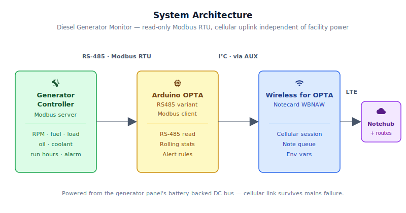
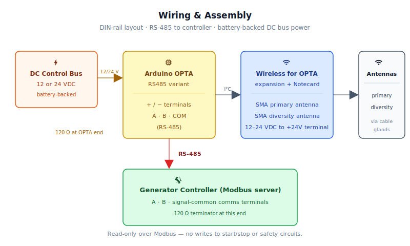
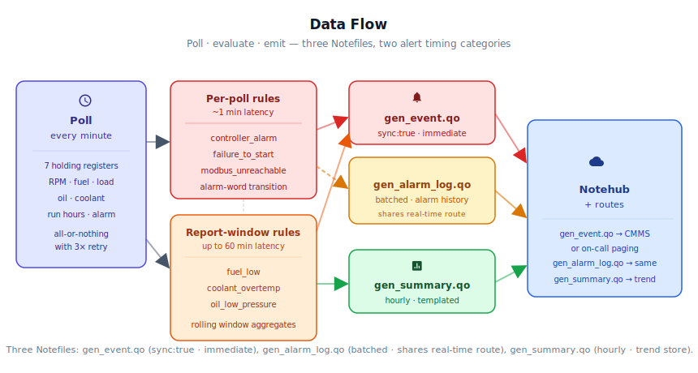

# Legacy Diesel Generator Fleet Performance Uplift

<Note>

This reference application is intended to provide inspiration and help you get started quickly. It uses specific hardware choices that may not match your own implementation. Focus on the sections most relevant to your use case. If you'd like to discuss your project and whether it's a good fit for Blues, [feel free to reach out](https://blues.com/landing-pages/accelerators-contact-us/?accelerator=Legacy%20Diesel%20Generator%20Fleet%20Performance%20Uplift).

</Note>

This project is an [asset performance optimization](https://blues.com/solutions-asset-performance-optimization/) retrofit for operators of standby diesel generators at hospitals, data centers, and industrial sites. The device sits on the DIN rail inside the generator panel, reads the controller's existing Modbus port, and reports run hours, fault codes, fuel level, coolant temperature, oil pressure, and load to the cloud over cellular — with immediate alerts on faults, coolant overtemp, low oil pressure, low fuel, and lost communication. Crucially, it draws from the panel's battery-backed DC control bus and uses an external antenna routed outside the metal enclosure, so the monitoring path stays alive when mains and facility WiFi go dark — which is exactly when a standby generator either starts successfully or doesn't. The hardware is an Arduino OPTA RS485 with a Blues Wireless for OPTA cellular expansion (see §3 for the BOM); the wiring is strictly read-only — no writes to start/stop or safety circuits.

## 1. Project Overview

**The problem.** Standby diesel generators at hospitals, data centers, and industrial sites are among the most important assets on the premises, and among the least observed. The controllers that run them — **DeepSea** (DSE), Woodward, Kohler, Caterpillar, Cummins, and a dozen others — have spoken **Modbus RTU** (Remote Terminal Unit, the most widely deployed industrial serial protocol) for decades. That interface is sitting there, fully populated with fuel level, load percentage, coolant temperature, oil pressure, run hours, and the active alarm register that reflects the controller's current fault state — including, critically, a failure-to-start event when it is asserted. Almost none of it gets read by anyone. The controller reports faults to an annunciator panel in the same room, which is exactly where nobody is when the building is dark and the emergency has already started.

The cost of this information gap is concrete. A standby generator that fails to start during a utility outage is worse than no generator at all — the false sense of protection it provides can delay emergency response. A generator that does start but is running low on fuel, or trending toward coolant overtemp, will fail mid-outage without warning. Run-hour data that never leaves the controller can't be used to schedule preventive maintenance before a critical service interval is missed. These are not exotic failure modes; they happen regularly at facilities that have generators but not generator *monitoring*.

This project closes that gap — for active alarm state, a firmware-observed alarm chronology, and operating data. A [Blues Wireless for OPTA](https://shop.blues.com/products/wireless-for-opta?utm_source=dev-blues&utm_medium=web&utm_campaign=store-link) snapped onto an Arduino OPTA RS485 industrial **PLC** (programmable logic controller) sits on the DIN rail inside the generator panel, polls seven holding registers once per minute over the controller's Modbus port (including the active alarm bitmask), and routes alert events, an hourly alarm-history log, and hourly summaries to [Notehub](https://notehub.io) via cellular. Installation requires new RS-485 wiring to the controller's communications terminals and matching the controller's Modbus serial settings (baud rate, parity, slave address), but involves no writes to start/stop or safety circuits — the firmware is strictly read-only over Modbus. No dependency on the facility network.

## 2. System Architecture



**Device-side responsibilities.** The OPTA's Cortex-M7 host acts as the Modbus RTU **client** (master), polling seven holding registers from the generator controller (the **server** / slave) once per minute over the onboard RS-485 transceiver. The host accumulates rolling hourly statistics in RAM, evaluates three threshold-based alert rules and an alarm-word transition detector locally, and decides whether to emit an event. Queued [Notes](https://dev.blues.io/api-reference/glossary/#note) travel from the host to the Notecard over I²C through the Wireless for OPTA's AUX connector — no modem AT commands, no raw socket management.

**Notecard responsibilities.** The Notecard stores Notes in its on-device queue, establishes the cellular session on the configured [`hub.set`](https://dev.blues.io/api-reference/notecard-api/hub-requests/#hub-set) `outbound` cadence, and flushes any `sync:true` alert Notes immediately. The NOTE-WBNAW also supports WiFi as a hardware capability, but production deployments should rely on cellular and leave WiFi unconfigured — the facility WiFi access point is often offline during exactly the utility failures this monitor exists to observe. The Notecard also handles [environment variable](https://dev.blues.io/guides-and-tutorials/notecard-guides/understanding-environment-variables/) distribution from Notehub — operators can retune thresholds and per-register addresses without reflashing firmware for controller families whose required points are exposed as individually readable 16-bit registers with compatible units; vendor-specific scaling, signedness, and 32-bit fields require production extensions as described in [Limitations](#11-limitations-and-next-steps).

**Notehub responsibilities.** The Notecard manages its own cellular session against the supported carrier networks worldwide via its embedded global SIM and delivers data to [Notehub](https://notehub.io) over the Internet; Notehub ingests events, stores them, and applies project-level [routes](https://dev.blues.io/notehub/notehub-walkthrough/#routing-data-with-notehub). Per-fleet [environment variables](https://dev.blues.io/guides-and-tutorials/notecard-guides/understanding-environment-variables/) let operators retune Modbus register addresses and alert thresholds without reflashing firmware. The shipped firmware performs individually-addressed 16-bit Modbus reads with no register-value scaling; vendor-specific scaling, signed-field handling beyond coolant temperature (which the demo already reads as `int16_t`), and 32-bit register handling require production extensions described in [Limitations](#11-limitations-and-next-steps). See [Smart Fleets](https://dev.blues.io/notehub/notehub-walkthrough/#using-smart-fleet-rules) for organizing devices by controller family or site.

**Routing to the cloud (high level).** Notehub supports HTTP, MQTT, AWS, Azure, GCP, Snowflake, and several other destinations; route setup is project-specific. See the [Notehub routing docs](https://dev.blues.io/notehub/notehub-walkthrough/#routing-data-with-notehub) — this project ships no specific downstream endpoint.

## 3. Technical Summary

**You will have:** A commissioning note in Notehub confirming Modbus connectivity, hourly summaries showing generator status, and immediate alerts on controller faults.

**Minimum prerequisites:** Arduino IDE or `arduino-cli` v1.3+, a generator controller with accessible Modbus port (DeepSea, Woodward, Kohler, Caterpillar, Cummins, or equivalent), baud rate and slave address from the controller's commissioning menu, and a Notehub project.

**Time required:** 45 minutes (hardware assembly + wiring), 15 minutes (firmware + Notehub setup), 5 minutes (first validation). First event arrives in ~3 hours (one Modbus poll + one report boundary).

**Steps:**

1. **Assemble hardware:** OPTA RS485 + Wireless for OPTA on DIN rail, antenna through cable gland, powered from generator panel's battery-backed 12–24 VDC bus (fused, 3 A, per [Wiring and Assembly](#5-wiring-and-assembly) Step 2).
2. **Wire Modbus:** OPTA `A/B/COM` to controller `A/B/COM` with 120 Ω terminators at both ends (OPTA and controller). Use twisted pair, shielded, RS-485 rated.
3. **Flash firmware:** Copy `PRODUCT_UID` from Notehub project settings, paste into `diesel_gen_monitor.ino` line 39. Compile and upload via Arduino IDE, or:
   ```bash
   arduino-cli core install "Arduino Mbed OS Opta Boards"
   arduino-cli lib install "Blues Wireless Notecard" "ArduinoModbus" "ArduinoRS485"
   sed -i '' 's|com.your-company.your-name:diesel_gen_monitor|YOUR_PRODUCT_UID|g' firmware/diesel_gen_monitor/diesel_gen_monitor.ino
   arduino-cli compile --fqbn arduino:mbed_opta:opta_wifi firmware/diesel_gen_monitor/ --upload
   ```
4. **Set Modbus register addresses:** In Notehub, navigate Fleet → Environment. Add variables `reg_engine_rpm`, `reg_fuel_pct`, `reg_load_pct`, `reg_oil_kpa`, `reg_coolant_c`, `reg_run_hours`, `reg_alarm_word` with the correct addresses from your controller's Modbus map. Set `modbus_baud`, `modbus_slave_id`, `modbus_parity`, `modbus_stop_bits` to match the controller's configuration. The device fetches these on the next inbound sync (120 minutes by default; to test immediately, set `inbound` to 1 minutes in `hub.set` on the device).
5. **Validate:** Open Notehub and wait for the device to appear in the project. After the first Modbus poll (1 minutes) and report boundary (60 minutes), you'll see a `gen_summary.qo` note with `data_ok = 1`, fuel level, alarm word, and run status. If `data_ok = 0` on all notes, check wiring, register addresses, baud rate, and slave address against the controller's commissioning menu (see [Validation and Testing](#9-validation-and-testing) / "Modbus first-light").

**Sample Note (gen_summary.qo):** Here is a sample Note this device emits:

```json
{
  "file": "gen_summary.qo",
  "body": {
    "data_ok": 1,
    "fuel_pct": 78.0,
    "load_pct": -1.0,
    "load_pct_peak": -1.0,
    "oil_kpa_mean": -1.0,
    "oil_kpa_peak": -1.0,
    "coolant_c_mean": 24,
    "coolant_c_peak": 24,
    "run_hours": 1847,
    "run_min": 0,
    "stop_min": 60,
    "engine_starts": 0,
    "alarm_word": 0,
    "alarm_word_stale": 0,
    "samples_ok": 60,
    "samples_failed": 0
  }
}
```

**Firmware-observed alarm chronology.** The firmware polls the controller's active alarm bitmask once per `sample_minutes` (default 1 minutes) and fires a `controller_alarm` event on first observed assertion — on a zero→non-zero transition, or immediately at the first valid poll after boot if those bits are already set. Every distinct alarm-word transition — initial assertion, any mid-nonzero change where bits are added or cleared while at least one fault remains active, and the final clearance to zero — is appended to an 8-slot on-device ring buffer (`AlarmHistoryEntry`) and flushed as `gen_alarm_log.qo` at every report boundary, giving operations teams a per-window fault-set chronology. Transient faults that assert and clear entirely between two consecutive polls can still be missed. The controller's own internal timestamped alarm log (vendor-specific multi-register reads that may cover events predating the monitor's installation) is a production extension; see [Limitations](#11-limitations-and-next-steps).

**Why Notecard.** The timing of this deployment is the whole point. The standby generator exists to provide power when mains power fails — which is exactly when the facility's WiFi router also goes dark. A monitoring system that relies on the building's LAN cannot report a failure-to-start at the moment that matters most. Worse, a purely LAN-dependent monitor might be relied on as evidence that everything is fine, right up until the UPS batteries run dry. Cellular with an antenna routed outside the metal generator enclosure provides a communication path that is completely independent of the facility's power and network infrastructure. The cellular path is alive precisely because it draws from the generator panel's own battery-backed DC control bus — the same battery that starts the engine.

<NewToBlues/>

This is the key architectural insight: a well-designed generator panel already has a battery-backed 12–24 VDC control bus whose entire job is to remain live when mains fails. The OPTA and Wireless for OPTA draw from that bus. When the transfer switch opens, when the utility fails, when every office light goes out — the monitor is already running, already on cellular, and already polling the controller at one-minute intervals for exactly the data the facility manager needs.

**Deployment scenario.** A single OPTA RS485 + Wireless for OPTA mounted on the DIN rail inside the generator's main control panel, powered from the panel's existing battery-backed DC control bus, RS-485 wired to the controller's communications port, cellular antenna routed out through a cable gland. RS-485 wiring and Modbus communication-setting matching are required; beyond that, no writes to safety circuits, no OEM cooperation, and no IT involvement.

## 4. Hardware Requirements

| Part | Qty | Rationale |
|------|-----|-----------|
| [Arduino OPTA RS485](https://store.arduino.cc/products/opta-rs485) | 1 | Industrial PLC with onboard RS-485 transceiver, DIN-rail mount, 12–24 VDC supply input. Programmable with Arduino sketches. Hosts the Modbus client and all edge-logic. |
| [Blues Wireless for OPTA (NA, SKU 992-00155-C)](https://shop.blues.com/products/wireless-for-opta?utm_source=dev-blues&utm_medium=web&utm_campaign=store-link) | 1 | Snaps onto the OPTA's right-hand expansion port; adds a [Notecard Cell+WiFi (NOTE-WBNAW)](https://dev.blues.io/datasheets/notecard-datasheet/note-wbnaw/) over I²C. Cellular coverage is regional — pick the matching SKU for the deployment geography (EMEA variant: [SKU 992-00156-C](https://shop.blues.com/products/wireless-for-opta?utm_source=dev-blues&utm_medium=web&utm_campaign=store-link)). |
| External cellular antenna, SMA, ~3m lead (e.g. [SparkFun WRL-14987](https://www.sparkfun.com/products/14987)) | 1 required, 2 recommended | Route the **primary** cellular antenna through a cable gland to the exterior of the metal generator enclosure — rubber-duck antennas inside a steel cabinet will not reliably maintain a cellular session. A **diversity** antenna on the second port improves LTE Cat-1 performance at marginal-signal sites. |
| [Blues Mojo](https://shop.blues.com/products/mojo?utm_source=dev-blues&utm_medium=web&utm_campaign=store-link) | 1 | Bench-only coulomb counter. Spliced inline between the power supply and the Wireless for OPTA input during commissioning to validate Notecard energy per cellular session. Not deployed to the field. |
| 24 VDC DIN-rail supply, ≥10W (e.g. [MeanWell HDR-15-24](https://www.meanwell.com/Upload/PDF/HDR-15/HDR-15-SPEC.PDF)) | 1 | For bench testing only. In field deployments, power the OPTA and expansion from the generator panel's existing battery-backed DC control bus. The [Wireless for OPTA Quickstart](https://dev.blues.io/quickstart/wireless-for-opta-quickstart/) documents supplying 12–24 VDC to the OPTA's power terminals and jumping that same rail to the expansion's power input, confirming the full 12–24 V range is supported end-to-end with no step-up converter required. |

See [§4](#4-hardware-requirements) for the BOM.
| 120 Ω termination resistor | 1–2 | RS-485 termination at each physical end of the bus. Place one at the OPTA and one at the controller. |
| Shielded twisted pair, 22 AWG, RS-485 rated, 1–3 m | 1 | A → A, B → B, shield → controller signal ground between the OPTA and the generator controller. Length depends on panel layout. |
| DIN rail section, ~15 cm | 1 | Mount for the OPTA + expansion. The generator panel likely already has DIN rail. |
| Inline fuse holder with 3 A ATO/ATC blade fuse | 1 | **Required field-installation safety item.** Wired in series with the positive supply lead from the battery-backed DC control bus before the OPTA's `+` terminal (see [Wiring and Assembly](#5-wiring-and-assembly) Step 2). Protects the control bus against a sustained hard fault in the monitoring hardware. 3 A covers the worst-case combined draw of the OPTA host (≤183 mA continuous at 12 V) plus the Notecard expansion's peak LTE burst current at the bus supply input; see [Validation and Testing](#9-validation-and-testing) for commissioning-time fuse-sizing verification. A DIN-rail fused terminal block (such as Phoenix Contact or Weidmüller series) is a cleaner alternative if the panel already accommodates DIN-rail accessories on that supply branch. |

The Blues hardware ships with an active SIM including 500 MB of data and 10 years of service — no activation fees, no monthly commitment.

## 5. Wiring and Assembly



<Warning>

**Safety.** Generator control panels contain hazardous voltages even when the generator is stopped. Installation must be performed by qualified personnel following site lockout/tagout procedures, the generator and controller manufacturer's instructions, and applicable electrical codes. This reference design is **read-only** over Modbus — it does not command start/stop or modify any generator setpoint.

</Warning>

1. **Mount.** Snap the OPTA RS485 onto the DIN rail. Snap the Blues Wireless for OPTA onto the OPTA's right-hand expansion port and connect the supplied solderless AUX connector between the two — this carries the I²C lines that the Notecard uses. Per the [Wireless for OPTA Quickstart](https://dev.blues.io/quickstart/wireless-for-opta-quickstart/), the expansion is not powered through USB-C; use the 12–24 VDC supply rail for any testing beyond the bench.

2. **Power.** In the field: **install the 3 A inline fuse holder (see [Hardware Requirements](#4-hardware-requirements)) in series with the positive supply lead from the battery-backed DC control bus before it reaches the OPTA's `+` terminal.** This fused branch protects the control bus against a sustained hard fault in the monitoring hardware. Wire the OPTA's `+` and `−` terminals to the generator panel's battery-backed DC control bus (12 or 24 VDC as appropriate for the installation), with the fuse in the positive lead. This bus is live from the engine start battery when mains power fails — giving the monitor its independent communication path precisely when the stakes are highest. Jump the same fused supply rail to the expansion's power input terminal so the Wireless for OPTA shares the fused branch. The [Wireless for OPTA Quickstart](https://dev.blues.io/quickstart/wireless-for-opta-quickstart/) documents exactly this wiring pattern for 12–24 VDC supplies. For bench testing: wire the 24 VDC DIN-rail supply's `+V` and `GND` outputs to the OPTA's `+` and `−` terminals in the same way, then power it from mains.

3. **Antennas.** Thread an SMA-female bulkhead lead through a cable gland for the primary cellular antenna and tighten it onto the first antenna port on the Wireless for OPTA. Add a second lead for the diversity antenna if the enclosure layout allows — it meaningfully improves LTE Cat-1 performance in generator rooms deep inside buildings. The bundled rubber-duck antennas are bench-only; steel enclosures kill their signal.

4. **Modbus RS-485 bus.** Wire the OPTA's RS-485 terminals to the generator controller's communication port:
   - OPTA `A (+)` → Controller `A (+)` / `D+` / `TxD+` (terminology varies by vendor)
   - OPTA `B (−)` → Controller `B (−)` / `D−` / `TxD−`
   - OPTA `COM` (RS-485 GND) → Controller's documented RS-485 signal common or ground reference (consult the controller's wiring diagram); treat the cable shield/drain separately per the controller vendor's grounding guidance rather than treating it as an automatic substitute for signal common
   - Place a 120 Ω resistor across `A/B` at each physical end of the cable run — one at the OPTA, one at the controller. With one OPTA and one controller that's two terminators total. Consult the controller's Modbus commissioning guide for its specific terminal names: DeepSea 7000-series uses `+D`, `−D`; Woodward EasyGen labels them `RS485+`, `RS485−`.

5. **Controller Modbus configuration.** Configure the controller as a Modbus RTU **server** (slave); the OPTA is the **client** (master). Match baud rate, parity, stop bits, and slave address in the controller's Modbus setup menu to the firmware defaults (19200 / none / 1 / slave 1), or override via `modbus_*` environment variables on Notehub.

6. **Bench validation.** During first-light testing, splice the Mojo inline between the 24 VDC supply and the Wireless for OPTA power input so it measures the expansion + Notecard subsystem energy per cellular session.

See [§5](#5-wiring-and-assembly) for detailed wiring instructions.

## 6. Notehub Setup

1. **Create a project.** Sign up at [notehub.io](https://notehub.io) and [create a project](https://dev.blues.io/quickstart/notecard-quickstart/notecard-and-notecarrier-pi/#set-up-notehub). Once created, open the project dashboard and look for the **ProductUID** in the top-right corner (it looks like `com:yourcompany:projectname`). Copy it and paste it into `firmware/diesel_gen_monitor/diesel_gen_monitor.ino` line 39, replacing `com.your-company.your-name:diesel_gen_monitor`.

2. **Claim the Notecard.** Power the panel; on the first cellular session the Notecard auto-provisions into your project.

3. **Create a Fleet per controller family.** [Fleets](https://dev.blues.io/guides-and-tutorials/fleet-admin-guide/) group devices for shared configuration and routing. Because register addresses and alarm bitmasks differ across generator controller brands, a practical structure is one fleet per controller vendor: one for DeepSea 7000-series generators, another for Woodward EasyGen, and so on. Fleet-level environment variables encode the register addresses and thresholds for that controller family; individual devices can override with their own values if a site has unusual configuration. Use [Smart Fleets](https://dev.blues.io/notehub/notehub-walkthrough/#using-smart-fleet-rules) to dynamically route devices between fleets based on a device-level tag or environment variable.

4. **Set environment variables.** All variables below are optional; firmware defaults are shown. Values set in Notehub (navigate Fleet → Environment Variables) override the compile-time defaults on the device's next inbound sync — no reflashing required.

   | Variable | Default | Purpose |
   |---|---|---|
   | `sample_minutes` | `1` | Minutes between Modbus polls. |
   | `report_minutes` | `60` | Minutes between summary Notes (`gen_summary.qo`). |
   | `modbus_slave_id` | `1` | Modbus server (slave) address of the generator controller. |
   | `modbus_baud` | `19200` | Bus baud rate; must match the controller's configuration. |
   | `modbus_parity` | `none` | Parity setting: `none`, `even`, or `odd`. |
   | `modbus_stop_bits` | `1` | Stop bits: `1` or `2`. |
   | `reg_engine_rpm` | `768` | Holding-register address for engine speed (RPM). |
   | `reg_fuel_pct` | `769` | Holding-register address for fuel level (0–100%). |
   | `reg_load_pct` | `770` | Holding-register address for generator load (0–100%). |
   | `reg_oil_kpa` | `771` | Holding-register address for oil pressure (kPa). |
   | `reg_coolant_c` | `772` | Holding-register address for coolant temperature (°C, signed). |
   | `reg_run_hours` | `773` | Holding-register address for cumulative engine hours. |
   | `reg_alarm_word` | `774` | Holding-register address for the active alarm bitmask. |
   | `fuel_low_pct` | `25.0` | Fuel level (%) below which `fuel_low` fires. |
   | `coolant_alarm_c` | `95.0` | Coolant temperature (°C) above which `coolant_overtemp` fires. |
   | `oil_low_kpa` | `138.0` | Oil pressure (kPa, ≈20 psi) below which `oil_low_pressure` fires while running. |
   | `alarm_mask_fts` | `0` | Bitmask applied to `alarm_word` to detect failure-to-start events; `0` disables. Set to the decimal value of your controller's FTS bitmask (e.g. `1` for bit 0, `4` for bit 2); `0x`-prefixed hex notation is also accepted (e.g. `0x0001`). |
   | `rpm_running` | `100` | Engine RPM above which the engine is considered running for stat separation and oil-pressure evaluation. |

   > **Controller register-map gotchas.** The register-address defaults are illustrative for a fictional contiguous map. Real controllers differ on: 0-based vs 1-based addressing conventions; per-register scaling (oil pressure may be in 0.1 bar, tenths of kPa, or raw psi depending on the controller and configuration); signedness (coolant temperature is often signed 16-bit); 32-bit run hours that span two consecutive registers with vendor-specific word order; and active-alarm-register vs latched-alarm-history distinction. See [Limitations](#11-limitations-and-next-steps) for the production path.

5. **Configure routes.** Add one [route](https://dev.blues.io/notehub/notehub-walkthrough/#routing-data-with-notehub) for `gen_event.qo` (low-volume real-time alerts, destined for on-call paging or a **CMMS**, computerized maintenance management system) and a second for `gen_summary.qo` (long-term storage and trend analysis). Route `gen_alarm_log.qo` to the same real-time destination as `gen_event.qo` — the two share urgency (fault chronology belongs alongside alert notifications) but `gen_alarm_log.qo` is batched with the periodic outbound sync rather than triggering its own immediate cellular session. Keeping the three [Notefiles](https://dev.blues.io/api-reference/glossary/#notefile) separate at the source lets each fan out to a different destination at a different urgency without filter logic in the route.

## 7. Firmware Design

Single sketch: [`firmware/diesel_gen_monitor/diesel_gen_monitor.ino`](firmware/diesel_gen_monitor/diesel_gen_monitor.ino), with helpers factored into [`diesel_gen_monitor_helpers.h`](firmware/diesel_gen_monitor/diesel_gen_monitor_helpers.h) and [`diesel_gen_monitor_helpers.cpp`](firmware/diesel_gen_monitor/diesel_gen_monitor_helpers.cpp).

**Dependencies:**
- **Arduino Mbed OS Opta Boards** core (install via the Arduino IDE Boards Manager).
- [`Blues Wireless Notecard`](https://github.com/blues/note-arduino) (the `note-arduino` library). Install via the Arduino Library Manager or `arduino-cli lib install "Blues Wireless Notecard"`. Check the [note-arduino releases page](https://github.com/blues/note-arduino/releases) for the latest version.
- [`ArduinoModbus`](https://github.com/arduino-libraries/ArduinoModbus) and [`ArduinoRS485`](https://github.com/arduino-libraries/ArduinoRS485) (official Arduino libraries, install via Library Manager).

### Modules

| Responsibility | Where |
|---|---|
| Notecard `hub.set`, template definition | `notecardConfigure`, `defineTemplates` (`.ino`) |
| Environment-variable fetch and clamping | `fetchEnvOverrides` (`_helpers.cpp`) |
| Modbus serial re-init on env change | `applyModbusSerialIfChanged` (`_helpers.cpp`) |
| Hub cadence re-sync on env change | `applyHubSetIfChanged` (`_helpers.cpp`) |
| Seven-register Modbus poll with retry | `pollGenerator`, `modbusReadOne` (`_helpers.cpp`) |
| Rolling hourly statistics | `RollingStats` struct, `accumulate` (`_helpers.cpp`) |
| Alarm word latch detection, history logging (`logAlarmHistory`/`flushAlarmHistory`), start-event counting | `loop()` (`.ino`) |
| Three threshold rules + edge trigger | `evaluateRules` (`_helpers.cpp`) |
| Immediate-sync alert emission | `sendEvent` (`.ino`) |
| Hourly templated summary | `sendSummary` (`.ino`) |
| Millis-based periodic scheduler (no sleep, host runs continuously on battery-backed bus) | `loop()` (`.ino`) |

### Sensor reading strategy

Seven holding registers are read individually using `modbusReadOne()`. Unlike pump VFD systems where registers are often contiguous and can be read in a single burst, generator controller Modbus maps vary so much between vendors that individual reads with configurable addresses are the only reliable approach. Seven reads at 19200 baud take under 500 milliseconds total — negligible for a one-minute polling cadence.

All seven must succeed in a single attempt before the sample is marked valid. Partial success is silently indistinguishable from valid data with incorrect values, which is worse than no data. If any register read fails, the firmware retries up to three times before declaring the poll a failure and emitting a `modbus_unreachable` event.

### Event payload design

Two [template-backed](https://dev.blues.io/notecard/notecard-walkthrough/low-bandwidth-design#working-with-note-templates) Notefiles. Templates store records as fixed-length binary rather than free-form JSON, shrinking on-wire payload 3–5×. For a fleet of 50 generators sending hourly summaries over a prepaid SIM with a finite data budget, that compression is not optional. Template binary data is decoded by Notehub and displayed as JSON in your browser or API responses.

`gen_summary.qo` (periodic, default hourly) — example shows a standby window where the engine was stopped the entire hour. This is the decoded JSON you'll see in the Notehub dashboard or when retrieving notes via API:

```json
{
  "file": "gen_summary.qo",
  "body": {
    "data_ok": 1,
    "fuel_pct": 78.0,
    "load_pct": -1.0,
    "load_pct_peak": -1.0,
    "oil_kpa_mean": -1.0,
    "oil_kpa_peak": -1.0,
    "coolant_c_mean": 24,
    "coolant_c_peak": 24,
    "run_hours": 1847,
    "run_min": 0,
    "stop_min": 60,
    "engine_starts": 0,
    "alarm_word": 0,
    "alarm_word_stale": 0,
    "samples_ok": 60,
    "samples_failed": 0
  }
}
```

**Schema notes for downstream integrators:**

- `data_ok` — primary validity flag. `1` means at least one successful Modbus poll was completed this window; all measurement fields are valid. `0` means a complete telemetry blackout (all `samples_failed`, no controller contact). When `data_ok = 0`, treat all computed measurement fields (`fuel_pct`, `load_pct*`, `oil_kpa*`, `coolant_c*`, `run_min`, `stop_min`) as undefined. `alarm_word` and `run_hours` are special: rather than emitting zero (which would be indistinguishable from "no alarms" or "zero hours"), the firmware carries forward the last-known values from before the blackout and sets `alarm_word_stale = 1`. See below.
- `alarm_word_stale` — `0` under normal operation (`data_ok = 1`): `alarm_word` comes from this window's Modbus polls. `1` when `data_ok = 0`: `alarm_word` is the last-known value from before the blackout (preserved in firmware across the stats reset) and `run_hours` is the last successfully polled reading. Use `alarm_word_stale` to distinguish "no active alarms this window" from "controller was unreachable; alarm state unknown."
- `-1.0` / `-1` sentinel — appears in running-only fields (`load_pct`, `load_pct_peak`, `oil_kpa_mean`, `oil_kpa_peak`) whenever the engine produced zero running-state samples in the window, i.e., the generator was stopped the entire hour). These fields are only accumulated when the engine is spinning, so a value of `0.0` would be indistinguishable from a true zero reading. When `data_ok = 0` the sentinel extends to all computed measurement fields including `fuel_pct` and `coolant_c_*`.
- `samples_ok` — count of successful Modbus polls in the window (`run_samples + stop_samples`). Combined with `samples_failed`, lets downstream analytics distinguish "generator stopped, telemetry healthy" from "controller unreachable or wiring fault."
- `samples_failed` — count of poll attempts in the window where all three Modbus retry attempts failed. Non-zero here alongside `run_min = 0` is the key signal that monitoring coverage was degraded, not that the generator simply sat idle.

`gen_event.qo` (immediate, `sync:true`). Two variants below — per-poll alert and report-window alert — illustrating how `trigger_val` / `trigger_threshold` differ:

**Per-poll alert** (`failure_to_start`): the freshly-polled sample already explains the trigger, so `trigger_val` and `trigger_threshold` are `-1.0`:

```json
{
  "file": "gen_event.qo",
  "body": {
    "alert": "failure_to_start",
    "engine_rpm": 0,
    "fuel_pct": 82.0,
    "load_pct": 0.0,
    "oil_kpa": 0.0,
    "coolant_c": 22,
    "alarm_word": 1,
    "run_hours": 1847,
    "trigger_val": -1.0,
    "trigger_threshold": -1.0
  }
}
```

**Report-window alert** (`coolant_overtemp`): `trigger_val` is the window peak that crossed the threshold; `coolant_c` is the last-known sample reading (which may have subsided by report time):

```json
{
  "file": "gen_event.qo",
  "body": {
    "alert": "coolant_overtemp",
    "engine_rpm": 1500,
    "fuel_pct": 78.0,
    "load_pct": 85.0,
    "oil_kpa": 312.0,
    "coolant_c": 88,
    "alarm_word": 0,
    "run_hours": 1849,
    "trigger_val": 97.0,
    "trigger_threshold": 95.0
  }
}
```

`gen_alarm_log.qo` (once per `report_minutes` when any alarm event occurred, batched with the periodic outbound sync, **not** template-backed):

```json
{
  "file": "gen_alarm_log.qo",
  "body": {
    "count": 2,
    "events": [
      { "alert": "controller_alarm", "alarm_word": 4, "elapsed_s": 180 },
      { "alert": "alarm_clear",      "alarm_word": 0, "elapsed_s": 420 }
    ]
  }
}
```

**Schema notes for `gen_event.qo` downstream integrators:**

- `trigger_val` / `trigger_threshold` — present in every `gen_event.qo`. For report-window rules (`fuel_low`, `coolant_overtemp`, `oil_low_pressure`), `trigger_val` is the window aggregate or peak that crossed the configured limit (`trigger_threshold`). For per-poll alerts (`controller_alarm`, `failure_to_start`, `modbus_unreachable`), both fields are `-1.0`; the existing sample fields explain the trigger directly.
- The sample fields (`engine_rpm`, `fuel_pct`, `load_pct`, `oil_kpa`, `coolant_c`) carry the last-known polled reading at event time — closest to the trigger for per-poll alerts, machine-state context for report-window alerts. For `coolant_overtemp`, `coolant_c` may be below threshold at report time while `trigger_val` (the window peak) is above it; always use `trigger_val` to confirm the threshold crossing.

**Schema notes for `gen_alarm_log.qo` downstream integrators:**

- `count` — number of entries in this flush (1–8). The ring buffer depth is 8; if more than 8 alarm transitions occur in a single report window, the oldest entries are overwritten.
- `events[].alert` — one of `"controller_alarm"`, `"alarm_clear"`, `"failure_to_start"`, or `"fts_clear"`. Assertions (`controller_alarm`, `failure_to_start`) include the asserted `alarm_word`; clearances (`alarm_clear`, `fts_clear`) carry `alarm_word: 0`. Multiple `controller_alarm` entries with different `alarm_word` values can appear in a single flush when the active fault set changes while at least one bit remains set (e.g., a second fault asserts before the first clears, or one of several active faults clears before the others). Each entry records the exact bitmask at that poll — read them in `elapsed_s` order for the full per-window fault-set chronology.
- `events[].elapsed_s` — seconds since device boot (`millis()/1000`) at event time. Use the Notehub-stamped note timestamp for wall-clock time; `elapsed_s` gives relative timing between entries within one flush.
- `gen_alarm_log.qo` is emitted only when at least one alarm event occurred in the window. Windows with no alarm transitions produce no note. Route it to the same real-time channel as `gen_event.qo` for a complete fault chronology.

### Sync and power strategy

The OPTA + expansion draws continuously from the generator panel's battery-backed DC control bus — host MCU sleep is not the primary design concern here; bus efficiency and data budget are. The Notecard runs in [`hub.set`](https://dev.blues.io/api-reference/notecard-api/hub-requests/#hub-set) `periodic` mode with `outbound` equal to `report_minutes` (default 60 minutes) and `inbound` at twice that. Summary Notes accumulate in the on-device queue and ship in a single cellular session per hour. Alert Notes set `sync:true` and ship within the session-establishment window, typically 15–60 seconds after the trigger condition is detected, regardless of where the outbound timer stands.

**Battery autonomy tradeoff.** The always-on OPTA host is the dominant continuous load on a battery whose primary job is engine starting and control-circuit sustain during a mains failure. The OPTA RS485 draws 0.6–2.2 W at its supply voltage — roughly 50–183 mA at 12 V or 25–92 mA at 24 V. A 40 Ah start battery at worst-case 12 V draw (~183 mA) sustains the monitor for approximately 218 hours (~9 days) without any charge input; at best-case draw the same battery lasts roughly 800 hours. A 100 Ah battery scales proportionally. In most installations the panel's trickle charger tops up the battery continuously and any generator run event replenishes it further, so monitoring draw alone is unlikely to exhaust a healthy battery under normal site conditions. However, sites that anticipate multi-day utility outages without generator exercise or panel charging should verify battery autonomy by measuring actual host current (see [Validation](#9-validation-and-testing)) and comparing it to the site's rated battery capacity. See [Limitations](#11-limitations-and-next-steps) for production sizing guidance.

### Retry and error handling

- The first `hub.set` in `notecardConfigure` uses `notecard.sendRequestWithRetry()` with a 5-second window, defending against the cold-boot I²C race where the host MCU comes up before the Notecard is ready to respond.
- Modbus reads retry up to 3× per cycle. If all three fail, the firmware skips the sample, emits a `modbus_unreachable` event Note immediately (so commissioning wiring problems surface at first light), and then rate-limits subsequent `modbus_unreachable` events to once per hour — a generator powered down for scheduled service should not flood the event log.
- Alarm-word monitoring uses per-alert latch flags rather than raw alarm-word comparisons. A fault that stays asserted for hours fires one `controller_alarm` event; the latch blocks re-firing while the condition persists and rearms only when the word clears. Alarm fatigue is the enemy of generator monitoring.
- `fetchEnvOverrides()` runs on every **sample interval** (default every 1 minutes) and again at every **report boundary**. This re-reads the Notecard's local environment-variable cache, but that cache is only refreshed when Notehub delivers an inbound sync. The Notecard's `inbound` cadence is configured to `report_minutes * 2` (120 minutes at the default `report_minutes = 60`), so the worst-case propagation delay from a Notehub env-var change to the device is up to one full `inbound` interval (120 minutes by default). Once an inbound sync occurs and the cache is updated, the new values take effect within one sample period. The one exception is `sample_minutes`: a new value is stored in `g_pending_sample_minutes` and promoted to the active cadence only when the current window closes with a confirmed `note.add`, ensuring `run_min` / `stop_min` always reflect one consistent cadence per window. At the report boundary, `applyHubSetIfChanged()` re-issues `hub.set` if `report_minutes` changed, keeping the Notecard's outbound cadence in sync with the local summary cadence.

### Key code snippet 1: latch-based alarm detection, retry-on-send-failure, and alarm history logging

The alarm register is checked on every successful poll. Detection is **latch-based**, not transition-gated: the condition is evaluated against the per-alert latch flags (`g_active_controller_alarm`, `g_active_fts`) rather than against a change in the stored alarm word. This means that if `sendEvent()` fails — transient I²C hiccup, Notecard not yet ready — the latch stays `false` and the alert is automatically retried on every subsequent sample while the fault remains asserted. Once the note is queued successfully the latch blocks re-firing, so a sustained fault still emits only one event per asserted-alarm period. `g_current_alarm_word` is updated unconditionally on every sample, independently of the latch state, so the summary Note always carries the freshest alarm word.

History logging captures every distinct `alarm_word` value, not just the initial assertion. A separate `g_alarm_logged_controller` / `g_alarm_logged_fts` flag tracks whether the first entry for a given assertion period has been written; the initial detection logs exactly once through that gate. While the alarm word remains non-zero, any subsequent poll that returns a *different* nonzero value — bits added as a second fault asserts, or one of several bits cleared while others persist — is logged immediately as an additional `controller_alarm` entry with the updated bitmask. No new `sendEvent()` is triggered for these mid-nonzero changes; one alert per assertion period avoids alarm fatigue on gradually-evolving fault sets. Decoupling history-logged state from event-queued state means that when `sendEvent()` fails and the latch stays `false`, the next retry re-calls `sendEvent()` but does **not** re-log the initial entry — without this separation, send retries would accumulate duplicate entries, corrupting the chronology and evicting later events from the 8-slot buffer. The matching clearance (`alarm_clear` / `fts_clear`) is logged once when the alarm word returns to zero, gated on the history flag rather than the event-queued latch, so a clearance entry is always paired with its assertion even when the note never queued successfully.

**Boot-seeding behavior.** On the *first* valid poll after boot or a watchdog reset, the firmware checks the alarm word immediately and emits `controller_alarm` (and `failure_to_start` if `alarm_mask_fts` is configured) if those bits are already asserted — without waiting for a zero-to-nonzero transition that may never occur on this boot session. This closes the gap where a monitor rebooted mid-outage would otherwise suppress the pre-existing fault. The boot-seeding block calls `logAlarmHistory()` and sets the corresponding `g_alarm_logged_*` flag so the main detection loop does not add a second history entry on the same assertion period if `sendEvent()` fails at boot.

```cpp
// Three-state detection: 0→nonzero (assertion), nonzero→different-nonzero
// (fault-set change while still alarming), nonzero→0 (clearance).
// Events are latch-based: sendEvent() fires once per assertion period; failed
// sends retry automatically while the condition persists without duplicate entries.
// History logs every distinct alarm_word value for a complete fault-set chronology.
if (s.alarm_word != 0 && !g_active_controller_alarm) {
    if (!g_alarm_logged_controller) {
        logAlarmHistory("controller_alarm", s.alarm_word);  // log once on first observation
        g_alarm_logged_controller = true;
    }
    if (sendEvent("controller_alarm", &s)) {
        g_active_controller_alarm = true;   // latch: suppress repeats until clear
    }
} else if (s.alarm_word != 0 && g_active_controller_alarm &&
           s.alarm_word != g_current_alarm_word) {
    // Fault bits changed while at least one remains asserted: log the updated
    // bitmask to capture the evolving fault set. No sendEvent() — one alert
    // per assertion period.
    logAlarmHistory("controller_alarm", s.alarm_word);
} else if (s.alarm_word == 0) {
    if (g_alarm_logged_controller) {
        logAlarmHistory("alarm_clear", 0);  // record clearance once
    }
    g_active_controller_alarm = false;      // rearm for the next assertion
    g_alarm_logged_controller = false;      // rearm history flag
}

// Failure-to-start: tracks the FTS bitmask independently, same latch semantics.
if (g_alarm_mask_fts != 0) {
    bool fts_active = ((s.alarm_word & g_alarm_mask_fts) != 0);
    if (fts_active && !g_active_fts) {
        if (!g_alarm_logged_fts) {
            logAlarmHistory("failure_to_start", s.alarm_word);  // log once on first observation
            g_alarm_logged_fts = true;
        }
        if (sendEvent("failure_to_start", &s)) {
            g_active_fts = true;
        }
    } else if (!fts_active) {
        if (g_alarm_logged_fts) { logAlarmHistory("fts_clear", 0); }
        g_active_fts = false;               // rearm when FTS bits clear
        g_alarm_logged_fts = false;         // rearm history flag
    }
}
```

### Key code snippet 2: immediate-sync alert with trigger fields

`sync:true` instructs the Notecard to bypass the outbound interval and open a cellular session immediately. The sample source and trigger fields differ by event type:

- `controller_alarm` and `failure_to_start` pass the freshly-polled sample directly — closest available reading to the moment the alarm was detected. `trigger_val` and `trigger_threshold` default to `-1.0` (not applicable).
- `modbus_unreachable` carries `g_last_known_sample` when a valid prior sample exists, or null/zero fields if no successful poll has been completed yet.
- Report-boundary threshold rules (`fuel_low`, `coolant_overtemp`, `oil_low_pressure`) pass `g_last_known_sample` as machine-state context **plus** `trigger_val` (the window aggregate or peak that crossed the threshold) and `trigger_threshold` (the configured limit). This makes every report-window alert self-explaining: a `coolant_overtemp` event shows `trigger_val: 97.0` and `trigger_threshold: 95.0` even when the last-known `coolant_c` sample has already subsided below 95°C.

```cpp
J *req = notecard.newRequest("note.add");
JAddStringToObject(req, "file", "gen_event.qo");
JAddBoolToObject  (req, "sync", true);
J *body = JAddObjectToObject(req, "body");
JAddStringToObject(body, "alert",             "fuel_low");
JAddNumberToObject(body, "fuel_pct",          s->fuel_pct);     // last-known sample
JAddNumberToObject(body, "engine_rpm",        s->engine_rpm);
JAddNumberToObject(body, "alarm_word",        s->alarm_word);
JAddNumberToObject(body, "run_hours",         s->run_hours);
JAddNumberToObject(body, "trigger_val",       fuel_mean);        // window mean that fired the rule
JAddNumberToObject(body, "trigger_threshold", g_fuel_low_pct);   // configured threshold
notecard.requestAndResponse(req);
```

### Key code snippet 3: oil-pressure rule (running-only, with trigger fields)

Oil pressure is only meaningful when the engine is spinning. The rule is skipped entirely if the engine produced zero running-state samples in the window — preventing constant false positives on a generator sitting in standby for days at a time. `trigger_val` carries the window mean that crossed the threshold; `trigger_threshold` is the configured limit. The last-known sample fields provide current machine-state context.

```cpp
if (stats.run_samples > 0) {
    float oil_mean = stats.oil_sum / (float)stats.run_samples;
    if (oil_mean < g_oil_low_kpa) {
        if (!g_active_oil_low) {
            if (sendEvent("oil_low_pressure", &g_last_known_sample,
                          oil_mean, g_oil_low_kpa)) {
                g_active_oil_low = true;
            }
        }
    } else {
        g_active_oil_low = false;
    }
}
```

## 8. Data Flow



**Collected.** Every `sample_minutes` (default 1 minutes): engine RPM, fuel level %, generator load %, oil pressure kPa, coolant temperature °C, cumulative run hours, active alarm bitmask. Each valid poll also updates the running/stopped sample counts and, on an RPM threshold crossing, increments the engine-start counter.

**Summarized.** Every `report_minutes` (default 60 minutes): mean fuel level; mean and peak load and oil pressure (running-state samples only); mean and peak coolant temperature; cumulative run hours; minutes running and stopped this window; engine start count; latest alarm-word polled in the window (non-zero whenever any alarm was active at the time of the final sample in the window, a fault sustained across a report boundary will appear as non-zero in the next summary).

**Transmitted.**
- `gen_summary.qo` — once per `report_minutes`, queued and batched with the Notecard's periodic outbound sync. Template-encoded to minimize on-wire size.
- `gen_event.qo` — emitted immediately with `sync:true` on any rule trigger. One event per condition transition, not one per sample interval.
- `gen_alarm_log.qo` — once per `report_minutes` when any alarm-word transition (assertion or clearance) occurred in the window. Full JSON (not template-encoded; array length varies). Batched with the periodic outbound sync. Omitted for windows with no alarm activity.

**Routed.** Notehub fans `gen_event.qo` and `gen_alarm_log.qo` to the real-time channel the operator uses (CMMS ticket creation, on-call paging, building management system webhook, etc.) — `gen_event.qo` arrives immediately via `sync:true`; `gen_alarm_log.qo` is batched with the next periodic outbound sync and delivers the per-window alarm chronology that complements the event stream. Both should share the same downstream destination so fault chronology and event notifications land in the same place. `gen_summary.qo` routes separately to a long-term store for fleet trend analysis.

**Triggers.** Six conditions generate alert events, split into two timing categories:

*Per-poll alerts* — evaluated on every successful Modbus read; latency is approximately one `sample_minutes` interval (default 1 minutes):
- `controller_alarm` — the active alarm word is first observed non-zero: on a zero→non-zero transition, or immediately at the first valid poll after boot if already asserted. One event fires per asserted-alarm period; the flag rearms when the alarm word returns to zero. Catches any fault condition the controller's alarm map defines — failure-to-start, under/over voltage, over-speed, high temperature, low coolant level, and others. Every assertion and clearance is also appended to the local alarm-history ring buffer and flushed as `gen_alarm_log.qo`.
- `failure_to_start` — a subset of `controller_alarm` targeting the specific bit(s) the operator identifies via `alarm_mask_fts`. Disabled by default; configure per controller family.
- `modbus_unreachable` — all three Modbus retry attempts failed. First occurrence fires immediately; subsequent occurrences are rate-limited to once per hour.

*Report-window alerts* — evaluated once per `report_minutes` (default 60 minutes) against the window's rolling aggregates; default latency is up to one full report interval from the triggering condition:
- `fuel_low` — window-mean fuel level below `fuel_low_pct`. Edge-triggered; rearms when fuel rises above threshold (e.g., after a refill).
- `coolant_overtemp` — window-peak coolant temperature above `coolant_alarm_c`. Peak, not mean, because an overheat event can spike and resolve within a single report window.
- `oil_low_pressure` — window-mean oil pressure below `oil_low_kpa` **while the engine was running**. Only evaluated when `run_samples > 0`.

## 9. Validation and Testing

**Expected steady-state behavior.** A correctly-commissioned generator in standby should produce one `gen_summary.qo` event per hour with `run_min = 0`, `engine_starts = 0`, and `alarm_word = 0`. During a weekly exercise test (typically 30 minutes), the summary windows that straddle the test will show non-zero `run_min`, `engine_starts = 1` in the window that captured the start, and non-zero `load_pct` and `oil_kpa_mean`. Verifying that pattern during the first scheduled test after installation is the primary validation step.

**Modbus first-light.** Before connecting to the real controller, run the firmware against a USB-to-RS-485 adapter and a software Modbus simulator (Modbus Mechanic, ModRSsim2, or equivalent) wired to the OPTA's RS-485 terminals. Confirm the seven register reads arrive at the expected addresses. Note that the firmware's serial output shows Modbus retry failures and Notecard debug traffic only — it does not print decoded register values. To inspect register contents during bench bring-up, either temporarily add `Serial.print` statements inside `pollGenerator()` or verify the data by watching `gen_summary.qo` Notes appear in Notehub after the first report boundary.

**Fault simulation.** With a real controller connected, temporarily set `fuel_low_pct` to `100` in the fleet's environment variables — on the next inbound sync the device will pull the new value, and the subsequent report boundary will trip `fuel_low` regardless of actual fuel level. Verify the event appears in Notehub within the session-establishment window. Restore the original value to rearm.

**Power validation with Mojo.** Spliced inline between the 24 VDC supply and the Wireless for OPTA power input, the [Mojo](https://dev.blues.io/datasheets/mojo-datasheet/) reports cumulative mAh at 1% accuracy over its Qwiic connector. This placement covers the Wireless for OPTA expansion subsystem (Notecard plus the expansion's onboard regulators and I²C glue) — it does **not** measure the OPTA host, which is powered directly from the same control bus through its own `+/−` supply terminals. The Notecard-subsystem figures below are from the [NOTE-WBNAW datasheet](https://dev.blues.io/datasheets/notecard-datasheet/note-wbnaw/) and the [Notecard low-power design guide](https://dev.blues.io/notecard/notecard-walkthrough/low-power-firmware-design/):

| Phase | Notecard subsystem current (Mojo measurement) |
|---|---|
| Notecard idle (radio off, between syncs) | ~8–18 µA @ 5V |
| Modem active (cellular session, LTE Cat-1) | ~250 mA average, ≤2 A peak bursts |
| WiFi active (hardware capability; leave unconfigured in production) | ~80 mA average |

The OPTA host runs continuously — the firmware's millis-based scheduler keeps the Cortex-M7 awake with no sleep state. The [OPTA RS485 datasheet](https://docs.arduino.cc/hardware/opta/) specifies 0.6–2.2 W at 24 VDC (approximately 25–92 mA at 24 V; roughly 50–183 mA at 12 V), which is the dominant steady-state load on the control bus and must be measured separately. To do so, splice an ammeter or a second Mojo between the control-bus supply and the OPTA's `+/−` terminals during bench bring-up.

Confirm on the Mojo trace: idle current between syncs is in the µA range. During hourly sync sessions the modem averages ~250 mA but may spike to ≤2 A in brief RF bursts — this is normal LTE Cat-1 behavior, not a fault. Rather than watching for a hard instantaneous-current ceiling, validate **energy per session**: a healthy hourly sync should accumulate only a few mAh on the Mojo counter; the idle periods between syncs should show negligible accumulation. Alert events (`sync:true`) produce additional modem sessions between the scheduled syncs, each with the same average-then-burst current profile. If the device shows continuous elevated current with no idle periods, the Notecard's periodic mode is not configured correctly. See the [Notecard low-power design guide](https://dev.blues.io/notecard/notecard-walkthrough/low-power-firmware-design/) for the conditions required to reach the lowest-power idle state.

In the field, the generator's start battery sustains the control bus through a mains failure, but it is not an infinite reservoir. The dominant continuous load is the OPTA host (0.6–2.2 W per the datasheet); the Notecard expansion's 8–18 µA idle draw is negligible alongside it. Use the ammeter or second Mojo measurement described above to record actual OPTA host current during commissioning, then compare it against the site's rated battery capacity to bound worst-case autonomy — particularly relevant at 12 V sites with smaller batteries. The 3 A fuse required in [Hardware Requirements](#4-hardware-requirements) and installed per [Wiring and Assembly](#5-wiring-and-assembly) Step 2 is sized for worst-case 12 V operation: the OPTA host draws up to ≤183 mA continuous and the Notecard expansion can burst to ≤2 A at the bus input, for a combined worst-case total of ≤2.2 A. To verify sizing at your specific installation, add the measured OPTA supply current to the peak Notecard-expansion burst current (≤2 A) from the Mojo trace and confirm the combined total remains below the installed fuse rating. Sites with 24 V supplies see proportionally lower bus currents, making the 3 A rating conservative; do not omit the fuse.

## 10. Troubleshooting

**Device appears in Notehub but all `gen_summary.qo` notes show `data_ok = 0`**
- Modbus polling failed on all retries. Check wiring: are OPTA `A/B/COM` correctly wired to the controller's corresponding terminals? Use a multimeter to verify continuity.
- Baud rate mismatch. Compare `modbus_baud`, `modbus_parity`, and `modbus_stop_bits` in Notehub (Fleet → Environment) against the controller's Modbus commissioning menu. They must match exactly.
- Slave address mismatch. Verify `modbus_slave_id` in Notehub matches the controller's configured address (often found in Modbus or network setup menus, defaults to 1).
- Missing or incorrect termination resistors. Confirm 120 Ω resistors are installed at both physical ends of the RS-485 cable run — at the OPTA and at the controller.
- First-light validation: before commissioning on the real controller, test with a USB-to-RS-485 adapter and a Modbus simulator (Modbus Mechanic, ModRSsim2) to confirm the firmware's Modbus reads work at all (see [Validation and Testing](#9-validation-and-testing)).

**Register addresses appear wrong or show `−1.0`**
- Wrong register addresses. The defaults (768–774) are illustrative for a fictional map. Look up your **controller vendor and model** in its Modbus datasheet and set `reg_engine_rpm`, `reg_fuel_pct`, etc. in Notehub (Fleet → Environment) to the correct addresses for your specific controller.
- `-1.0` sentinels mean the engine was stopped the entire report window (normal for a standby generator). They appear in running-only fields (`load_pct`, `oil_kpa_mean`). A fuel level of `-1.0` or `data_ok = 0` indicates a communication failure, not a sensor issue.

**Antenna connectivity issues**
- Rubber-duck antennas don't work inside metal generator enclosures. Route the primary cellular antenna (SMA) through a cable gland to the outside. Add a second diversity antenna if signal is marginal.
- Antenna not seated or damaged. Verify the SMA connector is tightened fully onto the antenna port.

**Alert events not appearing in Notehub**
- Environment variables not applied. Changes set in Notehub take effect on the device's next **inbound sync**, not immediately. The default `inbound` cadence is 120 minutes; to test quickly, temporarily set it to 1 minutes via `hub.set` on the device or via a direct Notehub API call, then revert after testing.
- Rule thresholds not realistic. If `fuel_low_pct` is set to 100, the device will trigger `fuel_low` on every summary. Verify threshold values match your site's expectations (e.g., `fuel_low_pct = 25.0` for "alert when fuel falls below 25%").

## 11. Limitations and Next Steps

**Simplified for this reference design:**

- **Register addresses, scaling, and signedness.** The defaults are illustrative for a fictional contiguous map. Each controller vendor publishes its own Modbus map; commissioning a real site means looking up actual addresses, scaling factors (oil pressure may be in 0.1 bar, hundredths of kPa, or raw integer psi), signedness (coolant temperature is already read as signed `int16_t` in the demo; oil pressure and other fields on some controllers may also be signed and require case-by-case handling), word counts (run hours on DeepSea 7000-series is a 32-bit value spanning two consecutive registers), and addressing convention (0-based wire-level vs 1-based / Modicon "40001" notation). The shipped firmware reads seven individually-addressed 16-bit registers with no scaling — production builds need vendor-specific handling.
- **Firmware-observed alarm history, not controller-internal log.** The firmware tracks its own alarm-history log: every alarm assertion and clearance it detects is appended to an 8-slot ring buffer and flushed as `gen_alarm_log.qo` at each report boundary (see §6 and §7). What remains a future enhancement is reading the controller's own internal timestamped fault log — most production controllers maintain a multi-register circular buffer of events that can include faults that pre-date the monitor's installation. Extracting that log requires a vendor-specific read sequence; see Production next steps below.
- **Sampled alarm detection, not latched.** The alarm word is polled once per `sample_minutes` (default 1 minutes). A transient fault that asserts and clears entirely between two consecutive polls will be invisible to the firmware. Controllers that do not latch faults internally require a short enough polling cadence to catch the briefest expected fault pulse; for controllers that do latch faults, reading the alarm history log (above) is the robust alternative.
- **Failure-to-start detection requires operator configuration.** The `alarm_mask_fts` variable is `0` (disabled) by default because bit positions differ across controller families. A DeepSea 7000-series uses different alarm bits than a Woodward EasyGen. The operator must look up their controller's alarm register map and set the appropriate mask. Until configured, failure-to-start events are caught by the generic `controller_alarm` alert.
- **Single controller per OPTA.** The firmware reads one Modbus slave ID. A facility with multiple generators requires one OPTA + Wireless for OPTA per generator, or a firmware extension to round-robin across slave IDs on the same bus (with per-slave stat tracking).
- **Weekly test coverage.** Hourly summaries may straddle a short weekly exercise test. A 30-minute test that starts and finishes within a single 60-minute summary window will appear in that window's data, but the start event and any transient fault that clears during the test will be visible only via the event Notefile. Production deployments could add logic to emit a summary at engine stop (end of each run event) for complete run-level granularity.
- **No Modbus writes.** The firmware is read-only. Sending remote start commands to the generator is out of scope — that requires safety analysis, E-stop wiring, and potentially functional-safety certification.
- **Continuous OPTA host draw on the start battery.** The firmware runs no sleep state — the OPTA's Cortex-M7 stays continuously awake, drawing 0.6–2.2 W on the battery-backed control bus. Panel trickle chargers handle this load under normal operation, but a site that experiences extended utility outages without generator exercise or charger input should measure the actual OPTA supply current during commissioning and verify that the site's battery capacity provides acceptable autonomy. At 12 V and worst-case 2.2 W draw (~183 mA), a 40 Ah battery sustains the monitor alone for roughly 9 days; at best-case draw the same battery extends to ~33 days. Larger batteries and 24 V systems extend autonomy proportionally.

**Production next steps:**
- Vendor-specific register-map builds: DeepSea 7000/8000, Woodward EasyGen 3000, Kohler RDC, Caterpillar EMCP 4, Cummins PowerCommand — each with the correct addresses, scaling, signedness, and 32-bit run-hour handling for that family.
- Controller-internal alarm log readout per vendor spec (DeepSea Event Log registers, Woodward EasyGen fault record, Kohler RDC history block, etc.), supplementing the firmware-observed history with timestamped events that pre-date the monitor's installation or that occurred while the firmware was offline.
- Per-controller baseline learning: track run hours and load history per device to detect drift toward scheduled service intervals rather than waiting for a threshold breach.
- Over-the-air firmware updates via [Notecard Outboard Firmware Update](https://dev.blues.io/notehub/host-firmware-updates/notecard-outboard-firmware-update/) so a service company can push a new register-map build to an entire fleet without a truck roll. (Note: ODFU on the OPTA requires AUX wiring that Wireless for OPTA does not currently break out; local USB-C update is the current path for host firmware changes.)
- Fuel consumption rate: derive from the rate of change in fuel level across run events. Combined with load data, this gives a fuel-per-kWh efficiency figure that accumulates across the maintenance history.
- Automatic weekly test verification: flag a `test_not_detected` event if no engine start is observed in a configurable rolling window, catching test skips before an audit or inspection.

## 12. Summary

The controller sitting inside that generator enclosure has been measuring fuel level, coolant temperature, oil pressure, load, run hours, and active alarm state for years — the data has always existed. What was missing was a communication path that works when the data matters most: when mains power fails, when the facility's network is dark, and when the generator either starts successfully or fails to do so in the next thirty seconds. An OPTA RS485 + Blues Wireless for OPTA mounted on the DIN rail, powered from the generator's own battery-backed control bus, provides exactly that path — a cellular uplink that is structurally independent of facility power and completely indifferent to whether the WiFi router is working. The same Modbus interface that was installed for local diagnostics now provides real-time remote visibility, alarm alerting, and the run-hour and load history needed to get ahead of maintenance intervals. Weekly exercise tests leave a clear signature in the hourly summaries — `engine_starts`, `run_min`, `load_pct`, and `oil_kpa_mean` all show up in the window that captured the test, so a facility manager can review test outcomes without being on site. Automatic detection of a missed test (flagging `test_not_detected` when no start is observed in a configurable rolling window) is a planned next step; see [Limitations](#11-limitations-and-next-steps). The generator doesn't change. Only the information does.
