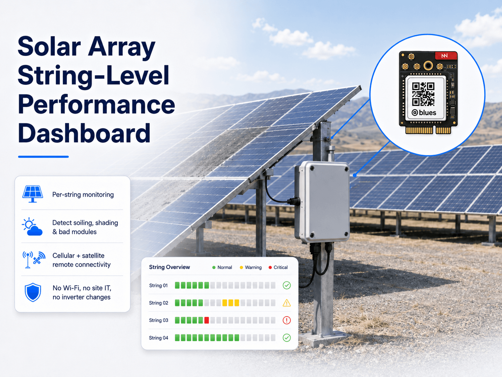
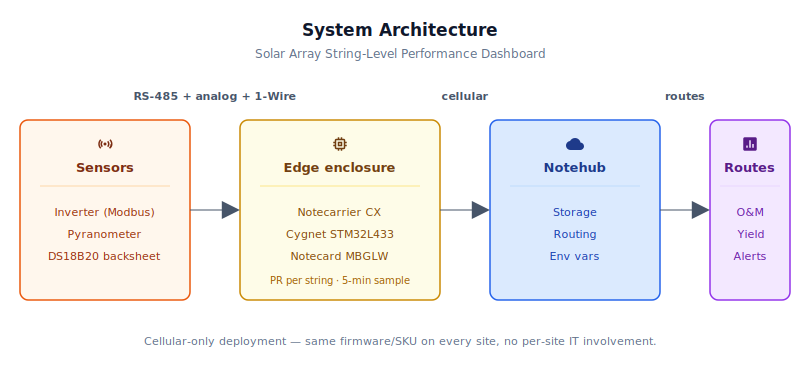
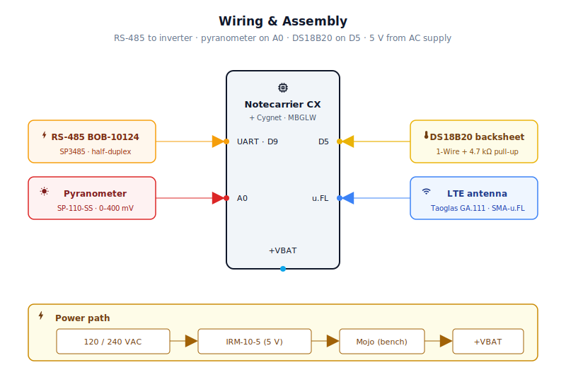

# Solar Array String-Level Performance Dashboard



<Note>

This reference application is intended to provide inspiration and help you get started quickly. It uses specific hardware choices that may not match your own implementation. Focus on the sections most relevant to your use case. If you'd like to discuss your project and whether it's a good fit for Blues, [feel free to reach out](https://blues.com/landing-pages/accelerators-contact-us/?accelerator=Solar%20Array%20String-Level%20Performance%20Dashboard).

</Note>

This project is an [asset performance optimization](https://blues.com/solutions-asset-performance-optimization/) reference design that turns a solar array into a per-string, continuously-monitored asset — catching soiling, shading, and bad modules from wherever the array happens to be, without WiFi, without site IT involvement, and without touching the existing inverter.

## 1. Project Overview

**The problem.** Utility-scale and large commercial-and-industrial (C&I) solar installations routinely bleed 3–8% of annual production to three mundane, entirely preventable causes: soiling (dust, bird droppings, pollen), partial shading (a branch that grew six inches over winter, a newly-installed HVAC unit on a flat roof), and a single degraded or failed module in a series string. None of these losses are invisible — they all have distinctive electrical signatures in the per-string DC current and voltage data. The problem is that almost nobody reads that data in real time.

A modern string inverter or combiner box already knows, at the register level, exactly how much DC current and voltage each string is producing. What it doesn't have is a network path off the array and into the asset manager's dashboard. The maintenance tech has to show up on-site with a laptop and a Modbus cable to pull that data, which is exactly what doesn't happen until something breaks badly enough to trigger a service ticket. The result is months of invisible partial production loss that neither the owner nor the O&M (operations and maintenance) contractor can see until the quarterly energy report shows a yield gap.

This project adds that missing network path. It reads per-string DC voltage and current from a Modbus RTU source, typically a multi-MPPT string inverter where each MPPT input tracks one string — every five minutes, reads the irradiance from a pyranometer (a calibrated instrument that measures incident solar radiation in watts per square meter, W/m²) and the panel temperature from a backsheet probe, and computes a **Performance Ratio** (**PR**) — the ratio of actual string power to the expected power given current irradiance and temperature — for each string independently. The root-cause hypothesis (shading, soiling, string fault) depends on having an independent operating voltage reading per string; multi-MPPT inverters implementing the [SunSpec Model 160 Multiple MPPT](https://sunspec.org/sunspec-modbus-specifications/) register model provide this signal set. See [§11](#11-limitations-and-next-steps) for hardware compatibility and the implications for deployments where only per-string current is available from the monitored device. Strings that fall below a configurable PR threshold get an immediate alert with a root-cause hypothesis. When a string's PR recovers above the threshold, the device locally rearms the alert — the internal underperformance flag is cleared so a subsequent degradation fires a fresh event, but no recovery Note is sent to the [Blues Notehub](https://blues.com/notehub/) cloud service. Every hour a summary Note records the per-string window means and the array-level shared-reference irradiance and module temperature for trend analysis.

**Why Notecard.** Solar arrays sit on rooftops, in open fields, and under parking canopies — three of the places where WiFi ranges the least and site IT involvement is the highest hurdle. A rooftop system at a strip mall isn't going to get a permanent AP installed on the ballast tray. A ground mount in a rural field has no building nearby. A carport canopy shared by a retail parking lot has a network owned by the tenant's coffee franchise, not the solar O&M contractor. Cellular removes every one of those constraints. The Notecard Cell+WiFi variant ships with a prepaid global SIM and registers on the cellular network automatically — no SIM activation form, no per-site IT discussion, and no router credentials to manage. The WiFi radio is present in the hardware but is not used in this build: a metal NEMA 4X enclosure substantially attenuates WiFi signals, and the firmware explicitly clears any previously stored WiFi credentials at first boot via `card.wifi` — this ensures cellular-only operation even on a reused or previously provisioned Notecard rather than relying on an assumption about the device's prior state. For a portfolio O&M operator managing dozens of customer sites, the single most valuable thing about cellular-first IoT is that the same firmware and SKU deploys identically on site one and site forty-three. There is no site-specific network configuration at all.

<NewToBlues/>

**Deployment scenario.** A metal NEMA 4X enclosure mounted on or near the combiner box or string inverter, powered from the array's AC output via a compact AC/DC converter. Three cables exit the enclosure: one RS-485 shielded pair to the combiner's Modbus port, one pair for the pyranometer, and the DS18B20 backsheet temperature probe cable routed to a representative panel in the array. No inverter modification and no plant-network involvement required.

## Before You Start — Critical Constraints

**Per-string independent voltage required.** This firmware reads a [V, I] register pair per string and classifies root causes by comparing each string's operating voltage and current to the fleet mean. Multi-MPPT inverters (implementing [SunSpec Model 160 Multiple MPPT](https://sunspec.org/sunspec-modbus-specifications/)) expose per-MPPT voltage and current; these work perfectly. Traditional string combiners aggregate multiple strings onto a shared DC bus and expose only per-string current, not per-string voltage — against a combiner-only source, shading root-cause classification will never fire. See [§11 Limitations](#11-limitations-and-next-steps) for details.

**Maximum 4 strings supported.** The compile-time constant `MAX_STRINGS = 4` fits the STM32L433's 64 KB SRAM budget. Scaling beyond 4 requires revalidating static memory footprint and is untested.

**Modbus register map is a demo.** The firmware reads contiguous holding-register pairs `[V, I, V, I, …]` with fixed scaling. Real inverters (SMA SunnyBoy, Fronius Symo, Huawei SUN2000, etc.) have vendor-specific register maps, addressing conventions, and scaling. Production deployments require a vendor-specific firmware build or careful manual register validation (see Modbus first-light in §9).

## 2. System Architecture



**Device-side responsibilities.** Every five minutes the Cygnet STM32L433 host on the Notecarrier CX walks all three inputs in turn: per-string DC voltage and current over Modbus RTU, irradiance from the pyranometer's analog output, and module temperature from the 1-Wire probe. With those three readings in hand it computes a temperature-derated expected power for each string and turns the result into a Performance Ratio the host can compare against the alert threshold locally. From there the cycle has one of two endings — either a fresh summary Note is added to the queue, or, if a string has fallen below threshold, an immediate alert fires. Everything moves over I²C to the Notecard sitting in the carrier's M.2 slot. No modem AT commands, no session management, no raw socket code.

**Notecard responsibilities.** The Notecard takes everything from there. It queues [Notes](https://dev.blues.io/api-reference/glossary/#note) in on-device flash, brings up cellular sessions on the [`hub.set`](https://dev.blues.io/api-reference/notecard-api/hub-requests/#hub-set) `outbound` cadence (default 60 minutes), and wakes the radio immediately for anything marked `sync:true`. The same channel runs the other direction for [environment variables](https://dev.blues.io/guides-and-tutorials/notecard-guides/understanding-environment-variables/): an O&M operator can retune thresholds, register addresses, and scaling factors across an entire portfolio's worth of devices from Notehub without anyone touching firmware.

**Notehub responsibilities.** [Notehub](https://dev.blues.io/notehub/notehub-walkthrough/) is where the data lands. Events arrive over the Internet, every event is stored, and project-level [routes](https://dev.blues.io/notehub/notehub-walkthrough/#routing-data-with-notehub) fan them out to wherever the operator's downstream system needs them. Summaries and alerts land in separate [Notefiles](https://dev.blues.io/api-reference/glossary/#notefile) so each stream can go to a different destination at a different urgency, no filter logic required. [Smart Fleets](https://dev.blues.io/notehub/notehub-walkthrough/#using-smart-fleet-rules) are how a multi-site O&M operator slices the portfolio — one fleet per customer, or one fleet per panel technology (monocrystalline vs bifacial) — each carrying its own environment-variable overrides without ever forking the firmware.

**Routing to the cloud (high level only).** Notehub supports HTTP, MQTT, AWS, Azure, GCP, Snowflake, and several other destinations; route setup is project-specific. See the [Notehub routing docs](https://dev.blues.io/notehub/notehub-walkthrough/#routing-data-with-notehub) — this project ships no specific downstream endpoint.

## 3. Technical Summary

**What you'll have when you're done:** A cellular-connected device that reads per-string DC voltage and current from your Modbus inverter or combiner every 5 minutes, computes each string's performance ratio (actual power / temperature-derated expected power), fires an immediate alert to [Notehub](https://notehub.io) when any string drops below 80% of expected power (with a root-cause hypothesis: shading, soiling, or string fault), and sends an hourly summary Note for trend analysis.

**Fastest path to first event (30 minutes):**
1. Assemble hardware: Notecarrier CX + Notecard Cell+WiFi + RS-485 transceiver + sensors (see §5 Wiring and Assembly).
2. Claim project in Notehub (§6 step 1–2).
3. Copy the firmware directory and edit `solar_string_monitor.ino` to replace `PRODUCT_UID` with your Notehub project UID.
4. Flash via Arduino IDE or CLI (see Build Instructions below).
5. Power the assembly; on first boot the Notecard registers with your project automatically.
6. Check Notehub — you should see `solar_summary.qo` and/or `solar_alert.qo` events appear within the next sample interval.

**Build Instructions:**

Using the Arduino IDE:
- Install the [Arduino core for STM32](https://github.com/stm32duino/Arduino_Core_STM32) via Board Manager.
- Sketch → Include Library → Manage Libraries, then install: **Notecard**, **ModbusMaster**, **OneWire**, **DallasTemperature**.
- Select Board: **Blues Cygnet** (the Notecarrier CX's embedded host is the Blues Cygnet — STM32L433-based), and Port (your debugger/programmer).
- Paste your ProductUID into the `PRODUCT_UID` define.
- Upload.

Using Arduino CLI:
```bash
arduino-cli core install STMicroelectronics:stm32
arduino-cli lib install "Blues Wireless Notecard" ModbusMaster OneWire DallasTemperature
arduino-cli compile --fqbn STMicroelectronics:stm32:Blues:pnum=CYGNET firmware/solar_string_monitor/solar_string_monitor.ino
arduino-cli upload -p /dev/ttyACM0 --fqbn STMicroelectronics:stm32:Blues:pnum=CYGNET firmware/solar_string_monitor/solar_string_monitor.ino
```

Here is a sample Note this device emits:

```json
{
  "file": "solar_alert.qo",
  "body": {
    "string_id": 3,
    "reason": "shading",
    "perf_ratio": 0.63,
    "actual_w": 2989.8,
    "expected_w": 4766.5,
    "string_v": 402.4,
    "string_a": 7.43,
    "irradiance_wm2": 882.1,
    "mod_temp_c": 53.4
  }
}
```

## 4. Hardware Requirements

| Part | Qty | Rationale |
|------|-----|-----------|
| [Notecarrier CX](https://shop.blues.com/products/notecarrier-cx?utm_source=dev-blues&utm_medium=web&utm_campaign=store-link) | 1 | Integrated carrier with onboard Cygnet STM32L433 host — exposes UART TX/RX and A0–A5 analog inputs needed for this project, no external MCU required. |
| [Notecard Cell+WiFi (MBGLW)](https://shop.blues.com/products/notecard-cell-wifi?utm_source=dev-blues&utm_medium=web&utm_campaign=store-link) ([datasheet](https://dev.blues.io/datasheets/notecard-datasheet/note-mbglw/)) | 1 | Cellular connectivity removes per-site WiFi/IT dependencies; prepaid SIM included. |
| [Taoglas GA.111.101111 LTE Magnetic Mount Antenna, 3 dBi, 1 m SMA](https://www.taoglas.com/product/ga-111-101111-3dbi-mini-magnetic-mount-698960mhz-17102700mhz/) | 1 | Omnidirectional LTE/3G/2G antenna covering 698–2700 MHz; strong neodymium magnet base mounts directly on the metal NEMA 4X enclosure lid with no additional hardware. 1 m RG-174 cable terminates in SMA male. Placing the antenna outside the metal enclosure is mandatory for reliable LTE Cat-1 bis reception — internal antennas adjacent to inverter metalwork will not work reliably. |
| [SparkFun WRL-18568 SMA to U.FL Cable, 150 mm](https://www.sparkfun.com/sma-to-u-fl-cable-150mm.html) | 1 | Pigtail that bridges the Notecarrier CX U.FL cellular antenna port to the GA.111's SMA male connector inside the enclosure. The GA.111 cable enters through a weatherproof cable gland; the 150 mm pigtail is sufficient to reach from the M.2 slot area to the gland entry point. |
| [Blues Mojo](https://shop.blues.com/products/mojo?utm_source=dev-blues&utm_medium=web&utm_campaign=store-link) | 1 | Coulomb counter on the power rail for bench-validation of the sleep/wake power profile. |
| [SparkFun RS-485 Transceiver Breakout (BOB-10124)](https://www.sparkfun.com/products/10124) | 1 | Converts Cygnet UART to RS-485 half-duplex differential signal; SP3485 chip runs on single 3.3V supply and is 5V-logic tolerant. Connects UART TX/RX and a direction-control GPIO (D9) to the RS-485 A/B bus. |
| [Apogee SP-110-SS Self-Powered Pyranometer](https://www.apogeeinstruments.com/sp-110-ss-self-powered-pyranometer/) | 1 | Class-B silicon-cell pyranometer with 0–400 mV analog output (0.2 mV per W/m²). Self-powered — no excitation voltage needed. Designed for solar resource monitoring and PV system performance analysis. |
| [Adafruit Waterproof DS18B20 Temperature Sensor (Product 381)](https://www.adafruit.com/product/381) | 1 | 1-Wire digital probe in a stainless-steel housing; ±0.5 °C from −10 °C to +85 °C; rated to 125 °C which covers panel backsheet temperatures in hot climates. Attached to a representative panel backsheet with thermal adhesive tape. |
| 4.7 kΩ resistor | 1 | 1-Wire pull-up from DS18B20 data line to 3V3. |
| 120 Ω resistor | 2 | RS-485 bus termination at each end of the cable (one at the Notecarrier CX breakout, one at the combiner/inverter). |
| Shielded twisted pair, 22 AWG, RS-485-rated | 1 run | A → A, B → B wire pairs; shield bonded at the combiner end to chassis earth only (single-ended bond). If the inverter requires a dedicated COM/signal-ground conductor, add a third wire alongside the A/B pair (see Wiring and Assembly). Length depends on enclosure placement. |
| AC/DC supply, 5V/2A (e.g. [MeanWell IRM-10-5](https://www.meanwell.com/Upload/PDF/IRM-10/IRM-10-SPEC.PDF)) | 1 | Derives 5V DC from the array's local AC supply. The IRM-10-5 is encapsulated, rated for wide-range AC input (85–264 VAC), and delivers up to 2A (10W) — providing adequate headroom for the Notecard Cell+WiFi cellular burst current, the Cygnet host, and the RS-485 transceiver running simultaneously. |
| Metal NEMA 4X enclosure, ~6×4×3″ | 1 | Weather-rated metal housing for outdoor installation near the combiner or on a rooftop equipment pad. A metal lid is required for the magnetic-base antenna mount (Taoglas GA.111); a non-metal enclosure would need an alternative antenna solution such as an external bracket or mast mount. |

All Blues hardware ships with a prepaid SIM including 500 MB of data and 10 years of service — no activation fees, no monthly commitment.

## 5. Wiring and Assembly



<Warning>

⚠️ **Electrical Safety — Qualified Personnel Required**
Solar PV arrays and associated combiner/inverter equipment involve hazardous DC voltages (typically 300–1000 V on the string bus) and AC mains. All installation, wiring, and commissioning work must be performed by a licensed electrician or qualified PV installer in accordance with:
- Applicable national and local electrical codes (NEC Article 690, IEC 62548, or jurisdiction equivalent)
- Inverter and combiner manufacturer installation instructions
- Lockout/tagout (LOTO) procedures before working near or on energized PV conductors

Do not work on wiring connected to the PV array, combiner, or AC supply without confirmed isolation.

</Warning>

Inside the NEMA 4X enclosure, everything ties back to the [Notecarrier CX](https://dev.blues.io/datasheets/notecarrier-datasheet/notecarrier-cx-v1-3/) and its dual 16-pin header. The Notecard Cell+WiFi seats into the M.2 slot and talks to the Cygnet host over the on-board I²C bus, so no wiring is needed between them. During bench validation, the Mojo sits inline between the 5V supply and the Notecarrier's +VBAT pad as a power monitor, with a Qwiic cable running from one of the Mojo's Qwiic ports to the Notecarrier CX Qwiic connector — that gives the Notecard a data path to read Mojo's coulomb counter. See the Mojo subsection below and [§9](#9-validation-and-testing) for the bench readout procedure.

**RS-485 transceiver (SparkFun BOB-10124 → Modbus combiner):**

- **TX** (Notecarrier CX) → **DI** (BOB-10124): UART transmit from Cygnet to RS-485 driver input.
- **RX** (Notecarrier CX) → **RO** (BOB-10124): RS-485 receiver output back to Cygnet.
- **D9** (Notecarrier CX) → **DE** and **/RE** tied together (BOB-10124): Direction control — HIGH = transmit, LOW = receive (half-duplex). Tie DE and /RE to the same net.
- **+3V3** (Notecarrier CX) → **VCC** (BOB-10124): The SP3485 runs on 3.3V; do not connect to 5V.
- **GND** → **GND** (BOB-10124).
- **A** (BOB-10124) → combiner/inverter **A (+)** terminal.
- **B** (BOB-10124) → combiner/inverter **B (−)** terminal.
- **Cable shield** → combiner/inverter chassis earth at the combiner end only (single-ended shield bond prevents ground loops). Do **not** ground the shield at both ends.
- **RS-485 signal ground (COM).** Some inverters require a dedicated third conductor — often labeled **C**, **COM**, or **GND** on the RS-485 port — in addition to cable shield bonding, to establish a common voltage reference between the two RS-485 nodes. Check the inverter's Modbus wiring diagram: if a COM terminal is shown, connect a third wire from the BOB-10124 **GND** pin to that terminal alongside the A/B pair. Without it the bus can work at short distances but is prone to noise errors on longer cable runs.
- Place a 120 Ω resistor across A/B at the BOB-10124 end of the cable and a second 120 Ω resistor at the combiner's RS-485 port, as required for RS-485 bus termination.

**Pyranometer (Apogee SP-110-SS → A0):**

- SP-110-SS **positive (white)** wire → **A0** (Notecarrier CX).
- SP-110-SS **negative (black)** wire → **GND**.
- Mount the pyranometer co-planar with the panels (same tilt and azimuth) within 2–3 meters of the array. Keep it away from shading objects and out of panel shadow.

**Module temperature probe (Adafruit DS18B20 → D5):**

- DS18B20 **data (yellow)** → **D5** (Notecarrier CX).
- DS18B20 **power (red)** → **+3V3** (Notecarrier CX). The DS18B20 supports parasitic power from the data line, but external 3V3 supply eliminates timing sensitivity.
- DS18B20 **ground (black)** → **GND**.
- Place a **4.7 kΩ** resistor from D5 to +3V3 (1-Wire pull-up, mandatory).
- Attach the probe tip to the backsheet of a representative module with thermal adhesive tape, mid-string, away from frame edges and bypass diodes.

**Cellular antenna (Taoglas GA.111 + SparkFun WRL-18568):**

- Seat the WRL-18568 U.FL end onto the Notecarrier CX U.FL cellular antenna port.
- Pass the GA.111's 1 m cable through a weatherproof cable gland in the enclosure wall, then screw the GA.111 SMA male connector onto the WRL-18568 SMA female end inside the enclosure.
- Set the GA.111 magnetic base on the exterior of the metal enclosure lid, away from the inverter's switching power supply and transformer — at least 30 cm separation is recommended. The neodymium magnet holds the antenna securely on the metal surface without additional hardware.
- Avoid routing the antenna coax parallel to AC power cables inside the enclosure; cross AC conductors at 90° if they must share the same path.

**Sleep wiring:**

No external jumper is required. The Notecarrier CX gates the Cygnet host's 3.3 V rail internally using the Notecard's ATTN signal. `NotePayloadSaveAndSleep` issues a [`card.attn`](https://dev.blues.io/api-reference/notecard-api/card-requests/#card-attn) sleep request; the CX board circuitry uses the resulting ATTN assertion to cut and later restore the Cygnet's supply without any user-added wire.

**Power chain:**

- AC mains → MeanWell IRM-10-5 (5V/2A output) → Mojo **BAT** input → Mojo **LOAD** output → Notecarrier CX **+VBAT** pad.

**Mojo data connection (bench validation only):**

- The power path above places Mojo inline on the 5V rail — no additional power wiring is required.
- Mojo **Qwiic** port → Notecarrier CX **Qwiic** connector (standard 100 mm Qwiic cable). The Notecard reads Mojo's coulomb counter / power monitor over this Qwiic connection and exposes live power-consumption data via [`card.power`](https://dev.blues.io/api-reference/notecard-api/card-requests/#card-power). This is the data path used to validate the sleep/wake power profile at the bench.
- **Reading Mojo data.** With the assembly powered exclusively through +VBAT (USB cable to Notecarrier disconnected — see §9 for why USB must be absent), open the [In-Browser Terminal](https://dev.blues.io/terminal/) and send `{"req":"card.power"}` to query Mojo live. To enable periodic energy logging to Notehub, send `{"req":"card.power","minutes":60}` — the Notecard will then write a power-consumption snapshot to `_log.qo` at that interval, which you can export from Notehub as CSV for full-session energy analysis. The application firmware does not call `card.power` on each sample cycle; Mojo measurements are bench instrumentation only (see [§11 Limitations](#11-limitations-and-next-steps)).
- **Before field deployment:** remove the Qwiic cable. Mojo itself stays on the bench; only the IRM-10-5 → Notecarrier CX +VBAT power path is present in the enclosure.

## 6. Notehub Setup

1. **Create a project.** Sign up at [notehub.io](https://notehub.io) and create a project. Copy the [ProductUID](https://dev.blues.io/notehub/notehub-walkthrough/#finding-a-productuid) and paste it into `firmware/solar_string_monitor/solar_string_monitor.ino` as `PRODUCT_UID`.
2. **Claim the Notecard.** Power the unit; on first cellular session the Notecard associates with your project automatically.
3. **Create a Fleet per site.** [Fleets](https://dev.blues.io/guides-and-tutorials/fleet-admin-guide/) group devices for shared configuration and routing. The natural unit is one fleet per installation — every device on the same site reads the same inverter model with the same register map and the same string rating. [Smart Fleets](https://dev.blues.io/notehub/notehub-walkthrough/#using-smart-fleet-rules) let you promote a device to a different fleet dynamically (e.g., a replacement unit with a different panel model) without re-flashing.
4. **Set environment variables.** All variables below are optional; firmware defaults apply if not set. Any variable set in Notehub overrides the compile-time default on the device's next inbound sync — operators can retune thresholds and register addresses across an entire fleet without touching the firmware.

   | Variable | Default | Purpose |
   |---|---|---|
   | `sample_interval_sec` | `300` | Seconds between Modbus + sensor samples. |
   | `report_interval_min` | `60` | Minutes between summary Notes. |
   | `modbus_slave_id` | `1` | Modbus server (slave) address of the string combiner or inverter. |
   | `modbus_baud` | `9600` | RS-485 bus baud rate. Must match the inverter configuration. Common values: 9600, 19200. See `modbus_parity` and `modbus_stop_bits` for complete serial-framing control. |
   | `modbus_parity` | `"none"` | RS-485 framing parity: `"none"`, `"even"`, or `"odd"`. Must match the inverter's Modbus port configuration. Default `"none"` → 8N1 or 8N2 depending on `modbus_stop_bits`. Changes take effect on the next device wake with no firmware reflash required. |
   | `modbus_stop_bits` | `1` | RS-485 stop bits per character: `1` or `2`. Most Modbus RTU devices use 1 stop bit; some older meters and energy analyzers require 2. Changes take effect on the next device wake. |
   | `n_strings` | `4` | Number of strings to poll (1–4). A single-string deployment (`n_strings = 1`) still fires PR-threshold alerts, but the root-cause hypothesis always emits as `degraded` — shading/soiling/string_fault classification requires at least two peer strings to compare against. |
   | `reg_base` | `100` | 0-based holding-register address of string 1's voltage register. The firmware reads `2×n_strings` contiguous registers: [V1, I1, V2, I2, …]. |
   | `string_v_scale_x100` | `10` | Voltage scaling factor × 100. Raw register value × (this / 100) = volts. Default 10 → 0.10 V/count. |
   | `string_a_scale_x1000` | `10` | Current scaling factor × 1000. Raw register value × (this / 1000) = amps. Default 10 → 0.010 A/count. |
   | `string_stc_w` | `6000` | Rated power per string at STC (W). Used to compute expected power. Default 6000 W is representative of a 15-module × 400 W C&I string (~600 V, ~10 A at STC); update to match the actual installed string rating before or immediately after commissioning. |
   | `perf_thresh_pct` | `80` | Alert when PR < this value / 100. Default 80 → alert when PR < 0.80. |
   | `irradiance_min_wm2` | `100` | Minimum irradiance (W/m²) required before performance is evaluated. Suppresses false alerts at dawn, dusk, and overcast conditions where noise dominates. |
   | `temp_coeff_per10000` | `-35` | Module power temperature coefficient × 10 000. Default −35 → −0.0035 /°C (typical for mono-PERC silicon). Adjust for the actual module datasheet value. |
   | `alert_cooldown_sec` | `1800` | Minimum seconds between repeat alerts for the same string (default 30 minutes). Converted to a sample count at runtime so the wall-clock window stays consistent even when `sample_interval_sec` is changed. |
   | `pyranometer_mv_per_wm2_x1000` | `200` | Pyranometer sensitivity × 1000 in mV/(W/m²). Default 200 → 0.200 mV/(W/m²) (Apogee SP-110-SS nominal). Replace with the per-unit calibration certificate value to correct unit-to-unit variation. |

   > **Register-map Note.** The `reg_base` default and scaling defaults are illustrative for a demo register layout. The firmware reads contiguous pairs `[V1, I1, V2, I2, …]` — one voltage and one current register per string, and requires that the monitored device provides an independent operating voltage for each string. Multi-MPPT inverters implementing [SunSpec Model 160 Multiple MPPT](https://sunspec.org/sunspec-modbus-specifications/) expose per-MPPT voltage (DCV) and current (DCA) in this form; traditional string combiners typically do not. Production deployments must consult the inverter's Modbus communication manual for actual register addresses, addressing convention (0-based wire-level vs. 1-based / Modicon "40001" notation), scaling, and signedness. See [Limitations](#11-limitations-and-next-steps).

   > **Timing constraint.** For each summary window to cover exactly the configured report period, `report_interval_min × 60` should be an integer multiple of `sample_interval_sec` (e.g., the defaults 60 minutes and 300 seconds satisfy 3600 / 300 = 12 exactly). If it is not, the firmware uses ceiling division when computing the window length, so the actual window covers at least the full configured period with one additional sample rather than falling short. The `n_samples` field in each summary Note reflects the actual sample count used; with a non-divisible configuration it will be `⌈report_interval_min × 60 / sample_interval_sec⌉` rather than the exact quotient.

5. **Configure routes.** Add one [route](https://dev.blues.io/notehub/notehub-walkthrough/#routing-data-with-notehub) for `solar_alert.qo` (real-time delivery to an O&M on-call system or CMMS) and one for `solar_summary.qo` (batched delivery to a long-term analytics store). Separating the two Notefiles at the source means each can be fanned out to a different destination at a different urgency without any filtering logic in the route.

## 7. Firmware Design

The firmware is split between a main sketch — [`firmware/solar_string_monitor/solar_string_monitor.ino`](firmware/solar_string_monitor/solar_string_monitor.ino) — and a pair of helper files for the sensor and Notecard data path: [`firmware/solar_string_monitor/solar_string_monitor_helpers.cpp`](firmware/solar_string_monitor/solar_string_monitor_helpers.cpp) and [`firmware/solar_string_monitor/solar_string_monitor_helpers.h`](firmware/solar_string_monitor/solar_string_monitor_helpers.h). The split keeps the orchestration in `.ino` readable while the Modbus, sensor, and template logic lives separately.

**Dependencies** (install via Arduino Library Manager or `arduino-cli lib install`):
- **Arduino core for STM32** (`stm32duino/Arduino_Core_STM32`) — supports the Cygnet STM32L433.
- [**Blues Wireless Notecard**](https://github.com/blues/note-arduino) (`note-arduino`) — the `note-arduino` library.
- [**ModbusMaster**](https://github.com/4-20ma/ModbusMaster) by 4-20ma — portable Modbus RTU client that works with any Arduino `Stream`-compatible serial port, including `Serial1` on the Cygnet.
- [**OneWire**](https://www.pjrc.com/teensy/td_libs_OneWire.html) and [**DallasTemperature**](https://github.com/milesburton/Arduino-Temperature-Control-Library) — DS18B20 1-Wire driver.

### Modules

| Responsibility | Where |
|---|---|
| Notecard configuration (`hub.set`, accelerometer off, template definitions) | `setup()` in `.ino` → `defineTemplates()` in helpers |
| Environment-variable fetch and clamp | `fetchEnvVars()` in helpers |
| RS-485 direction control | `preTransmission()` / `postTransmission()` callbacks in `.ino` |
| Modbus serial framing (parity / stop-bits) | `serialConfigFromEnv()` in helpers → `Serial1.begin()` in `setup()` |
| Pyranometer read | `readIrradiance()` in helpers |
| DS18B20 module temperature read | `readModuleTemp()` in helpers |
| Modbus RTU string poll | `readStrings()` in helpers |
| Temperature-derated expected power | `computeExpected()` in helpers |
| Per-string running accumulators | `accumulateWindow()` in helpers |
| PR evaluation, hypothesis, and alert emission | `evaluateAndAlert()` in helpers |
| Hourly summary Note | `sendSummary()` in helpers |
| Sleep and state persistence | `loop()` in `.ino` → `NotePayloadSaveAndSleep` |

### Sensor reading strategy

**Pyranometer (Apogee SP-110-SS).** The sensor outputs 0.2 mV per W/m² directly onto A0. The firmware takes an 8-sample average to reduce ADC noise, converts counts to millivolts at the Cygnet's 3.3V / 12-bit reference, then divides by 0.2 to get W/m². At 1000 W/m² (STC) the sensor outputs approximately 200 mV, which lands at roughly 248 ADC counts — adequate resolution for threshold comparisons. Adding a 10× non-inverting op-amp amplifier between the sensor and A0 would improve effective resolution to about 11 bits, which is recommended for production deployments where irradiance measurement quality matters for precise PR calculation.

**DS18B20 module temperature.** 1-Wire `requestTemperatures()` + `getTempCByIndex(0)` at 11-bit resolution (375 milliseconds conversion time). On an invalid reading — disconnected probe (`DEVICE_DISCONNECTED_C`) or out-of-range value (< −40 °C or > 110 °C) — the firmware returns a `−9999` sentinel and emits a rate-limited `temp_probe_fault` alert Note (`sync:true`, at most once per report window). The DS18B20's 85 °C "power-on sentinel" is *not* in the validity checks because `requestTemperatures()` blocks for the full conversion time, so the scratchpad always holds a real measurement before the read; treating 85 °C as a fault would falsely reject genuine backsheet readings near 85 °C, which is a realistic value on a hot-rooftop array in summer. PR evaluation and per-string window accumulation are suppressed for any sample cycle the probe returns the `−9999` sentinel so no fabricated expected-power values reach the accumulators or Notehub. `mod_temp_c` emits `−9999` in the summary for any window containing no valid temperature readings, allowing downstream consumers to distinguish a sensor failure from a real near-zero temperature measurement.

**Modbus string reads.** A single `readHoldingRegisters(base, 2×n)` call pulls all strings' voltage and current registers in one Modbus transaction, which is roughly 8× more bus-efficient than individual per-register reads. The registers are expected in contiguous pairs `[V1, I1, V2, I2, …]` starting at `reg_base`. Real inverters vary; see [Limitations](#11-limitations-and-next-steps).

### Event payload design

Two [template-backed](https://dev.blues.io/notecard/notecard-walkthrough/low-bandwidth-design#working-with-note-templates) Notefiles. Templates store Notes as fixed-length binary records rather than free-form JSON, reducing per-Note wire size by 3–5× — meaningful at 24 summary Notes/day per device over a multi-year deployment on a shared SIM.

**Alert Note** (`solar_alert.qo`, `sync:true`, fires on Performance Ratio threshold trip):

```json
{
  "file": "solar_alert.qo",
  "body": {
    "string_id": 3,
    "reason": "shading",
    "perf_ratio": 0.63,
    "actual_w": 2989.8,
    "expected_w": 4766.5,
    "string_v": 402.4,
    "string_a": 7.43,
    "irradiance_wm2": 882.1,
    "mod_temp_c": 53.4
  },
  "sync": true
}
```

Field reference:
- `string_id`: 1–4 (which string underperformed); 0 = Modbus bus failure
- `reason`: `"shading"` (low V, normal I), `"soiling"` (normal V, low I), `"string_fault"` (both low), `"degraded"` (unclear pattern or single-string mode), `"temp_probe_fault"`, `"modbus_fail"`
- `perf_ratio`: actual power / temperature-derated expected power
- `actual_w`: measured string power at that moment
- `expected_w`: STC power × (irradiance / 1000) × (1 + temp_coeff × (temp − 25)) — the derated STC expectation
- Rate-limited: repeat alerts for the same string are suppressed for 30 minutes (configurable `alert_cooldown_sec`)

**Summary Note** (`solar_summary.qo`, sent hourly):

```json
{
  "file": "solar_summary.qo",
  "body": {
    "irradiance_wm2": 867.2,
    "mod_temp_c": 52.1,
    "s1_v": 596.4, "s1_a": 8.03, "s1_w": 4789.1, "s1_ew": 4710.8, "s1_pr": 1.02,
    "s2_v": 598.1, "s2_a": 8.01, "s2_w": 4790.8, "s2_ew": 4710.8, "s2_pr": 1.02,
    "s3_v": 401.3, "s3_a": 7.41, "s3_w": 2973.6, "s3_ew": 4710.8, "s3_pr": 0.63,
    "s4_v": 597.8, "s4_a": 8.02, "s4_w": 4794.4, "s4_ew": 4710.8, "s4_pr": 1.02,
    "alert_flags": 4,
    "n_samples": 12
  }
}
```

Field reference:
- `irradiance_wm2`, `mod_temp_c`: window means across all samples (including Modbus failures), so environmental context is always complete
- `sN_v`, `sN_a`: voltage and current means over Modbus-valid samples only; `−9999` if no valid reads
- `sN_w`: actual power mean (V × I)
- `sN_ew`: temperature-derated expected power mean
- `sN_pr`: performance ratio mean (sN_w / sN_ew)
- `alert_flags`: bitmask (bit 0 = string 1, bit 1 = string 2, etc.); `4` = binary 0100 = string 3 is currently flagged
- `n_samples`: count of sample cycles in the window; default is 12 (60 minutes ÷ 5 minutes). If `report_interval_min × 60` is not evenly divisible by `sample_interval_sec`, the window extends by one sample (ceiling division)

### Low-power strategy

The Cygnet host wakes, runs one complete sample cycle (typically 2–5 seconds of active computation and I²C), and then calls `NotePayloadSaveAndSleep`, which serialises `g_state` into Notecard flash and issues [`card.attn`](https://dev.blues.io/api-reference/notecard-api/card-requests/#card-attn) to cut Cygnet host power for `g_sample_interval_sec` seconds. The Notecard itself idles at ~8–18 µA between cellular syncs. Sampling and transmission cadences are deliberately decoupled: the device samples every 5 minutes but only connects to Notehub once an hour — alerts are the only thing that bypass the hourly transmit timer.

### Sync strategy

The Notecard is configured in [`hub.set`](https://dev.blues.io/api-reference/notecard-api/hub-requests/#hub-set) `periodic` mode: it does not hold a persistent cellular connection, but instead wakes the radio on a scheduled cadence. `outbound` is set to `g_report_interval_min` (default 60 minutes), so queued summary Notes are flushed to Notehub roughly once an hour. `inbound` is fixed at 120 minutes — every two hours the Notecard checks Notehub for fleet-level [environment variable](https://dev.blues.io/guides-and-tutorials/notecard-guides/understanding-environment-variables/) updates. This means a threshold or register-map change published in Notehub can take up to two hours to propagate to a deployed device; plan for that lag when tuning a running installation. If `report_interval_min` is changed via a Notehub environment variable, the firmware re-issues `hub.set` on the next wake cycle so the Notecard's outbound sync cadence stays aligned with the new summary period without a firmware reflash.

Alert Notes carry `sync:true`, which bypasses the scheduled `outbound` window entirely: the Notecard wakes the radio immediately on receiving a `sync:true` Note regardless of the outbound timer. This ensures alert latency of roughly 15–60 seconds to Notehub while keeping the bulk of traffic in the efficient hourly batch — connecting every 5 minutes for each summary sample would consume far more energy than accumulating 12 samples and flushing them in a single session.

### Retry and error handling

- The first Notecard transaction in `setup()` is the cold-boot `hub.set`. The firmware sends it with `sendRequestWithRetry` (5-second timeout) to handle the I²C readiness race on cold boot; if all retry attempts fail, the boolean return is `false`, the error is logged, and `last_hub_outbound` is left at 0. On the next wake, the cadence-mismatch check (which uses `requestAndResponse` and inspects the Notecard `err` field) re-issues `hub.set` — no device is silently left unconfigured.
- `readStrings()` retries the Modbus read up to 3× before failing. On a complete failure it emits a `modbus_fail` alert Note (rate-limited to once per report window) rather than silently dropping the sample, so the O&M operator can tell the difference between "the array is down" and "the monitoring device lost Modbus".
- Environment variable values from Notehub are clamped to physically reasonable ranges in `fetchEnvVars()` — a typo in the Notehub UI can't drive `g_perf_threshold` to a value that fires every sample or never fires at all.
- Alert de-duplication uses a configurable `alert_cooldown_sec` window (default 1800 seconds = 30 minutes). The sample-count equivalent is computed at runtime — `⌈alert_cooldown_sec / sample_interval_sec⌉`, so the 30-minute wall-clock window holds even if `sample_interval_sec` is changed via a Notehub env var.

### Key code snippet 1: Performance Ratio and root-cause hypothesis

The firmware computes PR for each string, then examines the operating voltage and current signature at the inverter/combiner measurement point relative to the fleet mean to choose a hypothesis. These are live operating-point readings under load, not open-circuit or short-circuit values. Low operating string voltage with near-normal operating current indicates partial shading; near-normal voltage with low operating current indicates soiling; both low indicates a more serious string fault.

Comparative classification requires at least two peer strings. When `n_strings = 1` there is no fleet mean to compare against (the mean equals the single string's own values), so the hypothesis block is skipped and every PR alert fires as `degraded`. See [§11 Limitations](#11-limitations-and-next-steps) for details on single-string and mixed-geometry deployments.

```cpp
float pr = (exp_w > 0.1f) ? (v[i] * a[i]) / exp_w : 0.0f;

// "degraded" is the catch-all; comparative hypotheses require n >= 2.
const char *reason = "degraded";
if (n >= 2) {
    float vr = (v_mean > 0.1f) ? v[i] / v_mean : 1.0f;
    float ar = (a_mean > 0.1f) ? a[i] / a_mean : 1.0f;
    if      (vr < 0.85f && ar >= 0.90f) reason = "shading";
    else if (ar < 0.85f && vr >= 0.90f) reason = "soiling";
    else if (vr < 0.85f && ar <  0.85f) reason = "string_fault";
}
```

### Key code snippet 2: temperature-derated expected power model

The expected power adjusts for the difference between the current module temperature and the STC reference of 25 °C. A mono-PERC silicon module at 65 °C (a common rooftop summer temperature) loses roughly 14% of its STC rating from temperature alone — the model accounts for this before comparing actual to expected.

```cpp
float temp_factor = 1.0f + g_temp_coeff * (mod_temp_c - 25.0f);
return g_string_stc_w * (irr_wm2 / 1000.0f) * temp_factor;
```

### Key code snippet 3: immediate-sync alert

`sync:true` bypasses the periodic `outbound` window. The Notecard wakes the radio immediately; alert latency from the event to Notehub is typically 15–60 seconds.

```cpp
J *req = notecard.newRequest("note.add");
JAddStringToObject(req, "file", ALERT_NOTEFILE);
JAddBoolToObject(req,   "sync", true);
J *b = JAddObjectToObject(req, "body");
JAddNumberToObject(b, "string_id",  str_id);
JAddStringToObject(b, "reason",     reason);
JAddNumberToObject(b, "perf_ratio", pr);
notecard.sendRequest(req);
```

### Key code snippet 4: sleep with state persistence

State survives the power cut because it's stored in Notecard flash, not the Cygnet's RAM. On the next wake, `setup()` calls `NotePayloadRetrieveAfterSleep` to restore everything — sample count, accumulators, alert state — before `loop()` runs again.

```cpp
NotePayloadDesc payload = {0, 0, 0};
NotePayloadAddSegment(&payload, kSeg, &g_state, sizeof(g_state));
NotePayloadSaveAndSleep(&payload, g_sample_interval_sec, NULL);
```

## 8. Data Flow


**Collected every `sample_interval_sec` (default 5 minutes):** DC voltage and current for each configured string (from Modbus), irradiance in W/m² (from pyranometer ADC), and module backsheet temperature in °C (from DS18B20).

**Computed locally:** expected power per string (irradiance-normalized and temperature-derated), performance ratio per string, and root-cause hypothesis for any string below threshold.

**Transmitted:**
- `solar_summary.qo` — once per `report_interval_min` (default 24 Notes/day), template-encoded, queued and shipped by the Notecard's outbound cellular sync. `irradiance_wm2` and `mod_temp_c` are window means across all sample cycles; per-string fields are means over Modbus-valid samples in the window. Strings with zero valid Modbus reads in the window emit `−9999`. `sample_interval_sec` and `report_interval_min` can be tuned independently, but for the window to cover exactly the configured report period `report_interval_min × 60` must be an integer multiple of `sample_interval_sec`; if it is not, the firmware rounds the window length up (see §6 Timing constraint Note).
- `solar_alert.qo` — emitted immediately on a threshold trip, `sync:true`, with a per-string de-duplication window (default 30 minutes, tunable via `alert_cooldown_sec`). A `modbus_fail` alert (string_id=0) fires when the RS-485 bus is unreachable and is rate-limited to once per report window. The `alert_flags` bitmask in `solar_summary.qo` reflects the **last known active state** of each string. Flags are cleared unconditionally whenever irradiance drops below `irradiance_min_wm2` — this happens at the loop level, independent of Modbus or probe success, so overnight and low-light summaries always report 0 rather than carrying forward stale daytime fault states even if telemetry happened to drop out at sunset. When irradiance is above the threshold, flags are updated only on sample cycles where Modbus polling succeeds and the temperature probe is valid; if telemetry has dropped out across multiple cycles within a daytime window, the flags carry forward the state from the most recent successful poll.

**Routed.** Both Notefiles reach Notehub and from there are fanned out to whatever downstream the project's routes specify. The O&M operator typically wants `solar_alert.qo` on their existing on-call channel (SMS, CMMS ticket, Slack) and `solar_summary.qo` in a long-term store for energy yield analysis.

**Alert triggers:**

<Note>

**Single-string Note.** When `n_strings = 1`, comparative root-cause classification (`shading`, `soiling`, `string_fault`) is unavailable — there are no peer strings to compare against. All PR-threshold trips fire as `degraded`. This is correct, documented behaviour; see [§11 Limitations](#11-limitations-and-next-steps).

</Note>

- `shading` — string PR below threshold with operating voltage significantly lower than fleet mean but operating current near normal. Classic partial-shade signature: shadow across one or more cells reduces operating string voltage while current in the bypass-diode conduction path is less affected. Requires `n_strings ≥ 2`.
- `soiling` — string PR below threshold with operating current significantly lower than fleet mean but voltage near normal. Uniform soiling (dust, pollen, bird droppings) reduces operating current proportionally across all cells in the string; voltage drops only slightly. Requires `n_strings ≥ 2`.
- `string_fault` — both voltage and current significantly below fleet mean. Indicates a serious fault: broken cell, failed bypass diode, high series resistance, or a physical disconnection. Requires `n_strings ≥ 2`.
- `degraded` — PR below threshold but V/I signature doesn't fit the above patterns clearly; catch-all for mixed or unclear signatures, and the only hypothesis emitted when `n_strings = 1`.
- `temp_probe_fault` — DS18B20 backsheet probe returned an invalid reading (disconnected or out-of-range, i.e. < −40 °C or > 110 °C); rate-limited to once per report window. PR evaluation is suppressed for the affected sample cycle; `mod_temp_c` emits `−9999` in any summary window with no valid temperature readings.
- `modbus_fail` — Modbus bus unreachable after 3 retries; the whole combiner or the RS-485 cable is suspect.

## 9. Validation and Testing

**Expected cadence.** In steady state on a sunny day a correctly-behaving array generates one `solar_summary.qo` event per `report_interval_min` minutes (default: one per hour) and zero `solar_alert.qo` events. Tuning `report_interval_min` down via Notehub automatically re-issues `hub.set` on the next wake cycle so the Notecard's outbound sync cadence stays aligned with the new summary interval. When changing either `report_interval_min` or `sample_interval_sec`, verify that `report_interval_min × 60` remains an integer multiple of `sample_interval_sec`; if it is not, the firmware rounds the window length up so the actual summary window covers at least the full configured period (see §6 Timing constraint Note). At night or under heavy overcast, irradiance falls below `irradiance_min_wm2` and PR evaluation is suppressed — the summary Note still emits, carrying the actual (near-zero) measured values.

**Modbus first-light.** Before connecting to the real inverter, run the firmware against a USB-RS-485 adapter and a Modbus simulator (Modbus Mechanic, ModRSsim2, or any slave simulator) to verify the register reads match the expected values. Confirm that `modbus_baud`, `modbus_slave_id`, `modbus_parity`, and `modbus_stop_bits` match the inverter configuration — all four are settable via Notehub [environment variables](#6-notehub-setup) without re-flashing. Default framing is 8N1 (no parity, 1 stop bit), which matches most Modbus RTU devices. Most field-commissioning problems trace to a single parameter mismatch.

**Alert simulation.** The easiest way to force alerts without going to the roof: in the Fleet environment variables, set `string_stc_w` to a value four or more times higher than the actual string's STC power rating (for example, change the default `6000` to `24000`). The inflated expected-power denominator drives every configured string's computed PR well below the 80% default threshold. After the next inbound sync delivers the change (up to 120 minutes. See the Sync strategy Note in §7), all strings will fire `degraded` alerts on their next sample. Confirm that `solar_alert.qo` events appear in Notehub for each configured string. Restore `string_stc_w` to the correct rated value when done.

<Warning>

Do not use `perf_thresh_pct` values above `100` for this test — the firmware clamps that variable to a maximum of `100` (effective threshold: PR < 1.00), so setting `120` produces no additional effect beyond `100`.

</Warning>

**Using Mojo to validate the power profile.** The table below separates Notecard-only figures drawn from the published datasheet from the whole-assembly behavior observed at the +VBAT pad. +VBAT measurements include the Notecarrier regulator, transceiver, and any peripheral quiescent draw in addition to the Notecard itself — they will not equal the bare-Notecard datasheet values. Use the Mojo to characterise the actual idle and burst figures for your specific stack.

| State | Notecard MBGLW (datasheet) | Whole-assembly at +VBAT |
|---|---|---|
| Idle: Cygnet off, Notecard between syncs | ~8–18 µA @ 5V — [MBGLW datasheet](https://dev.blues.io/datasheets/notecard-datasheet/note-mbglw/) idle figure (range reflects variation across MBGLW hardware revisions) | Notecard-dominated during sleep; `NotePayloadSaveAndSleep` causes the Notecarrier CX to cut the Cygnet's 3.3 V rail, so the RS-485 transceiver, DS18B20, and Cygnet are all off. The whole-assembly +VBAT idle floor exceeds the bare-Notecard figure by the Notecarrier regulator overhead only. Measure with the Mojo on your specific stack to establish the actual baseline. |
| Host awake + sampling (~2–5 s burst, every 5 min) | Radio off; Notecard is actively servicing I²C traffic from the Cygnet host during this phase. No published datasheet figure exists for this transient operating state — measure whole-system current at +VBAT with the Mojo. | Cygnet core, RS-485 driver, pyranometer ADC, and 1-Wire transceiver all draw current during this burst; the whole-assembly +VBAT burst current is Cygnet-dominated and will substantially exceed the bare-Notecard sleep floor. Measure with the Mojo to characterise the actual burst current for your stack. |
| Cellular sync (hourly, ~15–60 s per session) | 100–300 mA average; peak bursts during radio warm-up, network registration, and TLS handshake — see the [MBGLW datasheet](https://dev.blues.io/datasheets/notecard-datasheet/note-mbglw/) and the [low-power firmware design guide](https://dev.blues.io/notecard/notecard-walkthrough/low-power-firmware-design/) for characterised per-session energy figures | Notecard-dominated; Cygnet is off during the sync window |

Connect [Mojo](https://dev.blues.io/datasheets/mojo-datasheet/) inline in the power path (MeanWell 5V output → Mojo BAT, Mojo LOAD → Notecarrier CX +VBAT) and connect a Qwiic cable from Mojo to the Notecarrier CX Qwiic port so the Notecard can read the coulomb counter. With USB disconnected from the Notecarrier (mandatory — see below), open the [In-Browser Terminal](https://dev.blues.io/terminal/) and send `{"req":"card.power"}` to query Mojo live. To enable periodic energy logging, send `{"req":"card.power","minutes":60}` — the Notecard will write a power-consumption snapshot to `_log.qo` at that interval, which you can export from Notehub as CSV for full-session energy analysis.

With the default cadence (5-minute samples, hourly sync), a healthy trace shows three distinct current levels: a low idle floor between sample cycles (Notecard-dominated; the +VBAT reading will exceed the bare-Notecard ~8–18 µA figure by the Notecarrier regulator overhead — `NotePayloadSaveAndSleep` cuts the Cygnet's 3.3 V rail during sleep, so the RS-485 transceiver, DS18B20, and Cygnet do not contribute to the idle current; measure your specific stack to establish the actual baseline); brief 2–5 s active bursts every five minutes when the Cygnet wakes, reads sensors, computes PR, hands off to the Notecard, and sleeps again; and one ~15–60 s cellular excursion per hour for the outbound sync, in the range characterised by the [MBGLW datasheet](https://dev.blues.io/datasheets/notecard-datasheet/note-mbglw/). Alert notes (`sync:true`) produce an additional out-of-schedule cellular burst whenever a PR threshold trips.

**Measurement conditions for sleep-current validation.** Approaching the low-idle regime described by the [MBGLW datasheet](https://dev.blues.io/datasheets/notecard-datasheet/note-mbglw/) requires measuring with **USB/VUSB absent** — VUSB present on the Notecarrier holds the Notecard out of its lowest-power state regardless of what the firmware does. Power the assembly exclusively through the Mojo on the +VBAT pad, with no USB cable attached to the Notecarrier. The measured +VBAT idle floor will exceed the bare-Notecard datasheet figure by the Notecarrier regulator overhead; `NotePayloadSaveAndSleep` cuts the Cygnet's 3.3 V rail during sleep, so the RS-485 transceiver, DS18B20, and Cygnet do not contribute. This is expected and normal. If the idle floor is still consistently above 1 mA after removing USB, `NotePayloadSaveAndSleep` is not reaching its sleep call — confirm the sleep path executes on every sample cycle without returning early. As a secondary check, confirm the Notecarrier CX DIP switch is set to `HST` rather than `NC`; `HST` is the correct operating position and eliminates one potential source of spurious UART activity on the Notecard's diagnostic port that can interfere with diagnosing sleep-path issues.

## 10. Troubleshooting

| Symptom | Likely Cause | Solution |
|---------|--------------|----------|
| Notecard doesn't connect to cellular on first power-up. | No ProductUID set, or invalid UID. | Confirm `PRODUCT_UID` in the sketch is your real Notehub project UID (not the placeholder). Flash again and watch the USB serial monitor for error messages. |
| No `solar_summary.qo` events appear in Notehub. | Device not claiming to project; Notecard is in wrong project. | Open the In-Browser Terminal and send `{"req":"hub.status"}` to check which project the Notecard has claimed. If it's wrong, try `{"req":"hub.set","product":"your-real-product-uid"}` to re-claim. |
| `solar_summary.qo` events appear, but all strings report `−9999` (no data). | Modbus read failing silently. | Check `modbus_baud`, `modbus_slave_id`, `modbus_parity`, `modbus_stop_bits` match the inverter configuration. Bench-test with a Modbus simulator (see §9 "Modbus first-light"). Look for a `modbus_fail` alert in Notehub. |
| Alerts fire constantly, even on a healthy array. | `string_stc_w` is set too high, or `perf_thresh_pct` is set too low. | Verify the `string_stc_w` matches your actual string rating. The default `6000` W is for a 15×400 W example; adjust it. Simulate with inflated STC (§9) to test the alert path. |
| No alerts even when strings are visibly shaded or soiled. | `perf_thresh_pct` is too low, or irradiance is below `irradiance_min_wm2`. | Check if `irradiance_wm2` in the summary is below your threshold (default `100` W/m²). At low light, PR evaluation is intentionally suppressed to avoid noise-driven false positives. Increase `perf_thresh_pct` via Notehub to increase sensitivity (e.g., from 80 to 75). Wait up to 120 minutes for the environment variable to sync. |
| Idle current is 1 mA or higher (should be ~8–18 µA). | USB/VUSB is connected to Notecarrier; Mojo is not reaching its sleep call. | Disconnect USB from the Notecarrier and power through +VBAT only. Confirm the DIP switch is set to `HST` (not `NC`). Check that `NotePayloadSaveAndSleep` completes on every sample cycle. |
| `temp_probe_fault` alerts fire. | DS18B20 disconnected, out of range (< −40 °C or > 110 °C), or probe is shorted. | Verify the DS18B20 data wire is connected to D5 with a 4.7 kΩ pull-up to 3V3. Inspect the probe tip for corrosion or water damage. Confirm it's attached to a representative panel backsheet. |
| Pyranometer reads seem consistently low or high. | Pyranometer is shaded, or unit calibration differs from nominal. | Verify the sensor is in full sun, co-planar with the array, and away from shading objects. Each sensor has a calibration tolerance; the default `pyranometer_mv_per_wm2_x1000 = 200` (0.200 mV/W/m²) is the Apogee SP-110-SS nominal. Update it with your unit's calibration certificate value if available. |

## 11. Limitations and Next Steps

(Note: This is the detailed per-constraint section referenced throughout. For commissioning steps, see §9 Validation and Testing above.)

This reference design targets the moment a portfolio operator wants real per-string visibility on an array — soiling, shading, and bad-module signals delivered to an off-site dashboard within a single sample interval. A handful of details were left simple so the path from BOM to first event stays inside a single afternoon; each is documented below alongside the production hardening that closes the gap.

### Simplified for this reference design

Each item below is a place where the reference build keeps the signal model or the hardware deliberately simple, with the production hardening that closes the gap.

**Per-string voltage is required for full root-cause classification.** The firmware reads a `[V, I]` register pair for each string and uses the per-string voltage signature to classify root causes. This is the signal model provided by multi-MPPT string inverters where each MPPT input tracks one string, such as those implementing the [SunSpec Model 160 Multiple MPPT](https://sunspec.org/sunspec-modbus-specifications/) register model, which exposes per-MPPT voltage (DCV) and current (DCA) via Modbus RTU. Traditional string combiner boxes aggregate multiple strings onto a shared DC bus and typically expose only per-string current at the combiner's Modbus port; **independent per-string voltages are not available in that topology.** Against a combiner-only source the `shading` root-cause hypothesis — which classifies by operating voltage significantly lower than the fleet mean — will never fire, because every string reads the same shared bus voltage and all per-string voltage ratios equal 1.0. In that configuration all PR-threshold trips will resolve as `soiling`, `string_fault`, or `degraded` depending on the current magnitude, and the `shading` classification can never be reached. If the monitored device provides only per-string current and a single bus voltage, document this constraint for O&M personnel so that a `soiling` or `string_fault` alert is understood to also encompass undetected shading.

**Register-map demo only.** The firmware reads N contiguous 16-bit holding-register pairs `[V, I, V, I, …]` with fixed scaling from `reg_base`. Real string combiners and inverters from SMA, Fronius, Huawei, SolarEdge, and ABB all publish their own Modbus register maps with vendor-specific addressing conventions, scaling factors, signed/unsigned handling, and sometimes 32-bit register pairs for accumulated energy, so production deployments need a vendor-specific firmware build that implements the correct map. The environment-variable scaling factors (`string_v_scale_x100`, `string_a_scale_x1000`, `reg_base`) let a single firmware binary cover multiple sites with the same vendor, but **they are not a substitute for correct implementation of the register map.**

**All monitored strings must be electrically comparable.** One device should monitor only peer strings on the same array geometry: equal module count, equal STC rating, and the same orientation, tilt, azimuth, and irradiance/temperature reference (same MPPT group and microclimate). The PR model uses `string_stc_w` as a single reference power for every monitored string, and the V/I root-cause hypothesis (shading/soiling/string_fault) uses the fleet mean of all monitored strings as its reference. On a device monitoring strings across different orientations, different MPPT groups, or unequal-length strings, **normal production differences between groups will be misclassified as faults.** For mixed-geometry arrays, deploy one device per homogeneous string group.

**Maximum 4 strings.** `MAX_STRINGS = 4` is a compile-time constant, while utility-scale installations can have 20–30 strings per combiner. Increasing `MAX_STRINGS` grows `sizeof(AppState)` — the state blob serialised to Notecard flash each sleep cycle — and expands the `note.template` payload definition sent on first boot. The binding constraint is the STM32L433's 64 KB SRAM: `AppState`, the per-Notefile template JSON construction buffers, and the Modbus response buffer must all coexist in static and stack memory. Because the implementation uses no dynamic allocation, the risk is not heap fragmentation but a growing static footprint that leaves too little headroom for library stack frames. Scaling `MAX_STRINGS` beyond 4 requires revalidating that the combined static footprint fits within the 64 KB SRAM budget — no measured ceiling has been established for this implementation, so **validate at each increment before field deployment.**

**RS-485 interface is POC-grade only.** The SparkFun BOB-10124 (SP3485) is a non-isolated, non-surge-hardened breakout board suitable for bench and prototype use. Solar PV combiner and inverter RS-485 ports are exposed to the outdoor environment and share a ground reference with high-voltage DC bus equipment; lightning-induced transients and ground-fault currents are a realistic field hazard. Production hardware should replace the BOB-10124 with an isolated RS-485 transceiver (e.g. Analog Devices ADM2587E or similar) that provides galvanic isolation between the Cygnet UART and the RS-485 bus, and should add appropriate surge protection (TVS diodes rated for the bus, IEC 61000-4-5 Class 4 or better) on the A/B lines. The cable shield must remain single-ended bonded at the combiner/inverter chassis; **proper bonding and grounding practices per IEC 62548 or NEC Article 690 are essential for outdoor PV installations.**

**Analog pyranometer resolution** is adequate for coarse threshold comparisons but limits PR accuracy. The Apogee SP-110-SS directly connected to A0 provides approximately 4 W/m² per ADC count at the Cygnet's 12-bit / 3.3V reference. Adding a single-supply rail-to-rail op-amp in a 10× non-inverting configuration between the sensor and A0 improves effective resolution to about 0.4 W/m² per count and is recommended for production deployments. Alternatively, pyranometers with Modbus RTU output (such as the IMT Si-RS485TC-T-MB, which also includes a Pt1000 module temperature channel) can replace both the SP-110-SS and the DS18B20 with a single RS-485 device on the same bus.

**Single-axis temperature coefficient.** The firmware uses one `temp_coeff` value for the entire array, yet bifacial modules, thin-film modules, and heterojunction (HJT) panels all have meaningfully different temperature coefficients from standard mono-PERC. The default (−0.0035 /°C) is representative for mono-PERC; adjust via `temp_coeff_per10000` for the actual module datasheet value. A per-string coefficient would require a more complex state structure.

**No irradiance-sensor validation.** The pyranometer reading is used as-is with no cross-check, so a bird dropping on the pyranometer lens or a shadow from a nearby object will cause the firmware to compute an artificially low expected power, making the PR appear high and **suppressing real underperformance alerts.** A second reference pyranometer or a model-based irradiance estimate (from a local weather API via a Notehub route) would catch this.

**Heuristic root-cause hypothesis.** The shading/soiling/string-fault classification uses simple thresholds on the ratio of each string's V and I to the fleet mean. It will misclassify strings in certain multi-fault scenarios (e.g., one string with both shading and partial soiling), and the fleet-mean reference breaks down when the majority of strings are simultaneously underperforming. **Treat the hypothesis as a first-pass maintenance triage signal, not a definitive diagnosis.**

**Single-string deployments support PR alerts only.** When `n_strings = 1`, the comparative root-cause hypotheses (`shading`, `soiling`, `string_fault`) are unavailable — there are no peer strings to compare against, so all PR-threshold trips emit as `degraded`. The device still detects when the string's PR drops below `perf_thresh_pct` and fires an immediate alert; the maintenance team must determine the root cause manually from site inspection or additional data. If root-cause classification is required for a single-string installation, a Modbus-output pyranometer with a reference string (even a single extra string of the same geometry) provides the peer comparison needed.

**Mojo is bench-validation equipment only.** The Mojo is spliced into the 5V supply rail and connected to the Notecarrier CX via a Qwiic cable to bench-validate the sleep/wake current profile during commissioning. The Notecard reads Mojo's coulomb counter / power monitor over that Qwiic connection and exposes the data via `card.power`; the application firmware does not call `card.power` on each sample cycle. The Mojo and its Qwiic cable are **not deployed to the field** — remove both before enclosing the assembly. Adding a runtime mAh field to the summary Note by calling `card.power` in firmware and including the result in `solar_summary.qo` is a straightforward extension if fleet-level energy-consumption telemetry is useful.

### Production Next Steps

Once the basic dashboard is live, the following extensions are the natural progression toward a portfolio-grade monitoring product.

**Vendor-specific Modbus register-map implementations** for the major inverter/combiner families (SMA SunnyBoy, Fronius Symo, SolarEdge SetApp, Huawei SUN2000) use SunSpec Model 101 (single-phase/three-phase inverter) and Model 160 (Multiple MPPT) as the standard reference.

**Increase `MAX_STRINGS` to at least 12** and validate that total static memory (AppState + template JSON buffers + library stack frames) fits within the STM32L433's 64 KB SRAM budget.

**A Modbus-output pyranometer+temperature combo sensor** (e.g. IMT Si-RS485TC-T-MB) consolidates three separate interfaces into one RS-485 bus.

**A shadow-mask calendar** suppresses shading alerts between known shadow times (calculable from GPS coordinates and sun-position math) so seasonal early-morning or late-afternoon shadows don't flood the alert channel.

**Field-upgradeable firmware** via [Notecard Outboard Firmware Update](https://dev.blues.io/notehub/host-firmware-updates/notecard-outboard-firmware-update/) lets register-map recipe updates be pushed to the fleet without a site visit.

**Per-device commissioning** records a 7-day baseline PR per string immediately after installation so the alert threshold adapts to site-specific shading and soiling patterns rather than relying on a generic default.

## 12. Summary

For the asset manager who used to find out about a soiled or shaded string only when the quarterly energy report showed a yield gap, the picture is now reversed: every five minutes the device reads what the combiner already knows, contextualizes it against the current irradiance and module temperature, and decides whether each string is performing within bounds — sending a compact summary every hour and an alert with a root-cause hypothesis (shading, soiling, string fault) within a minute of any string falling below threshold. A Notecarrier CX with a Cell+WiFi Notecard, an RS-485 transceiver, an analog pyranometer, and a DS18B20 backsheet probe is the entire footprint, and none of it touches the existing inverter or asks anything of site IT. The cellular-first deployment model — one SKU, one SIM, no per-site configuration — is what makes that picture economically viable across a portfolio of dozens or hundreds of arrays, replacing the quarterly look-back with continuous visibility into the 3–8% of annual production that used to leak away silently.
