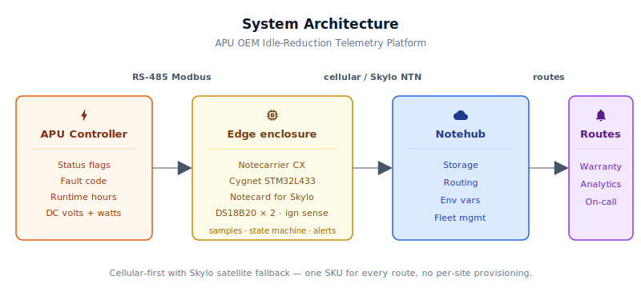
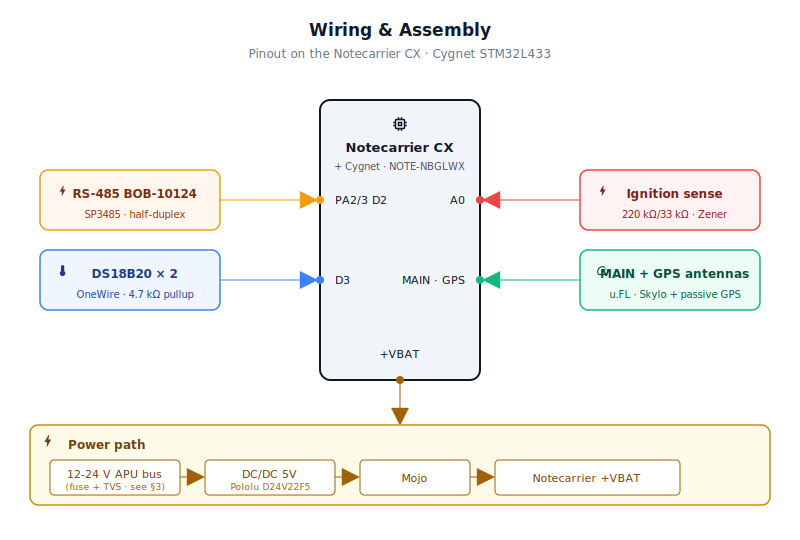

# APU OEM Idle-Reduction Telemetry Platform

<Note>

This reference application is intended to provide inspiration and help you get started quickly. It uses specific hardware choices that may not match your own implementation. Focus on the sections most relevant to your use case. If you'd like to discuss your project and whether it's a good fit for Blues, [feel free to reach out](https://blues.com/landing-pages/accelerators-contact-us/?accelerator=APU%20OEM%20Idle-Reduction%20Telemetry%20Platform).

</Note>

This project is a connected-APU reference platform for [asset performance optimization](https://blues.com/solutions-asset-performance-optimization/) that bridges the gap between the mechanical systems APU OEMs build and the cloud connectivity they need. An **APU** (auxiliary power unit) replaces truck-engine idling — instead of leaving a 400-hp diesel running all night to power a sleeper cab's HVAC and electronics, a diesel or battery APU handles the job on a fraction of the fuel. This design puts a [Blues Notecard for Skylo](https://shop.blues.com/products/notecard-for-skylo?utm_source=dev-blues&utm_medium=web&utm_campaign=store-link) between the APU controller's RS-485 port and [Notehub](https://notehub.io), reporting fault codes, runtime, software-estimated fuel savings, and cab temperature back to the manufacturer in near-real time — even in the Wyoming high desert at 2 AM.

> **Scope.** This is the *software fuel-estimation* variant: fuel figures are computed from APU runtime × configurable consumption-rate env vars, with no hardware flow meter required. For revenue-grade hardware metering, see §10 Production next steps.

---

## 1. Project Overview

**The problem.** Long-haul trucking has a massive and largely invisible fuel waste problem: engine idling. A Class 8 tractor sitting in a truck stop burns roughly 0.8–1.2 gallons per hour just to run its HVAC and electronics overnight. At that rate, a single truck running continental routes can waste 1,500–2,000 gallons a year in idle fuel alone — somewhere between $4,000 and $6,000 at typical diesel prices, and many fleets run hundreds of units. Regulators have noticed; anti-idling legislation covers major portions of the US and Canada, with fines for extended stops in many jurisdictions.

APU manufacturers — companies that build diesel APUs, battery-based no-idle systems, and cab heaters — have been attacking this problem for decades. Their hardware works. What they've traditionally lacked is a connected product: a way to know how much idling each unit actually prevented (tracked both per-hour in `apu_telemetry.qo` and as a daily on-device rollup in `apu_daily.qo`. See §8), when the APU ran and for how long, what fault codes it threw in the field, and whether the warranty claim that came back two years later was from a unit that was used correctly. These are the questions a manufacturer needs to answer to price extended warranties, improve the next product generation, and prove ROI to fleet customers.

The trouble is that APU OEMs are mechanical and power-electronics engineering companies. They know diesel combustion and HVAC thermodynamics; they don't maintain an embedded connectivity stack. Standing up a cellular or satellite IoT solution from scratch means negotiating SIM contracts, managing radio certifications, hiring firmware engineers for the connectivity layer, and doing all of that in dozens of countries as the product goes global. Most APU OEMs conclude this is a distraction from their core competency and ship hardware with no connectivity at all.

**Why Notecard.** Long-haul trucks run continental routes through hundreds of cellular handoffs, significant rural dead zones, and conditions where no single carrier provides reliable coverage. A cellular-only solution that drops data whenever the truck rolls through a no-service corridor is useless to a manufacturer trying to build warranty and maintenance databases. The Notecard for [Skylo](https://www.skylo.tech/faq) solves this by combining LTE-M/NB-IoT global cellular with Skylo satellite fallback in a single M.2 module: the Notecard tries cellular first and, when no tower is reachable, uses Skylo's geostationary network to get the data out. The firmware doesn't manage the transport selection at all — the Notecard handles it transparently.

<NewToBlues/>

Beyond connectivity resilience, the Notecard's pre-certified global cellular removes the three-to-six-month certification cycle that would otherwise gate each new market entry for an APU OEM. The prepaid SIM with 500 MB cellular and 10 KB Skylo data included means an OEM shipping 5,000–100,000 units per year can enter the connectivity business without becoming a connectivity company: no per-unit SIM provisioning, no monthly data plans to track, no roaming negotiations. The hardware lands on the assembly line and ships globally under a single SKU.

**Deployment scenario.** A small sealed enclosure mounted inside the APU housing or the truck's electrical panel, powered from the APU's own 12 V or 24 V DC bus. RS-485 pigtail to the APU controller's communication port; two temperature probes (one ambient, one cab interior) routed through a grommet seal; and a voltage-divided input from the truck's ignition circuit. Two antennas on the cab roof: the Skylo-certified LTE/satellite antenna for cellular and satellite, and a passive GPS antenna for GNSS. No OEM-specific gateway, no telematics device to compete with, no dependency on the fleet's own telematics vendor. Fuel accounting is software-estimated from APU runtime × configurable consumption rates — suitable for fleet-level reporting and warranty analytics without any additional hardware (see the scope note at the top of this document).

---

## 2. System Architecture

**Device-side responsibilities.** The onboard Cygnet STM32L433 host on the Notecarrier CX acts as the application layer: polling the APU controller over Modbus RTU every 60 seconds, reading both DS18B20 temperature probes on a shared OneWire bus, and reading the truck's ignition state from a voltage-divided analog input. It runs a three-state idle-vs-APU state machine, accumulates hourly and daily statistics in a struct that persists across sleep cycles in the Notecard's flash, and emits one of three Note types: an hourly summary, a daily fuel-saved rollup, or an immediate fault alert. After each sample cycle the Cygnet calls [`NotePayloadSaveAndSleep`](https://dev.blues.io/api-reference/notecard-api/card-requests/#card-attn) to commit state to the Notecard and cut host power entirely for the next `sample_interval_sec` seconds via `card.attn`, keeping the host MCU completely dark between samples.

**Notecard responsibilities.** The [Notecard for Skylo](https://dev.blues.io/datasheets/notecard-datasheet/note-nbglwx/) queues [Notes](https://dev.blues.io/api-reference/glossary/#note) in onboard flash, syncs on the [`hub.set`](https://dev.blues.io/api-reference/notecard-api/hub-requests/#hub-set) `outbound` cadence (default 60 minutes), and flushes any `sync:true` fault alerts immediately on whatever transport is available. Its `card.transport` is configured to `"cell-ntn"` — cellular first, Skylo satellite fallback, so rural dead zones become brief delays in the hourly summary stream rather than data gaps. The Notecard also handles GNSS position for the Notes (important for fleet managers who want to know where the truck was when the APU ran) and distributes [environment variables](https://dev.blues.io/guides-and-tutorials/notecard-guides/understanding-environment-variables/) from Notehub so operators can retune fuel-rate assumptions and alert thresholds without reflashing firmware.

**Notehub responsibilities.** The Notecard manages its own cellular and Skylo NTN satellite sessions against the supported carrier networks worldwide via its embedded global SIM and delivers data to [Notehub](https://notehub.io) over the Internet; [Notehub](https://dev.blues.io/notehub/notehub-walkthrough/) ingests events, stores them, and applies project-level [routes](https://dev.blues.io/notehub/notehub-walkthrough/#routing-data-with-notehub). Three [Notefiles](https://dev.blues.io/api-reference/glossary/#notefile) keep the streams separate: `apu_telemetry.qo` for routine hourly summaries, `apu_daily.qo` for once-per-day fuel-saved and runtime totals, and `apu_event.qo` for fault and temperature alerts. Routing is intentionally left abstract — Notehub supports HTTP, MQTT, AWS, Azure, GCP, Snowflake, and other destinations. See the [Notehub routing docs](https://dev.blues.io/notehub/notehub-walkthrough/#routing-data-with-notehub) for route configuration.

**Smart Fleets.** A manufacturer with thousands of units in the field can use [Smart Fleets](https://dev.blues.io/notehub/notehub-walkthrough/#using-smart-fleet-rules) to group devices by APU model, chassis OEM, or geographic territory and push model-specific fuel-consumption defaults to each group via fleet-level environment variables — without reflashing anything.



---

## 3. Technical Summary

1. **Assemble the hardware** (§4, §5): Notecarrier CX, Notecard for Skylo, RS-485 BOB-10124, two DS18B20 probes, and ignition-sense voltage divider. For bench testing, use a USB 5V supply instead of the vehicle DC/DC converter.

2. **Set up Notehub** (§6): Sign up at [notehub.io](https://notehub.io), create a project, copy the **ProductUID**, and set it in the firmware.

3. **Flash the firmware** (§7.1):
   ```bash
   # Install dependencies once
   arduino-cli lib install "Blues Wireless Notecard" "OneWire" "DallasTemperature"
   
   # Compile
   arduino-cli compile -b STMicroelectronics:stm32:Blues:pnum=CYGNET firmware/apu_oem_telemetry/apu_oem_telemetry.ino
   
   # Find your device port (shows as /dev/cu.usbmodem* on macOS, /dev/ttyACM0 on Linux)
   ls /dev/cu.usbmodem* 2>/dev/null || ls /dev/ttyACM*
   
   # Upload (replace with your actual port)
   arduino-cli upload -b STMicroelectronics:stm32:Blues:pnum=CYGNET -p /dev/cu.usbmodem14102 firmware/apu_oem_telemetry/apu_oem_telemetry.ino
   ```

4. **Watch first events** — Power the Notecarrier. On the first cellular sync, the device registers with your Notehub project. In the **Devices** tab, click the device and select **Events** to see incoming `_session.qo`, `apu_telemetry.qo`, and test alerts (see §6, "Triggering test events").

For a simulation without the real APU controller, see §9 "Modbus first-light" for USB-to-RS-485 and software Modbus simulator steps.

---

Here is a sample Note this device emits:

```json
{
  "file": "apu_telemetry.qo",
  "body": {
    "state": 2,
    "apu_runtime_min": 54,
    "idle_time_min": 6,
    "fuel_saved_gal": 0.44,
    "fuel_used_gal": 0.45,
    "amb_temp_f": 41.3,
    "cab_temp_f": 68.7,
    "dc_volts": 13.6,
    "output_watts": 840,
    "power_valid": 1,
    "fault_count": 0,
    "last_fault": 0,
    "controller_runtime_hr": 1247.3
  }
}
```

## 4. Hardware Requirements

| Part | Qty | Rationale |
|------|-----|-----------|
| [Notecarrier CX](https://shop.blues.com/products/notecarrier-cx?utm_source=dev-blues&utm_medium=web&utm_campaign=store-link) | 1 | Integrated carrier with an embedded Cygnet STM32L433 host — no separate MCU board needed. ATTN-pin power gating enables true host power-off between samples. |
| [Notecard for Skylo (NOTE-NBGLWX)](https://dev.blues.io/datasheets/notecard-datasheet/note-nbglwx/) | 1 | LTE-M/NB-IoT global cellular **plus** Skylo GEO satellite in a single M.2 module. Cellular handles normal truck-stop and highway coverage; satellite covers the rural dead zones that break cellular-only solutions on long-haul routes. Ships with 500 MB cellular + 10 KB Skylo data included — no per-unit SIM activation. |
| [Blues Mojo](https://shop.blues.com/products/mojo?utm_source=dev-blues&utm_medium=web&utm_campaign=store-link) | 1 | Coulomb counter bench tool. Placed inline on the 5V supply during bring-up to verify the host is actually sleeping between samples. Not required for production deployment. |
| [SparkFun Transceiver Breakout – RS-485 (BOB-10124)](https://www.sparkfun.com/sparkfun-transceiver-breakout-rs-485.html) | 1 | SP3485 half-duplex RS-485 transceiver breakout — converts the Cygnet's 3.3 V UART to the balanced differential pair the APU controller speaks. Screw-terminal and RJ-45 output options on the same board. |
| [Adafruit Waterproof DS18B20 Temperature Sensor (Adafruit 381)](https://www.adafruit.com/product/381) | 2 | One-Wire digital probe, –55 °C to +125 °C, ±0.5 °C accuracy, 1 m stainless-steel jacketed cable. One probe monitors ambient (outside cab), one monitors cab interior. Both share a single GPIO pin with a 4.7 kΩ bus pullup. |
| 4.7 kΩ resistor, 1/4 W | 1 | OneWire bus pullup to 3.3 V, required by the DS18B20 protocol. |
| Resistors: 220 kΩ and 33 kΩ, 1/4 W | 2 | Voltage divider for truck ignition circuit. Works for both 12 V and 24 V vehicle systems with the **same** resistor values and firmware thresholds: at 12 V the divider output is ≈ 1.6 V (~1941 ADC counts at 12-bit); at 24 V nominal it is ≈ 3.1 V (~3888 counts) — both comfortably above the ON detection threshold (1700 counts). No resistor substitution is required for 24 V trucks. |
| 3.3 V Zener diode (1N4728A or equivalent) | 1 | Clamps ignition sense input against over-voltage. **Required for 24 V truck installations:** a 24 V bus at charging voltage (~28.8 V) drives the divider output to ~3.8 V — above the 3.3 V ADC rail — without clamping; the Zener brings it safely to ≤ 3.3 V. Also protects against ISO 7637-2 transients on 12 V buses. Note: this is **not** galvanic isolation — the circuits share a common ground. If true isolation is required, add an optocoupler input stage (e.g., PC817) before the ADC pin. |
| 120 Ω resistor, 1/4 W | 1–2 | Modbus RS-485 bus termination. A two-node RS-485 link requires 120 Ω across the A/B pair at **each** physical end of the cable. Place one at the APU controller end and one at the Notecarrier/BOB-10124 end — the BOB-10124 has no onboard terminator. If the APU controller already provides a built-in or switchable 120 Ω terminator (check its documentation), only the Notecarrier-end resistor is needed. |
| Skylo-certified LTE/satellite antenna — **included with NOTE-NBGLWX** (MAIN u.FL connector) | 1 | Ships with the Notecard for Skylo; certified for both LTE-M/NB-IoT cellular and Skylo L-band satellite (B23/B255/B256 bands). **Do not substitute** without a CTIA/OTA delta-test report confirming EIRP ≤ 30 dBm; Skylo will classify an uncertified device as blocked. For exterior cab-roof mounting, extend with a u.FL-to-SMA adapter inside the enclosure and route through a weatherproof SMA bulkhead cable gland. Both antennas require an unobstructed southern-sky view (northern hemisphere). See [NOTE-NBGLWX antenna requirements](https://dev.blues.io/datasheets/notecard-datasheet/note-nbglwx/). |
| [Molex Flexible GNSS Antenna — u.FL (SparkFun WRL-17519)](https://www.sparkfun.com/molex-flexible-gnss-antenna-u-fl-adhesive.html) | 1 | Passive GPS L1/L2/L5 + GLONASS/BeiDou flexible adhesive antenna, u.FL connector, for bench and protected-interior mounting. Connects to the Notecard's separate **GPS** u.FL connector (not the MAIN connector). For exterior cab-roof deployment in a metal enclosure, use a weatherproof puck or dome antenna with a u.FL-to-SMA pigtail routed through a bulkhead gland. See [NOTE-NBGLWX antenna requirements](https://dev.blues.io/datasheets/notecard-datasheet/note-nbglwx/). |
| 5 V DC/DC converter, 12–30 V input, ≥ 1 A (e.g. Pololu D24V22F5) | 1 | Steps down the APU's 12 V or 24 V bus to the 5 V the Notecarrier CX requires. **Bench/POC-only** — the Pololu D24V22F5 provides no load-dump clamping, reverse-polarity protection, or AEC-Q100 qualification. See the vehicle electrical Note below and §10 for production requirements. |
| Sealed ABS enclosure, IP54 or better, ≥ 140 × 70 mm internal footprint (e.g., Hammond Manufacturing [1591DFLBK](https://www.hammfg.com/part/1591DFLBK) or equivalent) | 1 | Cab-mounted housing rated for –40 °C to +85 °C storage. The Notecarrier CX footprint is approximately 90 × 65 mm; add clearance for the RS-485 breakout and screw terminals alongside. The Hammond 1591DFLBK (150 × 80 × 50 mm external, IP54) is one proven fit — verify internal dimensions against your specific board layout before ordering. |

> **Fuel-flow sensor: not included in this variant.** This estimation-only design computes all fuel figures in software from APU runtime × environment-variable-supplied consumption rates (`apu_fuel_rate_gph`, `idle_fuel_rate_gph`). No flow meter, pulse-counter circuit, or additional fuel-line wiring is needed. For revenue-grade metering, see §10 Production next steps.

<Warning>

**Vehicle electrical environment — production requirements.** A 12 V or 24 V truck bus is a harsh electrical environment that requires front-end protection **not included in the bench BOM above**: **(1)** an inline 5 A ATO/ATC blade fuse in the positive lead at the APU bus tap (as close to the source as practical); **(2)** a TVS diode across the DC/DC input to clamp ISO 7637-2 load-dump transients — select one whose standoff voltage exceeds the maximum normal bus voltage and whose clamping voltage is below the converter's absolute-maximum rated input; ISO 7637-2 pulse 5a can reach 87 V peak on a 24 V bus, so verify the TVS ratings against your converter's datasheet before specifying; and **(3)** a reverse-polarity protection device in series with the positive lead (a Schottky diode such as 1N5819, or a P-channel MOSFET with gate-source clamped to GND). For production, replace the Pololu D24V22F5 with an AEC-Q100 or AEC-Q101 qualified automotive DC/DC converter rated for your bus voltage range and −40 °C to +85 °C operation. See §10.

</Warning>

---

## 5. Wiring and Assembly

All host I/O lands on the [Notecarrier CX](https://dev.blues.io/datasheets/notecarrier-datasheet/notecarrier-cx-v1-3/) dual 16-pin header. The Notecard for Skylo (NOTE-NBGLWX) seats in the carrier's M.2 slot. The Mojo sits inline between the 5 V DC/DC converter output and the Notecarrier's +VBAT pad for bench validation.



**Power:**
- DC/DC converter input (+12 V or +24 V from APU bus) → DC/DC `VIN`. DC/DC `GND` → APU chassis GND.
- DC/DC converter `VOUT` (5 V) → Mojo `BAT` input → Mojo `LOAD` output → Notecarrier CX `+VBAT`.
- Notecarrier `GND` → APU chassis GND.

<Warning>

**Front-end protection (required before production deployment on a vehicle bus).** The bench wiring above connects the DC/DC converter directly to the APU bus. For any production installation, insert the following protection between the bus tap and the DC/DC `VIN` in this order: **(1)** 5 A inline blade fuse (ATO/ATC) in the positive lead, mounted as close to the battery/APU bus tap as practical; **(2)** a TVS diode across `VIN`–`GND` rated to absorb ISO 7637-2 load-dump transients — select one whose standoff voltage exceeds the maximum normal bus voltage and whose clamping voltage is below the converter's absolute-maximum rated input; ISO 7637-2 pulse 5a can reach 87 V peak on a 24 V bus, so verify the TVS against your converter's datasheet before specifying; **(3)** reverse-polarity protection in series with the positive lead (Schottky diode or P-channel MOSFET with gate-source clamped to GND). None of these are in the bench bring-up rig. The wiring diagram above shows the correct series order in the power chain. See §10 for the POC/production distinction.

</Warning>

**RS-485 interface (Cygnet UART → SparkFun BOB-10124):**
- Cygnet `TX` (UART2, pin `PA2`) → BOB-10124 `TXD` input.
- Cygnet `RX` (UART2, pin `PA3`) → BOB-10124 `RXD` output.
- Cygnet `D2` → BOB-10124 `RTS/DE` (direction-control pin). Assert HIGH before transmitting, pull LOW to receive.
- Notecarrier `3V3` → BOB-10124 `VCC`.
- Notecarrier `GND` → BOB-10124 `GND`.
- BOB-10124 `A(+)` → APU controller RS-485 `A(+)`.
- BOB-10124 `B(–)` → APU controller RS-485 `B(–)`.
- Place a 120 Ω termination resistor across the BOB-10124 `A(+)/B(–)` screw terminals at the Notecarrier end of the cable (the BOB-10124 has no onboard terminator). Place a second 120 Ω resistor across `A(+)/B(–)` at the APU controller end. If the APU controller's RS-485 port already provides a built-in or switchable 120 Ω terminator, omit the controller-end resistor and install only the Notecarrier-end one.

**OneWire temperature bus (two DS18B20 probes):**
- Notecarrier `3V3` → 4.7 kΩ pullup resistor → `D3` (data bus).
- Both DS18B20 red wires → `3V3`. Both DS18B20 black wires → `GND`. Both DS18B20 yellow/white data wires → `D3`.
- Route the ambient probe outside the enclosure through a sealed grommet; route the cab probe to the sleeper bunk area.

**Ignition sense (truck 12 V / 24 V):**
- Truck ignition switched positive (`IGN+`) → 220 kΩ resistor → junction point `A0`.
- Junction `A0` → 33 kΩ resistor → `GND`.
- Junction `A0` → 3.3 V Zener cathode → `GND` (anode to GND, clamp against positive transients).
- Junction `A0` → Cygnet `A0`.
- Do NOT connect `IGN+` directly to any GPIO or Notecarrier rail. The 220 kΩ / 33 kΩ divider scales truck ignition voltage into the ADC range for both 12 V and 24 V systems (≈ 1.6 V at 12 V, ≈ 3.1 V at 24 V nominal). On a 24 V truck the bus reaches ~28.8 V while charging, driving the divider output to ~3.8 V — the 3.3 V Zener clamps this to a safe level; **install the Zener on all 24 V installations**. The firmware ignition thresholds (ON = 1700 ADC counts, OFF = 1400 counts) work for both truck types without any code change: 12 V gives ~1941 counts and 24 V gives ~3888 counts at ignition-on, both well above the ON threshold. Note: this is **not** galvanic isolation — the circuits share a common ground. If true isolation is required, add an optocoupler input stage (e.g., PC817) before the ADC pin.

**Antennas (NOTE-NBGLWX has two u.FL connectors, both must be connected):**
- **MAIN u.FL** (LTE-M/NB-IoT cellular + Skylo satellite): Connect the Skylo-certified antenna shipped with the NOTE-NBGLWX to the `MAIN` u.FL port. For rooftop mounting, add a u.FL-to-SMA pigtail inside the enclosure and route the cable through a weatherproof SMA bulkhead cable gland. **Do not substitute the certified antenna** without completing a Skylo delta-certification test (EIRP ≤ 30 dBm via CTIA/OTA testing).
- **GPS u.FL** (GNSS position): Connect a passive GPS L1 (1575 MHz) antenna to the `GPS` u.FL port. A small magnetic-mount patch antenna on the cab roof provides reliable GNSS fix; the Notecarrier CX also includes a short u.FL pigtail to its onboard GPS pad for bench use. An exterior mount gives significantly better acquisition than anything inside a metal enclosure.
- Both antennas require an unobstructed view of the sky. Skylo GEO acquisition additionally requires a clear view toward the south (northern hemisphere). Do not mount either antenna inside a closed metal enclosure.

---

## 6. Notehub Setup

1. **Create a project.** Sign up at [notehub.io](https://notehub.io) and create a project. Copy the [ProductUID](https://dev.blues.io/notehub/notehub-walkthrough/#finding-a-productuid) — it looks like `com.your-company.your-name:apu-telemetry`.
2. **Set the ProductUID in firmware.** Open `apu_oem_telemetry.ino` and replace the empty string on the `#define PRODUCT_UID ""` line with your value.
3. **Claim the Notecard.** Power the assembled unit. On first cellular or satellite session the Notecard associates with your Notehub project automatically — no manual claim step needed. The device appears in your project's **Devices** tab within a minute or two.
4. **Create Fleets.** [Fleets](https://dev.blues.io/guides-and-tutorials/fleet-admin-guide/) group devices for shared configuration. A fleet per APU model line is the natural choice: every unit of the same model shares the same fuel-consumption assumptions (`apu_fuel_rate_gph`, `idle_fuel_rate_gph`), so those can be set at the fleet level and overridden per-device only for units with individually measured rates. [Smart Fleets](https://dev.blues.io/notehub/notehub-walkthrough/#using-smart-fleet-rules) can auto-assign new devices by serial-number prefix or by device Note contents.
5. **Set environment variables.** Navigate to **Fleet → Environment** in Notehub. The device pulls updated values at each inbound sync — no reflash, no truck roll. All variables are optional; firmware defaults and production recommendations are shown.

   | Variable | Default | Production | Purpose |
   |---|---|---|---|
   | `sample_interval_sec` | `60` | `300` | Seconds between sample cycles. Shorter intervals (30–60 seconds) aid commissioning; production typically 300 seconds (5 minutes) or more. |
   | `summary_interval_min` | `60` | `60` | Minutes between summary Notes; also re-applies `hub.set` outbound cadence. Aligns with hourly analytics windows. |
   | `modbus_slave_id` | `1` | *varies* | Modbus RTU server (slave) address of the APU controller. Verify against your controller datasheet. |
   | `modbus_baud` | `19200` | *varies* | RS-485 baud rate; must match APU controller config (common values: 9600, 19200, 38400). |
   | `modbus_reg_base` | `1` | *varies* | Wire-level 0-based holding-register start address. Modbus RTU sends this value directly in the request frame — it is **not** the human-facing register number. If the APU controller datasheet numbers registers from 1 (e.g., "Register 1 = APU status"), subtract 1: register 1 → `modbus_reg_base = 0`, register 2 → `1`. If it uses 40001-style notation, subtract 40001. The default `1` is an illustrative map choice; verify against your controller's register map before commissioning. |
   | `apu_fuel_rate_gph` | `0.5` | *measure* | APU fuel consumption in gallons per hour at rated load. Refine from engine specs or field measurement. Used for software fuel-saved estimation. |
   | `idle_fuel_rate_gph` | `1.0` | *measure* | Truck main-engine idle fuel consumption (gallons/hour). Typical Class 8 diesel: 0.8–1.2 gph; refine from fleet data. Used for fuel-saved calculation. |
   | `cab_temp_high_f` | `85.0` | `85.0` | Cab temperature (°F) above which `cab_overheat` alert fires. Adjust for climate and HVAC capacity. |
   | `cab_temp_low_f` | `32.0` | `32.0` | Cab temperature (°F) below which `cab_freeze` alert fires. Set above expected winter ambient. |
   | `alert_cooldown_sec` | `1800` | `1800` | Minimum seconds between repeated alerts of the same type. Prevents alert floods on a drifting sensor. |
   | `amb_rom_id` | *(not set)* | *required* | 64-bit OneWire ROM address of the **ambient** DS18B20 probe, as exactly 16 hex characters (upper or lower case), e.g. `2800a1b2c3d4e501`. Set both `amb_rom_id` and `cab_rom_id` to enable deterministic probe-role assignment. Read the ROM IDs from the serial debug output on first boot (see §7.3). If unset, the firmware falls back to discovery-index commissioning and prints a warning — physical roles may be swapped. |
   | `cab_rom_id` | *(not set)* | *required* | 64-bit OneWire ROM address of the **cab** DS18B20 probe, same 16-hex-character format as `amb_rom_id`. Both vars must be set together; a partial pair is ignored. |

6. **Configure routes.** In Notehub, go to **Routes** and add three [routes](https://dev.blues.io/notehub/notehub-walkthrough/#routing-data-with-notehub): 
   - `apu_event.qo` → fault/warranty database or on-call endpoint (immediate urgency).
   - `apu_telemetry.qo` → long-term analytics/fleet-management store (hourly batches).
   - `apu_daily.qo` → OEM dashboard or fuel-savings report pipeline (daily rollups).
   
   Splitting the Notefiles at the source means each can fan out to different destinations at different urgencies without filter logic in the route itself. For testing, use a simple HTTP POST webhook to log incoming Notes.

### What you should see in Notehub

- **`_session.qo`** — Notecard housekeeping on each cellular/satellite session. Presence confirms the radio is reaching Notehub.
- **`apu_telemetry.qo`** — one per `summary_interval_min`. See §8 for the payload shape.
- **`apu_daily.qo`** — one per calendar day, emitted at the day boundary using `card.time`. Contains daily totals for `fuel_saved_gal`, `fuel_used_gal`, `apu_runtime_min`, and `idle_time_min`. See §8.
- **`apu_event.qo`** — only on fault codes, cab temperature excursions, or state transitions worth flagging. Transmitted immediately.

---

## 7. Firmware Design

The firmware is split across three files:

- **[`firmware/apu_oem_telemetry/apu_oem_telemetry.ino`](firmware/apu_oem_telemetry/apu_oem_telemetry.ino)** — main sketch: `setup()`, `loop()`, `runSampleCycle()`, state machine, alert and summary dispatch, sleep/wake orchestration.
- **[`firmware/apu_oem_telemetry/apu_oem_telemetry_helpers.h`](firmware/apu_oem_telemetry/apu_oem_telemetry_helpers.h)** — pin assignments, Notefile names, state machine constants, Modbus register offsets, default configuration values, `EnvConfig` and `AppState` struct definitions, and function declarations.
- **[`firmware/apu_oem_telemetry/apu_oem_telemetry_helpers.cpp`](firmware/apu_oem_telemetry/apu_oem_telemetry_helpers.cpp)** — implementations: `notecardConfigure`, `defineTemplates`, `fetchEnvOverrides`, `modbusReadHolding` / `modbusCRC16`, `readTemperatures`, `sendAlert`, `sendSummary`.

### 7.1 Installing and flashing

**Dependencies:**
- **Arduino core for STM32** — [`stm32duino/Arduino_Core_STM32`](https://github.com/stm32duino/Arduino_Core_STM32). Add the index URL `https://github.com/stm32duino/BoardManagerFiles/raw/main/package_stmicroelectronics_index.json` to **File → Preferences → Additional Boards Manager URLs**, then install "STM32 MCU based boards." Select **Blues Cygnet** as the board (the Notecarrier CX's embedded host is the Blues Cygnet, STM32L433-based; the canonical FQBN is `STMicroelectronics:stm32:Blues:pnum=CYGNET`).
- **`Blues Wireless Notecard`** (`note-arduino`) — Install via Arduino Library Manager (`arduino-cli lib install "Blues Wireless Notecard"`). See [note-arduino releases](https://github.com/blues/note-arduino/releases) for available versions.
- **`OneWire`** — Install via Library Manager (`arduino-cli lib install "OneWire"`). Used for DS18B20 communication.
- **`DallasTemperature`** — Install via Library Manager (`arduino-cli lib install "DallasTemperature"`). Abstracts the DS18B20 one-wire protocol.

**Flashing — Arduino IDE:** Open `apu_oem_telemetry.ino`, select the Cygnet board, and click **Upload**. The Notecarrier CX exposes the STLink interface on the same USB cable.

**Flashing — `arduino-cli`:**
```bash
# Verify Cygnet board is available
arduino-cli board listall | grep -i cygnet

# Change to the firmware directory
cd firmware/apu_oem_telemetry

# Compile
arduino-cli compile -b STMicroelectronics:stm32:Blues:pnum=CYGNET apu_oem_telemetry.ino

# Identify the USB device port (Notecarrier CX USB STLink interface)
# On macOS: /dev/cu.usbmodem14202 (or similar)
# On Linux: /dev/ttyACM0
# On Windows: COM3 (or higher)
ls /dev/cu.usbmodem* 2>/dev/null || ls /dev/ttyACM* 2>/dev/null

# Upload (replace the port with your actual device port from the step above)
arduino-cli upload -b STMicroelectronics:stm32:Blues:pnum=CYGNET -p /dev/cu.usbmodem14202 apu_oem_telemetry.ino
```
**USB serial is always active; `DEBUG` controls verbose output.** `Serial.begin(115200)` runs unconditionally in `setup()`, so error and warning messages — `[boot] WARN`, `[alert] WARN`, `[modbus fail]`, and all `ERR` lines — are available over USB whenever a service technician connects a terminal to a deployed unit. Before flashing for bench bring-up, uncomment the `#define DEBUG` line near the top of `apu_oem_telemetry.ino`. With `DEBUG` defined, open a serial monitor at **115200 baud** — on the first boot you'll see verbose initialization messages and a first `[sample]` line before the Cygnet goes dark until the next interval. Remove or re-comment `#define DEBUG` before deploying to production. With `DEBUG` undefined: (1) the 3-second USB host-detection wait is skipped, saving meaningful awake time on every wake; (2) the Notecard debug stream (verbose per-request I²C traffic) is disabled; and (3) diagnostic `[sample]`, `[modbus ok]`, `[event]`, `[alert]`, and `[summary]` log lines are compiled out. WARN and ERR messages remain active in all builds and are always reachable over USB at 115200 baud.

### 7.2 Modules

| Responsibility | Where |
|---|---|
| Notecard configuration (`hub.set`, `card.transport`, templates) | `notecardConfigure`, `defineTemplates` |
| Env-variable fetch per wake | `fetchEnvOverrides` |
| Modbus RTU client (read holding registers) | `modbusReadHolding`, `modbusCRC16` |
| DS18B20 commissioning and ROM-ID-based probe matching | `setup()` in `apu_oem_telemetry.ino` |
| DS18B20 temperature sampling (per-probe independent) | `readTemperatures` |
| Ignition reading | `analogRead` on `IGNITION_PIN` in `runSampleCycle` |
| Idle-vs-APU state machine | `runSampleCycle` state block |
| Hourly summary emission | `sendSummary` |
| Daily fuel-saved rollup emission | `sendDailySummary` |
| Fault/alert emission | `sendAlert` |
| Checked Notecard send with error logging | `ncSend` |
| Sleep/wake state persistence | `AppState` struct + `NotePayloadSaveAndSleep` / `NotePayloadRetrieveAfterSleep` |

### 7.3 Sensor reading strategy

**Modbus APU registers.** Five holding registers are read in one transaction starting at `modbus_reg_base`. The layout expected from the APU controller is: APU status (bitmask: bit 0 = powered on, bit 1 = fault), active fault code (0 = no fault), cumulative runtime hours (×10, unsigned, decoded as `controller_runtime_hr` in hours and included in `apu_telemetry.qo`; the most recent valid value is stored in `AppState.lastControllerRuntimeHr` and persisted across sleep cycles so it is always available for the next summary even if a single Modbus read fails), DC output voltage (tenths of volt), and output watts. The firmware implements a minimal CRC-16 Modbus RTU client with configurable slave ID and baud rate — no external Modbus library required. On RS-485 half-duplex, the direction pin (`RS485_DE_PIN`) is asserted HIGH for transmit, pulled LOW immediately after the last byte flushes, and the firmware waits up to 200 milliseconds for the response frame before returning a read failure.

> **Modbus addressing:** `modbus_reg_base` is the raw 0-based wire address sent in the Modbus RTU request frame — it is **not** the human-facing register number. If the APU controller's datasheet uses 1-based numbering (e.g., "Register 1 = APU status"), subtract 1: set `modbus_reg_base = 0` to address register 1, `1` for register 2, and so on. If it uses 40001-style notation, subtract 40001. The default value `1` is an illustrative map choice; always confirm the correct start address from your controller's register map before commissioning.

**DS18B20 temperatures.** Probe roles are assigned by operator-provisioned ROM IDs when `amb_rom_id` and `cab_rom_id` are set in Notehub fleet environment variables (see §6). On each wake the firmware parses those env-var ROM IDs and matches them against devices found on the OneWire bus — no discovery-index assumption is made and role assignment is stable regardless of OneWire bus enumeration order, which is determined by ROM address value, not physical location.

When the env vars are not set, the firmware falls back to index-based commissioning on the first wake where both probes are simultaneously present (index 0 = ambient, index 1 = cab) and logs a prominent warning. To determine the correct env var values: flash with `#define DEBUG` uncommented, connect both probes, and open a serial monitor at 115200 baud. The firmware prints two ROM ID lines (`[ds18b20] index-0 (assigned ambient) ROM:` and `[ds18b20] index-1 (assigned cab) ROM:`) after index-based commissioning. Physically verify which probe (the one routed outside the enclosure vs. the one routed to the bunk area) corresponds to which ROM ID, then set `amb_rom_id` and `cab_rom_id` in the Notehub fleet environment. On the next wake the firmware uses the env-var IDs and the index-based warning disappears.

On every wake — whether using env-var or persisted ROM IDs — the firmware enumerates the OneWire bus and matches each device by its 64-bit ROM address rather than by discovery index. The cab probe remains valid even when the ambient probe is temporarily disconnected; `readTemperatures()` accepts independent `ambFound` / `cabFound` flags so a missing ambient probe never suppresses cab-overheat or cab-freeze alerting. A probe replacement (new ROM ID) is treated as absent rather than silently re-assigned to the wrong role. Conversion time for 12-bit resolution is ≤ 750 milliseconds; the firmware uses a blocking wait rather than a timer to keep the state machine simple.

**Ignition state.** `analogRead` on the voltage-divided ignition input; values above the mid-point threshold (`IGNITION_THRESHOLD_ADC`) indicate ignition ON.

### 7.4 Idle-vs-APU state machine

Three states capture what matters to an APU manufacturer:

| State | Meaning |
|---|---|
| `STATE_IDLE_OFF` | Ignition off, APU off. Truck parked, neither system running. |
| `STATE_IDLE_ON` | Ignition on, APU off. Ignition-on is used as a proxy for engine idling — the firmware infers a likely idle condition from the ignition signal alone; RPM and J1939 engine-run status are not monitored. |
| `STATE_APU_ACTIVE` | APU running, engine idle reduced. Fuel savings are accumulating. |

State transitions fire `apu_event.qo` Notes (with `sync:true`) so the OEM's backend captures every mode change. The fuel-saved accumulator runs while the state machine is in `STATE_APU_ACTIVE`; the accumulated total is included in the next hourly `apu_telemetry.qo` summary and reset at that point.

### 7.5 Event payload design

Three [compact-format template](https://dev.blues.io/notecard/notecard-walkthrough/low-bandwidth-design#working-with-note-templates) Notefiles. Compact format is essential here: when the Notecard falls back to Skylo satellite, only compact-template Notes are transmitted (the satellite data budget is measured in kilobytes, not megabytes). All three Notefiles use `port` values in the range 50–52 and include `_lat`, `_lon`, and `_time` — Notecard-reserved compact-template keywords that the Notecard automatically fills from its onboard GPS fix and RTC each time a Note is stored. The host does **not** set these fields in `note.add`; they are populated by the Notecard firmware and appear in every stored and transmitted Note. See the [Blues low-bandwidth design guide](https://dev.blues.io/notecard/notecard-walkthrough/low-bandwidth-design#working-with-note-templates) for the full list of reserved compact-template keywords.

**Template format codes** in the code snippets below are [data type markers](https://dev.blues.io/notecard/notecard-walkthrough/low-bandwidth-design/#understanding-template-data-types) used by the Notecard to reduce payload size with Notefile Templates. These control both the on-the-wire encoding and the per-field byte cost in the satellite budget.

Sample `apu_telemetry.qo` (hourly, Modbus available):
```json
{
  "file": "apu_telemetry.qo",
  "body": {
    "state": 2,
    "apu_runtime_min": 54,
    "idle_time_min": 6,
    "fuel_saved_gal": 0.44,
    "fuel_used_gal": 0.45,
    "amb_temp_f": 41.3,
    "cab_temp_f": 68.7,
    "dc_volts": 13.6,
    "output_watts": 840,
    "power_valid": 1,
    "fault_count": 0,
    "last_fault": 0,
    "controller_runtime_hr": 1247.3
  }
}
```

**`power_valid` and invalid-power sentinels.** When the Modbus reads succeed at least once in a summary window, `power_valid` is `1` and `dc_volts` / `output_watts` hold the window average. When *no* valid Modbus power samples were collected (e.g., APU controller was powered down for the entire window), `power_valid` is `0` and the firmware emits sentinel values — `dc_volts = -1.0` and `output_watts = 65535` (`0xFFFF`), so missing data is distinguishable from a legitimate zero reading. Downstream consumers **must** check `power_valid` before interpreting `dc_volts` and `output_watts`.

Sample `apu_event.qo` (immediate, `sync:true`):
```json
{
  "file": "apu_event.qo",
  "body": {
    "event": "apu_fault",
    "fault_code": 5,
    "state": 2,
    "amb_temp_f": 38.1,
    "cab_temp_f": 71.2,
    "dc_volts": 12.9,
    "output_watts": 0
  }
}
```

Sample `apu_daily.qo` (once per calendar day, compact template on port 52):
```json
{
  "file": "apu_daily.qo",
  "body": {
    "fuel_saved_gal": 3.12,
    "fuel_used_gal":  3.24,
    "apu_runtime_min": 387,
    "idle_time_min":   33
  }
}
```

The `apu_daily.qo` template uses `TFLOAT32` for the fuel fields and `TUINT16` for the runtime fields, plus the reserved `_lat`, `_lon`, and `_time` keywords. Daily accumulators run independently of the per-summary-window accumulators and are reset only after a confirmed `note.add` success, so a failed delivery retries at the next calendar-day boundary check rather than silently dropping the data.

### 7.6 Low-power strategy

The Cygnet is cut entirely between samples using `NotePayloadSaveAndSleep`. The host MCU draws essentially zero current from the +VBAT rail while off; only the Notecard remains powered at its idle draw (~8–18 µA typical at 5 V, excluding GNSS). With a 60-second sample interval and a 60-minute outbound sync, the Cygnet is live for roughly 3–5 seconds per minute and the radio fires once per hour. Sample rate and transmit cadence are decoupled: samples accumulate locally on the Notecard, and the radio only wakes to push the queued batch.

The Notecard also runs `card.location.mode` in periodic mode at a 600-second interval, so a GNSS acquisition occurs approximately every 10 minutes independently of whether the host is awake — position is stamped into outbound Notes without any host involvement. During acquisition the Notecard draws tens of milliamps for the duration of the fix (see power table in §9); this is a meaningful contribution to the 24-hour energy budget and should be verified with Mojo during bring-up.

The Notecard for Skylo's `card.transport` is set to `"cell-ntn"`. In practice, cellular handles the vast majority of syncs; satellite fires only when the truck is in a genuine dead zone. With this transport setting, **both** `apu_event.qo` alerts and `apu_telemetry.qo` summary Notes may transit satellite when cellular is unavailable at sync time — the firmware does not suppress routine summaries when only NTN is reachable. The satellite data budget is small (10 KB included per device); production deployments concerned about exhausting it should add logic in `sendSummary` to skip the outbound sync when the active transport is NTN-only, or size the deployment around cellular as the primary path with satellite used only for gap-bridging.

### 7.7 Retry and error handling

- The first `hub.set` call uses `notecard.sendRequestWithRetry(req, 5)` to handle the cold-boot I²C race described in the note-arduino docs.
- All other Notecard requests use `ncSend()`, a thin helper that calls `requestAndResponse`, checks the response for a NULL return or a non-empty `"err"` field, and logs failures to the serial debug output. This ensures that template registration failures, transport-config failures, and failed `note.add` calls are visible rather than silently swallowed.
- `sendSummary` only clears window accumulators after `ncSend` confirms a successful `note.add`. If the Notecard returns an error the accumulators are preserved and retried on the next summary trigger, preventing silent data loss on a transient communication failure.
- Modbus reads are retried up to 3× per cycle. If all three attempts fail, the sample cycle skips the power and fault registers for that sample (the summary window average excludes the failed samples) but does not abort sleep — avoiding a firmware lock-up if the APU controller is powered off for service.
- DS18B20 probes are matched by their 64-bit ROM ID rather than bus-enumeration index. When `amb_rom_id` and `cab_rom_id` are set in Notehub env vars, role assignment is deterministic — the env-var ROM IDs are used directly each wake with no discovery-index assumption. When env vars are absent, `setup()` performs index-based commissioning on the first wake where both probes are present and saves the ROM addresses in `AppState` (persisted across sleep cycles by `NotePayloadSaveAndSleep`), printing a warning and the ROM IDs so the operator can set the env vars. Either path: `g_ambFound` and `g_cabFound` are set independently, so a missing ambient probe never suppresses the cab temperature read. Reads returning `DEVICE_DISCONNECTED_C` (−127 °C) are treated as invalid and excluded from the summary average regardless of commissioning state.
- `sensor_fail` alert: `badSensorCycles` increments only when **both** temperature probes return invalid readings **and** the Modbus read fails in the same cycle; any one subsystem succeeding resets the counter to zero. After three consecutive cycles in which all three sensor sources fail simultaneously, an `apu_event.qo` with `event: "sensor_fail"` is emitted (subject to `alert_cooldown_sec`). Isolated Modbus-only or temperature-only failures (including a single missing probe) do not trigger this alert.
- Alert de-duplication uses a per-alert monotonic sample counter rather than `card.time`. Cooldown is expressed as `alert_cooldown_sec / sample_interval_sec` samples and applies to all three alert types (`apu_fault`, cab temperature, `sensor_fail`). This keeps dedup correct even when a GPS or network fix has not yet established wall-clock time.

### 7.8 Key code snippet 1: satellite transport and compact templates

Setting `cell-ntn` transport and defining compact templates happens once on cold boot. The compact format is what allows these Notes to transit Skylo's 256-byte-per-message payload budget.

```cpp
// Configure cellular-first, satellite-fallback transport.
// ncSend() wraps requestAndResponse and checks the "err" field so failures
// are logged rather than silently swallowed.
J *req = notecard.newRequest("card.transport");
JAddStringToObject(req, "method", "cell-ntn");
if (!ncSend(notecard, req)) Serial.println("[cfg] WARN: card.transport failed");

// Define compact template for hourly telemetry.
// _lat, _lon, and _time are Notecard-reserved compact-template keywords:
// the Notecard fills them automatically from its GPS and RTC when each note
// is stored. The host does NOT set these fields in note.add requests.
req = notecard.newRequest("note.template");
JAddStringToObject(req, "file", "apu_telemetry.qo");
JAddNumberToObject(req, "port", 50);
JAddStringToObject(req, "format", "compact");
J *body = JAddObjectToObject(req, "body");
JAddNumberToObject(body, "state",          TUINT8);
JAddNumberToObject(body, "apu_runtime_min",TUINT16);
JAddNumberToObject(body, "idle_time_min",  TUINT16);
JAddNumberToObject(body, "fuel_saved_gal", TFLOAT32);
JAddNumberToObject(body, "fuel_used_gal",  TFLOAT32);
JAddNumberToObject(body, "amb_temp_f",     TFLOAT32);
JAddNumberToObject(body, "cab_temp_f",     TFLOAT32);
JAddNumberToObject(body, "dc_volts",       TFLOAT32);
JAddNumberToObject(body, "output_watts",   TUINT16);
// power_valid = 1 when dc_volts/output_watts are real averages;
// = 0 when no valid Modbus samples were collected this window
// (dc_volts = -1.0, output_watts = 0xFFFF in that case).
JAddNumberToObject(body, "power_valid",           TUINT8);
JAddNumberToObject(body, "fault_count",           TUINT16);
JAddNumberToObject(body, "last_fault",            TUINT16);
JAddNumberToObject(body, "controller_runtime_hr", TFLOAT32);
JAddNumberToObject(body, "_lat",  TFLOAT32);  // auto-filled by Notecard GPS
JAddNumberToObject(body, "_lon",  TFLOAT32);  // auto-filled by Notecard GPS
JAddNumberToObject(body, "_time", TUINT32);   // auto-filled by Notecard RTC
if (!ncSend(notecard, req)) Serial.println("[tmpl] WARN: telemetry template failed");
```

### 7.9 Key code snippet 2: lightweight Modbus RTU read

No external Modbus library required — the full read-holding-registers client is ~50 lines of serial framing.

```cpp
bool modbusReadHolding(uint8_t slaveId, uint16_t startAddr,
                       uint8_t count, uint16_t *results) {
    uint8_t req[8];
    req[0] = slaveId; req[1] = 0x03;
    req[2] = startAddr >> 8; req[3] = startAddr & 0xFF;
    req[4] = 0;             req[5] = count;
    uint16_t crc = modbusCRC16(req, 6);
    req[6] = crc & 0xFF; req[7] = crc >> 8;

    digitalWrite(RS485_DE_PIN, HIGH);     // assert transmit
    delayMicroseconds(500);               // DE setup time
    RS485_SERIAL.write(req, 8);
    RS485_SERIAL.flush();
    delayMicroseconds(500);
    digitalWrite(RS485_DE_PIN, LOW);      // switch to receive

    uint8_t rsp[5 + count * 2];
    uint8_t idx = 0;
    unsigned long deadline = millis() + 200;
    while (millis() < deadline && idx < sizeof(rsp)) {
        if (RS485_SERIAL.available()) rsp[idx++] = RS485_SERIAL.read();
    }
    if (idx < (5 + count * 2)) return false;
    uint16_t recvCRC = rsp[idx - 2] | (rsp[idx - 1] << 8);
    if (modbusCRC16(rsp, idx - 2) != recvCRC) return false;
    for (uint8_t i = 0; i < count; i++)
        results[i] = (rsp[3 + i * 2] << 8) | rsp[4 + i * 2];
    return true;
}
```

### 7.10 Key code snippet 3: sleep with persisted state

`NotePayloadSaveAndSleep` serializes the `AppState` struct into Notecard flash and then triggers `card.attn` to cut host power. The next wake enters `setup()` fresh; `NotePayloadRetrieveAfterSleep` rehydrates the struct.

```cpp
NotePayloadDesc payload = {0, 0, 0};
NotePayloadAddSegment(&payload, STATE_SEG_ID, &g_state, sizeof(g_state));
NotePayloadSaveAndSleep(&payload, (uint32_t)g_env.sampleIntervalSec, NULL);
// Never returns — host power is cut
```

---

## 8. Data Flow

Every `sample_interval_sec` (default 60 seconds) the Cygnet wakes, samples all inputs, runs the state machine, and decides what to send:


**Collected.**
- From APU controller (Modbus): APU status flags, active fault code, DC bus voltage, output watts, and controller cumulative runtime hours (`controller_runtime_hr`, in hours).
- From DS18B20 probes: ambient temperature (°F), cab interior temperature (°F).
- From ignition sense: ON/OFF state.
- Fuel volume: software-estimated from APU runtime × `apu_fuel_rate_gph` and `idle_fuel_rate_gph` environment variables.

**Summarized.** Every `summary_interval_min` (default hourly): accumulated APU runtime (minutes), accumulated ignition-on (inferred idle) time (minutes), per-summary-window fuel saved (gallons), per-summary-window fuel consumed by the APU (gallons), average ambient and cab temperatures, average DC volts and output watts (with `power_valid` flag. See §7.5), fault count in window, last non-zero fault code. Window accumulators reset after each confirmed summary delivery.

**Daily rollup.** Once per calendar day (at the `card.time` day boundary, with a sample-count fallback before the first time sync): `apu_daily.qo` is emitted with the accumulated day totals for `fuel_saved_gal`, `fuel_used_gal`, `apu_runtime_min`, and `idle_time_min`. The pre-sync fallback fires after ceiling(`86400 / sample_interval_sec`) samples — the correct one-day count at any configured sampling rate. Daily accumulators are independent of the hourly-window accumulators and are reset only after confirmed `apu_daily.qo` delivery so a failed send retries on the next wake of the same calendar day.

Sample `apu_daily.qo` (one per calendar day):
```json
{
  "file": "apu_daily.qo",
  "body": {
    "fuel_saved_gal": 3.12,
    "fuel_used_gal":  3.24,
    "apu_runtime_min": 387,
    "idle_time_min":   33
  }
}
```

**Transmitted.**
- `apu_telemetry.qo` — one compact Note per `summary_interval_min`. Queued on the Notecard and flushed by the hourly cellular session, or by a Skylo satellite session if cellular is unavailable.
- `apu_daily.qo` — one compact Note per calendar day. Queued and flushed by the next scheduled cellular session after the day boundary.
- `apu_event.qo` — emitted immediately (`sync:true`) on: any non-zero APU fault code, cab temperature outside the `[cab_temp_low_f, cab_temp_high_f]` window, state transitions (idle-on → APU-active and back), and consecutive sensor read failures. All `apu_event.qo` Notes are compact-template encoded and will transit satellite when necessary.

**Triggers:**
- `apu_fault` — APU controller reported a non-zero fault code. Body includes `fault_code`, live telemetry snapshot.
- `cab_overheat` / `cab_freeze` — cab temperature crossed the configured threshold. Body includes both temperatures.
- `state_change` — state machine transitioned (e.g., APU started or stopped). Body includes the new state and a live snapshot of temperatures, DC voltage, and output watts at the moment of transition.
- `sensor_fail` — three consecutive cycles in which **both** the Modbus read and the DS18B20 reads fail in the same cycle. Isolated Modbus-only or temperature-only failures do not trigger this event.

**Routed.** Notehub fans `apu_event.qo` to the OEM's fault-tracking or warranty system, `apu_telemetry.qo` to a long-term analytics/fleet-management store, and `apu_daily.qo` to whichever destination consumes per-unit daily fuel-saved totals (e.g., an OEM dashboard or a warranty-analytics pipeline). Separate Notefile names mean each stream can route to different destinations at different urgencies without filter logic in the route itself.

---

## 9. Validation and Testing

**Expected steady-state cadence.** On a healthy APU in operation: one `apu_telemetry.qo` per hour and zero `apu_event.qo` entries unless a fault occurs or the driver turns the APU on or off. During initial bench bring-up, lower `summary_interval_min` to `1` via the Fleet environment variables to get a telemetry Note every minute without waiting. Environment variable changes take effect after the next inbound sync (every 120 minutes by default); trigger an immediate update by clicking **Sync** on the device page in Notehub.

**Modbus first-light.** Before connecting to a real APU controller, use a [USB-to-RS-485 adapter](https://www.sparkfun.com/sparkfun-usb-to-rs-485-converter.html) and a software Modbus simulator (Modbus Mechanic or ModRSsim2) wired to the BOB-10124 screw terminals. Verify the firmware reads all five registers correctly by watching the serial debug output (requires `#define DEBUG` to be uncommented. See §7.1). The debug lines print `[modbus ok]` with the raw register values on a successful read, or `[modbus fail]` with the retry count on timeouts.

**Triggering test events.** Lower `cab_temp_high_f` to a value below current room temperature via the Fleet environment variables. After the next inbound sync the device pulls the new threshold, and the next sample cycle fires a `cab_overheat` event to Notehub. Restore the threshold to confirm the alert stops.

**Power validation with Mojo.** The [Mojo](https://dev.blues.io/datasheets/mojo-datasheet/) sits inline between the DC/DC converter output and the Notecarrier +VBAT pad during bench bring-up. **Placed at this position it measures the entire assembly** — Notecard, carrier board quiescent current, and attached sensors, not the Notecard power rail in isolation. The published Notecard idle figures in the datasheet (8–18 µA) apply only when the Notecard is measured at its own isolated VIO/VBAT rail; the whole-assembly floor at the DC/DC output will be higher due to voltage-divider paths, carrier leakage, and sensor quiescent draws. Focus on the trace *shape* — the large drop when the host cuts power — rather than trying to reach a specific µA absolute value at +VBAT.

Notecard current figures below are sourced from the [NOTE-NBGLWX datasheet](https://dev.blues.io/datasheets/notecard-datasheet/note-nbglwx/) and [Notecard low-power-design guide](https://dev.blues.io/notecard/notecard-walkthrough/low-power-firmware-design/). Whole-assembly rows require measurement on your specific hardware with Mojo — do not use invented numbers for these.

| Phase | Current at 5 V | Basis |
|---|---|---|
| Notecard alone: idle (radio off, GNSS off, host off) | ~8–18 µA | NOTE-NBGLWX datasheet — Notecard power rail in isolation |
| Whole-assembly idle (Notecard + carrier + sensors, host off) | **Measure with Mojo** | Higher than Notecard datasheet figure; dominated by carrier quiescent draw and ignition-sense voltage-divider path — value depends on your specific hardware build |
| Host MCU awake (Cygnet + sensors + RS-485) | **Measure with Mojo** | Cygnet STM32L433 active draw plus RS-485 transceiver and ADC acquisition; measure on your specific assembly |
| GNSS acquisition (periodic, every 600 seconds) | Tens of mA for fix duration | NOTE-NBGLWX datasheet — acquisition duration varies by satellite visibility |
| Cellular session (LTE-M outbound) | ~250 mA average, ≤ 1.5 A peak | NOTE-NBGLWX datasheet / Notecard low-power guide |
| Skylo satellite session | **Measure with Mojo** | Varies with link margin and transmission window |

A healthy Mojo trace at 60-second samples / 60-minute outbound has a recognizable shape even before you have specific current numbers: a steady low baseline between host wakes (higher than the raw Notecard datasheet µA figure because carrier, voltage divider, and sensor quiescent paths add current, measure yours); a brief pulse at the host-awake level once per minute (host running, Modbus exchange, temperature conversion, Notecard I²C round trips); a moderate-current pulse every 10 minutes (Notecard GNSS acquisition, independent of host state); and a larger burst once per hour (~250 mA average per datasheet, Notecard cellular sync). The key diagnostic is the *ratio* between the sleep baseline and the host-awake pulse: the baseline should drop by an order of magnitude when host power is cut. If the baseline does not drop substantially between host wakes, or drops only a few milliamps rather than an order of magnitude — the host is not sleeping; this is almost always a `card.attn` wiring issue or a firmware regression where `NotePayloadSaveAndSleep` returns early. If the hourly radio bursts are longer than ~90 seconds, the cellular signal is marginal — check antenna placement.

Measure the 24-hour energy total on your specific hardware with Mojo before committing to a power-supply or battery-backup size. On truck power the normal operating draw is negligible, but sleep-behavior validation with Mojo matters: a firmware regression that prevents host power-gating would balloon consumption by an order of magnitude from the host MCU alone before adding GNSS and cellular overhead.

---

## 10. Troubleshooting

**Device does not appear in Notehub after flashing.**
- Verify `PRODUCT_UID` is correctly set in `apu_oem_telemetry.ino` before flashing (§6.1).
- Confirm cellular or satellite coverage: place the antenna in a window or outdoors; Notehub logs connection attempts in the **Events** tab under `_session.qo`.
- Check that the 5V power is stable. With Mojo (§9), verify the rail voltage does not sag below 4.5 V.

**Modbus reads fail repeatedly.**
- Verify `modbus_slave_id`, `modbus_baud`, and `modbus_reg_base` match the APU controller datasheet. See §7.3 for register addressing.
- Check RS-485 cable: length should be under 50 m for 19200 baud. Longer runs may need termination revision or lower baud rates.
- Confirm 120 Ω termination resistors are installed at **both ends** of the RS-485 cable (Notecarrier end and APU controller end). Many premature failures are caused by missing terminators.
- USB serial debug output (requires `#define DEBUG`) prints `[modbus fail]` with retry count. Timeouts (200 milliseconds with no response) usually indicate missing terminator, wrong baud rate, or wrong slave ID.
- Before connecting to a real APU controller, test with a USB-to-RS-485 adapter and software Modbus simulator (see §9 "Modbus first-light").

**Temperature probes not reading.**
- Confirm both DS18B20 probes are wired to the same GPIO (`D3`), with 3.3 V and GND connections.
- Verify the 4.7 kΩ OneWire pullup resistor is installed between `D3` and 3.3 V.
- With `#define DEBUG` enabled, check the serial output for `[ds18b20]` lines. If both probes are missing, the bus is not responding; re-check wiring.
- A single missing probe is handled gracefully and does not suppress the reading of the other probe.

**Device wakes but does not sleep; excessive current draw.**
- Verify `NotePayloadSaveAndSleep` is being called in `loop()` — the host should cut power after every sample cycle.
- Check the ATTN pin wiring: pin `D18` on the Notecarrier CX must be connected to the Notecard's ATTN pad. Without this connection, the Notecard cannot signal the host to wake.
- Confirm the firmware does not get stuck in an error loop after `NotePayloadSaveAndSleep` (should never return; if it does, the sleep command failed). Serial WARN/ERR messages provide clues.
- With Mojo (§9), observe the trace: the baseline should drop sharply (order of magnitude) when the host enters sleep. If it doesn't, host power gating is not working.

**Alert cooldown not working; repeated identical alerts.**
- Alert deduplication uses sample-count, not wall-clock time. Verify `alert_cooldown_sec` and `sample_interval_sec` are set (default 1800 seconds cooldown / 60 seconds interval = 30 sample threshold).
- Check the device logs (`Events` tab in Notehub) to confirm alerts are being fired; a very-short cooldown interval may allow rapid re-firing if the condition persists.

**Ignition sense always ON or always OFF.**
- Voltage-divider thresholds are hardcoded: ON at 1700 ADC counts, OFF at 1400 counts (§7.3).
- At 12 V truck logic: ignition ON should read ~1941 counts; at 24 V it reads ~3888 counts. Both are above threshold.
- If readings are far off, verify 220 kΩ / 33 kΩ resistor values and Zener diode orientation. Use a multimeter to check divider output voltage at the `A0` pad under ignition ON and OFF conditions.

---

## 11. Limitations and Next Steps

**Simplified for this reference design:**

- **Generic Modbus register map.** The five-register layout in this firmware is representative, not universal. Real APU controllers from Thermo King, Carrier, Webasto, Espar, and others each have their own register addresses, scaling factors, fault-code tables, and communication parameters. Production firmware needs a vendor-specific register map; the `modbus_reg_base` environment variable handles address offset, but field-level scaling and fault-code interpretation are hardcoded in this POC.
- **DS18B20 probe replacement requires updating env vars.** When `amb_rom_id` / `cab_rom_id` are set in Notehub (the preferred commissioning path. See §7.3), replacing a probe in the field means reading the new probe's ROM ID (from the `[ds18b20]` debug output) and updating the relevant env var in Notehub. The firmware picks up the new ID on the next wake without reflashing. When using index-based fallback commissioning (no env vars set), a replaced probe is treated as absent until both probes are simultaneously on the bus, a fresh cold boot fires, and index-based re-commissioning assigns the IDs again.
- **Software fuel-rate estimation (intentional scope decision).** A hardware fuel-flow sensor is explicitly out of scope for this reference design. Fuel savings are computed from APU runtime × environment-variable-supplied consumption rates (`apu_fuel_rate_gph`, `idle_fuel_rate_gph`). This approach requires no additional sensors or always-on host power and is accurate enough for fleet-level reporting and warranty analytics. Representative defaults (APU 0.5 gph, idle 1.0 gph) are set via Notehub environment variables and can be refined per fleet or per unit without reflashing. Actual per-unit rates vary by engine load and HVAC demand; revenue-grade metering requires a positive-displacement flow meter. See Production next steps below.
- **CAN not implemented.** Several APU controller families communicate over SAE J1939 CAN rather than RS-485 Modbus. CAN would require an external SPI CAN controller (e.g., MCP2515) since the Notecarrier CX header does not expose the STM32L433's CAN peripheral. RS-485 Modbus is implemented here as the simpler and more commonly available interface.
- **Single Modbus slave.** The firmware polls one configurable slave address. APU systems with both a main APU controller and a separate fuel-heater controller on the same RS-485 bus need an extended polling loop.
- **Fault history not captured.** The Modbus read fetches the currently-active fault register only. Most APU controllers also maintain a multi-entry fault history log with timestamps; reading it requires a vendor-specific multi-register transaction not implemented here.
- **Skylo 10 KB data budget.** The Notecard for Skylo includes 10 KB of Skylo satellite data per device lifetime (at time of writing). The compact-template Note payload is roughly 60–80 bytes, but that figure is **not** the same as per-session NTN consumption: each satellite session also incurs protocol overhead, session establishment, Notehub routing acknowledgment, and potential retries that vary with link margin, satellite elevation, and Skylo network conditions. Actual satellite-session count from a 10 KB budget is lower than raw byte math implies and must be measured on your specific deployment before sizing a production fleet. The satellite budget is adequate for bridging occasional rural dead zones; it is not designed for deployments where satellite is the primary transport. Size the deployment around cellular, with satellite as a gap-bridging fallback.
- **No OTA firmware update wired.** [Notecard Outboard DFU](https://dev.blues.io/notehub/host-firmware-updates/notecard-outboard-firmware-update/) is supported on the Notecarrier CX and is the right production path for pushing register-map updates or new fault-code tables to the fleet without a truck roll. It is not wired up in this reference design.
- **Power path is bench/POC-only, not hardened for a production vehicle electrical environment.** The BOM specifies a Pololu D24V22F5 buck regulator with no inline fuse, no load-dump/TVS clamp, and no reverse-polarity protection. A 12 V or 24 V truck bus can deliver ISO 7637-2 load-dump transients up to 87 V peak, and a wiring error applies reverse polarity with no protection. Production installations require: (1) a blade fuse at the bus tap; (2) a TVS diode across the converter input — select one whose standoff voltage exceeds the maximum normal bus voltage and whose clamping voltage is below the converter's absolute-maximum rated input; verify against ISO 7637-2 pulse 5 for your severity level and bus voltage; (3) a reverse-polarity protection device (Schottky diode or P-channel MOSFET) in series with the positive input; and (4) an AEC-Q100 or AEC-Q101 qualified automotive DC/DC converter rated for your bus voltage range and −40 °C to +85 °C operation, replacing the Pololu D24V22F5.

**Production next steps:**

- Vendor-specific Modbus profiles (Thermo King, Carrier, Webasto, Espar) with correct register addresses, scaling, and fault-code lookup tables pushed as `apu_profile`-style environment variable variants, for example `apu_profile = "thermoking_sl200"` selecting the matching register map and fault table at runtime without reflashing.
- CAN/J1939 support via MCP2515 SPI controller on the Notecarrier CX's SPI pins — opens up the many APU controllers that expose only CAN, not RS-485.
- Hardware fuel-flow metering using an oval-gear positive-displacement meter rated for low-viscosity petroleum at 0.3–2 L/hr, for revenue-grade fuel savings reporting rather than software estimation. Enabling this path also requires keeping the host continuously powered (no `NotePayloadSaveAndSleep`) or using external pulse-counting hardware that accumulates counts while the MCU is off.
- Per-unit calibration: the `idle_fuel_rate_gph` default assumes a generic Class 8 tractor. A commissioning step that pulls the truck's engine model and load-specific idle rate from the ECM (via J1939) and writes it to a device-level environment variable would tighten the fuel-savings number significantly.
- [Notecard Outboard DFU](https://dev.blues.io/notehub/host-firmware-updates/notecard-outboard-firmware-update/) for over-the-air register-map and fault-table updates without a truck roll.

---

## 12. Summary

The idle-reduction APU market has a straightforward problem: the hardware that replaces diesel idling already exists and works well, but the data those devices generate — runtime, fuel saved, active fault codes, warranty-relevant operating hours — has nowhere to go. The truck is in the field, crossing terrain where no single cellular carrier is reliable, and the APU OEM is a mechanical engineering company that should be focused on combustion efficiency rather than SIM provisioning.

The Notecard for Skylo fits exactly into that gap. One M.2 module handles global cellular, Skylo satellite fallback, GNSS, and included data, and the Cygnet on the Notecarrier CX runs the application logic that turns five Modbus registers and two temperature probes into a continuous stream of warrantyable, actionable data. Fleet managers know which trucks are actually using their APUs and for how long; the OEM knows which units are throwing fault codes in the field before a warranty return arrives; and both parties can prove the fuel savings that justified the APU purchase — the daily `fuel_saved_gal` total arrives pre-computed in each `apu_daily.qo` Note, ready to drop into a warranty or fleet-analytics dashboard with no server-side aggregation required. `controller_runtime_hr` is the APU controller's cumulative lifetime runtime counter and must **not** be summed across Notes — doing so would severely overcount. Treat it as the latest odometer reading: compare the last Note's value to a baseline to derive how many hours the APU ran in a period.

That data stream exists independent of the fleet's own telematics vendor, independent of site WiFi, and independent of which carrier happens to have a tower in whichever stretch of Wyoming the truck is crossing at 2 AM.

For fleet-level management and APU OEM backend integration, see the [Notehub routing docs](https://dev.blues.io/notehub/notehub-walkthrough/#routing-data-with-notehub). For questions about cellular coverage or Skylo satellite behavior, see the [Blues community forum](https://discuss.blues.com).
