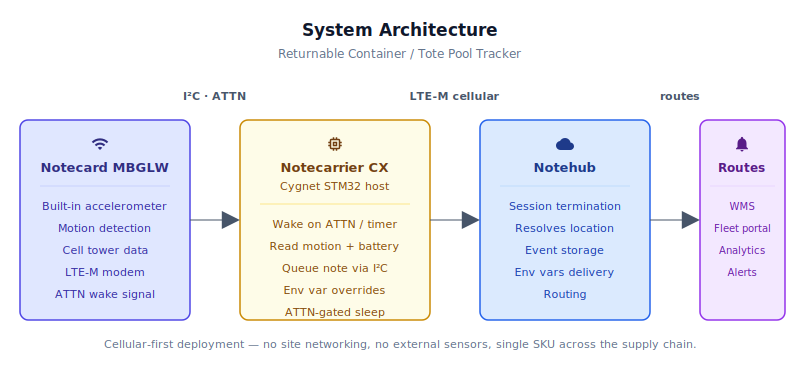
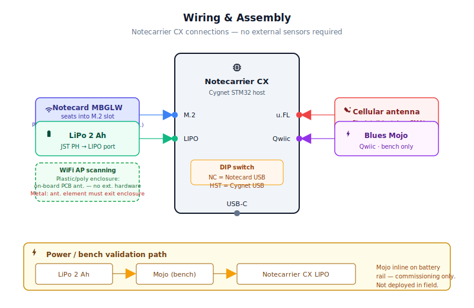
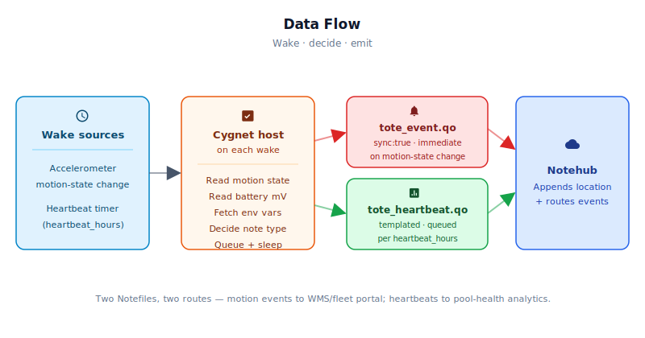

# Returnable Container / Tote Pool Tracker

<Note>

This reference application is intended to provide inspiration and help you get started quickly. It uses specific hardware choices that may not match your own implementation. Focus on the sections most relevant to your use case. If you'd like to discuss your project and whether it's a good fit for Blues, [feel free to reach out](https://blues.com/contact-sales/).

</Note>

An [asset location tracking](https://blues.com/solutions-location-tracking/) solution for reusable container pools — plastic totes, pressurized kegs, and gas cylinders — that reports location on motion events and daily heartbeats using cellular connectivity and the [Notecard's](https://shop.blues.com/products/notecard?utm_source=dev-blues&utm_medium=web&utm_campaign=store-link) built-in accelerometer. Containers emit a motion event when they start or stop moving, and a daily confirmation when idle, all over LTE-M. **This documented build is a bench/POC using a rechargeable 2 Ah LiPo battery; realistic LiPo service life is 12–24 months between battery swaps. For multi-year field deployments without scheduled swaps, see the Li-SOCl₂ primary-cell production path in [§9](#9-limitations-and-next-steps).**

**What you'll have when you're done:** a bench/POC [Notecarrier CX](https://shop.blues.com/products/notecarrier-cx?utm_source=dev-blues&utm_medium=web&utm_campaign=store-link) prototype that validates the concept end-to-end — the assembly wakes itself on motion, delivers a triangulated-location event to Notehub within a session-establishment window after the motion threshold is crossed (typically 15–60 s depending on network conditions and bucket settings), then returns to deep sleep until the next motion event or daily timer fires. No external sensors. No site networking. Operators tune heartbeat interval and motion sensitivity from Notehub without re-flashing. The LiPo power path makes this build appropriate for bench validation and limited field trials (12–24 months per charge cycle); a multi-year production deployment requires the custom carrier and Li-SOCl₂ primary-cell stack described in [§9](#9-limitations-and-next-steps).

## 1. Project Overview

**The problem.** Reusable containers are the circulatory system of supply chains — plastic totes move produce from farm to distribution center, pressurized cylinders ferry gases between filling plants and customer sites, stainless kegs make the brewery-to-bar loop thousands of times before retirement. The economics only work when the containers keep circulating. But they leak out of their pools constantly: left on a loading dock past their pickup window, mislaid in a back corner of a customer warehouse, loaded onto the wrong carrier, or simply forgotten at a rail interchange for six months. Industry estimates peg pool shrinkage at anywhere from 5% to 20% annually per container type — a quiet, diffuse cost that rarely generates a single dramatic incident but steadily erodes the pool's working capacity and replacement budget.

The underlying problem is visibility. Traditional approaches all break down somewhere in the supply chain: passive RFID barcodes require scanner infrastructure at every gate, active RFID requires per-site readers the container owner doesn't control, and manual cycle counts are expensive, slow, and never quite synchronized with reality. GPS-plus-cellular seems like the obvious fix, but pure GPS is a poor match for an asset that spends 90% of its time sitting still in a warehouse: the receiver draws tens of milliamps waiting for a fix that adds only marginal precision over simply knowing the container is "at the Memphis DC."

This project takes a better approach. The Notecard's built-in accelerometer watches for motion while the device sits in microamp sleep. When the accelerometer detects the container moving — being picked up by a forklift, loaded onto a truck, or shunted across a rail yard — it wakes the host MCU. The host queues a motion event; the Notecard delivers it over cellular and uses cell-tower and WiFi AP triangulation for location. This adds no meaningful power cost beyond the cellular session already needed to deliver the note, and it delivers site-level accuracy — sufficient to answer "is this tote at Supplier A or Customer B?" — without GPS hardware or GPS cold-start latency. A daily heartbeat confirms the device is alive even when the container sits undisturbed for a week.

**Why Notecard.** Containers crisscross supplier warehouses, customer sites, truck yards, and rail interchanges — most of which are not on any WiFi network the container owner controls. There is no realistic way to ask a customer to share their wireless network, and no consistent AP infrastructure across a national supplier base. Cellular removes every one of those dependencies and deploys identically at a Chicago cold-storage facility and a rural agri-distribution depot. Location is provided by cell-tower and WiFi AP triangulation (`mode:"wifi,cell"`) — no GPS hardware and no GPS cold-start latency. On each Notehub session the Notecard scans surrounding cell towers and, where WiFi APs are visible, scans those too; Notehub resolves both sources into a latitude/longitude and appends it to every event automatically. In AP-dense environments such as warehouses and distribution centers, WiFi augmentation can improve accuracy from the kilometer scale to tens of meters; in rural or outdoor areas with no APs the device falls back to cell-only triangulation transparently. The WiFi scan adds a modest overhead to each session startup (typically a few seconds in practice, depending on AP density and radio conditions) — negligible relative to the cellular session itself — making it an effectively free accuracy improvement in environments where APs are available. This is [asset location tracking](https://blues.com/solutions-location-tracking/) built around the actual geography of the supply chain, not a lab ideal.

**Bench and limited field-trial assembly.** This reference build uses a Notecarrier CX, a Notecard, and a rechargeable 2 Ah LiPo battery enclosed in a polycarbonate IP67 housing (Hammond 1554C2GY or equivalent — see [§3](#3-hardware-requirements)) and affixed directly to the container using non-penetrating fasteners — stainless zip ties, band clamps, cradle brackets, or industrial-grade adhesive pads depending on the container type. No wiring to the container, no site infrastructure. Battery swaps are expected every 12–24 months in a low-motion deployment, so this hardware stack is suited to bench validation and short-duration field trials rather than a multi-year production rollout. The device self-configures on first power-on and operates autonomously; fleet operators manage all devices and tune per-fleet settings from Notehub. For production deployments requiring 3–5+ years between swaps, a custom carrier board with a Li-SOCl₂ primary cell replaces the LiPo path — see [§9](#9-limitations-and-next-steps).

> **Safety: not rated for classified or explosive atmospheres.** This build uses standard commercial electronics and a LiPo battery. It is **not** ATEX, IECEx, Class I Division 2, or intrinsically safe certified, and must not be deployed in classified or explosive atmospheres — including any location where flammable gas or vapour may be present — unless the complete assembly (enclosure, battery, antenna, and all electronics) has been certified for that environment by a recognised testing body.

## 2. System Architecture



### Event Format in Notehub

The firmware emits two note types; Notehub automatically appends location and routes them independently:

**Motion event (`tote_event.qo`) — appears within ~30 s after motion threshold crossed:**

```json
{
  "file": "tote_event.qo",
  "body": {
    "event":      "departed",
    "moving":     true,
    "battery_mv": 3851.0,
    "cycle":      14
  },
  "sync": true,
  "where_lat":   35.9728,
  "where_lon":  -86.7653,
  "where_location": "Nashville TN USA",
  "where_country": "US"
}
```

**Daily heartbeat (`tote_heartbeat.qo`) — fires once per `heartbeat_hours` (default 24 h):**

```json
{
  "file": "tote_heartbeat.qo",
  "body": {
    "battery_mv":  3920.0,
    "moving":      false,
    "cycle_count": 42,
    "reason":      1
  },
  "sync": true,
  "where_lat":   35.9728,
  "where_lon":  -86.7653,
  "where_location": "Nashville TN USA"
}
```

The `reason` field is `0` (boot), `1` (heartbeat), or `2` (low battery). The `where_*` fields are appended by Notehub after cell-tower triangulation — no firmware code required to produce location data.

**Device-side responsibilities.** The onboard Cygnet STM32 host on the Notecarrier CX handles duty-cycle management and decision logic. On each wake — triggered by either a motion-state change or the daily heartbeat timer — the Cygnet evaluates why it woke, formats the appropriate note, queues it to the Notecard over I²C, and returns to sleep within seconds. The host MCU is powered off entirely between wakes by the Notecard's ATTN pin: the host rail draws essentially zero current during idle periods, which can be 23+ hours out of every 24. All accelerometer monitoring runs on the Notecard's own low-power IMU; the Cygnet is only involved for the seconds it takes to queue a note.

**Notecard responsibilities.** The Notecard continuously monitors its built-in accelerometer for motion-state changes, firing the ATTN pin as soon as the configured motion threshold is crossed. On each Notehub session it scans surrounding cell towers and nearby WiFi APs for [cell-tower and WiFi triangulation](https://dev.blues.io/blog/cell-tower-wifi-triangulation-without-gps/), which Notehub resolves to a latitude/longitude and appends to every event automatically — no per-event firmware code required. The Notecard queues [Notes](https://dev.blues.io/api-reference/glossary/#note) locally through outages and delivers them in order when connectivity returns. [Environment variables](https://dev.blues.io/guides-and-tutorials/notecard-guides/understanding-environment-variables/) pushed from Notehub are delivered on each inbound sync and decoded by the Cygnet on its next wake, allowing threshold tuning without a firmware update or a truck roll.

**Notehub responsibilities.** The [Notecard](https://shop.blues.com/products/notecard?utm_source=dev-blues&utm_medium=web&utm_campaign=store-link) manages its own cellular session against the supported carrier networks worldwide via its embedded global SIM and delivers data to [Notehub](https://notehub.io) over the Internet; [Notehub](https://dev.blues.io/notehub/notehub-walkthrough/) ingests events, stores every event, resolves cell-tower data to human-readable location, and applies project-level routes. Events land in two separate [Notefiles](https://dev.blues.io/api-reference/glossary/#notefile) — `tote_event.qo` for motion events and `tote_heartbeat.qo` for daily heartbeats — so routes can be configured to fan them to different destinations at different urgencies without filter logic in the route itself. [Fleets](https://dev.blues.io/guides-and-tutorials/fleet-admin-guide/) and [Smart Fleets](https://dev.blues.io/notehub/notehub-walkthrough/#using-smart-fleet-rules) group devices for shared configuration, allowing per-fleet environment variable overrides (e.g., different motion thresholds for totes versus kegs versus cylinders without separate firmware builds).

**Routing to the cloud (high level only).** Notehub supports HTTP, MQTT, AWS, Azure, GCP, Snowflake, and several other destinations; route setup is project-specific. See the [Notehub routing docs](https://dev.blues.io/notehub/notehub-walkthrough/#routing-data-with-notehub) — this project ships no specific downstream endpoint. A typical fleet integration routes `tote_event.qo` to a warehouse management system (WMS) or custom fleet portal in real-time, and `tote_heartbeat.qo` to long-term storage for pool health analytics.

## 2.5 Quickstart

1. Clone this repo and open `/firmware/tote_pool_tracker/tote_pool_tracker.ino` in Arduino IDE.
2. Replace the empty `#define PRODUCT_UID ""` with your Notehub project's ProductUID.
3. Install the **Arduino Core for STM32** and **Blues Wireless Notecard** library (see [§6.1](#61-installing-and-flashing)).
4. Select board **Generic STM32L4 series → Cygnet** under **Tools → Board**.
5. Click **Upload**. The Notecarrier CX's ST-Link interface appears as a USB device — no external programmer needed.
6. Power the assembly (USB or battery). On first cellular connect, the device auto-associates with your Notehub project. Within 1–2 minutes it appears in the **Devices** tab.
7. Tap or shake the assembly firmly for 3–4 seconds. A `tote_event.qo` with `"event":"departed"` should arrive in Notehub within ~30 seconds. Set it down; after 30 s of stillness, a `"event":"arrived"` follows.

Detailed assembly, firmware, and Notehub configuration follow in the sections below.

## 3. Hardware Requirements

> **Bench/POC BOM.** The components below equip the bench prototype documented here — the Notecarrier CX and its LiPo charge path are the right platform for bench validation and limited field trials. A production deployment targeting 3–5+ years between swaps requires a custom carrier board with a direct +VBAT input and a Li-SOCl₂ primary cell instead of the LiPo; see [§10](#10-limitations-and-next-steps) for that path.

| Part | Qty | Rationale |
|------|-----|-----------|
| [Notecarrier CX](https://shop.blues.com/products/notecarrier-cx?utm_source=dev-blues&utm_medium=web&utm_campaign=store-link) | 1 | Integrated carrier with an onboard Cygnet STM32 host MCU — no separate host board needed. ATTN power-gating cuts the Cygnet power rail entirely during sleep. |
| [Notecard Cell+WiFi (MBGLW)](https://dev.blues.io/datasheets/notecard-datasheet/note-mbglw/) | 1 | Cellular connectivity plus built-in accelerometer for motion detection. The Cell+WiFi variant enables both cell-tower and WiFi AP triangulation (`mode:"wifi,cell"`), improving location accuracy in AP-dense environments while transparently falling back to cell-only where no APs are present. Per the [NOTE-MBGLW datasheet antenna requirements](https://dev.blues.io/datasheets/notecard-datasheet/note-mbglw/#antenna-requirements), the MBGLW includes a PCB antenna for its WiFi function; **no external WiFi hardware is needed in plastic or polycarbonate enclosures** — the on-board PCB antenna scans nearby WiFi APs through non-metallic walls without modification. The MBGLW also exposes a dedicated WiFi U.FL connector so a 2.4 GHz external antenna can be substituted; other Blues reference builds that deploy the same Notecard inside a metal enclosure (e.g., a commercial HVAC RTU sidecar) do connect an external lead to this connector — that is a consequence of the metal enclosure blocking the on-board PCB antenna's 2.4 GHz signal, not a different hardware topology on the Notecard itself. In this plastic-tote deployment the on-board PCB antenna is the correct and sufficient choice. In metal-enclosure or metal-bodied-container installations, the metal itself shields the 2.4 GHz signal regardless of which antenna is connected internally — both the on-board PCB antenna and any antenna placed entirely inside the metal box are equally blocked; WiFi AP triangulation will be degraded unless the antenna's radiating element is mounted outside the metal shell or positioned behind a verified non-metallic RF window — see the optional WiFi antenna row below. |
| [Blues Mojo](https://shop.blues.com/products/mojo?utm_source=dev-blues&utm_medium=web&utm_campaign=store-link) *(commissioning/validation)* | 1 | Coulomb counter spliced inline on the battery rail for ground-truth energy validation during bring-up. Not deployed with the field tracker; kept at the bench as commissioning and regression-testing equipment. |
| [SparkFun Lithium Ion Battery — 2 Ah (PRT-13855)](https://www.sparkfun.com/products/13855) | 1 | 3.7 V / 2000 mAh LiPo with JST PH connector matching the Notecarrier CX battery port. POC power source; realistic service life is 12–24 months — see [§10](#10-limitations-and-next-steps) for the Li-SOCl₂ production path. |
| [Hammond Manufacturing 1554C2GY](https://www.hammfg.com/part/1554C2GY) *(field deployment enclosure — IP67/NEMA 4X)* | 1 | 120 × 65 × 40 mm UV-stabilized polycarbonate enclosure, NEMA 4X / IP67–IP68, silicone gasket, flat lid. Internal cavity (~113 × 58 × 34 mm) fits the Notecarrier CX (76 × 38 mm board) oriented lengthwise with the LiPo pack lying flat on top of the board. Rated for outdoor service at truck yards, rail interchanges, port terminals, and keg/cylinder washdown environments. Clear-lid variant **1554C2GYCL** available for installations where visual LED inspection through the lid is useful. Stocked at Mouser, DigiKey, and RS Components. |
| [Hammond Manufacturing 1591XXBSFLBK](https://www.hammfg.com/part/1591XXBSFLBK) *(bench bring-up only — IP54, not suitable for outdoor or field deployment)* | 1 | 113 × 63 × 28 mm ABS enclosure, IP54, flanged gasketed lid with integral PCB standoffs. Adequate for bench bring-up and sheltered indoor environments only. **Do not use for outdoor field deployment** — truck yards, rail interchanges, port terminals, and container washdown workflows require a minimum IP67 enclosure; use the Hammond 1554C2GY above. Available from Hammond, Mouser, and RS Components. |
| [SparkFun SMA to U.FL Cable — 150 mm (WRL-18568)](https://www.sparkfun.com/sma-to-u-fl-cable-150mm.html) *(optional, external antenna path)* | 1 | Routes the cellular signal from the Notecard's u.FL socket to an SMA female connector seated in the enclosure wall. Required only for enclosed or stacked-container deployments where the bundled patch antenna has insufficient sky view. |
| [SparkFun LTE Hinged External Antenna — 698 MHz–2.7 GHz, SMA Male (CEL-16432)](https://www.sparkfun.com/lte-hinged-external-antenna-698mhz-2-7ghz-sma-male.html) *(optional)* | 1 | Stub antenna (SMA male, 2.3 dBi) covering all LTE-M bands globally; screws directly onto the SMA female end of the pigtail after threading the pigtail's SMA connector through a ¼″ panel hole in the enclosure wall. **Alternate:** [Taoglas TG.30.8113](https://www.taoglas.com/product/apex-tg-30-2g3g4g-terminal-antenna-hinged-ra-sma-m/) (3 dBi, 698–2700 MHz, hinged SMA male) for ~0.7 dB higher gain in challenging coverage environments. |
| [Blues Flexible Cellular/Wi-Fi Antenna (SKU 233-00006)](https://shop.blues.com/products/flexible-cellular-or-wi-fi-antenna?utm_source=dev-blues&utm_medium=web&utm_campaign=store-link) *(optional — only useful if the radiating element can be placed outside any metal shielding)* | 1 | 85 mm × 14.5 mm flexible FPC antenna (Molex), 698 MHz–4.0 GHz, 180 mm u.FL coaxial tail. Connect to the Notecard's **WiFi U.FL connector**. For metal-enclosure or metal-bodied installations: this antenna is only effective if the radiating element is routed **outside** the metal — through a cable gland or behind a dedicated non-metallic RF window in the enclosure wall. An antenna placed entirely inside a metal enclosure is still shielded by the metal and provides no improvement over the on-board PCB antenna. **Not required for plastic or polycarbonate enclosures**, where the MBGLW's on-board PCB WiFi antenna scans nearby APs through the non-metallic walls without modification. |
| [Essentra Components CG-M16-1-BK Cable Gland, M16, IP68](https://www.essentracomponents.com/en-us/p/cable-glands-straight/cg-m16-1-bk) *(optional, cable-through variant only)* | 1 | Only required if substituting a remote-mount antenna with an integrated SMA cable for the stub antenna above (e.g., a magnetic-mount antenna on the exterior of the shipping container). Seals the cable exit through the enclosure wall; accepts 3–10 mm cable diameters. |

Blues hardware ships with an active SIM including 500 MB of data and 10 years of service — no activation fees, no monthly commitment.

## 4. Wiring and Assembly



No external sensors are required for this project — the Notecard's built-in accelerometer handles all motion detection, and the MBGLW's on-board PCB WiFi antenna handles WiFi AP scanning with no external hardware in plastic or polycarbonate enclosures. Assembly is five steps: seating the Notecard, connecting the antennas, connecting the battery, (optionally) splicing in the Mojo for bench validation, and closing the enclosure.

**1. Notecard.** Slide the Notecard Cell+WiFi (MBGLW) into the Notecarrier CX's M.2 slot, label-side up, and press until it seats. The Notecarrier CX's Cygnet host communicates with the Notecard over the I²C bus routed through the M.2 interface — no jumper wires or external connectors needed.

**2. Antennas.** The MBGLW has two antenna connections.

*Cellular:* Connect the bundled cellular patch antenna to the Notecard's cellular **u.FL** connector. For sealed polycarbonate enclosures or stacked-container deployments where the patch antenna has limited sky view, route a u.FL-to-SMA pigtail to an external stub antenna through a cable gland in the enclosure wall (see BOM optional items). The bundled patch antenna is sufficient for bench testing and most open-top plastic housings.

*WiFi:* Per the [NOTE-MBGLW datasheet antenna requirements](https://dev.blues.io/datasheets/notecard-datasheet/note-mbglw/#antenna-requirements), the MBGLW includes a PCB antenna for its WiFi function — **no connection or external hardware is needed** for plastic or polycarbonate enclosures. The on-board PCB antenna scans nearby APs through the non-metallic walls at each Notehub session, and Notehub resolves that data to a location automatically. The MBGLW also exposes a WiFi U.FL connector; an external 2.4 GHz antenna can be substituted there when the enclosure material demands it. Reference builds that deploy the same Notecard inside a fully metal enclosure do use an external lead connected to this WiFi U.FL connector — that is because the metal enclosure blocks the on-board PCB antenna's 2.4 GHz signal equally; the connector exists on every MBGLW unit regardless. In this plastic-tote deployment the on-board PCB antenna is the correct choice and no WiFi U.FL connection is required. If the device will be housed in a metal enclosure or mounted within a metal-bodied container, note that metal shields the 2.4 GHz signal: **both the on-board PCB antenna and any antenna left entirely inside the metal are equally blocked**, so simply connecting a flex antenna to the WiFi U.FL connector without routing it outside the metal will not help. To retain WiFi AP scanning in a shielded installation, the antenna's radiating element must be positioned outside the metal shell — route a 2.4 GHz u.FL antenna (e.g., Blues Flexible Cellular/Wi-Fi Antenna, SKU 233-00006) through a cable gland or position it behind a non-metallic RF window in the enclosure wall, then connect the u.FL tail to the Notecard's **WiFi U.FL connector**. Where WiFi scanning is not essential, the device will fall back to cell-only triangulation transparently.

**3. Battery.** Connect the SparkFun 2 Ah LiPo to the Notecarrier CX's 2-pin JST PH battery connector (labeled `LIPO`). Polarity is enforced by the keyed connector; do not force a reversed pack. The Notecarrier CX includes a LiPo charge circuit — the battery charges when USB power is present and the tracker runs from battery when USB is removed.

**4. Mojo (bench bring-up only).** For power validation during development, splice the Mojo inline between the LiPo JST connector and the Notecarrier CX `LIPO` input: Mojo's `BAT+` / `BAT-` connects to the battery, and Mojo's `LOAD+` / `LOAD-` connects to the Notecarrier CX. The Mojo Qwiic connector attaches to the Notecarrier CX's Qwiic port; it reports cumulative mAh to the Notecard over I²C. This measurement covers the full assembly — Cygnet plus Notecard — under battery conditions. **Note:** this firmware does not read Mojo data over I²C or publish any Mojo telemetry in Notes; Mojo is used exclusively as a bench commissioning and regression-testing instrument and is not deployed with the field tracker.

**5. Enclosure.** Mount the board and battery in the polycarbonate enclosure (Hammond 1554C2GY for field deployment; 1591XXBSFLBK for bench-only) with any external cellular antenna cable routed through a cable gland. Affix the housing to the container using non-penetrating fasteners only: stainless zip ties or hose-clamp style straps on plastic totes, band clamps or collar brackets on kegs and cylinders, industrial-grade VHB adhesive pads on flat polymer surfaces.

> **Safety: pressurized vessels must not be drilled or tapped.** Kegs, gas cylinders, and any other pressurized container must never be drilled, tapped, welded, or structurally modified in any way to mount a tracker. Use only external band clamps, collar brackets, or strap-style mounts that attach to the vessel's exterior surface without breaching its structural integrity.

> **Safety: not rated for classified or explosive atmospheres.** This assembly is not ATEX, IECEx, Class I Division 2, or intrinsically safe certified. Do not deploy it in any classified or explosive atmosphere — including flammable-gas environments associated with certain gas-cylinder applications — without a fully certified enclosure, battery, antenna, and complete assembly.

> **Important: ATTN pin power-gating.** The Notecarrier CX routes the Notecard's ATTN pin to the Cygnet's power-enable input, which is what allows `NotePayloadSaveAndSleep` to cut the host rail entirely between cycles — dropping the Cygnet to essentially zero current draw. If you adapt this firmware to a different carrier board, verify that the ATTN-to-host-power wiring is equivalent. Without it, the host never actually powers off and battery life suffers dramatically. See the [Attention Pin Guide](https://dev.blues.io/guides-and-tutorials/notecard-guides/attention-pin-guide/) for wiring details.

## 5. Notehub Setup

**1. Create a project.** Sign up at [notehub.io](https://notehub.io) and [create a project](https://dev.blues.io/quickstart/notecard-quickstart/notecard-and-notecarrier-pi/#set-up-notehub). Copy the [ProductUID](https://dev.blues.io/notehub/notehub-walkthrough/#finding-a-productuid) — it looks like `com.your-company.your-name:tote-tracker`.

**2. Set the ProductUID in firmware.** Open [`tote_pool_tracker.ino`](firmware/tote_pool_tracker/tote_pool_tracker.ino) and replace the empty string on the `#define PRODUCT_UID ""` line (near the top) with your value. Alternatively, pass it as a build flag: `-DPRODUCT_UID=\"com.your-company.your-name:tote-tracker\"`.

**3. Claim the device.** Power the assembly. On first cellular connect the Notecard associates with your Notehub project automatically — no manual claim step required. The device appears in the **Devices** tab within a minute or two.

**4. Organize into Fleets.** [Fleets](https://dev.blues.io/guides-and-tutorials/fleet-admin-guide/) group devices for shared configuration. A natural grouping for a mixed container pool is one fleet per container type (totes, kegs, cylinders) or per customer region — each fleet can carry different `motion_threshold` values tuned to the handling environment. [Smart Fleets](https://dev.blues.io/notehub/notehub-walkthrough/#using-smart-fleet-rules) can auto-assign new devices to the correct fleet based on device name or serial number prefix, avoiding manual configuration at scale.

**5. Set environment variables.** In Notehub, select the fleet you created above and navigate to **Environment** (left sidebar). These variables are optional; firmware defaults are shown. The device fetches them on its next inbound sync — changes take effect without re-flashing.

| Variable | Default | Purpose |
|---|---|---|
| `heartbeat_hours` | `24` | Hours between heartbeat notes when the container is stationary. Range: 1–168. Longer intervals extend battery life; shorter intervals keep "last-seen" timestamps fresh. Heartbeat notes are sent with `sync:true`, so each fires its own cellular session immediately — delivery is not dependent on the `outbound` periodic timer. Changing this value reapplies `hub.set outbound/inbound` in the same wake cycle to keep the Notecard's inbound polling cadence (environment variable pulls) aligned with the heartbeat schedule. |
| `low_battery_mv` | `3300` | Battery rail voltage (mV) below which the heartbeat note's `reason` code becomes `2` (low battery). Use as a signal to schedule a battery swap before the tracker goes dark. |
| `motion_threshold` | `5` | Accelerometer events per time bucket required before the Notecard calls the container "moving." Raise if totes trigger false departures from vibrating dock floors; lower for gentle-handling environments like roller conveyors. Range: 1–20. |
| `motion_bucket_sec` | `30` | Duration of each accelerometer counting bucket (seconds). Paired with `motion_threshold` to tune sensitivity vs. response latency. Range: 5–300. |

**6. Configure routes.** Add one [route](https://dev.blues.io/notehub/notehub-walkthrough/#routing-data-with-notehub) for `tote_event.qo` (immediate motion events — WMS, fleet portal, or alert webhook) and a second for `tote_heartbeat.qo` (daily pool health — long-term analytics store). Separate Notefiles at the source let each route target a different destination and urgency level without any filtering logic in the route.

### What to expect in Notehub

The Notecard initiates an early session on first boot, so events typically appear within a few minutes. Exact timing depends on network registration and initial sync; a weak-signal site or busy carrier can push first appearance to 5–10 minutes. Once registered, the **Events** tab should show:

- **`_session.qo`** — automatic Notecard housekeeping on each cellular session. Confirms the radio is reaching Notehub.
- **`tote_heartbeat.qo`** — one per `heartbeat_hours` (default 24 h), sent with `sync:true` so each arrives in Notehub within a session-establishment window of the on-device timer firing. The `reason` field is `0` on first power-on (boot), `1` on subsequent timer wakes (heartbeat), and `2` when the battery is below `low_battery_mv`. Notehub appends `where_lat`, `where_lon`, and `where_location` once cell-tower data has been resolved.
- **`tote_event.qo`** — emitted with `sync:true` when the configured motion threshold is crossed (container starts or stops moving). The `event` field is `"departed"` (stopped → moving) or `"arrived"` (moving → stopped).

## 6. Firmware Design

The firmware spans three files in the `firmware/` directory — keep all three together:

| File | Role |
|------|------|
| [`tote_pool_tracker.ino`](firmware/tote_pool_tracker/tote_pool_tracker.ino) | Main sketch — `setup()`, `loop()`, global definitions |
| [`tote_pool_tracker_helpers.h`](firmware/tote_pool_tracker/tote_pool_tracker_helpers.h) | Shared types, constants, and `extern` declarations |
| [`tote_pool_tracker_helpers.cpp`](firmware/tote_pool_tracker/tote_pool_tracker_helpers.cpp) | All helper-function implementations |

The Arduino toolchain automatically compiles the `.h` and `.cpp` alongside the `.ino` when you open or build the sketch directory.

### 6.1 Installing and flashing

**Dependencies:**

- **Arduino core for STM32** — [`stm32duino/Arduino_Core_STM32`](https://github.com/stm32duino/Arduino_Core_STM32). Add the index URL `https://github.com/stm32duino/BoardManagerFiles/raw/main/package_stmicroelectronics_index.json` under **File → Preferences → Additional Boards Manager URLs**. Select **Generic STM32L4 series → Cygnet** as the board target.
- **`Blues Wireless Notecard`** library — [`note-arduino`](https://github.com/blues/note-arduino). Install via the Arduino Library Manager (search "Blues Wireless Notecard") or `arduino-cli lib install "Blues Wireless Notecard"`. See the [note-arduino releases page](https://github.com/blues/note-arduino/releases) for the version available when you install.

**Flashing — Arduino IDE:** Open `firmware/tote_pool_tracker/tote_pool_tracker.ino`, select the Cygnet board under Tools → Board, and click Upload. The Notecarrier CX presents the ST-Link interface over USB — no external programmer needed.

**Flashing — `arduino-cli`:**

```bash
# Identify the correct FQBN for your installed core version
arduino-cli board listall | grep -i cygnet

# Compile and upload — point at the sketch *directory* so arduino-cli
# picks up tote_pool_tracker_helpers.cpp automatically.
# Replace the FQBN and port with what listall reports.
arduino-cli compile -b STMicroelectronics:stm32:GenL4:pnum=CYGNET firmware/tote_pool_tracker
arduino-cli upload  -b STMicroelectronics:stm32:GenL4:pnum=CYGNET -p /dev/cu.usbmodem* firmware/tote_pool_tracker
```

Replace `/dev/cu.usbmodem*` with the actual port — `COMx` on Windows, `/dev/ttyACM*` on Linux.

After upload, serial output is **disabled by default** — release builds intentionally omit Serial calls to avoid the ~1 mA UART wake-time penalty on a battery-powered device. To enable logging, uncomment `#define DEBUG` in `firmware/tote_pool_tracker/tote_pool_tracker_helpers.h` and reflash; then open the serial monitor at **115200 baud** to watch each wake cycle. The host prints a few lines of output on first boot and on each subsequent wake, then goes quiet during sleep — a few seconds of activity per cycle is normal.

### 6.2 Modules

| Responsibility | Function |
|---|---|
| Notecard one-time configuration (`hub.set`, `card.voltage`, `card.triangulate`, `card.motion.mode`) | `notecardConfigure()` |
| Heartbeat Notefile template registration | `defineTemplates()` |
| Environment variable fetch and clamped override | `fetchEnvOverrides()` |
| Motion configuration reapplication when env vars change | inline in `setup()` after `fetchEnvOverrides()` |
| `hub.set` outbound/inbound reapplication when `heartbeat_hours` changes | inline in `setup()` after `fetchEnvOverrides()` |
| Motion state read from Notecard accelerometer | `readMotionMoving()` |
| Battery voltage read from Notecard rail monitor | `readBatteryMv()` |
| Immediate motion event emission (`sync:true`) | `sendMotionEvent()` |
| Immediate daily heartbeat emission (`sync:true`, template-backed) | `sendHeartbeat()` |
| State serialization, sleep arming, and host power-off | `enterSleep()` |

### 6.3 Motion and location strategy

Motion detection runs entirely on the Notecard's built-in accelerometer, configured via [`card.motion.mode`](https://dev.blues.io/api-reference/notecard-api/card-requests/#card-motion-mode). The `motion` parameter sets a threshold: how many accelerometer events must occur within a configurable time bucket before the Notecard transitions the motion status from `"stopped"` to `"moving"` (or vice versa). When the status changes, the Notecard fires the ATTN pin, which wakes the Cygnet host. Reading the current status is a simple `card.motion` request — the Notecard returns `"mode":"moving"` or `"mode":"stopped"`.

Location is provided by [`card.triangulate`](https://dev.blues.io/notecard/notecard-walkthrough/time-and-location-requests/#using-cell-tower-and-wifi-triangulation) configured with `mode:"wifi,cell"` — both cell-tower scanning and WiFi AP scanning are enabled. On each Notehub session the Notecard scans surrounding cell towers and nearby WiFi APs; Notehub resolves the combined data to a latitude/longitude and appends the resolved position (`where_lat`, `where_lon`, `where_location`, `where_country`) to every event automatically — no GPS hardware and no per-event firmware code required. In AP-dense environments such as warehouses and distribution centers, WiFi augmentation improves accuracy from the kilometer scale to tens of meters. Where no APs are detectable the Notecard falls back to cell-only triangulation transparently. The WiFi scan adds a modest overhead to session startup (typically a few seconds in practice, depending on AP density and radio conditions) — negligible relative to the LTE-M cellular session — making it an effectively free accuracy improvement in AP-rich environments. For this use case — determining which site or city a container is at — cell-plus-WiFi triangulation delivers the right precision at far lower power than GPS. WiFi AP scanning uses the MBGLW's on-board PCB WiFi antenna and works through plastic and polycarbonate enclosure walls without any external hardware; in metal-enclosure or metal-shielded installations the 2.4 GHz signal is blocked and WiFi AP triangulation will be degraded unless the antenna's radiating element is positioned outside the metal shell (see [§4](#4-wiring-and-assembly)).

### 6.4 Event payload design

**`tote_event.qo`** (motion events, untemplated, `sync:true`):

```json
{
  "file": "tote_event.qo",
  "body": {
    "event":      "arrived",
    "moving":     false,
    "battery_mv": 3851.0,
    "cycle":      14
  },
  "sync": true
}
```

Motion events are untemplated — they're low-volume (at most a handful per day per container) and the flexible JSON schema is useful while the design evolves. `sync:true` tells the Notecard to bypass the `outbound` cadence timer and initiate a cellular session as soon as the note is queued, so the event typically reaches Notehub within a session-establishment window of 15–60 s after the motion threshold is crossed (depending on network conditions and the configured bucket duration). Notehub appends triangulated `where_*` fields before forwarding to any configured routes.

**`tote_heartbeat.qo`** (daily, `sync:true`, [template-backed](https://dev.blues.io/notecard/notecard-walkthrough/low-bandwidth-design/#working-with-note-templates)):

```json
{
  "file": "tote_heartbeat.qo",
  "sync": true,
  "body": {
    "battery_mv":  3920.0,
    "moving":      false,
    "cycle_count": 42,
    "reason":      1
  }
}
```

`sync:true` causes the Notecard to open a cellular session as soon as the note is queued, guaranteeing that each daily heartbeat arrives in Notehub within a session-establishment window of the on-device timer firing — not deferred to the next periodic outbound sync, and not dependent on whether a motion-triggered session happens to occur first. Heartbeats use a Note template registered at cold boot. All four fields are fixed-width — `battery_mv` (4-byte float), `moving` (1-byte bool), `cycle_count` (4-byte uint), `reason` (1-byte int) — so every record encodes as a compact fixed-length binary entry on the Notecard rather than a variable-length JSON blob. Over a three-year deployment at one heartbeat per day, the bandwidth saving relative to raw JSON is material on a constrained SIM data plan. The `reason` field is a numeric code: `0` = boot (first power-on), `1` = heartbeat (normal timer wake), `2` = heartbeat_low_battery (battery below `low_battery_mv`). Using a numeric type keeps the record fully fixed-width.

### 6.5 Low-power strategy

The firmware's entire application logic runs in `setup()`. After queuing the appropriate note, `enterSleep()` serializes the device state into the Notecard and calls `NotePayloadSaveAndSleep()`, which issues a [`card.attn`](https://dev.blues.io/api-reference/notecard-api/card-requests/#card-attn) request with `mode:"sleep,arm,motionchange"` and a `seconds` value equal to the remaining time until the absolute `next_heartbeat_epoch` deadline — so motion wakes re-arm only the time still owed rather than resetting a fresh full interval. When the epoch is unavailable (before the first cellular sync), the function falls back to the full configured interval. When `failed_send_count` is non-zero, sleep is additionally capped at `RETRY_WAKE_SEC` (15 min) so a pending note is retried promptly. The Notecard pulls the ATTN pin low; the Notecarrier CX's ATTN-to-power-enable circuit then cuts power to the Cygnet entirely. The host MCU cold-boots from `setup()` on every wake — `loop()` is never reached.

The `"arm,motionchange"` addition to the sleep mode means the Notecard wakes the host on whichever fires first: a motion-state transition (accelerometer threshold crossed) or the heartbeat timer expiry. The `arm` keyword is required for `motionchange` to actually fire ATTN during the sleep window — without it, the keyword is accepted in the mode string but the wake source is never armed (per the [asset tracking guide](https://dev.blues.io/guides-and-tutorials/notecard-guides/asset-tracking-with-gps/#wake-host-or-send-note-on-motion-status-change)). Sleep current remains very low (the Cygnet is completely off), but total battery energy is driven mainly by the number of cellular sessions — each daily heartbeat and each `"departed"`/`"arrived"` motion event initiates its own cellular session via `sync:true`. A container that moves several times per day therefore burns materially more energy than one that sits still for a week.

Both note types are queued with `sync:true`, which causes the Notecard to open a cellular session as soon as the note is ready, bypassing the `outbound` cadence timer entirely. This guarantees that each daily heartbeat arrives in Notehub within a session-establishment window of the on-device timer firing — not deferred to the next periodic outbound sync, and unaffected by any intervening motion-triggered sessions. [`hub.set`](https://dev.blues.io/api-reference/notecard-api/hub-requests/#hub-set) `outbound`/`inbound` is still set to match `heartbeat_hours` and is reapplied at runtime whenever the value changes, keeping the Notecard's inbound polling cadence — which pulls environment variable updates from Notehub — aligned with the heartbeat schedule.

### 6.6 Retry and error handling

- The first Notecard request (`hub.set` inside `notecardConfigure()`) uses `sendRequestWithRetry(req, 10)` to handle the known cold-boot I²C race condition where the Cygnet comes up before the Notecard is ready to accept transactions.
- `readMotionMoving()` returns the previously-saved `was_moving` state if `card.motion` returns NULL, preventing a transient I²C failure from being misinterpreted as a genuine motion-state change and triggering a spurious event.
- `readBatteryMv()` returns `0.0` on NULL response. The `battery_mv: 0` sentinel value in a note is distinguishable from a normal in-range reading and serves as a flag that the voltage was unavailable, rather than silently substituting a misleading non-zero value.
- `fetchEnvOverrides()` commits resolved environment values to both the runtime `g_*` globals and the `g_state.desired_*` fields persisted across sleep. On failure (NULL response or Notecard error) neither is modified, so a transient connectivity outage cannot silently revert fleet tuning to compile-time defaults.
- After `fetchEnvOverrides()` returns, `setup()` compares the desired `g_motion_threshold` / `g_motion_bucket_sec` values against `g_state.last_applied_motion_threshold` / `g_state.last_applied_motion_bucket_sec`. When they differ, `card.motion.mode` is reissued and the `last_applied_*` fields are updated only on a confirmed success — so a failed reissue is retried automatically on the next wake.
- `heartbeat_hours` is handled identically via `g_state.last_applied_heartbeat_hours`: a desired value that differs from the last applied triggers a `hub.set` reissue with the updated `outbound`/`inbound` cadence in the same wake cycle. The absolute heartbeat deadline is also reanchored immediately to the new interval (when a valid epoch is available), so the device starts sleeping toward the updated schedule without first exhausting the old one.
- On a retry wake where the pending note finally succeeds, Branch 2 compares the current motion state against `g_state.pending_moving` — the motion state captured when the pending record was originally created — and emits a follow-up event if they differ. For example: if a `"departed"` note fails and the container stops before the retry succeeds, `pending_moving` is `true` (container was moving at the time the event was queued), `now_moving` is `false`, and an `"arrived"` event is emitted on the same retry wake. `pending_moving` is used as the baseline rather than `g_state.was_moving` because `was_moving` is updated at the end of every wake including failed retry wakes, so it converges toward the current motion state across multiple retries and would suppress the comparison; `pending_moving` is written exactly once per pending record and never modified during retries. **Design limitation:** the firmware holds at most one note pending at a time. If the container transitions more than once during an extended retry period, only the final motion state is compared against the original baseline; intermediate transitions that reverse and then reverse again are not recoverable with this single-pending-note model.

### 6.7 Key code snippet 1: combined motion + timer sleep

After queuing the wake-cycle note, the firmware serializes state and arms a dual-condition sleep. Sleep duration is computed from the remaining time to the absolute heartbeat deadline so motion wakes do not reset the daily schedule; it is further capped at `RETRY_WAKE_SEC` when a note needs retrying.

```cpp
void enterSleep(uint32_t now_epoch) {
    NotePayloadDesc payload = {0, 0, 0};
    NotePayloadAddSegment(&payload, STATE_SEG_ID, &g_state, sizeof(g_state));

    // Sleep for the remaining time to the absolute deadline so that motion
    // wakes do not reset the daily schedule. Falls back to the full interval
    // when the epoch is unavailable (before first cellular sync).
    uint32_t sleep_sec = g_heartbeat_hours * 3600UL;
    if (now_epoch > 0 && g_state.next_heartbeat_epoch > now_epoch) {
        sleep_sec = g_state.next_heartbeat_epoch - now_epoch;
    }

    // Cap at RETRY_WAKE_SEC when a note.add failed this wake so the pending
    // note is retried promptly rather than waiting a full heartbeat interval.
    if (g_state.failed_send_count > 0 && RETRY_WAKE_SEC < sleep_sec) {
        sleep_sec = RETRY_WAKE_SEC;
    }

    // "arm,motionchange" adds a second wake source: ATTN also fires if the
    // accelerometer-based motion status changes before the timer expires.
    // "arm" is required so motionchange actually arms — without it the
    // keyword is silently accepted but the wake source never fires.
    NotePayloadSaveAndSleep(&payload, sleep_sec, "arm,motionchange");

    // Execution normally never reaches here — the Notecard cuts Cygnet power.
    delay(30000);
}
```

### 6.8 Key code snippet 2: cell-tower and WiFi AP triangulation configuration

Configured once at cold boot. On every subsequent Notehub session the Notecard scans cell towers and nearby WiFi APs automatically; Notehub resolves the combined data and appends the position to each event.

```cpp
J *req = notecard.newRequest("card.triangulate");
JAddStringToObject(req, "mode", "wifi,cell");
JAddBoolToObject(req, "on",  true);
JAddBoolToObject(req, "set", true);
notecard.sendRequest(req);
```

### 6.9 Key code snippet 3: motion event with immediate sync

`sync:true` bypasses the outbound cadence timer and initiates a cellular session as soon as the note is queued. The event typically reaches Notehub within a session-establishment window of 15–60 s after the motion threshold is crossed.

```cpp
J *req = notecard.newRequest("note.add");
JAddStringToObject(req, "file", FILE_EVENTS);
JAddBoolToObject(req,   "sync", true);
J *body = JAddObjectToObject(req, "body");
JAddStringToObject(body, "event",      event_type);  // "departed" or "arrived"
JAddBoolToObject(body,   "moving",     moving);
JAddNumberToObject(body, "battery_mv", battery_mv);
JAddNumberToObject(body, "cycle",      (int)g_state.cycle_count);
notecard.sendRequest(req);
```

### 6.10 Key code snippet 4: heartbeat note template

All four fields are fixed-width, so every heartbeat record encodes as a compact fixed-length binary entry. `TFLOAT32`, `TBOOL`, and `TUINT32` are type-hint macros from note-c; `11` is the note template system's 1-byte integer placeholder (as used throughout the reference accelerators).

```cpp
J *req = notecard.newRequest("note.template");
JAddStringToObject(req, "file", FILE_HEARTBEAT);
JAddNumberToObject(req, "port", 10);
J *body = JAddObjectToObject(req, "body");
JAddNumberToObject(body, "battery_mv",  TFLOAT32); // 4 bytes — IEEE-754 float
JAddBoolToObject(body,   "moving",      TBOOL);    // 1 byte  — boolean
JAddNumberToObject(body, "cycle_count", TUINT32);  // 4 bytes — unsigned 32-bit int
JAddNumberToObject(body, "reason",      11);       // 1 byte  — 0=boot,1=heartbeat,2=low_battery
notecard.sendRequest(req);
```

## 7. Data Flow



**Collected.** On each wake cycle: current motion state (`"moving"` or `"stopped"` from the Notecard's internal accelerometer), battery voltage from the Notecard's rail monitor, and the wake-cycle counter. No external sensors are read; the Cygnet is active for only a few seconds per cycle.

**Transmitted.**

- `tote_event.qo` — queued with `sync:true` on every motion-state transition; the Notecard initiates a cellular session as soon as the note is ready, bypassing the outbound cadence timer. A normally-active container generates a `"departed"` event when it starts moving and an `"arrived"` event when it stops, producing a matched pair per transit leg. At each session, the Notecard delivers the note to Notehub, which appends triangulated location before passing it to any configured routes.
- `tote_heartbeat.qo` — emitted once per `heartbeat_hours` (default 24 h) regardless of motion activity, queued with `sync:true` and delivered immediately via its own cellular session. Guarantees a daily "last seen alive" confirmation in Notehub even for containers idle for days or weeks, regardless of any intervening motion-triggered sessions.

**Routed.** Both Notefiles pass through Notehub, which resolves and appends `where_lat`, `where_lon`, `where_location`, `where_country`, and `where_timezone` to each event as it arrives. From Notehub, [routes](https://dev.blues.io/notehub/notehub-walkthrough/#routing-data-with-notehub) can fan the events out to any supported destination — HTTP/HTTPS webhook to a WMS (warehouse management system) or TMS (transportation management system), MQTT to a real-time fleet portal, or Snowflake/cloud storage for historical pool analytics. Route configuration is project-specific; this reference design ships no downstream endpoint.

**In-band alerts.** The `reason` code `2` (low battery) in `tote_heartbeat.qo` is the primary in-band signal for battery maintenance scheduling. Additional alerting logic — such as detecting containers outside expected site boundaries — is best implemented downstream, not in firmware; see [§10](#10-limitations-and-next-steps).

## 8. Validation and Testing

**Expected steady-state.** A healthy tracker on an idle container generates one `tote_heartbeat.qo` per day and zero `tote_event.qo` events; both note types use `sync:true`, so each fires its own cellular session and arrives in Notehub within a session-establishment window of the on-device event. A tracker on an active container generates between 0 and a dozen `tote_event.qo` events per day (one `"departed"` and one `"arrived"` per transit leg) plus one `tote_heartbeat.qo`. If the Events tab in Notehub shows neither file after 5 minutes, the most likely causes are a missing or incorrect `PRODUCT_UID`, a disconnected antenna, or the device running from USB only (some bring-up environments supply USB power but not battery, which can affect the ATTN power-gating path on the Cygnet).

**Triggering a motion event on the bench.** With the assembly powered and the serial monitor open at 115200 baud, tap or shake the Notecarrier CX firmly a few times. The Notecard's internal accelerometer runs at a low sample rate during motion-detect mode, so it takes a few seconds of sustained motion to accumulate enough events to cross the bucket threshold; a firm 3–4 second tap sequence is typically enough to cross the default threshold of 5. You should see a `tote_event.qo` with `"event":"departed"` appear in Notehub within ~30 seconds. Set the device down and wait the bucket duration (default 30 s of inactivity) and you'll see `"event":"arrived"` follow.

**Using Mojo to validate power behavior.** The Notecard's published idle current in low-power mode is approximately 8 µA at 3.7 V between Notehub sessions; see the [Notecard low-power design guide](https://dev.blues.io/notecard/notecard-walkthrough/low-power-firmware-design/) for authoritative measured figures across SKUs and operating conditions. Transmit bursts for a single queued note are typically seconds to tens of seconds at 50–250 mA average on LTE-M, dominated by radio warm-up and network registration. The Cygnet, when cut by the ATTN pin, draws essentially zero from the rail.

Expected 24-hour energy at one heartbeat per day with no motion events and good signal (bench prototype, LiPo supply):

| Phase | Duration | Approx. current | Approx. energy |
|---|---|---|---|
| Deep sleep (Notecard idle, Cygnet off) | ~23.98 h | ~8 µA | ~0.19 mAh |
| Heartbeat wake and note queue (~5 s Cygnet + I²C) | ~5 s | ~15–20 mA | ~0.03 mAh |
| Heartbeat sync:true cellular session (~20 s at ~150 mA avg LTE-M) | ~20 s | ~150 mA | ~0.83 mAh |
| **Total active drain** | | | **~1.1 mAh/day** |

On paper, the 2000 mAh LiPo's active-drain budget alone would last ~5 years. **However, this ignores LiPo self-discharge, which dominates at this duty cycle.** A typical 2000 mAh LiPo self-discharges at 1–2% per month (~480 mAh/year), consuming roughly half the pack capacity over 2 years even while sitting still. Accounting for self-discharge and cell aging, a **realistic LiPo service life is 12–24 months in a low-motion, good-signal deployment**. Weak-signal retries, motion events, and low-temperature operation each further reduce that window. This is why this build is documented as bench/POC rather than production. Multi-year deployments require the Li-SOCl₂ primary-cell path described in [§10](#10-limitations-and-next-steps).

Multi-year service life — 3 to 5+ years between swaps — requires a Li-SOCl₂ primary cell (under 1% annual self-discharge, much higher volumetric capacity). That path requires a different carrier with no charging circuitry; see [§10](#10-limitations-and-next-steps). The energy figures in the table above are still useful for sizing the active-drain budget regardless of chemistry.

Useful Mojo bench validation: leave the assembly running for 24 h and confirm the Mojo tally is in the 1–5 mAh range. Deviations larger than ~5× typically indicate one of:

- **Host never sleeping:** flat 10–80 mA continuous baseline. Most common cause: ATTN power-gating is not active, or `NotePayloadSaveAndSleep` is returning early. On the Notecarrier CX the Notecard's ATTN pin is routed internally to the `EN` input (described as "Input that gates the board's host 3.3V rail" in the [Notecarrier CX v1.3 header table](https://dev.blues.io/datasheets/notecarrier-datasheet/notecarrier-cx-v1-3/)) — this is a fixed PCB trace, not a user jumper. If you are not seeing host power-gating, confirm you are using a Notecarrier CX specifically (not a different carrier board), and that no external signal is holding `EN` high.
- **Excessive cellular retries:** sync bursts are longer than expected or firing more than once per day. Check signal strength via [`card.wireless`](https://dev.blues.io/api-reference/notecard-api/card-requests/#card-wireless) or [`hub.status`](https://dev.blues.io/api-reference/notecard-api/hub-requests/#hub-status) in the Notehub in-browser terminal.
- **Motion false triggers:** `tote_event.qo` notes are accumulating from dock-floor vibration or transport. Raise `motion_threshold` via the Fleet environment variable and watch the event rate drop without reflashing.

## 9. Troubleshooting

**Device doesn't appear in Notehub Devices tab after 3–5 minutes.**

- Verify the `PRODUCT_UID` in your sketch matches exactly (copy-paste from Notehub, not retyped). A mismatch is the most common cause.
- Check the serial monitor at 115200 baud (uncomment `#define DEBUG` in `tote_pool_tracker_helpers.h` and reflash to see Notecard I²C trace output).
- Confirm USB power is connected or the LiPo battery is properly seated in the JST connector (polarity enforced by keyed connector; do not force).
- Verify the Notecard is fully seated in the M.2 slot.
- Check signal strength: the Notecard may be registered but slow to sync. Wait up to 10 minutes in a weak-signal area.

**Device appears but never sends an event.**

- Shake or tap the assembly firmly for 3–4 seconds. The accelerometer's low sample rate during motion-detect mode requires sustained motion to accumulate events. Gentle handling or a single brief tap is not enough to cross the motion threshold.
- Confirm the motion threshold is tuned for your environment. If running high (e.g., `motion_threshold: 15`), normal dock handling may not trigger detection. Lower the value via the **Fleet → Environment** panel and wait for the next inbound sync (~24 hours by default, or manually on the next cellular session if you bump a motion event).
- Verify that `tote_heartbeat.qo` appears at least once per day in the **Events** tab. If heartbeats never arrive, motion events won't either (same root cause — connectivity or configuration).

**Event arrives once per minute instead of at motion state changes.**

- The motion threshold is too sensitive. Raising `motion_threshold` from 5 to 10–15 in **Fleet → Environment** reduces false triggers from dock vibration. Increase `motion_bucket_sec` to 60 or higher to require sustained motion over a longer window.

**Battery drains much faster than expected (>5 mAh/day consumed).**

- Confirm the ATTN pin power-gating is active: use the Mojo coulomb counter or measure the Cygnet current rail directly. If the host is drawing continuous 10–80 mA, the ATTN power-gating is not functioning. On a Notecarrier CX the ATTN pin is internally routed to the `EN` input (confirmed in the board's [v1.3 datasheet](https://dev.blues.io/datasheets/notecarrier-datasheet/notecarrier-cx-v1-3/)). If adapting this design to a different carrier, verify the ATTN-to-host-power wiring (see the [Attention Pin Guide](https://dev.blues.io/guides-and-tutorials/notecard-guides/attention-pin-guide/)).
- Check signal strength. Weak-signal retries add extra cellular sessions and burn more energy. Use [`card.wireless`](https://dev.blues.io/api-reference/notecard-api/card-requests/#card-wireless) in the Notehub in-browser terminal to inspect RSSI and bars.
- Motion events are accumulating more than once per day. Raise `motion_threshold` and increase `motion_bucket_sec` to reduce false triggers.

**Event payload is missing a field (e.g., `cycle` is absent).**

- Check the firmware version. Early versions may have had different payloads. Ensure you've uploaded the latest sketch and that the installed **Blues Wireless Notecard** library is up to date.

## 10. Limitations and Next Steps

**Simplified for the POC:**

- **LiPo battery vs. Li-SOCl₂ — primary scope constraint.** This POC build uses a rechargeable 2 Ah LiPo on the Notecarrier CX's charge-enabled power path. As discussed in [§8](#8-validation-and-testing), LiPo self-discharge limits practical service life to 12–24 months regardless of the low active-drain budget — this is the principal reason this build is documented as a bench prototype rather than a production deployment. For genuinely multi-year deployments — 3 to 5+ years between swaps — the right chemistry is Li-SOCl₂ (e.g., a D-size Tadiran TL-5930 at 3.6 V / 14.5 Ah, under 1% annual self-discharge). However, the Notecarrier CX's onboard charge IC is designed for LiPo chemistry; connecting a Li-SOCl₂ primary cell directly to the JST `LIPO` port would engage the charge circuit against a non-rechargeable cell, which is unsafe. A production deployment with Li-SOCl₂ requires a purpose-designed carrier board with no charging circuitry and a direct +VBAT input matched to the primary cell chemistry — the power path must be engineered from the ground up, not adapted from a charge-enabled design. The Notecarrier CX documented here is the right platform for prototyping and limited field trials.

- **Not rated for classified or explosive atmospheres.** This build uses standard commercial electronics and a LiPo battery — none of which carry ATEX, IECEx, Class I Division 2, or intrinsically safe certification. Deployments in classified or explosive atmospheres (including certain gas-cylinder and industrial-gas environments where flammable gases or vapours may be present) require a purpose-certified assembly: enclosure, battery, antenna, and all electronics must carry the appropriate hazardous-location rating. That certification scope is well beyond this POC.

- **Enclosure fit and gland rating.** The main BOM specifies the Hammond 1554C2GY (NEMA 4X / IP67, polycarbonate) for field deployment; the Hammond 1591XXBSFLBK (IP54, ABS) is listed only for bench bring-up. When adapting to a different enclosure, verify the interior cavity against the Notecarrier CX footprint (76 × 38 mm board) and the flat LiPo pack before committing — inner dimensions tighter than ~95 × 50 mm will require the board and battery to be stacked rather than laid flat. Any cable gland through which a cellular antenna pigtail exits the enclosure must be rated to the same IP level as the enclosure body; the Essentra M16 IP68 gland in the BOM satisfies this for both the 1554C2GY and any IP68-rated replacement.

- **Triangulation accuracy.** Cell-tower and WiFi AP triangulation (`mode:"wifi,cell"`) is the default in this build. In AP-dense environments — warehouses, distribution centers, port terminals — the combined mode can improve accuracy to 15–200 m, more than sufficient to identify individual customer sites. In rural or outdoor areas with few APs the device falls back to cell-only, which delivers roughly 300 m to 5 km accuracy depending on tower density — still adequate for site-level identification in most cases. For applications requiring sub-50 m precision (identifying a specific dock door rather than a facility), a GPS fix via [`card.location.mode`](https://dev.blues.io/api-reference/notecard-api/card-requests/#card-location-mode) `periodic` is the upgrade path, at the cost of a GPS antenna, cold-start latency of up to a few minutes, and additional power per fix.

- **No server-side geofencing.** The POC reports locations but does not evaluate them. Alerting when a container leaves an expected zone or appears at an unexpected site is best implemented as a [Notehub JSONata route transform](https://dev.blues.io/notehub/notehub-walkthrough/#routing-data-with-notehub) — comparing `where_lat`/`where_lon` against fleet-level environment variables that define site polygons and firing a webhook when a container appears outside any known site — or in the downstream fleet application. Either approach allows site boundary data to change without a firmware update.

- **No transit-leg pairing.** The firmware reports `"departed"` and `"arrived"` events independently; correlating them into origin-destination legs (Container #4712 left Supplier A at 08:15 and arrived at Customer B at 14:42) requires logic in the fleet application, which has the context to make the association.

- **Single wake reason.** On a timer wake the firmware does not distinguish between "timer fired because heartbeat_hours elapsed" and "timer fired because the device reset." Both result in a heartbeat note. A `card.time` call could confirm elapsed wall-clock time and refine the `reason` field, but at the cost of an additional I²C round trip on every timer wake.

- **No tamper or shock detection.** The accelerometer could detect sustained unusual orientations or sharp impact signatures. These are viable firmware extensions that this POC does not implement.

**Production next steps:**

- Custom carrier board with a direct +VBAT input (no charging circuitry) for a D-cell Li-SOCl₂ primary, with the Notecarrier CX form factor used only for prototyping.
- Voltage-variable sync via [`hub.set voutbound/vinbound`](https://dev.blues.io/api-reference/notecard-api/hub-requests/#hub-set) — the Notecard natively reduces cellular session frequency as the battery drains once `voutbound`/`vinbound` voltage thresholds are configured. The shipped firmware issues `hub.set` with fixed `outbound`/`inbound` only; enabling voltage-variable sync requires either (a) a small firmware change to add `voutbound`/`vinbound` fields to the `hub.set` call and verify those fields are not overwritten by the `hub.set` reissue that fires when `heartbeat_hours` changes, or (b) a one-time commissioning step in the Notehub in-browser terminal to set the fields directly on each device.
- Server-side geofencing via Notehub JSONata: compare `where_lat`/`where_lon` against fleet-level environment variables defining site polygons; fire a route to a webhook when a container appears outside any known site.
- [Notecard Outboard DFU](https://dev.blues.io/notehub/host-firmware-updates/notecard-outboard-firmware-update/) for over-the-air host firmware updates to the entire fleet — essential for a tracker that may be affixed to a container for 5+ years without a hands-on service visit.
- Per-container asset metadata (container ID, type, tare weight, inspection due date) stored as Notehub device-level environment variables and appended to events by a JSONata route transform, so the fleet portal can display rich container profiles without requiring the tracker to store or transmit that data itself.

## 11. Summary

Losing track of returnable containers is one of those costs that never appears as a single line item — it's diffuse, persistent, and easy to rationalize quarter after quarter until the replacement budget catches up. A tracker that clips to the container, wakes only when something interesting happens, and costs essentially nothing to operate between wakes is the right match for assets that spend most of their time sitting still.

The Notecard's built-in accelerometer does the patient work of watching for motion at microamp power levels. Cell-tower and WiFi AP triangulation provides site-level location without the GPS cold-start tax. The Notecarrier CX's ATTN-gated host power means the STM32 Cygnet MCU is genuinely off — not sleeping, off — between wakes. And prepaid cellular means the same hardware and firmware deploys identically at an urban cold-storage facility and a rural distribution depot, with no IT coordination at either site.

For pool managers, the data that comes out of this system — where each container last checked in, whether it moved today, and whether its battery is healthy — is enough to run weekly reconciliations without manual cycle counts, flag containers that haven't moved in 30 days for recovery calls, and spot the slow pattern of customers retaining containers past their agreed dwell time before it compounds into a shortage emergency. The mechanics of getting that data off the container and into the cloud are exactly the problem cellular IoT was designed to solve.
