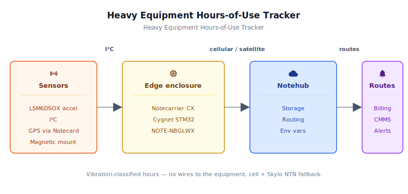
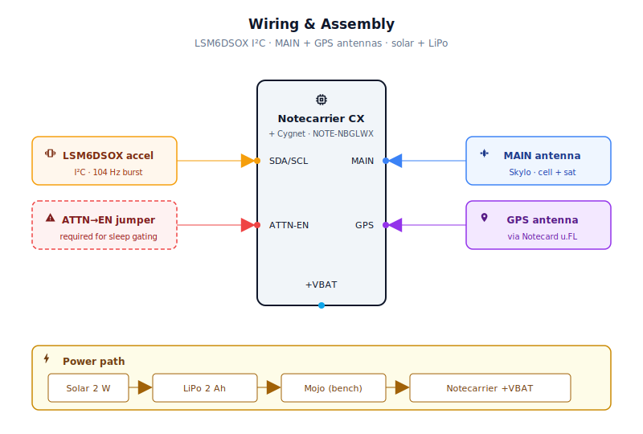
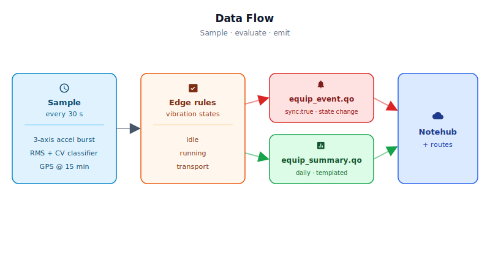

# Heavy Equipment Hours-of-Use & Utilization Tracker

<Note>

This reference application is intended to provide inspiration and help you get started quickly. It uses specific hardware choices that may not match your own implementation. Focus on the sections most relevant to your use case. If you'd like to discuss your project and whether it's a good fit for Blues, [feel free to reach out](https://blues.com/contact-sales/).

</Note>

A retrofit [asset location tracking](https://blues.com/solutions-location-tracking/) solution for mobile heavy equipment — excavators, generators, compactors, light towers, and any machine a rental company or OEM needs to bill by the hour and maintain on schedule. A magnetically mounted, solar-trickle-charged enclosure combines a Blues Notecard for Skylo with a 3-axis accelerometer to detect engine-on/off transitions via vibration signature, accumulate a persistent software hour meter, and report location and utilization back to Notehub over cellular or satellite — with no wiring harness, no equipment modification, and no dependency on a job-site network.

**What you'll have when you're done:** a weatherproof, battery-backed sidecar that clips magnetically onto any steel chassis, wakes every 30 seconds to sample the accelerometer, classifies the vibration as "engine running," "being transported," or "idle," and transmits a utilization summary on a rolling window (24 hours by default) plus an immediate cellular or satellite event every time the state changes — from anywhere, including remote pipeline corridors, open-pit mines, and wind-farm construction zones where the nearest cell tower is more of a suggestion than a certainty.

## Quickstart (under 10 minutes)

1. Create a [Notehub project](https://notehub.io) and copy your ProductUID.
2. Wire the bench: Notecarrier CX + NOTE-NBGLWX + LSM6DSOX on I2C (see [§4](#4-wiring-and-assembly) for pinout).
3. Edit `firmware/equipment_hours_tracker/equipment_hours_tracker_helpers.h` — replace the empty `#define PRODUCT_UID ""` with your project value (format: `com.your-company.your-name:tracker`).
4. Install board core: `arduino-cli core install STMicroelectronics:stm32 --additional-urls https://raw.githubusercontent.com/stm32duino/BoardManagerFiles/main/STM32/package_stm_index.json`
5. Compile and upload (see [§6.1](#61-installing-and-flashing) for full `arduino-cli` commands with your port).
6. Open serial monitor at **115200 baud**. You should see `[BOOT] Cold boot` or `[VIB]` log lines every 30 seconds.
7. Power the device. Open Notehub → your project → **Events** tab. You should see `_session.qo` within ~1 minute on cellular (longer on satellite depending on sky view). Tap the enclosure to trigger vibration; state-change events appear in `equip_event.qo`.

See [Appendix: Quickstart at a Glance](#appendix-quickstart-at-a-glance) for more details.

## 1. Project Overview

**The problem.** A piece of rental heavy equipment is a revenue-generating asset measured in hours. The excavator that a contractor rented on Monday morning needs an accurate engine-hour count for billing on Friday afternoon, a warranty-hours check before the next delivery, and a predictive-maintenance flag at 250-hour service intervals. Hardwired telematics — OBD-II interfaces, CAN-bus taps, hour-meter relays — work well on new fleet acquisitions but are expensive to retrofit on older machines, often require equipment downtime for installation, and occasionally void warranties when they involve accessing the engine control unit.

Vibration-based hour detection solves the retrofit problem entirely. A small enclosure attached magnetically to the equipment frame asks one question on each sample: *is this equipment's engine currently running?* Getting the answer right is harder than it sounds. A rented excavator sitting in the back of a flatbed travels to a job site with its engine off — but the truck's diesel vibration and road shock look a lot like engine idle to a simple threshold-based accelerometer. This project addresses that with a two-parameter vibration signature algorithm: the root-mean-square (RMS) amplitude of the net acceleration residual measures activity level, and the coefficient of variation (CV, or σ/μ) discriminates steady periodic engine vibration from the irregular, bursty character of transport shock. Engine idle produces a low CV; road vibration produces a high one. Together they give three reliable states — **engine running**, **in transport**, and **idle/stopped** — without a single wire to the equipment.

**Why Notecard for Skylo.** The equipment is mobile by definition, moving among customer job sites with no WiFi and often in areas where cellular coverage is marginal or absent. Open-pit mine sites, remote pipeline corridors, and offshore wind-farm construction zones all fall into this category. The [Notecard for Skylo (NOTE-NBGLWX)](https://dev.blues.io/datasheets/notecard-datasheet/note-nbglwx/) consolidates LTE-M, NB-IoT, GPRS, WiFi fallback, and Skylo satellite NTN (non-terrestrial network) on a single M.2 module — no separate satellite modem, no Starnote companion board required. When cellular is available, notes flow over LTE-M with the low latency and high throughput you'd expect. When the equipment sits at the bottom of a quarry or behind a ridge where no tower reaches, the Notecard automatically falls back to satellite uplink through Skylo's NTN satellite service. The operator sees unbroken location and hours telemetry regardless of site topology, and the firmware never has to know which network was used.

**Deployment scenario.** The enclosure mounts magnetically to any ferrous chassis surface — frame rail, tool-box lid, battery tray. No holes drilled, no wiring harness, no OEM cooperation. A small solar panel epoxied or bolted to the top of the enclosure trickle-charges a 2000 mAh LiPo through the Notecarrier CX's built-in solar charging circuit. The equipment can sit unused on a lot for weeks and the tracker will maintain charge; when the operator fires up the machine on a remote site, the vibration classifier detects the engine-start event and the Notecard ships the telemetry by whatever network is available.

---

## 2. System Architecture



**Device-side responsibilities.** The onboard Cygnet STM32 host on the Notecarrier CX wakes every 30 seconds via [`card.attn`](https://dev.blues.io/api-reference/notecard-api/card-requests/#card-attn) host power gating, initializes the Adafruit LSM6DSOX accelerometer over I2C, collects a 2-second burst of 3-axis samples at 104 Hz, and runs the vibration classifier. The classifier output — IDLE, RUNNING, or TRANSPORT — updates an in-RAM hour-meter accumulator and is compared against the previous wake's state to detect transitions. Transitions trigger immediate events; elapsed summary-window totals trigger summary notes. Between wakes, the host is fully powered off: the Notecard holds the persisted state struct in its internal flash and reapplies host power when the `ATTN` timer fires.

**Notecard responsibilities.** The Notecard for Skylo stores [Notes](https://dev.blues.io/api-reference/glossary/#note) locally in its queue and opens cellular or satellite sessions on two cadences configured in [`hub.set`](https://dev.blues.io/api-reference/notecard-api/hub-requests/#hub-set): a daily outbound sync that carries queued summaries and any other queued notes, and an 8-hour inbound check-in (`inbound: 480`) that contacts Notehub to pull environment-variable updates. After each state-change event note is accepted by the Notecard, the firmware issues a separate `hub.sync` call to request prompt delivery outside the scheduled outbound window. Periodic GPS location sampling (every 15 minutes) and geofence configuration are managed via [`card.location.mode`](https://dev.blues.io/api-reference/notecard-api/card-requests/#card-location-mode); a separate [`card.location.track`](https://dev.blues.io/api-reference/notecard-api/card-requests/#card-location-track) call enables the 4-hour heartbeat `_track.qo` record. If a geofence is configured through [environment variables](https://dev.blues.io/guides-and-tutorials/notecard-guides/understanding-environment-variables/), the Notecard monitors the device's position against the fence center and emits a `_track.qo` event when the equipment leaves the job site — after firmware applies the fence configuration, the Notecard evaluates the geofence autonomously without further host involvement.

**Notehub responsibilities.** [Notehub](https://dev.blues.io/notehub/notehub-walkthrough/) terminates the cellular or satellite session, stores every event, and applies project-level routes. Fleet-level [environment variables](https://dev.blues.io/guides-and-tutorials/notecard-guides/understanding-environment-variables/) let operators tune vibration thresholds and geofence parameters from the web console without a firmware update or truck roll. [Smart Fleets](https://dev.blues.io/notehub/notehub-walkthrough/#using-smart-fleet-rules) can segment devices by rental customer, equipment class, or geographic territory for differential routing and alerting.

**Routing to the cloud (high level only).** Notehub supports HTTP, MQTT, AWS IoT Core, Azure IoT Hub, GCP Pub/Sub, Snowflake, and other destinations. State-change events (`equip_event.qo`) are good candidates to route to an on-call webhook or work-order system; daily summaries (`equip_summary.qo`) suit a time-series historian or billing database. See the [Notehub routing docs](https://dev.blues.io/notehub/notehub-walkthrough/#routing-data-with-notehub) for configuration — this project ships no specific downstream endpoint.

---

## 3. Hardware Requirements

| Part | Qty | Rationale |
|------|-----|-----------|
| [Notecarrier CX](https://shop.blues.com/products/notecarrier-cx?utm_source=dev-blues&utm_medium=web&utm_campaign=store-link) | 1 | Integrated carrier with embedded Cygnet STM32L4 host — solar/LiPo charging circuits, ATTN power-gating header, and I2C break-outs in one compact board. No separate MCU needed. |
| [Notecard for Skylo (NOTE-NBGLWX)](https://shop.blues.com/products/notecard-for-skylo?utm_source=dev-blues&utm_medium=web&utm_campaign=store-link) | 1 | Single M.2 module combining LTE-M/NB-IoT/GPRS, WiFi, GPS/GNSS, and Skylo satellite NTN. Cellular-first with automatic satellite fallback — see [datasheet](https://dev.blues.io/datasheets/notecard-datasheet/note-nbglwx/) for regional coverage. Includes 500 MB cellular + 10 KB satellite data with the device. |
| [Blues Mojo](https://shop.blues.com/products/mojo?utm_source=dev-blues&utm_medium=web&utm_campaign=store-link) | 1 | Coulomb counter inline on the load rail (LiPo → `VBAT`) for ground-truth consumption measurement during bench bring-up; confirms the host sleep/wake pattern and whole-device energy draw. Measures load-side consumption only — not the solar charger input. Not required in production. |
| [Adafruit LSM6DSOX 6-DoF IMU breakout (#4517)](https://www.adafruit.com/product/4517) | 1 | ST LSM6DSOX 3-axis accelerometer + gyroscope on I2C. Only the accelerometer axes are used; the gyroscope is explicitly shut down in firmware. STEMMA QT/Qwiic connector makes the bench wiring a single cable. |
| [Adafruit 6V 1W solar panel (#1730)](https://www.adafruit.com/product/1730) | 1 | 6V output is within the Notecarrier CX solar input range (4.5–7V). 1W is sufficient for trickle-charging a 2000 mAh LiPo given ≥2–3 hours of daily sun exposure. |
| 3.7V LiPo, 2000 mAh, JST-PH 2-pin (e.g. [Adafruit #2011](https://www.adafruit.com/product/2011)) | 1 | Single-cell LiPo for overnight and cloudy-day runtime. At the 65–120 mAh/day whole-device consumption estimated in §8 (which accounts for three daily inbound check-in sessions plus one outbound sync) and applying an 80% practical discharge depth, 2000 mAh provides approximately 13–24 days of operation with zero solar input at the default 30-second sample cadence. Actual runtime depends on network type (satellite draws more than LTE-M), signal quality, and GNSS fix success rate — validate with Mojo for your specific site. |
| [K&J Magnetics MM-C-36](https://www.kjmagnetics.com/mm-c-36-neodymium-male-stud-mounting-magnet) neodymium pot magnet + [MM-RC-36 rubber cover](https://www.kjmagnetics.com/proddetail.asp?prod=MM-RC-36) | 1 | 36 mm face, M6 × 1.0 external threaded stud, 41 kg (90 lb) pull force — well above the ~250–350 g assembled enclosure weight. The nickel-coated steel cup concentrates flux; the MM-RC-36 silicone over-cap (~1 mm thick) protects the chassis finish and reduces sliding. Max continuous operating temperature: 80 °C — suitable for frame rails and battery trays; avoid mounting on exhaust or turbocharger surfaces. **Regional alternative:** any rubber-coated 36–42 mm M6-stud neodymium pot magnet rated ≥15 kg from RS Components or Grainger is a direct substitute. |
| IP67 weatherproof enclosure, ~130 × 80 × 55 mm (e.g. Hammond 1554B2GY) | 1 | Polycarbonate / ABS housing protects electronics against rain, jet wash, and splashing. GPS signals pass through the plastic lid, so the GPS antenna can be mounted inside. Sized to fit Notecarrier CX, LiPo, and cable management. |
| Passive GPS/GNSS patch antenna, u.FL connector (e.g. [Adafruit #2460](https://www.adafruit.com/product/2460)) | 1 | Attaches to the NOTE-NBGLWX `GPS` u.FL port. **Must be passive** — the GPS port does not supply DC bias, and the datasheet explicitly requires a passive antenna. The 50 mm pigtail is long enough to position the 9 mm × 9 mm ceramic patch against the inside face of the polycarbonate lid; GPS L1 signals penetrate the plastic without requiring a cable gland. For best fix rate, orient the patch toward the sky. |
| u.FL-to-SMA female pigtail cable, ~150 mm (e.g. [Adafruit #851](https://www.adafruit.com/product/851)) | 1 | Routes the NOTE-NBGLWX `MAIN` u.FL port through the enclosure wall to the Skylo-certified MAIN antenna. The u.FL end (**female**, clips onto the Notecard's `MAIN` port) attaches inside the enclosure; the other end is an **SMA female jack (panel-mount style)** — pass it through a drilled or punched hole in the enclosure sidewall, secure with the hex nut, and apply a thin bead of silicone sealant under the nut face to maintain the enclosure's weatherproof rating at the penetration. The Skylo-certified MAIN antenna's **SMA male plug** screws directly onto this SMA female from outside the enclosure — no separate bulkhead adapter is needed. The `MAIN` port carries both LTE-M/NB-IoT/GPRS cellular **and** Skylo NTN satellite on a single antenna path (S-Band / L-Band, bands B23/B255/B256). **The Skylo-certified MAIN antenna included with the NOTE-NBGLWX must be used on this port** — substituting a different antenna removes Skylo certification and may result in network blocking by Skylo. Mount the MAIN antenna outside the enclosure with an unobstructed sky view. See the [NOTE-NBGLWX datasheet](https://dev.blues.io/datasheets/notecard-datasheet/note-nbglwx/) for the full antenna requirements. |

The Notecard for Skylo ships with a factory-provisioned SIM, global cellular and satellite service, 500 MB of cellular data, 10 KB of satellite data, and 10 years of connectivity included in the device price — no activation fees, no monthly minimum. This entitlement applies to the Notecard for Skylo; the Notecarrier CX and Mojo are hardware-only items with no attached connectivity service.

---

## 4. Wiring and Assembly



The Notecard for Skylo seats into the Notecarrier CX's M.2 Key E slot. The Adafruit LSM6DSOX connects via the Notecarrier CX's I2C header — a Qwiic/STEMMA QT cable makes this a single two-connector snap if you own the matching Qwiic cable, otherwise use four discrete wires. The Mojo sits inline on the main power feed during bench validation.

Pin-by-pin:

- **+3V3** → LSM6DSOX `VCC` (3.3 V logic; do not use 5V — the sensor is 3.3V only)
- **GND** → LSM6DSOX `GND`
- **SDA** → LSM6DSOX `SDA` (the Notecarrier CX has 4.7 kΩ pull-ups on-board)
- **SCL** → LSM6DSOX `SCL`
- **Solar JST** → 6V solar panel (observe polarity marked on connector; red = positive)
- **LiPo JST** → 3.7V 2000 mAh LiPo cell (JST-PH 2-pin, same polarity convention)
- **ATTN → EN jumper (REQUIRED for host power-gating).** On Notecarrier CX v1.3, `ATTN` (the Notecard's configurable interrupt output) and `EN` (the input that gates the carrier's host 3.3 V rail to the Cygnet) are exposed as **separate** pins on the dual 16-pin header — see the [Notecarrier CX v1.3 datasheet header description](https://dev.blues.io/datasheets/notecarrier-datasheet/notecarrier-cx-v1-3/#notecarrier-cx-dual-16-pin-headers). They are **not** connected internally. To make `card.attn mode:sleep` actually cut power to the Cygnet, run a short jumper wire from the `ATTN` header pin to the `EN` header pin. With that wire in place, when `goToSleep()` issues `card.attn mode:sleep`, the Notecard drives `ATTN` low → `EN` low → the host 3.3 V rail collapses and the Cygnet powers off. `SAMPLE_INTERVAL_SEC` later the Notecard reasserts `ATTN` high → `EN` high → the Cygnet powers up and re-enters `setup()`. Without the `ATTN→EN` jumper the host runs continuously between samples; the firmware's `loop()` fall-back will keep functional sampling working, but baseline current will be ~5–10 mA instead of the ~20–60 µA target, and the solar/battery budget in §8 will not hold. Verify the jumper is functioning by confirming the Cygnet's serial output stops during the sleep window. See the [`card.attn` API reference](https://dev.blues.io/api-reference/notecard-api/card-requests/#card-attn) and the [Feather MCU low-power guide](https://dev.blues.io/guides-and-tutorials/notecard-guides/feather-mcu-low-power-management/) for additional context on this pattern.

**Antenna placement.** The NOTE-NBGLWX has exactly two u.FL antenna ports:

- **`MAIN` u.FL** — carries both LTE-M/NB-IoT/GPRS cellular and Skylo NTN satellite on a single path. Clip the u.FL end of the pigtail (Adafruit #851 or equivalent u.FL-to-SMA-female-jack cable) onto the `MAIN` u.FL port, then route the cable to a drilled or punched hole in the enclosure sidewall. Pass the pigtail's **SMA female jack** (panel-mount end) through the hole from inside, thread on the hex nut from outside to clamp it against the wall, and apply a thin bead of silicone sealant under the nut face — this is the weatherproof seal at the RF penetration. Screw the **SMA male plug** of the Skylo-certified MAIN antenna included with the NOTE-NBGLWX onto the exposed SMA female from outside the enclosure, and orient the antenna pointing upward with a clear, unobstructed sky view. Skylo NTN requires the antenna to be outdoors — do not mount under steel overhead panels or inside equipment compartments.
- **`GPS` u.FL** — passive GNSS only; do not connect an active (bias-powered) antenna. Attach the Adafruit #2460 passive GPS patch here and position it against the inside face of the polycarbonate lid. GPS L1 signals penetrate the plastic without a cable gland.

Confirm the port assignments in the [NOTE-NBGLWX datasheet](https://dev.blues.io/datasheets/notecard-datasheet/note-nbglwx/) before connecting. The MAIN antenna is Skylo-certified as a unit with the NOTE-NBGLWX — do not substitute a different antenna or add extension cables beyond the short u.FL-to-SMA-female pigtail used to bring the MAIN port through the enclosure wall.

**Mojo placement (bench only).** For Mojo bench measurements, Mojo **replaces** the normal battery feed for the duration of the test — it does not splice in alongside the LiPo. Before inserting Mojo, **disconnect the LiPo from the Notecarrier CX's LiPo JST**. With the LiPo JST unplugged, route power through the Mojo: bench supply (or the LiPo brought out through a bare lead) → Mojo `BAT` input → Mojo `LOAD` output → Notecarrier CX `VBAT` pad. Leaving the battery on the JST while also feeding `VBAT` through the Mojo creates a parallel power path that bypasses the intended measurement point and risks backfeed through the charger circuit. Also disconnect the solar panel — the solar input is a separate rail that will offset the load draw if left connected. The application firmware does not poll the Mojo — it serves as a standalone bench instrument. Read cumulative mAh and instantaneous current directly from the Mojo's Qwiic output using a separate I2C host (such as a Raspberry Pi or an Arduino running the Mojo example sketch) or from the Mojo's USB serial interface.

**Accelerometer orientation.** The LSM6DSOX can be mounted in any orientation — the firmware computes the combined 3-axis magnitude and subtracts the 1g gravity baseline. No axis alignment is required. The one practical consideration is rigidity: mount the breakout board solidly to the enclosure interior (hot-glue or standoffs) so it vibrates with the equipment chassis rather than floating on its wires.

**Mounting safety.** Heavy equipment operates in demanding environments; treat the magnetic mount as a primary attachment that requires supplemental protection for field deployment:

- **Secondary retention.** Add a safety tether — a short loop of steel wire or nylon strap tied between an M6 bolt on the enclosure and a nearby chassis fixture. If the magnet loses adhesion on a painted or lightly-corroded surface, the tether catches the enclosure before it falls into moving linkages or undercarriage.
- **Surface temperature.** Neodymium magnets begin to lose pull force above ~80 °C and can irreversibly demagnetize above ~150 °C. Do not mount on exhaust manifolds, muffler housings, turbocharger bodies, or any chassis surface that radiates heat from the engine bay. Frame rails, battery trays, and tool-box lids are typically within safe temperature range.
- **Moving parts and pinch zones.** Avoid areas near pivot pins, hydraulic cylinder clevises, boom linkages, and undercarriage rails where the enclosure could be crushed or snagged during machine articulation.
- **Washdown exposure.** The enclosure must be IP67-rated with all cable glands properly seated and the lid gasket undamaged. Pressure-washer cleaning (common on construction sites) can exceed IP67 limits if aimed directly at a gland; orient glands away from the primary washdown direction.

---

## 5. Notehub Setup

1. **Create a project.** Sign up at [notehub.io](https://notehub.io) and [create a project](https://dev.blues.io/quickstart/notecard-quickstart/notecard-and-notecarrier-pi/#set-up-notehub). Copy the [ProductUID](https://dev.blues.io/notehub/notehub-walkthrough/#finding-a-productuid) (format: `com.your-company.your-name:equipment-tracker`).

2. **Set `PRODUCT_UID` in firmware.** Open [`equipment_hours_tracker_helpers.h`](firmware/equipment_hours_tracker/equipment_hours_tracker_helpers.h) and replace the empty string on the `#define PRODUCT_UID ""` line with your value. Alternatively, pass it as a build flag: `-DPRODUCT_UID=\"com.your-company:tracker\"`.

3. **Claim the Notecard.** Power the assembled unit. On first cellular or satellite contact the Notecard claims itself to your project automatically — no manual step. It will appear in the **Devices** tab within a few minutes on cellular; allow additional time on NTN while the Notecard establishes a satellite session — Skylo availability depends on sky visibility and signal conditions, not orbital pass timing.

4. **Create a Fleet.** [Fleets](https://dev.blues.io/guides-and-tutorials/fleet-admin-guide/) group devices for shared configuration. The natural units here are *rental customer*, *equipment class*, and *geographic territory* — a fleet for compact equipment, a fleet for large iron, or a fleet per region. [Smart Fleet rules](https://dev.blues.io/notehub/notehub-walkthrough/#using-smart-fleet-rules) support device-tag-based auto-assignment; apply tags in Notehub to route units into the appropriate customer or site fleet as their assignments change.

5. **Set environment variables.** In Notehub, navigate to **Fleet → Environment** (or **Device → Environment** for per-unit override). All variables are optional; firmware defaults are shown. The device pulls them on the next inbound sync (default every 8 hours) — no reflash needed.

   | Variable | Default | Purpose |
   |---|---|---|
   | `vib_run_mg` | `15.0` | RMS activity threshold in milli-g. Values below this are classified as IDLE regardless of CV. Lower on smooth engines; raise in high-vibration environments to avoid false positives. |
   | `vib_cv_max` | `0.40` | Coefficient of variation ceiling for "engine running." CV below this value (steady vibration) → RUNNING. CV above (bursty vibration) → TRANSPORT. Typical engine-idle CV is 0.1–0.25; truck-bed bounce CV is 0.5–1.0+. |
   | `summary_interval_min` | `1440` | Minutes between daily summary notes. Changing this also re-applies `hub.set outbound` so the Notecard's sync cadence matches. Minimum enforced value: 60 min. |
   | `geofence_lat` | `0.0` | Latitude of the job-site geofence center (decimal degrees, –90 to 90). **Must be set together with `geofence_lon` and `geofence_radius_m`.** The default 0.0 is treated as "not configured"; setting a non-zero radius while leaving lat/lon at the 0,0 default will not activate geofencing — the firmware requires all three parameters to be non-zero and in range before applying the fence. |
   | `geofence_lon` | `0.0` | Longitude of the job-site geofence center (decimal degrees, –180 to 180). Must be set together with `geofence_lat` and `geofence_radius_m`. |
   | `geofence_radius_m` | `0` | Radius in meters. When all three geofence parameters (`geofence_lat`, `geofence_lon`, `geofence_radius_m`) are non-zero and in range, the Notecard monitors the device's position against the fence center and triggers a `_track.qo` event when the equipment leaves the site. A change to any of the three values (including radius alone) is detected on the next device wake and re-applied. Setting to 0 clears an active fence on the next wake. No-op if no fence was previously configured. |

6. **Configure routes.** Add one [route](https://dev.blues.io/notehub/notehub-walkthrough/#routing-data-with-notehub) for `equip_event.qo` (state-change events, low volume, immediate delivery to billing or dispatch) and a second for `equip_summary.qo` (rolling summary window notes, delivered to a utilization dashboard or historian). A third route on `_track.qo` handles geofence-exit location breadcrumbs. Separating the Notefiles at source means different routing urgencies without any filter logic in the route itself.

### What to expect in Notehub

- **`_session.qo`** — automatic Notecard housekeeping on each cellular or satellite session. Presence confirms the radio is reaching Notehub. Absence (combined with LED activity on the Notecard) usually points to a `PRODUCT_UID` mismatch or coverage gap.
- **`equip_event.qo`** — one per state transition, transmitted immediately. The `event` field encodes the full from→to transition, not just the new state:

  | Transition | `event` tag | `session_min` |
  |---|---|---|
  | IDLE / TRANSPORT → RUNNING | `engine_start` | 0 |
  | RUNNING → TRANSPORT | `transport_start` | **non-zero** — duration of the engine run that preceded transport |
  | IDLE → TRANSPORT | `transport_start` | 0 |
  | RUNNING → IDLE | `engine_stop` | non-zero — duration of the run that just ended |
  | TRANSPORT → IDLE | `transport_stop` | 0 |

  Example `engine_stop` body (one form of billing record — see also `transport_start` with `session_min > 0` for RUNNING→TRANSPORT):
  ```json
  {
    "event":       "engine_stop",
    "session_min": 94.5,
    "run_h_total": 1253.75,
    "epoch":       1746023400
  }
  ```
- **`equip_summary.qo`** — one per `summary_interval_min` (default 1440 minutes), representing a rolling window from the last report, not a calendar day. The first summary after boot may cover a shorter window if the Notecard's clock was not yet valid at startup. Body:
  ```json
  {
    "run_h":       6.2,
    "run_h_total": 1253.7,
    "transport_h": 1.1,
    "bat_v":       4.07,
    "fault_ct":    0
  }
  ```
  `bat_v` below ~3.5V is a low-battery warning. `transport_h` provides a secondary utilization metric: time spent moving between sites. `fault_ct` is the number of state-change events dropped due to event-queue overflow since the last summary; a non-zero value indicates the Notecard was unreachable for multiple consecutive wakes.
- **`_track.qo`** — automatic Notecard location heartbeat (every 4 hours) and geofence events. Not generated by firmware code; the Notecard's GPS subsystem owns these. Example geofence-exit event (when equipment leaves the configured job site):
  ```json
  {
    "when":       1746023400,
    "location":   {
      "lat":      37.7749,
      "lon":      -122.4194,
      "accuracy": 48
    },
    "tower":      true,
    "type":       "geofence_exit",
    "status":     "success"
  }
  ```
  Key fields: `type` distinguishes geofence-exit events from routine heartbeats; `location` carries coordinates and GPS accuracy (meters); `when` is the Unix timestamp. Use the `type` and timestamp fields in a Notehub route to trigger alerts when equipment leaves the fence.

---

## 6. Firmware Design

The firmware is split across three files that must reside together in the same Arduino sketch folder:

- [`equipment_hours_tracker.ino`](firmware/equipment_hours_tracker/equipment_hours_tracker.ino) — `setup()` / `loop()` entry points and per-wake sequencing.
- `equipment_hours_tracker_helpers.h` — type definitions, constants, and function prototypes.
- `equipment_hours_tracker_helpers.cpp` — all helper-function implementations.

Arduino build tooling automatically compiles every `.ino`, `.h`, and `.cpp` file in the sketch folder together; no manual include path or Makefile is required.

### 6.1 Installing and flashing

**Dependencies:**

- **Arduino core for STM32** — [`stm32duino/Arduino_Core_STM32`](https://github.com/stm32duino/Arduino_Core_STM32). Install via the Arduino Boards Manager (search "STM32 MCU based boards") and select **Generic STM32L4 series → Cygnet** as the board target.
- **`Blues Wireless Notecard`** — [`note-arduino`](https://github.com/blues/note-arduino), tested on **v1.8.5**. Install via the Arduino Library Manager (`arduino-cli lib install "Blues Wireless Notecard@1.8.5"`), or select version 1.8.5 in the IDE Library Manager. See [note-arduino releases](https://github.com/blues/note-arduino/releases) if you need to pin a newer stable release.
- **`Adafruit LSM6DS`** — install via Library Manager (`arduino-cli lib install "Adafruit LSM6DS"`). Also installs the `Adafruit Unified Sensor` dependency if not already present.

**Flashing via Arduino IDE:** open `equipment_hours_tracker.ino`, select the Cygnet board (Generic STM32L4 → Cygnet), and click **Upload**. The Notecarrier CX presents the ST-Link interface on the same USB cable — no external programmer required.

**Flashing via `arduino-cli`:**
```bash
# One-time: install the STM32 board core
arduino-cli core install STMicroelectronics:stm32 \
    --additional-urls https://raw.githubusercontent.com/stm32duino/BoardManagerFiles/main/STM32/package_stm_index.json

# Find the FQBN for the Cygnet variant on your installed core
arduino-cli board listall | grep -i cygnet

# Find your device's USB port
arduino-cli board list

# Compile and upload (replace port with your value from 'board list' above)
arduino-cli compile -b STMicroelectronics:stm32:GenL4:pnum=CYGNET \
    firmware/equipment_hours_tracker/
arduino-cli upload  -b STMicroelectronics:stm32:GenL4:pnum=CYGNET \
    -p /dev/cu.usbmodem* \
    firmware/equipment_hours_tracker/
```
Replace `/dev/cu.usbmodem*` with the port shown by `arduino-cli board list`. On Windows this is typically `COMx`, on Linux `/dev/ttyACM*`. The Notecarrier CX presents the device over a single USB cable (the ST-Link programmer is built-in).

Open the serial monitor at **115200 baud** after flashing. You will see `[BOOT] Cold boot` on first power-on, then `[VIB]` lines on each 30-second wake showing the RMS and CV readings in real time.

### 6.2 Modules

| Responsibility | Function |
|---|---|
| Notecard one-time initialization (`hub.set`, `card.location.*`, template registration) | `notecardConfigure`, `defineTemplates` |
| Environment-variable fetch and hub.set re-apply | `fetchEnvOverrides` |
| Geofence reconfiguration on env-var change | `applyGeofenceIfChanged` |
| Accelerometer burst sampling + RMS/CV classifier | `classifyVibration` |
| Hour-meter accumulation per state bucket | `updateHourAccumulator` |
| State-change event dequeue and delivery (note.add + hub.sync, at-least-once retry) | `sendNextPendingEvent` |
| Daily summary emission | `sendSummary` |
| Time and voltage from Notecard | `getEpoch`, `getBatteryVoltage` |
| Persist state to Notecard flash + sleep | `goToSleep` / `NotePayloadSaveAndSleep` |

### 6.3 Sensor reading strategy

Each wake, the host collects **208 accelerometer samples at 104 Hz** (approximately 2 seconds of data) from the LSM6DSOX. For each sample, it computes the 3-axis vector magnitude in m/s² and subtracts the 1g gravity baseline (~9.806 m/s²) to obtain the net dynamic acceleration. This residual is expressed in milli-g for threshold comparison.

Two statistics are then computed over the 208-sample window:

- **RMS** — the root-mean-square of the residual magnitudes. Low RMS means the equipment is stationary and undisturbed. High RMS means energy is present in the measurement.
- **CV** (coefficient of variation, σ/μ) — the standard deviation normalized by the mean. A diesel engine idling at ~700 RPM generates ~11.7 Hz periodic vibration — repetitive, amplitude-stable, low CV (typically 0.10–0.25). Road shock from a truck chassis is aperiodic, with spikes at pothole crossings and relative quiet between — high CV (typically 0.50–1.0+). This is the discriminator that separates the two high-activity states.

Classifying engine vibration from transport vibration was the primary design challenge here. A simple amplitude threshold would fire on both; CV is the second dimension that makes the problem tractable without training data or a heavy signal-processing stack.

### 6.4 Event payload design

Both Notefiles use [compact templates](https://dev.blues.io/notecard/notecard-walkthrough/low-bandwidth-design/#working-with-note-templates) — required for Notecard for Skylo, where satellite data packets are constrained to 256 bytes and cost per byte beyond the included 10 KB. Compact templates store notes as fixed-length binary records on the Notecard rather than free-form JSON, reducing wire size 3–5× compared to untemplated notes.

`equip_summary.qo` (rolling summary window, queued):
```json
{
  "file": "equip_summary.qo",
  "body": {
    "run_h":       6.25,
    "run_h_total": 1253.75,
    "transport_h": 1.08,
    "bat_v":       4.07,
    "fault_ct":    0
  }
}
```

`equip_event.qo` (queued on state transition; `hub.sync` issued separately for prompt delivery):
```json
{
  "file": "equip_event.qo",
  "body": {
    "event":       "engine_stop",
    "session_min": 94.5,
    "run_h_total": 1253.75,
    "epoch":       1746023400
  }
}
```

GPS coordinates are automatically attached to both note types by the Notecard from its last valid GPS fix — declared in the compact templates using the `_lat`/`_lon` metadata keywords. No firmware code explicitly manages coordinates in the note bodies.

### 6.5 Low-power strategy

Power efficiency matters for a solar-trickle-charged deployment. Three levers are pulled:

1. **Host off between samples.** `NotePayloadSaveAndSleep` serializes the `PersistState` struct into Notecard flash, then issues a `card.attn` sleep command. With the `ATTN → EN` jumper described in §4 in place, the Notecard's `ATTN` line drives the Notecarrier CX `EN` input low, collapsing the host 3.3 V rail and powering the Cygnet off. The host consumes essentially zero current between wakes. On wake, `NotePayloadRetrieveAfterSleep` rehydrates the struct.

2. **Gyroscope shut down.** `sox.setGyroDataRate(LSM6DS_RATE_SHUTDOWN)` turns off the gyroscope immediately after init — it's not needed for this application and saves ~0.5 mA during the 2-second sampling window.

3. **Notecard sync decoupled from samples.** The Notecard runs in `periodic` mode with a daily outbound sync. After each state-change event note is accepted by the Notecard, the firmware issues a separate `hub.sync` call to request prompt delivery outside the scheduled outbound window (typically 2–4 additional sessions per work day). Summaries queue and transmit in the daily outbound session. The firmware also configures an 8-hour inbound cadence (`inbound: 480`) so the Notecard checks Notehub for environment-variable updates three times per day. At default settings this produces approximately **4 radio sessions per day at minimum** (1 outbound + 3 inbound), plus an additional session per state-change event.

4. **GPS fix cadence.** The firmware configures `card.location.mode` in `periodic` mode with a 900-second (15-minute) interval. Because the external LSM6DSOX handles all vibration classification, the Notecard's internal accelerometer is not needed for that role. The firmware supports disabling it with `card.motion.mode {"stop":true}` through the compile-time macro `DISABLE_NOTECARD_MOTION`, but **this option is OFF by default**. Its interaction with periodic GPS and geofencing on the NOTE-NBGLWX has not been bench-validated — if the Notecard's periodic-mode timer relies on any internal motion-subsystem wakeup path, stopping the motion subsystem could silently disrupt GPS heartbeats and geofence events, which are core features of this application. Enable `DISABLE_NOTECARD_MOTION` only after confirming that periodic GPS and geofence behavior remain intact on your target Notecard firmware. In the typical deployment case, GNSS fix attempts occur on or around the 15-minute cadence when the Notecard determines a new fix is warranted. Each fix attempt typically draws 20–50 mA for 10–60 seconds; at up to 96 attempts per day this can contribute roughly **15–30 mAh/day** to the power budget — a meaningful fraction of the total. If solar input is marginal or the device is frequently stationary, increase `GPS_PERIOD_SECONDS` to reduce GNSS power consumption.

The Notecard for Skylo idles at approximately **8–18 µA @ 5V** between sessions (see the [low-power firmware design guide](https://dev.blues.io/notecard/notecard-walkthrough/low-power-firmware-design/)). LTE-M sessions for a small queued payload run on the order of tens of seconds at ~100–300 mA peak. Satellite (Skylo NTN) sessions measured in the Blues low-power guide consume approximately **27 mAh per 12-hour period with hourly syncs** — daily sync cadence will be materially lower. Expect the bench-measured total for a device with default settings to be approximately **65–120 mAh per 24 hours** depending on network type, signal quality, state-change event frequency, and GNSS fix success rate.

### 6.6 Retry and error handling

- The first `hub.set` call uses `sendRequestWithRetry(req, 10)` to handle the known cold-boot I2C race where the Notecard's I2C peripheral isn't ready for transactions immediately after power-on.
- If `sox.begin_I2C()` fails (unplugged or miswired accelerometer), the firmware calls `goToSleep()` immediately rather than running with a broken sensor. The issue will appear in the serial monitor and on the next wake will be retried.
- Both `card.time` and `card.voltage` responses check the `err` field before trusting the returned value. `getEpoch()` returns 0 if the Notecard has no valid time yet (no cellular/GPS sync), and all epoch-dependent logic gates on `now > 0`. `getBatteryVoltage()` returns 0.0 on an error response, which the summary note will carry as a sentinel distinguishable from a healthy ~3.6–4.2 V reading.
- The `summary_interval_min` env-var change path includes a minimum-value clamp (60 minutes) to prevent operators from accidentally configuring a 1-minute summary that would exhaust the satellite data budget in hours.
- State-change events are not de-duplicated: if the classifier oscillates between RUNNING and TRANSPORT on rough terrain, each transition fires. If this produces alarm fatigue in a specific deployment, add a minimum-dwell counter (e.g., require 3 consecutive matching classifications before accepting a new state) as a production tuning step.

### 6.7 Key code snippet 1: vibration classifier

The CV threshold is what makes the engine-vs-transport discrimination work. The 2-second burst at 104 Hz is fast enough to capture multiple engine-combustion cycles (a 700 RPM diesel fires every ~0.086 s; 208 samples at 9.6 ms spacing span ~26 combustion events).

```cpp
float mean        = sum / VIB_SAMPLE_COUNT;
float variance    = (sum_sq / VIB_SAMPLE_COUNT) - (mean * mean);
float stddev      = (variance > 0.0f) ? sqrtf(variance) : 0.0f;
float cv          = (mean > 1.0f) ? (stddev / mean) : 1.0f;
float rms         = sqrtf(sum_sq / VIB_SAMPLE_COUNT);

if (rms < g_vib_run_mg) return ST_IDLE;
return (cv < g_vib_cv_max) ? ST_RUNNING : ST_TRANSPORT;
```

### 6.8 Key code snippet 2: compact template with GPS metadata

The `_lat`/`_lon` keywords in a compact template body instruct the Notecard to embed the most recent GPS fix into the note automatically. No explicit coordinate plumbing in `note.add` calls.

Compact template value encoding (the numeric code parameter):
- **14.1** = IEEE 754 4-byte float (32-bit), 1 decimal place in display. Use for large dynamic ranges (hours, totals, coordinates).
- **12.1** = 2-byte signed float (16-bit), 1 decimal place in display. Use for smaller ranges with moderate precision (voltage, relative measurements).
- **12** = 2-byte signed integer (16-bit), no decimal. Use for counters, small integers, or flags.

```cpp
J *req = notecard.newRequest("note.template");
JAddStringToObject(req, "file",   "equip_summary.qo");
JAddNumberToObject(req, "port",    50);
JAddStringToObject(req, "format", "compact");
J *body = JAddObjectToObject(req, "body");
JAddNumberToObject(body, "run_h",         14.1);      // 4-byte float, hours this window
JAddNumberToObject(body, "run_h_total",   14.1);      // 4-byte float, lifetime total hours
JAddNumberToObject(body, "transport_h",   14.1);      // 4-byte float, transport hours this window
JAddNumberToObject(body, "bat_v",         12.1);      // 2-byte float, battery voltage
JAddNumberToObject(body, "fault_ct",      12);        // 2-byte int, event-queue overflow counter
JAddNumberToObject(body, "_lat",          14.1);      // 4-byte float, auto-populated by Notecard
JAddNumberToObject(body, "_lon",          14.1);      // 4-byte float, auto-populated by Notecard
notecard.sendRequest(req);
```

See [Notecard compact template documentation](https://dev.blues.io/notecard/notecard-walkthrough/low-bandwidth-design/#working-with-note-templates) for the complete list of format codes and their ranges.

### 6.9 Key code snippet 3: immediate event with session duration

The event tag is derived from **both** the previous and new state, not just the new state alone. This ensures `engine_stop` is reserved for transitions out of RUNNING (the billing record), while `transport_stop` marks the end of a transport leg:

```cpp
const char *tag;
if      (new_state == ST_RUNNING)   tag = "engine_start";
else if (new_state == ST_TRANSPORT) tag = "transport_start";
else  /* ST_IDLE */                 tag = (g_s.prev_state == ST_RUNNING) ? "engine_stop"
                                                                         : "transport_stop";
```

`session_min` is non-zero on `engine_stop` (and on `transport_start` when transitioning from RUNNING) — it records how long the engine was running since the last `engine_start`. After being consumed by the first non-RUNNING transition, `run_session_start` is cleared to zero; subsequent non-RUNNING transitions (`transport_stop`, or any transition from a non-RUNNING prior state such as `IDLE → TRANSPORT`) therefore always emit `session_min = 0`.

The note is queued with `note.add` (without `sync:true`); a separate `hub.sync` call then requests prompt delivery without coupling the network session to the note acknowledgement:

```cpp
J *req = notecard.newRequest("note.add");
JAddStringToObject(req, "file", "equip_event.qo");
J *body = JAddObjectToObject(req, "body");
JAddStringToObject(body, "event",       "engine_stop");
JAddNumberToObject(body, "session_min", session_min);
JAddNumberToObject(body, "run_h_total", g_s.run_h_total);
JAddNumberToObject(body, "epoch",       (JNUMBER)epoch);  // Unix timestamp of the transition
notecard.sendRequest(req);

// Separate hub.sync requests prompt delivery without coupling it to
// the note.add acknowledgement.
notecard.sendRequest(notecard.newRequest("hub.sync"));
```

`note.add` on a `.qo` outgoing queue Notefile is a pure append — the Notecard API does not expose a deduplication field for outgoing queue notes. If the I²C acknowledgement is lost after the Notecard has already accepted the note, a host retry on the next wake will create a duplicate entry in the Notecard's queue. This is an acknowledged edge case: the ring-buffer design guarantees **at-least-once delivery**, and a retransmitted duplicate is preferable to a dropped billing record. The `epoch` field — the Unix timestamp of the actual state transition, captured when the event was enqueued rather than when it was delivered — is what makes server-side deduplication tractable: key on `epoch` + `event` in your downstream route to collapse duplicates without discarding any unique transitions.

---

## 7. Data Flow



**Collected** on each 30-second wake: per-sample 3-axis acceleration magnitudes at 104 Hz for 2 seconds → RMS and CV → one of three equipment states: IDLE, RUNNING, TRANSPORT.

**Accumulated** in flash: running hours today, lifetime running hours, transport hours today, session start timestamp.

**Transmitted:**
- `equip_event.qo` — one note per state transition; after the Notecard acknowledges the queued note, the firmware issues a `hub.sync` request to prompt delivery outside the scheduled outbound window. Typically 2–6 notes per work day (engine start, possible midday idle, engine stop; transport start/stop on delivery days). Goes to Notehub within a cellular session-establishment window (~15–60 s), or when NTN service is available — satellite delivery depends on sky visibility and session establishment and may take longer than cellular.
- `equip_summary.qo` — one note per `summary_interval_min` (default 1440 minutes), queued and shipped in the Notecard's next outbound session. Covers the rolling summary window since the last report, not a calendar day; the first note after boot may represent a partial window if the Notecard's clock was not yet valid at startup. Carries run hours for the window, lifetime total, transport hours, battery voltage, and a fault counter (`fault_ct`) reflecting any event-queue overflows since the last summary.
- `_track.qo` — emitted autonomously by the Notecard's GPS subsystem every 4 hours as a heartbeat location record, and on geofence exit if `geofence_radius_m` is set. The firmware does not generate these directly.

**Routed.** Both application Notefiles go to Notehub and from there to whatever downstream endpoints the project's routes specify. Typical fan-out: `equip_event.qo` → billing/dispatch system or CMMS (computerized maintenance management system) webhook; `equip_summary.qo` → time-series database for trending and predictive maintenance scheduling; `_track.qo` → mapping/GIS layer.

**Alert triggers:**
- `engine_start` — immediately actionable for rental companies tracking unauthorized after-hours use.
- Any `equip_event.qo` with `session_min > 0` — a run session has just closed. The `event` tag distinguishes the state that followed: `engine_stop` means the machine ran then went idle; `transport_start` means it ran then started moving (RUNNING → TRANSPORT). Both carry the run duration in `session_min`. Billing systems must key off `session_min > 0` across **both** tags — keying only off `engine_stop` will miss completed run sessions that end in transport.
- `transport_start` — equipment moving; useful for confirming scheduled deliveries or detecting unplanned moves. When `session_min` is non-zero, the engine was running immediately before transport began.
- `transport_stop` — transit leg ended; combined with the preceding `transport_start` timestamp, gives transit duration for dispatch and mileage tracking.
- Battery voltage below 3.5V in `equip_summary.qo` — indicates solar input is inadequate for the deployment site; suggest repositioning panel or adding capacity.
- Absence of `equip_event.qo` for multiple days combined with `_track.qo` showing stable position — equipment may be idle on lot; candidate for redeployment or servicing.

---

## 8. Validation and Testing

**Expected steady-state on an active job site.** In normal operation, expect 2–4 `equip_event.qo` notes per day (engine start, engine stop, possibly a midday shutdown), one `equip_summary.qo` per summary window (default every 24 hours), and six `_track.qo` location heartbeats per day (one every 4 hours, matching `GPS_HEARTBEAT_HOURS = 4`), plus any additional `_track.qo` notes triggered by geofence events. On a delivery day, expect additional `transport_start` and `transport_stop` events bracketing the transit. If the engine was running immediately before transport, the `transport_start` note will carry a non-zero `session_min` recording the run duration.

**Bench validation.** On a desk, the equipment is IDLE — the accelerometer should report low RMS and the classifier should output `ST_IDLE`. The serial monitor shows `[VIB] rms=X.X mg cv=Y.YYY → IDLE`. To simulate an engine:

- Tap the enclosure rhythmically against a surface at ~10 Hz (not perfectly on beat — vary the interval slightly to mimic engine combustion irregularity). The CV should drop below 0.40 and the classifier should output `ST_RUNNING`.
- Shake the enclosure sharply then randomly (slap → pause → slap → pause). This models road bounce: high CV, `ST_TRANSPORT`.

**Tuning the classifier on your equipment.** If the classifier misfires at default thresholds (false RUNNING on transport, or failure to detect idle):

1. Tap the enclosure in the three states and note the RMS and CV values printed on the serial monitor.
2. If **idle is triggering as RUNNING**, raise `vib_run_mg` slightly (try 18.0 or 20.0). This raises the activity floor.
3. If **transport is triggering as RUNNING**, lower `vib_cv_max` (try 0.35 or 0.30). This tightens the "engine-like vibration" criterion.
4. If **engine start is missed entirely**, lower `vib_run_mg` (try 12.0 or 10.0) or raise `vib_cv_max` (try 0.45).

Update the environment variables in Notehub (**Fleet → Environment**), and the device will pull the new thresholds on the next inbound sync (~8 hours by default, or immediately if you trigger a manual sync in Notehub). Confirm the new values appear in the serial output on the next wake — the firmware logs `[ENV] vib_run_mg=X.X vib_cv_max=Y.YY`. Iterate with live equipment until classification is reliable for your specific engine type and chassis.

**Power validation with Mojo.** The [Mojo](https://dev.blues.io/datasheets/mojo-datasheet/) reports cumulative mAh over its Qwiic link. For bench measurements, Mojo replaces the normal battery feed: **leave the LiPo JST unplugged** and power the carrier's `VBAT` pad exclusively through the Mojo — bench supply (or the LiPo with its JST lead brought out directly) → Mojo `BAT` input → Mojo `LOAD` output → Notecarrier CX `VBAT` pad. **Also disconnect the solar panel** — the Notecarrier CX's solar charger input is a separate rail; leaving it connected during bench testing means solar current offsets the load draw, understating actual consumption and making the measurement non-repeatable across different light conditions. With both the LiPo JST and solar panel disconnected and power flowing exclusively through the Mojo, all load current passes through the Mojo's coulomb counter and the measurement reflects the true whole-device draw.

**Important measurement scope.** The Mojo is spliced on the main power rail (LiPo → Notecarrier CX `VBAT`), so it measures the **whole-device subsystem**: Notecard for Skylo, Notecarrier CX onboard regulators and solar charger, and the LSM6DSOX IMU — not the Notecard alone. The published Notecard idle figure (~8–18 µA @ 5V) applies to the Notecard's own power domain in isolation; the Notecarrier CX adds its own quiescent current from the onboard power management IC and charger. Use the Mojo figures below as a realistic whole-system deployment budget, not for direct datasheet comparison. To isolate the Notecard's draw, you would need to separate its VMODEM rail from the carrier board — see the [Notecard low-power design guide](https://dev.blues.io/notecard/notecard-walkthrough/low-power-firmware-design/) for rail-isolation guidance.

Expected current profile at default settings (30-second sample interval; 1 daily outbound + 3 inbound sessions):

| Phase | Expected current (whole-device rail) |
|---|---|
| Host off between samples (Notecard + carrier idle) | ~20–60 µA @ 5V (Notecard idle + carrier quiescent) |
| Host awake + accelerometer sampling (~2–3 s) | ~5–15 mA |
| GNSS fix attempt (up to every 15 min, 10–60 s duration) | ~20–50 mA |
| Notecard cellular session (LTE-M, small payload) | ~100–300 mA average, brief bursts |
| Notecard NTN session (satellite, small payload) | ~150–400 mA average during transmission window |

A healthy Mojo trace at default settings will show the following pattern:

- **Flat near-zero baseline (~20–60 µA) between wakes** — Notecard idle plus Notecarrier CX quiescent draw while the Cygnet is fully powered off.
- **Brief ~5–15 mA blip every 30 seconds, ~2–3 s long** — the Cygnet powering up, running the IMU sample burst, and classifying vibration before calling `goToSleep()`.
- **~20–50 mA pulses at up to 15-minute intervals, 10–60 s long** — the Notecard GNSS module acquiring a location fix (periodic mode; actual cadence may be lower when the device is stationary).
- **Three scheduled inbound sessions per day** — every 8 hours the Notecard briefly contacts Notehub to pull environment-variable updates (`inbound: 480`); each session is typically 10–30 s on LTE-M. Plus **one daily outbound session** carrying the queued `equip_summary.qo` (typically 10–60 s on LTE-M). On NTN, both inbound and outbound sessions may take longer depending on satellite availability.
- **Additional radio sessions for each state-change event** — after each `equip_event.qo` note is accepted by the Notecard, the firmware issues a `hub.sync` request to trigger an immediate Notecard sync outside the scheduled cadence. A typical active work day produces 2–6 state-change events (engine start, stop, possible midday transport legs), so expect 2–6 additional sessions above the baseline. Combined, expect roughly **6–10 total sessions per active work day** at default settings.
- **Geofence-triggered transmissions** (if `geofence_radius_m` is set) — the Notecard emits a `_track.qo` autonomously on geofence exit and syncs it immediately.

If the baseline is continuously 10+ mA, the Cygnet is not sleeping — confirm that the `ATTN → EN` jumper described in §4 is physically present and seated, then check that `NotePayloadSaveAndSleep` is not returning early (the serial output will confirm). If a cellular or NTN session is unusually long (>60 s on LTE-M), the radio is struggling with signal quality; check the MAIN antenna placement, verify it has an unobstructed sky view, and confirm the antenna is the Skylo-certified unit that ships with the NOTE-NBGLWX.

**Solar viability estimate.** Because the Mojo is on the load rail, it measures consumption only — current flowing through the Notecarrier CX's separate solar charger input is invisible to it. With the solar panel disconnected and the unit running from a known LiPo or bench supply, run the Mojo for a full 24-hour period and note total mAh consumed. Compare that figure against the theoretical harvest for your panel size and site: a 1W panel with 4 effective sun-hours produces **4 Wh (4000 mWh) raw**; after typical derating for panel temperature and incidence angle (~80%), charger conversion efficiency (~85%), and soiling (~90%), usable harvest is roughly **2.4 Wh — approximately 480 mAh at 5V**. At default settings the GPS cadence alone adds ~15–30 mAh/day; combined with host wakes, three daily inbound check-ins, one outbound sync, and typically 2–6 event sessions on active days, expect whole-device consumption of **65–120 mAh/day**. A 1W panel with ≥3 effective sun-hours per day typically covers this on cellular; satellite sessions draw more per session, so size the panel per-site. If Mojo shows a rising deficit across repeated 24-hour tests (solar disconnected), consider a 2–5 W panel, a higher-capacity LiPo, or a longer GPS period (`GPS_PERIOD_SECONDS`). To validate actual panel and charger harvest rather than relying on the derating model, place a DC current meter inline on the solar cable itself and log it over a representative sun-exposed day.

---

## 8.1 Troubleshooting

| Symptom | Likely Cause | Solution |
|---------|--------------|----------|
| Serial monitor shows no output after upload | Board not selected correctly, or USB driver missing | Verify **Generic STM32L4 → Cygnet** is selected in Arduino IDE; on Windows, install [ST-Link drivers](https://www.st.com/en/development-tools/stsw-link009.html). |
| `[IMU] Not found` message | Accelerometer not powered or miswired | Check I2C connections (SDA, SCL, +3V3, GND) and verify LSM6DSOX is recognized by `Wire.scan()`. See [§4](#4-wiring-and-assembly). |
| No `_session.qo` appearing in Notehub after several minutes | PRODUCT_UID mismatch, missing antenna, or no cellular/NTN coverage | Verify `PRODUCT_UID` matches the value you created in Notehub (copy-paste from Notehub → your project settings). Confirm MAIN antenna is mounted outside with unobstructed sky view; check the Notecard LED activity — it should flash briefly during sync attempts. If satellite, allow 5+ minutes for Skylo session establishment depending on sky visibility. |
| Classifier always outputs `IDLE` even when tapping | Thresholds too high | Lower `vib_run_mg` to 10.0 (via Notehub Fleet → Environment); wait for next inbound sync (~8 hours) or manually trigger a device fetch. |
| Classifier falsely triggers `RUNNING` during idle periods | Thresholds too low | Raise `vib_run_mg` to 20.0 and lower `vib_cv_max` to 0.30. |
| `ATTN → EN` jumper error or baseline current 5–10 mA (not sleeping) | Jumper not installed or miswired | Verify the jumper physically connects `ATTN` and `EN` pins on the Notecarrier CX header (see [§4](#4-wiring-and-assembly), "ATTN → EN jumper" line). Measure with a multimeter to confirm continuity. Without it, the host runs continuously and the power budget collapses. |
| Battery voltage in `equip_summary.qo` declining over days | Solar input inadequate | Check that the 6V solar panel is receiving adequate direct sunlight (≥3 effective sun-hours per day in temperate climates). If deployment is shaded or at high latitude in winter, upgrade to a 2–5 W panel. Use a DC meter inline on the solar cable to confirm actual harvest. |
| Duplicate `equip_event.qo` notes in Notehub | I2C acknowledgement lost after Notecard accepted note | This is an edge case by design (at-least-once delivery). Downstream routes should dedup by `epoch` + `event` pair (the note's timestamp and event type are unique per transition). |
| Arduino-cli reports "board not found" or FQBN error | Core not installed or board name wrong | Run `arduino-cli core list` to confirm STMicroelectronics:stm32 is installed. If not, run the full `core install` command from [§6.1](#61-installing-and-flashing). Verify the FQBN is `STMicroelectronics:stm32:GenL4:pnum=CYGNET` (case-sensitive). |

---

## 9. Limitations and Next Steps

**Simplified for this POC:**

- **Vibration classifier is heuristic, not trained.** The RMS + CV algorithm distinguishes engine idle from transport vibration well for diesel construction equipment at typical idle RPMs. On gasoline-powered equipment with smoother idle, CV can be lower and may overlap with transport characteristics at certain speeds. On very rough terrain, engine-running CV can creep above the default threshold. The `vib_run_mg` and `vib_cv_max` environment variables are the tuning knobs, but they require per-equipment-class calibration from logged data to dial in precisely. A production deployment would instrument a representative sample of each equipment type, log raw RMS/CV values over several shifts, and derive per-class threshold pairs.

- **Hour accumulation granularity is 30 seconds.** Each wake adds `SAMPLE_INTERVAL_SEC / 3600` hours to the running bucket if the previous state was RUNNING. A start event that occurs midway through a 30-second sleep interval will be captured on the *next* wake — worst-case rounding error is one sample interval (30 s). For billing purposes this is typically acceptable; for sub-minute precision, reduce `SAMPLE_INTERVAL_SEC` to 10 at the cost of ~3× higher host wake frequency.

- **First run session after power-on may report `session_min: 0` if the Notecard has not yet acquired valid time.** `getEpoch()` returns 0 when `card.time` has no cellular or GPS sync. The firmware guards against recording a start timestamp of 0 — if the device transitions to RUNNING before time is valid, `run_session_start` is left at 0 and the closing `engine_stop` or `transport_start` event will carry `session_min: 0`, making it unusable as a standalone billing record. Subsequent sessions, once the Notecard has acquired time, compute correctly. For the affected cold-start window, the daily `equip_summary.qo` still accumulates run hours through the hour-meter buckets regardless of session boundaries — use the summary to reconcile any gap. Billing integrations should treat a `session_min: 0` on the first event after a device power-cycle as an incomplete record.

- **Persistent software hour counter — not hardware-backed.** The `run_h_total` field in `PersistState` is persisted to Notecard flash on each sleep. If the Notecard is replaced or factory-reset, the lifetime total is lost. A production implementation should store the authoritative total server-side in Notehub (e.g., as a device-level environment variable updated on each `engine_stop` event) so it survives hardware replacement.

- **No geofence alerting in application firmware.** Geofence exit is handled autonomously by the Notecard (`_track.qo`) — the application firmware only configures the fence center via `card.location.mode`. The resulting `_track.qo` notes contain location data but no application-level label. A production deployment should add a Notehub route that triggers an alert when `_track.qo` appears outside the fence window.

- **Geofence cannot be centered at the equator or prime meridian.** The firmware uses `geofence_lat = 0.0` and `geofence_lon = 0.0` as the "not configured" sentinel, and refuses to apply a fence if either coordinate is within ≈0.0001° of zero (the check is `fabsf(lat) > 0.0001f` and `fabsf(lon) > 0.0001f`). A deployment precisely on the equator (lat ≈ 0°) or the prime meridian (lon ≈ 0°) — for example, sites in southern Ghana, the Republic of Congo, or the English Channel — cannot use the geofence feature as currently implemented. To lift this restriction, replace the 0,0 sentinel with an explicit enable flag (e.g., a `geofence_enable` environment variable set to `1`) and allow lat/lon to take any in-range value including zero.

- **Satellite data budget is 10 KB.** The bundled Skylo satellite allocation is small — compact templates and a daily transmission cadence keep a single device's satellite usage well within budget, but a fleet of 100 machines transmitting once per day (averaging ~30-byte compact payload per event + 1 daily summary) still warrants per-device usage monitoring via [Notehub usage data](https://dev.blues.io/notehub/notehub-walkthrough/#viewing-billing-account-usage). Contact [Blues](https://blues.com/contact-sales/) for information on additional satellite data allocation options.

- **Solar panel sizing is for temperate climates.** A 1W panel + 2000 mAh LiPo provides adequate runtime in most regions with ≥3 effective sun-hours per day. At higher latitudes in winter, or when the enclosure is mounted on a shaded chassis location, a larger panel (2–5W) or a higher-capacity LiPo (5000 mAh) may be needed. The `bat_v` field in `equip_summary.qo` is the early-warning indicator — a steadily declining voltage over multiple days indicates harvest deficit.

- **Mojo is not read in firmware.** The firmware does not poll the Mojo's LTC2959 coulomb counter over Qwiic. Adding a `mojo_mah` field to `equip_summary.qo` is a straightforward extension if fleet-level energy telemetry is valuable to the operator.

**Production next steps:**

- Per-equipment-class threshold calibration: deploy a "learning mode" firmware build that logs raw RMS/CV data at 1-minute intervals for several shifts before switching to production classification.
- Lifetime hour counter persistence in Notehub environment variables to survive device replacement.
- Geofence-exit alert route in Notehub: a route that fires a webhook when a `_track.qo` note appears with a location outside the configured fence, enabling unauthorized-move notifications.
- [Notecard Outboard DFU](https://dev.blues.io/notehub/host-firmware-updates/notecard-outboard-firmware-update/) for over-the-air firmware updates to the Cygnet host — allows threshold algorithm improvements and new features without a technician visit to each machine.
- Tamper detection: an abrupt, very high-amplitude single-axis spike (e.g., magnet base being removed) can be distinguished from equipment vibration and flagged as a `tamper` event.
- Multi-sensor fusion: pairing with an engine temperature sensor (NTC thermistor on the exhaust manifold) or a current clamp on the alternator output would provide a second independent confirmation of engine state, improving classifier reliability on unusual equipment types.

---

## 10. Summary

This project puts a compact, self-powered sensor node on any piece of mobile heavy equipment in under ten minutes — no drilling, no wiring, no OEM involvement — and turns it into a continuously-tracked asset whose engine hours, location, and work-session events flow to Notehub over the best available network, cellular or satellite. The vibration signature classifier running on the Notecarrier CX's Cygnet host is the core innovation: instead of a single amplitude threshold (which would fire on a flatbed delivery), a two-parameter RMS + coefficient-of-variation algorithm reliably separates steady periodic engine idle from bursty road vibration, giving rental fleet operators billing-grade engine-hour data without a hardwired telematics install.

The Notecard for Skylo is the connectivity argument that makes remote deployments viable. Open-pit mines, wind-farm construction pads, and pipeline access roads all sit well outside reliable cellular coverage — environments where a cellular-only tracker goes dark precisely when the asset is working hardest and the data is most valuable. With automatic satellite fallback built into the same M.2 module that handles LTE-M, the operator's telematics view stays complete regardless of site topology.

For rental companies the data pipeline is clear: any `equip_event.qo` with `session_min > 0` — whether tagged `engine_stop` (RUNNING→IDLE) or `transport_start` (RUNNING→TRANSPORT) — is the billing record; `run_h_total` at regular intervals is the maintenance trigger; `transport_start` at 2 AM is the unauthorized-use alert. The same firmware, the same hardware, the same Notehub project, deployed across the entire fleet.

---

## Appendix: Quickstart at a Glance

For a complete step-by-step walkthrough, start at the top of this README under [Quickstart (under 10 minutes)](#quickstart-under-10-minutes). Below is a summary checklist:

1. **Notehub** — create a [Notehub project](https://notehub.io) and copy the ProductUID.
2. **Wire the bench rig** — Notecarrier CX + Notecard for Skylo + Adafruit LSM6DSOX on I2C + Blues Mojo inline on the power rail (optional for first-light; useful for the power-validation workflow in [§8](#8-validation-and-testing)). Full pinout in [§4](#4-wiring-and-assembly).
3. **Edit one line** in [`firmware/equipment_hours_tracker/equipment_hours_tracker_helpers.h`](firmware/equipment_hours_tracker/equipment_hours_tracker_helpers.h) — set `PRODUCT_UID` to your project value.
4. **Install core** (one-time) — `arduino-cli core install STMicroelectronics:stm32 --additional-urls https://raw.githubusercontent.com/stm32duino/BoardManagerFiles/main/STM32/package_stm_index.json`
5. **Flash** — `arduino-cli compile -b STMicroelectronics:stm32:GenL4:pnum=CYGNET firmware/equipment_hours_tracker/` then upload. Details in [§6.1](#61-installing-and-flashing).
6. **Watch serial** — open at 115200 baud; you should see `[BOOT]` or `[VIB]` output every 30 seconds.
7. **Watch Notehub** — open Notehub → your project → **Events**. You should see `_session.qo` within about a minute on cellular, or when NTN service is available and the MAIN antenna has adequate sky view when operating off-cellular — Skylo NTN session establishment is not pass-timed; latency varies with sky visibility and signal conditions. Tap the enclosure to trigger a vibration reading; state-change events appear in `equip_event.qo`.
