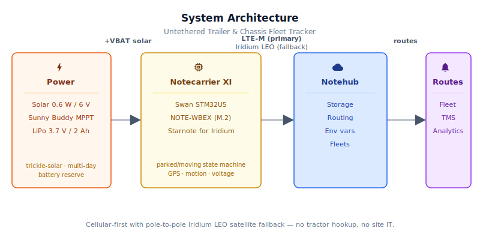
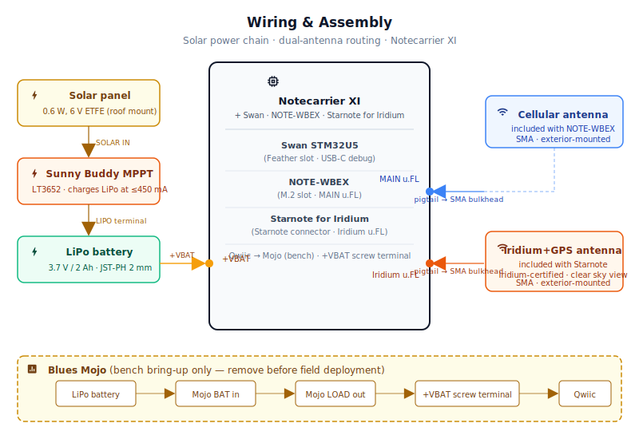

# Untethered Trailer & Chassis Fleet Tracker

<Note>

This reference application is intended to provide inspiration and help you get started quickly. It uses specific hardware choices that may not match your own implementation. Focus on the sections most relevant to your use case. If you'd like to discuss your project and whether it's a good fit for Blues, [feel free to reach out](https://blues.com/landing-pages/accelerators-contact-us/?accelerator=Untethered%20Trailer%20%26%20Chassis%20Fleet%20Tracker).

</Note>

This project is a solar-trickle-charged, tractor-independent GPS and motion tracker for [asset location tracking](https://blues.com/solutions-location-tracking/) on freight trailers and intermodal chassis. The device delivers cellular-first telemetry with truly global Iridium LEO satellite fallback — keeping the trailer or chassis visible across trans-oceanic container routes and polar corridors where geostationary satellite networks have no coverage at all. The hardware is a Blues Notecarrier XI with a Swan host, a cellular Notecard, and a Starnote for Iridium (see §4 for the BOM).

The unit mounts on the trailer roof or chassis frame, runs a parked/moving state machine entirely on-device, and delivers departure, arrival, and position notes to [Notehub](https://notehub.io) over cellular with automatic Iridium satellite fallback — no tractor hookup, no site IT, and no dependence on terrestrial coverage.

## 1. Project Overview


**The problem.** Long-haul trucking fleets have wrestled with a persistent visibility gap for decades: the tractor has an ELD (electronic logging device), a telematics unit, and a driver. The 53-foot box it drags around has none of those things. An intermodal chassis is even worse — the same steel frame might be owned by a chassis pool, leased to a carrier, loaded by a shipper, and dragged by three different tractors in a single week. At any given moment, a fleet operator's dispatch system knows where the power unit is. The trailer? It's wherever the last driver left it.

This matters because trailers and chassis represent enormous capital. A $100,000+ refrigerated trailer that sits dark for five days at a shipper's dock is invisible to the fleet — the carrier can't bill for detention time it can't prove, can't recover equipment without calling around, and can't prevent the slow-drain of assets that leak out of rotation. At the chassis pool level, the problem is even more acute: intermodal equipment management is largely still a phone call business because there's no inexpensive, tractor-independent way to know where each piece of equipment is.

**Why Notecard.** A trailer changes tractors every day and can change carriers every few days. Any solution that depends on the tractor — a J1939 tap, a cab-mount device, a driver's phone — fails the moment the trailer unhooks. The Blues Notecard is the right fit here for three reasons that compound:

First, **cellular is tractor-independent**. The Notecard on the trailer roof has its own prepaid SIM and cellular session. It doesn't know or care what tractor pulls it.

Second, **satellite fallback fills coverage gaps** — from remote land corridors to mid-ocean. North American freight routes cross the Great Plains, mountain passes, and border zones where LTE-M coverage has real gaps. Container chassis roam even further: trans-Atlantic and trans-Pacific segments put them completely beyond any terrestrial signal and any geostationary satellite footprint. This project addresses all of those scenarios: a standard cellular Notecard paired with a [Starnote for Iridium](https://dev.blues.io/datasheets/starnote-datasheet/starnote-for-iridium/) provides cellular-first delivery with Iridium LEO satellite fallback that works pole-to-pole, including every ocean segment. After two consecutive cellular failures the Notecard routes through the Starnote automatically — the firmware doesn't need to know which path is active.

Third, **power is scarce**. Trailers have no reliable 12V auxiliary hookup — the 7-way connector only carries power when a tractor is connected, which is exactly the condition we don't need to rely on. A small solar panel and LiPo battery are the only viable power source, which means the entire system needs aggressive sleep discipline. The Swan enters deep sleep via the ATTN interrupt between checks. The firmware explicitly enables GPS on each PARKED→MOVING departure (issuing `card.location.mode {"mode":"periodic"}`) and disables it on each MOVING→PARKED arrival (issuing `card.location.mode {"mode":"off"}`), so the GPS module never runs during parked dwells. The result is a device that can run for days without solar input and maintain month-scale battery life on trickle solar.

**Deployment scenario.** A weatherproof IP67 enclosure mounted flat on the trailer roof, with the solar panel installed on the same roof surface. Two SMA bulkhead fittings in the enclosure lid route the cellular antenna and the Iridium+GPS combined antenna to the lid surface — no GPS patch inside is needed. For chassis installations, see [§6.2](#chassis-deployment-variant) for chassis-specific mounting guidance. No tractor hookup. No wiring into trailer or chassis existing systems.

---

<NewToBlues/>

## 2. System Architecture




### 3.1 Swan host responsibilities

The [Swan](https://dev.blues.io/datasheets/swan-datasheet/) STM32U5 host in the Notecarrier XI Feather slot runs the motion/parked state machine. On each wake it queries the cellular Notecard's built-in accelerometer via [`card.motion`](https://dev.blues.io/api-reference/notecard-api/card-requests/#card-motion), detects state transitions, and queues the appropriate [Note](https://dev.blues.io/api-reference/glossary/#note) over I²C. On PARKED→MOVING transitions the firmware issues [`card.location.mode {"mode":"periodic"}`](https://dev.blues.io/api-reference/notecard-api/card-requests/#card-location-mode) to begin GPS acquisition; on MOVING→PARKED transitions it issues [`card.location.mode {"mode":"off"}`](https://dev.blues.io/api-reference/notecard-api/card-requests/#card-location-mode) to shut GPS down for the parked dwell. Transition notes are stamped at transition detection time — the wake cycle on which the state change is first observed — with the Notecard's current cached GPS fix and epoch. Those values are stored in the pending-event queue immediately; every delivery attempt, including retries on future wakes, uses the stored snapshot so a retried departure note never picks up a stale location from a subsequent parking period. The Swan then saves its state to Notecard flash via `NotePayloadSaveAndSleep` and enters deep sleep via the ATTN interrupt until the next timer fires.

Departure notes carry `sync:true`; on cellular this requests an immediate radio wake to deliver the Note. On NTN/satellite paths, `sync:true` marks the note as high priority but cannot interrupt a satellite orbital pass on demand — the Notecard queues it and delivers it at the next scheduled satellite transmission opportunity (which may be minutes to tens of minutes away depending on the Iridium LEO geometry). Position and heartbeat Notes batch until the next outbound window on either transport.

### 3.2 Notecard and Starnote for Iridium responsibilities

The cellular Notecard (e.g., NOTE-WBEX) stores queued Notes in its onboard flash and manages the cellular session on the configured [`hub.set`](https://dev.blues.io/api-reference/notecard-api/hub-requests/#hub-set) cadence. [`card.transport "method":"cell-ntn"`](https://dev.blues.io/api-reference/notecard-api/card-requests/#card-transport) instructs the Notecard to route through the Starnote for Iridium module after two consecutive cellular failures. The Starnote for Iridium handles the Iridium LEO satellite session and GPS/GNSS via its single Iridium-certified combined antenna; the standard [`card.location`](https://dev.blues.io/api-reference/notecard-api/card-requests/#card-location) API returns the Starnote's fix transparently. The Notecard also manages [environment variable](https://dev.blues.io/guides-and-tutorials/notecard-guides/understanding-environment-variables/) distribution from Notehub — operators can retune thresholds without a truck roll.

### 3.3 Notehub responsibilities

The Notecard manages its own cellular and satellite sessions against the supported carrier networks worldwide via its embedded global SIM and delivers data to [Notehub](https://notehub.io) over the Internet; [Notehub](https://dev.blues.io/notehub/notehub-walkthrough/) ingests events, stores all events, and routes them downstream. [Fleets](https://dev.blues.io/guides-and-tutorials/fleet-admin-guide/) let operators group trailers by carrier, lane, or equipment type and apply shared threshold configurations. [Smart Fleets](https://dev.blues.io/notehub/notehub-walkthrough/#using-smart-fleet-rules) can automatically assign trailers to the right fleet by region or device attribute.

**Routing to the cloud (high level only).** Notehub supports HTTP, MQTT, AWS, Azure, GCP, Snowflake, and other destinations. Route setup is project-specific; see the [Notehub routing docs](https://dev.blues.io/notehub/notehub-walkthrough/#routing-data-with-notehub). This project ships no specific downstream endpoint.

---

## 3. Technical Summary


**What you'll have when you're done:** A solar-powered trailer or chassis tracker that reports motion-triggered departure/arrival events and position updates to Notehub over LTE-M (primary) or Iridium LEO satellite (automatic fallback). No tractor hookup, no site IT, global pole-to-pole coverage.

1. **Notehub** — create a [Notehub project](https://notehub.io) and copy its ProductUID.
2. **Wire the bench rig** — Notecarrier XI + Swan + cellular Notecard + Starnote for Iridium + solar chain; full pinout in [§5.1](#51-notecarrier-xi-swan).
3. **Edit one line** of [`firmware/trailer_fleet_tracker_starnote/trailer_fleet_tracker_starnote_helpers.h`](firmware/trailer_fleet_tracker_starnote/trailer_fleet_tracker_starnote_helpers.h) — set `PRODUCT_UID` to your Notehub project's ProductUID (in Notehub: **Project Settings → ProductUID**).
4. **Flash** via Arduino IDE or `arduino-cli` (see [§7.1](#71-dependencies-and-flashing)).
5. **Watch** — open Notehub → **Events** tab. You should see a `_session.qo` within a few minutes of power-on — this confirms the first cellular session and clock sync. The firmware then queues a `trailer_heartbeat.qo` locally on the next parked-check wake (~5 minutes in). Because heartbeat Notes are **not** marked `sync:true`, they wait for the next scheduled outbound sync window rather than transmitting immediately: **~60 minutes** at a full battery (`voutbound high:60`) or **~120 minutes** at nominal charge (`voutbound normal:120`). Budget **1–2 hours from first power-on** before the first heartbeat appears in Notehub.

---

Here is a sample Note this device emits:

```json
{
  "file": "trailer_event.qo",
  "body": {
    "type": 1,
    "dwell_h": 18.5,
    "gps_valid": 1,
    "lat": 41.8781,
    "lon": -87.6298,
    "evt_time": 1746182400
  },
  "sync": true
}
```

## 4. Hardware Requirements


> **Hardware stack note.** This design uses Notecarrier XI + Swan rather than the default Notecarrier CX/Cygnet stack because the ocean-capable Iridium path requires the dedicated Starnote connector exposed by the Notecarrier XI — the Notecarrier CX/Cygnet combination does not provide that interface and therefore cannot support Starnote for Iridium or Iridium NTN satellite fallback.

| Part | Qty | Rationale |
|------|-----|-----------|
| Notecarrier XI | 1 | Carrier board with M.2 Notecard slot, Starnote for Iridium connector, Feather MCU slot, and +VBAT / Qwiic headers. |
| Standard cellular Notecard, e.g., [NOTE-WBEX](https://dev.blues.io/datasheets/notecard-datasheet/note-wbex/) | 1 | Global LTE-M / NB-IoT cellular + GPS/GNSS in an M.2 module. The Notecard handles the cellular session and motion detection; the Starnote for Iridium provides satellite fallback and combined GPS+satellite antenna. |
| [Starnote for Iridium](https://dev.blues.io/datasheets/starnote-datasheet/starnote-for-iridium/) | 1 | Iridium LEO satellite module with a single Iridium-certified antenna that handles both satellite and GPS/GNSS. Plugs into the Notecarrier XI Starnote connector. No additional GPS antenna required. |
| [Swan (STM32U5)](https://dev.blues.io/datasheets/swan-datasheet/) | 1 | Blues Feather-format STM32U5 host MCU. Seats in the Notecarrier XI Feather slot; enters deep sleep via `NotePayloadSaveAndSleep` / `card.attn` ATTN interrupt between wake cycles. |
| [Blues Mojo](https://shop.blues.com/products/mojo?utm_source=dev-blues&utm_medium=web&utm_campaign=store-link) *(bench-only, not field-deployed)* | 1 | Coulomb counter for power validation during bench bring-up. Connects inline between LiPo and Notecarrier XI +VBAT pad via Qwiic; remove before field deployment. |
| [SparkFun Sunny Buddy MPPT Solar Charger](https://www.sparkfun.com/sparkfun-sunny-buddy-mppt-solar-charger.html) | 1 | LT3652-based MPPT charger; accepts 6–20V solar input and charges a single-cell LiPo at up to 450 mA. MPPT ensures the panel operates at its maximum power point across the wide irradiance range seen on a trailer roof. |
| [SparkFun Small Solar Panel — 0.6W, 6V ETFE](https://www.sparkfun.com/products/18725) | 1 | Flexible ETFE panel, weather-resistant, 6V nominal. At 4 peak sun hours it delivers roughly 250–300 mAh/day. Whether that exceeds the system's parked quiescent draw depends on the Starnote for Iridium board's unpublished standby current; measure the actual floor with Mojo (§10) before drawing final sizing conclusions. Mount flat on the trailer roof above the enclosure. |
| [SparkFun Lithium Ion Battery — 2Ah (PRT-13855)](https://www.sparkfun.com/products/13855) | 1 | 3.7V / 2000 mAh cell with 2mm JST-PH connector. Provides multi-day backup through cloudy dwell periods. |
| Cellular antenna *(included with NOTE-WBEX)* | 1 *(included)* | Ships in the NOTE-WBEX kit. Connects to the Notecard MAIN u.FL port via the u.FL-to-SMA pigtail and SMA bulkhead fitting below. Covers the LTE-M / NB-IoT frequency bands for the regions of deployment. Route through the first SMA bulkhead to the exterior of the enclosure lid. |
| Iridium-certified combined Iridium+GPS antenna *(included with Starnote for Iridium)* | 1 *(included)* | Ships in the Starnote for Iridium kit. A single u.FL antenna that covers both Iridium satellite uplink (1616–1626.5 MHz) and GPS/GNSS — no separate GPS antenna is needed. **Must use only the included antenna**: [Starnote for Iridium is certified on Iridium's network exclusively with this antenna](https://dev.blues.io/datasheets/starnote-datasheet/starnote-for-iridium/); substituting another antenna voids Iridium network certification and risks network blocking. Route through the second SMA bulkhead to the exterior of the enclosure lid and mount with an unobstructed 360° sky view. |
| u.FL to SMA pigtail, ~100 mm, e.g., [SparkFun Interface Cable SMA to U.FL, WRL-09145](https://www.sparkfun.com/products/9145) | 2 | Two pigtails: one for the NOTE-WBEX cellular MAIN u.FL port (routes to the cellular antenna via the first SMA bulkhead) and one for the Starnote's Iridium+GPS u.FL port (routes to the combined Iridium+GPS antenna via the second SMA bulkhead). |
| SMA female panel-mount (bulkhead) connector, 50Ω, e.g., [Amphenol RF 132289](https://www.mouser.com/ProductDetail/Amphenol-RF/132289) | 2 | Two fittings in the enclosure lid: one for the cellular antenna (NOTE-WBEX MAIN path) and one for the Iridium+GPS combined antenna (Starnote path). Both antennas exit externally through the lid — no inside-mounted GPS patch is needed. The Amphenol RF 132289 is a standard panel-mount SMA female chassis connector (50Ω, through-hole); any electrically equivalent 50Ω SMA female panel-mount fitting with a compatible flange size is an acceptable substitute. |
| IP67 weatherproof enclosure, ~130×80×50 mm | 1 | Protects the electronics from road spray, rain, and the wide temperature swings of a trailer roof installation. Because both antennas route through SMA bulkheads, **the lid material does not need to be RF-transparent** — ABS, polycarbonate, or aluminum are all acceptable. Mount flat on the trailer roof; a cable entry gland in the side wall admits the solar panel leads. |

**Antenna note.** The Starnote for Iridium ships with an Iridium-certified antenna that connects to its single u.FL port and covers both Iridium satellite link and GPS/GNSS — no separate GPS antenna is needed and the NOTE-WBEX GPS u.FL port is not used. The NOTE-WBEX ships with a cellular antenna for its MAIN u.FL port. Both antennas route through separate SMA bulkhead fittings to the exterior of the enclosure lid. Mount the Iridium+GPS antenna with an unobstructed 360° sky view — Iridium LEO satellites pass over every azimuth, so directional orientation does not matter.

The cellular Notecard (e.g., NOTE-WBEX) ships with an active Blues SIM including 500 MB of data and 10 years of global cellular service — no monthly commitments, no activation fees. The Starnote for Iridium requires a separate Iridium satellite service plan and is not covered by the cellular SIM; contact [Blues](https://blues.com/contact-sales/) for current Iridium service details and activation.

---

## 5. Wiring and Assembly




### 5.1 Notecarrier XI + Swan

The Swan seats in the Notecarrier XI Feather slot, the cellular Notecard seats in the M.2 slot, and the Starnote for Iridium plugs into the XI's dedicated Starnote connector. Power, Qwiic, and both antennas land on accessible headers and u.FL ports.

**Notecarrier XI interface reference:**

| Interface | Location | Notes |
|---|---|---|
| **+VBAT** | Screw-terminal block, carrier edge | 3.4–4.2V single-cell LiPo input. Red wire to `+VBAT`, black wire to adjacent **GND**. During bench bring-up the Mojo `LOAD` output connects here via its JST-PH pigtail. |
| **GND** | Screw-terminal block, adjacent to +VBAT | Shared power and signal return for battery, solar charger, and Qwiic. |
| **Feather MCU slot** | Standard 0.1″ Feather headers, carrier face | Swan seats here. Press the Swan firmly until both Feather header rows are fully seated; the header keying and the Swan's USB-C port orientation match the silk-screen label on the XI. |
| **M.2 slot** | M.2 Key-E connector, carrier center | Cellular Notecard (e.g., NOTE-WBEX) seats at a 45° tilt, then pivots flat and is secured with the M.2 retaining screw. The M.2 key prevents reverse insertion. |
| **Starnote connector** | Dedicated multi-pin connector, carrier face | Starnote for Iridium plugs straight down into this connector; it carries power, I²C, and the Iridium+GPS antenna passthrough. Align the Starnote module over the connector and press firmly until fully seated — no screws required. |
| **Qwiic** | JST-SH 1mm 4-pin, carrier face | Mojo connects here via Qwiic cable for I²C mAh reporting during bench bring-up. The XI has onboard I²C pull-ups; no additional resistors required. |
| **Swan USB-C** | USB-C port on the Swan module itself | Programs the Swan host and provides a CDC serial debug port at 115200 baud. Connect to this port (on the Swan, not any carrier-edge port) for programming and serial monitor. |

**Power chain — bench bring-up (Mojo inline):**

The Mojo sits inline between the LiPo and the Notecarrier XI +VBAT screw terminal, measuring device-side discharge current only.

1. Solar panel → **Sunny Buddy** SOLAR IN terminal (6–20V).
2. **LiPo battery** → **Sunny Buddy** LIPO terminal (JST-PH 2mm 2-pin; charging connection).
3. **LiPo battery** → **Mojo** `BAT` input (JST-PH Y-adapter from the battery pigtail; same node as the Sunny Buddy LIPO connection).
4. **Mojo** `LOAD` output → Notecarrier XI **+VBAT** screw terminal (red to `+VBAT`, black to `GND`).
5. **Mojo** Qwiic → Notecarrier XI **Qwiic** port.

**Power chain — field deployment (Mojo removed):**

After bench bring-up is complete (see [§9](#9-validation-and-testing)), remove the Mojo before sealing the enclosure:

1. Solar panel → **Sunny Buddy** SOLAR IN (unchanged).
2. **LiPo battery** → **Sunny Buddy** LIPO terminal (unchanged).
3. **LiPo battery** → Notecarrier XI **+VBAT** screw terminal directly.

> **Polarity note.** Verify red-to-positive on every JST-PH connection before applying power. The Notecarrier XI +VBAT accepts 3.4–4.2V; exceeding 4.3V risks damage.

**Antenna routing:**

Two external antennas, requiring two SMA female bulkhead fittings in the enclosure lid:

- **NOTE-WBEX cellular antenna (MAIN u.FL):** Route via a ~100 mm u.FL-to-SMA pigtail to one SMA female bulkhead fitting on the enclosure lid; thread the included cellular antenna onto the bulkhead from outside.
- **Starnote Iridium+GPS combined antenna (Starnote u.FL):** Connect to the Starnote's u.FL port via a second ~100 mm u.FL-to-SMA pigtail and route to the second SMA female bulkhead fitting on the enclosure lid. Mount this antenna on the lid surface facing skyward with a clear 360° sky view — Iridium LEO satellites pass over every azimuth, so directional orientation does not matter. **No separate GPS antenna is needed**; the Starnote's combined antenna handles GPS, and the NOTE-WBEX GPS u.FL port is not used.

The two SMA bulkhead fittings should be spaced at least 25 mm apart to minimize coupling between the two antenna paths. If any trailer structure overhangs the planned mount location, shift the enclosure fore or aft to clear it — partial sky obstruction above roughly 8° elevation will degrade Iridium link margin and GPS acquisition.

**I²C / debug:**

The Swan communicates with the cellular Notecard over the Notecarrier XI's onboard I²C bus. The Starnote for Iridium is managed by the Notecard via the Starnote connector — no additional host wiring is required for satellite or GPS operation. During development, connect the **Swan's USB-C port** (on the Swan module itself) to a host PC; it enumerates as a CDC serial port at 115200 baud.

---

### Chassis deployment variant

An intermodal chassis has no roof — it is a flat, low steel frame sized for a 20- or 40-foot ISO container. The BOM is identical to the trailer installation, but the mounting, solar, and antenna strategy must adapt to the chassis geometry.

**Mounting location.** Mount the enclosure on the **front bolster or gooseneck cross-member** at the kingpin end of the chassis. This area sits directly under the container floor plate and is partially protected from horizontal impacts during container handling. Use stainless M6 hardware with split lock washers through pre-drilled holes; thread-locking compound (e.g. Loctite 243) on every fastener is recommended given the constant road vibration. Avoid the rear cross-members — they are more exposed to road spray from the axle group and to forklift contact near the rear twist locks.

**Solar panel.** When a container is loaded, the chassis roof surface is blocked entirely. Mount the solar panel on a **bracket welded or bolted to the inboard face of the front bolster rail**, angled 30–45° skyward and oriented south in the northern hemisphere. Verify the bracket geometry clears the container twist-lock castings and does not protrude beyond the chassis rail envelope where it would interfere with loading or transport width limits. Budget conservatively: assume 2–3 peak sun hours per day for a chassis-mounted panel (compared with 4 on an unobstructed trailer roof), and consider upgrading to a 4 Ah LiPo for high-latitude or winter deployments.

**Antennas.** Both the cellular antenna and the Iridium+GPS combined antenna need a clear sky view. Install both SMA bulkhead fittings on the **top or outboard face** of the enclosure lid and orient the enclosure so that face points upward or outboard, not buried against the chassis rail. On a loaded chassis, antennas mounted inside the container envelope will have the container floor plate directly overhead; position the enclosure forward enough that the antennas clear the front edge of the container.

**Enclosure protection.** Chassis environments are harder than trailer roofs: road spray from below the frame is continuous, forklift tines pass close to the frame rails, and container-handling operations subject nearby hardware to impact and scuff loads. Use an IP67 enclosure with stainless fasteners throughout, protect cable entry glands with reinforced strain-relief fittings rated for abrasion and UV, and consider adding a steel guard plate over the enclosure if the mount location is within reach of forklift traffic.

---

## 6. Notehub Setup


### Creating the project and provisioning the device

1. **Create a project.** Sign up at [notehub.io](https://notehub.io) and [create a new project](https://dev.blues.io/quickstart/notecard-quickstart/notecard-and-notecarrier-pi/#set-up-notehub). Copy the [ProductUID](https://dev.blues.io/notehub/notehub-walkthrough/#finding-a-productuid) — it looks like `com.your-company.your-name:trailer-tracker`.
2. **Set the ProductUID in firmware.** Open [`firmware/trailer_fleet_tracker_starnote/trailer_fleet_tracker_starnote_helpers.h`](firmware/trailer_fleet_tracker_starnote/trailer_fleet_tracker_starnote_helpers.h) and replace the empty string on the `#define PRODUCT_UID ""` line with your value.
3. **Power the unit.** On first cellular session the Notecard associates itself with your project automatically — no manual claim step required. The device appears in your project's **Devices** tab within a minute or two.

### Fleet organization

Create one [Fleet](https://dev.blues.io/guides-and-tutorials/fleet-admin-guide/) per equipment category, for example, `reefer-trailers`, `dry-vans`, and `flatbed-trailers`. Fleet-level [environment variables](https://dev.blues.io/guides-and-tutorials/notecard-guides/understanding-environment-variables/) flow to every device in that fleet on the next inbound sync, so you can tune heartbeat cadence or motion sensitivity for the whole category at once. [Smart Fleets](https://dev.blues.io/notehub/notehub-walkthrough/#using-smart-fleet-rules) can auto-classify trailers by device attribute if your fleet uses a consistent naming scheme.

### Environment variables

Navigate to **Fleet → Environment** (or **Device → Environment** for per-unit overrides) and add any of the variables below. Changes propagate in two steps: Notehub delivers the updated values to the Notecard on the next **inbound sync window** (configured at 2 hours at high battery, 4 hours at normal battery via the `vinbound` profile), and then the host firmware picks them up on its next **hourly env poll** (`ENV_POLL_SECS = 3600`). Under normal battery conditions, expect new values to be active within roughly **3–5 hours** of saving them in Notehub — no reflash, no truck roll.

| Variable | Default | Purpose |
|---|---|---|
| `parked_check_mins` | `5` | How often the host wakes to poll the accelerometer while parked. Lower values detect departures sooner (transition detection accuracy is bounded by this interval) but increase average sleep current. Range: 1–60. |
| `moving_ping_mins` | `15` | GPS position report interval while moving. Arrival detection accuracy is bounded by this interval. When changed, the firmware also reissues `card.location.mode` so the Notecard's GNSS fix cadence stays matched to the new report interval. Range: 5–60. |
| `heartbeat_hours` | `6` | Alive-ping interval while parked. Set higher (e.g. `12`) for long-dwell equipment at known yards; lower (e.g. `2`) for high-value assets or demurrage monitoring. Range: 1–24. |

### Routing

Add two routes in Notehub:

- **`trailer_event.qo`** → real-time delivery to a downstream HTTP endpoint, MQTT broker, or cloud function. These departure/arrival events are the data that fuel detention billing, recovery workflows, and missed-connection alerts.
- **`trailer_location.qo` + `trailer_heartbeat.qo`** → long-term store (e.g. Snowflake, AWS S3, or a time-series database) for dwell-time analytics, lane utilization, and battery trending.

Separating the two routes keeps alert latency independent of bulk-load throughput. See the [Notehub routing docs](https://dev.blues.io/notehub/notehub-walkthrough/#routing-data-with-notehub) for supported destination types.

### What you'll see in Notehub

The **Events** tab in your project shows all Note types:

- **`_session.qo`** — Notecard housekeeping on each cellular or satellite session; confirms connectivity.
- **`trailer_event.qo`** — fires on every departure and arrival, delivered with `sync:true`. The body looks like:

  ```json
  {
    "type": 1,
    "dwell_h": 18.5,
    "gps_valid": 1,
    "lat": 41.8781,
    "lon": -87.6298,
    "evt_time": 1746182400
  }
  ```

  `type` 1 = departed, 2 = arrived. `dwell_h` is the number of hours the trailer sat parked before this departure; it will be 0 for arrival notes. `gps_valid` is 1 when a valid GPS fix was available at detection time, 0 when no fix existed (e.g., on first departure from a freshly installed unit, ignore `lat`/`lon` when `gps_valid` is 0). `lat`, `lon`, and `evt_time` are the GPS coordinates and Unix epoch captured at transition detection time — the wake cycle on which the state change was first observed. Timestamp accuracy is bounded by `parked_check_mins` for departures and `moving_ping_mins` for arrivals; location is the Notecard's most recent cached fix at detection time. These values are stored in the event queue at detection time and preserved across retried deliveries so a note retried on a later wake always carries the original detection-time data, not the post-transition GPS state.

- **`trailer_location.qo`** — queued every `moving_ping_mins` while rolling; the compact envelope carries the GPS fix embedded by the Notecard. Visible on a map in Notehub's device view.
- **`trailer_heartbeat.qo`** — fired every `heartbeat_hours` while parked. Body:

  ```json
  {
    "volt": 3.84
  }
  ```

  A downward trend in `volt` across consecutive heartbeats is an early warning that the solar panel or charge path needs attention.

---

## 7. Firmware Design


The firmware lives in [`firmware/trailer_fleet_tracker_starnote/`](firmware/trailer_fleet_tracker_starnote/). All application logic runs in `setup()`; `loop()` forces a system reset if ever reached, ensuring the tracker resumes normal operation.

### 7.1 Dependencies and flashing

**Install the `Blues Wireless Notecard` library:**

Install [`note-arduino`](https://github.com/blues/note-arduino) via the Arduino Library Manager or `arduino-cli lib install "Blues Wireless Notecard"`. See the [note-arduino releases page](https://github.com/blues/note-arduino/releases) for available versions.

**Add the STM32 boards index:**

Add `https://github.com/stm32duino/BoardManagerFiles/raw/main/package_stmicroelectronics_index.json` under **File → Preferences → Additional Boards Manager URLs**, then install "STM32 MCU based boards" via the Boards Manager. Select **Generic STM32U5 series → Swan** as the board.

**Flashing — Arduino IDE:** open `trailer_fleet_tracker_starnote.ino`, select the Swan board, and click **Upload**. Connect to the **Swan's USB-C port** (on the Swan module itself).

**Flashing — `arduino-cli`:**

```bash
# Find the FQBN for the Swan variant on your installed core
arduino-cli board listall | grep -i swan

# Compile and upload (replace FQBN and port with what listall reports)
arduino-cli compile -b STMicroelectronics:stm32:GenU5:pnum=SWAN_R5 firmware/trailer_fleet_tracker_starnote/
arduino-cli upload  -b STMicroelectronics:stm32:GenU5:pnum=SWAN_R5 \
                    -p /dev/cu.usbmodem* firmware/trailer_fleet_tracker_starnote/
```

**Debug serial logging:** The `#define usbSerial Serial` line in `trailer_fleet_tracker_starnote_helpers.h` is commented out by default. To enable logging during development, uncomment that line, recompile, and open the serial monitor at **115200 baud** on the Swan's USB-C port. You'll see `[heartbeat]`, `[departed]`, `[location]`, and `[sleep]` log lines on each wake cycle. Comment it back out before deploying to the field.

### 7.2 Module responsibilities

| Responsibility | Where in sketch |
|---|---|
| Notecard config: `hub.set`, `card.transport`, `card.location.mode`, `card.motion.mode` | `notecardConfigure()` |
| Compact Note templates (all three Notefiles) | `defineTemplates()` |
| Env-var overrides from Notehub | `fetchEnvOverrides()` |
| Motion state query | `isMoving()` |
| Time and voltage reads | `getEpoch()`, `getBatteryVoltage()` |
| GNSS state capture for transition events | `captureGnssState()` |
| GPS validity gate (location and heartbeat Notes) | `hasValidGnssFix()` |
| State machine, sleep/wake scheduling | `setup()` |
| Note emission | `sendTransitionEvent()`, `sendLocationNote()`, `sendHeartbeatNote()` |
| Transition event FIFO queue and retry | `enqueuePendingEvent()`, `drainPendingQueue()` |
| State persistence across sleep | `NotePayloadSaveAndSleep` / `NotePayloadRetrieveAfterSleep` |

### 7.3 Motion and GPS strategy

Motion detection is handled by the Notecard's built-in accelerometer, configured with [`card.motion.mode`](https://dev.blues.io/api-reference/notecard-api/card-requests/#card-motion-mode). The firmware uses `motion:5, seconds:60`, meaning the Notecard declares the trailer "moving" when five or more motion events accumulate in a single 60-second bucket, and "stopped" when the bucket falls quiet. `sensitivity:2` (25 Hz / ±4G) is tuned to catch the low-frequency road vibration of a loaded trailer without triggering on wind buffeting or dock impacts while parked.

GPS mode is managed explicitly by the state machine rather than relying on the Notecard's implicit periodic-mode motion-gating — which is documented only for the Notecard's own GPS module and not guaranteed for the Starnote for Iridium's combined GPS hardware path. On first boot, `notecardConfigure()` issues [`card.location.mode {"mode":"off"}`](https://dev.blues.io/api-reference/notecard-api/card-requests/#card-location-mode) because the unit always enters parked state. On each PARKED→MOVING departure the firmware issues `card.location.mode {"mode":"periodic", "seconds":<moving_ping_secs>}` to start GPS acquisition; on each MOVING→PARKED arrival it issues `card.location.mode {"mode":"off"}` to shut the GPS module down for the parked dwell. This explicit toggling guarantees the GPS module never runs while the trailer sits parked, regardless of how the Starnote for Iridium's combined GPS hardware interacts with the Notecard on this path. On this hardware GPS is provided by the Starnote for Iridium's combined Iridium+GPS antenna; the standard `card.location` API returns the fix transparently.

If the `moving_ping_mins` environment variable is later changed in Notehub, `fetchEnvOverrides()` stores the new `moving_ping_secs` value immediately. If the trailer is currently MOVING it also re-issues `card.location.mode {"mode":"periodic"}` with the updated `seconds` field right away; if parked, the new period is applied automatically on the next PARKED→MOVING departure. The most recent fix is embedded into location and heartbeat Notes via the compact template's `_lat` / `_lon` keywords; transition event Notes use explicit `lat`/`lon`/`evt_time` fields captured at transition detection time (see [§7.4](#74-event-payload-design)).

**GPS fix validity gating.** Before queuing any note that embeds location data, the firmware calls `hasValidGnssFix()`, which issues `card.location` and checks whether the Notecard reports a non-zero lat/lon with no error. `card.location` returns the last cached fix regardless of the current GPS mode (periodic or off) — no additional GPS-on time is incurred by this check. This prevents freshly installed units — where GPS has never acquired a fix — from emitting notes with silently-zeroed coordinates.

- **`trailer_location.qo`** — suppressed entirely when no valid fix is available. A location note with zeroed coordinates has no fleet value, and because `last_location_at` is not advanced on suppression, the firmware will retry on the next moving-state wake once a fix is acquired.
- **`trailer_event.qo`** and **`trailer_heartbeat.qo`** — always sent (departure/arrival events and battery voltage are too important to suppress), but carry a `gps_valid` field (`1` = confirmed fix, `0` = no fix available). Downstream receivers can use this flag to distinguish a confirmed location from an invalid placeholder and suppress map plotting or geofence checks accordingly.

**GPS fix capture on transition events.** On the wake cycle where a PARKED→MOVING or MOVING→PARKED transition is first detected, the firmware calls `captureGnssState()` — a single `card.location` query that returns the Notecard's currently cached lat/lon. `card.location` returns the last cached fix regardless of the current GPS mode; no additional GPS-on time is incurred. The captured coordinates, validity flag, and current epoch are stored in the `PendingEvent` struct. Every delivery attempt for that event (including retries on future wakes after communication failures) uses the stored snapshot, not the Notecard's GPS state at retry time. This means a departure note retried two hours later still carries the departure-detection-time location and timestamp, not the current parked position.

For **arrival events**, `captureGnssState()` is called while GPS is still in periodic mode (the disable-GPS step comes immediately after), so the cached fix is current within one `moving_ping_mins` interval of the stop. For **departure events** after a long parked dwell, `captureGnssState()` is called before GPS is re-enabled, so the cached fix is from the trailer's last trip — potentially hours or days stale; `gps_valid` will still be `1` because the fix is structurally valid even if aged. If fresh departure coordinates are a hard requirement, the firmware can be extended to enable GPS, poll `card.location` until a new fix is available, and then call `captureGnssState`, at the cost of 30–90 seconds of additional GPS-on time and battery draw on each departure event.

### 7.4 Event payload design

All three Notefiles use [`"format":"compact"`](https://dev.blues.io/notecard/notecard-walkthrough/low-bandwidth-design#working-with-note-templates) templates to minimize over-the-air size. Iridium SBD enforces a maximum payload size per message, and the compact format strips the JSON envelope and stores Notes as fixed-length binary records; at the field sizes used here (uint8, float16, float32, int32), each Note is approximately 14–20 bytes on the wire — well within the limit.

**Payload Reference (for downstream integrators):**

| Notefile | Trigger | Fields | Notes |
|---|---|---|---|
| `trailer_event.qo` | Departure or arrival | `type` (1=departed, 2=arrived), `dwell_h` (parked duration in hours), `gps_valid` (1=fix, 0=none), `lat`, `lon`, `evt_time` | `sync:true`; immediate cellular delivery. Iridium fallback on next window if cellular unavailable. |
| `trailer_location.qo` | Moving state, interval elapsed | `lat`, `lon`, `gps_valid`, `volt` | Batched; sent at next outbound window (60–360 minutes depending on battery state). |
| `trailer_heartbeat.qo` | Parked state, interval elapsed | `volt`, `gps_valid` | Batched; sent every 6 hours (default, overridable). Used to confirm solar charging (declining volt = charging failure). |

Sample `trailer_event.qo` (departed, 18.5 hours of dwell, GPS fix confirmed at detection time):

```json
{
  "file": "trailer_event.qo",
  "body": {
    "type": 1,
    "dwell_h": 18.5,
    "gps_valid": 1,
    "lat": 41.8781,
    "lon": -87.6298,
    "evt_time": 1746182400
  },
  "sync": true
}
```

`type` 1 = departed, 2 = arrived. `dwell_h` is hours parked before this departure; it is `0` for arrival notes. `gps_valid` is `1` when a valid GPS fix was available at detection time, `0` when no fix existed (e.g., a freshly installed unit, ignore `lat`/`lon` when `gps_valid` is `0`). `lat` and `lon` are the GPS coordinates captured at transition detection time; `evt_time` is the Unix epoch at that same wake. Timestamp accuracy is bounded by `parked_check_mins` (for departures) or `moving_ping_mins` (for arrivals), and location is the Notecard's most recently cached fix at detection time. These fields are written explicitly by the host at detection time so they are preserved correctly across retried deliveries. Unlike `trailer_location.qo` and `trailer_heartbeat.qo` — which use the Notecard's auto-populated `_lat`/`_lon`/`_time` keywords — event Notes use explicit host-supplied fields so that a note retried on a later wake never picks up a stale post-transition GPS state.

Sample `trailer_heartbeat.qo` (parked, battery healthy, GPS fix available):

```json
{
  "file": "trailer_heartbeat.qo",
  "body": {
    "volt": 3.84,
    "gps_valid": 1
  }
}
```

A downward trend in `volt` across consecutive heartbeats is an early warning that the solar panel or charge path needs attention. `gps_valid: 0` on early heartbeats from a new unit is normal — it clears once the Notecard acquires its first fix.

`trailer_location.qo` carries no application body fields — the GPS fix is the only payload, embedded by the Notecard from its last acquired fix. Location notes are suppressed entirely when no valid fix is available, so every `trailer_location.qo` that reaches Notehub carries real coordinates.

### 7.5 Low-power strategy

**Host power gate.** After every state-machine cycle, the firmware calls `NotePayloadSaveAndSleep`, which serializes the `AppState` struct to Notecard flash and issues [`card.attn`](https://dev.blues.io/api-reference/notecard-api/card-requests/#card-attn) to put the host to sleep. `card.attn` fires an ATTN interrupt that wakes Swan from deep sleep after the configured interval. The next hardware wake re-enters `setup()` from cold; `NotePayloadRetrieveAfterSleep` at the top of `setup()` rehydrates the struct.

**GPS suppression.** The firmware issues `card.location.mode {"mode":"off"}` on each MOVING→PARKED arrival and `card.location.mode {"mode":"periodic"}` on each PARKED→MOVING departure — a parked trailer never runs the GPS module. Given trailers spend the majority of their lives at docks, yards, and distribution centers, this explicit GPS gating is the single biggest power saving in the system.

**Voltage-variable sync.** `hub.set` is configured with `voutbound:"high:60;normal:120;low:360;dead:0"` — as the solar battery drains, the cellular outbound sync interval stretches from 1 hour to 6 hours, then suspends entirely if the battery is critically depleted. Transition events use `sync:true` to request priority delivery regardless of the outbound schedule; on cellular this wakes the radio immediately, while on NTN it queues the Note for the next satellite transmission opportunity rather than suspending delivery entirely.

### 7.6 Retry and error handling

- The first Notecard request in `notecardConfigure()` uses `sendRequestWithRetry(req, 5)` — a 5-second retry window that handles the known cold-boot I²C race where the Swan comes up before the Notecard is ready.
- `isMoving()`, `getEpoch()`, and `getBatteryVoltage()` all guard on a NULL response and return safe default values rather than crashing the state machine.
- `fetchEnvOverrides()` checks the `err` field on the Notehub response before trusting the body — if the Notecard hasn't yet established a session, the env response will contain an error and the firmware continues with its last known defaults.
- The `AppState` restore logic treats a failed `NotePayloadGetSegment` (corrupt payload or schema change after a firmware update) as a first-boot, safely re-initializing all defaults rather than running with undefined state.
- Integer env var inputs are clamped to their documented ranges before being applied to the state, so a typo in Notehub can't set the ping interval to 0 or 65535 minutes.

### 7.7 Key code snippet 1: transport configuration

After two consecutive cellular failures, the Notecard automatically routes through the Starnote for Iridium module. No firmware involvement required; a single API call configures the fallback.

```cpp
J *req = notecard.newRequest("card.transport");
JAddStringToObject(req, "method", "cell-ntn");
notecard.sendRequest(req);
```

### 7.8 Key code snippet 2: compact template definition

All three Notefiles use compact format so Notes are small enough to transmit intact over satellite. `trailer_location.qo` and `trailer_heartbeat.qo` use the Notecard's auto-populated `_lat`/`_lon`/`_time` keywords — those notes are always emitted in real time, so the Notecard's current GPS state is the correct value to embed. `trailer_event.qo` uses **explicit host-supplied `lat`/`lon`/`evt_time` fields** because transition events may be retried on future wakes; capturing and storing the values at detection time ensures retries always carry the original departure or arrival location rather than a post-transition GPS state.

```cpp
// trailer_event.qo — explicit lat/lon/evt_time, NOT auto-populated _lat/_lon/_time
J *req = notecard.newRequest("note.template");
JAddStringToObject(req, "file",   "trailer_event.qo");
JAddNumberToObject(req, "port",   50);
JAddStringToObject(req, "format", "compact");
J *body = JAddObjectToObject(req, "body");
JAddNumberToObject(body, "type",      21);    // TUINT8
JAddNumberToObject(body, "dwell_h",   12.1);  // TFLOAT16
JAddNumberToObject(body, "gps_valid", 21);    // TUINT8: 1=valid fix, 0=no fix
JAddNumberToObject(body, "lat",       14.1);  // TFLOAT32: captured at detection time
JAddNumberToObject(body, "lon",       14.1);  // TFLOAT32: captured at detection time
JAddNumberToObject(body, "evt_time",  14);    // TINT32: epoch captured at detection time
notecard.sendRequest(req);
```

### 7.9 Key code snippet 3: voltage-variable sync with host power gate

The `voutbound` string stretches the sync interval as the battery drains; `NotePayloadSaveAndSleep` puts the Swan to sleep between wakes.

```cpp
// hub.set with voltage-variable outbound cadence
J *req = notecard.newRequest("hub.set");
JAddStringToObject(req, "mode",      "periodic");
JAddStringToObject(req, "voutbound", "high:60;normal:120;low:360;dead:0");
JAddStringToObject(req, "vinbound",  "high:120;normal:240;low:720;dead:0");
notecard.sendRequestWithRetry(req, 5);

// ... later, at the end of each wake cycle:
NotePayloadDesc out = {0, 0, 0};
NotePayloadAddSegment(&out, kStateSegId, &state, sizeof(state));
NotePayloadSaveAndSleep(&out, sleep_secs, NULL);
```

### 7.10 Key code snippet 4: motion-triggered state transition

Every departure starts with a `card.motion` query. The dwell time is calculated from the stored `parked_since` epoch and attached to the Note so fleet managers can measure detention without any external tracking. `captureGnssState()` is called once on the wake where the transition is detected — its result is stored in the `PendingEvent` FIFO and passed through to every `note.add` attempt so retried events always carry the original detection-time location and timestamp. See [§7.3](#73-motion-and-gps-strategy) for the discussion of GPS freshness on departures after long parked dwells.

```cpp
J *rsp = notecard.requestAndResponse(notecard.newRequest("card.motion"));
const char *mode = JGetString(rsp, "mode");
bool moving = (mode && strcmp(mode, "moving") == 0);
notecard.deleteResponse(rsp);

if (prev == STATE_PARKED && moving) {
    float dwell_h = (state.parked_since > 0 && now > state.parked_since)
                    ? (float)(now - state.parked_since) / 3600.0f : 0.0f;

    // Capture GNSS state at departure-detection time; stored in the event FIFO
    // so every delivery attempt (including retries) uses the detection-time
    // location rather than the Notecard's GPS state at retry time.
    float   cap_lat = 0.0f, cap_lon = 0.0f;
    uint8_t cap_gps_valid = 0;
    captureGnssState(cap_lat, cap_lon, cap_gps_valid);

    state.current_state = STATE_MOVING;
    enqueuePendingEvent(state, EVENT_DEPARTED, dwell_h,
                        (time_ok && now > 0) ? now : 0U,
                        cap_lat, cap_lon, cap_gps_valid);
    drainPendingQueue(state);   // attempt immediate delivery
}
```

---

## 8. Data Flow


**Collected.** On every wake: the Notecard accelerometer's moving/stopped status. When moving: GPS coordinates from the Notecard's periodic GPS module. When parked: LiPo battery voltage from the Notecard's ADC.

**Transmitted.**

| Notefile | Trigger | Cadence | Transport |
|---|---|---|---|
| `trailer_event.qo` | State transition (depart or arrive) | On event, `sync:true` | Cellular (immediate); NTN satellite (next transmission window) |
| `trailer_location.qo` | While moving, interval elapsed | Every `moving_ping_mins` (default 15 minutes) | Batched, outbound window |
| `trailer_heartbeat.qo` | While parked, interval elapsed | Every `heartbeat_hours` (default 6 hours) | Batched, outbound window |

On **cellular**, queued Notes flush at the outbound window (60 minutes at high battery, 120 minutes at normal battery, stretching to 360 minutes at low battery, matching `VOUTBOUND_PROFILE`). Transition events bypass the queue via `sync:true`, waking the radio immediately for delivery.

On **NTN/satellite**, `sync:true` marks transition events as high priority but the Notecard cannot interrupt a satellite orbital pass on demand. Events are queued and delivered at the next scheduled Iridium transmission opportunity rather than triggering an immediate radio wake. This is a [documented Notecard behavior](https://dev.blues.io/api-reference/notecard-api/hub-requests/#hub-set); expect delivery within the next satellite window (typically minutes, depending on Iridium LEO geometry) rather than sub-60-second cellular latency.

**Routed.** All three Notefiles flow to Notehub. From there, configure routes to fan them to your fleet-visibility platform, TMS webhook, or analytics store. See the [Notehub routing docs](https://dev.blues.io/notehub/notehub-walkthrough/#routing-data-with-notehub).

**Triggers and alerts.** A `trailer_event.qo` with `type:1` (departed) is the signal to close a detention clock, log an outbound scan, or trigger a "tractor has hooked" notification. A `trailer_event.qo` with `type:2` (arrived) starts the detention clock. A `trailer_heartbeat.qo` with `volt` declining below ~3.6V over consecutive reads warrants a yard check on the solar charging path.

---

## 9. Validation and Testing


**Expected event cadence.** On first boot, `last_heartbeat_at` is zero, so the heartbeat condition fires on the first wake where the Notecard has a valid clock (`now > 0`). The Notecard syncs its clock during the initial cellular session, which completes within a few minutes of first power-on; the heartbeat is therefore queued locally on the following parked-check wake (~5 minutes in). Because heartbeat Notes are **not** marked `sync:true`, the Notecard does not transmit them immediately — they ride the next scheduled outbound sync window. At full battery that window opens after **60 minutes** (`voutbound high:60`); at nominal charge after **120 minutes** (`voutbound normal:120`). Expect the first `trailer_heartbeat.qo` to appear in Notehub **roughly 1–2 hours after first power-on** under typical battery conditions.

**Commissioning state.** On first boot (or after a reflash that clears the persisted payload), the firmware seeds `parked_since` with the current Unix epoch from the Notecard's clock. For any unit that has already been running in the field and is then reflashed, the clock is synced and the first departure will carry an accurate dwell measured from the reflash moment. For a brand-new unit at the very first power-on, the Notecard must complete its first cellular session before it has a time reference (typically within a few minutes); if the clock is not yet available when setup first runs, `parked_since` is left at 0 and the first departure will report `dwell_h: 0`. To avoid this edge case on a new unit, **let the device sit powered and stationary until a `_session.qo` appears in Notehub** (confirming clock sync) before the trailer moves.

A trailer that has already been running and is sitting on the yard with a charged battery should produce:

- Zero `trailer_event.qo` Notes (no hookups)
- Zero `trailer_location.qo` Notes (not moving)
- One `trailer_heartbeat.qo` every six hours (four per day)
- Periodic `_session.qo` events confirming cellular connectivity

After a hookup, departure, run, and drop, you should see two `trailer_event.qo` events (one departed, one arrived) plus a series of `trailer_location.qo` events spaced 15 minutes apart for the duration of the trip.

**Bench validation with Mojo.** The Blues [Mojo](https://dev.blues.io/datasheets/mojo-datasheet/) is a precision coulomb counter that sits inline between the LiPo and the Notecarrier XI +VBAT pad. It reports cumulative mAh to the Notecard over Qwiic at 1% accuracy. See [§5.1](#51-notecarrier-xi-swan) for the inline placement instructions.

**Expected current draw** (from [Notecard low-power design guide](https://dev.blues.io/notecard/notecard-walkthrough/low-power-firmware-design/), the NOTE-WBEX datasheet, and the Iridium 9603N module datasheet):

| Phase | Expected draw |
|---|---|
| Notecard idle (between syncs, radio off) | ~8–18 µA @ 3.7V |
| Iridium 9603N modem in Notecard-managed sleep (cellular available, NTN not active) | ~30 µA (per Iridium 9603N module datasheet) |
| Starnote for Iridium board supporting circuitry quiescent (regulators, level shifters, supervisory MCU) | **Not published by Blues — measure with Mojo before sizing** |
| Swan host deep sleep (ATTN interrupt) | ~2–10 µA |
| Swan active (brief wake cycle, ~1–2 seconds) | ~5–25 mA |
| GPS acquisition via Starnote antenna (first fix, ~30–90 seconds) | ~20–50 mA |
| Cellular session (LTE-M data transfer, NOTE-WBEX) | ~200–300 mA avg, ≤2 A peak |
| Iridium satellite session (Starnote SBD uplink, ~15–30 seconds) | ~300–500 mA avg, ≤1.5 A peak |

In `cell-ntn` mode the Notecard keeps the Iridium modem in a Notecard-managed low-power sleep state whenever cellular is available; the Iridium 9603N modem's published sleep current is ~30 µA. Blues does not publish a board-level quiescent figure for the Starnote for Iridium's supporting circuitry (voltage regulators, level shifters, and supervisory MCU). **That board-level number is the dominant unknown in the parked-mode power budget for this design, and no authoritative daily energy total or solar-panel sizing conclusion can be stated until it is measured.** Use the Mojo bench procedure (§5.1) to measure the full system quiescent floor before selecting the final panel and battery. The published Iridium 9603N modem sleep figure (~30 µA) is a lower bound on the Starnote board's contribution; the true board-level draw will be higher once regulator and supervisory-circuit losses are included.

**Important:** Iridium satellite sessions can draw up to **1.5 A peak** during the transmit burst. The 2 Ah LiPo must be capable of delivering this peak without voltage sagging below 3.4 V (the Notecard minimum). A standard 2 Ah lithium polymer cell with low internal resistance (≤150 mΩ) handles this comfortably; avoid heavily discharged cells (below ~3.6 V) before a first satellite session.

For high-latitude (above 60°N), winter-deployment, or chassis-mounted scenarios where panel harvest drops to 2–3 peak-sun-hours per day, upgrade to a 3–5 W panel and a 4 Ah LiPo to maintain adequate reserve through multi-day cloudy periods.

Three Mojo trace signatures to recognize:

- **Healthy (parked, cellular available):** a near-continuous quiescent floor (the measured Starnote board draw, use this run to establish the value), a brief ~2 seconds blip every 5 minutes (motion check + Swan wake), and one 10–30 seconds cellular burst at ~200 mA every 2 hours at normal battery.
- **Satellite fallback session:** a 15–30 seconds burst at ~300–500 mA with a short high peak — this is the Iridium SBD exchange. Expect this when cellular has failed and the Notecard routes through the Starnote.
- **Stuck awake:** continuous current well above the quiescent floor means `NotePayloadSaveAndSleep` is not driving the Swan into deep sleep. Check that the Swan ATTN wiring on the Notecarrier XI is intact and watch serial output for `[sleep]` lines.

**Functional test without a real trailer.** To verify the departure/arrival state machine without driving anywhere: shake or tap the Notecarrier gently to trigger accelerometer motion events. The Notecard accumulates events in 60-second buckets, but the host only wakes to query `card.motion` on the `parked_check_mins` cadence (default 5 minutes). After shaking, wait up to **`parked_check_mins` + 60 seconds + cellular sync time** (roughly 6–7 minutes at defaults) before expecting a `trailer_event.qo` with `type:1` in Notehub. To speed up bench testing, temporarily lower `parked_check_mins` to `1` via a Notehub environment variable — then the motion check fires within about 90 seconds of the shake.

For the arrival event, note the **asymmetric detection latency**: once the tracker transitions to STATE_MOVING, it sleeps for `moving_ping_secs` (default 15 minutes) between wakes. Departure detection is bounded by `parked_check_mins` (5 minutes default), while arrival detection is bounded by `moving_ping_mins` (15 minutes default). To see a `type:2` note after letting the unit sit still, wait up to **`moving_ping_mins` + sync time** (roughly 16–17 minutes at defaults).

---

## 10. Troubleshooting


**Device won't stay asleep (stuck awake, draining battery fast):**
- Check that the **ATTN wiring** on Notecarrier XI is intact (Swan ATTN line to Notecarrier pin).
- Watch serial output with `usbSerial` enabled (uncomment in helpers.h). You should see `[sleep]` log every cycle.
- If no `[sleep]` line appears, `NotePayloadSaveAndSleep` is not being called or the Swan is waking immediately from the ATTN interrupt.
- Verify that `card.attn` is configured in `notecardConfigure()` to use the ATTN interrupt mode.

**No departure/arrival events in Notehub:**
- Confirm the accelerometer is working: check Notehub for `_session.qo` events (connection handshakes). If none appear, the Notecard isn't connecting.
- Check that `PRODUCT_UID` is set correctly in `helpers.h` (Notehub: **Project Settings → ProductUID**).
- Physically move the device to trigger a departure. **Departure detection is bounded by `parked_check_mins` (default 5 minutes)**; wait up to 6 minutes and check Notehub.
- For **arrival** (the device must be in MOVING state), wait up to **`moving_ping_mins` + sync time** (default ~16 minutes) for the note to appear.

**Position always shows as GPS invalid (gps_valid=0):**
- When parked, GPS is deliberately off (see §7.3). Trigger a departure so the device enters MOVING state and enables periodic GPS.
- Once moving, GPS acquisition takes 30–90 seconds for first fix. Position notes embed the most recent fix; early notes in a trip may show `gps_valid=0` if no fix was acquired yet.
- Check antenna routing: the Starnote's u.FL port must route through the SMA bulkhead fitting to the combined Iridium+GPS antenna on the enclosure exterior.

**Low battery warnings (volt < 3.6V) persist:**
- The 0.6 W solar panel provides ~250–300 mAh/day under good conditions (4 peak sun hours). In cloudy weather or high-latitude winter, this won't offset the ~30–50 µA quiescent draw.
- Run a Mojo current-draw trace (§10) to confirm the measured quiescent floor. If it's significantly above the expected 30–60 µA range, a supporting regulator may be failing.
- For harsh environments, upgrade to a **3–5 W panel** and a **4 Ah LiPo** (see §11).

**Iridium fallback isn't triggering (device only sends on cellular):**
- Iridium satellite mode activates automatically only when cellular is unavailable. On a bench with cellular available, events will always use LTE-M.
- To test Iridium: move the device to a location with no cellular coverage (verified with a phone). On the next transmission window, the Notecard will route through the Starnote.
- Check that the [Starnote firmware is up-to-date](/starnote/starnote-firmware-releases/).

**Template registration fails (see error in serial log):**
- The compact templates (port 50, 51, 52) are registered once on first boot. If registration fails, the device retries after 60 seconds (CONFIG_RETRY_SECS).
- Confirm Notehub connectivity by checking for `_session.qo` events.
- If the same ProductUID is used on multiple devices or in multiple projects, template port collisions can occur. Ensure each device uses a unique PRODUCT_UID.

----

## 11. Limitations and Next Steps


**Simplified for this POC:**

- **Transition detection latency and GPS freshness.** The firmware samples motion only on wake boundaries — every `parked_check_mins` while parked (for departure detection) and every `moving_ping_mins` while moving (for arrival detection). Transition events are stamped with the wake time and the Notecard's cached GPS fix at that moment, not the exact physical instant of hookup or drop. For departure events after a long parked dwell, the GPS module has been off the entire time, so the cached fix may be from the trailer's last known pre-dwell location — potentially hours or days stale; `gps_valid` is still `1` because the fix is structurally valid, only its freshness is in question. Retried deliveries always carry the original detection-time capture (never re-stamped with the current state). If fresh departure coordinates are a hard requirement, the firmware can be extended to issue `card.location.mode {"mode":"on"}` and poll until a valid fix is available before enqueuing the departure event, at the cost of 30–90 seconds of additional GPS-on time per departure.

- **Satellite sync latency.** Over Iridium NTN, `sync:true` event Notes are queued rather than transmitted immediately — the Notecard cannot interrupt a satellite orbital pass on demand the way it can wake a cellular modem. Departure and arrival events will be delivered at the next Iridium transmission opportunity; depending on LEO geometry, that window may be seconds to a few minutes away. This is a [documented Notecard behavior](https://dev.blues.io/api-reference/notecard-api/hub-requests/#hub-set).

- **First-boot dwell baseline.** On first boot (or after a reflash that invalidates the persisted payload), the firmware seeds `parked_since` with the current epoch if the Notecard's clock is available. For a brand-new unit, the Notecard needs to complete its first cellular session to sync its clock; if the trailer moves before that sync, the first departure reports `dwell_h: 0`. Allow the unit to reach a `_session.qo` in Notehub (confirming clock sync) before the first trip to ensure the first departure carries a meaningful dwell value.

- **No motion-event persistence check; short moves are a blind spot.** The Notecard's 60-second / 5-event motion bucket (`card.motion.mode motion:5, seconds:60`) is the only debounce layer: the modem declares a window "moving" only when five or more accelerometer events accumulate within 60 seconds, which filters brief impulses from dock impacts or adjacent-equipment vibration. However, **the host firmware acts on the first parked-state wake where `card.motion` reports `moving` — there is no second-sample persistence check at the host level.** A single `moving` read immediately enqueues a departure event. The direct corollary: **a move that begins and ends entirely within one `parked_check_mins` interval is invisible to this firmware** — the trailer can depart, travel, and re-park between two consecutive host wakes and the host never observes a `moving` reading. At the default 5-minute parked-check cadence, short yard moves and brief tractor hookup attempts that resolve before the next wake may be silently missed. Production deployments with short-move visibility requirements should reduce `parked_check_mins` (e.g., to 1–2 minutes via the env var) and/or extend the firmware to require two consecutive `moving` reads before enqueuing a departure event. The `motion` and `seconds` parameters in `card.motion.mode` can also be tuned per equipment type to adjust bucket sensitivity.

- **Single GPS fix per position note.** Location Notes embed the Notecard's most recent periodic GPS fix. On a fast highway run, the fix embedded in any given Note may be up to `moving_ping_mins` old. Reducing `moving_ping_mins` to 5 minutes via the env var gives more frequent fixes at the cost of more Notes per trip.

- **Solar sizing is minimal.** The 0.6 W panel is sized for trickle charging a parked trailer in normal operating conditions. Extended cloudy weather, high-latitude winter deployments, or physically shaded mounting locations may not provide enough solar input to offset even the modest quiescent draw. For harsh environments, a 3–5 W panel and a larger LiPo (4 Ah or more) are more appropriate.

- **No tamper or cargo detection.** The scope here is location and dwell. Sensor additions for door-open detection, cargo weight, temperature, or tire pressure are natural extensions but not implemented in this POC.

- **Mojo is bench-only.** The firmware does not read Mojo's coulomb counter registers — it just flows through the Mojo's power path. Adding a cumulative mAh field to the heartbeat Note is a straightforward extension.

- **No DFU wired up.** [Notecard Outboard Firmware Update](https://dev.blues.io/notehub/host-firmware-updates/notecard-outboard-firmware-update/) on the Swan is not configured in this POC. Field firmware updates currently require physical access to the Swan's USB-C port.

- **Alternative hardware path — [Skylo](https://www.skylo.tech/resources/geographical-coverage) NTN (land routes only).** For fleets confined to North American land-route corridors within Skylo's geostationary footprint, the [Notecard for Skylo (NOTE-NBGLWX)](https://dev.blues.io/datasheets/notecard-datasheet/note-nbglwx/) on a [Notecarrier CX](https://shop.blues.com/products/notecarrier-cx?utm_source=dev-blues&utm_medium=web&utm_campaign=store-link) integrates cellular, Skylo NTN satellite, GPS, and the accelerometer in a single M.2 module with no Starnote or external MCU board required. The same Notefile schemas (`trailer_event.qo`, `trailer_location.qo`, `trailer_heartbeat.qo`) and the same Notehub project apply. **Skylo's service area covers defined land-route corridors only — no ocean-route or polar coverage.** See the [Choosing Between Skylo and Iridium](https://dev.blues.io/starnote/choosing-between-skylo-and-iridium/) guide for the full coverage comparison.

**Production next steps:**

- **J1939 / trailer ABS hookup** via the 7-way trailer connector, reading brake and ABS status from the trailer's onboard systems when a tractor is connected.
- **Door sensor** (magnetic reed switch on the rear doors) for load/unload event detection, mapped to a `trailer_cargo.qo` Notefile.
- **Detention billing automation** — a Notehub route that fires a webhook into the TMS on every `trailer_event.qo` with `type:1` (departed), using the `dwell_h` field to auto-generate detention invoices for any dwell exceeding the contracted free-time allowance.
- **Outboard DFU** — wiring the Notecard's DFU GPIO to the Swan RESET/BOOT0 pins to enable over-the-air host firmware updates across the entire fleet via Notehub.

---

## 12. Summary


The trailer visibility gap is one of those problems that's been tolerated for decades because the fix was always too expensive per asset to justify. A GPS unit that needs a tractor hookup is useless at the dock. A cellular tracker without satellite fallback goes dark the moment the route goes rural or crosses a border. A battery-only device dies after a long winter dwell. And a tracker that relies on geostationary satellite simply doesn't work over the ocean or in polar corridors — the geometry doesn't reach.

This project closes all of those gaps. A cellular Notecard plus Starnote for Iridium on a Notecarrier XI with a Swan host delivers cellular-first telemetry with pole-to-pole Iridium LEO satellite fallback: no geographic exclusions, no ocean blind spots, no special coverage contracts.

The power budget is low enough to live on trickle solar: GPS is suppressed while parked, the Swan sleeps between checks, and voltage-variable sync stretches the cellular window as the battery drains. Transition events are stamped at detection time — the wake on which the state change is observed — with the Notecard's cached GPS fix and epoch; those values are stored in the pending-event queue and preserved across any retry so a note that takes multiple wake cycles to reach Notehub still carries the original detection-time location rather than the post-transition GPS state. Fleet operators get departure timestamps, dwell hours, and rolling position tracks without any dependency on the tractor, the carrier's IT system, or terrestrial coverage.

From here, the same architecture extends naturally to chassis pools, container yard management, and intermodal drayage, all of which share the same core requirement: knowing where the non-powered equipment is, independent of whoever happens to be moving it.
