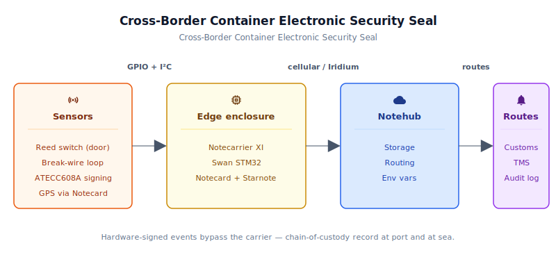
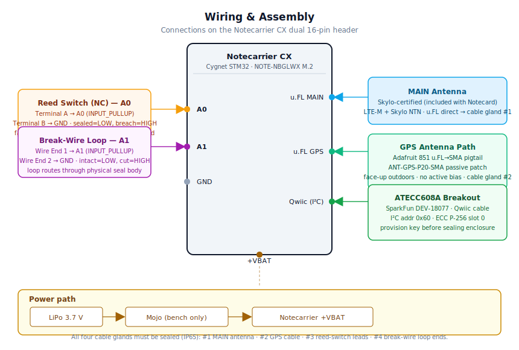

# Cross-Border Container Electronic Security Seal

<Note>

This reference application is intended to provide inspiration and help you get started quickly. It uses specific hardware choices that may not match your own implementation. Focus on the sections most relevant to your use case. If you'd like to discuss your project and whether it's a good fit for Blues, [feel free to reach out](https://blues.com/landing-pages/accelerators-contact-us/?accelerator=Cross-Border%20Container%20Electronic%20Security%20Seal).

</Note>

This project is a tamper-evident electronic security seal for [supply chain tracking](https://blues.com/solutions-supply-chain-tracking/) of international containerized cargo. The device watches the container door and a separate break-wire seal-continuity loop, logs every breach, re-seal, and seal-cut event with a hardware-signed cryptographic record, and reports back to the cloud over cellular in port and Iridium LEO satellite at sea — including the trans-oceanic and polar routes where geostationary networks have no coverage. Every event payload is signed by a hardware secure element whose private key never leaves the device, giving forensic chain-of-custody auditors a record that cannot be forged in transit. The hardware is a Notecarrier XI with a Blues Swan host, a Notecard Cell+WiFi, a Starnote for Iridium, and an ATECC608A secure element on Qwiic I²C (see §4 for the BOM).

## 1. Project Overview

**The problem.** An international container shipment touches dozens of parties: the shipper, the freight forwarder, the inland trucker, the port terminal, the ocean carrier, the customs broker, the destination trucker, and the consignee — and that's a short list. At each handoff, the container's physical integrity changes hands along with the paperwork, but the *proof* of that integrity does not. Seals are broken, reapplied, and sometimes falsified. Disputes over who opened a container, and when, are common and expensive. Regulators and industry standards bodies — CBP, EU customs, C-TPAT, ISO 17712 — are driving increasing audit and compliance pressure, and operators increasingly want electronic, time-stamped records that can demonstrate container integrity across every handoff. Paper logbooks and passive bolt seals cannot produce that record on demand.

An electronic security seal that logs every door event, timestamps it, and transmits it to a cloud audit trail addresses the problem directly. The hard part has always been the network path: containers spend days in ports where WiFi and LTE are unreliable, weeks at sea where they are completely absent, and hours on trucks where they blink in and out of coverage. No single terrestrial network reaches the whole journey.

**Why Notecard.** The [Notecard Cell+WiFi](https://shop.blues.com/products/notecard-cellular?utm_source=dev-blues&utm_medium=web&utm_campaign=store-link) paired with a [Starnote for Iridium](https://shop.blues.com/products/starnote?utm_source=dev-blues&utm_medium=web&utm_campaign=store-link) is specifically designed for this scenario. The Notecard (NOTE-NBGLW) combines LTE-M, NB-IoT, and GPRS global cellular with WiFi and an onboard GPS receiver. When cellular coverage disappears at sea, the Starnote for Iridium extends connectivity over Iridium's 66-satellite LEO constellation, which provides true pole-to-pole coverage with no gaps — the Arctic Northern Sea Route, the trans-Pacific, Asia-Europe, trans-Atlantic, and Antarctic supply chains are all reachable. That's three connection paths (cellular, WiFi, Iridium satellite) the containerized-cargo problem specifically requires, with one firmware API and one carrier board. The Notecard's planetary cellular roaming means no SIM management across jurisdictions; the Iridium fallback means notes queue reliably during any ocean or polar transit and flush once an Iridium session can be established; and the queuing-first architecture means no data is ever lost to a connectivity gap — the Notecard stores events in flash and transmits them when a window opens.

<NewToBlues/>

To be concrete about the two capabilities that make this possible: **planetary cellular roaming** eliminates the per-country SIM and carrier negotiation that makes traditional GSM-based seals impractical for multi-region deployments, and **Iridium LEO satellite fallback** provides the connection path that cellular simply cannot during open-ocean passages and polar voyages. The Starnote for Iridium includes its own Iridium-certified antenna that handles both satellite communication and GPS/GNSS — no separate GPS antenna is required.

**Deployment scenario.** The seal assembly — [Notecarrier XI](https://shop.blues.com/products/notecarrier-xi?utm_source=dev-blues&utm_medium=web&utm_campaign=store-link), [Notecard Cell+WiFi](https://shop.blues.com/products/notecard-cellular?utm_source=dev-blues&utm_medium=web&utm_campaign=store-link), [Starnote for Iridium](https://shop.blues.com/products/starnote?utm_source=dev-blues&utm_medium=web&utm_campaign=store-link), [Blues Swan](https://shop.blues.com/products/swan?utm_source=dev-blues&utm_medium=web&utm_campaign=store-link), ATECC608A, reed switch, break-wire continuity loop, and LiPo battery — is mounted inside a weatherproof IP65 enclosure on the container door. Two antenna leads route through waterproof cable glands to the exterior — one for the cellular antenna and one for the Iridium+GPS combo antenna — and additional cable glands pass the reed-switch wiring and the break-wire loop through the enclosure wall. The reed switch mounts in a standard surface-mount body on the door, with the companion magnet on the door frame. The break-wire is a two-conductor loop routed through the physical seal body (or locking bar hardware) so that cutting or removing the seal breaks the circuit independently of door state. When the door is closed the magnet holds the reed switch closed; when the door opens, the magnet separates and the firmware detects the state change on the next 30-second wake cycle. If the break-wire loop is cut at any time — whether the door is open or closed — the firmware detects that independently and emits a `seal_broken:true` event. Every event is signed by the ATECC608A before transmission. The assembly requires no container modification beyond the mounting points, no carrier infrastructure, and no IT involvement at any terminal along the route.

> **Sky-view requirement.** Both the MAIN (cellular+satellite) and GPS antennas require a clear line of sight to the sky to function. Containers stowed in the lower tiers of a deck stack, loaded below deck on a vessel, or positioned inside a terminal shed may lose GNSS fix and satellite link for the duration of that stowage — potentially hours to days. Events are durably queued in Notecard flash during this period and transmitted in a burst when sky view is restored, but breach-alert latency and waypoint density both depend on actual antenna visibility. Plan for at-sea transmissions to be best-effort rather than guaranteed real-time.

---

## 2. System Architecture



**Device-side responsibilities.** The Blues Swan STM32 host on the Notecarrier XI is the application MCU. It wakes every 30 seconds (configurable via environment variable) and reads two sensors: the door-state reed switch on GPIO A0 and the break-wire seal-continuity loop on GPIO A1. If either sensor has changed state since the last wake, the host signs the event payload using the ATECC608A (a hardware secure element on the shared I²C bus) and builds a `seal_event.qo` [Note](https://dev.blues.io/api-reference/glossary/#note) with `sync:true` and the ECDSA `sig` field; a companion `seal_sig_full.qo` note carrying the full 64-byte signature is also queued for cellular delivery. A seal-wire break fires independently of door state, so a cut-and-replaced seal before door opening produces its own timestamped, signed record. Periodically — every six hours by default — the host signs and builds a `seal_heartbeat.qo` Note with the current door state, seal-wire state, battery voltage, and `sig`; the Notecard's GPS fix populates the location fields automatically via the compact template's `_lat`/`_lon` reserved fields. Audit-gap indicator notes (chain-of-custody gap markers) are unsigned — they carry no verifiable event payload. Between wakes the host is fully powered off via [`card.attn`](https://dev.blues.io/api-reference/notecard-api/card-requests/#card-attn), drawing essentially zero current from the battery rail.

**Notecard responsibilities.** The Notecard Cell+WiFi stores [Notes](https://dev.blues.io/api-reference/glossary/#note) in its on-device flash queue, manages the cellular modem and coordinates with the Starnote for satellite sessions, and flushes Notes to Notehub on the configured [`hub.set`](https://dev.blues.io/api-reference/notecard-api/hub-requests/#hub-set) outbound cadence. Notes flagged `sync:true` (breach events) bypass the outbound timer and trigger an immediate connection attempt. The Notecard autonomously decides whether to use LTE cellular or Iridium satellite via the Starnote based on what's available — the host never touches the modem. The Notecard also manages GPS acquisition on a six-hour periodic schedule and distributes [environment variables](https://dev.blues.io/guides-and-tutorials/notecard-guides/understanding-environment-variables/) from Notehub to the host, allowing threshold and cadence tuning without a firmware reflash. When `outbound_min` or `inbound_min` is changed in Notehub, the firmware re-applies `hub.set` on the next wake cycle after the env-var refresh.

When neither satellite nor cellular is reachable — below-deck stowage, containers buried deep in a stack, or inside terminal sheds — Notes accumulate in the Notecard's on-board flash queue and are durable across power cycles. When sky view returns, the Notecard flushes the accumulated queue in the next successful session. Depending on voyage stowage, this blackout gap can span hours to days; breach-alert latency and waypoint density should be sized with this in mind.

**Notehub responsibilities.** The Notecard manages its own cellular session against the supported carrier networks worldwide via its embedded global SIM and delivers data to [Notehub](https://notehub.io) over the Internet; Notehub ingests events, stores every event with device identity and reception timestamp, and applies project-level routes. The two Notefiles — `seal_event.qo` for door events and `seal_heartbeat.qo` for waypoints — can be fanned out to different downstream endpoints via [Notehub routes](https://dev.blues.io/notehub/notehub-walkthrough/#routing-data-with-notehub), for example to a compliance database for `seal_heartbeat.qo` and an alerting webhook for `seal_event.qo`.

**Routing to the cloud (high level).** Notehub supports HTTP, MQTT, AWS, Azure, GCP, Snowflake, and several other destinations; route setup is project-specific and out of scope for this reference design. See the [Notehub routing docs](https://dev.blues.io/notehub/notehub-walkthrough/#routing-data-with-notehub) for configuration guidance.

---

## 3. Technical Summary

**Before you start:** You'll need a Notehub account (free at [notehub.io](https://notehub.io)), the hardware from §4, Arduino IDE or `arduino-cli`, and two libraries: Blues Wireless Notecard and SparkFun ATECCX08a Arduino Library. Install via Arduino Library Manager or: `arduino-cli lib install "Blues Wireless Notecard" && arduino-cli lib install "SparkFun ATECCX08a Arduino Library"`.

1. **Create a Notehub project** at [notehub.io](https://notehub.io). Copy its ProductUID and paste into `firmware/container_seal/container_seal.ino` at the `PRODUCT_UID` define (line 23).
2. **Provision the ATECC608A** (one-time, before first flash): Flash and run `tools/provision_atecc608a/provision_atecc608a.ino` per [§7](#7-firmware-design); record the public key.
3. **Flash the main firmware**: `arduino-cli compile -b STMicroelectronics:stm32:Blues:pnum=SWAN firmware/container_seal/container_seal.ino` then upload (full command in §7.1).
4. **Power up and check Notehub Events** for a `_session.qo` event within 60 seconds. **Do not seal and deploy until you see this event** — it delivers the Unix epoch required for correct operation (see §6 step 2).
5. **Test the sensors**: hold the reed-switch magnet against the sensor, then pull away. A `seal_event.qo` should appear within 60 seconds with non-zero `sig` if ATECC608A is provisioned. Disconnect the break-wire loop — another `seal_event.qo` with `seal_broken:true` should appear on the next wake (≤30 seconds).

For a complete walkthrough, see [§5 Wiring and Assembly](#5-wiring-and-assembly), [§6 Notehub Setup](#6-notehub-setup), and [§7 Firmware Design](#7-firmware-design).

Here is a sample Note this device emits:

```json
{
  "event": "abc123...",
  "when": 1718789100,
  "best_lat": 1.3521,
  "best_lon": 103.8198,
  "file": "seal_event.qo",
  "body": {
    "open": true,
    "breaches": 3,
    "batt_v": 3.91,
    "event_time": 1718789073,
    "event_lat": 1.3518,
    "event_lon": 103.8198,
    "sig": 3054832791
  }
}
```

## 4. Hardware Requirements

| Part | Qty | Rationale |
|------|-----|-----------|
| [Blues Swan](https://shop.blues.com/products/swan?utm_source=dev-blues&utm_medium=web&utm_campaign=store-link) ([datasheet](https://dev.blues.io/feather-mcus/swan/)) | 1 | Feather-compatible STM32L4 host MCU from Blues. Plugs into the Notecarrier XI's Feather socket. Communicates with the Notecard over I²C. Programmed via the STM32 Arduino core or PlatformIO; no external programmer needed — ST-Link is built into the carrier board. |
| Notecarrier XI | 1 | Carrier board designed for the Notecard + Starnote for Iridium combination. Provides Feather socket for Swan, M.2 slot for the Notecard, mounting for the Starnote, JST-PH LiPo battery connector, Qwiic I²C connector, and ATTN pin wiring for host power-gating during deep sleep. |
| [Notecard Cell+WiFi (NOTE-NBGLW)](https://shop.blues.com/products/notecard-cellular?utm_source=dev-blues&utm_medium=web&utm_campaign=store-link) ([datasheet](https://dev.blues.io/datasheets/notecard-datasheet/note-nbglw/)) | 1 | Global narrowband cellular (LTE-M, NB-IoT, GPRS) plus WiFi and onboard GPS/GNSS in a single M.2 module. Planetary roaming SIM included — no per-country SIM management. Includes a cellular antenna. When the Starnote for Iridium is paired on the same carrier board, the Notecard automatically falls back to Iridium when cellular is unavailable. |
| [Starnote for Iridium](https://shop.blues.com/products/starnote?utm_source=dev-blues&utm_medium=web&utm_campaign=store-link) ([datasheet](https://dev.blues.io/datasheets/starnote-datasheet/starnote-for-iridium/)) | 1 | Adds Iridium LEO satellite connectivity to the Notecard. Provides pole-to-pole coverage — the Arctic Northern Sea Route, trans-Pacific, Asia-Europe, trans-Atlantic, and Antarctic routes are all reachable. Includes a single Iridium-certified u.FL antenna that handles both satellite communication and GPS/GNSS (no separate GPS antenna required). Mounts on the Notecarrier XI alongside the Notecard. **Starnote for Iridium is certified exclusively with the included antenna; substituting a different antenna results in an uncertified device that Iridium may block.** |
| SparkFun Qwiic ATECCX08A Breakout ([DEV-18077](https://www.sparkfun.com/products/18077)) | 1 | ATECC608A hardware secure element on a Qwiic (I²C) breakout. Holds the ECC P-256 private key used to sign every breach and seal-break event; the key is locked in the chip at provisioning and can never be read back. Connect to the Notecarrier XI Qwiic port for shared I²C at address 0x60. Requires the SparkFun_ATECCX08a_Arduino_Library and a one-time key-generation provisioning step before deployment (see [§7.2](#72-modules)). |
| [Blues Mojo](https://shop.blues.com/products/mojo?utm_source=dev-blues&utm_medium=web&utm_campaign=store-link) ([datasheet](https://dev.blues.io/datasheets/mojo-datasheet/)) | 1 | Bench-only power monitor used during commissioning to measure per-session current draw and validate the power budget. Not part of the deployed assembly — see [§9](#9-validation-and-testing). |
| Magnetic contact switch (NC reed switch) — **field deployment:** [Sentrol 2507AH-L](https://cdn11.bigcommerce.com/s-ca10qrhzok/content/documents/sentrol-2500-series-datasheet.pdf) (IP67, −40 °C to +65.5 °C, anodized aluminum, surface-mount, SPDT — use NC contacts); **bench/POC:** [Adafruit 375](https://www.adafruit.com/product/375) | 1 | Two-wire normally-closed door/window sensor; includes companion magnet. Wired NC so a cut wire or missing magnet reads as a breach — intentionally fail-safe. **The Adafruit 375 is a low-cost residential alarm-panel component rated for indoor use only; it is not suitable for the salt-spray, vibration, and wide temperature swings of a container-door deployment.** For field use specify the Sentrol 2507AH-L: it is IP67-sealed, operates to −40 °C, and uses an industrial-grade housing designed for outdoor harsh-environment mounting. |
| Break-wire seal-continuity loop — 24 AWG tinned-copper wire, ~1 m, rated ≥ 105 °C insulation | 1 | Two-conductor loop routed through the physical seal body or locking bar. Both ends terminate inside the enclosure and connect to GPIO A1 (one end) and GND (other end) via INPUT_PULLUP; intact loop = LOW, cut loop = HIGH. The NC fail-safe means a cut wire immediately reads as broken, independent of door state. Substitute a commercial break-wire seal or conductive adhesive trace for higher-security production deployments; for bench testing, a short jumper wire simulates the loop. |
| 3.7 V LiPo battery, ≥ 3000 mAh, JST-PH 2-pin | 1 | Plugs into the Notecarrier XI's battery port. A 3 Ah cell covers roughly 165–170 days at the projected ideal daily rate; for production deployments a 6–8 Ah pack is recommended to maintain a ≥2× safety margin against cold-temperature LiPo derating, self-discharge, and satellite session variability — see the battery-life estimate in [§9](#9-validation-and-testing). |
| IP65 ABS enclosure, ~100 × 70 × 45 mm | 1 | Weather-rated enclosure for door mounting; needs at least four cable gland holes: two for antenna leads (cellular and Iridium+GPS), one for the reed-switch cable, and one for the break-wire loop. |
| Cable glands, PG9 or M16 | 4 | Weatherproof feedthroughs. One each for the cellular antenna lead, the Iridium+GPS antenna cable, reed-switch wiring, and break-wire loop. All four must be sealed to maintain the IP65 rating across the full assembly. |

> **Antenna note.** The Notecarrier XI exposes two antenna ports: one for the Notecard Cell+WiFi's cellular antenna (included with the NOTE-NBGLW) and one for the Starnote for Iridium's Iridium+GPS antenna (included with the Starnote). Both antennas **must be mounted outdoors with a clear sky view** — inside a steel container or enclosure, cellular, satellite, and GPS signals will not penetrate. Route both antenna cables through cable glands before sealing the enclosure. Do not substitute the included Starnote antenna; Iridium certifies the Starnote exclusively with the provided antenna and may block uncertified devices.

---

## 5. Wiring and Assembly



All host I/O lands on the Notecarrier XI headers. The Blues Swan plugs into the Feather socket; the Notecard Cell+WiFi seats in the M.2 slot; the Starnote for Iridium mounts on its dedicated connector; the Mojo (bench only) sits inline between the LiPo cell and the Notecarrier XI's battery JST port.

Pin-by-pin:

- **Blues Swan → Feather socket:** seat the Swan fully into the Notecarrier XI's Feather socket. Power, I²C, and ATTN are all routed through the socket — no additional wiring to the Notecard needed.
- **Notecard Cell+WiFi → M.2 slot:** seat the Notecard fully into the M.2 connector and secure with the retaining screw. No jumper wires needed — cellular, GPS, I²C, and power are all routed through the M.2 interface.
- **Starnote for Iridium → Starnote connector:** mount the Starnote for Iridium on the Notecarrier XI's Starnote connector per the Notecarrier XI assembly guide. The Starnote communicates with the Notecard through the carrier board.
- **Cellular antenna (included with NOTE-NBGLW):** connect to the Notecarrier XI's cellular antenna port. Route the cable through cable gland #1. Mount the antenna outside the enclosure with a clear sky view.
- **Iridium+GPS antenna (included with Starnote for Iridium):** connect the included antenna's u.FL plug to the Starnote's u.FL port. Route the cable through cable gland #2. Mount the antenna outside the enclosure, face-up with an unobstructed sky view. This one antenna handles both Iridium satellite communication and GPS/GNSS. **Do not substitute the included Starnote antenna** — Iridium certifies the Starnote exclusively with the provided antenna.
- **Reed switch — Terminal A → A0:** wire directly. No series resistor needed; the Swan's `INPUT_PULLUP` provides the pull-up to 3.3 V. Route both switch leads into the enclosure through cable gland #3.
- **Reed switch — Terminal B → GND:** any GND pin on the Notecarrier XI headers.
- **Companion magnet:** mounts on the door *frame*; the reed switch body mounts on the *door leaf*. When the door is closed the magnet aligns with the switch and closes the contact (A0 reads LOW = sealed). When the door opens, the magnet separates and the pull-up floats A0 HIGH (= breach detected on next 30-second wake).
- **Break-wire continuity loop — Wire End 1 → A1:** one end of the break-wire loop connects to A1; the Swan's `INPUT_PULLUP` provides the pull-up to 3.3 V. Route both wire ends into the enclosure through cable gland #4. The loop itself routes through the physical seal body (locking bar hole, seal tongue, or adhesive strip) so that cutting or removing the seal opens the circuit. A1 reads LOW when the loop is intact; A1 reads HIGH when the loop is cut or disconnected.
- **Break-wire continuity loop — Wire End 2 → GND:** any GND pin on the Notecarrier XI headers. The pull-up/GND convention matches the reed switch: intentionally fail-safe, so a disconnected or cut wire immediately reads as broken.
- **ATECC608A (SparkFun DEV-18077) → Qwiic port:** connect the ATECC608A breakout's Qwiic cable to the Notecarrier XI's Qwiic connector. Power and I²C (SDA/SCL) are provided by the Qwiic bus. The ATECC608A default I²C address is 0x60. **Provision the ATECC608A before sealing the enclosure** — see [§7.2](#72-modules) for the one-time key-generation procedure. Once provisioned and locked, the private key cannot be extracted from the chip; record the public key in your provisioning database before locking.
- **LiPo battery → JST-PH battery port** on the Notecarrier XI (observe polarity — the Notecarrier silkscreen marks `BAT +` and `BAT -`).
- **Bench only — Mojo:** `BAT` input terminal → LiPo positive lead; `LOAD` output terminal → Notecarrier XI `+VBAT` pin. Also connect the Mojo's Qwiic cable to the Notecarrier XI's Qwiic port. **Note:** the Mojo and ATECC608A both use the Qwiic bus but have different I²C addresses (Mojo: auto-detected by the Notecard; ATECC608A: 0x60 used by the host firmware directly). Both can coexist on the bus. **Mojo has no display or USB serial interface of its own**; energy data is read via the Notecard. The firmware in this project does not consume Mojo telemetry. Disconnect the Mojo before final enclosure assembly.

**Assembly sequence:**

1. Seat the Notecard Cell+WiFi in the M.2 slot. Mount the Starnote for Iridium on its connector per the Notecarrier XI assembly guide. Seat the Blues Swan in the Feather socket.
2. Connect the included cellular antenna to the Notecarrier XI cellular antenna port. Connect the Starnote's included Iridium+GPS antenna u.FL to the Starnote's u.FL port. Seat all u.FL connectors straight down with finger pressure — do not flex or lever them sideways.
3. Attach the ATECC608A breakout's Qwiic cable to the Notecarrier XI Qwiic port.
4. Thread all four cables through their cable glands before tightening: the cellular antenna lead through gland #1, the Iridium+GPS antenna cable through gland #2, the reed-switch leads through gland #3, and the break-wire loop ends through gland #4. It is very difficult to retrofit cables through glands after termination — thread them first, then terminate.
5. Solder or terminate the reed switch leads; connect Terminal A to A0, Terminal B to GND.
6. Terminate the break-wire loop ends; connect Wire End 1 to A1, Wire End 2 to GND. Route the loop through the physical seal body before completing the connection.
7. **Provision the ATECC608A** (see [§7.2](#72-modules)): flash and run `tools/provision_atecc608a/provision_atecc608a.ino` to generate the ECC key pair, lock the chip, and extract the public key for your provisioning database. Do this before enclosure sealing — once the enclosure is sealed and deployed, physical access to reprovision is no longer possible.
8. Connect the LiPo battery (or Mojo for bench testing).
9. Tighten all four cable glands; close and latch the enclosure.

<Warning>

**Safety and deployment note.** The LiPo battery is a lithium cell and may be subject to shipping restrictions (IATA/DOT; confirm with your logistics provider before including it in cargo). Temperature derating is significant: a standard LiPo loses approximately 20–30% of rated capacity at 0 °C and more below that. Container doors on trans-Pacific or northern-route voyages can see sustained temperatures well below freezing; select a cell rated to at least −20 °C and size capacity with a minimum 2× margin above the projected daily draw. Ensure all three cable glands are fully tightened after routing cables — loose glands admit water and can allow cables to be snagged during container handling. Use locking, IP-rated glands for any field deployment. Secure the enclosure to the container door with corrosion-resistant fasteners; adhesive mounting alone is not adequate for multi-month sea voyages subject to vibration and thermal cycling.

</Warning>

Mount the enclosure on the container door latch side, approximately 150 mm from the door edge. Adhere the companion magnet to the door frame at the matching position. Close the door and verify the reed switch reads LOW (sealed) before first boot.

---

## 6. Notehub Setup

1. **Create a project.** Sign up at [notehub.io](https://notehub.io) and [create a project](https://dev.blues.io/quickstart/notecard-quickstart/notecard-and-notecarrier-pi/#set-up-notehub). Copy the [ProductUID](https://dev.blues.io/notehub/notehub-walkthrough/#finding-a-productuid) (e.g. `com.your-company.your-name:container-seal`) and paste it into the `PRODUCT_UID` define in `firmware/container_seal/container_seal.ino`.

2. **Provision in port — required before deployment.** Flash and power the device **before** the container is loaded, while it still has cellular coverage. The Notecard will establish its first session and associate itself with your Notehub project automatically — no manual claim step. The device will appear in your project's **Devices** tab. **Do not seal and ship the device until you have confirmed at least one `_session.qo` event in Notehub.** This initial cellular session is a hard deployment requirement — not an optional step — because the host's heartbeat and env-var scheduling logic depends on a real Unix epoch delivered by Notehub time sync. Before that epoch arrives, schedule-based heartbeats are unreliable (see §7.6 for the technical detail). Attempting first-time sync over satellite is slower, costs more data, and should not be relied on as the provisioning path.

3. **Create a Fleet.** [Fleets](https://dev.blues.io/guides-and-tutorials/fleet-admin-guide/) (and [Smart Fleets](https://dev.blues.io/notehub/notehub-walkthrough/#using-smart-fleet-rules)) group devices for shared configuration. For a container fleet, one fleet per trade lane (e.g., `trans-pacific`, `asia-europe`) lets you set the heartbeat cadence appropriate to each route's typical voyage duration and signal environment.

4. **Set environment variables.** In Notehub, navigate to **Fleet** (from the project dropdown, select or create a Fleet), then click **Environment** to set variables that the device will pull on the next scheduled inbound sync. All values below are optional — firmware defaults are used if not overridden. Note: the device caches env vars and only refreshes on inbound sync; a power cycle alone does not pull fresh values. To force an immediate refresh during commissioning, trigger a manual sync from the Notehub in-browser terminal: `hub.sync`. In Notehub, navigate to **Fleet → Environment** (or **Device → Environment** for single-device overrides). All values are optional — firmware defaults are shown. The device pulls environment variable updates on its next scheduled inbound sync window. By default `inbound_min` is 10080 minutes (7 days), and this cadence applies regardless of whether the Notecard is on cellular or satellite — being in port does not by itself trigger an earlier env-var refresh. To pull changes sooner, either lower `inbound_min` (see table below) or trigger a manual sync from the Notehub in-browser terminal (`hub.sync`).

   | Variable | Default | Purpose |
   |---|---|---|
   | `check_interval_sec` | `30` | Seconds between door-state polls. Lower values catch breaches faster but draw more battery current; values below 5 seconds or above 300 seconds are ignored. |
   | `heartbeat_interval_min` | `360` | Minutes between periodic health notes (`seal_heartbeat.qo`). Each note carries the most recent GPS fix the Notecard has cached — **GPS acquisition cadence is fixed at 6 hours (21 600 seconds) in firmware and is independent of this setting.** Changing `heartbeat_interval_min` changes how often health notes are queued; it does not change how often the Notecard acquires a new GPS fix. Values below 15 or above 1440 are ignored. |
   | `outbound_min` | `720` | Minutes between outbound syncs for queued heartbeats. Breach events bypass this via `sync:true`. Values below 60 or above 1440 are ignored. Changes take effect on the next wake cycle after the env-var refresh — the firmware re-applies `hub.set` automatically when this value changes. |
   | `inbound_min` | `10080` | Minutes between inbound syncs (env-var refresh windows). Default is 7 days. Reduce this if you need to push configuration changes to deployed devices more quickly; note that frequent inbound syncs on a satellite link cost measurably more data. Values below 60 or above 10080 are ignored. The firmware re-applies `hub.set` automatically when this value changes. |

5. **Configure routes.** Add one [route](https://dev.blues.io/notehub/notehub-walkthrough/#routing-data-with-notehub) for `seal_event.qo` (to a compliance database or real-time alert endpoint) and a second for `seal_heartbeat.qo` (to a voyage-tracking or long-term audit store). The two Notefiles are deliberately separate so their destinations, urgency, and retention policies can differ without filter logic in the route.

### What you should see in Notehub

When the device boots and begins operation, Notehub displays events in the **Events** tab as they arrive. Each Notefile (`_session.qo`, `seal_heartbeat.qo`, `seal_event.qo`, `seal_sig_full.qo`) appears as a separate row showing the timestamp, device ID, and event body (JSON). Location fields (`best_lat`, `best_lon`, `when`) are populated by Notehub based on the Notecard's timestamp and GPS cache; compare these against the device-generated fields in the JSON (`event_lat`, `event_lon`, `event_time`) to reconstruct the exact breach moment. The examples below show the structure of each event type you'll see.

Four Notefiles matter for this project:

- **`_session.qo`** — automatic Notecard housekeeping on each cellular or satellite session. Presence confirms the device is reaching Notehub. The `transport` field shows whether the session was cellular or NTN (satellite).
- **`seal_heartbeat.qo`** — created every `heartbeat_interval_min` (default every 6 hours), queued locally on the Notecard, and delivered at the next outbound sync session. At the default `outbound_min=720` (12 hours), up to two heartbeats may batch before being delivered. Sample application body:
  ```json
  {
    "open": false,
    "seal_intact": true,
    "breaches": 0,
    "batt_v": 4.02,
    "heartbeat_time": 1718789000,
    "sig": 2781442053
  }
  ```
  `seal_intact: true` means the break-wire continuity loop is intact at heartbeat time. `open: false` (door sealed; `full:true` forces its inclusion). `heartbeat_time` is the Unix epoch at heartbeat creation — it is the correlation key for the companion `seal_sig_full.qo` note (match `seal_sig_full.qo.event_time` to this field). `sig` is the first 4 bytes of the ATECC608A ECDSA P-256 signature over the 11-byte heartbeat payload; `0` means the ATECC608A was absent. Location and time appear in the **top-level Notehub event metadata** (`best_lat`, `best_lon`, `when`), populated automatically by the Notecard via the compact template's `_lat`/`_lon`/`_time` reserved fields. When no GPS fix is available, `best_lat`/`best_lon` are absent; the note still queues and transmits normally.
- **`seal_event.qo` (door event)** — emitted on every door-state transition; transmitted immediately with `sync:true`. Sample breach body:
  ```json
  {
    "open": true,
    "breaches": 1,
    "batt_v": 3.97,
    "event_time": 1718789073,
    "event_lat": 1.3518,
    "event_lon": 103.8198,
    "sig": 3054832791
  }
  ```
  `event_time` is the Unix epoch at the moment the MCU detected the door transition. `sig` is the first 4 bytes of the ATECC608A ECDSA P-256 signature over the 19-byte canonical payload `{event_time, event_type, seal_broken, door_open, breaches, lroundf(event_lat × 10⁶), lroundf(event_lon × 10⁶)}` (see [§7.4](#74-event-payload-design)); `0` indicates the ATECC608A was absent or not provisioned. The full 64-byte signature is in the companion `seal_sig_full.qo` note (see below), correlated by `event_time`. `event_lat`/`event_lon` are the GPS fix snapshotted at detection time; absent (0.0 in the compact binary) when no fix was cached. Notehub also populates `when`, `best_lat`, and `best_lon` in the top-level event metadata — these reflect the **note-add time**, which can be seconds to hours later than `event_time` for retried notes. **For chain-of-custody reconstruction, always prefer `event_time` and `event_lat`/`event_lon` over `when`/`best_lat`/`best_lon`.** A re-seal event is identical with `open: false`.
- **`seal_event.qo` (seal-wire-break event)** — emitted with `sync:true` when the break-wire continuity loop transitions from intact to broken, independent of door state. Sample body:
  ```json
  {
    "open": false,
    "seal_broken": true,
    "breaches": 0,
    "batt_v": 3.99,
    "event_time": 1718789000,
    "sig": 2198476103
  }
  ```
  `open: false` means the door was still closed when the wire was cut. `seal_broken: true` is the distinguishing field. This event is the critical chain-of-custody record for a cut-and-replaced seal that would be invisible to a door-state-only monitor. Downstream routes must branch on `seal_broken: true` independently of the `open` field.
- **`seal_event.qo` (audit-gap indicator)** — emitted with `sync:true` when the pending ring buffer overflowed and one or more transitions could not be preserved. Carries `audit_gap: true` and, when available, `event_time` for the epoch of the first lost event. Sample:
  ```json
  {
    "audit_gap": true,
    "event_time": 1718791000
  }
  ```
  **Downstream routes must branch on `audit_gap: true`** — this note shares the `seal_event.qo` Notefile with door and seal-break events but is a chain-of-custody gap indicator, not a breach or re-seal. Route consumers that key only on `open: true/false` will silently misinterpret it as a door-close event. Add an explicit `if body.audit_gap` branch in every route transformer or alert rule.
- **`seal_sig_full.qo`** — a free-form JSON companion notefile that carries the full 64-byte ECDSA P-256 signature for each signed `seal_event.qo` and `seal_heartbeat.qo` note. Because it is not compact format it is **not transmitted over the Iridium satellite link**; it queues on the Notecard and is delivered over cellular at the next outbound sync. Downstream systems correlate it to the corresponding event via `event_time` (and `event_type`). For `seal_event.qo` notes, `event_time` in the companion matches `event_time` in the event body. For `seal_heartbeat.qo` notes, `event_time` in the companion matches `heartbeat_time` in the heartbeat body. Sample body for a door-breach companion:
  ```json
  {
    "event_time": 1718789073,
    "event_type": 1,
    "sig_r": "3042a0d3c9f7e8b1...",
    "sig_s": "4af39812c0b6d721..."
  }
  ```
  `event_type` values: `1` = door-open, `2` = door-close, `3` = seal-wire break, `4` = heartbeat. `sig_r` and `sig_s` are 64-character lowercase hex strings encoding the R and S components of the ECDSA P-256 signature. To verify: reconstruct the canonical payload from the matching `seal_event.qo` or `seal_heartbeat.qo` body fields (see [§7.4](#74-event-payload-design)), compute SHA-256, and verify `(sig_r ‖ sig_s)` against the device's recorded public key. **No `seal_sig_full.qo` companion note is created when the ATECC608A was unavailable at detection time** — `sig == 0` in the main event Note is the only indicator in that case. The companion note uses the same retry policy as primary event Notes (up to three `note.add` attempts); if all retries fail the companion is silently lost. Route consumers should alert if a `seal_event.qo` or `seal_heartbeat.qo` note with non-zero `sig` has no matching `seal_sig_full.qo` entry after the device returns to cellular coverage.

---

## 7. Firmware Design

Five source files:
- [`firmware/container_seal/container_seal.ino`](firmware/container_seal/container_seal.ino) — main sketch: state management, sleep/wake cycle, GPIO reads, signing calls, scheduling logic.
- [`firmware/container_seal/container_seal_notecard.h`](firmware/container_seal/container_seal_notecard.h) — Notecard helper declarations.
- [`firmware/container_seal/container_seal_notecard.cpp`](firmware/container_seal/container_seal_notecard.cpp) — all Notecard API calls.
- [`firmware/container_seal/container_seal_sign.h`](firmware/container_seal/container_seal_sign.h) — ATECC608A signing declarations, provisioning guide, verification specification.
- [`firmware/container_seal/container_seal_sign.cpp`](firmware/container_seal/container_seal_sign.cpp) — ATECC608A ECDSA signing implementation.

### 7.1 Installing and flashing

**Dependencies:**

- **Arduino core for STM32** — [`stm32duino/Arduino_Core_STM32`](https://github.com/stm32duino/Arduino_Core_STM32). Install via the Arduino Boards Manager (search "STM32 MCU based boards") or by adding the index URL `https://github.com/stm32duino/BoardManagerFiles/raw/main/package_stmicroelectronics_index.json` under **File → Preferences → Additional Boards Manager URLs**. Select **Blues Swan** as the target board (canonical FQBN: `STMicroelectronics:stm32:Blues:pnum=SWAN`).
- **`Blues Wireless Notecard`** library (`note-arduino`) — install via the Arduino Library Manager or `arduino-cli lib install "Blues Wireless Notecard"`. See [note-arduino releases](https://github.com/blues/note-arduino/releases) for the release history.
- **`SparkFun_ATECCX08a_Arduino_Library`** — install via the Arduino Library Manager (search "SparkFun ATECCX08a") or `arduino-cli lib install "SparkFun ATECCX08a Arduino Library"`. Provides the ATECC608A driver used by `container_seal_sign.cpp` and the provisioning sketch, including the on-chip SHA-256 helper used to hash the canonical event payload before signing.

**Flashing — Arduino IDE:** open `firmware/container_seal/container_seal.ino`, select the Swan board, hit **Upload**. The Notecarrier XI exposes ST-Link over the same USB cable — no external programmer needed.

**Flashing — `arduino-cli`:** from the repo root,

```bash
# Find the correct FQBN for your installed core version
arduino-cli board listall | grep -i swan

# Compile and upload (replace FQBN and port with your values)
arduino-cli compile -b STMicroelectronics:stm32:Blues:pnum=SWAN firmware/container_seal/container_seal.ino
arduino-cli upload  -b STMicroelectronics:stm32:Blues:pnum=SWAN \
                    -p /dev/cu.usbmodem* firmware/container_seal/container_seal.ino
```

After flashing, open the serial monitor at **115200 baud**. On first boot you will see configuration messages; on subsequent wakes you will see the `[seal]` lines for door checks, heartbeats, and env-var refreshes.

### 7.2 Modules

| Responsibility | Where |
|---|---|
| Notecard hub.set, battery mode, motion config | `sealConfigureNotecard` |
| Compact Note.template registration | `sealDefineTemplates` |
| GPS periodic-mode configuration | `sealConfigureGPS` |
| Environment-variable fetch and clamping | `sealFetchEnvVars` |
| Atomic hub.set when outbound or inbound cadence changes | `sealApplyCadence` |
| Door breach / re-seal / seal-wire-break event Note | `sealSendDoorEvent` |
| Periodic waypoint / health Note | `sealSendHeartbeat` |
| Epoch retrieval with millis() fallback | `sealGetEpoch` |
| GPS fix snapshot at detection time | `sealGetLocation` |
| Battery voltage read | `sealGetBattVoltage` |
| ATECC608A initialisation | `sealSignBegin` |
| ECDSA P-256 event signing (4-byte truncated sig for compact field) | `sealSignEvent` |
| State persistence across sleep cycles | `SealState` + `NotePayloadSaveAndSleep` / `NotePayloadRetrieveAfterSleep` |

**ATECC608A provisioning (one-time per device before deployment):**

The ATECC608A requires a one-time provisioning step to generate and lock the ECC P-256 key pair. This must be done before the enclosure is sealed. A dedicated provisioning sketch is provided at [`tools/provision_atecc608a/provision_atecc608a.ino`](tools/provision_atecc608a/provision_atecc608a.ino).

Flash and run the provisioning sketch on the Swan **before** flashing the main `container_seal.ino` firmware. The sketch walks through the six steps interactively over the serial monitor (115200 baud), pausing before each irreversible operation and requiring you to type `YES` to confirm:

1. Verify the chip responds at 0x60.
2. Write the SparkFun default configuration that sets slot 0 as an ECC key pair slot.
3. **Permanently lock the configuration zone** (irreversible — prompted).
4. Generate the P-256 private key in slot 0; the key is locked inside the chip and can never be read back.
5. Print the 64-byte uncompressed public key in hex to the serial monitor. **Copy this key and record it alongside the device serial number in your provisioning database before continuing** — it is required for downstream signature verification and cannot be retrieved after step 6. The sketch also recommends storing it as a Notehub device environment variable `pub_key_hex`.
6. **Permanently lock the data zone** (irreversible — prompted after key confirmation).

After provisioning, flash the main `container_seal.ino` firmware. `sealSignBegin()` in the firmware calls `begin()` on each wake and `sealSignEvent()` calls `createSignature()` to produce the per-event ECDSA signature.

### 7.3 Sensor reading strategy

Two sensors are read on every 30-second wake:

**Door-state reed switch (A0, `INPUT_PULLUP`):** The pin reads LOW when the magnet is adjacent (door sealed) and HIGH when the magnet separates (door open). The result is compared to `g_state.lastDoorOpen`; if they differ, a `seal_event.qo` note with `seal_broken: false` is emitted. A note fires on *both* the open and re-seal transitions, giving a complete timestamped audit trail for every door cycle.

**Seal-wire continuity loop (A1, `INPUT_PULLUP`):** The break-wire loop threads through the physical seal body. When the loop is intact the pin reads LOW (path to GND through the wire); when the loop is cut or disconnected the pin floats HIGH. The result is compared to `g_state.lastSealIntact`; if the wire transitioned from intact to broken, a `seal_event.qo` note with `seal_broken: true` is emitted *independently of door state*. This is the key event that a door-state-only monitor cannot produce: a cut-and-replaced seal before door opening generates a `seal_broken: true` event with `open: false`, creating a signed chain-of-custody record even when the container doors never opened.

Both sensors are checked on every wake; both can fire in the same wake cycle if both states changed simultaneously. The seal-wire check runs first, before the door-state check. No hardware debounce is needed beyond the 30-second sleep cadence — a brief flutter lasts far less than 30 seconds and appears as a single transition across wake boundaries.

### 7.4 Event payload design

Both Notefiles use `format: compact` templates with `port` numbers assigned (1 and 2 respectively). Compact format is **required** for satellite transmission (Iridium SBD via Starnote), and it reduces the on-wire payload versus free-form JSON by roughly 3–5×, which matters on a satellite link billing by the byte.

The `_lat`, `_lon`, and `_time` fields in the template body are compact reserved keywords — the Notecard automatically injects the latest GPS fix and RTC timestamp into each Note without the host needing to request or transmit location data explicitly. If no GPS fix is available (device is inside a fully shielded space), those fields are omitted from the transmitted Note due to the Notecard's standard `omitempty` behavior; the note is still transmitted and queued normally.

`seal_event.qo` body fields and their semantics:

**`seal_event.qo` body fields:**

| Field | Type | Description |
|---|---|---|
| `open` | bool | `true` = door open (breach); `false` = door closed (re-seal) or seal-wire break with door still closed. Always present (`full:true`). |
| `breaches` | uint32 | Cumulative door-open breach count. Incremented at detection time, before the send attempt, so it is accurate in heartbeats and re-seal events even if this note's delivery fails. Seal-wire breaks do not increment this counter. |
| `batt_v` | float16 | Battery voltage in V at detection time; `-1.0` when `card.voltage` failed transiently. |
| `event_time` | int32 | Unix epoch at **detection** time. Differs from Notehub's `when` field (note-add time) when the note was retried from the pending ring buffer. **Prefer for chain-of-custody timeline reconstruction.** |
| `event_lat` | float32 | GPS latitude snapshotted at detection time. Absent/0.0 when no fix was available. Prefer over `best_lat` for retried notes. |
| `event_lon` | float32 | GPS longitude snapshotted at detection time. Absent/0.0 when no fix was available. |
| `seal_broken` | bool | Present and `true` only in seal-wire-break events. Absent/false in all door-open and door-close events. A `seal_broken:true, open:false` combination means the wire was cut while the door was closed. |
| `sig` | uint32 | First 4 bytes of the ATECC608A ECDSA P-256 signature over the 19-byte canonical payload: `event_time` (BE uint32) ‖ `event_type` byte (1=door-open, 2=door-close, 3=wire-break) ‖ `seal_broken` byte ‖ `door_open` byte (0x01=open, 0x00=closed) ‖ `breaches` (BE uint32) ‖ `lroundf(event_lat × 10⁶)` as BE int32, or 0x00000000 if absent ‖ `lroundf(event_lon × 10⁶)` as BE int32, or 0x00000000 if absent. `0` = ATECC608A absent or not provisioned. Downstream routes should alert on `sig == 0` for provisioned devices. Full 64-byte signature in the companion `seal_sig_full.qo` note (correlated by `event_time`). |
| `audit_gap` | bool | Present and `true` only in audit-gap indicator notes. All other body fields are absent in these notes. Audit-gap notes are not signed. |

**`seal_heartbeat.qo` body fields:**

| Field | Type | Description |
|---|---|---|
| `open` | bool | Current door state at heartbeat creation time. |
| `seal_intact` | bool | `true` = seal-wire continuity loop is intact; `false` = wire is already broken. A persistent `false` without a corresponding `seal_broken:true` event in `seal_event.qo` may indicate the wire was cut before this firmware was deployed. |
| `breaches` | uint32 | Cumulative door-open breach count at heartbeat time. |
| `batt_v` | float16 | Battery voltage in V at heartbeat time. |
| `heartbeat_time` | int32 | Unix epoch at heartbeat creation time. This is the correlation key for the companion `seal_sig_full.qo` note — match `seal_sig_full.qo.event_time` to this field to find the full signature. |
| `sig` | uint32 | First 4 bytes of the ATECC608A ECDSA P-256 signature over the 11-byte heartbeat canonical payload: `heartbeat_time` (BE uint32) ‖ `0x04` (event type HEARTBEAT) ‖ `open` byte ‖ `seal_intact` byte ‖ `breaches` (BE uint32). Full 64-byte signature in the companion `seal_sig_full.qo` note (correlated via `heartbeat_time`). |

The Notecard also auto-populates `_time`, `_lat`, `_lon` from the compact template; these appear in Notehub as the top-level `when`, `best_lat`, `best_lon` fields and reflect the **note-add time**, not the detection time. For notes delivered immediately the gap is negligible; for retried notes the gap can be minutes to hours. Always prefer the body's `event_time`/`event_lat`/`event_lon` for breach chain-of-custody reconstruction.

Sample breach event as it appears in Notehub (`when`/`best_lat`/`best_lon` = note-add time metadata; `event_time`/`event_lat`/`event_lon` and `sig` = detection-time snapshots in the body):

```json
{
  "event": "abc123...",
  "when": 1718789100,
  "best_lat": 1.3521,
  "best_lon": 103.8198,
  "file": "seal_event.qo",
  "body": {
    "open": true,
    "breaches": 3,
    "batt_v": 3.91,
    "event_time": 1718789073,
    "event_lat": 1.3518,
    "event_lon": 103.8198,
    "sig": 3054832791
  }
}
```

In this example `when` (1718789100) is 27 seconds later than `event_time` (1718789073) — the gap reflects the time between door detection and the Notecard's `note.add` call. For pending-queue retries the gap can be minutes to hours.

**To verify the signature:** retrieve the `seal_sig_full.qo` note whose `event_time` matches this event's `event_time`. Reconstruct the 19-byte canonical payload: `[event_time as BE uint32][event_type byte: 1=door-open, 2=door-close, 3=wire-break][seal_broken byte][door_open byte: 0x01 if open, 0x00 if closed][breaches as BE uint32][lroundf(event_lat × 10⁶) as BE int32, or 0x00000000 if absent][lroundf(event_lon × 10⁶) as BE int32, or 0x00000000 if absent]`. Compute SHA-256 of those 19 bytes. Verify the ECDSA P-256 signature (`sig_r ‖ sig_s`, 64 bytes from `seal_sig_full.qo`) against the digest using the device's recorded public key. The compact `sig` field carries only the first 4 bytes of the R-component and is a satellite-efficient tamper prefix — it is **not sufficient for ECDSA verification**. Use the full 64-byte signature from `seal_sig_full.qo` for forensic chain-of-custody.

### 7.5 Low-power strategy

Battery life is the central design constraint for a three-month ocean crossing. Two mechanisms combine to achieve it:

**Host sleep via `card.attn`.** After each work cycle the host calls `NotePayloadSaveAndSleep`, which serialises the `SealState` struct into Notecard flash and issues a `card.attn` request that gates the Notecarrier XI's host power rail off for `checkIntervalSec` seconds. The Swan draws essentially zero current during sleep. On the next ATTN pulse the host powers up cold, re-enters `setup()`, and `NotePayloadRetrieveAfterSleep` rehydrates the state struct from Notecard flash — the firmware never calls `loop()`.

**Notecard idle between syncs.** The Notecard Cell+WiFi sits in its own deep-idle state (~18 µA @ 5 V) between scheduled outbound sync windows. The radio (cellular or Iridium satellite via Starnote) is powered only when a sync is required (default `outbound_min` 720 minutes) or when a `sync:true` event fires. GPS acquisition is motion-gated and runs every 6 hours — see the note below on the accelerometer. The cellular and satellite radios do not run simultaneously except during the brief handoff window where the Notecard is deciding which link to use; this decision is autonomous and transparent to the host firmware.

**GPS acquisition and accelerometer.** The Notecard is configured with `card.location.mode periodic`, which only attempts a GPS acquisition when the Notecard's onboard accelerometer has detected motion. This motion gate is intentional: a stationary container at anchor or on a quay does not need a GPS re-acquisition because its position is not changing. Ship and road vibration during transit is sufficient to satisfy the motion threshold and trigger the periodic 6-hour fix. **The Notecard's onboard accelerometer is deliberately left active** — the firmware does not call `card.motion.mode stop:true` — because disabling the accelerometer would prevent periodic GPS from acquiring a position fix. The accelerometer's idle current draw is negligible in the overall power budget (~<1 µA).

**Heartbeat vs. breach cadence.** Heartbeats (`seal_heartbeat.qo`) ride the configured outbound cadence — they queue on the Notecard and flush at the `outbound_min` interval (default 720 minutes). Each heartbeat carries the most recent GPS fix the Notecard has cached; GPS acquisition itself runs on a **fixed 6-hour (21 600 seconds) periodic schedule** set at first boot via `card.location.mode` and is independent of `heartbeat_interval_min`. Changing `heartbeat_interval_min` changes how often health notes are queued; it does not change how often the Notecard acquires a new GPS fix. Breach events (`seal_event.qo`) use `sync:true`, which wakes the modem immediately; over the course of a normal voyage (no breaches) this costs nothing extra. If a breach occurs in international waters, the Notecard will attempt satellite acquisition via the Starnote for Iridium; because Iridium is a LEO constellation with pole-to-pole coverage, session establishment depends on sky visibility (not orbital geometry) and typically takes a few minutes with a clear sky view.

### 7.6 Retry and error handling

- `sealConfigureNotecard` uses `sendRequestWithRetry(req, 5)` for the first I²C transaction on every boot, guarding against the cold-boot race condition where the Swan comes up before the Notecard's I²C bus is ready.
- All three first-boot configuration helpers (`sealConfigureNotecard`, `sealDefineTemplates`, `sealConfigureGPS`) return a `bool` indicating whether the Notecard accepted the request. `g_state.initialized` is set to `1` only after all three succeed — a transient I²C failure on the first wake leaves `initialized` at `0` so the device retries full configuration on the next wake instead of permanently skipping it.
- `sealFetchEnvVars` uses range clamping (`clampU32`) on all values — an out-of-range env var silently preserves the firmware default rather than crashing or silently accepting a nonsensical value. The function returns a `SealEnvResult` enum (`SEAL_ENV_OK`, `SEAL_ENV_NO_CHANGE`, `SEAL_ENV_FAIL`) so the caller can log success, silence, and error conditions distinctly.
- `sealGetEpoch` falls back to `millis()/1000` if the Notecard has not yet received a time sync. **Important limitation:** because `NotePayloadSaveAndSleep` fully power-gates the host, `millis()` resets to zero on every wake cycle. Before the first successful Notehub session, `sealGetEpoch` returns a small value (~1–2 seconds per wake) each time the host boots. This means `nextHeartbeatEpoch` — set to roughly 21 600 on first boot — is never reached across power-gated wakes: heartbeat scheduling is effectively dormant until the first real epoch arrives from a cellular session. Once that epoch lands (e.g., `1718640000`), it trivially exceeds the stored fallback value and a heartbeat fires immediately; the schedule then resets correctly from real time. The practical implication is that **schedule-based heartbeats are unreliable before the device has completed at least one successful Notehub session**, which is why first-boot provisioning in port (§6 step 2) is a hard requirement for correct operation, not merely a recommendation.
- `sealSendDoorEvent`, `sealSendHeartbeat`, and `sealSendAuditGap` each make up to three `note.add` attempts (one initial try plus two retries at 25 milliseconds apart). A non-empty `err` field in the Notecard's response — most commonly a compact-template field-type mismatch — is logged and treated as a permanent failure (`NOTE_ADD_PERMANENT`); a `NULL` response (I²C bus fault) is treated as transient (`NOTE_ADD_TRANSIENT`). On the first permanent rejection, all three functions call `sealDefineTemplates()` to re-register both compact templates and retry once; this recovers from a Notecard reset or firmware-update template mismatch without operator intervention. If template recovery also fails, the function returns `NOTE_ADD_PERMANENT` immediately.
  - **`totalBreaches` is incremented at detection time, immediately when a door-open transition is detected, _before_ any `note.add` attempt is made.** This ensures it is the true lifetime count regardless of whether the per-event Note ever reaches Notehub: heartbeats and re-seal notes always carry an accurate running total even after queue overflows or permanent note.add rejections. Seal-wire-break events do not increment `totalBreaches`; they are distinguished by `seal_broken: true`.
  - `lastDoorOpen` and `lastSealIntact` are committed only after each transition has a durable record: `NOTE_ADD_OK` (Notecard accepted), a successful local enqueue in MCU RAM (`NOTE_ADD_TRANSIENT` with queue space available), an unavoidable queue-full discard, or a `NOTE_ADD_PERMANENT` discard after template recovery. They are never advanced before the outcome is known, so a power loss between event detection and the end-of-cycle `NotePayloadSaveAndSleep` call cannot silently hide a real transition.
  - **Pending ring buffer.** If `sealSendDoorEvent` returns `NOTE_ADD_TRANSIENT` after all retries, the event (door state, seal-broken flag, proposed breach count, detection epoch, battery voltage, GPS fix, and 4-byte `sig`) is stored in a 4-entry FIFO ring buffer (`pendingQueue`) inside `SealState`. On every subsequent wake, the oldest pending entry is retried first via `sealSendDoorEvent` before any new sensor detection or heartbeat logic runs. A `NOTE_ADD_PERMANENT` from the retry path discards that entry so a single un-sendable event cannot block all later events indefinitely. Up to four transitions (door opens, re-seals, and wire breaks combined) can accumulate locally while the Notecard path is unhealthy. **Durability note: `pendingQueue` lives in MCU RAM and is only persisted to Notecard flash when `NotePayloadSaveAndSleep()` runs at the end of the wake cycle. A power loss between event detection and that end-of-cycle save loses events that were enqueued in RAM but not yet written to flash. Events that received `NOTE_ADD_OK` before that point are already in Notecard flash and survive any power loss.**
  - **Queue overflow and audit gap.** When the ring buffer is full and a new door event arrives (transient failure), or when any event is irrecoverably discarded (`NOTE_ADD_PERMANENT`), the firmware sets `overflowOccurred` and records the epoch of the first loss in `overflowEpoch`. On every subsequent wake where `pendingCount == 0` and `overflowOccurred` is set, `sealSendAuditGap()` emits an `audit_gap: true` note to `seal_event.qo` with `sync:true`. `overflowOccurred` is cleared only after the gap note is accepted by the Notecard, so a transient failure on the audit-gap send retries automatically on the next wake rather than being silently lost.
  - `sealSendHeartbeat` returns a `NoteAddResult` enum with three distinct outcomes. `NOTE_ADD_OK`: heartbeat was accepted; `nextHeartbeatEpoch` is advanced by `heartbeat_interval_min` and `heartbeatPermFault` is cleared. `NOTE_ADD_TRANSIENT` (I²C / NULL response after all retries): `nextHeartbeatEpoch` is left unchanged — the heartbeat will be attempted again on the next 30-second wake. `NOTE_ADD_PERMANENT` (Notecard rejected the note, template recovery already attempted): `heartbeatPermFault` is set to 1 and `nextHeartbeatEpoch` is advanced by a full interval, deferring the next attempt to the next scheduled heartbeat window. On that next scheduled wake, the firmware attempts `sealDefineTemplates()` before sending; if template re-registration succeeds, `heartbeatPermFault` is cleared and the heartbeat proceeds normally; if it fails again, the attempt is deferred by another full interval. This ensures a single un-sendable heartbeat does not cause the device to hammer the Notecard on every 30-second wake.
- `sealApplyCadence` sends both `outbound` and `inbound` in a **single** `hub.set` call and returns `bool`. Combining both fields in one request makes the cadence update atomic — the Notecard never momentarily sees a mismatched pair. On failure the caller reverts both `outboundMin` and `inboundMin` in `g_state.cfg` so the next env-var comparison re-detects the change and retries the `hub.set` automatically.
- `sealFetchEnvVars` checks the Notecard response for an `err` field before processing the body — a non-empty `err` is treated the same as a `NULL` response and returns `SEAL_ENV_FAIL` so the caller knows env state is uncertain rather than silently treating it as no-change.
- `sealGetBattVoltage` returns `-1.0f` on a `card.voltage` failure. A healthy LiPo always reads above 3.0 V, so `-1.0` is an unambiguous sentinel. Downstream Notehub route logic and alerting rules should treat `batt_v < 0` as a transient reading fault rather than a critically discharged pack.
- Breach events use `full:true` in addition to `sync:true` so that the `open: false` field is explicitly present in re-seal events and not dropped by `omitempty`. Downstream processors can therefore distinguish "sealed" from "missing field / sensor error" without ambiguity.

### 7.7 Key code snippet 1: compact template registration

Templates use `format: compact` for satellite efficiency and include `_lat`, `_lon`, `_time` as compact reserved fields — the Notecard populates them automatically.

```cpp
J *req = nc.newRequest("note.template");
JAddStringToObject(req, "file", "seal_event.qo");
JAddNumberToObject(req, "port", 1);           // required for NTN / satellite
JAddStringToObject(req, "format", "compact");
J *body = JAddObjectToObject(req, "body");
JAddBoolToObject(body,   "open",        true);  // TBOOL (1 byte)
JAddNumberToObject(body, "breaches",    24);    // TUINT32 (4 bytes) — 32-bit for lifetime reuse
JAddNumberToObject(body, "batt_v",      12.1);  // TFLOAT16 (2 bytes)
JAddNumberToObject(body, "event_time",  14);    // TINT32 (4 bytes) — Unix epoch at detection time
JAddNumberToObject(body, "event_lat",   14.1);  // TFLOAT32 (4 bytes) — GPS lat at detection time
JAddNumberToObject(body, "event_lon",   14.1);  // TFLOAT32 (4 bytes) — GPS lon at detection time
JAddBoolToObject(body,   "seal_broken", true);  // TBOOL (1 byte) — seal-wire-break events only
JAddNumberToObject(body, "sig",         24);    // TUINT32 (4 bytes) — 4-byte ECDSA sig prefix (tamper indicator only); full 64-byte sig in seal_sig_full.qo
JAddBoolToObject(body,   "audit_gap",   true);  // TBOOL (1 byte) — custody-gap indicator only (unsigned)
JAddNumberToObject(body, "_lat",        14.1);  // auto-populated from GPS at note.add time
JAddNumberToObject(body, "_lon",        14.1);  // auto-populated from GPS at note.add time
JAddNumberToObject(body, "_time",       14);    // auto-populated from RTC at note.add time
nc.sendRequest(req);
```

`event_time`/`event_lat`/`event_lon` carry the detection-time snapshot so retried notes preserve the original breach moment. `seal_broken` is absent from all normal door events and set only in wire-break events. `sig` is always present; `0` signals that the ATECC608A was unavailable and no companion `seal_sig_full.qo` note was created. `audit_gap` is unsigned — it is a chain-of-custody gap marker, not a verifiable event. The auto-populated `_time`/`_lat`/`_lon` reflect the `note.add` call time and appear in Notehub as `when`/`best_lat`/`best_lon`.

### 7.8 Key code snippet 2: immediate-sync breach alert

`sync:true` requests an immediate connection attempt. `full:true` prevents `omitempty` from dropping the `open: false` field on re-seal events. `totalBreaches` is incremented **before** the send attempt so the lifetime count is durable in `g_state` regardless of note delivery outcome. `lastDoorOpen` is committed only after the transition has a durable record — never before the outcome of `sealSendDoorEvent` is known. Events enqueued into `pendingQueue` are held in MCU RAM and are persisted to Notecard flash only when `NotePayloadSaveAndSleep()` runs at the end of the wake cycle.

```cpp
// Breach count incremented at detection time — before the send attempt.
// This ensures totalBreaches is accurate in all subsequent notes
// (heartbeats, re-seal events) even if this note's delivery fails.
if (doorOpen) {
    g_state.totalBreaches++;
}
uint32_t proposedBreaches = g_state.totalBreaches;

// Sign the event.  Canonical payload (19 bytes): event_time, event_type,
// seal_broken, door_open, breaches, and detection-time lat/lon in
// fixed-point (lroundf(degrees × 10^6)).
// Full 64-byte signature captured in sigFull for seal_sig_full.qo companion.
uint8_t  evType  = doorOpen ? SEAL_EVENT_DOOR_OPEN : SEAL_EVENT_DOOR_CLOSE;
uint8_t  sigFull[64] = {0};
uint32_t sig = sealSignEvent(eventEpoch, evType,
                             /*sealBroken=*/false, doorOpen,
                             proposedBreaches,
                             hasLoc, eventLat, eventLon, sigFull);

NoteAddResult res = sealSendDoorEvent(notecard, doorOpen,
                                      proposedBreaches, battV, eventEpoch,
                                      eventLat, eventLon, hasLoc,
                                      /*sealBroken=*/false, sig, sigFull);
if (res == NOTE_ADD_OK) {
    // Accepted: commit door state only.  totalBreaches was already
    // incremented above and does not need to be re-applied.
    g_state.lastDoorOpen = newDoorOpen;

} else if (res == NOTE_ADD_TRANSIENT) {
    if (g_state.pendingCount < PENDING_QUEUE_SIZE) {
        // Enqueue in MCU RAM for retry.  Persisted to Notecard flash
        // when NotePayloadSaveAndSleep() runs at end of wake cycle.
        uint8_t slot = g_state.pendingTail;
        // ... populate slot fields ...
        g_state.pendingTail  = (g_state.pendingTail + 1) % PENDING_QUEUE_SIZE;
        g_state.pendingCount++;
        g_state.lastDoorOpen = newDoorOpen;
    } else {
        // Queue full — event lost; flag audit gap and advance door state.
        if (!g_state.overflowOccurred) {
            g_state.overflowOccurred = 1;
            g_state.overflowEpoch    = eventEpoch;
        }
        g_state.lastDoorOpen = newDoorOpen;
    }

} else {  // NOTE_ADD_PERMANENT
    // Template recovery already attempted inside sealSendDoorEvent.
    // Flag audit gap; advance door state to prevent infinite re-detection.
    if (!g_state.overflowOccurred) {
        g_state.overflowOccurred = 1;
        g_state.overflowEpoch    = eventEpoch;
    }
    g_state.lastDoorOpen = newDoorOpen;
}

// Inside sealSendDoorEvent (container_seal_notecard.cpp):
J *req = nc.newRequest("note.add");
JAddStringToObject(req, "file", "seal_event.qo");
JAddBoolToObject(req,   "sync", true);               // bypass outbound cadence
JAddBoolToObject(req,   "full", true);               // preserve false/zero fields
J *body = JAddObjectToObject(req, "body");
JAddBoolToObject(body,   "open",       doorOpen);
JAddNumberToObject(body, "breaches",   (double)totalBreaches);
JAddNumberToObject(body, "batt_v",     battV);
JAddNumberToObject(body, "event_time", (double)eventEpoch);  // detection time
JAddNumberToObject(body, "sig",        (double)sig);         // ATECC608A sig prefix
// seal_broken omitted for normal door events (false is the compact default)
// _lat, _lon, _time auto-populated by Notecard from GPS + RTC
```

### 7.9 Key code snippet 3: NotePayloadSaveAndSleep

The entire application state survives host power-off in Notecard flash. One call does all of it.

```cpp
NotePayloadDesc outPayload = {0, 0, 0};
NotePayloadAddSegment(&outPayload, kStateSegID, &g_state, sizeof(g_state));
NotePayloadSaveAndSleep(&outPayload, g_state.cfg.checkIntervalSec, NULL);
// If we reach here, ATTN is not gating host power (bench / hardware fault).
// Loop indefinitely at the configured cadence so the device does not
// spin-burn the battery in a hot loop() — average current stays comparable
// to a normal sleep cycle until the hardware is fixed or reflashed.
for (;;) {
    delay(g_state.cfg.checkIntervalSec * 1000UL);
}
```

---

## 8. Data Flow


**Collected.** Every 30 seconds: door-state reed switch (A0, one `digitalRead`) and seal-wire continuity loop (A1, one `digitalRead`). Every 6 hours: GPS fix (handled autonomously by the Notecard). On state change and on heartbeat schedule: battery voltage via `card.voltage`.

**Transmitted.**
- `seal_event.qo` (door event) — emitted immediately on any door-state transition (open *or* re-seal). Transmitted with `sync:true`. Body contains `open`, `breaches`, `batt_v`, `event_time`, `sig`, and `event_lat`/`event_lon` when a GPS fix was cached at detection time.
- `seal_event.qo` (seal-wire-break event) — emitted immediately when the break-wire continuity loop transitions from intact to broken, regardless of door state. Transmitted with `sync:true`. Body contains `seal_broken: true`, current door state, `batt_v`, `event_time`, and `sig`. This event fires independently of `seal_event.qo` door events — a cut-and-replaced seal before door opening produces a standalone `seal_broken:true` record.
- `seal_event.qo` (audit-gap indicator) — emitted with `sync:true` when the pending ring buffer overflowed and one or more transitions were irrecoverably lost. Contains `audit_gap: true`. Downstream routes **must** branch on `audit_gap: true` to distinguish it from door or seal-break events.
- `seal_heartbeat.qo` — emitted every `heartbeat_interval_min` (default 6 hours, 4 notes/day). No `sync:true`; heartbeats batch and transmit at the configured outbound cadence (`outbound_min`, default 720 minutes). Body contains `open`, `seal_intact`, `breaches`, and `batt_v`.

**Routed.** Both Notefiles land in Notehub. From there, routes forward them to whatever downstream system the operator configures — a compliance audit database, a supply-chain visibility platform, an alerting webhook. Splitting the two Notefiles at the source allows different SLAs, retention periods, and downstream destinations without any filter logic in the route itself.

**Alerts / actions.** Route consumers must handle three distinct types of `seal_event.qo` note: `open: true` (door breach), `open: false / seal_broken: false` (re-seal), and `seal_broken: true` (seal-wire cut). `audit_gap: true` is a fourth type (chain-of-custody gap) and must **not** be treated as a door or seal-break event — route consumers that branch only on `open: true/false` will silently misinterpret it. Add explicit `if body.audit_gap` and `if body.seal_broken` branches in every route transformer and alert rule. The `sig` field should also be validated: a `sig` value of `0` on a provisioned device indicates the ATECC608A was unavailable, which is itself an alert condition. The `batt_v` field doubles as a low-battery signal — below ~3.2 V on a LiPo indicates the battery needs replacement; **-1.0** means the `card.voltage` call failed transiently and should not be treated as a dead pack.

---

## 9. Validation and Testing

**Expected cadence after deployment.** On a healthy, sealed container: one `seal_heartbeat.qo` created every 6 hours (queued locally), delivered in a batch at each 12-hour outbound sync session; zero `seal_event.qo` events; and `_session.qo` events at the outbound sync interval (cellular or satellite). The first `seal_heartbeat.qo` is created within 6 hours of first power-on but is not visible in Notehub until the next outbound sync — up to 12 hours after power-on at the default `outbound_min=720` setting. For commissioning, set `heartbeat_interval_min=15`, `outbound_min=60`, **and** `inbound_min=60` in the Fleet environment (or trigger a manual sync from the Notehub in-browser terminal with `hub.sync`). **A power cycle alone does not cause the device to fetch fresh env vars** — the Notecard reads whatever env vars it already has cached; the updated values only arrive on the next inbound sync. The full worst-case path for a heartbeat to appear in Notehub after changing env vars is: (1) wait up to `inbound_min` for the device to complete an inbound sync and pull the new values (or trigger one manually with `hub.sync`); (2) wait up to `heartbeat_interval_min` for the next heartbeat to be created and queued on the Notecard; (3) wait up to `outbound_min` for the next outbound session to deliver it to Notehub. With `inbound_min=60`, `heartbeat_interval_min=15`, and `outbound_min=60`, worst-case visibility is up to 135 minutes — not a few minutes. Triggering a manual `hub.sync` from the Notehub in-browser terminal skips step (1) and delivers the new env vars immediately, reducing worst-case to about 75 minutes.

**Bench breach simulation.** Hold the reed switch's companion magnet against the sensor, then pull it away quickly. On the next 30-second wake a `seal_event.qo` with `open: true` should appear in Notehub within a minute or so over cellular (longer if syncing over satellite). Reapply the magnet; the following `seal_event.qo` with `open: false` confirms re-seal detection. After a few cycles, verify that `breaches` increments by 1 only on the breach (open) event and holds its value across re-seal events.

**Bench seal-wire-break simulation.** With the break-wire loop intact (both ends connected, A1 reads LOW), disconnect one end of the wire. On the next 30-second wake a `seal_event.qo` with `seal_broken: true` and `open: false` (door still closed) should appear in Notehub. This confirms the seal-wire detection fires independently of door state. Verify that `breaches` does NOT increment for seal-wire breaks. Reconnect the wire; the firmware will not generate a "wire-restored" event (only wire-break events are emitted), but subsequent heartbeats will show `seal_intact: true`.

**ATECC608A signing validation.** On a provisioned device, every `seal_event.qo` and `seal_heartbeat.qo` note should have a non-zero `sig` field. The companion `seal_sig_full.qo` note carries the full 64-byte ECDSA P-256 signature (R and S components as 64-character hex strings); it is delivered over cellular when the device returns to port. To verify offline: for seal events, retrieve the `seal_sig_full.qo` note where `event_time` matches the event's `event_time` field. Reconstruct the 19-byte canonical payload `[event_time BE uint32][event_type byte: 1=door-open, 2=door-close, 3=wire-break][seal_broken byte][door_open byte: 0x01=open, 0x00=closed][breaches BE uint32][lroundf(event_lat × 10⁶) as BE int32, or 0x00000000 if absent][lroundf(event_lon × 10⁶) as BE int32, or 0x00000000 if absent]`. For heartbeat Notes, retrieve the `seal_sig_full.qo` note where `event_time` matches the heartbeat's `heartbeat_time` field. Reconstruct the 11-byte payload `[heartbeat_time BE uint32][0x04][open byte][seal_intact byte][breaches BE uint32]`. Compute SHA-256, then verify `(sig_r ‖ sig_s)` against the device's recorded public key. A `sig` value of `0` on a provisioned device indicates the ATECC608A was not found or not provisioned — check the Qwiic connection and confirm the data zone was locked during provisioning.

**GPS validation.** Place the device outdoors (or near a window) with the GPS antenna oriented skyward. After up to 5 minutes the Notecard should acquire a fix. At default settings (`heartbeat_interval_min=360`, `outbound_min=720`) the fix will not appear in Notehub until the next heartbeat fires (up to 6 hours) and the subsequent outbound sync (up to 12 additional hours). For bench validation, shorten those intervals first: set `heartbeat_interval_min=15`, `outbound_min=60`, and `inbound_min=60` in the Fleet environment. **Do not rely on a power cycle to pick up the new env var values** — the Notecard reads only what it already has cached; fresh values arrive on the next inbound sync. After the device completes an inbound sync (trigger one manually with `hub.sync` from the Notehub in-browser terminal to skip the wait), the new `heartbeat_interval_min=15` takes effect. Location then appears in Notehub after the next heartbeat is created (up to 15 minutes) **and** after the next outbound sync delivers it (up to 60 minutes) — worst-case about 75 minutes from the inbound sync. GPS acquisition cadence is fixed at 6 hours regardless of `heartbeat_interval_min`; multiple heartbeats may carry the same location if the heartbeat interval is shorter than 6 hours. If location fields are absent even with shortened intervals, the GPS antenna is obstructed or the u.FL connector is not seated.

**Sky-view blackout simulation.** To validate that events queue correctly during an antenna-blocked period (simulating below-deck stowage), temporarily wrap both antennas in metallic foil and let the device run through several wake cycles — the Notecard's `sync:true` connection attempts will fail and notes will remain durably queued in Notecard flash. Remove the foil and confirm that the queued Notes flush as a batch in the next successful session. This confirms the Notecard's flash queue is durable under extended blackout conditions and that breach alerts and heartbeats are not silently discarded.

**Using Mojo to validate power behavior.** Splice the [Mojo](https://dev.blues.io/datasheets/mojo-datasheet/) inline on the LiPo rail (between the battery and the Notecarrier XI `+VBAT` pin) during bench bring-up, and connect Mojo's Qwiic cable to the Notecarrier XI's Qwiic port. The Notecard automatically detects the Mojo (Notecard firmware v8+) via I²C and reads its onboard power-monitor measurements. **Mojo has no display or USB serial interface** — energy data is accessed through the Notecard, not directly from the Mojo hardware. The firmware in this project does not consume Mojo telemetry.

Published figures and bench estimates for this hardware at default settings:

| Phase | Current draw |
|---|---|
| Notecard idle (between syncs, no modem activity) | ~18 µA @ 5 V |
| Host active (Swan running, reading GPIO, sending I²C notes) | ~5–10 mA @ 3.3 V (bench estimate — confirm with Mojo) |
| Cellular modem active (LTE-M session, small note) | ~250 mA average, bursts to ~500 mA |
| Iridium satellite modem active (Starnote for Iridium) | similar order to cellular; session duration varies with satellite visibility (bench estimate — confirm with Mojo) |
| GPS acquisition (first fix) | ~20–30 mA for up to 5 minutes (bench estimate — confirm with Mojo) |
| Host fully off (card.attn sleep) | < 1 µA from host rail |

> **Note on figures.** Notecard idle, cellular modem, and host-off figures are from the Blues [low-power design guide](https://dev.blues.io/notecard/notecard-walkthrough/low-power-firmware-design/). Host-active current, GPS acquisition current, and satellite session duration are bench estimates; use Mojo measurements during commissioning to confirm them before relying on the battery-life projection below.

What a healthy Mojo trace looks like for this firmware at default settings:

- **Normal sealed idle (ocean transit):** near-zero baseline with a brief 100–200 milliseconds blip every 30 seconds (host wake + GPIO read + I²C), a ~20–30 mA burst lasting a few minutes every 6 hours (GPS acquisition), and a ~250 mA burst lasting 30–120 seconds every 12 hours (satellite sync session).
- **Breach in port:** the 30-second blip is followed immediately by a ~250 mA cellular burst lasting ~10–30 seconds as the breach note flushes over LTE-M.
- **Host never sleeping:** a continuous 5–10 mA baseline instead of the sub-millisecond blips. This means `card.attn` / `NotePayloadSaveAndSleep` isn't cutting host power — verify the `ATTN` jumper is in place on the Notecarrier XI and that `NotePayloadSaveAndSleep` isn't returning early.
- **Satellite session much longer than expected:** the Starnote is waiting for an Iridium session to establish. Because Iridium is a LEO constellation, each satellite pass takes a few minutes to cross the sky — a prolonged wait typically indicates sky-view obstruction or poor signal margin rather than a lack of satellites. Confirm the Iridium+GPS antenna has an unobstructed sky view. No firmware change needed.

**Battery life estimate.** At default settings on an ocean crossing with no breaches:

- Idle Notecard: 18 µA × 24 h ≈ 0.43 mAh/day
- Host wakes: 7.5 mA × 0.2 seconds × 2880 wakes/day ≈ 1.2 mAh/day
- GPS sessions (4/day × 30 mA × 2 minutes): ≈ 4 mAh/day
- Satellite sessions (2/day × 250 mA × 90 seconds average): ≈ 12.5 mAh/day
- **Total: ~18 mAh/day**

A 3000 mAh LiPo lasts roughly 165–170 days at this rate. This projection assumes ideal conditions: no door events (no additional sync traffic), optimal sky visibility, ambient temperature, and new cells at full rated capacity. Real-world factors — cold-temperature LiPo derating (~20–30% capacity reduction below 0 °C), satellite session variability (sky-view obstructions extending session time), and cell self-discharge — justify the 6–8 Ah recommendation in §4 for unattended three-month production deployments. Validate your bench measurements against these targets with Mojo before committing to a battery size; a Mojo result within ~2× of the estimate confirms healthy sleep behavior.

### 9.1 Troubleshooting

| Symptom | Likely cause | What to check |
|---|---|---|
| Device never appears in Notehub **Devices** tab. | `PRODUCT_UID` is wrong or blank, or both antennas are indoors. | Verify `PRODUCT_UID` matches the Notehub project exactly. Move the device outside or to a window. Check Notehub Events for `_session.qo` — absence means no cellular session. |
| `_session.qo` appears but no `seal_heartbeat.qo` visible in Notehub after the first outbound window (12 or more hours at default `outbound_min=720`), **and** the serial console shows no `[seal] Heartbeat sent` line by the expected 6-hour mark. | Templates not yet registered (first boot hasn't completed), or notes are failing template validation. Note: a heartbeat created at the 6-hour mark is queued on the Notecard and is only delivered at the next outbound sync — its absence from Notehub before that 12-hour window is normal behaviour, not a fault. | Open serial monitor at 115200 baud on first boot and check for "configuration" messages. Verify `note.template` requests succeed. For faster commissioning, set `heartbeat_interval_min=15`, `outbound_min=60`, **and** `inbound_min=60` in the Fleet environment (or trigger a manual sync with `hub.sync` from the Notehub in-browser terminal) — the device must complete an inbound sync to fetch the updated env vars; a power cycle alone does not pick them up. |
| Reed switch always reads "breach" even when door is closed. | Reed switch wired to +3.3 V instead of GND, or magnet too far from switch body. | With `INPUT_PULLUP`, the switch's second terminal must connect to GND (not VCC). A0 should read LOW when the magnet is adjacent; verify with a multimeter across A0 and GND. |
| Reed switch never detects breach even when door is opened wide. | Magnet too strong or too close — switch stays closed even at distance. | Try a weaker magnet, or increase the gap. On first boot, `g_state.lastDoorOpen` captures the initial state; if the switch is closed when power is applied it starts sealed. |
| No `seal_broken:true` events appear even after disconnecting the wire. | Break-wire loop ends wired backwards (to 3.3 V and A1 instead of A1 and GND), or A1 pin not initialised as `INPUT_PULLUP`. | With `INPUT_PULLUP`, the loop's GND end must connect to GND. A1 should read LOW when the wire is intact (connected to GND) and HIGH when disconnected. Verify with a multimeter across A1 and GND. |
| `sig` field is always `0` in Notehub events. | ATECC608A not found at 0x60, or not provisioned (data zone not locked). | Check the Qwiic cable connection. Open the serial monitor — `[seal] WARN: ATECC608A not found at 0x60` confirms the chip is absent or not responding. If the chip responds but returns signing failures, re-run the provisioning sketch to confirm `lockDataAndOTP()` was completed. |
| `seal_event.qo` appears in Notehub but `best_lat`/`best_lon` are missing. | No GPS fix available when the note was added. | `_lat`/`_lon` are absent when no fix is cached. Move the GPS antenna outdoors. Fields will appear on the next Note after the Notecard acquires a fix. |
| No `seal_event.qo` within 60 seconds of manually triggering a breach. | In port (cellular) — should arrive quickly. At sea (satellite) — delivery depends on sky visibility; Iridium LEO sessions typically establish within a few minutes with a clear sky view; obstruction can delay them. | In a bench test over cellular, a `seal_event.qo` should appear within ~60 s. If longer, check signal with `card.status` in the Notehub in-browser terminal. |
| A breach or seal-break event that was logged on the serial console never appeared in Notehub, and the device lost power shortly after. | Event was enqueued in MCU RAM but not yet persisted to Notecard flash before power loss (`NotePayloadSaveAndSleep` had not yet run). | This is the mid-wake power-loss window described in §10. Events that reached `NOTE_ADD_OK` before the loss are already in Notecard flash and survive. Events that were only in `pendingQueue` (RAM) at the time of loss are **silently lost** — the state restored on the next wake reflects the last successful save, so `pendingCount` comes back unchanged from before the interrupted wake with no `audit_gap` note generated automatically. The only evidence is a gap in the event timeline. (The `pendingCount > PENDING_QUEUE_SIZE` guard fires on a firmware-upgrade binary shift, not on a normal power loss.) During bench commissioning, avoid disconnecting the LiPo while the host is active. |
| Mojo trace shows continuous 5–10 mA, no blip pattern. | Host never sleeping — `card.attn` / `NotePayloadSaveAndSleep` is not cutting host power. | Confirm the Notecarrier XI ATTN jumper is populated and in the power-gating position. Verify `NotePayloadSaveAndSleep` is reached (add a serial print before it). |
| Battery drains in days rather than months. | GPS or satellite modem is continuously on, or host is not sleeping. | See Mojo trace checks above. A continuous high-current baseline (>20 mA) usually means the modem isn't being powered down between syncs — verify `hub.set` is in `periodic` mode, not `continuous`. |

If a problem isn't on this list, the [Blues community forum](https://discuss.blues.com) is the fastest path to a second set of eyes on a Notecard + sensor setup.

---

## 10. Limitations and Next Steps

**Simplified for this reference design:**

- **30-second poll latency.** The host wakes every 30 seconds to check the door state; a breach that opens and closes faster than 30 seconds (extremely unlikely for a container door, but theoretically possible) could be missed. On the Notecarrier XI, `ATTN` is a Notecard-driven output that power-gates the host — it is not a GPIO input and cannot be driven by an external signal such as a reed switch. A production design targeting sub-second breach capture could add an external SR latch (e.g., a 74HC00 NAND pair configured as a Set-Reset latch) powered from the always-on LiPo rail: the reed switch sets the latch on opening, and the host reads and clears it on the next scheduled wake, ensuring no transition is missed even if the door opens and closes between wakes. Alternatively, `check_interval_sec` can be reduced to shorten the detection window at the cost of higher average current. The 30-second default is a safe and practical compromise for the POC.
- **Sky-view dependency for Iridium and GNSS.** The Iridium satellite link and GPS fix both require the Starnote's antenna to have a clear line of sight to the sky. Containers stowed in the lower tiers of a deck stack, below deck on a vessel, or inside a terminal shed will lose both satellite connectivity and GPS fix for the duration of that stowage. Unlike geostationary satellite networks, Iridium's LEO constellation has no dead zones at any latitude — but physical blockage by steel still applies. Events queue in Notecard flash during blackout and flush when sky view returns.
- **No hardware timestamping of door events.** The breach is detected on the *next wake* after it occurs, so the event timestamp is accurate to ±30 seconds. A production design would latch the breach time in hardware (via a small supercapacitor-backed external RTC) to provide second-accurate timestamps even if the host takes 29 seconds to wake.
- **Single seal per device.** The firmware tracks one reed switch. A container with double doors or a side hatch would need either a two-switch AND circuit (both must be closed to read sealed) or a second GPIO channel with firmware extension.
- **Mid-wake power-loss window.** `g_state` — including the `pendingQueue` ring buffer — lives in MCU RAM and is only written to Notecard flash when `NotePayloadSaveAndSleep()` executes at the end of each wake cycle. A power loss (battery disconnect, low-voltage cutoff, or hardware reset) between event detection and that save permanently loses any events enqueued in RAM but not yet persisted. In practice this window is brief — typically under one second on a healthy battery — but it is the one durability gap that cannot be closed without external battery-backed SRAM or a dedicated persistent-queue implementation. Fleet operators should treat any multi-second gap in a device's event timeline as a possible mid-wake power loss.
- **Undetected physical tamper paths.** Three attack surfaces currently generate no event: (1) **Enclosure opening** — an adversary who pries open the housing, disconnects or replaces the hardware, and re-latches the enclosure leaves no record; the firmware has no tamper switch on the enclosure lid. (2) **Battery disconnect** — removing the LiPo silences the device immediately; no "last-gasp" Note is sent before power is lost, so the gap in the event timeline is the only evidence. (3) **Antenna sabotage** — cutting or shielding the MAIN or GPS antenna cable prevents transmission and prevents GNSS fix acquisition; events continue to queue in Notecard flash, but the outage window itself is silent until connectivity is restored. For a formal chain-of-custody application these are significant gaps: an insider with momentary physical access could disable the seal without producing any alert. See the production next steps below for the recommended mitigations.
- **Battery protection.** The firmware reads `batt_v` as a diagnostic field but does not implement a low-battery shutdown or voltage-variable sync reduction. The Notecard's built-in [voltage-variable sync behavior](https://dev.blues.io/notecard/notecard-walkthrough/low-power-firmware-design/#voltage-variable-sync-behavior) can be activated by passing `voutbound` arguments to `hub.set`; a production design should configure this to extend transmission range when the battery is low rather than suddenly going dark.
- **No inbound command channel in the POC.** A re-keying or remote-seal-unlock workflow (useful for legitimate door access during a bonded transit) would require a `seal_command.qi` inbound Notefile with appropriate authentication. The Notecard's inbound sync cadence (7 days over satellite by default) imposes latency; cellular in port would allow near-real-time commands.
- **Mojo is bench-only.** The firmware does not read Mojo telemetry and does not include it in heartbeat Notes. Mojo communicates with the Notecard over Qwiic (I²C) and has no display or USB serial interface of its own — measurements are accessed through the Notecard's power-monitoring support, not via any host firmware API. Adding a `mah_used` field to `seal_heartbeat.qo` for fleet-level battery-life forecasting would require extending the host firmware to query the Notecard for the accumulated-charge value; consult the [Mojo datasheet](https://dev.blues.io/datasheets/mojo-datasheet/) for the correct API path and integration details.

**Production next steps:**

- External SR latch on the always-on LiPo rail to capture reed switch transitions between host wakes, enabling sub-second breach-timestamp precision without active MCU involvement between sleep cycles.
- Enclosure tamper switch (microswitch or reed switch on the housing lid) wired to a third GPIO; a `seal_event.qo` note with a new `enclosure_tamper: true` field transmitted immediately via `sync:true` when the lid is opened.
- Battery last-gasp transmission: configure the Notecard's voltage-variable sync (`voutbound` arguments to `hub.set`) to attempt a final Note flush when battery voltage drops below the modem operation threshold, providing an event record before silence rather than a clean dropout.
- Voltage-variable `hub.set` sync reduction (`voutbound` / `vinbound`) to extend useful life on a dying battery.
- Inbound `seal_command.qi` workflow for authorized remote unlock with signed challenge-response.
- [Notecard Outboard Firmware Update](https://dev.blues.io/notehub/host-firmware-updates/notecard-outboard-firmware-update/) for over-the-air host firmware deployment to sealed devices in the field.
- Production enclosure: IP67-rated die-cast aluminum with M12 cable gland threads, stainless hardware, tamper-evident potted antenna entry points, and a hidden internal tamper switch that triggers on lid removal.

---

## 11. Summary

A Notecarrier XI, a Notecard Cell+WiFi, a Starnote for Iridium, a magnetic reed switch, a break-wire seal-continuity loop, and an ATECC608A hardware secure element are the components that close the tamper-evidence gap in international containerized cargo. The Blues Swan MCU wakes every 30 seconds, reads two independent sensors, signs the event payload with a hardware-rooted ECC P-256 key held inside the ATECC608A secure element that never leaves the chip, and goes back to sleep — drawing a fraction of a milliamp between samples. The Notecard sits quietly in 18 µA idle until it's time to flush Notes to Notehub, then fires up its cellular radio or hands off to the Starnote for an Iridium session, transmits, and powers back down. Breach and seal-wire events bypass the outbound schedule via `sync:true`, reaching Notehub within seconds in port or within minutes over Iridium anywhere on the globe.

The result is a hardware-signed event log — every seal-wire break, door breach, re-seal, and GPS waypoint from first loading to final delivery — transmitted over whatever network is available: LTE-M in the terminal, Iridium satellite anywhere at sea including polar routes, and back to LTE-M on the inland leg. Every event and heartbeat carries an ECDSA P-256 signature derived from a 19-byte (events) or 11-byte (heartbeats) canonical payload; the full 64-byte R‖S signature travels in a companion `seal_sig_full.qo` note delivered over cellular, while a 4-byte prefix in the compact event Note provides a lightweight tamper-correlation hint even for satellite-only legs. A cut-and-replaced seal before door opening produces its own signed, timestamped record independently of door state. No per-country SIM management, no gateway appliance, no onsite IT involvement. Just a seal assembly, a battery, and two antennas pointed at the sky.

For supply-chain compliance teams and freight insurers, that log is the difference between "we believe the seal was intact" and "here is a hardware-signed, timestamped record of every transition this container experienced, where it was, and whether the ECDSA signature validates against the device's provisioned public key." The full 64-byte signatures are available in `seal_sig_full.qo` whenever a cellular connection was present; the 4-byte prefix in every compact Note provides a lightweight tamper indicator even when only the Iridium satellite record survives.

---

## Appendix: Quickstart

1. **Provision in port — required before deployment.** Create a [Notehub project](https://notehub.io), copy its ProductUID, and paste it into `firmware/container_seal/container_seal.ino` at the `PRODUCT_UID` define (around line 23). Flash the firmware before the container is loaded. **Do not seal and deploy until you see a `_session.qo` event in Notehub** — this initial Notehub session delivers the Unix time sync the firmware requires for correct heartbeat and env-var scheduling (see §6 step 2 and §7.6).
2. **Wire the bench rig.** Notecarrier XI + Blues Swan (seated in Feather socket) + Notecard Cell+WiFi (NOTE-NBGLW, in M.2 slot; included cellular antenna connected) + Starnote for Iridium (included Iridium+GPS antenna connected) + reed switch on A0 + break-wire continuity loop on A1 + ATECC608A Qwiic breakout on I²C + LiPo battery. Full pinout and assembly steps in [§5](#5-wiring-and-assembly). Provision the ATECC608A key slot before first flash — see §7.2 for the six-step provisioning procedure.
3. **Flash.** `arduino-cli compile -b STMicroelectronics:stm32:GenL4:pnum=SWAN firmware/container_seal/container_seal.ino` then upload. Full instructions in [§7.1](#71-installing-and-flashing).
4. **Verify.** Watch Notehub → **Events** tab. A `_session.qo` should appear within a couple of minutes. A `seal_heartbeat.qo` is created within the first 6 hours and delivered at the next outbound sync (up to 12 hours at default settings — set `outbound_min=60` in the Fleet environment to see it sooner during commissioning). Hold the reed switch magnet against the sensor, then pull it away — a `seal_event.qo` should appear almost immediately with a non-zero `sig` field if the ATECC608A is provisioned. Disconnect the break-wire loop — a second `seal_event.qo` with `seal_broken:true` should appear on the next wake cycle.
5. **Deploy.** Mount the enclosure on the container door, route both antennas outside the steel, and seal the cargo. All further seal-wire, door-event, and GPS waypoint data flows to Notehub automatically.
