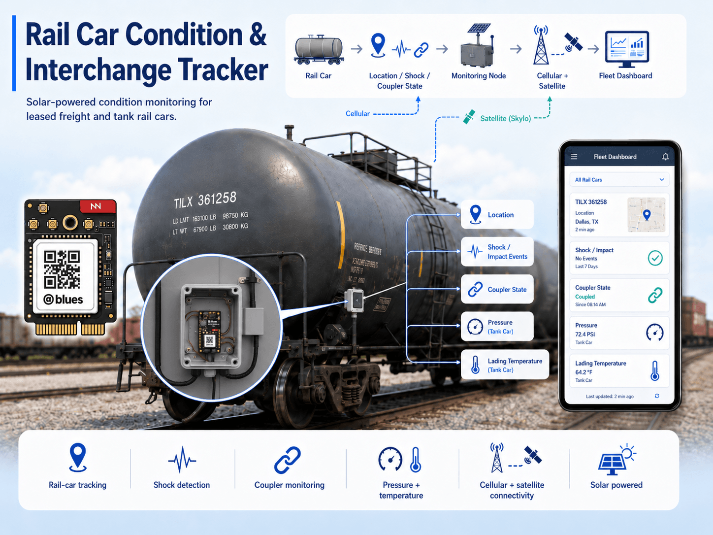
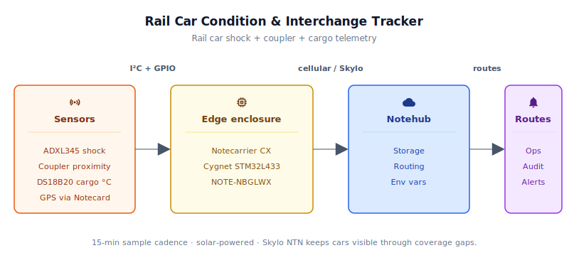
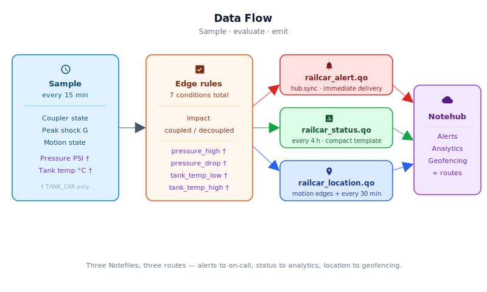

# Rail Car Condition & Interchange Tracker



<Note>

This reference application is intended to provide inspiration and help you get started quickly. It uses specific hardware choices that may not match your own implementation. Focus on the sections most relevant to your use case. If you'd like to discuss your project and whether it's a good fit for Blues, [feel free to reach out](https://blues.com/landing-pages/accelerators-contact-us/?accelerator=Rail%20Car%20Condition%20%26%20Interchange%20Tracker).

</Note>

This project is a [supply chain tracking](https://blues.com/solutions-supply-chain-tracking/) reference design for leased freight and tank rail cars. A solar-powered [Notecard for Skylo](https://shop.blues.com/products/notecard?utm_source=dev-blues&utm_medium=web&utm_campaign=store-link) — Blues' all-in-one cellular and satellite module — pairs with an embedded Cygnet STM32 host to monitor **car-level** conditions: location, shock/impact events, and coupler state. On TANK_CAR builds, the same device adds low-pressure vent-port fitting pressure via the Adafruit MPRLS (0–25 PSI absolute) and single-point lading temperature via a waterproof DS18B20 probe.

## 1. Project Overview

**The problem.** A leased tank car or intermodal flat leaves a chemical plant in Texas headed for a refinery in New Jersey. It crosses four railroads, rolls through a classification yard in Tennessee for three days, then moves overnight to a second yard before final delivery. The lessor has no idea where it is unless the lessee files an EDI interchange report — which may or may not be accurate, and which tells the lessor nothing about *condition*. Did the car take a hard coupling impact? Is a fitting pressure trending down, suggesting a valve leak? Was the car decoupled from its consist somewhere in Iowa at 2 AM? Without on-car telemetry, none of those questions have timely answers.

Rail car lessors operate fleets worth hundreds of millions of dollars with essentially no real-time visibility below the interchange report level. That gap drives everything from underutilized assets (a car in a yard for two weeks that nobody can locate) to safety incidents discovered only after delivery.

**Why Notecard for Skylo.** Rail corridors are the canonical example of connectivity infrastructure that doesn't follow population. For every mile of track through Chicago or Houston, there are fifty through Montana, the Appalachian plateau, or the Texas Panhandle where cellular coverage is thin to nonexistent. A device that relies on LTE alone will go dark for hours or days at a time in exactly the stretches where condition changes are most likely to go undetected. Rail cars have no access points to pair to — WiFi has no role in this deployment.

<NewToBlues/>

Notecard for Skylo (NOTE-NBGLWX) solves the coverage gap with a single M.2 module that carries LTE-M/NB-IoT/GPRS for cellular coverage and [Skylo](https://www.skylo.tech/) NTN (Non-Terrestrial Network) satellite for everywhere else. The Notecard orchestrates the cellular-to-satellite fallback autonomously — the host firmware doesn't need to know which transport is in use. Notes accumulate in Notecard flash during the long dead zones between windows, then flush the moment any transport opens. For assets that might spend days out of cellular range and weeks in a yard, that queue-and-forward model is load-bearing, not a nice-to-have.

This architecture maps directly to Blues' [supply chain tracking](https://blues.com/solutions-supply-chain-tracking/) use case: mobile assets crossing connectivity boundaries unpredictably, with no fixed infrastructure to rely on.

**Deployment scenario.** A weatherproof NEMA 4X enclosure bolted to the car's end-sill or side-sill, powered by a small rooftop solar panel through a solar LiPo charge controller that safely charges a lithium-ion polymer battery. A [Blues Scoop](https://shop.blues.com/products/scoop?utm_source=dev-blues&utm_medium=web&utm_campaign=store-link) lithium-ion capacitor buffer sits inline between a 5 V regulated supply and the Notecarrier VBAT rail, smoothing out the high-current bursts that cellular and especially satellite transmission demand; without it, a modest LiPo under a weak winter sun can brown out the radio mid-session. The Skylo-certified LTE/NTN antenna (included with Notecard for Skylo) and a passive GNSS antenna mount flush to the roof with a clear sky view. A magnetically actuated reed switch attaches near the coupler knuckle, with a matching magnet mounted to the adjacent coupler structure. On TANK_CAR builds, the MPRLS connects to a low-pressure vent or fitting port on the car body.

## 2. System Architecture

**Device-side responsibilities.** The work on the car itself is bounded by one constraint — a 15-minute wake window that has to do everything and then disappear. The Cygnet STM32L433 host on the Notecarrier CX comes up via [`card.attn`](https://dev.blues.io/api-reference/notecard-api/card-requests/#card-attn) sleep, reads its sensors, scores shock events, looks for coupler-state edges, evaluates three alert conditions on standard builds (seven on TANK_CAR builds), and queues Notes to the Notecard over I²C. The moment that's done it goes back to sleep — fully powered off, with the Notecard holding the persistent state struct in its own flash until the next ATTN fire rehydrates it.

**Notecard responsibilities.** Everything that has to think about the network lives in the Notecard, not the host. It holds [Notes](https://dev.blues.io/api-reference/glossary/#note) in its on-device queue, runs GPS position fixes every five minutes while motion is detected (motion-gated so a car sitting in a yard isn't burning battery on GNSS), and syncs outbound data on a voltage-variable [`hub.set`](https://dev.blues.io/api-reference/notecard-api/hub-requests/#hub-set) schedule that stretches the interval as the battery drains. Transport selection is fully autonomous: if LTE-M can't reach a tower the Notecard switches to Skylo NTN and ships the queued Notes over satellite — the firmware never asks which path was used. The Notecard also distributes [environment variables](https://dev.blues.io/guides-and-tutorials/notecard-guides/understanding-environment-variables/) from the [Blues Notehub](https://blues.com/notehub/) cloud service, so fleet-wide thresholds can be retuned without a truck roll.

**Notehub responsibilities.** Once a Note leaves the car, the Notecard's embedded global SIM carries it over supported carriers worldwide and delivers it to [Notehub](https://notehub.io), which ingests events, stores them, and applies project-level [routes](https://dev.blues.io/notehub/notehub-walkthrough/#routing-data-with-notehub). The three Notefiles (`railcar_status.qo`, `railcar_alert.qo`, `railcar_location.qo`) are deliberately separate so each can take its own downstream path: status Notes flow to a long-term analytics store for trend analysis; alert Notes fan out to an on-call endpoint (email, SMS, webhook, CMMS ticket) in near-real time; location Notes feed a geofencing service or time-series location store where interchange-boundary detection happens.

**Routing (high level).** Notehub supports HTTP, MQTT, AWS, Azure, GCP, and Snowflake routes. See the [Notehub routing docs](https://dev.blues.io/notehub/notehub-walkthrough/#routing-data-with-notehub) for setup — this project ships no specific downstream endpoint. [Smart Fleets](https://dev.blues.io/notehub/notehub-walkthrough/#using-smart-fleet-rules) can organize cars by lessee, route, or car type (tank vs. flat) and route them differently at the fleet level.



## 3. Technical Summary

**What you'll have when you're done:** a weatherproof, solar-powered electronics sidecar that mounts to a freight car, samples sensors every 15 minutes, scores shock events, detects coupler state changes, and reports GPS location and condition through Notehub — automatically using cellular when available, switching to satellite in remote areas, and queuing everything offline until connectivity returns.

**Fastest path to first event (bench rig, ~1 hour):**

1. Create a [Notehub project](https://notehub.io), copy the **ProductUID** (shown under **Project Settings → ProductUID**).
2. Set `PRODUCT_UID` in `firmware/rail_car_tracker/rail_car_tracker_helpers.h` (line 40: replace `""` with your ProductUID).
3. Connect ADXL345 accelerometer and reed switch to [Notecarrier CX](https://shop.blues.com/products/notecarrier-cx?utm_source=dev-blues&utm_medium=web&utm_campaign=store-link) over I²C/D5 (see [§5 Wiring](#5-wiring-and-assembly) for pinout).
4. Flash with `arduino-cli compile -b STMicroelectronics:stm32:Blues:pnum=CYGNET firmware/rail_car_tracker/ && arduino-cli upload -b STMicroelectronics:stm32:Blues:pnum=CYGNET -p /dev/cu.usbmodem* firmware/rail_car_tracker/` (exact commands in [§7.1](#71-installing-and-flashing)).
5. Open Notehub **Devices** tab — the Notecard appears within a few minutes. Within 15 minutes you'll see `railcar_status.qo` with `coupled`, `moving`, `shock_peak_g`, and `shock_windows` fields. See [§6 What you should see](#what-you-should-see-in-notehub) for sample JSON payloads.

Here is a sample Note this device emits:

```json
{
  "file": "railcar_alert.qo",
  "body": {
    "alert": "impact",
    "value": 3.8,
    "_lat": 41.4993,
    "_lon": -81.6944,
    "_ltime": 1713888000
  }
}
```

## 4. Hardware Requirements

| Part | Qty | Rationale |
|------|-----|-----------|
| [Notecarrier CX](https://shop.blues.com/products/notecarrier-cx?utm_source=dev-blues&utm_medium=web&utm_campaign=store-link) | 1 | Integrated carrier with onboard Cygnet STM32L433 host — no separate MCU needed. I²C, six analog inputs, nine digital I/O, and M.2 Notecard slot. See the [Notecarrier CX datasheet](https://dev.blues.io/datasheets/notecarrier-datasheet/notecarrier-cx-v1-3/). |
| [Notecard for Skylo (NOTE-NBGLWX)](https://shop.blues.com/products/notecard-for-skylo?utm_source=dev-blues&utm_medium=web&utm_campaign=store-link) | 1 | Single M.2 module with LTE-M/NB-IoT/GPRS + Skylo NTN satellite. 500 MB cellular + 10 KB satellite bundled; no monthly fees. **Ships with its Skylo-certified LTE/NTN antenna — do not substitute another antenna** without a CTIA/OTA delta test report; Skylo may block uncertified devices. See [Notecard for Skylo datasheet](https://dev.blues.io/datasheets/notecard-datasheet/note-nbglwx/). |
| [Blues Mojo](https://shop.blues.com/products/mojo?utm_source=dev-blues&utm_medium=web&utm_campaign=store-link) | 1 | Coulomb counter for bench power validation. See [§9](#9-validation-and-testing). Not deployed to the field. See the [Mojo datasheet](https://dev.blues.io/datasheets/mojo-datasheet/). |
| [Blues Scoop](https://shop.blues.com/products/scoop?utm_source=dev-blues&utm_medium=web&utm_campaign=store-link) | 1 | Lithium-ion capacitor (250 F) peak-current buffer, wired **inline** between the 5 V boost module and the Notecarrier CX `+VBAT` rail. The Scoop has two connectors and two sets of header pins: **J1 (CHG)** JST input (4.8–24 V; headers **J3** are a through-hole alternative to J1) and **J2 (OUT)** JST output (2.5–3.8 V; headers **J4** are a through-hole alternative to J2). The 5 V boost module output connects to J1/J3; Scoop J2/J4 connects to Notecarrier CX `+VBAT`. The internal LiC charges from J1 between radio sessions and supplements the supply rail through J2 during high-current cellular and satellite bursts. **J1 requires ≥ 4.8 V — do not connect it directly to the LiPo (max 4.2 V) or to a raw solar panel.** It is **not** a LiPo charger and does not replace the solar charge controller. See the [Scoop datasheet](https://dev.blues.io/datasheets/scoop-datasheet/). |
| 5 V boost regulator, 3.0–4.2 V input, 5 V regulated output, ≥ 500 mA (e.g., Pololu U1V11F5 or equivalent single-cell LiPo boost module) | 1 | Converts LiPo voltage (3.0–4.2 V) to the regulated 5 V that the Scoop J1 (CHG) input requires. Connect the LiPo JST to this module's input and the 5 V output to Scoop J1 (see [§5](#5-wiring-and-assembly)). A 500 mA output rating provides sufficient current to recharge the Scoop's internal LiC between radio sessions. |
| [Adafruit Triple-Axis Accelerometer ADXL345 (product 1231)](https://www.adafruit.com/product/1231) | 1 | ±16 G, I²C, 3.3 V. Provides raw G-force readings for shock scoring at ±16 G full resolution. The Notecard's internal accelerometer tracks motion state but doesn't expose raw G values — the ADXL345 is needed for impact magnitude scoring. |
| [Adafruit MPRLS Ported Pressure Sensor Breakout (product 3965)](https://www.adafruit.com/product/3965) | 1 | **TANK_CAR builds only** (enable by uncommenting `#define TANK_CAR` in `rail_car_tracker_helpers.h`). I²C, 3.3 V, **0–25 PSI absolute** (0–1723 hPa), ±0.25 % FSS. Returns absolute pressure — at sea level a port open to atmosphere reads approximately 14.7 PSI absolute. Suitable for monitoring fitting pressure on the car body where working pressure is within the 0–25 PSI absolute range. **Not rated for DOT-111, DOT-105, or higher-class tank pressure.** For production cargo pressure monitoring use a certified industrial transducer — see [§11](#11-limitations-and-next-steps). Omit from the BOM entirely for intermodal flat, boxcar, gondola, and other non-tank builds. |
| [Adafruit DS18B20 Waterproof Digital Temperature Sensor (product 381)](https://www.adafruit.com/product/381) | 1 | **TANK_CAR builds only.** One-wire (OneWire protocol), 3.3–5 V, −55 to +125 °C, ±0.5 °C accuracy (−10 to +85 °C range). Configured at 12-bit resolution (0.0625 °C). Connects to pin `D6` on the Notecarrier CX header. Extend the probe through a sealed cable gland into the lading compartment for single-point cargo temperature monitoring. Verify chemical compatibility of the stainless-steel probe housing with the lading before installation. |
| 4.7 kΩ resistor, ¼ W, through-hole or SMD 0603/0805 | 1 | **TANK_CAR builds only.** Pull-up resistor for the DS18B20 one-wire data line. Connects between the `D6` data line and the `+3V3_OUT` rail (see [§5](#5-wiring-and-assembly)). Standard 1 % or 5 % tolerance; any common supplier (Yageo, Bourns, Vishay, etc.). |
| Magnetic reed switch, N.O. contacts, weatherproof (e.g. [Adafruit 375](https://www.adafruit.com/product/375)) | 1 | Mounts near the coupler knuckle. Closes when the paired actuator magnet is within range. Detects coupled/decoupled state. Adafruit 375 is sold individually; source a compatible cylindrical rare-earth magnet separately (see next row). |
| Cylindrical rare-earth (neodymium) magnet, ≥ 10 mm diameter, weatherproof or epoxy-coated (e.g. [Adafruit 9](https://www.adafruit.com/product/9)) | 1 | Actuator for the reed switch above. Mounts to the coupler pin, knuckle carrier, or adjacent structural member such that the magnet is within the reed switch's rated operating distance when the coupler is closed. Verify magnet-to-switch operating distance against the chosen switch's datasheet before mounting. |
| Solar charge controller, 6 V panel input, single-cell LiPo output, MPPT (e.g. CN3065-based module, 450 mA max charge) | 1 | Manages CC/CV LiPo charging from the solar panel with input-side MPPT. **Never connect the solar panel directly to the LiPo terminal.** The controller charges the LiPo; a separate 5 V boost module (see row above) then supplies the Scoop J1 input — the charge controller itself does not need a USB/5 V output port. |
| Solar panel, 6 V, 3–5 W, rigid monocrystalline (e.g., [Voltaic Systems P103C](https://voltaicsystems.com/3-5-watt-panel/), 3.5 W) | 1 | Mounts flat on car roof. Feeds the charge controller's solar input. A 3–4 W panel is sufficient for the default 15-minute sample / 4-hour status cadence in mid-latitude summer; match to your charge controller's maximum input current rating. |
| LiPo battery, 3.7 V single cell, 2000–4000 mAh (e.g., [Adafruit 2011](https://www.adafruit.com/product/2011), 2000 mAh) | 1 | Primary energy storage. Connects to the charge controller battery output and to the 5 V boost module input. The Notecarrier CX receives operating power through the Scoop J2 (OUT) connector, not directly from the LiPo. Size to ≥2000 mAh for all-cellular corridors; use 4000 mAh for primarily satellite corridors or northern-latitude winter deployments. |
| GNSS magnetic-mount antenna, SMA, 3 m lead, 1575 MHz (L1), multi-band preferred (e.g., [SparkFun GPS-14986](https://www.sparkfun.com/products/14986)) | 1 | Routes from the Notecard GPS u.FL port to the car roof via the u.FL-to-SMA adapter below. Must cover at minimum GPS L1 (1575.42 MHz); multi-band L1/L2/L5 coverage (1164–1610 MHz) is preferred. Both antennas must have a clear, unobstructed sky view. |
| u.FL (IPEX/MHF1) to SMA female bulkhead pigtail cable, 100–200 mm, RG178 coaxial | 1 | Adapts the Notecard GPS u.FL port to the SMA GNSS antenna above. Route the cable inside the enclosure; the SMA female end mates to the antenna's SMA male connector through a panel-mount SMA bulkhead feedthrough in the enclosure wall. A 100 mm pigtail is typical; ensure routing clears sharp edges and the feedthrough is rated for the antenna's frequency range. |
| NEMA 4X polycarbonate enclosure, ~8×6×3″ | 1 | Weatherproof housing for all electronics. Rated for outdoor rail-car use; cable glands for antenna leads, reed switch wire, pressure fitting, and power wiring. |

Notecard for Skylo ships with bundled cellular and satellite connectivity — 500 MB cellular data and 10 KB satellite data included, with no activation fees and no monthly commitment. The Notecarrier CX is a carrier board and does not contain a SIM.

## 5. Wiring and Assembly

All host I/O lands on the [Notecarrier CX](https://dev.blues.io/datasheets/notecarrier-datasheet/notecarrier-cx-v1-3/) dual 16-pin header. Notecard for Skylo seats into the carrier's M.2 slot; its MAIN u.FL port connects to the included Skylo-certified LTE/NTN antenna, and its GPS u.FL port connects to the separate GNSS antenna via the u.FL-to-SMA pigtail adapter listed in the BOM. The Mojo sits inline between Scoop J2 and the Notecarrier `+VBAT` during bench testing (remove for field deployment).


**Power chain (solar → charge controller → LiPo → 5 V boost → Scoop inline → Notecarrier):**

- Solar panel `+` / `−` → charge controller solar input terminals.
- Charge controller battery output JST → LiPo battery JST connector. The controller manages CC/CV charging and over-charge protection; **never connect the solar panel directly to the LiPo terminal.**
- LiPo battery JST → 5 V boost module input. The boost module steps the LiPo's 3.0–4.2 V up to a regulated 5 V output.
- 5 V boost module output → Scoop **J1 (CHG)** JST connector (or the **J3** through-hole header pins, which are electrically identical to J1). Scoop's CHG input requires ≥ 4.8 V; the 5 V boost module satisfies this requirement. **Do not wire J1 directly to the LiPo** (max 4.2 V, below the 4.8 V minimum) or to the bare solar panel output.
- Scoop **J2 (OUT)** JST connector (or the **J4** through-hole header pins, electrically identical to J2) → Notecarrier CX `+VBAT` JST connector. J2 delivers 2.5–3.8 V — within the LiPo-range input accepted by the Notecarrier CX. The internal LiC charges from J1 between radio sessions and discharges through J2 to supplement the supply rail during high-current cellular and satellite bursts. Scoop is the **only** path from the power chain to the Notecarrier `+VBAT`; the LiPo does not connect directly to the Notecarrier.
- **Mojo (bench only):** Insert Mojo inline between Scoop J2/J4 and the Notecarrier — Scoop J2/J4 → Mojo `BAT` input JST → Mojo `LOAD` output JST → Notecarrier CX `+VBAT` JST. Then connect a Qwiic cable from either Mojo Qwiic port to a Qwiic port on the Notecarrier CX; Mojo reports cumulative mAh over Qwiic, and the Notecard auto-detects it (firmware v8 and later) — see the [Mojo datasheet](https://dev.blues.io/datasheets/mojo-datasheet/) for details on how the data surfaces. Remove Mojo and restore the direct Scoop J2/J4 → Notecarrier CX `+VBAT` connection before field deployment.

**I²C bus (SDA / SCL pins on Notecarrier CX header):**

The Notecarrier CX has on-board I²C pull-ups. All I²C devices share the bus without conflict:

| Device | I²C Address | Connection |
|--------|-------------|------------|
| Notecard for Skylo | 0x17 | Internal (M.2 slot) |
| ADXL345 breakout | 0x53 | SDA / SCL header; SDO pin to GND |
| MPRLS pressure sensor | 0x18 | SDA / SCL header; address is fixed — **TANK_CAR builds only** |

Run a short Qwiic/STEMMA QT daisy chain or individual 4-wire (VCC/GND/SDA/SCL) connections from each breakout to the Notecarrier CX header.

**1-Wire bus (DS18B20 cargo temperature probe — TANK_CAR builds only):**

The DS18B20 uses a single-wire protocol on `D6`. Wire as follows:

- DS18B20 **data** (yellow) wire → Notecarrier CX `D6`; also connect the **4.7 kΩ pull-up resistor** (BOM item) from the data line to `+3V3_OUT`.
- DS18B20 **power** (red) wire → `+3V3_OUT`.
- DS18B20 **GND** (black) wire → `GND`.

Route the DS18B20's stainless-steel probe through a watertight cable gland in the enclosure wall and extend it into the lading compartment. The probe housing is rated for direct immersion; verify chemical compatibility with the specific lading before installation. See §5.1 Safety before planning any lading-compartment penetration.

**Power to sensor breakouts:**

- ADXL345 `VCC` → Notecarrier CX `+3V3_OUT`. MPRLS `VCC` → `+3V3_OUT` (**TANK_CAR builds only**). All sensors together draw < 5 mA in normal use (100 mA available on `+3V3_OUT`).
- All sensor `GND` pins → Notecarrier CX `GND`.

**Reed switch (coupler state):**

- One reed switch lead → Notecarrier CX `D5`.
- Other lead → `GND`.
- Firmware configures `D5` as `INPUT_PULLUP`; reed switch closed (magnet present = coupled) pulls the pin LOW.

**MPRLS pressure port:**

The MPRLS breakout has a 1/8 NPT threaded port on the sensor body. For field deployment, connect this port via a short stainless-steel or brass fitting to a **low-pressure vent or access port on the car body** — not a pressurized cargo line or any fitting carrying hazardous contents. Mount the sensor board inside the electronics enclosure; run the fitting through the enclosure wall with a sealed bulkhead union. Verify that the fitting material is compatible with any vapors that may be present. See §5.1 Safety before planning any pressure port installation.

### 5.1 Safety Considerations

<Warning>

**Read before installing.** Failure to follow the guidance below could result in personal injury, property damage, regulatory violations, or Skylo network exclusion.

</Warning>

- **Certified antenna.** Notecard for Skylo ships with a Skylo-certified LTE/NTN antenna. Using any other antenna invalidates the Skylo certification and may result in Skylo blocking the device from its NTN network. Do not substitute another antenna without obtaining a delta test lab report through a CTIA/OTA-authorized facility. Contact [Blues](https://blues.com/contact-sales/) for recommended test houses.

- **Pressure port safety.** The Adafruit MPRLS (product 3965) is a consumer-grade breakout with a 25 PSI absolute upper limit. It must **not** be plumbed into a pressurized cargo line, any fitting carrying hazardous or flammable contents, or any port that may exceed its 25 PSI absolute rating. Installation of any fitting or sensor on a regulated tank car must be performed by qualified personnel following all applicable DOT, AAR, and carrier/operator rules. For production cargo pressure sensing, replace the MPRLS with a certified industrial transducer rated for the lading and pressure class (see [§11](#11-limitations-and-next-steps)).

- **Solar power wiring.** Never connect the solar panel output directly to the LiPo battery. Always route the panel through the specified charge controller (or an equivalent CC/CV controller rated for the panel and battery). Operating a LiPo without proper charge control can cause fire, venting, or permanent battery damage.

- **Rail-car installation.** All work on in-service rail cars must comply with applicable AAR, FRA, and carrier rules. This reference design is a bench proof-of-concept. Mounting hardware to the car structure, routing wiring through the car body, or connecting to the car's fittings requires authorization from the car owner or lessor and must follow all applicable federal and industry regulations.

## 6. Notehub Setup

1. **Create a project.** Sign up at [notehub.io](https://notehub.io) and create a project. Copy the [ProductUID](https://dev.blues.io/notehub/notehub-walkthrough/#finding-a-productuid) (format: `com.your-company.your-name:rail-tracker`) and paste it into the `PRODUCT_UID` macro in `firmware/rail_car_tracker/rail_car_tracker_helpers.h`.

2. **Claim the Notecard.** Power the assembled unit. Notecard for Skylo attempts cellular connection on first boot and associates itself with the project automatically. The device appears in the **Devices** tab within a few minutes. If cellular coverage is unavailable at the bench, wait until an antenna is connected and the unit has sky view.

3. **Set the device serial number.** In Notehub, open the device and set the **Serial Number** field to the car's reporting mark and number (e.g., `UTLX-123456`). This propagates through every event and makes it trivial to filter events by car in downstream analytics.

4. **Create Fleets.** [Fleets](https://dev.blues.io/guides-and-tutorials/fleet-admin-guide/) group devices for shared configuration. Natural fleet boundaries for a rail car fleet: one fleet per lessee, one per car type (tank, flat, boxcar), or one per geographic corridor. [Smart Fleets](https://dev.blues.io/notehub/notehub-walkthrough/#using-smart-fleet-rules) can auto-assign devices based on location or car metadata using rule-based logic.

5. **Set environment variables.** In Notehub, navigate to **Project → Fleets** → [create or choose a fleet] → **Environment**. (Alternatively, **Project → Devices → [device] → Environment** for per-device overrides.) All values below are optional; firmware defaults apply if not set. Changes are pulled by the device on its next inbound sync — no reflash required.

   | Variable | Default | Purpose |
   |---|---|---|
   | `sample_interval_min` | `15` | Minutes between sensor samples (and host wakes). |
   | `report_interval_min` | `240` | Minutes between `railcar_status.qo` summary Notes. |
   | `location_interval_min` | `30` | Maximum gap (minutes) between `railcar_location.qo` position Notes while the car is moving. Has no effect on motion-state-edge Notes — those fire on every wake where a stopped ↔ moving transition is detected, regardless of this interval. Because the host only wakes on the `sample_interval_min` cadence, a transition that occurs between wakes can be detected and reported up to `sample_interval_min` minutes after it occurs; reduce `sample_interval_min` to narrow this window at the cost of battery life. |
   | `shock_threshold_g` | `2.5` | Peak resultant G above which an impact is counted and, after cooldown, an alert is sent. The 2.5 G default is a threshold on total resultant vector magnitude (`√(Gx²+Gy²+Gz²)`), which includes the ~1 G static gravity component. Because the firmware does not apply gravity compensation or high-pass filtering, the equivalent net dynamic impact at this threshold depends on sensor mounting orientation relative to the impact direction — use empirical per-install calibration with observed baseline readings in `railcar_status.qo` rather than simple subtraction to interpret this value. Adjust up for cars with robust draft gear or down for sensitive cargo. |
   | `shock_cooldown_min` | `5` | Minimum minutes between consecutive shock alert Notes. Prevents alert storms when a car moves through a rough stretch of track. |
   | `pressure_max_psi` | `20.0` | (**TANK_CAR builds only.**) Fitting absolute pressure (PSI) above which a `pressure_high` alert fires. Standard atmospheric pressure at sea level is ~14.7 PSI absolute — set this threshold above the expected fitting operating pressure. Firmware clamps this variable to 25 PSI to match the MPRLS absolute range. |
   | `pressure_drop_psi` | `10.0` | (**TANK_CAR builds only.**) A drop from the previous absolute-pressure reading exceeding this value (PSI) fires a `pressure_drop` alert, indicating a possible leak or sudden valve event. |
   | `tank_temp_min_c` | `-10.0` | (**TANK_CAR builds only.**) Cargo low-temperature alert threshold (°C). Fires the `tank_temp_low` alert when the DS18B20 probe reading falls below this value. Firmware clamps the threshold to the range −60–25 °C. |
   | `tank_temp_max_c` | `50.0` | (**TANK_CAR builds only.**) Cargo high-temperature alert threshold (°C). Fires the `tank_temp_high` alert when the DS18B20 probe reading exceeds this value. Firmware clamps the threshold to the range 20–100 °C. |

6. **Configure routes.** Add one [route](https://dev.blues.io/notehub/notehub-walkthrough/#routing-data-with-notehub) for `railcar_alert.qo` (to an on-call endpoint, CMMS, or webhook), a second for `railcar_status.qo` (to a long-term analytics store), and a third for `railcar_location.qo` (to a geofencing service or location time-series store. See [Notehub routing docs](https://dev.blues.io/notehub/notehub-walkthrough/#routing-data-with-notehub) for supported route types). The three Notefiles are deliberately separate so high-urgency alerts, periodic condition telemetry, and the dense position stream don't share a routing path — each can be independently throttled, transformed, or forwarded.

### What you should see in Notehub

In **Devices → [device] → Events** (or **Project → Devices → Events** depending on UI generation), you'll see:

- **`_session.qo`** — Notecard session housekeeping, one per cellular or NTN connection. Appears first, within ~2–5 minutes on the bench if cellular is available. Confirms the radio is reaching Notehub. Only used for Blues diagnostics — you can ignore it.

- **`railcar_status.qo`** — emitted immediately on first boot, then once per `report_interval_min` (default 240 minutes = 4 hours). Sample body (Note: GPS coordinates are injected from the Notecard's most recent fix via the `_lat`/`_lon`/`_ltime` compact template fields and do not appear in the host-side payload):
  ```json
  {
    "_lat": 41.4993,
    "_lon": -81.6944,
    "_ltime": 1713888000,
    "coupled": true,
    "moving": false,
    "shock_peak_g": 1.3,
    "shock_windows": 0
  }
  ```
  **Field meanings:** `coupled` is the latest reed-switch state (true = magnet present, coupled). `moving` is whether the Notecard's internal accelerometer detected motion in this sample window. `shock_peak_g` is the highest peak resultant G-force magnitude detected across all sample bursts since the previous summary (reported 0.0 if ADXL345 is missing or all reads failed). `shock_windows` is the count of **sample windows whose peak exceeded `shock_threshold_g`**, not a total impact count; see [§7.3](#73-sensor-reading-strategy). For TANK_CAR builds, `pressure_psi` (fitting absolute pressure) and `tank_temp_c` (cargo temperature) are added to this template. A value of `-9999` in `pressure_psi` or `tank_temp_c` means the sensor did not initialize on that wake — treat as a transient sensor fault.

- **`railcar_alert.qo`** — emitted only when a threshold is exceeded, with an immediate `hub.sync` request. The `alert` field is one of: `impact`, `coupled`, `decoupled`, `pressure_high`, `pressure_drop`, `tank_temp_low`, `tank_temp_high` (last four in TANK_CAR builds only). Sample alert on a coupling impact:
  ```json
  {
    "alert": "impact",
    "value": 3.8,
    "_lat": 41.4993,
    "_lon": -81.6944,
    "_ltime": 1713888000
  }
  ```

- **`railcar_location.qo`** — emitted on two triggers: (1) a motion-state edge (stopped ↔ moving) detected on the host's wake cadence — detection can lag the actual transition by up to `sample_interval_min` minutes; once detected, a `hub.sync` is requested immediately within the same wake; (2) while moving, every `location_interval_min` minutes (default 30 minutes). Sample body:
  ```json
  {
    "_lat": 41.4993,
    "_lon": -81.6944,
    "_ltime": 1713888000,
    "moving": true,
    "coupled": true
  }
  ```
  This provides downstream geofencing services with both position and operational context (moving/coupled) needed to detect railroad boundary crossings and coupler changes at interchange points. GPS coordinates are injected from the Notecard's last known fix; no host query is needed.

## 7. Firmware Design

**Three-file sketch.** All three files must reside in the same sketch directory to compile:

| File | Role |
|---|---|
| [`rail_car_tracker.ino`](firmware/rail_car_tracker/rail_car_tracker.ino) | `setup()` / `loop()` orchestration; global object definitions (`Notecard`, `PersistState`) |
| [`rail_car_tracker_helpers.h`](firmware/rail_car_tracker/rail_car_tracker_helpers.h) | Compile-time constants, `#define TANK_CAR` build flag, `PersistState` struct, `extern` declarations, function prototypes |
| [`rail_car_tracker_helpers.cpp`](firmware/rail_car_tracker/rail_car_tracker_helpers.cpp) | All Notecard interactions, sensor reads, and note-emission helpers |

### 7.0 TANK_CAR build flag

The firmware compiles into two distinct profiles controlled by a single `#define` in `rail_car_tracker_helpers.h`:

```cpp
// Uncomment to enable tank-car pressure monitoring:
// #define TANK_CAR
```

| | Standard build (default, `TANK_CAR` commented out) | TANK_CAR build |
|---|---|---|
| **Sensors initialized** | ADXL345, reed switch | + MPRLS pressure sensor, DS18B20 cargo temperature probe |
| **Fields in `railcar_status.qo`** | `coupled`, `moving`, `shock_peak_g`, `shock_windows` | + `pressure_psi`, `tank_temp_c` |
| **Alert types** | `impact`, `coupled`, `decoupled` | + `pressure_high`, `pressure_drop`, `tank_temp_low`, `tank_temp_high` |
| **Env vars consumed** | `sample_interval_min`, `report_interval_min`, `location_interval_min`, `shock_threshold_g`, `shock_cooldown_min` | + `pressure_max_psi`, `pressure_drop_psi`, `tank_temp_min_c`, `tank_temp_max_c` |
| **BOM additions** | None | Adafruit MPRLS breakout (product 3965), Adafruit DS18B20 waterproof probe (product 381), 4.7 kΩ pull-up resistor |

In the default standard build, the MPRLS is never initialized, the `pressure_psi` field is absent from every Note template (saving satellite bytes), and the pressure alert logic is compiled out entirely — no "MPRLS not found" warnings appear on non-tank assets. Enable `TANK_CAR` only when the MPRLS sensor is physically fitted.

<Note>

**Switching build profiles.** The firmware encodes the build profile into `CONFIG_VERSION` (standard = 4, TANK_CAR = 104). Toggling `#define TANK_CAR` therefore automatically invalidates the stored configuration on the Notecard and forces `defineTemplates()` to re-register the correct schema on the next wake — no manual version bump is needed. Without this coupling, flipping the flag while keeping the same `CONFIG_VERSION` would leave a stale `railcar_status.qo` template that either lacks or spuriously includes `pressure_psi` and `tank_temp_c`, causing `note.add` to reject payloads whose schema does not match the registered template.

</Note>

### 7.1 Installing and flashing

**Dependencies:**

- **Arduino core for STM32** — [`stm32duino/Arduino_Core_STM32`](https://github.com/stm32duino/Arduino_Core_STM32). Add the board index URL `https://github.com/stm32duino/BoardManagerFiles/raw/main/package_stmicroelectronics_index.json` under **File → Preferences → Additional Boards Manager URLs**, then install "STM32 MCU based boards." Select **Blues Cygnet** as the board target (canonical FQBN: `STMicroelectronics:stm32:Blues:pnum=CYGNET`).
- **`Blues Wireless Notecard`** (`note-arduino`). Install via the Arduino Library Manager or `arduino-cli lib install "Blues Wireless Notecard"`. See [note-arduino releases](https://github.com/blues/note-arduino/releases) for available versions.
- **`Adafruit MPRLS Library`** — **TANK_CAR builds only.** Install via Library Manager (`arduino-cli lib install "Adafruit MPRLS Library"`). Not required for standard (non-tank) builds.
- **`OneWire`** — **TANK_CAR builds only.** Install via Library Manager (`arduino-cli lib install "OneWire"`). Provides the 1-Wire bus driver used by the DS18B20 probe.
- **`DallasTemperature`** — **TANK_CAR builds only.** Install via Library Manager (`arduino-cli lib install "DallasTemperature"`). High-level API for Dallas/Maxim DS18B20 temperature sensors over the OneWire bus.

The ADXL345 is driven by direct I²C register reads using the built-in `Wire` library — no additional library required.

**Flashing via `arduino-cli`:**

```bash
# Install the STM32 core if you haven't already
arduino-cli core install STMicroelectronics:stm32

# Verify the Cygnet board is available
arduino-cli board listall | grep -i cygnet

# Compile
arduino-cli compile -b STMicroelectronics:stm32:Blues:pnum=CYGNET firmware/rail_car_tracker/

# Upload (adjust /dev/cu.usbmodem* for your system; on Linux it may be /dev/ttyACM*)
# When the device appears in the list, use the actual port
arduino-cli upload -b STMicroelectronics:stm32:Blues:pnum=CYGNET -p /dev/cu.usbmodem* firmware/rail_car_tracker/
```

**Serial console during a successful boot:**

```
[notecardReady] OK
[configureNotecard] OK
[defineTemplates] OK
[configureMotionAndGPS] OK
[sample] wake 1: coupled=1 moving=0 shock_peak_g=0.9 shock_windows=0
[sendSummary] OK
[loop] sleeping 15 minutes...
(host quiet for 15 minutes)
[sample] wake 2: coupled=1 moving=0 shock_peak_g=1.1 shock_windows=0
```

After the first sample cycle, the host powers off until the next ATTN fire (default 15 minutes) — serial output going quiet is **expected behavior, not a hang.** Use the timing shown above to verify the sample interval. Open a serial monitor at **115200 baud** (e.g., `screen /dev/cu.usbmodem* 115200` on Mac/Linux, or Arduino IDE's Serial Monitor).

### 7.2 Modules

| Responsibility | Function |
|---|---|
| Notecard readiness | `notecardReady` — per-boot I²C cold-boot retry before any transaction |
| Notecard configuration | `configureNotecard` — `hub.set` with voltage-variable sync; returns `bool` |
| Note templates | `defineTemplates` — compact templates for all three Notefiles; returns `bool` |
| Motion and GPS config | `configureMotionAndGPS` — Notecard accelerometer + location mode; returns `bool` |
| Env var fetch | `fetchEnvOverrides` — pull and clamp all environment variables per wake |
| Coupler debounce | `readCouplerState` — 5-sample majority vote |
| Shock scoring | `adxl345Begin`, `adxl345ReadG`, `readPeakShockG` — 64-sample burst; I²C validated per read |
| Alert emission | `sendAlert` — compact Note; returns `bool`; sync coalesced via `hub.sync` after all alerts |
| Summary emission | `sendSummary` — latest sensor readings + shock window accumulators |
| Location emission | `sendLocationNote` — compact position Note to `railcar_location.qo`; fired on motion-state edges and `location_interval_min` cadence while moving |
| Sleep | `NotePayloadSaveAndSleep` / `NotePayloadRetrieveAfterSleep` — separate restore/save descriptors; return values checked |

### 7.3 Sensor reading strategy

- **ADXL345 shock scoring.** The sensor is configured for ±16 G full-resolution mode (3.9 mg/LSB). Each sample cycle reads 64 samples at ~100 Hz (~640 milliseconds burst) and tracks the peak resultant vector magnitude `√(Gx²+Gy²+Gz²)`. At rest, this reads ~1.0 G (static gravity). An impact registers as a spike above that baseline. Because the firmware compares total resultant magnitude, not gravity-compensated acceleration — the relationship between the 2.5 G threshold and the net dynamic impact depends on sensor mounting orientation: the gravity vector's contribution to the resultant is not simply subtractable. Empirical per-install calibration using observed baseline readings in `railcar_status.qo` is the reliable way to set `shock_threshold_g` for a specific installation. **`shock_windows` counts sample windows, not individual impacts.** The 640 milliseconds burst is read once per 15-minute wake: an impact that occurs between bursts is invisible to this firmware. `shock_windows` is therefore the number of wakes in the summary period where the burst peak exceeded `shock_threshold_g` — it can be zero when real impacts occurred outside sample windows. Do not interpret it as a total impact count. Each I²C read in the burst is validated; if the repeated-start write fails or fewer than 6 bytes are returned, the individual sample is discarded rather than allowed to produce a spurious magnitude spike. If all reads in a burst fail, `peakG` returns `NAN` and neither `shock_peak_g` accumulation nor `shock_windows` is incremented for that cycle.
- **MPRLS.** Single I²C measurement via the Adafruit library. `readPressure()` returns pressure in **hPa** (absolute); the firmware divides by 68.948 to convert to PSI absolute. Valid range 0–25 PSI absolute (0–1723 hPa); accuracy ±0.25 % FSS typical. At standard sea-level conditions a port open to atmosphere reads approximately 14.7 PSI absolute; a pressurized fitting reads above that baseline. A sharp drop in absolute pressure toward atmospheric may indicate a leak or valve event; a reading significantly below atmospheric likely indicates a sensor wiring fault. This sensor is not rated for full DOT-111 or higher-class tank pressure. See [§11](#11-limitations-and-next-steps).
- **DS18B20 cargo temperature probe (TANK_CAR builds).** Initialized via the DallasTemperature library over the OneWire bus on `D6`. Configured at 12-bit resolution (0.0625 °C step). Each wake calls `requestTemperatures()`, which blocks approximately 750 milliseconds for the conversion, then reads the result with `getTempCByIndex(0)`. The library returns `DEVICE_DISCONNECTED_C` (−127 °C) when the probe is absent or wiring is broken; the firmware treats any value below −100 °C as an error and stores `NAN`, which is reported as `−9999` in `tank_temp_c`. Sensor accuracy is ±0.5 °C across the −10 to +85 °C range. Verify chemical compatibility of the stainless-steel probe housing with the lading before installation.
- **Reed switch.** Five `digitalRead` samples with 20 milliseconds spacing; majority vote (≥ 3 of 5 agreeing) determines the accepted state. Edge detection against the persisted previous state triggers coupler-change alerts.

### 7.4 Event payload design

All three Notefiles use [compact Note templates](https://dev.blues.io/notecard/notecard-walkthrough/low-bandwidth-design#working-with-note-templates), which is required for satellite (NTN) transport and dramatically reduces per-Note byte count over cellular as well. The `_lat`, `_lon`, and `_ltime` compact reserved fields restore GPS coordinates into the otherwise stripped compact template — the Notecard injects the most recent fix automatically, no host GPS query needed for summary Notes. The `railcar_status.qo` template body occupies approximately 28 bytes in a standard build (add ~4 bytes each for `pressure_psi` and `tank_temp_c` in TANK_CAR builds, totalling ~36 bytes) — this is the compact Note **body size only**, not the total satellite data consumption per Note. Real NTN delivery also incurs session-establishment overhead, routing metadata, and delivery receipts. See [§11 Limitations](#11-limitations-and-next-steps) for satellite budget guidance.

The `railcar_status.qo` body carries the most recent sensor readings from the sample cycle that triggered the summary, plus `shock_peak_g` (highest G seen since the previous summary) and `shock_windows` (number of **sample windows** in the summary period whose burst peak exceeded `shock_threshold_g`). `shock_windows` is a sampled-threshold window count, not a count of individual impacts. See [§7.3](#73-sensor-reading-strategy). This is not a window average of all samples — it is the latest single reading plus accumulated extremes.

Sample `railcar_alert.qo` body (GPS coordinates are injected from the Notecard's last known fix via `_lat`/`_lon`/`_ltime` compact template fields, they do not appear in the host-side `note.add` call):

```json
{
  "file": "railcar_alert.qo",
  "body": {
    "alert": "impact",
    "value": 3.8,
    "_lat": 41.4993,
    "_lon": -81.6944,
    "_ltime": 1713888000
  }
}
```

Alert types and their `value` fields:

| `alert` | `value` | Build |
|---|---|---|
| `impact` | Peak resultant G of the triggering sample burst | All |
| `coupled` | `1.0` (coupler closed) | All |
| `decoupled` | `0.0` (coupler opened) | All |
| `pressure_high` | Fitting absolute pressure (PSI) at alert time | TANK_CAR only |
| `pressure_drop` | Magnitude of the absolute-pressure drop (PSI), not the current reading | TANK_CAR only |
| `tank_temp_low` | DS18B20 cargo temperature (°C) that tripped the threshold | TANK_CAR only |
| `tank_temp_high` | DS18B20 cargo temperature (°C) that tripped the threshold | TANK_CAR only |

### 7.5 Low-power strategy

The host Cygnet STM32L433 is fully powered off between samples via `card.attn` sleep mode. Following the pattern of the reference accelerators, all sensing and logic runs in `setup()`; `loop()` holds only the `NotePayloadSaveAndSleep` call and a fallback `delay`. `NotePayloadSaveAndSleep` serializes the `PersistState` struct into Notecard flash, then issues the `card.attn` sleep request that cuts the host power rail for `sample_interval_min × 60` seconds. On ATTN fire, the Notecarrier CX re-applies host power, the MCU enters `setup()` from cold, and `NotePayloadRetrieveAfterSleep` rehydrates the struct. The host is awake for only the few seconds needed to read sensors, evaluate rules, and queue Notes — on the order of 5–10 seconds per 15-minute interval.

Notecard for Skylo idles at ~8–18 µA @ 5V between sessions (see the [low-power firmware design guide](https://dev.blues.io/notecard/notecard-walkthrough/low-power-firmware-design/)). GPS is motion-gated: `card.location.mode` with `threshold: 1` keeps the GNSS radio off while the car sits in a yard, waking it only when the Notecard's internal accelerometer detects movement. Outbound sync cadence adapts to battery charge state via `voutbound`/`vinbound` voltage-variable strings:

| Voltage tier | `voutbound` interval | `vinbound` interval |
|---|---|---|
| USB | 60 minutes | 120 minutes |
| High | 120 minutes | 240 minutes |
| Normal | 240 minutes | 480 minutes |
| Low | 480 minutes | 720 minutes |
| Dead | Paused (0) | Paused (0) |

At high charge (good solar harvest), the Notecard syncs every 2 hours; at normal charge, every 4 hours; at low charge, every 8 hours. At "dead" voltage, outbound syncs are suspended to protect the battery. On first boot, the firmware sends a summary Note immediately regardless of the report interval — this ensures a known-good status lands in Notehub during commissioning.

### 7.6 Retry and error handling

- **Per-boot Notecard readiness.** `notecardReady()` issues a lightweight `card.version` via `sendRequestWithRetry(req, 10)` at the top of every `setup()` call, before any other Notecard transaction. The host MCU can power up before the Notecard's I²C stack is ready after every `NotePayloadSaveAndSleep` wake, not just on initial firmware flash. This ensures the bus is live before `fetchEnvOverrides`, `card.time`, and all other requests.
- **One-time configuration retry.** `configureNotecard`, `defineTemplates`, and `configureMotionAndGPS` all return `bool`. `state.configured` is set `true` only if all three succeed. If any step fails, `state.configured` stays `false` and the next wake retries the full configuration sequence automatically.
- **Response error-field checking.** All `requestAndResponse` calls check for `NULL` return and inspect the `err` field in the response JSON before treating the response as valid. `notecard.deleteResponse` is always paired with any non-NULL response. `sendRequest` / `sendRequestWithRetry` calls that return a `bool` are checked and logged on failure.
- **Note emission error visibility.** `sendAlert` and `sendSummary` use `requestAndResponse` (not fire-and-forget `sendRequest`) so the Notecard's `err` field is visible on failure; dropped Notes are logged to serial.
- **PRODUCT_UID runtime guard.** If `PRODUCT_UID` is empty at startup, the firmware logs a fatal message to serial and halts before attempting any Notecard communication, making the misconfiguration immediately obvious at the bench without requiring Notehub to diagnose a missing project association.
- **NotePayload save-or-sleep failure.** `NotePayloadAddSegment` and `NotePayloadSaveAndSleep` return values are checked in `loop()`. If either fails, the firmware logs the error and issues an explicit `card.attn sleep` fallback request to preserve battery rather than leaving the host awake indefinitely.
- **Pressure drop validity.** A separate `lastPressureValid` flag in `PersistState` tracks whether the stored `lastPressurePsi` came from a successful sensor read. The flag is cleared whenever a read returns `NAN`. A `pressure_drop` alert is suppressed unless both the previous and current readings are valid, preventing stale readings from manufacturing a false drop alert after one or more failed cycles.
- **Summary timing stability.** The summary window is tracked as accumulated elapsed minutes (`state.elapsedMin += sampleMin` on each wake) rather than a wake count multiplied by the current interval. A runtime change to `sample_interval_min` therefore does not retroactively shift the window boundary.
- **MPRLS / DS18B20 fault sentinels.** Reads that fail initialization return `NAN`; `sendSummary` replaces `NAN` with `-9999` in `pressure_psi` and `tank_temp_c` so downstream analytics can distinguish a sensor fault from a legitimate near-zero reading. The DS18B20 returns `DEVICE_DISCONNECTED_C` (−127 °C) when the probe is absent or wiring is broken; the firmware treats any value below −100 °C as an error and converts it to `NAN` before calling `sendSummary`. If the ADXL345 is absent or all reads in a burst fail, `peakG` is `NAN`; neither `shock_peak_g` accumulation nor `shock_windows` is incremented for that cycle.
- **Alert sync coalescing.** `sendAlert` and `sendLocationNote` (on motion-state edges) do not set `sync:true` on individual `note.add` calls. After all alert and location logic completes for a wake, a single `hub.sync` is issued if any alert or motion-edge location Note was queued. This avoids redundant sync-session requests when multiple events fire in the same wake.
- **Env-var clamping.** All values from `fetchEnvOverrides` are clamped before use — a malformed Notehub value can't produce an out-of-range sleep duration or division-by-zero interval.

### 7.7 Key code snippet 1: compact template with GPS fields

The `format:"compact"` argument is required for Notecard-for-Skylo NTN Notes. The `_lat`/`_lon`/`_ltime` keywords restore GPS coordinates into an otherwise stripped compact template — the Notecard injects the most recent fix automatically, no host GPS query needed for summary Notes. The `pressure_psi` and `tank_temp_c` fields are added only in TANK_CAR builds (wrapped in `#ifdef TANK_CAR`); the snippet below shows the standard (non-tank) template.

```cpp
J *req = notecard.newRequest("note.template");
JAddStringToObject(req, "file",   "railcar_status.qo");
JAddNumberToObject(req, "port",   10);
JAddStringToObject(req, "format", "compact");
J *body = JAddObjectToObject(req, "body");
JAddNumberToObject(body, "_lat",          TFLOAT32);
JAddNumberToObject(body, "_lon",          TFLOAT32);
JAddNumberToObject(body, "_ltime",        TINT32);
// #ifdef TANK_CAR
// JAddNumberToObject(body, "pressure_psi", TFLOAT32);  // MPRLS fitting pressure (PSI abs)
// JAddNumberToObject(body, "tank_temp_c",  TFLOAT32);  // DS18B20 cargo temperature (°C)
// #endif
JAddBoolToObject  (body, "coupled",       true);
JAddBoolToObject  (body, "moving",        true);
JAddNumberToObject(body, "shock_peak_g",  TFLOAT32);
JAddNumberToObject(body, "shock_windows", TINT16);
notecard.sendRequest(req);
```

### 7.8 Key code snippet 2: voltage-variable hub.set

`voutbound` adjusts the outbound sync interval based on the VBAT voltage reported by the Notecard — no host-side battery measurement needed. At `high` charge the Notecard syncs every 120 minutes; at `normal` every 240 minutes; at `low` every 480 minutes; at `dead` outbound is suspended entirely.

```cpp
J *req = notecard.newRequest("hub.set");
JAddStringToObject(req, "product",   PRODUCT_UID);
JAddStringToObject(req, "mode",      "periodic");
JAddStringToObject(req, "voutbound",
                   "usb:60;high:120;normal:240;low:480;dead:0");
JAddStringToObject(req, "vinbound",
                   "usb:120;high:240;normal:480;low:720;dead:0");
notecard.sendRequestWithRetry(req, 10);
```

### 7.9 Key code snippet 3: ADXL345 shock scoring burst

64 reads at ~100 Hz gives a ~640 milliseconds window — long enough to capture a coupling impact transient. The resultant vector magnitude includes the static gravity component (~1.0 G at rest). Because the firmware does not compensate for gravity, translating a 2.5 G threshold into a "net impact" figure depends on the angle between the gravity vector and the impact direction — use empirical per-install calibration rather than simple arithmetic to set `shock_threshold_g` for your installation. Each I²C read is validated; failed reads are skipped so a short I²C transfer can't inject a spurious magnitude. The function returns `NAN` if no reads succeed.

```cpp
float   peakG        = 0.0f;
uint8_t validSamples = 0;
for (uint8_t i = 0; i < 64; i++) {
    float gx, gy, gz;
    if (!adxl345ReadG(gx, gy, gz)) { delay(10); continue; }
    float mag = sqrtf(gx*gx + gy*gy + gz*gz);
    if (mag > peakG) peakG = mag;
    validSamples++;
    delay(10);
}
return (validSamples > 0) ? peakG : NAN;
```

### 7.10 Key code snippet 4: persist state and sleep

`NotePayloadSaveAndSleep` is a `note-arduino` helper that writes the state struct to Notecard flash and issues `card.attn` sleep — cutting host power entirely. On the next ATTN fire the MCU re-enters `setup()` cold; `NotePayloadRetrieveAfterSleep` rehydrates the struct in the first few lines.

Restore and save use **separate** `NotePayloadDesc` objects. The restore descriptor is stack-allocated in `setup()` and freed with `NotePayloadFree` after the segment is read. The save descriptor is freshly zero-initialised in `loop()`, preventing any stale segment state from being carried into the next sleep cycle. Both return values are checked; a failed save falls back to an explicit `card.attn sleep` request rather than leaving the host awake.

```cpp
// In setup(): restore
NotePayloadDesc restorePayload;
bool wakeFromSleep = NotePayloadRetrieveAfterSleep(&restorePayload);
if (wakeFromSleep) {
    wakeFromSleep &= NotePayloadGetSegment(&restorePayload, STATE_SEG_ID,
                                           &state, sizeof(state));
    NotePayloadFree(&restorePayload);
}

// In loop(): save
NotePayloadDesc savePayload = {0, 0, 0};
bool segOk   = NotePayloadAddSegment(&savePayload, STATE_SEG_ID, &state, sizeof(state));
bool sleepOk = segOk && NotePayloadSaveAndSleep(&savePayload, g_sampleMin * 60U, NULL);
if (!sleepOk) { /* fallback card.attn sleep */ }
```

## 8. Data Flow



**Collected every `sample_interval_min` (default 15 min):** coupler state (boolean), peak resultant G in the sampling burst, Notecard motion state (moving/stopped from internal accelerometer); TANK_CAR builds also collect low-pressure fitting absolute pressure (PSI) and DS18B20 cargo temperature (°C).

**Transmitted:**

- `railcar_status.qo` — one compact Note **generated** per `report_interval_min` (default every 4 hours; also immediately on first boot). **Generation and delivery are separate steps.** The Cygnet host creates the Note and queues it to the Notecard on the `report_interval_min` cadence. The Notecard **delivers** queued Notes on the next outbound sync session, scheduled by the voltage-variable `hub.set` at 2 hours (high charge), 4 hours (normal charge), or 8 hours (low charge) — or the next time the Notecard can establish an NTN session with adequate sky view when cellular is unavailable. Contains `coupled`, `moving`, `shock_peak_g`, `shock_windows`; TANK_CAR builds also include `pressure_psi` and `tank_temp_c`. GPS coordinates injected automatically by the Notecard from the most recent fix via the `_lat`/`_lon`/`_ltime` compact template fields.
- `railcar_alert.qo` — emitted on any threshold trip; a single `hub.sync` is issued after all alerts for the wake are queued, requesting immediate delivery. The Notecard transmits over cellular if available; if not, the Note waits in flash until the next satellite NTN window or the next time cellular coverage opens.
- `railcar_location.qo` — emitted on two independent triggers: (1) a motion-state edge (stopped ↔ moving) detected on the host's `sample_interval_min` wake cadence — a transition that occurs between wakes is detected and reported on the next wake, up to `sample_interval_min` minutes later; once detected, a `hub.sync` is requested immediately within the same wake so the yard-arrival or yard-departure Note reaches Notehub without waiting for the next scheduled outbound window; (2) while moving, every `location_interval_min` minutes (default 30 min, adjustable via env var), filling the gap between periodic status summaries with a dense enough position record for interchange-boundary determination. Body contains only `moving` and `coupled`; `_lat`/`_lon`/`_ltime` are injected automatically by the Notecard from the last known GPS fix. GNSS runs every 5 minutes while the car is moving (motion-gated to save battery during yard dwell), so in-motion position fixes are refreshed well within the default 30-minute location cadence.

**Routed:** all three Notefiles land in Notehub. `railcar_alert.qo` routes to a real-time endpoint (webhook, email, or CMMS); `railcar_status.qo` routes to a time-series store for trend analysis and car utilization reporting; `railcar_location.qo` routes to a geofencing service or location time-series store for interchange-boundary detection.

**Alert triggers (three always-on + four TANK_CAR-only):**

| Alert | Condition | Repeat behavior | Build |
|---|---|---|---|
| `impact` | Peak G ≥ `shock_threshold_g` | Rate-limited: one alert per `shock_cooldown_min` window; prevents storms on rough track | All |
| `coupled` / `decoupled` | Coupler-state edge from previous sample | Edge-detected: one alert per state transition, regardless of how long the state persists | All |
| `pressure_high` | Fitting absolute pressure > `pressure_max_psi` | Edge-detected: fires once when condition is first observed; suppressed while it persists | TANK_CAR only |
| `pressure_drop` | Fitting pressure fell > `pressure_drop_psi` since the previous sample | One alert per detected sudden-drop event; suppressed unless both the previous **and** current readings are valid (prevents stale readings from producing false alerts after a failed cycle) | TANK_CAR only |
| `tank_temp_low` / `tank_temp_high` | DS18B20 cargo temperature outside `tank_temp_min_c` / `tank_temp_max_c` | Edge-detected: fires once when condition is first observed; suppressed on subsequent samples while it persists; re-arms when temperature returns inside range | TANK_CAR only |

## 9. Validation and Testing

**Expected steady-state cadence.** A correctly installed unit generates one `railcar_status.qo` every `report_interval_min` (default 4 hours) and delivers it on the next scheduled sync session. At normal battery voltage over cellular, generation and delivery are both on a 4-hour cadence. At low voltage, the sync interval stretches to 8 hours and Notes may queue for that duration before delivery. `railcar_location.qo` fires on every detected motion-state-edge and, while moving, every `location_interval_min` minutes (default 30 min). Motion-state edges are detected on the host's 15-minute wake cadence — a stopped ↔ moving transition can be reported up to `sample_interval_min` minutes after it occurs; once detected, a `hub.sync` is requested immediately within the same wake. To reduce the detection window, lower `sample_interval_min` (via env var) at the cost of battery life. Zero `railcar_alert.qo` events is normal during smooth transit. During initial commissioning, review the `shock_peak_g` values in the first several `railcar_status.qo` Notes to establish the car's baseline vibration signature, then tune `shock_threshold_g` and the pressure-drop threshold accordingly. The firmware does not implement automatic calibration or baseline learning — commissioning-time threshold tuning is a manual step using observed data.

**Power validation with Mojo.** The [Mojo](https://dev.blues.io/datasheets/mojo-datasheet/) sits inline on the VBAT rail during bench bring-up and reports cumulative mAh to the Notecard over Qwiic (see [§5](#5-wiring-and-assembly) for the full bench wiring).

The table below lists per-phase reference figures drawn from the [NOTE-NBGLWX datasheet](https://dev.blues.io/datasheets/notecard-datasheet/note-nbglwx/) and the [Notecard low-power design guide](https://dev.blues.io/notecard/notecard-walkthrough/low-power-firmware-design/), alongside whole-system bench estimates for this assembly. Read the two columns differently: the reference column reflects what Blues has published; the bench estimate column is a starting point to confirm with Mojo.

| Phase | Reference figure | Source | Whole-system bench estimate |
|---|---|---|---|
| Deep sleep: host off, Notecard idle (radio off) | ~8–18 µA @ 5V | [Low-power design guide](https://dev.blues.io/notecard/notecard-walkthrough/low-power-firmware-design/) | ~20–50 µA total @ 3.7 V |
| Sample cycle: host + sensors active (~5–10 s) | — | — | ~30–40 mA |
| Cellular sync — average current | Modem active: ~250 mA | [NOTE-NBGLWX datasheet](https://dev.blues.io/datasheets/notecard-datasheet/note-nbglwx/) | ~150–300 mA average; session ~15–60 s typical |
| Cellular sync — burst peak | Up to ~2 A for a few ms (GSM fallback regions) | [NOTE-NBGLWX datasheet](https://dev.blues.io/datasheets/notecard-datasheet/note-nbglwx/) | Battery, connectors, wiring, charge path, and Scoop buffer must all be validated against the full published peak burst-current envelope (~2 A); validate with Mojo traces before finalizing sizing — do not use a headroom figure below the peak you cite |
| NTN satellite sync (Skylo session) — average current | No NOTE-NBGLWX NTN-specific figure published; modem-active baseline: ~250 mA | [NOTE-NBGLWX datasheet](https://dev.blues.io/datasheets/notecard-datasheet/note-nbglwx/) | **Bench estimate only:** sustained current during session likely at or above cellular average; session duration minutes-scale; validate with Mojo before finalizing sizing |
| NTN satellite sync — burst peak | Not published for NOTE-NBGLWX NTN operation | — | Size for at least the same headroom as cellular; treat any pre-Mojo estimate as a floor, not a ceiling |

**Estimated daily energy budgets** — whole-system estimates only; **always measure with Mojo before finalizing battery and panel sizing**:

| Scenario | Daily consumption | Notes |
|---|---|---|
| All-cellular, mostly-stationary (car in yard) | 15–25 mAh / 24 h | GNSS motion-gated off. Host sleeps 15 min / wake cycle for ~5–10 s. Sync every 4 h at normal charge. **Best-case baseline for yard-dwell scenarios.** |
| All-cellular, in-transit (car moving hours/day) | 40–80 mAh / 24 h | GNSS active every 5 min while moving. `railcar_location.qo` fires every 30 min + on motion edges. GNSS duty cycle adds significant budget. Validate empirically with Mojo under representative duty cycle. |
| Mixed NTN/cellular or predominantly NTN | 80–200+ mAh / 24 h | NTN session overhead dominates. Sessions last 1–4 min at high current; exact budget depends on coverage in your corridor. **Measure with Mojo in your target deployment zone before sizing.** |

**Commissioning guidance for 2000 mAh LiPo + 3.5 W solar panel (US mid-latitude, summer):** A stationary car in a yard should sustain indefinitely on a 3.5 W panel and 2000 mAh battery (daytime solar recharges faster than baseline drain). An in-transit car burning 50 mAh/day should also sustain on the same panel in good summer sun; in winter or at higher latitudes, increase panel size to 5–6 W or battery to 4000 mAh. NTN-heavy corridors should validate consumption with Mojo before final sizing — satellite sessions can dominate the budget unexpectedly.

**Mojo trace patterns to look for:**

- **Healthy:** flat near-zero baseline with brief blips at the 15-minute sample interval and one longer burst (cellular or satellite) at the sync interval.
- **Host not sleeping:** continuous 30–50 mA baseline. Usually a `card.attn` / `NotePayloadSaveAndSleep` misconfiguration; verify the Notecarrier CX ATTN pin is connected (it is internally on the CX; no external wire needed).
- **Frequent satellite sessions:** very long (1–4 min) high-current bursts replacing the shorter cellular bursts. Normal behavior when the car is in a cellular-dark corridor.
- **Rapid satellite data depletion:** check that compact templates are defined before the first `note.add`. A non-compact Note sent over NTN can cost several times more satellite bytes than a compact one.

Mojo is a bench-validation and per-firmware-revision regression tool. Field units don't need it.

## 10. Troubleshooting

| Symptom | Diagnosis | Recovery |
|---|---|---|
| Device does not appear in Notehub **Devices** tab after 5 minutes | PRODUCT_UID not set, or set incorrectly. The Notecard claims itself to a ProductUID on first boot over cellular. | Check `firmware/rail_car_tracker/rail_car_tracker_helpers.h` line 40; confirm `PRODUCT_UID` matches **Project Settings → ProductUID** in Notehub. Re-flash. If cellular is unavailable at bench, the Notecard cannot claim itself — connect the LTE/NTN antenna and move near a window, or proceed indoors if NTN is available in your region. |
| Serial monitor shows `[setup] FATAL: PRODUCT_UID is empty` then halts | PRODUCT_UID is empty or commented out. | Uncomment and set the ProductUID in `rail_car_tracker_helpers.h`. Re-flash. |
| `_session.qo` appears but no `railcar_status.qo` for 20+ minutes | Host is not waking or not queuing Notes. Check three things: (1) Is the host entering sleep? The serial monitor should show `[sample]` once, go quiet for ~15 minutes (normal), then show `[sample]` again. If output is continuous, host is not sleeping — verify that `NotePayloadSaveAndSleep` is returning true. (2) Is the Notecard configured? On first boot, `[notecardReady]`, `[configureNotecard]`, `[defineTemplates]`, and `[configureMotionAndGPS]` should all log `OK`. If any fail, they retry on the next wake. (3) Is the sample interval too long? Default is 15 minutes; with `report_interval_min` at 240 minutes, the first status Note appears 4 hours after boot. Reduce `report_interval_min` to 15 via Notehub **Fleet → Environment** for faster feedback during commissioning. |
| `railcar_status.qo` has `shock_peak_g: 0.0` always | ADXL345 is not connected or not responding on I²C. Check SDA/SCL wiring to header. The firmware logs `[adxl345Begin] OK` on startup if the sensor is found. If not present, shock is silently recorded as 0.0. | Verify Qwiic/STEMMA QT cable to ADXL345 breakout, or check 4-wire I²C connections (VCC/GND/SDA/SCL). Re-flash and watch serial output. |
| `railcar_status.qo` has `pressure_psi: -9999` (TANK_CAR build) | MPRLS pressure sensor failed to initialize or returned an error on this wake. | Check SDA/SCL wiring to MPRLS breakout. Verify I²C address is 0x18 (default; no address pin jumpers on Adafruit 3965). Power-cycle the unit. If errors persist, check that TANK_CAR is enabled in `rail_car_tracker_helpers.h` and the MPRLS library is installed (`arduino-cli lib install "Adafruit MPRLS Library"`). |
| `railcar_status.qo` has `tank_temp_c: -9999` (TANK_CAR build) | DS18B20 probe failed to initialize or wiring is broken. The firmware treats values below −100 °C as errors. | Verify the 4.7 kΩ pull-up resistor is connected between D6 and +3V3_OUT. Check the DS18B20 data (yellow) wire to D6, power (red) to +3V3_OUT, and GND (black) to GND. Power-cycle. If the probe has been run too long or the stainless-steel housing is corroded, replace the sensor. |
| Device claims but never syncs (no Notes flow to Notehub) | Cellular and satellite coverage both unavailable; Notes queue in Notecard flash and wait for a window. Also check `hub.set` configuration. | Verify antenna connections: Notecard for Skylo's MAIN u.FL must connect to the Skylo-certified LTE/NTN antenna (included with the Notecard), and the GPS u.FL connects to the separate GNSS antenna via u.FL-to-SMA pigtail. Both antennas need clear sky view. If both are connected and sky-view is clear, check the Notecard console in Notehub (**Devices → [device] → Notecard Console**) for `[hub]` errors. |
| Mojo shows high baseline current (30–50 mA continuously) | Host is not sleeping. The Notecarrier CX ATTN pin controls host power gating; it must be connected (internal on CX, no external wire needed). If something is holding the host awake, the baseline will not drop to sleep levels (~20–50 µA). | Check the serial log for `[loop]` — if it appears more frequently than once per 15 minutes, the host is looping instead of sleeping. Verify `NotePayloadSaveAndSleep` returns true and issues a `card.attn sleep` request in the log. A failed power-save will leave the host consuming ~30–50 mA continuously. |
| Rapid satellite session bursts (1–4 minutes high-current events) | Cellular coverage is lost; the Notecard is falling back to Skylo NTN. This is expected and correct behavior. | No action needed — this is the reference design working as intended. Monitor satellite data consumption in Notehub to confirm you're within your NTN budget. Validate compact templates are being used before the first `note.add` call — a non-compact Note over NTN costs 3–10× more bytes. |

## 11. Limitations and Next Steps

A car-level tracker that has to live for years on solar power, ride out weeks in cellular-dark corridors, and report condition without false alarms is a deeply tunable problem. The list below is the deliberate scope boundary for this reference design — the places we kept the implementation simple so the queue-and-forward architecture is easy to read, plus the natural extensions for a fleet-grade deployment.

### Simplified for this POC

These are the spots where the implementation was kept simple to keep the queue-and-forward architecture readable — each comes with the consideration a production deployment should weigh.

**The satellite data budget cannot be projected from body sizes.** Compact Note templates substantially reduce per-Note payload — `railcar_status.qo` occupies approximately 28 bytes of body content per Note (add ~8 bytes for `pressure_psi` and `tank_temp_c` in TANK_CAR builds, totalling ~36 bytes), `railcar_alert.qo` approximately 24 bytes, and `railcar_location.qo` approximately 20 bytes. However, these are **body-only, template-only sizes**; they do not represent end-to-end satellite data consumption. Real Skylo NTN usage also includes session-establishment overhead, routing metadata, delivery receipts, and any retries, and session overhead can dominate the budget before raw body bytes become a concern, especially at frequent sync cadences or when alert traffic is high. **Do not use body-size arithmetic to project allowance endurance.** Validate actual satellite byte consumption in Notehub under your intended sync cadence and expected alert behavior before sizing a production satellite plan. In practice, a car on a US rail corridor spends much of its time in cellular range at yards and populated corridors, preserving most of the 10 KB bundled allowance for the truly remote stretches.

**The shock threshold is total vector magnitude, not gravity-compensated.** The resultant magnitude at rest reads ~1.0 G (static gravity). The 2.5 G threshold applies to total `√(Gx²+Gy²+Gz²)` — because the firmware does not apply gravity compensation or high-pass filtering, this threshold cannot be converted to a "net impact" figure by simple subtraction; the relationship depends on the angle between the gravity vector and the impact direction. Gravity compensation or high-pass filtering would be required in firmware to make the threshold orientation-independent; alternatively, use empirical per-install calibration. For cars with active vibration (e.g., empty tank cars resonating on corrugated track), the threshold may need raising to 3–4 G to suppress nuisance alerts. Tune via the `shock_threshold_g` env var after observing baseline readings in `railcar_status.qo`.

**Cargo temperature is single-point only (TANK_CAR builds).** The DS18B20 probe provides a single temperature measurement at the probe tip. For ladings with large internal temperature gradients, or where regulatory compliance requires multi-point temperature verification, additional probes or a certified cargo temperature system are needed. The probe accuracy (±0.5 °C, −10 to +85 °C range) is sufficient for basic thermal monitoring of most common bulk liquid ladings but should be validated against the specific lading and temperature range.

**Pressure monitoring is low-pressure fitting only; there is no tank gauge pressure.** The Adafruit MPRLS covers 0–25 PSI absolute (roughly 0–10 PSI above atmospheric at sea level). The `pressure_max_psi` env var is firmware-clamped to 25 PSI to match this absolute range. DOT-111 non-pressure cars can operate at up to ~100 PSI gauge; DOT-105 and pressure cars are higher still — all require a certified industrial pressure transducer of the appropriate type (gauge, absolute, or differential) with matching wetted-parts spec for the lading.

**Solar power requires a charge controller.** The BOM includes a solar charge controller as a required component. **Do not substitute a direct panel-to-LiPo connection.**

**Coupler state is sampled, not interrupt-driven.** A coupling or decoupling event that occurs and reverses entirely within a single 15-minute sample window will not be detected. Reducing `sample_interval_min` to 5 minutes narrows this gap at the cost of battery life.

**Interchange detection is not implemented on-device.** Determining that a car has changed railroad custody — the core of interchange tracking — requires either on-device geofencing against railroad territory boundary polygons, or downstream processing against a geospatial database of those boundaries. This firmware does neither: it reports GPS location, motion state, coupler state, and sensor readings, but contains no handoff-detection logic. Production interchange tracking further requires feeding detected boundary crossings to the AAR's Umler or Railinc EDI platforms as structured interchange transactions. Both the geofencing step and the EDI integration step are production work outside the scope of this POC. See Production Next Steps below.

**There is no GNSS in covered yards.** A car parked under an overhead conveyor structure or inside a building will lose GPS fix. The Notecard retains the last known position but location accuracy will degrade until sky view is restored.

### Production Next Steps

These extensions take the tracker from a readable reference build toward fleet-grade condition reporting and formal interchange integration.

**Field-calibrate `shock_threshold_g` per car type.** A tank car with a hand brake applied resonates differently than an empty flatcar; a single fleet-wide threshold is a starting point, not a final answer.

**Add additional DS18B20 probes** on the same OneWire bus (up to ~10 devices per bus segment) for multi-point cargo temperature profiling; use `getDeviceCount()` and `getTempCByIndex(n)` in the DallasTemperature library to iterate all sensors.

**Replace the MPRLS with a 4–20 mA industrial pressure transmitter** (e.g., Honeywell STS3000 series) rated for the lading and pressure class; read via a 250 Ω burden resistor on an analog input.

**Wire a second reed switch** to a hatch or valve cover for tank cars to detect unauthorized access to the dome.

**Implement [Notecard Outboard DFU](https://dev.blues.io/notehub/host-firmware-updates/notecard-outboard-firmware-update/)** so threshold recipe updates and new alert rules can be pushed to the fleet over the air without a truck roll.

**Connect Notehub location events to a geofencing service** or location time-series store (via a [Notehub route](https://dev.blues.io/notehub/notehub-walkthrough/#routing-data-with-notehub)) to detect railroad territory boundary crossings and generate interchange events for each custody handoff.

**Feed those interchange events to an AAR/Railinc EDI gateway** (Umler or Railinc platforms) for automated interchange reporting.

## 12. Summary

The lessor who used to wait on an EDI interchange report now hears from the tank car itself. The same Texas-to-New-Jersey trip that used to spend three days in a Tennessee yard with nothing more than a paperwork acknowledgment is now a quarter-hourly health check, a continuous GPS track, a coupling-impact score for every hard hit, and an alert the moment fitting pressure drops or temperature drifts out of range. The continuous GPS track, coupler-state transitions, and motion events that reach Notehub are precisely the inputs a downstream geofencing service needs to detect railroad boundary crossings and generate interchange records; the geofencing and EDI integration steps that convert that telemetry into formal interchange events are production work outlined in [§11 Production Next Steps](#11-limitations-and-next-steps). Status Notes are generated every 4 hours and delivered on the next sync session — within 2–4 hours over cellular at good charge, or the next time the Notecard can establish an NTN session across the open Nebraska Sandhills. The key insight is that Notecard for Skylo doesn't ask the firmware to choose a transport — it manages cellular and satellite autonomously, queues everything that can't transmit immediately, and flushes it the moment connectivity returns. For an asset class where "no news" has historically meant "no visibility," that queue-and-forward guarantee is the entire value proposition.
