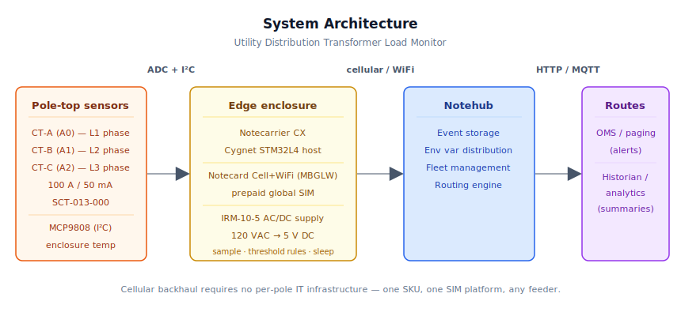
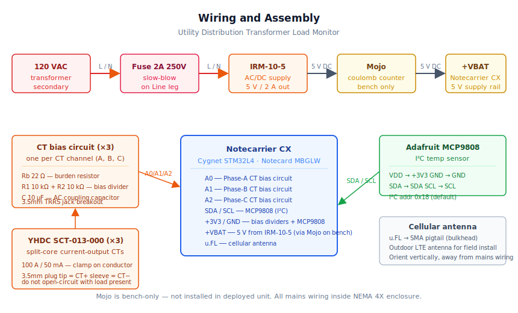

# Utility Distribution Transformer Load Monitor

<Note>

This reference application is intended to provide inspiration and help you get started quickly. It uses specific hardware choices that may not match your own implementation. Focus on the sections most relevant to your use case. If you'd like to discuss your project and whether it's a good fit for Blues, [feel free to reach out](https://blues.com/landing-pages/accelerators-contact-us/?accelerator=Utility%20Distribution%20Transformer%20Load%20Monitor).

</Note>

This project is an [energy monitoring](https://blues.com/solutions-energy-monitoring/) solution that gives utilities real-time load visibility at the pole — where transformer failures actually happen. A [Notecarrier CX](https://shop.blues.com/products/notecarrier-cx?utm_source=dev-blues&utm_medium=web&utm_campaign=store-link) with three split-core current transformers on the secondary terminals and an I²C temperature sensor tracks per-phase loading, detects dangerous current imbalances, and correlates load with enclosure temperature as a thermal-stress proxy — all over cellular, with no site infrastructure required.

> **Implementation scope: conventional split-core CTs and enclosure-internal temperature.** This reference design uses **conventional current-output split-core CTs** (YHDC SCT-013-000, 100 A / 50 mA) rather than flexible Rogowski-type coils, and an **enclosure-internal I²C temperature sensor** (MCP9808) as a thermal-stress proxy rather than a true outdoor ambient probe or a winding-contact sensor. Both choices reduce hardware complexity for the standard residential and commercial distribution transformer installation scenario. See [§11 Limitations](#11-limitations-and-next-steps) for rationale and the production path to both alternatives.

---

## 1. Project Overview

**The problem.** A distribution transformer is the last powered device between the high-voltage grid and a customer's service entrance. Utilities typically instrument their substations carefully — real-time SCADA, demand data, fault recorders, but the transformer hanging on the pole outside a neighborhood has none of that. The utility knows what's flowing into the substation; it doesn't know what's flowing through any individual transformer until something fails.

That ignorance is expensive. Distribution transformers age and fail for identifiable, preventable reasons: sustained overloading (insulation degrades with each degree of excess temperature), phase imbalance (uneven single-phase loads on a three-phase transformer create circulating currents and localized hot spots), and thermal stress from the combination of high ambient temperature and high loading. None of these conditions are sudden. They develop over hours to days, and a transformer that is running hot on a Tuesday will fail during Friday's peak demand — taking down a neighborhood and requiring an emergency truck roll that costs many times what proactive replacement would have.

This project puts an end to that ignorance. A handful of sensors clamped to the transformer secondary, a [Notecard](https://shop.blues.com/products/notecard-cellular?utm_source=dev-blues&utm_medium=web&utm_campaign=store-link) for the uplink, and a threshold-checking firmware loop turn an opaque pole-top asset into a continuously-monitored piece of equipment that tells the operations center what's happening in real time and pages the right people before the neighborhood goes dark.

**Why Notecard.** Utility poles are among the least connected pieces of infrastructure there is. They have no Ethernet, no building WiFi, and often nothing except the transformer's own secondary power. Cellular is the only practical backhaul. The Notecard Cell+WiFi variant (MBGLW) carries a prepaid SIM with 500 MB of data and 10 years of service — no per-site activation, no carrier contracts to negotiate, no IT ticket to file for network access. A utility deploying these monitors across its service territory can use a single SKU on every pole in every neighborhood, from dense urban blocks to rural feeders. The Notecard's automatic carrier selection handles varied network conditions without firmware changes.

<NewToBlues/>

The power picture tells the same story. Cellular removes the site infrastructure dependency entirely. The Notecard Cell+WiFi idles at [~18 µA @ 5V](https://dev.blues.io/notecard/notecard-walkthrough/low-power-firmware-design/) between samples while the host MCU is fully powered off, and the 5-minute sample / hourly transmit cadence means the radio wakes for roughly 20–30 seconds per hour — well within what a small AC/DC supply tapped from the transformer's own secondary can comfortably sustain.

**Deployment scenario.** A NEMA 4X weatherproof enclosure zip-tied or U-bolted to the transformer pole, powered from a small AC/DC supply connected to the 120VAC secondary, with three split-core CT leads exiting through weatherproof cable glands and clamped directly onto the secondary conductors.

CT installation is **non-invasive**: the split-core sensors clamp directly onto energized secondary conductors without breaking the circuit. The power supply connection is a separate matter — tapping the 120VAC secondary is live utility electrical work; depending on utility policy and local jurisdiction, this step may require a scheduled outage, a qualified hot-work procedure, or written utility approval before the tap is energized (see [§11 Limitations](#11-limitations-and-next-steps)). No invasive tap into the transformer case and no on-site network provisioning are required. A two-person crew, including an electrician qualified for live secondary work — can install and commission one unit in under an hour once all necessary work authorizations are in hand.

> **Power supply scope.** This reference design assumes an accessible 120VAC secondary tap — the standard case for North American single-phase distribution transformers installed by a qualified crew. Three-phase padmount transformers, sealed primary-side enclosures, or installations where utility rules prohibit tapping the secondary require an alternate power arrangement. See [§11 Limitations](#11-limitations-and-next-steps) for the inductive harvesting alternative.

---

## 2. System Architecture



**Device-side responsibilities.** The onboard Cygnet STM32L4 host on the Notecarrier CX wakes every 5 minutes (configurable), reads the configured CT channels (default: two for the common split-phase installation; set `phase_count=3` for three-phase) and the enclosure-internal I²C temperature sensor, runs three threshold checks in firmware, and queues results as [Notes](https://dev.blues.io/api-reference/glossary/#note) via the Notecard over I²C. Between wakes, the host is completely powered off by the Notecard's [`card.attn`](https://dev.blues.io/api-reference/notecard-api/card-requests/#card-attn) mechanism — the Notecard holds the host's power rail low until the wake interval expires, then fires ATTN to bring the host back up. All inter-wake state (summary accumulators, alert cooldown counters, elapsed time) is serialized to Notecard flash using `NotePayloadSaveAndSleep` before each sleep, and recovered with `NotePayloadRetrieveAfterSleep` on the next wake.

**Notecard responsibilities.** The Notecard stores [Notes](https://dev.blues.io/api-reference/glossary/#note) in its on-device queue, establishes the cellular (or WiFi) session on the [`hub.set`](https://dev.blues.io/api-reference/notecard-api/hub-requests/#hub-set) `outbound` cadence (default 60 minutes), and flushes any `sync:true` alert Notes immediately when they are queued. The Notecard also handles [environment variable](https://dev.blues.io/guides-and-tutorials/notecard-guides/understanding-environment-variables/) distribution from Notehub — operators re-tune thresholds in the field without re-flashing firmware, and the device picks them up on the next inbound sync. GNSS is available on supported Notecard hardware if a future revision needs one-time asset location, but it is not used in this design and enabling it has antenna, power, and additional cost implications not covered here.

**Notehub responsibilities.** The Notecard manages its own cellular session against the supported carrier networks worldwide via its embedded global SIM and delivers data to [Notehub](https://notehub.io) over the Internet; Notehub ingests events, stores them, and applies project-level routes. Two Notefiles carry the data out: `xfmr_summary.qo` (hourly, templated, suitable for long-term trending) and `xfmr_alert.qo` (event-triggered, immediate). Organizing devices into [Fleets](https://dev.blues.io/guides-and-tutorials/fleet-admin-guide/) by service territory or transformer rating lets fleet engineers set threshold [environment variables](https://dev.blues.io/guides-and-tutorials/notecard-guides/understanding-environment-variables/) that apply across all units in a group, while still allowing per-device overrides for unusual transformers. [Smart Fleet rules](https://dev.blues.io/notehub/notehub-walkthrough/#using-smart-fleet-rules) can automatically assign a Notecard to the correct fleet based on its reported data.

**Routing to the cloud (high level only).** Notehub supports HTTP, MQTT, AWS IoT Core, Azure IoT Hub, GCP Pub/Sub, Snowflake, and other destinations; route setup is project-specific. See the [Notehub routing docs](https://dev.blues.io/notehub/notehub-walkthrough/#routing-data-with-notehub) — this project ships no specific downstream endpoint. Alert and summary Notefiles are deliberately separate so each can be routed independently: alerts to an outage-management or on-call system with low-latency delivery, summaries to a historian or analytics store with higher-volume, batched ingest.

---

## 3. Technical Summary

**What you need:**
- Notecarrier CX + Notecard Cell+WiFi (MBGLW)
- 3× YHDC SCT-013-000 CTs + 3.5 mm jack breakouts
- Per-CT burden circuit: 22 Ω, 2× 10 kΩ, 10 µF cap (see §5)
- MCP9808 I²C temperature sensor
- 5V/2A AC/DC supply (e.g., MeanWell IRM-10-5)
- Computer with Arduino IDE or `arduino-cli`

**Bench validation (no live transformer needed):**
1. Assemble the three CT bias circuits on A0, A1, A2 (see §5 wiring diagram).
2. Connect MCP9808 to I²C (SDA/SCL).
3. Flash firmware: set `PRODUCT_UID` in `transformer_load_monitor.ino` to your Notehub project ID, then upload via USB.
4. Open serial monitor at 115200 baud. You should see `[sample] i_a=...` lines every 5 minutes.
5. Create a project in [Notehub](https://notehub.io) if you haven't — the Notecard auto-associates on first cellular connect.
6. After 60 minutes you'll see `[summary] queued` on serial. Wait for the device's next outbound sync (default hourly) and check Notehub **Devices → Events** for an `xfmr_summary.qo` entry.
7. Clamp a CT on a known 120VAC load (a lamp works well) and verify the current value in the summary matches the expected load (within ~5%).

---

Here is a sample Note this device emits:

```json
{
  "file": "xfmr_alert.qo",
  "body": {
    "alert":    "phase_imbalance",
    "i_a_rms":  91.4,
    "i_b_rms":  34.2,
    "i_c_rms":  88.7,
    "temp_c":   44.1,
    "extra":    62.6
  },
  "sync": true
}
```

## 4. Hardware Requirements

| Part | Qty | Rationale |
|------|-----|-----------|
| [Notecarrier CX](https://shop.blues.com/products/notecarrier-cx?utm_source=dev-blues&utm_medium=web&utm_campaign=store-link) | 1 | Integrated carrier with onboard Cygnet STM32L4 host — three ADC-capable analog pins for the CT channels, I²C for the temperature sensor, and ATTN-based host power control for deep sleep. No separate MCU needed. |
| [Notecard Cell+WiFi (MBGLW)](https://shop.blues.com/products/notecard-cell-wifi?utm_source=dev-blues&utm_medium=web&utm_campaign=store-link) ([datasheet](https://dev.blues.io/datasheets/notecard-datasheet/note-mbglw/)) | 1 | Cellular removes per-pole IT dependency; one SKU with a prepaid global SIM spans urban and rural feeders without carrier contracts or per-site activation. |
| [Blues Mojo](https://shop.blues.com/products/mojo?utm_source=dev-blues&utm_medium=web&utm_campaign=store-link) *(bench / commissioning only, optional)* | 1 | Coulomb counter for bench power-budget validation. Not shipped with the pole-mount unit — stays on the bench during commissioning. Optional; use to verify the device achieves expected current draw before field deployment. See [§9](#9-validation-and-testing) for the expected current trace to look for. |
| YHDC SCT-013-000 split-core CT, 100A / 50mA ([manufacturer product page](https://www.yhdc.com/en/product/SCT013-000/)) | 3 | Non-invasive, clip-on **current-output** CT. The 100A / 50mA variant covers residential distribution transformers up to approximately 20 kVA at 240V secondary (~83A full-load). For transformers at or above 25 kVA at 240V (~104A at full load), use a higher-range current-output CT; see the Note below. Interfaces directly with the resistor bias circuit; no integrator stage required. Widely available from Mouser and Amazon. |
| 22 Ω 1% resistor (burden, 1 per CT) | 3 | Converts the 50mA CT output to ~1.1V RMS at 100A — squarely within the Cygnet ADC's 0–3.3V input range after biasing. |
| 10 kΩ 1% resistor (bias divider, 2 per CT) | 6 | Creates the Vcc/2 (~1.65V) DC bias point that centers the AC CT signal within the ADC input range. |
| 10 µF electrolytic capacitor (1 per CT) | 3 | AC-couples the CT signal to the bias node; blocks DC from the bias network leaking back into the CT. |
| 3.5mm TRRS audio jack breakout (1 per CT) | 3 | The SCT-013-000 terminates in a 3.5mm plug; a breakout board avoids cutting the cable. |
| [Adafruit MCP9808 High Accuracy I2C Temperature Sensor Breakout #1782](https://www.adafruit.com/product/1782) | 1 | ±0.25°C accuracy over –40°C to +125°C, I²C bus, 2.7–5.5V supply — ideal for enclosure thermal monitoring. No additional analog pins consumed. |
| AC/DC supply, 5V/2A (e.g. [MeanWell IRM-10-5](https://www.meanwell.com/Upload/PDF/IRM-10/IRM-10-SPEC.PDF)) | 1 | Compact PCB-mount supply derives 5V DC from the transformer's 120VAC secondary. The IRM-10-5 (10W, 2A continuous) provides adequate rating to sustain cellular sessions that can peak at ~2A; the smaller IRM-05-5 (1A) is insufficient for reliable cellular operation. |
| 2A 250V slow-blow fuse, 5×20 mm (e.g. Littelfuse 218002) | 1 | Protects the 120VAC tap to the IRM-10-5 supply. Required on the Line leg; install in a panel-mount or PCB fuse holder rated for 250VAC. |
| 5×20 mm fuse holder, 250VAC rated | 1 | Mounts the slow-blow fuse on the Line conductor inside the enclosure. |
| Cellular stub antenna *(bench / commissioning only, included with Notecarrier CX dev kit)* | 1 | Adequate for bench bring-up and indoor testing. Not suitable for permanent outdoor pole-mount deployment. |
| Outdoor cellular antenna, 700–2700 MHz, SMA *(deployment)*, e.g., [SparkFun WRL-14987](https://www.sparkfun.com/products/14987) | 1 | Replaces the bench stub for installed units; choose a part rated for outdoor temperature range and UV exposure. See [§5](#5-wiring-and-assembly) for enclosure-dependent placement guidance. |
| u.FL-to-SMA bulkhead pigtail, ≈100 mm, e.g., Taoglas CA-05250003 or equivalent | 1 | Routes the Notecard's u.FL antenna port to the externally-mounted SMA antenna. Required for all pole-mount deployments using the outdoor SMA antenna; also serves as the bulkhead lead through the enclosure wall for metal enclosures. |
| NEMA 4X enclosure, ~6×4×2″ | 1 | Weatherproof housing for outdoor pole-mount. Fiberglass or polycarbonate variants are lighter than steel and don't attenuate the cellular antenna. |

All Blues hardware ships with an active SIM including 500 MB of data and 10 years of service — no activation fees, no monthly commitment.

> **CT current range Note.** The SCT-013-000 rated at 100A suits transformers up to approximately 20 kVA at 240V secondary (~83A full-load, with ~17% headroom to the CT's 100A rated output). A common 25 kVA unit draws ~104A at full load — 4% above the CT's rating; use a higher-range current-output CT for transformers at or above 25 kVA. Larger transformers (50–167 kVA) draw 200–400A and require a higher-range **current-output** CT such as the YHDC SCT-036-200 (200A/50mA); update `CT_TURNS_RATIO` and `CT_BURDEN_OHMS` in firmware accordingly. Voltage-output CTs (such as the YHDC SCT-019-200, which produces 0.333V full-scale from an internal burden) are **not** drop-in replacements — they do not interface with the external bias circuit above and require a different analog front end. See [§11 Limitations](#11-limitations-and-next-steps) for the production path.

<Warning>

**POC protection scope.** The BOM above provides primary overcurrent protection (the slow-blow fuse) and nothing else on the 120VAC mains entry. For a bench prototype or controlled field trial this is adequate starting hardware, but it is **not a complete protection story for a permanent outdoor pole-mount installation.** A production design must add: a surge protective device (SPD) rated for the installation's overvoltage category (Category C / lightning-level, per IEC 61643-11 or UL 1449) on the Line/Neutral entry; enclosure grounding and bonding to the pole ground system per applicable NEC sections and utility rules; verified creepage and clearance in all mains-voltage wiring and connectors; UV and temperature qualification of all external cabling and the enclosure; and written utility approval before the secondary tap is permanently energized. Component selection for all of the above is installation-specific and outside this POC's scope. See [§5](#5-wiring-and-assembly) and [§11](#11-limitations-and-next-steps) for further discussion.

</Warning>

---

## 5. Wiring and Assembly



All host I/O lands on the [Notecarrier CX](https://dev.blues.io/datasheets/notecarrier-datasheet/notecarrier-cx-v1-3/) dual 16-pin header. The Notecard Cell+WiFi (MBGLW) seats into the carrier's M.2 slot. The Mojo, if used for bench validation, sits inline between the 5V supply and the Notecarrier's +VBAT pad; connect its Qwiic cable to any available Qwiic port on the Notecarrier so it can log charge to the Notecard. The transformer firmware does not poll the Mojo — its coulomb-count readings appear as separate Notecard events in Notehub and are a bench commissioning tool only; the Mojo is not installed in the deployed unit.

### Bias circuit (build once per CT channel, identical for A, B, and C)

Each CT channel requires a small passive network that converts the CT's AC current to a voltage centred at Vcc/2 so it sits squarely within the Cygnet ADC's 0–3.3V input range.

```
(per channel — repeat for A0, A1, A2)

 +3V3
   │
 R1 10 kΩ          ← top half of bias divider
   │
   ├─────────────────── ADC pin (A0 / A1 / A2)
   │                         │
 R2 10 kΩ          ←  C 10 µF (+ plate toward ADC pin)
   │                         │
  GND                   CT+ (TRRS tip)
                              │
                         Rb 22 Ω   ← burden resistor
                              │
                    CT– (TRRS sleeve) ──── GND
```

**How it works:**
- **Burden (Rb, 22 Ω):** The SCT-013-000 is a current-output CT; Rb converts its 50 mA RMS rated output to approximately 1.1 V RMS (≈1.56 V peak swing) at 100 A RMS primary current. Rb is wired directly across the CT output terminals (tip to sleeve).
- **Bias divider (R1 + R2, 10 kΩ each):** Splits +3.3V to establish a DC bias of ≈1.65V (Vcc/2) at the ADC pin. This centres the AC signal within the ADC's single-supply input range.
- **Coupling capacitor (C, 10 µF electrolytic):** AC-couples CT+ to the ADC pin. The positive plate faces the ADC pin (higher DC potential, ≈1.65 V); the negative plate faces CT+ (≈0 V DC). C passes the AC signal to the ADC pin while blocking DC from disrupting the bias point.
- Each CT channel needs its own R1, R2, C, and Rb — do not share bias nodes or burden resistors across channels.

### Pin-by-pin connections

- **+3V3** → R1 top leg of each bias circuit; MCP9808 `VDD`.
- **GND** → R2 bottom leg of each bias circuit; CT– (TRRS sleeve) of each jack; MCP9808 `GND`.
- **A0** → bias-divider mid-point (junction of R1 and R2) and positive plate of C for the Phase-A channel. The negative plate of C connects to CT+ (TRRS tip). CT+ also connects to one leg of Rb (22 Ω); the other leg of Rb connects to GND / CT–.
- **A1** → same circuit, Phase-B CT.
- **A2** → same circuit, Phase-C CT. For split-phase installations (L1/L2 on A0/A1), leave A2 unconnected — the firmware defaults to `phase_count=2`, so no env var change is needed and the unconnected channel is never sampled. For three-phase installations, wire this bias circuit and set `phase_count=3` in Notehub before first power-on (see [§6](#6-notehub-setup)); without that setting, A2 is never read and imbalance calculations are incomplete.
- **SDA** → MCP9808 `SDA` (Notecarrier CX has on-board 4.7 kΩ pull-ups on the I²C bus).
- **SCL** → MCP9808 `SCL`.
- **+VBAT** → Mojo `LOAD` output (bench only); Mojo `BAT` input → 5V from the IRM-10-5 supply.
- **IRM-10-5 LINE/NEUTRAL** → 120VAC tapped from the transformer secondary. The Line conductor must pass through a 2A 250V slow-blow fuse (in a rated fuse holder) before reaching the supply.

### Cellular antenna

Connect the cellular antenna to the Notecard Cell+WiFi (MBGLW) u.FL port on the front edge of the Notecard. The Blues development kit includes a compatible stub antenna; for permanent pole-mount installations, a dedicated LTE antenna rated for outdoor use is preferred.

Placement guidelines:
- **Polycarbonate or fiberglass NEMA 4X enclosure:** the antenna can mount inside the enclosure on a standoff or against the lid. RF penetrates these materials with negligible loss.
- **Steel or aluminium enclosure:** run a u.FL-to-SMA pigtail to a bulkhead-mount SMA antenna on the outside wall of the enclosure. Steel fully blocks the cellular signal from the inside.
- Orient the antenna element vertically (parallel to the pole) for the best cellular radiation pattern.
- Route the antenna cable away from the transformer core, primary conductors, and the 120VAC supply wiring to avoid coupling noise into the RF path.

### 3.5mm TRRS jack wiring

The SCT-013-000 uses a 3.5mm plug with tip = CT+ and sleeve = CT–. Wire the breakout board:
- Tip → one end of the 22Ω burden (Rb) and to the AC coupling capacitor top plate
- Sleeve → GND (and the other end of Rb)

### CT installation

Clamp each CT around a single secondary conductor, never around two conductors simultaneously, as the fields would cancel. For a single-phase (120/240V center-tap) transformer, clamp the Phase-A CT on the **X1** secondary conductor (L1 hot leg) and the Phase-B CT on the **X3** secondary conductor (L2 hot leg). **X2 is the center-tap neutral** — do not monitor X2 unless neutral current is an intentional additional metric; clamping one CT on X1 and the other on X2 would monitor one hot leg and the neutral, not the L1/L2 pair. For a three-phase transformer, clamp each CT on one secondary phase conductor. The third CT slot (A2/Phase-C) can be left unconnected for split-phase installations; the firmware defaults to `phase_count=2`, so no env var change is required. For three-phase installations, clamp the Phase-C CT on the third secondary conductor and set `phase_count=3` in Notehub before first power-on — without that setting, A2 is never sampled and any C-phase overload or imbalance contribution is invisible to the firmware.

> ⚠️ **CT open-circuit hazard.** The SCT-013-000 is a **current-output** CT. Never disconnect the 22Ω burden resistor or unplug a CT jack while the CT is clamped on an energized conductor. An open-circuited current-output CT can develop dangerous high voltages across its terminals. Always verify the burden resistor is in-circuit before clamping the CT onto a live conductor; always remove the CT from the conductor before disturbing the burden wiring or disconnecting the 3.5mm jack.
>
<Warning>

**Safety.** Distribution transformer secondary conductors carry lethal voltages. Installation must be performed by qualified electrical workers with appropriate PPE, following utility safety procedures and applicable codes. This firmware is read-only — it never commands any switching of the transformer or its connected loads. The CTs are non-invasive and clamp without breaking the circuit, but proximity to energized conductors remains hazardous.

</Warning>

> ⚠️ **Surge and transient protection (POC omission).** The 2A slow-blow fuse protects the IRM-10-5 supply against a sustained short but does not suppress lightning-induced transients or switching surges, which are routinely present on distribution transformer secondaries. For bench bring-up this is acceptable; for any unit intended for permanent pole-mount deployment, install a surge protective device (SPD) rated for the site's overvoltage category (Category C / lightning-level, per IEC 61643-11 or UL 1449) across Line/Neutral ahead of the fuse holder. Bond the enclosure to the pole grounding system and verify conductor routing, creepage/clearance distances, and any utility-specific installation approval requirements before energizing the tap. See [§11](#11-limitations-and-next-steps) for the full list.

---

## 6. Notehub Setup

1. **Create a project.** Sign up at [notehub.io](https://notehub.io) and create a project. Copy the [ProductUID](https://dev.blues.io/notehub/notehub-walkthrough/#finding-a-productuid) (format: `com.your-company.your-name:xfmr-monitor`) and set it as `PRODUCT_UID` in the firmware before flashing.

2. **Claim the device.** Power the assembled unit. On first cellular connect, the Notecard associates with your project automatically — no manual claim required. The device appears in the **Devices** tab within a minute or two.

3. **Create a Fleet per service territory.** [Fleets](https://dev.blues.io/guides-and-tutorials/fleet-admin-guide/) group devices for shared configuration. The natural unit is one fleet per transformer class or service territory — all 25-kVA residential transformers in a feeder get the same rated-amps threshold, while 50-kVA commercial units get a different one. Fleet-level [environment variables](https://dev.blues.io/guides-and-tutorials/notecard-guides/understanding-environment-variables/) propagate to every device in the fleet without re-flashing.

4. **Set environment variables.** In Notehub: **Fleet → Environment** (or **Device → Environment** for a per-unit override). All variables are optional for split-phase (L1/L2) installations — the firmware defaults are set for that common case. **Three-phase installations must set `phase_count=3` and force an inbound sync before live monitoring begins**; with the default `phase_count=2` on a three-phase transformer, the A2/Phase-C channel is never read, and any C-phase overload or imbalance contribution is invisible to the firmware. The device picks up all other env var changes on its next inbound sync (default every 2 hours) with no truck roll.

   | Variable | Default | Purpose |
   |---|---|---|
   | `sample_interval_sec` | `300` | Seconds between sensor readings (minimum 30). |
   | `summary_interval_min` | `60` | Minutes between summary Notes. Changing this also re-applies `hub.set` to match the Notecard's outbound cadence. |
   | `rated_amps` | `100.0` | Transformer secondary rated amps **per phase**. The default matches the 100A SCT-013-000 CT range. Set to the nameplate-derived secondary current (kVA rating ÷ secondary voltage), e.g., `83` for a 20-kVA / 240V unit or `62` for a 15-kVA / 240V unit. A 25-kVA / 240V transformer draws ~104A at full load, which exceeds the default CT's 100A rating; swap in a higher-range current-output CT and set this value to the transformer's actual nameplate current before deploying on transformers at or above 25 kVA. |
   | `overload_pct` | `95.0` | Any single phase exceeding this percentage of `rated_amps` triggers an `overload` alert. |
   | `imbalance_pct_thresh` | `20.0` | (max_phase − min_phase) / max_phase above this percentage triggers a `phase_imbalance` alert. Only evaluated when at least one phase is carrying >2A. |
   | `temp_alert_c` | `70.0` | Enclosure temperature (°C) above which a `high_temp` alert fires. Typical enclosure internal temperature limit is 50–65°C; 70°C is a conservative field alert. |
   | `alert_cooldown_sec` | `1800` | Minimum seconds between successive alerts of the same type (default 30 minutes). Prevents alert storms on a slow-drifting condition. |
   | `phase_count` | `2` | Number of active CT channels (1–3). The default `2` matches the common split-phase (L1/L2 on A0/A1) installation — no env var change needed out of the box. **Set to `3` for three-phase transformers** (A0/A1/A2 all wired) before first power-on; without this, A2 is never read. Set to `1` for single-leg monitoring. Imbalance is only meaningful across two or more phases; with `phase_count=1`, `imbalance_pct` is always reported as 0.0 in both real-time alerts and summary Notes. With `phase_count=2`, L1 and L2 are compared without the unconnected C channel (always 0A) inflating the imbalance reading. |

5. **Configure routes.** Add one [route](https://dev.blues.io/notehub/notehub-walkthrough/#routing-data-with-notehub) for `xfmr_alert.qo` (to an outage-management system, on-call paging, or CMMS endpoint) and a second for `xfmr_summary.qo` (to a long-term store or analytics platform). Keeping the two Notefiles separate means each can be fanned out to a different destination at a different urgency without filter logic in the route.

### What you should see in Notehub

**Note:** Template fields use numeric type hints to encode type and size: `14.1` = 4-byte IEEE-754 float; `12` = 2-byte signed integer. This compact binary format is decoded automatically by Notehub.

- **`_session.qo`** — Notecard session housekeeping on each cellular connect. If this is showing up, the radio link is healthy.
- **`xfmr_summary.qo`** — one per `summary_interval_min`. Annotated example payload (field comments are explanatory, actual JSON contains no comments):
  ```
  {
    "i_a_rms":       47.3,   // phase-A mean RMS over loaded sample intervals only (A) — see §11
    "i_b_rms":       44.8,   // phase-B mean RMS over loaded sample intervals (A)
    "i_c_rms":       49.1,   // phase-C mean RMS over loaded sample intervals (A)
    "i_total":      141.2,   // sum of per-phase loaded-interval means (A)
    "loading_pct":   39.2,   // i_total / (rated_amps × phase_count) × 100; excludes idle intervals
    "imbalance_pct":  9.0,   // (max_phase − min_phase) / max_phase × 100; from loaded-interval means
    "temp_c":        38.5,   // mean enclosure temperature over valid temperature readings (°C)
    "overloads":       0,    // sample intervals during which any phase exceeded the overload threshold
    "samples":        12,    // loaded sample intervals (at least one phase above the noise floor)
    "total_wakes":   12      // all host wakes in the window (loaded + idle)
  }
  ```
  `overloads` counts **sample intervals** during which any phase exceeded the overload threshold, not distinct overload events. A single sustained overload lasting the full summary window at the default 5-minute sample rate would report `overloads: 12`. `samples` counts only intervals in which at least one phase was above the 0.5 A noise floor; `total_wakes` counts every host wake regardless of load. For time-weighted utilization analytics, multiply `loading_pct` by `samples / total_wakes` to account for idle intervals (see [§11](#11-limitations-and-next-steps)).
- **`xfmr_alert.qo`** — emitted only on a threshold trip, transmitted immediately. The `alert` field is one of `overload`, `phase_imbalance`, or `high_temp`.

---

## 7. Firmware Design

The firmware lives in the sketch directory [`firmware/transformer_load_monitor/`](firmware/transformer_load_monitor/) and is split across three files that must be compiled together:

| File | Role |
|---|---|
| [`transformer_load_monitor.ino`](firmware/transformer_load_monitor/transformer_load_monitor.ino) | Main sketch — `setup()`, `loop()`, global declarations |
| [`transformer_load_monitor_helpers.h`](firmware/transformer_load_monitor/transformer_load_monitor_helpers.h) | Shared constants, structs, and function prototypes |
| [`transformer_load_monitor_helpers.cpp`](firmware/transformer_load_monitor/transformer_load_monitor_helpers.cpp) | All helper function implementations |

The Arduino IDE and `arduino-cli` automatically compile every `.ino`, `.h`, and `.cpp` file in the same sketch folder together — always open or target the **folder** (`firmware/transformer_load_monitor/`), not an individual source file.

### 7.1 Installing and flashing

**Dependencies:**

- **Arduino core for STM32** — [`stm32duino/Arduino_Core_STM32`](https://github.com/stm32duino/Arduino_Core_STM32). Add the board index URL `https://github.com/stm32duino/BoardManagerFiles/raw/main/package_stmicroelectronics_index.json` under **File → Preferences → Additional Boards Manager URLs**, then install "STM32 MCU based boards." Select **Blues Cygnet** as the board (canonical FQBN: `STMicroelectronics:stm32:Blues:pnum=CYGNET`).
- **`Blues Wireless Notecard`** library ([`note-arduino`](https://github.com/blues/note-arduino)) — Install via the Arduino Library Manager (search "Blues Wireless Notecard") or `arduino-cli lib install "Blues Wireless Notecard"`.
- **`Adafruit MCP9808 Library`** — install via the Arduino Library Manager (search "MCP9808"). Requires the Adafruit BusIO dependency, which the Library Manager installs automatically.

**Flashing — Arduino IDE:** use **File → Open…** and select the folder `firmware/transformer_load_monitor/` (or double-click `transformer_load_monitor.ino`, the IDE loads all three files from the folder automatically). Select the Cygnet board, click **Upload**. The Notecarrier CX exposes the ST-Link interface on the same USB cable, so no external programmer is needed.

**Flashing — `arduino-cli`:**
```bash
# Install the STM32 core and libraries first if not already done
arduino-cli core install STMicroelectronics:stm32
arduino-cli lib install "Blues Wireless Notecard" "Adafruit MCP9808 Library"

# List installed Cygnet FQBNs for your specific core version
arduino-cli board listall | grep -i cygnet

# Compile and upload — target the sketch folder so all three source files
# are included (substitute the FQBN reported above; /dev/cu.usbmodem* for Mac, /dev/ttyACM* for Linux)
arduino-cli compile -b STMicroelectronics:stm32:Blues:pnum=CYGNET firmware/transformer_load_monitor
arduino-cli upload  -b STMicroelectronics:stm32:Blues:pnum=CYGNET -p /dev/cu.usbmodem* firmware/transformer_load_monitor
```

After flashing, open the serial monitor at **115200 baud**. On first boot you should see `[sample] i_a=...` lines every `sample_interval_sec` seconds (default 5 minutes). After `summary_interval_min` minutes (default 60) you will see `[summary] queued (0 loaded / 12 total wakes)` if no CT is connected — the summary Note is queued to the Notecard's local on-device store at that point; it reaches Notehub on the next outbound cellular sync (default 60 minutes later). The summary is always emitted as a liveness heartbeat even with no load. When CTs are clamped on live conductors the sample lines show non-zero current values and the summary line reports the number of loaded intervals versus total wakes in that window.

### 7.2 Firmware constants and environment variables

The firmware defines several key tuning constants in `transformer_load_monitor_helpers.h`:

| Constant | Default | Meaning |
|---|---|---|
| `CT_SCALE` | `(3.3/4096) × (2000/22)` | Converts raw ADC counts to primary amps. Numerator (2000/22) is the scale inverse of the 22 Ω burden at 100A CT rating; denominator 4096 is 12-bit ADC count range; 3.3V is supply. Use this formula as-is for the SCT-013-000 100A CT with 22 Ω burden. For higher-range CTs, recompute: (supply_v / adc_max_counts) × (ct_rated_ma / burden_ohms). |
| `CT_TURNS_RATIO` | `1.0` | Nameplate ratio (primary amps / secondary amps). For SCT-013-000 = 1.0. Higher-range CTs change this; e.g., SCT-036-200 has ratio ~4.0. |
| `CT_BURDEN_OHMS` | `22` | Burden resistor value. Change this only if you substitute a different burden; also update `CT_SCALE` if changed. |
| `CT_NOISE_FLOOR_A` | `0.5` | Current values below this (in amps) are zeroed to suppress noise floor pickup. Increase to 1.0 if you see non-zero readings with no load. |
| `CT_SAMPLE_PERIOD_US` | `225` | Pacing interval (microseconds) between ADC samples. 225 microseconds = ~4.44 kHz sampling; ~333 milliseconds window for RMS = ~20 mains cycles at 60 Hz. Do not change unless you understand the mains-cycle alignment issue described in §7.3. |

### 7.3 Modules

| Responsibility | Function |
|---|---|
| Notecard configuration (`hub.set`, `note.template`, `card.motion.mode`) | `hubConfigure`, `defineTemplates` |
| Environment variable fetch + clamp | `fetchEnvOverrides`, `envFloat`, `envU32` |
| Re-apply `hub.set` on summary-interval change | `fetchEnvOverrides` (static guard) |
| CT RMS measurement (two-pass ADC sampling) | `readCtRms` |
| Temperature reading via MCP9808 | `readTemperatureC` |
| Alert threshold evaluation | `checkAlerts` |
| Alert Note emission (`sync:true`) | `sendAlert` |
| Hourly summary Note emission | `sendSummary` |
| Persistent state save + host sleep | `NotePayloadSaveAndSleep` (library helper) |
| State restore on wake | `NotePayloadRetrieveAfterSleep` (library helper) |

### 7.4 Sensor reading strategy

**CTs.** Each SCT-013-000 produces an AC current signal proportional to the line current flowing through its core. The external 22Ω burden resistor converts this to an AC voltage of approximately 1.1 V RMS (≈1.56 V peak) at 100 A RMS primary current, centered on the ADC's DC bias point (~1.65V = Vcc/2). The firmware uses a two-pass algorithm: 256 samples establish the actual DC offset (which may drift slightly from Vcc/2 due to component tolerance), then 1480 samples compute the RMS of the centred signal. Both passes pace samples to a fixed 225 microseconds period (≈4.44 kHz) using `micros()` and `delayMicroseconds()`, so the 1480-sample RMS window spans a deterministic ~333 milliseconds — approximately 20 mains cycles at 60 Hz, or ~16.7 cycles at 50 Hz. Without that pacing, the Cygnet ADC's native single-digit-µs throughput would finish the burst in well under one full mains cycle and produce RMS values that drift with whichever waveform fragment was captured. Three channels are read sequentially; total active measurement time is approximately 1 second. The scale factor `CT_SCALE = (3.3/4096) × (2000/22)` converts ADC RMS counts directly to primary amps. Readings below 0.5 A are zeroed to suppress noise-floor pickup.

**Temperature.** The Adafruit MCP9808 is initialized on every wake (since host power is fully cycled by `card.attn`), configured to 0.0625°C resolution, read once, and put to shutdown mode before the host sleeps. An absent or unresponsive sensor returns –999.0°C. The firmware tracks a separate `valid_temp_samples` counter that increments only when the reading passes the –40°C to +125°C sanity range; the summary average divides `sum_temp_c` by that counter rather than by total wake cycles. A window with zero valid temperature readings emits –999.0°C in the summary rather than a biased-low average. The Notecarrier CX's on-board I²C pull-ups are shared by the MCP9808 and the Notecard on the same bus — no external resistors are needed.

### 7.5 Event payload design

One [template-backed](https://dev.blues.io/notecard/notecard-walkthrough/low-bandwidth-design#working-with-note-templates) Notefile for summaries (`xfmr_summary.qo`), one untemplated Notefile for alerts (`xfmr_alert.qo`). Templates trade flexibility for efficiency: the Notecard stores fixed-length binary records internally and the wire payload is ~3–5× smaller than free-form JSON, which matters across a fleet that may transmit daily summaries for a decade.

Sample alert body (phase imbalance event):
```json
{
  "file": "xfmr_alert.qo",
  "body": {
    "alert":    "phase_imbalance",
    "i_a_rms":  91.4,
    "i_b_rms":  34.2,
    "i_c_rms":  88.7,
    "temp_c":   44.1,
    "extra":    62.6
  },
  "sync": true
}
```
The `extra` field carries alert-type-specific context: for `overload` it is the loading percentage of the worst phase; for `phase_imbalance` it is the computed imbalance percentage (max−min)/max; for `high_temp` it is the total current across all phases at the time of the alert.

### 7.6 Low-power strategy

The device is grid-tied (120VAC tap on the transformer secondary), so energy budget is not life-critical, but the sleep pattern matters anyway. Keeping the host off between samples eliminates a continuous 50–80mA baseline, reduces enclosure heat buildup, and makes the power profile immediately legible on a Mojo trace during bench validation.

After each sample cycle the host calls `NotePayloadSaveAndSleep`, which serializes the `PersistState` struct to Notecard flash and issues [`card.attn`](https://dev.blues.io/api-reference/notecard-api/card-requests/#card-attn) in sleep mode to cut host power for `sample_interval_sec` seconds. On the next wake, the Notecarrier re-powers the host; `NotePayloadRetrieveAfterSleep` pulls the saved struct back and execution continues where it left off. From the firmware author's perspective, the sleep call is a single function call — the Notecard manages the power rail.

The Notecard Cell+WiFi itself idles at [~18 µA @ 5V](https://dev.blues.io/notecard/notecard-walkthrough/low-power-firmware-design/) between cellular sessions. Alert Notes with `sync:true` bypass the outbound queue and wake the radio immediately; summary Notes accumulate in the on-device queue and are flushed together once per hour.

### 7.7 Retry and error handling

- The first Notecard transaction (`hub.set` on cold boot) uses `sendRequestWithRetry(req, 5)` to handle the cold-boot I²C race the `note-arduino` library documents.
- Individual `env.get` calls return the default value if the Notecard returns NULL or an empty `text` field. Config values are then clamped to sane ranges (e.g., `sample_interval_sec` floored at 30 seconds) to guard against a misconfigured env var causing erratic behavior.
- CT readings below the 0.5 A noise floor are zeroed; sample intervals where no phase exceeds the noise floor are excluded from current accumulation via the `valid_samples` counter, making the per-phase RMS averages *loaded-interval averages* rather than true time-weighted window averages. The `total_wakes` field in the summary payload records all host wakes (loaded + idle), so dividing `samples` by `total_wakes` gives the fraction of the window that carried detectable load — useful for utilization weighting (see [§11](#11-limitations-and-next-steps)). A summary window with zero valid CT samples still emits a `xfmr_summary.qo` Note with zero current fields and `samples: 0`, confirming the device is alive even when no load is detectable on the CTs.
- Alert cooldown counters per alert type (default 6 cycles = 30 minutes at 5-min sample rate) prevent a sustained overload condition from paging the operations center every 5 minutes. Each alert type arms and disarms independently.
- `fetchEnvOverrides` updates the `hub.set` outbound period if `summary_interval_min` has changed since the last successful fetch, keeping the Notecard's transmit timer synchronized with the firmware's summary window.

### 7.8 Key code snippet 1: Note template definition

Template fields use [numeric type hints](https://dev.blues.io/notecard/notecard-walkthrough/low-bandwidth-design#working-with-note-templates): `14.1` means 4-byte IEEE-754 float; `12` means 2-byte signed integer.

```cpp
J *req = notecard.newRequest("note.template");
JAddStringToObject(req, "file", "xfmr_summary.qo");
JAddNumberToObject(req, "port", 50);
J *body = JAddObjectToObject(req, "body");
JAddNumberToObject(body, "i_a_rms",       14.1);
JAddNumberToObject(body, "i_b_rms",       14.1);
JAddNumberToObject(body, "i_c_rms",       14.1);
JAddNumberToObject(body, "i_total",       14.1);
JAddNumberToObject(body, "loading_pct",   14.1);
JAddNumberToObject(body, "imbalance_pct", 14.1);
JAddNumberToObject(body, "temp_c",        14.1);
JAddNumberToObject(body, "overloads",     12);
JAddNumberToObject(body, "samples",       12);  // loaded intervals
JAddNumberToObject(body, "total_wakes",   12);  // all wakes (loaded + idle)
notecard.sendRequest(req);
```

### 7.9 Key code snippet 2: CT RMS two-pass algorithm

Pass 1 determines the actual DC bias offset (should be ~2048 counts for a well-built circuit; the measured value accounts for component tolerance). Pass 2 computes RMS of the centered AC signal using float accumulation to avoid 32-bit integer overflow at full-scale input. Both passes pace samples to a fixed 225 microseconds period so the RMS burst spans a deterministic ~333 milliseconds (≈20 mains cycles at 60 Hz) regardless of the host ADC's native throughput. See [§7.4](#74-sensor-reading-strategy) for why this matters.

```cpp
float readCtRms(uint8_t pin) {
    // Pass 1: establish DC offset (paced sampling — see §7.3).
    long sum = 0;
    uint32_t next_us = micros();
    for (int i = 0; i < CT_DC_SAMPLES; i++) {
        sum += analogRead(pin);
        next_us += CT_SAMPLE_PERIOD_US;
        int32_t wait = (int32_t)(next_us - micros());
        if (wait > 0 && wait < (int32_t)CT_SAMPLE_PERIOD_US) {
            delayMicroseconds((uint32_t)wait);
        }
    }
    int offset = (int)(sum / CT_DC_SAMPLES);

    // Pass 2: AC RMS over ~333 ms (≈20 mains cycles at 60 Hz).
    float sum_sq = 0.0f;
    next_us = micros();
    for (int i = 0; i < CT_RMS_SAMPLES; i++) {
        float s = (float)(analogRead(pin) - offset);
        sum_sq += s * s;
        next_us += CT_SAMPLE_PERIOD_US;
        int32_t wait = (int32_t)(next_us - micros());
        if (wait > 0 && wait < (int32_t)CT_SAMPLE_PERIOD_US) {
            delayMicroseconds((uint32_t)wait);
        }
    }
    float i_rms = sqrtf(sum_sq / CT_RMS_SAMPLES) * CT_SCALE;
    return (i_rms < CT_NOISE_FLOOR_A) ? 0.0f : i_rms;  // zero noise floor
}
```

### 7.10 Key code snippet 3: immediate-sync alert

`sync:true` tells the Notecard to skip the outbound queue timer and open a cellular session immediately. On cellular the alert typically reaches Notehub within 15–60 seconds of the threshold trip.

```cpp
J *req = notecard.newRequest("note.add");
JAddStringToObject(req, "file", "xfmr_alert.qo");
JAddBoolToObject(req,   "sync", true);
J *body = JAddObjectToObject(req, "body");
JAddStringToObject(body, "alert",    "phase_imbalance");
JAddNumberToObject(body, "i_a_rms",  i_a);
JAddNumberToObject(body, "i_b_rms",  i_b);
JAddNumberToObject(body, "i_c_rms",  i_c);
JAddNumberToObject(body, "temp_c",   temp_c);
JAddNumberToObject(body, "extra",    imbalance_pct);
notecard.sendRequest(req);
```

### 7.11 Key code snippet 4: sleep and state persistence

After sending any queued Notes, the host serializes its runtime state to the Notecard and cuts its own power for the next sample interval. On the next ATTN wake, `NotePayloadRetrieveAfterSleep` restores the struct; execution re-enters `setup()` from the top.

```cpp
NotePayloadDesc out = {0, 0, 0};
NotePayloadAddSegment(&out, SEG_ID, &state, sizeof(state));
NotePayloadSaveAndSleep(&out, cfg.sample_interval_sec, NULL);
// Execution does not continue past here under normal operation.
```

---

## 8. Data Flow


Every 5 minutes (`sample_interval_sec`), the host wakes, reads the configured CT channels (A0 always; A1 when `phase_count≥2`; A2 when `phase_count=3`) and the temperature sensor, and evaluates three threshold rules against the freshly-read values and accumulated history.

**Collected.** Per-phase RMS current (A) on phases A, B, and C; enclosure temperature (°C); total CT current (sum of phases); derived loading percentage; derived phase-imbalance percentage; count of overloaded sample intervals in the current summary window.

**Transmitted:**
- `xfmr_summary.qo` — one record per `summary_interval_min` (default 24 records/day), containing per-phase means over *loaded* sample intervals (intervals in which at least one phase exceeded the 0.5 A noise floor), mean enclosure temperature, count of overloaded sample intervals, number of loaded samples (`samples`), and total host wakes in the window (`total_wakes`). Template-encoded; queued and flushed by the Notecard's hourly outbound sync. Multiply `loading_pct` by `samples / total_wakes` to recover the true time-weighted window average (see [§11](#11-limitations-and-next-steps)).
- `xfmr_alert.qo` — emitted immediately on threshold trip, with `sync:true` to bypass the outbound interval. Each alert type has a 30-minute cooldown to prevent alert storms.

**Triggers.** Three independent rules:
- **`overload`** — any single phase exceeds `rated_amps × (overload_pct / 100)`. The `extra` field carries the peak phase's loading percentage. A transformer persistently above 95% of nameplate rating faces insulation aging that shortens its service life measurably.
- **`phase_imbalance`** — `(max_phase − min_phase) / max_phase` exceeds `imbalance_pct_thresh` while at least one phase is above 2A. The imbalance check is skipped entirely when `phase_count=1` (single-leg mode); `imbalance_pct` is always 0.0 in both the real-time alert path and the summary average. With `phase_count=2`, only L1 and L2 are compared — the unconnected C channel (always 0A) is excluded from the min/max calculation. The `extra` field carries the computed imbalance percentage. On three-phase transformers, phase imbalance generates negative-sequence currents that heat the core, waste capacity, and can push a lightly-loaded phase into overvoltage.
- **`high_temp`** — enclosure temperature exceeds `temp_alert_c`. The `extra` field carries the total current across all phases at the time of the alert. Temperature combined with load is the primary mechanism of accelerated transformer aging; the Arrhenius rule of thumb says every 10°C above design temperature halves insulation life.

**Routed.** Both Notefiles flow through Notehub. From there, operators configure routes to send `xfmr_alert.qo` to an outage-management system or on-call paging tool and `xfmr_summary.qo` to a long-term historian for trending and transformer-life analytics.

---

## 9. Validation and Testing

**Expected steady-state behavior.** On a healthy, lightly-loaded transformer with well-balanced phases, the **Events** tab in Notehub should show one `xfmr_summary.qo` per hour and zero `xfmr_alert.qo` events. The serial monitor should print `[sample]` lines every 5 minutes and `[summary] queued` once per hour (the Note reaches Notehub on the next outbound sync).

**Bench bring-up without a live transformer.** Connect the CTs to a known-current AC circuit (a 120VAC lamp load on one phase works well) and verify the `i_a_rms` field in the summary matches the expected current (within ~5%). With no load on a CT channel, the reading should be 0.0A — if it's non-zero, the bias network has a wiring error or the ADC offset is drifting outside the noise floor.

**Triggering alerts for validation.** Drop `overload_pct` to `50.0` in the Fleet environment (the minimum the firmware permits. See §7.6 for the full clamp range). The next inbound sync (≤2 hours by default) will pull the new value, and the next sample will fire an `overload` alert on any load above half of `rated_amps`. Reset `overload_pct` to your intended value afterward.

**Power validation with Mojo.** The [Notecard Cell+WiFi (MBGLW) idle current is ~18 µA @ 5V](https://dev.blues.io/notecard/notecard-walkthrough/low-power-firmware-design/). Cellular transmit sessions draw ~250 mA average with brief peaks up to ~2 A. The host MCU, fully gated off by `card.attn`, contributes essentially nothing between samples.

Expected power profile at the defaults (5-min sample, hourly transmit):

| Firmware state | Expected current |
|---|---|
| Notecard idle between samples (radio off) | ~18 µA — Notecard IC per datasheet; the Mojo reading for the full board at 5V with the host off reflects additional board quiescent draws. Use the Mojo trace, not the 18 µA figure, for whole-assembly power budgeting. |
| Host active: ADC sampling (~1 seconds per wake, 3 channels × ~20 mains cycles each) | Measure with Mojo on your actual assembly — Cygnet and Notecarrier board current during ADC sampling is assembly-specific and is not a published Notecard figure. |
| Cellular session (hourly, ~10–30 seconds) | ~250 mA avg, ~2 A peak @ 5V |
| 24-hour session energy (from published Notecard figures) | Cellular sessions: 24 sessions × 10–30 seconds × 250 mA avg ÷ 3600 ≈ **17–50 mAh/day**. Host ADC wakes and board/regulator quiescent current are assembly-specific — measure both with Mojo on your actual hardware and add them to the cellular figure to establish the whole-assembly daily budget before field deployment. |

A useful Mojo trace to look for:
- **Healthy:** a sustained low baseline at the board's quiescent current level (establish the exact value with Mojo during commissioning, it reflects Notecarrier and regulator draws with the host off), brief ~1 seconds blips every 5 minutes (host ADC reads across three channels), one 10–30 second burst at ~250 mA per hour (cellular sync).
- **Host not sleeping:** a sustained elevated baseline significantly above the quiescent level you measured with the host off. Almost always a `card.attn` wiring issue or `NotePayloadSaveAndSleep` returning early.
- **Weak signal:** correctly-spaced hourly bursts but each burst is >60 seconds at peak. Route the cellular antenna away from the transformer casing.

Mojo is a bench-validation and regression tool — it is not required in production. Once a firmware revision passes the trace check, deployed units don't need it.

---

## 10. Troubleshooting

| Symptom | Cause | Solution |
|---|---|---|
| Serial console shows `[sample]` lines but no `[summary]` lines after 60+ minutes | Summary not being queued | Check that `summary_interval_min` env var is set (default 60). If you see `[summary] queued` but no Notehub events, the Notecard is not syncing; see "No events in Notehub" row below. |
| No events appearing in Notehub **Events** tab after 2+ hours | Device not syncing to Notehub | Verify the Notecard has a valid SIM (Blues prepaid or user-provided). Check Notecard's cellular signal with `card.signal` request in Notehub **Devices → Terminal**. If signal is poor, relocate the antenna away from the transformer core or switch to an outdoor SMA antenna (see §5). |
| Mojo trace shows sustained elevated baseline (not just brief ~1 seconds spikes every 5 minutes) | Host not sleeping between samples | Verify `card.attn` wiring is correct on the Notecarrier CX (see §5). If `NotePayloadSaveAndSleep()` is not working, check for exceptions in the serial log. Most common cause: `PRODUCT_UID` is not set, causing the firmware to return early before calling sleep. |
| Current readings are non-zero even with no load on CTs | Bias circuit error or ADC offset drift | Verify all three bias circuits are correctly wired (see §5 diagram). Check that the capacitor's positive plate points toward the ADC pin. If wiring is correct, the AD offset may be outside the 0.5 A noise floor; reduce the noise floor temporarily by modifying `CT_NOISE_FLOOR_A` in the firmware for debugging. |
| CT readings are consistently wrong (e.g., reading 50 A when the load is 100 A) | Incorrect `CT_SCALE` constant or ADC resolution mismatch | Verify `analogReadResolution(12)` is called before any analogRead (it is, in setup()). If a different ADC resolution was selected before flashing, the scale factor is off by a factor of (new_bits / 12). Recalculate `CT_SCALE = (3.3 / 4096) × (2000 / 22)` for 12-bit resolution; see §7.3 for the formula. |
| Mojo shows correct steady state but summary payload has temp_c = -999.0 | MCP9808 not responding | Verify I²C wiring (SDA/SCL). Check I²C address is 0x18 (default). Try the Adafruit_MCP9808 example sketch to confirm the sensor responds. |

---

## 11. Limitations and Next Steps

**Simplified for this POC:**

- **CT current range.** The SCT-013-000 (100A) suits transformers up to approximately 20 kVA at 240V (~83A full-load). Transformers at or above 25 kVA at 240V draw ~104A — beyond this CT's rating, and require a higher-range **current-output** CT (200A or 400A). Voltage-output CTs are not drop-in replacements; see §4. The firmware `CT_TURNS_RATIO` and `CT_BURDEN_OHMS` constants need to be updated to match the chosen CT; all downstream calculations scale automatically.
- **RMS accuracy.** The two-pass ADC algorithm covers approximately 20 mains cycles per channel (~330 milliseconds per channel, ~1 second total for three channels) at the Cygnet ADC's throughput rate. This gives adequate accuracy (~5–10%) for a load-threshold monitor, but is not suitable for billing-grade energy metering. Extending the sample count to cover ~200 mains cycles per channel would improve RMS accuracy at the cost of proportionally longer host-active time.
- **Summary averages reflect loaded intervals only.** `i_a_rms`, `i_b_rms`, `i_c_rms`, `i_total`, `loading_pct`, and `imbalance_pct` in `xfmr_summary.qo` are computed only over the sample intervals (`samples`) where at least one phase exceeded the 0.5 A noise floor. Sample intervals where no load is detectable are excluded from the denominator. This means a lightly-loaded or intermittently-loaded window reports average current *during the intervals when load was present*, not the true time-weighted average across the full window. For fault detection and threshold alerting this is the appropriate behavior — alert thresholds should be evaluated against actual load conditions, not diluted by idle time. For utilization reporting or transformer-life analytics, multiply `loading_pct` by `samples / total_wakes` (both fields are in the summary payload) to recover the time-weighted window average.
- **Power factor not measured.** The firmware reports apparent current (A RMS), not real power (watts) or reactive power (VAR). A transformer nameplate rating is in kVA (apparent power), so loading percentage is correct as stated. Measuring true power would require voltage sensing in addition to current sensing — a meaningful production enhancement for a billing or power-quality application.
- **Single-point temperature (enclosure proxy only; not a true ambient probe).** This implementation uses an MCP9808 mounted inside the enclosure. It measures internal enclosure temperature, not true outdoor ambient air temperature and not transformer core or winding temperature. Enclosure temperature tracks thermal stress directionally but can diverge significantly from outdoor ambient — especially on a sun-exposed pole, and lags winding temperature by minutes to hours under transient load changes. A true ambient probe (external housing, shielded from direct sun) or a winding-contact sensor (PT100 RTD or thermocouple on the transformer case) would provide more actionable data; see Production next steps below.
- **Conventional split-core CTs, not Rogowski coils.** This implementation uses conventional current-output split-core CTs (YHDC SCT-013-000) rather than flexible Rogowski-type coils. True Rogowski coils produce a signal proportional to d*i*/d*t*, requiring an external integrator board before the ADC; they offer no inherent accuracy advantage for power-frequency monitoring over calibrated current-output CTs and add meaningful cost and complexity. Flexible Rogowski coils (such as the Dent Instruments PowerScout or Magnelab RCT series) are the right choice for physically constrained installations where a rigid split-core jaw cannot open wide enough to encircle a large busbar or conductor bundle — that constraint does not apply to standard residential or commercial distribution transformer secondary leads, so this design uses the simpler current-output CT.
- **No inductive power harvest.** The project description mentions optional inductive energy harvesting from the transformer. It is omitted from this POC because the complexity and installation constraints of a validated inductive harvester are substantial relative to the simplicity of a direct 120VAC tap on the transformer secondary. For installations where tapping the secondary is impractical (sealed enclosures, third-party owned equipment), inductive harvesting is the right production next step, but it would require a separate, validated power-stage design and is out of scope here.
- **No backup power.** If the transformer fails (the scenario we're trying to detect early), the monitoring device also loses power and cannot report the outage itself. Adding a Blues Scoop with a small LiPo battery would allow the device to survive a brief outage and transmit a "power lost" event before the battery dies — a meaningful production addition for "last gasp" outage detection.
- **Alert cooldown is cycle-based.** The cooldown counter tracks sample cycles, not wall-clock time. If `sample_interval_sec` is changed via env var after an alert fires, the cooldown duration shifts proportionally. For most deployments this is acceptable; for strict SLA compliance, store the alert timestamp in persistent state instead.
- **No surge or transient protection.** The 2A slow-blow fuse on the 120VAC tap protects against a sustained overcurrent fault but provides no suppression of lightning-induced transients, switching surges, or capacitor-bank switching events — all of which are common on distribution transformer secondaries. A permanent pole-mount deployment requires: a surge protective device (SPD) rated for the site's overvoltage category (Category C / lightning-level, per IEC 61643-11 or UL 1449) installed on the Line/Neutral entry ahead of the fuse; enclosure grounding and bonding to the pole ground system per applicable NEC sections and utility rules; verified creepage and clearance in all mains-voltage wiring and connectors; UV and temperature qualification of all external cabling and the enclosure; and written utility approval before the secondary tap is permanently energized. This POC omits the SPD and grounding circuit as out of scope for a bench or controlled field-trial context; do not omit them in any design intended for permanent field deployment.

**Production next steps:**

- Surge protective device (SPD) on the AC mains entry (Category C rated, per IEC 61643-11 or UL 1449), enclosure grounding/bonding to the pole ground system per applicable NEC sections and utility rules, and written utility approval before permanent field deployment.
- Higher-range CTs (200A, 400A) for 50–167 kVA distribution transformers; update `CT_TURNS_RATIO` and `CT_BURDEN_OHMS` accordingly.
- Contact temperature probe on the transformer case for direct winding-temperature monitoring — a PT100 RTD via MAX31865 (SPI, requires three additional GPIO pins for SCLK/MISO/CS) or a thermocouple with a MAX31856 (also SPI). An I²C RTD option such as the Texas Instruments TMP117 (±0.1°C, I²C) avoids the extra SPI pins but is limited to –40°C to +125°C, which covers typical transformer enclosure ranges.
- Voltage measurement on the secondary (a resistor divider plus a precision analog input or an external ADC) to compute real power, power factor, and true apparent kVA loading.
- Inductive energy harvesting from a current-carrying secondary conductor as an alternative to the 120VAC tap — valuable for sealed enclosures where the tap is not accessible.
- Blues Scoop with LiPo for last-gasp outage reporting when the primary supply fails.
- Over-the-air host firmware updates across the deployed fleet — critical when physical re-flash of hundreds of pole-mount units is impractical. [Notecard Outboard Firmware Update (ODFU)](https://dev.blues.io/notehub/host-firmware-updates/notecard-outboard-firmware-update/) provides this capability; verify the specific wiring and bootloader support for the Notecarrier CX / Cygnet combination against Blues documentation before committing to a production design.
- Per-transformer commissioning: a one-time `rated_amps` calibration via env var at install time to account for field-measurement of the actual secondary current at known load.

---

## 12. Summary

Utilities have had substation instrumentation for decades and transformer instrumentation for almost none of that time. The gap between where the data ends and where the equipment is has been filled, historically, by scheduled inspection cycles and reactive repair. This project bridges that gap with hardware that fits in a belt pouch and a firmware package compact enough for a single sketch directory.

Three split-core CTs clamped on the secondary leads plus one I²C temperature sensor give the device the three signals that matter most for transformer health: per-phase loading, phase imbalance, and thermal stress. Hourly summaries provide the trending data for long-range capacity planning; immediate alerts provide the operational awareness to dispatch a crew before the neighborhood loses power. Cellular provides the backhaul that makes it possible to deploy these on any pole in a service territory without site-by-site network negotiation.

The Notecard Cell+WiFi is what makes the economics work for a utility fleet. One SKU, one SIM platform, and one firmware image across every transformer in a service territory — from a dense urban feeder to a rural single-wire run — is the difference between a pilot that works on paper and a program that can actually scale.

