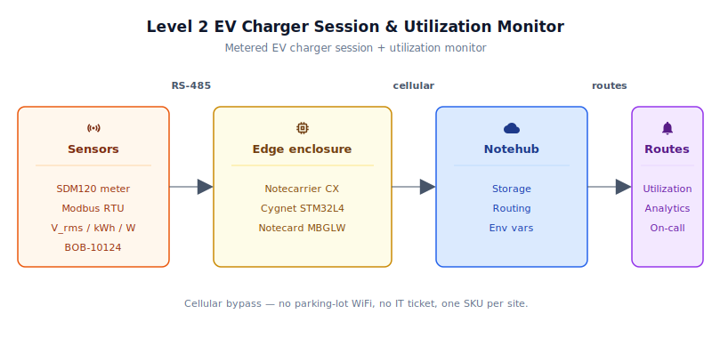
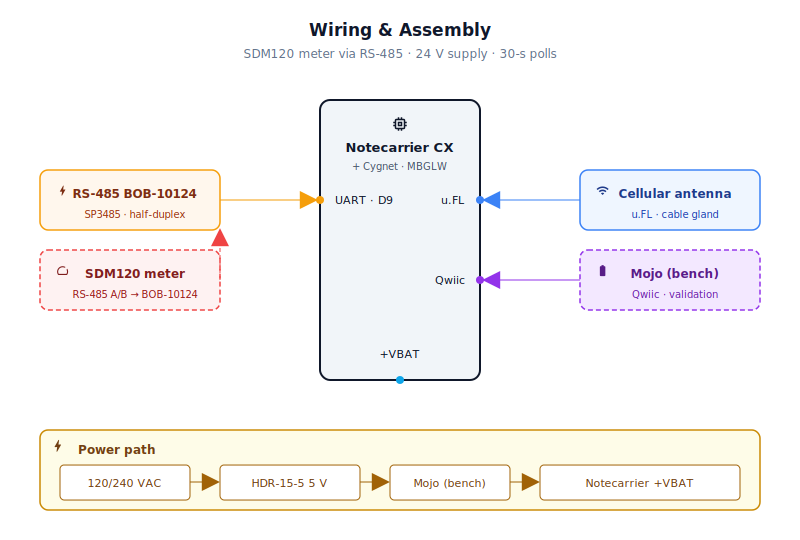
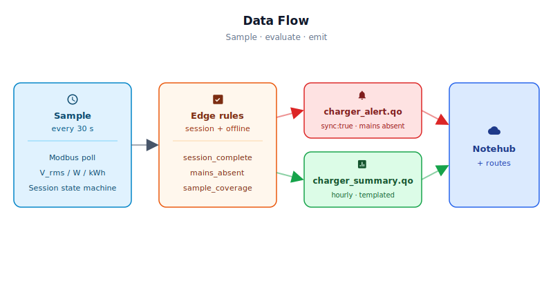

# Level 2 EV Charger Session & Utilization Monitor

<Note>

This reference application is intended to provide inspiration and help you get started quickly. It uses specific hardware choices that may not match your own implementation. Focus on the sections most relevant to your use case. If you'd like to discuss your project and whether it's a good fit for Blues, [feel free to reach out](https://blues.com/contact-sales/).

</Note>

A cellular [energy monitoring](https://blues.com/solutions-energy-monitoring/) retrofit for Level 2 EV chargers — for fleet managers, facilities teams, and charging-network operators who need to know how their installed chargers are actually being used. The design clamps a DIN-rail energy meter onto each charger's AC feed and reports three streams to Notehub over cellular: per-session metered kWh and peak power, hourly utilization and availability, and mains-offline alerts. Energy is measured by a hardware-metered instrument; charger availability is tracked from the meter's V_rms register — when mains voltage is absent the circuit is definitively offline. No modification to the charger hardware, no OCPP enrollment, no site IT involvement required. The hardware is a Notecarrier CX with a Notecard Cell+WiFi and an EASTRON SDM120-Modbus energy meter (see §3 for the BOM); see [§9](#9-limitations-and-next-steps) for design boundaries and production expansion paths.

## 1. Project Overview

**The problem.** Fleet managers, facilities teams, and third-party charging network operators are installing Level 2 **EVSE** (electric vehicle supply equipment) at workplace parking lots, fleet depots, and retail locations — and almost universally, they have no idea how those chargers are actually used. Is the 48-amp circuit in Bay 3 running at 90% utilization while Bay 4 sits idle all day? Are sessions clustering in the morning rush so that employees arriving at 9 a.m. find every port occupied? Without instrumentation, all of these questions get answered by anecdote or not at all.

This project addresses the instrumentation gap directly: insert a series-wired DIN-rail energy meter (EASTRON SDM120-Modbus) on the EVSE circuit feed, poll it over Modbus RTU, and report session-level energy delivery and port utilization directly — independent of who built the charger, what network it's connected to, and whether the site team has any standing with the charging network operator. OCPP-based integrations provide richer per-driver and per-RFID records where a charger exposes that interface, but they depend on network-operator cooperation and vary across Blink, ChargePoint, EV Connect, and in-house fleet stacks. The hardware-meter approach requires none of that: it reads the physics of the circuit, and that works on any Level 2 EVSE ever installed.

**What this design delivers.** A **metered session and utilization monitor** built around a DIN-rail single-phase energy meter (EASTRON SDM120-Modbus or compatible) on the EVSE feed. The meter is polled every 30 seconds over Modbus RTU; per-session energy is the difference in the meter's cumulative import-kWh register between session open and close — hardware-computed, not estimated from current alone. Peak power (W) is the highest active-power reading seen during the session. Charger availability is derived from the meter's V_rms register: the firmware tracks how many minutes per reporting window the supply voltage was above the configurable `voltage_present_v` threshold (`available_min`) and divides that by the full wall-clock duration of the window (`elapsed_min`) to produce `availability_pct`. Wakes where the meter is unreachable — because mains is absent, wiring is faulted, or all Modbus retries fail — count against availability in the denominator, so the metric correctly falls below 100 % whenever the charger was offline for any reason. A companion `sample_coverage_pct` field flags the fraction of window time that had valid meter readings, giving a data-quality signal separate from the availability signal. A separate `mains_absent` alert fires when no mains-present reading has been seen for longer than the configurable `alert_offline_min` threshold — a definitive signal for a tripped breaker, power loss, or sustained meter fault. Sites that additionally need per-driver or per-RFID records should implement an OCPP back-end integration alongside this meter-based monitor — see [§9](#9-limitations-and-next-steps) for boundaries and expansion paths.

**Why Notecard.** The single biggest deployment friction for EV charger instrumentation is the network question. Chargers installed in a corporate parking structure are almost always on a circuit run by a third-party operator — a fleet management company, a charging network, or a facilities contractor — whose people have zero standing with the site's IT department. The parking lot is treated as a hostile network zone: no WiFi credentials are available, no VLAN is provisioned, and no IT ticket is going to get approved by Friday. Even for in-house fleet teams, the "just connect it to the corporate network" path involves months of security review for every new device class.

Cellular sidesteps all of that. A Notecard Cell+WiFi (MBGLW) with its included prepaid SIM installs in the same electrical panel as the charger circuit, connects to an LTE Cat-1 bis tower in the parking lot, and is reporting session data within minutes — with no site IT involvement, no network form, no AP to pair to. WiFi remains as an opportunistic fallback for the rare site that has a legitimate parking-structure AP, but it is never required. The same firmware image and the same hardware SKU deploy identically in a workplace, a fleet depot, and a multi-tenant retail center.

**Deployment scenario.** A DIN-rail assembly mounted inside the electrical panel that feeds the EVSE circuit. The SDM120-Modbus energy meter is wired in series on the EVSE circuit (live conductor through the meter's current input); a SparkFun BOB-10124 (SP3485) RS-485 transceiver breakout bridges the meter's RS-485 port to the Cygnet's 3.3 V UART. The Notecarrier CX and Notecard MBGLW are powered from a 5 V / 3 A DIN-rail supply (e.g. MeanWell HDR-15-5) fed from whatever mains voltage is present at the panel — typically 120 VAC line-to-neutral where a neutral is accessible at the subpanel, or 208/240 VAC line-to-line where only two line conductors are available; the HDR-15-5 accepts 85–264 VAC and handles both. Total panel footprint is four to six DIN-rail modules. No modification to the charger hardware, no OCPP enrollment, no IT coordination required.

**Panel placement note.** Whether the DIN-rail assembly can be mounted inside the main EVSE panel depends on the enclosure's listing and local electrical code — not all listed enclosures permit third-party low-voltage auxiliary equipment in the mains compartment. Where the panel interior is not available, mount the assembly in a separately listed auxiliary enclosure bolted adjacent to the main panel and route the RS-485 signal cable and AC supply conductors between the two enclosures through a listed conduit entry or knockout. The auxiliary-enclosure approach is the safe default for any installation where the main panel's suitability cannot be confirmed.

## 2. System Architecture



**Device-side responsibilities.** The onboard Cygnet STM32L4 host on the Notecarrier CX wakes every 30 seconds via [`card.attn`](https://dev.blues.io/api-reference/notecard-api/card-requests/#card-attn), polls the SDM120 energy meter over Modbus RTU (three register reads: V_rms, active power, import kWh), and runs a two-state session machine that tracks whether the charger is actively delivering energy. Session energy is computed from the meter's cumulative import-kWh register delta (close reading minus open reading), so no voltage or power-factor assumptions are required. Charger availability is tracked each wake via two counters: `window_elapsed_sec` advances unconditionally (wall-clock time) and `window_available_sec` advances only when the meter is valid and V_rms ≥ `voltage_present_v`, so `availability_pct` = `available_min / elapsed_min × 100` correctly penalises any wake where the circuit was offline or unreadable. State is persisted to the Notecard between wakes using `NotePayloadSaveAndSleep`, which serialises the state struct into Notecard flash before cutting host power. When the session ends, the host queues a `charger_session.qo` Note immediately with `sync:true`. Hourly window statistics queue into `charger_summary.qo` on the report cadence. The host never stays awake longer than it takes to poll the meter, check thresholds, and hand off to the Notecard — typically under two seconds per wake.

**Notecard responsibilities.** The Notecard stores [Notes](https://dev.blues.io/api-reference/glossary/#note) locally in its on-device queue, establishes the cellular (or WiFi) session on the configured [`hub.set`](https://dev.blues.io/api-reference/notecard-api/hub-requests/#hub-set) `outbound` cadence (default 60 min), and immediately flushes any `sync:true` session or alert Notes when they arrive. The Notecard handles [environment variable](https://dev.blues.io/guides-and-tutorials/notecard-guides/understanding-environment-variables/) distribution from Notehub, enabling operators to retune thresholds and reporting intervals without re-flashing firmware.

**Notehub responsibilities.** The Notecard manages its own cellular session against the supported carrier networks worldwide via its embedded global SIM and delivers data to [Notehub](https://notehub.io) over the Internet; Notehub ingests events, stores every event, and applies project-level routes. Three Notefiles arrive separately so they can be fanned out to different destinations: `charger_session.qo` (per completed session, real-time) to a utilization dashboard or fleet management system; `charger_summary.qo` (periodic) to a long-term analytics store; and `charger_alert.qo` (mains-absent / charger-offline alert) to an on-call endpoint. [Smart Fleets](https://dev.blues.io/notehub/notehub-walkthrough/#using-smart-fleet-rules) provide a natural organisation layer: one fleet per property keeps environment variable overrides (e.g., a site's known line voltage) scoped correctly.

**Routing to the cloud (high level).** Notehub supports HTTP, MQTT, AWS, Azure, GCP, Snowflake, and other destinations. Route setup is project-specific and outside the scope of this reference — see the [Notehub routing docs](https://dev.blues.io/notehub/notehub-walkthrough/#routing-data-with-notehub) for detailed configuration.


## 2.5 Quickstart

Before diving into the full documentation, here's the fastest path from parts to first event in Notehub:

1. **Create a Notehub project** at [notehub.io](https://notehub.io) and copy its ProductUID (looks like `com.your-company:ev-charger-monitor`).
2. **Wire the bench rig** — Notecarrier CX + Notecard MBGLW + SDM120-Modbus energy meter + SparkFun BOB-10124 RS-485 transceiver (D0/D1/D2 pins). Full wiring details in [§4](#4-wiring-and-assembly).
3. **Edit firmware/ev_charger_session_monitor/ev_charger_session_monitor.ino** — replace the empty string on line 53 (`#define PRODUCT_UID ""`) with your ProductUID.
4. **Flash with Arduino IDE** — open the sketch, select **Blues Cygnet** as the board (canonical FQBN: `STMicroelectronics:stm32:Blues:pnum=CYGNET`), hit **Upload**. Or use `arduino-cli` (see [§6.1](#61-installing-and-flashing) for commands).
5. **Watch Notehub** — open your project's **Events** tab. You'll see `_session.qo` within seconds (proves radio works), a `charger_summary.qo` within the hour, and a `charger_session.qo` after you run a test load (see [§8](#8-validation-and-testing)).

For detailed component selection, wiring, Notehub configuration, and validation, read on.
## 3. Hardware Requirements

| Part | Qty | Rationale |
|------|-----|-----------|
| [Notecarrier CX](https://shop.blues.com/products/notecarrier-cx?utm_source=dev-blues&utm_medium=web&utm_campaign=store-link) | 1 | Integrated carrier with an onboard Cygnet STM32L4 host — no separate MCU needed. The ATTN pin wiring enables the Notecard to cut host power between samples for minimum idle draw. |
| [Notecard Cell+WiFi (MBGLW)](https://shop.blues.com/products/notecard?utm_source=dev-blues&utm_medium=web&utm_campaign=store-link) | 1 | LTE Cat-1 bis with global coverage and a WiFi fallback. Cellular is the primary path; see §1 for why site WiFi is rarely a viable option in EV charger deployments. Includes 500 MB data and 10 years of service on the included SIM. For technical details, see the [MBGLW datasheet](https://dev.blues.io/datasheets/notecard-datasheet/note-mbglw/). |
| [Blues Mojo](https://shop.blues.com/products/mojo?utm_source=dev-blues&utm_medium=web&utm_campaign=store-link) *(bench validation only)* | 1 | Coulomb counter for measuring per-wake energy and validating the sleep/transmit power profile during bring-up. Not deployed to the field — see [§8](#8-validation-and-testing). |
| [SparkFun CEL-16432 LTE Hinged External Antenna](https://www.sparkfun.com/lte-hinged-external-antenna-698mhz-2-7ghz-sma-male.html), 698–2700 MHz, SMA Male | 1 | Required for reliable signal inside a metal enclosure. The SMA connector screws onto the SMA female pigtail at the panel wall, placing the radiating element outside the metal cabinet. A rubber-duck antenna left inside a steel panel will degrade signal significantly. |
| [SparkFun WRL-18568 SMA to U.FL Cable, 150 mm](https://www.sparkfun.com/products/18568) | 1 | Routes the Notecard's U.FL cellular port to the SMA female bulkhead connector in the panel wall. For panel layouts where the Notecarrier mounts farther from the wall, a longer SMA-to-U.FL pigtail from Mouser or DigiKey can substitute. |
| [EASTRON SDM120-Modbus 45 A direct-connect single-phase DIN-rail energy meter](https://www.eastroneurope.com/products/view/sdm120modbus) | 1 | Wired in series on the EVSE circuit (live conductor through the current input terminals). Measures V_rms, active power (W), and cumulative import kWh with Class 1 accuracy. RS-485 Modbus RTU interface connects to the Cygnet UART. Rated 45 A direct-connect, covering 32 A and 40 A Level 2 EVSE; for 48 A or 60 A EVSE circuits use the SDM120CT variant with an appropriate 5 A secondary split-core CT, or the SDM230-Modbus (100 A direct). The SDM120 requires both a live conductor and a neutral terminal for voltage sensing — confirm both are accessible at the panel before specifying this meter. The Modbus protocol document (register map, baud-rate defaults, function codes) is available as a PDF download after free registration on the [Eastron Europe website](https://www.eastroneurope.com/products/view/sdm120modbus). |
| [SparkFun RS-485 Transceiver Breakout – SP3485 (BOB-10124)](https://www.sparkfun.com/products/10124) | 1 | Converts the Cygnet's 3.3 V UART to the RS-485 differential pair required by the SDM120. The SP3485 chip operates from a single 3.3 V supply, eliminating logic-level compatibility concerns that arise with 5 V-only transceivers. Wire RO to D0 (Serial1 RX), DI to D1 (TX), and the RTS pad to D2; the board routes the RTS pad to both DE (driver enable) and RE (receiver enable) internally, so no separate jumper is needed. VCC to +3V3, GND to GND. |
| AC/DC DIN-rail supply, 85–264VAC input, 5 V / 3 A output (e.g. [MeanWell HDR-15-5](https://www.meanwell.com/Upload/PDF/HDR-15/HDR-15-SPEC.PDF)) | 1 | Derives 5 V DC from whatever mains voltage is present at the panel (120 VAC L-N or 208/240 VAC L-L). The 3 A output rating provides adequate transient headroom for Notecard cellular transmit bursts (≤2 A peak). DIN-rail mount integrates cleanly into the panel enclosure alongside the EVSE breaker. |
| DIN-rail enclosure, ≥6-module width | 1 | Houses the Notecarrier CX, DIN-rail supply, and RS-485 transceiver module inside the electrical panel. The SDM120 itself is a separate DIN-rail device wired in series on the EVSE circuit. |

All Blues hardware ships with an active SIM including 500 MB of data and 10 years of service — no activation fees, no monthly commitment.

## 4. Wiring and Assembly



> **Electrical safety.** The 120/240VAC feed inside an electrical panel is hazardous. This installation inserts the SDM120 energy meter **in series** on the EVSE feed, which requires interrupting and re-terminating the live mains conductors. Panel work **must be performed by a qualified electrician** following applicable electrical codes and lockout/tagout procedures.

> **Panel placement.** Mounting third-party low-voltage electronics inside a mains EVSE panel is subject to the enclosure's UL/CSA listing and local electrical code. Where the panel listing or jurisdiction does not permit auxiliary equipment in the mains compartment, install the Notecarrier CX, power supply, and RS-485 transceiver module in a separately listed auxiliary enclosure mounted adjacent to the main panel. Route the RS-485 signal cable and AC supply conductors between the two enclosures through a listed conduit entry or knockout. The auxiliary-enclosure approach is the safe default for any installation where the main panel's interior cannot be confirmed suitable.

**SDM120 meter installation.** The SDM120-Modbus is a series element: the EVSE circuit live conductor must pass through the meter's current input terminal. Break the live conductor feeding the EVSE and route it through the meter's current input terminals — line-in on the input terminal and line-out on the output terminal. **Follow the terminal labels printed on the SDM120 faceplate exactly**; designations vary by variant and firmware revision, so do not rely on a generic reference for this wiring. Connect the neutral conductor to the meter's neutral terminal — the SDM120 requires a neutral connection for its internal voltage measurement. Do **not** route the neutral through the current input. The SDM120 derives its own supply from the same line and neutral conductors feeding the EVSE; consult the datasheet for the exact supply terminal connections on your variant. This installation interrupts the EVSE circuit during wiring; follow lockout/tagout procedures and have a qualified electrician perform this work.

> **Circuit ampacity.** The SDM120-Modbus is rated 45 A continuous. It is suitable for 32 A EVSE circuits (40 A breaker) and 40 A EVSE circuits (50 A breaker). For 48 A EVSE (60 A breaker) or higher, substitute the SDM120CT variant with an appropriately rated split-core CT, or the SDM230-Modbus (100 A rated). See [§9](#9-limitations-and-next-steps) for substitution guidance.

**RS-485 wiring.** Connect the SDM120's RS-485 terminals (**A+** and **B−**) to the corresponding **A** and **B** terminals on the SparkFun BOB-10124 breakout (via the 3.5 mm screw terminal or 0.1" header) using a twisted-pair cable (120 Ω characteristic impedance recommended). Wire the breakout to the Notecarrier CX header:

- **BOB-10124 RO** (receiver output) → **D0** (Serial1 RX) on the Notecarrier CX dual 16-pin header
- **BOB-10124 DI** (driver input) → **D1** (Serial1 TX)
- **BOB-10124 RTS** (direction control) → **D2** — the board routes this pad to both DE and RE internally
- **BOB-10124 VCC** → **+3V3**
- **BOB-10124 GND** → **GND**

The firmware drives D2 HIGH before transmitting a Modbus request frame and LOW immediately after, switching the transceiver from receive to transmit and back. A 120 Ω termination resistor across the A+ and B− terminals at the far end of the RS-485 bus reduces reflections; at the short cable lengths typical in a panel enclosure (< 1 m) it is optional.

**Notecard and antenna.** Seat the Notecard Cell+WiFi (MBGLW) into the Notecarrier CX's M.2 slot. Connect the u.FL to SMA pigtail to the Notecard's cellular u.FL port; thread the SMA end through a cable gland in the panel enclosure wall and attach the external antenna outside the panel. A rubber-duck antenna left inside a metal panel will degrade signal significantly. The Notecard communicates with the Cygnet host over I²C on the internal Notecarrier bus; no additional wiring is needed for that path.

**Power.** Wire mains power to the MeanWell HDR-15-5 input terminals — 120 VAC line-to-neutral where a neutral conductor is accessible at the panel, or 208/240 VAC line-to-line where only two line conductors are available; the HDR-15-5 accepts 85–264 VAC and handles both configurations. Consult local electrical code for the permitted supply tap. Connect the HDR-15-5's 5V and GND output terminals to the Notecarrier CX's `+VBAT` and `GND` pads. For bench bring-up, insert the **Mojo** in series between the HDR-15-5's 5V output and the `+VBAT` pad, and connect the Mojo's Qwiic port to the Notecarrier CX's Qwiic connector — see [§8](#8-validation-and-testing) for what to look for on the trace.

Pin summary:
- **D0** (Serial1 RX) → BOB-10124 RO
- **D1** (Serial1 TX) → BOB-10124 DI
- **D2** → BOB-10124 RTS (routes to DE + RE internally)
- **+3V3** → BOB-10124 VCC
- **GND** → BOB-10124 GND
- **SDA / SCL** → Notecard (internal to the Notecarrier; onboard pull-ups present)
- **+VBAT** → 5V from HDR-15-5 (via Mojo on bench)
- **Cellular u.FL** → pigtail to external SMA antenna outside the panel

## 5. Notehub Setup

1. **Create a project.** Sign up at [notehub.io](https://notehub.io) and [create a project](https://dev.blues.io/quickstart/notecard-quickstart/notecard-and-notecarrier-pi/#set-up-notehub). Copy the [ProductUID](https://dev.blues.io/notehub/notehub-walkthrough/#finding-a-productuid) — it looks like `com.your-company.your-name:ev-charger-monitor`. Paste it into `firmware/ev_charger_session_monitor/ev_charger_session_monitor.ino` as the value of `PRODUCT_UID`, or pass it via a build flag (`-DPRODUCT_UID=\"com.your-company:your-project\"`).

2. **Claim the Notecard.** Power the assembled unit. On first cellular connect the Notecard associates with your Notehub project automatically. The device will appear in **Devices** within a minute or two.

3. **Create a Fleet per property.** [Fleets](https://dev.blues.io/guides-and-tutorials/fleet-admin-guide/) group devices for shared configuration and routing. One fleet per property or tenant is the natural unit here — every charger at a given site shares the same line voltage, the same session-detection thresholds, and the same routing destinations. [Smart Fleets](https://dev.blues.io/notehub/notehub-walkthrough/#using-smart-fleet-rules) can auto-assign new devices to the correct fleet at commissioning time; within a single Notehub project all devices share the same ProductUID, so fleet rules should discriminate on a device attribute that varies by site — for example, an installer-applied tag (e.g., `site:depot-north`), a serial/UID range reserved per property during provisioning, or location metadata populated during the first sync.

4. **Set environment variables.** In Notehub, navigate to **Fleet → Environment** tab (or **Device → Environment** for a per-device override). Add or update any of the variables below; the device will fetch them on its next inbound sync — no reflash needed. All variables are optional; the firmware defaults shown below apply if you don't set them.

   | Variable | Default | Purpose |
   |---|---|---|
   | `sample_interval_sec` | `30` | Seconds between host wakes and Modbus meter polls. |
   | `report_interval_min` | `60` | Minutes between `charger_summary.qo` Notes. Changing this also re-applies `hub.set` so the Notecard's outbound cadence stays in sync. |
   | `session_threshold_w` | `500` | Active power (W) above which a charging session is considered open. Level 2 EVSE minimum pilot current (6 A × 208 V) is ~1250 W; 500 W sits safely below any real session while above charger standby draw. |
   | `session_end_count` | `3` | Consecutive below-threshold wakes before a session is closed. At the default 30-second interval, this is a 90-second grace period that absorbs brief power dips during EV charge-phase transitions. |
   | `voltage_present_v` | `85` | V_rms floor for mains-present classification. Readings below this threshold count against charger availability and start the `alert_offline_min` timer. 85 V is below the sag floor for both 120 V and 208/240 V feeds. |
   | `alert_offline_min` | `240` | Minutes without a mains-present reading before a `charger_alert.qo` Note fires. Set to `0` to disable offline alerting entirely. |
   | `modbus_slave_id` | `1` | Modbus slave address of the SDM120. The SDM120 factory default is 1; change if you have multiple meters on the same bus. |
   | `modbus_baud` | `9600` | Modbus RTU baud rate. Must match the SDM120's configured baud (factory default is 2400 on older units, 9600 on most current stock — check your meter's display or documentation). |

5. **Configure routes.** Add at minimum one [route](https://dev.blues.io/notehub/notehub-walkthrough/#routing-data-with-notehub) for `charger_session.qo` (real-time delivery to a fleet management system or dashboard webhook) and a second for `charger_summary.qo` (long-term analytics or historian). For sites where the mains-absent alert matters, add a third route for `charger_alert.qo` to an on-call or ticketing endpoint. The three Notefiles are separate specifically so each can be fanned out at a different urgency without filter logic in the route.

### What you should see in Notehub

Three event types matter:

- **`_session.qo`** — automatic Notecard housekeeping on each cellular session. Confirms the radio is reaching Notehub.
- **`charger_summary.qo`** — one per `report_interval_min` (default hourly). Sample body for a 60-minute window with one session:
  ```json
  {
    "sessions": 1,
    "total_kwh": 5.9,
    "avg_session_kwh": 5.9,
    "peak_w": 10320.0,
    "charging_min": 38,
    "idle_min": 22,
    "utilization_pct": 63.3,
    "available_min": 60,
    "availability_pct": 100.0,
    "sample_coverage_pct": 100.0
  }
  ```
  `total_kwh` is the SDM120's import-kWh register delta: the most recently valid closing reading minus the register value when the window opened — actual metered energy, not an estimate. If the meter poll fails on the exact wake when the summary fires, the most recent previously-valid reading is used as the closing value, so `total_kwh` remains accurate and the next window's kWh baseline is not corrupted. `charging_min` + `idle_min` always equals `total_min` by construction. `total_min` counts only wakes in which the meter returned valid data; wakes where all Modbus retries failed are excluded from the utilization accumulators so transient bus faults do not inflate idle time or distort `utilization_pct`. `utilization_pct` = `charging_min / total_min × 100`. `available_min` is the minutes during which V_rms was ≥ `voltage_present_v`; `availability_pct` = `available_min / elapsed_min × 100`, where `elapsed_min` is the full wall-clock window duration — including wakes where the meter was unreachable, which count as unavailable. `sample_coverage_pct` = `total_min / elapsed_min × 100` and signals the fraction of wall-clock window time that had valid meter readings; 100.0 means every poll succeeded, and a lower value flags Modbus or mains downtime during the window. In a fully-energised window where all polls succeeded and the charger was in use for 38 of 60 minutes: `available_min` = 60, `availability_pct` = 100.0, `sample_coverage_pct` = 100.0, and `utilization_pct` = 63.3.
- **`charger_session.qo`** — one per completed charging session, emitted immediately (`sync:true`). Sample body:
  ```json
  {
    "session_kwh": 11.4,
    "duration_min": 63.5,
    "peak_w": 10320.0,
    "start_epoch": 1746283200,
    "timing_valid": true
  }
  ```
  `session_kwh` is the SDM120's import-kWh delta (close reading minus open reading) — actual metered energy for this session. `peak_w` is the highest active-power reading seen during the session. Both fields are always valid regardless of `timing_valid`. `timing_valid` is `false` — and `duration_min` and `start_epoch` are emitted as `0` — when a session was opened before the Notecard completed its first cellular time sync. Suppress or specially flag session records with `timing_valid: false` in downstream analytics; `session_kwh` and `peak_w` can still be trusted for those records.
- **`charger_alert.qo`** — emitted once (then suppressed until mains returns) when `alert_offline_min` minutes elapse without a mains-present V_rms reading. The timer reference is the last confirmed mains-present epoch, or — if mains has never been confirmed — the device's first valid epoch after commissioning, so the alert fires even for a circuit that has been dead since day one. Sample body:
  ```json
  {
    "alert": "mains_absent",
    "offline_min": 248
  }
  ```

## 6. Firmware Design

The firmware lives in three files inside `firmware/ev_charger_session_monitor/`:

- [`ev_charger_session_monitor.ino`](firmware/ev_charger_session_monitor/ev_charger_session_monitor.ino) — `setup()`, `loop()`, and top-level app flow (cold-boot init, Modbus meter poll, sleep scheduling).
- [`ev_charger_session_monitor_helpers.h`](firmware/ev_charger_session_monitor/ev_charger_session_monitor_helpers.h) — shared constants, the `State` struct, extern declarations, and function prototypes.
- [`ev_charger_session_monitor_helpers.cpp`](firmware/ev_charger_session_monitor/ev_charger_session_monitor_helpers.cpp) — all helper implementations (Modbus polling, session state machine, Note emission, env-var handling, state persistence).

### 6.1 Installing and flashing

**Dependencies:**

- **Arduino core for STM32** — [`stm32duino/Arduino_Core_STM32`](https://github.com/stm32duino/Arduino_Core_STM32). Add the board manager URL `https://github.com/stm32duino/BoardManagerFiles/raw/main/package_stmicroelectronics_index.json` under **File → Preferences → Additional Boards Manager URLs**. Select **Blues Cygnet** as the board (canonical FQBN: `STMicroelectronics:stm32:Blues:pnum=CYGNET`).
- **`Blues Wireless Notecard`** library — [`note-arduino`](https://github.com/blues/note-arduino). Install via the Arduino Library Manager (`arduino-cli lib install "Blues Wireless Notecard"`) or search "Blues Wireless Notecard" in the IDE Library Manager. See the [note-arduino releases page](https://github.com/blues/note-arduino/releases) for any newer stable version.
- **`ModbusMaster`** library — by Doc Walker, available in the Arduino Library Manager. Install with `arduino-cli lib install "ModbusMaster"` or search "ModbusMaster" in the IDE. Version ≥ 2.0.1. Provides the Modbus RTU master implementation used to communicate with the SDM120 over Serial1.

**Flashing — Arduino IDE:** open `ev_charger_session_monitor.ino`, select the Cygnet board, hit **Upload**. The Notecarrier CX exposes the ST-Link interface on the USB cable — no external programmer needed.

**Flashing — `arduino-cli`:** from the firmware directory,

```bash
# Typical modern stm32duino core
cd firmware/ev_charger_session_monitor
arduino-cli compile -b STMicroelectronics:stm32:Blues:pnum=CYGNET ev_charger_session_monitor.ino
arduino-cli upload  -b STMicroelectronics:stm32:Blues:pnum=CYGNET -p /dev/cu.usbmodem* ev_charger_session_monitor.ino
```

If the upload fails with "Unknown board," first list available FQBN variants:

```bash
arduino-cli board listall | grep -i cygnet
```

and replace `STMicroelectronics:stm32:Blues:pnum=CYGNET` above with whatever `listall` reported. Replace `/dev/cu.usbmodem*` with the port the Notecarrier enumerates on your machine — typically `COMx` on Windows, `/dev/ttyACM*` on Linux, or `/dev/cu.usbmodem*` on macOS.

Open the serial monitor at **115200 baud** after flashing. On cold boot you'll see `[app] cold boot — will configure Notecard`. Once the meter is connected, subsequent wakes print `[app] V=240.1 V  P=0 W  kWh=12.345` and then go quiet for 30 seconds as the host powers down. If the meter is absent, unpowered, or wired incorrectly you'll see `[app] WARN: Modbus voltage read error 0xE2` (response timeout) each wake. A `0x02` error indicates the slave responded but rejected the register address (typical of a slave-ID or register-map mismatch); other ModbusMaster error codes are documented in the library header.

### 6.2 Modules

| Responsibility | Function |
|---|---|
| Notecard configuration (`hub.set`, template registration, accelerometer disable) | `initNotecard`, `defineTemplates` |
| RS-485 / Modbus initialisation (every wake) | `initModbus` |
| Time-filtered environment variable fetch | `fetchEnvOverrides` |
| SDM120 Modbus RTU poll (V_rms, active power, import kWh) | `pollMeter` |
| Epoch time from Notecard | `getEpoch` |
| Session state machine (IDLE ↔ CHARGING) with availability tracking | `runSessionStateMachine` |
| Per-session Note emission | `emitSessionNote` |
| Hourly summary Note emission and window reset | `emitSummaryNote` |
| Mains-absent alert emission | `emitOfflineAlert` |
| State persistence and host sleep | `sleepHost` |

### 6.3 Sensor reading strategy

`pollMeter` issues three sequential Modbus RTU read transactions (Function Code 0x04 — input registers) to the SDM120, one for each required parameter: V_rms (register 0x0000), active power in Watts (register 0x000C), and cumulative import energy in kWh (register 0x0048). Each parameter is a big-endian IEEE-754 float stored across two consecutive 16-bit registers. A 20 ms pause between transactions is sufficient for the SDM120 to respond at 9600 baud (a full 9-byte response frame takes under 10 ms). If any read returns a non-zero Modbus error code, `pollMeter` retries the complete three-register sequence up to three times (50 ms inter-attempt pause). This absorbs the single-frame bus collisions and turnaround-timing faults that most commonly occur at power-on or after a brief conductor disturbance. If all three attempts fail — indicating the meter is unpowered, wiring is faulty, or the slave ID is misconfigured — `pollMeter` returns `valid = false`. When that happens, `runSessionStateMachine` suppresses all session-state transitions and all window accumulation (`charging_sec`, `idle_sec`) for that wake: a session in progress is neither extended nor closed (its `below_threshold_count` is not incremented), and no idle time is attributed to the failed sample. However, `window_elapsed_sec` still advances unconditionally, so the failed poll counts against `availability_pct` (as an unavailable interval) and reduces `sample_coverage_pct`. The mains-absent offline timer continues to advance independently (via `last_mains_epoch` in `setup()`), so sustained meter faults still trigger the `mains_absent` alert after `alert_offline_min` minutes.

The SDM120 performs all V and I measurement and computation internally; the Cygnet reads the already-computed result registers. No ADC sampling, no voltage or power-factor assumptions, and no analog front-end components are required on the Notecarrier side.

### 6.4 Event payload design

`charger_summary.qo` uses a [template](https://dev.blues.io/notecard/notecard-walkthrough/low-bandwidth-design/#working-with-note-templates) that encodes each record as ~40 bytes on the wire (versus ~200 bytes as free-form JSON). At one record per hour per charger across a 50-unit fleet, this is meaningful over the lifetime of a 500 MB SIM. The template is registered once at cold boot and survives Notecard reboots.

`charger_session.qo` and `charger_alert.qo` are intentionally left untemplated. Session Notes are infrequent (one per EV charge, typically 1–8 per day) and the alert body has a different shape from the session body, so keeping them untemplated avoids the schema-conflict issue that arises from mixing two different body shapes under a single template.

Template definition snippet:

```cpp
J *req  = notecard.newRequest("note.template");
JAddStringToObject(req, "file", FILE_SUMMARY);
JAddNumberToObject(req, "port", 50);
J *body = JAddObjectToObject(req, "body");
JAddNumberToObject(body, "sessions",         12);    // 2-byte signed int
JAddNumberToObject(body, "total_kwh",        14.1);  // 4-byte IEEE-754 float — metered
JAddNumberToObject(body, "avg_session_kwh",  14.1);
JAddNumberToObject(body, "peak_w",           14.1);  // measured peak active power
JAddNumberToObject(body, "charging_min",     12);
JAddNumberToObject(body, "idle_min",         12);
JAddNumberToObject(body, "utilization_pct",  14.1);
JAddNumberToObject(body, "available_min",       12);    // minutes with mains present
JAddNumberToObject(body, "availability_pct",    14.1);  // available_min / elapsed_min × 100
JAddNumberToObject(body, "sample_coverage_pct", 14.1);  // total_min / elapsed_min × 100
notecard.sendRequest(req);
```

**Template notation explained:** `12` means a 2-byte signed integer (range -32,768 to 32,767); `14.1` means a 4-byte IEEE-754 float with 1 decimal place in transmission. The template compresses each full summary record from roughly 200 bytes of free-form JSON to about 40 bytes on the wire, meaningful over a 500 MB SIM lifetime at one record per hour per device.

### 6.5 Low-power strategy

The device is grid-tied, so absolute energy budget is not critical — but a well-disciplined sleep pattern still matters: it keeps the enclosure cooler, reduces component stress, and creates a firmware pattern that can be ported directly to a battery- or solar-backed variant without a rewrite. After each 30-second wake, the host serialises its `State` struct into Notecard flash and issues `NotePayloadSaveAndSleep`, which triggers `card.attn` to cut host power for the next interval. The Notecard sits in its 8–18 µA idle between cellular sessions. The Modbus poll adds roughly 100–200 ms to each wake (three transactions at 9600 baud with 20 ms pauses) but the host MCU is still only active for about one to two seconds every 30 seconds, and the radio runs roughly once an hour plus any session-end sync events.

`hub.set` is configured for `periodic` mode with `outbound` matching `report_interval_min` (default 60 min) and `inbound` at 120 min. Session end Notes set `sync:true`, which causes the Notecard to open a cellular session immediately rather than waiting for the outbound timer. With the default `session_end_count=3` and a 30-second sample interval, the state machine requires 3 consecutive below-threshold wakes — a 90-second grace period — before formally closing the session and queuing the Note. Cellular sync then adds roughly 15–60 seconds. End-to-end, operators should expect a completed session to appear in Notehub **roughly 2–3 minutes after the car unplugs** with default settings. Reducing `session_end_count` (e.g., to `1`) shortens the grace period at the cost of increased false-close risk during EV charge-phase transitions.

### 6.6 Retry and error handling

- `pollMeter` retries the complete three-register Modbus sequence up to three times per wake before declaring a poll failure. When all retries fail, `runSessionStateMachine` suppresses all session-state transitions and all window accumulation (`charging_sec`, `idle_sec`) for that wake — a session already in progress is held open (its `below_threshold_count` is not incremented), and no idle time is attributed to the failed sample. `window_elapsed_sec` still advances (as it does every wake), so the failed poll counts against `availability_pct` in the denominator and also reduces `sample_coverage_pct`. The mains-absent offline timer continues to advance regardless, so a sustained meter fault still triggers the `mains_absent` alert after `alert_offline_min` minutes.
- The first `sendRequestWithRetry(req, 5)` in `initNotecard` papers over the cold-boot I²C race documented in the note-arduino library.
- `fetchEnvOverrides` passes the stored `env_last_modified` timestamp to `env.get`'s `time` filter. If nothing has changed since the last fetch, the Notecard returns an empty response body, and the function returns immediately — no parsing, no config updates, minimal I²C overhead.
- `getEpoch` returns 0 if the Notecard hasn't yet synced and obtained time. The summary Note is guarded by `now > 0` and `window_start_epoch > 0`, so it does not fire before a cellular session establishes. The mains-absent alert is guarded by `offline_ref > 0`, where `offline_ref` is the last mains-present epoch, or `window_start_epoch` when mains has never been confirmed — so the alert is suppressed until the device has a valid clock and the configured absence duration has genuinely elapsed.
- `emitSessionNote` sets `timing_valid = false` when the `start_epoch` parameter is 0 — which happens when a session was opened before the Notecard completed its first cellular time sync. In that case `duration_min` and `start_epoch` would be wildly incorrect, so both are emitted as 0 and `timing_valid: false` is included in the Note body to signal suppression to downstream consumers. `session_kwh` and `peak_w` are unaffected and always emitted normally.
- Env var changes to `report_interval_min` re-apply `hub.set` via `applyHubCadence()`. The `hub_cadence_dirty` flag is set before the attempt and cleared only on confirmed success, so a single transient I²C failure cannot leave the Notecard permanently on the old outbound cadence; `setup()` retries on every subsequent wake until the cadence is confirmed updated — mirroring the `notecard_configured` retry pattern.
- When `emitSessionNote()` fails at session end, the completed payload is stored in a dedicated pending-note struct (`pending_session_*`) and `session_active` is cleared immediately. The pending note is retried at the top of `runSessionStateMachine()` on each subsequent wake, but the function always falls through to normal state-machine processing regardless of whether the retry succeeded — so a back-to-back charging session during a transient Notecard fault is detected and opened correctly rather than being silently blocked by a retry loop. **Retry-path window attribution:** if the hourly summary fires and resets the window accumulators between the session-end failure and a subsequent successful retry, the session's count and completed-session kWh are attributed to the newer window rather than the window in which the session actually ended. This edge case is documented further in §9.
- `alert_offline_min` accepts `0` (set the env var to `0` to disable mains-absent alerting), or any positive integer to adjust the threshold. The firmware checks for key presence before applying the value, so an absent env var leaves the current setting unchanged.

### 6.7 Key code snippet: session-end Note with immediate sync

When the session state machine closes a session, it computes `session_kwh` from the meter's import-kWh register delta, stores the payload in a pending-note struct (`pending_session_*`), and clears `session_active` immediately before calling `emitSessionNote`. All payload values are passed as explicit parameters so the function works identically at first-close time and during pending-note retries — after session state has been cleared and possibly overwritten by a new session. A `timing_valid` guard protects against sessions opened before the Notecard had a valid epoch: if `start_epoch` is 0, `duration_min` and `start_epoch` would be wildly incorrect, so they are emitted as 0 and `timing_valid` is set to `false`. `session_kwh` and `peak_w` are always valid regardless.

```cpp
bool emitSessionNote(float kwh, float peak_w,
                     uint32_t start_epoch, uint32_t end_epoch) {
    bool     timing_valid = (start_epoch > 0 && end_epoch >= start_epoch);
    uint32_t dur_sec      = timing_valid ? (end_epoch - start_epoch) : 0;

    J *req  = notecard.newRequest("note.add");
    JAddStringToObject(req, "file", FILE_SESSION);
    JAddBoolToObject(req,   "sync", true);
    J *body = JAddObjectToObject(req, "body");
    JAddNumberToObject(body, "session_kwh",  kwh);       // metered import-kWh delta
    JAddNumberToObject(body, "duration_min", (float)dur_sec / 60.0f);
    JAddNumberToObject(body, "peak_w",       peak_w);    // measured peak active power
    JAddNumberToObject(body, "start_epoch",  timing_valid ? (double)start_epoch : 0.0);
    JAddBoolToObject(body,   "timing_valid", timing_valid);
    // ...
}
```

### 6.8 Key code snippet: state persistence across sleep

`NotePayloadSaveAndSleep` serialises the entire `State` struct into Notecard flash, then issues the `card.attn` sleep request. On the next wake, the host enters `setup()` from cold and `NotePayloadRetrieveAfterSleep` rehydrates it — so the session start kWh baseline, peak power, and hourly window state survive the host being fully powered down.

```cpp
NotePayloadDesc payload = {0, 0, 0};
NotePayloadAddSegment(&payload, STATE_SEG_ID, &state, sizeof(state));
NotePayloadSaveAndSleep(&payload, state.sample_interval_sec, NULL);
```

### 6.9 Key code snippet: Modbus meter poll

`pollMeter` reads three SDM120 input-register pairs in sequence. Each pair is a big-endian IEEE-754 float; `regsToFloat` reassembles the two 16-bit halves via a union.

```cpp
// Read active power (0x000C, 2 registers → float32)
uint8_t rc = node.readInputRegisters(SDM_REG_POWER, 2);
if (rc != ModbusMaster::ku8MBSuccess) {
    Serial.print("[app] WARN: Modbus power read error 0x");
    Serial.println(rc, HEX);
    return false;
}
float pw = regsToFloat(node.getResponseBuffer(0), node.getResponseBuffer(1));
out->power_w = (pw > 0.0f) ? pw : 0.0f;  // clamp export to zero

// Helper: reassemble two 16-bit Modbus registers into IEEE-754 float
static float regsToFloat(uint16_t hi, uint16_t lo) {
    union { float f; uint32_t u; } v;
    v.u = ((uint32_t)hi << 16) | (uint32_t)lo;
    return v.f;
}
```

## 7. Data Flow



**Collected.** Every `sample_interval_sec` (default 30 s): V_rms, active power (W), and cumulative import kWh from the SDM120 via three Modbus RTU reads. The SDM120 performs all measurement and computation internally; the firmware reads the already-computed result registers.

**Session tracking.** The state machine opens a session when `active_power_w ≥ session_threshold_w` and closes it after `session_end_count` consecutive below-threshold wakes. Session energy is computed at close time from the meter's cumulative import-kWh register:

```
session_kwh = import_kwh_at_close − import_kwh_at_open
```

This is actual metered energy — no voltage or power-factor approximation. Window total kWh is computed the same way at summary time:

```
window_total_kwh = import_kwh_now − import_kwh_at_window_open
```

**Availability tracking.** Each wake, `window_elapsed_sec` grows by `sample_interval_sec` unconditionally (wall-clock time). Additionally, if `meter.valid` and `V_rms ≥ voltage_present_v`, `window_available_sec` also grows by `sample_interval_sec`. When the meter is unreachable (meter unpowered, wiring fault, or all Modbus retries failed), `meter.valid` is false: `window_elapsed_sec` still grows but `window_available_sec` does not, so those wakes count as unavailable in `availability_pct` = `available_min / elapsed_min × 100`. `sample_coverage_pct` = `total_min / elapsed_min × 100` provides a data-quality signal — 100.0 means every poll in the window succeeded; a lower value quantifies how much of the window lacked valid meter readings.

**Transmitted.**
- `charger_session.qo` — one Note per completed session, emitted immediately (`sync:true`), carrying metered session kWh (import-kWh delta), duration in minutes, peak active power (`peak_w`), UTC epoch of session start, and a `timing_valid` flag. `session_kwh` and `peak_w` are always valid. When `timing_valid` is `false` (session opened before the first time sync), `duration_min` and `start_epoch` are emitted as 0 and must be treated as invalid by downstream consumers. This is the record that answers "how much energy did Charger 3 deliver on Tuesday at 8 a.m.?"
- `charger_summary.qo` — one templated Note per `report_interval_min` (default hourly), queued to the Notecard and transmitted on the outbound sync. Contains session count, metered total kWh (import-kWh register delta using the last valid closing reading), per-session average kWh, peak active power (`peak_w`), active minutes (`charging_min`), inactive minutes (`idle_min`), utilization percentage, and availability fields: `available_min` (minutes with V_rms ≥ `voltage_present_v`), `availability_pct` = `available_min / elapsed_min × 100` (wall-clock denominator so invalid-meter wakes count as unavailable), and `sample_coverage_pct` = `total_min / elapsed_min × 100` (data-quality signal). `charging_min` counts minutes with active power above the session threshold plus any grace-period wakes; `idle_min` is the remainder; both use only valid-poll wakes as the denominator so `utilization_pct` is unaffected by Modbus faults. `available_min` reflects the minutes where the charger circuit was confirmed energised. This is the record that answers both "do we need more chargers?" and "was this charger actually available to be used?"
- `charger_alert.qo` — emitted once if `alert_offline_min` elapses without a mains-present V_rms reading, then suppressed until mains returns. This is a definitive signal: the SDM120 requires mains power to respond on Modbus, so consecutive failed reads at `9600` baud combined with a below-threshold V_rms reliably indicate a tripped breaker, power loss, or sustained meter fault rather than a healthy charger sitting idle.

**Routed.** Notehub fans the three Notefiles out separately: `charger_session.qo` to whatever real-time channel the operator uses (fleet dashboard, CMMS work order, alerting service), `charger_summary.qo` to a long-term analytics store for trend analysis ("was March utilization higher than January?"), and `charger_alert.qo` to an on-call or ticketing endpoint.

**Trigger logic summary:**
- Session opens: `active_power_w ≥ session_threshold_w` for one sample
- Session closes: `session_end_count` consecutive below-threshold samples
- Hourly summary: wall-clock window of `report_interval_min` elapsed
- Mains-absent alert: `alert_offline_min` > 0 and `alert_offline_min` minutes elapsed since the last confirmed mains-present reading (or device commissioning if mains has never been confirmed); fires once; resets when mains returns; disabled when `alert_offline_min = 0`

## 8. Validation and Testing

**Expected steady-state cadence.** In normal use, a charger with two or three sessions per day generates: one `charger_summary.qo` per hour (24/day), one `charger_session.qo` per session (2–8/day), and zero `charger_alert.qo` events. In a healthy window, `sample_coverage_pct` should be 100.0 (every Modbus poll succeeded). If the summary Note shows `utilization_pct` consistently above 80%, the charger is effectively saturated; if `availability_pct` is below 95%, the charger circuit has been losing power frequently and maintenance is warranted.

**Bench simulation.** Before installing in a live panel, test session detection on the bench by connecting the SDM120 to a live AC circuit (observe all electrical safety precautions) with a resistive load. A 500 W or larger resistive load will exceed the default `session_threshold_w = 500` W. With the SDM120 powered and the RS-485 connection wired correctly, you should see the serial monitor printing `[app] V=XXX.X V  P=XXXX W  kWh=X.XXX` every 30 seconds. Plug the load in; watch the monitor print `[app] session STARTED`. Leave it running for a few minutes, then unplug. Count three wakes printing power near 0 W — the 90-second grace period (`session_end_count = 3`, 30 s each). The `charger_session.qo` Note queues with `sync:true` once the session formally closes; allow roughly 2–3 minutes from unplugging for the Note to appear in Notehub (90 s grace period + 15–60 s cellular sync).

If you do not have a live SDM120 available for initial bring-up, you can verify the Modbus stack by connecting the RS-485 bus to a Modbus RTU simulator (e.g., a PC running Modbus Poll or a second Arduino running a Modbus slave sketch). The firmware will print `[app] WARN: meter poll failed this wake` for each failed read but will still run the Notecard initialisation, env-var fetch, and sleep cycle correctly.

**Using Mojo to validate power behavior.** Insert the [Mojo](https://dev.blues.io/datasheets/mojo-datasheet/) inline between the HDR-15-5 5V output and the Notecarrier CX `+VBAT` pad for bench bring-up. Published Notecard current figures from the [low-power firmware design guide](https://dev.blues.io/notecard/notecard-walkthrough/low-power-firmware-design/):

| Phase | Expected current |
|---|---|
| Notecard idle (host cut by ATTN, radio off) | 8–18 µA @ 5V |
| Host active (Modbus poll + I²C, ~1–2 s per wake) | measure with Mojo — see note below |
| Notecard cellular session (LTE Cat-1 bis) | ~200–400 mA average, ≤2A peak bursts |

The host MCU active-phase current depends on clock configuration and peripheral state; use the Mojo trace to measure it rather than relying on a prior estimate. A healthy Mojo trace looks like this: a near-zero baseline punctuated by brief 1–2-second elevated blips at each 30-second wake, with one longer 15–30-second burst at ~200–400 mA every hour (the outbound sync) plus additional shorter bursts at session ends. Total daily energy varies with session count, session frequency, and cellular signal quality — characterise it on the bench with a known load pattern and use that measured figure as your deployment baseline.

Two failure patterns are immediately visible on the Mojo:
- **Host never sleeping:** continuous elevated baseline instead of 30-second gaps. Almost always means `NotePayloadSaveAndSleep` returned early (check that the ATTN pin is connected on the Notecarrier CX and that the Notecard's I²C is responding).
- **Radio never going idle:** long continuous transmit blocks rather than clean bursts. Indicates the Notecard is not entering `periodic` mode idle — verify the `hub.set` call succeeded at cold boot by watching serial output.

Mojo is bench-validation tooling — deployed units running from a panel supply don't need it.

## 9. Limitations and Next Steps

**Design boundaries:**

- **Energy-meter integration: SDM120 Modbus RTU, not OCPP.** This project implements a hardware energy-meter integration on the charger's AC feed. It does not implement OCPP or direct charger-network integration and therefore does not provide per-driver, per-RFID, or charger-network session records. Session boundaries are power-threshold heuristics (`active_power_w ≥ session_threshold_w`), not authoritative OCPP `StartTransaction`/`StopTransaction` events. Sites that additionally require per-driver records or OCPP-correlated data should implement an OCPP back-end integration alongside this meter-based monitor — see the production next steps at the end of this section.

- **SDM120 ampacity and neutral requirement.** The SDM120-Modbus direct-connect variant is rated 45 A continuous. It covers 32 A EVSE (40 A breaker) and 40 A EVSE (50 A breaker). For 48 A or 60 A EVSE circuits, substitute the **SDM120CT** variant (uses an external split-core CT; rated for any primary current, CT-dependent) or the **SDM230-Modbus** (100 A direct-connect). Additionally, the SDM120 requires a neutral connection for its internal voltage measurement. In a subpanel where only two line conductors are available (e.g., a 240 V line-to-line feed with no neutral), the SDM120 cannot measure voltage and will not operate correctly; use a single-phase meter that accepts a two-wire (L-L) supply voltage input instead, or run a neutral conductor from the main panel.

- **Availability from V_rms — not OCPP status.** `available_min` and `availability_pct` are derived from the SDM120's V_rms register. When V_rms ≥ `voltage_present_v`, the charger circuit is classified as energised. Wakes where the meter poll fails entirely — because mains is absent, wiring is faulted, or all Modbus retries fail — also count against availability: they contribute to the wall-clock `elapsed_min` denominator but not to `available_min`, so `availability_pct` correctly falls below 100 % whenever the circuit was offline for any reason. `sample_coverage_pct` distinguishes sustained meter faults from genuine mains absence: if `availability_pct` is low and `sample_coverage_pct` is also low, the charger was likely offline; if `availability_pct` is low but `sample_coverage_pct` is near 100, the V_rms readings were valid and indicate a prolonged low-voltage or brownout condition. This design does **not** detect an EVSE that is powered but internally faulted (e.g., a GFI trip within the EVSE, a J1772 pilot fault, or an EVSE error state) — those faults leave the circuit energised and appear as idle time (`charging_min = 0, available_min = elapsed_min`). Sites requiring per-charger EVSE fault detection should supplement this meter monitor with OCPP status-notification integration. Within those limits, `availability_pct` provides a useful signal: sustained `availability_pct < 100` in a summary window confirms a real mains interruption during that period, and `availability_pct = 100` with `utilization_pct = 0` indicates the charger was powered but unused.

- **Metered accuracy — Class 1, not revenue-grade.** The SDM120 is IEC 62053-21 Class 1, meaning ±1% accuracy under reference conditions. This is sufficient for utilization monitoring and tenant cost allocation, but falls short of revenue-grade Class 0.5 or 0.2 instruments required for utility billing. For billing applications, substitute a revenue-grade instrument.

- **Single-phase monitoring only.** This design monitors one single-phase EVSE circuit. Three-phase 208 V or 480 V commercial charging installations (typically DCFC — DC fast chargers) require a three-phase energy meter and are not covered by this reference design.

- **Session detection is power-threshold only.** The firmware does not distinguish between "EV actively charging at full rate," "EV plugged in but in top-off mode at reduced power," and "EV plugged in but the BMS has paused charging." All three produce above-threshold active power and appear as a single continuous session. An OCPP-integrated data source would provide the authoritative session state.

- **Sessions spanning summary windows; retry-path attribution; single-slot data loss.** Window `total_kwh` uses the meter-register delta and captures all energy in the window period regardless of session boundaries. However, `window_sessions` counts only sessions that *close* in the window — a session still in progress when the summary fires will be counted in the window where it ends. On the retry path: if `emitSessionNote()` fails at session close and the pending retry only succeeds after the summary window has already reset, `window_sessions` and `window_completed_session_kwh` are attributed to the newer window. **Single-slot data loss:** the pending-session store holds exactly one completed-session payload. If a second session closes while the first Note has not yet been successfully queued (Notecard fault lasting longer than one complete charging session), the older session record is overwritten and permanently lost. A `[app] WARN: overwriting unconfirmed pending session Note` line is printed to serial. Production deployments requiring guaranteed per-session delivery should replace the single-slot pending store with a small ring buffer — see the code comment in `ev_charger_session_monitor_helpers.h`.

- **No Notecard outboard firmware update wired.** The firmware does not configure [Notecard Outboard DFU](https://dev.blues.io/notehub/host-firmware-updates/notecard-outboard-firmware-update/) for over-the-air host firmware updates. Firmware updates require a physical USB connection.

**Production next steps:**

- Upgrade to a revenue-grade Class 0.5 or 0.2 DIN-rail energy meter (e.g., EASTRON SDM72D or equivalent) for utility-billing accuracy.
- For a two-port charger (two EVSE circuits in the same panel), add a second SDM120 on a shared RS-485 bus using a different Modbus slave ID; extend the firmware to poll both meters and emit per-port session and summary Notes.
- Implement OCPP session correlation: integrate with the charger's OCPP back-end via its WebSocket/HTTP interface or a network proxy to capture `StartTransaction` / `StopTransaction` events, then cross-reference those records with energy-meter session data to get per-driver, per-RFID, per-session energy records.
- Wire Notecard Outboard DFU to the Cygnet's boot/reset pins for over-the-air host firmware updates across the deployed fleet.
- Replace the single-slot pending-session store with a small ring buffer (4–8 slots) in the `State` struct to guarantee per-session delivery even during extended Notecard faults — see the extension notes in `ev_charger_session_monitor_helpers.h`.

## 10. Summary

This project demonstrates that actionable EV charger visibility — per-session metered kWh, peak demand, session duration, port utilization, and charger availability — is achievable with a DIN-rail energy meter, a Notecarrier CX, and a cellular Notecard. No charger modification. No OCPP negotiation. No IT involvement. No per-site network setup. The SDM120 measures actual energy delivery and mains voltage; the Notecard dials home over LTE Cat-1 bis; and Notehub starts receiving session records and hourly availability summaries within minutes of commissioning.

For fleet operators and facilities teams, the data that emerges answers two questions at once: not just "how are the chargers we have being used?" but also "how reliably are they available to be used?" A site where `utilization_pct` is running at 85% during the morning rush and `availability_pct` is 100% needs scheduling policy, not more hardware. A site where `availability_pct` is 72% needs a maintenance visit. A site where two chargers are maxed out while six others sit idle has a fleet routing problem. None of those signals is visible without instrumentation — and cellular makes the instrumentation deployable everywhere, regardless of who owns the charger or the parking lot.

