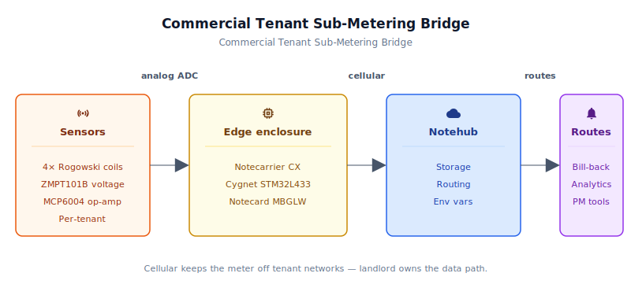
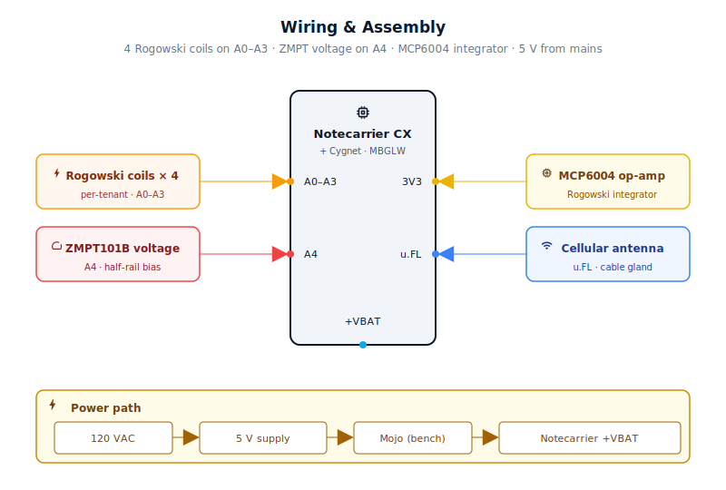
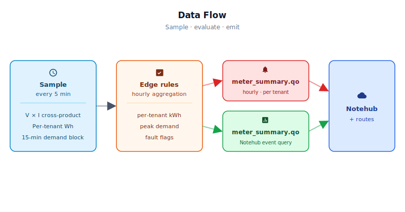

# Commercial Tenant Energy Monitoring Bridge

<Note>

This reference application is intended to provide inspiration and help you get started quickly. It uses specific hardware choices that may not match your own implementation. Focus on the sections most relevant to your use case. If you'd like to discuss your project and whether it's a good fit for Blues, [feel free to reach out](https://blues.com/landing-pages/accelerators-contact-us/?accelerator=Commercial%20Tenant%20Energy%20Monitoring%20Bridge).

</Note>

This project is a cellular [energy monitoring](https://blues.com/solutions-energy-monitoring/) retrofit for multi-tenant commercial buildings. Four Rogowski coil sensors with per-channel active integrator circuits on a panel, a Blues Notecard Cell+WiFi, and a Notecarrier CX with its onboard Cygnet host — and a landlord gains per-tenant estimated interval energy (Wh), 15-minute blocked-average demand (W), and a per-channel fault bitmask every hour, on a data channel the tenants can neither see nor interfere with, without running a single network cable through the building.

## 1. Project Overview

**The problem.** A landlord of a multi-tenant commercial building — a flex-industrial park, a shared professional building, an office strip — wants to allocate electricity costs to each tenant based on their actual consumption rather than splitting the utility bill by square footage or some other proxy. The fair approach is sub-metering: install a watt-hour meter on each tenant's branch circuit and read it monthly.

The problem is the cost and the complexity. Commercial sub-meters require a wired or networked path to get their data off the panel and into the billing system. An older building with four or eight tenants has no data infrastructure of any kind in the electrical room — and retrofitting it means negotiating with tenants, coordinating with the utility, and running cable through occupied ceilings. Most landlords give up and keep allocating by square footage.

This project takes a different path. Instead of installing meters with network cards, it clips Rogowski coil sensors onto each tenant's existing feed conductors — no wire cuts, no conduit, no utility coordination — and uses a Notecard to move the data to the cloud. A voltage transducer provides a coherent voltage reference so the device computes active power (W) and estimated interval energy (Wh) from sequential interleaved V×I measurements, rather than an estimated figure derived from an assumed voltage and fixed power factor. The system installs in an afternoon and costs a fraction of a traditional per-tenant metered retrofit.

**What this project delivers — and what it does not.** This design provides estimated tenant load allocation data useful for proportional charge-back, load profiling, and identifying unusually high-consumption tenants. It does **not** replace a utility-certified sub-meter. Readings are derived from periodic active-power snapshots (one ~200 milliseconds V×I mean every five minutes) rather than continuous integration, and the sequential (non-simultaneous) V/I sampling introduces a small systematic error at low power factors. For internal bill-back purposes the approach is accurate enough to support proportional allocation between tenants. For billing applications requiring certified metering accuracy — for example, sub-metering subject to utility-tariff accuracy regulations — a dedicated simultaneous-sampling energy-metering IC or certified sub-meter interface should replace this approach.

**Why Notecard — and why cellular specifically.** The "why cellular" argument in most IoT applications is about location: the asset is remote, or on a rooftop, or in a place where running Ethernet is impractical. This application is different. The panel room is usually indoors, and there is WiFi somewhere nearby. The problem is *whose* WiFi it is.

<NewToBlues/>

In a multi-tenant building, the WiFi access points are almost always under tenant control. A retail tenant pays for their own ISP and runs their own router; a professional office tenant does the same. The building owner typically has no WiFi at all, or if they do, tenants have access to it. Routing billing telemetry through any network the tenants can reach is a political and legal problem: a savvy tenant can see what's being transmitted, disrupt the connection, or argue that the data was tampered with. The landlord needs a data channel that is:

1. 100% landlord-controlled — the tenant cannot touch it
2. Invisible to tenants — the tenant cannot see or intercept it
3. Operationally simple — no IT setup, no passwords, no tenant cooperation

A cellular Notecard meets all three criteria. It's a SIM-bearing module that calls home to Notehub over the cellular network — a connection the tenant has no access to and no visibility into, exactly the same way the building's alarm system uses its own GSM dialout. There is no form to fill out, no AP to pair to, and no IT ticket to raise with any tenant. The data channel is as landlord-owned as the panel itself.

This is not a niche edge case. Billing disputes are among the most contentious issues in commercial tenancy, and the architecture matters: a meter whose data travels over the tenant's network is a meter whose readings a clever tenant can plausibly dispute. A cellular Notecard is the only architecture that eliminates that dispute by design.

**Deployment scenario.** A small, weatherproof or panel-rated enclosure mounted inside or alongside the building's electrical panel. Four Rogowski coil sensors — one per tenant feed — with the coil lead running to the enclosure via a short cable gland. A voltage transducer taps the same panel bus for a building voltage reference. Line power sourced from a spare breaker on the same panel. No rented rack space, no network closet, no IT involvement from anyone.

## 2. System Architecture



**Device-side responsibilities.** The onboard Cygnet STM32L433 host on the Notecarrier CX wakes every five minutes (default), reads each active tenant channel by interleaving ADC samples from the voltage transducer output and the Rogowski integrator output, computes active power (W) via the V×I cross-product, accumulates estimated interval energy (Wh), 15-minute blocked-average demand (W), and a per-channel hardware-fault bitmask per tenant in a RAM struct persisted to Notecard flash across sleep cycles, and falls back to sleep. Once per hour it emits a summary Note containing the accumulated energy, peak demand, and fault flags. The host reads all configuration at every wake from [environment variables](https://dev.blues.io/guides-and-tutorials/notecard-guides/understanding-environment-variables/) distributed by Notehub, so sensor sensitivity and volt scaling can be adjusted in the field without a reflash.

**Notecard responsibilities.** The Notecard stores [Notes](https://dev.blues.io/api-reference/glossary/#note) in its on-device queue, wakes the cellular radio on the configured [`hub.set`](https://dev.blues.io/api-reference/notecard-api/hub-requests/#hub-set) `outbound` cadence (default 60 minutes), and flushes the queue to Notehub in a single cellular session. The Notecard also distributes environment variable changes pushed from Notehub on its `inbound` cadence (default 120 minutes), and uses [`card.attn`](https://dev.blues.io/api-reference/notecard-api/card-requests/#card-attn) sleep mode to cut host power between samples — ensuring the Cygnet draws essentially zero current from the supply between wakeups.

**Notehub responsibilities.** The Notecard manages its own cellular session against the supported carrier networks worldwide via its embedded global SIM and delivers data to [Notehub](https://notehub.io) over the Internet; [Notehub](https://dev.blues.io/notehub/notehub-walkthrough/) ingests events, stores them durably, and applies project-level routes. Notehub is the **sole monthly aggregation path**: a billing or property-management platform sums each tenant's `t*_wh` values across all hourly `meter_summary.qo` events for any device over any billing period using the [Notehub Event Query API](https://dev.blues.io/api-reference/notehub-api/api-introduction/). No device-side monthly rollup or month-end note is generated — the hourly event stream in Notehub is the complete, authoritative record.

[Fleets](https://dev.blues.io/guides-and-tutorials/fleet-admin-guide/) group devices per property so a property manager with multiple buildings can push sensor calibration settings per-building without touching individual devices. A Notehub HTTP or MQTT route can forward each `meter_summary.qo` note directly to the property-management or billing platform as it arrives.

**Routing to the cloud (high level only).** Notehub supports HTTP, MQTT, AWS, Azure, GCP, Snowflake, and other destinations; route setup is project-specific. See the [Notehub routing docs](https://dev.blues.io/notehub/notehub-walkthrough/#routing-data-with-notehub) — this project ships no specific downstream endpoint.

## 3. Technical Summary

Four independent sub-meter channels, each with isolated analog inputs and synchronized 100 Hz ADC sampling, feed a Cygnet STM32L4 running accumulation windows across configurable billing periods. Per-tenant energy (Wh), peak demand (W), and hardware-fault status flow upward via Notecard on a configurable outbound cadence. On-device queuing, sleep gating, and fault-aware transmission tolerate carrier dropouts and cloud-side downtime without data loss. No external flash or EEPROM required; state persistence uses the Notecard's on-device storage.

Here is a sample Note this device emits:
```json
{
  "t1_wh":       482.3,
  "t1_demand_w": 3120.0,
  "t2_wh":       214.1,
  "t2_demand_w": 1480.5,
  "t3_wh":       673.8,
  "t3_demand_w": 4220.0,
  "t4_wh":       149.2,
  "t4_demand_w":  980.0,
  "fault_mask":     0
}
```

---

## 4. Hardware Requirements

### Prototype / Bench Evaluation BOM

Use this BOM for firmware bring-up, calibration, and evaluation. The ZMPT101B module is not agency-listed for permanent installation inside a commercial panel enclosure; replace it with an agency-listed isolated voltage transducer before deploying to a live panel — see [§11 Limitations and Next Steps](#11-limitations-and-next-steps) for the full production voltage-sensing path, including hardware requirements and firmware adaptation notes.

| Part | Qty | Rationale |
|------|-----|-----------|
| [Notecarrier CX](https://shop.blues.com/products/notecarrier-cx?utm_source=dev-blues&utm_medium=web&utm_campaign=store-link) | 1 | Integrated carrier with onboard Cygnet STM32L433 host; six analog inputs accommodate all four current channels plus the voltage channel with one spare. No separate MCU needed. |
| [Notecard Cell+WiFi (MBGLW)](https://shop.blues.com/products/notecard?utm_source=dev-blues&utm_medium=web&utm_campaign=store-link) ([datasheet](https://dev.blues.io/datasheets/notecard-datasheet/note-mbglw/)) | 1 | Cellular is required — tenant WiFi and building WiFi are off-limits for billing telemetry. WiFi is present on the MBGLW SKU but intentionally unused in this design. |
| [Blues Mojo](https://shop.blues.com/products/mojo?utm_source=dev-blues&utm_medium=web&utm_campaign=store-link) *(commissioning and bench validation only — not deployed to the field)* | 1 | Coulomb counter for validating the sleep/wake current profile during bring-up. See [§10](#10-validation-and-testing). |
| [Magnelab RCT-1800-000](https://magnelab.com/product/flexible-ac-rogowski-coil-rct-1800-000/) flexible Rogowski coil ([spec sheet](https://magnelab.com/wp-content/uploads/2015/07/RopeCT-Series-AC-Current-Sensor-Rogoskies-Coil-Spec-Sheet.pdf)) — or equivalent bare-output flexible Rogowski coil rated for the installed conductor capacity | 4 | Non-invasive clip-on coil; no conductor cut or conduit penetration required. The RCT-1800-000 handles a wide range of conductor diameters; its flexible loop closes with a snap-together coupler. Its dI/dt output requires the per-channel active integrator described in [§5](#5-wiring-and-assembly). One coil per tenant. Any Rogowski coil producing a proportional dI/dt output can be used — calibrate `rogowski_amps_per_volt` to match the installed coil's rated output sensitivity. |
| [Microchip MCP6004](https://www.microchip.com/en-us/product/MCP6004) ([datasheet](https://ww1.microchip.com/downloads/en/DeviceDoc/MCP6001-1R-1U-2-4-1-MHz-Low-Power-Op-Amp-DS20001733L.pdf)) quad op-amp, single-supply 2.5 V–5.5 V — use **MCP6004-I/P** (DIP-14) for breadboard/perfboard builds or **MCP6004-I/SL** (SOIC-14) for PCB layouts | 1 | Drives all four active Miller integrators from a single package. Single-supply operation from the 3.3 V Cygnet rail; rail-to-rail input/output; GBW 1 MHz is well above the 60 Hz integrator corner frequency. |
| 10 kΩ resistor 1% (R_in, integrator input) | 4 | One per integrator channel; sets the integrator time constant with C_f. |
| 1 MΩ resistor 1% (R_f, integrator DC-stabilisation) | 4 | One per integrator channel; limits DC gain of the Miller integrator to prevent output rail saturation from op-amp offset drift. |
| 10 nF film or C0G capacitor (C_f, integrator feedback) | 4 | One per integrator channel; paired with R_in and R_f to form the frequency response. |
| 100 kΩ resistor 1% (bias half-rail divider) | 10 | Two per input channel (four current + one voltage = five channels); form the half-rail divider that centres each AC signal at 1.65 V for the single-supply ADC. |
| 10 µF electrolytic capacitor | 5 | One per channel. On current-sensor channels (A0–A3): shunts AC noise from the op-amp IN+ bias node to GND. On the voltage channel (A4): wired in series between ZMPT101B VOUT and ADC A4 to AC-couple the module output onto the 1.65 V bias point (electrolytic polarity: + toward VOUT). |
| ZMPT101B voltage sensor module — **VCC/GND/VOUT pinout, 5 V supply** (**bench/prototype only — not agency-listed for mains use in a commercial panel enclosure**; Zhongmet Technology ZMPT101B transformer IC on a PCB with onboard burden resistor and trim pot; see the [ZMPT101B IC datasheet](https://www.lcsc.com/datasheet/C98090.pdf)) | 1 | Galvanically isolated AC voltage sensor module suitable for bench validation and firmware calibration. Taps the building line voltage through screw terminals and outputs a scaled AC waveform at VOUT; the firmware's `volt_scale` env var accommodates any module producing a proportional output. See [§5](#5-wiring-and-assembly) for wiring details. **Replace with an agency-listed isolated voltage transducer before deploying to a commercial panel; see [§11](#11-limitations-and-next-steps) for the production path hardware and firmware requirements.** |
| AC/DC supply, 5 V / 2 A (e.g. [MeanWell IRM-10-5](https://www.meanwell.com/Upload/PDF/IRM-10/IRM-10-SPEC.PDF)) | 1 | Derives 5 V DC from 120 VAC at a spare panel breaker. The 2 A rating provides headroom for the Notecard's cellular transmit burst on top of the host MCU and analog front-end circuits. |
| [Molex 2091420180 Flexible LTE/Wi-Fi/GNSS Antenna](https://shop.blues.com/collections/accessories/products/flexible-cellular-or-wi-fi-antenna?utm_source=dev-blues&utm_medium=web&utm_campaign=store-link), u.FL, 180 mm lead, 698 MHz–4.0 GHz | 1 | **Required** for any metal-enclosure or metal-panel installation — replace the stub antenna included with the Notecarrier CX kit if the 180 mm lead is insufficient to exit the enclosure via a cable gland. Route the antenna to **outside** the metal panel; see [§5](#5-wiring-and-assembly). For panels where the cable gland is further from the Notecard, add a u.FL-to-u.FL extension cable of appropriate length between the Notecard's antenna port and the antenna's u.FL terminator. |
| NEMA 4X or panel-rated enclosure, ~6×4×2″ | 1 | Houses the Notecarrier CX, op-amp integrator board, and power supply in the panel room. |

All Blues hardware ships with an active SIM including 500 MB of data and 10 years of service — no activation fees, no monthly commitment.

## 5. Wiring and Assembly



All host I/O lands on the [Notecarrier CX](https://dev.blues.io/datasheets/notecarrier-datasheet/notecarrier-cx-v1-3/) dual 16-pin header. The Notecard MBGLW seats into the M.2 slot on the carrier. Mojo (bench-only) sits inline between the 5 V supply output and the Notecarrier CX `+VBAT` pad.

> **Cellular antenna — critical for metal-panel deployments.** Connect the external cellular antenna's u.FL lead to the Notecard's primary antenna port and route the cable through a cable gland to **outside the metal panel cabinet or NEMA enclosure**. Steel panels and enclosures act as Faraday cages; a rubber-duck or pigtail antenna left inside a closed metal panel will not establish a reliable cellular session. This is the single most common field bring-up failure in panel-mounted deployments.

### Power chain

```
AC/DC 5 V supply (IRM-10-5)
  └─ +5 V out ──► Mojo BAT             (bench validation — Mojo measures supply current)
                    └─ Mojo LOAD ──► Notecarrier CX +VBAT   (3.3 V regulated on-board)
```

For production deployment (no Mojo): connect the AC/DC supply 5 V output directly to Notecarrier CX `+VBAT`.

> **Do not connect the supply output simultaneously to both `+VBAT` and `+VUSB/+5V` on the Notecarrier CX.** The `+VBAT` pad is the correct power input for this supply voltage and load profile; feeding two supply rails at once risks back-feeding one regulator through the other.

### Active Miller integrator (replicate for each of the four current channels)

Each Rogowski coil outputs a voltage proportional to dI/dt (the derivative of the primary current). The active Miller integrator converts this dI/dt signal back to a signal proportional to instantaneous current, which can then be presented to the ADC for RMS and V×I computation.

```
Rogowski coil output (bare lead)
  │
  ├── R_in (10 kΩ) ──────────────────────────► op-amp IN− (inverting)
  │                                                │
  │                         R_f (1 MΩ)            │
  │                   ┌────────────────────────────┤
  │                   │                            │
  │                   │     C_f (10 nF)            │
  │                   └──┤├──────────────────────────┘
  │
  │   op-amp IN+ (non-inverting) ──────────────── 1.65 V bias node
  │
  └── op-amp OUT ─────────────────────────────── to ADC pin (A0–A3)

Bias node: +3V3 ── 100 kΩ ──┬── 100 kΩ ── GND
                             ├── 10 µF ── GND
                             └── op-amp IN+ of this channel
```

Use one section of the MCP6004 (U1A–U1D) per channel. All four op-amps share Vdd = +3V3 and GND.

**Rogowski coil polarity:** if a loaded channel shows near-zero or zero `t*_wh` accumulation in Notehub despite a known load, the coil lead polarity may be reversed. The firmware clamps negative watts to zero before accumulating energy, so reversed polarity appears as zero/near-zero billed energy — not negative values — in Notehub. The negative-watt condition is visible on Serial (look for a negative watt figure in the `[sample] T*:` line) during bench bring-up. Swap the coil's two output leads at the R_in input of the integrator to correct polarity.

### ZMPT101B voltage sensor module (bench/prototype — one module, building voltage reference)

This design uses a **conditioned ZMPT101B module** (VCC / GND / VOUT pinout) — not a bare transformer secondary. The module's PCB carries the ZMPT101B transformer, an onboard burden resistor (sets the output scaling), and a calibration trim pot. Connect it as follows:

```
Building 120 V line ──► ZMPT101B module AC primary (IN1 / IN2 screw terminals,
                         fused tap per local code)

Module power and signal:
  VCC  ──► +5V (from AC/DC supply before the Notecarrier CX regulator)
  GND  ──► GND

  VOUT ──► 10 µF (series AC coupling) ──┬── ADC A4
                                         │
               +3V3 ── 100 kΩ ──────────┤
                                         │
                GND ── 100 kΩ ──────────┘
```

The module outputs an AC signal riding on a DC level set by its onboard circuitry (typically near half its supply voltage — approximately 2.5 V when powered at 5 V). VOUT is AC-coupled through the 10 µF series capacitor to ADC A4; the external 100 kΩ / 100 kΩ voltage divider then sets the DC operating point of the ADC input at 1.65 V, independent of the module's internal reference. Firmware removes any residual DC offset in software (`v_dc = mean(v_buf[])`), so the exact bias voltage does not need to be trimmed.

The module's onboard burden resistor and trim pot set the output peak-to-peak swing. At 120 V primary with the factory burden, the output is typically ≈0.1 V RMS at the VOUT pin; `volt_scale` = 1200 (default) is the corresponding calibration constant (120 V ÷ 0.1 V). Measure with a precision AC voltmeter at a known line voltage and trim `volt_scale` in Notehub for best accuracy.

### Pin-by-pin assignments

- **A0** → Tenant 1 Rogowski integrator output (op-amp OUT direct)
- **A1** → Tenant 2 Rogowski integrator output (op-amp OUT direct)
- **A2** → Tenant 3 Rogowski integrator output (op-amp OUT direct)
- **A3** → Tenant 4 Rogowski integrator output (op-amp OUT direct)
- **A4** → ZMPT101B VOUT via 10 µF series AC coupling cap into the 1.65 V bias node
- **+3V3** → MCP6004 Vdd, top of all half-rail bias dividers
- **+5V** → ZMPT101B module VCC (bench)
- **GND** → MCP6004 GND, bottom of all bias dividers, negative terminals of the four current-channel 10 µF bias-decoupling caps (A0–A3 bias nodes), Rogowski coil returns, ZMPT101B module GND *(the voltage-channel 10 µF capacitor is the series AC-coupling cap between ZMPT101B VOUT and A4 — its negative lead connects toward A4 and the 1.65 V bias node, not to GND; see the ZMPT101B wiring diagram above)*

### Rogowski coil placement

Each Rogowski coil wraps around **one conductor only** of the tenant's single-phase branch-circuit feed — the hot leg. The coil must close fully (the two ends of the flexible Rogowski coil clip together); an open coil gap produces a non-integrable signal. This firmware is designed for single-phase circuits where all tenants derive from the same phase leg; see [§11](#11-limitations-and-next-steps) for the multi-phase case.

<Warning>

**Electrical safety.** Panel interiors operate at hazardous voltages. Installation must be performed by a licensed electrician following applicable electrical code, site lockout/tagout procedures, and the panel manufacturer's instructions. The Rogowski coils and voltage transducer are galvanically isolated from the mains; the hazard is the bus bars and termination points nearby during installation.

</Warning>

Before powering on for the first time:

- [ ] **PRODUCT_UID set** — edited `tenant_sub_meter_helpers.h` line 17 with your Notehub ProductUID (e.g., `com.your-company:your-app`).
- [ ] **Core installed** — Arduino core for STM32 added via Boards Manager. Search "STM32 MCU based boards".
- [ ] **Blues Notecard library installed** — installed via Library Manager.
- [ ] **DIP switch set to HST** — on the Notecarrier CX, before connecting USB.
- [ ] **Compiled and uploaded** — `arduino-cli compile` succeeds with no errors. `arduino-cli upload` completes successfully.
- [ ] **Serial monitor at 115200 baud** — after upload, watch for `[init]` and `[sample]` lines (host is running).

If compilation fails with "PRODUCT_UID is not defined", you missed step 1. If upload fails with "board not found", check the DIP switch and USB cable.

## 6. Notehub Setup

### Fast path to first event

1. **Notehub** — create a [Notehub project](https://notehub.io), copy its ProductUID.
2. **Wire the bench rig** — Notecarrier CX + Notecard MBGLW + four Rogowski integrator circuits on A0–A3 + ZMPT101B on A4. Full pinout in [§5](#5-wiring-and-assembly).
3. **Edit one line** in [`firmware/tenant_sub_meter/tenant_sub_meter_helpers.h`](firmware/tenant_sub_meter/tenant_sub_meter_helpers.h) — replace `#define PRODUCT_UID ""` with your project's value.
4. **Flash** — 
   ```bash
   arduino-cli compile -b STMicroelectronics:stm32:Blues:pnum=CYGNET firmware/tenant_sub_meter/
   arduino-cli upload -b STMicroelectronics:stm32:Blues:pnum=CYGNET -p /dev/cu.usbmodem* firmware/tenant_sub_meter/
   ```
   Full troubleshooting in [§9.1](#91-installing-and-flashing). Connect the Notecarrier CX with USB and set the DIP switch to `HST`.
5. **Watch serial** — open the serial monitor at 115200 baud. You will see Notecard configuration, then channel sample lines. After the first sleep cycle, serial goes quiet (host is powered off) for 5 minutes — that silence is expected and healthy.
6. **Check Notehub** — open **Events** tab. A `_session.qo` appears within minutes. The first `meter_summary.qo` typically arrives in the initial session, shortly after the first sample cycle completes (within an hour).

---

1. **Create a project.** Sign up at [notehub.io](https://notehub.io) and [create a project](https://dev.blues.io/quickstart/notecard-quickstart/notecard-and-notecarrier-pi/#set-up-notehub). Copy the [ProductUID](https://dev.blues.io/notehub/notehub-walkthrough/#finding-a-productuid) — it looks like `com.your-company.your-name:tenant-energy-monitor`.

2. **Set the ProductUID in firmware.** Open [`tenant_sub_meter_helpers.h`](firmware/tenant_sub_meter/tenant_sub_meter_helpers.h) and replace the empty string on the `#define PRODUCT_UID ""` line with your value.

3. **Claim the Notecard.** Power the assembled unit. On first cellular connect the Notecard associates itself with your Notehub project automatically — no manual claim step required. The device will appear in the **Devices** tab within a minute or two.

4. **Create a Fleet per property.** [Fleets](https://dev.blues.io/guides-and-tutorials/fleet-admin-guide/) group devices for shared configuration. The natural unit here is *one fleet per building* — every panel in the same building typically operates at the same line voltage and uses the same Rogowski coil model, so fleet-level environment variables encode "this building's panels all use these sensor calibrations." Use [Smart Fleets](https://dev.blues.io/notehub/notehub-walkthrough/#using-smart-fleet-rules) to auto-assign devices by serial number prefix for multi-property deployments.

5. **Set environment variables.** Navigate in Notehub to **Fleet → Environment** (or **Device → Environment** for per-device overrides). Edit the table below, then save. The device pulls them on its next `inbound` sync (default: every 2 hours) — no reflash, no truck roll.

   | Variable | Default | Purpose | When to adjust |
   |---|---|---|---|
   | `sample_interval_sec` | `300` | Seconds between measurements (minimum 60, max 86400). | Leave at 300 for most installs; smaller values consume more power and produce more frequent events. |
   | `summary_interval_min` | `60` | Minutes between hourly summaries (minimum 15, max 1440). The minimum of 15 matches the 15-minute demand window. | Leave at 60 for standard hourly billing. Values < 15 are silently clamped to 15. |
   | `rogowski_amps_per_volt` | `400.0` | Rogowski coil + integrator sensitivity in A/V. Derivation: rated primary amps ÷ integrator output V RMS at rated load. | **Critical**: Calibrate against a reference clamp meter at a known full load before billing. Incorrect values produce proportionally wrong energy readings. See [§10](#10-validation-and-testing) calibration note. |
   | `volt_scale` | `1200.0` | Voltage transducer calibration: line-voltage V RMS ÷ ADC-pin V RMS. | Default (1200.0) matches ZMPT101B at 120 V nominal. Measure line voltage with a precision AC voltmeter and trim for accuracy. |
   | `num_tenants` | `4` | Active current channels to sample (1–4). | Set to the actual number of tenants metered to skip unnecessary ADC reads. |

6. **Configure routes.** Route `meter_summary.qo` to your time-series database or billing platform. This is the canonical energy record and the correct source for monthly aggregation — sum each tenant's `t*_wh` values across all hourly events over the billing period using the [Notehub Event Query API](https://dev.blues.io/api-reference/notehub-api/api-introduction/). See the [Notehub routing docs](https://dev.blues.io/notehub/notehub-walkthrough/#routing-data-with-notehub) for destination types.

### What you should see in Notehub

Within minutes of first power-on, the **Events** tab in your project should show a `_session.qo` (the cellular handshake). The firmware emits a summary Note on first boot, so the first `meter_summary.qo` typically arrives in the initial session.

**Example `meter_summary.qo` payload:**

```json
{
  "t1_wh":       482.3,
  "t1_demand_w": 3120.0,
  "t2_wh":       214.1,
  "t2_demand_w": 1480.5,
  "t3_wh":       673.8,
  "t3_demand_w": 4220.0,
  "t4_wh":       149.2,
  "t4_demand_w":  980.0,
  "fault_mask":  0
}
```

This arrives hourly. `t*_wh` is estimated interval energy in watt-hours per tenant over the past hour; sum these across all hourly events over a billing period to derive monthly kWh. `t*_demand_w` is the peak 15-minute average demand (in watts) in that hour. `fault_mask = 0` means all channels passed hardware health checks.

## 7. Firmware Design

Three-file implementation — all three must be present in the same sketch directory:

- [`firmware/tenant_sub_meter/tenant_sub_meter.ino`](firmware/tenant_sub_meter/tenant_sub_meter.ino) — main sketch: `setup()` / `loop()` / `runCycle()`, state management, measurement orchestration, and sleep/wake lifecycle.
- [`firmware/tenant_sub_meter/tenant_sub_meter_helpers.h`](firmware/tenant_sub_meter/tenant_sub_meter_helpers.h) — shared types (`TenantState`, `PersistState`, `RuntimeConfig`, `ChannelMeasurement`), constants, fault-flag definitions, and helper function declarations.
- [`firmware/tenant_sub_meter/tenant_sub_meter_helpers.cpp`](firmware/tenant_sub_meter/tenant_sub_meter_helpers.cpp) — implementations of all helper functions (`measureChannel`, `notecardReady`, `fetchEnvOverrides`, `initNotecard`, `defineTemplates`, `sendSummary`, and `getEpochSec`).

### 9.1 Installing and flashing

**Dependencies:**

- **Arduino core for STM32** — [`stm32duino/Arduino_Core_STM32`](https://github.com/stm32duino/Arduino_Core_STM32). Install via the Arduino Boards Manager (search "STM32 MCU based boards") or add the index URL `https://github.com/stm32duino/BoardManagerFiles/raw/main/package_stmicroelectronics_index.json` under **File → Preferences → Additional Boards Manager URLs**. Select **Blues Cygnet** as the board target (canonical FQBN: `STMicroelectronics:stm32:Blues:pnum=CYGNET`).
- **`Blues Wireless Notecard`** library — [`note-arduino`](https://github.com/blues/note-arduino). Install via the Arduino Library Manager, or `arduino-cli lib install "Blues Wireless Notecard"`. Verify the latest release against the [note-arduino releases page](https://github.com/blues/note-arduino/releases) at install time.

**Flashing — Arduino IDE:** Open `tenant_sub_meter.ino`, select the Cygnet board, and click **Upload**. The Notecarrier CX exposes the ST-Link interface on the same USB cable — no external programmer needed. Set the DIP switch to `HST` before flashing to route USB serial to the host MCU.

**Flashing — `arduino-cli` (step by step):**

First, confirm the board and port:

```bash
# List all recognized boards
arduino-cli board listall | grep -i cygnet
# Expected output: STMicroelectronics:stm32:Blues:pnum=CYGNET
```

Then set the DIP switch on the Notecarrier CX to `HST` and compile/upload:

```bash
# Compile only (no upload yet)
arduino-cli compile \
  -b STMicroelectronics:stm32:Blues:pnum=CYGNET \
  firmware/tenant_sub_meter/

# List USB ports connected to see your device
arduino-cli board list

# Upload (replace /dev/cu.usbmodem* with your actual port from board list)
arduino-cli upload \
  -b STMicroelectronics:stm32:Blues:pnum=CYGNET \
  -p /dev/cu.usbmodem* \
  firmware/tenant_sub_meter/

# Watch the progress — when upload is complete, disconnect USB and flip DIP to NCD
```

On Windows, ports are named `COM3`, `COM4`, etc.; on macOS / Linux, `/dev/cu.usbmodem*` or `/dev/ttyUSB*`.

After flashing, open the serial monitor at **115200 baud**. On first power-on you will see the Notecard configuration exchange, then the first channel sample lines. After the first sleep, the serial output goes quiet for `sample_interval_sec` — that silence is expected; the host is fully powered off and will re-enter `setup()` from cold on the next wake.

### 9.2 Module map

| Responsibility | Where |
|---|---|
| Notecard cold-boot readiness handshake (first I2C transaction on every wake) | `notecardReady()` |
| Notecard init, `hub.set`, accelerometer disable | `initNotecard()` |
| Template registration (`meter_summary.qo` only) | `defineTemplates()` |
| Environment variable fetch and clamping | `fetchEnvOverrides()` |
| Sequential-interleaved V×I measurement, RMS current and active power | `measureChannel()` |
| Wh accumulation, demand-window accumulation and peak demand tracking | `runCycle()` sample loop |
| Hourly summary emission with confirmed note.add | `sendSummary()` |
| State persist + host sleep | `NotePayloadSaveAndSleep()` |
| State restore on wake (after notecardReady) | `NotePayloadRetrieveAfterSleep()` |

### 9.3 Sensor reading strategy

The `measureChannel()` function captures 2000 interleaved voltage/current sample pairs from VOLTAGE_PIN (voltage transducer output) and the selected current pin (Rogowski integrator output). At the STM32L433's default 12-bit ADC rate, each `analogRead()` takes approximately 50 microseconds; one interleaved pair therefore takes ~100 microseconds, so 2000 pairs cover ~200 milliseconds — approximately 12 full 60 Hz cycles. Voltage is sampled first within each pair, so any systematic ADC switching latency between channels is consistent across all pairs.

**DC removal.** Both signals are biased to 1.65 V (half-rail) by external resistor dividers. A single-pass mean calculation over all samples determines the per-channel DC offset, which is subtracted before computing RMS or cross-products. This removes the bias voltage and any residual ADC offset without a separate hardware AC-coupling capacitor in the signal path.

**Active power computation.** Active power P = mean(v[n] × i[n]), where v[n] and i[n] are the DC-removed voltage and current samples scaled to physical units. The V×I cross-product captures the actual phase relationship between voltage and current — no assumed power factor is needed.

**Phase/accuracy limitation from sequential sampling.** Because voltage and current are read sequentially (not simultaneously), there is a fixed ~50 microseconds time offset between the V sample and the I sample in each pair. At 60 Hz, one full cycle is 16.67 milliseconds, so 50 microseconds corresponds to a consistent phase offset δ of approximately 1.08°. The relative error in active power is approximately tan(φ)·sin(δ) — where φ = arccos(PF) is the load power-factor angle — because the measured cross-product evaluates cos(φ − δ) rather than cos(φ). At power factors above 0.9 (typical commercial loads, φ ≈ 26°), this error is approximately 1% of the true active-power reading. At PF 0.7 (φ ≈ 46°) it reaches approximately 2%. For inductive loads (positive φ) the firmware systematically over-reads active power by this margin. For metering applications requiring certified accuracy (e.g., utility-tariff sub-metering subject to accuracy regulations), a dedicated simultaneous-sampling energy-metering IC should replace this approach.

A Rogowski coil installed with reversed lead polarity produces a consistently negative watts result; the firmware clamps negative values to zero and the issue is visible in the serial log as a zero-energy reading on the affected channel.

**Energy estimation.** Each `sample_interval_sec` (default 5 minutes) the firmware takes one ~200 milliseconds active-power snapshot (mean V×I over 2000 sample pairs) and multiplies it by the full interval duration to produce an estimated interval energy in Wh. This is accurate for constant or slowly-varying loads, but may over- or under-state energy on bursting or cycling loads where power changes significantly within the 5-minute window. The `t*_wh` accumulator sums these interval estimates; it is not a continuous integral. This makes the design suitable for proportional load allocation — identifying which tenants use more energy than others — but not for applications requiring certified metering accuracy.

**Demand window.** Energy accumulated in `demand_window_mwh` and elapsed time in `demand_window_sec` grow across sample wakes. Once `demand_window_sec` reaches `DEMAND_INTERVAL_SEC` (900 seconds = 15 minutes), average watts are computed as `demand_window_mwh × 3600 / (demand_window_sec × 1000)` and compared against `peak_demand_cw` — the per-tenant centi-watt accumulator for the current summary period. If the new average is higher, `peak_demand_cw` is updated. Both window fields then reset to begin the next 15-minute interval. This is a true interval-average demand reading — not a transient snapshot — matching the most common North American utility demand-charge billing window. The `t*_demand_w` field in `meter_summary.qo` reports `peak_demand_cw / 100` (converted to watts) for the summary period. The demand window deliberately straddles summary-period boundaries: `peak_demand_cw` is cleared after each confirmed `sendSummary()`, but `demand_window_mwh` and `demand_window_sec` continue uninterrupted so no 15-minute interval is silently truncated at a summary boundary.

**Summary interval and demand window floor.** `summary_interval_min` is clamped to a minimum of 15 in firmware (`MIN_SUMMARY_INTERVAL_MIN`), matching `DEMAND_INTERVAL_SEC / 60`. A summary period shorter than one demand window would always emit `t*_demand_w = 0` because no complete 15-minute window could close within it — not a hardware fault, just a window-timing gap. Operators who need finer-grained reporting should use the `t*_wh` field and accumulate their own demand windows in the downstream system.

**Per-channel fault bitmask.** Each call to `measureChannel()` checks four conditions per channel nibble: `FAULT_BIAS_RANGE` (0x01) when the ADC DC offset falls outside the expected 1.40–1.90 V half-rail window; `FAULT_SATURATED` (0x02) when the centered signal's RMS exceeds the RMS-equivalent of 85 % of the 1.65 V half-rail peak amplitude (≈ 0.99 V RMS at the ADC pin), indicating that the waveform is approaching ADC rail clipping; bit 2 reserved (formerly `FAULT_NO_SIGNAL` — retired because a legitimately unloaded tenant circuit is indistinguishable from a disconnected Rogowski coil by current magnitude alone; see the commissioning diagnostic note below); and `FAULT_VOLTAGE_REF` (0x08) when the shared voltage reference path is suspect (bias out of range, signal saturated, or measured line RMS below `VOLTAGE_MIN_V_RMS`). Because the voltage reference is shared, `FAULT_VOLTAGE_REF` is propagated into every active channel's fault nibble simultaneously so downstream billing can identify periods where all tenant watt calculations are compromised. Fault flags are OR'd across all sample wakes in the summary period and packed into the `fault_mask` field of `meter_summary.qo` as a 4-bit nibble per tenant channel (T1 in bits 3:0, T4 in bits 15:12). A `fault_mask` of 0 means all channels passed all checks on every sample in the period. Downstream billing systems should reject or flag any summary where `fault_mask != 0`. Low RMS current (below 0.05 A) is logged to Serial as a commissioning diagnostic only — it is never placed in `fault_mask`.

### 9.4 Event payload design

`meter_summary.qo` is registered as a [template-backed](https://dev.blues.io/notecard/notecard-walkthrough/low-bandwidth-design#working-with-note-templates) notefile at first boot. Templates store Notes as fixed-length binary records, reducing on-wire size by 3–5× vs. free-form JSON.

**`meter_summary.qo` — emitted hourly (canonical record)**

Nine 4-byte floats: estimated interval energy (Wh), 15-minute blocked-average demand (W), and a combined fault bitmask per summary period. `t*_wh` is the sum of (W_sample × sample_interval_sec / 3600) across all periodic samples in the reporting period — estimated interval energy derived from power snapshots, not a continuous integral or kVAh estimate. `t*_demand_w` is the peak 15-minute blocked-average demand observed during the summary period — the highest average watts across any completed `DEMAND_INTERVAL_SEC` (900 seconds) window; see §11.3. `fault_mask` packs per-channel hardware-fault flags as a 4-bit nibble per tenant (T1 in bits 3:0; see §11.3 for bit definitions); 0 means all channels clean for the entire period.

```json
{
  "t1_wh":       482.3,
  "t1_demand_w": 3120.0,
  "t2_wh":       214.1,
  "t2_demand_w": 1480.5,
  "t3_wh":       673.8,
  "t3_demand_w": 4220.0,
  "t4_wh":       149.2,
  "t4_demand_w":  980.0,
  "fault_mask":     0
}
```

To derive monthly per-tenant totals, sum `t*_wh` across all `meter_summary.qo` events for a device over the billing period using the [Notehub Event Query API](https://dev.blues.io/api-reference/notehub-api/api-introduction/), then divide by 1000 to obtain estimated kWh. This Notehub-side aggregation is the sole monthly rollup path — no device-side monthly note is generated.

### 9.5 Low-power strategy

The panel installation is line-powered, but keeping the host asleep between samples reduces enclosure heat, reduces supply wear, and produces firmware that ports directly to battery variants without a rewrite. After each sample cycle, `NotePayloadSaveAndSleep` serializes the RAM `PersistState` struct into Notecard flash and issues a [`card.attn`](https://dev.blues.io/api-reference/notecard-api/card-requests/#card-attn) request that cuts host power for `sample_interval_sec` seconds. The Notecarrier CX's ATTN→EN routing handles the physical power switch; no external relay or MOSFET is needed. The Cygnet re-enters `setup()` from cold on each wake; `NotePayloadRetrieveAfterSleep` rehydrates the struct transparently — but only after `notecardReady()` has confirmed the Notecard is ready to accept I2C requests.

The Notecard sits in its own [low-power idle state](https://dev.blues.io/notecard/notecard-walkthrough/low-power-firmware-design/) (~18 µA at 5 V for the Cell+WiFi variant) between cellular sessions. Summary Notes queue locally and flush together in one hourly session — the radio is not touched on intermediate wakes.

### 9.6 Retry and error handling

**Cold-boot I²C race.** On every cold boot, `notecardReady(NOTECARD_READY_TIMEOUT_SEC)` is the very first Notecard transaction — it precedes `NotePayloadRetrieveAfterSleep` and every other I2C call. `notecardReady` calls `notecard.sendRequestWithRetry(req, 10)` with a lightweight `card.version` request. Per the [note-arduino library docs](https://dev.blues.io/tools-and-sdks/firmware-libraries/arduino-library/), `sendRequestWithRetry` returns `bool` (true = acknowledged) — it does **not** return a `J*` response pointer — and blocks up to the specified timeout. This handles the race condition where the STM32L433 host comes up several hundred milliseconds before the Notecard is ready to accept I²C requests.

If `notecardReady()` returns `false` (genuine hardware or I²C fault), the firmware does **not** attempt any further I²C transaction — including `NotePayloadRetrieveAfterSleep` and `NotePayloadSaveAndSleep`. A plain `delay(DEFAULT_SAMPLE_INTERVAL_SEC)` allows `loop()` to retry on bench rigs without ATTN→EN wiring; on a production Notecarrier CX, the Notecard will restore host power when it recovers. All subsequent transactions, including `fetchEnvOverrides()` (`env.get`) and `hub.set` in `initNotecard()`, are issued only after a successful handshake.

**Environment variable fetch failure.** `fetchEnvOverrides()` calls `env.get` and checks for a `NULL` response (Notecard not yet synced) before touching the `RuntimeConfig` struct. If the response is absent or malformed, firmware defaults are kept intact. Numeric bounds checks guard each variable — for example, `rogowski_amps_per_volt` is only applied if it falls in (0, 10000], preventing a zero or negative value from corrupting subsequent power calculations.

**`card.time` not yet valid.** `getEpochSec()` returns 0 if the Notecard has not yet established a time sync. The `first_summary_sent` latch prevents the firmware from re-triggering `sendSummary()` on every pre-sync wake: once `sendSummary()` succeeds, the latch is set and subsequent triggers require `now > 0` and an elapsed `summary_interval_min`. If the very first `sendSummary()` succeeded while `now` was still 0, `last_summary_epoch` is left at 0, which would permanently block subsequent hourly summaries. On the first wake where `now > 0`, the firmware detects this condition (`first_summary_sent && last_summary_epoch == 0`) and seeds `last_summary_epoch = now` so the normal elapsed-time gate takes over from that point.

**`note.add` / template failure — the most critical failure path.** Both `sendSummary()` is gated on `state.notecard_configured == 1`. If `initNotecard()` or `defineTemplates()` fails on a given wake, the configured flag stays clear, all note emission is skipped for that cycle, and accumulators are preserved without ever reaching the send path. When `notecard_configured` is set, `sendSummary()` uses `notecard.requestAndResponse()` rather than the fire-and-forget `sendRequest()`, so the Notecard's acknowledgement (or error) is explicitly checked:

```cpp
J *rsp = notecard.requestAndResponse(req);
bool ok = rsp && !notecard.responseError(rsp);
notecard.deleteResponse(rsp);
return ok;
```

**Accumulators are only reset if `sendSummary()` returns `true`.** If the Notecard returns an error — queue full, I²C fault, or any other condition — the per-tenant `accum_wh_milli` and `peak_demand_cw` fields are preserved in persistent state. On the next wake cycle the firmware retries `sendSummary()` with the accumulated totals, which now include an additional sample period's energy. This retry loop continues until a successful acknowledgement is received. Because state is serialized to Notecard flash between wakes, the data survives a power cycle during the retry window.

**Template registration failure.** `defineTemplates()` uses `requestAndResponse()` and returns `false` if the Notecard returns an error. The `notecard_configured` flag is only set to 1 if both `initNotecard()` and `defineTemplates()` return `true`; a failure leaves the flag clear so the next wake automatically retries the full `initNotecard()` + `defineTemplates()` sequence. Because all note emission is gated on `notecard_configured`, no Note can be queued before the template exists — the firmware defers emission until setup completes, accumulating energy across the retry wakes without loss. If template registration is suspected to have failed after initial deployment (e.g., after a factory reset of the Notecard), the deterministic recovery procedure is:

1. Wait for any pending notes to complete an outbound sync (so queued data is not lost).
2. Issue `{"req":"card.restore","mode":"factory"}` via the [Notecard in-browser terminal](https://dev.blues.io/terminal/) or the USB serial REPL. This resets the Notecard to factory defaults and clears its stored NotePayload — including the `notecard_configured` flag.
3. Power-cycle the device. On the next boot, `notecard_configured` is 0, so the firmware runs the full `initNotecard()` + `defineTemplates()` sequence again.

> **Note:** `card.restore` with `mode:"factory"` also clears any notes queued in the Notecard's local store. Complete step 1 before restoring if preserving in-flight data is important.

### 9.7 Key code snippet 1: template registration

Only `meter_summary.qo` is registered as a binary-packed template. `14.1` is the note-c type hint for a 4-byte IEEE-754 float (TFLOAT32). `defineTemplates()` uses `requestAndResponse()` and returns a `bool`; `notecard_configured` is only latched after a successful response.

```cpp
bool defineTemplates(void) {
    J *req = notecard.newRequest("note.template");
    if (!req) return false;
    JAddStringToObject(req, "file", SUMMARY_NOTEFILE);
    J *body = JAddObjectToObject(req, "body");
    char key[28];
    for (int t = 1; t <= 4; t++) {
        snprintf(key, sizeof(key), "t%d_wh",       t);
        JAddNumberToObject(body, key, 14.1);  // estimated interval energy, TFLOAT32
        snprintf(key, sizeof(key), "t%d_demand_w", t);
        JAddNumberToObject(body, key, 14.1);  // peak 15-min demand-window average, TFLOAT32
    }
    // fault_mask: 4-bit nibble per channel, packed uint16 as TFLOAT32.
    // 0 = all channels clean; non-zero = at least one FAULT_* flag set.
    JAddNumberToObject(body, "fault_mask", 14.1);
    J *rsp = notecard.requestAndResponse(req);
    bool ok = rsp && !notecard.responseError(rsp);
    notecard.deleteResponse(rsp);
    return ok;
}
```

### 9.8 Key code snippet 2: sleep with state persistence

`NotePayloadSaveAndSleep` serializes the RAM struct into Notecard flash, then triggers the ATTN-based host power cutoff. The next `setup()` call opens with `notecardReady()` — the cold-boot handshake that must be the first I2C transaction — followed by `NotePayloadRetrieveAfterSleep`, which reconstructs the struct exactly as it was left — accumulated estimated Wh, peak demand, demand-window progress, and summary epoch all intact across the power cycle.

```cpp
NotePayloadDesc out = {0};
NotePayloadAddSegment(&out, STATE_SEG_ID, &state, sizeof(state));
NotePayloadSaveAndSleep(&out, cfg.sample_interval_sec, NULL);
```

## 8. Build and Flash

**Prerequisites:** Arduino IDE (or `arduino-cli` on the command line) with the following installed via Boards Manager and Library Manager:
- Boards: `STM32 MCU based boards` (the `stm32duino/Arduino_Core_STM32` core). Add the index URL `https://github.com/stm32duino/BoardManagerFiles/raw/main/package_stmicroelectronics_index.json` under **File → Preferences → Additional Boards Manager URLs** if it is not already listed.
- Libraries: `Blues Wireless Notecard` (from [`note-arduino`](https://github.com/blues/note-arduino)).

**Steps:**

1. Clone or download the repo and open [`firmware/tenant_sub_meter/tenant_sub_meter.ino`](firmware/tenant_sub_meter/tenant_sub_meter.ino) in the Arduino IDE. All three files in the `firmware/tenant_sub_meter/` directory must be present in the same sketch folder.

2. Set your Notehub ProductUID in [`firmware/tenant_sub_meter/tenant_sub_meter_helpers.h`](firmware/tenant_sub_meter/tenant_sub_meter_helpers.h) by replacing the empty string on line 17:
   ```cpp
   #define PRODUCT_UID "com.your-company:your-app"
   ```
   Find this value in Notehub under **Project Settings → ProductUID**, or see [Finding a ProductUID](https://dev.blues.io/notehub/notehub-walkthrough/#finding-a-productuid).

3. Set the DIP switch on the Notecarrier CX to `HST` so USB serial routes to the host MCU for programming.

4. **Via Arduino IDE:** Select **Tools → Board → Blues Cygnet**, choose the serial port that appears when the Notecarrier CX is connected over USB, then click **Upload**. The Notecarrier CX exposes the ST-Link interface on the same USB cable, so no external programmer is needed.

5. **Via command line (`arduino-cli`):**
   ```bash
   # Compile
   arduino-cli compile \
     -b STMicroelectronics:stm32:Blues:pnum=CYGNET \
     firmware/tenant_sub_meter/

   # Find the port (replace below with the value reported)
   arduino-cli board list

   # Upload
   arduino-cli upload \
     -b STMicroelectronics:stm32:Blues:pnum=CYGNET \
     -p /dev/cu.usbmodem* \
     firmware/tenant_sub_meter/
   ```
   On Windows the port appears as `COM3`, `COM4`, etc.; on macOS or Linux it is typically `/dev/cu.usbmodem*` or `/dev/ttyUSB*`.

6. Open the Arduino IDE Serial Monitor at **115200 baud** to verify the sketch boots. On first power-on you should see the Notecard configuration exchange (`hub.set`, template registration), followed by the first channel sample lines. After the initial cycle the host enters cold sleep for `sample_interval_sec` and the serial output goes quiet — that silence is expected, since the Notecarrier CX cuts host power between wakes and `setup()` runs again from scratch on the next sample.

7. Once the device appears in Notehub and the first `meter_summary.qo` Note arrives, flip the DIP switch back to `NCD` for production operation.

If compilation fails with a `PRODUCT_UID is not defined` warning, revisit step 2. If upload fails with a "board not found" error, check the DIP switch position and USB cable.

---

## 9. Data Flow



**Collected.** Every `sample_interval_sec` (default 5 minutes): 2000 sequential interleaved V+I ADC sample pairs per active tenant channel. The V×I cross-product yields active power (W); RMS current (A) is computed as an intermediate value and is available to callers but is not transmitted in the current firmware. Adding per-channel RMS current to the summary Note is a straightforward future extension — see [§11](#11-limitations-and-next-steps).

**Accumulated on-device.** Between summaries: per-tenant estimated Wh (sum of W_sample × sample_interval_sec / 3600); per-tenant peak 15-minute blocked-average demand W (highest completed `DEMAND_INTERVAL_SEC` window average; see §11.3); per-tenant hardware-fault flags (OR of FAULT_* bits across all wakes in the period).

**Transmitted — hourly (canonical record).**
`meter_summary.qo` — one note per `summary_interval_min` (default 24 per day). Template-encoded, queued and flushed in the Notecard's periodic outbound sync. Carries `t1_wh`–`t4_wh` (estimated interval energy in Wh), `t1_demand_w`–`t4_demand_w` (peak 15-minute blocked-average demand W), and `fault_mask` (combined per-channel fault bitmask) for each tenant. Note is **not** sync:true; it batches with the periodic radio window. These notes are the authoritative energy record and the sole input for Notehub-side monthly aggregation.

**Routed.** Notes flow through Notehub to whatever downstream the project routes specify. A typical deployment routes `meter_summary.qo` to a time-series database as the primary billing and analytics record. Monthly per-tenant totals are derived by summing `t*_wh` across the billing period's hourly events in Notehub — either via the [Event Query API](https://dev.blues.io/api-reference/notehub-api/api-introduction/) or a downstream aggregation pipeline. Notehub stores every Note durably; no device-side aggregate is needed to reconstruct any monthly total.

## 10. Validation and Testing

**Expected cadence in steady state.** A correctly-operating unit generates one `meter_summary.qo` event per hour. The first `_session.qo` should appear in Notehub within two minutes of first power-on; the first `meter_summary.qo` typically arrives in the initial session shortly after the first sample cycle completes.

**Calibration — before deployment.** Each Rogowski coil and integrator combination has a unique sensitivity. Before using readings for billing:

1. Load one tenant circuit to a known stable draw (e.g., 10 A measured by a calibrated clamp meter).
2. Wait one hour for a `meter_summary.qo` to arrive in Notehub.
3. Calculate expected energy: `loaded_amps × hours_run × 120_V = Wh_expected`. For 10 A @ 1 hour at 120 V ≈ 1200 Wh.
4. Compare `t*_wh` in that hour's summary against expected. The ratio is your per-coil correction factor.
5. Update `rogowski_amps_per_volt` in Notehub Fleet Environment: `(default_400 × expected_wh) / reported_wh`. Push the change; device fetches it on next inbound sync (default: 2 hours).
6. Repeat for a second load point (e.g., 20 A) to confirm linearity. Repeat for each active tenant channel.

Skipping calibration leaves you with readings that may be off by ±10–30% depending on coil model and integrator tolerance.

**Using Mojo to validate power behavior.** The Blues Mojo coulomb counter connects inline between the 5 V supply output and the Notecarrier CX `+VBAT` input and reports cumulative mAh to the Notecard over its Qwiic connector. Published current figures from the [Notecard low-power design guide](https://dev.blues.io/notecard/notecard-walkthrough/low-power-firmware-design/) and the [MBGLW datasheet](https://dev.blues.io/datasheets/notecard-datasheet/note-mbglw/):

| Phase | Expected current |
|---|---|
| Notecard idle (between syncs, radio off) | ~18 µA @ 5 V (Cell+WiFi variant) |
| Host active (sampling four channels) | ~15–30 mA for < 1 seconds |
| Notecard cellular session (LTE Cat-1 bis) | ~0.28 mAh per warm sync; ~0.49 mAh after cold restart; depends on signal strength |
| Host off (card.attn sleep, between wakes) | essentially 0 mA from +VBAT |

The dominant energy cost is the once-per-hour cellular session. Because the supply is line-powered, absolute mAh is less important than the *shape* of the current trace:

- **Healthy trace:** near-zero baseline, brief (<1 seconds) micro-spikes every 5 minutes as the host wakes and samples, one 10–20 seconds burst at 80–150 mA once per hour.
- **Host not sleeping:** continuous 15–30 mA baseline. Almost always a `card.attn` routing fault — verify the ATTN pin is driving the EN rail on the Notecarrier CX.
- **Cellular sessions running long (60+ s):** correctly-spaced hourly bursts but each running long. Usually a weak-signal site; check antenna placement or move closer to a window.

### Troubleshooting

| Symptom | Likely cause | What to check |
|---|---|---|
| Device never appears in Notehub **Devices** tab. | `PRODUCT_UID` empty or wrong; cellular antenna disconnected; poor cellular coverage. | Re-verify `PRODUCT_UID` in firmware matches Notehub project ProductUID exactly. Check serial monitor for `[init] hub.set failed` messages (firmware can't reach Notehub). Move unit near a window or outside. |
| `_session.qo` appears but no `meter_summary.qo` after 90+ minutes. | Template registration failed; or note reaches Notehub but no route is configured. Zero-load channels still produce events. | Check Notehub **Events** tab directly — `meter_summary.qo` appears there regardless of routes. Watch serial for `[summary] note.add failed` messages. If template failed, restart firmware (cold power-cycle device). |
| Serial monitor shows `[sample] T*: negative watts` or `[sample] T*: 0 watts` under known load. | Rogowski coil leads reversed (polarity inverted). | Swap the coil's two output leads at the R_in resistor input on the integrator board and re-test. |
| One channel reads large values, another reads zero, while under identical load. | Coil not fully closed (gap in the flexible snap coupler); or integrator component failure. | Inspect the affected coil snap-coupler for a gap. Confirm all four integrator resistor values (R_in, R_f) and capacitor (C_f) match the values in [§5](#5-wiring-and-assembly). |
| All four channels read the same non-zero value even when unloaded. | Cross-talk or bias-node coupling issue; inadequate decoupling on shared 3.3 V supply. | Verify each of the five bias nodes (four current + one voltage) has its own dedicated 10 µF electrolytic cap to GND, placed as close as possible to the node. Check the shared `+3V3` rail for low impedance using a voltmeter under load. |
| `t*_wh` values are implausibly large or small (off by 10%+ vs. clamp meter). | Calibration constant `rogowski_amps_per_volt` is wrong for the installed coil/integrator. | Follow the calibration procedure in [§10](#10-validation-and-testing) above. Measure a known load with a calibrated clamp meter, wait for one hourly summary, and compute the correction factor. |
| Mojo bench trace shows continuous 15–30 mA instead of sleep pulses. | Host not sleeping — ATTN is not gating power to EN. | Confirm you are using a Notecarrier CX, which routes ATTN→EN internally. On a Notecarrier F or raw breakout board, ATTN must be wired externally to the EN pin. |
| Cellular session bursts occur every 5 minutes instead of once per hour. | `hub.set` not persisted correctly; or Notecard reverted to defaults. | Watch serial for `[init] hub.set` on each wake. If present, the config is not sticking. Restart the Notecard: issue `{"req":"card.restore","mode":"factory"}` in the [Notecard in-browser terminal](https://dev.blues.io/terminal/), then power-cycle the device and reflash firmware. |

If a problem is not on this list, visit the [Blues community forum](https://discuss.blues.com) — it's the fastest path to a second pair of eyes on a specific Notecard + sensor bring-up issue.

## 11. Limitations and Next Steps

**Allocation-grade estimation, not certified metering.** This design measures estimated interval energy by taking one ~200 milliseconds active-power snapshot per `sample_interval_sec` and multiplying it by the full interval duration. The firmware does not continuously integrate power between wakes. This approach is accurate for constant or slowly-varying loads but may over- or under-state energy on bursting or cycling loads. For internal bill-back between tenants in the same building it is an appropriate allocation method. It is **not** suitable for applications where accuracy is subject to regulatory oversight — for example, utility-tariff sub-metering subject to accuracy standards — without replacing the measurement front end with a dedicated simultaneous-sampling energy-metering IC or a certified pulse-output sub-meter interface.

**Single-phase voltage reference shared across all channels.** The voltage transducer provides one voltage waveform used as the reference for all four current channels. This is accurate when all tenant circuits derive from the same phase leg of the building supply — common in small commercial buildings with a single-phase 120 V service. In a split-phase (120/240 V) building where tenants may be on different legs, or in a three-phase building where tenant feeds come from different phases, the phase relationship between the shared voltage reference and a tenant's actual line voltage introduces a power-factor error in the real-power calculation. For buildings with known multi-phase distribution, a dedicated voltage sensor per phase (and per-phase V×I pairs in the firmware) is required for accurate real-power metering across all tenants.

**Rogowski coil and integrator calibration.** The `rogowski_amps_per_volt` default is a starting point derived from the integrator component values and a typical coil's mutual inductance; the actual value varies by coil model, production tolerance, and board layout. Calibration against a reference clamp meter at a known load is required before the readings are used for billing. The `volt_scale` default likewise assumes the ZMPT101B module's standard burden; different burden resistor values require a different constant. Both are tunable via Notehub environment variables without a reflash.

**`t*_demand_w` matches the 15-minute demand-charge window but energy is still estimated.** The `t*_demand_w` field reports the peak 15-minute blocked-average demand (average watts over the highest completed 900-second window in the summary period). This matches the most common North American utility demand-charge billing interval and is a useful load-profile indicator and a reasonable input for internal bill-back proportioning. However, the underlying energy is still derived from periodic power snapshots, not a continuous integral. For 30-minute demand tariffs, change `DEMAND_INTERVAL_SEC` to `1800` in the firmware and reflash.

**Runtime sensor-fault detection is best-effort, not certified.** `fault_mask` currently reflects three categories of hardware condition: `FAULT_BIAS_RANGE` (ADC DC offset outside the expected 1.40–1.90 V half-rail window), `FAULT_SATURATED` (centered-signal RMS approaching the ADC rail — trips when RMS exceeds the equivalent of 85 % of the 1.65 V half-rail peak amplitude, ≈ 0.99 V RMS at the ADC pin), and `FAULT_VOLTAGE_REF` (shared voltage-reference path bias, saturation, or implausibly low line voltage — propagated simultaneously into every active channel's nibble). Low or absent current is intentionally excluded from `fault_mask`: a legitimately unloaded tenant circuit produces the same near-zero current reading as a disconnected Rogowski coil, so treating it as a hard fault would quarantine valid zero-usage billing intervals. These checks can catch gross hardware faults but cannot distinguish a genuinely zero-load tenant from a silently failed sensor. A production deployment that requires more rigorous fault coverage should add a commissioning-time baseline capture and cross-check `fault_mask` against historical baselines in the downstream system.

**Single-phase circuits only.** Each Rogowski coil wraps one conductor. A split-phase (120/240 V) tenant feed requires two coils per tenant; a three-phase feed requires three. This design uses A0–A4, leaving one remaining on-board analog input (A5) before an external analog multiplexer or ADC is required.

**Electrical safety and code compliance.** This design is a proof-of-concept. Panel installations in commercial buildings must comply with applicable electrical codes (NEC in the United States, CEC in Canada, etc.), be performed by licensed electricians, and in some jurisdictions require a permit. Sub-metering equipment used for tenant billing may also be subject to accuracy and certification requirements under local utility or metering regulations. Confirm local requirements before deploying.

**No local display.** The firmware provides no real-time readout at the panel. A small OLED on I²C or a status LED driven by a firmware threshold check would be a straightforward addition.

**Mojo is bench equipment.** The firmware does not read the Mojo's coulomb-counter register over Qwiic. Adding a runtime mAh field to the summary Note is a straightforward extension if fleet-level power telemetry is valuable.

**Production next steps:**
- Per-channel calibration workflow: at commissioning, capture a reference reading alongside a calibrated clamp meter to establish the correct `rogowski_amps_per_volt` for each installed coil, then push the trimmed value as a per-device environment variable in Notehub.
- **Production voltage sensing (future revision).** The ZMPT101B module used in this design is bench/prototype only — it is not agency-listed for permanent installation inside a commercial panel enclosure. Before deploying to a live panel, replace it with an agency-listed isolated AC voltage transducer. Two substitution paths are available depending on the device chosen:

  **(a) AC waveform output** (e.g., a Yokogawa or Verivolt panel-mount PT with a 0–3 V AC output): wiring-only drop-in. The existing `measureChannel()` waveform-RMS algorithm works unchanged. Retain the 10 µF series AC-coupling capacitor and the 100 kΩ / 100 kΩ half-rail bias divider on A4 exactly as wired for the ZMPT101B. Calibrate `volt_scale` to the new transducer's rated output sensitivity (line V RMS ÷ ADC-pin V RMS at rated input). This is the simplest production upgrade path.

  **(b) 4–20 mA DC output** (e.g., NK Technologies VTR5-420-24L-DIN, UL Listed, 120 VAC input, 24 VDC loop-powered, DIN-rail mount): requires the following additions and changes not in the current BOM and firmware:

  - *24 VDC loop supply* — the transducer is loop-powered and requires a dedicated 24 VDC supply (e.g., MeanWell IRM-10-24 or equivalent DIN-rail 24 V module); the 5 V AC/DC supply already in the BOM cannot power it.
  - *150 Ω ±0.1% precision burden resistor* — wire from ADC A4 to GND. This converts the 4–20 mA loop current to 0.60–3.00 V DC, staying within the Cygnet's 3.3 V ADC limit. Remove the 10 µF AC-coupling capacitor and the 100 kΩ / 100 kΩ half-rail bias divider from A4; the signal is DC and needs neither AC coupling nor a bias network.
  - *Loop wiring*: connect the 24 V supply (+) → transducer VIN; transducer IOUT → burden resistor (+) → ADC A4; burden resistor (−) → GND → 24 V supply (−). Verify transducer polarity against the device datasheet.
  - *Firmware adaptation*: `measureChannel()` must be updated to replace the 2000-sample AC waveform loop with a single DC ADC read, compute instantaneous line voltage as `(adc_v - 0.60) / (3.00 - 0.60) × V_rated_full_scale` (where 0.60 V corresponds to 4 mA and 3.00 V to 20 mA), and pass that DC voltage value through the power and fault checks in place of `v_rms_adc`. The voltage-path bias and saturation checks must also be adapted — DC offset is no longer meaningful on A4, and the plausibility check should compare the derived line-voltage value directly against `VOLTAGE_MIN_V_RMS`. Implement the 4–20 mA path as a `#define`-gated alternative to the existing waveform path so both options can be compiled and bench-tested without modifying the core algorithm.
- Per-phase voltage sensing: for buildings with multi-phase distribution, replace the single voltage transducer with one per phase and extend the firmware to pair each current channel with its corresponding phase voltage.
- Implement [Notecard Outboard DFU](https://dev.blues.io/notehub/host-firmware-updates/notecard-outboard-firmware-update/) so firmware can be updated across the entire fleet without a truck roll to each panel.
- Integrate with a billing platform: configure a Notehub HTTP route that POSTs each `meter_summary.qo` to the analytics and billing database. Configure the downstream system to reject or quarantine any `meter_summary.qo` where `fault_mask != 0` and fall back to manual estimation for the affected period. Monthly totals are derived by querying the [Notehub Event Query API](https://dev.blues.io/api-reference/notehub-api/api-introduction/) and summing `t*_wh` for each device over the billing period.
- Commissioning baseline: on first installation, record the ADC DC offset for each channel with all loads off and store the values in Notehub device metadata. The downstream system can compare `fault_mask` flags against these baselines to distinguish genuine zero-load readings from sensor faults.

## 12. Summary

A Notecarrier CX and a Cell+WiFi Notecard, four Rogowski coil sensors with active per-channel integrator circuits, and a voltage transducer turn a panel into a landlord-controlled, tenant-invisible energy monitoring bridge. Sampling is local every five minutes, sequential-interleaved V×I power computation runs on-device, and the Notecard delivers compact hourly summary Notes to Notehub with estimated interval energy (Wh), 15-minute blocked-average demand (W), and a per-channel fault bitmask per tenant. Monthly per-tenant totals are derived Notehub-side by querying the hourly event stream — no device-side aggregate is needed.

The readings are allocation-grade estimates: accurate for proportional charge-back between tenants in the same building, not certified to utility-tariff accuracy standards. For many commercial landlords, that is the right trade-off — the alternative is no per-tenant allocation at all, or a full certified sub-meter retrofit at substantially higher cost and installation complexity.

The stronger story here is the architecture, not the hardware. In a multi-tenant building, cellular is not a convenience — it's the *only* data channel that belongs entirely to the landlord and is structurally inaccessible to tenants. Any WiFi-based solution, no matter how well configured, puts billing data on a network the tenant can reach. That's a dispute waiting to happen. A cellular Notecard resolves the dispute by design: the SIM is landlord-owned, the data path goes directly to Notehub, and there is no building network involved at any point. The panel stays dumb, the tenants stay unaware, and the allocation data arrives every hour without anyone having to think about it.
