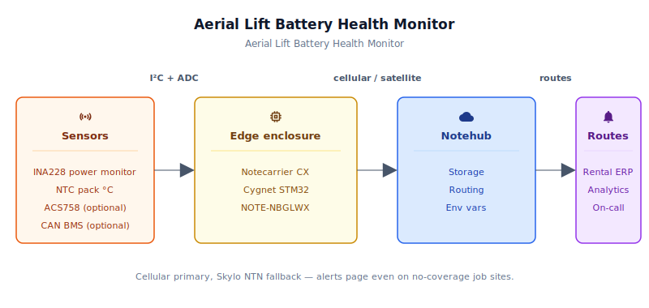
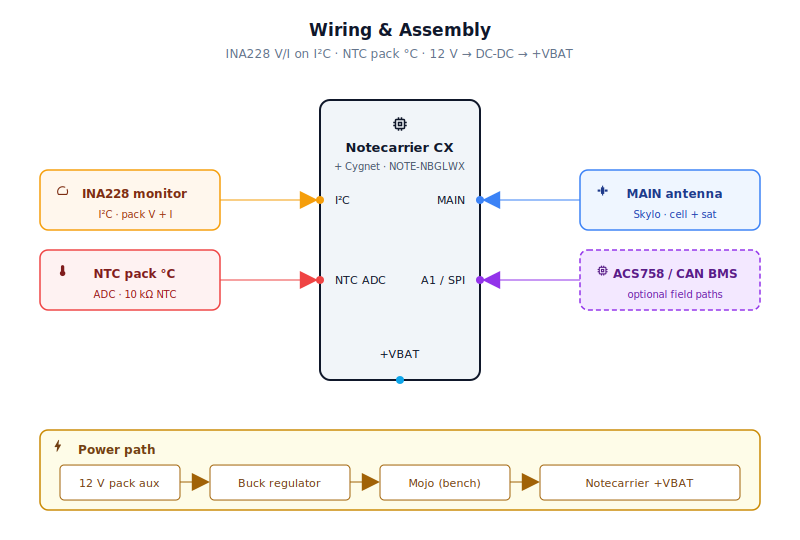
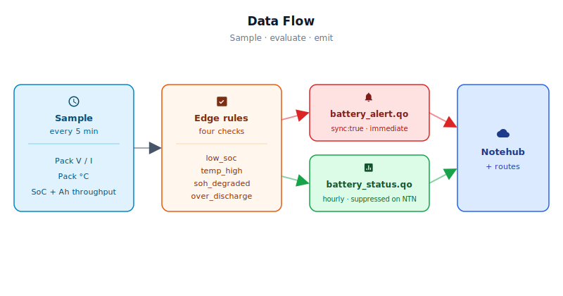

# Aerial Lift / Rental Equipment Battery Health Monitor

<Note>

This reference application is intended to provide inspiration and help you get started quickly. It uses specific hardware choices that may not match your own implementation. Focus on the sections most relevant to your use case. If you'd like to discuss your project and whether it's a good fit for Blues, [feel free to reach out](https://blues.com/landing-pages/accelerators-contact-us/?accelerator=Aerial%20Lift%20%2F%20Rental%20Equipment%20Battery%20Health%20Monitor).

</Note>

A [battery management systems](https://blues.com/battery-management-systems/) reference design that turns the electric battery pack on a rental scissor lift, boom lift, or telehandler into a continuously-monitored asset — surfacing state of charge, depth of discharge, rolling state of health, and thermal status to the rental company's fleet management platform, over cellular with satellite fallback, wherever the lift happens to be sitting.
## 1. Project Overview

**The problem.** Electric scissor lifts, boom lifts, and telehandlers are increasingly displacing diesel units on job sites. The electric machines are quieter, cleaner, and cheaper to run — but they introduce a failure mode that diesel never had: a machine that looks fine in the yard shows up at a job site with a dead or nearly dead pack, and the rental company loses a day of revenue before anyone knows there's a problem.

Rental fleets compound this. A machine might sit on a customer's site for three weeks, come back to the yard for a quick visual inspection, and go back out the next morning. Nobody is watching the pack in between. A cell group that's developed a high-impedance connection will look fine on the charger — full voltage at the terminals — but will drop out under load a few minutes into the shift. The customer's crew loses half a day waiting for a swap. The rental company pays for an emergency service call. The battery, which might have had years of useful life left if the fault had been caught early, gets written off.

This project is the watcher. A small monitoring device clipped to the pack reads the pack bus voltage through a precision I²C power monitor (INA228) and, in field builds, pack current through either an external precision shunt wired to the INA228's differential inputs (the default, `ENABLE_ACS758 0`) or an ACS758 Hall-effect sensor on the traction conductor (the alternative, `ENABLE_ACS758 1`); records the pack temperature through a probe mounted to the battery housing; and — when the machine's **BMS** (battery management system) exposes individual cell-group voltages over **CAN** (Controller Area Network) bus — pulls those in too (see the CAN note below). From these four data streams, it continuously estimates **SoC** (state of charge), accumulates a **cycle Ah throughput** total via a sampled Ah estimator, and maintains a rolling **SoH** (state of health) estimate updated whenever a heuristic charge-cycle threshold is crossed. Three of those numbers, plus temperature, show up on the rental company's fleet dashboard within seconds of a threshold trip — and in a single hourly telemetry note the rest of the time.

> **Scope.** Pack current can be measured three ways: an external precision shunt wired to the INA228 (the default field path, recommended), an ACS758 Hall-effect sensor (galvanic-isolation alternative), or the INA228's onboard 15 mΩ shunt (bench/POC only, ≤10 A — never wire to real traction currents). Optional CAN BMS cell-group monitoring ships as a placeholder; the CAN ID and frame parser require vendor-specific updates before use in the field. See §3 BOM, §6 firmware build flags, and §9 for the full details.

**Why Notecard.** The lift is on a construction site that is unlikely to have public WiFi, and even if it does, the rental company's fleet app has to work identically at every job site — a residential project in rural Montana and a high-rise downtown. Cellular removes that dependency entirely: no network form, no AP to pair with, no IT ticket. But construction sites can also be in coverage gaps — in-building below grade, in mountain foothills, in rural areas where the crew has gone to break ground. That's where the Skylo satellite fallback earns its place: the same JSON note that normally travels over LTE-M can, transparently to the firmware, use the Notecard for Skylo's NTN (Non-Terrestrial Network) radio when cellular isn't reachable. The satellite link isn't the primary path — it's the insurance policy that makes the system work the same way at every job. The Notecard for Skylo integrates cellular, WiFi, and Skylo satellite on a single M.2 SoM, so there's no companion board to wire up and no secondary UART to manage.

**Deployment scenario.** A sealed IP67 enclosure strapped to the battery pack housing or bolted to the machine frame near the pack, powered from the machine's 12V auxiliary circuit (derived internally from the main pack and available on most electric lifts as a utility supply). Two sensing leads run from the enclosure to the INA228 bus-voltage monitor, whose `VIN+` pad connects to the pack's positive terminal for high-side bus-voltage measurement; a single NTC probe wire runs to the pack housing; and, in field builds (`ENABLE_ACS758 1`), a separate ACS758 Hall-effect sensor connects inline on the main traction conductor for pack-current sensing. When the machine's BMS is CAN-accessible, an OBD-style cable runs to the machine's service port. No BMS modification, no charger modification, no customer involvement.

## 2. System Architecture



**Device-side responsibilities.** The onboard Cygnet STM32 host on the Notecarrier CX wakes every `sample_interval_s` seconds (default 300 s / 5 min), reads pack voltage from the INA228 over I²C (and pack current via INA228 `readCurrent()` through an external precision shunt in the default field build (`ENABLE_ACS758 0`), or from an ACS758 Hall-effect sensor on A1 in the alternative field build (`ENABLE_ACS758 1`), or from the onboard INA228 shunt in bench builds (`BENCH_ONLY 1`)), reads the pack temperature from the NTC thermistor, and optionally polls cell-group voltages from the machine's BMS over the SPI CAN interface. (**CAN BMS integration requires vendor-specific CAN ID and frame parser configuration before the feature will function with any real BMS** — the shipped firmware is a placeholder for this path; see §7.3 and §9.) From this data, it updates SoC via a voltage-based OCV (open-circuit voltage) lookup table, accumulates absolute current above a 0.5 A noise floor into a running cycle Ah throughput total (one sampled Ah estimate per wake), and updates a rolling SoH estimate when a heuristic pseudo-cycle completes — SoC dips below 30% then recovers above 90%. Threshold checks run after every sample; any trip fires an immediate note. Between wakes, [`card.attn`](https://dev.blues.io/api-reference/notecard-api/card-requests/#card-attn) cuts host power; the Notecard idles, but the assembled device also draws quiescent current from the buck regulator, INA228, thermistor divider, and any optional CAN hardware — materially above the Notecard's own idle figure. See [§9](#8-validation-and-testing) for Mojo-measured whole-device figures.

**Notecard responsibilities.** The Notecard for Skylo stores [Notes](https://dev.blues.io/api-reference/glossary/#note) in its onboard queue, manages the cellular or satellite session on the configured [`hub.set`](https://dev.blues.io/api-reference/notecard-api/hub-requests/#hub-set) `outbound` cadence, and flushes any `sync:true` alert notes immediately when a threshold trips. The Notecard also handles [environment variable](https://dev.blues.io/guides-and-tutorials/notecard-guides/understanding-environment-variables/) distribution from Notehub, so fleet-level threshold adjustments reach devices without a reflash. The Notecard for Skylo's built-in Skylo NTN radio activates automatically whenever terrestrial cellular is unavailable — no firmware logic required to manage the handoff.

**Notehub responsibilities.** [Notehub](https://notehub.io) ingests events over the Internet, stores every event, and applies project-level routes. The Notecard manages its own cellular and Skylo NTN satellite sessions against the supported carrier networks worldwide via its embedded global SIM and delivers data to Notehub. Hourly telemetry summaries and immediate alerts land in separate [Notefiles](https://dev.blues.io/api-reference/glossary/#notefile) so operators can route them differently: alerts to an on-call or rental ERP (enterprise resource planning) system for immediate triage, summaries to a long-term analytics store for cycle-life trending. [Smart Fleets](https://dev.blues.io/notehub/notehub-walkthrough/#using-smart-fleet-rules) are how a single firmware image serves machines with different pack chemistries and rated capacities — fleet-level environment variables encode the pack specs, and per-device overrides handle machines that deviate.

**Routing to the cloud (high level).** Notehub supports HTTP, MQTT, AWS, Azure, GCP, and Snowflake, among other destinations; route setup is project-specific. See the [Notehub routing docs](https://dev.blues.io/notehub/notehub-walkthrough/#routing-data-with-notehub) — this project ships no specific downstream endpoint or dashboard.

**Satellite data budget.** The Notecard for Skylo includes 10 KB of satellite data. Hourly summaries are suppressed over satellite (the `battery_status.qo` template sets `delete:true`, so any queued summaries are cleared when the Notecard establishes an NTN session rather than being routed over the expensive satellite link). Critical alerts — low SoC, thermal excursion, SoH degradation — carry no `delete` flag and travel over whatever link is available, including satellite. This ensures fleet operators are notified of dangerous pack conditions even on job sites with no cellular coverage.

## 3. Technical Summary

1. **Flash firmware.** Clone the repo, edit `firmware/lift_battery_monitor/lift_battery_monitor.ino` to set your `PRODUCT_UID` (from your [notehub.io](https://notehub.io) project), then compile and upload:
   ```bash
   arduino-cli compile -b STMicroelectronics:stm32:Blues:pnum=CYGNET firmware/lift_battery_monitor/
   arduino-cli upload  -b STMicroelectronics:stm32:Blues:pnum=CYGNET \
     -p /dev/cu.usbmodem* firmware/lift_battery_monitor/
   ```
   (Replace `/dev/cu.usbmodem*` with your platform's serial port; `COM*` on Windows.)

2. **Wire on the bench.** Connect INA228 over I²C (Qwiic), a 48V bench supply to INA228 `VIN+`, and an electronic load to `VIN−`. Open the serial monitor at 115200 baud and watch for `[meas]` lines reporting pack voltage and current.

3. **Check Notehub.** Within one minute, the **Devices** tab should show your board. The **Events** tab will populate with `_session.qo` (confirming radio), `battery_status.qo` (hourly summary), and `battery_alert.qo` (on threshold trip). Within `report_interval_m` minutes (default 60), you should see the first summary with voltage, current, temperature, SoC, SoH, cycle Ah, and CAN health.

That's it. The device is now sampling every 5 minutes, reporting hourly, and firing immediate alerts on pack fault conditions.

---

Here is a sample Note this device emits:

```json
{
  "pack_v":         48.2,
  "cur_a":          12.4,
  "temp_c":         28.5,
  "soc_pct":        74,
  "soh_pct":        88,
  "throughput_ah":  42.1,
  "can_ok":         true
}
```


## 4. Hardware Requirements

| Part | Qty | Rationale |
|------|-----|-----------|
| [Notecarrier CX](https://shop.blues.com/products/notecarrier-cx?utm_source=dev-blues&utm_medium=web&utm_campaign=store-link) | 1 | Integrated carrier with an embedded Cygnet STM32 host — no separate MCU needed. Exposes I²C (Qwiic), SPI, and six ADC pins on the dual 16-pin header. |
| [Notecard for Skylo (NOTE-NBGLWX)](https://shop.blues.com/products/notecard?utm_source=dev-blues&utm_medium=web&utm_campaign=store-link) — [Datasheet](https://dev.blues.io/datasheets/notecard-datasheet/note-nbglwx/) | 1 | Integrates LTE-M, NB-IoT, WiFi, and Skylo satellite NTN on one M.2 SoM. Cellular is the primary path; Skylo activates automatically on coverage loss. Includes 500 MB cellular + 10 KB satellite data and 10 years of service. |
| Antenna kit (included with NOTE-NBGLWX) | 1 set | Two antennas ship with every Notecard for Skylo order: (1) a Skylo-certified LTE/S-Band/L-Band antenna for the `MAIN` u.FL port; (2) a passive GPS/GNSS antenna for the `GPS` u.FL port. Both must be mounted outdoors with an unobstructed view of the sky — route leads through dedicated cable glands in the IP67 enclosure. **Do not substitute either antenna**: the NOTE-NBGLWX is certified on Skylo's network exclusively with the supplied antennas; any replacement requires a new EIRP delta test and may cause Skylo to block the device. See the [NOTE-NBGLWX datasheet — Antenna Requirements](https://dev.blues.io/datasheets/notecard-datasheet/note-nbglwx/) and the [antenna placement guide](https://dev.blues.io/datasheets/application-notes/antenna-guide/). |
| [Blues Mojo](https://shop.blues.com/products/mojo?utm_source=dev-blues&utm_medium=web&utm_campaign=store-link) | 1 | Coulomb counter on the 5V power rail for ground-truth energy validation during bring-up. Bench use only — not deployed to the field unit; see [§9](#8-validation-and-testing). |
| [Adafruit INA228 — I²C 85V, 20-bit Power Monitor (product 5832)](https://www.adafruit.com/product/5832) | 1 | **All builds — bus-voltage sensing; default field build (`ENABLE_ACS758 0`) — also current sensing via external shunt.** Provides pack bus voltage (up to 85 V common-mode) over I²C in all configurations. In the default field build the INA228 also measures pack current through an external precision shunt wired to `VIN+`/`VIN–` (see below). In the ACS758 alternative field build (`ENABLE_ACS758 1`) the INA228 is retained for bus-voltage sensing only. In bench builds (`BENCH_ONLY 1`) it measures current through the onboard 15 mΩ shunt (≤10 A). Includes STEMMA QT connector for tool-free I²C wiring. |
| External precision current shunt, rated for full pack discharge current at 50–75 mV full-scale *(default field build, `ENABLE_ACS758 0`, `BENCH_ONLY 0`)* | 1 | **Primary field current-sensing component.** Select a manganin or nichrome alloy shunt rated for the pack's peak discharge current (typically 50–200 A) at a full-scale voltage drop of 50–75 mV (example: 0.5 mΩ for 100 A at 50 mV; 0.375 mΩ for 200 A at 75 mV). Wire the shunt inline on the main traction conductor; connect INA228 `VIN+` to the shunt high side and `VIN–` to the shunt low side. After selecting a shunt, update `DEFAULT_SHUNT_MOHM` and `DEFAULT_SHUNT_MAX_A` in `lift_battery_monitor.ino` to match before building. Precision shunts in this spec range are stocked at Mouser and Digi-Key (search "current sense resistor manganin 200A"). |
| [Allegro ACS758LCB-200B-PFF-T](https://www.allegromicro.com/~/media/Files/Datasheets/ACS758-Datasheet.ashx) Hall-effect current sensor *(alternative field build — set `ENABLE_ACS758 1`)* | 0–1 | **Optional alternative to the external shunt for field current sensing.** Bidirectional ±200 A **inline** Hall-effect sensor. Use this path if breaking and re-terminating the traction conductor for an inline shunt is impractical, or if galvanic isolation from the traction bus is desired. Installation requires the main traction conductor to be broken and re-terminated through the sensor's primary conductor terminals (`IP+` → `IP–`); this is not a clamp-on or non-invasive part. The conductor work must be performed by qualified personnel following machine-specific lockout/tagout procedures. **Requires 5 V supply** (power from the Pololu 5 V rail, not Notecarrier CX +3V3; the ACS758 VCC minimum is 4.5 V). At VCC = 5 V the output is ratiometric: 2.5 V at 0 A, ±10 mV/A sensitivity. At +200 A the output reaches 4.5 V, which exceeds the Cygnet's 3.3 V ADC rail — a 10 kΩ / 20 kΩ voltage divider on `VOUT` is required (see §5). Set `ENABLE_ACS758` to `1` in `lift_battery_monitor_config.h` before building. Stocked at Digi-Key and Mouser by full part number **ACS758LCB-200B-PFF-T**. |
| 10 kΩ resistor, 1% or 5%, 1/4 W *(ACS758 alternative build only, `ENABLE_ACS758 1`)* | 0–1 | High-side leg of the ACS758 `VOUT` voltage divider. Together with the 20 kΩ low-side resistor, scales the 0–4.5 V ACS758 output to the Cygnet's 3.3 V ADC rail (×2/3 ratio). See §4 ACS758 wiring. Not required for the external-shunt default path. |
| 20 kΩ resistor, 1% or 5%, 1/4 W *(ACS758 alternative build only, `ENABLE_ACS758 1`)* | 0–1 | Low-side leg of the ACS758 `VOUT` voltage divider (from the `A1`/divider mid-point to GND). Not required for the external-shunt default path. |
| 100 nF ceramic capacitor, 10 V or higher *(ACS758 alternative build only, `ENABLE_ACS758 1`)* | 0–1 | Local bypass capacitor on the ACS758 `VCC` supply pin, placed as close to the sensor pins as possible. Suppresses high-frequency noise on the 5 V rail that would otherwise couple into the ratiometric `VOUT` output and add current-measurement error. Not required for the external-shunt default path. |
| 10 kΩ NTC thermistor, β=3950, waterproof probe | 1 | Pack housing temperature. Waterproof probe survives the enclosure penetration and battery-bay humidity. |
| 10 kΩ 1% resistor (thermistor divider) | 1 | Pull-up for the thermistor voltage divider. 1% tolerance keeps temperature error below ±1°C across the range of interest. |
| [Waveshare MCP2515 CAN Bus Module](https://www.waveshare.com/mcp2515-can-bus-module.htm) (MCP2515 controller + TJA1050 transceiver, ~23 × 33 mm, 5V logic) *(optional)* | 0–1 | Reads cell-group voltages from the machine's BMS CAN bus. This specific module provides the compact footprint needed for a sealed enclosure; do not substitute an Arduino-shield-form CAN board. Requires the level shifter described in [§5](#4-wiring-and-assembly). **The machine-side CAN connector and cable are machine-specific** — the OBD/service-port connector type, pinout, and cable gauge depend on the machine manufacturer and model and are not part of this BOM. Consult the machine's service manual for the CAN bus access port details before ordering a mating connector or cable. |
| [Adafruit TXB0104 Quad Bi-Directional Level Shifter (product 1875)](https://www.adafruit.com/product/1875) *(optional, required with CAN module)* | 0–1 | Translates the 3.3V Cygnet SPI signals (MOSI, MISO, SCK, CS) to the 5V logic level required by the Waveshare MCP2515 module. The TXB0104 uses a push-pull output stage rated for SPI — **do not substitute a MOSFET-based open-drain level converter** (such as the SparkFun BOB-12009), which is designed for I²C and is unreliable on push-pull SPI lines. |
| [Pololu 5V, 2.5A Step-Down Voltage Regulator D24V22F5](https://www.pololu.com/product/2858) | 1 | Powers the Notecarrier CX (VBAT+ accepts 2.5–5.5V) and the optional CAN module from the machine's 12V auxiliary circuit. Accepts up to 36V in; 2.5A continuous output is ample headroom. |
| IP67 waterproof enclosure, ~6×4×2″ | 1 | Protects electronics from battery-bay splash, dust, and occasional hosing during machine wash-down. |

All Blues hardware ships with an active SIM and no activation fees or monthly commitment.

## 5. Wiring and Assembly



All host I/O lands on the [Notecarrier CX](https://dev.blues.io/datasheets/notecarrier-datasheet/notecarrier-cx-v1-3/) dual 16-pin header. The Notecard for Skylo seats in the carrier's M.2 slot. The Mojo sits inline between the 5V supply output and the Notecarrier's VBAT+ pad during bench validation.

> **⚠ Safety.** Battery packs on electric aerial lifts carry potentially lethal voltages (24–80V DC) and very high fault currents. All connections to the high-voltage pack circuit must be made by qualified personnel following applicable electrical codes and the machine manufacturer's service procedures. Use appropriately rated wire, fusing, and insulation for all connections to the pack. The INA228 and its associated wiring must be rated for the pack's full voltage and anticipated fault current. This project does not provide a connection to the machine's control system and cannot command motion or charging.

**Pack-bus-voltage sensing — I²C (INA228) — all builds:**

I²C connections (same for all builds):
- Notecarrier CX **SDA** → INA228 STEMMA QT `SDA` (or breakout `SDA` pin)
- Notecarrier CX **SCL** → INA228 STEMMA QT `SCL` (or breakout `SCL` pin)
- Notecarrier CX **+3V3** → INA228 `VCC`
- Notecarrier CX **GND** → INA228 `GND`

All INA228 logic signals operate at 3.3 V referenced to pack-negative ground, which is also the Cygnet's GND rail.

**Pack-current sensing — primary field wiring (external precision shunt, `ENABLE_ACS758 0`, `BENCH_ONLY 0`):**

The external shunt is wired **inline on the main traction conductor** — current flows through it just as with the INA228 bench shunt or the ACS758, but a properly rated external shunt carries the full traction current safely. Wire the INA228 `VIN+` and `VIN–` differentially across the shunt.

> **⚠ High-current conductor work.** Breaking and re-terminating the traction conductor for an inline shunt must be performed by qualified personnel with the pack fully isolated — main contactor open, pack-negative bus bar disconnected or insulated. Follow the machine manufacturer's lockout/tagout procedures before handling the traction conductor.

High-voltage connections (external shunt primary field path):
- Battery pack positive terminal → external shunt `IN+` (high side) → INA228 `VIN+`
- External shunt `IN–` (low side) → main load/charger positive bus and INA228 `VIN–`
- Battery pack negative terminal → system GND → INA228 `GND`

`readCurrent()` returns calibrated amps because `setShunt()` is called at startup with `DEFAULT_SHUNT_MOHM * 0.001f` and `DEFAULT_SHUNT_MAX_A`. **Update those two constants in `lift_battery_monitor.ino` to match the installed shunt before building.** Insulate all wires for the pack's full voltage rating.

**Pack-current sensing — alternative field wiring (ACS758LCB-200B-PFF-T, `ENABLE_ACS758 1`):**

The ACS758LCB-200B-PFF-T is an **inline** Hall-effect current sensor — not a clamp-on or non-invasive part. The pack's main traction conductor must be **broken and re-terminated** through the sensor's primary conductor terminals (`IP+` → `IP–`). Use this path if galvanic isolation from the traction bus is required, or if the external shunt path is impractical.

> **⚠ High-current conductor work.** Breaking and re-terminating the traction conductor must be performed by qualified personnel with the pack fully isolated — main contactor open, pack-negative bus bar disconnected or insulated. Follow the machine manufacturer's lockout/tagout procedures before handling the traction conductor.

- Battery pack positive conductor → ACS758 `IP+` terminal
- ACS758 `IP–` terminal → main load/charger positive bus
- **5 V supply rail** (Pololu D24V22F5 output) → ACS758 `VCC` (place a 100 nF ceramic capacitor between `VCC` and `GND` close to the sensor pins). **Do not use Notecarrier CX +3V3** — the ACS758 VCC minimum is 4.5 V; it will not operate correctly from 3.3 V.
- Notecarrier CX **GND** → ACS758 `GND`
- ACS758 `VOUT` → 10 kΩ resistor → Notecarrier CX `A1`; 20 kΩ resistor from the `A1` node to **GND**

At VCC = 5 V the sensor is ratiometric: VOUT = 2.5 V at 0 A, ±10 mV/A sensitivity. At full-scale +200 A discharge, VOUT = 4.5 V — which exceeds the Cygnet's 3.3 V ADC rail. The 10 kΩ / 20 kΩ voltage divider scales VOUT by 2/3, so VADC_max = 3.0 V. Conversion back to current:

```
curA = (VADC × 1.5 − 2.5) / 0.010
```

One ADC count (3.3 V / 4095) maps to approximately 0.121 A. Set `ENABLE_ACS758` to `1` in `lift_battery_monitor_config.h` before building — `readPackVI()` performs this conversion automatically:

```cpp
// Alternative field path — ENABLE_ACS758 1
// VCC = 5V; VIOUT = 2.5V + (I × 10 mV/A); 10kΩ/20kΩ divider scales × 2/3
float vadc_v = analogRead(A1) * (3.3f / 4095.0f);
curA = (vadc_v * 1.5f - 2.5f) / 0.010f;
```

In this path the INA228 `readCurrent()` call is not used. Wire **both** INA228 `VIN+` and `VIN–` to the pack positive terminal so no traction current flows through the onboard shunt:

- Battery pack positive terminal → INA228 `VIN+` **and** `VIN−` (connect **both** pads to the same pack-positive node)
- Battery pack negative terminal → system GND → INA228 `GND`

> **Why both VIN+ and VIN− go to pack positive in the ACS758 path.** The Adafruit INA228 breakout has a 15 mΩ shunt hard-wired between the `VIN+` and `VIN−` pads on the PCB. If `VIN−` were wired to the load/charger positive bus, the full pack discharge current would flow through that onboard shunt — even if firmware never calls `readCurrent()`. At 50–200 A traction currents the shunt would be destroyed and could become a hazard. Shorting both pads to pack positive puts zero volts across the shunt; `readBusVoltage()` still returns the full pack voltage at `VIN+` relative to GND, unaffected by this wiring. Insulate both `VIN+` and `VIN−` wires for the pack's full voltage rating.

**Pack-bus-voltage and current sensing — bench/prototype wiring (INA228 onboard shunt, `BENCH_ONLY 1`, ≤10 A only):**

> ⚠ **Bench/prototype only.** The INA228's onboard 15 mΩ shunt is rated to approximately 10 A continuous. **Do not place the onboard shunt inline on a traction-pack conductor at real lift discharge currents (50–200 A).** This path is for bench testing with a bench supply and current-limited load only. For any field installation use the external shunt primary wiring above.

In bench builds where pack current stays below 10 A, the INA228 can simultaneously sense bus voltage and current from a single inline placement. The I²C connections are the same as documented above; add the high-voltage circuit connections below (note that `VIN−` wiring differs from the ACS758 path — here it goes to the bench load, not back to pack positive):
- Battery pack positive terminal → INA228 `VIN+` (shunt high side)
- INA228 `VIN–` (shunt low side) → bench load positive terminal
- Battery pack negative terminal → system GND → INA228 `GND`

`readCurrent()` is valid in this configuration because the 15 mΩ shunt bridges `VIN+` and `VIN–`. `setShunt()` is called with the onboard shunt values (`0.015 Ω`, `10 A`) when `BENCH_ONLY 1`; no register change is needed for bench testing.

> **Note on the Notecarrier CX v1.3 errata.** The v1.3 board silkscreen has the `MOSI` and `MISO` labels swapped on the dual 16-pin header. When wiring the CAN module's SPI, verify pin function in the [Notecarrier CX datasheet](https://dev.blues.io/datasheets/notecarrier-datasheet/notecarrier-cx-v1-3/) rather than trusting the header labels.

**Thermistor (A0):**
- Notecarrier CX **+3V3** → 10 kΩ 1% series resistor → Notecarrier CX **A0**
- Notecarrier CX **A0** (same junction) → NTC probe top lead → Notecarrier CX **GND**
- Mount the NTC probe against the pack housing with thermal compound and secure with a cable tie or adhesive pad.

**CAN module (optional, SPI, via level shifter):**

The Waveshare MCP2515 CAN Bus Module runs at 5V logic; all SPI lines must pass through the **Adafruit TXB0104** level shifter first. The TXB0104 uses a push-pull output stage and is rated for SPI — do not substitute a MOSFET-based open-drain converter. Power the CAN module from the 5V supply rail (the same output as the Pololu D24V22F5), not from the Notecarrier's +3V3 header pin.

- 5V supply (Pololu D24V22F5 output, or Mojo `LOAD` during bench validation — see **Power chain** below) → CAN module `VCC` and TXB0104 `VCCB`
- Notecarrier CX **+3V3** → TXB0104 `VCCA`; also connect TXB0104 `OE` to `VCCA` to enable the translator
- Notecarrier CX **GND** → TXB0104 `GND` and CAN module `GND`
- Notecarrier CX header **MOSI** → TXB0104 `A1` ↔ TXB0104 `B1` → CAN module `SI`
- Notecarrier CX header **MISO** → TXB0104 `A2` ↔ TXB0104 `B2` ← CAN module `SO`
- Notecarrier CX header **SCK** → TXB0104 `A3` ↔ TXB0104 `B3` → CAN module `SCK`
- Notecarrier CX header **D5** → TXB0104 `A4` ↔ TXB0104 `B4` → CAN module `CS`
- CAN module `CANH` / `CANL` → machine OBD/CAN service port `CAN_H` / `CAN_L`
- **Do not add a terminator at the device end** when connecting to an existing machine service-port stub. The vehicle/machine CAN backbone is already terminated at both ends; a third resistor loads the bus and can disrupt BMS communications. Only add a 120 Ω resistor if you have verified with a DMM that the segment is unterminated and the monitor is at a true electrical end of a dedicated CAN run.

**Ground reference — verify before connecting:**

> **⚠ Commissioning check.** This design bonds the machine's 12 V auxiliary negative, the pack negative, and the monitor's logic GND to a common rail. That assumption holds on machines where the 12 V auxiliary supply is derived directly from the main traction pack (the majority of electric aerial lifts), but some machines use an isolated 12 V DC/DC converter that is not referenced to pack negative. **Before making any connections:** measure DC voltage between the 12 V auxiliary negative terminal and the pack negative terminal with a multimeter. A reading near 0 V confirms a common reference and the wiring below is safe. Any other reading indicates an isolated auxiliary supply — in that case, use an isolated 5 V DC/DC converter module (e.g., a Murata or Vicor isolated SIP brick) to power the monitoring circuit, and note that connecting INA228 `GND` to the monitor's logic GND would bridge the isolation barrier; isolated sensing must be evaluated and approved by a qualified electrical engineer before proceeding.

**Power chain:**

> **⚠ Commissioning check — always-on aux rail.** The monitor must remain powered whenever the main traction pack is energized — including when the machine is keyed off, the charger is disconnected, and the machine is parked in storage. Dead-on-arrival conditions (parasitic discharge, thermal excursions during storage, charger faults at night) develop precisely during these intervals. **Before wiring the 12 V aux feed, verify with a multimeter that it stays live in all of the following states: key off, charger unplugged, master disconnect closed.** If the rail drops in any of those states, do not use it as the monitor's power source. Instead, run the input of the Pololu DC/DC converter directly from the main traction-pack positive terminal through an appropriately rated fuse (≤3 A slow-blow, wire gauge rated for the full pack voltage) — the Pololu D24V22F5 accepts up to 36 V; for packs above 36 V substitute a DC/DC converter rated for the full pack voltage (up to 85 V to match the INA228's common-mode limit). See §9 for the associated deployment limitation.

*Field deployment (Mojo not installed):*
- Machine 12V aux (confirmed always-on — see commissioning check above) → DC/DC converter input → 5V rail → Notecarrier CX **VBAT+** and CAN module `VCC` / TXB0104 `VCCB` (if installed)
- Machine chassis **GND** → DC/DC converter GND → Notecarrier CX **GND**

*Bench validation (Mojo installed):*
- Machine 12V aux → DC/DC converter input → 5V rail → Mojo `BAT` → Mojo `LOAD` → Notecarrier CX **VBAT+** and CAN module `VCC` / TXB0104 `VCCB` (if installed)
- Route **all** 5V loads from the Mojo `LOAD` pin so the trace captures complete 5V subsystem current — including the CAN module and level shifter — not the Notecard/Notecarrier branch alone.
- Machine chassis **GND** → DC/DC converter GND → Notecarrier CX **GND**

**Antenna (Notecard for Skylo):**
- Use the two antennas included in the NOTE-NBGLWX kit (see §4 BOM). Connect the Skylo-certified LTE/S-Band/L-Band antenna to the `MAIN` u.FL port and the passive GPS/GNSS antenna to the `GPS` u.FL port.
- Route both antenna leads through dedicated cable glands to the exterior of the IP67 enclosure. Both antennas must be placed outdoors with a clear view of the sky; no metallic obstruction between the antenna and the sky for the `MAIN` antenna is required for Skylo satellite acquisition.
- Do not substitute either antenna — see the §3 BOM row for the certification implications. See the [antenna placement guide](https://dev.blues.io/datasheets/application-notes/antenna-guide/) for routing and clearance best practices.

## 6. Notehub Setup

1. **Create a project.** Sign up at [notehub.io](https://notehub.io) and [create a project](https://dev.blues.io/quickstart/notecard-quickstart/notecard-and-notecarrier-pi/#set-up-notehub). Copy the [ProductUID](https://dev.blues.io/notehub/notehub-walkthrough/#finding-a-productuid) (it looks like `com.your-company.your-name:lift-battery`) and paste it into the `#define PRODUCT_UID ""` line in the firmware sketch.

2. **Claim the Notecard.** Power the assembled unit. The Notecard associates with your project on first cellular session — no manual claim step. The device appears in the **Devices** tab within a few minutes.

3. **Create a Fleet per machine category.** [Fleets](https://dev.blues.io/guides-and-tutorials/fleet-admin-guide/) group devices for shared configuration. A natural scheme for a rental company: one fleet per pack chemistry and voltage (e.g., "Fleet-Lithium-48V", "Fleet-LeadAcid-48V"). Assign new devices to the correct fleet manually on first claim, or use [per-device environment overrides](https://dev.blues.io/guides-and-tutorials/fleet-admin-guide/) for machines that deviate from the fleet spec — the firmware does not emit a `pack_chemistry` field in telemetry, so Smart Fleet rules cannot match on chemistry automatically.

4. **Set environment variables.** In Notehub: **Fleets → your fleet → Environment** (or **Devices → your device → Environment** for a per-machine override). All variables are optional; firmware defaults are shown. The device picks up changes on its next inbound sync — no reflash, no truck roll.

   | Variable | Default | Purpose |
   |---|---|---|
   | `soc_alert_pct` | `20.0` | SoC (%) below which `soc_low` alert fires. |
   | `temp_high_c` | `45.0` | Pack temperature (°C) above which `temp_high` fires. |
   | `temp_low_c` | `5.0` | Pack temperature (°C) below which `temp_low` fires (charging damage risk). |
   | `soh_alert_pct` | `70.0` | Rolling SoH (%) below which `soh_low` alert fires. |
   | `rated_cap_ah` | `100.0` | Nameplate capacity of the pack in Ah. Used as the denominator in SoH estimation — set this correctly for your machine model. |
   | `chemistry` | `lithium` | Battery chemistry for the OCV→SoC lookup table. Accepts `lithium` (LiFePO4-biased) or `lead_acid`. |
   | `cell_delta_mv` | `200.0` | Maximum permitted cell-group voltage imbalance in mV (CAN only). Above this threshold, `cell_imbalance` fires. |
   | `sample_interval_s` | `300` | Seconds between samples. The host sleeps between wakes via `card.attn`. |
   | `report_interval_m` | `60` | Minutes between summary notes. On the next wake after a Notehub change, the firmware re-applies `hub.set` so the Notecard outbound cadence stays aligned with the new value — no reboot required. |
   | `acs758_zero_v` | `2.5` | *(Field builds, `ENABLE_ACS758 1` only.)* ACS758 output voltage at zero current (V). Nominal 2.5 V at VCC = 5 V; measure with the machine powered and the main contactor open (no traction current) at commissioning and set to the observed value to calibrate out Hall-sensor zero-offset error. A biased zero point shifts every Ah accumulation sample, corrupting throughput and SoH over time. |
   | `acs758_mv_per_a` | `10.0` | *(Field builds, `ENABLE_ACS758 1` only.)* ACS758 sensitivity (mV/A). 10.0 mV/A for the ACS758LCB-200B variant specified in the BOM; consult the datasheet if a different variant is substituted. |

5. **Configure routes.** Add one [route](https://dev.blues.io/notehub/notehub-walkthrough/#routing-data-with-notehub) targeting `battery_alert.qo` (to an on-call endpoint or rental ERP webhook for real-time triage) and a second targeting `battery_status.qo` (to a long-term analytics store for cycle-life trending). Separating the two Notefiles at the source means you can deliver them to different systems at different urgency levels without any filtering inside the route.

### What you should see in Notehub

Within a minute of first power-on, the **Events** tab should start populating. Three event types appear:

- **`_session.qo`** (appears first) — automatic Notecard housekeeping on each cellular or satellite session. Confirms the radio is reaching Notehub. No custom body; the Notecard logs this automatically.
- **`battery_status.qo`** (appears after `report_interval_m` minutes; default 60) — hourly rolling summary with all data from the sample window. Sample body:
  ```json
  {
    "pack_v":         48.2,
    "cur_a":          12.4,
    "temp_c":         28.5,
    "soc_pct":        74,
    "soh_pct":        88,
    "throughput_ah":  42.1,
    "can_ok":         true
  }
  ```
  **Field notes:**
  - `cur_a` is positive during discharge. Negative during charge (if the pack is being actively charged).
  - All seven fields are always present. Expect them on every summary.
  - `temp_c` is averaged over valid (non-NaN) reads only. If the thermistor produces no valid reads in the window, `temp_c` will be `-9999.0` — check thermistor wiring if you see this alongside reasonable `pack_v`.
  - `can_ok` is always `false` when `ENABLE_CAN_BMS` is 0 (the default); this is expected behavior, not a fault. It only reflects live CAN bus health when `ENABLE_CAN_BMS` is 1 and a CAN module is wired.

- **`battery_alert.qo`** (appears only on threshold trip) — emitted immediately (within 15–60 seconds) with `sync:true` for all alert types except `can_error`. All five fields always present: `alert` (string), `pack_v` (V), `soc_pct` (%), `temp_c` (°C), `extra_v` (alert-specific value). See §7 for the per-alert payload shapes. `can_error` is the explicit exception: it queues for normal outbound delivery (not `sync:true`) and is suppressed once per hour after each emission to avoid flooding the Notefile if the BMS is powered off.

## 7. Firmware Design

Four files in [`firmware/lift_battery_monitor/`](firmware/lift_battery_monitor/):

- [`lift_battery_monitor_config.h`](firmware/lift_battery_monitor/lift_battery_monitor_config.h) — **build-configuration toggles** (`ENABLE_CAN_BMS`, `ENABLE_ACS758`, `BENCH_ONLY`). **This is the one file to edit** when changing build options; it is included by both the `.ino` and the `.cpp` so both translation units always agree.
- [`lift_battery_monitor.ino`](firmware/lift_battery_monitor/lift_battery_monitor.ino) — global declarations, `setup()`, and `loop()`
- [`lift_battery_monitor_helpers.cpp`](firmware/lift_battery_monitor/lift_battery_monitor_helpers.cpp) — all function implementations: Notecard config, sensor reads, SoC/SoH estimation, alert logic
- [`lift_battery_monitor_helpers.h`](firmware/lift_battery_monitor/lift_battery_monitor_helpers.h) — shared types (`PersistState`, `Config`), `extern` declarations, and function prototypes

### 6.1 Installing and flashing

**Dependencies:**

- **Arduino core for STM32** — [`stm32duino/Arduino_Core_STM32`](https://github.com/stm32duino/Arduino_Core_STM32). Install via Arduino IDE Boards Manager (search "STM32 MCU based boards") or add the index URL `https://github.com/stm32duino/BoardManagerFiles/raw/main/package_stmicroelectronics_index.json` under **File → Preferences → Additional Boards Manager URLs**. Select **Blues Cygnet** as the board target (canonical FQBN: `STMicroelectronics:stm32:Blues:pnum=CYGNET`).
- **`Blues Wireless Notecard`** — install via Arduino Library Manager or `arduino-cli lib install "Blues Wireless Notecard"`. See [note-arduino releases](https://github.com/blues/note-arduino/releases) for the latest.
- **`Adafruit INA228`** — install via Library Manager or `arduino-cli lib install "Adafruit INA228"`. Pulls in `Adafruit BusIO` as a dependency. The firmware calls `readBusVoltage()` and `readCurrent()` — the modern API defined on the `Adafruit_INA2xx` base class; these names were verified against the current library source (`Adafruit_INA2xx.h`).
- **`mcp2515`** by autowp *(only if `ENABLE_CAN_BMS` is set to `1` in `lift_battery_monitor_config.h`)* — install via Library Manager or `arduino-cli lib install "mcp2515"`.

**Flashing — Arduino IDE:** open `lift_battery_monitor.ino`, select Cygnet as the board, click **Upload**. The Notecarrier CX's built-in ST-Link means no external programmer is needed.

**Flashing — `arduino-cli`:**

First, confirm your STM32 core version and FQBN:
```bash
arduino-cli board listall | grep -i cygnet
```

The canonical FQBN is `STMicroelectronics:stm32:Blues:pnum=CYGNET`; substitute whatever `listall` reports if your installed core differs. Use this compile and upload sequence:
```bash
# Compile
arduino-cli compile -b STMicroelectronics:stm32:Blues:pnum=CYGNET firmware/lift_battery_monitor/

# Upload (replace /dev/cu.usbmodem* with your serial port)
arduino-cli upload  -b STMicroelectronics:stm32:Blues:pnum=CYGNET \
  -p /dev/cu.usbmodem* firmware/lift_battery_monitor/
```

**Platform-specific serial ports:**
- **macOS:** `/dev/cu.usbmodem*` (wildcard matches the Notecarrier CX's ST-Link VCP)
- **Linux:** `/dev/ttyACM*` or `/dev/ttyUSB*` (check `ls /dev/tty*` after plugging in)
- **Windows:** `COM3` (or higher; check Device Manager → Ports)

Open the serial monitor at **115200 baud** to watch `[meas]` lines during bring-up. After each sample cycle, the host sleeps for `sample_interval_s` seconds — the serial output will go quiet until the next wake. That's normal; it means `card.attn` is correctly cutting host power.

### 6.2 Modules

| Responsibility | Where |
|---|---|
| Notecard configuration (`hub.set`, templates) | `notecardConfigure`, `defineTemplates` |
| Env-variable fetch and clamp | `fetchEnvOverrides` |
| Pack voltage (INA228) + current (external shunt via INA228, or ACS758 on A1) | `readPackVI` |
| NTC thermistor read | `readPackTempC` |
| OCV→SoC lookup + linear interpolation | `voltageToSoC` |
| Sampled Ah throughput accumulator and SoH update | `updateThroughput`, `updateSoH` |
| Alert evaluation and emission | `checkAlerts`, `sendAlert` |
| Hourly summary emission | `sendSummary` |
| Optional CAN BMS cell-group read | `pollCanBms` *(#if ENABLE_CAN_BMS)* |
| Persistent state across sleep cycles | `PersistState` + `NotePayloadSaveAndSleep` / `NotePayloadRetrieveAfterSleep` |

### 6.3 Sensor reading strategy

**INA228.** The Adafruit INA228 (0x40 default I²C address) provides a 20-bit measurement of bus voltage (up to 85 V) and, when configured for it, differential current through an external shunt wired to `VIN+`/`VIN–`. The firmware always calls `readBusVoltage()` to read pack bus voltage. In the default field build (`ENABLE_ACS758 0`, `BENCH_ONLY 0`) it also calls `readCurrent()` for current through the external field shunt; in the ACS758 alternative build (`ENABLE_ACS758 1`) `readCurrent()` is not called and pack current comes from the ACS758 Hall-effect sensor on A1 instead; in bench builds (`BENCH_ONLY 1`) `readCurrent()` returns current through the onboard 15 mΩ shunt. A single I²C transaction for bus voltage takes under 5 ms. `setShunt()` is called at startup with `DEFAULT_SHUNT_MOHM * 0.001f` and `DEFAULT_SHUNT_MAX_A` (field/external shunt path) or `0.015 Ω` / `10 A` (bench path), writing the SHUNT_CAL register to calibrate `readCurrent()` for the installed shunt.

**Thermistor.** Sixteen-sample average of 12-bit ADC counts on A0, converted to resistance via the divider ratio, then converted to temperature via the β (Steinhart-Hart simplified) equation: `T = 1 / (1/T₀ + (1/β) × ln(R/R₀))`.

**CAN BMS** *(conditional).* When `ENABLE_CAN_BMS` is 1, the MCP2515 is initialized at 250 kbps (configurable), and each wake polls for pending CAN frames up to a short timeout. Frames matching `BMS_CELL_GROUP_ID` are parsed as 2-byte big-endian cell-group voltages in millivolts. A classic CAN frame carries at most 8 data bytes (DLC ≤ 8), so at most four 16-bit values fit in one frame; the placeholder parser extracts however many complete pairs the frame's DLC permits. The exact CAN ID, frame layout, and whether multi-frame messages are used are all BMS-specific. The firmware ships a placeholder; the developer must update `BMS_CELL_GROUP_ID` and `parseCellGroupFrame()` to match the actual BMS protocol. Common rental-equipment BMS vendors expose cell voltages on SAE J1939 parameter groups at 250 kbps; consult the machine's service documentation.

### 6.4 Event payload design

Two [template-backed](https://dev.blues.io/notecard/notecard-walkthrough/low-bandwidth-design/#working-with-note-templates) Notefiles. Compact format (`format: "compact"`) with unique port numbers is required so notes are compatible with satellite transmission. `battery_status.qo` carries `delete: true`, which instructs the Notecard to discard any queued summaries if the Notecard establishes a satellite NTN session (rather than sending several hours of accumulated summaries over the metered satellite link). `battery_alert.qo` has no `delete` flag — critical alerts must get through on any available transport.

**`battery_status.qo` hourly summary:**

```json
{
  "pack_v":         48.2,
  "cur_a":          12.4,
  "temp_c":         28.5,
  "soc_pct":        74,
  "soh_pct":        88,
  "throughput_ah":  42.1,
  "can_ok":         true
}
```

**`battery_alert.qo` immediate alert (example — `soc_low`):**

```json
{
  "alert":    "soc_low",
  "pack_v":   43.1,
  "soc_pct":  18,
  "temp_c":   27.3,
  "extra_v":  0.0
}
```

All five fields are always present on every alert note. `extra_v` is `0.0` for alert types that carry no auxiliary value (`soc_low`, `can_error`); for other types it carries alert-specific context (see §8).

### 6.5 Low-power strategy

The sidecar draws power from the machine. Even so, keeping the host genuinely asleep minimizes heat dissipation in the battery bay and ensures the monitoring device itself doesn't materially drain the pack it's monitoring. After each sample cycle, the host calls `NotePayloadSaveAndSleep`, which serializes the `PersistState` struct into Notecard flash and issues a [`card.attn`](https://dev.blues.io/api-reference/notecard-api/card-requests/#card-attn) `sleep` request to cut host power for `sample_interval_s` seconds. On the next wake the MCU re-enters `setup()` from cold, and `NotePayloadRetrieveAfterSleep` rehydrates the state — SoC, SoH accumulators, alert cooldowns, and the running summary window all survive the sleep cycle.

The Notecard itself idles at ~8–18 µA between cellular sessions — this is the Notecard SoM's own draw from the datasheet. The assembled device additionally draws quiescent current from the buck regulator, INA228 breakout (always-on I²C), thermistor divider, and any optional CAN hardware, so the whole-device idle figure at the 5V rail is materially higher. Use Mojo during bench validation to measure the actual assembled current rather than relying on the Notecard datasheet figure alone; see [§9](#8-validation-and-testing). Sampling runs at 5-minute intervals; transmission runs at 60-minute intervals. When `report_interval_m` is changed via Notehub, the firmware re-applies `hub.set` on the next wake so the Notecard outbound cadence stays in sync without requiring a reboot. All alerts except `can_error` bypass the transmit timer entirely via `sync: true`. `can_error` is the explicit exception — it fires on the first failed CAN poll (once the Notecard clock is set), then is suppressed for one hour after each emission; it queues for normal outbound delivery rather than triggering an immediate cellular session.

### 6.6 Retry and error handling

- The first Notecard transaction uses `sendRequestWithRetry(req, 10)` to paper over the cold-boot I²C race documented in the note-arduino library.
- If `readPackVI()` returns values outside the plausible range (bus voltage < 10 V or > 85 V — the INA228's common-mode hardware limit — or current outside ±200 A), or if the INA228 is not found at startup, the firmware aborts that entire sample cycle: it persists state and goes to sleep immediately, without advancing the summary accumulators, updating SoC/SoH/DoD, or evaluating any alert thresholds. `readPackTempC()` is called before `readPackVI()` so temperature has already been read, but its value is discarded when the cycle aborts — the thermistor accumulator does not advance for that wake. Alert cooldown epochs survive the abort in persisted state. If all wakes in a `report_interval_m` window abort, `summ_count` will be zero. When the report timer fires on an empty window, `sendSummary()` advances `last_summ_epoch` without emitting a note, starting a fresh full report interval from that point. This ensures the first successful sample after a prolonged sensor fault begins a new window rather than immediately triggering an under-populated summary. When a summary is sent, all seven fields are always present; `temp_c` uses only valid (non-NaN) thermistor reads in its average and will be `-9999.0` if the thermistor produced no valid reads across the successful samples in the window.
- Alert cooldowns (`ALERT_COOLDOWN_SEC`, default 30 min) prevent a slow-drifting threshold from paging the on-call every sample cycle.
- CAN read failures (when enabled) set `can_ok: false` in the next summary. A `can_error` alert fires immediately on the first failed poll (once the Notecard clock is set); subsequent failures emit at most once per hour. CAN failures do not block the non-CAN sensors from reporting normally.

### 6.7 Key code snippet 1: satellite-aware template definition

`format: "compact"` is required for notes to be transmittable over the Skylo NTN satellite link. The `port` is a unique integer (1–100) that lets the Notecard reference the Notefile over the air by number rather than full string. `delete: true` on the hourly summary prevents it from being routed over the metered satellite link.

**Compact format type hints:** The template body uses numeric "hints" to encode field types for on-wire compression:
- `14.1` = 32-bit IEEE 754 float (4 bytes) — used for voltages, currents, temperatures, Ah
- `21` = 8-bit unsigned integer (1 byte) — used for percentages (SoC, SoH, 0–100)
- `true` / `false` = boolean (1 bit, packed) — used for status flags like `can_ok`

These type codes are how the Notecard knows to pack `pack_v: 48.2` and `soc_pct: 74` into minimal bytes for satellite transmission.

```cpp
J *req = notecard.newRequest("note.template");
JAddStringToObject(req, "file", "battery_status.qo");
JAddNumberToObject(req, "port", STATUS_PORT);          // 50
JAddStringToObject(req, "format", "compact");
JAddBoolToObject(req, "delete", true);  // discard queued summaries if satellite connects
J *body = JAddObjectToObject(req, "body");
JAddNumberToObject(body, "pack_v",  14.1);  // note-arduino compact type hint: 4-byte float32
JAddNumberToObject(body, "cur_a",   14.1);
JAddNumberToObject(body, "temp_c",  14.1);
JAddNumberToObject(body, "soc_pct", 21);    // 1-byte uint8
JAddNumberToObject(body, "soh_pct",       21);
JAddNumberToObject(body, "throughput_ah", 14.1);
JAddBoolToObject(body,   "can_ok",        true);
notecard.sendRequest(req);
```

### 6.8 Key code snippet 2: immediate-sync alert

`sync: true` wakes the Notecard's radio immediately rather than waiting for the next hourly outbound window. If cellular isn't available, the Notecard for Skylo will establish a Skylo satellite session instead.

```cpp
J *req = notecard.newRequest("note.add");
JAddStringToObject(req, "file", "battery_alert.qo");
// port is bound in note.template (ALERT_PORT = 51); it is not a valid note.add field.
JAddBoolToObject(req, "sync", true);
J *body = JAddObjectToObject(req, "body");
JAddStringToObject(body, "alert",   "soc_low");
JAddNumberToObject(body, "pack_v",  packV);
JAddNumberToObject(body, "soc_pct", (int)socPct);
JAddNumberToObject(body, "temp_c",  isnan(tempC) ? -9999.0f : tempC);
JAddNumberToObject(body, "extra_v", 0.0f);  // always present; 0.0 when no aux value
notecard.sendRequestWithRetry(req, 10);
```

### 6.9 Key code snippet 3: sleep with state persistence

The persistent state struct is serialized to Notecard flash before the host powers down. On the next wake, `NotePayloadRetrieveAfterSleep` rehydrates it — accumulator totals, alert cooldowns, and SoH history all survive.

```cpp
NotePayloadDesc payload = {0};
NotePayloadAddSegment(&payload, STATE_SEG_ID, &state, sizeof(state));
NotePayloadSaveAndSleep(&payload, cfg.sample_interval_s, NULL);
// Execution does not return here; the Notecard cuts host power.
```

### 6.10 Key code snippet 4: SoC interpolation from OCV lookup table

Linear interpolation between table entries smooths the SoC curve. The table is selected at runtime based on the `chemistry` environment variable.

```cpp
float voltageToSoC(float voltage, bool isLithium) {
    const float (*tbl)[2] = isLithium ? SOC_TABLE_LITHIUM : SOC_TABLE_LEAD_ACID;
    const int   n = isLithium ? SOC_LITHIUM_ROWS : SOC_LEAD_ACID_ROWS;
    if (voltage >= tbl[0][0]) return tbl[0][1];
    if (voltage <= tbl[n-1][0]) return tbl[n-1][1];
    for (int i = 0; i < n - 1; i++) {
        if (voltage >= tbl[i+1][0]) {
            float slope = (tbl[i][1] - tbl[i+1][1]) / (tbl[i][0] - tbl[i+1][0]);
            return tbl[i+1][1] + slope * (voltage - tbl[i+1][0]);
        }
    }
    return 0.0f;
}
```

## 8. Data Flow



Every `sample_interval_s` seconds the firmware wakes, reads up to four data sources, and decides what to emit. The two transmit paths — alerts and summaries — run on independent timers and are completely decoupled from each other.

**Collected** (per wake):
- Pack bus voltage (V) — INA228 over I²C (`readBusVoltage()`), all builds
- Pack current (A) — **default field build** (`ENABLE_ACS758 0`, `BENCH_ONLY 0`): INA228 `readCurrent()` through external precision shunt; **alternative field build** (`ENABLE_ACS758 1`): ACS758LCB-200B-PFF-T Hall-effect sensor on A1; **bench build** (`BENCH_ONLY 1`): INA228 onboard 15 mΩ shunt via `readCurrent()` (≤ 10 A only)
- Pack housing temperature (°C) — NTC thermistor on A0
- Cell-group voltages in mV (up to 4 per frame from the placeholder parser) — optional CAN BMS

**Computed** (per wake, from collected + persisted state):
- SoC (%) — voltage-based OCV lookup, linearly interpolated; no temperature compensation (see [§10](#9-limitations-and-next-steps))
- Cycle Ah throughput — sampled bidirectional Ah accumulator (`|current| × Δt` once per wake, 0.5 A noise floor); counts both charge and discharge current; resets when the pseudo-cycle SoH threshold triggers. **Note:** this is not depth of discharge — it does not track the net discharged deficit below full; see §10 for the production Coulomb-counting extension.
- SoH (%) — EWMA of discharge-only Ah accumulated per pseudo-cycle divided by `rated_cap_ah`; updated when SoC crosses the 30% → 90% heuristic threshold

**Transmitted:**
- `battery_status.qo` — one record per `report_interval_m` (default 24 records/day), queued and flushed at the Notecard's hourly outbound sync. Contains window-averaged pack_v, cur_a, temp_c, plus the current SoC, SoH, cycle Ah throughput accumulator (`throughput_ah`), and CAN health flag (`can_ok` is `false` by design when `ENABLE_CAN_BMS=0` — not a fault). Compact-encoded; deleted if satellite session is established. Example body:

  ```json
  { "pack_v": 48.2, "cur_a": 12.4, "temp_c": 28.5, "soc_pct": 74, "soh_pct": 88, "throughput_ah": 42.1, "can_ok": true }
  ```
- `battery_alert.qo` — emitted only on a threshold trip. All alert types except `can_error` carry `sync: true` to bypass the outbound timer and transmit immediately over cellular or Skylo satellite, whichever is available. `can_error` queues for normal outbound delivery (see below). Per-alert 30-minute cooldown prevents repeated paging.

**Alert triggers:**

All alert notes share a fixed compact schema with five fields always present: `alert` (string), `pack_v` (V), `soc_pct` (%), `temp_c` (°C; `-9999.0` if no valid thermistor read at fire time), and `extra_v` (float, always emitted — `0.0` when no auxiliary value applies). Downstream consumers should expect all five fields on every alert note.

| Alert Type | Trigger | `extra_v` value | Notes |
|---|---|---|---|
| `soc_low` | SoC drops below `soc_alert_pct` | `0.0` | Example: `{"alert":"soc_low","pack_v":43.1,"soc_pct":18,"temp_c":27.3,"extra_v":0.0}` |
| `temp_high` | Temp exceeds `temp_high_c` | Temperature at trip (°C) | Same as `temp_c`. Lithium loses capacity above ~45°C; runaway risk above 60°C. |
| `temp_low` | Temp falls below `temp_low_c` | Temperature at trip (°C) | Lithium must not charge below 0°C. |
| `soh_low` | Rolling SoH drops below `soh_alert_pct` | Current SoH (%) | Signal to schedule pack inspection or replacement. |
| `cell_imbalance` (CAN) | Max–min cell voltage exceeds `cell_delta_mv` | Voltage delta (mV) | `pack_v` = `0.0`, `temp_c` = `-9999.0` (CAN poll doesn't re-sample V/I/T). |
| `can_error` (CAN) | No CAN frame received during poll window | `0.0` | Fires on first failure; suppressed 1 hour after each emission. `pack_v` = `0.0`, `temp_c` = `-9999.0`. Queues for normal outbound (not `sync:true`). |

**Routing:** Notehub fans `battery_alert.qo` to a real-time notification channel and `battery_status.qo` to a long-term analytics store for cycle trending and fleet-level SoH dashboards. See the [Notehub routing docs](https://dev.blues.io/notehub/notehub-walkthrough/#routing-data-with-notehub) for setup details — this project ships no specific downstream endpoint.

## 9. Validation and Testing

**Expected cadence.** In steady state on a healthy machine, expect one `battery_status.qo` per hour and zero `battery_alert.qo` events. SoH will start at `100%` and update toward the true measured value after the first full discharge/charge cycle — budget a few days of normal operation before the SoH number stabilizes. Alert threshold trips during the first week are likely the result of default thresholds not matching the specific pack; tune via environment variables rather than reflashing.

**Bench bring-up.** Before connecting to a live machine:
1. Power the Notecarrier CX + Notecard from a bench supply at 5V through the Mojo.
2. Connect the bench supply positive to INA228 `VIN+` (the shunt high side); connect INA228 `VIN–` to a bench electronic load set to 1–2 A constant current; return the electronic load to the supply GND = INA228 `GND`. Set the supply to 48 V. An electronic load is far safer and more controllable than a power resistor here: 48 V at 5 A is 240 W and a resistive load rated for that power becomes dangerously hot. If only a resistor is available, select at least a 50 W chassis-mount unit and keep the test brief.
3. Check the serial output at 115200 baud: look for `[meas]` lines reporting reasonable `pack_v` and `cur_a` values, then verify the first `battery_status.qo` in Notehub within the first `report_interval_m` minutes.
4. Drop `soc_alert_pct` to a high value (e.g., `95`) via the Fleet environment to force an immediate alert — confirm `battery_alert.qo` appears in Notehub with `sync: true` latency (typically 15–60 s from cellular session establishment).

**Validating power behavior with Mojo.** The Blues Mojo contains an LTC2959 coulomb counter accurate to 1% over its measurement range. For a whole-device measurement, use the bench wiring in [§5](#4-wiring-and-assembly): splice Mojo so it intercepts all 5V loads — the Notecarrier CX VBAT+ pad and, when the CAN subsystem is installed, the CAN module VCC and TXB0104 VCCB supply lines. With all loads downstream of Mojo the deep-sleep current shown in the trace includes the INA228, thermistor divider, buck regulator, and optional CAN hardware in addition to the Notecard itself. The assembled idle figure will therefore be materially higher than the Notecard's published 8–18 µA alone — use Mojo to determine the actual number for your specific build rather than relying on the datasheet figure. Per-state current figures (Notecard rows from the [NOTE-NBGLWX datasheet](https://dev.blues.io/datasheets/notecard-datasheet/note-nbglwx/); host-awake and CAN rows estimated from component specs — verify with Mojo):

| Firmware state | Current @ 5V |
|---|---|
| Deep sleep (host off, Notecard idle between sessions) | ~8–18 µA — Notecard alone ([NOTE-NBGLWX datasheet](https://dev.blues.io/datasheets/notecard-datasheet/note-nbglwx/)). Assembled device draws materially more: INA228, thermistor divider, and buck regulator each contribute quiescent current. **Measure the assembled idle with Mojo** to determine the actual figure for your specific build. |
| Host awake, sampling (INA228 I²C + ADC read, ~2–3 s) | **Initial estimate ~15–25 mA at the 5V rail** (derived from Cygnet STM32 active-run + INA228 + thermistor divider + buck-regulator quiescent specs; not bench-measured). Add ~5–10 mA if `ENABLE_ACS758 1` (ACS758 VCC load at 5 V). **Measure with Mojo before deployment** — actual assembled current varies with PCB layout, regulator selection, and peripheral choices. |
| CAN polling (when ENABLE_CAN_BMS=1, CAN module powered from Mojo LOAD output) | **Initial estimate ~10–15 mA additional** above the host-awake baseline (derived from MCP2515 + TJA1050 + TXB0104 datasheet quiescent figures; not bench-measured). **Measure with Mojo** with the full CAN subsystem downstream of the Mojo LOAD pin before relying on this number. |
| Cellular session (LTE-M outbound sync) | ~250 mA average — Notecard modem active ([NOTE-NBGLWX datasheet](https://dev.blues.io/datasheets/notecard-datasheet/note-nbglwx/)). The NOTE-NBGLWX is LTE-M/NB-IoT/GPRS — no GSM 2 A burst. Add assembled idle draw for the session duration. |
| WiFi session (when WiFi link is used) | ~80 mA average — Notecard WiFi active. Add assembled idle draw for the session duration. |
| Satellite NTN session (Skylo) | Modem active during NTN acquisition and transmit — see [NOTE-NBGLWX datasheet](https://dev.blues.io/datasheets/notecard-datasheet/note-nbglwx/) for confirmed NTN-mode current figures. Session establishment typically 1–3 min. |

**Determining 24-hour energy consumption.** Use Mojo to measure the integrated charge over one complete sample cycle (deep sleep + host wake + any radio activity) and one complete cellular session separately. With firmware defaults (5-minute sample, hourly cellular sync), the 24-hour total is approximately: (sleep + wake charge per cycle × 288 cycles/day) + (cellular session charge × 24 sessions/day). Do not use estimated per-component figures for this calculation — the assembled quiescent current varies significantly with buck-regulator selection, PCB routing, and peripheral choices. Measure the actual assembled build with Mojo before specifying battery backup capacity. If the Mojo trace shows a continuous elevated baseline rather than brief wake pulses, the host is not sleeping — confirm `NotePayloadSaveAndSleep` is not returning early (see [card.attn docs](https://dev.blues.io/api-reference/notecard-api/card-requests/#card-attn)). Hourly bursts that run 2 minutes or longer typically indicate marginal cellular signal; move the antenna or check Skylo coverage at the test site.

Satellite sessions consume an order of magnitude more energy per kilobyte than LTE-M. Since summaries are suppressed over satellite (`delete: true` on the template), the satellite path should only fire alert-sized payloads — typically under 100 bytes each. One or two alerts per satellite session is an acceptable budget for a critical low-SoC event; a session that sends many alerts in rapid succession suggests alert dedup is not working and the cooldown should be verified.

Mojo is not deployed to the field unit; its role ends when a firmware revision passes the bench trace check.

### Common bench issues

| Symptom | Likely cause | What to check |
|---|---|---|
| Device never appears in Notehub **Devices** tab. | `PRODUCT_UID` wrong or empty; antenna not outdoors. | Re-verify `PRODUCT_UID`. Move the unit outdoors with antenna pointed up. Confirm `_session.qo` events — none means no radio connection. |
| `_session.qo` appears but no `battery_status.qo`. | First `report_interval_m` has not elapsed, or `summ_count` stayed zero because all sensor reads were rejected. | Check serial at 115200 baud for `[meas]` lines. Confirm INA228 is powered and `pack_v` is non-zero. |
| `pack_v` reads ~0 V or firmware reports INA228 not found. | INA228 not found at address 0x40, or SDA/SCL not connected. | Verify Qwiic continuity. Issue `{"req":"card.status"}` in the [Notehub in-browser terminal](https://dev.blues.io/notehub/notehub-walkthrough/#using-the-in-browser-terminal) to confirm the Notecard is alive, then check INA228 I²C wiring. |
| `pack_v` reads out of plausible range (>85 V or <10 V). | INA228 `VIN+` not connected to the pack positive terminal, or wiring reversed; or pack voltage exceeds the INA228's 85 V common-mode limit. | Confirm the `VIN+` wire reaches the pack positive with a DMM. Verify `GND` is at pack negative. For packs whose full-charge voltage may exceed 85 V, substitute a voltage-sensing front end with a higher common-mode rating (see §10). |
| `temp_c` is `-9999.0` with otherwise valid readings. | NTC thermistor unplugged or series resistor missing. | Check continuity at A0 to the NTC junction. With a 10 kΩ NTC at room temperature, A0 should read ~1.65 V. |
| `soc_pct` shows 0% with a full pack. | Wrong `chemistry` env var for this pack type. | Check the `chemistry` variable in Notehub. A lithium OCV table applied to a lead-acid pack reads incorrectly because the voltage ranges differ by several volts. |
| CAN data always absent (`can_ok: false`). | `ENABLE_CAN_BMS` is 0 (default), or `BMS_CELL_GROUP_ID` doesn't match the machine. | Set `ENABLE_CAN_BMS` to `1` in `lift_battery_monitor_config.h` and recompile. Use a CAN analyzer to confirm the BMS is actually transmitting and capture the correct CAN ID. |
| Alerts fire every sample with no cooldown. | Alert cooldown state not persisted — `PersistState` seg ID conflict or struct too large. | Verify `STATE_SEG_ID` is unique (currently `"LIFT"`). Confirm the `PersistState` struct has not grown past the Notecard flash payload limit. |

## 10. Limitations and Next Steps

**Simplified for this proof-of-concept:**

- **INA228 onboard shunt is bench-only; the default production path uses an external precision shunt.** Electric aerial lifts commonly draw 50–200 A during lift operation; the INA228's onboard 15 mΩ shunt is rated to ~10 A continuous and must not be placed inline on a traction-pack conductor at those currents. The firmware ships with `ENABLE_ACS758 0` as the default: `readPackVI()` reads pack current via INA228 `readCurrent()` through an external precision shunt wired to `VIN+`/`VIN–` (see §4 and §4). Update `DEFAULT_SHUNT_MOHM` and `DEFAULT_SHUNT_MAX_A` to match the installed shunt before building. The alternative field path (`ENABLE_ACS758 1`) uses an ACS758 Hall-effect sensor on A1 instead; use this path when galvanic isolation or inline shunt installation is impractical. For bench testing only, set `ENABLE_ACS758 0` and `BENCH_ONLY 1` to use the onboard 15 mΩ shunt at ≤10 A. The INA228's bus-voltage path (up to 85 V common-mode) is unaffected by shunt configuration in all cases.

- **OCV-based SoC is inaccurate under load.** Open-circuit voltage corresponds to SoC only when the pack is at rest (no load or charge current) for at least several minutes. During operation the terminal voltage is depressed by the internal resistance drop; the firmware's SoC estimate will read lower than actual SoC while the lift is in motion. For production, blend the OCV lookup with a Coulomb-counting depth-of-discharge estimate — Coulomb counting is accurate during dynamic operation, OCV is accurate at rest. The `throughput_ah` field is a bidirectional accumulator, not a true DoD value; a production Coulomb counter must separately track the net discharged deficit below full charge.

- **SoC tables are sized for 48V packs.** The lookup tables in the firmware assume a 16S LiFePO4 or 24-cell lead-acid 48V pack. Machines with 24V, 36V, 72V, or 80V packs need tables scaled to their cell count. A `rated_voltage_v` environment variable and a scaling pass on the OCV table entries is the clean production extension. **Note: 72V and 80V packs also require verifying the INA228 common-mode limit before deployment — see below.**

- **INA228 bus-voltage input is limited to 85 V common-mode.** The Adafruit INA228 breakout used for bus-voltage sensing has an 85 V common-mode input limit. This is comfortably above the full-charge voltage of the 48 V-class packs the firmware defaults target (16S LiFePO4 full charge ≈ 58.4 V; 24-cell lead-acid ≈ 51.8 V). However, higher-voltage packs leave materially less headroom: a 20S LiFePO4 72 V-nominal pack can reach up to 73 V fully charged, still within limits; but a 22S or 24S LiFePO4 pack marketed as "72 V" may reach 80–87.6 V fully charged depending on cell count. Many 80 V-class packs (e.g. 24S LiFePO4 at 3.65 V/cell = 87.6 V) will **exceed** the 85 V INA228 limit when fully charged, which could damage the device. **Before deploying this design on any pack above 60 V nominal, measure or calculate the full-charge bus voltage and confirm it remains below 85 V.** For packs that cannot meet this constraint, substitute a voltage-sensing front end with a higher common-mode rating (such as an isolated bus-voltage monitor) in place of the INA228 for the pack-voltage measurement; the rest of the architecture is unaffected.

- **CAN BMS integration is a placeholder — not deployable without vendor-specific work.** The CAN frame parser ships with a hardcoded example `BMS_CELL_GROUP_ID` of `0x18FF50E5` (a 29-bit extended J1939-style ID), a fixed 250 kbps bitrate, single-frame parsing only, and a simple layout that reads however many 2-byte groups fit in one frame. This placeholder will not match any real BMS without customization. Real BMS vendors use proprietary CAN IDs, scaling factors, multi-frame protocols, and message formats. The developer must obtain the BMS vendor's CAN DBC file or protocol documentation, update `BMS_CELL_GROUP_ID` and `parseCellGroupFrame()` to match, and verify the bitrate against the machine's CAN bus configuration. Some rental-equipment BMS implementations use SAE J1939 PGNs; others use entirely proprietary protocols with no public documentation. Do not deploy `ENABLE_CAN_BMS 1` to a machine without first capturing and decoding the machine's actual CAN traffic with an analyzer.

- **SoH requires a full discharge cycle to calibrate.** On first power-on, SoH initializes at 100%. The first meaningful SoH reading arrives after the device has observed one complete discharge cycle down below 30% SoC followed by a charge to above 90% SoC. Until then, the field is present in summaries but may be misleading.

- **No temperature compensation on OCV.** Battery OCV shifts with temperature — a cold lead-acid pack at 0°C reads several tenths of a volt lower at the same SoC as at 25°C. The firmware does not apply a temperature correction to the OCV lookup. For accurate low-temperature SoC on lead-acid packs, add a ΔV/ΔT correction factor; the pack temperature is already available in firmware.

- **Aux-rail power dependency.** The design powers the monitor from the machine's 12 V auxiliary circuit. On machines where that rail drops when the key is turned off, the charger is disconnected, or the master disconnect is opened, the monitor goes blind during storage, transport, and between-job intervals — precisely when low SoC, deep discharge, and thermal excursions are most likely to develop undetected. The §4 commissioning check addresses this, but if the field team has not confirmed that the chosen aux rail is always-on, the monitor provides no coverage during machine storage. For full coverage, the power feed must come from the main traction pack terminals through an appropriately rated HV DC/DC stage.

- **Satellite data budget.** The Notecard for Skylo includes 10 KB of satellite data. Each compact alert note is typically under 100 bytes on the wire; 10 KB covers roughly 100 satellite alert events per billing period. Deployments where sustained NTN operation is expected should monitor satellite usage in Notehub and consider upgrading the data plan. Skylo coverage also requires an unobstructed view of the equatorial sky — the antenna must be mounted on the machine exterior, not in an enclosed battery bay.

- **Mojo does not read from the Notecard in firmware.** The sketch does not query the LTC2959 coulomb counter over Qwiic for runtime power telemetry. Adding a `mojo_mah` field to the summary is a straightforward extension.

**Production next steps:**

- **Commission the current sensor on each deployed unit.** For the default external-shunt field path (`ENABLE_ACS758 0`): confirm `DEFAULT_SHUNT_MOHM` and `DEFAULT_SHUNT_MAX_A` in the firmware match the installed shunt before flashing. After installation with the machine powered but the main contactor open, check the `[meas] i=` line in the serial output — it should read near 0 A. For the ACS758 alternative path (`ENABLE_ACS758 1`): the firmware ships with nominal datasheet values (`acs758_zero_v` = 2.5 V, `acs758_mv_per_a` = 10.0 mV/A), but Hall-sensor zero-offset error can bias the Ah accumulator by several amps and corrupt throughput and SoH over time. After installation with zero traction current flowing: check the `[meas] i=` line and, if the offset is significant, calculate the true zero-current `VOUT = analogRead(A1) × 3.3/4095 × 1.5` and set the `acs758_zero_v` Notehub environment variable to that measured value. If the installed sensor variant differs from ACS758LCB-200B (10 mV/A), update `acs758_mv_per_a` accordingly.
- Add temperature compensation to the OCV lookup table and to the Coulomb counting (charge efficiency degrades at low temperature).
- Expand the SoC table to cover all common pack voltages (24V, 36V, 48V); for 72V and 80V packs, first verify or replace the INA228 voltage-sensing front end (see the INA228 common-mode limit note above), then add the higher-voltage table entries and drive selection from a `rated_voltage_v` environment variable.
- Implement vendor-specific CAN BMS parsers for the top rental-fleet BMS manufacturers (e.g., Zivan, Delta-Q, Enersys).
- Add a `battery_command.qi` inbound Notefile for fleet-triggered actions such as "reset SoH accumulator after a pack swap" or "clear alert cooldowns after a maintenance visit."
- Deploy [Notecard Outboard DFU](https://dev.blues.io/notehub/host-firmware-updates/notecard-outboard-firmware-update/) so the rental company can push OCV table updates, threshold recipes, and new BMS parsers across the fleet without a service visit.
- Store a rolling history of the last N cycle SoH measurements in the summary note to give the fleet dashboard a degradation trend rather than a single current value.

## 11. Summary

A Notecarrier CX and a Notecard for Skylo pair with a precision I²C power monitor, a thermistor, and an optional CAN BMS interface to turn an electric aerial lift's battery pack from an opaque black box into a continuously-monitored asset. Sampling runs locally every five minutes; transmission runs hourly over LTE-M with Skylo satellite as the automatic fallback when the lift is on a site with no cell coverage. Threshold trips — low SoC before a job-site delivery, thermal excursion in storage, SoH degradation approaching end-of-life — reach the rental company's fleet desk within seconds, over whatever radio path the machine can reach. Dead-on-arrival deliveries become a diagnosable, preventable event rather than a $2,000 emergency swap and an angry customer.

The same architecture extends cleanly to any electric machine in a rental fleet whose pack fully-charged bus voltage remains within the INA228's 85 V common-mode limit — compact forklifts, electric floor scrubbers, pallet jacks, utility vehicles — with only the OCV lookup tables and CAN BMS parser changing per machine type. Higher-voltage variants (packs above ~60 V nominal where the full-charge voltage may approach or exceed 85 V) require a voltage-sensing front end with a higher common-mode rating in addition to the table and parser updates.
