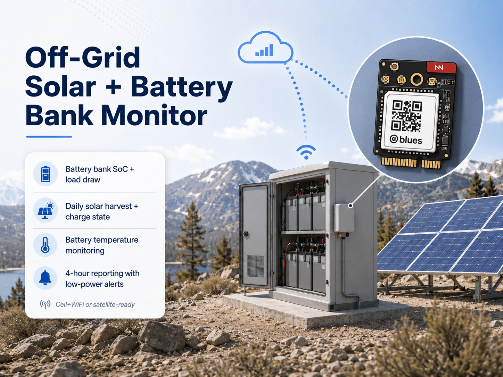
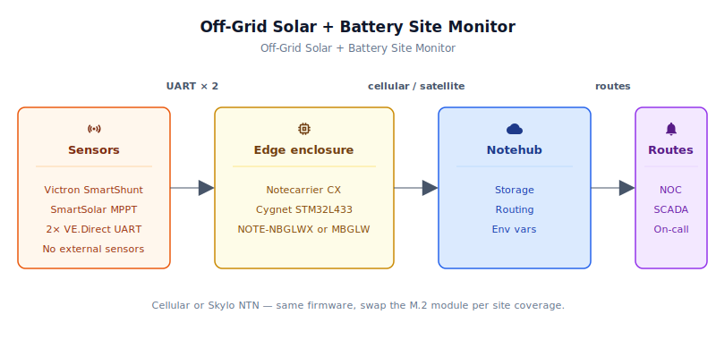
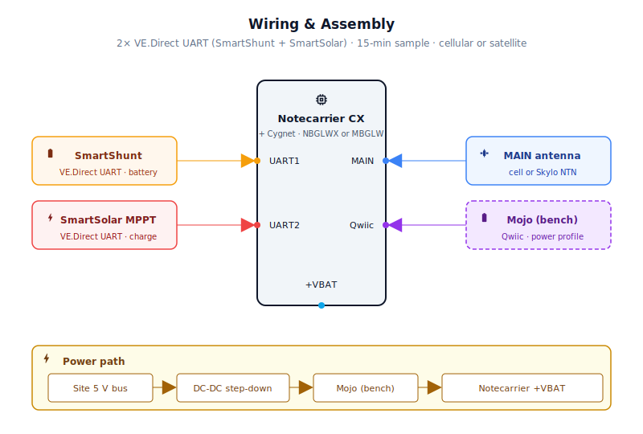
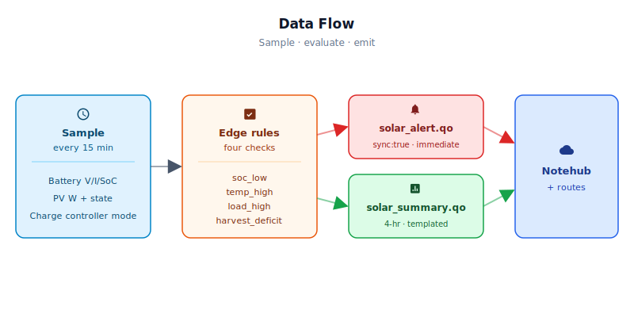

# Off-Grid Solar + Battery Bank Monitor



<Note>

This reference application is intended to provide inspiration and help you get started quickly. It uses specific hardware choices that may not match your own implementation. Focus on the sections most relevant to your use case. If you'd like to discuss your project and whether it's a good fit for Blues, [feel free to reach out](https://blues.com/landing-pages/accelerators-contact-us/?accelerator=Off-Grid%20Solar%20%2B%20Battery%20Bank%20Monitor).

</Note>

This project is a bank-level solar and battery monitoring solution — a Blues [battery management systems](https://blues.com/battery-management-systems/) reference design — for remote off-grid sites powered by solar arrays and battery banks. A Blues Notecarrier CX reads two Victron VE.Direct devices — a SmartShunt for battery-bank metrics and a SmartSolar MPPT charge controller for solar-side metrics, and reports battery-bank-level state of charge (SoC), daily solar harvest, load draw, battery temperature, and charge state to the [Blues Notehub](https://blues.com/notehub/) cloud service every four hours, with immediate alerts before the site goes dark. Connectivity is provided by a Blues Notecard seated in the carrier's M.2 slot; two SKUs are supported with no firmware changes between them — [Notecard Cell+WiFi (NOTE-MBGLW)](https://dev.blues.io/datasheets/notecard-datasheet/note-mbglw/) for sites within terrestrial cellular range, and [Notecard for Skylo (NOTE-NBGLWX)](https://dev.blues.io/datasheets/notecard-datasheet/note-nbglwx/) for fallback satellite coverage for sites where cellular coverage is marginal or absent.

## 1. Project Overview

**The problem.** Remote sites that run on solar and battery — cell towers at the edge of coverage, environmental monitoring stations in the backcountry, off-grid cabins — share a common failure mode: a problem that started small, days ago, accumulates unnoticed until the site goes dark. A slowly degrading PV array, a load that crept up after a firmware update to on-site equipment, or a battery bank whose capacity has quietly faded with age: none of these are catastrophic on their own, but any one of them can drain a bank that the solar array is no longer sized to replenish. This design detects that condition directly: if the charge controller fails to reach a full-charge state (Float, Absorption, Equalize, or Auto Equalize) for a configurable number of consecutive days, a `harvest_deficit` alert fires before the bank is depleted — giving the operations team time to respond before the site goes dark. And because the site is, by definition, remote, a days-long recharge deficit is invisible without continuous telemetry.

<Note>

**Interface Note.** This project reads the [Victron VE.Direct text protocol](https://www.victronenergy.com/upload/documents/VE.Direct-Protocol-3.34.pdf) — a one-wire broadcast interface that exposes battery-bank aggregates (SoC, voltage, current, temperature, and charge state) and solar-side metrics (panel voltage, power, and daily yield). These are exactly the signals needed to detect the site-uptime failure modes this design targets: persistent recharge deficit, low SoC, thermal overtemperature, and excessive load draw. Bank-level aggregates are the correct scope for a bank-level site-uptime monitor. **Cell-imbalance monitoring was explicitly evaluated during design and scoped out**: per-cell voltages and imbalance data are not broadcast on the VE.Direct wire — they travel over CAN bus and require a dedicated CAN controller and transceiver that are absent from this hardware stack. Implementing cell-level telemetry is a distinct hardware and firmware problem that belongs in a companion design rather than an extension of this project (see §10 for the full rationale and the companion-design specification).

</Note>

**Why Notecard.** These sites are by definition off-grid *and* off-network. There is no building WiFi to connect to, no Ethernet jack in the enclosure, and no cellular router whose monthly bill someone else is paying. The Blues Notecard self-manages its radio session, draws microamp-range idle current between transmissions, and requires no site IT involvement to set up. Two SKUs seat in the same M.2 slot on the Notecarrier CX and run the same firmware without modification:

<NewToBlues/>

- **[Notecard Cell+WiFi (NOTE-MBGLW)](https://dev.blues.io/datasheets/notecard-datasheet/note-mbglw/)** — LTE Cat-1 bis cellular with opportunistic WiFi fallback. The practical choice for bench validation and sites with adequate terrestrial coverage.
- **[Notecard for Skylo (NOTE-NBGLWX)](https://dev.blues.io/datasheets/notecard-datasheet/note-nbglwx/)** — LTE-M cellular combined with [Skylo](https://www.skylo.tech/) Non-Terrestrial Network (NTN) satellite connectivity on a single card. The Notecard manages radio-mode selection internally; no firmware differences exist between the two SKUs. **Both antennas must be positioned outdoors with an unobstructed view of the sky**. See §4 and §5 for the mounting and enclosure-feedthrough requirements. Notecard for Skylo is the primary production SKU for the truly remote towers, wilderness arrays, and high-altitude installations this use case targets.

**Deployment scenario.** A Notecarrier CX mounted inside the existing site enclosure or a weatherproof addon box, powered from the site's 5V regulation bus or a small DC-DC converter off the main battery bus. Two short VE.Direct cables run from the Notecarrier CX dual-row header to the SmartShunt (battery shunt, usually mounted near the battery bank negative terminal) and to the SmartSolar MPPT controller (typically mounted on the enclosure wall). No changes to the Victron equipment, no interruption to the solar system.

## 2. System Architecture



**Device-side responsibilities.** Almost all of the time the Cygnet STM32L433 host on the Notecarrier CX is off — not idle, off. Every 15 minutes (configurable) it powers up, reads one VE.Direct frame from each Victron device over UART, accumulates rolling averages in a [`NotePayload`](https://dev.blues.io/notecard/notecard-walkthrough/low-power-firmware-design/) state struct that the Notecard holds in flash between sleep cycles, evaluates four alert rules locally, and goes back to sleep. A full cycle takes under 8 seconds. The Notecard rides on I²C, so there are no serial buffers, no AT commands, and no modem state machine cluttering the host firmware.

**Notecard responsibilities.** The Notecard does the connectivity work the host never sees. It holds outbound [Notes](https://dev.blues.io/api-reference/glossary/#note) in its on-device queue, wakes the radio on the configured [`hub.set`](https://dev.blues.io/api-reference/notecard-api/hub-requests/#hub-set) `outbound` cadence (default 4 hours), and breaks that cadence the moment a `sync:true` alert lands in the queue — those flush immediately. It also pulls [environment variables](https://dev.blues.io/guides-and-tutorials/notecard-guides/understanding-environment-variables/) down from Notehub on each inbound sync, so alert thresholds and sample intervals can be retuned without a firmware update or a site visit.

**Notehub responsibilities.** On the far end, the Notecard's embedded global SIM negotiates with whatever carrier reaches the site, and [Notehub](https://notehub.io) ingests every event that arrives. Alerts (`solar_alert.qo`) and summaries (`solar_summary.qo`) land in separate [Notefiles](https://dev.blues.io/api-reference/glossary/#notefile), which means routes can fan them out at different urgencies with no filter logic — alerts straight to the NOC or on-call system, summaries to a long-term analytics store for trend work.

**Routing to the cloud (high level).** Notehub supports HTTP, MQTT, AWS, Azure, GCP, Snowflake, and several other targets; route setup is project-specific. See the [Notehub routing docs](https://dev.blues.io/notehub/notehub-walkthrough/#routing-data-with-notehub) — this project ships no specific downstream endpoint.

## 3. Technical Summary

To get a working monitor up and running in ~2 hours:

1. **Assemble** the Notecarrier CX with Notecard (Cell+WiFi or Skylo), DC-DC converter, and resistor dividers per §4.
2. **Wire** the SmartShunt and MPPT to the two VE.Direct ports on the Notecarrier CX header (§4).
3. **Install dependencies:**
   ```bash
   arduino-cli core install "STMicroelectronics:stm32"
   arduino-cli lib install "Blues Wireless Notecard"
   ```
4. **Set ProductUID** in `firmware/solar_battery_controller/solar_battery_controller.ino` line 62.
5. **Flash:**
   ```bash
   arduino-cli compile -b STMicroelectronics:stm32:Blues:pnum=CYGNET firmware/solar_battery_controller/
   arduino-cli upload -b STMicroelectronics:stm32:Blues:pnum=CYGNET -p /dev/cu.usbmodem* firmware/solar_battery_controller/
   ```
6. **Claim and configure in Notehub:**
   - Power on; the device claims itself to your project within ~1 minute (watch **Devices** tab).
   - Create a Fleet; set **Fleet → Environment** variables (see table in §5) — defaults are reasonable for initial testing.
   - Add routes for `solar_alert.qo` (real-time) and `solar_summary.qo` (storage/analytics).
7. **Validate** — you should see `_session.qo` and `solar_summary.qo` Notes appearing in Notehub within 5–10 minutes (see "What you should see in Notehub" in §5).


Here is a sample Note this device emits:

```json
{
  "bat_v": 26.1,
  "bat_a": -3.2,
  "bat_w": -83.5,
  "soc_pct": 78.4,
  "bat_temp_c": 22.1,
  "pv_v": 34.8,
  "pv_w": 142.0,
  "load_w": 225.5,
  "yield_kwh": 1.24,
  "ttg_min": -1,
  "cs": 5
}
```

## 4. Hardware Requirements

| Part | Qty | Rationale |
|------|-----|-----------|
| [Notecarrier CX](https://shop.blues.com/products/notecarrier-cx?utm_source=dev-blues&utm_medium=web&utm_campaign=store-link) | 1 | Integrated carrier with an embedded Cygnet STM32L433 host — no separate MCU. Provides the UART (Serial1), analog, and SPI/I²C headers needed for this sensor mix. |
| [Notecard Cell+WiFi (NOTE-MBGLW)](https://dev.blues.io/datasheets/notecard-datasheet/note-mbglw/) | 1 *(bench / sites with reliable cellular coverage)* | LTE Cat-1 bis cellular with opportunistic WiFi fallback. Prepaid global SIM, no monthly commitment. Use this SKU for bench validation and field sites where terrestrial cellular coverage is reliable. |
| [Notecard for Skylo (NOTE-NBGLWX)](https://dev.blues.io/datasheets/notecard-datasheet/note-nbglwx/) | 1 *(sites with marginal or no terrestrial coverage)* | LTE-M cellular combined with Skylo NTN satellite on a single M.2 card — the production SKU for remote towers, backcountry arrays, and high-altitude installations where terrestrial cellular is unreliable. The Notecard-certified satellite/LTE antenna and a passive GPS/GNSS antenna are both required and **must be mounted outdoors with an unobstructed view of the sky** (see §5 for enclosure feedthrough guidance). No firmware changes vs. the NOTE-MBGLW. See [Notecard for Skylo datasheet](https://dev.blues.io/datasheets/notecard-datasheet/note-nbglwx/) and [antenna guide](https://dev.blues.io/datasheets/application-notes/antenna-guide/) before deploying. |
| [Blues Mojo](https://shop.blues.com/products/mojo?utm_source=dev-blues&utm_medium=web&utm_campaign=store-link) | 1 | Coulomb counter on the +VBAT rail for validating the sleep/wake current profile during commissioning and bench bring-up. See [§9](#9-validation-and-testing). |
| [Victron SmartShunt 500A/50mV](https://www.victronenergy.com/battery-monitors/smart-battery-shunt) | 1 | Industry-standard battery shunt monitor. Measures battery voltage, current, SoC, and optional temperature via VE.Direct UART. The 500A variant covers the vast majority of off-grid installations from small cabins to telecom sites; a 1000A variant is available for high-current systems. Includes a VE.Direct cable. |
| [Victron SmartSolar MPPT 75/15](https://www.victronenergy.com/solar-charge-controllers/smartsolar-mppt-75-10-75-15-100-15-100-20) | 1 *(or existing)* | Solar charge controller. Exposes panel voltage, instantaneous panel power, daily yield, and charge state over VE.Direct. Select the MPPT SKU that matches your array size; the VE.Direct protocol and field names are the same across the SmartSolar family. Includes a VE.Direct cable. |
| [Victron VE.Direct cable](https://www.victronenergy.com/cables/ve.direct.cable) | 0–2 | 4-pin JST PH 2.0 to bare-wire cable. One included with each Victron device above; purchase extras if your layout requires longer runs. **Wire colors are not standardized — always verify pin assignments with a multimeter before connecting** (see §5). |
| 10 kΩ, 20 kΩ resistors | 2 each | One voltage-divider pair per VE.Direct RX line: device TX → 10 kΩ → MCU RX pin; junction → 20 kΩ → GND. Output ≈ 3.33 V. VE.Direct is a one-way broadcast protocol — the host only reads, never writes, so a simple resistor divider is the correct and lowest-risk interface for this unidirectional UART application. See [§5](#5-wiring-and-assembly) for the pin-by-pin wiring. |
| Victron Temperature Sensor for SmartShunt | 0–1 | Plugs into the SmartShunt's temp sensor port; required to populate `bat_temp_c` in the summary Note. Optional but strongly recommended for lithium battery banks where thermal runaway is a real risk. |
| [Traco TSR 1-2450](https://www.tracopower.com/int/model/tsr-1-2450) DC-DC converter *(12 V and 24 V sites)* | 1 | 6.5–36 V input, 5 V / 1 A output, SIP-3 package. Input range spans 12 V and 24 V battery buses through their full charge/discharge swing. See the [TSR 1 datasheet](https://www.tracopower.com/int/wp-content/uploads/sites/2/documents/tsr1.pdf) for derating above 40 °C. |
| [Traco TSR 1-4850](https://www.tracopower.com/model/tsr-1-4850wi) DC-DC converter *(48 V telecom sites)* | 1 | 18–75 V input, 5 V / 1 A output, same SIP-3 footprint as the TSR 1-2450. Covers 48 V telecom battery buses at full charge. Substitute this part for the TSR 1-2450 on 48 V deployments; no other changes required. |
| [Hammond 1555JGY](https://www.hammfg.com/part/1555JGY) weatherproof enclosure | 1 | 125 × 95 × 57 mm, ABS, IP67, gray. Fits the Notecarrier CX, resistor divider components, and DC-DC converter. Mount inside the site's existing primary enclosure or alongside the SmartShunt. |
| Skylo-certified cellular/NTN antenna — **included with the NOTE-NBGLWX kit** *(MAIN u.FL port)* | 1 *(NOTE-NBGLWX only)* | Ships in the NOTE-NBGLWX kit; connects to the `MAIN` u.FL port. **Do not substitute** — the Notecard is certified on Skylo's network exclusively with this antenna; replacing it renders the device uncertified and Skylo may block it from the network. If a different antenna is required, a Skylo delta-certification test is needed; contact [Blues](https://blues.com/contact-sales/) for recommended test houses. Must be mounted outdoors with an unobstructed view of the sky (see §5). |
| [Blues Flexible Dual LTE/Wi-Fi and GPS/GNSS Antenna (Quectel YCA001BA)](https://shop.blues.com/products/dual-flexible-antenna-cell-wi-fi?utm_source=dev-blues&utm_medium=web&utm_campaign=store-link) *(NOTE-NBGLWX GPS port)* | 1 *(NOTE-NBGLWX only)* | Passive flexible multi-band antenna with u.FL connector; GNSS L1 coverage (1560–1620 MHz, including GPS L1 at 1575 MHz) makes it suitable for the `GPS` u.FL port on the NOTE-NBGLWX. The NOTE-NBGLWX must acquire a GPS fix before each satellite session — without a GNSS antenna, NTN transmission cannot occur. **Use a passive (un-amplified) antenna only** on this port; active/LNA GNSS antennas are not compatible with the NOTE-NBGLWX GPS input. Route the flexible cable lead through a cable gland in the enclosure wall and mount flat on the enclosure exterior with a clear sky view. |
| u.FL to SMA female pigtail, ≥100 mm, RG316 or RG178 (e.g. [SparkFun WRL-09145](https://www.sparkfun.com/products/9145)) + IP67-rated SMA bulkhead connector *(NOTE-NBGLWX MAIN feedthrough)* | 1 *(NOTE-NBGLWX only)* | Routes the included Skylo antenna from the Notecard's `MAIN` u.FL port through the enclosure wall via an SMA bulkhead connector. Use the shortest pigtail that reaches the nearest enclosure wall without sharp bends to minimise insertion loss on the satellite band. IP67-rated SMA panel-mount bulkhead connectors are available from DigiKey and Mouser. The GPS antenna (Quectel YCA001BA above) has a flexible lead long enough to route directly through its own cable gland — no additional pigtail is required for the GPS port. |
| M16 IP67 cable gland, suitable for 4–8 mm cable OD *(NOTE-NBGLWX GPS feedthrough)* | 1 *(NOTE-NBGLWX only)* | Seals the GPS antenna (Quectel YCA001BA) cable lead where it passes through the enclosure wall. The MAIN antenna routes through the SMA bulkhead connector listed above, which provides its own weather seal. Thread and bore size must match your enclosure wall thickness; nylon M16 glands are available from DigiKey, Mouser, and electrical distributors. |
| Cellular/LTE antenna with u.FL connector (see [Blues antenna guide](https://dev.blues.io/datasheets/application-notes/antenna-guide/) for certified options) | 1 *(NOTE-MBGLW)* | A u.FL cellular antenna must be connected to the NOTE-MBGLW's `MAIN` u.FL pigtail lead on the Notecarrier CX — the carrier has no onboard PCB trace cellular antenna. A compact flexible u.FL LTE antenna is adequate for non-metallic (plastic or ABS) enclosures; for metallic enclosures add a u.FL-to-SMA pigtail and an IP67-rated SMA bulkhead connector to route the antenna outside the enclosure wall. See the [Blues antenna guide](https://dev.blues.io/datasheets/application-notes/antenna-guide/) for compatible antenna selection and placement guidance. |

All Blues hardware ships with an active SIM including 500 MB of data and 10 years of service — no activation fees, no monthly commitment.

## 5. Wiring and Assembly



All host I/O uses the [Notecarrier CX](https://dev.blues.io/datasheets/notecarrier-datasheet/notecarrier-cx-v1-7/) dual-row 16-pin header. The Notecard (Cell+WiFi or Skylo. See §4) seats into the carrier's M.2 slot. The Mojo sits inline on the +VBAT power rail for bench bring-up and commissioning. VE.Direct TX-to-MCU level shifting is handled by a simple 10 kΩ/20 kΩ resistor divider on each RX line — this is the only documented and validated interface for this project; active level-shifter boards with bidirectional MOSFETs are not recommended for this unidirectional UART application.

<Warning>

**Safety — high-current DC systems.** Off-grid battery banks can source thousands of amps into a short circuit. Before making any connections in or near battery, shunt, or MPPT wiring: disconnect the solar array at the MPPT PV input terminals; verify polarity at every connection point with a multimeter before making contact; and have all DC wiring reviewed by a qualified installer before commissioning. The VE.Direct signal connections below are low-voltage and carry microamp-level current — they do not interrupt the high-current path, but they pass through the same enclosure as live battery wiring.

</Warning>

### VE.Direct cable pinout

Each Victron device exposes a 4-pin JST PH 2.0 (2.0 mm pitch) port for VE.Direct. The standard pin numbering, with pin 1 at the locking-tab end of the connector, is:

| Pin | Signal | Direction | Notes |
|---|---|---|---|
| 1 | GND | — | Connect to Notecarrier CX GND |
| 2 | RX (into device) | Host → Device | Leave NC — protocol is device-broadcast only |
| 3 | TX (out from device) | Device → Host | 5V logic; needs level shifting or divider |
| 4 | +5V (from device) | Device → Host | Leave NC — host is externally powered |

<Warning>

**Wire color warning.** Wire colors on Victron VE.Direct cables are not standardized across product revisions and can be misleading (red may be GND, not power). Always confirm the pin assignment with a multimeter — measure DC voltage between the two outer wires to locate pin 4 (+5V) — before connecting anything to the STM32 or level shifter. The [VE.Direct Protocol Specification](https://www.victronenergy.com/upload/documents/VE.Direct-Protocol-3.34.pdf) is the authoritative reference for your specific device revision.

</Warning>

The standard Victron VE.Direct cable (ASS030530200 / ASS030530300) terminates in bare wires on the host end. Connect pin 3 (TX) and pin 1 (GND); leave pins 2 and 4 unconnected or tape them off.

### Pin-by-pin wiring

**SmartShunt (Battery shunt / Serial1):**
- **SmartShunt VE.Direct pin 3 (TX)** → 10 kΩ resistor → **CX header RX pin**, with the junction also connected to → 20 kΩ resistor → **GND**. The midpoint of the two resistors is the MCU RX input. This drops 5 V to ~3.33 V.
- **SmartShunt VE.Direct pin 1 (GND)** → **CX header GND**.
- Pins 2 and 4 are not connected — the protocol is broadcast-only; the host never writes to the device, and the host is externally powered.

**Victron temperature sensor (SmartShunt temp-sensor port):** Plug the optional Victron Temperature Sensor for SmartShunt directly into the SmartShunt's dedicated temperature-sensor port (a small JST connector on the SmartShunt body, separate from the VE.Direct port). No wiring to the Notecarrier CX is needed — the SmartShunt reads the sensor internally and broadcasts the temperature value on the VE.Direct wire, where the firmware picks it up automatically. This sensor is required for `bat_temp_c` to appear with a real value in summary Notes and for the `temp_high` alert to evaluate.

**SmartSolar MPPT (Solar charger / SoftwareSerial on D9):**
- **MPPT VE.Direct pin 3 (TX)** → 10 kΩ resistor → **CX header D9**, with the junction also connected to → 20 kΩ resistor → **GND**.
- **MPPT VE.Direct pin 1 (GND)** → **CX header GND**.
- **CX header D10** is defined as the SoftwareSerial TX pin in firmware but is not connected to anything — leave it NC.

**Power — complete path from battery bus to Notecarrier CX:**

The Traco TSR 1-2450 (12 V and 24 V sites) or TSR 1-4850 (48 V telecom sites) steps the battery bus voltage down to a regulated 5 V rail. The TSR 1 is a non-isolated SIP-3 switcher: **Pin 1 = VIN+, Pin 2 = GND (shared input/output return), Pin 3 = VOUT+**. Verify pinout against the [Traco TSR 1 datasheet](https://www.tracopower.com/int/wp-content/uploads/sites/2/documents/tsr1.pdf) before soldering — do not rely on silkscreen alone.

Wire the complete power chain in this order:

1. **Battery bus positive tap → inline fuse → Traco VIN+ (Pin 1).** Install a 2 A glass-cartridge or automotive blade fuse at the battery bus tap point, as close to the battery or busbar as practical. The TSR 1 is rated 1 A output; a 2 A fuse protects the converter and the 22–24 AWG wiring used at this current level while providing headroom for inrush. A fuse holder with a visual indicator (e.g. Littelfuse OMNI-BLOK series or equivalent) simplifies field commissioning.
2. **Battery bus return (negative) → Traco GND/VIN− (Pin 2).** Connect the battery-bus return directly to the converter's GND pin. Do not float the input return.
3. **Traco VOUT+ (Pin 3) → Mojo BAT pin** (when Mojo is installed for bench validation. See §9). Route the 5 V output through the Mojo so it measures all current drawn from the regulated rail. When Mojo is not installed, connect VOUT+ directly to step 4.
4. **Mojo LOAD pin → Notecarrier CX +VBAT pin.** The Mojo passes current through and measures cumulative mAh.
5. **Traco GND (Pin 2) / system return → Notecarrier CX GND pin.** The TSR 1's shared GND is both the input return and the output return; connect it to the Notecarrier CX GND. This is also the signal ground for the VE.Direct cable shields — connect the battery-bus return and signal ground together at one point only (at the converter or at the shunt negative terminal, not both) to avoid a ground loop through the VE.Direct cables.

<Warning>

**Polarity verification before first power-on.** With VIN connected but the VOUT wire to the Notecarrier CX left disconnected, apply power and measure VOUT+ (Pin 3) to GND (Pin 2). You should read 5.0 V ± 2%. If the voltage is absent or reversed, recheck the VIN polarity at Pin 1 and Pin 2 before connecting the Notecarrier CX. Off-grid battery banks can deliver thousands of amps into a reverse-polarity fault — verify before connecting.

</Warning>

**Bench power (USB):** During bench bring-up without the DC-DC converter, power the Notecarrier CX from USB via the +VUSB pin or USB-C port. Do not connect +VBAT and +VUSB simultaneously.

**Cellular antenna (NOTE-MBGLW path):**

The Notecarrier CX routes the NOTE-MBGLW's `MAIN` u.FL port to a u.FL pigtail lead on the carrier board. An external u.FL cellular/LTE antenna must be connected to this lead — the Notecarrier CX has no onboard PCB trace cellular antenna. See the [Blues antenna guide](https://dev.blues.io/datasheets/application-notes/antenna-guide/) for certified antenna options.

- **Non-metallic (plastic or ABS) enclosure:** Connect a compact flexible u.FL LTE antenna and position it inside the enclosure away from metal components, or route the cable lead through a small cable gland and mount the antenna on the enclosure exterior.
- **Metallic enclosure (steel electrical cabinet, aluminium panel):** Connect a u.FL-to-SMA pigtail to the `MAIN` u.FL pigtail lead; thread an IP67-rated SMA bulkhead connector through the enclosure wall; mount the cellular antenna on the external SMA port. This routes the RF path outside the metallic shell that would otherwise shield it significantly.

The NOTE-MBGLW includes a GNSS receiver, but GNSS is not used in this project — the design operates in cellular mode only and no GPS/GNSS antenna is required. If site geolocation is needed in a future enhancement, the Notecard's onboard GNSS can be enabled without firmware changes.

**Satellite antenna feedthrough (NOTE-NBGLWX only):**
- Notecard for Skylo has two u.FL connectors: `MAIN` for the Skylo-certified satellite/LTE antenna (included in the kit) and `GPS` for the passive GNSS antenna (Quectel YCA001BA). Both antennas must be mounted **outside the enclosure** with an unobstructed view of the sky — satellite signals cannot penetrate a metal enclosure wall.
- **MAIN antenna:** Connect the included Skylo antenna to the `MAIN` u.FL port via the SparkFun WRL-09145 (or equivalent RG316/RG178) pigtail. The pigtail's SMA female end connects to an IP67-rated SMA bulkhead connector threaded through the enclosure wall; the antenna mounts on the bulkhead's external SMA port. The bulkhead provides its own weather seal.
- **GPS antenna (Quectel YCA001BA):** Plug the antenna's u.FL connector into the `GPS` u.FL port on the Notecard. Route the flexible cable lead through an M16 IP67 cable gland in the enclosure wall and mount the flexible patch flat on the exterior of the enclosure.
- Maintain gentle cable curves throughout; avoid sharp bends that kink the coax feed lines. Keep runs as short as practical to minimise insertion loss, especially on the satellite band.
- Use only the Skylo-certified antenna supplied with Notecard for Skylo kit on the MAIN port. Substituting a different antenna voids Skylo network certification and may result in the device being blocked from the network. See the [Blues antenna guide](https://dev.blues.io/datasheets/application-notes/antenna-guide/) for full certification and placement requirements.

<Tip>

VE.Direct cables are short (0.9 m or 1.8 m). Mount the Notecarrier CX close to the SmartShunt and MPPT to avoid signal integrity issues on long runs.

</Tip>

## 6. Notehub Setup

1. **Create a project.** Sign up at [notehub.io](https://notehub.io) and create a project. Copy the [ProductUID](https://dev.blues.io/notehub/notehub-walkthrough/#finding-a-productuid) — it looks like `com.your-company.your-name:solar-battery-site`.
2. **Set the ProductUID in firmware.** Open `firmware/solar_battery_controller/solar_battery_controller.ino` and replace the empty string on the `#define PRODUCT_UID ""` line with your project's value.
3. **Claim the Notecard.** Power the assembled unit. On its first cellular connection the Notecard associates itself with your Notehub project automatically. The device appears in the **Devices** tab within a minute or two.
4. **Create a Fleet per site type.** [Fleets](https://dev.blues.io/guides-and-tutorials/fleet-admin-guide/) (and [Smart Fleets](https://dev.blues.io/notehub/notehub-walkthrough/#using-smart-fleet-rules)) group devices for shared configuration. A natural split: one fleet for 12V cabin installations, another for 24V telecom sites — each fleet can carry different alert thresholds appropriate to its battery chemistry and load profile.
5. **Set environment variables.** In Notehub: navigate to **Fleet → Environment** (or **Device → Environment** for a per-unit threshold override). The device pulls them on its next inbound sync — no firmware reflash, no site visit required.

   | Variable | Default | Purpose |
   |---|---|---|
   | `soc_alert_pct` | `20.0` | State-of-charge (%) threshold below which `soc_low` alert fires. Typical range: 15–25% depending on battery chemistry. |
   | `bat_temp_max_c` | `45.0` | Battery temperature (°C) threshold above which `temp_high` fires. Only evaluated if a Victron Temperature Sensor is plugged into the SmartShunt temp port. Typical for lead-acid: 50–55 °C; for lithium: 40–45 °C. |
   | `load_alert_w` | `1000.0` | Load-draw (W) threshold above which `load_high` fires. Size this to your site's rated load budget. Example: a tower with 600 W peak load should set this to 650–700 W to allow headroom; a data-center-grade 1.5 kW load should set this to 1600–1700 W. |
   | `harvest_deficit_days` | `0.0` | Consecutive days without the MPPT reaching a full-charge state (Float, Absorption, Equalize, or Auto Equalize) before `harvest_deficit` fires. `0.0` disables the check. Recommended: `2.0` for well-sized systems, `3.0–4.0` for systems with seasonal or multi-day cloud patterns. Only evaluated when MPPT data is present in the window. |
   | `sample_interval_sec` | `900` | Seconds between host wakes (minimum 60, maximum 3600). Shorter intervals consume more power per unit time but improve resolution. Default 900 seconds = 15 minutes; typical range 300–1800 s. |
   | `report_interval_min` | `240` | Minutes between summary Notes (minimum 15, maximum 1440). When this changes, firmware immediately resets the window and re-issues `hub.set` to sync Notecard's outbound cadence on the same cycle. For Skylo NTN deployments, set to `1440` (once daily) to reduce satellite data consumption. |
   | `sync_outbound_min` | *(auto: equals `report_interval_min`)* | Notecard outbound sync interval in minutes (15–1440). Leave unset to track `report_interval_min` automatically, or set explicitly to decouple (e.g., sync every 2 hours but summarize every 4). For Skylo: set `report_interval_min=1440` and leave this unset. |
   | `sync_inbound_min` | *(auto: 2 × `report_interval_min`)* | Notecard inbound sync interval in minutes (30–2880) for pulling Fleet variable updates. Defaults to 2× `report_interval_min`. Reduce to deliver threshold changes faster (costs additional satellite or cellular data). |

6. **Configure routes.** Add one [route](https://dev.blues.io/notehub/notehub-walkthrough/#routing-data-with-notehub) for `solar_alert.qo` (to an on-call or NOC platform; these are time-sensitive) and a second for `solar_summary.qo` (to a long-term analytics or SCADA store; four-hour batches are fine). Separating the two Notefiles at the source means each can target a different downstream system at a different urgency without any server-side filtering.

### Skylo (NOTE-NBGLWX) deployment guidance

The NOTE-NBGLWX manages radio-mode selection internally — the firmware is identical to the NOTE-MBGLW path. The satellite transport, however, has four characteristics that differ materially from cellular and must inform how you configure and commission the device.

**Data budget.** The NOTE-NBGLWX includes 10 KB of Skylo satellite data. The templated `solar_summary.qo` Note encodes to roughly 80–120 bytes on the satellite wire — well within the 256-byte Skylo payload ceiling. Each untemplated `solar_alert.qo` Note is similarly compact. Where the allocation is consumed fastest is *inbound* syncs: each satellite inbound ping costs approximately 50 bytes even when no environment variable changes are pending. At the default 4-hour summary cadence (6 outbound sessions per day, 3 inbound sessions per day at `inbound = outbound × 2 = 8 h`), a site operating exclusively on satellite would exhaust the included 10 KB in roughly 11 days. **For satellite-primary deployments, set `report_interval_min` to `1440` (once per day) in the Fleet Environment before commissioning.** Daily summaries consume approximately 4–5 KB per month at normal alert rates, keeping well within the included allocation. At-threshold alerts (`soc_low`, `temp_high`, `load_high`, `harvest_deficit`) use `sync:true` and fire immediately regardless of the summary cadence — they remain the most valuable transmissions and are few in number. To further reduce inbound cost, trigger manual inbound syncs from the Notehub device page only when you need to push threshold changes rather than relying on the scheduled inbound interval. See the [satellite best practices guide](https://dev.blues.io/starnote/satellite-best-practices/) for full data-budget guidance.

**Alert latency.** On LTE Cat-1 bis, `sync:true` alerts reach Notehub in seconds. On the satellite path the Notecard must acquire a GPS fix (fast when location is fixed. See below), wait for a satellite visibility window, and complete the NTN session. **Expect end-to-end alert latency of 2–10 minutes on satellite.** This is well-suited to the "site will go dark in the next few hours" scenario this project targets; size your NOC response SLAs accordingly rather than expecting cellular-equivalent latency.

**Satellite session power.** A satellite session is longer and more power-intensive than a cellular session. The Notecard must power the GPS receiver, search for a satellite visibility window, and drive the NTN modem through a transmission — a process that can run 2–5 minutes of elevated radio-active current, compared to the 15–30 seconds typical of LTE Cat-1 bis. With a daily outbound cadence the number of radio sessions drops from 6 (LTE Cat-1 bis default) to 1 per day, which largely offsets the per-session cost increase. Validate the energy profile with Mojo (§8) at the bench using the satellite cadence before field deployment — the NOTE-NBGLWX power table and expected Mojo trace in §8 describe what to look for. See the [NOTE-NBGLWX datasheet](https://dev.blues.io/datasheets/notecard-datasheet/note-nbglwx/) for SKU-specific power curves.

**Fixed GPS location.** The NOTE-NBGLWX must know its location to find overhead satellites. For any stationary installation, lock the position once at commissioning using the blues.dev In-Browser Terminal or a bench serial session:
```json
{"req": "card.location.mode", "mode": "fixed", "lat": 37.123, "lon": -121.456}
```
Replace `lat`/`lon` with the site's actual GPS-derived coordinates. **Do not use `tower_lat`/`tower_lon` from `_session.qo` for this** — those fields are cell-tower–derived estimates, not GPS fixes, and can be off by kilometres. To obtain accurate coordinates, ensure the GPS antenna is connected and has a clear sky view, then issue `{"req": "card.location"}` from the same terminal; the response `lat` and `lon` fields carry the current GPS fix. Use those values in the `card.location.mode` fixed command above. A fixed location eliminates repeated GPS cold-starts before each satellite session and materially reduces both session startup time and power consumption.

**Commissioning order.** If there is any terrestrial cellular or WiFi coverage at or near the deployment site, power the unit there first. The Notecard registers with Notehub over LTE Cat-1 bis, confirms all Note templates, and acquires an accurate time reference — steps that accelerate the first satellite session at the final remote location. If the site is beyond all cellular coverage, allow 5–15 minutes on first power-up for the Notecard to acquire a GPS fix and complete the initial satellite registration.

**First-boot environment variables.** On first boot the firmware calls `hub.set` to associate the Notecard with your Notehub project, then calls `env.get` to pull any pre-configured Fleet environment variables. However, the Notecard must complete an **inbound sync with Notehub** before `env.get` returns Fleet-level values — a cold-start device that has never synced has no cached env vars yet. On LTE Cat-1 bis the first inbound sync typically completes within one to two minutes of power-on, so the second wake onward reflects pre-configured Fleet variables. The exposure window is at most one 15-minute sample interval before the correct env vars take effect.

For NOTE-NBGLWX Skylo deployments this window matters more: a single wake at the 4-hour cellular default can consume a meaningful fraction of the 10 KB satellite data budget. The safest approach is to compile with `-DSKYLO_BUILD` in your build flags (see §7.1 and the `#ifdef SKYLO_BUILD` block in `firmware/solar_battery_controller/solar_battery_controller_notecard_helpers.h`). This changes the compile-time default for `DEFAULT_REPORT_INTERVAL_MIN` to 1440 minutes, so even the very first wake — before any Notehub inbound sync — uses the satellite-safe daily cadence. Fleet environment variables then tune thresholds and cadence further after the first inbound sync arrives. If you are not using the `SKYLO_BUILD` flag, set `report_interval_min = 1440` in your Fleet Environment before commissioning and allow a minute or two after first power-on for the first inbound sync to deliver it.

### What you should see in Notehub

Within a minute of first power-on, the Events tab in your project should begin populating:

- **`_session.qo`** — automatic Notecard housekeeping on each cellular session. Confirms the radio is reaching Notehub. If this never appears, check the antenna connection and `PRODUCT_UID`.
- **`solar_summary.qo`** — one per `report_interval_min` (default every 4 hours). Every template field is always present. A typical healthy-site body during daytime with solar contributing but load exceeding PV output — the MPPT is in Float state (`cs: 5`, battery at working SoC) while the battery supplements solar to cover the full site load:
  ```json
  {
    "bat_v": 26.1,
    "bat_a": -3.2,
    "bat_w": -83.5,
    "soc_pct": 78.4,
    "bat_temp_c": 22.1,
    "pv_v": 34.8,
    "pv_w": 142.0,
    "load_w": 225.5,
    "yield_kwh": 1.24,
    "ttg_min": -1,
    "cs": 5
  }
  ```
  `bat_a` negative means the battery is net discharging (load exceeds solar input). In this example solar is producing 142 W, load is drawing 225.5 W, and the battery is supplementing the difference (~83.5 W). `cs` of 5 = Float (the MPPT charge algorithm has reached its float stage; the battery is at working SoC and solar is meeting its maintenance demand, but site loads still exceed current PV output). `ttg_min` of −1 means the SmartShunt is present but the battery is not in an active discharge (TTG is inapplicable or infinite); a positive value such as `"ttg_min": 312` means 5 h 12 minutes of estimated run time remaining. Fields show −9999 (float sentinel) or −1 (cs sentinel) rather than being absent when no valid reading was available for that metric in the window, for example, `"bat_temp_c": -9999.0` means no temperature sensor is connected to the SmartShunt.
- **`solar_alert.qo`** — emitted only on a threshold trip, with `sync:true` for immediate delivery. Four alert types are defined; context values vary by alert. Example low-SoC alert:
  ```json
  {
    "alert": "soc_low",
    "v1": 18.2,
    "v2": 24.1,
    "v3": -156.8
  }
  ```
  Fields: `v1` = current SoC %, `v2` = battery voltage V, `v3` = net battery power W (negative = discharging). See [§8](#8-data-flow) for the complete alert taxonomy and context value meanings for each alert type (`temp_high`, `load_high`, `harvest_deficit`).

## 7. Firmware Design

Five files:
- [`firmware/solar_battery_controller/solar_battery_controller.ino`](firmware/solar_battery_controller/solar_battery_controller.ino) — main application sketch (orchestration, accumulation, alert evaluation)
- [`firmware/solar_battery_controller/solar_battery_controller_helpers.h`](firmware/solar_battery_controller/solar_battery_controller_helpers.h) — VE.Direct parser header
- [`firmware/solar_battery_controller/solar_battery_controller_helpers.cpp`](firmware/solar_battery_controller/solar_battery_controller_helpers.cpp) — VE.Direct parser implementation
- [`firmware/solar_battery_controller/solar_battery_controller_notecard_helpers.h`](firmware/solar_battery_controller/solar_battery_controller_notecard_helpers.h) — `PersistState` struct, all configuration constants, and Notecard I/O declarations
- [`firmware/solar_battery_controller/solar_battery_controller_notecard_helpers.cpp`](firmware/solar_battery_controller/solar_battery_controller_notecard_helpers.cpp) — Notecard I/O implementation (`hub.set`, templates, env vars, Note queuing)

### 7.1 Installing and flashing

**Dependencies:**

- **Arduino core for STM32** — [`stm32duino/Arduino_Core_STM32`](https://github.com/stm32duino/Arduino_Core_STM32). Install via Arduino Boards Manager (search "STM32 MCU based boards") or add the index URL `https://github.com/stm32duino/BoardManagerFiles/raw/main/package_stmicroelectronics_index.json` under **File → Preferences → Additional Boards Manager URLs**. Select **Blues Cygnet** as the board target (canonical FQBN: `STMicroelectronics:stm32:Blues:pnum=CYGNET`).
- **`Blues Wireless Notecard`** library — [`note-arduino`](https://github.com/blues/note-arduino). Install via the Arduino Library Manager (`arduino-cli lib install "Blues Wireless Notecard"`). Check the [note-arduino releases](https://github.com/blues/note-arduino/releases) for the latest stable version before starting a new project.

**Flashing — Arduino IDE:** open `solar_battery_controller.ino`, select **STMicroelectronics → Blues Cygnet** as the board, and click **Upload**. The Notecarrier CX's onboard ST-Link debug interface enumerates as a virtual COM port on the same USB cable — no external programmer needed.

**Flashing — `arduino-cli`:**
```bash
# Confirm the FQBN for your installed core version
arduino-cli board listall | grep -i cygnet

# Compile and upload (replace the FQBN and port to match your system)
arduino-cli compile -b STMicroelectronics:stm32:Blues:pnum=CYGNET firmware/solar_battery_controller/
arduino-cli upload  -b STMicroelectronics:stm32:Blues:pnum=CYGNET -p /dev/cu.usbmodem* firmware/solar_battery_controller/
```

**NOTE-NBGLWX Skylo build flag:** To compile with a satellite-safe default cadence (1440-minute daily summary from the very first wake), add `-DSKYLO_BUILD` to the compiler flags. In the Arduino IDE this goes in **File → Preferences → Additional build options**; with `arduino-cli` pass `--build-property "compiler.cpp.extra_flags=-DSKYLO_BUILD"`. See §5 Skylo deployment guidance for context.

```bash
# Example: Skylo build
arduino-cli compile -b STMicroelectronics:stm32:Blues:pnum=CYGNET \
  --build-property "compiler.cpp.extra_flags=-DSKYLO_BUILD" \
  firmware/solar_battery_controller/
```

After upload, open the serial monitor at **115200 baud**. On first boot you'll see the Notecard configuration log; after that, each 15-minute wake prints a one-line `[summary]` or `[alert]` entry, then goes quiet as the host re-sleeps.

### 7.2 Modules

| Responsibility | Where |
|---|---|
| Notecard configuration (`hub.set`, templates, accelerometer disable) | `notecardFirstBoot`, `applyHubSetIfChanged`, `defineTemplates` |
| Environment variable fetch and threshold refresh | `fetchEnvOverrides` |
| VE.Direct frame reading (two devices) | `readVEDirectFrame` in helpers |
| Sample accumulation into rolling window averages | `accumulate` |
| Alert evaluation and immediate-sync Notes | `checkAndSendAlerts`, `checkHarvestDeficit`, `sendAlert` |
| Summary Note construction and emission | `sendSummary` |
| Persistent state serialisation across sleep cycles | `PersistState` struct + `NotePayloadSaveAndSleep` / `NotePayloadRetrieveAfterSleep` |

### 7.3 VE.Direct reading strategy

**VE.Direct protocol primer.** Victron's VE.Direct is a one-wire async text protocol at 19200 baud 8N1. The device broadcasts one frame per second — no polling, no handshake. Each frame is a series of `LABEL<tab>VALUE<CR><LF>` lines terminated by a `Checksum<tab><byte><CR><LF>` line. The checksum byte makes the sum of all bytes in the frame (including the `Checksum` line itself) equal zero modulo 256. On a healthy bus you get 3–4 complete frames in a 3-second window.

`readVEDirectFrame()` in the helpers file reads characters from the given `Stream` object until it sees a complete, checksum-verified frame or the timeout expires (default 3 seconds). It extracts only the fields relevant to the SmartShunt or MPPT — all other labels are silently ignored. The Notecarrier CX's UART (Serial1) is used for the SmartShunt; a `SoftwareSerial` instance on D9 handles the MPPT. Both are read sequentially at wakeup.

**Why not poll both simultaneously?** VE.Direct is a unidirectional broadcast. Both devices are always transmitting; we just listen to one at a time. Reading them sequentially adds ~6 seconds of active time per wake cycle, which is negligible against a 15-minute sleep interval.

### 7.4 Event payload design

`solar_summary.qo` uses a [Note template](https://dev.blues.io/notecard/notecard-walkthrough/low-bandwidth-design#working-with-note-templates) registered at first boot. Templated Notes are stored as fixed-length records on the Notecard rather than free-form JSON, reducing wire size by roughly 3–5× — meaningful on a system that will run for years on a prepaid cellular SIM. Every field in the template schema is **always present** in every Note body, using explicit sentinel values when no valid samples were collected for that metric in the window:

- `SUMMARY_SENTINEL_F = −9999.0` — all float fields (`bat_v`, `bat_a`, `bat_w`, `soc_pct`, `bat_temp_c`, `pv_v`, `pv_w`, `yield_kwh`, `load_w`).
- `SUMMARY_SENTINEL_TTG = −9999` — `ttg_min` when no SmartShunt data was received in the window. A value of −1 (separate from the sentinel) means the SmartShunt was present but the battery was not in an active discharge (TTG is inapplicable or infinite). A value ≥ 0 is the active discharge estimate in minutes.
- `SUMMARY_SENTINEL_CS = −1` — `cs` when no MPPT data was received. All valid VE.Direct CS codes for the SmartSolar MPPT are non-negative (0, 2–5, 7, 245, 247, 252. See `VED_CS_*` constants in `solar_battery_controller_helpers.h`), so −1 unambiguously signals no MPPT data without colliding with any real charge-state value.

This fixed-schema approach follows established Blues reference design practice: the template always fires fully populated, downstream analytics can rely on column presence and never see a field collapse to the Notecard's default zero for a missing column, and sensor faults are distinguishable from real zero readings. `ttg_min` is reset to −1 at the start of each summary window (`resetAccumulators` sets `state.ttg_min = -1`) to prevent a stale value from a prior window leaking forward. If an entire window produces no valid samples from either device, `sendSummary` skips the Note entirely and opens a new window — no all-sentinel record is emitted.

`solar_alert.qo` is **not** templated — alert types have different supporting fields and the volume is low enough that free-form JSON is fine. The `alert` field names the failure condition; `v1`, `v2`, `v3` carry context values whose meaning depends on the alert type:

| Alert | `v1` | `v2` | `v3` |
|---|---|---|---|
| `soc_low` | current SoC % | battery voltage V | net battery power W |
| `temp_high` | battery temp °C | battery voltage V | SoC % |
| `load_high` | load draw W | SoC % | PV power W |
| `harvest_deficit` | avg SoC % over window | consecutive windows without Float/Absorb | today's yield kWh |

### 7.5 Low-power strategy

The site is battery-powered; power budget matters. The host MCU spends almost all of its time completely off. After each wake cycle, `NotePayloadSaveAndSleep` serialises the `PersistState` struct to Notecard flash and issues a [`card.attn`](https://dev.blues.io/api-reference/notecard-api/card-requests/#card-attn) sleep request that cuts power to the host entirely. When the ATTN timer fires 15 minutes later (default), the Notecarrier CX re-applies power, the Cygnet re-enters `setup()` from cold, and `NotePayloadRetrieveAfterSleep` restores the accumulated state. From the firmware's perspective, the sleep call looks like a single function — the Notecard does the rest.

The Notecard's own idle draw is ~8–18 µA between cellular sessions (per the Blues [low-power design guide](https://dev.blues.io/notecard/notecard-walkthrough/low-power-firmware-design/)). The +VBAT rail draws more than the Notecard alone: each voltage-divider network (10 kΩ + 20 kΩ = 30 kΩ total) pulls ~167 µA continuously while the VE.Direct device is powered, and two dividers together add ~334 µA. Mojo at the +VBAT rail therefore sees approximately **350–380 µA** between wakes (dividers ~334 µA, plus Notecard and board quiescent ~16–44 µA). The Traco TSR 1 DC-DC converter draws approximately 1–2 mA at its VIN input from the battery bus — this is an input-side draw, upstream of the 5 V output rail, and is not visible to Mojo at the +VBAT pin. Measuring the total battery-bus draw including converter quiescent requires a separate instrument (e.g. a clamp meter or series shunt) on the converter's VIN supply wire. See §8 for the complete system current table. The Notecard's `outbound` sync cadence (default 4 hours) controls when it wakes the radio — at 15-minute sample intervals and a 4-hour transmit cadence, the radio fires 6 times per day rather than 96.

Sampling and transmission cadences are deliberately decoupled: the device samples every 15 minutes but only opens a cellular session every 4 hours. Alert Notes bypass this by setting `sync:true`, which tells the Notecard to open a session immediately when an alert is queued — it won't wait for the next 4-hour window.

### 7.6 Retry and error handling

- The first Notecard transaction in `notecardFirstBoot` uses `notecard.sendRequestWithRetry(req, 5)` to survive the cold-boot I²C readiness race documented in the note-arduino library. The initial `env.get` inside `fetchEnvOverrides` is wrapped in its own 5-attempt retry loop for the same reason — a restored (non-first) boot arrives at `fetchEnvOverrides` before any prior retry has had a chance to confirm the Notecard is ready.
- `readVEDirectFrame` enforces a 3-second per-device timeout. If a device doesn't respond (powered off, disconnected, connector fault), the function returns `false` and the corresponding fields are skipped in `accumulate` — metrics derived only from the missing device will carry `0` valid samples for that window, and `sendSummary` will emit the sentinel value (−9999 for floats, −1 for `cs`) for those fields. A complete loss of SmartShunt data for an entire window is visible as −9999 on `bat_v`, `soc_pct`, etc. in `solar_summary.qo`, making the sensor fault obvious in Notehub.
- `#define ALERT_COOLDOWN_SAMPLES 2` (~30 minutes at the default 15-min interval) controls how often a persistent fault re-alerts. Each alert fires immediately on the first trip, then repeats every 2 wakes (~30 minutes) while the condition holds. When the condition clears, the active flag and cooldown counter both reset so the next trip fires immediately again. One alert every ~30 minutes per condition is the right balance for on-call notification without saturating satellite data quota.
- Summary send failures do not open a new window. When `note.add` for `solar_summary.qo` fails, `samples_until_summary` is left at `0` (not reset). On the next wake the firmware retries the send *before* reading new VE.Direct data, so the closed window's averages are never mixed with fresh readings. `resetAccumulators()` and the window-open only happen after a confirmed successful queue.
- Environment variable clamp logic in `fetchEnvOverrides` rejects `sample_interval_sec` values outside 60–3600 and `report_interval_min` values outside 15–1440, preventing operator typos from making the device unreachable.

### 7.7 Key code snippet 1: Note template registration

Templates turn each summary Note into a fixed-length on-wire record. The placeholder values encode the wire type: `14.1` = 4-byte IEEE-754 float; `14` = 4-byte signed integer; `12` = 2-byte signed integer.

```cpp
J *req = notecard.newRequest("note.template");
JAddStringToObject(req, "file", "solar_summary.qo");
JAddNumberToObject(req, "port", 50);
J *body = JAddObjectToObject(req, "body");
JAddNumberToObject(body, "bat_v",      14.1);
JAddNumberToObject(body, "soc_pct",    14.1);
JAddNumberToObject(body, "pv_w",       14.1);
JAddNumberToObject(body, "yield_kwh",  14.1);
JAddNumberToObject(body, "load_w",     14.1);
JAddNumberToObject(body, "ttg_min",    14);
JAddNumberToObject(body, "cs",         12);
notecard.sendRequest(req);
```

### 7.8 Key code snippet 2: immediate-sync alert

`sync:true` tells the Notecard to bypass the next `outbound` window and open a cellular session immediately.

```cpp
J *req = notecard.newRequest("note.add");
JAddStringToObject(req, "file", "solar_alert.qo");
JAddBoolToObject(req,   "sync", true);
J *body = JAddObjectToObject(req, "body");
JAddStringToObject(body, "alert", "soc_low");
JAddNumberToObject(body, "v1",    shunt.soc_pct);
JAddNumberToObject(body, "v2",    shunt.bat_v);
JAddNumberToObject(body, "v3",    shunt.bat_w);
notecard.sendRequest(req);
```

### 7.9 Key code snippet 3: sleep between samples

`NotePayloadSaveAndSleep` writes the state struct to Notecard flash and arms the ATTN timer to cut host power for `sample_interval_sec` seconds. The next call to `NotePayloadRetrieveAfterSleep` in the subsequent `setup()` rehydrates it.

```cpp
NotePayloadDesc desc = {0, 0, 0};
NotePayloadAddSegment(&desc, STATE_SEG_ID, &state, sizeof(state));
NotePayloadSaveAndSleep(&desc, state.sample_interval_sec, NULL);
// Code below here only runs if ATTN is not controlling host power (bench test):
delay(state.sample_interval_sec * 1000UL);
```

### 7.10 Key code snippet 4: VE.Direct load computation

Load draw is derived algebraically rather than measured directly:

```cpp
// load_w = solar_in − battery_net
// bat_w is positive when charging (solar exceeding load)
// bat_w is negative when discharging (load exceeding solar)
// Examples:
//   pv_w=300, bat_w=+100  → load = 200 W  (solar charging battery + powering load)
//   pv_w=100, bat_w=-150  → load = 250 W  (solar + battery both powering load)
float load = mppt.pv_w - shunt.bat_w;
```

## 8. Data Flow



Every 15 minutes (default `sample_interval_sec = 900`) the firmware wakes, reads both VE.Direct devices, and accumulates one data point into the current summary window:

- **Collected per sample.** Battery voltage (V), battery current (A, signed), net battery power (W, signed), SoC (%), battery temperature (°C, when sensor present), panel voltage (V), panel power (W), computed load (W). Latest-only: daily yield (kWh), charge state (integer enum), time-to-go (minutes).
- **Transmitted.**
  - `solar_summary.qo` — once per `report_interval_min` (default every 4 hours = 16 samples per window). Every template field is always present. Each averaged field carries the mean of its valid samples, or −9999 when no valid samples exist for that metric. `yield_kwh` and `cs` carry the latest value at window-close, not an average; `cs` is −1 when no MPPT data was received. `ttg_min` is −9999 when no SmartShunt data was received, −1 when the shunt was present but the battery was not discharging, or the active minutes-remaining estimate. If an entire window has no valid samples from either device, the Note is skipped entirely.
  - `solar_alert.qo` — emitted immediately on a threshold trip, `sync:true`. Deduplicated by a ~30-minute per-alert cooldown.
- **Routed.** Notehub forwards `solar_alert.qo` to real-time notification destinations (NOC dashboards, on-call paging, SMS gateway) and `solar_summary.qo` to analytics or long-term storage. Separate Notefiles means separate routes, separate urgency tiers, separate retention policies.
- **Alert triggers.**
  - `soc_low` — SoC below `soc_alert_pct`. Fires once per ~30 minutes while SoC remains low. Context: current SoC, battery voltage, net battery power.
  - `temp_high` — battery temperature above `bat_temp_max_c` (only when a temperature sensor is wired to the SmartShunt). Context: current temp, battery voltage, SoC.
  - `load_high` — computed load draw above `load_alert_w`. Fires once per ~30 minutes. Context: load W, SoC, current PV power.
  - `harvest_deficit` — MPPT has not reached a full-charge state (Float `cs=5`, Absorption `cs=4`, Equalize `cs=7`, or Auto Equalize `cs=247`) for `harvest_deficit_days` consecutive days (disabled by default; enable via env var). Fires once per ~24 hours while the deficit persists. Context: average SoC % over the window, number of consecutive windows without a full-charge state, today's accumulated solar yield kWh. This alert is the primary indicator of a recharge imbalance — a degraded array, persistent cloud cover, or load growth that the system can no longer recover from overnight. The firmware does not count Equalize/Recondition as a deficit: these cycles run after the battery has already reached Float, so their presence confirms a healthy charge cycle completed.

## 9. Validation and Testing

**Expected steady-state behavior.** A healthy site running with solar in bulk or float mode produces one `solar_summary.qo` every 4 hours and zero `solar_alert.qo` events. `bat_a` will be slightly positive (battery absorbing a maintenance trickle) during the day and slightly negative at night (load drawing from battery overnight). `soc_pct` should be above 80% on a well-sized system by mid-morning.

**Using Mojo to validate the power profile.** The Notecard's published standalone idle draw is ~8–18 µA @ 5V. See the [low-power firmware design guide](https://dev.blues.io/notecard/notecard-walkthrough/low-power-firmware-design/) for the authoritative figures by SKU. The assembled monitor draws more at its +VBAT input because the voltage dividers and DC-DC converter add quiescent current even when the host is off. The table below breaks out both figures so the Mojo trace makes sense:

#### NOTE-MBGLW path (LTE Cat-1 bis cellular)

| Phase | Notecard-only | Measured by Mojo at +VBAT |
|---|---|---|
| Between wakes (host off, ATTN sleeping) | ~8–18 µA | **~350–380 µA** (dividers ~334 µA + Notecard ~8–18 µA + board quiescent) |
| Host active (VE.Direct reads + I²C) | — | ~6–8 mA for ~6–8 seconds per wake |
| Notecard cellular session (LTE Cat-1 bis outbound) | ~250 mA avg, ≤2 A peak, for ~15–30 seconds | same — radio dominates |

> **Mojo measurement boundary.** Mojo sits between the Traco 5 V output and the Notecarrier CX +VBAT pin, so it measures current on the 5 V output rail only. The Traco TSR 1's no-load input quiescent (~1–2 mA) is drawn from the battery bus at the converter's VIN pin — upstream of the 5 V rail, and is not visible to Mojo. To measure total battery-bus draw including converter quiescent, place a separate shunt or clamp meter on the converter's VIN supply wire.

The **~350–380 µA Mojo idle baseline** at +VBAT comes from the two always-energized 10 kΩ/20 kΩ divider networks (~5 V ÷ 30 kΩ = 167 µA each, × 2 = ~334 µA) plus Notecard and board quiescent (~16–44 µA). The dividers are the primary target if the +VBAT baseline needs to be reduced — switching to a powered-off level-shifting stage would eliminate ~334 µA.

A rough 24-hour Mojo estimate at default settings (6 cellular sessions/day, 96 host wakes/day): voltage-divider standing current dominates (~334 µA × 24 h ≈ **8 mAh**), six LTE Cat-1 bis radio sessions add roughly **8–10 mAh**, and 96 host wakes add roughly **1 mAh** — approximately **17–20 mAh per 24 hours** measured by Mojo at the +VBAT rail. (Additional battery-bus draw not measured by Mojo: converter input quiescent ~1–2 mA × 24 h ≈ 24–48 mAh at the battery bus voltage.) Verify once at bench bring-up with Mojo; a daily Mojo total more than 3× above ~20 mAh usually indicates either the host is not sleeping (continuous multi-mA elevation above the ~380 µA floor) or the radio is struggling with marginal signal (correctly-spaced sessions each running 60+ seconds).

To use Mojo: splice it inline between the DC-DC converter 5 V output and the Notecarrier CX +VBAT pin, connect its Qwiic output to the Notecarrier CX I²C header, and leave the unit running for 24 hours. A healthy LTE Cat-1 bis trace shows a **flat ~350–380 µA baseline** (the +VBAT system idle floor), brief blips to ~6–8 mA every 15 minutes (host wake), and one 15–30-second burst to ~250 mA every 4 hours (cellular session). Any continuous elevation above the ~380 µA floor that doesn't correlate with a host wake or radio burst indicates an unexpected active current path.

#### NOTE-NBGLWX path (Skylo NTN satellite + LTE-M)

The satellite path has a fundamentally different power profile from cellular. A satellite session requires the GNSS receiver to confirm the device's position, then drives the NTN modem through an uplink/downlink sequence that typically runs 2–5 minutes, versus the 15–30 seconds of an LTE Cat-1 bis session. The per-session energy is higher and the session is longer, but the recommended satellite cadence is once per day versus the six daily sessions on LTE Cat-1 bis. The six LTE Cat-1 bis sessions consume roughly 8 mAh/day combined; the single daily satellite session is estimated at ~3–12 mAh (see phase table for the per-phase breakdown). Either way, the whole-system daily budget is dominated by the continuous ~1–3 mA standing current floor — the same voltage dividers and DC-DC converter quiescent present on both paths — making the daily total **comparable to the LTE Cat-1 bis path** rather than substantially lower. The satellite path's standing-current-dominated total is shown in the breakdown below.

| Phase | Measured by Mojo at +VBAT |
|---|---|
| Between sessions (host off, ATTN sleeping) | **~350–380 µA** (dividers ~334 µA + Notecard + board quiescent; converter input quiescent ~1–2 mA is at battery bus, not visible to Mojo, same boundary as LTE Cat-1 bis path) |
| Host active (VE.Direct reads + I²C) | ~6–8 mA for ~6–8 seconds per wake (96 wakes/day) |
| GPS acquisition — fixed location (warm fix) | ~30 mA for ~60 seconds ≈ 0.5 mAh |
| NTN satellite session (transmit + receive) | ~250–500 mA peak during NTN data burst (~20–45 seconds); ~30–80 mA average over the remaining session overhead; 2–5 minutes total — estimated **~3–12 mAh/session** (validate with Mojo) |
| LTE-M cellular fallback (when available) | similar profile to NOTE-MBGLW above |

**Per-day Mojo energy estimate at the recommended daily satellite cadence** (1 NTN session/day, `report_interval_min = 1440`):
- Voltage-divider standing (24 h × ~334 µA): **~8 mAh**
- Notecard + board quiescent (24 h × ~18–44 µA): **~0.5 mAh**
- 96 host wakes (~7 mA × ~7 seconds each): **~1.3 mAh**
- GPS fix (warm, fixed location): **~0.5 mAh**
- 1 NTN satellite session: **~3–12 mAh** (peak 250–500 mA burst ~20–45 seconds plus session overhead. See phase table)

The voltage-divider standing current dominates — approximately **13–22 mAh/day** measured by Mojo at the +VBAT rail. Additional battery-bus draw not visible to Mojo includes the converter's input-side quiescent (~1–2 mA at the battery bus for 24 h). The passive dividers (~334 µA) are the primary lever for reducing the Mojo-measured baseline; the converter input quiescent is the primary lever for reducing total battery-bus draw. For reference, [Blues published data](https://dev.blues.io/notecard/notecard-walkthrough/low-power-firmware-design/) shows the Starnote for Skylo at 60-minute NTN sync cadence consuming ~27 mAh over 12 hours (a full-system measurement that includes all idle time between sessions at that product's quiescent draw, not an isolated per-session energy figure); the NOTE-NBGLWX uses a similar NTN radio subsystem — treat this as an order-of-magnitude sanity check and validate the actual per-session energy with Mojo at the bench before field deployment. See the [NOTE-NBGLWX datasheet](https://dev.blues.io/datasheets/notecard-datasheet/note-nbglwx/) for SKU-specific power curves.

A healthy Skylo trace on Mojo shows: flat **~350–380 µA baseline** (the +VBAT system idle floor), brief blips to ~6–8 mA every 15 minutes (host wake), and once per day a multi-stage radio burst — a ~30 mA plateau for ~60 seconds (GPS fix), followed by a 2–5 minute NTN session that includes a peak ~250–500 mA transmit burst (~20–45 seconds) visible as a sharp spike within a lower-current session envelope (~30–80 mA for the rest of the session). If the GPS acquisition stage takes minutes rather than seconds, the device is likely not in fixed-location mode (see Skylo deployment guidance above).

Mojo is a **bench bring-up tool**, not a production sensor. Once a firmware revision passes the trace check, deployed units don't need it.

A Notecarrier CX and Notecard pair with two Victron VE.Direct devices to turn an opaque off-grid power system into a continuously-monitored, remotely-observable asset. The device wakes every 15 minutes, reads battery SoC, current, temperature, and solar harvest in a few seconds, and goes back to sleep — accumulating a window of averages that flush to Notehub every four hours. A site going dark gets a warning Note via cellular before the battery drops too far to communicate, giving the operations team a fighting chance to dispatch before the outage. None of this requires any site networking, IT coordination, or infrastructure that wasn't already there — just a 5V supply and two short VE.Direct cables.

For the truly remote sites where terrestrial cellular coverage is marginal or absent, [Notecard for Skylo (NOTE-NBGLWX)](https://dev.blues.io/datasheets/notecard-datasheet/note-nbglwx/) slots into the same M.2 carrier with no firmware changes — the same API the Notecard Cell+WiFi uses. Deploying the Skylo variant requires mounting both antennas outdoors with an unobstructed sky view, as documented in §3 and §4. The pattern scales from a single off-grid cabin to a fleet of hundreds of remote towers, with per-fleet threshold management and per-device overrides handled entirely from Notehub.


## 10. Troubleshooting and Common Issues

| Symptom | Likely Cause | What to Check |
|---------|--------------|---------------|
| No `solar_summary.qo` or `_session.qo` Notes appear in Notehub after first power-on | ProductUID is unset, the antenna is disconnected, or the Notecard has no network coverage | Confirm the `PRODUCT_UID` macro in `solar_battery_controller.ino` matches the value shown on your Notehub project page. Verify the cellular antenna is connected to the `MAIN` u.FL pigtail (NOTE-MBGLW) or that both the satellite and GPS antennas are mounted outdoors with a clear sky view (NOTE-NBGLWX). Open the blues.dev In-Browser Terminal and issue `{"req":"hub.status"}` to see the current connection state. |
| `solar_summary.qo` Notes arrive but every metric is `-9999` (the float sentinel) | VE.Direct frames are not parsing — wiring fault, wrong pin, or a checksum mismatch | Verify the resistor divider on each RX line (10 kohm in series, 20 kohm to GND) and confirm the divider midpoint reaches the correct CX header pin (RX for the SmartShunt, D9 for the MPPT). Use a multimeter to confirm pin 1 on the JST PH connector is GND and pin 3 is the device TX (wire colors are not standardized). Watch the serial monitor at 115200 baud for the per-cycle `[summary]` line — a parse failure prints a checksum or timeout warning. |
| `soc_pct` reads implausibly high or low (for example, stuck at 100 percent or jumping by tens of percent between samples) | The SmartShunt's internal SoC calibration has not yet converged, or the shunt configuration does not match the installed battery bank | Use the Victron VictronConnect mobile app to confirm the SmartShunt's battery capacity (Ah), charged voltage, and Peukert exponent match the installed bank. Allow at least one full charge cycle for SoC to converge after the shunt is first installed. SoC is computed by the shunt itself, the firmware only reports the value broadcast on the wire. |
| `pv_w` and `yield_kwh` show zero throughout the daytime hours | The MPPT has no PV input, the MPPT VE.Direct cable is not connected, or the SoftwareSerial RX pin is miswired | Verify the solar array breaker is closed and the MPPT is reporting nonzero panel voltage in VictronConnect. Confirm the MPPT VE.Direct cable lands on CX header D9 through its own divider, not on the SmartShunt UART (Serial1). A persistent `cs` value of `-1` in summary Notes confirms no MPPT frames were parsed in the window. |
| Cellular session repeatedly fails (`_session.qo` shows non-zero `voltage` errors or `failure_reason` populated) | Marginal LTE Cat-1 bis signal at the install location, antenna placement inside a metallic enclosure, or insufficient peak current at the +VBAT rail | Check the `bars` and `rssi` fields in `_session.qo`. For metallic enclosures, route the antenna outside the enclosure on a u.FL-to-SMA pigtail with an IP67 bulkhead. Confirm the DC-DC converter is rated for at least the 2 amp peak current the Notecard can draw during a session, and that the input fuse is sized accordingly. |
| Skylo satellite session times out, or no NTN session ever completes | GPS fix unavailable, antenna obstructed, or location not pinned to fixed mode | Confirm both the satellite and GNSS antennas are mounted outdoors (satellite signals do not penetrate a metal enclosure). Issue `{"req":"card.location.mode","mode":"fixed","lat":...,"lon":...}` once at commissioning so the Notecard does not cold-start the GPS each session. Allow 5 to 15 minutes on first power-on for the initial NTN registration. See the [satellite best practices guide](https://dev.blues.io/starnote/satellite-best-practices/). |
| Intermittent VE.Direct parse failures (some windows produce sentinels, others succeed) | Long cable runs, ground loops between the battery shunt and the Notecarrier, or excessive noise coupling onto the RX line | Keep VE.Direct cables under the supplied 1.8 meter length, avoid running them parallel to high-current DC bus bars, and connect the battery-bus return to signal ground at one point only (not both at the converter and at the shunt). If runs cannot be shortened, add a small ferrite bead on the RX line near the Notecarrier CX header. |
| Device goes silent after several days, never reappears in Notehub | Battery bank discharged below the converter's input cutoff, or the input fuse opened | The Traco TSR 1-2450 holds regulation down to 6.5 volts input; the TSR 1-4850 holds down to 18 volts. When the bus drops below cutoff the 5 volt rail collapses and the Notecarrier CX powers off. Once solar restores the bus, the device cold-starts and rejoins. Inspect the inline fuse and verify the battery bus is above the converter's minimum input. The last `_session.qo` timestamp tells you when the radio went silent. |

If you encounter an issue not covered above, the [Blues community forum](https://discuss.blues.com) is the fastest path to a working answer — both Blues engineers and other field deployers actively monitor it.


## 11. Limitations and Next Steps

This reference design intentionally stays narrow: it answers the site-uptime question — "is this off-grid site healthy enough that I don't need to send a truck?" — and leaves the harder problems (cell-level diagnostics, MPPT control, multi-bank aggregation) to companion designs where they belong.

### Simplified for the POC

The simplifications below are deliberate scope choices — each marks where this site-uptime monitor stops and a companion design or firmware extension picks up.

**Read-only over VE.Direct.** The firmware listens to the broadcast text protocol but never writes a command back to either Victron device. Setting parameters on the SmartShunt or MPPT (battery capacity, absorption voltage, equalization schedule) is done with the Victron VictronConnect app at commissioning, not from Notehub. Adding write support would mean tracking the proprietary VE.Direct HEX framing on top of the text protocol covered here.

**Single battery bank, single MPPT.** The reference design assumes one SmartShunt watching one battery bank and one SmartSolar MPPT watching one solar array. Sites with parallel banks or multiple charge controllers require either a Victron Cerbo GX (which aggregates over Victron's CAN bus) or a firmware extension that opens additional VE.Direct serial ports on the Cygnet host.

**No MPPT control.** The firmware reports what the MPPT is doing but cannot command a different absorption voltage, force a manual equalize, or disable charging. Remote control of the charge algorithm is a different problem class with safety implications and is intentionally out of scope.

**Bank-level signal scope only.** Per-cell voltages and cell imbalance are not exposed on the VE.Direct wire — they travel over CAN bus and require dedicated hardware, as called out in §1. This design targets the bank-level uptime failure modes and explicitly defers cell-level telemetry to a companion design.

**Sensor selection is fixed at the firmware level.** The two VE.Direct ports are hard-coded to a SmartShunt on Serial1 and an MPPT on the SoftwareSerial pin. Swapping in a different VE.Direct device family (such as a Phoenix inverter) requires extending the parser to recognise its label set.

**No local sample history.** The host accumulates the current summary window in the persistent state struct between sleeps, but a power interruption that drains the Notecard backup capacitor clears the in-progress accumulator. Long-term storage lives in Notehub, not on the device.

### Production Next Steps

Taking this monitor toward a production fleet rollout means scaling to multi-bank sites, adding local alerting and field provisioning, and supporting over-the-air updates for devices that may go years between physical visits. The following extensions are the natural progression.

**Multi-bank support.** Open additional SoftwareSerial ports on free Cygnet GPIO pins and parse a second SmartShunt and MPPT pair, adding a per-bank index to each Note so downstream analytics can attribute readings correctly.

**Alarm output relays.** Drive a Cygnet GPIO to a small SSR or low-side switch, so a `harvest_deficit` or `soc_low` alert can trigger a local audible or visual indicator at the site for technicians on the ground.

**Weather-data overlay.** Route `solar_summary.qo` events into a server-side process that joins each window's `yield_kwh` against a weather feed (cloud cover, GHI) for the site coordinates. A real recharge-deficit problem looks very different from a stretch of cloudy weather, and the overlay separates the two automatically.

**BLE-based field provisioning.** A Bluetooth provisioning page on the Notecarrier CX would let a technician set the site identifier, fixed GPS coordinates, and initial thresholds from a phone in the field, with no laptop or USB cable required. The Notecard supports BLE on supported SKUs.

**Notecard Outboard DFU for fleet firmware updates.** [Notecard Outboard DFU](https://dev.blues.io/notehub/host-firmware-updates/notecard-outboard-firmware-update/) lets Notehub push a new STM32 firmware image to every device in a fleet over the air. This is essential for a device that may live on a remote tower or backcountry array for years between physical visits.

**Multi-phase or DC-coupled load shunting.** Sites that include AC inverter loads (Victron MultiPlus or similar) can add a Quattro or MultiPlus VE.Bus integration to capture inverter input, output, and inverter-internal alarms — a richer picture of total site load than the algebraic `pv_w - bat_w` computation used here.


## 12. Summary

The on-call engineer responsible for a remote tower or backcountry array now has something they didn't have before: days of warning. A `harvest_deficit` Note arrives in the NOC with enough context — consecutive deficit windows, average SoC, today's yield — to dispatch a truck before the bank empties rather than after the site has already gone dark. The Notecarrier CX, one Notecard, and the two Victron VE.Direct devices that are already on the wall do all the work, with the same firmware reaching Notehub over cellular where it can and over Skylo NTN satellite where it can't.

The same pattern carries over to anywhere a VE.Direct device, a Modbus-RTU sensor, or a simple analog signal needs to reach the cloud from a site with no IT infrastructure of its own.
