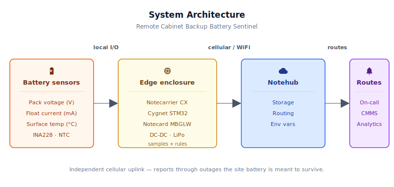
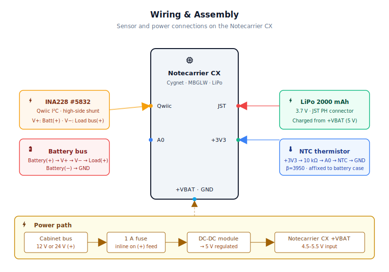
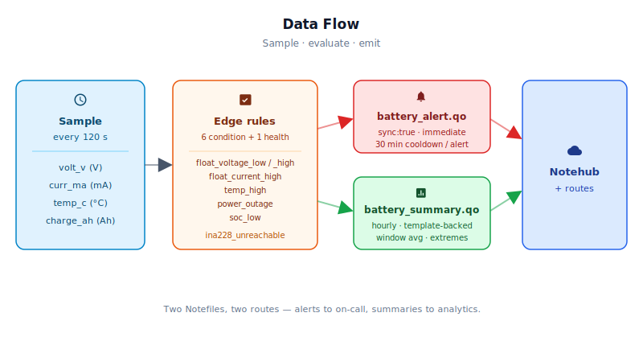

# Remote Cabinet Backup Battery Sentinel — Pack-Level 12 V / 24 V Battery Monitor

<Note>

This reference application is intended to provide inspiration and help you get started quickly. It uses specific hardware choices that may not match your own implementation. Focus on the sections most relevant to your use case. If you'd like to discuss your project and whether it's a good fit for Blues, [feel free to reach out](https://blues.com/contact-sales/).

</Note>

A pack-level sentinel — a Blues [battery management systems](https://blues.com/battery-management-systems/) reference design — for the backup battery inside a **traffic-signal controller, roadside IoT gateway, industrial RTU, or equipment cabinet** running on a **12 V or 24 V positive-referenced DC bus**. A Blues [Notecard Cell+WiFi](https://shop.blues.com/products/notecard?utm_source=dev-blues&utm_medium=web&utm_campaign=store-link) and [Notecarrier CX](https://shop.blues.com/products/notecarrier-cx?utm_source=dev-blues&utm_medium=web&utm_campaign=store-link), paired with a precision current/voltage monitor and a surface-mounted thermistor, continuously measure pack voltage, bidirectional current, surface temperature, and state-of-charge — with proactive alerts on charger faults, elevated float current (a reliable early indicator of **VRLA** capacity degradation weeks before failure — see §8 for chemistry-specific caveats), mains power loss detected within one sample interval, and a low-SoC threshold trip. Over cellular, independent of every piece of equipment the battery is supposed to protect.

> **Hardware scope — pack-level sentinel only.** This design measures four signals at the pack level: terminal voltage, bidirectional current, surface temperature, and state-of-charge via coulomb counting. **Per-cell voltage monitoring and cell-imbalance detection are intentionally outside the scope of this design**; they require a dedicated cell-monitor IC (e.g. TI BQ76940) wired to individual cell taps — a substantially different hardware design that is noted as a future extension in §9. SoC is tracked by integrating pack current against a commissioned `usable_capacity_ah` baseline — see §6 for commissioning and §9 for accuracy caveats. The onboard 15 mΩ INA228 shunt is rated for approximately 8 A continuous — appropriate for installations where peak discharge current stays within that range. For installations where peak discharge current exceeds 8 A, use the breakout's external-shunt footprint with a lower-value busbar shunt; see §4 and §9 for details.


## 1. Project Overview

**The problem.** VRLA (valve-regulated lead-acid) and LFP (lithium iron phosphate) backup batteries in roadside cabinets and remote equipment enclosures are the last line of defense against site downtime — and they're almost universally untested until they fail. A healthy-looking battery can have lost 60% of its usable capacity to sulfation while still holding nominal open-circuit voltage. A single shorted cell in a 12 V six-cell VRLA string depresses the pack voltage, but the charger compensates by pushing more current, masking the fault entirely from any simple voltage-only check.

The failure signal that *does* show up early is float current. A healthy VRLA battery at full charge draws only a few milliamps per 100 Ah from the charger — just enough to overcome self-discharge and electrochemical leakage. When internal resistance climbs due to sulfation or plate damage, the charger must push more current continuously just to hold voltage. Elevated float current is a reliable weeks-in-advance indicator that a battery is headed toward failure. It is a **pack-level aggregate** — it reveals that the string as a whole is degrading, which is often caused by one or more weakened cells, but it does not identify the specific cell or quantify per-cell imbalance. Distinguishing individual failed cells requires per-cell voltage monitoring hardware not included in this design (see §10). Nobody is watching pack float current, because nobody has instrumented it.

This project instruments it. A precision bidirectional current monitor sits in series with the battery's positive terminal, measuring float current with milliamp resolution. When the charger current reverses and the battery starts discharging — because mains power failed — the Notecard fires an immediate alert. When float current climbs steadily over weeks, the hourly summary captures the trend for a downstream analytics system to act on.

**Chemistry scope.** The float-current capacity-degradation signal is a VRLA mechanism. LFP batteries do not sulfate, and elevated float current on an LFP pack indicates a charger or BMS configuration fault rather than cell-level degradation. LFP installations still benefit fully from four of the six battery-condition alert modes this design provides — power-outage detection (current reversal), pack voltage bounds checking, surface temperature alerting, and low-SoC threshold tripping — but float-current trending as a capacity-health proxy does not apply to LFP without chemistry-specific calibration. See §7 for per-alert chemistry guidance and §9 for LFP threshold commissioning notes.

**Why Notecard.** The Notecard's independence from site infrastructure is the fundamental feature here. A traffic-cabinet controller, a roadside LoRaWAN gateway, or a roadside remote terminal unit all have their own modems and radios — but those are exactly the devices the backup battery is supposed to keep running during a mains failure. You cannot use the site's LTE modem to report that the site's LTE modem just went down because the backup battery was dead.

The Notecard manages its own cellular session against the supported carrier networks worldwide via its embedded global SIM, on a power path independent of the site equipment. When mains fails, the sentinel continues running from the cabinet battery bus through the DC-DC converter — which is precisely what allows it to observe the discharge in real time: voltage sag under actual site load, current draw, duration, and eventual recovery. The Notecarrier CX's onboard LiPo charger adds a reporting tail for the end-of-discharge case: once the cabinet battery is deeply depleted, the bus falls below the DC-DC converter's minimum input voltage, or the battery is disconnected entirely, the 2000 mAh LiPo takes over and extends cellular reporting beyond the battery's own capacity. If the sentinel needs to be fully independent of the monitored battery from the moment of mains failure — not riding on it at all — a separate, isolated power source is required. That discharge curve — only available because the sentinel kept running while everything else went dark — is the most valuable diagnostic data you can collect about backup battery health.

**Deployment scenario.** A compact enclosure mounted inside a traffic-signal controller housing, roadside IoT gateway enclosure, industrial RTU cabinet, or telecom equipment shelter — installations running on a 12 V or 24 V positive-referenced DC bus. The Adafruit INA228 shunt monitor wires in series with the battery's positive terminal; the NTC thermistor is affixed to the battery case surface with thermal adhesive. A DC-DC step-down module converts the cabinet bus voltage to regulated 5 V for the Notecarrier CX; a 2000 mAh LiPo on the JST connector is charged from that 5 V supply; during a mains outage the sentinel continues running from the cabinet battery via the DC-DC converter, with the LiPo taking over only when the monitored battery is deeply depleted or the bus drops below the converter's input range. The Notecard's cellular antenna routes out of the enclosure via u.FL pigtail to a patch or magnetic-mount antenna on the cabinet exterior.

## 2. System Architecture



**Device-side responsibilities.** The onboard Cygnet STM32L433 host on the Notecarrier CX wakes every two minutes, reads pack voltage and bidirectional current from the INA228 over Qwiic, reads surface temperature from the NTC thermistor on A0, then evaluates six battery-condition rules plus one sensor-health alert locally. Any rule that trips emits an alert [Note](https://dev.blues.io/api-reference/glossary/#note) with `sync:true` for immediate delivery. All per-window statistics accumulate in a state struct serialised into Notecard flash by `NotePayloadSaveAndSleep` before the host powers off; [`card.attn`](https://dev.blues.io/api-reference/notecard-api/card-requests/#card-attn) handles the host power-gating so the MCU is off entirely between samples. Window-average power (`voltAvg × currAvg`) is derived at summary time, not sampled per-read from the INA228 power register.

**Notecard responsibilities.** The Notecard manages its own cellular session against the supported carrier networks worldwide via its embedded global SIM, stores Notes in its on-device queue, establishes sessions on the configured [`hub.set`](https://dev.blues.io/api-reference/notecard-api/hub-requests/#hub-set) `outbound` cadence (default 60 minutes), and flushes `sync:true` alert Notes immediately. It also distributes [environment variable](https://dev.blues.io/guides-and-tutorials/notecard-guides/understanding-environment-variables/) updates from Notehub to the host on its inbound schedule — operators can retune every threshold and both cadence values without reflashing.

**Notehub responsibilities.** [Notehub](https://notehub.io) ingests events over the Internet, stores every event, and applies project-level routes. The two Notefiles — `battery_summary.qo` for periodic telemetry and `battery_alert.qo` for threshold trips — are kept deliberately separate so you can fan them to different downstream destinations at different urgencies.

**Routing to the cloud (high level only).** Notehub supports HTTP, MQTT, AWS, Azure, GCP, Snowflake, and several other destinations; route setup is project-specific. See the [Notehub routing docs](https://dev.blues.io/notehub/notehub-walkthrough/#routing-data-with-notehub) — this project ships no specific downstream endpoint.

## 3. Technical Summary

1. **Notehub** — create a [Notehub project](https://notehub.io) and copy the ProductUID.
2. **Wire the bench rig** — Notecarrier CX + Notecard MBGLW + INA228 on Qwiic + NTC divider on A0 + LiPo on JST. Full pinout in [§5](#4-wiring-and-assembly).
3. **Edit one line** — set `PRODUCT_UID` in [`firmware/cabinet_battery_sentinel/cabinet_battery_sentinel_helpers.h`](firmware/cabinet_battery_sentinel/cabinet_battery_sentinel_helpers.h).
4. **Flash via CLI:**
   ```bash
   arduino-cli compile -b STMicroelectronics:stm32:Blues:pnum=CYGNET firmware/cabinet_battery_sentinel/
   arduino-cli upload -b STMicroelectronics:stm32:Blues:pnum=CYGNET -p /dev/cu.usbmodem* firmware/cabinet_battery_sentinel/
   ```
   Or use Arduino IDE (Tools → Board → Cygnet; Upload).
5. **Watch for success** — open Notehub → **Events** tab. You know it's working when:
   - `_session.qo` appears within **2–3 minutes** — this confirms the Notecard reached Notehub over cellular
   - `battery_summary.qo` appears within **60 minutes** — this is your hourly health summary (sample JSON below)
   - `battery_alert.qo` appears immediately if any alert condition trips (sample JSON below)
   
   If you don't see `_session.qo` after 5 minutes, check your PRODUCT_UID matches your Notehub project exactly and verify cellular coverage at your location. See §9.1 troubleshooting if the Notecard never reaches Notehub.

   Example `battery_summary.qo` (healthy 12 V VRLA at float):
   ```json
   {
     "volt_v": 13.65,
     "curr_ma": 12.5,
     "power_mw": 170.6,
     "charge_ah": 0.0125,
     "soc_pct": 97.3,
     "temp_c": 24.3,
     "volt_min_v": 13.52,
     "curr_min_ma": 0.0,
     "temp_max_c": 25.1,
     "samples": 30
   }
   ```

   Example `battery_alert.qo` (power outage event):
   ```json
   {
     "alert": "power_outage",
     "volt_v": 12.4,
     "curr_ma": -3200.0,
     "temp_c": 25.5
   }
   ```

## 4. Hardware Requirements

| Part | Qty | Rationale |
|------|-----|-----------|
| [Notecarrier CX](https://shop.blues.com/products/notecarrier-cx?utm_source=dev-blues&utm_medium=web&utm_campaign=store-link) | 1 | Compact carrier with an embedded Cygnet STM32L433 host MCU, Qwiic I2C port, and an onboard JST LiPo charger circuit — essential for keeping the sentinel powered through the outages it's built to detect. Accepts regulated 4.5–5.5 V on the +VBAT header pin. |
| [Notecard Cell+WiFi (MBGLW)](https://shop.blues.com/products/notecard?utm_source=dev-blues&utm_medium=web&utm_campaign=store-link) ([datasheet](https://dev.blues.io/datasheets/notecard-datasheet/note-mbglw/)) | 1 | Cellular uplink that manages its own cellular session against supported carrier networks worldwide via embedded global SIM; WiFi acts as an opportunistic fallback for sites that happen to have rooftop coverage. |
| [Blues Mojo](https://shop.blues.com/products/mojo?utm_source=dev-blues&utm_medium=web&utm_campaign=store-link) | 1 | **BENCH VALIDATION ONLY** — not deployed in production. Splice inline on the 5 V power path during bring-up to measure the complete device's idle baseline, sensor-wake current, and cellular-session bursts. See §8 for analysis and §4 for wiring. Remove before field deployment. |
| [Adafruit INA228 Power Monitor Breakout (#5832)](https://www.adafruit.com/product/5832) | 1 | 20-bit I2C precision monitor measuring bus voltage up to 85 V and bidirectional current through its onboard 15 mΩ shunt. The onboard shunt handles up to approximately 8 A continuous — appropriate for installations where peak discharge current does not exceed that limit (typically batteries up to roughly 40 Ah at a C/5 discharge rate). For higher-current installations, use the breakout's external-shunt footprint with a lower-value busbar shunt. |
| 10 kΩ NTC thermistor, β=3950, waterproof probe | 1 | Surface-mounted to the battery case; detects elevated case temperature that can signal charging faults, poor cabinet ventilation, or abnormal battery conditions — and provides a per-sample temperature for the hourly summary. |
| 10 kΩ 1% resistor | 1 | Pull-up resistor in the thermistor voltage divider. |
| 3.7 V 2000 mAh LiPo battery, JST PH connector (e.g. [Adafruit #2011](https://www.adafruit.com/product/2011)) | 1 | Reporting-tail backup for the end-of-discharge case. During a normal mains outage the sentinel runs from the cabinet battery bus via the DC-DC converter; the LiPo takes over only after the monitored battery is deeply depleted or the bus drops below the converter's minimum input. The Notecarrier CX charges it from the regulated 5 V supply and switches automatically. |
| 5 V regulated DC-DC step-down module — **12 V systems:** [RECOM R-78E5.0-1.0](https://www.recom-power.com/en/rec-p/R-78E5.0-1.0.html) (8–28 V input, 1 A) | 1 | Converts the 12 V cabinet bus to the regulated 4.5–5.5 V required by the Notecarrier CX +VBAT pin. The 8–28 V input range comfortably covers a 12 V VRLA or LFP charger bus at float and absorption. |
| 5 V regulated DC-DC step-down module — **24 V systems:** [Pololu D24V50F5](https://www.pololu.com/product/2851) (6–38 V input, 5 A) | 1 | Use in place of the RECOM module when the cabinet bus is 24 V nominal (float ~27–28 V, absorption up to ~29 V). The 6–38 V input range covers 24 V VRLA and LFP charger buses with ample headroom. |
| Inline fuse holder with 1 A 32 V blade fuse (ATC/ATM automotive style or equivalent) | 1 | **Safety-critical.** Install in series on the positive-bus cable between the battery bus (+) and the DC-DC converter input. Sized for 1 A — well above the sentinel's ≤500 mA peak draw from a 12 V or 24 V bus during a cellular session, and will clear before wiring fault damage. The INA228 shunt path (battery positive to load bus) carries the full site load current and must be installed on a battery branch that is already protected by an upstream circuit breaker or fuse rated for the expected load current — see §5. |
| u.FL to SMA bulkhead pigtail, ~150 mm (e.g. [Adafruit #851](https://www.adafruit.com/product/851)) | 1 | Routes the Notecard's cellular antenna connection from the u.FL footprint on the Notecarrier CX to an SMA bulkhead fitting in the enclosure wall. Uses RG178 coax; verify the SMA connector sex matches your antenna before ordering. |
| LTE cellular antenna with SMA connector, panel-mount or magnetic-mount (e.g. [SparkFun CEL-16432](https://www.sparkfun.com/products/16432), 698 MHz–2.7 GHz, 2.3 dBi) | 1 | Mount on the cabinet exterior for reliable LTE-M coverage. A rubber-duck or internal antenna inside a sealed metal enclosure will not maintain consistent signal. |
| Qwiic cable, 100 mm or 200 mm | 1 | Connects the INA228 breakout to the Notecarrier CX Qwiic port. |
| ABS enclosure, IP54 or better (e.g. [Hammond 1591XXTSFLBK](https://www.hammfg.com/part/1591XXTSFLBK), ~123 × 83 × 61 mm) | 1 | Houses the Notecarrier CX assembly inside the cabinet. The 1591XXTSFLBK provides ample internal volume for the board stack and wiring, with a clear polycarbonate lid for visual status checks without opening. Add cable glands for the antenna pigtail, thermistor probe, shunt wires, and power leads. |
| Thermal adhesive tape (e.g., 3M 8810) | 1 | Affixes the thermistor probe firmly to the battery case surface for accurate temperature readings. |

All Blues hardware ships with an active SIM including 500 MB of data and 10 years of service — no activation fees, no monthly commitment.

### Safety and Installation Requirements (Read Before Wiring)

**Safety-critical step: inline fuse.** Install a **1 A fuse in series on the positive-bus cable between the battery bus (+) and the DC-DC converter input** (the sentinel's own power supply). Battery strings and busbars can deliver thousands of amperes of short-circuit current; the fuse sized for 1 A — well above the sentinel's ≤500 mA peak draw during a cellular session — will clear a wiring fault before causing arc damage or fire.

**INA228 shunt installation.** The INA228 sits **in series on the battery's positive terminal** and must be installed on a battery branch that already has an **upstream circuit breaker or fuse rated for the expected load current**. Do not install the INA228 shunt on a battery segment with no existing overcurrent protection.

**Lockout/tagout.** Before making any connections to an energised battery bus: isolate and lock out the battery charger and all parallel discharge paths (lockout/tagout procedure), use insulated tools, remove metallic jewelry and watchbands, and confirm the bus is de-energized before touching conductors. For cabinet installations with multiple parallel battery strings, all strings must be isolated simultaneously before working in the positive-bus circuit.

> **Voltage range note.** This BOM targets a **positive-referenced DC bus** — the INA228 high-side sensing topology and the non-isolated 5 V step-down converter both reference the negative bus as circuit ground. It covers **12 V and 24 V positive-referenced** VRLA and LFP charger buses (e.g., 12 V VRLA at 13.5–14.7 V float; 24 V VRLA at 27–29.4 V float). For 24 V systems, update `volt_min_v` and `volt_max_v` to match your charger's float window — see §6 — and use the Pololu D24V50F5 listed in the BOM. Also verify that the expected peak discharge current is within the shunt's rating (≤8 A for the onboard 15 mΩ shunt; use an external shunt for higher-current installations).

## 5. Wiring and Assembly



> **Safety reminder:** Review the safety requirements in §3 before proceeding. Ensure the inline fuse is installed on the sentinel's power supply and the INA228 shunt is on a battery branch with upstream overcurrent protection.

All host I/O lands on the [Notecarrier CX](https://dev.blues.io/datasheets/notecarrier-datasheet/notecarrier-cx-v1-3/) dual 16-pin header and Qwiic connector. The Notecard Cell+WiFi seats into the M.2 slot.

**Cabinet bus to Notecarrier CX power chain:**

The cabinet battery bus (typically 12–15 V for 12 V VRLA/LFP, or 25–29 V for 24 V VRLA/LFP charger buses) is not directly compatible with the Notecarrier CX's +VBAT input, which requires regulated 4.5–5.5 V. A DC-DC step-down module bridges the two:

```
Cabinet battery bus (+) → 1 A inline fuse → DC-DC module input (+)
DC-DC module output (5 V regulated) → Notecarrier CX +VBAT header pin
Cabinet battery bus (–) / cabinet ground → Notecarrier CX GND header pin
```

Mount the DC-DC module inside the enclosure and verify its input-voltage range covers your cabinet supply before wiring. The Notecarrier CX's USB-C connector is an equivalent 5 V power entry point if a USB-C cable is more convenient than the header pin for your enclosure layout. See the [Notecarrier CX datasheet](https://dev.blues.io/datasheets/notecarrier-datasheet/notecarrier-cx-v1-3/) for +VBAT and GND pin locations on the dual 16-pin header.

The 2000 mAh LiPo on the JST connector is charged from the regulated 5 V supply whenever the cabinet bus is present. During a normal mains outage the sentinel continues drawing power from the cabinet battery via the DC-DC converter — the LiPo does not take over yet. This is intentional: the sentinel is riding on the battery it monitors, directly observing the discharge as it happens. The LiPo becomes the primary power source only after the monitored battery is deeply depleted, the bus voltage drops below the DC-DC converter's minimum input threshold, or the battery is disconnected — extending the reporting tail beyond the battery's own capacity. If the design requirement is full electrical independence from the monitored battery from the moment mains fails, an isolated power supply fed from a separate source is needed instead.

**INA228 battery power path (high-side current sensing):**

The INA228 measures the current flowing in or out of the battery by sitting in series with the battery's positive terminal — this topology is called high-side sensing.

- **Battery (+) terminal** → **INA228 `V+` pad** (connects to the shunt IN+ input)
- **INA228 `V–` pad** → cabinet load bus (+)
- **Battery (–) terminal** → cabinet load bus (–) / circuit ground

The 15 mΩ shunt is internal to the Adafruit #5832 breakout; no external shunt resistor is required for currents up to approximately 8–10 A continuous. For installations where peak discharge current exceeds 8 A — a 100 Ah battery at a C/5 discharge rate draws 20 A — bypass the internal shunt via the breakout's external-shunt footprint and wire a lower-value shunt (e.g. 1–2 mΩ), updating `INA228_SHUNT_OHMS` and `INA228_MAX_CURRENT_A` in firmware to match. See §9 (Limitations) for further details.

**INA228 to Notecarrier CX (I2C via Qwiic):**

- **INA228 Qwiic connector** → **Notecarrier CX Qwiic connector** (3.3 V, GND, SDA, SCL; Qwiic cable)

The Notecarrier CX has onboard I2C pull-ups; no additional pull-up resistors are required.

**NTC thermistor voltage divider (A0):**

- **Notecarrier CX +3V3** → **10 kΩ 1% resistor** → **Notecarrier CX A0**
- **Notecarrier CX A0** (same node as above) → **NTC thermistor leg 1**
- **NTC thermistor leg 2** → **Notecarrier CX GND**

Affix the thermistor probe to the battery case surface using thermal adhesive tape. For multi-cell packs, position it near the geometric center of the pack where heat from an internal fault tends to be highest.

**LiPo backup battery:**

- **2000 mAh LiPo** → **Notecarrier CX JST PH battery connector**

The Notecarrier CX charges the LiPo from the regulated 5 V supply on +VBAT. The transition from external power to LiPo is automatic; no firmware change is needed.

**Notecard:**

Insert the Notecard Cell+WiFi into the Notecarrier CX M.2 slot and secure with the mounting screw. Connect the u.FL to SMA pigtail to the antenna footprint on the Notecard, route it to an SMA bulkhead fitting in the enclosure wall, and attach the external antenna on the cabinet exterior. A rubber-duck antenna inside a sealed steel cabinet will not maintain reliable LTE-M coverage.

**Mojo (bench validation only):**

For bench bring-up, splice the [Mojo](https://dev.blues.io/datasheets/mojo-datasheet/) inline between the **5 V DC-DC module output** and the Notecarrier CX +VBAT input — do not connect it directly to a 12 V or 24 V cabinet bus. Mojo measures the current consumed by the entire assembled device on the 5 V power rail.

**I²C topology:** this firmware does not read Mojo's coulomb counter over I²C; Mojo is inline power measurement only. The INA228 connects directly to the Notecarrier CX Qwiic connector as described above — Mojo's Qwiic port does not need to be wired for this bring-up.

Remove Mojo from the power path for production deployment; see §9.


## 6. Notehub Setup

1. **Create a project.** Sign up at [notehub.io](https://notehub.io) and [create a project](https://dev.blues.io/quickstart/notecard-quickstart/notecard-and-notecarrier-pi/#set-up-notehub). Copy the [ProductUID](https://dev.blues.io/notehub/notehub-walkthrough/#finding-a-productuid) — it looks like `com.your-company.your-name:cabinet-battery-sentinel`.

2. **Set the ProductUID in firmware.** Open [`cabinet_battery_sentinel_helpers.h`](firmware/cabinet_battery_sentinel/cabinet_battery_sentinel_helpers.h) and replace the empty string on the `#define PRODUCT_UID ""` line with your value.

3. **Claim the Notecard.** Power the assembled unit. On first cellular connection the Notecard associates with your Notehub project automatically. The device appears in the **Devices** tab within a few minutes; no manual claim step is required.

4. **Create a Fleet.** [Fleets](https://dev.blues.io/guides-and-tutorials/fleet-admin-guide/) group devices for shared environment variable configuration and routing. The natural organization here is by battery chemistry and voltage — one fleet for 12 V VRLA roadside cabinets, another for 24 V VRLA or LFP installations — because the safe float voltage windows differ materially between chemistries. [Smart Fleets](https://dev.blues.io/notehub/notehub-walkthrough/#using-smart-fleet-rules) can automate fleet assignment as devices provision.

5. **Set environment variables.** In Notehub, navigate to **Fleet → Environment** (or **Device → Environment** for a per-unit override). Add any of the variables below. The Notecard pulls them on its next inbound sync; no reflash, no truck roll. All are optional — firmware defaults apply when a variable is absent.

   | Variable | Default | Purpose |
   |---|---|---|
   | `sample_interval_sec` | `120` | Seconds between sensor wakes. Min 30, max 3600. At 120 s the device takes 30 samples per hourly summary. |
   | `summary_interval_min` | `60` | Minutes between `battery_summary.qo` notes. Changing this value also re-applies `hub.set` on the next wake so the Notecard's outbound session cadence stays in sync with the new summary interval. |
   | `volt_min_v` | `13.2` | Pack voltage (V) below which `float_voltage_low` fires. **Default calibrated for 12 V VRLA** — the low end of the normal float window is approximately 13.2–13.5 V (2.20–2.25 V/cell). For 24 V systems set to ~26.4; for LFP systems, set chemistry-appropriate thresholds per the Chemistry-Specific Alert Notes in §7. |
   | `volt_max_v` | `14.8` | Pack voltage (V) above which `float_voltage_high` fires. **Default calibrated for 12 V VRLA** — typical float is 13.5–13.8 V; the default gives 1 V of margin above the absorption ceiling. For 24 V systems set to ~29.0; for LFP, see §8. |
   | `float_current_hi_ma` | `500` | Float current (mA) above which `float_current_high` fires. **Default calibrated for 12 V VRLA** — a healthy 100 Ah VRLA draws <50 mA at float; 500 mA is a clear anomaly signal. See the "Chemistry-Specific Alert Notes" sidebar in §7 for VRLA vs. LFP interpretation and commission a chemistry-appropriate threshold at installation. |
   | `temp_alert_c` | `40` | Pack surface temperature (°C) above which `temp_high` fires. VRLA batteries age roughly 2× faster for every 10 °C above 25 °C; 40 °C is the standard service-alert threshold. |
   | `discharge_ma` | `-200` | Current (mA) below which `power_outage` fires. −200 mA provides a clear margin above float-current noise while catching any sustained discharge within a single sample. |
   | `usable_capacity_ah` | `100` | Battery bank usable capacity (Ah) used for coulomb-counting SoC. Set this to the battery's nameplate capacity (or measured usable capacity from a full-discharge cycle). Required for meaningful `soc_pct` values — the firmware uses the default 100 Ah until overridden. For a 200 Ah bank set to `200`. |
   | `soc_low_pct` | `20` | SoC (%) below which `soc_low` fires. |
   | `soc_pct_init` | *(unset)* | Initial SoC (%) to apply the **first time** this value is seen after a known-full charge. Set once after confirming the battery is fully charged (charger holding float voltage and current at minimum); the firmware tracks SoC from that baseline. To recalibrate: change the value to the new known SoC — the firmware detects the change and re-initialises on the next inbound sync. Leave unset (or set to `−1`) to defer commissioning; `soc_pct` in summary notes will carry `−9999` until a value is applied. |

6. **Configure routes.** Add one [route](https://dev.blues.io/notehub/notehub-walkthrough/#routing-data-with-notehub) targeting `battery_alert.qo` — this is your real-time channel to an on-call queue, CMMS ticket, or alerting platform. Add a second route for `battery_summary.qo` to a time-series analytics store where float-current trends can be visualized over weeks and months. The two Notefiles are separate by design so they can be fanned to different destinations with different urgencies and retention policies.

### Expected events in Notehub

Within a minute of first power-on the **Events** tab should begin populating. Three event kinds matter:

- **`_session.qo`** — automatic Notecard housekeeping on each cellular session; confirms the radio is reaching Notehub.
- **`battery_summary.qo`** — one per `summary_interval_min`. `charge_ah` is the net coulombs over the summary window: positive values during float operation, large negative values during site discharge. `soc_pct` is the running coulomb-counted state-of-charge estimate; `−9999` means `soc_pct_init` has not yet been commissioned. `curr_min_ma` tracks the deepest discharge current (most-negative value) seen in the window; `0.0` means no discharge occurred. See the Quickstart section for full example JSON.

- **`battery_alert.qo`** — emitted only on a threshold trip or sensor fault, transmitted immediately. The `alert` field is one of `float_voltage_low`, `float_voltage_high`, `float_current_high`, `temp_high`, `power_outage`, `soc_low`, or `ina228_unreachable`. See the Quickstart section for example JSON.

## 7. Firmware Design

The firmware is split across three files in `firmware/cabinet_battery_sentinel/`:

| File | Contents |
|---|---|
| `cabinet_battery_sentinel.ino` | Includes, global variable definitions, `setup()`, `loop()` |
| `cabinet_battery_sentinel_helpers.h` | All `#define` constants (including `PRODUCT_UID`), `SentinelState` struct, extern globals, function prototypes |
| `cabinet_battery_sentinel_helpers.cpp` | All helper function implementations |

### 6.1 Installing and flashing

**Dependencies:**

- **Arduino core for STM32** — install via the Arduino Boards Manager (add the index URL `https://github.com/stm32duino/BoardManagerFiles/raw/main/package_stmicroelectronics_index.json` under **File → Preferences → Additional Boards Manager URLs**). Select **Blues Cygnet** as the board (canonical FQBN: `STMicroelectronics:stm32:Blues:pnum=CYGNET`).
- **`Blues Wireless Notecard`** (note-arduino) — install via the Arduino Library Manager (`arduino-cli lib install "Blues Wireless Notecard"`). Check [note-arduino releases](https://github.com/blues/note-arduino/releases) and use the latest stable version.
- **`Adafruit INA228`** — install via the Arduino Library Manager (`arduino-cli lib install "Adafruit INA228"`).
- **`Adafruit BusIO`** — required dependency of the INA228 library; install via Library Manager.

**Before compiling**, open `cabinet_battery_sentinel_helpers.h` and replace the empty string on the `#define PRODUCT_UID ""` line with your Notehub ProjectUID. All three source files in the sketch folder are compiled together automatically by the Arduino build system.

**Flashing via `arduino-cli`:**

```bash
# Confirm the correct FQBN for your installed core version
arduino-cli board listall | grep -i cygnet

# Compile and upload (replace FQBN and port with what the command above reports)
arduino-cli compile -b STMicroelectronics:stm32:Blues:pnum=CYGNET firmware/cabinet_battery_sentinel/
arduino-cli upload  -b STMicroelectronics:stm32:Blues:pnum=CYGNET \
                    -p /dev/cu.usbmodem* \
                    firmware/cabinet_battery_sentinel/
```

**Flashing via Arduino IDE:** open `cabinet_battery_sentinel.ino`, select the Cygnet board, select the correct port, and click **Upload**. The Notecarrier CX exposes the ST-Link interface on the same USB-C cable, so no external programmer is needed.

After upload, open the serial monitor at **115200 baud**. On each wake the firmware prints one or two `[sentinel]` lines — for example:

```
[sentinel] volt=13.652V  curr=12.5mA
[sentinel] temp=24.3C
```

Then the host powers off for the sample interval and the monitor goes quiet. `INA228 FAIL` or `NTC open/shorted` messages indicate a wiring problem on those sensors. If the INA228 init fails, both INA228 readings (voltage and current) are skipped for that sample — the summary accumulates only valid samples.

### 6.2 Modules

| Responsibility | Where |
|---|---|
| Notecard config (`hub.set`, template, accelerometer) | `notecardConfigure`, `defineTemplate` (helpers.cpp) |
| Env-var fetch and range clamp | `fetchEnvOverrides` (helpers.cpp) |
| INA228 init and per-wake calibration | `initINA228` (helpers.cpp) |
| Battery voltage and current reads | `readBatteryVoltage`, `readBatteryCurrent` (helpers.cpp) |
| NTC thermistor temperature read | `readPackTempC` (helpers.cpp) |
| Six battery-condition alert rules plus sensor-health fault, all with per-alert cooldowns | Inline in `setup()` (cabinet_battery_sentinel.ino) |
| INA228 persistent-fault remote notification | Inline in `setup()` + `sendAlert` |
| Hourly summary accumulation and emission | `sendSummary` (helpers.cpp) |
| Immediate-sync alert emission | `sendAlert` (helpers.cpp) |
| State persistence and host sleep | `sleepHost` → `NotePayloadSaveAndSleep` (helpers.cpp) |

### 6.3 Sensor reading strategy

**INA228 (voltage and current).** The INA228 loses power while the Cygnet is sleeping, so it's re-initialised on every wake with `begin()` followed by `setShunt(0.015, 8.0)`. The calibration call programs the chip with the shunt resistance and full-scale current. Single-point reads of `readBusVoltage()`, `readShuntVoltage()`, and `readCurrent()` take well under 10 ms. Current is *signed* at the firmware level: positive values mean the charger is supplying current, negative values mean the battery is discharging. This sign convention makes `power_outage` detection trivially simple — just a threshold comparison against `g_dischargeMa`.

**Battery-terminal voltage.** With Battery(+) wired to INA228 V+ and the load/charger bus wired to V−, `readBusVoltage()` returns the voltage at V− (load side of the shunt), not the battery terminal. `readBatteryVoltage()` adds the shunt voltage to recover the true battery-terminal voltage: `V_terminal = V_bus + readShuntVoltage() / 1000`. The correction is ≤ 7.5 mV at float currents up to 500 mA (negligible) and reaches ~48 mV at 3.2 A discharge — material for voltage-alert accuracy and for the `volt_v` time series used in float-voltage trending.

**Current sign note.** The INA228 is wired with Battery(+) on V+ and the load bus on V−, so the chip internally reports *positive* raw current during discharge (battery→load direction). `readBatteryCurrent()` negates the raw `readCurrent()` result before returning it, so all downstream comparisons, accumulations, and alert thresholds use the intuitive convention (positive = charger present, negative = outage). The documented wiring in §4 and the semantic descriptions throughout this README all refer to the post-negation value.

The INA228 has an internal power register, but this design does not read it; `power_mw` in the summary note is derived as `voltAvg × currAvg` in `sendSummary()` — a window-average approximation, not a per-sample hardware measurement.

**NTC thermistor.** A 16-sample average of 12-bit ADC readings (`analogReadResolution(12)` on the Cygnet) reduces noise before applying the β-equation: `T = 1 / (1/T₀ + (1/β) × ln(R/R₀))`. ADC readings within 50 mV of the supply rails (indicating an open or shorted probe) return `NAN` and are excluded from the temperature accumulator. A bad temperature reading never silently biases the summary averages, and — because voltage, current, and temperature each maintain their own independent sum and valid-sample count — a failed thermistor probe never suppresses voltage or current accumulation, alert evaluation, or the `power_outage` detection path.

**Charge balance and SoC.** The INA228's hardware charge accumulator resets every time the chip powers up — which happens on every wake cycle since the Cygnet's 3.3 V rail is gated. Instead, the firmware accumulates charge in software: `chargeAh += (curr_mA / 1000) × (sample_interval_sec / 3600)` each cycle. The per-window result appears as `charge_ah` in the summary note: a small positive value during normal float, a large negative value during a power outage. `charge_ah` is a **per-window delta, not state-of-charge**. State-of-charge is maintained separately in `soc_pct`: on each wake the same current-integration delta is divided by `usable_capacity_ah` and added to the running SoC estimate, which persists across sleep cycles in Notecard flash. `soc_pct` in the summary note carries `−9999` (SUMMARY_INVALID_SENTINEL) until the operator commissions a starting SoC via `soc_pct_init`; see §6 for commissioning steps and §9 for accuracy caveats.

### 6.4 Event payload design

`battery_summary.qo` is [template-backed](https://dev.blues.io/notecard/notecard-walkthrough/low-bandwidth-design/#working-with-note-templates), giving it a fixed wire schema and a ~3–5× smaller on-wire footprint than free-form JSON — material for a device that will send 24 notes per day for years. `battery_alert.qo` is untemplated and uses `sync:true` for immediate delivery.

Field semantics:
- `power_mw` is derived as `voltAvg × currAvg` — a window-average approximation, not a per-sample hardware read from the INA228 power register.
- `charge_ah` is the **net coulombs** delivered to or drawn from the battery during the window — a per-window delta only, not running state-of-charge.
- `soc_pct` is the **running state-of-charge estimate** maintained across windows by integrating current against the commissioned `usable_capacity_ah` baseline; `−9999` means not yet commissioned.
- `curr_min_ma` tracks the most-negative (deepest discharge) current seen in the window; `0.0` means no discharge occurred; a negative value (e.g., `−3200.0`) means the battery was actively discharging at 3.2 A into the load.

Example JSON is shown in the Quickstart section above.

### 6.5 Low-power strategy

The Cygnet is fully power-gated by [`card.attn`](https://dev.blues.io/api-reference/notecard-api/card-requests/#card-attn) for the full 120-second sample interval. The host does not delay or MCU-sleep — it powers off entirely, leaving only the Notecard active at its own published ~8 µA idle current. This is a Notecard-datasheet figure; the actual current drawn from the 5 V supply during idle (as measured by Mojo on the assembled device) will be higher, because it includes the Notecard's ~8 µA plus the quiescent current of the DC-DC converter and Notecarrier CX regulators. Firmware state is serialised into Notecard flash by `NotePayloadSaveAndSleep` before the host shuts down, and deserialised by `NotePayloadRetrieveAfterSleep` on the next wake, so the rolling window accumulates correctly across hundreds of sleep cycles per day.

The Notecard itself is set to `periodic` mode with `outbound:60`. Summary notes queue in the on-device flash store and ship in a single cellular session once per hour, keeping radio duty-cycle low. Alert notes with `sync:true` bypass the outbound timer and wake the radio immediately — but because alert cooldowns prevent re-firing for 30 minutes of wall-clock time (stored as remaining seconds in the persistent state and decremented by the sample interval on each wake), even a sustained fault doesn't generate continuous radio wakes — and the 30-minute window holds regardless of whether `sample_interval_sec` is tuned to 30 s or 2 min.

### 6.6 Retry and error handling

- **Notecard configuration.** The initial `hub.set` in `notecardConfigure()` uses `sendRequestWithRetry(req, 5)` — a 5-second retry window covers the cold-boot I2C race where the STM32 comes up before the Notecard has finished initialising. `note.template` registration checks the boolean return value of `sendRequest` and logs a debug message on failure. Both the clean-boot path and the invalid-state-segment recovery path call `doFirstBoot()` so hub configuration and the Note template are never left stale after a firmware update that changes the state struct layout.
- **Environment variable fetch.** `fetchEnvOverrides()` calls `requestAndResponse` and inspects the `err` field before reading the body; a Notecard-side error (e.g. not yet associated with Notehub) returns early rather than silently leaving stale threshold values from a corrupted response. The `hub.set` re-apply block in `setup()` only updates `state.lastSummaryMin` after `sendRequest` confirms delivery, so a transient I2C fault doesn't desynchronise the recorded cadence from the Notecard's actual setting.
- **INA228 fault.** `initINA228()` returns `false` on I2C NACK. Both INA228 readings (voltage and current) are set to `NAN`, excluded from their respective metric accumulators, and skipped in alert evaluation — the firmware continues to sleep rather than hanging on a sensor fault. Temperature accumulation and the `temp_high` alert continue independently. A persistent INA228 failure is surfaced remotely: when `initINA228()` returns `false` and the `coolInaFaultSec` cooldown has expired, an `ina228_unreachable` alert is emitted to `battery_alert.qo` (rate-limited to once per 30 minutes so a sustained hardware fault does not flood the notefile). When the INA228 is unreachable for an entire summary window, `sendSummary()` still emits the note — all INA228 fields carry `SUMMARY_INVALID_SENTINEL` and `samples` is 0 — so Notehub shows a visible fault window rather than a silent gap.
- **NTC fault.** ADC readings within 50 mV of the supply rails return `NAN` and are excluded from temperature accumulation. When only the thermistor is faulted (INA228 data is still valid), the summary is emitted normally with `SUMMARY_INVALID_SENTINEL` (−9999) in the `temp_c` and `temp_max_c` fields so downstream analytics can distinguish "sensor failed" from a true near-zero reading. When the INA228 is also unreachable for the entire window, `sendSummary()` still emits — all INA228 fields carry `SUMMARY_INVALID_SENTINEL` and `samples` is 0; the `ina228_unreachable` alert provides the immediate notification while the sentinel-filled summary preserves time-series continuity.
- **Note delivery.** `sendSummary()` and `sendAlert()` each retry `note.add` up to three times with a 500 ms delay between attempts. `sendSummary()` returns a boolean; metric accumulators and the window elapsed timer are only reset after a confirmed successful delivery — a transient Notecard I2C fault preserves the window data so the next wake retries with the data intact rather than losing the window silently.
- **Alert gating.** `float_voltage_low`, `float_voltage_high`, and `float_current_high` are suppressed during active battery discharge (`curr < discharge_ma`) to prevent misleading float-fault alerts during legitimate power-outage events. `float_current_high` is additionally suppressed for 30 minutes after the last discharge sample (the `postDischargeSec` settling window in the state struct) so normal bulk-recharge current following an outage recovery is not misclassified as elevated float current.
- **Env var range clamping.** `g_sampleSec` is clamped to [30, 3600] and `g_summaryMin` to [5, 1440] so a misconfigured variable cannot produce absurd sleep intervals or an unreachable summary window. When `sample_interval_sec` changes mid-window, `windowElapsedSec` is reset so the next summary covers exactly the newly configured interval rather than an unintended hybrid duration.
- **All six battery-condition rules and the sensor-health alert** use separate cooldown counters and fire independently. A battery that is simultaneously low-voltage and overtemperature fires both alerts; neither suppresses the other.

### 6.7 Key code snippet 1 — template registration

The template registers the `battery_summary.qo` schema as a fixed-length wire record, compressing every note to a fixed byte count for ~3–5× smaller over-the-air footprint. Format codes use the notation `<type><decimals>`:
- `14.2` = 4-byte IEEE-754 float, encoded to 2 decimal places on the wire (e.g. `13.65` V becomes two bytes instead of the full float)
- `14.1` = 4-byte float, 1 decimal place (e.g., `12.5` mA)
- `14.3` = 4-byte float, 3 decimal places (e.g., `0.0125` Ah)
- `12` = 2-byte signed integer (e.g., `30` samples)

Any subsequent `note.add` with a body that doesn't match this schema is rejected by the Notecard, catching firmware mistakes at the device rather than corrupting the downstream time series.

```cpp
J *req = notecard.newRequest("note.template");
JAddStringToObject(req, "file", "battery_summary.qo");
JAddNumberToObject(req, "port", 50);
J *body = JAddObjectToObject(req, "body");
JAddNumberToObject(body, "volt_v",      14.2);  // battery-terminal voltage (V)
JAddNumberToObject(body, "curr_ma",     14.1);
JAddNumberToObject(body, "power_mw",    14.1);
JAddNumberToObject(body, "charge_ah",   14.3);  // net coulombs this window (per-window delta)
JAddNumberToObject(body, "soc_pct",     14.1);  // running SoC estimate (%); -9999 = not commissioned
JAddNumberToObject(body, "temp_c",      14.1);
JAddNumberToObject(body, "volt_min_v",  14.2);
JAddNumberToObject(body, "curr_min_ma", 14.1);
JAddNumberToObject(body, "temp_max_c",  14.1);
JAddNumberToObject(body, "samples",     12);
notecard.sendRequest(req);
```

### 6.8 Key code snippet 2 — immediate power-outage alert

`sync:true` tells the Notecard to wake the radio immediately instead of waiting for the next outbound window. An operator can be notified within one sample interval (120 s at default settings) plus cellular session-establishment time (~15–60 s typical on LTE-M) after a current reversal crosses the `discharge_ma` threshold — so roughly two to three minutes end-to-end from the moment mains fails to the alert landing in Notehub at default settings. Reduce `sample_interval_sec` via env var if a shorter detection window is needed.

```cpp
J *req = notecard.newRequest("note.add");
JAddStringToObject(req, "file", "battery_alert.qo");
JAddBoolToObject(req,   "sync", true);
J *body = JAddObjectToObject(req, "body");
JAddStringToObject(body, "alert",   "power_outage");
JAddNumberToObject(body, "volt_v",  volt);
JAddNumberToObject(body, "curr_ma", curr);
JAddNumberToObject(body, "temp_c",  temp);
notecard.sendRequest(req);
```

### 6.9 Key code snippet 3 — sleep and state persistence

`NotePayloadSaveAndSleep` serialises the `SentinelState` struct into Notecard flash and issues a `card.attn` sleep command. On the next wake, `NotePayloadRetrieveAfterSleep` and `NotePayloadGetSegment` restore the struct — rolling averages, window extremes, alert cooldowns, and charge balance all survive intact.

```cpp
NotePayloadDesc payload = {0, 0, 0};
NotePayloadAddSegment(&payload, STATE_SEG_ID, &state, sizeof(state));
NotePayloadSaveAndSleep(&payload, g_sampleSec, NULL);
```

## 8. Data Flow



**Collected** every `sample_interval_sec` (default 120 s): pack voltage in V, float/discharge current in mA, and pack surface temperature in °C. Window-average power (mW) is derived as `voltAvg × currAvg` at summary time — not sampled directly from the INA228 power register.

**Accumulated** in `SentinelState` across sleep cycles: rolling sums for window averages, the minimum voltage seen at a sample point (useful for detecting voltage sag — note that sags entirely contained between two consecutive 2-minute samples will not be captured), the most-negative current (captures peak discharge rate during a power event), the maximum temperature, and the net charge balance in amp-hours.

**Transmitted:**
- `battery_summary.qo` — one record per `summary_interval_min` (default 24 per day), template-encoded. Window averages plus extremes. A healthy battery at float shows a small positive `charge_ah` proportional to float current and window duration (e.g., 0.0125 Ah for 12.5 mA average over one hour); a battery that spent time discharging shows a large negative `charge_ah`.
- `battery_alert.qo` — emitted immediately on a threshold trip, with per-alert cooldowns preventing re-firing for approximately 30 minutes per alert type.

**Routed:** Notehub fans both Notefiles to configured routes. Natural split: `battery_alert.qo` → real-time on-call, CMMS, or SMS gateway; `battery_summary.qo` → time-series database for multi-week float-current trend analysis.

**Alert triggers** — six battery-condition rules plus one sensor-health alert:

| Alert | Condition | Diagnostic meaning |
|---|---|---|
| `float_voltage_low` | Voltage < `volt_min_v` **while charger present** (`curr ≥ discharge_ma`) | Charger not supplying enough current, failed cell, or battery unable to reach float voltage under load. Suppressed during active discharge so a legitimate voltage sag while running on battery does not generate a spurious float-fault alert. |
| `float_voltage_high` | Voltage > `volt_max_v` **while charger present** (`curr ≥ discharge_ma`) | Charger overvoltage fault; in VRLA, accelerates plate corrosion and electrolyte loss via gassing. Suppressed during active discharge for the same reason as `float_voltage_low`. |
| `float_current_high` | Current > `float_current_hi_ma` **while charger present and post-discharge settling window expired** | Elevated float current. See "Chemistry-Specific Alert Notes" sidebar below. Suppressed during active discharge and for 30 minutes after the last discharge sample so normal bulk-recharge current following an outage recovery is not misclassified as float degradation. |
| `temp_high` | Temperature > `temp_alert_c` | Elevated battery case temperature. A single surface thermistor cannot identify the heat source or confirm specific failure modes — it indicates the battery, charger, or enclosure is running abnormally warm. Sustained elevated temperature accelerates battery aging. Inspect charger output, enclosure ventilation, and battery condition. |
| `power_outage` | Current < `discharge_ma` | Site is running on battery. The event the whole system was built to detect — and to survive long enough to report. |
| `soc_low` | `soc_pct` < `soc_low_pct` **and SoC has been commissioned** | State-of-charge has fallen below the operator-configured threshold. Only fires after `soc_pct_init` has been set; `soc_pct` is included automatically in the alert note. Inspect whether a recent discharge event was deeper or longer than expected — a battery that drives SoC low during a brief outage has less reserve than its nameplate rating suggests. |
| `ina228_unreachable` | INA228 `begin()` fails on I2C NACK | The primary current and voltage sensor is not responding. All INA228-derived telemetry is blind until the fault clears. Rate-limited to once per 30 minutes. Inspect Qwiic wiring, I2C address (A0/A1 jumpers), and 3.3 V supply. |

#### Chemistry-Specific Alert Notes

**VRLA batteries:** Elevated float current is a reliable early indicator of sulfation, internal resistance growth, or approaching end-of-life — typically weeks before a battery fails a load test. This is a **pack-level aggregate signal** indicating the string as a whole requires more continuous charge current than a healthy pack, consistent with one or more degraded cells, but does not identify which cell or confirm per-cell imbalance. **Default thresholds are calibrated for 12 V VRLA** (`volt_min_v=13.2`, `volt_max_v=14.8`, `float_current_hi_ma=500`). For 24 V VRLA, scale voltage thresholds proportionally (`volt_min_v≈26.4`, `volt_max_v≈29.0`).

**LFP (lithium iron phosphate) batteries:** Elevated float current does *not* indicate cell degradation — LFP packs do not sulfate. On an LFP pack, elevated float current typically signals a charger or BMS configuration fault instead. Voltage monitoring, `power_outage` detection, and `temp_high` remain fully applicable. **Do not commission LFP systems on default VRLA thresholds**; set `volt_min_v`, `volt_max_v`, and `float_current_hi_ma` to values calibrated for your specific LFP charger curve (typically narrower than VRLA — e.g., float ~13.5–13.8 V, absorption ~14.6 V for most LFP). Commission thresholds at installation after observing your charger's normal operating range.

## 9. Validation and Testing

**Expected steady-state behavior.** A healthy backup battery generates approximately one `battery_summary.qo` per hour and zero `battery_alert.qo` events. The `_session.qo` session events confirm cellular connectivity is healthy. Expect a brief flurry of `battery_alert.qo` events during the first few days while thresholds are tuned to the specific battery and charger on site — watch one week of hourly summaries before treating the baseline as calibrated.

**Simulating a power outage.** During bench bring-up the simplest test is to temporarily lower `discharge_ma` to `−5.0` via a Notehub environment variable. On the next inbound sync the Notecard pulls the new value; on the next sample, any measurement more negative than −5 mA fires `power_outage`. Restore the threshold after the test. Alternatively, physically disconnect the charger while monitoring the bench rig — the first sample after current reverses will emit an alert.

**Using Mojo to validate power behavior.** The Notecard's published datasheet current figures — see the [low-power design guide](https://dev.blues.io/notecard/notecard-walkthrough/low-power-firmware-design/) for authoritative numbers across SKUs and modes:

| Phase | Current @ 5 V |
|---|---|
| Idle baseline (host powered off, radio off) | ~8 µA (Notecard only) |
| Host wake, sensor read (Cygnet + INA228 + ADC) | ~15–20 mA for <1 s |
| Cellular session, LTE-M (one queued note) | ~200–300 mA average, 15–30 s |

**Whole-device power profile.** The figures above for Notecard idle and cellular are datasheet specs. On the assembled device, the idle baseline (host powered off via `card.attn`, radio idle) measured on a 5 V power rail includes the Notecard's ~8 µA plus the DC-DC converter's quiescent draw (~2 mA for RECOM R-78E5.0-1.0 or Pololu D24V50F5) plus Notecarrier CX regulator quiescent — typically **2–5 mA total at no load**. Use the trace **shape** — a 2-minute wake blip (~15–20 mA for <1 s), an hourly burst (~200–300 mA for 15–30 s), and a flat floor in between — to confirm correct sleep/wake behavior. The Mojo is spliced on the 5 V power rail and measures the entire assembled device; focus on a *flat* baseline at the expected quiescent level for your DC-DC converter rather than chasing sub-milliamp absolutes.

A useful Mojo trace pattern for a healthy unit:
- **Blip every 2 minutes** (<1 s at roughly 15–20 mA) — Cygnet awake reading sensors
- **Sustained burst once per hour** (15–30 s at 200–300 mA) — Notecard cellular session
- **Flat baseline between ~2–5 mA** — host powered off, Notecard radio idle, floor dominated by the DC-DC converter's quiescent current. The RECOM R-78E5.0-1.0 draws approximately 2 mA at no load; the Pololu D24V50F5 is in the same range. Focus on a *flat* floor at the expected level for your converter rather than chasing a sub-milliamp absolute figure.

> **Baseline measurement conditions.** For the idle-current floor to reflect deployment conditions, power the device through the DC-DC module into the +VBAT header with **no USB cable attached**. A connected USB cable can prevent the Cygnet STM32's USB peripheral and the Notecard from entering their lowest-power states, producing a higher and misleading baseline reading.

Use the Mojo to measure whole-device energy over a full 24-hour cycle on your specific hardware; actual consumption depends on signal conditions, LiPo charge efficiency, and the DC-DC module's light-load efficiency.

**Trace anomalies to diagnose:**
- **Continuous 80–150 mA baseline:** the host is not sleeping — `card.attn` is not cutting Cygnet power. Confirm you are using a Notecarrier CX (which supports ATTN host gating) and that `NotePayloadSaveAndSleep` is executing rather than returning early.
- **Hourly bursts exceeding 60 s:** the radio is struggling on weak signal. Move the cellular antenna or improve antenna routing out of the cabinet.
- **No blips, no bursts:** the Notecard is not reaching Notehub. Check `PRODUCT_UID` matches the Notehub project exactly and verify cellular coverage at the installation site.

Mojo is not required in deployed hardware — it is a bench bring-up and regression tool. Once a firmware version passes the trace check, deployed units don't need it.


A Notecarrier CX and a Cell+WiFi Notecard, paired with a 20-bit precision current monitor and a surface thermistor, turn a passive backup battery into a continuously-monitored asset that reports float conditions every two minutes, tracks state-of-charge via coulomb counting, trends float current over months as an early indicator of VRLA capacity degradation, and pages an operator within one sample interval of the site going dark. The same hardware and firmware run on 12 V roadside cabinet batteries and 24 V industrial UPS banks. The cellular uplink is independent of every piece of equipment the battery protects — which is the whole point. When the cabinet's own LTE radio shuts down because the mains failed and the battery turned out to be half-sulfated and incapable of holding the load, the sentinel is still running — riding on that failing battery through the DC-DC converter, capturing the discharge curve as the voltage collapses, and then switching to the onboard LiPo for the final reporting tail as the bus drops out.

For operations teams maintaining a fleet of roadside or remote-cabinet batteries, the float-current trend in `battery_summary.qo` is the early-warning signal that pays for the deployment many times over: elevated float current weeks before a battery fails a load test is the difference between a scheduled swap during a maintenance window and an emergency truck roll at 2 AM. Commission `usable_capacity_ah` and `soc_pct_init` at installation to unlock `soc_pct` trending alongside float current — two complementary leading indicators. Route `battery_alert.qo` into your existing CMMS and `battery_summary.qo` into a time-series database, and within a service season you will have a corpus of leading indicators to compare against actual failures — the foundation of a proactive battery-management program built on real field data.

---

## 10. Troubleshooting

---

## 11. Limitations and Next Steps

---

## 12. Summary