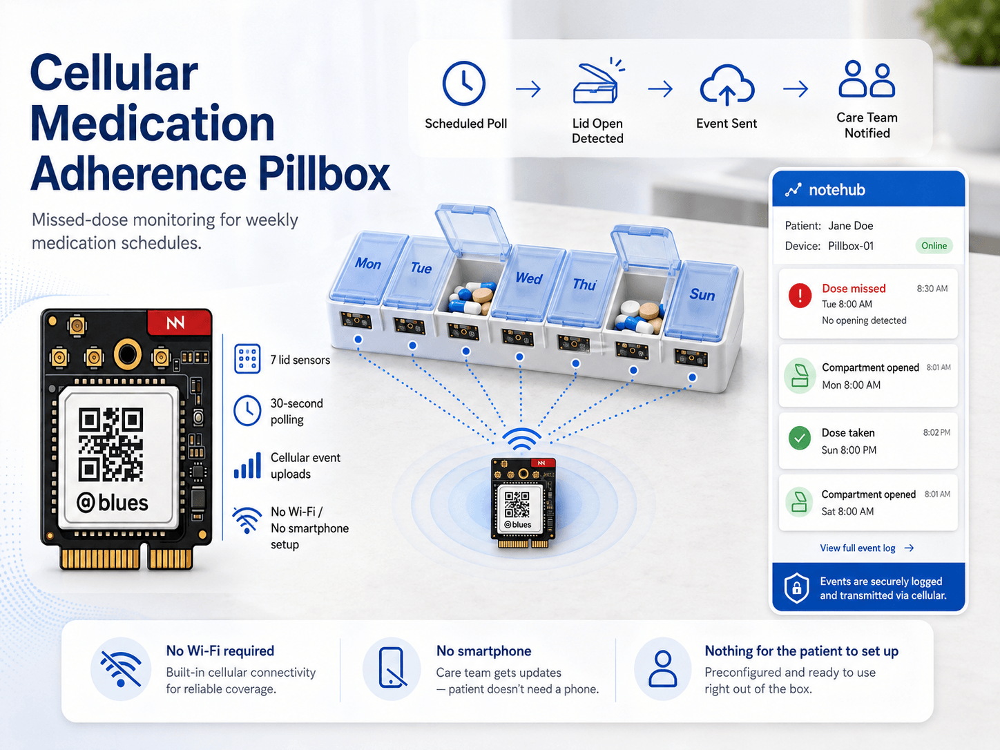
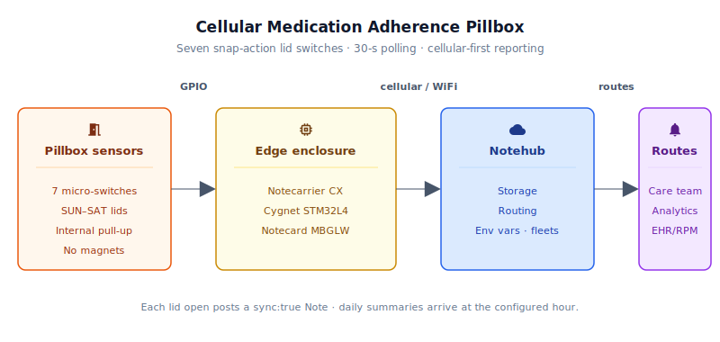
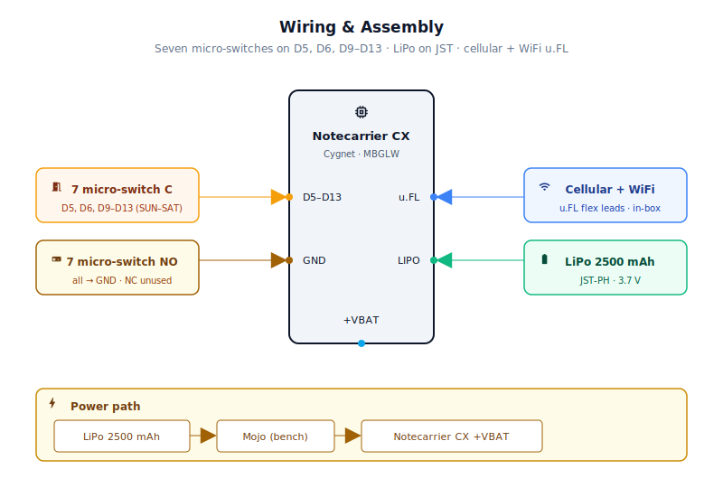
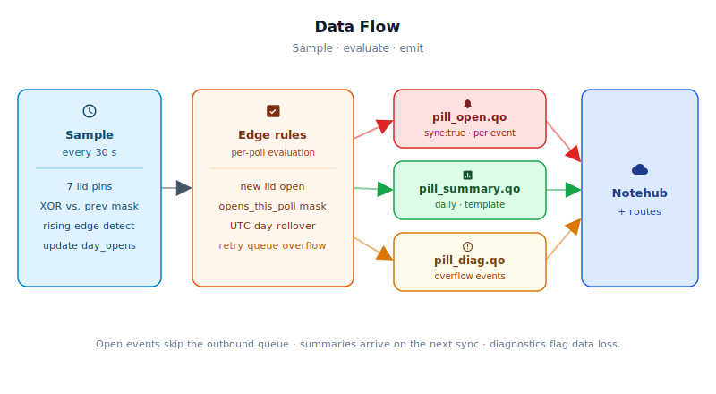

# Cellular Medication Adherence Pillbox



<Note>

This reference application is intended to provide inspiration and help you get started quickly. It uses specific hardware choices that may not match your own implementation. Focus on the sections most relevant to your use case. If you'd like to discuss your project and whether it's a good fit for Blues, [feel free to reach out](https://blues.com/landing-pages/accelerators-contact-us/?accelerator=Cellular%20Medication%20Adherence%20Pillbox).

</Note>

This project is a [remote patient monitoring](https://blues.com/remote-patient-monitoring/) device that catches missed doses before they become clinical events. A Blues Notecard Cell+WiFi riding on a Notecarrier CX wakes every 30 seconds, reads seven snap-action micro-switches inside a standard weekly pillbox, and uploads a cellular event to Notehub **each time a compartment lid is detected open during a scheduled 30-second poll** — no WiFi configuration, no smartphone, and nothing for the patient to set up.


## 1. Project Overview

**The problem.** Medication non-adherence is among the most consequential and under-reported drivers of poor outcomes in chronic disease. Patients with diabetes, heart failure, hypertension, or transplant histories who skip or mistime doses cost the healthcare system tens of billions of dollars annually in preventable hospitalizations, and far more in years of life. A clinician or care coordinator who knows a patient hasn't opened their Tuesday compartment by 10 PM can intervene with a phone call; one who only discovers the missed doses at the next clinic visit, six weeks later, is always playing catch-up.

Existing IoT pillboxes have tried to close this gap, and most fail in the same place: the connectivity model. WiFi-dependent devices work fine in young, tech-fluent households. They fail quietly in the homes of elderly patients — who are statistically the highest-risk population — because those homes have locked WiFi routers, forgotten passwords, carrier-grade NAT, and no one around to troubleshoot a dropped connection at 7 AM. Bluetooth-to-smartphone bridges work until the phone is low on battery, out of range, or the patient ignores the pairing prompt. The result is a connected pillbox that isn't connected.

**Why cellular-first.** The Notecard Cell+WiFi changes the deployment calculus. Cellular connectivity is already provisioned on the device — no router credentials, no smartphone, no IT ticket. The box works the moment it is placed on the patient's nightstand. WiFi remains available as an optional fallback at sites that can offer a nearby access point, but it is never a dependency. For the actual target demographic of chronic-disease patients — many of whom are elderly, live alone, or lack consistent technical support — this is the design decision that makes the device credible as a monitoring tool rather than a gadget. An **RPM** (remote patient monitoring) device that requires patient-side network administration isn't really a remote monitoring device; it's homework.

<NewToBlues/>

**Deployment scenario.** The device ships pre-provisioned: the Notecard's ProductUID is flashed at the pharmacy or care coordinator's office, and the patient only needs to plug in a USB charger (or replace the LiPo annually). The clinician views adherence events in Notehub and receives real-time alerts through a downstream route. No app installation, no WiFi onboarding, and no ongoing patient engagement with the device is required.

**An important signal limitation.** The device reports compartment lid opens, not confirmed ingestion, and weekly tray-loading sessions by a caregiver or pharmacist produce events that are operationally indistinguishable from patient dose-taking opens. A full refill of the seven-day tray can set all seven bits in `daily_opens` in a single polling interval. Downstream workflow must account for this; see [§10](#10-limitations-and-next-steps) for operational mitigations.


## 2. System Architecture



**Device-side responsibilities.** On the patient's nightstand the box looks asleep, and almost always is. Every 30 seconds the Cygnet STM32 host on the Notecarrier CX wakes for a fraction of a second, reads seven compartment GPIO pins, and compares them to the snapshot from the previous wake. A rising edge — a lid that was closed and is now open — turns into a `pill_open.qo` [Note](https://dev.blues.io/api-reference/glossary/#note) marked `sync:true`, telling the Notecard to push it out the door right now instead of holding it for the next scheduled outbound window. The previous pin values, the daily bitmask, and the current UTC day all survive each sleep cycle through `NotePayloadSaveAndSleep` / `NotePayloadRetrieveAfterSleep`, so no external EEPROM or flash chip is needed.

**Notecard responsibilities.** The Notecard Cell+WiFi (NOTE-MBGLW) handles everything network-related the patient should never have to think about. It queues Notes locally, manages its cellular (or opportunistic WiFi) session on the configured [`hub.set`](https://dev.blues.io/api-reference/notecard-api/hub-requests/#hub-set) `periodic` outbound cadence, and flushes any `sync:true` Note immediately the moment it sees one. On the inbound side it pulls [environment variables](https://dev.blues.io/guides-and-tutorials/notecard-guides/understanding-environment-variables/) down from Notehub, so a care coordinator can retune the poll interval, the daily summary hour, or either sync cadence without sending new firmware. Between sessions it idles at roughly 8–18 µA — effectively invisible on the LiPo budget.

**Notehub responsibilities.** Every event that leaves the box lands in [Notehub](https://notehub.io), which ingests, stores, and applies project routes. `pill_open.qo` events arrive in near-real time for the clinician's queue; `pill_summary.qo` Notes accumulate for adherence trends and reporting. [Fleets](https://dev.blues.io/guides-and-tutorials/fleet-admin-guide/) group devices by care coordinator, practice, or patient tier, so per-fleet environment variables apply across a whole cohort at once.

**Routing to the cloud (high level).** Notehub supports HTTP, MQTT, AWS, Azure, GCP, Snowflake, and several other destinations; route setup is project-specific. See the [Notehub routing docs](https://dev.blues.io/notehub/notehub-walkthrough/#routing-data-with-notehub) — this project ships no specific downstream endpoint.


## 3. Technical Summary

1. **Notehub** — create a [Notehub project](https://notehub.io), copy its ProductUID.
2. **Wire the bench rig** — Notecarrier CX + Notecard MBGLW + 7 snap-action micro-switches on D5, D6, D9–D13. Full pinout in [§5](#5-wiring-and-assembly).
3. **Edit one line** of [`firmware/cellular_medication_adherence_pillbox/cellular_medication_adherence_pillbox.ino`](firmware/cellular_medication_adherence_pillbox/cellular_medication_adherence_pillbox.ino) — search for `#define PRODUCT_UID` and set it to your project's value.
4. **Flash** — select the Cygnet board in the Arduino IDE, hit Upload. Full instructions in [§7.1](#71-installing-and-flashing).
5. **Watch** — open Notehub → your project → **Events** tab. You should see a `_session.qo` within a minute and a `pill_open.qo` each time you open a compartment.


Here is a sample Note this device emits:

```json
{
  "compartment": 4,
  "label": "WED",
  "day_opens_mask": 15,
  "opened_this_poll": 8
}
```

## 4. Hardware Requirements

**Compartment sensing — snap-action micro-switches.** This design uses subminiature snap-action micro-switches for compartment lid detection. Each switch mounts in the pillbox base with its roller lever positioned to engage the closed lid; when the lid opens the lever releases and the circuit opens. Micro-switches produce a clean mechanical signal that works directly with the Cygnet's internal pull-up resistor, require no magnets, bias supply, or per-compartment conditioning resistors, and tolerate the tens of thousands of actuation cycles typical of a multi-year patient deployment. The [Adafruit #819](https://www.adafruit.com/product/819) roller-lever micro-switch is a convenient off-the-shelf choice, with its SPDT body and pre-installed roller lever making lid-contact alignment straightforward on a variety of pill tray geometries.

| Part | Qty | Rationale |
|------|-----|-----------|
| [Notecarrier CX](https://shop.blues.com/products/notecarrier-cx?utm_source=dev-blues&utm_medium=web&utm_campaign=store-link) | 1 | Integrated carrier with an embedded Cygnet STM32L4 host — no separate MCU needed. Exposes 7 digital I/O pins (D5, D6, D9–D13) exactly matching the 7-day compartment count. |
| [Notecard Cell+WiFi (NOTE-MBGLW)](https://shop.blues.com/products/notecard-cell-wifi?utm_source=dev-blues&utm_medium=web&utm_campaign=store-link) | 1 | Cellular with WiFi fallback. See the [NOTE-MBGLW datasheet](https://dev.blues.io/datasheets/notecard-datasheet/note-mbglw/) for radio and power specifications. Cellular removes all patient-side network configuration; cellular-first is the deployment model that serves the target demographic. |
| [Blues Mojo](https://shop.blues.com/products/mojo?utm_source=dev-blues&utm_medium=web&utm_campaign=store-link) | 1 | Coulomb counter for bench-validation of sleep/wake power budget before patient deployment. Not required in production. See [§9](#9-validation-and-testing). |
| [Adafruit #819 Micro Switch w/Roller Lever](https://www.adafruit.com/product/819), ×7 | 7 | One switch per compartment lid. Mounts in the pillbox base with the roller lever engaging the closed lid. Wire C to the digital pin and NO to GND; leave NC unconnected. The Cygnet's internal pull-up holds the pin HIGH when the lid is open; the closed lid depresses the lever and pulls the pin LOW. |
| Cellular and WiFi u.FL antenna leads (included with NOTE-MBGLW) | 1 set | Both the cellular and WiFi u.FL flex-antenna leads ship inside the NOTE-MBGLW retail box — no separate antenna purchase is required for an indoor pillbox installation. Attach each lead to the matching u.FL connector on the Notecard face and route flat inside the enclosure away from the LiPo. See §4. |
| [Adafruit #328 Lithium Ion Polymer Battery](https://www.adafruit.com/product/328), 3.7 V 2500 mAh, JST-PH connector | 1 | Direct plug-in to the Notecarrier CX LIPO JST connector. At the expected power budget (~5–15 mAh/day), a 2500 mAh cell provides multi-month autonomy between charges. |
| [EZY DOSE Contoured Weekly Pill Planner](https://shop.apothecaryproducts.com/products/ezy-dose-contoured-weekly-pill-planner) (Apothecary Products, part #67790) | 1 | Patient-facing medication organizer — seven compartments with clear lids, one per day of the week. Available at pharmacies and medical supply retailers under the EZY DOSE brand. |
| [Hammond 1591SSBK ABS project enclosure](https://www.hammfg.com/part/1591SSBK), 110 × 82 × 44 mm | 1 | Electronics housing for the Notecarrier CX and LiPo. Mounts as a sidecar alongside or beneath the pill organizer; only the micro-switch wiring leads penetrate the pill tray body. |

All Blues hardware ships with an active SIM including 500 MB of data and 10 years of service — no monthly commitment.


## 5. Wiring and Assembly



The Notecard Cell+WiFi (NOTE-MBGLW) seats into the Notecarrier CX's M.2 connector and is powered from the same VBAT rail. All host I/O lands on the [Notecarrier CX dual 16-pin header](https://dev.blues.io/datasheets/notecarrier-datasheet/notecarrier-cx-v1-3/).

**Micro-switch wiring — all 7 compartments are wired identically:**

Each micro-switch is an SPDT device with three terminals: Common (C), Normally Open (NO), and Normally Closed (NC). Connect C to the assigned digital pin and NO to any GND pin on the header; leave NC unconnected. Mount the switch so the closed lid depresses the roller lever, connecting C to NO and pulling the pin LOW. When the lid opens, the lever releases, the C–NO circuit opens, and the Cygnet's internal pull-up holds the pin HIGH. No external resistors are needed.

| Compartment | Day Label | Notecarrier CX Pin |
|---|---|---|
| 1 | SUN | D5 |
| 2 | MON | D6 |
| 3 | TUE | D9 |
| 4 | WED | D10 |
| 5 | THU | D11 |
| 6 | FRI | D12 |
| 7 | SAT | D13 |

Pin-by-pin:

- **D5, D6, D9, D10, D11, D12, D13** (the seven available GPIOs) → micro-switch C (Common) terminal of each switch. Note that D7 and D8 are not present on the Notecarrier CX header; the usable GPIO range is D5, D6, then D9–D13.
- **GND** (any GND pin on the header) → micro-switch NO (Normally Open) terminal of each switch.
- **NC terminal** of each switch → leave unconnected.
- No external resistors required — all pull-ups are internal to the Cygnet STM32L4.

**Switch and actuator placement:**

Mount each switch flush in the pill tray base directly beneath the path of the lid, with the roller lever pointing upward toward the lid's travel path. Position the switch so the lid rim or a small actuator nub depresses the roller 0.5–1 mm when the lid is fully closed — enough to produce a clean snap-action transition but not so much that the lid cannot close completely. With the lid fully closed the pin should read ~0 V (LOW); with the lid open it should read ~3.3 V (HIGH from the internal pull-up). Verify with a multimeter or the serial monitor before final assembly.

**LiPo battery:**

Connect the LiPo's JST-PH plug directly into the Notecarrier CX's onboard LIPO connector. For bench bring-up with Mojo, splice the Mojo inline between the LiPo and the +VBAT header pin instead of using the LIPO JST connector — this lets Mojo measure the entire current draw of the Notecarrier, Notecard, and sensors together.

**Antennas:**

Attach the cellular and WiFi u.FL antenna leads — both ship in the NOTE-MBGLW retail box (see BOM) — to the corresponding u.FL connectors on the Notecard face. No separate antenna purchase is required. Position the leads flat inside the enclosure away from the LiPo cell.

**Physical assembly — enclosure and switch mounting:**

Mount the Hammond 1591SSBK enclosure as a sidecar alongside or beneath the pill organizer tray using two-sided foam tape or a 3D-printed bracket; the enclosure and tray travel together as a unit with only the micro-switch wiring leads crossing the enclosure wall.

Drill or punch seven 4–5 mm cable pass-through holes in the enclosure wall facing the pill tray — one per compartment lead pair. Thread each pair through its own hole with a rubber grommet, or apply a bead of hot-melt adhesive around the wire as a strain-relief bead before the lead enters the enclosure. Strain relief prevents the header-pin connection from pulling out if a lead is tugged from the pill-tray side.

Mount each micro-switch body inside the tray base using the switch's mounting holes with two M2 self-tapping screws, or secure it with an adhesive patch or a 3D-printed bracket. Position the switch so the roller lever aligns with the inner face of the lid rim — the lever should be depressed 0.5–1 mm when the lid is fully closed and return freely to its neutral position when the lid is open. Verify with a multimeter before final assembly: the pin should read LOW (≈0 V) with the lid closed and HIGH (≈3.3 V) with the lid open.

Retain the LiPo inside the enclosure with a strip of hook-and-loop tape (Velcro) or a foam-padded retaining clip so the JST connector is not under mechanical strain. Orient the battery's flat face against the enclosure base and route the lead so it cannot be pinched when the enclosure lid is closed.


## 6. Notehub Setup

1. **Create a project.** Sign up at [notehub.io](https://notehub.io) and create a project. Copy the [ProductUID](https://dev.blues.io/notehub/notehub-walkthrough/#finding-a-productuid) — it looks like `com.your-company.your-name:pillbox`.

2. **Set the ProductUID in firmware.** Open `cellular_medication_adherence_pillbox.ino` and replace the empty string on the `#define PRODUCT_UID ""` line with your value.

3. **Claim the Notecard.** Power the assembled unit. On first cellular connection the Notecard associates itself with your Notehub project automatically — no manual claim step required. The device will appear in your project's **Devices** tab within a minute or two.

4. **Create a Fleet per care group.** [Fleets](https://dev.blues.io/guides-and-tutorials/fleet-admin-guide/) and [Smart Fleets](https://dev.blues.io/notehub/notehub-walkthrough/#using-smart-fleet-rules) are how Notehub groups devices for shared configuration. A natural grouping is one fleet per care coordinator or prescribing physician, so that environment variables (alert windows, sync cadence) can be tuned once and applied to all their patients' devices simultaneously.

   <Warning>
   
   **Privacy Note.** For an RPM deployment, patient identifiers should never appear in Note body payloads — they travel in plaintext through any downstream route and may be stored in third-party systems. They also should not be placed in Notehub device metadata (tags, serial-number field): Note bodies and device metadata are not designed as stores for protected health information, and any PHI placed there would be outside a controlled covered system. Instead, assign only an opaque, non-PHI deployment identifier (for example, a random UUID or a clinic-assigned device code) to the [Notehub device tag](https://dev.blues.io/notehub/notehub-walkthrough/#organizing-devices-by-tag) or serial-number field, and maintain the patient-to-device mapping exclusively in your downstream covered system, keyed on the Notecard's device UID. If your organization's downstream architecture requires routing PHI through any cloud component, review Blues' contractual and compliance posture with qualified counsel before proceeding.

   </Warning>

5. **Set environment variables.** Navigate to **Fleet → Environment** in Notehub. All variables below are optional; firmware defaults apply if omitted. The device pulls updates on its next inbound sync (default every 2 hours) — no reflash required.

   | Variable | Default | Purpose |
   |---|---|---|
   | `poll_interval_sec` | `30` | Seconds between host wakes for compartment polling. Lower values reduce open-detection latency; minimum enforced at 15. |
   | `summary_hour_utc` | `0` | UTC hour (0–23) on the day following each UTC day's end at or after which the previous day's adherence summary is queued for transmission. `0` means the summary is queued as soon as midnight UTC passes; set to match the care coordinator's morning review time (e.g., `7` for 7 AM UTC). |
   | `outbound_min` | `720` | Minutes between Notecard outbound syncs. Immediate open events are never delayed by this value — they use `sync:true`. Changing this value triggers an automatic `hub.set` reapply. |
   | `inbound_min` | `120` | Minutes between Notecard inbound syncs (environment variable fetch cadence). Changing this value triggers an automatic `hub.set` reapply. |

6. **Configure routes.** Add one [route](https://dev.blues.io/notehub/notehub-walkthrough/#routing-data-with-notehub) for `pill_open.qo` (to a real-time alert endpoint, SMS, email, nurse-call system, or care-coordination platform) and a second for `pill_summary.qo` (to a long-term analytics store or dashboard). Separating the two Notefiles at the source means the real-time alert path has no dependency on the analytics path.

### What you should see in Notehub

Within a minute of first power-on, the **Events** tab should start populating. Three event types matter for this project:

- **`_session.qo`** — automatic Notecard housekeeping on each cellular session. The presence of these events is the fastest way to confirm the radio is reaching Notehub. If you see no `_session.qo` events in the first 2–3 minutes, check that `PRODUCT_UID` matches your Notehub project exactly and that cellular coverage is available.
- **`pill_open.qo`** — one Note per detected lid-open event. Detection latency is up to 30 seconds (next poll wake); Notecard cellular session establishment then adds roughly 15–60 seconds, for a typical end-to-end window of under two minutes from physical open to Notehub receipt. For this to be reliable, the lid must remain open (or be re-opened) until the next poll fires — a lid opened and re-closed within the same 30-second interval is not detected. Multiple opens of the same compartment lid in one day each produce a separate Note. The body looks like:
  ```json
  {
    "compartment": 4,
    "label": "WED",
    "day_opens_mask": 15,
    "opened_this_poll": 8
  }
  ```
  `day_opens_mask` is a 7-bit bitmask of every compartment opened so far today (including this one), so each event body is self-contained and the full picture can be reconstructed from a single Note. Bit positions map directly to compartment numbers (bit 0 = compartment 1 = SUN, bit 6 = compartment 7 = SAT). `opened_this_poll` is the bitmask of compartments detected open in this specific 30-second polling wake — when multiple bits are set, it indicates that several compartments were opened simultaneously (or at least within the same polling interval), which is a strong signal of a weekly tray-refill session rather than a routine single-dose open. Downstream route logic can threshold on the bit-count of `opened_this_poll` to distinguish refill clusters from individual dose events; see [§10](#10-limitations-and-next-steps) for the full discussion.

- **`pill_summary.qo`** — one Note per UTC day, queued at the `summary_hour_utc` threshold (default midnight UTC) on the day following each data-collection period and then delivered on the next Notecard sync session — either the scheduled outbound sync or any earlier sync triggered by a `pill_open.qo` event. The body looks like:
  ```json
  {
    "opens_mask": 31,
    "opens_count": 5
  }
  ```
  `opens_mask` uses the same bitmask convention as `pill_open.qo`. Bit 0 = Sunday (compartment 1), bit 6 = Saturday (compartment 7). `opens_count = 0` means no compartments were opened that day — the patient missed all doses — which the `full:true` flag on `note.add` ensures is preserved through the template's omitempty suppression.

- **`pill_diag.qo`** — an exceptional diagnostic Note emitted on **pending-event queue overflow**: `error: "pending_overflow"` and a `dropped` count when the 28-entry retry ring buffer fills and the oldest queued open event is evicted. A matching `error: "pending_overflow_cleared"` Note — with the total `dropped` count for the episode — is emitted when the queue subsequently drains. These Notes appear in both bench and production modes and indicate that adherence data was lost while the Notecard was unable to accept `note.add` requests. Route `pill_diag.qo` alongside `pill_open.qo` if data-integrity alerting is required.

  An ATTN→EN power-gating fault (host MCU never loses power after `NotePayloadSaveAndSleep`) is **not** reported through this Notefile because any `note.add` issued in that race window is dispatched while the Notecard is already entering sleep mode and is unreliable. Detect this fault instead via the absence of the expected `_session.qo` cadence in Notehub and the bench-mode USB serial output noted in [§7.1](#71-installing-and-flashing).


## 7. Firmware Design

The firmware is split across a main sketch and two helper files — all three live in [`firmware/cellular_medication_adherence_pillbox/`](firmware/cellular_medication_adherence_pillbox/):

- **[`cellular_medication_adherence_pillbox.ino`](firmware/cellular_medication_adherence_pillbox/cellular_medication_adherence_pillbox.ino)** — `setup()` entry point and main application logic.
- **`cellular_medication_adherence_pillbox_helpers.h`** — shared constants, struct definitions, and helper function declarations.
- **`cellular_medication_adherence_pillbox_helpers.cpp`** — helper function implementations (sensor reading, Notecard configuration, event emission, state management).

### 7.1 Installing and flashing

**Dependencies:**

- **Arduino core for STM32** — [`stm32duino/Arduino_Core_STM32`](https://github.com/stm32duino/Arduino_Core_STM32). Install via the Arduino Boards Manager by adding the index URL `https://github.com/stm32duino/BoardManagerFiles/raw/main/package_stmicroelectronics_index.json` under **File → Preferences → Additional Boards Manager URLs**, then search for "STM32 MCU based boards" and install. Select **Blues Cygnet** as the board target (canonical FQBN: `STMicroelectronics:stm32:Blues:pnum=CYGNET`).
- **`Blues Wireless Notecard`** library (`note-arduino`). Install via the Arduino Library Manager (search "Blues Wireless Notecard") or run `arduino-cli lib install "Blues Wireless Notecard"`. See [note-arduino releases](https://github.com/blues/note-arduino/releases) for changelog and any newer stable versions.

**Flashing — Arduino IDE:** open `cellular_medication_adherence_pillbox.ino`, select the Cygnet board, hit **Upload**. The Notecarrier CX exposes the ST-Link interface on the USB cable — no external programmer needed.

**Flashing — `arduino-cli`:** from the firmware directory,
```bash
# Confirm the FQBN for your installed core version (the Cygnet variant lives
# under the "Blues boards" group, not under "Generic STM32L4 series").
arduino-cli board details -b STMicroelectronics:stm32:Blues | grep -i cygnet

# Find the USB port the Notecarrier enumerates as (typically /dev/cu.usbmodem*
# on macOS, COMx on Windows, or /dev/ttyACM* on Linux). The ST-Link shows up as
# "STMicroelectronics STM32 STLink" in your system device list.
# On macOS: ls -la /dev/cu.* | grep usb
# On Linux: ls -la /dev/ttyACM*
# On Windows: check Device Manager > Ports.

# Then compile + upload (replace the FQBN and port below with your values).
arduino-cli compile -b STMicroelectronics:stm32:Blues:pnum=CYGNET cellular_medication_adherence_pillbox.ino
arduino-cli upload  -b STMicroelectronics:stm32:Blues:pnum=CYGNET -p /dev/cu.usbmodem14201 cellular_medication_adherence_pillbox.ino
```

After upload, open the serial monitor at **115200 baud**. On first boot you should see `[init] Notecard configured` and `[init] Templates defined`, then the device goes silent as it enters its first 30-second sleep cycle. Opening a compartment lid on the next wake prints `[open] compartment=N (DAY) day_mask=0bXXXXXXX`.

**Bench mode vs. production mode.** `NotePayloadSaveAndSleep()` always returns to the host once it has dispatched the `card.attn` sleep command — it is the Notecard's subsequent ATTN de-assertion that actually cuts host power on a correctly wired carrier. The helper header ships with `PILLBOX_BENCH_MODE` commented out (production default). When this define is uncommented in `cellular_medication_adherence_pillbox_helpers.h`, `sleepHost()` falls back to `delay()` + `NVIC_SystemReset()` — useful for bring-up on configurations where the Notecard ATTN pin is not wired to the host EN rail. **Before deploying to a battery-powered Notecarrier CX, confirm that `PILLBOX_BENCH_MODE` remains commented out.** In production mode, if the host is still alive after the sleep command was dispatched (an ATTN→EN wiring fault), the firmware logs over USB serial if available and halts, preventing silent battery drain. The fault surfaces in Notehub as a missing `_session.qo` cadence; it is not signalled by a `pill_diag.qo` Note because any `note.add` request issued in the post-sleep race window is dispatched while the Notecard is already entering sleep mode and would not be reliably delivered.

### 7.1a Bench mode critical Note

Before deploying to a battery-powered Notecarrier CX, **verify that `PILLBOX_BENCH_MODE` remains commented out** in `cellular_medication_adherence_pillbox_helpers.h`. In production mode, the Notecard ATTN pin gates the host's 3.3V rail, cutting power between polling wakes. If ATTN→EN is miswired or disconnected, the host stays alive and drains the LiPo continuously. The firmware will halt and log `[FATAL] NotePayloadSaveAndSleep returned and host did not lose power` over USB serial, preventing silent battery drain. You'll detect this in Notehub as a missing `_session.qo` cadence; never ignore consecutive gaps in session events — it signals a power-gating fault that must be corrected before patient deployment.

### 7.2 Modules

| Responsibility | Function |
|---|---|
| Notecard configuration (`hub.set`, accelerometer disable) | `initNotecard()` |
| Note template registration for `pill_summary.qo` | `defineTemplates()` |
| Environment variable fetch and clamp | `fetchEnvOverrides()` |
| Compartment GPIO pin sampling | `sampleCompartments()` |
| Immediate open-event emission | `emitOpenEvent()` |
| Daily adherence summary emission | `emitDailySummary()` |
| UTC time query for day-rollover detection | `utcDayAndHour()` |
| State persistence and host sleep | `sleepHost()` |

### 7.3 Sensor reading strategy

On each 30-second wake, `sampleCompartments()` reads all seven digital pins into a single byte bitmask. The firmware XORs this against the `prev_pin_mask` stored in `PillboxState` to compute a `newly_opened` byte — bits set in `newly_opened` represent pins that transitioned from LOW (closed) to HIGH (open) since the last wake. **Every detected rising edge generates a `pill_open.qo` event** — multiple opens of the same compartment lid in a day each produce a separate Note, allowing downstream systems to correlate opening patterns against the patient's dosing schedule. The `daily_opens` bitmask tracks which compartments were opened at all today and feeds the end-of-day summary; the `day_opens_mask` field in each `pill_open.qo` body is a running snapshot of that bitmask at the moment of the event, making each event payload self-contained. A second field, `opened_this_poll`, records which compartments were detected open in this specific wake — when multiple bits are set it is a direct downstream signal that multiple lids were opened simultaneously, consistent with a weekly tray-refill session rather than a single dose open.

**Important polling limitation.** Because the firmware compares pin state at discrete 30-second boundaries, a lid that is opened and fully re-closed within a single 30-second interval between wakes produces no rising edge and generates no event. That open is silently missed and is not counted in `daily_opens`. For the typical adherence use case this is not a concern — a patient opening a compartment to take a pill holds it open for several seconds to several minutes, well beyond the polling resolution. However, any brief mechanical disturbance that resolves before the next wake will go undetected. The minimum configurable poll interval is 15 seconds (`poll_interval_sec` environment variable, firmware-enforced floor). If guaranteed sub-second open detection is required, the design would need interrupt-driven GPIO or a latch-based circuit that captures and holds the open state until the next poll.

The maximum detection latency from "lid physically opened" to "event queued for transmission" is equal to the configured poll interval (default 30 seconds). Real-world latency from event queuing to Notehub receipt adds the Notecard's cellular session-establishment time (typically 15–60 seconds), giving an end-to-end window of typically under two minutes.

### 7.4 Event payload design

`pill_open.qo` is left **untemplated** (free-form JSON). Open events are low-frequency even in the every-open model (a typical patient opens each lid once or twice per day, for a total well under 20 Notes/day), making wire overhead negligible. The untemplated format keeps each event easy to inspect in Notehub without adding unnecessary template management overhead. The `opened_this_poll` field carries the bitmask of all compartments detected open in the same polling wake as this event; when multiple bits are set it provides a downstream signal distinguishing a weekly refill session (multiple lids opened simultaneously) from a routine single-compartment dose open.

`pill_summary.qo` is **templated** with `TUINT8` (1-byte unsigned integer) for both fields. The template registration tells the Notecard to store each daily summary as a 2-byte fixed-length record rather than a variable-length JSON string, keeping the on-device queue compact across a full month of data if cellular connectivity is temporarily unavailable.

```json
// pill_open.qo  — untemplated, sync:true, queued on detected open (30-second poll boundary)
{
  "compartment": 4,
  "label": "WED",
  "day_opens_mask": 15,
  "opened_this_poll": 8
}

// pill_summary.qo  — templated, queued at summary_hour_utc, delivered on next outbound sync
{
  "opens_mask": 63,
  "opens_count": 6
}
```

The `full:true` flag on the daily summary's `note.add` request preserves `opens_count: 0` even though the Note template would normally suppress zero-valued fields. Knowing that a patient opened zero compartments in a day is exactly the signal a care coordinator needs.

### 7.5 Low-power strategy

The Cygnet STM32L4 host MCU is powered off entirely between wakes, not merely sleeping in a low-power mode, but physically de-energized by the Notecard's ATTN pin gating the Notecarrier CX's 3.3V host rail. This means every 30-second cycle consists of ~100–200 milliseconds of active host execution followed by ~29.8 seconds of zero host draw.

After each sample cycle, `sleepHost()` serializes the `PillboxState` struct into the Notecard's flash memory via `NotePayloadAddSegment` and `NotePayloadSaveAndSleep`, then issues `card.attn` in sleep mode. The Notecard cuts host power for `poll_sec` seconds and then re-asserts ATTN, which re-powers the host rail. From the firmware author's perspective, the sleep call is a single function invocation; from the patient's perspective, the device is simply always on.

The Notecard itself remains powered continuously and idles at approximately 8–18 µA between cellular sessions. Cellular sessions — triggered by `sync:true` open events or the scheduled outbound timer for queued summary Notes — draw several hundred milliamps for the duration of the transmission (typically under 30 seconds) and then return to idle.

### 7.6 Retry and error handling

- The first `hub.set` call on cold boot uses `sendRequestWithRetry(req, 5)` to handle the known cold-boot I2C race condition where the host comes up before the Notecard is ready to receive transactions.
- `fetchEnvOverrides()` uses `requestAndResponse()` and guards against a NULL response — a failed env fetch leaves the current state values unchanged rather than crashing or zeroing thresholds.
- If `utcDayAndHour()` returns 0 (Notecard hasn't yet synced to get a valid time), the day-rollover branch is skipped entirely. Any opens that occurred before time-sync remain in `daily_opens` and are associated with the first valid UTC day once time becomes available; they are only moved into `prev_day_opens` at the first actual day rollover, at which point they feed the subsequent end-of-day summary.
- If `NotePayloadRetrieveAfterSleep()` fails or the segment is missing, the firmware treats the wake as a first boot: re-reads the initial pin state and reconfigures the Notecard. This handles the case where the LiPo died and the Notecard lost its stored payload.
- **`emitOpenEvent()` failure and retry queue.** When a `note.add` fails after all three attempts, `enqueuePendingEvent()` stores the event (compartment index, day mask, poll mask) in a 28-entry ring buffer persisted inside `PillboxState`. On each subsequent wake, `replayPendingOpenEvents()` retries every buffered event before sampling new opens; successfully replayed records are removed and the queue is compacted. If the queue fills before Notecard connectivity is restored, the oldest entry is evicted and a `pill_diag.qo` Note is immediately sent to Notehub with `error: "pending_overflow"` and a `dropped: 1` count — giving cloud-visible data-loss visibility even while the primary note-add path is degraded. When the queue fully drains, a second `pill_diag.qo` with `error: "pending_overflow_cleared"` and the cumulative drop count closes the episode and confirms how many `pill_open.qo` events are missing. The 28-slot capacity covers four consecutive worst-case 7-compartment wakes; a sustained Notecard failure beyond that window causes adherence event loss. See [§10](#10-limitations-and-next-steps).

### 7.7 Key code snippet 1 — template definition

`TUINT8` is defined in `note-c` as the integer constant `21`, which tells the Notecard to encode each templated field as a 1-byte unsigned integer (0–255). The template registers this encoding with the Notecard's on-device compression layer, so every `pill_summary.qo` Note is stored as a fixed 2-byte binary record rather than variable-length JSON. This compression keeps the on-device queue compact across a full month of data if cellular connectivity is temporarily unavailable. For downstream integrations, the Notecard automatically decompresses these records back to JSON when they reach Notehub.

```cpp
J *req  = notecard.newRequest("note.template");
JAddStringToObject(req, "file", "pill_summary.qo");
JAddNumberToObject(req, "port", 50);
J *body = JAddObjectToObject(req, "body");
JAddNumberToObject(body, "opens_mask",  TUINT8); // 7-bit bitmask, 0–127
JAddNumberToObject(body, "opens_count", TUINT8); // 0–7 count
notecard.sendRequest(req);
```

### 7.8 Key code snippet 2 — immediate open event

`sync:true` tells the Notecard not to wait for the next outbound window — this Note jumps the queue and the radio wakes immediately.

```cpp
J *req  = notecard.newRequest("note.add");
JAddStringToObject(req, "file", "pill_open.qo");
JAddBoolToObject  (req, "sync", true);               // immediate transmission
J *body = JAddObjectToObject(req, "body");
JAddNumberToObject(body, "compartment",      4);     // 1–7
JAddStringToObject(body, "label",            "WED");
JAddNumberToObject(body, "day_opens_mask",   15);    // running daily bitmask
JAddNumberToObject(body, "opened_this_poll", 8);     // per-poll multi-open bitmask
notecard.sendRequest(req);
```

### 7.9 Key code snippet 3 — sleep with state persistence

`NotePayloadSaveAndSleep` serializes the state struct into Notecard flash and issues `card.attn` to cut host power. The host re-enters `setup()` from cold after `poll_sec` seconds.

```cpp
NotePayloadDesc payload = {0, 0, 0};
NotePayloadAddSegment(&payload, STATE_SEG_ID, &state, sizeof(state));
NotePayloadSaveAndSleep(&payload, state.poll_sec, NULL);
```


## 8. Data Flow



**Collected.** Every 30 seconds: a 7-bit bitmask of compartment lid states, compared against the previous sample. The firmware does not transmit on every wake — only on a state transition.

**Transmitted.**
- `pill_open.qo` — one Note per detected lid-open event (lid must be open when the 30-second poll fires), immediate (`sync:true`). Contains the compartment number (1–7), its day label, the running daily bitmask of all compartments opened so far today (`day_opens_mask`), and a per-poll bitmask of all compartments detected open in this specific wake (`opened_this_poll`). Multiple bits set in `opened_this_poll` indicate a likely refill session. Multiple opens of the same compartment each generate a separate Note, provided each open is present at a poll boundary.
- `pill_summary.qo` — one Note per UTC day, template-encoded. Queued at the configured `summary_hour_utc` on the day following each data-collection period (default: midnight UTC) and then delivered on the next Notecard sync session — either the scheduled outbound sync or any earlier sync triggered by a `pill_open.qo` event. Contains `opens_mask` (which compartments opened) and `opens_count` (how many). Uses `full:true` to preserve a zero count when the patient opened no compartments.

**Routed.** Both Notefiles go to Notehub and from there to whatever downstream the project's routes specify. The two filenames are deliberately separate so `pill_open.qo` can fan out to a real-time alert channel (SMS, pager, care platform webhook) while `pill_summary.qo` goes to a long-term store at a different cadence.

**Alerts trigger on.**
- Any `pill_open.qo` event — a compartment was opened. Route this to whatever real-time channel the care coordinator uses. Note that weekly tray-refill sessions produce events identical to patient dose-taking opens; see [§10](#10-limitations-and-next-steps) for how to distinguish them operationally.
- Absence of expected `pill_open.qo` by a configurable time window — the patient hasn't opened their morning compartment. This logic lives in the downstream route or dashboard, not in firmware.
- `pill_summary.qo` with `opens_count: 0` — the patient missed all doses for the day.


## 9. Validation and Testing

**Expected cadence after deployment.** In steady state, a patient who takes medication once per day generates one `pill_open.qo` event per day and one `pill_summary.qo` per day. A correctly behaving device with no lids opened should still send a daily `pill_summary.qo` with `opens_count: 0`.

**Bench functional test.** The firmware fires an open event on a LOW→HIGH rising edge — when the pin transitions from LOW (actuator pressed, switch closed, lid closed) to HIGH (actuator released, switch open, lid open). **A common mistake is holding the switch actuator depressed and expecting an open event; that simulates a closed lid, not an open one.** The correct procedure:

1. **Establish a closed baseline.** Press the switch actuator (or install the switch so the lid depresses it) so the pin reads LOW. Let at least one 30-second poll fire while the actuator is held closed — this records the LOW state in `prev_pin_mask` for that compartment. A faster shortcut: power the device on with the actuator already pressed. The first-boot code snapshots the current pin state as the baseline, so the LOW is captured immediately without waiting for a second poll.
2. **Simulate a lid open.** Release the actuator (or open the lid) and leave it released until the next poll fires. The pin rises to HIGH, creating the LOW→HIGH transition the firmware detects as a lid-open event. The serial monitor should print `[open] compartment=N (DAY) day_mask=0bXXXXXXX`.
3. **Verify in Notehub.** Confirm the corresponding `pill_open.qo` event appears in the **Events** tab within roughly two minutes (up to 30-second poll latency + cellular session establishment).

If the actuator is pressed and released before the next poll fires, no event is generated — both transitions resolve within the same interval and the firmware observes no net change. This is expected behavior, not a fault.

**Quick continuity check (no Notehub required).** Use a multimeter on the pin header or watch serial output while manually pressing and releasing the switch actuator: pressing it should pull the pin to ~0 V; releasing it should let the pin float to ~3.3 V (internal pull-up active). If the result is reversed, check for these common causes: wrong header pin, NO and NC terminals swapped, missing ground connection, actuator not engaging the lid properly, or internal pull-up not active — verify against the wiring table in §4.

The daily summary is queued on the first wake after UTC midnight (or after the configured `summary_hour_utc` has passed on the new day) and arrives in Notehub on the next Notecard sync session — either the next scheduled outbound sync (default every 12 hours) or sooner if a `pill_open.qo` event triggers an immediate sync that day.

**Power validation with Mojo.** Splice the [Mojo](https://dev.blues.io/datasheets/mojo-datasheet/) inline between the LiPo and the Notecarrier CX +VBAT pin and run the device for 24 hours on the bench.

**Notecard-datasheet figures** (from the [NOTE-MBGLW datasheet](https://dev.blues.io/datasheets/notecard-datasheet/note-mbglw/) and the [low-power design guide](https://dev.blues.io/notecard/notecard-walkthrough/low-power-firmware-design/)):

| Phase | Published figure |
|---|---|
| Notecard idle (radio off, between sessions) | ~8–18 µA @ 5V |
| Cellular session (modem active) | ~250 mA average, brief peaks up to ~2 A |

**Modeled example budget** (estimated; validate with Mojo on your specific bench assembly before committing to a deployment charge schedule):

| Phase | Estimated draw |
|---|---|
| Host MCU active (~150 milliseconds per 30 seconds wake) | ~10 mA for ~150 milliseconds every 30 seconds (~50 µA average contribution) |
| Cellular session — open-event sync (`sync:true`, ~2–3 per day) | ~250 mA average, ~20–30 seconds per session |
| Cellular session — scheduled outbound sync (every 12 h) | ~250 mA average, ~15–20 seconds per session |

At 30-second polling with the default 12-hour outbound sync and roughly 2–3 open events per day triggering immediate syncs, the modeled daily energy total is on the order of **5–15 mAh/day** — treat this as an estimated starting point until confirmed with a bench trace.

**Quick runway estimate:** With a 2500 mAh LiPo and 5–15 mAh/day, expect 5–15 months of continuous operation between charges (165–500 days). In a real patient deployment with variable cellular signal and temperature swings, always validate with a 24-hour Mojo trace before setting a charge schedule. Poor cellular signal or frequent refill sessions will increase daily consumption.

A good Mojo trace on this device looks like: an essentially flat near-zero baseline punctuated by brief millisecond blips every 30 seconds (host wake), with occasional 15–30-second bursts at hundreds of milliamps (cellular session). If the baseline is continuously 10–80 mA, the host is not sleeping — check that the ATTN → EN path is intact on the Notecarrier CX and that `NotePayloadSaveAndSleep` is returning normally. If cellular bursts occur much more frequently than expected, verify `sync:true` is only set on open events and that the outbound cadence is not set to a very low value.

With a 2500 mAh LiPo and an estimated 5–15 mAh/day, modeled runtime is roughly 165–500 days between charges. Actual runtime will vary with cellular signal strength, session frequency, and temperature; confirm with bench data before committing to a deployment charge schedule.

Mojo is a **bench and commissioning tool** for this project — it is not deployed to the patient's home. Once a firmware revision passes the trace check, the deployed units run on LiPo without it.

### Troubleshooting

| Symptom | Likely cause | What to check |
|---|---|---|
| Device never appears in Notehub **Devices** tab. | `PRODUCT_UID` is empty or wrong, or the cellular antenna is disconnected. | Verify `PRODUCT_UID` matches the Notehub project exactly. Check that antennas are attached and not coiled tightly against the LiPo. Move the device near a window if testing indoors. |
| Device appears but no `pill_open.qo` events show up after opening a lid. | Micro-switch mounting or wiring issue; pin wired to wrong header position. | Open the serial monitor at 115200 baud and watch for `[open]` lines. If none appear, confirm pin continuity with a multimeter: pin should read ~3.3 V with the lid open and ~0 V with the lid closed. |
| `pill_open.qo` fires on startup without any lid being opened. | Likely a wiring fault floating the pin high, corrupted restored state where `prev_pin_mask` incorrectly records a compartment as closed, or a lid that physically moved between the first-boot pin snapshot and the following 30-second wake. | Check for loose wiring or wrong terminal (NC connected instead of NO) on the affected compartment pin. If the problem recurs after verifying wiring, force a first-boot reset by disconnecting the LiPo for ~30 seconds. On the next power-on the Notecard reports a cold boot, `NotePayloadRetrieveAfterSleep` returns false, and the firmware enters its `first_boot` path — re-snapshotting the current pin state rather than restoring any previous wake's state. |
| Daily summary (`pill_summary.qo`) never appears. | UTC time not yet available (`utcDayAndHour()` returning 0), or `summary_hour_utc` hasn't been reached yet on the new day. | Confirm the device has had at least one successful cellular session (`_session.qo` present in Notehub). The summary is queued on the first wake after UTC midnight at or after `summary_hour_utc`, then delivered on the next Notecard sync session — the scheduled outbound sync (default every 12 hours) or sooner if a `pill_open.qo` event triggers an earlier sync. |
| `opens_count` in the daily summary is missing (field absent from the Notehub event). | `full:true` was not applied. | Verify the firmware calls `note.add` with `JAddBoolToObject(req, "full", true)` before sending the summary. Without `full:true`, the template's omitempty behavior suppresses the zero value. |
| Environment variable changes don't take effect. | Inbound sync hasn't occurred yet (default every 2 hours). | Use Notehub's **Sync Now** (inbound) button on the device page to trigger an immediate inbound sync. Alternatively, lower `inbound_min` in the fleet environment to `15`; the device re-applies `hub.set` automatically once it picks up the change, tightening the fetch cadence for subsequent updates. |
| Mojo trace shows a continuous ~20 mA baseline instead of near-zero idle. | Host is not being put to sleep — ATTN is not gating the host power rail. | Confirm you're using a Notecarrier CX (which routes ATTN to EN). On a bare-board or different carrier, `NotePayloadSaveAndSleep` falls back to the software delay at the end of `sleepHost()`, which does not cut power. |
| Mojo trace shows host stuck at active draw with no sleep cycles AND no `_session.qo` events arrive in Notehub. | Production-mode ATTN→EN power-gating fault — `NotePayloadSaveAndSleep` returned and the host did not lose power. The firmware halts after logging over USB serial. | Connect a USB cable and watch for the `[FATAL] NotePayloadSaveAndSleep returned and host did not lose power` line on the bench DIP switch's `HST` position. Inspect ATTN and EN wiring on the Notecarrier CX, then manually power-cycle (disconnect and reconnect the LiPo) to restart. The fault is intentionally not reported via `pill_diag.qo` because that `note.add` would race the Notecard's sleep transition and is unreliable. |
| `pill_diag.qo` appears with `error: "pending_overflow"` or `"pending_overflow_cleared"`. | The 28-entry retry ring buffer filled while the Notecard was unable to accept `note.add` requests; the oldest buffered adherence events were evicted and lost. | Check for gaps in `_session.qo` events indicating a connectivity outage. The `dropped` field on the `pending_overflow` Note shows how many `pill_open.qo` events are missing. Once the Notecard recovers, the queue drains automatically and a `pending_overflow_cleared` Note confirms the episode is closed. Mark the affected interval in your downstream adherence record as incomplete. |

If a problem isn't on this list, the [Blues community forum](https://discuss.blues.com) is the fastest place to get a second pair of eyes on a Notecard and sensor setup.


## 10. Limitations and Next Steps

The design deliberately stops at "did a lid open?" — the most reliable signal that survives the realities of an elderly patient's home network, a caregiver's weekly refill routine, and a Bluetooth-fatigued smartphone. Confirmed ingestion, AM/PM trays, and local reminder UX are real product features, but they belong in a follow-on design rather than diluting the cellular-first sensor this POC is proving out.

### Simplified for the POC

The simplifications below are deliberate scope choices — each is a place where a production deployment will add a sensor, a downstream workflow, or a tighter data-handling control once a real RPM program starts running it. **This is a proof-of-concept reference design, not a medical device.**

**Cannot confirm a dose was actually taken.** The device reports each detected compartment lid open, but it cannot distinguish "opened and took the pill" from "opened and closed without taking it." Confirming a dose requires a weight sensor on the tray or patient self-report — both are straightforward extensions but add hardware or UX complexity outside the scope of this POC.

**Caregiver and pharmacist refill sessions are indistinguishable from patient dose-taking opens.** When the weekly tray is loaded — whether by the patient, a caregiver, or a pharmacist — opening each compartment lid to place pills generates `pill_open.qo` events and sets bitmask bits that are identical to genuine dose-taking opens. A single loading session can set all seven bits in `daily_opens` and produce up to seven events within one or two polling intervals, **creating a false picture of perfect adherence for that day.** This is a more active distortion than the dose-confirmation limitation above: it inflates the adherence record rather than leaving it ambiguous. Downstream systems and clinical workflows must account for this in at least one of the following ways:
  - **Fill outside the monitored window.** If the tray is loaded at a predictable time (e.g., Sunday evening before the monitoring week begins), configure downstream routes to flag or suppress clustered multi-lid opens during that window.
  - **Use a clinician-side refill flag.** The care coordinator logs refill sessions in the downstream covered system; the patient-record view excludes or tags those event clusters from adherence calculations.
  - **Filter simultaneous multi-lid opens downstream.** Multiple bits set in a single 30-second poll (`newly_opened` containing ≥ 3 compartments at once) is a strong operational signal of a refill rather than individual dose-taking. A downstream route rule or dashboard filter can flag clusters above a configurable threshold for manual review rather than counting them as adherence events.

**Brief opens between polls are missed.** The firmware detects lid-open events by comparing pin state at each poll boundary (default every 30 seconds). A lid that is opened and fully re-closed within a single poll interval generates no event and is not counted in the daily summary. For the intended use case — a patient opening a compartment to take a pill — the lid will naturally remain open long enough to be detected. Caregiver testing, brief accidental knocks, or other sub-30-second interactions will not be recorded. Reducing `poll_interval_sec` to the firmware-enforced minimum of 15 seconds halves the exposure window; interrupt-driven or latch-based hardware would eliminate it entirely.

**Pending retry queue has a finite depth.** If the Notecard is unable to accept `note.add` requests across more than four consecutive worst-case polling wakes (28 buffered events), the oldest queued dose-open records are evicted and **permanently lost.** The device emits a `pill_diag.qo` Note with `error: "pending_overflow"` and a `dropped` count when overflow first occurs, and a matching `error: "pending_overflow_cleared"` Note when the queue drains — providing cloud-visible evidence of data loss. A Notecard outage long enough to exhaust the buffer is uncommon on a battery-backed Notecard Cell+WiFi, but in the worst case downstream adherence calculations will undercount dose-opens for the affected interval without an explicit correction signal. Route `pill_diag.qo` to your alert channel alongside `pill_open.qo` so these episodes are not missed.

**7-compartment design only.** The Notecarrier CX exposes exactly seven digital I/O pins (D5, D6, D9–D13), which maps cleanly to a standard 7-day tray. A 14-compartment tray (AM/PM per day) would require an I2C GPIO expander such as the MCP23017, adding one part and a library dependency.

**No on-device time zone awareness.** The daily summary rolls over at UTC midnight. In practice, a care coordinator should set `summary_hour_utc` to match the patient's local midnight (e.g., `5` for Eastern Standard Time), which is tunable via environment variable without a reflash.

**Micro-switch placement is manual.** Mounting the micro-switches inside a commercial pillbox requires drilling, adhesive, or 3D-printed brackets. A production design would integrate the switches into a purpose-built tray PCB.

**No tamper or battery-low reporting.** The device does not currently alert if someone removes the Notecard, cuts power, or if the LiPo voltage drops below a safe threshold. Battery voltage monitoring via `card.voltage` and a `sync:true` low-battery event would be a straightforward addition.

**No local visual or audible reminder.** The device is purely a reporting platform; it does not buzz or light up to remind the patient to take their medication. Adding a piezo buzzer on a PWM-capable pin would require a scheduled inbound event from Notehub to trigger it.

**Pre-time-sync opens carry no calendar date.** On first boot, the device may accumulate opens before the Notecard acquires valid UTC time. Those opens remain in `daily_opens` and are associated with the first valid UTC day once time becomes available, then move into `prev_day_opens` at the next actual day rollover to feed the subsequent summary, with the correct bitmask. However, the summary's timestamp reflects when it was sent, not the (unknown) calendar day when the lids were opened. If accurate calendar-day attribution of pre-sync opens is required, wait for a `_session.qo` event in Notehub (confirming time-sync) before placing the device with the patient.

**Firmware state holds only one pending day's summary data.** The `PillboxState` struct contains a single `prev_day_opens` slot. If two consecutive UTC-day boundaries pass while a pending summary has not yet been emitted, for example, because the device is powered off spanning an entire day, or because total power loss causes `NotePayloadRetrieveAfterSleep` to fail on the next boot — the slot is overwritten and the earlier day's adherence data is unrecoverable. Note that a lack of cellular connectivity alone does *not* cause this: the Notecard stores queued Notes locally in its on-device flash and delivers them automatically once connectivity is restored. The risk is power loss before `emitDailySummary()` executes. Size the LiPo for the intended deployment duration to minimize exposure.

**Patient identity must stay out of Note payloads and Notehub metadata.** Note bodies are stored and routed as plaintext through Notehub and any downstream systems. Notehub device metadata (tags, serial-number field) is not designed as a covered system for protected health information. For an RPM deployment, **never embed a patient name, MRN, date of birth, or any other PHI in a Note body or in Notehub device metadata.** Assign only an opaque, non-PHI deployment identifier (for example, a random UUID or clinic-assigned device code) to the Notehub device tag or serial-number field. Maintain the mapping from device UID to patient record exclusively in your downstream covered system. If your deployment architecture requires routing PHI through any cloud component, engage qualified counsel to review the complete data path before go-live.

### Production Next Steps

Once a real RPM program is running the basic monitor, the following extensions are the natural progression toward a fieldable product.

**14-slot tray support** via an MCP23017 I2C GPIO expander (adds AM/PM per day); the firmware's bitmask and event structure extend naturally to 16 bits.

**Opaque deployment-ID assignment** (a random UUID or clinic-assigned device code) in the Notehub device tag or serial-number field so downstream routes can correlate events to the correct caregiver via a patient-record lookup in the downstream covered system, keyed on device UID.

**Voltage-variable sync behavior** via `hub.set` `voutbound` — automatically extend the outbound cadence as the LiPo voltage drops, maximizing runtime without manual intervention.

**[Notecard Outboard DFU](https://dev.blues.io/notehub/host-firmware-updates/notecard-outboard-firmware-update/)** for over-the-air host firmware updates so new features (buzzer support, new alert rules) can be pushed to deployed devices without a pharmacy recall.

**A scheduled inbound Notefile** (`pill_reminder.qi`) that the Notecard can trigger a local buzzer or LED on, turning the device from a passive sensor into an active reminder system.


## 11. Summary

The care coordinator now has the one signal that matters: a `pill_open.qo` event when a lid opens, and a clean `opens_count: 0` at the end of any day the patient missed entirely. The box arrives on the patient's nightstand pre-provisioned, asks nothing of them, and reports over cellular whether the household's WiFi exists, works, or has been forgotten years ago. For the elderly chronic-disease patients who need this monitoring most, that's the difference between a connected device and a device that stays connected.

