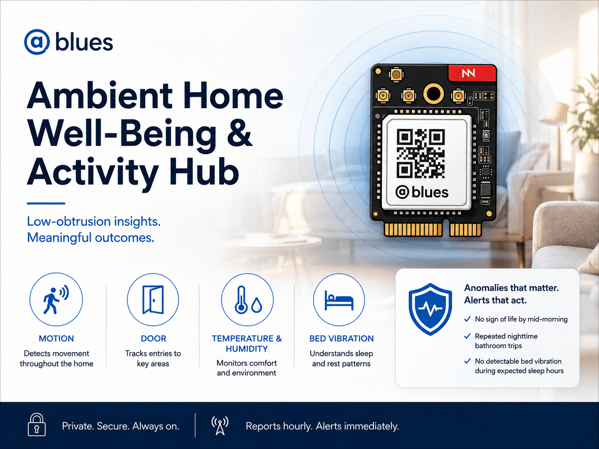
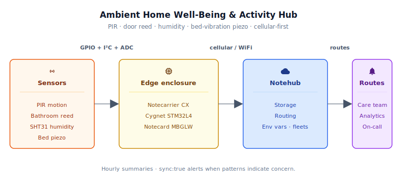
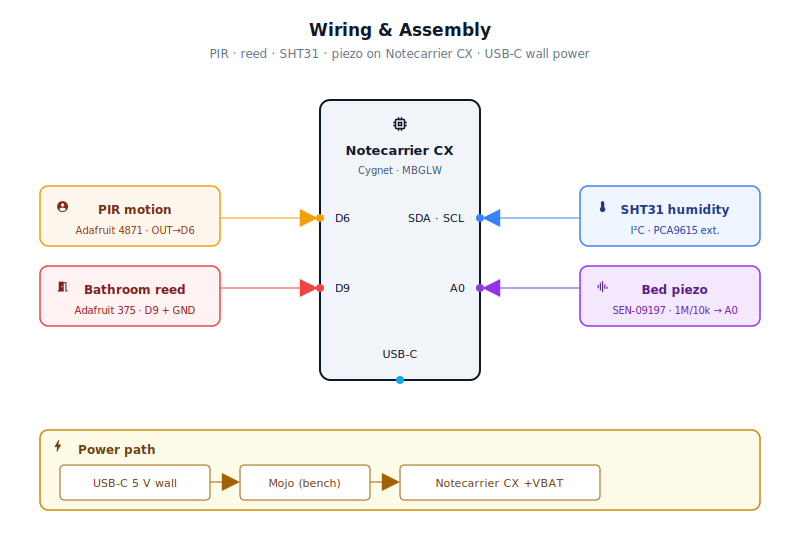
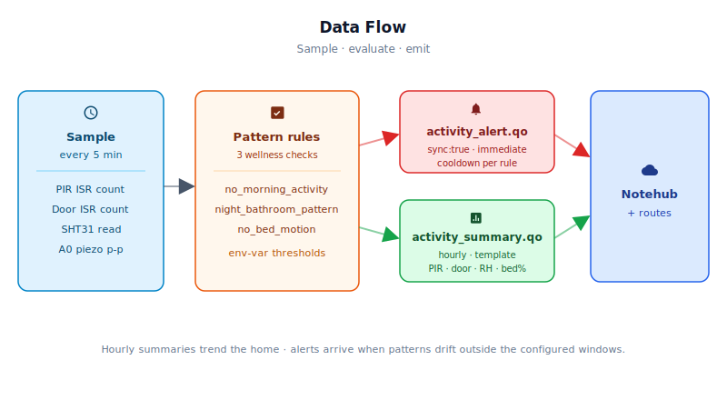

# Ambient Home Well-Being & Activity Hub



<Note>

This reference application is intended to provide inspiration and help you get started quickly. It uses specific hardware choices that may not match your own implementation. Focus on the sections most relevant to your use case. If you'd like to discuss your project and whether it's a good fit for Blues, [feel free to reach out](https://blues.com/landing-pages/accelerators-contact-us/?accelerator=Ambient%20Home%20Well-Being%20%26%20Activity%20Hub).

</Note>

This project is a [remote patient monitoring](https://blues.com/remote-patient-monitoring/) hub that gives clinicians and family caregivers a low-obtrusion signal that life is unfolding normally — without asking an elderly patient to wear anything or interact with any device. Four inexpensive sensors feed a [Blues Notecard Cell+WiFi](https://shop.blues.com/products/notecard-cell-wifi?utm_source=dev-blues&utm_medium=web&utm_campaign=store-link), which reports hourly activity summaries and immediately flags the anomalies that matter: no sign of life by mid-morning, a pattern of repeated nighttime bathroom trips, or no detectable bed vibration during expected sleep hours.

## 1. Project Overview

**The problem.** For patients who are aging in place or who have recently been discharged from a hospital or rehabilitation facility, the most useful early-warning signal for a clinician or family caregiver isn't a continuous stream of vitals — it's a confirmation that normal daily patterns are still intact. Did the patient get up this morning? Did they sleep through the night without repeated bathroom trips that might indicate a urinary tract infection or medication side effect? Is there any detected bed vibration during expected sleep hours, or has the sensor been quiet long enough that a check-in is warranted?

These are hard questions to answer without either placing a camera in someone's home (unacceptable to most patients) or asking the patient to wear a device and remember to charge it (unreliable in practice). The answer is environmental inference: a handful of passive sensors that observe the home rather than the person, aggregated by a small hub that does the pattern-matching locally and only reports when something looks off.

This project builds that hub. A PIR motion sensor in the main living area detects morning movement. A magnetic reed switch on the bathroom door detects nighttime trips. A humidity sensor in the bathroom records bathroom temperature and humidity as telemetry; raw readings appear in each hourly summary. Shower and bath inference from humidity spikes is a planned next-step enhancement (see [§11](#11-limitations-and-next-steps)). And a small piezo vibration sensor tucked under the mattress pad provides a coarse, single-point vibration signal that serves as a proxy for bed presence — detecting the micro-movements that suggest a person is in bed, but cannot confirm an immobile occupant, and is explicitly not full-coverage bed-occupancy detection (see [§11 Limitations](#11-limitations-and-next-steps)).

**Why Notecard.** The project description puts it plainly: many elderly patients don't have configured WiFi, others have a router that gets unplugged during cleaning, and others live somewhere — an assisted living facility (ALF) room, an adult child's spare bedroom — where the network changes regularly. A device that depends on WiFi to phone home simply stops working through any of those transitions, and the gap in data is invisible to the care team until someone thinks to check. Cellular-first means the hub keeps reporting through all of it, with no site IT involvement and no router to pair to.

<NewToBlues/>

The Blues Notecard Cell+WiFi (NOTE-MBGLW) adds a second layer of resilience: for sites that can provide 2.4 GHz WiFi credentials, the hub can use WiFi as an optional fallback when cellular coverage at that address is marginal. WiFi is not automatic — it requires configured credentials or an open network at the deployment site, but for installations where WiFi is available and stable it reduces session latency and modem energy. For the care team, the connectivity model is transparent — data arrives on a schedule, and if it doesn't, that absence itself is signal worth acting on.

**Deployment scenario.** This build is sized for a **studio room or compact ALF suite with an adjacent bathroom**, for example, a single-room assisted living unit where the bathroom door is within 4 m of the bed. The hub enclosure (roughly the size of a thick paperback) sits on the nightstand at the head of the bed, plugged into a wall outlet. From that single location, all four sensors are within practical cable range:

- **PIR sensor** — mounts on or immediately above the hub enclosure, facing the open room through a ventilation cutout. Cable length: under 0.3 m (sensor is attached directly to the enclosure).
- **Bed piezo sensor** — slipped under the mattress pad at torso height. Cable routed along the mattress edge and down the nightstand leg. Cable length: ≤ 1.5 m.
- **Bathroom reed switch** — installed on the bathroom door frame. Cable routed along the baseboard from door frame to nightstand. Cable length: ≤ 4 m.
- **SHT31 humidity sensor** — mounted on or near the bathroom door frame alongside the reed switch, or just inside the bathroom threshold. Shares the same cable run as the reed switch. For any bathroom-to-hub run longer than ≈ 1.5 m, use the NXP PCA9615 differential I²C bus extender included in the BOM (see §4 and §4); raw I²C over hookup wire is reliable only for short runs.

Nothing the patient interacts with. Nothing that needs charging.

## 2. System Architecture



**Device-side responsibilities.** The Cygnet STM32L4 host on the Notecarrier CX is essentially asleep on the patient's nightstand — running continuously in STM32 Stop mode between 5-minute sensor cycles, but drawing only microamps the whole time. The motion and bathroom-door events that happen during those quiet stretches aren't missed: EXTI interrupt service routines wake the MCU just long enough to bump a volatile counter in SRAM, then it drops back into Stop. Every five minutes the host wakes properly, atomically copies and clears those ISR counters, reads all four sensors, updates in-RAM accumulators, evaluates three anomaly rules against the current time-of-day, and returns to Stop mode. Application state is a static SRAM global — retained across Stop mode wakes, reset on power-on. The Notecard owns all I²C and cellular work, so the host never has a modem to manage.

**Notecard responsibilities.** The Notecard turns "hourly observations and the occasional alert" into reliable cloud delivery. It queues [Notes](https://dev.blues.io/api-reference/glossary/#note) in on-device flash, opens a cellular (or WiFi) session on the configured [`hub.set`](https://dev.blues.io/api-reference/notecard-api/hub-requests/#hub-set) `outbound` cadence (default 60 minutes), and flushes any `sync:true` alert Note immediately when one shows up. Coming the other way, it distributes [environment variables](https://dev.blues.io/guides-and-tutorials/notecard-guides/understanding-environment-variables/) pushed from Notehub — letting the care team retune the morning-activity window, the nighttime bathroom limit, or any other threshold without a firmware update or a truck roll to the patient's home.

**Notehub responsibilities.** Everything the hub emits lands in [Notehub](https://notehub.io), which ingests, stores, and routes each event. The two Notefiles carry deliberately different urgencies: `activity_summary.qo` is the low-pressure hourly record that belongs in a long-term analytics store, while `activity_alert.qo` is the page-someone-now signal that belongs in the care coordination platform or on-call queue. Splitting them at the source keeps the route configuration trivial.

**Routing to the cloud.** Notehub supports HTTP/HTTPS webhooks, MQTT, AWS, Azure, GCP, and several other destinations. The specific downstream endpoint is project-specific. See the [Notehub routing docs](https://dev.blues.io/notehub/notehub-walkthrough/#routing-data-with-notehub) — this project ships no specific cloud endpoint. Consider using [Smart Fleets](https://dev.blues.io/notehub/notehub-walkthrough/#using-smart-fleet-rules) to group devices by care team or geographic region and apply routing rules at the fleet level.

## 3. Technical Summary

1. **Assemble hardware** (§3–4): Notecarrier CX + Notecard Cell+WiFi, four sensors, hookup wire. Route cables as shown in the wiring diagram.
2. **Create Notehub project**: sign up at [notehub.io](https://notehub.io), create a new project, copy the **ProductUID** (looks like `com.your-company.your-name:activity-hub`).
3. **Set ProductUID in firmware**: open `firmware/activity_hub/app_state.h`, replace the empty `PRODUCT_UID` string with your value.
4. **Flash the hub**: plug Notecarrier CX into USB-C. In Arduino IDE, select **Tools → Board → Blues Cygnet**, open `firmware/activity_hub/activity_hub.ino`, hit **Upload**. (Or use `arduino-cli`: `arduino-cli compile -b STMicroelectronics:stm32:Blues:pnum=CYGNET firmware/activity_hub/ && arduino-cli upload -b STMicroelectronics:stm32:Blues:pnum=CYGNET -p /dev/cu.usbmodem* firmware/activity_hub/`.)
5. **Plug into wall power** (5 V USB-C adapter, ≥ 1 A).
6. **Verify in Notehub**: within 1–2 minutes your device will appear under **Devices**. The **Events** tab will show `_session.qo` Notes (radio is reaching Notehub). Within one hour you'll see your first `activity_summary.qo` Note.
7. **Configure alerts** (§5): add two routes — one for `activity_alert.qo` (real-time notifications) and one for `activity_summary.qo` (hourly analytics).

See §6 for detailed firmware structure and §8 for power validation with the Mojo coulomb counter.

Here is a sample Note this device emits:

```json
{
  "file": "activity_summary.qo",
  "body": {
    "pir_count": 14,
    "door_count": 2,
    "humidity_pct": 48.6,
    "temp_c": 21.2,
    "bed_motion_pct": 88,
    "night_bath_count": 1,
    "morning_activity": true
  }
}
```

## 4. Hardware Requirements

| Part | Qty | Rationale |
|------|-----|-----------|
| [Notecarrier CX](https://shop.blues.com/products/notecarrier-cx?utm_source=dev-blues&utm_medium=web&utm_campaign=store-link) ([datasheet](https://dev.blues.io/datasheets/notecarrier-datasheet/notecarrier-cx-v1-3/)) | 1 | Compact carrier with an embedded Cygnet STM32L4 host MCU — no separate Feather board required for this sensor mix. Onboard I²C pull-ups, analog reference, and dual 16-pin headers with GPIO, I²C, analog, and UART breakout are all included. |
| [Notecard Cell+WiFi (NOTE-MBGLW)](https://shop.blues.com/products/notecard-cell-wifi?utm_source=dev-blues&utm_medium=web&utm_campaign=store-link) ([datasheet](https://dev.blues.io/datasheets/notecard-datasheet/note-mbglw/)) | 1 | LTE Cat-1 bis cellular with 2.4 GHz WiFi fallback; 500 MB of prepaid global data. Cellular-first design means the hub works even when the patient's WiFi is absent or changes. No SIM activation or monthly fee. Cellular and WiFi u.FL antennas are included in the box — route them outside any metal enclosure for best performance. |
| [Blues Mojo](https://shop.blues.com/products/mojo?utm_source=dev-blues&utm_medium=web&utm_campaign=store-link) ([datasheet](https://dev.blues.io/datasheets/mojo-datasheet/)) | 1 | **Bench-only.** Coulomb counter placed inline on the +VBAT rail during validation to measure idle current (should be < 25 µA) and cellular session energy. Removed before permanent deployment. See §8 for usage. |
| [Adafruit Mini PIR Motion Sensor with 3-Pin Header (ID 4871)](https://www.adafruit.com/product/4871) ([tech docs](https://learn.adafruit.com/pir-passive-infrared-proximity-motion-sensor/)) | 1 | Breadboard-friendly PIR based on the AM312 sensor: 3–12 V supply, 3.3 V digital output — directly compatible with the Cygnet's 3.3 V GPIO logic. Up to 5 m detection range, 100° field of view, ~2 s output hold-off. Detects any occupant movement in the living area. |
| [Adafruit Magnetic Contact Switch — Door Sensor (ID 375)](https://www.adafruit.com/product/375) | 1 | Normally-open reed switch in a plastic enclosure; closes within ~13 mm of its magnet. Full electrical specifications are on the product page. Installs on any door frame without modification. Mounts on the bathroom door for nighttime trip counting. |
| [Adafruit Sensirion SHT31-D Temp & Humidity Breakout (ID 2857)](https://www.adafruit.com/product/2857) ([Sensirion SHT31 datasheet](https://sensirion.com/products/catalog/SHT31-DIS-B/)) | 1 | ±2% RH, ±0.3°C accuracy over I²C; 3 V or 5 V compatible. In this POC the firmware reports the most recent reading as telemetry in each hourly summary and maintains a slow EWMA baseline; shower/bath inference from humidity spikes is a planned enhancement (see [§11](#11-limitations-and-next-steps)). Mounts at the bathroom door frame alongside the reed switch. |
| [SparkFun Piezo Vibration Sensor — Large with Mass (SEN-09197)](https://www.sparkfun.com/products/9197) ([datasheet on product page](https://www.sparkfun.com/products/9197)) | 1 | **Vibration-based bed-presence proxy.** A small PVDF piezo film element that generates an AC signal when flexed. Tucked under the mattress pad, it detects the micro-vibrations associated with a person in bed. This provides a coarse single-point vibration signal — **not** full-coverage bed-occupancy detection; an immobile occupant can read as "no vibration" (see [§11](#11-limitations-and-next-steps)). Requires a voltage divider and clamp diode — see §5. |
| 1 MΩ resistor, 1/4 W | 1 | Series element of the piezo voltage divider; attenuates the piezo's ±90 V maximum output to ADC-safe levels. |
| 10 kΩ resistor, 1/4 W | 1 | Shunt leg of the piezo voltage divider (to GND). |
| 1N4148 small-signal diode | 1 | Clamps negative voltage swings on the piezo divider output to −0.6 V, protecting the Cygnet's analog input from the piezo's negative half-cycles. |
| 22–26 AWG stranded hookup wire | 1 lot | Three cable runs: **4 m × 6-conductor** (SDAP, SDAN, SCLP, SCLN, 3V3, GND) between the hub-side PCA9615 board and the sensor-side PCA9615 board near the bathroom door frame — the differential I²C link for the SHT31 bathroom run (see §5 for pin-by-pin details); **4 m × 2-conductor** for the reed switch bathroom run (D9, GND) — both runs clipped along the same baseboard path to the door frame; **1.5 m × 2-conductor** for the bed piezo run (A0, GND) along the nightstand leg and under the mattress. If the bathroom sensor is co-located with the hub (≤ 0.5 m) and the PCA9615 is omitted, substitute a short **4-conductor** cable (3V3, GND, SDA, SCL) directly from the Notecarrier CX header to the SHT31. Total ≈ 9.5 m across three runs (with extender). Each bathroom cable has its own GND conductor so either can be replaced without disturbing the other. |
| I²C bus extender (e.g. [Adafruit breakout ID 4756](https://www.adafruit.com/product/4756)) | 2 | **Required when the bathroom SHT31 is more than ≈ 1.5 m from the hub.** Converts the single-ended I²C bus to differential signalling, eliminating the cable-capacitance problem that makes long raw I²C runs unreliable. Two boards are needed for a complete link — one at the hub end and one at the sensor end. Omit only if the bathroom sensor is effectively co-located with the hub (≤ 0.5 m). See §4 for wiring details. |
| USB-C 5V wall adapter, ≥ 1 A (e.g. [Adafruit ID 4298](https://www.adafruit.com/product/4298)) | 1 | Wall power for the hub. The Notecarrier CX accepts 5 V via its USB-C port. See §4 and §7.5 for an important note on idle-current figures when VUSB is present. |
| [Hammond 1591XXFLBK project enclosure](https://www.hammfg.com/product/1591XX) (~5.9 × 3.1 × 2.2 in, ABS, black) | 1 | Houses the Notecarrier CX, Notecard, and any in-enclosure sensors. **Use a non-metallic enclosure** — a metal box will attenuate the cellular antenna significantly. Drill a ventilation aperture for the PIR field of view and cable entry holes for the off-board sensor leads. |

All Blues Notecards include an active global SIM with 500 MB of data and 10 years of service — no activation fees, no monthly commitment.

## 5. Wiring and Assembly



All host I/O lands on the Notecarrier CX dual 16-pin header. The Notecard Cell+WiFi (MBGLW) seats into the carrier's M.2 slot; connect the included cellular and WiFi u.FL antennas and route them so they are not folded against the PCB or enclosed in metal — a cellular antenna inside a closed metal box will have poor performance.

**Production power:** plug the USB-C 5 V wall adapter into the Notecarrier CX's USB-C port.

> **Idle-current Note.** When powered via USB-C the Notecard's VUSB sense line is asserted, which prevents it from reaching its absolute lowest idle current state. The idle current figures in §7.5 and §8 are the VBAT-only figures from the Blues [low-power design guide](https://dev.blues.io/notecard/notecard-walkthrough/low-power-firmware-design/); a USB-C-powered deployment should budget 1–3 mA for Notecard idle between sessions rather than the sub-25 µA figure. For installations where minimizing idle current is critical (battery backup, solar), power the Notecarrier CX from the +VBAT pad instead and leave USB-C for flashing only — the §8 bench procedure using Mojo on +VBAT will then reflect actual deployment current.

**Bench power (Mojo validation only, VBAT path):** feed an external 5 V supply into Mojo `BAT +`, connect Mojo `LOAD +` to the Notecarrier CX `+VBAT` pad (bypassing USB-C entirely), and connect common GND. This puts the Mojo in-line on the supply rail so it can report accurate mAh data at the low-power VBAT idle levels. Remove the Mojo before permanent deployment and revert to USB-C power.

**PIR motion sensor (Adafruit 4871) → D6:**
- Sensor `GND` → Notecarrier CX `GND`
- Sensor `VCC` → Notecarrier CX `+3V3`
- Sensor `OUT` → Notecarrier CX `D6`
- Mount the sensor on or directly above the hub enclosure, facing the open living area through a ventilation aperture. Keep the lead ≤ 0.3 m. No external pull resistor is needed; the PIR's output driver handles it. The signal goes HIGH on motion and returns LOW after the 2-second hold-off time.

**Magnetic contact switch (Adafruit 375) → D9:**
- One lead → Notecarrier CX `D9` (configured as `INPUT_PULLUP`)
- Other lead → Notecarrier CX `GND`
- **Cable routing:** route a 2-conductor 22–26 AWG hookup wire from D9 and GND at the hub, along the baseboard, to the bathroom door frame (≤ 4 m). Secure the cable with adhesive cable clips every 30–40 cm and pass it through a small grommet or strain-relief bushing where it exits the enclosure.
- Mount the switch body on the door frame and the magnet on the door edge, within 13 mm of each other. This is a normally-open (NO) reed switch: when the door is **shut** and the magnet is within ~13 mm of the switch body, the contacts close, pulling D9 LOW. When the door **opens** the contacts open and the internal pull-up pulls D9 HIGH. The firmware detects the LOW→HIGH transition as a door-open event.

**SHT31-D humidity/temperature sensor (Adafruit 2857) → I²C:**

**Cable routing:** route a 4-conductor 22–26 AWG hookup wire from the I²C and power pins at the hub, along the same baseboard run as the reed switch cable, to the bathroom door frame. **I²C cable length:** the I²C specification caps total bus capacitance at 400 pF; typical stranded hookup wire adds roughly 60–100 pF/m. A run beyond ≈ 1.5 m begins to consume a significant fraction of that budget before sensor and controller pin capacitance are counted, and a 4 m run is at or beyond the outer practical limit of 100 kHz raw I²C. **For any bathroom sensor run longer than ≈ 1.5 m, use the NXP PCA9615 differential I²C bus extender from the BOM** — one board at the hub end and one at the sensor end. The PCA9615 converts single-ended I²C to differential signalling and completely eliminates the capacitance constraint, supporting runs well beyond 4 m reliably. If the bathroom sensor is co-located with the hub (≤ 0.5 m), the extender can be omitted. During bring-up, watch the serial log for SHT31 read failures or NaN humidity values — either indicates marginal signal integrity. The two cables (reed switch + SHT31) can share a single cable clip run along the baseboard.
- Mount the SHT31 on or near the bathroom door frame, or just inside the bathroom threshold, oriented with the PTFE-filtered sensing port facing the air flow. Avoid placing it directly above a mirror or shower head where condensation can form on the PCB. Default I²C address is `0x44` (ADDR pin low); the firmware uses this default.

**PCA9615 differential I²C bus extender (mandatory when the bathroom SHT31 run exceeds ~1.5 m):**

Install two PCA9615 boards — **Board A** at the hub enclosure, **Board B** at the bathroom sensor end. Each board converts between single-ended I²C and the differential signalling that makes long cable runs reliable. No firmware change is required to use the extender; from the Notecarrier CX's perspective the SHT31 appears on the same I²C address as in a direct-wired installation.

*Hub side — Board A:*
- Board A `VIN` → Notecarrier CX `+3V3`
- Board A `GND` → Notecarrier CX `GND`
- Board A `SDA` → Notecarrier CX `SDA`
- Board A `SCL` → Notecarrier CX `SCL`

*Differential link — Board A to Board B (4 m, 6-conductor cable):*
- Board A `SDAP` → Board B `SDAP`
- Board A `SDAN` → Board B `SDAN`
- Board A `SCLP` → Board B `SCLP`
- Board A `SCLN` → Board B `SCLN`
- 3V3 conductor (tapped from Board A `VIN` terminal) → Board B `VIN` (powers the remote board from the hub side, no separate power supply needed at the bathroom end)
- GND conductor → Board B `GND`

*Sensor side — Board B to SHT31:*
- Board B `SDA` → SHT31 `SDA`
- Board B `SCL` → SHT31 `SCL`
- Board B `VIN` rail → SHT31 `VIN` (share the 3V3 delivered by the cable)
- Board B `GND` → SHT31 `GND`

**When the extender is mandatory vs optional.** The extender is mandatory for all typical installations where the bathroom-to-hub cable run exceeds ~1.5 m — this covers virtually every studio room or ALF suite scenario described in §1. Omit it only when the SHT31 is co-located with the hub (≤ 0.5 m), in which case wire SHT31 SDA/SCL/VIN/GND directly to the Notecarrier CX header as described above.

**Bring-up check.** After assembly, watch the serial monitor (`#define DEBUG_SERIAL`) for `SHT31 init failed` messages. A failure seen only after switching from direct-wired to extender mode almost always means one of: SDAP/SDAN swapped, SCLP/SCLN swapped, Board B has no power, or a poor solder joint on the differential header pins. Confirm that Board B `VIN` reads 3.3 V and that the JST cable orientation matches the silkscreen labels on both boards (the Adafruit 4756 uses a 6-pin JST-SH cable that can be inserted reversed).

**Piezo vibration sensor (SparkFun SEN-09197) → A0 via voltage divider:**

The piezo film can produce up to ±90 V under large mechanical deflection. Even gentle use requires a voltage divider and negative-swing clamp to protect the Cygnet's 3.3 V ADC:

```
Piezo (+) ─── 1 MΩ ───┬─── A0
                       │
                  ┌────┴────┐
                 10 kΩ   (K)─1N4148─(A)
                  │              │
                 GND            GND

Piezo (−) ─────────────────── GND
```

- Piezo `+` lead → one end of the 1 MΩ resistor
- Other end of 1 MΩ → junction node
- 10 kΩ from junction node to `GND`
- Junction node → Notecarrier CX `A0`
- 1N4148 anode to `GND`, cathode to junction node (clamps negative swings)
- Piezo `−` lead → Notecarrier CX `GND`

The divider ratio is 10k / (1M + 10k) ≈ 1/101, so the worst-case 90 V input becomes ≈ 0.89 V at A0 — well inside the 0–3.3 V ADC range. The normal bed-vibration signal will be a few tens of millivolts; the firmware measures peak-to-peak amplitude over a 500 milliseconds window and compares it against a configurable threshold.

**Bed sensor placement and cable routing:** wrap the piezo element in a thin cloth or small foam pouch, then place it under the mattress pad at approximately torso height. The element should have slight preload (the weight of the mattress pad above it) to improve sensitivity to small vibrations. Route a 2-conductor 22–26 AWG wire from A0 and GND at the hub along the nightstand leg, under the bed frame, and under the mattress to the element (≤ 1.5 m). Keep the leads away from bed springs to avoid false positives from metal contact.

**Mojo (bench validation only, do not use with USB-C power during measurement):**
- External 5 V supply `+` → Mojo `BAT +`
- External 5 V supply `−` → common GND
- Mojo `LOAD +` → Notecarrier CX `+VBAT`
- Mojo GND → common GND
- Connect the Mojo's USB-C port to a PC and monitor readings there — current (mA), voltage (V), and cumulative charge (mAh) are reported directly to the host PC; see the [Mojo quickstart](https://dev.blues.io/quickstart/mojo-quickstart/) for setup details. The firmware does not interact with Mojo at all, and no Mojo data flows through the Notecard to Notehub.
- Remove Mojo and reconnect USB-C for permanent deployment.

## 6. Notehub Setup

### Project creation

1. Sign up at [notehub.io](https://notehub.io) and create a new project. Copy the [ProductUID](https://dev.blues.io/notehub/notehub-walkthrough/#finding-a-productuid) — it looks like `com.your-company.your-name:activity-hub`.
2. All source files for this project live together in the sketch folder `firmware/activity_hub/`: the main entry point `activity_hub.ino` plus the helper files `app_state.h`, `notecard_helpers.h/.cpp`, and `sensor_alert.h/.cpp`. Open [`firmware/activity_hub/app_state.h`](firmware/activity_hub/app_state.h) — the shared configuration header included by every translation unit in the sketch, and replace the empty `PRODUCT_UID` string on the `#define` line near the top with your project's value. (In the single-file reference builds the ProductUID lives at the top of the `.ino`; because this project uses helper source files, the shared configuration header is the correct location.)

### Device provisioning

Power the assembled hub. On first cellular connection, the Notecard self-associates with your Notehub project — no manual claim step required. The device will appear in your project's **Devices** tab within a minute or two. If it doesn't appear within five minutes, check that the cellular antenna is external to any metal enclosure and that you have coverage at the test location.

### Fleets

Create one [Fleet](https://dev.blues.io/guides-and-tutorials/fleet-admin-guide/) per patient cohort or care team, for example, one fleet per ALF wing or one fleet per home-health agency. [Environment variables](https://dev.blues.io/guides-and-tutorials/notecard-guides/understanding-environment-variables/) set at the fleet level apply to every hub in that group, so a care manager can adjust the morning-activity window for an entire wing without touching individual devices. Per-device overrides are also supported and take precedence over fleet defaults.

For advanced deployments, consider [Smart Fleets](https://dev.blues.io/notehub/notehub-walkthrough/#using-smart-fleet-rules) — rule-based fleet assignment that can automatically place devices into the right fleet based on device tags or Note content.

### Environment variables

In Notehub: **Fleet → Environment** (or **Device → Environment** for a per-device override). The device pulls these on its next inbound sync — no reflash, no site visit. All are optional; firmware defaults are shown.

| Variable | Default | Purpose |
|---|---|---|
| `sample_interval_sec` | `300` | Seconds between sensor reads (5 minutes default). Decrease for higher temporal resolution during commissioning; increase to conserve power on battery deployments. |
| `summary_interval_min` | `60` | Minutes between hourly summary Notes. Changing this also re-applies `hub.set` so the Notecard's outbound cadence stays in sync. |
| `morning_start_hour` | `6` | Local hour (0–23) when the "morning activity" window opens each day. |
| `morning_end_hour` | `9` | Local hour at which the firmware checks whether any activity was seen. If none: alert fires. |
| `sleep_start_hour` | `22` | Local hour when the sleep window begins (door trips counted as nighttime bathroom visits). |
| `sleep_end_hour` | `6` | Local hour when the sleep window ends (same as morning start in the default config). |
| `night_bathroom_limit` | `3` | Number of nighttime door trips above which `night_bathroom_pattern` fires. UTI, overactive bladder, and some cardiac medications can push this count; set per patient after a baseline period. |
| `bed_threshold` | `50` | ADC peak-to-peak count (0–4095) above which bed vibration is detected. Tune based on mattress type and piezo placement — start at 50 and adjust down if the sensor reads "no vibration" when a person is in bed, up if it detects vibration when the bed is empty. |
| `utc_offset_hours` | `0` | Hours ahead of UTC for the patient's local time. For example, US Eastern Standard Time is `-5`; US Pacific Daylight Time is `-7`. The firmware uses this to convert the Notecard's UTC epoch into local hour-of-day for window checks. **Whole-hour offsets only** — half-hour and 45-minute offset regions (India UTC+5:30, Iran UTC+3:30, Nepal UTC+5:45, etc.) are not supported; use the nearest whole-hour value as an approximation, or see §10 for a firmware extension path. |
| `quiet_minutes_for_alert` | `20` | Minimum consecutive minutes of no detected bed vibration (inside the sleep window) before `no_bed_motion_during_sleep` fires. The firmware converts this to a sample count using `sample_interval_sec`, so the threshold scales correctly when the sample interval is changed. Increase for patients who are very still sleepers; decrease for more sensitive early detection. |

### Routing configuration

Add at minimum two [routes](https://dev.blues.io/notehub/notehub-walkthrough/#routing-data-with-notehub). The specific destination is project-specific; see the [Notehub routing documentation](https://dev.blues.io/notehub/notehub-walkthrough/#routing-data-with-notehub) for supported destination types.

- **`activity_alert.qo`** → a real-time delivery endpoint for time-sensitive notifications. These Notes are low-volume and carry urgency; route them to whatever care-coordination or on-call platform the care team already uses.
- **`activity_summary.qo`** → a long-term analytics store for trend analysis. These arrive hourly and are the longitudinal record that enables pattern analysis over weeks and months.

### What you should see in Notehub

Within a minute of first power-on, the **Events** tab in your project should start populating. Three event kinds matter for this project:

- **`_session.qo`** — automatic Notecard housekeeping events on each cellular session. If you see these, the radio is reaching Notehub. If the device never appears in the **Devices** tab, the most common causes are: `PRODUCT_UID` is empty or wrong, the cellular antenna is folded inside a metal enclosure, or there is no cellular coverage at the test site.
- **`activity_summary.qo`** — one per `summary_interval_min` (default: 60 minutes). A correctly-deployed hub generates one per hour in steady state. Example:

  ```json
  {
    "pir_count": 14,
    "door_count": 2,
    "humidity_pct": 48.6,
    "temp_c": 21.2,
    "bed_motion_pct": 88,
    "night_bath_count": 1,
    "morning_activity": true
  }
  ```

  See [§7.4](#74-event-payload-design) for the full field descriptions. Any field reading `-9999` (humidity or temperature) means no valid SHT31 sample has been recorded — treat it as a sensor fault, not a near-zero measurement.
- **`activity_alert.qo`** — only emitted when an anomaly rule trips; transmitted immediately via `sync:true`. A healthy patient in a quiet home will generate zero of these per day. Example:

  ```json
  {
    "alert": "night_bathroom_pattern",
    "detail": "night_trips=4 limit=3"
  }
  ```

  To test alert delivery during bench bring-up: (1) set `night_bathroom_limit` to `1`; (2) set `sleep_start_hour=0` and `sleep_end_hour=23` so the entire clock-day counts as the sleep window — door trips increment `night_bathroom_count` only when the current local time is inside the configured sleep window, so the alert will not fire if the current hour falls outside it; (3) force an environment sync by power-cycling the hub or issuing `{"req":"hub.sync"}` from the Notecard's USB serial console. Once the new values are active, open the bathroom door — the rule fires on the next `runCycle()` call. Worst-case alert latency from door-open to Notehub delivery is one full sample interval (up to 5 minutes at the default cadence) plus 15–60 seconds for cellular session establishment; allow up to 6 minutes before concluding the alert did not fire.

## 7. Firmware Design

Sketch folder: [`firmware/activity_hub/`](firmware/activity_hub/). The main entry point is [`activity_hub.ino`](firmware/activity_hub/activity_hub.ino); four helper files sit alongside it in the same folder: `app_state.h` (shared types, compile-time constants, and user configuration), `notecard_helpers.h/.cpp` (Notecard API wrappers, environment variable parsing, and time helpers), and `sensor_alert.h/.cpp` (sensor reads and outbound Note helpers). Arduino compiles all `.ino`, `.h`, and `.cpp` files in the sketch folder as a single build unit. Unlike the single-file reference builds (51, 52), the helpers here are split into separate translation units to keep each concern clearly bounded; the on-disk layout follows the same `firmware/<sketch_name>/` convention used by those references.

### 7.1 Installing and flashing

**Dependencies:**

- **Arduino core for STM32** — [`stm32duino/Arduino_Core_STM32`](https://github.com/stm32duino/Arduino_Core_STM32). Install via the Arduino Boards Manager (search "STM32 MCU based boards") or add the index URL `https://github.com/stm32duino/BoardManagerFiles/raw/main/package_stmicroelectronics_index.json` under **File → Preferences → Additional Boards Manager URLs**. Select **Blues Cygnet** as the target board (canonical FQBN: `STMicroelectronics:stm32:Blues:pnum=CYGNET`).
- **`Blues Wireless Notecard`** library (`note-arduino`) — install via the Arduino Library Manager (search "Blues Wireless Notecard") or `arduino-cli lib install "Blues Wireless Notecard"`. Check [note-arduino releases](https://github.com/blues/note-arduino/releases) for updates before deploying.
- **`Adafruit SHT31 Library`** — install via the Arduino Library Manager (search "Adafruit SHT31"). Requires `Adafruit BusIO` as a dependency (Library Manager installs it automatically).
- **`STM32duino Low Power`** library — install via the Arduino Library Manager (search "STM32duino Low Power") or `arduino-cli lib install "STM32duino Low Power"`. Required for Stop mode sleep (`LowPower.deepSleep()`) and GPIO wakeup configuration (`LowPower.attachInterruptWakeup()`). This library is maintained by STMicroelectronics as part of the stm32duino ecosystem and is separate from any generic Arduino LowPower library.

**Flashing — Arduino IDE:** open `activity_hub.ino`, select the Cygnet board, hit **Upload**. The Notecarrier CX exposes ST-Link over USB-C, so no external programmer is needed.

**Flashing — `arduino-cli`:**
```bash
# Find the correct FQBN for your installed core version
arduino-cli board listall | grep -i cygnet

# Compile and upload (replace FQBN with what listall reported)
arduino-cli compile -b STMicroelectronics:stm32:Blues:pnum=CYGNET firmware/activity_hub/
arduino-cli upload  -b STMicroelectronics:stm32:Blues:pnum=CYGNET \
                    -p /dev/cu.usbmodem* firmware/activity_hub/
```

To watch Notecard JSON traffic during bring-up, first uncomment the `// #define DEBUG_SERIAL` line near the top of `app_state.h`, then open the serial monitor at **115200 baud**. Re-comment `DEBUG_SERIAL` before deploying — debug output adds latency to every wake cycle and the Notecard debug stream generates verbose JSON; it is a bring-up aid, not a production setting.

### 7.2 Modules and responsibilities

| Responsibility | Where in sketch |
|---|---|
| Notecard configuration (`hub.set`) | `hubConfigure()` — called once on first boot |
| Accelerometer disable (`card.motion.mode stop:true`) | `motionStop()` — called once per wake until the Notecard confirms success |
| Template registration for `activity_summary.qo` | `defineTemplates()` — called once on first boot |
| Environment variable fetch and clamp | `fetchEnvOverrides()` — called every wake |
| Current UTC time from Notecard | `notecardTime()` |
| Time-of-day arithmetic (local hour, window checks) | `localHour()`, `inWindow()` |
| Alert rate-limiting | `cooldownExpired()` |
| SHT31 temperature/humidity read | `readHumidity()` |
| Piezo bed-vibration measurement | `readBedMotion()` |
| Application state across Stop mode wakes | Static `AppState` global in SRAM — retained while the MCU is powered; reset on power-on |
| Hourly summary emission | `sendSummary()` |
| Immediate alert emission | `sendAlert()` |

### 7.3 Sensor reading strategy

- **PIR.** A volatile `g_pir_count` counter is incremented by `pirISR()`, an EXTI interrupt registered on `PIN_PIR` for `RISING` edges. At the start of each 5-minute cycle, the counter is copied and cleared atomically inside a `noInterrupts()`/`interrupts()` critical section, and its value is added to `pir_count`. If the counter is zero but `PIN_PIR` is currently `HIGH`, the PIR went active between `setup()` and the first `deepSleep()` call before any RISING edge existed to capture; the firmware records it as one event. Using a counter rather than a boolean latch means every rising edge is tallied separately — multiple motion events within a single 5-minute interval each contribute to `pir_count` and can set `morning_activity` when inside the morning window.

- **Door contact.** A volatile `g_door_count` counter is incremented by `doorISR()`, an EXTI interrupt registered on `PIN_DOOR` for `RISING` edges (LOW-to-HIGH = door opens); a 50 milliseconds software debounce in the ISR prevents reed-switch contact bounce from inflating the count. At the start of each cycle the counter is copied and cleared atomically, and every recorded opening is added to `door_count` and, when inside the sleep window, `night_bathroom_count`. If the counter is zero but a level transition is detected (door is open and was last sampled as closed), one event is recorded to catch a transition that occurred after `deepSleep()` returned. Using a counter rather than a boolean latch means multiple bathroom trips within a single sleep interval are each counted — a patient who opens the bathroom door twice during one 5-minute interval contributes 2 to `night_bathroom_count`, not 1.

- **Humidity (SHT31).** The Adafruit SHT31 library's `readTemperature()` and `readHumidity()` calls over I²C. Returns `NaN` on communication failure; the firmware checks with `isnan()` before updating state. A slow exponential weighted moving average (EWMA, α = 0.02) maintains a rolling ambient baseline in `AppState` — this baseline is used locally to track seasonal drift and is a foundation for a future humidity-spike detector, but it is **not transmitted** in `activity_summary.qo`. Only the most recent humidity reading (`humidity_pct`) and temperature (`temp_c`) are included in the hourly summary. Adding a humidity-spike counter as an independent bathroom-visit signal is a planned enhancement (see [Limitations](#11-limitations-and-next-steps)).

- **Bed vibration (piezo).** `analogRead` on A0 is called 100 times at 5 milliseconds intervals (500 milliseconds total), accumulating the minimum and maximum ADC counts. If `(max - min) >= g_bed_threshold`, the sample is recorded as "vibration detected." At a normal respiratory rate of 12–20 breaths/min each breath cycle takes 3–5 seconds; the 500 milliseconds window is shorter than a single breath cycle, but it is sufficient to detect the continuous micro-vibration that distinguishes a moving person in the bed from an unoccupied or fully-immobile mattress. This is a coarse single-point vibration signal — a proxy for bed presence, not full-coverage occupancy detection or a physiological measurement.

### 7.4 Event payload design

`activity_summary.qo` uses a [Note template](https://dev.blues.io/notecard/notecard-walkthrough/low-bandwidth-design#working-with-note-templates) registered at boot, giving each Note a fixed binary encoding on the wire — roughly 3–5× smaller than free-form JSON for this field set. An hourly summary looks like:

```json
{
  "file": "activity_summary.qo",
  "body": {
    "pir_count":        14,
    "door_count":        2,
    "humidity_pct":   48.6,
    "temp_c":         21.2,
    "bed_motion_pct":   88,
    "night_bath_count":  1,
    "morning_activity": true
  }
}
```

`bed_motion_pct` is the percentage of 5-minute samples within the hour that detected bed vibration (0–100); it is a vibration-based proxy for bed presence, not a confirmed occupancy count. `morning_activity` is `true` if any PIR or door-open event was detected during the configured morning window (`morning_start_hour` to `morning_end_hour`) on the current day; it resets to `false` at the next daily rollover at `morning_start_hour`. A summary emitted near `morning_end_hour` with `morning_activity: false` means no qualifying activity has been seen in the morning window yet that day — which is the primary alerting signal. Summaries later in the day will report `false` for any hour in which no morning-window activity occurred, and `true` once the morning window produced at least one event. A `bed_motion_pct` of 0 across the overnight hours, combined with `morning_activity: false` in the morning, is the cluster pattern most worth routing to a clinician.

`activity_alert.qo` is intentionally *not* templated. Alert Notes are low-volume and each rule type benefits from carrying different supporting fields, so the slightly larger free-form JSON is worth the flexibility. A sample alert:

```json
{
  "file": "activity_alert.qo",
  "sync": true,
  "body": {
    "alert":  "night_bathroom_pattern",
    "detail": "night_trips=4 limit=3"
  }
}
```

### 7.5 Low-power strategy

Between samples the host enters STM32 Stop mode via `LowPower.deepSleep(remaining_ms)`. In Stop mode the main oscillator stops, most peripherals are clocked off, and current draw drops to roughly 2–5 µA for the MCU core, but SRAM is fully retained and EXTI wakeup sources remain active. The STM32LowPower library compensates `millis()` for time elapsed during sleep, keeping the inter-sample interval accurate. On each Stop mode wake (either from the RTC alarm when the interval expires, or from a PIR/door EXTI interrupt), execution resumes in `loop()` from the statement after `LowPower.deepSleep()`. State does not need to be serialised and restored — the static `AppState` global is already in place in SRAM.

The Notecard idles at ~18 µA @ 5 V between cellular sessions **when powered via the +VBAT pad with VUSB absent**. When powered via USB-C (VUSB present), the Notecard cannot reach this state and will draw more idle current, typically 1–3 mA. See §4 and §8 for guidance on matching the power path to your deployment priorities.

Sampling and transmission are deliberately decoupled: the device wakes every 5 minutes but cellular sessions happen only hourly. Alerts are the only Notes with `sync:true`, which instructs the Notecard to open a session immediately regardless of the outbound schedule. This keeps the common case (quiet, healthy patient) at one session per hour, while still delivering an anomaly notification within a few minutes of the rule tripping.

The Notecard runs in `hub.set` `periodic` mode with `outbound:60` and `inbound:120` (minutes). Increasing the `summary_interval_min` environment variable to 240 or 480 would reduce cellular sessions to 6 or 3 per day without changing the 5-minute sensor sampling cadence — an appropriate setting for a deployment where data latency of a few hours is acceptable in exchange for longer battery life.

### 7.6 Retry and error handling

- The first Notecard transaction in `hubConfigure()` uses `sendRequestWithRetry(req, 10)` (10-second retry window) to cover the cold-boot I²C race described in the `note-arduino` documentation.
- `env.get`, `card.time`, `note.add`, and `note.template` all use `requestAndResponse()` with NULL-return and `responseError()` checks. `sendSummary()` and `sendAlert()` return `false` if the Notecard rejects the Note or if the I²C call returns NULL, allowing callers to leave window counters and alert latches intact and retry on the next cycle rather than silently discarding data or updating alert state on a failed send. `defineTemplates()` returns `false` on failure so template registration is retried on subsequent wakes.
- SHT31 failures: if `readHumidity()` returns `NaN` the firmware leaves `humidity_last` and `temp_last` at their previous values. On the very first boot, before any successful SHT31 read, both fields are initialized to `-9999.0` rather than `0.0`. A downstream consumer that sees `humidity_pct == -9999` or `temp_c == -9999` should treat the field as unavailable — the same sentinel convention the reference builds use so analytics pipelines can distinguish "sensor not yet read" from an actual near-zero measurement. After the first successful read, any subsequent transient I²C errors leave the fields at their last valid reading (stale, not sentinel-valued. See [§11 Limitations](#11-limitations-and-next-steps)).
- `card.time` returns 0 before the Notecard's first cellular sync. The firmware gates all time-of-day logic on `now > 0`: nighttime bathroom-trip counting, all three anomaly rules, and the daily counter reset are skipped when time is unavailable. Without this guard, `localHour(0)` would return 0 (midnight), which falls inside the default 22–06 sleep window — causing false `no_bed_motion_during_sleep` alerts and miscounted nighttime bathroom trips on every pre-sync cycle. PIR counts, door counts, humidity, and bed-vibration samples still accumulate while `now == 0`, so the hub builds a baseline immediately; anomaly evaluation begins as soon as the Notecard acquires a valid UTC time.
- The `cooldownExpired` check prevents alert storms: once an anomaly fires, the same alert type is suppressed for `ALERT_COOLDOWN_SEC` (30 minutes). Each rule also carries an independent latch that is *more* restrictive than the cooldown alone — the cooldown is an additional guard on top of the latch, not the primary repeat-alert control:
    - **Rule A (`no_morning_activity`):** the per-day `morning_alerted` latch limits this to **at most one fire per calendar day**, reset at `morning_start_hour` each day.
    - **Rule B (`night_bathroom_pattern`):** the per-night `night_bath_alerted` latch limits this to **at most one fire per night**, reset at `sleep_end_hour`. Additional bathroom trips that accumulate after the first alert do **not** trigger a second alert until the following night — the rule stays silent until the latch resets.
    - **Rule C (`no_bed_motion_during_sleep`):** the `bed_empty_alerted` latch limits this to **one fire per distinct quiet episode**. The latch re-arms the next time bed vibration is detected (the patient returns to bed and moves), so a patient who leaves bed, returns, and then has another prolonged absence can trigger Rule C a second time. The latch also resets at `sleep_end_hour`. This means an operator who reads the README description "subject to 30-min cooldown" would expect more frequent re-alerting than the firmware actually delivers; see [§8](#8-data-flow) for the full per-rule trigger conditions.
- A `last_reset_day` byte in `AppState` guards the daily counter reset, preventing it from firing multiple times in the same hour when the hub happens to wake several times near the `morning_start_hour` boundary.

### 7.7 Key code snippet 1: template registration

Registering the summary template at boot shrinks every hourly Note from ~120 bytes of free-form JSON to a ~25-byte binary record. The type hints follow the `note-arduino` convention: `12` = 2-byte signed integer, `14.1` = 4-byte IEEE-754 float, `11` = 1-byte signed integer, `true` = boolean.

```cpp
J *req = notecard.newRequest("note.template");
JAddStringToObject(req, "file", "activity_summary.qo");
JAddNumberToObject(req, "port", 50);
J *body = JAddObjectToObject(req, "body");
JAddNumberToObject(body, "pir_count",       12);
JAddNumberToObject(body, "door_count",       12);
JAddNumberToObject(body, "humidity_pct",      14.1);
JAddNumberToObject(body, "temp_c",            14.1);
JAddNumberToObject(body, "bed_motion_pct",    11);
JAddNumberToObject(body, "night_bath_count",  11);
JAddBoolToObject(body,   "morning_activity",  true);
J *rsp = notecard.requestAndResponse(req);  // check that registration was accepted
bool ok = rsp && !notecard.responseError(rsp);
notecard.deleteResponse(rsp);
// defineTemplates() returns ok; the caller persists the result in AppState
// and retries on the next wake if the Notecard rejected the registration.
```

### 7.8 Key code snippet 2: immediate-sync alert

`sync:true` instructs the Notecard to bypass the hourly outbound window and open a cellular session immediately. An alert Note reaches Notehub in typically 15–60 seconds after the rule trips.

```cpp
J *req = notecard.newRequest("note.add");
JAddStringToObject(req, "file", "activity_alert.qo");
JAddBoolToObject(req,   "sync", true);
J *body = JAddObjectToObject(req, "body");
JAddStringToObject(body, "alert",  "no_morning_activity");
JAddStringToObject(body, "detail", "No motion or door activity detected during morning window");
J *rsp = notecard.requestAndResponse(req);  // check that the note was accepted
bool ok = rsp && !notecard.responseError(rsp);
notecard.deleteResponse(rsp);
// sendAlert() returns ok; the caller updates alert latches only on true so
// the rule stays armed and retries on the next wake if the send fails.
```

### 7.9 Key code snippet 3: Stop mode sleep between cycles

`LowPower.deepSleep(remaining_ms)` puts the Cygnet STM32L4 into Stop mode for the remaining time in the current sample interval. SRAM is retained, EXTI wakeup sources remain active, and the STM32LowPower library compensates `millis()` for time elapsed during sleep. Execution resumes in `loop()` immediately after the `deepSleep()` call on each wake — whether triggered by the RTC alarm (normal sample interval) or by a PIR/door EXTI interrupt (early wake that increments an ISR counter).

```cpp
// In loop(): enter Stop mode for the remaining sample interval.
// SRAM is retained; g_pir_count / g_door_count can be incremented by EXTI ISRs.
// millis() is compensated for time-in-sleep by STM32LowPower.
uint32_t spent_ms     = millis() - g_last_cycle_ms;
uint32_t remaining_ms = (spent_ms < interval_ms) ? (interval_ms - spent_ms) : 0;
if (remaining_ms > 0) {
    LowPower.deepSleep(remaining_ms);
}
```

### 7.10 Key code snippet 4: overnight window check

Activity windows that span midnight (e.g., 22:00–06:00) require handling the rollover. The helper returns `true` when `start_h >= end_h` and the hour falls above the start or below the end:

```cpp
bool inWindow(uint8_t hour, uint8_t start_h, uint8_t end_h) {
    if (start_h == end_h) return false;         // disabled/zero-length window
    if (start_h < end_h) {
        return (hour >= start_h && hour < end_h);
    }
    return (hour >= start_h || hour < end_h);  // overnight wrap
}
```

## 8. Data Flow



**Collected every 5 minutes:** PIR event count (ISR counter accumulated during Stop mode sleep plus any currently-active signal), door-open event count (ISR counter accumulated during Stop mode sleep plus any level transition detected at sample time), SHT31 temperature (°C) and relative humidity (%), piezo bed-vibration amplitude. These samples accumulate in the static `AppState` global in SRAM, which is retained across Stop mode wakes.

**Transmitted hourly:** one `activity_summary.qo` Note containing the motion and door event counts, the most recent humidity and temperature readings, the percentage of samples with detected bed vibration, the nightly bathroom trip count, and whether morning-window activity was detected. This Note queues in Notecard flash and ships when the Notecard's `outbound` timer fires.

**Transmitted immediately:** one `activity_alert.qo` Note with `sync:true` whenever an anomaly rule trips. The Notecard opens a cellular session within ~15–60 seconds of the Note being queued.

**Routed from Notehub:** `activity_summary.qo` goes to a long-term store for trend analysis; `activity_alert.qo` goes to a real-time notification endpoint. [Notehub routes](https://dev.blues.io/notehub/notehub-walkthrough/#routing-data-with-notehub) support conditional logic (JSONata transform, HTTP headers, destination fan-out) to adapt the output to whatever care platform is downstream.

**Alert rules — when they fire:**

| Alert | When | Supporting fields |
|---|---|---|
| `no_morning_activity` | `morning_end_hour` reached with `morning_activity = false` (no PIR or door event was detected inside the `morning_start_hour`–`morning_end_hour` window that day); fires at most once per calendar day (per-day `morning_alerted` latch) subject to the 30-min cooldown | `detail` |
| `night_bathroom_pattern` | `night_bathroom_count` reaches or exceeds `night_bathroom_limit`; the count is incremented only during the sleep window, but the threshold check runs on every wake cycle — the alert fires on the first wake after the limit is reached, which may be outside the sleep window; **fires at most once per night** via the per-night `night_bath_alerted` latch (reset at `sleep_end_hour`); additional bathroom trips after the first alert do not retrigger until the following night; 30-min cooldown is an additional guard | `detail` with count and limit |
| `no_bed_motion_during_sleep` | ≥ 4 *consecutive* samples with no detected bed vibration at the sensor point (20 minutes of vibration-silence, not confirmed bed vacancy) during sleep window; fires once per distinct quiet episode via the `bed_empty_alerted` latch, which re-arms when bed vibration is next detected and also resets at `sleep_end_hour` (30-min cooldown is an additional guard). A single sample with vibration also resets the consecutive quiet-sample counter. | `detail` |

All three rules are independent. A patient sleeping poorly and not getting up at all could trigger both `no_bed_motion_during_sleep` (if the bed shows no vibration during sleep hours) and `no_morning_activity` (if no PIR or door event occurred during the morning window) simultaneously — each fires on its own per-rule latch schedule (at most once per night / per absence episode / per calendar day as described above) and each requires its own routing action.

## 9. Validation and Testing

**Expected cadence in steady state.** A correctly-deployed hub generates one `activity_summary.qo` per hour and zero `activity_alert.qo` events. The first summary will appear roughly one hour after power-on. To trigger a `night_bathroom_pattern` alert during bench testing, three conditions must all be satisfied simultaneously: `night_bathroom_limit` must be set to `1`, the current local time must fall inside the configured sleep window (the firmware increments `night_bathroom_count` only inside that window), and at least one door-open event must have been recorded since the last sleep-end reset. For bench use, set `sleep_start_hour=0` and `sleep_end_hour=23` so the entire clock-day counts as the sleep window. Then force an environment sync (power-cycle the hub or issue `{"req":"hub.sync"}` from the Notecard's serial console). Once the new values are active, open the bathroom door — the alert fires on the next `runCycle()` call, up to one full sample interval (5 minutes at the default cadence) later. Add 15–60 seconds for cellular session establishment. Worst-case end-to-end latency from door-open to Notehub delivery is approximately 6 minutes.

**Using Mojo to validate power behavior.** The Mojo ([datasheet](https://dev.blues.io/datasheets/mojo-datasheet/)) sits inline on the +VBAT rail (bypassing USB-C. See §5) and reports real-time current (mA), voltage (V), and cumulative charge (mAh) directly to a PC via its USB-C port. See the [Mojo quickstart](https://dev.blues.io/quickstart/mojo-quickstart/) for setup. The firmware does not interact with Mojo; no Mojo data flows through the Notecard to Notehub. Expected current envelopes for this firmware, from the published [low-power design guide](https://dev.blues.io/notecard/notecard-walkthrough/low-power-firmware-design/):

| Phase | Draw | Notes |
|---|---|---|
| MCU Stop mode + Notecard idle (between syncs) — VBAT path | < 25 µA combined *(Blues-published for Notecard; MCU Stop adds ~2–5 µA)* | Applies only when powered via +VBAT with VUSB absent. USB-C-powered deployments will idle at ~1–3 mA *(Blues-published)*. |
| Host active (sensor reads, 5 min interval) | 15–25 mA *(estimated)* | ~1–2 s per wake |
| Notecard cellular session (hourly) | 100–300 mA average *(Blues-published)* | 30–60 s |
| 24-hour steady state (5-min sample, hourly sync) — VBAT path | **~25–30 mAh/day** *(estimated)* | Increases to ~75–100 mAh/day *(estimated)* with USB-C idle current. |

The Notecard Cell+WiFi idles at ~18 µA @ 5 V on the VBAT path (VUSB absent). Cellular session energy for the NOTE-MBGLW in periodic mode with hourly syncs is roughly 1 mAh per session (based on published 12-hour test data at 30-minute cadence); 24 sessions/day yields ~24 mAh from cellular alone. Host contribution is small (~3 mAh/day at 2 s active × 288 wakes/day × 20 mA). These are order-of-magnitude estimates; actual values depend on signal strength and session duration.

**What a healthy Mojo trace looks like (VBAT-powered bench rig):** a sub-25 µA baseline for ~5 minutes (Notecard idle + MCU Stop mode), a brief 1–2-second blip to 15–25 mA (host active, sensor reads), repeated, with a longer 30–60-second burst at 100–300 mA once per hour (cellular session).

**What an unhealthy trace looks like:**

- *Continuous 80–150 mA baseline* — the host MCU is never entering Stop mode. Verify that `LowPower.deepSleep()` is being reached in `loop()` (check for exceptions or early returns in the serial output — add `#define DEBUG_SERIAL` temporarily). Also confirm the hub is powered via +VBAT for this bench test — if USB-C is connected, VUSB inhibits the Notecard's lowest idle state and you will see a higher baseline (~1–3 mA) that is still correct behavior, not a firmware fault.
- *Hourly bursts lasting 2+ minutes at elevated current* — the cellular modem is struggling to connect. Check antenna placement and site coverage. If WiFi credentials have been configured for the site, the Notecard Cell+WiFi may fall back to WiFi, which typically produces shorter or more variable burst durations.
- *No bursts at all* — the Notecard is not syncing. Verify `PRODUCT_UID` matches the Notehub project and that `hub.set mode:periodic` was applied correctly (check the serial monitor on first boot).

**Bed sensor calibration.** The firmware ships with a `CALIBRATION_MODE` compile flag (see the `#define CALIBRATION_MODE` comment near the top of `app_state.h`). **You must uncomment both `#define CALIBRATION_MODE` and `#define DEBUG_SERIAL`** — `CALIBRATION_MODE` has no effect unless `DEBUG_SERIAL` is also active. With both defines enabled, recompile and flash. With the hub connected to the serial monitor at 115200 baud, every bed measurement will print a line like `Bed peak-to-peak (ADC counts): 143`. Set `bed_threshold` to a value between the vibration-present and quiet clusters, with some margin, then re-comment `CALIBRATION_MODE` and reflash before deployment. A typical mattress and firm mattress pad combination might produce amplitude readings of 80–200 counts with a person present vs. 2–8 counts on an unoccupied mattress.

## 10. Troubleshooting Common Issues

| Symptom | Cause | Fix |
|---|---|---|
| Device doesn't appear in **Devices** tab after 5 minutes | `PRODUCT_UID` empty or wrong, or no cellular coverage | Check that you replaced the empty `PRODUCT_UID` string in `app_state.h`. Verify cellular antenna is outside any metal enclosure. Test from a location with known coverage. |
| `_session.qo` appears but no `activity_summary.qo` after 90 minutes | Cellular radio is reaching Notehub, but Notecard is not syncing on schedule. Check `hub.set` was applied. | Uncomment `#define DEBUG_SERIAL` in `app_state.h`, reflash, open serial monitor at 115200 baud. Verify `hub.set` succeeded on first boot. Reissue `{"req":"hub.sync"}` from serial console. |
| SHT31 initialization fails (`SHT31 init failed` in serial output) | I²C communication problem; likely with extender wiring if distance > 1.5 m | Check all JST-SH pin headers are fully seated. Verify SDAP/SDAN and SCLP/SCLN are not swapped on the PCA9615. Confirm Board B has +3V3 at its VIN pin. If using direct wiring (no extender), confirm SDA/SCL are not open-circuit. |
| PIR or door sensor never counts events | GPIO not configured or pin is wrong. | Check pin assignments in `app_state.h` match your wiring. Verify the sensor output is reaching the correct GPIO. Temporarily add `#define DEBUG_SERIAL` and check serial output for rising edge detections. |
| Bed vibration never detected (`bed_motion_pct` always 0) | ADC threshold too high, or divider/clamp circuit fault. | Uncomment both `#define DEBUG_SERIAL` and `#define CALIBRATION_MODE` in `app_state.h`, reflash. With hub powered, move the mattress above the piezo. Serial output will print "Bed peak-to-peak (ADC counts): N". Adjust `bed_threshold` to a value between active and quiet clusters. Re-comment `CALIBRATION_MODE` and reflash. |
| Alerts never fire even with `night_bathroom_limit=1` | Alert cooldown or latch prevention. Also verify environment variables pulled. | Check current local time falls inside the configured sleep window (`sleep_start_hour` to `sleep_end_hour`). Issue `{"req":"hub.sync"}` to force environment variable fetch. Verify cooldown has expired (30 minutes after last same-type alert). Check serial output for "Alert cooldown" messages. |
| High idle current (mA) even in Stop mode, or no sleep/wake cycles | MCU not entering Stop mode, or USB-C power is inhibiting Notecard low-power state. | If USB-C is connected for this test, that's expected — Notecard idles at ~1–3 mA with VUSB present. For accurate power measurement, use the Mojo on the +VBAT rail with USB-C disconnected. Check serial output for exceptions or early returns preventing `LowPower.deepSleep()` from being reached. |

## 11. Limitations and Next Steps

This is a one-room, single-occupant POC by design. It answers a narrow question — "are the expected daily patterns still happening?" — and intentionally avoids the medical-device, multi-occupant, and weight-sensing problems that would turn the hub into a different product. The list below catalogues the scope choices and the obvious paths if a deployment needs more.

**Simplified for this proof-of-concept:**

- **Application state does not survive a power cut.** The host MCU retains the `AppState` global (activity counters, alert latches, daily resets, humidity baseline) in SRAM across Stop mode wakes. An unexpected power loss clears SRAM; on the next power-on the hub resumes from a zeroed state. Overnight bathroom counts, bed-vibration history, and daily morning-activity flags accumulated before the cut are lost. For a wall-powered hub in a stable power environment an unplanned power cut is rare, but for deployments requiring guaranteed state persistence across power interruptions, save `AppState` to a private Notecard Notefile at the end of each sensor cycle using `note.add` to a `.db` file and restore it on startup — a straightforward extension to `notecard_helpers.cpp`.

- **UTC offset is a static env var with whole-hour resolution only.** The firmware converts epoch time to local hour using a fixed whole-hour offset. Deployments in half-hour or 45-minute offset regions (India UTC+5:30, Iran UTC+3:30, Nepal UTC+5:45, Australia/Lord Howe UTC+10:30) will show an incorrect local hour for time-of-day window checks. Daylight saving transitions require a manual env-var update. Production deployments should handle DST programmatically or use POSIX timezone rules. Adding a `utc_offset_minutes` environment variable alongside the existing `utc_offset_hours` parameter is a straightforward firmware extension for affected timezones.

- **No humidity spike detection for bathroom visit counting.** The humidity baseline EWMA is maintained locally in `AppState` but the firmware does not currently count a humidity spike as an independent bathroom-visit event the way it counts door contacts. Adding a `humidity_visit_count` field that increments when `humidity_pct > baseline + threshold` is a straightforward firmware extension that would provide a useful corroborating signal on the door counter.

- **Single bathroom door.** The firmware watches one door contact on D9. A second door contact (front door, bedroom door) would require firmware extension and a second pin — `D11` is available on the Notecarrier CX header. Counting front-door exits during sleep hours would be a high-value addition for elopement risk.

- **Single-occupant, low-traffic assumption.** The entire inference model assumes the monitored patient is the only person (and the only animal) in the space during monitored hours. In a multi-occupant home, a spouse, roommate, adult child, overnight caregiver, house cleaner, or pet can generate PIR motion events, bathroom door trips, and bed vibration that the firmware will attribute as patient activity — masking a genuine inactivity event (false negative) or inflating door and motion counts (false positive). Frequent caregiver or family visits during the morning window will suppress `no_morning_activity` alerts even if the patient never left the bedroom. For multi-occupant deployments, a different sensing approach is needed, for example, placing the PIR to cover only the patient's bedroom doorway, using a door sensor on the patient's private room rather than a shared bathroom, or supplementing with a wearable identifier.

- **Bed sensor is a coarse vibration proxy, not full-coverage presence detection.** The SparkFun SEN-09197 is a small PVDF piezo element placed at one point under the mattress pad. It measures peak-to-peak AC amplitude at that single location. An immobile patient (deeply asleep, post-surgery, heavily medicated, or in a medical crisis) will produce lower amplitude vibrations and may read as "no vibration" even when present in the bed. A pet sleeping on the bed, or someone else sitting on the mattress edge, can generate vibration that reads as "motion detected." The `bed_motion_pct` field and the `no_bed_motion_during_sleep` alert therefore indicate *vibration presence*, not confirmed bed occupancy. Production applications requiring reliable bed-exit detection should supplement with a weight-based FSR (force sensitive resistor) mat or a dedicated medical-grade bed-exit sensor, and should be evaluated against their intended clinical use before deployment.

- **Stale SHT31 readings after transient I²C errors.** Once the SHT31 has produced at least one valid reading, any subsequent I²C failure leaves `humidity_pct` and `temp_c` in the summary at their last valid values rather than at the `-9999` sentinel. A downstream consumer therefore cannot distinguish a stale-but-plausible reading from a fresh one without also tracking the gap between the Note timestamp and the last known-good read time. Production deployments that depend on humidity data for bathroom-visit inference should add a `sht31_valid_count` field to the summary (the number of successful reads in the window) so consumers can detect sustained sensor failures before they corrupt trend data.

- **Alert Notes are not acknowledged.** The firmware emits `activity_alert.qo` and continues; there is no inbound acknowledgment or escalation path if the alert Note is not delivered within a time window. A production system should use a Notehub route with a retry policy and a monitoring job that checks for expected heartbeat Notes.

- **Mojo is bench-validation equipment only.** Mojo data is read directly from the Mojo's USB-C port on a PC — the [Mojo quickstart](https://dev.blues.io/quickstart/mojo-quickstart/) covers setup. The firmware does not interact with Mojo at all; no Mojo data flows through the Notecard to Notehub. For persistent power-budget monitoring in a production deployment, add a dedicated I²C coulomb counter (e.g., MAX17048 or LTC2943) to the sensor mix, read it alongside the other I²C sensors, and add a `mah_consumed` field to `activity_summary.qo`.

- **Constrained deployment footprint.** This build assumes a studio room or compact ALF suite where all sensors are within practical cable range of the hub. The BOM includes a PCA9615 differential I²C bus extender for the SHT31 bathroom run; larger installations (separate bedroom and bathroom at greater distances) may also require extending the reed switch wire and the piezo cable, or using a wireless sensor bridge for the off-board sensors.

**Production next steps:**

- Flash-persistent state: save `AppState` to a private Notecard Notefile (`.db` extension) at the end of each sensor cycle and restore it on `setup()` startup, so overnight counters and alert latches survive an unexpected power cut.
- Configurable humidity-spike detection for bathroom-visit counting as an independent signal.
- Second door contact for front-door exit monitoring.
- Weight-based bed mat as a companion or replacement to the vibration-based piezo for patients with limited mobility.
- [Notecard Outboard DFU](https://dev.blues.io/notehub/host-firmware-updates/notecard-outboard-firmware-update/) for over-the-air firmware updates, so threshold tuning recipes and new anomaly rules can be pushed to the entire deployed fleet without physical access to each device.
- Per-device commissioning: after a 1–2 week baseline period, export the patient's activity summary data from Notehub and compute personalized threshold defaults for `morning_start_hour`, `morning_end_hour`, `night_bathroom_limit`, and `bed_threshold`. Push these as device-level environment variable overrides.
- GNSS site geolocation: the NOTE-MBGLW includes a GNSS radio that can autonomously record the deployment address as a one-time commissioning step. Enabling it requires adding a GNSS antenna to the BOM and issuing a `card.location.mode` command at first boot — no ongoing firmware logic is needed. See the [Notecard location and time documentation](https://dev.blues.io/notecard/notecard-walkthrough/time-and-location-requests/) for setup details.

## 12. Summary

The home health nurse, care coordinator, or worried adult child now has the smallest useful version of remote monitoring: a daily confirmation that the patterns are still there, and an alert within minutes when they aren't. Four passive sensors and one Notecard do the work; the patient never wears, charges, or pairs anything. Because the hub talks to Notehub over cellular, the household's WiFi state — configured, unplugged, recently changed — never enters the picture, and the care team can retune thresholds from Notehub without any firmware engineering involvement after deployment.
