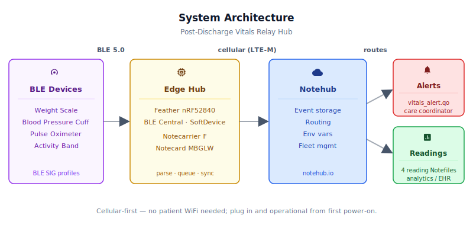

# Post-Discharge Vitals Relay Hub

<Note>

This reference application is intended to provide inspiration and help you get started quickly. It uses specific hardware choices that may not match your own implementation. Focus on the sections most relevant to your use case. If you'd like to discuss your project and whether it's a good fit for Blues, [feel free to reach out](https://blues.com/landing-pages/accelerators-contact-us/?accelerator=Post-Discharge%20Vitals%20Relay%20Hub).

</Note>

A [remote patient monitoring](https://blues.com/remote-patient-monitoring/) hub for 30–60-day post-discharge recovery programs. A Blues Notecard Cell+WiFi paired with an nRF52840 host that has native Bluetooth Low Energy scans for a patient's BLE-enabled medical devices — weight scale, blood pressure cuff, pulse oximeter, and activity band — relays each completed reading to Notehub over cellular, and immediately syncs readings that exceed configurable clinical thresholds so the care team is alerted without waiting for the next scheduled upload. No WiFi required, no app to configure, no network credentials to enter. Plug it in and it works.

## 1. Project Overview

> **⚠️ Proof-of-concept only — not a medical device.** This is a reference design intended for technical evaluation and developer education. It is **not** a cleared or certified medical device, is **not** validated for diagnostic use, and must **not** be used for emergency response or life-sustaining patient monitoring. Any deployment that collects, stores, or routes patient health data must address patient-data governance (including HIPAA/PHI compliance where applicable), secure data routing and storage, data retention and auditability requirements, and all applicable regulatory obligations. Consult qualified clinical, legal, and compliance teams before collecting real patient data.

**The problem.** Hospital discharge coordinators who manage heart failure, COPD (chronic obstructive pulmonary disease), post-surgical, and high-risk diabetic patients increasingly send patients home with a pack of BLE-enabled monitoring devices — a connected scale to catch fluid retention, a BP (blood pressure) cuff to watch for hypertension spikes, a pulse oximeter to flag respiratory deterioration, and an activity band to monitor resting heart rate. The clinical evidence for remote patient monitoring in this window is strong: daily weight checks and BP readings reduce 30-day readmissions, and early intervention on a trending SpO2 (blood oxygen saturation) drop catches pneumonia or PE (pulmonary embolism) while it is still outpatient-treatable.

The weak link is the hub. Existing RPM programs ship one of two configurations: a dedicated tablet the patient has to set up, or a companion phone app the patient has to install. Both break constantly — the tablet needs a WiFi network that may not exist or may require a password the patient can't find; the phone app needs a compatible phone and a patient who is comfortable installing software. In practice, a significant share of enrolled patients never receive a reading upload during their first week simply because the connectivity layer fails them.

**Why Notecard.** A hub with a cellular radio in it removes every one of those failure modes. It doesn't need the patient's WiFi password. It doesn't need a companion app. It doesn't need IT to add a device to the guest network. It ships pre-provisioned with a global SIM, and the moment the patient plugs it into a wall outlet the hub is online — exactly the zero-touch deployment model that the cellular Notecard was built for.
This is the definition of a device that needs to work for everyone, including an 82-year-old heart failure patient who has never configured a router. The hub is the one piece of the care program that the program cannot afford to have the patient debug. Cellular eliminates the failure mode; the Notecard delivers the cellular with a SIM, an antenna, and a two-line I2C interface — no modem AT commands, no socket management, no session state machine.

**Deployment scenario.** A small enclosure — roughly phone-charger-sized — mailed to the patient at discharge, along with the BLE device pack. The patient plugs the USB-C cable into the included charger, sets the hub on the nightstand, and forgets about it. The BLE devices use standard Bluetooth SIG health profiles (Weight Scale Service, Blood Pressure Service, Pulse Oximeter Service, Heart Rate Service). For indication-based devices (weight scale, blood pressure cuff, pulse oximeter), the device self-disconnects after transmitting one measurement and the hub immediately resumes scanning — the full connection cycle typically finishes in 2–5 seconds. Heart Rate Service devices such as the Polar H10 behave differently: they use Notification rather than Indication and stream samples continuously while worn. The firmware handles this by disconnecting after the first HR notification and suppressing reconnection for 15 minutes (`HR_SAMPLE_INTERVAL_MS`), so a patient wearing the band for two hours yields a bounded set of HR notes rather than a continuous stream. The care team sees readings in Notehub — routed to whatever RPM dashboard or EHR integration the program uses — without any patient involvement after the initial plug-in.

> **Device identity model.** The hub is fail-closed by default: only BLE-bonded devices (primary gate) or devices whose MAC address appears in the allow-list in `vitals_config.h` (secondary gate for stable-address devices) are connected. The primary gate uses the nRF52840 SoftDevice's IRK resolution — when a bonded device advertises with a Resolvable Private Address, the SoftDevice resolves it using the stored IRK and sets `addr_id_peer=1` in the scan report before the application layer sees it. Bond keys are written to flash automatically and loaded at every boot. During initial commissioning, build with both `ALLOW_UNENROLLED_DEVICES_FOR_DEV=1` and `ALLOW_COMMISSIONING_BUILD` (both flags required together) to allow connections to unrecognized devices so pairing can take place. After commissioning, add any public/static-address devices to `ENROLLED_DEVICES` in `vitals_config.h`, then rebuild with both flags removed — see the **Commission** step in §2.5 Quickstart for the complete enrollment flow.

---

## 2. System Architecture



**Device-side responsibilities.** The Adafruit Feather nRF52840 Express hosts both the BLE stack and the Notecard communication layer. The nRF52840's SoftDevice (Nordic's certified BLE firmware) runs the BLE Central role: scanning for advertisements that contain a target service UUID, connecting to the first match, subscribing to the relevant GATT characteristic (indication for weight, BP, and SpO2; notification for heart rate), parsing the raw bytes from each characteristic field (weight as a fixed-point uint16, blood pressure and SpO2 values as IEEE 11073 SFLOAT, heart rate as a plain integer), and buffering the result. The nRF52840 communicates with the Notecard over I²C through the Notecarrier F's Feather header — the Notecard API is JSON over I²C and the `note-arduino` library's `JAdd*` helpers build the request objects without the host ever touching the cellular modem.

**Notecard responsibilities.** The Notecard stores [Notes](https://dev.blues.io/api-reference/glossary/#note) in its on-device queue, establishes a cellular session on the configured [`hub.set`](https://dev.blues.io/api-reference/notecard-api/hub-requests/#hub-set) `outbound` cadence (default 15 minutes), and flushes any Notes with `sync:true` immediately. The Notecard also handles [environment variable](https://dev.blues.io/guides-and-tutorials/notecard-guides/understanding-environment-variables/) distribution from Notehub, so care coordinators can tighten or loosen alert thresholds for a specific patient without a firmware reflash.

**Notehub responsibilities.** The Notecard manages its own cellular session against the supported carrier networks worldwide via its embedded global SIM and delivers data to [Notehub](https://dev.blues.io/notehub/notehub-walkthrough/) over the Internet; Notehub ingests events, stores every event, and applies project-level [routes](https://dev.blues.io/notehub/notehub-walkthrough/#routing-data-with-notehub). The four reading Notefiles (`weight.qo`, `bp.qo`, `spo2.qo`, `activity.qo`) and the alert Notefile (`vitals_alert.qo`) are separate, so routes can fan them out differently — readings to a long-term analytics store, alerts to an on-call or EHR endpoint in near-real time. [Fleets](https://dev.blues.io/guides-and-tutorials/fleet-admin-guide/) organize devices by patient cohort or care program; [smart fleet rules](https://dev.blues.io/notehub/notehub-walkthrough/#using-smart-fleet-rules) can automatically assign a newly claimed device to the correct fleet based on its serial number or a provisioning tag.

**Routing to the cloud (high level).** Notehub supports HTTP, MQTT, AWS IoT Core, Azure IoT Hub, GCP Pub/Sub, and several other destinations; route setup is project-specific. See the [Notehub routing docs](https://dev.blues.io/notehub/notehub-walkthrough/#routing-data-with-notehub) — this project ships no specific downstream endpoint.

---

## 3. Technical Summary

**Before you start — prerequisites:**

- Notehub account and a project (to get your ProductUID)
- Arduino IDE with Adafruit nRF52 board support package installed
- USB-C and Micro-USB cables for power and firmware flashing
- At least one test BLE health device (weight scale, BP cuff, pulse oximeter, or activity band) for commissioning

To go from parts on the bench to first event in Notehub as quickly as possible:

1. **Notehub** — create a [Notehub project](https://notehub.io), copy its ProductUID.
2. **Assemble** — seat the nRF52840 Feather on the Notecarrier F, slot the Notecard into the M.2 connector, and plug Mojo inline on the power rail for bench validation.
3. **Edit one line** — set `PRODUCT_UID` in [`firmware/post_discharge_vitals_hub/vitals_config.h`](firmware/post_discharge_vitals_hub/vitals_config.h). For the initial commissioning flash, also add **both** `-DALLOW_UNENROLLED_DEVICES_FOR_DEV=1` **and** `-DALLOW_COMMISSIONING_BUILD` to your build flags — both are required together; neither may appear in the shipping build.
4. **Flash** — select **Adafruit Feather nRF52840 Express** in the Arduino IDE and upload.
5. **Commission** — bring each patient BLE device within range and initiate a measurement. The hub connects, subscribes, and initiates BLE pairing; bond keys are stored in flash. Once all devices are bonded, open Notehub → `commissioning.db` and inspect the `bond_established` notes: each note shows the device's `ble_addr` and `addr_type`. For any device whose `addr_type` is `0x00` (public) or `0x01` (random static), add its address to `ENROLLED_DEVICES` in `vitals_config.h` — those devices advertise with a fixed address that the hub cannot identify through IRK resolution alone. Devices with `addr_type` `0x02` (random private resolvable / RPA) are recognized automatically via the stored IRK and need no `ENROLLED_DEVICES` entry. Devices with `addr_type` `0x03` (random private **non**-resolvable) are **not** supported in the fail-closed production flow — non-resolvable addresses rotate without any IRK linkage so the hub cannot re-identify them across address changes; a patient device that reports `addr_type` `0x03` requires a different identity mechanism before it can be used in a production deployment. Once all entries are added, remove **both** `-DALLOW_UNENROLLED_DEVICES_FOR_DEV=1` **and** `-DALLOW_COMMISSIONING_BUILD` from your build flags and reflash. The hub is now fail-closed: only bonded and enrolled devices are accepted.
6. **Watch** — open Notehub → Events. A `_session.qo` appears within a minute; a normal reading note appears in the appropriate Notefile within the next 15-minute outbound window. If the reading trips a threshold, `sync:true` is set on **both** the measurement note and `vitals_alert.qo` — both typically appear in Notehub within the same immediate cellular session (~15–60 s), or in back-to-back immediate sessions.


Here is a sample Note this device emits:
```json
{
  "weight_kg": 84.35,
  "prev_kg": 82.10
}
```
---

## 4. Hardware Requirements

| Part | Qty | Rationale |
|------|-----|-----------|
| [Notecarrier F](https://shop.blues.com/products/notecarrier-f?utm_source=dev-blues&utm_medium=web&utm_campaign=store-link) | 1 | Feather-compatible carrier with M.2 slot for the Notecard, onboard LiPo connector, and Feather-header I²C routed to the Notecard — accepts any Feather-format MCU. |
| [Notecard](https://shop.blues.com/products/notecard?utm_source=dev-blues&utm_medium=web&utm_campaign=store-link) Cell+WiFi ([MBGLW](https://dev.blues.io/datasheets/notecard-datasheet/note-mbglw/)) | 1 | Cellular removes the WiFi dependency for the patient; no credential provisioning needed. Ships with a global prepaid SIM — no activation, no monthly commitment per device. |
| Cellular antenna, adhesive flex, u.FL connector — included in Notecarrier F package from the [Blues store](https://shop.blues.com/products/notecarrier-f?utm_source=dev-blues&utm_medium=web&utm_campaign=store-link) | 1 | Adhesive planar antenna adequate for home and office environments. Verify it is in the box before assembly; the Notecard will not register without a connected antenna. |
| u.FL to SMA bulkhead pigtail + external LTE whip antenna *(optional, metal-enclosure installs only)* | 0–1 | Required if the hub is installed inside a metal enclosure or in a room with poor indoor signal. Route the SMA bulkhead through a drilled port in the enclosure wall and connect the LTE whip outside. Example pigtail: [Molex 73412-0120](https://www.molex.com/en-us/products/part-detail/734120120) (100 mm RG-178, u.FL plug to SMA female bulkhead). Example whip: [Taoglas FW.1.07.0100](https://www.taoglas.com/product/fw-1-07-0100/) (SMA male, LTE/LTE-M/UMTS omnidirectional, 698–2700 MHz). |
| [Adafruit Feather nRF52840 Express](https://www.adafruit.com/product/4062) | 1 | Nordic nRF52840 SoC with native BLE 5.0 — the BLE radio that scans and connects to the patient's device pack. Feather form factor seats directly in the Notecarrier F. The board uses a **Micro-USB** port for firmware flashing and serial monitoring. |
| [Blues Mojo](https://shop.blues.com/products/mojo?utm_source=dev-blues&utm_medium=web&utm_campaign=store-link) | 1 | Coulomb counter for bench-validating cellular session energy and BLE scanning current during bring-up. Not required in the deployed hub. |
| USB-C wall adapter, 5V/2A (e.g. [Anker 511 USB-C Charger, 20W](https://www.anker.com/products/anker-nano-usb-c-charger-20w)) | 1 | Hub is wall-powered via the Notecarrier F's USB-C port. |
| USB-C cable, ~1.8 m / 6 ft (e.g. [Anker 333 USB-C Cable, 6 ft](https://www.anker.com/products/anker-usb-c-cable-333)) | 1 | Gives the patient enough reach from a bedside outlet to a nightstand. Powers the hub via the Notecarrier F's USB-C port. |
| Micro-USB cable (development only) | 1 | Required to flash firmware from the Arduino IDE and monitor serial output via the Feather's Micro-USB port. Remove from the patient kit before shipping. |
| Project enclosure, ~100 × 65 × 30 mm (e.g., [Hammond 1591ETCL](https://www.hammfg.com/part/1591ETCL)) | 1 | Clear polycarbonate lid lets the care team see the power LED remotely on a telehealth video call. |

**BLE patient devices — bench-validation set.** The firmware implements Bluetooth SIG standard service profiles and should work with any compliant device. The four models below are the specific devices used to validate each parser; interoperability with untested devices is not guaranteed. See §6.4 and §9 Limitations for parser scope details, especially for the Blood Pressure device.

| Part | Qty | Rationale |
|------|-----|-----------|
| [Withings Body (WBS06)](https://www.withings.com/us/en/body) | 1 | Bench-validation weight scale. Implements Weight Scale Service (0x181D) / Weight Measurement (0x2A9D) in SI mode. Used to validate `parseWeightKg`. |
| [Omron M4 Intelli IT (HEM-7155T)](https://www.omron-healthcare.com/en/blood-pressure-monitors/upper-arm/m4-intelli-it/) | 1 | Bench-validation blood pressure cuff. Implements Blood Pressure Service (0x1810) with the timestamp optional field set. Used to validate `parseBpMmhg`. The parser walks the optional-field flags to compute the pulse-rate offset correctly for both timestamp-present and timestamp-absent layouts — see §9.4. |
| [Nonin 3230](https://www.nonin.com/products/3230/) | 1 | Bench-validation pulse oximeter. Implements Pulse Oximeter Service (0x1822) / PLX Spot-Check Measurement (0x2A5E). Used to validate `parseSpO2`. |
| [Polar H10](https://www.polar.com/us-en/sensors/h10-heart-rate-sensor/) | 1 | Bench-validation heart-rate chest strap. Implements Heart Rate Service (0x180D) / Heart Rate Measurement (0x2A37) in 8-bit HR value format. Used to validate `parseHeartRate`. The Polar H10 streams notifications continuously while worn; the firmware disconnects after the first sample and suppresses reconnection for `HR_SAMPLE_INTERVAL_MS` (15 minutes) — see §9.3. |

The Blues hardware ships with an active SIM including 500 MB of data and 10 years of service — no per-device activation fees and no monthly cellular subscription requirement.

> **Why not Notecarrier CX?** The default Blues hardware stack uses the Notecarrier CX with its onboard Cygnet STM32L4 host. The Cygnet has no BLE radio, and adding an external serial BLE bridge (e.g., a UART BLE module) would require managing a second serial peripheral while simultaneously handling four concurrent BLE Central connections, device discovery, GATT indication acknowledgment, and characteristic parsing — adding unnecessary complexity and latency for a patient-facing medical hub. The nRF52840's integrated SoftDevice handles all of that in certified firmware with a clean callback API; plugging it into the Notecarrier F's Feather socket keeps the integration equally clean.

---

## 5. Wiring and Assembly


No sensor wiring is required — all patient data arrives over BLE. The electrical connections are the stacked-board I²C bus, the shared power rail, and the antenna. The table below lists each signal explicitly; steps 1–5 describe the assembly sequence.

**Pin-by-pin connections:**

| Signal | Feather nRF52840 pin | Notecarrier F header pin | Notecard / destination | Notes |
|---|---|---|---|---|
| I²C data (SDA) | `SDA` (labeled pad, nRF52840 P0.26) | Feather header pin 6 (`SDA`) | Notecard `SDA` | Notecarrier F has 10 kΩ pull-up to 3.3V on-board; no external pull-up needed. |
| I²C clock (SCL) | `SCL` (labeled pad, nRF52840 P0.27) | Feather header pin 7 (`SCL`) | Notecard `SCL` | Same pull-up network as SDA. |
| 3.3V logic rail (VIO) | `3V3` (Feather header pin 2) | Feather header 3.3V rail | Notecard VIO + Feather MCU logic supply | Generated by the Notecarrier F's onboard LDO. Supplies logic/VIO only; the Notecard's cellular modem and radio draw main power from the Notecarrier F's USB-C input via a separate path on the M.2 connector. |
| Ground | `GND` (Feather header pin 1) | Feather header GND | Notecard GND | Common ground for the entire stack. |
| Qwiic SDA (Mojo, bench only) | — | Notecarrier F Qwiic port pin 3 | Mojo `SDA` | Shared with the Feather header SDA line. |
| Qwiic SCL (Mojo, bench only) | — | Notecarrier F Qwiic port pin 4 | Mojo `SCL` | Shared with the Feather header SCL line. |
| Qwiic 3.3V (Mojo, bench only) | — | Notecarrier F Qwiic port pin 2 | Mojo `3V3` | Supplied by the Notecarrier F's LDO. |
| Qwiic GND (Mojo, bench only) | — | Notecarrier F Qwiic port pin 1 | Mojo `GND` | Common ground. |
| Cellular antenna | — | — | Notecard MBGLW cellular u.FL port (`MAIN`) | Connect the adhesive pigtail u.FL plug here. Adhere the flat antenna patch to the inside of the enclosure lid or a non-metallic enclosure wall away from the Notecard edge. |

All connections from Feather to Notecard travel through the stacked Feather header — no jumper wires are required for the I²C bus or power rail.

1. **Seat the Notecard.** Insert the Notecard Cell+WiFi into the M.2 Key-E slot on the Notecarrier F and secure the single M.2 retention screw. Connect the adhesive cellular antenna's u.FL plug to the cellular `MAIN` u.FL port on the Notecard edge (the port closest to the M.2 connector). Adhere the antenna patch to a flat, non-metallic surface — the inside of the enclosure lid works well. For metal enclosures or concrete-wall installations, use the optional u.FL-to-SMA bulkhead pigtail listed in §3, thread it through a cable-gland port in the enclosure wall, and connect an external LTE whip outside.

2. **Seat the Feather.** Press the Adafruit Feather nRF52840 Express onto the Notecarrier F's two 16-pin Feather headers. The Feather's `SDA` and `SCL` pads (header pin 6 and 7 respectively) mate with the Notecarrier F's I²C pads, which route directly to the Notecard's `SDA`/`SCL` pins. The 3.3V supply and GND are similarly routed through the header — no jumper wires are needed.

3. **Mojo (bench only).** Splice the Mojo inline between the USB-C power supply and the Notecarrier F's USB-C input to measure total stack current, or use the Notecarrier F's JST-PH battery connector with a bench LiPo to isolate the stack from USB ground noise. Connect the Mojo's [Qwiic](https://www.sparkfun.com/qwiic) cable to the Notecarrier F's Qwiic port (GND / 3.3V / SDA / SCL at 3.3V logic). The Qwiic bus is shared with the Feather header I²C lines — the Notecard communicates with the Mojo's LTC2944 coulomb counter over the same bus.

4. **Power and programming ports.** The Notecarrier F supplies the stack through two distinct paths: (a) **main power** — USB-C 5V feeds the Notecard's M.2 power pins directly, driving the cellular modem and radio; (b) **3.3V logic rail** — the Notecarrier F's onboard LDO converts that same USB supply to 3.3V and distributes it to the Feather header `3V3` pin (powering the Feather MCU) and the Notecard VIO pin (I/O level reference). These paths are separate: the Notecard's radio circuitry draws from main power, not from the 3.3V logic rail.

   **Deployment:** plug the USB-C cable from the wall adapter into the **Notecarrier F's USB-C port**. This single connection powers both paths and drives the entire stack.

   **Development and firmware flashing:** both ports must be connected simultaneously. Connect a Micro-USB cable to the **Feather's Micro-USB port** for firmware upload and serial monitoring — the Feather's UF2 bootloader enumerates over its own Micro-USB connector; the Notecarrier F's USB-C port cannot flash the Feather. At the same time, keep the **Notecarrier F's USB-C port** connected to a USB supply so the Notecard has main power. Connecting only the Feather Micro-USB leaves the Notecard without main power and all Notecard API calls will time out.

5. **Enclosure.** The Notecarrier F (approximately 96 × 62 mm) fits in a 100 × 65 × 30 mm or larger enclosure. Drill a single pass-through for the USB-C power cable on one side and a small vent on the opposite side (the nRF52840 and Notecard generate modest heat during a cellular session). For home deployments with the adhesive antenna, no external antenna port is needed.

---

## 6. Notehub Setup

1. **Create a project.** Sign up at [notehub.io](https://notehub.io) and [create a project](https://dev.blues.io/quickstart/notecard-quickstart/notecard-and-notecarrier-pi/#set-up-notehub). Copy the [ProductUID](https://dev.blues.io/notehub/notehub-walkthrough/#finding-a-productuid) — it looks like `com.your-company.your-name:vitals-hub`.

2. **Set the ProductUID in firmware.** Open [`vitals_config.h`](firmware/post_discharge_vitals_hub/vitals_config.h) and add `#define PRODUCT_UID "com.your-company.your-name:vitals-hub"` at the very top of the file, above the `#ifndef PRODUCT_UID` guard — replacing the quoted string with your actual ProductUID. Alternatively, pass it as a compiler flag: `-DPRODUCT_UID='"com.your-company.your-name:vitals-hub"'`. `PRODUCT_UID` is defined through `vitals_config.h`; there is no `#define PRODUCT_UID` in the `.ino` file.

3. **Claim the Notecard.** Power the assembled hub via USB-C. On first cellular connection the Notecard associates itself with your Notehub project automatically — no manual claim step. The device appears in the **Devices** tab within 1–2 minutes.

4. **Create a Fleet per patient cohort.** [Fleets](https://dev.blues.io/guides-and-tutorials/fleet-admin-guide/) group devices for shared configuration. A natural structure for an RPM program is one fleet per condition (e.g., `chf-30-day`, `copd-60-day`) so that threshold defaults can be tuned at the fleet level and overridden per device when a specific patient's care plan calls for tighter limits. [Smart Fleet rules](https://dev.blues.io/notehub/notehub-walkthrough/#using-smart-fleet-rules) can auto-assign devices at provisioning time based on a tag set during kitting.

5. **Set environment variables.** In Notehub: **Devices** → your device → **Environment** (or at the Fleet level for the default that applies to all devices in the cohort). All variables are optional — firmware defaults are shown below.

   > **Clinical disclaimer.** The default threshold values and any clinical commentary in this table are **illustrative starting points for a proof-of-concept demonstration only**. They are not medical advice and do not represent validated clinical standards. All alert thresholds must be selected, reviewed, and validated by the clinical program team for the intended patient population and care workflow before this device is used in any patient-facing setting.

   | Variable | Default | Purpose |
   |---|---|---|
   | `bp_systolic_high` | `160` | Systolic BP threshold (mmHg) above which `bp_high` alert fires. Configurable program threshold — AHA Stage 2 hypertension begins at ≥140 mmHg systolic (≥90 diastolic), but many RPM programs set a higher initial alert point (e.g. 160/100) to reduce alarm fatigue. |
   | `bp_diastolic_high` | `100` | Diastolic BP threshold (mmHg) above which `bp_high` alert fires (in combination with or independently of the systolic threshold). |
   | `spo2_low` | `92` | SpO2 threshold (%) below which `spo2_low` alert fires. Values under 92% in a recovering patient warrant clinical review. |
   | `hr_high` | `130` | Heart rate threshold (bpm) above which `hr_high` alert fires. **Applied only to Heart Rate Service (0x180D) readings from the activity band.** The pulse values carried in blood pressure (`bp.qo`) and SpO2 (`spo2.qo`) notes are recorded but not evaluated against this threshold. |
   | `hr_low` | `40` | Heart rate threshold (bpm) below which `hr_low` alert fires. Same scope: activity band Heart Rate Service readings only. |
   | `weight_delta_kg` | `2.3` | Weight gain threshold (kg, ≈ 5 lbs): fires `weight_gain` when the current reading exceeds the previous reading in the same boot session by this amount. Delta resets to zero on power cycle (no cross-reboot persistence in the POC). This is the standard CHF fluid-retention threshold in most heart failure disease management programs. |

   Changes take effect on the hub's next inbound sync (default 60 minutes). To pull updated values sooner, temporarily reduce `inbound` in the Notecard's `hub.set` configuration, or trigger a sync from the [Notehub in-browser terminal](https://dev.blues.io/notecard-api/). The Notecard fetches fresh env-var values from Notehub on each inbound session (default 60 minutes); the firmware then re-reads those locally cached values every 2 minutes (`ENV_POLL_MS`) via `env.get` — a call resolved on the Notecard without a cellular round-trip — so threshold changes apply within 2 minutes of the next inbound sync rather than sitting unused for up to a full additional hour.

6. **Configure routes.** Add at minimum one route for `vitals_alert.qo` (real-time delivery to an on-call endpoint, SMS gateway, or EHR webhook) and one for each reading Notefile (to a long-term analytics store). Splitting the Notefiles lets you route alert notes to a paging system and routine readings to a patient record without any filtering logic in the route itself. See the [Notehub routing docs](https://dev.blues.io/notehub/notehub-walkthrough/#routing-data-with-notehub).

### What to look for in Notehub

In the Notehub web console, navigate to **Devices** (your newly claimed hub), then click **Events** to see real-time and historical notes. You will see these Notefiles:

- **`_session.qo`** — appears within a minute of first power-on. Confirms the Notecard has cellular coverage and your ProductUID is correct. Each inbound sync (once per hour by default) and each threshold-triggered outbound sync generates a session note.
- **`weight.qo`**, **`bp.qo`**, **`spo2.qo`**, **`activity.qo`** — normal readings (those that do not trip a threshold) queue on the Notecard and appear in Notehub within the next 15-minute outbound window. Readings that do trip a threshold carry `sync:true` on the measurement note itself, so that reading and its companion `vitals_alert.qo` note typically arrive in the same immediate cellular session, or in back-to-back immediate sessions — not on the next scheduled sync.
- **`vitals_alert.qo`** — emitted alongside the threshold-tripping measurement note, also with `sync:true`. Both notes typically arrive in the same immediate cellular session (~15–60 s), or in back-to-back immediate sessions — bypassing the normal 15-minute upload timer. Check the `body` of each alert note to see which threshold was crossed (e.g., `{"alert":"bp_high","systolic_mmhg":168,"diastolic_mmhg":98}`).
- **`commissioning.db`** — written during a commissioning build (both `ALLOW_UNENROLLED_DEVICES_FOR_DEV=1` and `ALLOW_COMMISSIONING_BUILD` active) when the hub successfully bonds a new device. Each `bond_established` note contains the device's `ble_addr` (colon-separated, MSB-first) and `addr_type`. Inspect these notes after commissioning: devices with `addr_type` `0x00` (public) or `0x01` (random static) must be added to `ENROLLED_DEVICES` in `vitals_config.h` before the shipping build — see the **Commission** step in §2.5 Quickstart and §9 Limitations.

---

## 7. Firmware Design

| File | Role |
|------|------|
| [`post_discharge_vitals_hub.ino`](firmware/post_discharge_vitals_hub/post_discharge_vitals_hub.ino) | Arduino entry point: global state, `setup()`, `loop()` |
| [`vitals_config.h`](firmware/post_discharge_vitals_hub/vitals_config.h) | Build-time configuration: `PRODUCT_UID`, `DEBUG_VITALS`, `ALLOW_UNENROLLED_DEVICES_FOR_DEV`, interval constants, MAC allow-list |
| [`ble_central.h`](firmware/post_discharge_vitals_hub/ble_central.h) / [`ble_central.cpp`](firmware/post_discharge_vitals_hub/ble_central.cpp) | BLE Central: identity gate, scan/connect/disconnect callbacks, GATT data callbacks, pairing initiation, `initBLE()` |
| [`notecard_helpers.h`](firmware/post_discharge_vitals_hub/notecard_helpers.h) / [`notecard_helpers.cpp`](firmware/post_discharge_vitals_hub/notecard_helpers.cpp) | Notecard layer: `hub.set` configuration, template registration, env-var fetch, note submission with checked alert delivery |
| [`ble_parsers.h`](firmware/post_discharge_vitals_hub/ble_parsers.h) | Static inline GATT decoders + physiological plausibility guards |

### 6.1 Installing and flashing

**Dependencies:**

- **Adafruit nRF52 Arduino** board support package — install via the Arduino IDE Boards Manager by adding the index URL `https://adafruit.github.io/arduino-board-index/package_adafruit_index.json` under **File → Preferences → Additional Boards Manager URLs**, then searching for "Adafruit nRF52". Select **Adafruit Feather nRF52840 Express** as the board.
- **Blues Wireless Notecard** (`note-arduino`) — install via the Arduino Library Manager (search "Blues Wireless Notecard"). Check [github.com/blues/note-arduino/releases](https://github.com/blues/note-arduino/releases) for the latest release before flashing.
- **bluefruit.h** — included with the Adafruit nRF52 board support package; no separate install required.

**Flashing:** Connect a **Micro-USB cable** to the **Feather's Micro-USB port** (not the Notecarrier F's USB-C port). Open `post_discharge_vitals_hub.ino` in the Arduino IDE, select **Adafruit Feather nRF52840 Express**, select the correct COM/tty port (the Feather enumerates as a serial device over its Micro-USB connector), and click **Upload**. No external programmer is needed — the Feather's onboard UF2 bootloader handles programming directly over USB.

Open the serial monitor at **115200 baud** to watch `[BLE]` and `[VITALS]` log lines in real time during bench bring-up — **debug build only** (`DEBUG_VITALS=1` with `ALLOW_DEBUG_BUILD`, per the build flags above). The default shipping build emits no serial output; patient data is never printed over USB in a production flash.

**Build flags.** Several compile-time flags used in this project are guarded by a companion acknowledgment flag; omitting the companion produces a hard compile-time error so a development or commissioning build cannot be accidentally shipped to a patient hub. The cleanest way to pass extra flags is with **`arduino-cli`**:

```sh
# Debug build (verbose serial logging)
arduino-cli compile \
  --fqbn adafruit:nrf52:feather52840 \
  --build-property "compiler.cpp.extra_flags=-DALLOW_DEBUG_BUILD -DDEBUG_VITALS=1" \
  --build-property "compiler.c.extra_flags=-DALLOW_DEBUG_BUILD -DDEBUG_VITALS=1" \
  firmware/post_discharge_vitals_hub

# Commissioning build (identity bypass for initial BLE pairing)
arduino-cli compile \
  --fqbn adafruit:nrf52:feather52840 \
  --build-property "compiler.cpp.extra_flags=-DALLOW_UNENROLLED_DEVICES_FOR_DEV=1 -DALLOW_COMMISSIONING_BUILD" \
  --build-property "compiler.c.extra_flags=-DALLOW_UNENROLLED_DEVICES_FOR_DEV=1 -DALLOW_COMMISSIONING_BUILD" \
  firmware/post_discharge_vitals_hub
```

Arduino IDE users can add extra flags by creating a `platform.local.txt` file in the Adafruit nRF52 board-support-package folder and adding a line such as `compiler.cpp.extra_flags=-DALLOW_DEBUG_BUILD -DDEBUG_VITALS=1` (see the [Arduino platform customization docs](https://arduino.github.io/arduino-cli/latest/platform-specification/#platformlocaltxt)). The **Sketch → Export Compiled Binary** menu does not expose a build-flags field in the standard IDE GUI for the nRF52 board package.

### 6.2 Module responsibilities

| Responsibility | Where |
|---|---|
| Build-time config, DBG macros, MAC allow-list | `vitals_config.h` |
| Notecard hub configuration and template registration | `notecard_helpers.cpp` — `notecardConfigure`, `defineTemplates` |
| Threshold fetch from Notehub env vars | `notecard_helpers.cpp` — `fetchEnvVars` (boot + every 2 minutes via `ENV_POLL_MS`) |
| Reading note emission + checked alert delivery | `notecard_helpers.cpp` — `submitWeight`, `submitBp`, `submitSpO2`, `submitActivity` |
| Device identity gate (bonding + MAC allow-list) | `ble_central.cpp` — `isIdentifiedDevice` |
| BLE scan + connect + disconnect + pairing event handling | `ble_central.cpp` — `bleScanCallback`, `bleConnectCallback`, `bleDisconnectCallback`, `blePairCompleteCallback` |
| GATT indication/notification callbacks + plausibility checks | `ble_central.cpp` — `weightDataCallback`, `bpDataCallback`, `spo2DataCallback`, `hrDataCallback` |
| BLE characteristic byte parsing + plausibility helpers | `ble_parsers.h` — `parseSfloat`, `parseWeightKg`, `parseBpMmhg`, `parseSpO2`, `parseHeartRate`, `weightKgPlausible`, `bpPlausible`, `spo2Plausible`, `hrPlausible` |
| Buffered reading dispatch and watchdog | `post_discharge_vitals_hub.ino` — `loop()` |

### 6.3 BLE scanning and GATT reading strategy

The nRF52840 SoftDevice operates as a BLE Central. `bleScanCallback` fires for every advertisement packet received; the firmware calls `Bluefruit.Scanner.checkReportForService()` against each of the four target service UUIDs and connects only on a match. On connection, `bleConnectCallback` calls `service.discover(connHandle)` to identify which of the four device types just connected, then calls `char.discover()` followed by `enableIndicate()` (for weight, BP, and SpO2, which use the GATT Indication sub-procedure) or `enableNotify()` (for heart rate, which uses Notification). The SoftDevice handles GATT ATT acknowledgment automatically. When the device transmits a reading, the corresponding data callback populates a buffered struct and sets its `valid` flag; the main loop drains that buffer on the next iteration.

One BLE Central connection slot is used at a time. If the patient picks up the BP cuff while the scale is connected, the connection to the scale finishes first (scale sends one indication and disconnects), the scanner restarts (via `restartOnDisconnect(true)`), and the BP cuff is picked up on the next scan cycle.

**Indication-based devices (weight, BP, SpO2)** self-disconnect after sending a single measurement; the full connection-measure-disconnect cycle typically completes within 2–5 seconds.

**Heart Rate Service devices** use Notification rather than Indication and stream readings continuously for as long as they remain connected — a device like the Polar H10 will keep sending samples every second indefinitely. The firmware handles this explicitly: `loop()` calls `Bluefruit.disconnect()` after consuming the first HR notification, and `bleScanCallback` suppresses further HR Service connection attempts for `HR_SAMPLE_INTERVAL_MS` (15 minutes) by checking `millis() - g_last_hr_sample_ms`. This bounds `activity.qo` note rate to at most one sample per 15-minute window while the band is within range, regardless of how long the patient wears it.

The four target service UUIDs are assigned by the Bluetooth SIG:

| Device | Service UUID | Characteristic UUID | Sub-procedure |
|--------|-------------|---------------------|---------------|
| Weight scale | 0x181D | 0x2A9D | Indication |
| Blood pressure cuff | 0x1810 | 0x2A35 | Indication |
| Pulse oximeter | 0x1822 | 0x2A5E | Indication |
| Activity band | 0x180D | 0x2A37 | Notification |

### 6.4 Characteristic value encoding

The four measurement characteristics use three different wire encodings — it is not uniform SFLOAT throughout the stack.

**Blood pressure and SpO2 — IEEE 11073 SFLOAT.** The Blood Pressure Measurement (0x2A35) and PLX Spot-Check Measurement (0x2A5E) characteristics encode their numeric fields as IEEE 11073 SFLOAT: a 16-bit type where the upper four bits are a signed exponent and the lower twelve bits are a signed mantissa (value = mantissa × 10^exponent). The firmware decodes these in `parseSfloat()` (in `ble_parsers.h`). Reserved sentinel values (0x07FF = NaN, 0x0800 = NaN, 0x07FE = +Inf, 0x0802 = -Inf, 0x0801 = Reserved) are compared against the **full 16-bit raw SFLOAT encoding** before decoding mantissa and exponent. Checking only the masked 12-bit mantissa field would incorrectly reject valid numbers — for example, `0x17FF` has mantissa bits `0x7FF` that match the NaN sentinel mask, but its exponent field (`0x1`) makes it a valid number (mantissa=2047, exponent=1, value=20470). Results are rounded to integers (1 mmHg / 1% granularity is clinically sufficient).

> **Blood Pressure parser scope.** Systolic and diastolic values (bytes [1–6], always mandatory) parse correctly for any standards-compliant BP device. The optional `pulse_bpm` field is decoded by walking the optional-field flags: the parser computes the pulse-rate SFLOAT offset as 7 bytes (mandatory header) + 7 bytes if the timestamp field is present (flags bit 1). This correctly handles both the timestamp-included layout (the Omron M4 bench-validation device) and the timestamp-absent layout, covering all compliant Blood Pressure Measurement (0x2A35) implementations. User ID (flags bit 3) and Measurement Status (flags bit 4) fields appear after the pulse rate in the spec ordering and are not captured.

> **PLX Spot-Check Measurement (0x2A5E) parser scope.** The mandatory byte layout is: **[0]** Flags (uint8, 1 byte), **[1–2]** SpO2 SFLOAT (%), **[3–4]** pulse rate SFLOAT (bpm). A minimum valid frame is therefore 5 bytes. Optional fields — Timestamp (7 bytes, flags bit 0), Measurement Status (3 bytes, flags bit 1), Device and Sensor Status (5 bytes, flags bit 2), Pulse Amplitude Index (SFLOAT 2 bytes, flags bit 3) — start at byte [5] and are not captured. The Flags field is **1 byte (uint8)**, not 2; this is distinct from the Blood Pressure Measurement characteristic where a 1-byte Flags field also precedes the mandatory SFLOAT fields, and from some GATT tutorials that incorrectly widen the PLX Flags to uint16. The bench-validation device (Nonin 3230) implements the SIG-standard layout; `parseSpO2()` has been validated against it.

**Weight — uint16 fixed-point.** The Weight Measurement characteristic (0x2A9D) encodes the weight as a plain **uint16**, not SFLOAT. In SI mode the raw value has a resolution of 0.005 kg (5 g) — divide by 200 to get kilograms. In Imperial mode the resolution is 0.01 lb. The sentinel for an unsuccessful measurement is 0xFFFF. `parseWeightKg()` reads the uint16 directly, applies the fixed-resolution multiplier, and converts lbs to kg when the Imperial flag (bit 0 of the Flags byte) is set.

**Heart rate — plain uint8/uint16.** The Heart Rate Measurement characteristic (0x2A37) carries the heart rate value as a plain unsigned integer — uint8 when flags bit 0 is 0 (the common case for consumer bands), uint16 when bit 0 is 1. No SFLOAT decoding is involved.

### 6.5 Event payload design

Each Notefile uses a [template](https://dev.blues.io/notecard/notecard-walkthrough/low-bandwidth-design/#working-with-note-templates) that stores notes as fixed-length binary records on the Notecard rather than free-form JSON, reducing per-reading wire size by 3–5×.

`weight.qo` sample:
```json
{
  "weight_kg": 84.35,
  "prev_kg": 82.10
}
```

`bp.qo` sample:
```json
{
  "systolic_mmhg": 138,
  "diastolic_mmhg": 86,
  "pulse_bpm": 74
}
```

`spo2.qo` sample:
```json
{
  "spo2_pct": 96,
  "pulse_bpm": 71
}
```

`activity.qo` sample:
```json
{
  "heart_rate_bpm": 68
}
```

`vitals_alert.qo` sample (untemplated, immediate sync):
```json
{
  "alert": "weight_gain",
  "weight_kg": 84.35,
  "delta_kg": 2.25
}
```

Alert types: `weight_gain`, `bp_high`, `spo2_low`, `hr_high`, `hr_low`. The Notecard's metadata envelope (timestamp and device identity) is added automatically and appears alongside the body in Notehub. Location is included only if the device has a configured location source; for a wall-powered indoor hub with no GNSS, the location field will not be present.

### 6.6 Sync strategy and power

**Wall-powered operation — continuous availability.** The hub is powered by USB-C (no battery), so the BLE scanner remains active 24/7. This is critical for the clinical workflow: a patient may take a reading at any time (3 AM weight check, midnight BP, etc.) and the hub must be online to capture it immediately. There is no sleep/wake cycle, no polling intervals — measurements are event-driven and go to Notehub without delay (subject to the 15-minute outbound window, or immediately if they trip a threshold).

**Notecard cellular sync.** The Notecard runs in `periodic` mode with `outbound:15` (minutes) and `inbound:60`. Readings queue on the Notecard between cellular sessions and upload in a single burst every 15 minutes. When a reading trips a threshold, `sync:true` is added to both the measurement note (e.g., `bp.qo`) and the companion `vitals_alert.qo` note — both bypass the queue and are typically delivered in the same immediate cellular session, or in back-to-back immediate sessions. The 15-minute default is conservative — for most RPM programs, readings uploading within 15 minutes of being taken is well inside the care-team's response window.

**Alert cooldown.** Once a `vitals_alert.qo` note fires for a given alert type, the firmware suppresses further alert notes of the same type for `ALERT_COOLDOWN_MS` (5 minutes). This bounds the volume of notifications the care team receives while a patient remains out of range — the threshold-tripping measurement note still carries `sync:true` and arrives immediately (the care team's data record is complete), but the companion alert note (which may trigger a page or automated response) is held back. A reading that remains out of range across multiple consecutive measurements therefore produces at most one alert every 5 minutes rather than one per reading cycle, reducing alert fatigue. The 5-minute floor is a firmware constant in this POC; a production deployment would expose it as a configurable Notehub environment variable alongside the clinical thresholds.

**Radio duty cycle.** The nRF52840 SoftDevice duty-cycles the BLE radio automatically: the scanner runs at a 50% duty cycle (100 ms window every 200 ms interval). The BLE scanner dominates the continuous baseline current draw (~5–10 mA); each cellular session dominates the short peak-current burst (~250 mA) and contributes a significant share of total energy per 15-minute sync window despite being brief (~15–30 s).

### 6.7 Error handling

- **`hub.set` with retry and response check.** `notecardConfigure()` guards against an empty `PRODUCT_UID` before sending, retries for up to 5 seconds to paper over the cold-boot I²C race, and inspects the response `err` field via `sendChecked()`. A failed or rejected configuration is logged rather than silently swallowed.
- **Checked delivery with retry for all notes.** Both alert notes and routine measurement notes use checked enqueue via `sendVitalNoteChecked()` / `sendAlertNote()`, which call `requestAndResponse()` and retry up to `ALERT_ENQUEUE_RETRIES` (3) times on I²C failure — so a transient I²C error cannot silently drop any patient reading. Routine readings call `sendVitalNoteChecked()` with `addSync=false` (normal outbound cadence applies); threshold-tripping readings call it with `addSync=true` to trigger an immediate outbound session for that measurement regardless of alert-cooldown state. The companion `vitals_alert.qo` note is submitted immediately after via `sendAlertNote()`, also checked and retried. A final failure on a measurement note is logged; a final failure on an alert note additionally warns that the alert may be lost.
- **Configuration calls checked.** `hub.set` and `note.template` calls use `sendChecked()` so a rejected template registration is logged rather than silently swallowed.
- **Physiological plausibility.** Data callbacks in `ble_central.cpp` apply plausibility guards (defined in `ble_parsers.h`) before setting a reading's `valid` flag. Frames outside human-survival bounds — impossible BP relationships, SpO2 values below 50%, HR outside 20–300 bpm, weight outside 1–500 kg — are logged and discarded. This prevents malformed frames or noncompliant devices from producing impossible readings or triggering spurious alerts.
- **GATT payload guards.** BLE callbacks check minimum `len` before dereferencing any byte. Measurement-unsuccessful sentinels (0xFFFF for weight; NaN/reserved SFLOAT for blood pressure and SpO2) return −1.0 f or NAN from the parsing helpers; callbacks discard non-positive values.
- **Env-var validation.** `fetchEnvVars()` checks for a NULL response, a non-empty `err` field, and a non-empty string before calling `atof()`. Related threshold pairs (systolic/diastolic, hr_high/hr_low) are cross-validated for sensible ordering before being applied.

### 6.8 Key code snippet 1: Notecard periodic sync with 15-minute outbound

`hub.set` is sent via a checked retry loop that guards the empty-`PRODUCT_UID` case, handles the cold-boot I²C race, and inspects the Notecard's response `err` field:

```cpp
bool ok = false;
const uint32_t t0 = millis();
do {
    J *req = notecard.newRequest("hub.set");
    JAddStringToObject(req, "product",  PRODUCT_UID);
    JAddStringToObject(req, "mode",     "periodic");
    JAddNumberToObject(req, "outbound", 15);   // upload readings every 15 min
    JAddNumberToObject(req, "inbound",  60);   // fetch env vars every 60 min
    ok = sendChecked(req);                     // checks err field in response
    if (!ok) delay(500);
} while (!ok && (millis() - t0) < 5000UL);
```

### 6.9 Key code snippet 2: immediate-sync alert on threshold trip

`sync:true` tells the Notecard to open a session immediately rather than waiting for the next scheduled outbound window — essential for a care team that needs to act on a dangerous SpO2 within minutes, not the next quarter-hour.

```cpp
J *req  = notecard.newRequest("note.add");
JAddStringToObject(req, "file", "vitals_alert.qo");
JAddBoolToObject  (req, "sync", true);
J *body = JAddObjectToObject(req, "body");
JAddStringToObject(body, "alert",    "spo2_low");
JAddNumberToObject(body, "spo2_pct", spo2_pct);
notecard.sendRequest(req);
```

### 6.10 Key code snippet 3: BLE service discovery and indication subscribe

Called from `bleConnectCallback` when a device connects. The service `discover()` call walks the connected peripheral's ATT database; on a match, `enableIndicate()` writes the CCCD (Client Characteristic Configuration Descriptor) to turn on indications.

```cpp
if (g_bpSvc.discover(connHandle)) {
    if (g_bpChar.discover()) {
        // Blood Pressure Measurement uses Indication (device sends, hub ACKs)
        g_bpChar.enableIndicate(bpDataCallback);
    }
}
```

### 6.11 Key code snippet 4: SFLOAT decode in ble_parsers.h

The IEEE 11073 SFLOAT type is a 16-bit packed float used for blood pressure and SpO2 fields. `parseSfloat()` sign-extends both the 4-bit exponent and the 12-bit mantissa, which is the step most BLE tutorial snippets handle correctly. The less obvious part is sentinel rejection: reserved SFLOAT values are specific **full 16-bit encodings** and must be compared against the raw value before any decoding. Checking only the masked 12-bit mantissa field would incorrectly reject valid numbers whose lower 12 bits match a sentinel pattern but whose exponent is nonzero — for example, `0x17FF` has mantissa bits `0x7FF` that match the NaN sentinel `0x07FF`, but its exponent `0x1` makes it a valid number (mantissa=2047, exponent=1, value=20470). Weight and heart rate do not use this decoder — see §9.4 for their respective encoding formats.

```cpp
static inline float parseSfloat(uint16_t raw) {
    // Compare the full 16-bit raw value against each reserved sentinel before
    // decoding mantissa/exponent.  Checking only the masked 12-bit mantissa
    // field would incorrectly reject valid encodings whose mantissa bits happen
    // to match a sentinel pattern but whose exponent is nonzero (e.g. 0x17FF
    // is a valid number with exponent=1, mantissa=2047, value=20470).
    if (raw == 0x07FFu || raw == 0x0800u ||
        raw == 0x07FEu || raw == 0x0802u ||
        raw == 0x0801u) {
        return NAN;
    }
    // Sign-extend mantissa: bits [11:0] → int16
    int16_t mantissa = (int16_t)(raw & 0x0FFFu);
    if (mantissa & 0x0800) {
        mantissa |= (int16_t)0xF000;   // propagate sign bit
    }
    // Exponent: sign-extend bits [15:12] to a full int8
    int8_t exponent = (int8_t)((raw >> 12) & 0x0F);
    if (exponent & 0x08) {
        exponent |= (int8_t)0xF0;      // propagate sign bit
    }
    return (float)mantissa * powf(10.0f, (float)exponent);
}
```

---

## 8. Data Flow


**Collected.** Every time a patient uses a BLE health device: weight (kg), blood pressure (systolic/diastolic mmHg and pulse bpm), SpO2 (percent) and pulse rate, heart rate (bpm from the activity band). The hub does not poll on a fixed schedule — readings are event-driven, captured when the device transmits.

**Transmitted.**
- `weight.qo`, `bp.qo`, `spo2.qo`, `activity.qo` — queued when a reading arrives and uploaded in the next 15-minute outbound sync window, **unless** the reading trips a threshold, in which case `sync:true` is also added to the measurement note and it uploads immediately. Template-encoded; each note is a compact binary record on the Notecard.
- `vitals_alert.qo` — emitted alongside every threshold-tripping measurement note, also with `sync:true`. Both the measurement note and the alert note typically arrive in the same immediate cellular session (~15–60 s after the reading), or in back-to-back immediate sessions — not on the next scheduled sync.

**Routed.** All five Notefiles land in Notehub and from there to whatever downstream the project's routes specify. The recommended split: reading Notefiles → long-term analytics or EHR staging; `vitals_alert.qo` → on-call or care coordinator notification channel (SMS gateway, webhook, CMMS ticket, etc.).

**Alerts trigger on:**
- `weight_gain` — current weight reading exceeds the previous weight reading in the same boot session by ≥ `weight_delta_kg`. Body: `alert`, `weight_kg`, `delta_kg`. (No alert on the first reading of a session; delta state does not persist across power cycles — see Limitations.)
- `bp_high` — systolic ≥ `bp_systolic_high` or diastolic ≥ `bp_diastolic_high`. Body: `alert`, `systolic_mmhg`, `diastolic_mmhg`.
- `spo2_low` — SpO2 < `spo2_low`. Body: `alert`, `spo2_pct`.
- `hr_high` — heart rate from the activity band (Heart Rate Service, 0x180D) > `hr_high`. Body: `alert`, `heart_rate_bpm`. Note: pulse values from the BP cuff or pulse oximeter are not evaluated against this threshold.
- `hr_low` — heart rate from the activity band (Heart Rate Service, 0x180D) < `hr_low` and > 0. Body: `alert`, `heart_rate_bpm`. Same scope: activity band only.

**Alert deduplication.** When a reading trips a threshold the measurement note always carries `sync:true` and uploads immediately. The companion `vitals_alert.qo` note is additionally rate-limited by `ALERT_COOLDOWN_MS` (5 minutes per alert type): if the same alert type fired within the last 5 minutes, the alert note is suppressed while the measurement note still syncs. This bounds the volume of actionable notifications the care team receives while keeping the raw data record complete.

---

## 9. Validation and Testing

**Expected steady-state.** In a normal day a post-discharge patient takes weight once in the morning, BP twice (morning and evening), SpO2 once or twice, and wears the activity band intermittently. Activity band heart rate samples are capped at one per `HR_SAMPLE_INTERVAL_MS` (15 minutes) — a patient who wears the band for two hours yields at most 8 HR notes during that period. Overall the hub produces roughly 5–15 reading notes per day across the four Notefiles and zero alert notes in a recovering patient. The first set of notes should appear in Notehub within 15 minutes of the first measurement after the hub comes online.

**Simulating a threshold trip.** The fastest way to test alert delivery: set `bp_systolic_high` to `100` in the Fleet environment — any normal BP reading will then trip `bp_high`. After the next inbound sync pulls the new value, take a BP measurement and confirm that both a `bp.qo` note and a `vitals_alert.qo` note appear in Notehub within a cellular session-establishment window (typically 15–60 s). Reset the threshold to `160` when done.

**Verifying BLE connectivity.** Open the Arduino serial monitor at 115200 baud (**debug build only** — set `DEBUG_VITALS=1` and `ALLOW_DEBUG_BUILD` per §6.1; the default shipping build emits no serial output). Each scan hit, connection, and characteristic subscription prints a `[BLE]` line; each reading prints a `[VITALS]` line. If no devices appear, confirm the BLE health device is in measurement-ready state (most BLE health devices only advertise immediately after a measurement is initiated) and that it implements the standard Bluetooth SIG service UUID for its category.

**Power validation with Mojo.** Splice the [Mojo](https://dev.blues.io/datasheets/mojo-datasheet/) inline between the USB-C supply and the Notecarrier F's power input. The hub operates in two mutually exclusive states plus a recurrent burst:

| State | Expected draw | Notes |
|---|---|---|
| Continuous baseline — host + BLE scanning | ~5–10 mA | nRF52840 SoftDevice running at 50% scan duty cycle (+4 dBm). Notecard idle contribution (~8–18 µA) adds negligibly to this baseline. |
| Cellular session burst (~15–30 s, once every 15 min) | ~250 mA average; brief spikes to ~500 mA at peak LTE-M TX. The ~2 A figure applies only when operating in GSM mode (2G fallback, select regions) — see the [MBGLW datasheet](https://dev.blues.io/datasheets/notecard-datasheet/note-mbglw/). | LTE-M data transfer. Also fires on any threshold-tripping measurement note or alert note with `sync:true`. |

The continuous baseline is dominated by the BLE scanner. The cellular burst is brief but contributes a significant share of total energy per sync window — roughly 30 s at ~250 mA (LTE-M) every 15 minutes. Both are well within the range of a standard 5V/2A USB phone charger. Notecard current figures are drawn from the [MBGLW datasheet](https://dev.blues.io/datasheets/notecard-datasheet/note-mbglw/) and the [low-power design guide](https://dev.blues.io/notecard/notecard-walkthrough/low-power-firmware-design/). Note that the ~8–18 µA Notecard idle figure is a module-level datasheet specification; the Mojo measures the whole powered stack at the USB input, which will read higher due to the nRF52840 and the Notecarrier F's regulator. When bench-validating, focus on trace shape and sync-burst cadence rather than expecting the Notecard datasheet idle figure to appear directly at the USB power input.

A healthy Mojo trace for this hub should show: a steady ~5–10 mA baseline (BLE scanning continuous), with a 15–30-second burst at ~250 mA (LTE-M) once every 15 minutes (scheduled cellular sync), and additional ~250 mA bursts whenever a threshold-tripping measurement or alert note carries `sync:true`. In regions where the network falls back to GSM the cellular burst can spike briefly to ~2 A during transmit — this is normal MBGLW behavior on GSM but should not be seen in LTE-M–only deployments. If cellular bursts are absent or far less frequent than 15 minutes, verify `PRODUCT_UID` is set and the Notecard has coverage (check `_session.qo` events in Notehub).

### Troubleshooting

A short field guide for the issues that actually arise during first bring-up and deployment.

| Symptom | Likely cause | What to check |
|---|---|---|
| Device never appears in Notehub's **Devices** tab. | `PRODUCT_UID` is empty or wrong, or the cellular antenna is not routed. | Verify `PRODUCT_UID` exactly matches the Notehub project. Confirm the u.FL antenna pigtail is attached to the Notecard. Check for `_session.qo` events — if none appear, there is no cellular connection. |
| `_session.qo` events arrive but no reading notes ever appear. | No BLE health device within range, or device is not advertising its standard service UUID. | Open the serial monitor at 115200 baud and watch for `[BLE] Scanner started` (**debug build only** — see §9.1 build flags). Bring a BLE health device within a few meters and initiate a measurement — most devices only advertise during an active measurement, not continuously. Confirm the device uses the standard Bluetooth SIG service UUID (not a proprietary profile). |
| BLE device connects but the reading struct is never populated. | Device sends a measurement-unsuccessful sentinel (0xFFFF for weight; NaN or reserved SFLOAT for blood pressure or SpO2), or the characteristic byte layout differs from the SIG specification. | Check `[BLE]` log lines (**debug build only** — see §9.1 build flags) for the service discovery step. If discovery succeeds but the data callback never sets `valid`, add `Serial.printf` in the callback to print the raw bytes and compare against the device's BLE specification or use a BLE sniffer app (nRF Connect for Mobile works well). |
| Alerts fire on every reading even though values look normal. | A clinically too-tight threshold value, stale cached env values, or a scope-override shadowing the intended value. | In Notehub, verify each threshold env var holds a sensible value for the patient population. Out-of-range and non-numeric values (including `"0"` and blank strings) are rejected in firmware by `validateEnvFloat` — each var has explicit bounds (e.g. `bp_systolic_high` ∈ [60, 260], `hr_low` ∈ [20, 100], `weight_delta_kg` ∈ [0.5, 20]); a rejected value falls back to the previously accepted threshold rather than being applied. Notehub applies env vars hierarchically: project scope is the baseline, fleet scope overrides it, and device scope overrides both. A device-level value silently shadows a fleet or project default, so check all three scopes when a threshold behaves unexpectedly. |
| Weight readings are off by a factor of ~2.2. | Device is transmitting in Imperial (lbs) but the flags byte isn't being parsed correctly. | The Flags byte (byte 0) bit 0 determines SI vs. Imperial. Log `data[0]` in `weightDataCallback` and verify. If the device always sends Imperial, the `parseWeightKg` helper already converts lbs → kg when the flag is set. |
| No cellular sync for more than 15 minutes. | Notecard in coverage gap, or firmware stuck before calling `submitWeight / submitBp / etc.` | Run `hub.status` from the Notehub in-browser terminal — it returns current signal strength and sync state. If coverage is good but syncs are absent, confirm the main `loop()` is running (add a serial heartbeat print every 30 s). |
| Mojo bench trace shows no cellular bursts at all. | `hub.set` was not applied, or Notecard is in `minimum` mode from a prior configuration. | Issue `{"req":"hub.set","mode":"periodic","outbound":15,"inbound":60}` from the Notehub in-browser terminal to reset sync mode. Power-cycle the hub; the sketch calls `notecardConfigure()` in `setup()` which re-applies the configuration. |

If a problem is not on this list, the [Blues community forum](https://discuss.blues.com) is the fastest place to get a second pair of eyes on a Notecard + BLE setup.

---

## 10. Limitations and Next Steps

> **Reminder:** this is a proof-of-concept reference design, not a cleared medical device. It is not intended for diagnostic, emergency, or life-sustaining use. Any production deployment must address PHI/HIPAA compliance, secure data routing and storage, auditability, data retention policies, and applicable regulatory review before handling real patient data.

**Simplified for the POC:**

- **One BLE connection at a time.** The nRF52840's Central role supports multiple concurrent connections, but the sketch only opens one. If a patient manages to trigger two devices simultaneously (unlikely with health devices that connect-measure-disconnect quickly), the second connect attempt is queued after the first device disconnects. A multi-connection extension is straightforward in the Adafruit nRF52 library.
- **Alert cooldown is a fixed firmware constant, not remotely configurable.** The hub suppresses repeated `vitals_alert.qo` notes of the same type for 5 minutes (`ALERT_COOLDOWN_MS`). The cooldown duration cannot be adjusted per patient without a firmware reflash. A production deployment would expose this as a Notehub environment variable alongside the clinical thresholds, so care coordinators can tighten or relax the alert rate for individual patients.
- **Weight-delta alerting, not absolute.** The `weight_gain` alert fires on change vs. previous reading, not on absolute weight. On first boot there is no previous reading so no delta alert is possible. A daily-comparison window (today vs. same time yesterday) is a more robust clinical metric and requires persisting the previous day's reading — doable by storing it in a `_notecard.db` database Notefile.
- **Heart rate only from activity band.** The Heart Rate Service (0x180D) provides heart rate, but step count is not part of the standard service — it lives in proprietary manufacturer-specific GATT services that differ across activity band brands. The firmware captures only heart rate from that service.
- **Blood Pressure Measurement — `user_id` and `measurement_status` not captured.** `parseBpMmhg` correctly decodes systolic, diastolic, and pulse rate for any compliant 0x2A35 layout. Only the timestamp field (flags bit 1) affects the pulse-rate offset: the parser adds 7 bytes to the mandatory 7-byte header when the timestamp is present, correctly handling both timestamp-present (Omron M4) and timestamp-absent layouts. The User ID (flags bit 3) and Measurement Status (flags bit 4) fields appear after pulse rate in the spec ordering; they are not used and their values are discarded.
- **BLE bonding requires a commissioning step, and public/static-address devices also require an allow-list entry.** The hub is fail-closed by default: unrecognized devices are ignored. Before shipping to a patient, a commissioning build with both `-DALLOW_UNENROLLED_DEVICES_FOR_DEV=1` and `-DALLOW_COMMISSIONING_BUILD` is needed to pair the patient's specific devices and store their bond keys. After commissioning, inspect the `bond_established` notes in `commissioning.db` on Notehub: any device whose `addr_type` is `0x00` (public) or `0x01` (random static) must also be added to `ENROLLED_DEVICES` in `vitals_config.h` — bonding alone is not sufficient for those devices because the hub cannot identify them through IRK resolution. Remove both commissioning flags before deploying to patients. The MAC allow-list is a compile-time constant that cannot be updated without a reflash.
- **BLE pairing uses encrypted but unauthenticated bonding.** The commissioning step uses Just Works pairing (`setMITMProtect(false)`) because most consumer health devices lack input/output capabilities. This provides an encrypted BLE connection but offers no man-in-the-middle protection during the initial key exchange. For production deployments handling patient data, the clinical and security teams should define a controlled commissioning procedure (e.g., pairing only in a secured kitting environment at the point of device preparation), evaluate device and vendor choices that support authenticated pairing modes (Numeric Comparison or Passkey Entry) where input/output capabilities exist, and review the full threat model for the deployment setting before processing real patient data.
- **No offline-reading catchup.** If the hub is unplugged for several days and re-plugged, it doesn't know what readings it missed. Readings taken while the hub was offline are simply absent from the record.
- **Activity band steps not captured.** Standard Heart Rate Service (0x180D) does not carry step count. Activity bands that expose a proprietary step-count characteristic require a device-specific firmware extension.

**Production next steps:**
- Investigate host firmware OTA: [Notecard Outboard Firmware Update](https://dev.blues.io/notehub/host-firmware-updates/notecard-outboard-firmware-update/) targets hosts whose bootloader can be driven over UART by the Notecard (e.g., STM32 System Memory bootloader). The Adafruit Feather nRF52840's UF2 bootloader uses USB mass-storage enumeration, which does not fit that model. A production deployment would need either a custom UART-accessible bootloader on the nRF52840 or an alternative delivery path — for example, Nordic Bluetooth DFU triggered by a Notecard-delivered environment-variable flag — before OTA firmware updates can be offered as a supported feature.
- Per-patient baseline learning: store a 7-day rolling average weight in a local `.db` Notefile and alert when the single-day reading is more than `weight_delta_kg` above the rolling average rather than just the previous reading.
- Heartbeat note: emit a `heartbeat.qo` every 24 hours even if no readings arrived, so the care team can distinguish "patient not using devices" from "hub offline."
- Low-voltage notification: the Notecard's `card.voltage` response monitors the supply rail; a `voltage_low` alert can page the care coordinator if the hub is losing power or the USB supply is marginal.
- Remotely configurable alert cooldown: expose `ALERT_COOLDOWN_MS` as a Notehub environment variable so care coordinators can tune the alert rate per patient without a reflash.

---

## 11. Summary

A Feather nRF52840 seated on a Notecarrier F combines two capabilities that would otherwise require two separate subsystems: a BLE 5.0 Central radio that speaks the Bluetooth SIG health device protocol stack, and an I²C path to a cellular Notecard that gets readings off the device without the patient's WiFi password. The hub scans continuously, connects to each of the four standard BLE health profiles, parses each GATT characteristic field (fixed-point uint16 for weight, IEEE 11073 SFLOAT for blood pressure and SpO2 values, plain integer for heart rate from the activity band), and queues the result in Notehub — all transparently, all without patient interaction. Readings upload every 15 minutes; threshold trips upload immediately. Care coordinators can tighten alert thresholds for a specific high-risk patient via Notehub environment variables, with no firmware change and no truck roll.

The cellular-first architecture is what makes this viable as a real product: patients who don't have home WiFi, patients who can't configure a tablet, patients who go home to a family member's house — none of those scenarios are exceptions. They're the median case. A hub that ships pre-provisioned, requires only a power outlet, and starts reporting the instant it's plugged in is the only architecture that will actually achieve the clinical outcome the program was designed to deliver.
