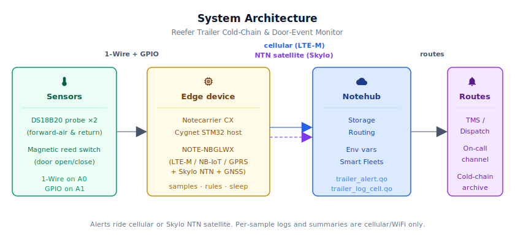
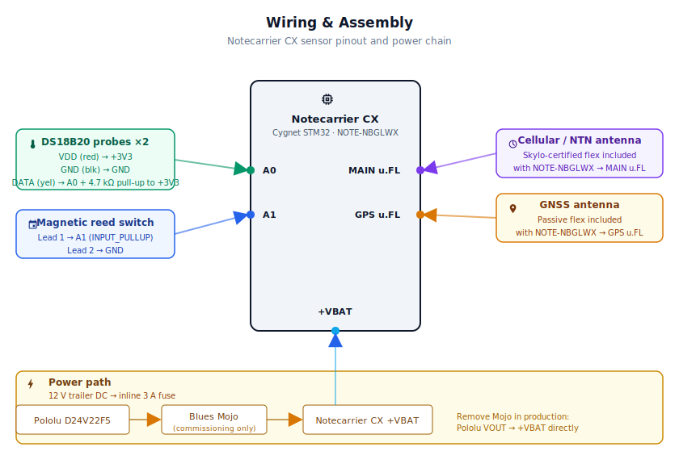
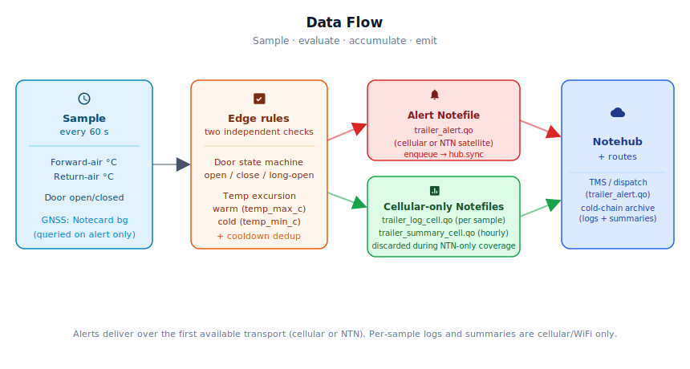

# Reefer Trailer Cold-Chain & Door-Event Monitor

<Note>

This reference application is intended to provide inspiration and help you get started quickly. It uses specific hardware choices that may not match your own implementation. Focus on the sections most relevant to your use case. If you'd like to discuss your project and whether it's a good fit for Blues, [feel free to reach out](https://blues.com/landing-pages/accelerators-contact-us/?accelerator=Reefer%20Trailer%20Cold-Chain%20%26%20Door-Event%20Monitor).

</Note>

A [loss prevention](https://blues.com/loss-prevention/) reference design that keeps continuous watch over refrigerated (**reefer**) trailers — catching temperature excursions before a load is spoiled and logging every door event before a pallet walks out the back. Two DS18B20 temperature probes and a magnetic door reed switch feed a Blues Notecarrier CX, which packages sensor events and hands them to a Notecard for Skylo for multi-network delivery: cellular when a tower is in range, Skylo satellite when it isn't.

**What you'll have when you're done:** a weatherproof, trailer-powered monitor that samples cargo temperature every minute, queues each sample locally for Notehub delivery on the next outbound session (`trailer_log_cell.qo`, arriving in Notehub in batches — default once per hour), fires an alert on the next sample cycle (up to ~60 s after the event, plus network-establishment time) when a door opens or a temperature threshold is breached, and ships hourly compliance summaries to Notehub over cellular or WiFi. Per-sample logs and hourly summaries use non-NTN-compatible Notefiles (no compact format or port, `delete:true`); the Notecard discards their queued notes when connecting via NTN, so they never consume the bundled satellite data budget. On periodic hub sessions over NTN — which occur when terrestrial coverage is unavailable — only pending alert notes carry payload data over the satellite link.

**Energy footprint:** steady-state draw from a 12 V trailer supply is roughly 30–60 mAh per 24 h (dominated by one hourly cellular session of ~15–45 s at ~250 mA average). NTN satellite sessions consume more per event due to longer link establishment, but alert-only delivery over satellite keeps the 10 KB data budget intact. Commissioning validates actual consumption with [Blues Mojo](https://shop.blues.com/products/mojo?utm_source=dev-blues&utm_medium=web&utm_campaign=store-link) — see [§9](#8-validation-and-testing).

---

## 1. Project Overview

**The problem.** A refrigerated trailer hauling fresh produce, pharmaceuticals, or frozen food is one of the higher-value assets in ground transportation — a typical load runs $40,000 to $80,000 before you factor in the trailer itself. Two failure modes create most of the loss:

- **Temperature excursion.** A reefer unit that loses refrigerant, trips a setpoint, or runs out of fuel can warm a frozen or fresh cargo hold into the danger zone. The spoilage is often discovered only at delivery, too late to re-route the load. Catching the excursion within the first hour — while options still exist — is the difference between a salvaged load and a write-off.
- **Door theft.** Drop-stop cargo theft is systematic: a thief follows a trailer to a fuel stop or rest area, opens the rear doors, and removes full pallets in minutes. The most reliable early indicator is a door opening at an unexpected location or time.

Both failure modes have a common root: nobody can see inside the trailer while it's moving.

**Scope note.** This design uses direct temperature-probe and door-switch input signals only — no OEM reefer unit or tractor integration, no J1939 CAN, no proprietary reefer telemetry (Carrier DataLink, Thermo King DSR, etc.). It is a point-instrumentation retrofit suitable for fleets with heterogeneous reefer makes and models where a universal, non-invasive monitor is preferred.

**Why Notecard for Skylo.** A trailer is mobile by definition, and its connectivity environment changes constantly. Urban routes have dense cellular coverage. Rural interstates may have significant gaps. Cross-border hauls hand off between carrier networks. Ocean-facing port staging areas can be outside terrestrial coverage entirely. A fixed cellular SIM solves the urban case but silently drops offline everywhere else — exactly when unsupervised, high-value loads are most exposed.

The [Notecard for Skylo (NOTE-NBGLWX)](https://shop.blues.com/products/notecard?utm_source=dev-blues&utm_medium=web&utm_campaign=store-link) — see the [datasheet](https://dev.blues.io/datasheets/notecard-datasheet/note-nbglwx/) — addresses this in a single 30 × 42 mm module: LTE-M, NB-IoT, and GPRS for terrestrial cellular, Skylo **NTN** (non-terrestrial network) satellite as an automatic fallback, and WiFi via an onboard antenna. The firmware enables this multi-RAT behavior with a single one-time [`card.transport`](https://dev.blues.io/api-reference/notecard-api/card-requests/#card-transport) request (`method:"wifi-cell-ntn"`); from then on the Notecard manages network selection itself, and the application never needs to know which radio carried a given message. An alert triggered by a door opening at a rural rest stop will use cellular if a tower is within range and satellite if it isn't — with no radio-selection logic required in the application. For a mobile asset that can't self-select its coverage environment, this multi-RAT (radio access technology) automatic failover is the whole value proposition.

**Deployment scenario.** The electronics mount in a weatherproof NEMA 4X enclosure strapped or screwed to the interior trailer wall or exterior chassis rail, powered from the trailer's 12 V DC supply (or the nose-box connector if available). Two DS18B20 stainless steel probes thread through grommets into the cargo compartment — one near the front (forward air) and one near the rear return-air panel — and the reed switch mounts on the door frame with its matching magnet on the door itself.

---

## 2. System Architecture



**Device-side responsibilities.** The onboard Cygnet STM32 host on the [Notecarrier CX](https://dev.blues.io/datasheets/notecarrier-datasheet/notecarrier-cx-v1-3/) reads both DS18B20 probes and the door pin every 60 s, evaluates threshold rules locally, and manages its own sleep between samples using [`card.attn`](https://dev.blues.io/api-reference/notecard-api/card-requests/#card-attn). Notes travel from the host to the Notecard over I²C. Because the host MCU is powered off between samples by `card.attn`, state (temperature accumulation, door open/close timestamp, alert deduplication epoch) is serialized into Notecard flash via `NotePayloadSaveAndSleep` and restored on each wake via `NotePayloadRetrieveAfterSleep`.

**Notecard responsibilities.** The Notecard for Skylo stores [Notes](https://dev.blues.io/api-reference/glossary/#note) locally in its on-device queue, runs the WiFi → cellular → NTN fallback policy configured at first boot via [`card.transport`](https://dev.blues.io/api-reference/notecard-api/card-requests/#card-transport) (`method:"wifi-cell-ntn"`), establishes a session on the configured [`hub.set`](https://dev.blues.io/api-reference/notecard-api/hub-requests/#hub-set) `outbound` cadence (default 60 min), and flushes enqueued alert notes immediately when the host issues a [`hub.sync`](https://dev.blues.io/api-reference/notecard-api/hub-requests/#hub-sync) request via whatever network is available. The Notecard also handles [environment-variable](https://dev.blues.io/guides-and-tutorials/notecard-guides/understanding-environment-variables/) distribution so operators can retune thresholds without a reflash. The Notecard for Skylo has an integrated GNSS radio; this firmware configures it in [`card.location.mode`](https://dev.blues.io/api-reference/notecard-api/card-requests/#card-location-mode) `periodic` mode (600-second interval; per the API docs, `periodic` mode samples location only when the Notecard detects motion) so every `trailer_alert.qo` carries the last known latitude and longitude — geo-stamping each door event and temperature excursion to answer "where was this trailer when the alert fired?"

**Notehub responsibilities.** The Notecard manages its own cellular and satellite sessions. [Notehub](https://notehub.io) ingests events over the Internet, stores every event, and applies project-level [routes](https://dev.blues.io/notehub/notehub-walkthrough/#routing-data-with-notehub). Alerts, per-sample logs, and summaries land in separate [Notefiles](https://dev.blues.io/api-reference/glossary/#notefile) so they can be fanned out to different downstream destinations at different urgencies — immediate dispatch alerts to a TMS or on-call channel, per-sample logs and hourly summaries to a long-term cold-chain compliance store. Alert events always appear in `trailer_alert.qo` regardless of which radio carried them; the compact+port encoding is compatible with both cellular and NTN transports, and Notehub session metadata attached to each received event identifies the transport used. [Smart Fleets](https://dev.blues.io/notehub/notehub-walkthrough/#using-smart-fleet-rules) let you group trailers by lane, customer, or cargo type and push fleet-specific threshold overrides without touching individual device configs.

**Routing to the cloud (high level).** Notehub supports HTTP, MQTT, AWS, Azure, GCP, Snowflake, and other destinations; route setup is project-specific. See the [Notehub routing docs](https://dev.blues.io/notehub/notehub-walkthrough/#routing-data-with-notehub) — this project ships no specific downstream endpoint.

---

## 3. Technical Summary

1. **Notehub** — create a [Notehub project](https://notehub.io) and copy its ProductUID.
2. **Wire the bench rig** — Notecarrier CX + Notecard for Skylo + two DS18B20 probes (VDD to +3V3, GND to GND, data to A0 with 4.7 kΩ pull-up to +3V3) + reed switch on A1. Full pinout in [§5](#4-wiring-and-assembly).
3. **Edit one line** of [`firmware/reefer_cold_chain_monitor/reefer_cold_chain_monitor_helpers.h`](firmware/reefer_cold_chain_monitor/reefer_cold_chain_monitor_helpers.h) — set `PRODUCT_UID` to your project's value.
4. **Flash with arduino-cli**:
   ```bash
   # Install libraries: Notecard, OneWire, DallasTemperature (via Arduino Library Manager)
   # Find your Cygnet FQBN
   arduino-cli board listall | grep -i cygnet
   # Output will resemble: Cygnet    STMicroelectronics:stm32:Blues:pnum=CYGNET
   
   # Compile and upload (substitute your FQBN and port)
   arduino-cli compile -b STMicroelectronics:stm32:Blues:pnum=CYGNET firmware/reefer_cold_chain_monitor/
   arduino-cli upload -b STMicroelectronics:stm32:Blues:pnum=CYGNET -p /dev/cu.usbmodem* firmware/reefer_cold_chain_monitor/
   ```
   See [§6.1](#61-installing-and-flashing) for full dependency list and IDE steps.
5. **Watch** — open Notehub → your project → **Events**. You should see `_session.qo` within 1 min, then on the next outbound window (default ~60 min): batch of `trailer_log_cell.qo` notes (one per 60 s sample), `trailer_summary_cell.qo` (hourly), and any alerts as `trailer_alert.qo` (immediate sync).


Here is a sample Note this device emits:
```json
{ "t1_c": -1.4, "t2_c": -0.8, "door_open": false }
```
---

## 4. Hardware Requirements

| Part | Qty | Rationale |
|------|-----|-----------|
| [Notecarrier CX](https://shop.blues.com/products/notecarrier-cx?utm_source=dev-blues&utm_medium=web&utm_campaign=store-link) | 1 | Integrated carrier with an embedded Cygnet STM32 host — no separate MCU board needed. Supports `card.attn` power gating for deep-sleep between samples. See the [datasheet](https://dev.blues.io/datasheets/notecarrier-datasheet/notecarrier-cx-v1-3/). |
| [Notecard for Skylo (NOTE-NBGLWX)](https://shop.blues.com/products/notecard?utm_source=dev-blues&utm_medium=web&utm_campaign=store-link) | 1 | Cellular (LTE-M / NB-IoT / GPRS) + Skylo NTN satellite module with built-in GNSS and onboard WiFi antenna (Quectel BG95-S5 cellular/satellite modem + Silicon Labs WFM200S WiFi). Automatic network selection requires no firmware changes. Bundles 500 MB cellular data + 10 KB satellite data over 10 years with no activation fees. See the [datasheet](https://dev.blues.io/datasheets/notecard-datasheet/note-nbglwx/). |
| [Blues Mojo](https://shop.blues.com/products/mojo?utm_source=dev-blues&utm_medium=web&utm_campaign=store-link) | 1 | Coulomb counter on the power rail. Required during commissioning and validation for ground-truth energy measurement (see [§9](#8-validation-and-testing)). Remove Mojo and the Qwiic cable before production deployment — the inline current draw and quiescent load are not needed in the field. See the [datasheet](https://dev.blues.io/datasheets/mojo-datasheet/). |
| [Adafruit DS18B20 Waterproof Temperature Sensor](https://www.adafruit.com/product/381) (#381) | 2 | 1-Wire stainless-steel probe; −55 °C to +125 °C range; ±0.5 °C from −10 °C to +85 °C; includes a 4.7 kΩ pull-up resistor. One probe near the front evaporator; one near the rear return-air panel. |
| [Adafruit Magnetic Contact Switch](https://www.adafruit.com/product/375) (#375) | 1 | Normally-open reed switch in a plastic housing. Activates within 15 mm of its matching magnet. Mounts on the door frame; magnet on the door leaf. |
| [Pololu D24V22F5 5 V Step-Down Regulator](https://www.pololu.com/product/2858) (#2858) | 1 | 5.3–36 V input, 5 V / 2.5 A output. Converts trailer 12 V DC (or nose-box 12 V) to 5 V for the Notecarrier CX. Compact and efficient (85–95%). |
| NEMA 4X enclosure, ~6 × 4 × 2 in | 1 | Weatherproof housing rated for wash-down and condensation — appropriate for the interior of a reefer trailer. |
| Skylo-certified cellular / NTN flexible antenna — **included with NOTE-NBGLWX** | 1 | Ships in the NOTE-NBGLWX kit; connects to the Notecard `MAIN` u.FL port. Covers LTE-M / NB-IoT / GPRS cellular and Skylo S-Band / L-Band NTN (B23, B255, B256). **Must not be substituted.** Using any other antenna on the `MAIN` port decertifies the device on Skylo's network and may result in the device being blocked. If a different antenna is required for a production design, a delta EIRP test report from a CTIA/OTA-authorized lab is needed — see the [Blues Antenna Guide](https://dev.blues.io/datasheets/application-notes/antenna-guide/) for the full certification policy. Route the included flexible antenna cable through a sealed IP68 cable gland in the NEMA 4X enclosure wall so the antenna sits outside the metal structure. |
| Passive GPS/GNSS flexible antenna — **included with NOTE-NBGLWX** | 1 | Ships in the NOTE-NBGLWX kit; connects to the Notecard `GPS` u.FL port. Covers GPS/GNSS L1 (1559–1610 MHz). Route the cable through a sealed cable gland to the exterior of the NEMA 4X enclosure with a clear, unobstructed sky view — mount the antenna on the trailer roof or exterior wall, away from the refrigeration unit. A replacement u.FL passive GNSS antenna (e.g., the [Blues accessories Quectel YCA001BA](https://shop.blues.com/collections/accessories), covering 1560–1620 MHz, u.FL) is compatible if the included antenna is damaged. |
| Sealed IP68 cable gland, M16, for the antenna cables | 2 | One per antenna cable (MAIN and GPS), routed through the NEMA 4X enclosure wall. Maintains the IP/NEMA rating after the antenna cables are passed through. Use a gland sized for the cable diameter of the included antenna pigtails (typically ~3–4 mm). |
| 2-conductor stranded wire, 22 AWG, ~3 m | 1 | Extends the door sensor cable from the door frame to the enclosure. Standard alarm wire. |
| Inline ATO/ATC blade fuse holder, 12–16 AWG leads | 1 | Installs inline on the trailer 12 V positive feed between the trailer source and the Pololu D24V22F5 `VIN`. Keeps overcurrent protection as close to the source as practical, per the field installation caution in [§5](#4-wiring-and-assembly). Any automotive-grade in-line ATO/ATC holder with lead wire gauge matched to the supply run is acceptable. |
| 3 A ATO/ATC automotive blade fuse | 1 | Fits the inline fuse holder above. Sized for the Pololu D24V22F5's 2.5 A rated output with wiring headroom. Use only 3 A — do not substitute a higher-rated fuse; a blown fuse indicates a wiring fault that must be corrected before replacing it. |

All Blues hardware ships with an active SIM; no separate SIM purchase or activation is required.

---

## 5. Wiring and Assembly



All host I/O lands on the [Notecarrier CX](https://dev.blues.io/datasheets/notecarrier-datasheet/notecarrier-cx-v1-3/) dual 16-pin header. The Notecard for Skylo seats into the M.2 slot; cellular, satellite, and GNSS antennas connect via u.FL leads to externally-mounted antennas. If bench-validating with the Mojo, it sits inline between the 5 V supply and the Notecarrier's `+VBAT` pad, reporting cumulative mAh to the Notecard over Qwiic (I²C).

**Power (production — no Mojo):**
- Pololu D24V22F5 `VIN` → inline fuse holder (3 A ATO blade fuse fitted; see BOM) → trailer 12 V DC positive. Mount the fuse holder on the positive lead as close to the 12 V source as practical — see the field installation caution below.
- Pololu `GND` → trailer chassis GND (circuit ground reference for the entire system)
- Pololu `VOUT` (+5 V) → Notecarrier CX `+VBAT`
- Pololu `GND` → Notecarrier CX `GND` (power-return path; must share the same chassis ground as the input side)

**Power (bench validation — with Mojo inline):**
- Pololu `VIN` → bench 12 V supply positive
- Pololu `GND` → bench supply GND (circuit ground reference)
- Pololu `VOUT` (+5 V) → Mojo `BAT`
- Mojo `LOAD` → Notecarrier CX `+VBAT`
- Pololu `GND` → Mojo `GND` → Notecarrier CX `GND` (shared ground throughout the power chain)
- Mojo Qwiic → Notecarrier CX Qwiic — I²C telemetry connection for bench energy measurement only; remove Mojo and the Qwiic cable in production

**DS18B20 temperature probes (1-Wire bus on A0):**
- Both probe `VDD` (red) wires → Notecarrier CX `+3V3`
- Both probe `GND` (black) wires → Notecarrier CX `GND`
- Both probe data (yellow) wires → Notecarrier CX `A0`
- Notecarrier CX `+3V3` → 4.7 kΩ resistor (included in Adafruit #381 bag) → Notecarrier CX `A0` (pull-up)

> **Probe order.** `getTempCByIndex(0)` returns whichever probe the library enumerates first at startup. To match index to physical location, power up with only one probe connected, note its reported temperature, label it, then connect the second. This is a one-time bench step.

**Door reed switch (A1):**
- Adafruit #375 lead 1 → Notecarrier CX `A1`
- Adafruit #375 lead 2 → Notecarrier CX `GND`
- Firmware uses `INPUT_PULLUP` on A1; no external resistor needed.

> **Polarity:** The Adafruit #375 is a normally-open (NO) switch — the circuit is open when no magnet is present. Mount the plastic housing on the **stationary door frame** and the magnet on the **moving door**. When the door closes and the magnet approaches, the circuit closes and pulls `A1` LOW. When the door opens, the circuit opens and `A1` goes HIGH via the pull-up. The firmware interprets `HIGH = door open`.

**Door sensor cable extension:** The #375 ships with a 29 cm (≈ 11 in) pigtail. Splice 22 AWG 2-conductor wire at the sensor housing terminals to run from the door frame to the enclosure, keeping the join inside a weatherproof connector (e.g., a gel-filled butt splice).

**Antennas:**
- Notecard `MAIN` u.FL → included Skylo-certified flexible antenna cable → through sealed IP68 cable gland in enclosure wall → antenna positioned outside with clear sky view
- Notecard `GPS` u.FL → included passive GPS flexible antenna cable → through sealed IP68 cable gland in enclosure wall → antenna positioned outside with clear sky view (trailer roof or exterior wall, away from the refrigeration unit)

> **Antenna placement.** Both antennas must be outside the metal enclosure and any steel trailer structure — cellular, NTN, and GNSS signals attenuate severely through steel. Keep the GNSS antenna at least 20 cm from the cellular/NTN antenna and from reefer unit motors or inverters to avoid desensitisation. Seat all u.FL connectors firmly before routing cables — they are fragile push-on connectors. Route antenna cables through the IP68 cable glands before sealing; avoid sharp bends and maintain at least 11 mm clearance around each antenna.
>
> **Skylo antenna substitution.** The `MAIN` port antenna must be the Skylo-certified flexible antenna included with the NOTE-NBGLWX. Connecting any substitute antenna — including a seemingly equivalent cellular/NTN whip — decertifies the device on Skylo's network and Skylo may block it from the NTN service. If a different antenna is required for a custom enclosure or mounting scenario, contact [Blues](https://blues.com/contact-sales/) about the delta EIRP certification process before deployment.

> **Field installation caution.** Tap the 12 V feed from a dedicated trailer accessory circuit and fit a 3 A automotive blade fuse as close to the source as practical — do not wire directly to the battery without overcurrent protection. Route all sensor and power cables away from refrigerant lines, the reefer unit wiring harness, and OEM trailer wiring; do not share conduit with high-current circuits. Avoid penetrating insulated trailer panels where possible — route cables through existing grommets or approved bulkhead fittings to preserve the trailer's thermal envelope. Any non-OEM penetrations must be sealed with closed-cell foam tape and recorded in the trailer maintenance log.

---

## 6. Notehub Setup

1. **Create a project.** Sign up at [notehub.io](https://notehub.io) and [create a project](https://dev.blues.io/quickstart/notecard-quickstart/notecard-and-notecarrier-pi/#set-up-notehub). Copy the [ProductUID](https://dev.blues.io/notehub/notehub-walkthrough/#finding-a-productuid) — it looks like `com.your-company.your-name:reefer-monitor`.

2. **Set the ProductUID in firmware.** Open [`reefer_cold_chain_monitor_helpers.h`](firmware/reefer_cold_chain_monitor/reefer_cold_chain_monitor_helpers.h) and replace the empty string on the `#define PRODUCT_UID ""` line with your value.

3. **Claim the Notecard.** Power the assembled unit. On first cellular (or satellite) connect the Notecard associates with your Notehub project automatically — the device appears in your project's **Devices** tab within a minute or two.

4. **Create a Fleet per lane or customer.** [Fleets](https://dev.blues.io/guides-and-tutorials/fleet-admin-guide/) group devices for shared configuration and routing. A natural division here is one fleet per cargo type (fresh, frozen, pharmaceutical) since temperature thresholds differ significantly between them. [Smart Fleets](https://dev.blues.io/notehub/notehub-walkthrough/#using-smart-fleet-rules) can auto-assign trailers based on properties already in Notehub.

5. **Set environment variables.** In Notehub web console: select your Fleet (or individual Device) → **Settings** → **Environment** tab. Type each variable name and value below. Changes take effect on the next inbound sync (default 120 min) — no reflash, no truck roll required.

   | Variable | Default | Valid range | Purpose |
   |---|---|---|---|
   | `temp_max_c` | `7.0` | −30.0 to 50.0 °C | Warm excursion threshold in °C. An alert with `alert:"temp_excursion"` fires when either probe exceeds this. 7 °C (45 °F) is a common fresh-produce limit; frozen loads typically use −15 °C (5 °F). Values outside the range are silently ignored and the current value is kept. |
   | `temp_min_c` | `-25.0` | −60.0 to 20.0 °C | Cold / freeze protection threshold. An alert with `alert:"temp_cold"` fires when either probe drops below this. Useful for loads with a minimum-temperature requirement (e.g., live plants, some vaccines). Values outside the range, or a value ≥ `temp_max_c`, are silently ignored. |
   | `door_alert_sec` | `600` | 30–86400 s | Seconds the door can remain open before a `door_open_long` reminder fires. Default is 10 minutes — typical for a legitimate delivery stop. |
   | `sample_interval_sec` | `60` | 10–3600 s | Seconds between sensor samples and host sleep cycles. |
   | `summary_interval_min` | `60` | 1–1440 min | Minutes between `trailer_summary_cell.qo` notes. Changing this also re-applies `hub.set outbound` so the Notecard's sync cadence tracks the new value. |
   | `alert_cooldown_sec` | `1800` | 60–86400 s | Global minimum seconds between any two temperature alerts, regardless of probe or excursion type. The firmware maintains a single `last_temp_alert_epoch` shared by all probes and alert types — a warm-excursion alert from probe 1 resets the same timer that would suppress a subsequent cold-excursion from probe 2. Prevents alert storms during slow-drift excursions; 30 minutes is a reasonable floor for operational response time. |

6. **Configure routes.** Add [routes](https://dev.blues.io/notehub/notehub-walkthrough/#routing-data-with-notehub) for the following Notefiles:
   - `trailer_alert.qo` — alert event (door state change, temperature excursion). Delivered over the first available transport; the Notecard automatically selects cellular when in range and NTN satellite as a fallback. Route to your TMS, dispatch system, or on-call channel for real-time delivery. Transport information (cellular vs. satellite) is available in Notehub session metadata for each event.
   - `trailer_log_cell.qo` — per-sample record written every `sample_interval_sec` (default 60 s): both probe temperatures and door state. Cellular/WiFi only; never transmitted over NTN. Route to a cold-chain compliance archive or long-term data store. Gaps in this file during NTN-only coverage are expected — see §10.
   - `trailer_summary_cell.qo` — hourly compliance summary (mean/min/max per probe, door event count, current door state). Cellular/WiFi only. Route to the same cold-chain compliance destination as `trailer_log_cell.qo`.

   Separating alerts from log and summary data means routes can be configured at different urgency levels without filter logic on either end.

### What you should see in Notehub

- **`_session.qo`** — Notecard housekeeping; one per cellular or satellite session. The presence of these events confirms the radio is reaching Notehub.
- **`trailer_log_cell.qo`** — one note queued per `sample_interval_sec` (default every 60 s), cellular/WiFi only. Notes arrive in Notehub in batches on each outbound session (default 60 min — expect up to 60 notes per delivery). Sample body:
  ```json
  { "t1_c": -1.4, "t2_c": -0.8, "door_open": false }
  ```
  Temperature fields showing `−127` mean the corresponding probe was not responding at the time of that sample. Gaps in this file during extended NTN-only coverage are expected; per-sample records resume once terrestrial connectivity returns.
- **`trailer_summary_cell.qo`** — one per `summary_interval_min` (default hourly), cellular/WiFi only. Gaps in this file during extended NTN-only coverage are expected; summary notes queued while NTN is the active transport are discarded at sync time (same `delete:true` mechanism as `trailer_log_cell.qo`) and are not retained for later terrestrial upload. Sample body:
  ```json
  {
    "t1_c": -1.4,
    "t2_c": -0.8,
    "t1_min_c": -2.1,
    "t1_max_c": -0.9,
    "t2_min_c": -1.6,
    "t2_max_c": -0.3,
    "door_events": 2,
    "door_open": false
  }
  ```
  A temperature field showing `−127` means the probe was not responding. In a summary note this means no valid samples were recorded across the entire window; the same `−127` sentinel is used consistently in alert notes when a probe fails to respond at the moment the alert fires. Treat `−127` as a sensor-fault flag in both note types — never as a temperature near absolute zero.
- **`trailer_alert.qo`** — generated on the next sample cycle after a threshold trip or door event occurs; transmitted immediately via `hub.sync` so the Notecard does not wait for the next outbound window. Delivered over the first available transport — cellular when in range, NTN satellite as fallback. Sample bodies:
  ```json
  { "alert": "temp_excursion", "t1_c": 9.2,  "t2_c": 8.7,  "door_open": true,  "door_open_sec": 0,   "lat": 41.8781, "lon": -87.6298 }
  { "alert": "door_open",      "t1_c": -1.4, "t2_c": -0.8, "door_open": true,  "door_open_sec": 0,   "lat": 41.8781, "lon": -87.6298 }
  { "alert": "door_close",     "t1_c": -1.4, "t2_c": -0.8, "door_open": false, "door_open_sec": 387, "lat": 41.8781, "lon": -87.6298 }
  ```
  `lat` and `lon` carry the last known GNSS fix at the moment the alert fired. Both fields are `0.0` when no fix has been acquired yet (e.g., first power-on with the GNSS antenna not yet having a clear sky view); treat `lat == 0.0 && lon == 0.0` as a no-fix sentinel in downstream analytics.

---

## 7. Firmware Design

The firmware spans three files: [`reefer_cold_chain_monitor.ino`](firmware/reefer_cold_chain_monitor/reefer_cold_chain_monitor.ino) contains `setup()`, `loop()`, and the top-level sample-cycle driver; [`reefer_cold_chain_monitor_helpers.h`](firmware/reefer_cold_chain_monitor/reefer_cold_chain_monitor_helpers.h) defines constants, `AppState`, clamp helpers, and function prototypes; and [`reefer_cold_chain_monitor_helpers.cpp`](firmware/reefer_cold_chain_monitor/reefer_cold_chain_monitor_helpers.cpp) implements sensor drivers, the door and temperature state machines, and all Notecard communication.

### 6.1 Installing and flashing

**Dependencies:**

- **Arduino core for STM32** — [`stm32duino/Arduino_Core_STM32`](https://github.com/stm32duino/Arduino_Core_STM32). Add the index URL `https://github.com/stm32duino/BoardManagerFiles/raw/main/package_stmicroelectronics_index.json` under **File → Preferences → Additional Boards Manager URLs**, then install via Boards Manager (search "STM32 MCU based boards"). Select the **Cygnet** board (search for "Cygnet" in the board selector; it appears under the Blues board family in the current stm32duino core).
- **`Blues Wireless Notecard`** library — [`note-arduino`](https://github.com/blues/note-arduino). Install via Arduino Library Manager: `arduino-cli lib install "Blues Wireless Notecard"`, or search for `Blues Wireless Notecard` in the IDE Library Manager and install the latest stable version. Check the [note-arduino releases](https://github.com/blues/note-arduino/releases) page for the current stable release.
- **`OneWire`** — [`PaulStoffregen/OneWire`](https://github.com/PaulStoffregen/OneWire). Install via Library Manager.
- **`DallasTemperature`** — [`milesburton/Arduino-Temperature-Control-Library`](https://github.com/milesburton/Arduino-Temperature-Control-Library). Install via Library Manager.

**Flashing — Arduino IDE:** open `reefer_cold_chain_monitor.ino`, select the **Cygnet** board (search for "Cygnet" in the Boards Manager selector — it appears under the Blues board family in the current stm32duino core), and hit **Upload**.

**Flashing — `arduino-cli`:**
```bash
# Find the exact FQBN for your installed core version (the name varies by stm32duino release)
arduino-cli board listall | grep -i cygnet
# Expected output on current stm32duino core:
#   Cygnet    STMicroelectronics:stm32:Blues:pnum=CYGNET

# Compile and upload — substitute the FQBN reported by the command above if it differs
arduino-cli compile -b STMicroelectronics:stm32:Blues:pnum=CYGNET \
                    firmware/reefer_cold_chain_monitor/
arduino-cli upload  -b STMicroelectronics:stm32:Blues:pnum=CYGNET \
                    -p /dev/cu.usbmodem* firmware/reefer_cold_chain_monitor/
```

The exact FQBN is whatever the current `stm32duino` core ships for the Cygnet variant — the `board listall` command above is the authoritative source for your specific core version. Replace `/dev/cu.usbmodem*` with your actual port (`COMx` on Windows, `/dev/ttyACM*` on Linux). Open the serial monitor at **115200 baud** to watch `[boot]`, `[sensor]`, `[door]`, `[temp]`, `[summary]`, and `[alert]` log lines.

### 6.2 Template format codes (compact encoding)

The alert Notefile uses [compact format](https://dev.blues.io/notecard/notecard-walkthrough/low-bandwidth-design/#working-with-note-templates) — binary-encoded fields with fixed width to minimize satellite data consumption. Field types are named in the `note.template` request: `TFLOAT32` (4-byte IEEE-754), `TINT16` (2-byte signed), `TUINT32` (4-byte unsigned), `TBOOL` (boolean). These appear in the code as numeric constants: `14.1` = `TFLOAT32`, `12` = `TINT16`, `24` = `TUINT32`. The alert Notefile's compact+port encoding omits the standard JSON envelope and delivers only the declared body fields as binary records — critical for the 10 KB satellite data budget. The same format is fully supported on cellular; no special firmware handling needed.

### 6.3 Modules

| Responsibility | Function |
|---|---|
| First-boot Notecard config (`hub.set`, `card.transport`, `card.location.mode`) | `hubConfigure` |
| Re-sync `hub.set` outbound when summary interval changes | `applyHubSetIfChanged` |
| Compact Note template definition | `defineTemplates` |
| Environment-variable refresh (each wake) | `fetchEnvOverrides` |
| DS18B20 temperature reading (1-Wire) | `readTemperatures` |
| Door reed switch reading | `readDoorState` |
| Door open/close/long-open state machine | `checkDoorEvents` |
| Temperature excursion detection + dedup | `checkTemperatureExcursion` |
| Rolling window accumulation | `accumulateSummary` |
| Hourly summary note | `sendSummary` |
| Immediate-sync alert note | `sendAlert` |
| Epoch time from Notecard RTC | `getEpochTime` |
| State persist/restore | `NotePayloadSaveAndSleep` / `NotePayloadRetrieveAfterSleep` |

### 6.4 Sensor reading strategy

**DS18B20 probes.** Both sensors share the single 1-Wire bus on A0. `probes.requestTemperatures()` issues a simultaneous conversion to both sensors and blocks ~750 ms at 12-bit resolution (0.0625 °C steps). `getTempCByIndex(0)` and `getTempCByIndex(1)` return the two readings. The DallasTemperature library returns `DEVICE_DISCONNECTED_C` (−127 °C) for any probe that fails to respond; the firmware treats readings below `TEMP_INVALID + 1.0` as invalid and excludes them from summary averages without affecting the other probe's accumulation.

**Door reed switch.** A simple `digitalRead(DOOR_PIN)` per sample. The Adafruit #375 is a normally-open switch; with `INPUT_PULLUP` and the switch between `A1` and `GND`, a closed door reads LOW and an open door reads HIGH. Instantaneous reads are appropriate here because a real trailer door remains in each state for seconds to minutes.

### 6.5 Event payload design

Three [template-backed](https://dev.blues.io/notecard/notecard-walkthrough/low-bandwidth-design/#working-with-note-templates) Notefiles hold the data produced by the firmware. The alert Notefile (`trailer_alert.qo`) uses [compact format](https://dev.blues.io/notecard/notecard-walkthrough/low-bandwidth-design/#working-with-note-templates) with a port assignment — compact encoding omits the standard Note metadata envelope and stores only declared body fields as fixed-length binary records, which is critical for the 10 KB satellite data budget, and a port number is required for NTN (satellite) mode. Compact+port is also fully supported on cellular, so the same Notefile is delivered correctly over either transport. The cellular/WiFi-only Notefiles (`trailer_log_cell.qo` and `trailer_summary_cell.qo`) are template-backed for consistent schema enforcement but use standard JSON encoding without a port, and carry `delete:true`. Per the [Blues Satellite Best Practices](https://dev.blues.io/starnote/satellite-best-practices/) documentation, a non-NTN-compatible Notefile template (no `format` or `port`) with `delete:true` causes the Notecard to discard its queued notes at sync time when NTN is the active transport — so these Notefiles are never transmitted over satellite and do not consume the bundled satellite data budget. (The `_cell` suffix in these Notefile names denotes terrestrial transport — they are never transmitted over NTN.)

**`trailer_log_cell.qo` — per-sample, queued, cellular/WiFi only:**
```json
{ "t1_c": -1.4, "t2_c": -0.8, "door_open": false }
```

**`trailer_summary_cell.qo` — hourly, queued, cellular/WiFi only:**
```json
{
  "t1_c": -1.4,
  "t2_c": -0.8,
  "t1_min_c": -2.1, "t1_max_c": -0.9,
  "t2_min_c": -1.6, "t2_max_c": -0.3,
  "door_events": 2,
  "door_open": false
}
```

**`trailer_alert.qo` — immediate, enqueued then `hub.sync`, cellular or NTN transport:**
```json
{
  "alert": "temp_excursion",
  "t1_c": 9.2, "t2_c": 8.7,
  "door_open": true,
  "door_open_sec": 0,
  "lat": 41.8781, "lon": -87.6298
}
```

On every alert the firmware enqueues the alert Notefile (without `sync:true`) and then issues a `hub.sync` request to wake the radio. Decoupling the sync trigger from the enqueue avoids a race where `sync:true` on the `note.add` could trigger a sync before the note is fully committed. The Notecard selects cellular when in range and falls back to NTN satellite otherwise — no radio-selection logic required in the firmware.

Alert type values: `door_open` (door just opened), `door_close` (door just closed; `door_open_sec` carries the open duration), `door_open_long` (door still open past `door_alert_sec`), `temp_excursion` (probe above `temp_max_c`), `temp_cold` (probe below `temp_min_c`).

The `door_open_sec` field is `TUINT32` (4-byte unsigned integer) in the template, supporting door-open durations up to ~136 years. A probe that fails to respond appears as `−127` in the temperature fields of any note type — `trailer_log_cell.qo`, `trailer_summary_cell.qo`, and `trailer_alert.qo` alike — and should be treated as a sensor-fault flag, not a real temperature. Door-event alerts (`door_open`, `door_close`, `door_open_long`) include the live probe readings sampled at the moment the alert fires, so `−127` in a door alert means the probe was genuinely unresponsive at that instant, not that temperatures were intentionally omitted. `lat` and `lon` are `TFLOAT32` fields carrying the last GNSS fix; both are `0.0` when no fix is available — treat that pair as a no-fix sentinel.

### 6.6 Power and sync strategy

Even though the trailer has a 12 V supply, keeping the host MCU asleep between samples dramatically reduces heat in the enclosure and makes the firmware structure port cleanly to a battery-backed variant (Scoop or otherwise). After each sample cycle the host calls `NotePayloadSaveAndSleep`, a `note-arduino` helper that serializes the in-RAM `AppState` struct into Notecard flash and issues a [`card.attn`](https://dev.blues.io/api-reference/notecard-api/card-requests/#card-attn) sleep request to cut host power for `sample_interval_sec` seconds.

The Notecard itself idles at ~8–18 µA between sessions. Per-sample log notes and hourly summary notes accumulate in the Notecard's on-device queue and flush in a single outbound session. Door and temperature alerts are enqueued and then trigger a `hub.sync` request, which bypasses the outbound timer and wakes the radio immediately using whatever network is available — cellular if in range, NTN satellite otherwise.

Sampling and transmission are deliberately decoupled: sensors sample every 60 s, but the radio connects only once per hour (plus on-demand for alerts). The hourly session also pulls fresh environment variables on the inbound cadence (default 120 min). When cellular is unavailable and the Notecard uses NTN for a periodic session, `trailer_log_cell.qo` and `trailer_summary_cell.qo` notes are discarded at sync time — their non-NTN-compatible `delete:true` templates cause the Notecard to clear those queues rather than transmit over satellite — so only pending alert notes carry payload data over the satellite link. Session establishment overhead (Skylo protocol + housekeeping) still occurs on every NTN session regardless of alert payload.

### 6.7 Retry and error handling

- The first Notecard I²C transaction (in `hubConfigure`) uses `sendRequestWithRetry(req, 10)` to absorb the cold-boot race condition documented in the note-arduino library.
- `readTemperatures` excludes any probe returning `DEVICE_DISCONNECTED_C` from all accumulation. If both probes fail for the entire summary window, all six temperature fields in the summary carry the `−127` sentinel rather than a misleading mean-of-zero.
- `fetchEnvOverrides` silently skips missing variables and retains the current firmware default, so a Notehub project with no environment variables set is always valid.
- Alert deduplication: temperature alerts are rate-limited by `alert_cooldown_sec` (default 30 min) so a slow-drifting probe doesn't flood the downstream on-call channel.
- Door open-long reminder fires once per open event (`door_long_alert_sent` flag in persisted state). A door that stays open across multiple sleep cycles produces exactly one reminder, not one per sample.

### 6.8 Key code snippet 1: compact template definition

Templates registered at first boot make each Note a fixed-length binary record optimized for satellite transport. The `"compact"` format and `port` assignment on the alert Notefile satisfy NTN requirements and are also fully supported on cellular — the same file is delivered correctly over either transport. The cellular/WiFi-only Notefiles do not use compact format or a port, and carry `delete:true`: the Notecard discards queued notes from non-NTN-compatible Notefiles when NTN is the active transport at sync time (see [Blues Satellite Best Practices](https://dev.blues.io/starnote/satellite-best-practices/)).

```cpp
// Alert template (trailer_alert.qo) — compact + port, no delete:true
// Delivered over the first available transport (cellular or NTN satellite).
J *req = notecard.newRequest("note.template");
JAddStringToObject(req, "file",   "trailer_alert.qo");
JAddNumberToObject(req, "port",   51);
JAddStringToObject(req, "format", "compact");
// No delete:true — alert notes are never purged before a sync.
J *body = JAddObjectToObject(req, "body");
// Exemplar string sets the field width; use the longest alert value (14 chars).
JAddStringToObject(body, "alert",        "temp_excursion");
JAddNumberToObject(body, "t1_c",          TFLOAT32);
JAddNumberToObject(body, "t2_c",          TFLOAT32);
JAddBoolToObject(body,   "door_open",     TBOOL);
JAddNumberToObject(body, "door_open_sec", TUINT32);
JAddNumberToObject(body, "lat",           TFLOAT32);
JAddNumberToObject(body, "lon",           TFLOAT32);
notecard.sendRequest(req);

// Per-sample log template (trailer_log_cell.qo) — cellular/WiFi only
req  = notecard.newRequest("note.template");
JAddStringToObject(req, "file",   "trailer_log_cell.qo");
JAddBoolToObject(req,   "delete", true);   // non-NTN-compatible: discarded when NTN is active transport
body = JAddObjectToObject(req, "body");
JAddNumberToObject(body, "t1_c",      TFLOAT32);
JAddNumberToObject(body, "t2_c",      TFLOAT32);
JAddBoolToObject(body,   "door_open", TBOOL);
notecard.sendRequest(req);

// Hourly summary template (trailer_summary_cell.qo) — cellular/WiFi only
req  = notecard.newRequest("note.template");
JAddStringToObject(req, "file",   "trailer_summary_cell.qo");
JAddBoolToObject(req,   "delete", true);   // non-NTN-compatible: discarded when NTN is active transport
body = JAddObjectToObject(req, "body");
JAddNumberToObject(body, "t1_c",        TFLOAT32);
JAddNumberToObject(body, "t2_c",        TFLOAT32);
JAddNumberToObject(body, "t1_min_c",    TFLOAT32);
JAddNumberToObject(body, "t1_max_c",    TFLOAT32);
JAddNumberToObject(body, "t2_min_c",    TFLOAT32);
JAddNumberToObject(body, "t2_max_c",    TFLOAT32);
JAddNumberToObject(body, "door_events", TINT16);
JAddBoolToObject(body,   "door_open",   TBOOL);
notecard.sendRequest(req);
```

### 6.9 Key code snippet 2: immediate-sync alert

The alert Notefile is enqueued without `sync:true`; after the enqueue succeeds a `hub.sync` call wakes the radio immediately. On the NOTE-NBGLWX the Notecard selects cellular if in coverage and falls back to the Skylo satellite radio otherwise — the firmware never needs to know which. `getLocation()` reads the last GNSS fix so every alert is geo-stamped at the moment it fires.

`hub.sync` is treated as part of the critical alert path: `sendAlert()` checks the response for `NULL` and `responseError()`, and only returns `true` after the sync itself succeeds. If it fails, the pending-alert latch in `AppState` stays set and the next wake retries the sync (skipping the already-queued `note.add` call via the `done` flag).

```cpp
float lat = 0.0f, lon = 0.0f;
getLocation(lat, lon);          // last known fix; (0.0, 0.0) = no fix yet

// Step 1 — enqueue alert (no sync:true); compact+port works on cellular and NTN
J *req = notecard.newRequest("note.add");
JAddStringToObject(req, "file", "trailer_alert.qo");
J *body = JAddObjectToObject(req, "body");
JAddStringToObject(body, "alert",         "temp_excursion");
JAddNumberToObject(body, "t1_c",          (double)t1);
JAddNumberToObject(body, "t2_c",          (double)t2);
JAddBoolToObject(body,   "door_open",     s.door_open);
JAddNumberToObject(body, "door_open_sec", 0.0);
JAddNumberToObject(body, "lat",           (double)lat);
JAddNumberToObject(body, "lon",           (double)lon);
J *rsp = notecard.requestAndResponse(req);
if (rsp != NULL) {
    if (!notecard.responseError(rsp)) { done = true; }
    notecard.deleteResponse(rsp);
}

// Step 2 — trigger immediate sync once the note is enqueued
if (done) {
    req = notecard.newRequest("hub.sync");
    rsp = notecard.requestAndResponse(req);
    bool sync_ok = (rsp != NULL && !notecard.responseError(rsp));
    if (rsp != NULL) notecard.deleteResponse(rsp);
    // Returns true only when sync_ok: keeps pending-alert latch on failure
}
```

### 6.10 Key code snippet 3: state persistence and sleep

`NotePayloadSaveAndSleep` serializes `AppState` into Notecard flash and then issues `card.attn` to cut host power. On the next wake, `setup()` runs from cold and `NotePayloadRetrieveAfterSleep` restores the struct — door timestamps, accumulator sums, alert epochs, and all.

```cpp
NotePayloadDesc out = {};
NotePayloadAddSegment(&out, STATE_SEG_ID, &s, sizeof(s));
NotePayloadSaveAndSleep(&out, (int)g_sampleIntervalSec, NULL);
```

---

## 8. Data Flow



Every 60 s the firmware wakes, reads both temperature probes and the door pin, runs two independent checks (door state machine and temperature excursion), logs the raw sample, accumulates data into the rolling hourly window, and sleeps again. The two checks are independent: a door event and a simultaneous temperature excursion each produce their own alert.

**Measured each sample cycle (every 60 s):** forward-air temperature °C (probe 1), return-air temperature °C (probe 2), door state (open/closed). Every sample is individually logged to `trailer_log_cell.qo` (cellular/WiFi only; discarded when the Notecard connects via NTN). Readings also accumulate into a rolling hourly summary window (mean, min, max per probe). **GNSS position** is maintained autonomously by the Notecard in the background (`card.location.mode` `periodic`, 600-second interval, motion-gated); the host MCU does not query location on each sample cycle and instead reads the last known fix only when emitting an alert, so every alert is geo-stamped at event detection time without a per-sample GNSS query.

**Transmitted:**
- `trailer_alert.qo` — evaluated and queued during the next sample cycle (up to `sample_interval_sec` after the event, default 60 s); transmitted immediately via `hub.sync` (bypasses the outbound timer) on: door opens, door closes, door open past `door_alert_sec`, probe exceeds `temp_max_c`, probe drops below `temp_min_c`. Delivered over the first available transport (cellular preferred; NTN satellite fallback). Temperature alerts are rate-limited by `alert_cooldown_sec`.
- `trailer_log_cell.qo` — one note per sample cycle (default every 60 s), cellular/WiFi only, queued and shipped on the next outbound sync. Gaps expected during NTN-only coverage (see §10).
- `trailer_summary_cell.qo` — one note per `summary_interval_min` (default 60 min), cellular/WiFi only, queued and shipped on the next outbound sync. Contains mean, min, and max for each probe plus door-open count and current door state.

**Location.** `hubConfigure` calls [`card.location.mode`](https://dev.blues.io/api-reference/notecard-api/card-requests/#card-location-mode) with `mode:"periodic"` and `seconds:600`. The Notecard maintains location autonomously in the background — `periodic` mode samples at the configured interval only when the Notecard detects motion, so the GNSS radio activates roughly every 10 minutes while the trailer is moving and stays off while it is stationary. The host MCU does not poll `card.location` on each 60-second sample cycle; instead, `sendAlert` issues a single `card.location` request immediately before writing each alert Note, embedding the most recent fix as `lat`/`lon` fields. This means every alert is geo-stamped with the trailer's position at event-detection time without adding a GNSS query to the routine sample cycle. When no fix has been acquired yet (first power-on, GNSS antenna obstructed), both fields are `0.0`. The GNSS antenna must have an unobstructed sky view — mount it on the trailer roof or exterior wall, away from the refrigeration unit, per [§5](#4-wiring-and-assembly).

**Routing.** All three Notefiles land in Notehub. From there, routes fan them out to downstream systems. Typical pattern: `trailer_alert.qo` → TMS or messaging gateway (real-time dispatch); `trailer_log_cell.qo` and `trailer_summary_cell.qo` → cold-chain compliance database.

**Alert triggers** (appear in `trailer_alert.qo`; delivered over cellular or NTN satellite):
- `door_open` — door-closed-to-open transition detected. Immediate sync.
- `door_close` — door-open-to-closed transition; `door_open_sec` carries the open duration.
- `door_open_long` — door still open after `door_alert_sec` seconds (default 10 min). Fires once per open event.
- `temp_excursion` — either probe above `temp_max_c`. Subject to `alert_cooldown_sec` dedup.
- `temp_cold` — either probe below `temp_min_c`. Subject to `alert_cooldown_sec` dedup.

---

## 9. Validation and Testing

**Expected steady-state cadence.** On a healthy, closed, in-range trailer: `trailer_log_cell.qo` notes every 60 s (queued locally; arriving in Notehub on the hourly outbound session, up to 60 per batch), one `trailer_summary_cell.qo` per hour, zero alert events. The first batch of log notes arrives in Notehub at the first outbound session (default 60 min); alerts appear within one sample cycle (`sample_interval_sec`, default 60 s) of the event plus network-establishment time in `trailer_alert.qo`.

**Functional validation.** To confirm alert flow without waiting for a real excursion:
- **Temperature (warm-excursion path):** on a room-temperature bench the probes already read well above the 7 °C default, so the simplest reproducible test is to lower `temp_max_c` to 2–3 °C below the current probe reading (check the `[sensor]` lines in the serial output for the current value, then set the Fleet environment variable accordingly). The next sample cycle fires the `temp_excursion` alert without touching the probes. Restore `temp_max_c` to the operational value when done.
- **Temperature (cold-excursion path):** submerge one probe in an ice-water bath (~0 °C) and temporarily raise `temp_min_c` to `5.0` in the Fleet environment variables. The next inbound sync pulls the new value, and the next sample with the iced probe triggers a `temp_cold` alert. Restore `temp_min_c` to `-25.0` (or your operational value) after confirming the alert.
- **Door:** separate the door sensor magnet from the housing. A `door_open` alert should appear within the next sample cycle. Reconnect the magnet and verify `door_close` arrives with a non-zero `door_open_sec`.
- **Threshold tuning:** lower `temp_max_c` to `0.0` in the Fleet's environment variables; the next inbound sync pulls the new value, and the next sample cycle with any probe above 0 °C fires the alert.
- **Location:** confirm the GNSS antenna has a clear sky view outdoors. After at least one full `card.location.mode` fix interval (≤ 10 min on a moving or recently-moved unit), trigger a door or temperature alert and verify `lat` and `lon` are non-zero in the resulting `trailer_alert.qo` note body in Notehub. A `(0.0, 0.0)` pair means no fix has been acquired yet — allow more time or confirm the GPS antenna cable and connector are seated.

**Power validation with Mojo.** The Notecard for Skylo's published figures: ~8–18 µA idle (radio off between syncs); ~250 mA average with peaks approaching 2 A during cellular transmit; satellite sessions are similar in current envelope but longer in duration.

Place the [Mojo](https://dev.blues.io/datasheets/mojo-datasheet/) inline between the 5 V supply and the Notecarrier CX `+VBAT` pad. The expected trace in steady state:

| Phase | Expected current |
|---|---|
| Host + Notecard sleeping between samples | ~20–30 µA |
| Host awake (sensor reads + Notecard I²C) | ~5–15 mA for ~1–2 s per sample |
| Notecard cellular session (hourly) | ~250 mA average, 15–45 s |
| Notecard satellite session (NTN) | ~200–400 mA average, typically longer than LTE-M |

A useful bench target with defaults (60 s sample, 60 min summary, no alerts): roughly **30–60 mAh per 24 h** on cellular, dominated by the once-per-hour radio burst. Satellite-only operation will consume more per session due to longer link-establishment time.

> **Measurement scope.** Mojo sits on the 5 V output side of the Pololu regulator and measures only the downstream Notecarrier + Notecard draw at 5 V. Actual consumption from the 12 V trailer battery will be higher: the Pololu adds its own quiescent current and conversion losses (the D24V22F5 is rated 85–95 % efficient under load, and draws quiescent current even at no load). For installations where parked-trailer battery drain is a concern, complement Mojo's 5 V measurement with an upstream current measurement on the 12 V feed — or consider a step-down regulator with lower quiescent current if the unit will sit parked for extended periods.

Two anomaly patterns stand out immediately on a Mojo trace:
- **Host never sleeping:** flat 10–30 mA continuous baseline — almost always a `card.attn` power-gating regression (verify you're on a Notecarrier CX and that the ATTN signal path is intact).
- **Excessive hourly bursts:** each session runs 2–3 min instead of 15–45 s — usually weak signal or frequent satellite fallback (check antenna routing and site coverage).

Mojo is a **bench and commissioning tool**; production units don't require it.

---


A Notecarrier CX and a Notecard for Skylo pair with two DS18B20 probes and a magnetic reed switch to watch the two failure modes — temperature excursion and unauthorized door access — that drive most reefer trailer cargo loss. The firmware samples every minute, queues each raw sample locally for Notehub delivery on the next outbound session (`trailer_log_cell.qo`), fires an alert on the next sample cycle (up to ~60 s) when any threshold trips via whatever radio is available (`trailer_alert.qo`, delivered over cellular or NTN satellite automatically), and ships a compact hourly summary (`trailer_summary_cell.qo`) for compliance and trending. The cellular + satellite multi-RAT design means the monitor stays connected as the trailer moves from an urban distribution center through rural interstates to a port staging yard — without any network configuration, SIM swapping, or carrier negotiation required.

The same firmware structure is a natural starting point for pharmaceutical cold chain, cross-border intermodal containers, or any mobile insulated enclosure where a temperature log and a door audit trail have regulatory or financial weight.

---

## 10. Troubleshooting

---

## 11. Limitations and Next Steps

---

## 12. Summary