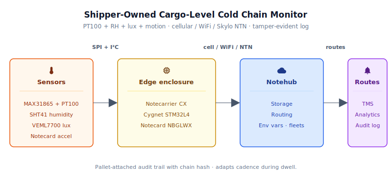
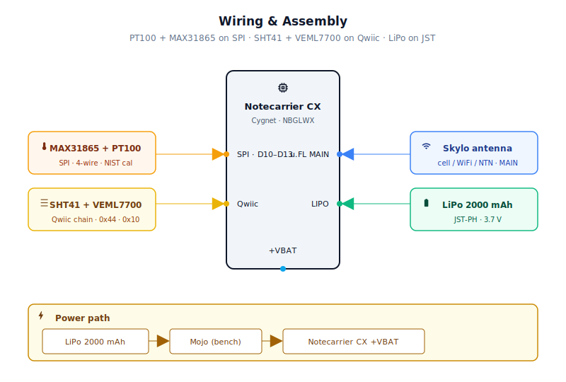
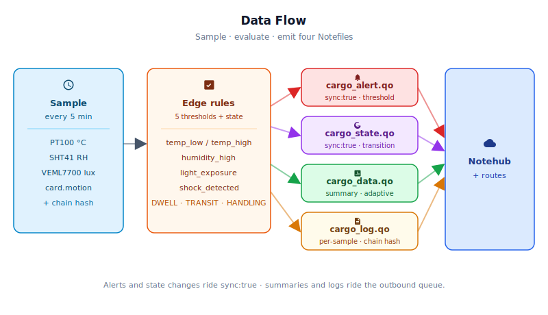

# Shipper-Owned Cargo-Level Cold Chain Monitor

<Note>

This reference application is intended to provide inspiration and help you get started quickly. It uses specific hardware choices that may not match your own implementation. Focus on the sections most relevant to your use case. If you'd like to discuss your project and whether it's a good fit for Blues, [feel free to reach out](https://blues.com/contact-sales/).

</Note>

A pallet-attached cold chain logger — a [supply chain tracking](https://blues.com/solutions-supply-chain-tracking/) reference design — for pharma and food shippers who cannot afford to trust the reefer unit's built-in telematics. A handful of sensors, a [Blues Notecard for Skylo](https://shop.blues.com/products/notecard?utm_source=dev-blues&utm_medium=web&utm_campaign=store-link), and a [Notecarrier CX](https://shop.blues.com/products/notecarrier-cx?utm_source=dev-blues&utm_medium=web&utm_campaign=store-link) give you an independent, shipper-controlled condition record that travels with the cargo — through loading docks, over-the-road transit, port staging, and customs DCs — and dispatches an alert note when a temperature, humidity, shock, tilt, or cargo-bay-opening threshold is crossed.

---

## 1. Project Overview

**The problem.** When a pharma manufacturer ships a pallet of biologics or a food producer ships a truckload of fresh produce, the temperature data logged by the reefer unit's built-in telematics has a fundamental blind spot: those sensors read the air temperature near the refrigeration unit, not the air temperature where the cargo actually sits. A pallet in the back corner of a 53-foot trailer can run 5–8°F warmer than what the reefer controller reports, especially when the trailer has been standing in a distribution center (DC) yard waiting for a dock door, or when a forklift holds the door open for an extended loading sequence.

In regulated industries like pharma and food distribution, "the reefer says it was fine" is not a sufficient basis for cargo acceptance or rejection decisions. Insurance adjusters, freight claims teams, and quality managers need continuous, independent, pallet-level condition data — data the shipper controls, not the carrier — with timestamps that can be matched to the shipment's **BOL** (bill of lading) and delivery receipt. When a shipment is suspect, the side with independent data makes faster, better-informed diversion and acceptance decisions.

This project builds on the dedicated temperature logger concept: a pallet-attached logger that records a complete, tamper-evident condition history through the entire journey. Temperature is measured by a calibrated PT100 Class A RTD probe (±0.15 °C per IEC 60751), sourced with a NIST-traceable calibration certificate from the probe supplier. Every five-minute sample cycle generates a log entry with a monotonic sequence number, a rolling integrity chain hash, and a boot-segment counter (`boot_seg`) that increments on every device cold boot. Within each `boot_seg`, a downstream consumer can replay the chain from seq=1 (seed=0) to verify that no records were inserted, deleted, or modified in transit. On-device state tracking distinguishes warehouse dwell from active transit and cargo-bay-open handling events — dynamically extending both summary interval and outbound sync cadence during long dwell periods to reduce satellite session frequency and NTN data cost, and emitting an immediate state-change note whenever the shipment transitions between states.

**Why Notecard.** A single refrigerated shipment can cross three carriers, two countries, a port container terminal, and an ocean transit in the course of a week — each environment with different wireless coverage characteristics. Loading dock interiors are cellular dead zones. Ocean vessels transit thousands of miles with no terrestrial coverage. Customs DCs and bonded warehouses have inconsistent cellular coverage and almost never permit carriers' IoT devices onto their networks.

> **Note on reefer standards:** This project does **not** implement J2497, J1939, or proprietary reefer protocols (Carrier DataLink, Thermo King DSR). It is a shipper-owned, independent cold-chain monitor that operates alongside or in parallel with carrier telematics — not as a reefer integration. The design is intentionally isolated: the logger measures cargo-bay conditions, not reefer controller state, and routes data to shipper systems (TMS, quality, analytics), not carrier networks.

This project uses the [Notecard for Skylo (NOTE-NBGLWX)](https://shop.blues.com/products/notecard?utm_source=dev-blues&utm_medium=web&utm_campaign=store-link) ([datasheet](https://dev.blues.io/datasheets/notecard-datasheet/note-nbglwx/)), an all-in-one module that packs cellular (LTE-M, 2G/3G), WiFi (2.4 GHz), and satellite (Skylo NTN — non-terrestrial network) into a single M.2 form-factor Notecard. The device selects the best available radio automatically: WiFi in a connected DC where credentials have been provisioned on the Notecard (see [§5 WiFi provisioning](#5-notehub-setup)), cellular over road and rail, satellite where neither is available and the antenna has sky exposure. Queued notes in Notecard flash carry their original timestamps and are transmitted intact when any radio comes back — coverage gaps produce store-and-forward gaps, not data loss. No SIM provisioning, no per-country certification cycle (Blues ships pre-certified globally), and no site network credentials to manage at every waypoint.

**Deployment scenario.** The logger is housed in an IP67 enclosure attached to the pallet exterior. Three sealed openings: a PTFE breathable vent on the pallet-facing side wall so the SHT41 can sample the surrounding cargo-bay air; a separate 3/8-18 NPT threaded opening on the same pallet-facing wall so the PT100 probe's 150 mm sensing tip extends into the cargo airstream; and a clear polycarbonate lens window on the cargo-bay-facing wall so the inward-facing VEML7700 can detect when the cargo compartment is opened and light enters the interior. The Skylo-certified multi-band antenna (included with the NOTE-NBGLWX) is mounted inside the ABS enclosure — ABS is transparent to LTE-M and L-band NTN frequencies — with the antenna face pointing upward through the lid.

**Satellite connectivity is opportunistic.** Skylo NTN uses geostationary satellites and requires a clear sky view toward the equator. When the logger is mounted on the exterior top of a pallet in open-air staging, on an open vehicle deck, or in a truck trailer with a composite (non-steel) roof, satellite connectivity is available. Inside a closed steel shipping container or enclosed trailer, satellite is blocked — notes queue in Notecard flash and flush automatically over cellular or WiFi when the pallet reaches an area with terrestrial coverage.

---

## 2. System Architecture



**Device-side responsibilities.** The onboard Cygnet STM32L4 host on the [Notecarrier CX](https://dev.blues.io/datasheets/notecarrier-datasheet/notecarrier-cx-v1-3/) wakes every five minutes, reads the PT100/MAX31865 (temperature) and SHT41 (humidity) and VEML7700 (interior light) over their respective buses, queries the Notecard's built-in accelerometer for accumulated motion events and current orientation via `card.motion`, runs the shipment-state model, evaluates five threshold rule categories (temperature is a two-sided rule that can emit `temp_low` or `temp_high`, for six distinct alert types in total), writes a per-sample log entry, and emits alert and state-change notes for any rules that fire.

**Shipment-state model.** After each motion and light read, the firmware evaluates the current shipment state:
- **DWELL** — confirmed by `dwell_confirm_samples` consecutive low-motion samples (motion < `transit_motion_min` per interval). During dwell, both the `cargo_data.qo` summary interval and the Notecard hub.set outbound cadence are multiplied by `dwell_batch_factor` (default 4×), reducing both the number of summary notes queued per session and the number of outbound sessions per hour. `applyDynamicOutbound()` re-issues `hub.set` whenever the state transitions in or out of DWELL.
- **IN_TRANSIT** — confirmed by `transit_confirm_samples` consecutive high-motion samples. Normal summary interval applies.
- **HANDLING** — triggered immediately when interior lux reaches or exceeds `light_open_lux`, indicating the cargo door or container lid has been opened. Resets motion counters.

When the state changes, a `cargo_state.qo` note is dispatched immediately via `sync:true` so the remote system learns about the transition in near-real-time over whatever radio is available. If the first send attempt fails (transient Notecard I²C issue), the transition is persisted in `ColdChainState` and retried on every subsequent wake until the Notecard confirms the `note.add`, so no state transition is permanently lost.

**Tamper-evident local log.** Every sample cycle appends one compact-templated entry to the `cargo_log.qo` Notefile. Each entry includes a monotonic sequence number (`seq`, incremented before every note.add), a rolling integrity hash (`chain_crc`) computed over the previous hash, the sequence number, boot segment, and all sensor readings, and a `boot_seg` counter that increments on every cold boot. The boot-segment counter is persisted both in the Notecard sleep payload (planned-sleep resilience) and in a Notecard-local notefile `chain_boot.dbx` (power-loss resilience). Log entries are queued for the regular outbound window rather than synced immediately, batching with outbound sessions without consuming an extra satellite session per sample. The `_time` field is always included in each entry: the real epoch when the Notecard has obtained valid time from Notehub, or `0` as a documented pre-sync sentinel. Downstream consumers should treat `_time == 0` as pre-sync and use Notehub's event receive-time as the best available approximation for those records. A `motion_valid` flag (`1` = card.motion returned valid data; `0` = card.motion was unavailable) is also included in every entry so downstream consumers can distinguish "no motion occurred" (`motion = 0`, `motion_valid = 1`) from "motion data unavailable" (`motion = 0`, `motion_valid = 0`) — preserving the compliance semantics of the per-sample audit log even when the accelerometer interface is temporarily unreachable. A downstream verifier replays the chain **within each `boot_seg` group** from seq=1 (seed=0); a gap in `seq` within a segment indicates a dropped transmission; a `chain_crc` mismatch indicates a modified or inserted record; and a new `boot_seg` value marks the start of a new, independent chain segment caused by a device cold boot.

**Notecard responsibilities.** The Notecard for Skylo stores [Notes](https://dev.blues.io/api-reference/glossary/#note) in its on-device flash queue, manages multi-RAT connectivity autonomously, and flushes the queue on the configured [`hub.set`](https://dev.blues.io/api-reference/notecard-api/hub-requests/#hub-set) outbound cadence (default 60 minutes). Alert and state-change notes marked `sync:true` bypass the outbound queue and trigger an immediate radio session on whichever RAT is currently available. The Notecard also owns [environment variable](https://dev.blues.io/guides-and-tutorials/notecard-guides/understanding-environment-variables/) distribution — operators can change threshold values, sample cadence, and summary cadence without reflashing firmware.

**Notehub responsibilities.** The [Notecard manages its own cellular and Skylo NTN satellite sessions](https://notehub.io) against the supported carrier networks worldwide via its embedded global SIM and delivers data to Notehub over the Internet; [Notehub](https://notehub.io) ingests events, stores them with their original timestamp, and applies project-level [routes](https://dev.blues.io/notehub/notehub-walkthrough/#routing-data-with-notehub). The four Notefiles (`cargo_alert.qo`, `cargo_state.qo`, `cargo_data.qo`, `cargo_log.qo`) are separate so they can be routed independently — alerts and state changes to a TMS or on-call endpoint, summaries to a cold-chain analytics platform, and log entries to a compliance data store.

---

## 2.5 Quickstart

1. **Notehub** — create a [Notehub project](https://notehub.io), copy its ProductUID.
2. **Wire the bench rig** — Notecarrier CX + Notecard for Skylo + MAX31865 on SPI + PT100 probe + SHT41 on I²C + VEML7700 on I²C. Full pinout in [§4](#4-wiring-and-assembly).
3. **Edit one line** in [`firmware/cargo_cold_chain_monitor/cargo_cold_chain_monitor_helpers.h`](firmware/cargo_cold_chain_monitor/cargo_cold_chain_monitor_helpers.h) — set `PRODUCT_UID` to your project's value.
4. **Flash** — run `arduino-cli board listall | grep -i cygnet` to confirm the FQBN for your installed STM32 core, then compile and upload. Full instructions in [§6.1](#61-installing-and-flashing).
5. **Watch** — Notehub → your project → **Events** tab. You should see `_session.qo` on first contact, `cargo_data.qo` after the first summary interval, `cargo_log.qo` entries batching with each outbound sync, `cargo_state.qo` on the first confirmed dwell or motion event, and any threshold trips as `cargo_alert.qo` within one sample interval of the triggering event.

> **First event timeline:** On power-up, the device acquires time and signals contact via `_session.qo` within 1–2 minutes (cellular/WiFi) or several minutes (Skylo NTN with clear sky). The first `cargo_log.qo` entry appears one sample interval later (~5 min). The first `cargo_data.qo` summary appears ~60 minutes after the device obtains a valid epoch from Notehub's `card.time` API.

---

## 3. Hardware Requirements

| Part | Qty | Rationale |
|------|-----|-----------|
| [Notecarrier CX](https://shop.blues.com/products/notecarrier-cx?utm_source=dev-blues&utm_medium=web&utm_campaign=store-link) | 1 | Integrated carrier with embedded Cygnet STM32L4 host — no separate MCU needed. The ATTN pin controls host power for deep-sleep between samples. |
| [Notecard for Skylo (NOTE-NBGLWX)](https://shop.blues.com/products/notecard?utm_source=dev-blues&utm_medium=web&utm_campaign=store-link) | 1 | Single M.2 module with cellular (LTE-M / 2G / 3G), WiFi, and Skylo NTN satellite. Global pre-certification sidesteps per-country approval cycles. Datasheet: [dev.blues.io/datasheets/notecard-datasheet/note-nbglwx/](https://dev.blues.io/datasheets/notecard-datasheet/note-nbglwx/) |
| [Omega PR-21C-3-100-A-1/8-0600-M12-2](https://www.omega.com/en-us/temperature-measurement/temperature-probes/rtd-probes/pr-21/) PT100 Class A probe + Omega **CAL-3** NIST-traceable calibration certificate | 1 | IEC 60751 Class A PT100 (±0.15 °C at 0 °C), 4-wire, 3.2 mm (1/8″) × 150 mm (6″) 316L stainless-steel sheath with 3/8″ NPT process fitting and 4-pin M12 A-coded output connector, −50 °C to 250 °C range. **Order the probe together with Omega's CAL-3 option** — NIST-traceable calibration certificate documenting temperature deviation at standard points, performed per ISO 10012-1 / ANSI/NCSL Z540-1. The CAL-3 certificate is what makes the hardware measurement NIST-traceable; a probe shipped without it does not satisfy the calibration-documentation requirement regardless of accuracy class. The 3/8″ NPT fitting on the probe body threads into a separately drilled and tapped 3/8-18 NPT hole in the pallet-facing side wall — this is a distinct hole from the M12 PTFE vent hole (see §4). The 4-wire M12 output mates to a field-wireable M12 A-coded female connector or a pre-made M12 patch cable for clean in-enclosure routing to the MAX31865 breakout RTD terminals. Firmware uses `MAX31865_4WIRE`; the Adafruit #3328 breakout jumper must be set to the 4-wire position (desolder the default 2/3-wire bridge and close the 4-wire pads per the Adafruit product guide). |
| [Adafruit MAX31865 RTD Amplifier Breakout (#3328)](https://www.adafruit.com/product/3328) | 1 | SPI-interface 15-bit ADC designed for PT100/PT1000 RTDs. Provides hardware fault detection (open-circuit, short-circuit, over/under-voltage) and accepts both 2-wire and 4-wire probe configurations. Connects to the Cygnet's hardware SPI bus (CS=D10, CLK=D13, SDO=D12, SDI=D11). The Adafruit #3328 includes a 430 Ω reference resistor matched to PT100 use. |
| [Adafruit SHT41 breakout (#5776)](https://www.adafruit.com/product/5776) | 1 | Sensirion SHT41: ±1.8% RH, factory-calibrated. Used for **relative humidity only** — the MAX31865/PT100 is the primary temperature source. The SHT41's integrated heater prevents condensation-induced RH drift in cold, humid refrigerated environments. I²C, 3.3 V. |
| [Adafruit VEML7700 Lux Sensor (#4162)](https://www.adafruit.com/product/4162) | 1 | 16-bit I²C ambient light sensor for interior cargo-bay light / door-opened detection. Mounted behind a polycarbonate lens on the **cargo-bay-facing wall** of the enclosure so it reads near-zero lux when the container or reefer is sealed and reports a significant lux reading when the cargo door is opened and light enters the compartment. A missing sensor returns `-9999` in `cargo_data.qo` and `cargo_log.qo`; the `lux` field is omitted from `cargo_alert.qo` when unavailable. |
| [Blues Mojo](https://shop.blues.com/products/mojo?utm_source=dev-blues&utm_medium=web&utm_campaign=store-link) *(bench bring-up only)* | 0–1 | Coulomb counter inline on the VBAT rail for ground-truth energy validation. Not deployed to the field — see [§8](#8-validation-and-testing). |
| 3.7 V Li-Po battery, 2000 mAh (e.g., [Adafruit #2011](https://www.adafruit.com/product/2011)) | 1 | Portable power for multi-week shipments. JST-PH 2-pin connector mates directly to the Notecarrier CX. See [§8](#8-validation-and-testing) for runtime estimates and [§9](#9-limitations-and-next-steps) for UN 38.3 / IATA transport compliance notes. |
| ABS IP67 enclosure with mounting flanges, ~115 mm × 65 mm × 40 mm ([Bud Industries PN-1322-CMB](https://www.budind.com/view/ABS+Plastic+Boxes/PN-1322-CMB), available at DigiKey / Mouser) | 1 | IP67-rated pallet-logger housing. Requires three enclosure openings: one M12 hole on the pallet-facing side wall for the PTFE vent plug (SHT41 air exchange only); one separately drilled and tapped 3/8-18 NPT hole on the same pallet-facing side wall for the PT100 probe entry; one 20 mm hole on the **cargo-bay-facing wall** for the VEML7700 polycarbonate lens window. ABS is easily machinable — the M12 hole accepts standard step or hole saws; the 3/8-18 NPT hole is drilled to the tap-drill size (approx. 9.5 mm / 3/8″) then threaded with a 3/8-18 NPT tap. |
| Skylo NTN + cellular/WiFi antenna (**included with NOTE-NBGLWX**) | 1 | The NOTE-NBGLWX ships with its Skylo-certified multi-band flexible antenna, which attaches to the Notecard's `MAIN` u.FL port and covers both cellular (LTE-M) and Skylo NTN (S-Band / L-Band). **Use only the included antenna on the MAIN port.** Skylo certifies the NOTE-NBGLWX exclusively with the antenna provided in the kit. Mount inside the ABS enclosure with its face toward the sky. |
| PTFE breathable membrane vent plug, M12, IP67 ([Amphenol LTW WVPL-G2](https://www.amphenol-ltw.com/product/stainless-steel-vent-plugs-series/), available at DigiKey / Mouser) | 1 | Allows the SHT41 to sample the surrounding cargo-bay air while maintaining IP67. Installs in the dedicated M12 vent hole on the pallet-facing side wall (hand-tight + one half-turn). The PT100 probe enters through its own separate 3/8-18 NPT tapped hole on the same wall. |
| PTFE thread sealant tape, ½ in width (e.g., Oatey 31403 or equivalent, available at any hardware store) | 1 roll | Seals the 3/8-18 NPT probe fitting into the tapped probe-entry hole in the pallet-facing enclosure wall. Apply 2–3 wraps to the probe's NPT threads before threading in. |
| Clear polycarbonate disc, 20 mm diameter × 3 mm thick, with silicone RTV sealant ([McMaster-Carr 8560K171](https://www.mcmaster.com/8560K171/) or equivalent) | 1 | Optical window for the inward-facing VEML7700. Press into the 20 mm lens hole on the cargo-bay-facing wall and seal the perimeter with clear silicone RTV. |
| STEMMA QT / Qwiic 4-pin JST-SH cable, 100 mm (e.g. [Adafruit #4210](https://www.adafruit.com/product/4210)) | 2 | Two cables required: one from the Notecarrier CX Qwiic port to any Qwiic port on the SHT41, and a second from the SHT41's pass-through Qwiic port to the VEML7700. |

All Blues hardware ships with an active SIM including 500 MB of data and 10 years of service — no activation fees, no monthly commitment.

---

## 4. Wiring and Assembly



All host I/O connects to the Notecarrier CX's dual 16-pin header. The Notecard for Skylo seats into the carrier's M.2 slot; the included Skylo-certified antenna attaches to the Notecard's `MAIN` u.FL port and remains inside the ABS enclosure.

**MAX31865 (SPI — temperature).**
Connect via the Cygnet's hardware SPI bus:

| MAX31865 pin | Cygnet pin | Header label |
|---|---|---|
| VIN | 3V3 | +3V3 |
| GND | GND | GND |
| CLK | D13 | SCK |
| SDO (MISO) | D12 | MISO |
| SDI (MOSI) | D11 | MOSI |
| CS | D10 | CS / D10 |

The specified Omega PR-21C probe has a 4-wire M12 A-coded output connector; use a field-wireable or pre-made M12 A-coded female cable to break out the four RTD leads inside the enclosure. **Set the Adafruit #3328 breakout's jumpers for 4-wire PT100:** desolder the default 2/3-wire jumper bridge and close the 4-wire pads as shown in the Adafruit product guide. Connect the four probe leads to the MAX31865's F+, F−, RTD+, and RTD− terminals. Thread the probe's 3/8-18 NPT fitting into the dedicated probe-entry hole on the pallet-facing side wall — this hole is separate from the M12 PTFE vent hole (drill to the 3/8-18 NPT tap-drill size, thread with a 3/8-18 NPT tap, apply 2–3 wraps of PTFE tape to the probe threads, and torque hand-tight plus a quarter-turn) — so the 150 mm sensing tip extends into the cargo-bay airstream.

**SHT41 and VEML7700 (I²C — humidity and interior light).**
Both breakouts include STEMMA QT / Qwiic connectors. Two 100 mm STEMMA QT cables are needed: connect the first from the Notecarrier CX's Qwiic port to any Qwiic port on the SHT41, then connect the second from the SHT41's pass-through Qwiic port to the VEML7700. The Notecarrier CX has I²C pull-ups on-board; no external resistors are needed.

**I²C address summary** (no conflict — both on the same bus; MAX31865 uses SPI, not I²C):

| Sensor | I²C address |
|--------|-------------|
| SHT41 | `0x44` (fixed) |
| VEML7700 | `0x10` (fixed) |

**VEML7700 interior light path (cargo-bay-facing).**
Drill a 20 mm through-hole in the **cargo-bay-facing wall** of the enclosure (not the lid). Press a 20 mm × 3 mm clear polycarbonate disc into the hole and seal the perimeter with clear silicone RTV; allow to cure. Mount the VEML7700 breakout directly behind the lens so the sensor die faces inward through the enclosure wall, toward the cargo space.

When deployed, the cargo-bay-facing wall of the enclosure looks into the interior of the reefer compartment or container. The sealed compartment blocks daylight — the VEML7700 reads near-zero lux while the cargo door is closed. When the door opens, light enters the compartment; the sensor reads above the `light_open_lux` threshold and fires a `light_exposure` alert and HANDLING state transition. This provides reliable cargo-door-open detection at each handling event throughout the journey.

**SHT41 air path (sensing through vent membrane).**
Drill an M12 through-hole in the pallet-facing side panel for the PTFE vent plug (this hole is dedicated to the vent plug only — the PT100 probe enters through its own separate 3/8-18 NPT tapped hole on the same panel). Thread in the Amphenol WVPL-G2 vent plug (hand-tight + one half-turn). Position the SHT41 breakout inside the enclosure with its sensor opening within 10 mm of the vent plug's inner face so the airflow path reaches the sensor die.

**Additional wiring:**
- **+VBAT** → Mojo `LOAD` output (bench only). In field deployment, connect the Li-Po directly to the Notecarrier CX's JST-PH LiPo jack.

**Antenna placement (internal).** Attach the included Skylo-certified antenna to the Notecard's `MAIN` u.FL port. Mount the antenna inside the ABS enclosure with its face pointing upward toward the lid to maximize sky-facing aperture for Skylo NTN. **Do not substitute a different antenna on the MAIN port.** The `GPS` u.FL port is not connected in this project.

> **No external accelerometer required.** The Notecard for Skylo includes a built-in 3-axis accelerometer. Motion tracking is enabled via `card.motion.mode` with `start:true` and `sensitivity:2`; the firmware does not configure sample rate or G-range — those are managed internally by the Notecard. The `card.motion` stream provides per-bucket motion counts for shock detection and the `orientation` field for tilt detection.

---

## 5. Notehub Setup

1. **Create a project.** Sign up at [notehub.io](https://notehub.io) and [create a project](https://dev.blues.io/quickstart/notecard-quickstart/notecard-and-notecarrier-pi/#set-up-notehub). Copy the [ProductUID](https://dev.blues.io/notehub/notehub-walkthrough/#finding-a-productuid) — it looks like `com.your-company.your-name:cold-chain`.

2. **Set the ProductUID in firmware.** Open [`firmware/cargo_cold_chain_monitor/cargo_cold_chain_monitor_helpers.h`](firmware/cargo_cold_chain_monitor/cargo_cold_chain_monitor_helpers.h) and replace the empty string on the `#define PRODUCT_UID ""` line with your value.

3. **Claim the Notecard.** Power the assembled unit. The Notecard associates itself with your Notehub project on the **first successful radio session over any available RAT** — cellular, WiFi, or Skylo NTN. The device appears in your project's **Devices** tab after that first session completes. Over cellular or WiFi in good coverage, this typically happens within a minute or two of power-on. Over Skylo NTN, first contact requires a clear, unobstructed view toward the equatorial sky; session acquisition can take several minutes to establish, and is not possible inside enclosed metal structures or below grade. If the unit powers on in a cellular dead zone and Skylo NTN is the first available RAT, allow additional time for the NTN session to acquire before expecting the device to appear in Notehub.

> **WiFi provisioning (optional).** The Notecard for Skylo treats WiFi as its highest-priority radio when credentials are present, but credentials are **not** provisioned automatically. To provision WiFi, send a [`card.wifi`](https://dev.blues.io/api-reference/notecard-api/card-requests/#card-wifi) request to the Notecard via the in-browser Notecard terminal or the [Notecard CLI](https://dev.blues.io/tools-and-sdks/notecard-cli/):
> ```json
> { "req": "card.wifi", "ssid": "your-network-ssid", "password": "your-network-password" }
> ```
> Devices deployed without pre-provisioned WiFi credentials operate on cellular and satellite only — the normal mode for road and ocean transit segments.

4. **Create a Fleet per lane or customer.** [Fleets](https://dev.blues.io/guides-and-tutorials/fleet-admin-guide/) group devices for shared configuration. A natural model: one fleet per customer or product type (e.g., `insulin-2-8c` vs `fresh-produce`). [Smart Fleets](https://dev.blues.io/notehub/notehub-walkthrough/#using-smart-fleet-rules) can auto-assign devices based on a serial-number prefix so each new logger automatically inherits the right thresholds on first appearance.

5. **Set environment variables.** In Notehub, navigate to **Fleet → Environment** (or **Device → Environment** for per-device overrides). All variables are optional; firmware defaults are shown.

   > **How env-var delivery works.** `env.get` reads the Notecard's *locally cached* copy on every wake — a value that has already been delivered takes effect immediately on the next sample cycle. New or changed values set in the Notehub console only reach the device after the next *inbound sync*. The default inbound cadence is `INBOUND_INTERVAL_MIN = 720` (12 hours). During commissioning, temporarily force a sync by clicking **Sync** on the device's detail page, or reduce `INBOUND_INTERVAL_MIN` to 60 for the bench session and restore before field deployment.

   | Variable | Default | Purpose |
   |---|---|---|
   | `temp_min_c` | `2.0` | Lower temperature limit (°C). Standard pharma cold chain; fresh produce lanes may differ. |
   | `temp_max_c` | `8.0` | Upper temperature limit (°C). `temp_high` fires when exceeded; `temp_low` fires below `temp_min_c`. |
   | `humidity_max_pct` | `75.0` | Relative humidity ceiling (%). High RH in a refrigerated environment signals condensation risk or reefer malfunction. |
   | `light_open_lux` | `50.0` | Interior lux above which `light_exposure` fires and the state transitions to HANDLING. The interior of a sealed reefer or container reads near 0 lux; 50 lux reliably detects door opening. |
   | `shock_events` | `5` | Accumulated motion-event count per sample interval above which `shock_detected` fires. Lower values catch lighter impacts; raise to 10–15 for lanes with expected road vibration. |
   | `sample_interval_sec` | `300` | Seconds between sample cycles (minimum 60). Reducing to 60 for bench testing is fine. |
   | `summary_interval_min` | `60` | Base minutes between `cargo_data.qo` summary notes. Extended by `dwell_batch_factor` during confirmed DWELL. Controls summary generation cadence; outbound sync interval is the compiled `OUTBOUND_INTERVAL_MIN` constant (default 60 min). |
   | `transit_motion_min` | `3` | Motion events per sample interval at or above which the sample counts as "moving." Tune up for noisy lanes (vibration-heavy roads). |
   | `dwell_confirm_samples` | `3` | Consecutive low-motion samples before the state transitions to DWELL (~15 min at default cadence). |
   | `transit_confirm_samples` | `2` | Consecutive high-motion samples before the state transitions to IN_TRANSIT (~10 min at default cadence). |
   | `dwell_batch_factor` | `4` | Multiplier applied to both `summary_interval_min` and the hub.set outbound cadence during confirmed DWELL. Default 4 → 4-hour summary intervals **and** 4-hour outbound sync windows in a warehouse (9 sessions per 36-hour dwell instead of 36). Alert and state-change notes (sync:true) still trigger an immediate session regardless. Set to 1 to disable dwell batching entirely. |

6. **Configure routes.** Add one [route](https://dev.blues.io/notehub/notehub-walkthrough/#routing-data-with-notehub) for `cargo_alert.qo` and `cargo_state.qo` (to a TMS webhook or on-call endpoint), one for `cargo_data.qo` (to a cold-chain analytics platform), and one for `cargo_log.qo` (to a compliance data store or audit system). Keeping the four Notefiles separate at the source means routing policy is set once and downstream systems receive only the event streams they need.

### What to expect in Notehub

Within a short time of first power-on the **Events** tab begins populating. Timing depends on available RATs — see step 3 above.

- **`_session.qo`** — automatic Notecard housekeeping on each radio session. Useful first-light sanity check.

- **`cargo_data.qo`** — one per effective summary interval (60 min in transit/handling, up to 240 min during DWELL at default settings), starting after the first complete interval elapses from anchor time. Body:
  ```json
  {
    "_time": 1748000000,
    "temp_mean_c": 4.3,
    "temp_min_c": 3.8,
    "temp_max_c": 4.9,
    "rh_mean_pct": 62.1,
    "rh_min_pct": 60.4,
    "rh_max_pct": 63.7,
    "lux_max": 0.3,
    "motion_total": 2,
    "motion_valid": 1,
    "samples": 12
  }
  ```
  Any field reading `-9999` means no valid sensor data was available for that metric in the window — treat as a sensor fault, not a near-zero measurement.

- **`cargo_log.qo`** — one compact entry per sample cycle, batched with the regular outbound sync. Body:
  ```json
  {
    "_time": 1748000300,
    "seq": 42,
    "temp_c": 4.3,
    "rh_pct": 62.5,
    "lux": 0.2,
    "motion": 0,
    "motion_valid": 1,
    "state": 1,
    "boot_seg": 1,
    "chain_crc": 3748291045
  }
  ```
  `_time` is always present. Entries logged before the Notecard obtained a valid epoch carry `_time = 0` as a pre-sync sentinel; use Notehub's event receive-time as the approximation for those records. `motion_valid` is `1` when `card.motion` returned valid data and `0` when the accelerometer interface was unavailable — a value of `0` with `motion_valid = 0` means data was unavailable, not that no motion occurred. `state` maps to: `0`=unknown, `1`=dwell, `2`=in_transit, `3`=handling. `boot_seg` increments on every cold boot — all entries with the same `boot_seg` form one continuous chain segment. A gap in `seq` within a segment indicates a missed entry. A `chain_crc` mismatch (when replaying the chain within one `boot_seg` from seq=1, seed=0) indicates a modified or inserted record. A new `boot_seg` value resets seq to 1 and starts a fresh chain from seed=0.

- **`cargo_state.qo`** — emitted on every shipment-state transition, transmitted immediately. Body:
  ```json
  {
    "_time": 1748001200,
    "state_from": "dwell",
    "state_to": "in_transit"
  }
  ```

- **`cargo_alert.qo`** — emitted only on a threshold trip, transmitted immediately. The `alert` field is one of `temp_low`, `temp_high`, `humidity_high`, `shock_detected`, `light_exposure`, or `tilt_detected`. Standard alert:
  ```json
  {
    "alert": "temp_high",
    "temp_c": 9.1,
    "rh_pct": 64.2,
    "lux": 0.1,
    "motion": 0
  }
  ```
  Tilt alerts add `orientation_from` and `orientation_to`. If a sensor was unavailable when the alert fired, its field is absent — an omitted field indicates a sensor fault; `-9999` is used only in `cargo_data.qo` and `cargo_log.qo`.

---

## 6. Firmware Design

Single sketch: [`firmware/cargo_cold_chain_monitor/cargo_cold_chain_monitor.ino`](firmware/cargo_cold_chain_monitor/cargo_cold_chain_monitor.ino).

### 6.1 Installing and flashing

**Dependencies:**

- **Arduino core for STM32** — [`stm32duino/Arduino_Core_STM32`](https://github.com/stm32duino/Arduino_Core_STM32). Install via the Arduino Boards Manager by adding the index URL `https://github.com/stm32duino/BoardManagerFiles/raw/main/package_stmicroelectronics_index.json` under **File → Preferences → Additional Boards Manager URLs** and searching **STM32 MCU based boards**.
- **`Blues Wireless Notecard`** library ([`note-arduino`](https://github.com/blues/note-arduino)) — install via `arduino-cli lib install "Blues Wireless Notecard"` or search "Blues Wireless Notecard" in the Arduino IDE Library Manager.
- **`Adafruit MAX31865 library`** — install via Library Manager (search "Adafruit MAX31865").
- **`Adafruit SHT4x Library`** — install via Library Manager (search "Adafruit SHT4x").
- **`Adafruit VEML7700 Library`** — install via Library Manager (search "Adafruit VEML7700").

**Flashing — `arduino-cli`:** run from the repo root:

```bash
# Step 1: find the exact FQBN for the Cygnet on your installed core version
arduino-cli board listall | grep -i cygnet

# Step 2: compile  (replace the FQBN below with what Step 1 reported)
arduino-cli compile -b STMicroelectronics:stm32:Blues:pnum=CYGNET \
    firmware/cargo_cold_chain_monitor/

# Step 3: upload  (replace the FQBN below with what Step 1 reported)
arduino-cli upload -b STMicroelectronics:stm32:Blues:pnum=CYGNET \
    -p /dev/cu.usbmodem* firmware/cargo_cold_chain_monitor/
```

> The FQBN shown in Steps 2–3 (`STMicroelectronics:stm32:Blues:pnum=CYGNET`) is the value typically reported by current `stm32duino` core releases, but the authoritative value for your specific installed core is whatever `arduino-cli board listall | grep -i cygnet` prints — always substitute that output before running compile or upload. Replace `/dev/cu.usbmodem*` with your actual port (`COMx` on Windows, `/dev/ttyACM*` on Linux).

Open the serial monitor at **115200 baud** to watch `[cargo]` log lines. On the first cold boot you'll see Notecard configuration messages, then one `[cargo] T=X.XX C (PT100)` and `[cargo] RH=XX.X %` per wake. After the first summary interval you'll see `[cargo] summary sent — samples=N`.

### 6.2 Modules

| Responsibility | Where in code |
|---|---|
| Notecard configuration (`hub.set`, motion mode) with warm-boot retry | `notecardConfigure()` + flags in `ColdChainState` |
| Compact template definition for `cargo_data.qo` and `cargo_log.qo` | `defineTemplates()` + `templates_registered` flag |
| Environment-variable fetch, clamp, and cadence-change window reset | `fetchEnvOverrides()`, `envFloat()` helper |
| PT100/MAX31865 temperature reads (SPI) | `readSensors()` |
| SHT41 relative humidity reads (I²C, humidity channel only) | `readSensors()` |
| VEML7700 interior cargo-bay light reads | `readSensors()` |
| Notecard built-in accelerometer motion count + orientation | `readMotionCount()` |
| Shipment-state detection (DWELL / IN_TRANSIT / HANDLING) | `detectShipmentState()` |
| State-transition immediate-sync note | `sendStateChange()` |
| Tamper-evident per-sample log entry (seq, chain_crc) | `sendLogEntry()` |
| Alert cooldown logic | `alertCooldownOk()` |
| Threshold evaluation and alert dispatch | `evaluateAlerts()`, `sendAlert()`, `sendTiltAlert()` |
| Rolling sample accumulation | `accumulateSample()` |
| Adaptive summary interval (dwell batching), snapshot/retry/discard | `snapshotSummary()`, `sendPendingSummary()`, `resetAccumulators()` |
| Persistent state across sleep cycles | `ColdChainState` struct + `NotePayloadSaveAndSleep` / `NotePayloadRetrieveAfterSleep` |
| Epoch time for cooldowns and timestamps | `currentEpoch()` |

### 6.3 Sensor reading strategy

- **MAX31865 / PT100.** `rtd.begin(MAX31865_4WIRE)` re-initializes the SPI peripheral on every wake (the device is re-powered with the host) in 4-wire mode to match the specified Omega PR-21C probe. 4-wire mode drives force current through the outer pair of leads and measures voltage across the inner pair, eliminating lead-resistance error — important for probe cable runs over 0.5 m. `rtd.temperature(MAX31865_RNOMINAL, MAX31865_RREF)` reads the RTD resistance and applies the Callendar–Van Dusen polynomial. `rtd.readFault()` checks for open-circuit (RTDINLOW), short-circuit (HIGHTHRESH), and reference-voltage faults; any non-zero fault sets `temp_c = INVALID_F` and clears the fault register so the next wake gets a fresh read. Valid temperature values are range-checked (−200 °C to +200 °C) before acceptance. The 430 Ω reference resistor on the Adafruit #3328 breakout matches the PT100 nominal range; the `MAX31865_RREF` and `MAX31865_RNOMINAL` constants in `helpers.h` must be updated if a PT1000 probe is substituted.
- **SHT41 (humidity only).** `setPrecision(SHT4X_HIGH_PRECISION)` selects the ±1.8% RH mode. `getEvent()` returns both a temperature and a humidity struct; only the humidity channel is used — the PT100/MAX31865 is the authoritative temperature source. NaN guards are applied before accumulation.
- **VEML7700.** Gain `VEML7700_GAIN_2` and integration time `VEML7700_IT_100MS` maximize sensitivity for the near-zero lux levels expected inside a sealed reefer or container. A missing VEML7700 returns `INVALID_F` (not 0.0) so a sensor fault is distinguishable from genuine darkness. The `light_exposure` alert and HANDLING state detection both skip when lux is `INVALID_F`.
- **Accelerometer.** `card.motion` is called with `minutes: gSampleSec / 60` to retrieve a non-overlapping window covering exactly the elapsed sample interval. `sample_interval_sec` is always clamped to whole-minute multiples in env-var processing so the division is exact. Per-bucket motion counts are parsed in-place with `strtoul` pointer arithmetic so multi-digit counts (e.g., `"10"`) are handled correctly for any window length.

### 6.4 Event payload design

**`cargo_data.qo`** — adaptive cadence, compact-templated. Notehub compact templates (registered in code at [§6.7](#67-key-code-snippet-1-compact-log-template) for `cargo_data.qo` and §6.7 for `cargo_log.qo`) reduce on-wire size from ~200 bytes (free JSON) to ~50 bytes per message, which meaningfully reduces satellite session overhead. During confirmed DWELL the effective interval is `summary_interval_min × dwell_batch_factor` (default 4 hours); during IN_TRANSIT and HANDLING the base `summary_interval_min` (default 60 minutes) applies. The `_time` field is preserved in the compact body so each record carries its own audit timestamp independent of Notehub's receive-time metadata.

**`cargo_log.qo`** — one entry per sample cycle, compact-templated on Notehub port 51 (defined at [§6.7](#67-key-code-snippet-1-compact-log-template)). Entries are queued for the regular outbound window — no extra satellite session per sample. Each entry carries `seq` (monotonic counter, incremented before every note.add), `boot_seg` (cold-boot counter, incremented and persisted to `chain_boot.dbx` on every cold boot), and `chain_crc` (rolling hash computed per [§6.8](#68-key-code-snippet-2-integrity-chain-hash-update) over previous hash + seq + boot_seg + all sensor fields). The `_time` field is always included in each entry: the real sample epoch when valid time is available, or `0` as a documented pre-sync sentinel when the Notecard has not yet obtained time from Notehub. Writing `0` rather than omitting the field keeps the compact-template body consistent with the registered schema; downstream consumers should treat `_time == 0` as pre-sync and use Notehub's receive-time as the best available approximation for those entries. The `motion_valid` field (`1` or `0`) distinguishes a genuine zero-motion reading from a cycle where `card.motion` was unavailable — both cases store `motion = 0`, but `motion_valid = 0` signals missing data rather than confirmed stillness. The chain hash uses the stored `motion` value (which is `0` when `card.motion` is unavailable), so downstream replay is straightforward from the logged fields. A downstream verifier first groups entries by `boot_seg`, then replays the chain within each group using the algorithm at [§6.8](#68-key-code-snippet-2-integrity-chain-hash-update): `crc[n] = hash(crc[n-1], seq[n], boot_seg[n], temp[n], rh[n], lux[n], motion[n], state[n])`, starting from `crc[0]=0`. A seq gap within a group indicates a missed transmission; a chain mismatch indicates a modified or inserted record; a new `boot_seg` value marks a cold-boot boundary and starts a fresh chain from seed=0.

**`cargo_state.qo`** — on any DWELL / IN_TRANSIT / HANDLING state transition, `sync:true`, free-form JSON. Two fields: `state_from` and `state_to` (string names), plus `_time` when valid epoch is available. Provides a near-real-time chain-of-custody record of when the shipment began and ended each handling and transit event.

**`cargo_alert.qo`** — on threshold trip, `sync:true`, free-form JSON. Alert notes are infrequent and not templated.

### 6.5 Low-power and satellite strategy

The host is fully powered off between samples via `NotePayloadSaveAndSleep` / `card.attn`. The entire `ColdChainState` struct — including `seq`, `chain_crc`, `boot_seg`, `last_outbound_min`, shipment-state fields, alert cooldowns, and summary window accumulators — is serialized to Notecard flash before each sleep so all state survives planned sleep/wake cycles.

**Uncontrolled cold boot behavior.** A battery disconnection, brown-out, or deliberate reset before `NotePayloadSaveAndSleep` completes causes `NotePayloadRetrieveAfterSleep` to return `warmBoot=false` on the next power-on. `gState` is zeroed and `loadOrIncrementBootSeg()` reads the `boot_seg` counter **and the tilt baseline orientation** from `chain_boot.dbx` (a Notecard-local notefile that survives host power loss), increments the counter, and writes both back. Restoring `baseline_orientation` from `chain_boot.dbx` ensures that tilt detection after an uncontrolled cold boot continues comparing against the orientation captured at logger activation, not against the post-boot orientation — preventing a power loss during transit from silently resetting the baseline and suppressing a real tilt event. The first time the baseline is set (true first activation) it is saved to `chain_boot.dbx` by `persistBaselineOrientation()`; every subsequent cold boot reads it back automatically. `seq` and `chain_crc` reset to 0, starting a new independent chain segment. In-progress summary accumulators and cooldown timestamps from the interrupted cycle are lost; the remote log shows a new `boot_seg` value at the first entry after the reboot, providing a clear segment boundary. Downstream verifiers should treat each `boot_seg` as an independent chain.

For satellite efficiency: compact template format on `cargo_data.qo` and `cargo_log.qo` minimizes per-note byte count; the 12-hour inbound interval (`INBOUND_INTERVAL_MIN = 720`) limits NTN inbound poll cost (~50 bytes per poll); and dwell-period batching (4× by default) extends **both** the summary generation interval and the Notecard outbound sync cadence via `applyDynamicOutbound()`, directly reducing the number of outbound NTN sessions during long warehouse stays. Alert and state-change notes (sync:true) always trigger an immediate session regardless of the configured outbound cadence.

### 6.6 Retry and error handling

- `hub.set` is re-issued on every warm boot (idempotent). `card.motion.mode` and both `note.template` registrations each set a flag in `ColdChainState` on success and are retried until confirmed. All three steps are reapplied when `CONFIG_VERSION` changes (SCHEMA_VERSION = 5 encodes the current template schema, including the `motion_valid` field added to `cargo_log.qo` in schema version 5).
- Alert cooldown timestamps advance only when `note.add` is confirmed by the Notecard; a transient failure leaves the cooldown state unchanged so the next wake retries.
- `seq` and `chain_crc` advance before the `note.add` call in `sendLogEntry()`, so the chain represents the physical event sequence. A failed transmission burns the sequence number; the resulting gap in the remote log is itself evidence of a dropped record.
- State-change retry: a `cargo_state.qo` `note.add` that fails is stored in `ColdChainState.pending_state_change` / `pending_state_*` fields and retried on every subsequent wake before new state detection runs. This guarantees that no state transition is permanently lost on a transient Notecard failure. Retry is attempted in chronological order: the pending transition is sent before any new transition is stored, so chain-of-custody records arrive in sequence.
- Summary retry: a failed `sendPendingSummary()` leaves `pending_epoch` set; the frozen snapshot is retried on every subsequent wake. If the Notecard is unreachable for a full additional summary window, the stale snapshot is discarded (logged as a warning) and replaced by the newly completed window.

### 6.7 Key code snippet 1: compact log template

```cpp
J *req = notecard.newRequest("note.template");
JAddStringToObject(req, "file",   NOTE_LOG);          // "cargo_log.qo"
JAddNumberToObject(req, "port",   51);
JAddStringToObject(req, "format", "compact");
J *body = JAddObjectToObject(req, "body");
JAddNumberToObject(body, "_time",        TUINT32);   // sample epoch; 0 = pre-sync sentinel
JAddNumberToObject(body, "seq",          TUINT32);   // monotonic counter (resets each boot_seg)
JAddNumberToObject(body, "temp_c",       TFLOAT32);  // PT100 temperature
JAddNumberToObject(body, "rh_pct",       TFLOAT32);  // relative humidity
JAddNumberToObject(body, "lux",          TFLOAT32);  // interior lux
JAddNumberToObject(body, "motion",       TUINT32);   // motion events (0 when motion_valid=0)
JAddNumberToObject(body, "motion_valid", TUINT16);   // 1 = card.motion available; 0 = unavailable
JAddNumberToObject(body, "state",        TUINT16);   // shipment state
JAddNumberToObject(body, "boot_seg",     TUINT16);   // cold-boot segment counter
JAddNumberToObject(body, "chain_crc",    TUINT32);   // integrity chain hash (per boot_seg)
ncSend(req);
```

### 6.8 Key code snippet 2: integrity chain hash update

```cpp
// chainUpdate: mix previous hash with current sample fields to produce a new
// hash.  boot_seg is included so chains from different boot segments are
// cryptographically distinct even if seq and sensor values happen to coincide.
// Downstream consumers replay within each boot_seg from seq=1, seed=0 to
// verify no records were inserted, deleted, or modified in the remote log.
static uint32_t chainUpdate(uint32_t prev, uint32_t seq, uint16_t boot_seg,
                             float temp_c, float rh_pct, float lux,
                             uint32_t motion, uint8_t state) {
    #define ROTMIX(h, v) ((h) = (((h) << 5) | ((h) >> 27)) ^ (v))
    uint32_t h = prev ^ 0x5A827999UL;
    ROTMIX(h, seq);
    ROTMIX(h, (uint32_t)boot_seg);
    uint32_t bits;
    memcpy(&bits, &temp_c, sizeof(bits)); ROTMIX(h, bits);
    memcpy(&bits, &rh_pct, sizeof(bits)); ROTMIX(h, bits);
    memcpy(&bits, &lux,    sizeof(bits)); ROTMIX(h, bits);
    ROTMIX(h, motion);
    ROTMIX(h, (uint32_t)state);
    #undef ROTMIX
    return h;
}
```

### 6.9 Key code snippet 3: shipment-state detection and adaptive batching

```cpp
// After sensor reads, detect state and emit state-change note if needed:
uint8_t prevState = gState.shipment_state;
if (detectShipmentState(motion, motionOk, lux, now)) {
    sendStateChange(prevState, gState.shipment_state, now);
}

// Adaptive summary interval — extended during confirmed dwell:
uint32_t effectiveSummaryMin = gSummaryMin;
if (gState.shipment_state == SHIP_STATE_DWELL) {
    uint32_t extended = gSummaryMin * gDwellBatchFactor;
    effectiveSummaryMin = (extended > 1440U) ? 1440U : extended;
}
// Use effectiveSummaryMin in the intervalElapsed check below.
```

### 6.10 Key code snippet 4: sleep with persistent state

```cpp
NotePayloadDesc save = {0, 0, 0};
NotePayloadAddSegment(&save, STATE_SEG, &gState, sizeof(gState)); // STATE_SEG = "COL6"
NotePayloadSaveAndSleep(&save, gSampleSec, NULL);
// Host power is cut here — execution resumes at setup() on the next wake
```

---

## 7. Data Flow



Every five minutes the firmware wakes, reads all sensors and the accelerometer, updates the shipment-state model, evaluates threshold rules, writes a per-sample log entry, and either queues the readings for the next summary or emits an alert note — or both.

**Shipment-state model.** The firmware tracks three confirmed states (DWELL, IN_TRANSIT, HANDLING) derived from consecutive motion counts and interior lux. DWELL transitions coarsen the summary interval by `dwell_batch_factor`; IN_TRANSIT and HANDLING use the base `summary_interval_min`. Any state transition emits a `cargo_state.qo` note immediately via `sync:true`. This means:
- A pallet sitting at a DC for 36 hours generates summary notes every 4 hours (default) and syncs outbound only every 4 hours — 9 summaries and 9 outbound sessions instead of 36 each, saving NTN data budget during the long dwell. Alert and state-change notes (sync:true) still trigger an immediate session at any point.
- After `transit_confirm_samples` consecutive high-motion sample intervals (two at the default setting, approximately 10 minutes at the default 5-minute cadence), the state transitions to IN_TRANSIT and a state-change note fires immediately so the remote system knows the shipment is moving.
- When the cargo door opens, the state transitions to HANDLING and a `light_exposure` alert fires simultaneously.

**Collected.** Per 5-minute cycle: temperature (°C, from PT100/MAX31865), relative humidity (%, from SHT41), interior lux (from VEML7700), accumulated motion-event count, current orientation string, and shipment state.

**Transmitted.**
- `cargo_log.qo` — one compact entry per sample cycle, batched with the regular outbound sync (not immediate). Each entry: `_time` (real epoch or `0` for pre-sync), `seq`, `temp_c`, `rh_pct`, `lux`, `motion`, `motion_valid`, `state`, `boot_seg`, `chain_crc`.
- `cargo_data.qo` — one compact summary per effective summary interval (hourly in transit; batched during dwell). Mean/min/max for temperature and humidity, peak lux, total motion events, `motion_valid` flag, and sample count.
- `cargo_state.qo` — emitted on every DWELL / IN_TRANSIT / HANDLING state transition, `sync:true`.
- `cargo_alert.qo` — emitted only on a threshold trip, `sync:true`.

**Routed.** Notehub fans each Notefile to its configured destination. The four files are separate at the source so routing policy is set once: `cargo_log.qo` and `cargo_data.qo` to a compliance data store and analytics platform; `cargo_alert.qo` and `cargo_state.qo` to real-time endpoints (TMS, on-call webhook, SMS gateway).

**Alerts trigger on:**
- `temp_low` — temperature below `temp_min_c` (default 2.0 °C). PT100 measurement.
- `temp_high` — temperature above `temp_max_c` (default 8.0 °C). PT100 measurement.
- `humidity_high` — relative humidity above `humidity_max_pct` (default 75%).
- `shock_detected` — accumulated motion-event count in the sample window ≥ `shock_events` (default 5). Heuristic event-count threshold, not calibrated peak-G.
- `light_exposure` — interior lux ≥ `light_open_lux` (default 50 lux). Fires when the cargo door or container lid is opened and light enters the cargo space. Also triggers the HANDLING state transition.
- `tilt_detected` — current orientation differs from the baseline captured at logger activation. Detects a pallet tipped on its side. Adds `orientation_from` and `orientation_to` fields to the standard alert body.

Each alert type has its own 30-minute cooldown (`ALERT_COOLDOWN_SEC`). A sustained temperature excursion during a 6-hour transit generates at most 12 alerts per type — enough to document the event without flooding an on-call queue.

---

## 8. Validation and Testing

**Expected steady-state cadence.** In normal refrigerated transit (IN_TRANSIT state), a correctly-behaving unit generates one `cargo_data.qo` summary per hour, one `cargo_log.qo` entry per 5-minute sample cycle (batched into hourly outbound syncs), and zero `cargo_alert.qo` events. During confirmed DWELL the summary cadence coarsens to one per 4 hours (default). The first summary appears approximately `summary_interval_min` minutes after the unit first obtains a valid epoch from `card.time`.

**Using Mojo for bench power validation.** Connect the [Mojo](https://dev.blues.io/datasheets/mojo-datasheet/) inline between the Li-Po battery and the Notecarrier CX +VBAT rail for bench bring-up.

The figures in the table below are from two different sources — the boundary is noted:

| Phase | Radio | Source | Expected |
|---|---|---|---|
| Host + sensors active (~5–10 s per wake) | n/a | Full-system estimate | 15–30 mA |
| Notecard idle (between radio sessions) | n/a | **NOTE-NBGLWX datasheet** | < 0.1 mA total system |
| Hourly outbound sync, small note batch | LTE-M / 2G | Full-system estimate | 150–300 mA average, 15–45 s burst |
| Hourly outbound sync, small note batch | WiFi | Full-system estimate | 80–150 mA average, 5–20 s burst |
| Satellite session (NTN) | Skylo NTN | Full-system estimate | 250–450 mA during acquisition + transfer; acquisition 1–5 min with clear sky; not available inside enclosed metal or below grade |

> **Notecard datasheet figures:** authoritative idle and peak-session current for the NOTE-NBGLWX are published in the [NOTE-NBGLWX datasheet](https://dev.blues.io/datasheets/notecard-datasheet/note-nbglwx/). The Skylo NTN power profile differs meaningfully from standard cellular Notecards; consult the datasheet for the authoritative per-mode numbers. The table rows labeled "full-system estimate" add Cygnet host and sensor draws based on typical STM32L4 and sensor datasheet values and should be treated as order-of-magnitude guidance, not published specifications.

**Battery-life estimates (full-system, cellular/WiFi-dominant lanes).**
At the default 5-min sample / 1-hr cellular sync cadence on a 2 000 mAh battery:
- 12 host wakes/hour × ~7 s × 20 mA ≈ 0.47 mAh/hour
- 1 hourly LTE-M sync × 30 s avg × 250 mA ≈ 2.1 mAh/hour
- Notecard idle overhead ≈ 0.02 mAh/hour
- **Total: ~2.6–3.5 mAh/hour consumed → ~600–840 mAh consumed per day → approximately 24–32 days of operation**

**Battery-life estimates (satellite-heavy lanes).**
Each Skylo NTN session is significantly more energy-intensive than a cellular session. Conservative estimate for a session including acquisition (~150 s at ~350 mA average):
- Per NTN sync session: ~14–15 mAh
- 50% of hourly syncs over NTN (12 syncs/day, 6 over NTN): ~8–9 mAh/hour average radio → **~9–12 days on 2 000 mAh**
- All syncs over NTN (12 syncs/day over NTN): ~15–16 mAh/hour → **~5–6 days**

> **Improving satellite endurance:** The `dwell_batch_factor` automatically extends the outbound sync cadence during confirmed warehouse dwell without a reflash. During a typical pharma shipment (3–5 days in transit, 24–36 hours in warehouses), dwell batching can reduce total NTN sessions by 50–70%, extending battery life significantly. For routes with extended dwell periods, set `dwell_batch_factor` to 6 or 8 instead of the default 4.

For satellite-reliant lanes, the primary lever is `dwell_batch_factor` — it dynamically extends the outbound sync cadence during warehouse dwell without a reflash, directly cutting the number of NTN sessions during the longest segments of a typical shipment. Reducing `OUTBOUND_INTERVAL_MIN` (compile-time constant, requires reflash) gives a blanket reduction regardless of state. The `cargo_log.qo` entries add modest data volume (~30 bytes/entry × 12 entries/hour = ~360 bytes/hour in transit; batched into fewer, larger sessions during dwell) that are transmitted in the same outbound sessions as summary notes, not in separate sessions.

**Healthy Mojo trace pattern:**
- Flat near-zero baseline, brief blips at the sample interval (host active), one radio burst per outbound sync.
- **Failure mode A:** flat continuous baseline at 15–30 mA → host never sleeping; `card.attn` not cutting power.
- **Failure mode B:** hourly bursts running 5–10 min → radio struggling, retrying on weak signal.

**Functional smoke tests:**

> **Env-var prerequisite.** After changing an environment variable in the Notehub console, force delivery by clicking **Sync** on the device's detail page, or wait for the next inbound sync (up to 12 hours at the default cadence).

- *Temperature alert:* Set `temp_max_c` to `-1.0` and sync. On the next wake (within `sample_interval_sec` seconds) the room-temperature bench exceeds the threshold and emits `cargo_alert.qo` with `alert=temp_high`. Reset when done.
- *Light-exposure / door-open alert:* Set `light_open_lux` to `1.0` and sync. Shine a flashlight through the cargo-bay-facing lens window. Confirm `cargo_alert.qo` with `alert=light_exposure` and `cargo_state.qo` with `state_to=handling` on the next wake.
- *Shock alert:* Set `shock_events` to `2` and sync. Tap the assembly firmly. Confirm `shock_detected` alert on the next wake.
- *Tilt alert:* Allow the baseline orientation to be set (visible as `[cargo] orientation baseline set: face-up` on the serial monitor). Rotate the assembly. Confirm `tilt_detected` alert with `orientation_from` and `orientation_to` fields.
- *Dwell → in-transit transition:* Leave the unit stationary for ≥ 3 sample cycles (`dwell_confirm_samples` default). Confirm `cargo_state.qo` with `state_to=dwell`. Then move the unit briskly for 2 sample cycles. Confirm `cargo_state.qo` with `state_to=in_transit`.
- *Chain integrity:* Collect a sequence of `cargo_log.qo` entries from Notehub. Group them by `boot_seg`. Within each group, replay the chain hash from seq=1, seed=0 using the same algorithm (`chainUpdate` with `boot_seg` as a parameter) against the recorded field values. Confirm the final `chain_crc` in each group matches the last entry. A new `boot_seg` value resets the replay to seed=0.

---

## 8.1 Troubleshooting

| Symptom | Likely Cause | Resolution |
|---------|--------------|-----------|
| **Serial monitor shows `[cargo] I2C error:...` on cold boot** | MAX31865 or Notecard I²C race on startup; transient, not persistent. | Normal on first boot. Observe a few seconds; should clear by second sample cycle. If persistent, check SPI/I²C pin connections. |
| **Device does not appear in Notehub after 5 minutes** | No radio available; dead zone or antenna issue. | Check antenna is attached to Notecard `MAIN` u.FL port (not GPS). If cellular available, try manual sync: `card.transport` API via terminal. Skylo NTN requires clear sky — move unit outside. |
| **Serial shows `PRODUCT_UID is not defined` pragma warning** | Firmware was not reflashed after editing `helpers.h`. | Re-run compile and upload steps in [§6.1](#61-installing-and-flashing). |
| **`cargo_log.qo` entries show `_time=0` forever** | Device has not obtained a valid epoch from Notehub. | This is the "pre-sync sentinel" — documented behavior. After the first inbound sync, entries will carry real epoch. Check Notehub → Device → Environment to confirm inbound cadence (default 12 hours). Force immediate sync by clicking **Sync** on the device detail page. |
| **No `cargo_alert.qo` entries despite obvious threshold breach** | Alert type already fired within the last 30 minutes; cooldown active. | This is by design — cooldowns prevent repeated alerts during sustained excursions. Check the `cargo_log.qo` per-sample entries and `cargo_data.qo` summaries instead; they show the full condition history. |
| **Battery drains in < 7 days (cellular lanes)** | Continuous motion is preventing DWELL batching, or outbound sync is too frequent. | Check `hub.set` config in firmware logs. If device is in a vibration-heavy location, raise `transit_motion_min` threshold (env-var) to reduce false motion counts. For satellite-heavy lanes, consult [§8 battery estimates](#8-validation-and-testing). |
| **Serial monitor shows `rtd.begin()` but no temperature reading** | MAX31865 SPI initialization failed; likely pin mismatch. | Verify SPI pinout: CS=D10, CLK=D13, SDO=D12, SDI=D11. Check 3.3V supply to MAX31865 VIN. Test SPI communication via a simple Arduino `SPI.read()` sketch. |
| **`cargo_state.qo` transitions never fire, stays in "unknown"** | Motion data unavailable from `card.motion`. | Check firmware logs for `[cargo] card.motion failed`. Confirm `card.motion.mode` was applied (see warm-boot logs). If issue persists, Notecard may require power-cycle or firmware update. |

---

## 9. Limitations and Next Steps

**Remaining design boundaries:**

- **Skylo satellite is opportunistic — not available inside enclosed metal structures.** Skylo uses geostationary (GEO) satellites; the antenna needs a clear view of the southern sky (northern hemisphere). Notes queue in flash and flush via cellular or WiFi when coverage resumes — enclosed-transit segments become store-and-forward gaps, not data loss. For routes where enclosed-transit exceeds the available battery reserve, Starnote for Iridium (LEO constellation, global coverage even inside container terminals) is an alternative or supplement.

- **Shock detection is heuristic.** The `shock_detected` alert fires on accumulated motion-event count per interval — not on a calibrated peak-G threshold. For fragile biologics or fragile cargo requiring documented peak-G evidence, add a dedicated calibrated shock recorder alongside this device.

- **Alert cooldowns limit excursion record density.** The 30-minute cooldown suppresses repeat alerts during sustained excursions, which is good for on-call noise reduction. The `cargo_data.qo` hourly summaries and `cargo_log.qo` per-sample entries fill this gap — a complete excursion is visible in both the summary min/max fields and the per-sample `temp_c` values in the log. Compliance systems should use the log and summaries, not just the alerts, for excursion documentation.

- **Chain hash is integrity evidence within each boot segment, not cryptographic proof.** The `chain_crc` is a 32-bit non-cryptographic hash replayed within each `boot_seg`. It detects accidental corruption and provides evidence against casual manipulation of the log contents within a segment. A cold boot (planned or uncontrolled) starts a new `boot_seg`, resetting `seq` and `chain_crc` to 0 — the remote log shows a new `boot_seg` value at the boundary, providing a traceable record of the reset event. Uncontrolled cold boots (power loss, brown-out) before `NotePayloadSaveAndSleep` completes lose the in-progress accumulator state and create a visible `boot_seg` increment; summary accumulators and alert cooldown timestamps from the interrupted cycle are not recoverable. The tilt baseline orientation **is** preserved across uncontrolled cold boots via `chain_boot.dbx`, so tilt detection does not silently re-seed from the post-reboot orientation. For deployments requiring strong cryptographic tamper evidence across boot boundaries, augment the chain approach with a server-side keyed MAC or timestamping service.

- **PT100 calibration document must be sourced at procurement.** The MAX31865 hardware is capable of NIST-traceable accuracy, but traceability is only realized if the PT100 probe is accompanied by a calibration certificate from an accredited laboratory. The specified Omega PR-21C-3-100-A-1/8-0600-M12-2 must be ordered with the **CAL-3** NIST-traceable calibration option (performed per ISO 10012-1 / ANSI/NCSL Z540-1). Verify calibration documentation at the time of procurement — a probe shipped without it does not satisfy the traceability requirement regardless of accuracy class.

- **No GPS location.** The Notecard for Skylo includes GNSS for location, but this firmware does not request GPS fixes. Adding `card.location.mode` and including position in the summary and state-change notes is a natural extension for multi-modal shipments where knowing *where* a temperature excursion or handling event occurred matters as much as *when*.

- **Lithium battery transport compliance.** The 3.7 V / 2 000 mAh Li-Po cell (7.4 Wh) is subject to transport safety regulations on every mode of carriage — UN 38.3 testing, IATA Section II (Packing Instruction 966/967) for air, IMDG Code Class 9 for ocean. Confirm compliance and sourcing of UN 38.3 documentation with your freight forwarder before the first shipment. For volume deployment, source cells from a manufacturer that supplies UN 38.3 test documentation on request.

**Production next steps:**

- Integrate GPS fixes into the summary and state-change notes (`card.location.mode` + `card.location`) so excursion and handling records include geographic context.
- Wire [Notecard Outboard DFU](https://dev.blues.io/notehub/host-firmware-updates/notecard-outboard-firmware-update/) for over-the-air firmware updates.
- Implement **MKT** (Mean Kinetic Temperature) calculation in firmware or as a Notehub JSONata transform — MKT is the single-value thermal summary most pharma quality systems require for release decisions after transit.
- Add the `boot_seg` counter to `cargo_data.qo` summaries (currently present only in `cargo_log.qo`) so compliance systems can cross-reference summary records with the log's boot-segment boundaries without querying the raw log.
- Evaluate adding a server-side keyed MAC or timestamping service on top of the `chain_crc` for deployments requiring cryptographic tamper evidence.

---

## 10. Summary

Carrier-owned reefer telematics have a structural blind spot: they report the air temperature near the refrigeration unit, not where the cargo actually sits. For shippers responsible for pharmaceutical and food cold chains — where a single temperature excursion can destroy a six-figure load and trigger a regulatory recall — "the reefer said it was fine" has never been an acceptable answer. This project closes that gap with a pallet-level logger that produces an independent, shipper-controlled condition record that travels with the cargo.

Temperature is measured by a NIST-traceable PT100 Class A probe via a MAX31865 SPI amplifier, providing ±0.15 °C accuracy backed by a calibration certificate from an accredited laboratory. Every five-minute sample cycle appends a tamper-evident entry to `cargo_log.qo` with a monotonic sequence number, a rolling integrity chain hash, and a `boot_seg` counter; downstream systems group entries by `boot_seg` and replay the chain within each segment to verify that no records were added, removed, or modified. The shipment-state model (DWELL / IN_TRANSIT / HANDLING) reduces both summary interval and outbound satellite session cadence during long warehouse stays by dynamically re-issuing `hub.set`, cutting the number of NTN sessions during dwell automatically without a reflash, and emits an immediate `cargo_state.qo` note whenever the shipment changes state.

Notecard for Skylo is the right connectivity choice for this use case because no single radio technology reaches everywhere a refrigerated pallet goes. LTE-M covers the DC dwell and the interstate leg; WiFi bridges coverage gaps at facilities where credentials have been provisioned; satellite bridges remaining gaps when the logger has sky exposure. The Notecard manages RAT selection transparently — the firmware never needs to know which radio fired — and queued notes carry their original timestamps so coverage gaps produce store-and-forward records, not data loss.

The result is six alert types (`temp_low`, `temp_high`, `humidity_high`, `shock_detected`, `light_exposure`, `tilt_detected`) with alert dispatch on any threshold trip; four Notefiles routed independently to real-time endpoints, compliance data stores, and analytics platforms; and a tamper-evident per-sample log that persists across every sleep cycle and satellite outage. Threshold values, sample cadence, summary cadence, and state-model parameters are all configurable from Notehub without a reflash.
