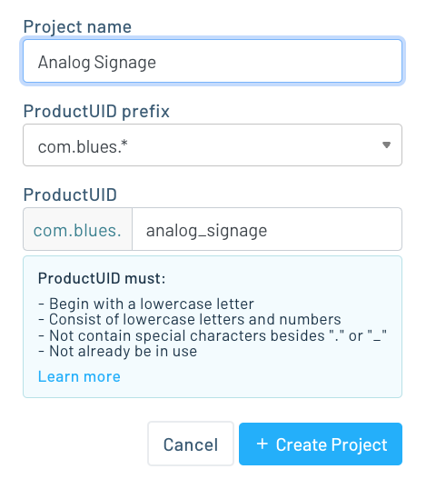
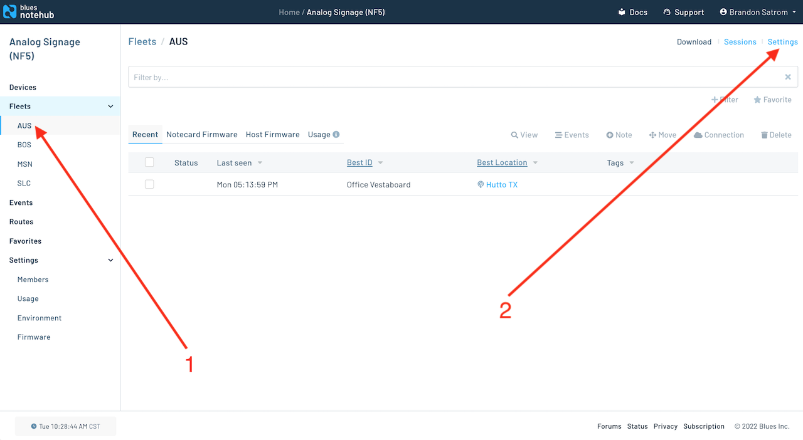
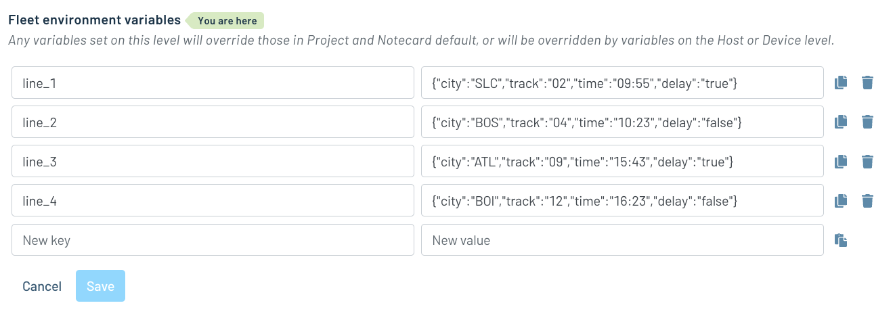

# Analog Signage Remote Control

Use the Notecard and a Wi-Fi-capable MCU to update character values on an analog split-flap display.

This project is built around a hypothetical entity, "Blues Railway," which manages a number of train stations throughout the Unites States. Each station contains a set of analog split-flap displays that provide visitors with real-time departure
information like city, track, time, and whether there is a delay. Departure information is set across the station using Fleet-level Notehub environment variables. Variable changes are sent to the Notecard and delivered to a Host MCU. The host MCU then uses its on-board Wi-Fi Connection to communicate with the signs in the facility and update the displayed information.

To run this project yourself you'll need to:

* [Configure Notehub](#notehub).
* [Purchase the necessary hardware](#hardware).
* [Flash the project’s firmware](#firmware).

## Notehub

This project leverages the Blues Notehub.io service. As such, to run this sample
you’ll need to create a Notehub account, start a new Notehub project, and configure
a handful of environment variables.

### Creating a New Project

1. Sign up for a free [Notehub](https://notehub.io) account, if you don’t have one
already.
1. Click the blue **Create Project** button in the top-right corner of the screen.
1. Give the project a name, such as “DisplayManager”, and then click the next
**Create Project** button.

### Configuring Environment Variables

The Analog Signage project uses [environment variables](https://dev.blues.io/guides-and-tutorials/notecard-guides/understanding-environment-variables/)
for sending text to a set of connected displays. Each variable is a valid JSON object with fields that the host MCU uses to configure text on a connected display.

For this project all environment variables need to be set up at the [fleet](https://dev.blues.io/reference/glossary/#fleet)
level, allowing you to configure different settings on different groups of
devices, if necessary.

Notehub creates an initial fleet for you when you start a new project, and you
can use that for setting your initial variables.

1. Navigate to your fleet in the navigation menu, and then click the **Settings**
link.

1. Click the **Environment** tab.
1. Scroll down to the **Fleet environment variables** heading, and define the
four variables: `line_1`, '`line_2`, `line_3`, and `line_4`.
1. Each variable will need a JSON value in the following format `{"city":"SLC","track":"02","time":"09:55","delay":"true"}`. The firmware in this repo expects keys like `city`, `track`, `time` and `delay`, while the values can be varied.
2. With all four defined, click the blue **Save** button.

With this your Notehub backend is fully configured, and you’re ready to start
setting up your hardware.

## Hardware

The following hardware is required to run the Indoor Floor-Level Tracker.

* [Notecarrier F](https://shop.blues.io/products/notecarrier-f)
* [Notecard](https://shop.blues.io/products/note-wbna-500)
* [FeatherS2 ESP32-S2 From Unexpected Maker](https://feathers2.io) or equivalent ESP32/Wi-Fi capable MCU.
* [Vestaboard](https://www.vestaboard.com/) or equivalent split-flap display.

Please note that the included firmware is optimized for the FeatherS2 MCU and Vestaboard, and will need to be customized if you select different hardware.

The Notecard, FeatherS2 microcontroller connect
to the Notecarrier-F as shown in the image below.

> **NOTE**: For a detailed look at how to connect the hardware, refer to the
[Notecard and Notecarrier-F quickstart guide](https://dev.blues.io/quickstart/notecard-quickstart/notecard-and-notecarrier-f/).

With the hardware assembled you next need to get the project’s firmware
running on your device.

## Firmware

The Analog Signage project has custom firmware that runs on
the FeatherS2 device. As a next step, complete the [firmware’s setup guide](firmware/)
to get your firmware up and running.

