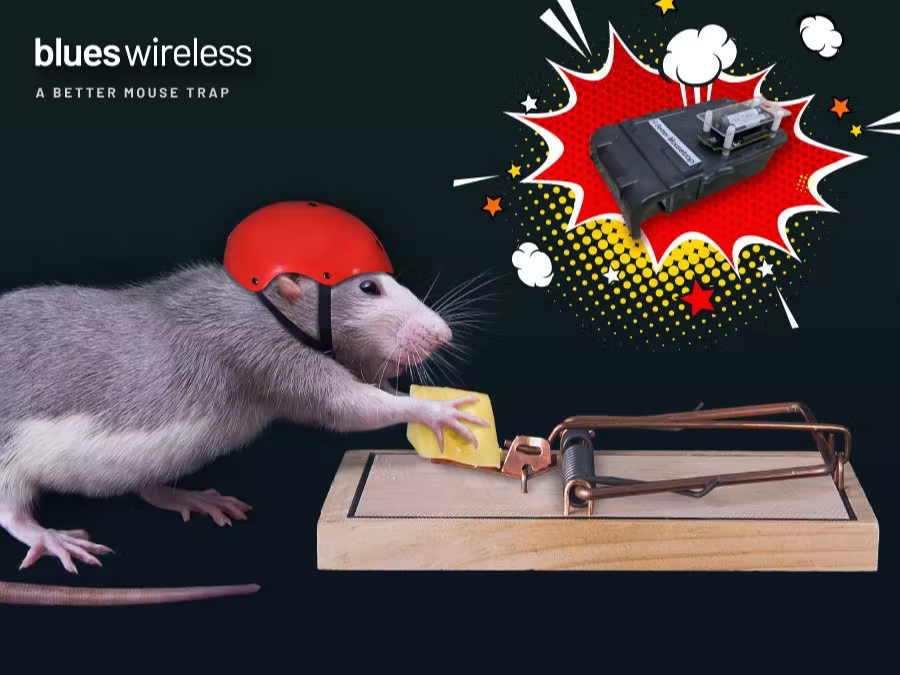

# Better Mouse Trap

A smarter mouse trap with SMS alerting.

Find the complete story in the detailed [Hackster.io writeup].

[][hackster.io writeup]

_A Better Mousetrap_ is a humane mousetrap that will alert you with an SMS when
it has caught a mouse.

- [Better Mouse Trap](#better-mouse-trap)
  - [You will need](#you-will-need)
    - [Parts](#parts)
    - [Tools](#tools)
  - [Hardware Setup](#hardware-setup)
    - [Modifying the Mousetrap](#modifying-the-mousetrap)
    - [Sparrow Setup](#sparrow-setup)
  - [Firmware](#firmware)
  - [Cloud Setup](#cloud-setup)
  - [SMS Alerts](#sms-alerts)
  - [System Test](#system-test)
    - [Blues Wireless Community](#blues-wireless-community)

## You will need

### Parts

- [Victor M333 Humane Mouse Trap](https://www.amazon.com/gp/product/B004CMNWES)
- [Blues Wireless WiFi + LoRa Dev Kit (Sparrow)](https://shop.blues.io/products/sparrow-dev-kit)
- [Clear Polycarbonate Sheet 1/16-in](https://www.amazon.com/gp/product/B07MQTDF4R)
- [M3-threaded Nylon Standoff Kit](https://www.amazon.com/gp/product/B07KP2ZFNJ)

### Tools

- Hand Drill
- 1/2 inch Drill Bit
- 1/8 inch Twist Drill

## Hardware Setup

### Modifying the Mousetrap

I used a LoRa-based [Blues Wireless Sparrow Development Kit] which has a passive
infrared (PIR) motion sensor on each sensor node. To allow the PIR sensor to see
into the trap, I cut a 1/2” hole in the lid of the Victor M333 Mousetrap. To
locate the circuit board securely, I cut four 1/8” holes to receive M3-threaded
nylon standoffs.

_Ggl9W9TOQ8.avif>)

### Sparrow Setup

Follow the [Sparrow quickstart]. Including:

- Plugging in some QWIIC connectors, setting a few dip switches
- Pressing a few `pair` buttons
- Setting your wifi credentials `{"req":"card.wifi","ssid":"<ssid name>","password":"<password>"}`

## Firmware

The Sparrow kit's PIR sensors and factory firmware are perfect to detect motion
in a mousetrap like this.

When the Sparrow sensor detects motion, it creates a message. The Sparrow
gateway, thanks to the onboard Notecard, forwards the message through Wi-Fi to
my home router.

_gUpTQaXMpg.avif>)
_g4ofhDRGNm.avif>)

## Cloud Setup

- Sign up for a free account on [Notehub.io], and create a new project.
- Configure the Notecard on the Sparrow Gateway with your Notehub ProductUID
  `{"req":"hub.set", "product":"com.your-company.your-name:your_product", "mode":"continuous"}`

## SMS Alerts

Notehub doesn’t have native SMS alerts yet, but it does allow you to route messages [to any other cloud services or HTTPS API endpoint][route] that your heart desires. I used Twilio, an inexpensive SMS service, to send message to my phone when there is motion in the trap.

To correctly format the request for the Twilio HTTP API I followed the Blues Wireless [Twilio SMS Guide] and [modified the JSONata] expression to tell me which mousetrap (Garage, Basement, etc.) saw motion based on the unique ID of the Sparrow sensor node I affixed to each trap.

_sghXhszUbO.avif>)

## System Test

To trigger the PIR sensor, flip the trap upside down and back upright. You should see an event on [Notehub.io] and an SMS message on your phone.

_TOXG7lKQRu.avif>)

### Blues Wireless Community

We’d love to hear about you and your project on the [Blues Wireless Community Forum].

[blues wireless community forum]: https://discuss.blues.io/
[blues wireless sparrow development kit]: https://shop.blues.io/products/sparrow-dev-kit?&utm_source=github&utm_medium=web&utm_campaign=nf&utm_content=nf3
[hackster.io writeup]: https://www.hackster.io/hendersoncarlton/i-love-checking-on-mousetraps-said-no-one-ever-52c5e7
[modified the jsonata]: ./mousetrap.jsonata
[notecard]: https://shop.blues.io/collections/notecard?&utm_source=github&utm_medium=web&utm_campaign=nf&utm_content=nf3
[notehub.io]: https://notehub.io
[route]: https://dev.blues.io/guides-and-tutorials/routing-data-to-cloud/?&utm_source=github&utm_medium=web&utm_campaign=nf&utm_content=nf3
[sparrow quickstart]: https://dev.blues.io/quickstart/sparrow-quickstart/?&utm_source=github&utm_medium=web&utm_campaign=nf&utm_content=nf3#set-up-notecard
[sparrow]: https://shop.blues.io/products/sparrow-dev-kit?&utm_source=github&utm_medium=web&utm_campaign=nf&utm_content=nf3
[twilio sms guide]: https://dev.blues.io/guides-and-tutorials/twilio-sms-guide/?&utm_source=github&utm_medium=web&utm_campaign=nf&utm_content=nf3
