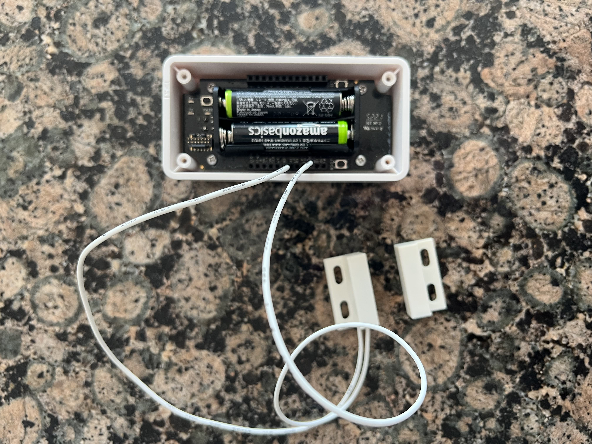
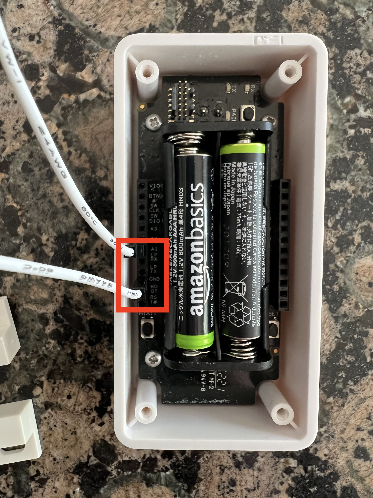
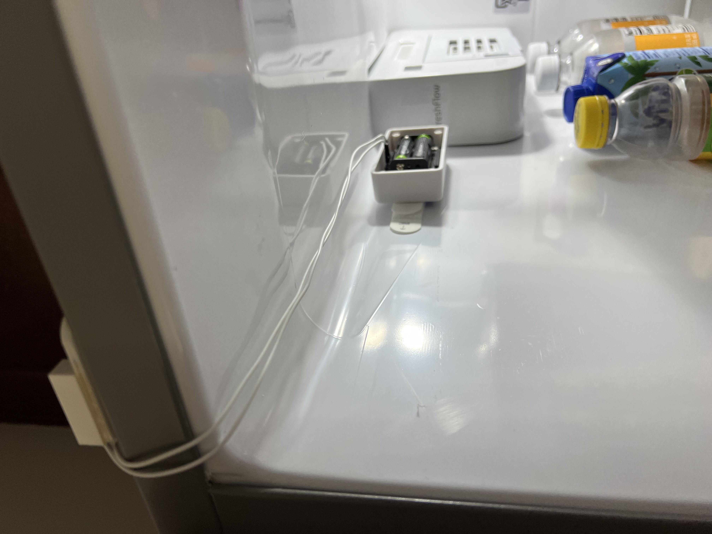
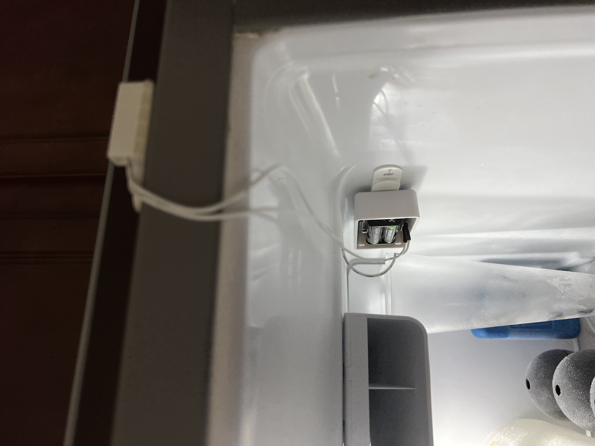
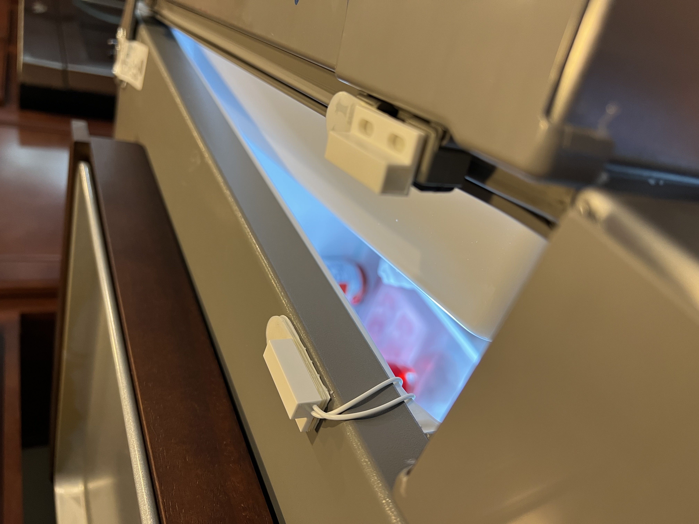
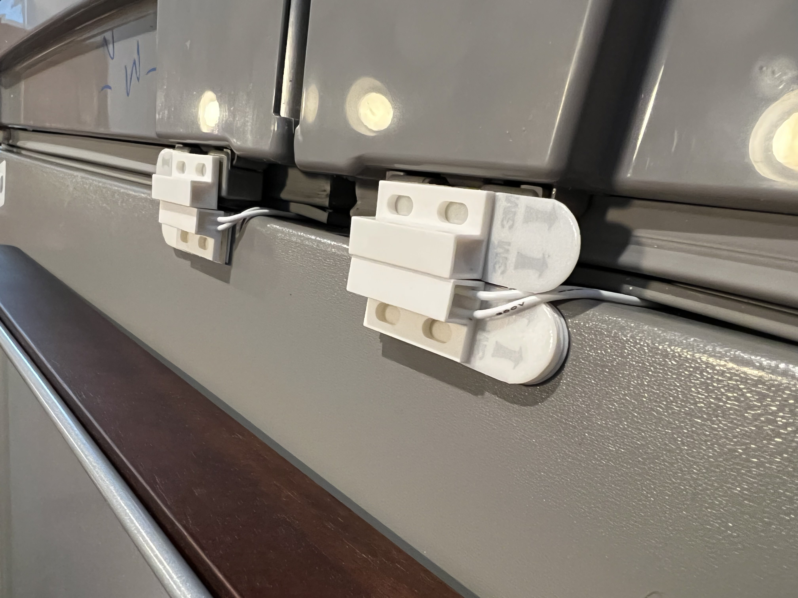
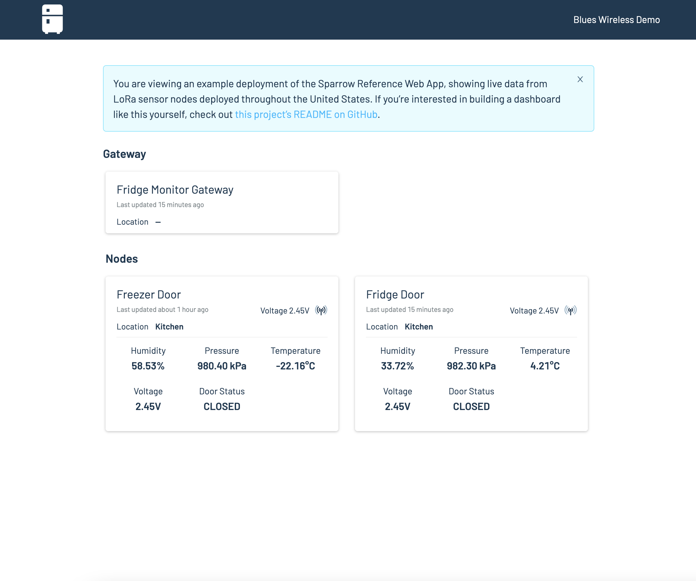

# Fridge Fleet Monitor

LoRa-based temperature, humidity and door open/close state for a fleet of refrigerators. To run this project yourself you'll need to:

* [Purchase the necessary hardware and configure it](#hardware)
* [Flash the project's firmware](#firmware)
* [Run the project's web application](#web-application)

## Hardware 

The following hardware is required to run the Fridge Fleet Monitor.

* [Sparrow Development Kit](https://shop.blues.io/products/sparrow-dev-kit)
* [Adafruit magnetic contact switch (door sensor) x 2](https://www.adafruit.com/product/375)

After purchasing your Sparrow development kit, head to [dev.blues.io](https://dev.blues.io/quickstart/sparrow-quickstart/) to get started setting up your Sparrow gateway and Sparrow nodes, including setting up Notehub and the Notecard. 

In addition to the Sparrow quickstart, also connect the Adafruit magnetic contact switch to each Sparrow node by plugging one connector cable into the `A1` pin slot and the other into the `GND` pin slot. See images below.

## Firmware

Now that the hardware is put together, you need to get the project's firware running on your devices.

Refer to the [`README.md`](firmware/README.md) file in this project's `firmware` folder for full instructions.

### Hardware Installation

With the hardware assembled and the proper firmware flashed, install each Sparrow node inside of the refrigerator where it will be monitoring conditions.

It's recommended, if possible, to attach the Sparrow node close enough to the door of the fridge that the magnetic switches can be positioned next to each other on the exterior of the door. 

To attach the Sparrow node inside the fridge, use Command Strips or some other adhesive strip attached to the front of the node, and wipe down the area to place with node with rubbing alcohol prior to attaching.

> **NOTE**: Be advised batteries are not an optimal power source in cold conditions, and it's recommended to have a steady state power source for long term projects, as well as some sort of shield to protect the back of the sparrow enclosure where the magnetic door switch wires are connected to the node.

Likewise, to install the door sensors, attach each piece on one side of the door and ensure they line up as closely as possible (notice in the example photos, several Command Strips were stacked together to make sure the switch pieces were as level with each other as possible). See images below.

## Web Application

The Fridge Fleet Monitor's web application is based on the [Sparrow Reference Web App](https://github.com/blues/sparrow-reference-web-app). 

Refer to the [`README.md`](web-app/README.md) file in this project's `web-app` folder for full instructions.

If all goes well, you'll end up with a Fridge Fleet Monitor dashboard similar to this one.

