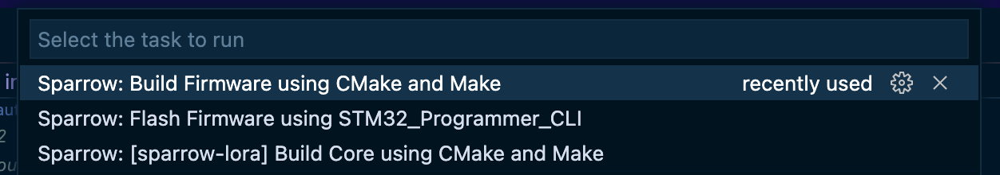
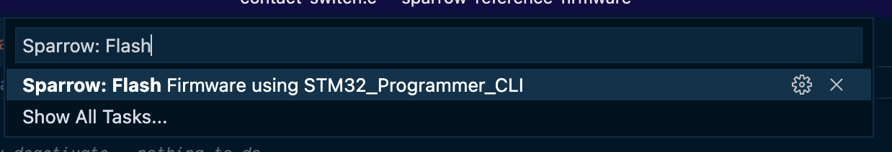

# Fridge Fleet Monitor Firmware

This project's firware is a variant of the [Blues Wireless Sparrow Reference Firware](https://github.com/blues/sparrow-reference-firmware).

To run the firmware, start by ensuring you have the prerequisites below installed.

### Prerequisites

1. Download and install [Visual Studio Code](https://code.visualstudio.com/)
2. Download and install [STM32CubeProgrammer software](https://www.st.com/en/development-tools/stm32cubeprog.html).

### Opening and building

Once you have VS Code installed and the STM32CubeProgrammer, you next to open the firmware locally.

1. Download or clone the [Sparrow Reference Firmware](https://github.com/blues/sparrow-reference-firmware) repo from GitHub so you have a copy of the code locally. Use `git clone https://github.com/blues/sparrow-reference-firmware --recursive` to ensure you pick up the code in the submodule folders associated with this repo.
2. Open the project inside of VS Code and navigate to the `init.c` file in the `sparrow-application` folder.
3. Change the code in this file to read as follows. This will enable the Sparrow's BME environment sensor and the attached Adafruit contact switch sensor.
```cpp
// Scheduled App Header(s)
#include "bme/bme.h"
#include "contact-switch/contact-switch.h"

void schedAppInit (void) {
    // Will not initialize if BME280 is not detected
    bmeInit();

    // Will initialize door sensor if contact switch sensor is not detected
    if(!contactSwitchInit()) {
        APP_PRINTF("ERROR: Failed to initialize contact switch application!\r\n");
    }
}
```
1. Open up VS Code's task runnger using Terminal > Run Task, and build the firmware by running the task `Sparrow build firmware using CMake and Make`


### Flashing

With the firmware opened, modified, and built, it's time to flash the new firware to each Sparrow node.

Complete the following steps to flash the Sparrow reference firmware to each Sparrow node.

1. Connect the Sparrow node to your computer using an [STLINK-V3MINI programmer and debugger](https://shop.blues.io/products/stlink-v3mini) and microUSB to USB-A cable.
2. Reopen the VSCode task runner using Terminal > Run Task, and select `Sparrow Flash Firmware using STM32_Programmer_CLI`


Now, you should be ready to install your new hardware. Head back to the main [README](../../README.md) for further instructions.
