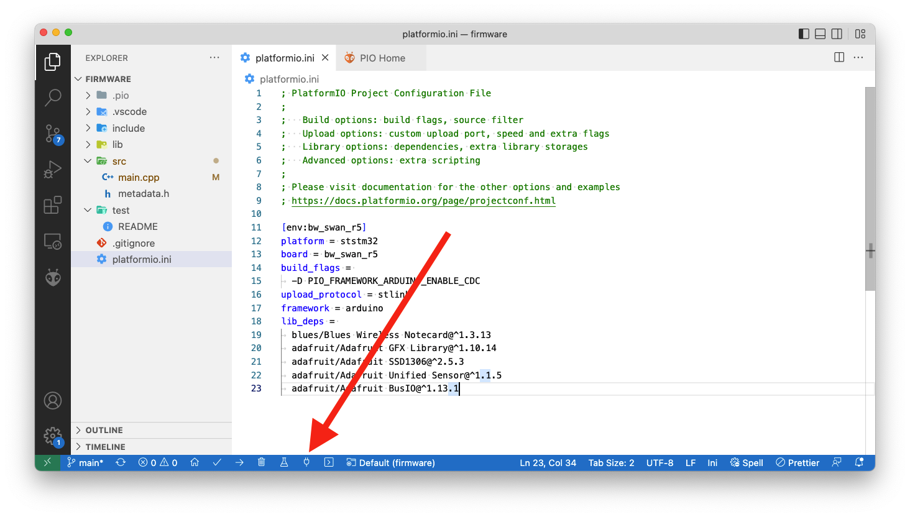

# Indoor Floor-Level Tracker

A highly accurate floor-level tracker for response teams at emergency events. To run
this project yourself you’ll need to:

* Sign up for a free [Notehub](https://notehub.io) account.
* Purchase the necessary [hardware](#hardware).
* Flash the project’s [firmware](#firmware).
* Run the project’s [web application](#web-application).

## Hardware

The following hardware is required.

* [Feather Starter Kit for Swan](https://shop.blues.io/products/notecarrier-swan)
* [BMP581](https://www.sparkfun.com/products/20170)
* [Qwiic Cable](https://www.sparkfun.com/products/14427)

For a detailed look at how to connect the hardware, see this project’s
writeup on Hackster.

## Firmware

This project’s firmware is built with [Platform.io](https://platformio.org/) as an
Arduino application. To run the firmware, start by ensuring you have the prerequisites
below installed.

### Prerequisites

1. Download and install [Visual Studio Code](https://code.visualstudio.com/).
1. Install the [PlatformIO IDE extension](https://marketplace.visualstudio.com/items?itemName=platformio.platformio-ide)
via the Extensions menu of Visual Studio Code.

### Opening

Once you have Visual Studio Code and the PlatformIO extension installed, you next need
to open the firmware within PlatformIO.

1. Download or clone this repository, so that you have a copy of the firmware source
code locally.
1. Open the PlatformIO extension by clicking on the PlatformIO logo in the menu bar. Next,
click the “Open” option under the “PIO Home” menu  and finally “Open Project”.

1. Select the `firmware` folder from within your local copy of this repository,
and click the **Open "firmware"** button.

### Flashing

With the firmware project open, you can now make any changes you’d like to the firmware
source code, and then flash the firmware to your device.

> **NOTE**: The project’s default configuration assumes you’re using an
[STLINK-V3MINI programmer and debugger](https://shop.blues.io/products/stlink-v3mini).
If you’re not, [complete these steps](https://dev.blues.io/quickstart/swan-quickstart/#without-the-stlink-v3mini)
so that you can upload firmware over DFU.

To upload firmware in PlatformIO, click the checkmark button that appears at the bottom
of your Visual Studio Code window.

Once the firmware is running on your device, you might additionally want to open a serial
monitor to view the firmware’s logs. You can do so by clicking the plug button that appears
at the bottom of your Visual Studio Code window.

### Configuration

TODO: Discuss common firmware variables you may want to tweak.

## Web Application

TODO: Web application documentation.
