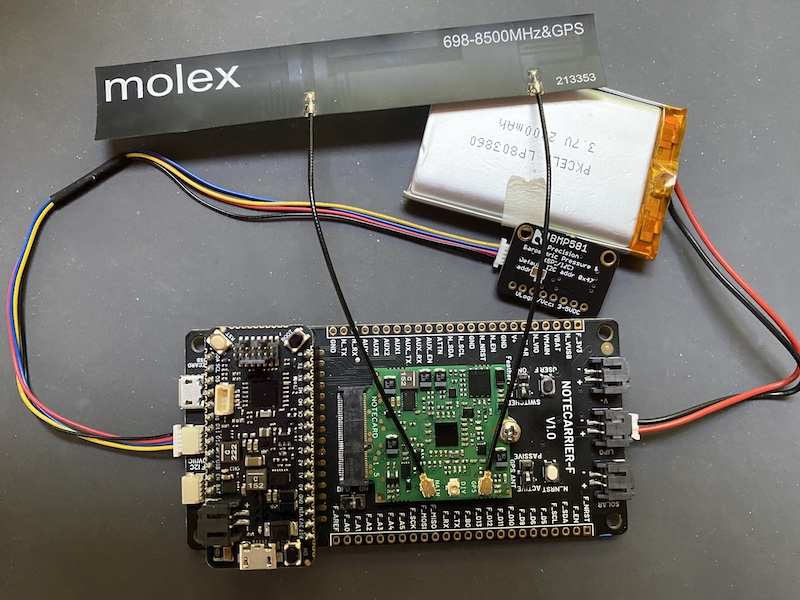

# Indoor Floor-Level Tracker

A highly accurate floor-level tracker for response teams at emergency events. To run
this project yourself you’ll need to:

* [Configure Notehub](#notehub-setup).
* [Purchase the necessary hardware](#hardware).
* [Flash the project’s firmware](#firmware).
* [Run the project’s web application](#web-application).

## Notehub

The Indoor Floor-Level Tracker runs on top of Notehub. As such, to run this sample
you’ll need to create a Notehub account, start a new Notehub project, and configure
a handful of environment variables.

### Creating a New Project

1. Sign up for a free [Notehub](https://notehub.io) account, if you don’t have one
already.
1. Click the blue **Create Project** button in the top-right corner of the screen.
1. Give the project a name, such as “FloorTracker”, and then click the next
**Create Project** button.


### Configuring Environment Variables

The Indoor Floor-Level Tracker uses [environment variables](https://dev.blues.io/guides-and-tutorials/notecard-guides/understanding-environment-variables/)
for storing project settings that need to be shared and synchronized across
devices.

For this project all environment variables need to be set up at the [fleet](https://dev.blues.io/reference/glossary/#fleet)
level, allowing you to configure different settings on different groups of
devices, if necessary.

Notehub creates an initial fleet for you when you start a new project, and you
can use that for setting your initial variables.

1. Navigate to your fleet in the navigation menu, and then click the **Settings**
link.

1. Click the **Environment** tab.
1. Scroll down to the **Fleet environment variables** heading, and define the
four variables below.
    1. `baseline_floor`: (integer) The floor a device is at when starting up. `1` is
    a good default, and only needs to be overrode if starting up devices when not at
    ground level.
    1. `floor_height`: (number) An optional height (in meters) of the floors in the
    current building. If not provided or blank, the firmware uses a default value.
    1. `live`: (bool) Whether devices should actively be tracking and reporting. You’ll
    want to set this to `false` until you’re ready to start testing.
    1. `no_movement_threshold`: (number) The number of minutes to allow before firing
    an alarm if a device has not moved floors.
1. With all four defined, click the blue **Save** button.


With this your Notehub backend is fully configured, and you’re ready to start
setting up your hardware.

## Hardware

The following hardware is required to run the Indoor Floor-Level Tracker.

* [Feather Starter Kit for Swan](https://shop.blues.io/products/notecarrier-swan)
* [BMP581](https://www.sparkfun.com/products/20170)
* [Qwiic Cable](https://www.sparkfun.com/products/14427)

The Notecard, Swan microcontroller, Molex antenna, and BMP581 all connect
to Notecarrier-F as shown in the image below.



> **NOTE**: For a detailed look at how to connect the hardware, refer to the
[Notecard and Notecarrier-F quickstart guide](https://dev.blues.io/quickstart/notecard-quickstart/notecard-and-notecarrier-f/).

With the hardware assembled you next need to get the project’s firmware
running on your device.

## Firmware

This project’s firmware is built with [Platform.io](https://platformio.org/) as an
Arduino application. To run the firmware, start by ensuring you have the prerequisites
below installed.

### Prerequisites

1. Download and install [Visual Studio Code](https://code.visualstudio.com/).
1. Install the [PlatformIO IDE extension](https://marketplace.visualstudio.com/items?itemName=platformio.platformio-ide)
via the Extensions menu of Visual Studio Code.


### Opening

Once you have Visual Studio Code and the PlatformIO extension installed, you next need
to open the firmware within PlatformIO.

1. Download or clone this repository, so that you have a copy of the firmware source
code locally.
1. Open the PlatformIO extension by clicking on the PlatformIO logo in the menu bar. Next,
click the “Open” option under the “PIO Home” menu  and finally “Open Project”.

1. Select the `firmware` folder from within your local copy of this repository,
and click the **Open "firmware"** button.


### Flashing

With the firmware project open, you can now make any changes you’d like to the firmware
source code, and then flash the firmware to your device.

Complete the following steps to upload firmware in in PlatformIO.

1. Connect your Swan to your computer using [these steps](https://dev.blues.io/quickstart/swan-quickstart/#programming-swan-platformio).

> **NOTE**: The project’s default configuration assumes you’re using an
[STLINK-V3MINI programmer and debugger](https://shop.blues.io/products/stlink-v3mini).
If you’re not, make sure to open your `platformio.ini` file and change the `upload_protocol`
to `dfu`.

2. Once you have everything connected, click the checkmark button that appears at the
bottom of your Visual Studio Code window.


Once the firmware is running on your device, you might additionally want to open a serial
monitor to view the firmware’s logs. You can do so by clicking the plug button that appears
at the bottom of your Visual Studio Code window.


The firmware has both an idle mode and a live mode, which you can control with your fleet’s
`live` environment variable.

When in idle mode (`live: false`) the firmware monitors for environment variable changes,
but does not read from the sensor or send readings.

When in live mode (`live: true`) the firmware constantly reads the pressure level on the
BMP581 and immediately sends a note under the following conditions.

* **The floor level changes.** If the firmware determines a device has changed floors, it
sends a `floor.qo` note.
* **The no-movement threshold has been surpassed.** If the firmware determines a device has
not changed floors in the interval configured by the `no_movement_threshold` environment
variable, it sends an `alarm.qo` note.

Once you have the firmware running, you may want to change the fleet’s `live` environment
variable to `true` to test floor changing and the alarm logic. You will likely also want
to attach a LiPo battery to the Notecarrier-F so you take your hardware away from your
computer for testing.

When you are testing you can manually view events as they come in on Notehub, but it’s
far easier to monitor your devices in this project’s web application.

## Web Application

The Indoor Floor-Level Tracker’s web application allows you to view device data and 
manage environment variables in a browser.

To get started, make sure you have a copy of this project’s repository locally, and
then open up the `indoor-floor-level-tracker/web-app` folder in your text editor or
IDE.

From there, complete the [Web Application Development Overview](https://github.com/blues/nifty-fifty/wiki/Web-Application-Development-Overview/_edit), which walks
you through installing all of the web app’s dependencies, setting up a Notehub
route, creating a database, and running the application.

When you’re done, there’s one additional web environment variable you’ll need to
add for the Indoor Floor-Level Tracker to work. To do so, open your web app’s
`.env` file and add the following line.

```
HUB_FLEET_UID=fleet:00000000-0000-0000-0000-000000000000
```

Next, open your Notehub project, navigate to your project’s fleet you set up
earlier, and find your fleet’s UID in its settings. Copy this UID, and paste
it in your `.env` file (replacing the `fleet:0000...` placeholder.)


And with that last change in place, you’re ready to start the
app up with `yarn dev`.

```bash
yarn dev
```

If all went well, you should see your devices and a form for changing Notehub
environment variables.

> **TODO**: Add image of the final web application
