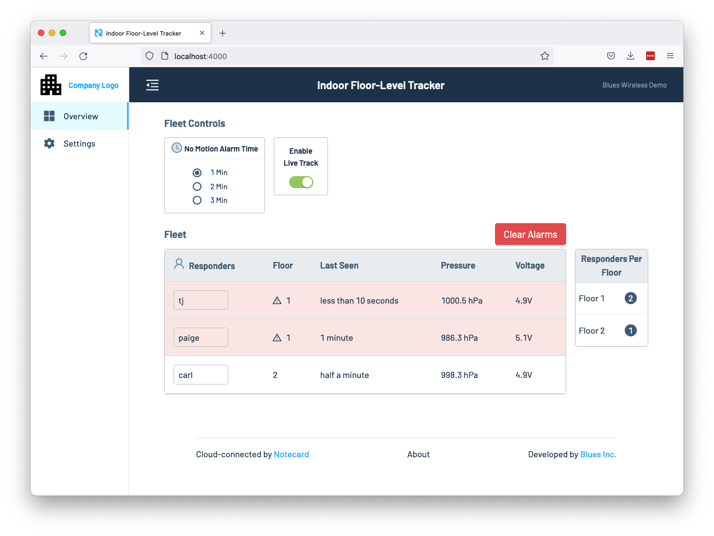

# Indoor Floor-Level Tracker Web App

The Indoor Floor-Level Tracker’s web application allows you to view device data and 
manage environment variables in a browser.

To get started, make sure you have a copy of this project’s repository locally, and
then open up the `indoor-floor-level-tracker/web-app` folder in your text editor or
IDE.

From there, complete the [Web Application Development Overview](https://github.com/blues/nifty-fifty/wiki/Web-Application-Development-Overview/_edit), which walks
you through installing all of the web app’s dependencies and running the application.

When you’re done, there’s one additional web environment variable you’ll need to
add for the Indoor Floor-Level Tracker to work. To do so, open your web app’s
`.env` file and add the following line.

```
HUB_FLEET_UID=fleet:00000000-0000-0000-0000-000000000000
```

Next, open your Notehub project, navigate to your project’s fleet you set up
earlier, and find your fleet’s UID in its settings. Copy this UID, and paste
it in your `.env` file (replacing the `fleet:0000...` placeholder.)


And with that last change in place, you’re ready to start the
app up with `yarn dev`.

```bash
yarn dev
```

If all went well, you should see your devices and data, as well as a settings
form for changing environment 

