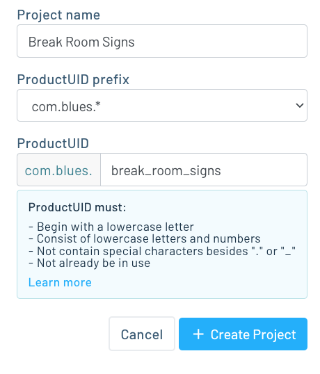
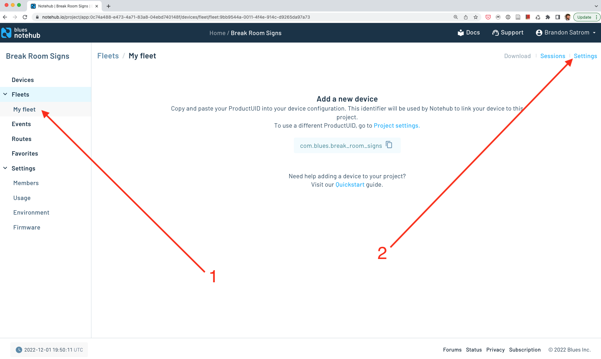
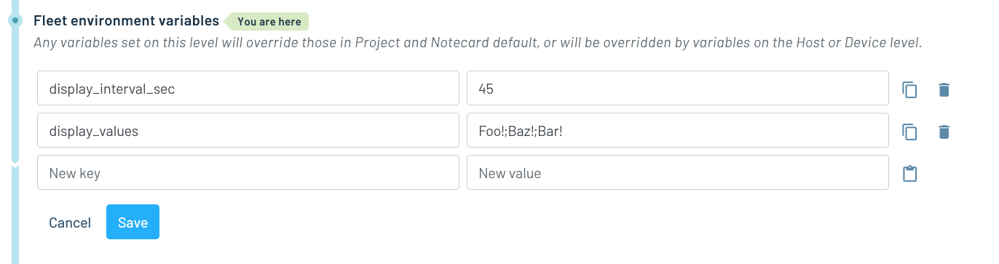
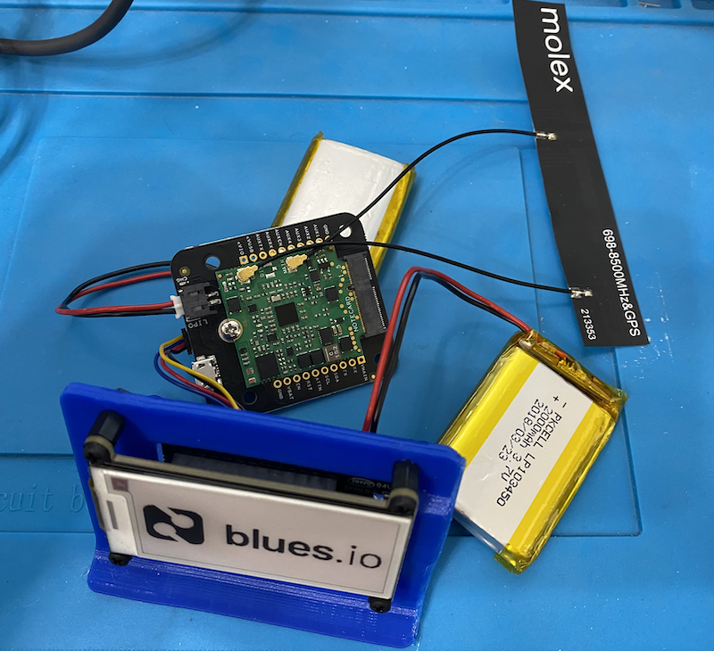

# Low Power Digital Signage

Use the Notecard and Notehub.io to keep a fleet of digital displays synchronized across a facility.

To run this project yourself you'll need to:

* [Configure Notehub](#notehub).
* [Purchase the necessary hardware](#hardware).
* [Format and load images for display onto an SD Card](#format-images-for-display).
* [Flash the project’s firmware](#firmware).
* [Update environment variables to display text and images](#update-environment-variables).

## Notehub

The Low Power Digital Signage app runs on top of Notehub. As such, to run this sample you’ll need to create a Notehub account, start a new Notehub project, and configure a handful of environment variables.

### Creating a New Project

1. Sign up for a free [Notehub](https://notehub.io) account, if you don’t have one
already.
1. Click the blue **Create Project** button in the top-right corner of the screen.
1. Give the project a name, such as "Break Room Signs", and then click the next
**Create Project** button.


### Configuring Environment Variables

The app uses [environment variables](https://dev.blues.io/guides-and-tutorials/notecard-guides/understanding-environment-variables/)
for storing project settings that need to be shared and synchronized across
devices.

For this project all environment variables need to be set up at the [fleet](https://dev.blues.io/reference/glossary/#fleet)
level, allowing you to configure different settings on different groups of
devices, if necessary.

Notehub creates an initial fleet for you when you start a new project, and you
can use that for setting your initial variables.

1. Navigate to your fleet in the navigation menu, and then click the **Settings**
link.

1. Click the **Environment** tab.
1. Scroll down to the **Fleet environment variables** heading, and define the
two variables below.
    1. `display_values` which is a semicolon-delimited (`;`) string of text to display and/or bitmap images to load from an SD card to the e-ink display. If this variable has a single value (either text or an image name), that will be loaded. Otherwise, the values are loaded into an array and the host will display one item at a time using the `display_interval_sec` variable or a default value, if not set.
    1. `display_interval_sec` is the number of seconds to display text or an image on the screen before rotating to the next item in the list.

1. With both defined, click the blue **Save** button.


With this your Notehub backend is fully configured, and you’re ready to start
setting up your hardware.

## Hardware

The following hardware is required to run the Indoor Floor-Level Tracker.

* [Blues Notecard](https://shop.blues.io/collections/notecard)
* [Blues Notecarrier B](https://shop.blues.io/products/carr-b)
* [Blues Swan](https://shop.blues.io/collections/swan/products/swan)
* [2.13" Tri-Color e-Ink Display FeatherWing](https://www.adafruit.com/product/4814)
* [Qwiic Cable](https://www.sparkfun.com/products/14427)
* A MicroSD card if you plan to display bitmap images on the screen.
* 2x LiPo Batteries of any size, like [these](https://www.adafruit.com/product/328) from Adafruit or [from Blues](https://shop.blues.io/collections/accessories).

Additionally, if you want to place the project on a stand, [this 3D printed stand](https://learn.adafruit.com/eink-featherwing-display-stand) is perfect for the 2.13" display. You'll also need some [M2.5 thread machine screws and nuts to connect the display to the stand](https://www.adafruit.com/product/3299).

The Swan microcontroller plugs into the Feather slot on the back of the display and is connected to the Notecard and Notecarrier B via the Qwiic cable, as shown in the image below.



> **NOTE**: For a detailed look at how to connect the hardware, refer to the
[Notecard and Notecarrier B quickstart guide](https://dev.blues.io/quickstart/notecard-quickstart/notecard-and-notecarrier-b/).

With the hardware assembled you next need to get the project’s firmware
running on your device.

## Format Images for Display

The [assets/bitmap/](/assets/bitmaps/) folder contains a number of bitmaps formatted for the 2.13" display. Simply copy these onto the root of a FAT formatted MicroSD card, and the firmware for this project will detect them.

If you want to show your own images on the display, see [this guide](https://learn.adafruit.com/preparing-graphics-for-e-ink-displays?view=all) for detailed instructions on formatting and saving images for e-ink displays. Make sure to crop your images to 250x122 for display on the 2.13" screen.

## Firmware

The Low Power Digital Signage project has custom firmware that runs on
the Swan. As a next step, complete the [firmware’s setup guide](firmware/)
to get your firmware up and running.

## Update Environment Variables

Once the app is running, you can update the display using the environment variables above, either using the Notehub UI or one of the shell scripts in the [`scripts`](/scripts/) folder.

The scripts use the Notehub API, so you'll need follow the [instructions here](https://dev.blues.io/reference/notehub-api/api-introduction/#authentication) to get an authentication token.

You'll also need your Notehub project's UID, which you can find in the `Settings` screen. For setting fleet variables, you'll need the Fleet UID, which you can find on the `Settings` tab for your fleet. For device variables, you need the Device UID, which you can find on the device screen.

```bash
./update-device.sh -p app:1234 -d dev:5678 -t <your token> -i 45 -v 'Hello Notecard!;banner-ad.bmp;bluesio.bmp;Happy Wednesday;notecard_8bit.bmp;bw_logo.bmp;icon.bmp;logo.bmp;notecard.bmp'
````