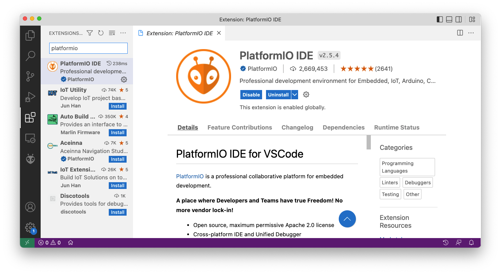
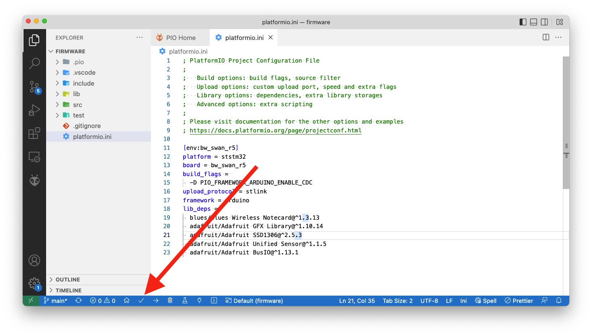
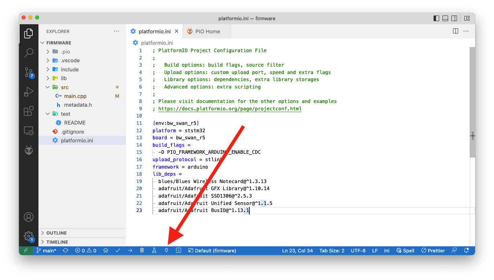
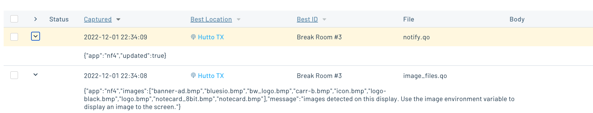

# Low Power Digital Signage Firmware

The Low Power Digital Signage project firmware is built with [Platform.io](https://platformio.org/)
as an Arduino application. To run the firmware, start by ensuring you have
the prerequisites below installed.

## Prerequisites

1. Download and install [Visual Studio Code](https://code.visualstudio.com/).
1. Install the [PlatformIO IDE extension](https://marketplace.visualstudio.com/items?itemName=platformio.platformio-ide)
via the Extensions menu of Visual Studio Code.

### Opening

Once you have Visual Studio Code and the PlatformIO extension installed, you next need
to open the firmware within PlatformIO.

1. Download or clone this repository, so that you have a copy of the firmware source
code locally.
1. Open the PlatformIO extension by clicking on the PlatformIO logo in the menu bar. Next,
click the “Open” option under the “PIO Home” menu  and finally “Open Project”.

1. Select the `firmware` folder from within your local copy of this repository,
and click the **Open "firmware"** button.

### Flashing

With the firmware project open, you can now make any changes you’d like to the firmware
source code, and then flash the firmware to your device.

Complete the following steps to upload firmware in in PlatformIO.

1. Connect your Swan to your computer using [these steps](https://dev.blues.io/quickstart/swan-quickstart/#programming-swan-platformio).

> **NOTE**: The project’s default configuration assumes you’re using an
[STLINK-V3MINI programmer and debugger](https://shop.blues.io/products/stlink-v3mini).
If you’re not, make sure to open your `platformio.ini` file and change the `upload_protocol`
to `dfu`.

2. Once you have everything connected, click the checkmark button that appears at the
bottom of your Visual Studio Code window.

Once the firmware is running on your device, you might additionally want to open a serial
monitor to view the firmware’s logs. You can do so by clicking the plug button that appears
at the bottom of your Visual Studio Code window.

The firmware operates on two environment variables, which you can set at the fleet or device level using either the Notehub UI or one of the [shell scripts in the `scripts` folder](../scripts/).

1. `display_values` which is a semicolon-delimited string of text to display and/or bitmap images to load from an SD card to the e-ink display. If this variable has a single value (either text or an image name), that will be loaded. Otherwise, the values are loaded into an array and the host will display one item at a time using the `display_interval_sec` variable or a default value, if not set.
1. `display_interval_sec` is the number of seconds to display text or an image on the screen before rotating to the next item in the list.

Additionally, the firmware sends outbound Notes to the Notecard and Notehub in several cases:

- When updated environment variables are received on the Notecard and parsed by the host, a simple notification is sent.
- On startup, if an SD card is plugged into the display and one or more `.bmp` files are detected, a Note is sent with a list of file names that can be used to set the `display_values` environment variable.
- If the host is unable to load an image from the SD card because the file is not found, a notification is sent.
- If the loaded image is not in the correct dimensions (255x122), the image will not be loaded and a notification is sent.

Once you have the firmware running, you'll want to set the environment variables above to test the application. If you want to deploy this app to multiple devices for fleet testing, make sure you attach a LiPo battery to both the Swan and Notecarrier B.

When you are testing you can manually view events as they come in on Notehub, and use the UI or included scripts to update environment variables.