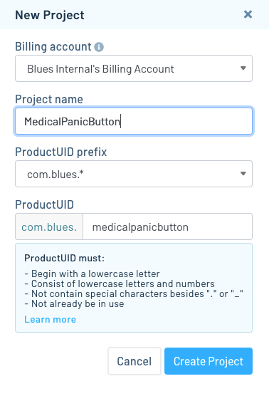
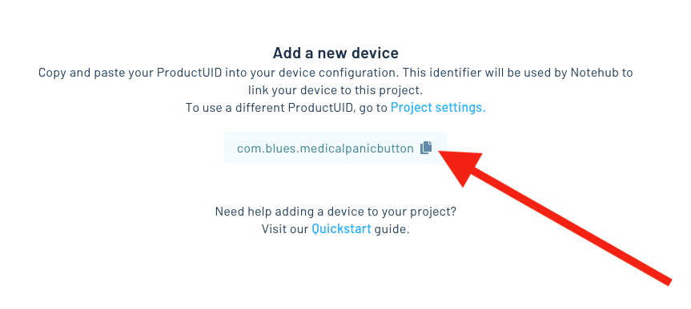

# Medical Panic Button

Press a button to send a low latency alert for medical assistance.

-- Hackster image --

To run this project yourself you’ll need to:

* [Purchase and assemble the necessary hardware](#hardware-setup).
* [Configure Notehub](#notehub-setup).
* [Configure Your Notecard](#notecard-setup).
* [Set up Twilio for SMS](#twilio-setup).

## Hardware Setup

The following hardware is required to run the Medical Panic Button.

* [Notecarrier-B](https://shop.blues.io/products/carr-b)
* [Cellular Notecard](https://shop.blues.io/collections/notecard) (LTE Cat-1 versions are highly recommended)
* [LiPo battery](https://www.adafruit.com/product/2011)

> **TODO**: Add the final button, neopixel board, and enclosure we come up with.

## Notehub Setup

The Medical Panic Button project runs on top of Notehub. As such, to run this app you’ll need to create a Notehub account, and start a new Notehub project.

1. Sign up for a free [Notehub](https://notehub.io) account, if you don’t have one
already.
1. Click the blue **Create Project** button in the top-right corner of the screen.
1. Give the project a name, such as “MedicalPanicButton”, and then click the **Create Project** button in the modal.

One Notehub finishes creating your project, copy your new ProductUID as you’ll need it in the next step.

## Notecard Setup

Now that your cloud backend ready, you next need to configure your Notecard so it knows where to send data.

There are two main ways to configure the Notecard:

1. The [Notecard CLI](https://dev.blues.io/tools-and-sdks/notecard-cli/): a downloadable CLI for working with the Notecard
2. The [Notecard Playground](https://dev.blues.io/notecard-playground/): an in-browser terminal emulates the CLI in a web browser.

This guide will show how to set up a Notecard using the Notecard Playground, but if you’d like to use the CLI you’ll need to, 1) [install it](https://dev.blues.io/tools-and-sdks/notecard-cli/#installation), and 2) check out [this section on how to run a setup script](https://dev.blues.io/tools-and-sdks/notecard-cli/#run-a-setup-script).

## Twilio Setup

