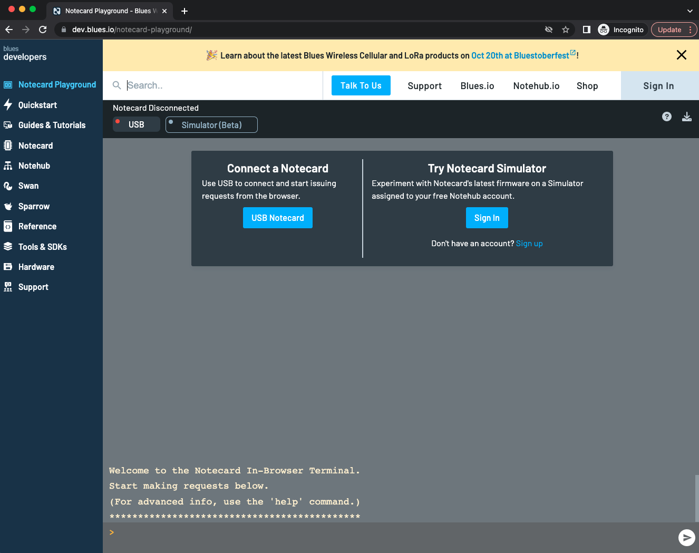
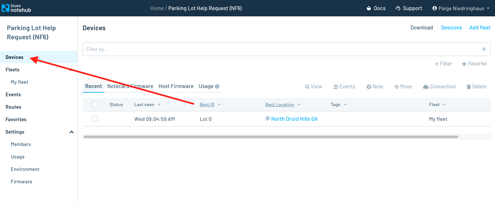
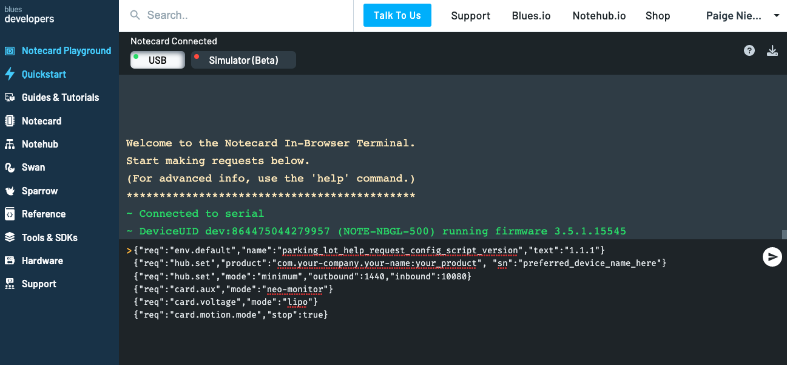
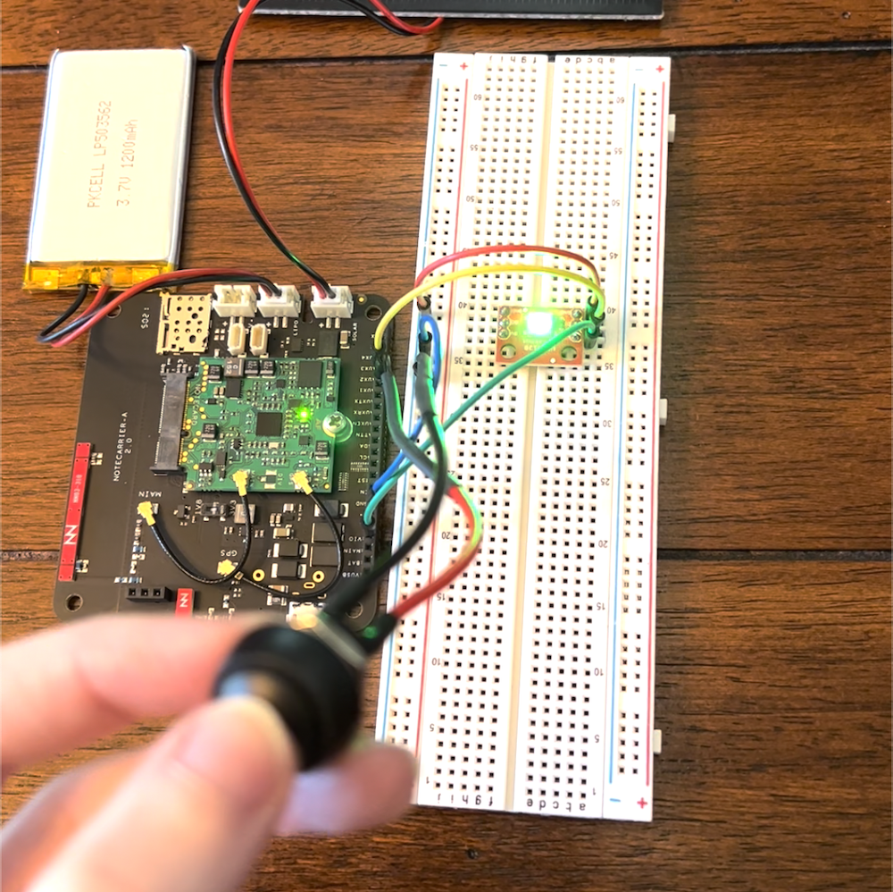
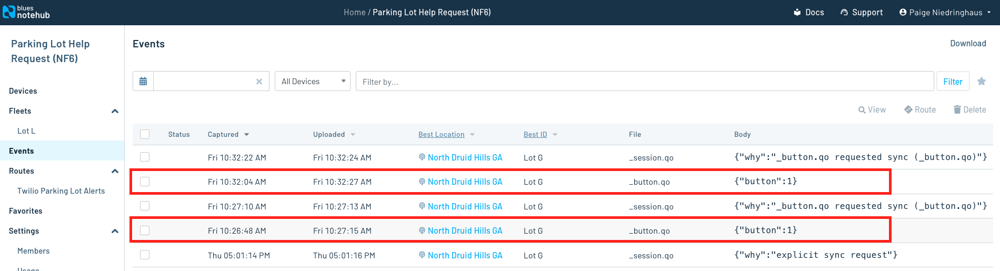
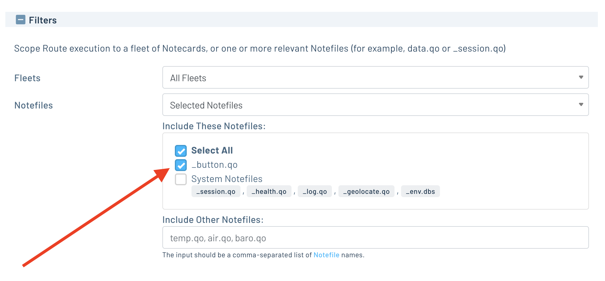
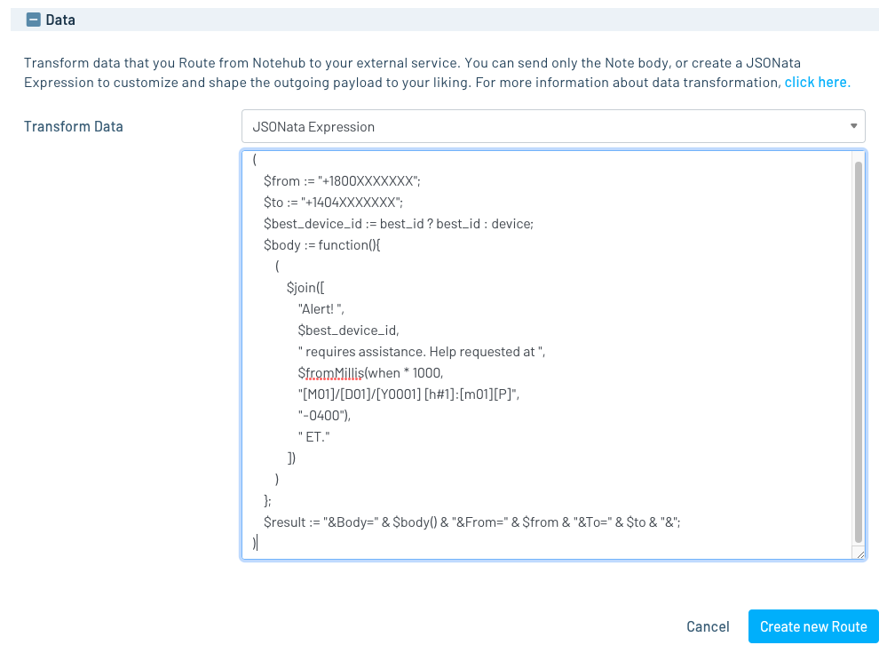

# Parking Lot Help Request Firmware

This project is host-free because the Notecard itself can be configured to send notes to Notehub when the help button is pressed.

Instead of a true firmware setup guide, the [first part](#configure-the-notecard) of this document will guide you through creating a reusable Notecard configuration script which can be executed through the [Notecard CLI](https://dev.blues.io/tools-and-sdks/notecard-cli/) or through the [online webREPL](https://dev.blues.io/notecard-playground/) available on the Blues Developer Experience site.

The [second section](#transform-notehub-data-with-jsonata-for-twilio), covers a data transformation you need to provide in your Notehub project to trigger SMS alerts.

### Configure the Notecard

There are two main ways to program a standalone Notecard that will not be interacting with a host microcontroller: 
1. [The Notecard CLI](https://dev.blues.io/tools-and-sdks/notecard-cli/): a downloadable CLI designed for the Notecard.
2. The [Notecard Playground](https://dev.blues.io/notecard-playground/): an in-browser terminal that emulates much of the functionality of the Notecard CLI. 

Both of these tools are accessible through the Blues [Developer Experience site](https://www.dev.blues.io).

> **NOTE**: If you _do_ choose to use the in-browser terminal, you'll need to do so on a Chrome-based web browser like Chrome or Edge that supports the web serial API. 


_The in-browser Notecard Playground available on dev.blues.io._

The instructions to configure the Notecard will assume the Notecard CLI is being used, but this will also work with a very slight modification if you choose to use the in-browser Notecard Playground instead.

1. Before you can configure your Notecard, you must set up a free [Notehub.io](https://notehub.io) account and create a project where the Notecard will send its data to. Follow the [Notehub Walkthrough](https://dev.blues.io/notehub/notehub-walkthrough/#create-a-notehub-account) to sign up and [create your first project](https://dev.blues.io/notehub/notehub-walkthrough/#create-a-new-project) if you haven't done so already. Be sure to copy the Project UID after creating it - you'll need it for the Notecard configuration script.
2. Download and install the [Notecard CLI](https://dev.blues.io/tools-and-sdks/notecard-cli/#installation) from the Blues Developer Experience site.
3. Plug the Notecarrier containing the Notecard into your computer with a USB-A to micro USB cable.
4. Copy the JSON file example in this folder named [`parking-lot-help-request-config-script.json`](./parking-lot-help-request-config-script.json) to your local machine.
5. Remove all the # comments describing what each command does, replace the `product` and `sn` placeholders in the script with your Notehub Project UID (copied earlier when you created the project) and preferred Notecard serial number (e.g. `Lot G` or `G14` - depending on how location specific you want your help request buttons to be), and resave the file. It will resemble the code snippet below when you're done.
```json
{"req":"env.default","name":"parking_lot_help_request_config_script_version","text":"1.1.1"}
{"req":"hub.set","product":"com.your-company.your-name:your_product", "sn":"preferred_device_name_here"}
{"req":"hub.set","mode":"minimum","outbound":1440,"inbound":10080}
{"req":"card.aux","mode":"neo-monitor"}
{"req":"card.voltage","mode":"lipo"}
{"req":"card.motion.mode","stop":true}
```
6. Upload the configuration script to the Notecard via the Notecard CLI by running the following command from the command line:
```bash 
$ notecard -setup parking-lot-help-request-config-script.json
```
7. This executes each command on your connected Notecard, one at a time. When the setup completes, your Notecard's configuration is complete.
8. To confirm your Notecard is now attached to your project in Notehub, navigate to the project in the browser, click the **Devices** tab and see if your Notecard has appeared. If all goes according to plan, you'll see a device with the preferred name of your Notecard (provided by the setup script) under the **Best ID** column.
  

_Devices tab on Notehub project showing your Notecard is registered to this project._

If you'd prefer to upload this script using the in-browser Notecard Playground instead of downloading the CLI, connect your Notecarrier to your computer via the USB-A to micro USB connector, pair it via serial port in your browser by clicking the **USB Notecard** button in the [Notecard Playground](https://dev.blues.io/notecard-playground/), and copy/paste the whole config file like in the screenshot below. (Don't forget to replace the placeholder `product` and `sn` variables in the script before copy/pasting.)



Now, click the button a few times and hopefully you'll see the LED light on the board flash and the button press data similar to this screenshot below flowing into your own Notehub project.



https://user-images.githubusercontent.com/20400845/197624207-36afcfb9-6307-4dc5-acb9-542bec0140cf.mov


_The `_button.qo` events are the events we'll want to use to trigger SMS alerts._

### Transform Notehub data with JSONata for Twilio

After button press events are successfully being sent to your Notehub project, they'll need to be transformed and routed out to Twilio to trigger SMS alerts to a user's phone.

> **NOTE:** Although this project is using Twilio for SMS alerts, you can route your button presses to any service you'd like, and set up whatever sort of notification system you have in mind.

Follow the [Twilio starter guide](https://dev.blues.io/guides-and-tutorials/twilio-sms-guide/#configuring-the-route) on the Blues Wireless developer experience site to go through the basics of setting up Twilio account, and a route from Notehub to Twilio, until you reach step 8.

Instead of selecting `twilio.qo` files, you're going to want to route out `_button.qo` events in the **Filters** section.


_Select just the `_button.qo` events to route out of Notehub to Twilio._

Then, use [JSONata](https://dev.blues.io/guides-and-tutorials/notecard-guides/using-jsonata-to-transform-json/) (a lightweight query and transformation language for JSON) to filter down and format the data from a button event before sending it to Twilio.

Twilio expects very specific syntax, and you can add the JSONata expression right at the bottom of the new route page you're working in under the **Data** section.



Paste this JSONata into the Tranform Data input, and replace the `$from` and `$to` values with your Twilio number (`$from`) and your cell phone number to receive the SMS messages (`$to`).

```jsonata
(
    $from := "+1800XXXXXXX";
    $to := "+1404XXXXXXX";
    $best_device_id := best_id ? best_id : device;
    $body := 
        $join([
            "Alert! ",
            $best_device_id,
            " requires assistance. Help requested at ",
            $fromMillis(when * 1000,
            "[M01]/[D01]/[Y0001] [h#1]:[m01][P]",
            "-0400"),
            " ET."
        ]) 
    $result := "&Body=" & $body & "&From=" & $from & "&To=" & $to & "&";
)
```

There's also a sample file of the JSONata code, which you can copy or modify and paste into Notehub in this folder named [`parking-lot-help-request-jsonata.jsonata`](./parking-lot-help-request-jsonata.jsonata).

Save the newly create Twilio route, click your help request button and check that the SMS messages appear as expected.
