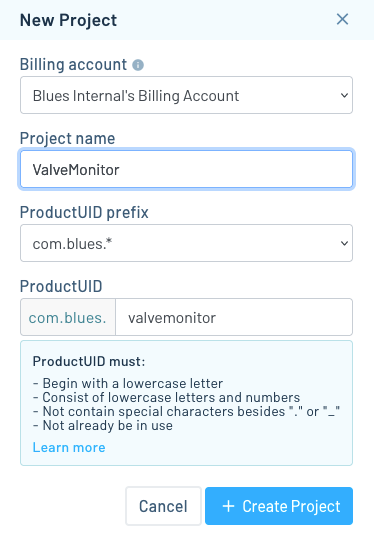
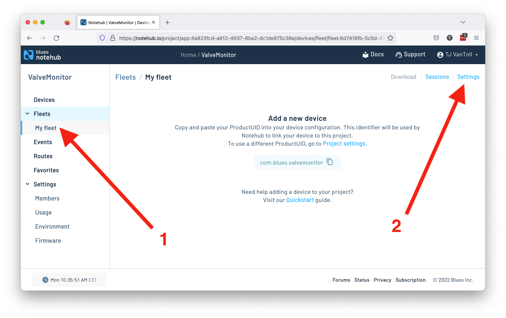

# Valve Monitor

Monitor and control the open/closed state of a valve, and measure liquid flow state.

<!-- TODO: Put Hackster banner image here once we have it. -->

To run this project yourself you’ll need to:

* [Configure Notehub](#notehub).
* [Purchase and assemble the necessary hardware](#hardware).
* [Flash the project’s firmware](#firmware)
* [Run the project’s web application](#web-application).

## Notehub

The Indoor Floor-Level Tracker runs on top of Notehub. As such, to run this sample
you’ll need to create a Notehub account, start a new Notehub project, and configure
a handful of environment variables.

### Creating a New Project

1. Sign up for a free [Notehub](https://notehub.io) account, if you don’t have one
already.
1. Click the blue **Create Project** button in the top-right corner of the screen.
1. Give the project a name, such as “ValveMonitor”, and then click the next
**Create Project** button.

### Configuring Environment Variables

The Valve Monitor project uses [environment variables](https://dev.blues.io/guides-and-tutorials/notecard-guides/understanding-environment-variables/)
for storing project settings that need to be shared and synchronized across
devices.

You can set this project’s environment variables at the [fleet](https://dev.blues.io/reference/glossary/#fleet)
level or device level, where fleet-level variables affect all devices in the
fleet, and device-level variables are specific to an individual device.

Notehub creates an initial fleet for you when you start a new project, and you
can use that for setting your initial variables.

1. Navigate to your fleet in the navigation menu, and then click the **Settings**
link.

1. Click the **Environment** tab.
1. Scroll down to the **Fleet environment variables** heading, and define the
four variables below.
    1. `flow_rate_alarm_threshold_max`: (number) The maximum expected flow rate from your
    device, in mL / min. Flow-rate readings over this amount will trigger an alarm.
    1. `flow_rate_alarm_threshold_min`: (number) The minimum expected flow rate from your
    device, in mL / min. Flow-rate readings under this amount will trigger an alarm.
    1. `monitor_interval`: (integer) How often to take readings from the device’s flow-rate
    monitor, in seconds.
1. With all three defined, click the blue **Save** button.

With this your Notehub backend is fully configured, and you’re ready to start
setting up your hardware.

## Hardware

The following hardware is required to run the Valve Monitor project.

* A [Blues Starter Kit](https://shop.blues.io/collections/blues-starter-kits).
* A flow meter, such as this [GREDIA Quick Connect Water Flow Sensor](https://www.amazon.com/dp/B07RD4JXLY/ref=cm_sw_r_api_i_652XGBZAS7RN06BSSHRT_0).
* A solenoid valve, such as this [DIGITEN Inlet Feed Water Solenoid Valve](https://www.amazon.com/dp/B016MP1HX0/ref=cm_sw_r_api_i_6PW0RXB6569QB10RY51V_0).
  * If you do get the DIGITEN valve, make sure you also have [spade cables](https://www.amazon.com/dp/B08F784R9W/ref=cm_sw_r_api_i_3GMNPATKY77AAC247J9S_0)
  for connecting the valve to power.
* Tubing for moving liquid throughout your hardware, such as this
[1/4 OD silicone tubing](https://www.amazon.com/dp/B09H4RNGGG/ref=cm_sw_r_api_i_H171CC4D2EDPPM23X8A4_0?th=1).
* A power breakout, such as this [HiLetgo power breakout](https://www.amazon.com/dp/B07X9SQKL6/ref=cm_sw_r_api_i_5JYD92FH343E04VKPMR5_0)
for supplying correct voltage to this project’s various components.
* An I2C level shifter, such as [this one from HiLetgo](https://www.amazon.com/dp/B07F7W91LC/ref=cm_sw_r_api_i_FZPJ7VRY2329ARNQ3W22_0),
because ???????????????????????????????????????
* A MOSFET driver, such as this one from [HiLetgo](https://www.amazon.com/dp/B01I1J14MO/ref=cm_sw_r_api_i_8YRY25Q7R9HGV1ZPHERP_0),
because ???????????????????????????????????????

Additionally you may wish to also use the following.

* (Optional) A manual valve such as this [YZM Quick Connector](https://www.amazon.com/dp/B077H2JWSZ/ref=cm_sw_r_api_i_38J4S2VWFKAZBVEA8GCM_0)
to make it easier to start/stop the flow of liquid while testing.
* (Optional) An enclosure for your hardware such as this
[outdoor-friendly enclosure from Sixfab](https://sixfab.com/product/raspberry-pi-ip54-outdoor-iot-project-enclosure/).

Once you have all of your hardware you’ll next need to assemble the pieces.
As a start, complete the [Notecard and Notecarrier-F quickstart guide](https://dev.blues.io/quickstart/notecard-quickstart/notecard-and-notecarrier-f/)
for a detailed look at how to assemble your Blues Starer Kit for this project.

<!-- TODO: Image of the hardware build start -->

<!-- TODO: Final image of the build -->

## Firmware

## Web Application
